# Pliego de condiciones del Sistema Vectorial SV

**Autor:** Juan Antonio Lloret Egea  
**Versión:** 1.3 versión integrada para PubPub  
**Estado:** versión integrada con diagramas e imágenes, lista para publicación en PubPub  
**Naturaleza:** documento público de consolidación, remisión y gobierno de fase  
**Ámbito:** Sistema Vectorial SV

## Resumen

El presente pliego de condiciones del Sistema Vectorial SV tiene por objeto reunir, ordenar y exponer en una sola pieza pública, académica y sistemática el marco de comprensión, desarrollo y control del proyecto en su fase actual. No sustituye a los documentos canónicos ni a las piezas especializadas ya publicadas, sino que las organiza, las jerarquiza y las hace inteligibles para terceros sin pérdida de rigor. Su función es doble: por un lado, ofrecer una vía de acceso solvente al sistema para investigadores, desarrolladores y lectores cualificados; por otro, fijar con claridad el régimen de dependencia entre doctrina, álgebra, interfaces, lenguaje de computación y gobierno prudencial del desarrollo.

El documento se apoya en un conjunto de fuentes primarias ya consolidadas, que aquí se denominan conjuntamente **Pentateuco del Sistema Vectorial SV**, junto con las piezas complementarias necesarias para su correcta interpretación. A partir de ellas, el pliego establece qué fija cada bloque, qué no fija, cómo se articula con los demás y bajo qué criterio de prevalencia debe resolverse cualquier aparente tensión. En consecuencia, este texto no se presenta como manifiesto, ni como mera guía de lectura, ni como duplicación editorial del corpus previo, sino como un instrumento de consolidación pública de alta trazabilidad.

---

## 1. Naturaleza, objeto y límites del pliego

### 1.1. Naturaleza

Este pliego es un **documento público de consolidación estructurada**. Su misión no consiste en fundar de nuevo el Sistema Vectorial SV, ni en reabrir decisiones ya fijadas, ni en absorber en una sola pieza todo el corpus previo. Su estatuto es subordinado respecto de la doctrina y de las fuentes primarias del proyecto, pero directivo en lo que respecta a la comprensión ordenada del sistema y a la exposición de su estado actual de fase.

En consecuencia, el pliego debe leerse como una pieza de segundo orden con autoridad expositiva y organizativa, no como una instancia doctrinal soberana. Su valor reside en reunir lo disperso sin falsearlo, mostrar la arquitectura de conjunto sin simplificarla en exceso y permitir que el lector comprenda qué pertenece al núcleo del sistema, qué pertenece a su especificación operativa, qué pertenece a su implementación de referencia y qué pertenece al régimen prudencial de su desarrollo.

Desde el punto de vista epistemológico, este pliego organiza y expone un corpus primario, pero no pretende constituir por sí solo una certificación externa independiente de ese corpus. Su verificabilidad pública depende de la posibilidad de contrastar cada afirmación relevante con las fuentes primarias de mayor rango a las que remite.

### 1.2. Objeto

El objeto del pliego es fijar, para la fase actual del proyecto, los siguientes extremos:

1. La **jerarquía documental efectiva** del Sistema Vectorial SV.  
2. La **estructura material** del corpus, agrupada en bloques inteligibles.  
3. El contenido y función de cada gran capa del sistema:
   - compilador doctrinal y célula meta,
   - álgebra, matemática y semántica,
   - programa de interfaces,
   - lenguaje de computación,
   - guía práctica y reglas prudenciales.
4. El **criterio de continuidad** del desarrollo actual, sin reabrir indebidamente cuestiones ya fijadas.
5. La preparación del terreno para un **anexo duro y literal de normas, reglas, principios y prohibiciones**, que no se cierra todavía en este borrador.

### 1.3. Definición mínima orientativa del objeto del sistema

A efectos de lectura pública inicial, una **célula SV** puede describirse como una configuración finita de estados sobre el alfabeto ternario canónico `{0,1,U}`, con tamaño estructural restringido por la ley `n = b²`, `b ≥ 3`, y sometida a una clasificación fuerte gobernada por el umbral `T(n)=⌊7n/9⌋`. En este marco, `0` y `1` representan clases determinadas, mientras que `U` conserva formalmente la indeterminación actual cuando no existe base suficiente para clausurar legítimamente la célula en una de las dos clases fuertes. La representación visible propia de esa célula es, en general, una poligonal polar cerrada, pero esa visibilidad no sustituye a su ontología algebraico-semántica primaria.

### 1.4. Límites

Este documento no pretende:

- sustituir a los **Fundamentos algebraico-semánticos del Sistema Vectorial SV**;
- sustituir a la serie **Álgebra de composición intercelular del marco SV**;
- convertir piezas prospectivas o directrices operativas en doctrina superior;
- cerrar por sí solo futuras ampliaciones del sistema;
- ni agotar el detalle técnico de cada publicación, repositorio o artefacto.

Tampoco tiene por finalidad describir exhaustivamente el proceso interno de trabajo, los registros de calidad o la cocina organizativa del proyecto. Allí donde el detalle fino pertenezca a una pieza primaria, este pliego remitirá a ella de forma expresa y no intentará duplicarla innecesariamente.

Por la misma razón, las afirmaciones de estado incluidas en este pliego —por ejemplo, cierre de primer nivel, cierre temporal de un frente o suficiencia local de una solución formal— deben leerse como afirmaciones contrastables con el corpus y no como autoaval infalsable. Allí donde resulte útil para la recepción externa, el pliego indicará qué tipo de evidencia contrariaría tales afirmaciones.

---

## 2. Jerarquía documental y criterio de prevalencia

### 2.1. Principio general de jerarquía

El Sistema Vectorial SV no puede ser leído como una suma indiferenciada de textos. Sus documentos no tienen todos el mismo rango ni la misma función. Una parte del corpus fija la base doctrinal y algebraico-semántica del sistema; otra parte despliega formalmente esa base en series específicas; otra parte la traduce a interfaces o a lenguaje de computación; y otra parte establece criterios prudenciales de gobierno y adopción.

Por ello, toda lectura rigurosa del proyecto debe respetar un **criterio de prevalencia**. En caso de tensión aparente entre documentos, prevalecerá siempre la pieza de mayor rango normativo sobre la de rango subordinado. Del mismo modo, una pieza integradora no podrá utilizarse para corregir silenciosamente la fuente específica de la que depende, y un texto operativo no podrá presentarse como si tuviera capacidad de refundación doctrinal.

### 2.2. Niveles de la jerarquía

A los efectos de este pliego, la jerarquía del sistema queda ordenada en cinco niveles:

#### Nivel I. Doctrina y cadena normativa principal

Corresponde a las piezas que fijan el estatuto ontológico, algebraico-semántico y normativo básico del Sistema Vectorial SV. En este nivel se sitúan, con primacía especial, los **Fundamentos algebraico-semánticos del Sistema Vectorial SV** y las piezas doctrinales de rango equivalente o explícitamente superior reconocidas por el propio corpus.

#### Nivel II. Desarrollo algebraico y especificación estructural

Corresponde a la serie de documentos que despliegan formalmente la composición intercelular, la gramática de composición, el régimen de sucesos, la transducción, la consulta, el análisis discreto y las piezas transversales subordinadas sobre la U y otras cuestiones afines. Este nivel no crea un sistema distinto, sino que desarrolla el ya fijado en el nivel anterior.

#### Nivel III. Interfaces y lenguaje de computación

Corresponde a las capas que traducen el sistema a formas operativas especializadas:
- el **Programa de interfaces del Sistema Vectorial SV**;
- el **SVP Playground**;
- la **Gramática superficial mínima**;
- la **IR canónica y sistema de bienformación**;
- y el estado vigente de N4/Uso y del núcleo del lenguaje.

Este nivel debe permanecer siempre subordinado a la doctrina y a la especificación algebraico-semántica superior.

#### Nivel IV. Gobierno prudencial, metodológico y editorial

Corresponde a la **Guía práctica del conocimiento profundo y la crítica de la razón pura**, así como a las reglas de despliegue, actualización doctrinal, adopción prudencial, resistencia al cambio y directrices operativas de proyecto. Este nivel no sustituye a la base ontológica del sistema, pero gobierna su desarrollo, su prudencia y su disciplina interna.

#### Nivel V. Registros, actas y control de fase

Corresponde al nivel de trazabilidad técnica y registral del proyecto. Su función es documental y de control; no es doctrina soberana, aunque puede ser decisivo para verificar el estado de una fase, la coherencia entre artefactos o la vigencia de una decisión.

### 2.3. Regla de prevalencia

La regla que debe regir todo el pliego es la siguiente:

> Un nivel inferior no corrige silenciosamente a uno superior.  
> Una pieza integradora no desplaza a la fuente específica de la que depende.  
> Una guía prudencial no sustituye a la ontología del sistema.  
> Una implementación no funda la semántica que dice servir.

Toda pieza de cierre, síntesis o integración se leerá siempre por remisión a la fuente específica de mayor rango de la que dependa.

Esta regla de prevalencia no es solo editorial; es una condición de salud epistemológica del proyecto.

---

## 3. El Pentateuco del Sistema Vectorial SV

### 3.1. Finalidad de la denominación

A los efectos de este pliego, se adopta la denominación **Pentateuco del Sistema Vectorial SV** para designar el conjunto de grandes bloques documentales que estructuran el proyecto y que, consultados en su debido orden y jerarquía, permiten comprender su funcionamiento, su arquitectura y su régimen de desarrollo sin necesidad de nombrarlos repetidamente en cada pasaje.

La finalidad de esta denominación no es sacralizar un número ni clausurar el crecimiento del corpus, sino disponer de una **unidad canónica de remisión** que simplifique la exposición pública y permita al lector reconocer de inmediato el núcleo bibliográfico del proyecto.

### 3.2. Composición del Pentateuco

El Pentateuco del Sistema Vectorial SV queda compuesto, para esta fase, por los siguientes cinco bloques:

#### I. Compilador doctrinal y célula meta SV(9,3)-IA

Bloque de compilación doctrinal y arquitectónica de alto nivel, orientado a cerrar el arco entre composición formal, célula meta, gobernanza algebraica, aprendizaje subordinado y reglas fuertes del proyecto.

#### II. Álgebra, matemática y semántica del Sistema Vectorial SV

Bloque central del sistema. Incluye:
- los **Fundamentos algebraico-semánticos**;
- la serie **Álgebra de composición intercelular del marco SV**;
- las piezas transversales subordinadas sobre la **U**;
- las piezas auxiliares geométricas y dinámicas;
- y la pieza de **semántica auditada** como cierre integrador del bloque.

#### III. Programa de interfaces del Sistema Vectorial SV

Bloque de interfaces primarias del sistema. Comprende, al menos en esta fase, los carriles de:
- semántica,
- visión,
- motricidad,
- y la lógica de continuidad del frente básico bajo coordinación superior.

#### IV. Lenguaje de computación del Sistema Vectorial SV

Bloque operativo-formal del lenguaje. Comprende:
- la superficie pública del **SVP Playground**;
- la **Gramática superficial mínima v0.1**;
- la **IR canónica v0.2 y sistema de bienformación**;
- y el estado vigente del núcleo y del uso.

#### V. Guía práctica del conocimiento profundo y la crítica de la razón pura

Bloque de gobierno prudencial y normativo del desarrollo. Su lectura exige distinguir entre reflexión no normativa, fundamentos fuertes, prospectiva, directrices operativas y reglas inamovibles.

### 3.3. Orden de lectura

El orden correcto de lectura del Pentateuco no es arbitrario. A efectos de comprensión rigurosa, debe seguirse esta secuencia:

1. compilador doctrinal y célula meta;  
2. álgebra, matemática y semántica;  
3. programa de interfaces;  
4. lenguaje de computación;  
5. guía práctica.

Este orden no implica que la Guía sea menos importante, sino que su correcta interpretación depende de que el lector sepa previamente qué es el sistema, cómo se compone, cómo entra en el mundo, cómo se usa y cómo se implementa.

Se trata, por tanto, de un **orden pedagógico de lectura** y no de una regla de prevalencia normativa alternativa a la jerarquía fijada en el apartado 2.

---

## 4. Función del pliego respecto del Pentateuco

El pliego no sustituye al Pentateuco. Su función es otra: **servir de puerta de entrada rigurosa al Pentateuco y de mapa de navegación entre sus bloques**.

Por ello, cada capítulo del presente documento seguirá una misma disciplina:

- identificará la función real del bloque correspondiente;
- distinguirá entre núcleo duro y materiales auxiliares;
- señalará qué piezas tienen valor fundacional, cuáles valor integrador y cuáles valor complementario;
- y remitirá al lector a las fuentes primarias cuando el detalle técnico o doctrinal así lo exija.

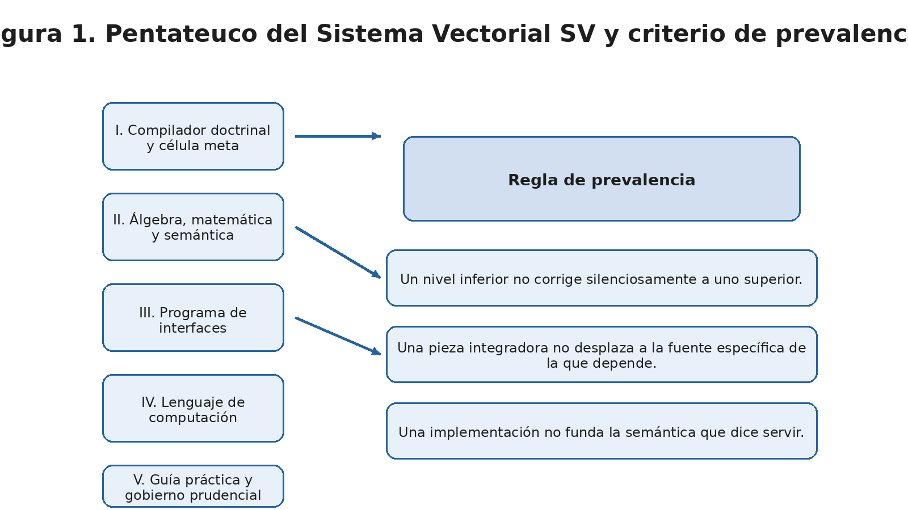

*Figura 1. Diagrama general del Pentateuco y criterio de prevalencia.*

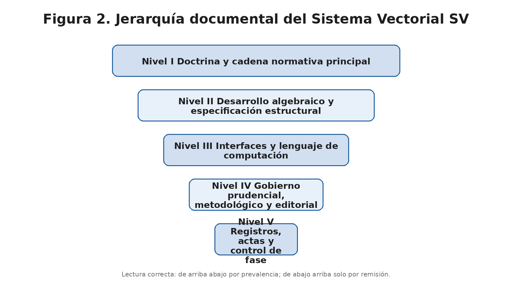

*Figura 2. Diagrama de jerarquía documental del Sistema Vectorial SV.*

---

## 5. Compilador doctrinal y célula meta SV(9,3)-IA

### 5.1. Función del bloque

El bloque **Compilador doctrinal y célula meta SV(9,3)-IA** ocupa una posición singular dentro del Pentateuco. No actúa como fundamento supremo del sistema, pero tampoco puede leerse como una mera recapitulación editorial. Su función real es la de **pieza de compilación doctrinal y arquitectónica de alto nivel**, orientada a cerrar una fase del proyecto y a exponer, en una sola superficie inteligible, la relación entre composición formal, célula meta, gobernanza algebraica, aprendizaje subordinado y reglas de proyecto.

La jerarquía correcta de esta pieza debe quedar expresamente fijada. La autoridad normativa superior sigue residiendo en los **Fundamentos algebraico-semánticos del Sistema Vectorial SV**, y no en esta pieza compiladora. En consecuencia, el pliego debe servirse de este bloque como **superficie de ordenación y de explicitación de reglas fuertes**, pero nunca como sede para corregir o reinterpretar silenciosamente la fuente doctrinal superior.

### 5.2. Qué fija realmente

Leído en su rango correcto, este bloque fija al menos cinco cosas de primer orden.

En primer lugar, consolida la idea de que el proyecto no puede reducirse a una célula aislada, ni a un único algoritmo, ni a una sola implementación, sino que exige una **arquitectura de composición gobernada algebraicamente**. Esa arquitectura mantiene la primacía de la semántica explícita sobre cualquier mecanismo opaco de aprendizaje o inferencia.

En segundo lugar, el bloque da una visibilidad singular a la **célula meta SV(9,3)-IA** como superficie de control y experimentación exhaustiva. En este contexto, “exhaustivo, sin muestreo” significa que se trabaja sobre la enumeración completa del espacio finito `3^9 = 19.683` configuraciones posibles de la célula meta considerada, y no sobre una selección parcial de casos. La pieza de semántica auditada confirma además que ese régimen se ejecuta bajo **tres vallas**: licitud doctrinal, código exacto y clausura con calidad, cuya definición operativa se encuentra precisamente en esa pieza de semántica auditada.

En tercer lugar, el bloque permite hacer visibles reglas de proyecto de gran importancia transversal: invariancia semántica, subordinación de la **red neuronal convolucional (CNN)** al álgebra, polígono inmutable, U como honestidad algebraica, separación entre documento canónico y artefacto técnico asociado, y protocolo de actualización doctrinal.

En cuarto lugar, este bloque ofrece una formulación muy útil de continuidad entre **corpus doctrinal**, **artefacto técnico** y **publicación pública**. Varios invariantes estructurales ya encuentran expresión explícita en **N4/Uso del Lenguaje SV** a través de la **IR canónica v0.2**, aunque la tesis del trabajo no dependa de una versión concreta del lenguaje.

En quinto lugar, el bloque deja ver que el Sistema Vectorial SV ha alcanzado ya un punto en el que puede hablarse de **cierre de primer nivel** sin confundir ese cierre con la clausura total del proyecto. En este pliego, esa expresión designa la disponibilidad coordinada de célula, composición, reevaluación, entrada legítima del mundo, consulta y análisis discreto, sin implicar clausura total del sistema ni de sus extensiones futuras.

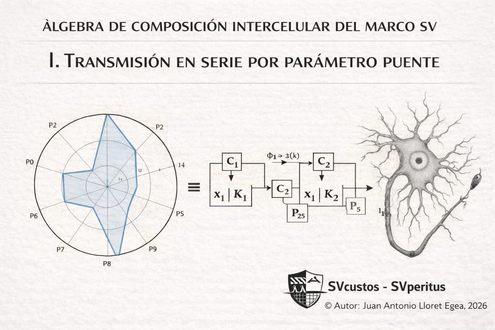

*Figura 14. Composición intercelular y transmisión en serie por parámetro puente como imagen de la capa de compilador de células.*

### 5.3. Qué no fija

El bloque del compilador doctrinal y célula meta no funda la ontología primaria del sistema; tampoco sustituye a los Fundamentos, ni clausura por sí solo la gramática compositiva, ni agota el régimen de interfaces, ni decide en última instancia el diseño del lenguaje. Su función es **compilar, ordenar, hacer visible y reforzar**.

### 5.4. Aportación al sistema completo

La aportación principal de este bloque al sistema completo es **darle conciencia de conjunto**. Allí donde otras piezas fijan una ontología, una gramática o una interfaz, el compilador doctrinal muestra cómo esos elementos pueden ser leídos como una arquitectura coherente de fase.

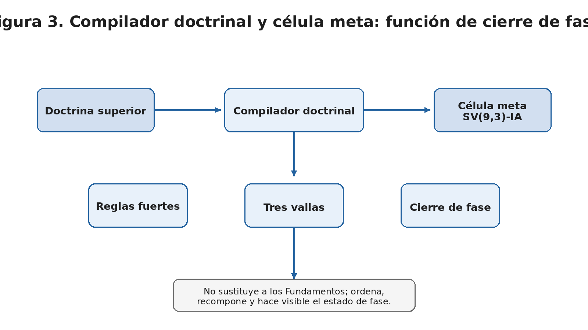

*Figura 3. Diagrama del bloque compilador doctrinal y célula meta: doctrina, célula meta, reglas fuertes y cierre de fase.*

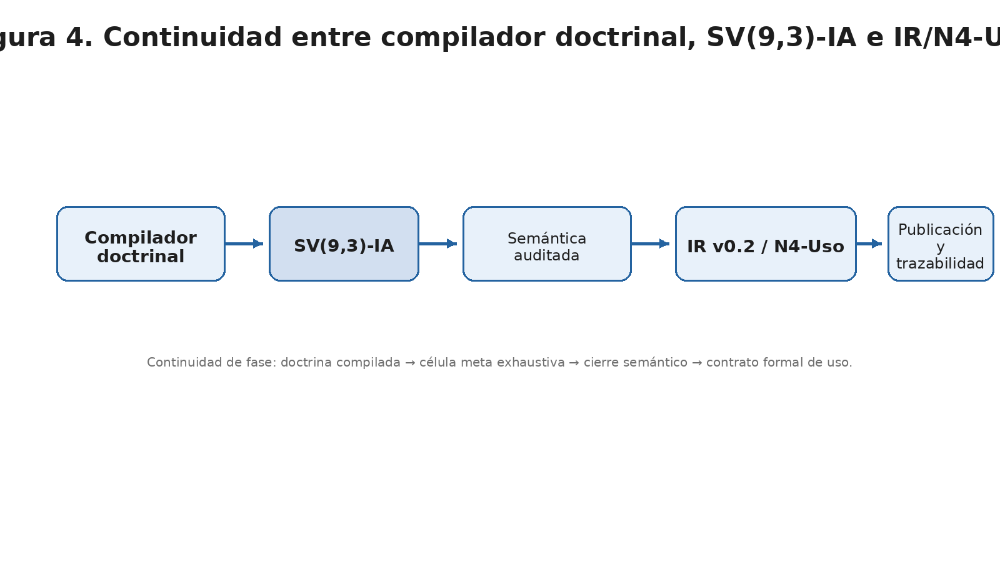

*Figura 4. Diagrama de continuidad entre compilador doctrinal, SV(9,3)-IA, IR/N4-Uso y publicaciones asociadas.*

---

## 6. Álgebra, matemática y semántica del Sistema Vectorial SV

### 6.1. Posición del bloque en el sistema

El bloque algebraico-semántico constituye el **núcleo duro del Sistema Vectorial SV**. Si el compilador doctrinal ordena, el bloque algebraico funda; si el lenguaje implementa, este bloque legitima; si las interfaces especializan, este bloque conserva la estructura. Su función es fijar qué es una célula SV, cómo se clasifica, cómo se compone, cómo cambia, cómo admite entrada del mundo, cómo puede ser consultada, qué permanece invariante y cómo puede analizarse sin abandonar el dominio discreto propio del sistema.

### 6.2. Fundamentos algebraico-semánticos

El punto de arranque de este bloque es la fijación de la **ontología primaria** del SV. La célula exacta no nace como un espacio vectorial clásico ni como una variable numérica continua, sino como una configuración finita sobre el alfabeto ternario canónico. La convención semántica `0/1/U`, junto con su codificación visible radial, el umbral `T(n)=⌊7n/9⌋`, el estatuto epistémico de la `U`, la representación poligonal polar cerrada y la distinción entre plano exacto y plano auxiliar constituyen el corazón de esa fundación. Aquí `T(n)=⌊7n/9⌋` funciona como umbral canónico de clasificación fuerte de la célula SV: determina cuándo una mayoría cualificada de `0` o de `1` basta para clausurar el estado global en una de las dos clases fuertes. A ello se añade un conjunto de invariantes constitutivos: primacía humana —entendida como reserva irrenunciable de la decisión final al agente humano—, exclusión de probabilidad opaca como fundamento decisional, separación entre evaluación y composición y exigencia de trazabilidad en la intervención sobre la `U`.

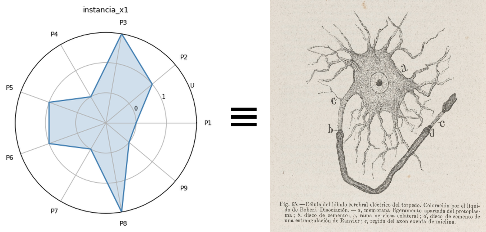

*Figura 13. Célula SV y representación poligonal como imagen de base del bloque algebraico.*

### 6.3. La serie I–VI de composición intercelular

Sobre esa base, la serie **Álgebra de composición intercelular del marco SV** despliega la estructura formal del sistema en seis grandes movimientos.

El **Documento I** demuestra que el marco SV admite no solo células aisladas, sino **sistemas dirigidos de células acopladas**, en los que una salida tipada puede transportarse a una célula sucesora como parámetro puente, sin pérdida de trazabilidad, sin duplicación de evaluación y sin cesión de soberanía normativa a sistemas opacos.

El **Documento II** eleva la serie por puente a una **gramática tipada de patrones compositivos**. La tesis aquí es decisiva: el SV no posee una única ley de composición entre células, sino una gramática de patrones condicionada por una **relación semántica previa** que debe declararse antes de la ejecución.

El **Documento III** fija que el sistema cambia por **sucesos**, no por tiempo. La trayectoria es una sucesión ordenada de reevaluaciones desencadenadas por sucesos pertenecientes al horizonte declarado de la arquitectura; los frames pasados son inmutables; y la trayectoria es append-only.

El **Documento IV** resuelve el problema de la entrada legítima del mundo: captura, admisibilidad, transducción y parametrización. El mundo no habla ternario; el sistema debe disciplinar su entrada mediante dominios observacionales tipados, funciones de captura, criterios de admisibilidad y transductores explícitos, sin fabricar certeza cuando la cadena observacional es deficiente.

El **Documento V** formaliza el primer nivel funcional de uso del sistema: invariantes, dominios especializados, agentes y consulta. La especialización queda definida como **instanciación, no modificación**, y la consulta como **lectura estructurada, no inferencia opaca**.

El **Documento VI** añade las herramientas de análisis propias del dominio discreto: diferencias finitas, taxonomía de estabilización y ciclo, funciones generatrices, herramientas sobre secuencias y álgebra del grafo compositivo.

### 6.4. Piezas transversales y auxiliares del bloque

El cierre del bloque algebraico no depende únicamente de los Fundamentos y de la serie I–VI. Hay además un conjunto de piezas cuya función no es refundar el sistema, sino **aclarar transversalmente signos, límites o laboratorios auxiliares**.

La más importante es **Origen doctrinal, definición y alcance de la U en el Sistema Vectorial SV**. Su estatuto correcto es el de **especificación transversal subordinada**: no reabre el sistema, pero fija con enorme precisión qué es la `U`, qué no es, por qué su presencia es una exigencia de honestidad algebraica, cuáles son sus vías legítimas de resolución, qué significa su reapertura y cómo debe proyectarse al lenguaje sin degradarse a nulidad encubierta. Desde una perspectiva comparativa amplia, la `U` comparte con otros regímenes trivaluados la función de preservar formalmente la indeterminación, pero en el SV no se reduce a nulidad implementativa, probabilidad o valor desconocido genérico: queda sometida a reglas explícitas de persistencia, resolución, reapertura y trazabilidad.

A ella se suman dos laboratorios complementarios. El primero es la **carta espacial auxiliar** de elevación de `U` en `ℝ³`, que debe leerse siempre como **carta auxiliar** y no como nueva ontología del sistema. El segundo es la pieza sobre **transiciones estructurales y trayectorias de la U**, útil para hacer inteligible la dimensión dinámica de la indeterminación, pero de rango claramente inferior al del régimen formal de sucesos ya fijado en el Documento III.

### 6.5. Semántica auditada como pieza de cierre integrador

El cierre de este bloque lo proporciona, en esta fase, **Semántica auditada en el Sistema Vectorial SV: formalización estructural basada en sucesos, transducción ternaria y clausura trazable**. Su importancia radica en que no introduce un fundamento nuevo, sino que **recompone el bloque entero** en una sola arquitectura semántica auditada: suceso, captura, admisibilidad, transducción, consulta, `U`, geometría auxiliar, clausura y relación con el Lenguaje SV. Su función es integradora y de cierre expositivo de fase; en caso de tensión, prevalecen siempre las piezas específicas de mayor rango sobre las que se apoya. Este cierre no desplaza los documentos específicos de sucesos, transducción, consulta o U, sino que los recompone.

### 6.6. Qué fija el bloque y qué no fija

En conjunto, este bloque fija:

- la ontología primaria de la célula SV;  
- la convención semántica canónica;  
- la representación visible legítima;  
- la clasificación determinista;  
- la gramática de composición;  
- el régimen de sucesos y reevaluación;  
- la entrada legítima del mundo;  
- la especialización, la consulta y los invariantes;  
- la analítica discreta propia del sistema;  
- el estatuto transversal de la `U`;  
- y el cierre semántico auditado de fase.

No fija, en cambio, una teoría probabilística, una ontología continua, una teoría multiagente plena, una firma cerrada universal para `Comp`, una axiomática total de todas las ampliaciones futuras ni una arquitectura cuaternaria ya vigente.

### 6.7. Aportación al sistema completo

La aportación del bloque algebraico-semántico al sistema completo es decisiva: **sin él no habría Sistema Vectorial SV**, sino solo superficies derivadas. Si el pliego aspira a ser el documento desde el cual un tercero pueda comprender el sistema sin entrar todavía en todos los detalles, este bloque será necesariamente su centro de gravedad.

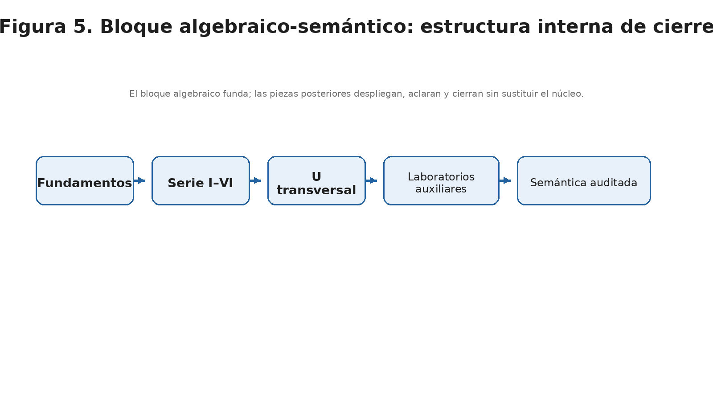

*Figura 5. Diagrama del bloque algebraico-semántico: Fundamentos → I–VI → U transversal → laboratorios auxiliares → semántica auditada.*

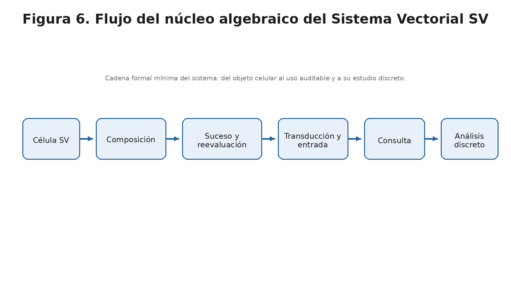

*Figura 6. Diagrama de flujo del núcleo algebraico: célula → composición → suceso → transducción → consulta → análisis discreto.*

---

## 7. Programa de interfaces del Sistema Vectorial SV

### 7.1. Función del bloque

El **Programa de interfaces del Sistema Vectorial SV** constituye la capa por la que el sistema deja de presentarse solo como estructura algebraico-semántica abstracta y empieza a desplegarse como **régimen de interfaz primaria**. Su función no es reemplazar el núcleo algebraico, sino **hacerlo comparecer en carriles formalmente especializados** que permiten abrir el sistema hacia dominios de relación con el mundo y con el usuario sin romper su gramática constitutiva. En el estado actual de fase, este programa ha quedado materializado ya en varios carriles reconocibles: **semántica**, **visión**, **motricidad**, **observacional** y **olfato**. No todos comparten el mismo grado de madurez ni idéntica organización interna, pero todos deben leerse como piezas subordinadas del mismo programa.

### 7.2. Estructura común del programa

El programa de interfaces ha dejado ver ya un **patrón material común**. El directorio específico del programa declara su finalidad como programa de interfaces del SV y establece una disciplina compartida de carriles con `README.md` rector, trazabilidad documental y organización interna suficiente. Esa continuidad de criterio no exige identidad rígida de subcarpetas: según su estado editorial real, un carril puede articularse mediante `manuscrito`, `figuras`, `codigo`, `laboratorio`, `meta`, `portada` o archivos principales en la raíz del propio carril.

Esta homogeneidad permite reconocer que cada interfaz legítima del sistema debe disponer, como mínimo, de:
- una **formulación manuscrita** de su objeto;
- una **capa visual o diagramática** suficiente;
- un **bloque técnico verificable o demostrativo** cuando proceda;
- y una **capa meta** de trazabilidad documental.

### 7.3. Semántica como interfaz

Dentro del programa, **semántica** no debe leerse como repetición del núcleo algebraico-semántico, sino como su **despliegue interfaz**. El cierre más fuerte de este carril lo aporta la pieza **Semántica auditada en el Sistema Vectorial SV**, que formaliza una capa semántica de entrada legítima, conservación honesta de la indeterminación y clausura trazable.

### 7.4. Visión como interfaz

El carril de **visión** despliega la capacidad del sistema para **articular una interfaz visual estructurada**, anclada en la representación poligonal y en la inteligibilidad geométrica del marco SV. Su papel en el pliego será el de mostrar que el SV no solo puede formularse algebraicamente, sino también **comparecer como arquitectura de visualización rigurosa y no ornamental**.

### 7.5. Motricidad como interfaz

El carril de **motricidad** demuestra que el sistema puede extenderse hacia una **interfaz de exposición y desplazamiento estructural** sin necesitar, en esta fase, una clausura total sobre cinemática, actuadores o control físico. Su valor en el pliego es mostrar que un nuevo carril puede abrirse legítimamente si mantiene alcance claro, manuscrito serio, soporte técnico verificable y delimitación fuerte de lo que queda todavía fuera de fase.

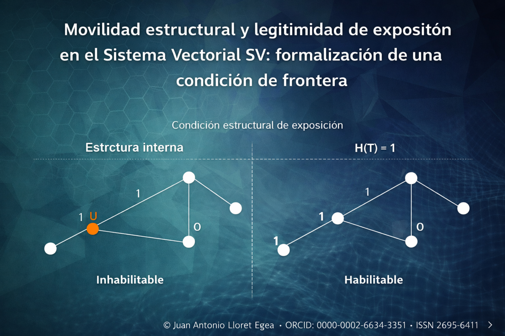

*Figura 16. Imagen representativa del bloque de interfaces: movilidad estructural y legitimidad de exposición en el Sistema Vectorial SV.*

### 7.6. Cierre temporal del frente básico

A efectos del presente pliego, el **Programa de interfaces del Sistema Vectorial SV** puede considerarse **temporalmente cerrado** en su frente básico. Esta clausura no significa agotamiento absoluto del programa, ni cierre definitivo de todos los sentidos o interfaces futuras, sino **cierre suficiente de fase del frente básico, sin perjuicio de aperturas futuras legítimas**. La afirmación quedaría refutada, dentro del propio régimen de este pliego, si se acreditara que alguno de los carriles materializados carece todavía de los componentes mínimos de manuscrito, trazabilidad y soporte técnico o si la continuidad de criterio del programa dejara de sostenerse de forma coherente entre los carriles ya abiertos.

### 7.7. Qué fija y qué no fija este bloque

Este bloque fija:
- que el SV dispone ya de un **frente básico de interfaces primarias**;
- que ese frente se articula en carriles formales, no en módulos improvisados;
- que semántica, visión, motricidad, observacional y olfato constituyen ya un patrón materializado de interfaces subordinadas;
- y que el programa puede cerrarse temporalmente en fase sin agotar el crecimiento futuro.

No fija, en cambio:
- un catálogo completo y definitivo de todas las interfaces posibles;
- una teoría ya cerrada de personalidad o afectividad;
- ni una clausura total del frente básico para todo desarrollo posterior.

### 7.8. Criterios de apertura legítima de nuevos carriles

Sin perjuicio del cierre temporal de fase aquí declarado, la apertura legítima de un nuevo carril de interfaz exigirá, como mínimo, cinco condiciones acumulativas: **alcance claro**, **manuscrito serio y delimitado**, **soporte técnico verificable cuando proceda**, **delimitación fuerte de lo que queda fuera de fase** y **compatibilidad expresa con la jerarquía doctrinal y con el patrón común del programa de interfaces**.

Estas condiciones no constituyen todavía un reglamento exhaustivo de crecimiento del bloque, pero sí fijan un umbral mínimo de legitimidad. En consecuencia, ninguna intuición futura de interfaz debería presentarse como carril del sistema mientras no satisfaga ese umbral y no pueda integrarse sin tensión ilegítima en el frente básico ya materializado.

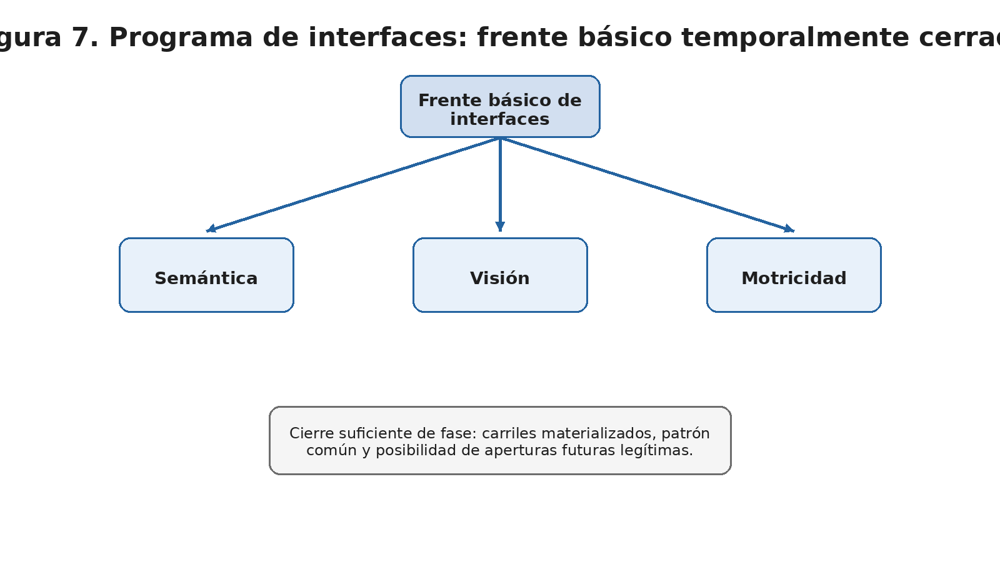

*Figura 7. Diagrama del Programa de interfaces: semántica, visión y motricidad como carriles del frente básico.*

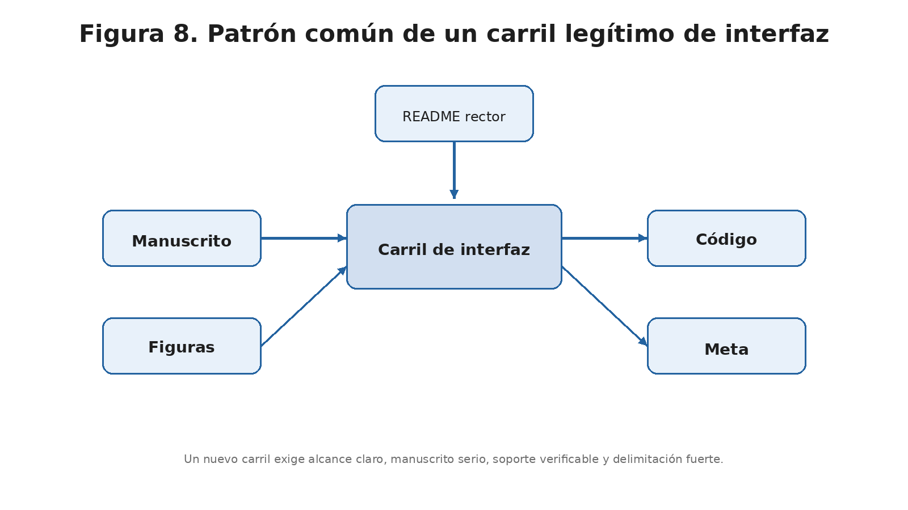

*Figura 8. Diagrama del patrón de carril de interfaz: manuscrito, figuras, código y meta.*

---

## 8. Lenguaje de computación del Sistema Vectorial SV

### 8.1. Función del bloque

El **Lenguaje de computación del Sistema Vectorial SV** es la capa en la que el sistema deja de ser solo corpus doctrinal y estructural para adquirir una **forma computacional canónica, austera y disciplinada**. Su función no es inventar una semántica nueva, sino **servir la ya fijada** mediante una superficie declarativa, una representación intermedia normalizada y un régimen de bienformación que haga posible el *lowering*, la validación, la serialización y, en su horizonte, un **backend soberano**. Se entiende aquí por *lowering* el descenso controlado desde la superficie declarativa del lenguaje a la IR canónica; y por backend soberano, una implementación de ejecución propia del lenguaje SV que no dependa de un intérprete externo generalista para su semántica nuclear.

### 8.2. Superficie pública: SVP Playground

La cara pública actual del bloque es el **SVP Playground**, que se presenta como superficie de compilación del lenguaje SVP y enlaza explícitamente con **Repositorio**, **Gramática v0.1**, **IR v0.2** y **Doctrina**. La promesa operativa visible del Playground es deliberadamente modesta y, por ello mismo, correcta: parsear el código `.svp` y compilarlo a **IR v0.2**.

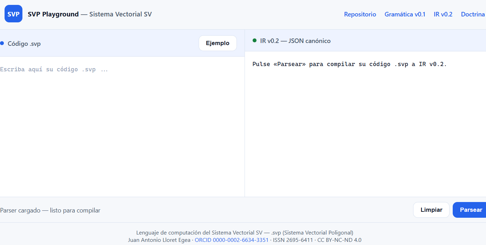

*Figura 15. Superficie pública actual del compilador: SVP Playground — Sistema Vectorial SV.*

### 8.3. Gramática superficial mínima v0.1

La **Gramática superficial mínima v0.1** fija la cara declarativa del DSL canónico. Su aportación principal es establecer una superficie austera, nominal y trazable, estrictamente subordinada a la semántica superior del sistema y con lowering unívoco a la **IR canónica v0.2**.

### 8.4. IR canónica v0.2 y sistema de bienformación

La **IR canónica v0.2** actúa como verdadero **contrato formal del bloque lenguaje**. Organiza el sistema en cinco niveles ontológicos —**N0 Definición**, **N1 Estado**, **N2 Resultado**, **N3 Evolución** y **N4 Uso**— y fija la regla de legalidad que prohíbe a un nivel inferior referenciar uno superior. La IR funda la legalidad formal del lenguaje, no la ontología del sistema.

### 8.5. Lowering, serialización y reproducibilidad

Otro elemento central del bloque es el régimen de **lowering**. La IR fija cómo las construcciones superficiales se traducen a una representación canónica verificable. De igual modo, la exigencia de **serialización determinista**, conservación de metadatos de auditoría y reproducibilidad entre backends convierte a la IR en el verdadero eje de conformidad del lenguaje.

### 8.6. Cierre del bloque del lenguaje

Con el Playground, la gramática v0.1 y la IR v0.2, el bloque del lenguaje puede considerarse **cerrado para el cuerpo público del pliego**. No porque el lenguaje haya agotado ya su horizonte, sino porque ya dispone de:
- superficie pública;
- DSL mínimo declarativo;
- representación intermedia canónica;
- régimen de bienformación;
- lowering trazable;
- serialización reproducible;
- y catálogo de errores obligatorios.

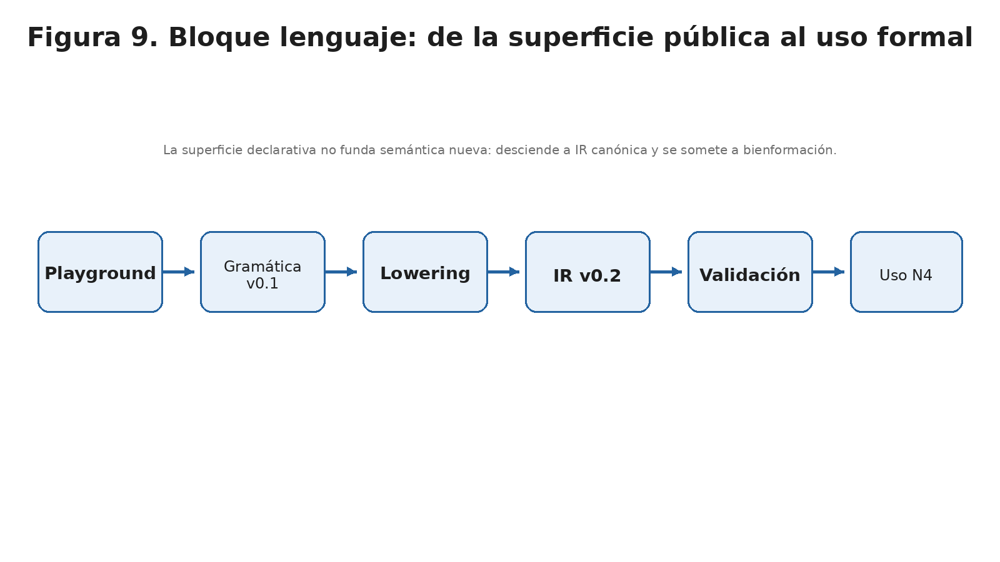

*Figura 9. Diagrama del bloque lenguaje: Playground → gramática → lowering → IR → validación → uso.*

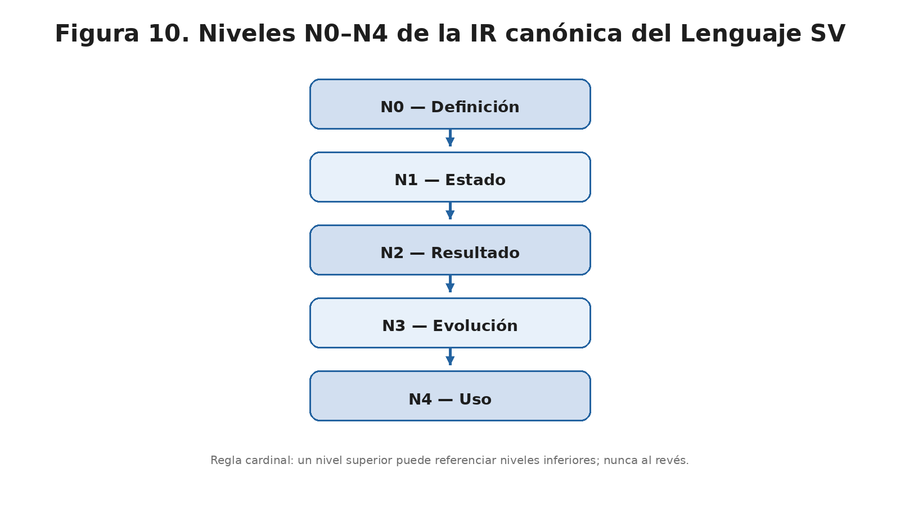

*Figura 10. Diagrama de niveles N0–N4 del Lenguaje SV.*

---

## 9. Guía práctica y gobierno prudencial del proyecto

### 9.1. Función del bloque

La **Guía práctica del conocimiento profundo y la crítica de la razón pura** no es una pieza homogénea y no debe tratarse como tal. Su función dentro del sistema no consiste en sustituir a la doctrina algebraico-semántica ni en rehacer el lenguaje, sino en proporcionar un **régimen de gobierno prudencial, adopción, actualización doctrinal y reglas fuertes de proyecto**.

### 9.2. Estratos de la Guía

La Guía debe presentarse por estratos.

El primero es un estrato de **reflexión no normativa**, destinado a justificar el sentido del documento, su título y su horizonte intelectual.

El segundo es un estrato de **fundamentos fuertes**, entre los que destacan:
- la definición operativa del sistema y la regla `T(n)=⌊7n/9⌋` como umbral canónico de clasificación fuerte de la célula SV;
- la convención canónica `0/1/U` con radios `1/2/3`, entendidos aquí como convención radial visible de la representación polar canónica;
- la subordinación de la CNN al álgebra;
- la inmutabilidad del polígono y del par de etiquetas;
- y el protocolo de actualización doctrinal.

El tercero es un estrato de **prospectiva**, que incluye desarrollos sobre humanoides, personalidad, libre albedrío, cadenas de responsabilidad o extensiones futuras del sistema.

El cuarto es un estrato de **directrices operativas**, donde se sitúan la curva de adopción, las fases de despliegue y la pedagogía prudencial del sistema.

El quinto, por último, es el estrato de **reglas inamovibles**, que contiene varias de las cláusulas más fuertes de todo el proyecto.

### 9.3. Qué aporta este bloque al pliego

La Guía aporta al pliego tres cosas fundamentales.

En primer lugar, un **régimen de prudencia y adopción**. A efectos de este pliego, ese régimen puede resumirse provisionalmente en tres cláusulas visibles: ninguna ampliación del sistema debe tratarse como vigente sin reconocimiento previo o compatibilidad explícita con el corpus de mayor rango; todo crecimiento debe preservar la jerarquía documental y la trazabilidad del cambio; y ninguna fase operativa puede presentarse como doctrina soberana por la vía de hecho.

En segundo lugar, un **régimen de actualización doctrinal**. También aquí conviene hacer visibles, al menos, tres reglas de trabajo: toda actualización debe identificar la pieza afectada, el motivo, el alcance y la versión resultante; no se admiten correcciones silenciosas de rango inferior sobre piezas superiores; y, cuando exista tensión entre piezas, la revisión debe resolverse por jerarquía explícita y no por conveniencia local o fatiga operativa.

En tercer lugar, consolida varias **reglas fuertes de proyecto** que deben figurar en el cuerpo del pliego y, en parte, nutrirán el anexo duro. Entre ellas, y a título solo ilustrativo en esta fase, destacan la invariancia semántica de clases y radios, la inmutabilidad del polígono y la prohibición de corrección silenciosa de una pieza superior desde un nivel inferior.

### 9.4. Qué no debe hacerse con la Guía

El pliego debe evitar tres errores:
- no elevar toda la Guía al mismo rango normativo;
- no rebajarla a reflexión filosófica inofensiva;
- y no copiarla en bruto.

Las reglas inamovibles de la Guía deberán incorporarse al anexo duro distinguiendo su alcance general de las reglas sectoriales propias de líneas concretas del proyecto.

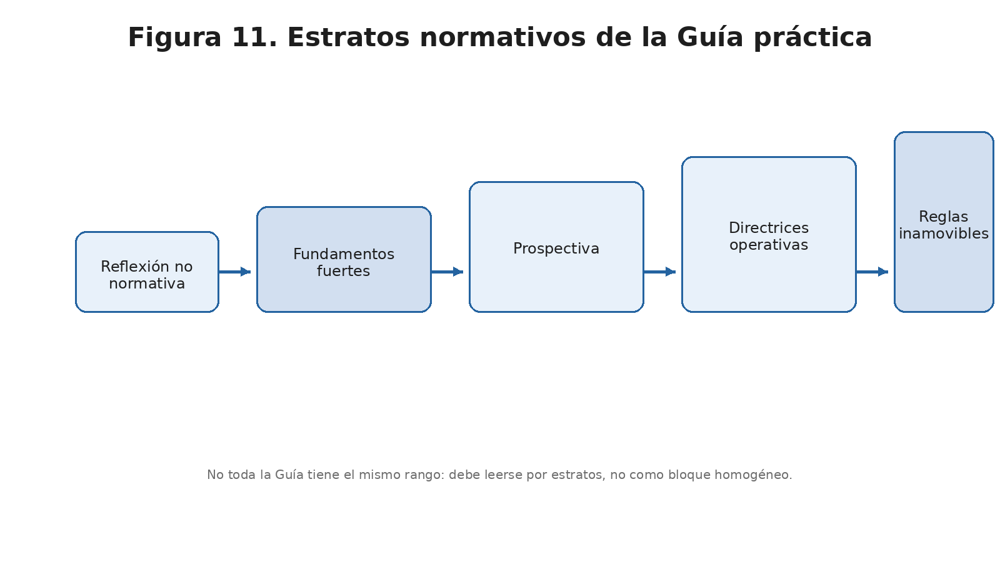

*Figura 11. Diagrama de estratos normativos de la Guía: reflexión, fundamentos, prospectiva, directrices y reglas inamovibles.*

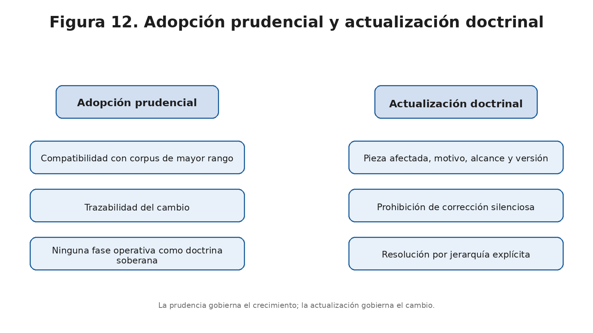

*Figura 12. Diagrama de adopción prudencial del sistema y protocolo de actualización doctrinal.*

---

## 10. Estado actual de continuidad y criterio de desarrollo

A la fecha de este pliego, y conforme al estado efectivamente consolidado del corpus, puede afirmarse que el Sistema Vectorial SV dispone ya de una base suficiente para continuar su desarrollo sin reabrir indebidamente sus fundamentos. El **bloque algebraico-semántico** está cerrado a nivel de primer orden; el **Programa de interfaces** ha alcanzado un cierre temporal suficiente en su frente básico; el **Lenguaje SV** dispone ya de superficie pública, gramática mínima e IR canónica; y la **Guía práctica** ha dejado clasificado el régimen prudencial y de actualización del proyecto.

El criterio de continuidad que se desprende de este estado es doble.

Por un lado, **puede y debe proseguirse el desarrollo técnico del lenguaje y de su backend soberano**, siempre que se mantenga subordinación estricta a la doctrina, a la IR vigente, a la frontera normativa y a los puertos de extensión previstos. La pendencia material de nuevas interfaces o de desarrollos futuros no constituye por sí sola un motivo legítimo para bloquear el núcleo ya estabilizado.

Por otro lado, esa continuidad no autoriza a tratar como cerradas cuestiones que el propio corpus ha dejado expresamente abiertas: ampliaciones del alfabeto, firma cerrada de `Comp`, teoría multiagente plena, teoría general de convergencia o desarrollos prospectivos sobre personalidad, humanoides o agentes complejos. La continuidad legítima del proyecto es, por tanto, una continuidad **fuerte pero no arbitraria**.

### 10.1. Criterios mínimos de verificabilidad de algunas afirmaciones de estado

Para reforzar su recepción pública, este pliego no trata sus principales afirmaciones de estado como autoaval inmune a contraste. A título mínimo, deben entenderse como refutables en los siguientes términos:

- **Cierre de primer nivel del bloque algebraico-semántico:** quedaría refutado si se acreditara la ausencia de alguno de sus componentes constitutivos ya enumerados en este pliego —célula, composición, reevaluación por sucesos, entrada legítima del mundo, consulta y análisis discreto— o si apareciera una contradicción local suficiente que obligara a rehacer alguno de ellos como fundamento no resuelto.
- **Cierre temporal del frente básico de interfaces:** quedaría refutado si la continuidad de criterio del programa dejara de sostenerse materialmente entre los carriles ya abiertos, o si alguno de ellos no pudiera ya presentarse como estructura formalmente abierta y trazable.
- **Suficiencia local de la terna `{0,1,U}` en la fase actual:** quedaría refutada si apareciera una contradicción local suficiente, interna al problema formal tratado, que no pudiera resolverse legítimamente sin ampliar el alfabeto canónico.

---

## 11. Conclusión

El Sistema Vectorial SV, considerado en su fase actual, no puede describirse ya como una intuición, una hipótesis difusa ni una simple agregación de textos. El corpus disponible muestra un sistema dotado de:

- una ontología algebraico-semántica propia;
- una gramática de composición tipada;
- un régimen eventivo de reevaluación;
- una teoría formal de entrada del mundo;
- un modelo de especialización, agente y consulta;
- un primer repertorio propio de análisis discreto;
- un programa de interfaces materializado;
- un lenguaje de computación canónico, austero y disciplinado;
- y un régimen de gobierno prudencial del desarrollo.

La tarea del presente pliego no ha sido fundar ese sistema, sino **hacerlo comparecer como una arquitectura legible, jerarquizada y públicamente inteligible**. Por ello, el lector debe salir de este documento con una doble convicción. La primera: que el Sistema Vectorial SV posee ya una consistencia interna suficientemente fuerte como para ser estudiado y desarrollado con seriedad. La segunda: que esa consistencia solo puede preservarse si se respetan con rigor la jerarquía de sus fuentes, la subordinación de sus capas y la disciplina de sus límites.

---

## 12. Referencias bibliográficas y remisiones principales

### 12.1. Criterio de referencia de este borrador

Las referencias que siguen se ofrecen con el grado de localización suficiente para esta fase del pliego. Cuando la pieza disponga de publicación digital propia o de soporte público identificable, se indica su tipo de soporte y la fecha de consulta empleada en la fase de ingestión documental cerrada el **18/03/2026**. La versión pública final deberá convertir este repertorio en bibliografía plenamente normalizada.

### 12.2. Bloque doctrinal y compilador

- Lloret Egea, Juan Antonio. *Compilador doctrinal y célula meta SV(9,3)-IA*. Publicación digital propia del proyecto Sistema Vectorial SV, consultada el 18/03/2026.

### 12.3. Bloque algebraico-semántico

- Lloret Egea, Juan Antonio. *Fundamentos algebraico-semánticos del Sistema Vectorial SV*. Publicación digital propia del proyecto, versión consultada el 18/03/2026.
- Lloret Egea, Juan Antonio. *Álgebra de composición intercelular del marco SV — I. Transmisión en serie por parámetro puente*. Publicación digital propia de la colección algebraica, consultada el 18/03/2026.
- Lloret Egea, Juan Antonio. *Álgebra de composición intercelular del marco SV — II. Gramática general de composición*. Publicación digital propia de la colección algebraica, consultada el 18/03/2026.
- Lloret Egea, Juan Antonio. *Álgebra de composición intercelular del marco SV — III. Horizonte de sucesos y reevaluación discreta*. Publicación digital propia de la colección algebraica, consultada el 18/03/2026.
- Lloret Egea, Juan Antonio. *Álgebra de composición intercelular del marco SV — IV. Transducción al alfabeto ternario e interfaz paramétrica del sistema*. Publicación digital propia de la colección algebraica, consultada el 18/03/2026.
- Lloret Egea, Juan Antonio. *Álgebra de composición intercelular del marco SV — V. Invariantes, agentes especializados y operador de consulta del sistema*. Publicación digital propia de la colección algebraica, consultada el 18/03/2026.
- Lloret Egea, Juan Antonio. *Álgebra de composición intercelular del marco SV — VI. Análisis discreto, representaciones y herramientas de secuencias del sistema*. Publicación digital propia de la colección algebraica, consultada el 18/03/2026.
- Lloret Egea, Juan Antonio. *Origen doctrinal, definición y alcance de la U en el Sistema Vectorial SV*. Publicación digital propia del proyecto, consultada el 18/03/2026.
- Lloret Egea, Juan Antonio. *Semántica auditada en el Sistema Vectorial SV: formalización estructural basada en sucesos, transducción ternaria y clausura trazable*. Publicación digital propia del proyecto, consultada el 18/03/2026.

### 12.4. Programa de interfaces

- *Programa de interfaces del Sistema Vectorial SV*. Repositorio doctrinal-técnico del proyecto, estructura material consultada el 18/03/2026.
- Carriles `semantica/`, `vision/`, `motricidad/`, `observacional/` y `olfato/` dentro de `documentos/programa_interfaces_sv/`. Estructura material consultada y normalizada en marzo de 2026.

### 12.5. Bloque lenguaje

- *SVP Playground — Sistema Vectorial SV*. GitHub Pages del proyecto, consultado el 18/03/2026.
- Lloret Egea, Juan Antonio. *Gramática superficial mínima del lenguaje de computación del Sistema Vectorial SV — v0.1*. Documento técnico del lenguaje, soporte PDF/Markdown de proyecto, consultado el 18/03/2026.
- Lloret Egea, Juan Antonio. *IR canónica y sistema de bienformación del lenguaje SV — v0.2*. Documento técnico del lenguaje, soporte PDF de proyecto, consultado el 18/03/2026.

### 12.6. Guía práctica

- Lloret Egea, Juan Antonio. *La guía práctica del conocimiento profundo y la crítica de la razón pura*. Publicación digital propia del proyecto, release 2 consultada el 18/03/2026.

## 13. Reserva para el anexo duro y literal

El presente borrador no cierra todavía el **anexo duro y literal** del proyecto. No por insuficiencia del corpus, sino por una razón de método: el anexo requiere una última operación de extracción y clasificación por rango de:
- reglas,
- principios,
- axiomas,
- corolarios,
- prohibiciones,
- verdades operativas,
- y límites de fase.

A efectos provisionales de este pliego, esas categorías se entenderán así: un **axioma** es una formulación constitutiva asumida sin derivación interna en este documento; un **principio** es una orientación normativa general con vocación transversal; una **regla** es un mandato operativo o interpretativo de aplicación concreta; un **corolario** es una consecuencia obligada de axiomas, principios o reglas ya fijados; una **prohibición** es una regla negativa expresa; una **verdad operativa** es un hecho estructural o técnico asumido como vigente en esta fase; y un **límite de fase** es una frontera reconocida del sistema o del proyecto en su estado actual.

La incorporación al anexo duro exigirá clasificación previa por rango, alcance y ámbito, sin absorción automática de reglas sectoriales en el régimen general.

Esa operación se hará en una fase posterior del trabajo, una vez validado el cuerpo principal del pliego.
