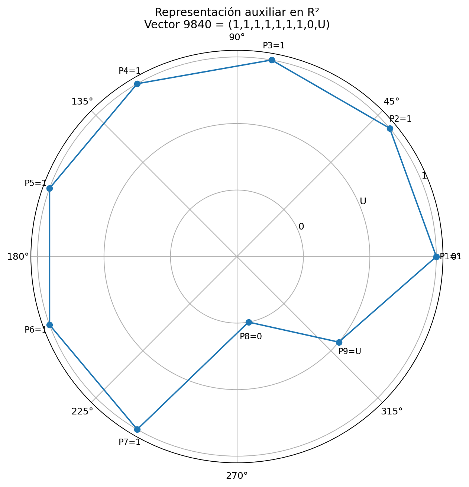
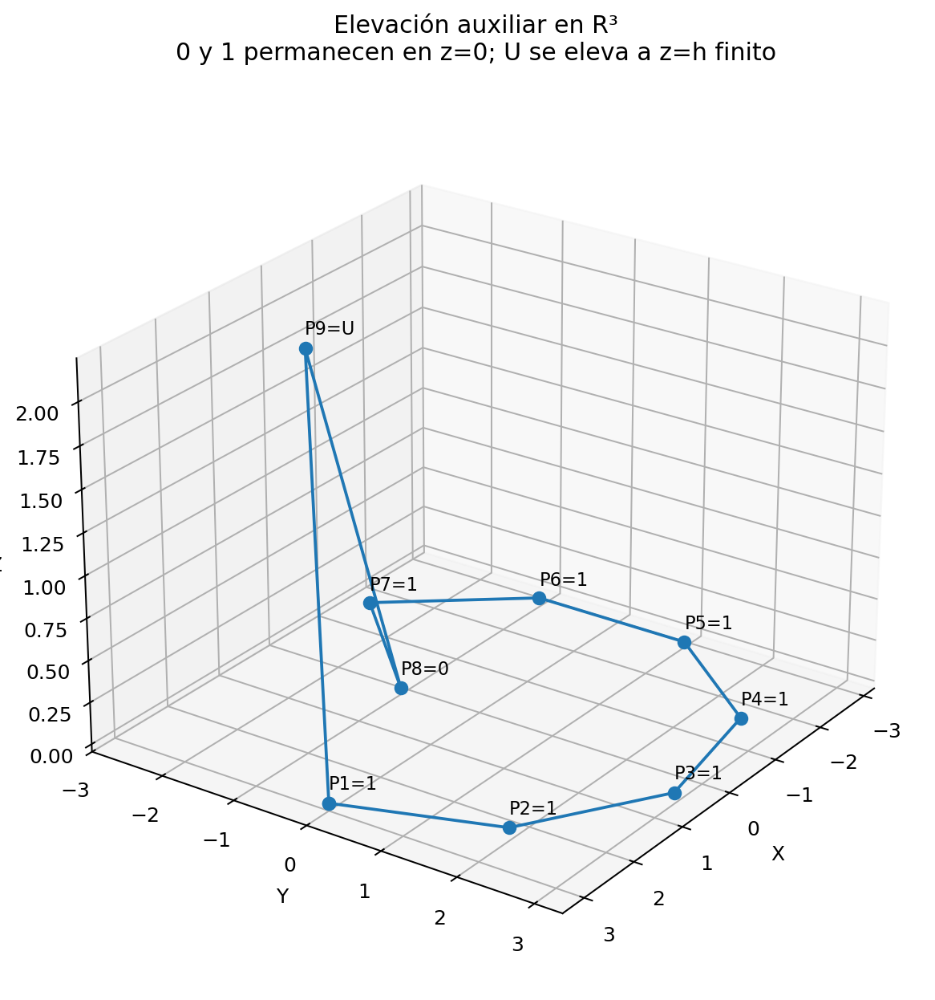

# Análisis del comportamiento geométrico del polígono del Sistema Vectorial SV: del plano cartesiano a una carta espacial afín auxiliar como vía de razonamiento para situaciones complejas

## Representación auxiliar en ℝ³, métricas de transición discreta e invariantes geométricos del signo U

**Autor:** Juan Antonio Lloret Egea  
**ORCID:** 0000-0002-6634-3351  
**Institución:** Instituto Tecnológico Virtual de la Inteligencia Artificial para el Español™ (ITVIA)  
**Publicación:** IA eñ™ – La Biblia de la IA™ | ISSN 2695-6411  
**Madrid, 16 de marzo de 2026**

## Resumen

El Sistema Vectorial SV opera sobre una gramática ternaria cuyos tres signos — **0** (Apto), **1** (No Apto) y **U** (Indeterminado) — se representan canónicamente mediante una poligonal polar cerrada en el plano euclídeo **ℝ²**. Esa representación plana, aunque completa en su semántica, comprime la diferencia estructural entre los estados determinados y el estado de no determinación actual **U**, que en el plano aparece como un radio de la misma familia visual que **0** y **1**. El presente trabajo propone y formaliza una **carta auxiliar en ℝ³** en la que **U** sale del plano **z = 0** a una altura finita **h**, mientras que **0** y **1** permanecen en ese plano. Esta operación — análoga a un cambio de dominio para desingularizar una representación opaca — no altera la ontología semántica del sistema: **h** es un parámetro de carta, no un atributo del signo.

Se definen seis magnitudes geométricas discretas explotables: longitud plana (**L₂**), longitud espacial (**L₃**), exceso de elevación (**ΔL**), defecto de coplanaridad (**Cz**), energía radial (**Eρ**) y energía vertical (**Ez**). Se demuestra que:

$$
Ez(v,h)=k(v)\cdot h^2
$$

donde **k(v)** es el número de transiciones entre el plano de determinación y el régimen de indeterminación, un invariante estructural del vector independiente de **h**. Para **ΔL** se establece estabilidad de rango sobre una batería de siete vectores en seis valores de **h**, y se acota la proposición de invariancia general como resultado pendiente de prueba universal. Se formulan además dos criterios de falsación operativos que impiden que el programa de trabajo produzca una elevación meramente decorativa.

Los resultados muestran que la carta en **ℝ³** no es decorativa: discrimina configuraciones semánticamente distintas que la proyección plana no separa con claridad, y lo hace de forma verificable, comparable y refutable.

**Palabras clave:** Sistema Vectorial SV; lógica ternaria; representación polar; levantamiento geométrico; espacio euclídeo ℝ³; indeterminación epistémica; métricas discretas; invariantes geométricos; carta auxiliar; criterios de falsación.

## 1. Introducción

El Sistema Vectorial SV es un marco algebraico y representacional para la evaluación de situaciones complejas. Su unidad primaria es la **célula exacta**, un vector de longitud **n = b²** (con **b ≥ 3** entero) cuyos componentes pertenecen al alfabeto ternario **{0,1,U}**. La representación canónica de esa célula es una poligonal polar cerrada en el plano **ℝ²**: cada parámetro ocupa un eje angular fijo y la distancia al centro codifica el signo presente en esa posición. Esta geometría no es ornamental; constituye una interfaz de inteligibilidad que permite recorrer una misma figura visible y estable tanto al razonamiento humano como al razonamiento algorítmico.

La representación plana es suficiente para la semántica del sistema, pero presenta una limitación visual concreta: **U** aparece en el mismo plano que **0** y **1**, dibujado como un radio de la misma familia visual, sin que la figura revele con claridad que **U** no es un estado determinado de la misma naturaleza que los otros dos. En dominios donde la densidad y la distribución angular de **U** son estructuralmente relevantes, esa compresión visual dificulta la lectura de la configuración.

Este trabajo propone una carta auxiliar en el espacio euclídeo **ℝ³** que resuelve ese problema de legibilidad sin tocar la ontología semántica del sistema. La idea es simple: los estados determinados **0** y **1** permanecen en el plano **z = 0**; el estado **U** se eleva a una altura finita **h > 0**. El polígono resultante abandona la coplanaridad en los vértices que contienen **U**, y ese abandono produce magnitudes geométricas medibles que permiten comparar, clasificar y estudiar configuraciones ternarias por su estructura de indeterminación.

La analogía matemática que justifica la operación es la de los cambios de variable o de dominio usados para desingularizar fenómenos que en su representación natural son opacos: del mismo modo que una figura plana puede necesitar una carta espacial para revelar su estructura, la célula ternaria puede beneficiarse de una representación auxiliar en **ℝ³** que haga visible la textura estructural de **U** sin afirmar nada nuevo sobre su significado semántico. **h** no cuantifica incertidumbre; es una coordenada de carta.

## 2. Marco matemático del Sistema Vectorial SV

### 2.1. Célula exacta y alfabeto ternario

Sea **b** un entero con **b ≥ 3**. La célula SV exacta de orden **b** tiene **n = b²** parámetros y se define como:

$$
\mathcal{S}_n = \{0,1,U\}^n
$$

Los tres símbolos tienen semántica canónica fija: **0** significa **Apto**, **1** significa **No Apto** y **U** significa **Indeterminado**, esto es, estado epistémico de no determinación actual, no un número ni un valor intermedio entre **0** y **1**. La restricción **n = b²** no es ornamental: preserva una distribución angular uniforme en la representación polar y garantiza la simetría de la figura visible.

### 2.2. Representación polar canónica en ℝ²

Se fija una codificación radial auxiliar **ρ : {0,1,U} → {1,2,3}** mediante:

$$
\rho(0)=1,\qquad \rho(1)=2,\qquad \rho(U)=3
$$

Esta convención no establece equivalencia ontológica entre los signos; solo los separa visualmente. El eje angular del parámetro **i**-ésimo es:

$$
\theta_i = \frac{2\pi(i-1)}{n},\qquad i=1,\dots,n
$$

y la carta polar plana **Φ₂** de un vector **v=(v_1,\dots,v_n)** viene dada por:

$$
\Phi_2(v)_i = \big(\rho(v_i)\cos\theta_i,\ \rho(v_i)\sin\theta_i\big)
$$

El polígono se obtiene uniendo esos vértices en orden angular y cerrando la curva.

## 3. Cartas geométricas: plana y elevada

### 3.1. Carta plana

La carta plana **Φ₂** conserva toda la semántica exacta del vector ternario y constituye la representación canónica del sistema.

### 3.2. Carta elevada en ℝ³

Se define la carta auxiliar elevada **Φ₃** manteniendo la misma posición angular y radial, pero añadiendo una coordenada vertical:

$$
z(v_i)=
\begin{cases}
0,& \text{si } v_i\in\{0,1\}\\
h,& \text{si } v_i=U
\end{cases}
$$

De este modo,

$$
\Phi_3(v)_i = \big(\rho(v_i)\cos\theta_i,\ \rho(v_i)\sin\theta_i,\ z(v_i)\big)
$$

La elevación no redefine el signo **U**. La altura **h** pertenece a la carta, no al objeto semántico.

## 4. Magnitudes geométricas discretas explotables

Sobre la carta plana y la carta elevada se definen seis magnitudes discretas.

### 4.1. Longitud plana

$$
L_2(v)=\sum_{i=1}^{n} \left\|\Phi_2(v)_{i+1}-\Phi_2(v)_i\right\|
$$

con índice cíclico.

### 4.2. Longitud espacial

$$
L_3(v,h)=\sum_{i=1}^{n} \left\|\Phi_3(v)_{i+1}-\Phi_3(v)_i\right\|
$$

### 4.3. Exceso de elevación

$$
\Delta L(v,h)=L_3(v,h)-L_2(v)
$$

### 4.4. Defecto global de coplanaridad

$$
C_z(v,h)=\sqrt{\frac{1}{n}\sum_{i=1}^n z(v_i)^2}
$$

### 4.5. Energía radial

$$
E_{\rho}(v)=\sum_{i=1}^{n}\rho(v_i)^2
$$

### 4.6. Energía vertical

$$
E_z(v,h)=\sum_{i=1}^{n} z(v_i)^2
$$

Esta última magnitud será la más importante por su estructura exacta.

## 5. Invarianza del orden relativo en la energía vertical y criterio de validez relativa

Sea **k(v)** el número de posiciones del vector en régimen **U**. Entonces, por definición de la carta elevada:

$$
E_z(v,h)=k(v)\cdot h^2
$$

Este resultado es exacto. Para **h > 0**, el orden relativo de los vectores inducido por **E_z** coincide exactamente con el orden relativo inducido por **k(v)**.

Para **ΔL**, en cambio, no se establece un teorema general de invariancia. Lo que se obtiene es una tesis más prudente: **estabilidad de rango en la batería ensayada**, junto con monotonicidad respecto de **h**.

De aquí se derivan dos criterios de falsación:

- **F1.** Si **ΔL** y **E_z** no discriminan configuraciones semánticamente distintas, la carta elevada carece de valor clasificatorio.
- **F2.** Si la elevación no añade ninguna estructura nueva respecto de la información ya computable en **ℝ²**, la técnica debe descartarse como mera visualización redundante.

## 6. Batería de contraste y resultados

Se ensaya una batería de siete vectores ternarios de longitud **n = 9 = 3²**, elegidos para contrastar densidad y posición de **U**. Se consideran seis valores positivos de **h** y se comparan, para cada vector, las magnitudes **L₂**, **L₃**, **ΔL**, **Cz**, **Eρ** y **Ez**.

El caso ilustrativo principal es:

$$
v_A=(1,1,1,1,1,1,1,0,U)
$$

En la carta polar plana, este vector produce una corona casi saturada por siete valores **1**, una muesca profunda en **P8 = 0** y un retorno parcial en **P9 = U**. La figura es inteligible, pero la diferencia de régimen entre **0** y **U** permanece comprimida.

En la carta espacial auxiliar, **P9** deja de funcionar como simple radio del mismo plano y aparece como salida finita de la coplanaridad. La información angular se conserva; lo que cambia es la legibilidad geométrica del signo **U**.

Los resultados de la batería apoyan dos conclusiones:

1. **E_z** discrimina exactamente por número estructural de transiciones verticales.
2. **ΔL** muestra estabilidad empírica de rango en los casos ensayados, sin que ello se eleve todavía a teorema universal.

## 7. Alcance doctrinal de la carta elevada

La carta elevada no introduce un cuarto estado ni modifica la célula ternaria. Su legitimidad depende de tres cláusulas:

1. **Separación objeto/carta.** El objeto exacto sigue siendo ternario.
2. **Separación función/semántica.** La altura **h** no es atributo del signo.
3. **Separación hipótesis/validación.** La utilidad de la técnica debe probarse mediante magnitudes y criterios de descarte, no por mera fuerza visual.

En este marco, la elevación a **ℝ³** queda justificada como técnica auxiliar de laboratorio matemático.

## 8. Conclusión

La elevación auxiliar del polígono ternario del Sistema Vectorial SV desde **ℝ²** a una carta espacial en **ℝ³** constituye una técnica matemática legítima siempre que se mantenga la separación entre objeto exacto y representación auxiliar.

El resultado más sólido del trabajo es la expresión exacta:

$$
E_z(v,h)=k(v)\cdot h^2
$$

que convierte el número de transiciones verticales del polígono elevado en un invariante estructural plenamente controlable. Junto a ello, la batería ensayada muestra que **ΔL** aporta una señal comparativa útil y estable en los casos observados.

La conclusión es afirmativa y restringida: la carta en **ℝ³** no debe promoverse a ontología nueva, pero sí merece consolidarse como técnica matemática auxiliar de laboratorio dentro del marco ternario vigente.

## 9. Referencias

**[R1]** Juan Antonio Lloret Egea. *Fundamentos algebraico-semánticos del Sistema Vectorial SV*. ITVIA, publicación canónica de la serie SV Matemática y Semántica, 2026.

**[R2]** Juan Antonio Lloret Egea. *Especificación transversal subordinada: origen doctrinal, definición y alcance de la U en el Sistema Vectorial SV*. ITVIA, 2026.

**[R3]** Juan Antonio Lloret Egea. *Análisis del comportamiento geométrico del polígono del Sistema Vectorial SV: del plano cartesiano a una carta espacial afín auxiliar como vía de razonamiento para situaciones complejas*. ITVIA, Release 2, 2026.

**[R4]** Juan Antonio Lloret Egea. *Proposición de trabajo sobre transiciones estructurales de U en trayectorias discretas del Sistema Vectorial SV*. Repositorio `SV-matematica-semantica`, `especificaciones/proposiciones/`, 16/03/2026.

**[R5]** Saber N. Elaydi. *An Introduction to Difference Equations*. Springer, New York, 2005. DOI: 10.1007/0-387-27602-5.

**[R6]** Douglas Lind; Brian Marcus. *An Introduction to Symbolic Dynamics and Coding*. 2.ª ed., Cambridge University Press, 2021.

**[R7]** G. A. Hedlund. “Endomorphisms and Automorphisms of the Shift Dynamical System.” *Mathematical Systems Theory* 3 (1969): 320–375.
