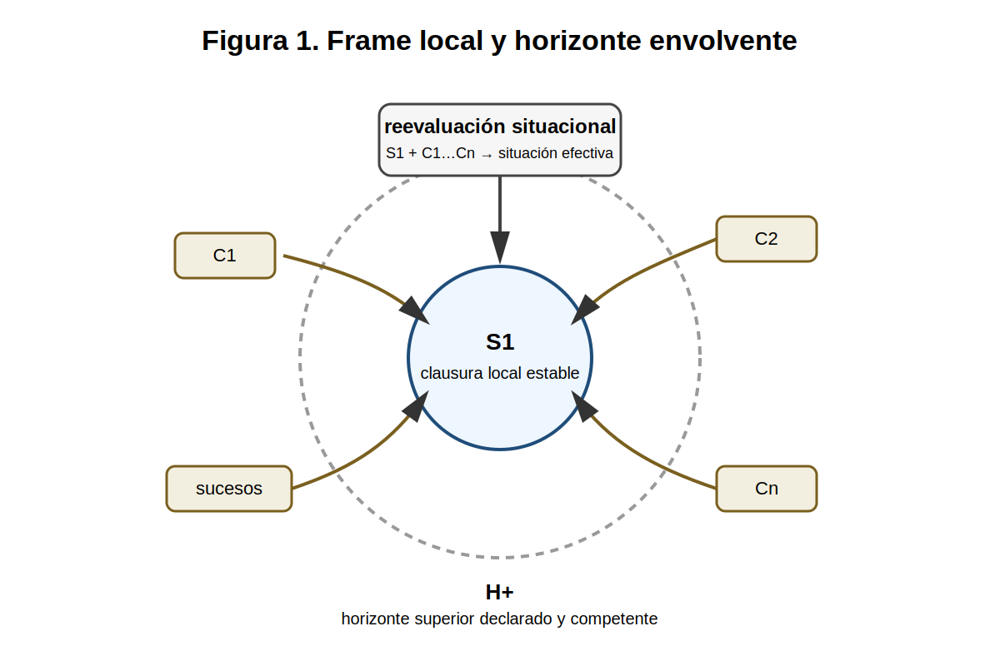
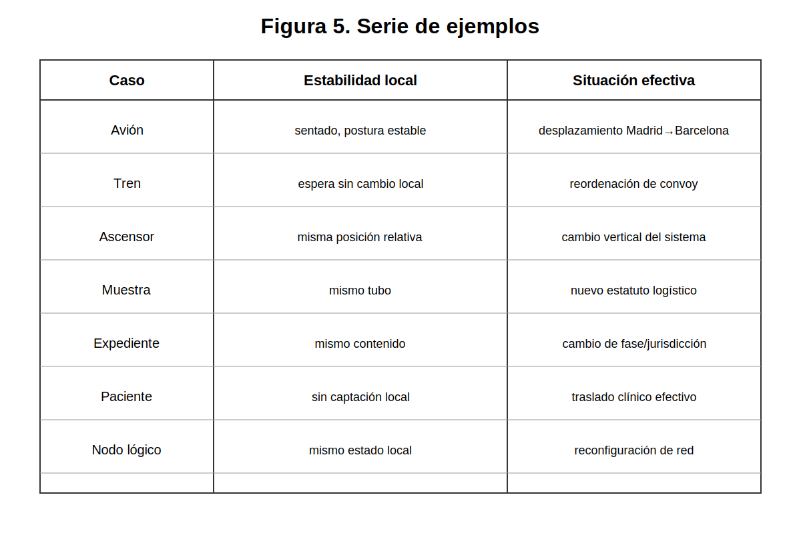
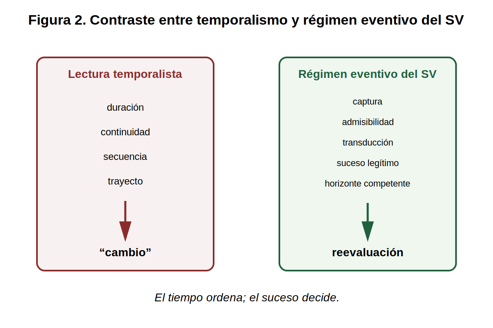
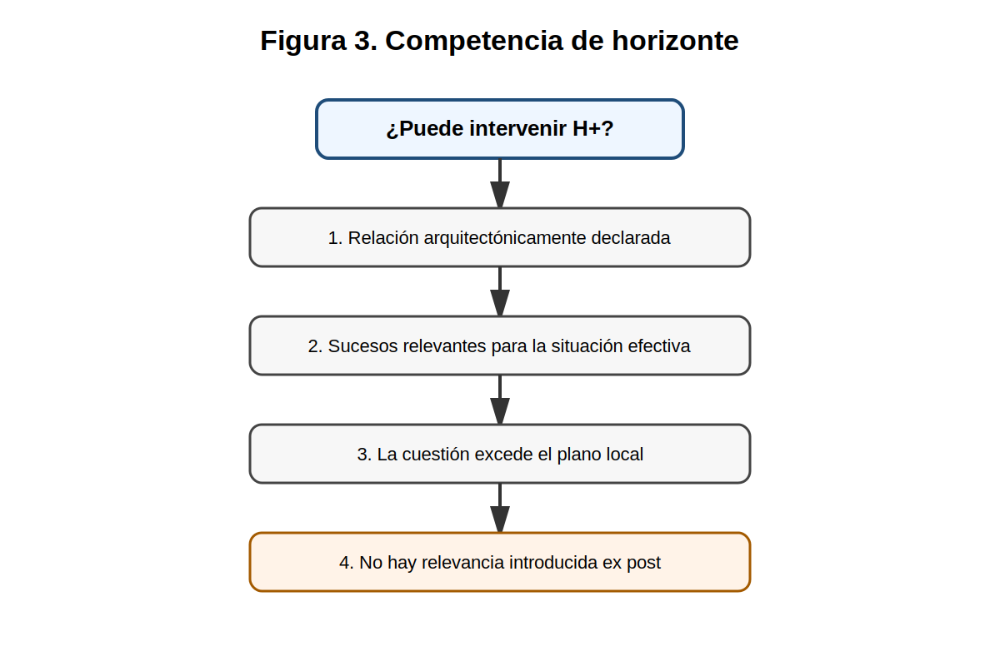
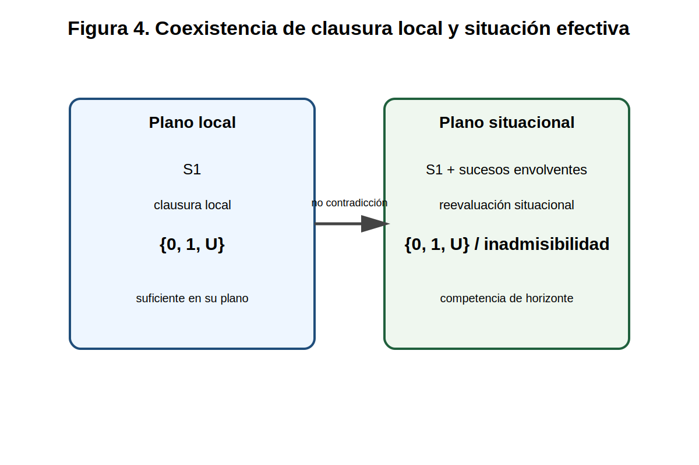

# Suceso local, suceso envolvente y reevaluación situacional en horizonte declarado en el Sistema Vectorial SV
## Nota de precisión algebraico-semántica sobre modificación efectiva sin tiempo fuerte

**Autor:** Juan Antonio Lloret Egea  
**ORCID:** 0000-0002-6634-3351  
**Proyecto:** Sistema Vectorial SV  
**Publicación:** IA eñ ™ — La Biblia de la IA · ISSN 2695-6411  
**Licencia:** Creative Commons Attribution-NonCommercial-NoDerivatives 4.0 International (CC BY-NC-ND 4.0)  
**Fecha:** 22/03/2026  
**Versión:** v1  
**Estado:** Nota de precisión algebraico-semántica pública y subordinada  
**Repositorio natural:** `SV-matematica-semantica`

## Resumen

Esta nota no reabre la semántica del Sistema Vectorial SV ni introduce una teoría nueva del cambio. Su objeto es más estrecho: precisar bajo qué condiciones un frame local puede conservar una clausura propia estable y, sin embargo, quedar efectivamente modificado por sucesos pertenecientes al horizonte declarado de la arquitectura que lo envuelve. La tesis defendida es que tal modificación efectiva puede formularse sin introducir tiempo fuerte, sin ampliar el alfabeto `{0,1,U}` y sin degradar la `U`, siempre que se distinga con rigor entre **suceso local**, **suceso envolvente** y **reevaluación situacional**, y siempre que el horizonte superior que interviene disponga de **competencia declarada** y de vía legítima de captura, admisibilidad y transducción de los sucesos pertinentes. El problema no es, por tanto, si el frame “sabe” o no sabe el cambio, sino si la arquitectura que lo contiene puede reconocerlo legítimamente sin confundir duración con suceso ni contexto blando con modificación efectiva.

## Naturaleza y alcance de la pieza

La presente nota tiene carácter **público, técnico, subordinado y de precisión**.

No reabre la doctrina del Sistema Vectorial SV, no introduce un nuevo alfabeto, no altera la ontología primaria del sistema y no corrige silenciosamente el bloque algebraico-semántico ya fijado. Su función es más estrecha: **afinar una zona delicada del régimen de sucesos**, distinguiendo entre suceso local, suceso envolvente y reevaluación situacional, con el fin de evitar dos errores de lectura especialmente probables: la absolutización de la clausura local del frame y la recaída en una interpretación temporalista del cambio.

Esta pieza se sitúa, por tanto, **dentro** de la semántica ya fijada, no fuera de ella; y su legitimidad depende de mantenerse en ese estatuto.

## Qué hace esta pieza

La presente nota hace, de forma positiva y delimitada, las siguientes cosas:

1. **Afina el régimen semántico del cambio.** Precisa que la clausura local de un frame no agota necesariamente su situación efectiva, siempre que exista un horizonte declarado y competente en el que comparezcan sucesos envolventes legítimos.

2. **Distingue tres niveles que antes podían quedar implícitos.** Formaliza y separa:
   - **suceso local**,
   - **suceso envolvente**,
   - **reevaluación situacional**.

3. **Protege el sistema frente a una lectura temporalista.** Hace explícito que la modificación efectiva no procede del mero paso del tiempo, de la duración ni de la secuencia continua, sino de la comparecencia legítima de sucesos en horizonte declarado.

4. **Conserva la centralidad de `{0,1,U}`.** No introduce pseudoestados ni zonas grises entre `0`, `1` y `U`.

5. **Defiende la suficiencia del frame local sin absolutizarlo.** Evita dos excesos opuestos:
   - que la clausura local del frame se convierta en medida absoluta de toda situación efectiva;
   - o que cualquier exterioridad se arrogue derecho de corrección sobre el frame.

6. **Refuerza la necesidad de horizonte declarado y competente.** Impide que el “afuera” comparezca como contexto difuso o como corrección arbitraria.

7. **Aporta una ganancia estructural al lector del SV.** Vuelve inteligible, para terceros, cómo el sistema puede reconocer modificación efectiva sin abandonar su régimen eventivo y sin recaer en el tiempo fuerte.

## Qué no hace esta pieza

La presente nota no hace, y no debe leerse como si hiciera, ninguna de las siguientes cosas:

1. **No reabre la semántica del SV.**
2. **No introduce tiempo fuerte.**
3. **No convierte toda circunstancia en suceso.**
4. **No debilita sin más la clausura local del frame.**
5. **No amplía el alfabeto `{0,1,U}`.**
6. **No altera por sí sola el Lenguaje SV.**
7. **No genera por sí misma deuda viva obligatoria en el lenguaje.**
8. **No sustituye al trabajo futuro sobre interfaces o coordinación.**

## 1. Objeto

El Sistema Vectorial SV fija ya una tesis fuerte: el cambio no procede del tiempo como magnitud soberana, sino de la comparecencia de sucesos legítimos en un horizonte declarado. La trayectoria no es flujo continuo, sino sucesión ordenada de reevaluaciones; los frames pasados son inmutables; y la `U` conserva la indeterminación cuando no existe base suficiente para clausura legítima.

Sin embargo, esta tesis puede ser mal leída cuando un frame local permanece estable en su autolectura y, al mismo tiempo, la situación global en que se encuentra ha cambiado. La cuestión puede formularse así: ¿cómo debe pensarse un caso en el que un frame local no agota su situación efectiva? Más precisamente: ¿cómo debe tratarse el hecho de que un frame permanezca estable en su clausura local, mientras sucesos circunstanciales del horizonte que lo envuelve alteran su situación efectiva? Esta nota responde a esa pregunta sin introducir temporalismo fuerte, sin crear ontología rival y sin desplazar la semántica vigente.

## 2. Delimitación negativa

Quedan fuera de esta nota cinco desplazamientos ilegítimos.

Primero, queda fuera toda reintroducción del tiempo fuerte como fundamento del cambio. No se sostendrá aquí que una modificación efectiva se produzca por mera duración, continuidad o secuencia.

Segundo, queda fuera toda reducción del problema a psicología del sujeto o a autoconciencia del frame.

Tercero, queda fuera toda identificación entre soporte secuencial y modificación efectiva.

Cuarto, queda fuera toda ampliación del alfabeto más allá de `{0,1,U}`.

Quinto, queda fuera todo contextualismo blando. No toda circunstancia del entorno es ya suceso; solo lo es aquello que comparece bajo condiciones legítimas de relevancia, captura, admisibilidad y transducción.

## 3. Base doctrinal mínima

La base doctrinal necesaria para esta precisión es reducida pero suficiente.

El sistema cambia por sucesos y no por tiempo. La trayectoria no es flujo continuo, sino sucesión ordenada de reevaluaciones. Un frame ya clausurado no se reescribe retrospectivamente. La indeterminación honesta debe conservarse allí donde no exista base suficiente para una clausura legítima. Y todo lo que entre en el sistema como modificación efectiva debe hacerlo por vía de captura, admisibilidad y transducción en un horizonte declarado.

Sobre esta base, la pregunta ya no es si el sistema admite cambio sin tiempo —eso está fijado—, sino cómo distinguir finamente entre el cambio captado desde el interior del frame y el cambio que comparece en un plano envolvente sin destruir la legitimidad de la clausura local.

## 4. Definiciones

**D1 — Suceso local.**  
Suceso que comparece dentro del horizonte operativo del frame y que puede ser capturado, admitido y transducido desde su propia posición.

**D2 — Suceso envolvente.**  
Suceso que pertenece al horizonte declarado de la arquitectura que contiene al frame, aunque no comparezca en la clausura local del frame como contenido accesible.

**D3 — Situación efectiva.**  
Estatuto real del frame dentro de la arquitectura y de la trayectoria globales, una vez considerados los sucesos relevantes de su horizonte declarado.

**D4 — Reevaluación situacional.**  
Reevaluación efectuada en un plano superior o más amplio del horizonte, que recompone el frame local con los sucesos envolventes pertinentes y determina su situación efectiva.

**D5 — Estabilidad local.**  
Persistencia de la clausura local del frame respecto de las variables accesibles desde su propia posición.

**D6 — Competencia de horizonte.**  
Un horizonte superior solo puede intervenir en la reevaluación situacional de un frame cuando:
1. su relación con dicho frame esté arquitectónicamente declarada;
2. los sucesos envolventes invocados sean relevantes para la situación efectiva que se evalúa;
3. dicha situación efectiva exceda legítimamente el plano de clausura local;
4. y la relevancia de esos sucesos no se introduzca *ex post* para corregir arbitrariamente la clausura ya producida.

## 5. Axiomas de precisión

**Axioma 1. Inmutabilidad retrospectiva.**  
Un frame ya clausurado no se reescribe como pasado. La reevaluación situacional no altera retrospectivamente la clausura local ya producida.

**Axioma 2. Primacía del suceso.**  
Ninguna modificación efectiva se atribuye al mero transcurso temporal, sino solo a la comparecencia legítima de sucesos en horizonte declarado.

**Axioma 3. Exterioridad no equivale a inexistencia.**  
El hecho de que un suceso no comparezca dentro de la clausura local de un frame no implica que sea inexistente para la arquitectura que lo contiene.

**Axioma 4. No omnisciencia del frame.**  
Ningún frame local está obligado a clausurar aquello para lo que no dispone de captura suficiente.

**Axioma 5. Conservación de la U.**  
Cuando la situación efectiva no pueda ser clausurada legítimamente desde el plano local, la salida correcta del frame local puede ser `U`, sin perjuicio de una reevaluación situacional superior. La `U` no se reduce a probabilidad, confianza ni valor faltante.

## 6. Proposiciones

**P1 — Compatibilidad entre estabilidad local y cambio situacional.**  
Es posible que un frame permanezca localmente estable y, sin embargo, resulte globalmente modificado en su situación efectiva por sucesos envolventes de su horizonte declarado.

**P2 — No contradicción entre clausuras de distinto horizonte.**  
No hay contradicción entre una clausura local estable y una reevaluación situacional distinta, siempre que ambas se refieran a planos de horizonte diferentes y legítimamente declarados.

**P3 — La ignorancia local no anula el cambio efectivo.**  
La ausencia de autoconocimiento local del cambio no invalida la legitimidad de una modificación efectiva reconocida en un horizonte superior, siempre que dicho horizonte disponga de vía legítima de captura, admisibilidad y transducción de los sucesos envolventes pertinentes.

**P4 — Prohibición de temporalismo encubierto.**  
Toda formulación de cambio situacional que pueda reescribirse como mero paso del tiempo es ilegítima dentro del SV.

**P5 — No toda circunstancia es ya suceso.**  
Una circunstancia solo entra en la trayectoria del sistema cuando comparece como suceso legítimamente especificado, capturable, admisible y transducible.

## 7. Lemas auxiliares

**L1 — Separación entre soporte y cambio.**  
Secuencia, duración, frame, página o desplazamiento continuo no bastan por sí mismos para fundar modificación semántica.

**L2 — Separación entre autopercepción y situación.**  
La autolectura del frame no equivale necesariamente a su situación efectiva.

**L3 — Relevancia del horizonte declarado.**  
La clave del problema no es el “contexto” en sentido blando, sino la declaración formal del horizonte pertinente.

**L4 — No corrección por mera exterioridad.**  
La mera exterioridad de un horizonte no le confiere competencia para corregir una clausura local suficiente.

## 8. Corolarios

**C1.** Un sujeto localmente inmóvil puede estar trayectoriamente desplazado.  
**C2.** La estabilidad fenoménica local no implica invariancia situacional global.  
**C3.** La `U` local puede coexistir con una clausura global legítima sin contradicción lógica, si ambas pertenecen a planos distintos de evaluación.  
**C4.** El sistema no necesita tiempo fuerte para representar cambios envolventes; le bastan sucesos legítimos en horizonte declarado.

## 9. Ejemplo canónico

Sea `S1` un frame local cuya clausura permanece estable respecto de sus variables accesibles. Supóngase que `S1` corresponde al estado de un pasajero sentado en un avión. Desde el punto de vista de su autolectura local, pueden mantenerse constantes la postura, la inmovilidad relativa al asiento y otras variables inmediatas.

Sea ahora `H+` un horizonte superior arquitectónicamente declarado, que contiene sucesos envolventes pertinentes para la situación efectiva de `S1`: embarque, despegue, desplazamiento, aterrizaje y llegada. Si `H+` dispone de captura, admisibilidad y transducción legítimas de tales sucesos, la reevaluación situacional puede modificar el estatuto efectivo de `S1` —por ejemplo, de estar en Madrid a estar en Barcelona— sin que ello obligue a reescribir la clausura local de `S1` ni a introducir tiempo fuerte.

En este ejemplo, `S1` no agota su situación. Su autolectura local puede seguir siendo estable. La modificación efectiva procede de la comparecencia de sucesos envolventes en un horizonte competente, no del mero transcurso temporal ni del flujo continuo del trayecto.

## 10. Serie de ejemplos de modificación efectiva sin tiempo fuerte

El caso del avión no es singular. La misma estructura formal reaparece en otros escenarios.

**Ejemplo 1. Pasajero en tren detenido en vía secundaria.**  
Un pasajero puede creer que su tren sigue inmóvil en el mismo lugar, porque su autolectura local no registra cambio relevante. Pero el sistema ferroviario que lo contiene puede haber ejecutado sucesos envolventes: cambio de vía, acople, desacople o reordenación de convoyes. La situación efectiva del frame cambia sin necesidad de que el frame la clausure desde sí. No es la duración de la espera lo que modifica, sino la comparecencia de sucesos del horizonte superior.

**Ejemplo 2. Objeto estable dentro de un ascensor.**  
Un objeto `S1` situado sobre el suelo de un ascensor puede mantener una autolectura local estable: misma orientación, misma posición relativa, misma relación con la cabina. Sin embargo, si el ascensor asciende o desciende, la situación efectiva del objeto cambia respecto del edificio y del sistema arquitectónico que lo contiene. No son “los segundos que pasan” lo decisivo, sino el suceso de desplazamiento vertical del sistema envolvente.

**Ejemplo 3. Muestra biológica transportada.**  
Una muestra `S1` puede permanecer localmente estable respecto de su recipiente inmediato, pero quedar situacionalmente modificada porque ha cambiado de laboratorio, de cadena de custodia o de condición logística global. La diferencia entre “sigue en su tubo” y “ya no está en el mismo estatuto operativo” hace visible la distinción entre clausura local y situación efectiva.

**Ejemplo 4. Expediente documental en tránsito.**  
Un documento `S1` puede conservar íntegramente su contenido textual y su estructura física local. Sin embargo, su situación efectiva cambia si pasa de un archivo privado a un registro público, de una fase interna a una fase de notificación o de una jurisdicción a otra. No lo cambia el tiempo de permanencia, sino los sucesos envolventes que lo sitúan en otra arquitectura operativa.

**Ejemplo 5. Paciente dormido en traslado clínico.**  
Un paciente sedado `S1` puede no registrar desde sí mismo ningún cambio fenomenológico relevante. Sin embargo, su situación efectiva cambia si es trasladado de una planta a otra, de un hospital a otro o de un circuito diagnóstico a uno quirúrgico. No es la duración del traslado lo decisivo, sino la comparecencia de sucesos situacionales en el horizonte clínico que lo envuelve.

**Ejemplo 6. Nodo lógico en infraestructura distribuida.**  
Un nodo `S1` puede mantener internamente el mismo estado local observable, pero su situación efectiva puede cambiar si la red que lo contiene ha reconfigurado rutas, jerarquías o dependencias externas. Esto muestra que la tesis no es fenomenológica ni psicológica: vale también en arquitecturas técnicas.

**Ejemplo 7. Persona sentada en sala de espera.**  
Una persona `S1` puede sentirse “igual” durante una espera prolongada. Pero su situación efectiva cambia si, sin saberlo, se ejecutan sucesos externos relevantes: cancelación de vuelo, reasignación de puerta, llamada clínica, modificación de turno o activación de procedimiento. La duración de la espera no explica nada por sí sola; lo decisivo son los sucesos que el horizonte competente reconoce.

## 11. El tiempo frente al espejo

La intuición dominante tiende a pensar que algo cambia porque:

- ha pasado tiempo;
- se ha prolongado una duración;
- se ha dado un trayecto;
- o se ha encadenado una secuencia continua.

Bajo esa intuición, el tiempo aparece como fondo explicativo silencioso del cambio.

El Sistema Vectorial SV obliga aquí a una corrección fuerte. La pregunta no es cuánto ha durado algo, sino **qué ha comparecido realmente como suceso**. Si no comparece ningún suceso legítimo, el mero paso del tiempo no basta para fundar modificación efectiva.

Esto no significa que secuencia, orden o marcas temporales desaparezcan. Significa que su estatuto cambia: pasan a ser recursos de localización, auditoría o estructura observable, no principios ontológicos soberanos del cambio. El frente observacional ya lo expresa con precisión: la secuencia puede ordenar o localizar, pero no decidir por sí misma una reevaluación; solo lo hacen sucesos declarados legibles tras captura, admisibilidad y transducción.

En un régimen temporalista, algo cambia porque dura o transcurre.  
En el SV, algo cambia porque comparecen sucesos legítimos en un horizonte declarado y competente.

**El tiempo ordena; el suceso decide.**

## 12. Adversarial

La objeción más fuerte diría que esta nota multiplica artificialmente los planos de evaluación y abre una vía para corregir desde fuera cualquier clausura local apelando a un “horizonte superior”. Si así fuera, la pieza sería ilegítima.

La respuesta es que la competencia del horizonte no queda libre. Un horizonte superior solo puede intervenir cuando su relación con el frame esté arquitectónicamente declarada, cuando los sucesos invocados sean relevantes para la situación efectiva evaluada, cuando esa situación exceda legítimamente el plano local y cuando la relevancia no se introduzca *ex post* para justificar una corrección.

La segunda objeción diría que el texto reintroduce tiempo fuerte de forma encubierta. La respuesta es negativa: el caso solo pasa si cada modificación puede formularse por comparecencia de sucesos legítimos y no por duración.

La tercera objeción diría que la pieza destruye la autonomía del frame local. Tampoco. La clausura local sigue valiendo en su plano propio. Lo que se niega no es la clausura local, sino su absolutización indebida como si agotara toda situación posible del frame.

La cuarta objeción diría que “suceso envolvente” no es más que una reetiqueta de contexto. La respuesta es que el contexto blando no basta: solo cuentan unidades de modificación arquitectónicamente pertinentes y sometidas a cadena de entrada legítima.

## 13. Relación con la semántica del SV y con el Lenguaje SV

Esta pieza **afirma** la semántica ya fijada del Sistema Vectorial SV. No la contradice ni la reabre. Su contribución consiste en hacer más fino un punto interno del régimen de sucesos: la diferencia entre la clausura local del frame y su situación efectiva cuando existen sucesos envolventes pertenecientes a un horizonte declarado y competente.

Respecto del **Lenguaje SV**, la pieza no introduce obligación inmediata alguna. No exige revisión de IR, ni ampliación del alfabeto, ni reescritura del validator, ni cambio de gramática. Su efecto legítimo, por ahora, es más modesto: recordar al desarrollo del lenguaje que la eventual representación futura del cambio no debe recaer en el tiempo fuerte, ni absolutizar la clausura local, ni permitir que cualquier exterioridad se presente como criterio de reevaluación sin competencia declarada.

En este sentido, la pieza no empuja todavía al lenguaje a modificarse; **le advierte qué no debe olvidar**.

## 14. Conclusión

La presente precisión no añade una teoría alternativa del cambio, sino que obliga a separar dos lógicas que suelen confundirse. La primera, de raíz temporalista, atribuye la modificación al transcurso, a la duración o a la continuidad. La segunda, propia del Sistema Vectorial SV, atribuye la modificación efectiva únicamente a sucesos legítimos dentro de un horizonte declarado y competente.

La distinción entre **suceso local**, **suceso envolvente** y **reevaluación situacional** permite reconocer cambios reales sin absolutizar la clausura local y sin recaer en el tiempo como principio ontológico del cambio. La ganancia de esta precisión no es terminológica, sino estructural: permite reconocer modificación efectiva sin absolutizar la autolectura del frame y sin degradar `{0,1,U}` ni la `U`.

**El frame no agota su situación, pero el tiempo tampoco la funda. Entre ambos comparece el horizonte de sucesos.**

## Bibliografía

1. Lloret Egea, J. A. (2026, 9 de marzo). *Fundamentos algebraico-semánticos del Sistema Vectorial SV*. IA eñ ™.
2. Lloret Egea, J. A. (2026, 10 de marzo). *Álgebra de composición intercelular del marco SV*. IA eñ ™.
3. Lloret Egea, J. A. (2026, 11 de marzo). *Álgebra de composición intercelular del marco SV—II. Gramática general de composición*. IA eñ ™.
4. Lloret Egea, J. A. (2026, 11 de marzo). *Álgebra de composición intercelular del marco SV—III. Horizonte de sucesos y reevaluación discreta*. IA eñ ™.
5. Lloret Egea, J. A. (2026, 11 de marzo). *Álgebra de composición intercelular del marco SV—IV. Transducción al alfabeto ternario e interfaz paramétrica del sistema*. IA eñ ™.
6. Lloret Egea, J. A. (2026, 11 de marzo). *Álgebra de composición intercelular del marco SV—V. Invariantes, agentes especializados y operador de consulta del sistema*. IA eñ ™.
7. Lloret Egea, J. A. (2026, 11 de marzo). *Álgebra de composición intercelular del marco SV—VI. Análisis discreto, representaciones y herramientas de secuencias del sistema*. IA eñ ™.
8. Lloret Egea, J. A. (2026, 14 de marzo). *Origen doctrinal, definición y alcance de la U en el Sistema Vectorial SV*. IA eñ ™.
9. Lloret Egea, J. A. (2026, 16 de marzo). *Transiciones estructurales y trayectorias de la U en el Sistema Vectorial SV*. IA eñ ™.
10. Lloret Egea, J. A. (2026, 17 de marzo). *Semántica auditada en el Sistema Vectorial SV: formalización estructural basada en sucesos, transducción ternaria y clausura trazable*. IA eñ ™.
11. Lloret Egea, J. A. (2026, 18 de marzo). *Pliego de condiciones del Sistema Vectorial SV*. IA eñ ™.
12. Lloret Egea, J. A. (2026, 20 de marzo). *Primera forma legítima del frente de corpus observacional tipado del Sistema Vectorial SV*. IA eñ ™.
13. Lloret Egea, J. A. (2026, 21 de marzo). *Modelo formal de admisibilidad olfativa e indeterminación intermodal en el Sistema Vectorial SV*. IA eñ ™.
