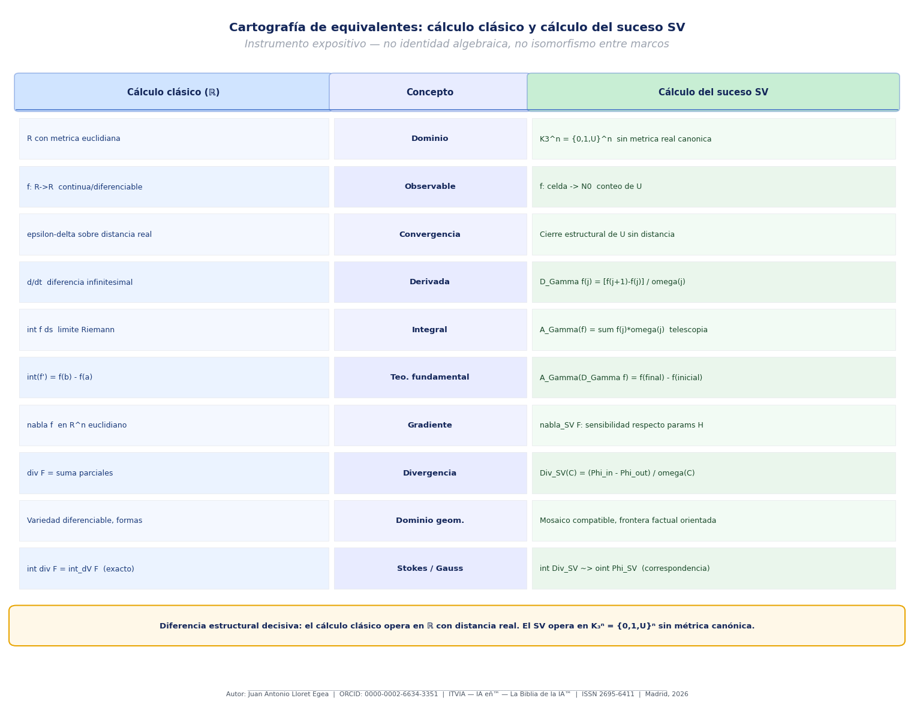
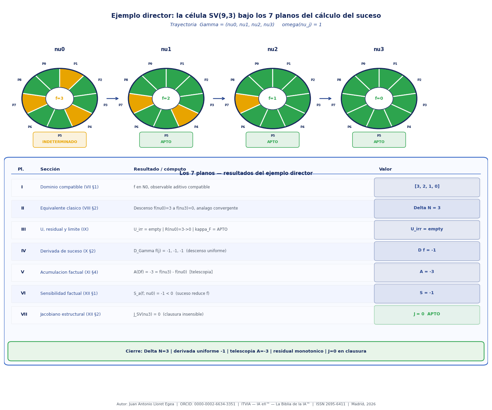
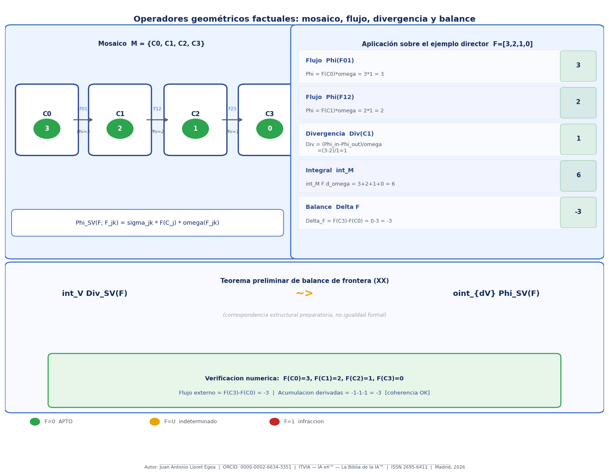
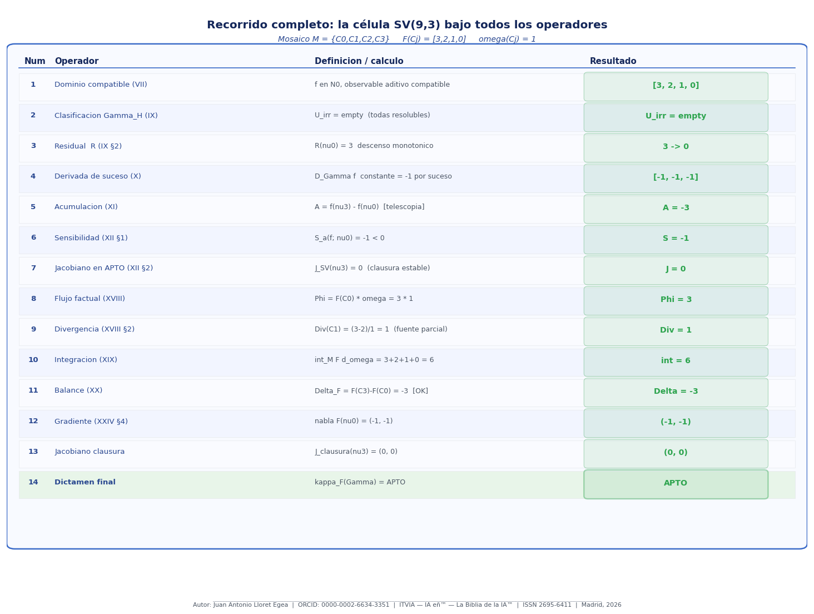
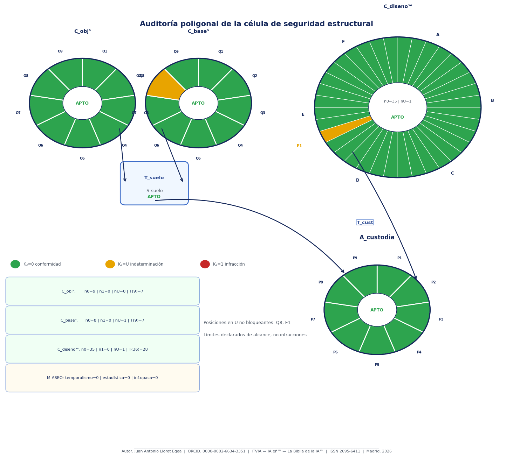

# Nuevas matemáticas del Sistema Vectorial SV y Física factual como conjunto iniciador

Juan Antonio Lloret Egea 
ORCID: 0000-0002-6634-3351 
Sello editorial: Instituto Tecnológico Virtual de la Inteligencia Artificial para el Español™ (ITVIA) 
Publicación: IA eñ™ — La Biblia de la IA™ 
ISSN: 2695-6411 
Licencia: CC BY-NC-ND 4.0 
Lugar y fecha: Madrid, 6/04/2026 

El presente estudio se organiza en dos partes. La primera parte fija el programa de física factual del <a href="https://juantoniolloretegea.github.io/SV-matematica-semantica/" target="_blank" rel="noopener noreferrer">Sistema Vectorial SV</a>: delimita qué operadores, estructuras y criterios de clausura exige cada dominio físico —electromagnetismo, gravedad, sector de Higgs y frontera cuántica— para que el sistema pueda operar con legitimidad científica propia. La segunda parte responde a esas exigencias desarrollando las nuevas matemáticas del Sistema Vectorial SV: establece los fundamentos del cálculo del suceso, construye sus operadores propios y alcanza el cierre del programa mediante análisis riguroso de completitud. La física factual actúa en todo momento como dominio director de máxima exigencia; las nuevas matemáticas nacen de esa exigencia y la satisfacen.

# Primera parte. Física factual del Sistema Vectorial SV

Esta primera parte abre el estudio de física factual del Sistema Vectorial SV como proyección subordinada de las nuevas matemáticas del suceso. No declara una nueva física cerrada del SV ni desplaza la autoridad de la física moderna. Su rango es más preciso: ordenar, con prudencia y con respeto a la jerarquía doctrinal del sistema, la futura construcción de células factuales para electromagnetismo, gravedad, ondas gravitacionales, sector de Higgs y frontera cuántica.

A medida que ese estudio factual queda delineado, se hace visible la exigencia estructural que lo sostiene: el Sistema Vectorial SV necesita operadores propios de cambio, circulación, acumulación, residualidad y clausura factual. Esa necesidad constituye la demanda que la segunda parte desarrolla y satisface.

## 1. Estatuto

Este conjunto queda subordinado a:
- la <a href="https://github.com/juantoniolloretegea/SV-matematica-semantica" target="_blank" rel="noopener noreferrer">sede doctrinal superior del SV</a>;
- el conjunto principal de nuevas matemáticas del SV;
- y la cadena de prevalencia del proyecto.

No puede introducir tiempo soberano, probabilidad, minería de datos, inferencia opaca, heurística no declarada ni clausura espuria de U.

Estas cautelas de subordinación, no clausura y disciplina doctrinal rigen para todos los apartados que siguen.

## 2. Objeto

Este conjunto estudiará cómo una teoría física, un protocolo experimental, una trayectoria de observación, un residual y un dictamen de clausura pueden expresarse dentro del SV sin falsear ni la física moderna ni el álgebra del sistema.

## 3. Apartados de este conjunto

1. Electromagnetismo factual del SV.
2. Gravedad discreta, curvatura factual y ondas gravitacionales.
3. Sector de Higgs y física factual de partículas.
4. Frontera cuántica, no clausura y límites del régimen ternario.
5. Alcance, límites y estado del conjunto Física factual del Sistema Vectorial SV.

## 4. Laboratorios directores

- Maxwell factual sintético.
- Higgs factual sintético.
- Gravedad factual sintética.

## 5. Dictamen

Este conjunto queda constituido como estudio futuro del SV. No se cierra aquí ninguna teoría física nueva; se abre un estudio disciplinado de trabajo.

# I. Electromagnetismo factual del Sistema Vectorial SV

## 1. Núcleo del problema

Las ecuaciones de Maxwell, en forma diferencial, obligan a tratar divergencia, rotor, condiciones de contorno, propagación, medios materiales y conservación de carga. El SV no puede responder aquí con simple semántica; necesita operadores propios de cambio, circulación, acumulación, residualidad y clausura factual.

## 2. Embriones de mapeo

Quedan identificados los siguientes elementos, desarrollados en secciones posteriores de este documento:
- residual electromagnético factual (→ IX §2, XXIV §11.3–11.6);
- derivada de suceso del residual (→ X §2);
- circulación factual sobre trayectorias cerradas (→ XI §3);
- sensibilidad respecto de fuente, medio y contorno (→ XII §1);
- jacobiano estructural del caso (→ XII §2, XXIV §5.1–5.2);
- dictamen global bajo frontera factual explícita (→ IX §3).

## 3. Laboratorio director

El laboratorio sintético asociado debe comprobar que trayectorias de residuales de campo pueden leerse sin tiempo soberano, con acumulación factual y sensibilidad trazable.

## 4. Deudas resueltas en secciones posteriores

- divergencia factual formal → resuelta en XXIV §3.6;
- rotor factual formal → resuelta en XXIV §3.7;
- equivalentes de superficie y volumen → resueltos en XXIV §3.8;
- célula factual cerrada de Maxwell → resuelta en XXIV §11.3–11.5.

# II. Gravedad discreta, curvatura factual y ondas gravitacionales en el Sistema Vectorial SV

## 1. Exigencia matemática

La gravedad obliga a pensar recorrido, acumulación sobre dominios discretos, sensibilidad a parámetros geométricos y consistencia de cierre entre múltiples detectores o trayectorias de lectura.

## 2. Embriones de mapeo

- residual gravitacional factual (→ IX §2, XXIV §11.1–11.2);
- trayectoria de coincidencia (→ XI §2);
- acumulación factual de evento (→ XI §1);
- sensibilidad estructural respecto de parámetros de detector (→ XII §1);
- jacobiano factual del cierre del evento (→ XII §2, XXIV §5.5).

## 3. Paradigmas comparativos

El cálculo de Regge y otros marcos discretos muestran que una apertura geométrica no continua es compatible con la investigación física seria. El SV no se declara equivalente a ellos, pero sí reconoce aquí un estudio de comparación futura.

## 4. Laboratorio director

Se propone un laboratorio sintético de evento gravitacional con trayectorias de coincidencia y reapertura.

# III. Sector de Higgs y física factual de partículas en el Sistema Vectorial SV

## 1. Exigencia matemática

La física del Higgs obliga a distinguir con gran nitidez entre teoría, canal experimental, reconstrucción, residual, sensibilidad y clausura. Esto exige jacobiano estructural, jacobiano de clausura, transformadas de trayectoria y teoría rigurosa de residualidad.

## 2. Embriones de mapeo

- residual de canal del Higgs (→ IX §2, XXIV §11.6);
- sensibilidad factual de selección y reconstrucción (→ XII §1, XXIV §4–5);
- jacobiano estructural (→ XII §2, XXIV §5.1–5.2);
- jacobiano de clausura (→ XII §3, XXIV §5.5);
- transformada de trayectoria del canal (→ XII §4, XXIV §6).

## 3. Laboratorio director

Se propone un laboratorio sintético de canal del Higgs con trayectorias de evidencia y reapertura.

# IV. Frontera cuántica, no clausura y límites del régimen ternario en física factual del SV

## 1. Lo que sí entra

- necesidad de una teoría rigurosa de no clausura;
- trayectorias de observación y reapertura;
- sensibilidad factual de estados y mediciones;
- transformadas y operadores más ricos en el futuro.

## 2. Lo que no entra

- sustitución de amplitudes complejas por terna;
- cierre doctrinal de una física cuántica del SV.

## 3. Dictamen

La frontera cuántica queda reconocida como presión de futuro sobre la matemática y el lenguaje de programación del SV, no como doctrina ya autorizada.

# V. Alcance, límites y estado del conjunto Física factual del Sistema Vectorial SV

## Estado correcto del bloque

El conjunto de Física Factual del Sistema Vectorial SV (FFSV) debe entenderse como:
- dominio director de máxima exigencia;
- banco de contraste para la nueva matemática del SV;
- bloque embrionario riguroso;
- no física factual madura ni teoría física cerrada del sistema.

## Lo ya ganado

- Apartados de este conjunto:
 1. Electromagnetismo factual del SV.
 2. Gravedad discreta, curvatura factual y ondas gravitacionales.
 3. Sector de Higgs y física factual de partículas.
 4. Frontera cuántica, no clausura y límites del régimen ternario.
 5. Alcance, límites y estado del conjunto Física factual del Sistema Vectorial SV.
- tres laboratorios sintéticos iniciales;
- secuencia propia de conjunto.

## Lo que sigue abierto

- formalización completa de los campos físicos factuales;
- laboratorios con mayor falsabilidad;
- integración más dura con el lenguaje de programación del SV y con el bloque de geometría factual → resuelta en XXIV §12;
- y delimitación más fina de la frontera cuántica → resuelta en XXIV §13.

## Conclusión

El bloque de Física Factual del Sistema Vectorial SV mantiene su validez con rango exacto: constituye un bloque embrionario riguroso de exigencia matemática, no una física factual madura ni una teoría física cerrada del sistema.

# Segunda parte. Las nuevas matemáticas del Sistema Vectorial SV

Esta segunda parte se abre en respuesta directa a las exigencias establecidas en la primera. La física factual no comparece aquí como marco de referencia externo, sino como dominio director que revela una carencia estructural determinada: el Sistema Vectorial SV no puede sostener con legitimidad sus futuras células factuales si no dispone de operadores propios de cambio, acumulación, sensibilidad, residualidad y clausura. Esta exigencia es de naturaleza doble: interna, porque el sistema ya dispone del suelo conceptual suficiente para construir ese aparato matemático; y externa, porque el <a href="https://github.com/juantoniolloretegea/SV-lenguaje-de-computacion" target="_blank" rel="noopener noreferrer">Lenguaje de Computación del SV</a> no puede proyectarse con rigor científico sin él.

El desarrollo avanza desde los fundamentos operativos del cálculo del suceso —derivadas de suceso, acumulación factual, jacobianos estructurales, transformadas de trayectoria, geometría factual— hasta el cierre de la sección XXIV, que resuelve las carencias matemáticas identificadas en el curso del programa.

# VI. Las nuevas matemáticas del Sistema Vectorial SV y su mapeo frente al cálculo infinitesimal

## 1. Naturaleza y rango

El presente apartado tiene rango de **documento marco**. Su legitimidad depende de que permanezca subordinado a la sede doctrinal del sistema y de que no intente forzar crecimiento por la vía del backend, del laboratorio o del <a href="https://github.com/juantoniolloretegea/SV-motor" target="_blank" rel="noopener noreferrer">motor de inteligencia artificial</a>.

## 2. Objeto del estudio

El estudio tiene por objeto:

- Los fundamentos operativos del cálculo del suceso: operaciones elementales y dominios compatibles en el Sistema Vectorial SV;
- cartografiar equivalentes del cálculo clásico frente al régimen del suceso;
- abrir operadores propios de cambio, acumulación, sensibilidad, residualidad y clausura;
- preparar la proyección de ese aparato al Lenguaje de Computación del SV;
- y dejar abierta, sin precipitación, una futura física factual del sistema.

## 3. Restricciones constitutivas

El estudio queda abierto bajo estas restricciones:

1. Prohibición de tiempo soberano.
2. Prohibición de probabilidad, estadística, minería de datos, heurística no declarada e inferencia opaca.
3. Prohibición de cerrar `U` por plausibilidad o por ausencia de prueba.
4. Prohibición de forzar matemáticas nuevas desde backend, runner, motor de inteligencia artificial o laboratorio.
5. Subordinación absoluta del lenguaje de programación del SV, de la compilación y de la IA a la doctrina y al álgebra del SV.

## 4. Arquitectura prevista

El estudio se ordena en cuatro bloques:

Bloque I — Fundamentos operativos del cálculo del suceso: operaciones elementales y dominios compatibles en el Sistema Vectorial SV

1. Dominios compatibles 
2. Operaciones elementales universales 
3. Operaciones condicionadas 
4. Operaciones especiales no universales 
5. Principio de no universalidad indebida 

Bloque II — Estatuto y cartografía

1. Cartografía de equivalentes 
2. La U, el residual y el límite estructural 

Bloque III — Herramientas matemáticas nuevas

1. Fundamentos operativos 
2. Derivada de suceso y de trayectoria 
3. Acumulación factual 
4. Sensibilidad factual, jacobiano estructural y transformadas 

Bloque IV — Proyección al lenguaje de programación del SV, al motor de inteligencia artificial y a la ciencia

1. El cálculo del suceso y el futuro del Lenguaje de Computación del SV 
2. Física factual del SV 
3. Compilación científica, motor de inteligencia artificial y frontera técnica con IA 
4. Laboratorio mínimo reproducible 
5. Runner mínimo reproducible 
6. Arquitectura preliminar de biblioteca matemática soberana 
7. Síntesis programática y deudas vivas 

## 5. Conclusión

Este estudio no nace para polemizar con el cálculo clásico, sino para preparar el punto en que el SV pueda hablar matemáticamente con voz propia sin carecer de fundamento matemático propio. La física actúa aquí como dominio director de exigencia; el lenguaje de programación del SV, como razón estratégica de fondo; y la doctrina, como condición de legitimidad.

# VII. Fundamentos operativos del cálculo del suceso: operaciones elementales y dominios compatibles en el Sistema Vectorial SV

## 1. Dominios compatibles

Deben distinguirse tres planos:

1. <a href="https://www.itvia.online/algebra-de-composicion-intercelular-del-sistema-vectorial-sv" target="_blank" rel="noopener noreferrer">plano ternario canónico</a>: $K_3=\lbrace 0,1,U\rbrace$ 2. plano de observables compatibles, donde existen suma, resta y, en ciertos casos, producto por escalar y cociente;

3. plano de lectura inducida, que proyecta observables o trayectorias a clausura ternaria o a dictamen.

La matemática primaria del cálculo del suceso no se define originariamente sobre $K_3$, sino sobre observables compatibles.

**Ejemplo director.** A lo largo de las secciones VII–XII se desarrolla un ejemplo continuo sobre la <a href="https://www.itvia.online/pub/fundamentos-algebraico-semanticos-del-sistema-vectorial-sv/release/3?readingCollection=4ebab177" target="_blank" rel="noopener noreferrer">célula canónica del Sistema Vectorial SV</a> de base $b=3$ y $n=9$ posiciones. Cada sección aplica el operador que le corresponde al mismo objeto de entrada; el recorrido se completa en XII §7 y se extiende al bloque geométrico en XXIV §15.

En la célula canónica del Sistema Vectorial SV de base $b=3$ y $n=9$ posiciones —formalizada en los *Fundamentos algebraico-semánticos del Sistema Vectorial SV* (Lloret Egea, 2026k)— el plano ternario canónico $K_3=\lbrace 0,1,U\rbrace$ actúa como codominio de lectura: cada posición $p_i$ del vector $\mathbf{v}=(v_1,\ldots,v_9)$ toma valor en $K_3$. El plano de observables compatibles se instancia en magnitudes aditivas derivadas de ese vector: la función $q(\mathbf{v})=|\lbrace i : v_i=U\rbrace|$, que contabiliza las posiciones en indeterminación, toma valores en $\mathbb{N}_0$ y soporta suma y resta. La clausura ternaria se obtiene por lectura inducida conforme al horizonte declarado (Lloret Egea, 2026i).

## 2. Operaciones elementales universales

### Suma

$$
a+b
$$

sobre dominios aditivos compatibles.

### Neutro

$$
0_A
$$

### Opuesto y resta

$$
a-b:=a+(-b)
$$

### Producto externo por escalar

$$
\lambda a
$$

Estas operaciones son las verdaderamente elementales del cálculo del suceso.

## 3. Operaciones condicionadas

No pueden declararse universales:
- producto interno;
- cociente;
- promedios;
- medias.

Solo serán legítimos en dominios donde estén justificados.

## 4. Operaciones especiales no universales

Raíz, logaritmo, exponencial y familias afines no son universales del SV. Solo podrán entrar como operadores subordinados a dominios compatibles.

## 5. Principio de no universalidad indebida

No toda operación definida en un codominio auxiliar pasa por ello a ser operación constitutiva del Sistema Vectorial SV.

## 6. Consecuencia retroactiva

Este apartado no invalida los textos ya escritos sobre derivada, acumulación o sensibilidad; los reencuadra correctamente.

# VIII. Cartografía de equivalentes del cálculo en el Sistema Vectorial SV

## 1. Estatuto del mapeo

Figura 1. Cartografía de equivalentes: cálculo clásico y cálculo del suceso SV

*Figura 1 — Cartografía de equivalentes entre el cálculo clásico y el cálculo del suceso del Sistema Vectorial SV. A la izquierda, el marco clásico opera sobre ℝ con métrica euclidiana: la convergencia se define por distancia real y las derivadas son infinitesimales. A la derecha, el cálculo del suceso SV opera sobre K₃ⁿ = {0,1,U}ⁿ sin métrica real canónica: la derivada de suceso es 𝔇_Γf(j) = Δf/ω, la acumulación es 𝔄 = Σf·ω y la convergencia se define estructuralmente por el cierre de la indeterminación. Las tres ideas del cálculo curvilíneo —partición, evaluación local, recorrido— se trasladan al SV como instrumento expositivo, no como identidad algebraica.*

Aquí, **equivalente** no significa identidad formal ni isomorfismo entre marcos. Significa: objeto, operador o construcción del SV que puede asumir una función matemática comparable bajo régimen propio.

## 2. Clasificación de estado

Se distinguen cuatro estados:

- **A — Apoyo doctrinal sólido**
- **B — Candidato establecido**
- **C — Candidato exploratorio**
- **D — Apertura futura remota**

## 3. Mapa principal

### 3.1. Variable independiente clásica → índice de suceso

$$
\Gamma=(\nu_0,\nu_1,\dots,\nu_k)
$$

El candidato básico a variable independiente del cálculo del SV es la posición de un suceso en una trayectoria factual. **Estado A.**

### 3.2. Derivada → derivada de suceso

$$
\Delta_{\nu_j}f:=f_{j+1}-f_j
$$

y, cuando exista peso factual positivo $\omega(\nu_j)$, $\mathfrak D_{\Gamma} f(j):=\frac{f_{j+1}-f_j}{\omega(\nu_j)}.$ **Estado B.**

### 3.3. Integral definida → acumulación factual

$$
\mathfrak A_{\Gamma}(f):=\sum_{j=0}^{k-1} f_j\thinspace \omega(\nu_j)
$$

y, cuando proceda, $\lim_{\|P_{\Gamma}\|\to 0}\sum f_j\thinspace \omega(\nu_j).$ **Estado B.**

### 3.4. Integral curvilínea → trayectoria con partición

El corpus ya reconoce una correspondencia estructural expositiva entre trayectoria <a href="https://www.itvia.online/pub/convergencia-ternaria-y-gobierno-determinista-de-trayectorias-en-el-sistema-vectorial-sv-tipologia-de-la-indeterminacion-hna-como-teorema-y-fundamentos-de-la-celula-nlp/release/2" target="_blank" rel="noopener noreferrer">SV e integral curvilínea</a>, sin identidad formal. **Estado A.**

### 3.5. Límite → clausura estructural

El candidato más sólido no es la aproximación en continuo, sino el cierre de trayectoria bajo irreducibilidad nula, profundidad de cierre acotada y dictamen apto. **Estado A/B.**

### 3.6. Jacobiano → jacobiano factual

Matriz de sensibilidad entre observables, parámetros y posiciones. **Estado B** (formalizado en XXIV §5).

### 3.7. Transformadas → transformadas de trayectoria

Familia desarrollada en XXIV §6, apoyada en secuencias, funciones generatrices, estabilización y ciclo. **Estado B/C.**

## 4. Dominios directores

La física se declara aquí como banco de exigencia:
- Maxwell exige divergencia, rotor, circulación y residualidad.
- Higgs exige sensibilidad, jacobianos y trayectorias de clausura.
- Gravedad exige recorrido, curvatura y coincidencia observacional.
- La frontera cuántica exige no diseñar una matemática demasiado pobre.

## 5. Conclusión

La cartografía deja fijado qué bloques están ya suficientemente apoyados, cuáles requieren desarrollo riguroso y cuáles deben quedar diferidos sin precipitación.

# IX. La U, el residual y el límite estructural en el Sistema Vectorial SV

## 1. La U

La `U` no es:
- probabilidad;
- media;
- nulidad;
- error técnico;
- ni dato ausente.

Su función es preservar la no clausura legítima cuando no existe base suficiente para decidir.

La formalización canónica de la U como estado estructural resoluble queda fijada en *<a href="https://www.itvia.online/pub/origen-doctrinal-definicion-y-alcance-de-la-u-en-el-sistema-vectorial-sv/release/1?readingCollection=4ebab177" target="_blank" rel="noopener noreferrer">Origen doctrinal, definición y alcance de la U en el Sistema Vectorial SV</a>* (Lloret Egea, 2026l). En la célula $\mathrm{SV}(9{,}3)$, la posición $p_i=U$ puede tipificarse en tres categorías estructuralmente distintas mediante la función $\Gamma_{\mathcal{H}}$ introducida en Lloret Egea (2026i): $U$ **irreducible** —el horizonte declarado no contiene suceso que la resuelva—, $U$ **fronteriza** —el resultado depende del suceso que llegue— y $U$ **resoluble** —existe un suceso en el horizonte que la cierra unívocamente. Esta clasificación es computable antes de ejecutar cualquier trayectoria y constituye el instrumento de gobierno que distingue al SV de los sistemas probabilísticos.

## 2. El residual

Sea $\mathcal T$ una ley o estructura de cierre declarada, y $X$ un estado factual bajo frontera explícita $F$. Se propone llamar **residual estructural** a toda magnitud que exprese la distancia entre:
- el cierre que $\mathcal T$ declara;
- y el cierre que el sistema puede sostener legítimamente para $X$.

Notación: $R_{\mathcal T,F}(X)$ Se distinguen, al menos:
- residual de cierre;
- residual de incompatibilidad;
- residual de frontera;
- residual de reapertura.

## 3. El límite estructural

Se propone llamar **límite estructural** de una trayectoria $T$ al estado de clausura alcanzado cuando:

$$
\mathcal U_{\mathrm{irr}}(T)=\varnothing,
\qquad
\Delta_N(T)\le L,
\qquad
\kappa_F(T)=APTO.
$$

El límite del SV no es aproximación continua a un punto real. Es clausura estructural de trayectoria.

En la célula canónica $\mathrm{SV}(9{,}3)$, el límite estructural corresponde a la condición $\mathcal{U}_{\mathrm{irr}}(T)=\varnothing$: ninguna posición del vector evaluado contiene $U$ irreducible. Esta condición es el enunciado operativo del Teorema HNA (<a href="https://www.itvia.online/fundamentos-algebraicos-del-gobierno-determinista-convergencia-ternaria-clasificacion-de-la-indeterminacion-y-celula-nlp" target="_blank" rel="noopener noreferrer">Hipótesis de Monotonía de Habilitación</a>), demostrado como teorema del corpus en Lloret Egea (2026i) a partir del invariante append-only de la trayectoria formalizado en Lloret Egea (2026c).

## 4. Consecuencias

Una futura teoría de continuidad del SV no debe copiar sin más el esquema epsilon–delta. Debe nacer de:
- sucesos;
- trayectoria;
- irreducibilidad;
- profundidad de cierre;
- y dictamen global bajo frontera.

## 5. Conclusión

El estudio no podrá crecer legítimamente si no preserva este trípode:
- `U` como indeterminación honesta;
- residual estructural;
- límite estructural como clausura de trayectoria.

# X. Derivada de suceso y derivada de trayectoria en el Sistema Vectorial SV

## 1. Dominio

Sea $\Gamma=(\nu_0,\nu_1,\dots,\nu_m)$ una trayectoria de sucesos y sea $q:\Gamma\to A$ un observable compatible, con $A$ al menos grupo abeliano.

## 2. Derivada de suceso

Para $j\in\lbrace 0,\dots,m-1\rbrace$, se define: $\Delta_{\nu_j}q:=q_{j+1}-q_j.$ Éste es el operador diferencial primitivo del SV.

## 3. Derivada de trayectoria

Sin normalización: $(\Delta_{\Gamma} q)(j):=\Delta_{\nu_j}q.$ Con peso factual positivo $\omega(\nu_j)$:

$$
\mathfrak D_{\Gamma} q(j):=\frac{q_{j+1}-q_j}{\omega(\nu_j)}.
$$

## 4. Derivadas de orden superior

$$
\Delta_{\nu_j}^2 q=q_{j+2}-2q_{j+1}+q_j
$$

y así sucesivamente por inducción, cuando el dominio lo permita.

## 5. Propiedades básicas

- Localidad.
- Aditividad.
- Homogeneidad.
- Telescopía.
- Invariancia append-only retrospectiva.

La propiedad de **telescopía** admite la formulación explícita:

$$
\sum_{j=a}^{b-1} \Delta_{\nu_j} f = f_b - f_a.
$$

La **invariancia append-only retrospectiva** establece que, si $\Gamma' = (\nu_0,\ldots,\nu_m,\nu_{m+1})$ es extensión de $\Gamma$ por añadido de un suceso nuevo, entonces $\Delta_{\nu_j}f$ queda invariante para todo $j\in\lbrace 0,\ldots,m-1\rbrace$.

*Ejemplo.* Sea $\Gamma=(\nu_0,\nu_1,\nu_2)$ una trayectoria sobre la célula $\mathrm{SV}(9{,}3)$, y sea $f(\nu_j)=|\lbrace i : v_j(i)=U\rbrace|$ el observable compatible que cuenta las posiciones en indeterminación en el frame $j$-ésimo (Lloret Egea, 2026k). Para $f(\nu_0)=3$, $f(\nu_1)=2$, $f(\nu_2)=0$ y pesos $\omega(\nu_j)=1$: $\Delta_{\nu_0}f=-1$ y $\Delta_{\nu_1}f=-2$. La telescopía da $\sum_{j=0}^{1}\Delta_{\nu_j}f=-3=f(\nu_2)-f(\nu_0)$. La trayectoria ha resuelto tres posiciones en indeterminación y alcanza la condición de límite estructural $\kappa_F(T)=\mathrm{APTO}$.

## 6. Lectura ternaria inducida

La derivada primaria opera sobre observables compatibles, no sobre $K_3$. La clausura ternaria se lee inducidamente mediante un morfismo $\tau$, nunca como si $\lbrace 0,1,U\rbrace$ fuese el dominio primario de la resta.

## 7. Conclusión

El operador primitivo de cambio del SV ya no es una derivada temporal. Es la **derivada de suceso**.

# XI. Acumulación factual, equivalentes de integración y operadores de recorrido en el Sistema Vectorial SV

## 1. Acumulación factual elemental

Sea $q:\Gamma\to A$ un observable acumulable y $\omega_j>0$ un peso factual. Se define:

$$
\mathfrak A_{\Gamma\lbrack a,b\rbrack}(q):=\sum_{j=a}^{b-1} q_j\thinspace \omega(\nu_j).
$$

En particular:

$$
\mathfrak A_{\Gamma}(q):=\sum_{j=0}^{m-1} q_j\thinspace \omega(\nu_j).
$$

## 2. Partición factual

Sea $P_{\Gamma}=\lbrace 0=i_0<i_1<\cdots<i_r=m\rbrace$ una partición factual. La acumulación total es aditiva por subtrayectorias y se preserva bajo refinamiento coherente.

## 3. Operadores de recorrido

- recorrido simple:

$$
\mathcal R_{\Gamma}(q)=(q_0,\dots,q_m)
$$

- recorrido ponderado:

$$
\mathcal R_{\Gamma}^\omega(q)=(q_0\omega_0,\dots,q_{m-1}\omega_{m-1})
$$

- circulación factual:

$$
\mathfrak C_{\Gamma^\circlearrowleft}(q)=\sum_{j=0}^{m-1}\varepsilon_j q_j\omega_j
$$

## 4. Relación fundamental con la derivada

Si $q_j=\mathfrak D_{\Gamma} f(j)$, entonces: $\mathfrak A_{\Gamma\lbrack a,b\rbrack}(q)=f_b-f_a.$ Ésta es la primera relación fundamental entre cambio y acumulación dentro del SV.

**Demostración.** Por definición de acumulación factual:

$$
\mathfrak A_{\Gamma\lbrack a,b\rbrack}(q) = \sum_{j=a}^{b-1} q_j\thinspace \omega(\nu_j).
$$

Sustituyendo $q_j = \mathfrak D_{\Gamma} f(j) = (f_{j+1}-f_j)/\omega(\nu_j)$:

$$
\sum_{j=a}^{b-1} \frac{f_{j+1}-f_j}{\omega(\nu_j)}\thinspace \omega(\nu_j) = \sum_{j=a}^{b-1}(f_{j+1}-f_j) = f_b - f_a.
$$

El último paso aplica la telescopía de la derivada de suceso. $\square$

*Ejemplo de aplicación.* Para la misma trayectoria $\Gamma=(\nu_0,\nu_1,\nu_2)$ sobre la célula $\mathrm{SV}(9{,}3)$ con $f(\nu_j)$ el conteo de posiciones en $U$, pesos $\omega(\nu_j)=1$ y $q_j=\mathfrak D_{\Gamma} f(j)$: $q_0=-1$, $q_1=-2$. La relación fundamental da $\mathfrak A_{\Gamma\lbrack 0,2\rbrack}(q)=(-1)\cdot 1+(-2)\cdot 1=-3=f(\nu_2)-f(\nu_0)$. La acumulación de las variaciones registra el cierre total de tres posiciones en indeterminación, con coste de memoria activa $O(\Delta N)$ (Lloret Egea, 2026i).

## 5. Lectura ternaria inducida

La acumulación factual opera primariamente sobre dominios compatibles. La clausura ternaria se obtiene solo como lectura inducida, nunca como suma en $\lbrace 0,1,U\rbrace$.

## 6. Conclusión

La derivada de suceso descompone el cambio; la acumulación factual recompone la trayectoria.

# XII. Sensibilidad factual, jacobiano estructural y transformadas de trayectoria en el Sistema Vectorial SV

## 1. Sensibilidad factual

Sea $q$ dependiente de un parámetro $x_a$. Se define la sensibilidad puntual:

$$
\mathcal S_a(q;\nu_j):=\frac{\Delta_{x_a}q_j}{\Delta x_a},
\qquad
\Delta_{x_a}q_j:=q_j(x_a+\Delta x_a)-q_j(x_a).
$$

La sensibilidad de trayectoria es la familia ordenada:

$$
\mathcal S_a^\Gamma(q)=\bigl(\mathcal S_a(q;\nu_0),\dots,\mathcal S_a(q;\nu_m)\bigr).
$$

## 2. Jacobiano estructural

Sea $q:\Gamma\to A^r$ dependiente de parámetros $x=(x_1,\dots,x_p)$. El jacobiano estructural puntual se define por:

$$
J_{\mathrm{SV}}(\nu_j)=
\left(
\frac{\Delta_{x_b} q_j^{(a)}}{\Delta x_b}
\right)_{a,b}.
$$

El jacobiano de trayectoria es la familia ordenada de esas matrices.

## 3. Jacobiano de clausura

Debe distinguirse del estructural. Registra clases de transición inducida sobre posiciones de clausura, no cocientes diferenciales sobre un dominio algebraico.

## 4. Transformadas de trayectoria

Se introduce como embrión la familia: $\mathcal T_{\Phi}\lbrack q\rbrack(\lambda):=\sum_{j=0}^{m} q_j\thinspace \Phi_{\lambda}(\nu_j),$ con núcleo declarado $\Phi_{\lambda}$ sobre sucesos.

## 5. Lectura

Este bloque mide:
- propagación;
- dependencia;
- vulnerabilidad estructural del cierre;
- y reexpresión de trayectorias.

## 6. Conclusión

Si derivada y acumulación permitían medir cambio y recomposición, sensibilidad y transformadas permiten medir propagación, robustez y reexpresión del caso.

## 7. Ejemplo director: la célula $\mathrm{SV}(9,3)$ bajo los operadores del cálculo del suceso

Este apartado aplica, sobre un único objeto de entrada, todos los operadores de las secciones VII–XII. El mismo objeto se extiende al bloque geométrico en XXIV §15.

Figura 2. Ejemplo director: la célula SV(9,3) bajo los 7 planos del cálculo del suceso

*Figura 2 — Ejemplo director: la célula SV(9,3) evaluando un frame conversacional bajo los siete planos del cálculo del suceso. La trayectoria Γ = (ν₀, ν₁, ν₂, ν₃) con f = [3, 2, 1, 0] muestra la convergencia desde tres posiciones en indeterminación (P₁, P₄, P₇ = U) hasta el cierre completo en ν₃ = APTO. Plano I: dominio compatible, f ∈ ℕ₀. Plano II: equivalente clásico, descenso ΔN=3. Plano III: U_irr = ∅ (todas resolubles). Plano IV: derivada constante 𝔇f ≡ −1. Plano V: acumulación telescópica 𝔄 = −3 = f(ν₃)−f(ν₀). Plano VI: sensibilidad 𝒮_a = −1 < 0. Plano VII: jacobiano en clausura J_SV(ν₃) = 0.*

**Objeto.** Sea la célula canónica $\mathrm{SV}(9,3)$ evaluando un frame conversacional conforme a *El transductor lingüístico y el horizonte $H_{\mathrm{NLP}}$ del Sistema Vectorial SV* (Lloret Egea, 2026j). Trayectoria $\Gamma = (\nu_0, \nu_1, \nu_2, \nu_3)$:

$$
\mathbf{v}_0 = (U,0,0,\thinspace U,0,0,\thinspace U,0,0), \quad
\mathbf{v}_1 = (0,0,0,\thinspace U,0,0,\thinspace U,0,0),
$$

$$
\mathbf{v}_2 = (0,0,0,\thinspace 0,0,0,\thinspace U,0,0), \quad
\mathbf{v}_3 = (0,0,0,\thinspace 0,0,0,\thinspace 0,0,0).
$$

Observable compatible (VII §1): $f(\nu_j)=|\lbrace i : v_j(i)=U\rbrace|$, con $f(\nu_0)=3$, $f(\nu_1)=2$, $f(\nu_2)=1$, $f(\nu_3)=0$.

**Plano I — Dominio compatible (VII §1).** $K_3=\lbrace 0,1,U\rbrace$ codominio de lectura; $f \in \mathbb{N}_0$ observable aditivo compatible. Lectura inducida: APTO si $f=0$.

**Plano II — Equivalente clásico (VIII §2).** El descenso $f(\nu_0)=3 \to f(\nu_3)=0$ es el análogo de una función convergente a su mínimo. $\Delta N = 3$.

**Plano III — U, residual y límite (IX).** Mediante $\Gamma_{\mathcal{H}}$ (Lloret Egea, 2026i): $P_1$, $P_4$ y $P_7$ son U-resolubles; $\mathcal{U}_{\mathrm{irr}}(\nu_0)=\varnothing$ (gobernable). Residual $\mathcal{R}(\nu_0)=3$; límite $\kappa_F(\Gamma)=\mathrm{APTO}$ en $\nu_3$.

**Plano IV — Derivada de suceso (X §2).** Con $\omega(\nu_j)=1$:

$$
\mathfrak{D}_{\Gamma} f(0)=-1,\quad \mathfrak{D}_{\Gamma} f(1)=-1,\quad \mathfrak{D}_{\Gamma} f(2)=-1.
$$

Una posición en $U$ por suceso. Segunda derivada $\mathfrak{D}^2_{\Gamma} f \equiv 0$: variación lineal.

**Plano V — Acumulación factual (XI §4).** Relación fundamental:

$$
\mathfrak{A}_{\Gamma\lbrack 0,3\rbrack}(\mathfrak{D}_{\Gamma} f) = -3 = f(\nu_3)-f(\nu_0).
$$

Coste de memoria activa: $O(3)$ (Lloret Egea, 2026i).

**Plano VI — Sensibilidad factual (XII §1).** Sea $a$ el umbral de activación en $\mathcal{H}_{\mathrm{NLP}}$. $\mathcal{S}_a(f;\nu_0)<0$: activar un suceso adicional reduce $f$ en una unidad. Sensibilidad uniforme a lo largo de $\Gamma$.

**Plano VII — Jacobiano estructural (XII §2).** El jacobiano $J_{\mathrm{SV}}(\nu_j)$ mide la tasa de cambio del observable por unidad de variación paramétrica. En $\nu_3$ (APTO): $J_{\mathrm{SV}}(\nu_3)=0$ — el punto de convergencia es insensible a variaciones del horizonte.

**Cierre del recorrido parcial.** Los operadores VII–XII producen un dictamen coherente: $\Delta N=3$, derivada uniforme, acumulación telescópica verificada, residual decreciente, jacobiano nulo en el cierre. El cuadro geométrico completo en XXIV §15.

# XIII. Compilación científica, motor de inteligencia artificial y frontera técnica con IA para las nuevas matemáticas del Sistema Vectorial SV

Este apartado fija la relación entre:
- nuevas matemáticas del suceso;
- lenguaje de programación del SV;
- compilación científica;
- motor de inteligencia artificial;
- y frontera técnica con IA.

Su tesis central es que la matemática del suceso no puede quedar suspendida como doctrina abstracta; si madura, debe proyectarse al lenguaje de programación del SV y a la compilación, mientras el motor de inteligencia artificial y los sistemas de IA quedan siempre detrás, como auxiliares, nunca como sedes de verdad.

## 1. Compilación científica

Se propone llamar **compilación científica** al proceso por el cual una formulación matemática o factual del SV:
1. se expresa en sintaxis del lenguaje de programación del SV;
2. se valida contra frontera normativa, gramática e IR;
3. preserva semántica ternaria y estructural;
4. se hace ejecutable o cotejable;
5. y mantiene trazabilidad suficiente para auditoría.

## 2. Motor de inteligencia artificial

El motor de inteligencia artificial:
- no funda matemáticas nuevas;
- no corrige la doctrina;
- sí puede ayudar en laboratorio, visualización, runners y apoyo a agentes especializados.

## 3. Frontera técnica con IA

Toda IA usada en torno a este estudio:
- es auxiliar;
- no cierra `U`;
- no emite HECHOS soberanos;
- y no puede introducir tiempo desnudo, probabilidad ni inferencia opaca.

## 4. Conclusión

La compilación científica del SV solo será legítima si la matemática del suceso entra en el lenguaje de programación del SV sin perder obediencia al álgebra, y si el motor de inteligencia artificial y la IA quedan siempre detrás.

# XIV. Laboratorio mínimo reproducible del cálculo del suceso en el Sistema Vectorial SV

## 1. Módulos del laboratorio

### Módulo A — Cambio
- derivada de suceso;
- derivada de trayectoria;
- derivadas de orden superior.

### Módulo B — Acumulación
- acumulación factual elemental y total;
- recorrido ponderado;
- telescopía.

### Módulo C — Sensibilidad
- sensibilidad puntual;
- sensibilidad de trayectoria;
- jacobiano estructural mínimo.

### Módulo D — Custodia
- append-only;
- no degradación de `U`;
- separación de planos;
- no cierre favorable.

## 2. Casos canónicos mínimos

- Trayectoria constante.
- Trayectoria lineal.
- Trayectoria con curvatura discreta.
- Apertura y resolución inducida.
- Reapertura legítima.

## 3. Entregables mínimos

- código ejecutable;
- pseudocódigo;
- salida JSON congelada;
- dictamen de custodia;
- README del laboratorio.

## 4. Conclusión

El laboratorio mínimo no prueba que la nueva matemática del SV esté cerrada; prueba que ya puede empezar a materializarse sin traicionarse.

# XV. Especificación preliminar del runner mínimo reproducible del cálculo del suceso en el Sistema Vectorial SV

## 1. Funciones mínimas

El runner debe cubrir:
- cambio;
- acumulación;
- sensibilidad;
- custodia;
- congelación de salida.

## 2. Entradas mínimas

- identificación del caso;
- trayectoria factual;
- observable compatible;
- pesos factuales;
- perturbaciones declaradas;
- lectura ternaria inducida opcional.

## 3. Salidas obligatorias

- derivadas;
- acumulación;
- sensibilidad;
- jacobiano;
- lectura inducida, si procede;
- dictamen local;
- custodia;
- huella de integridad.

## 4. Invariantes

- no degradación de `U`;
- append-only;
- separación de planos;
- no cierre favorable;
- frontera explícita.

## 5. Catálogo mínimo de errores

NMSV001 — Trayectoria vacía 
NMSV002 — Pesos no positivos 
NMSV003 — Observable no compatible 
NMSV004 — Longitud incompatible 
NMSV005 — Lectura ternaria mal declarada 
NMSV006 — Degradación ilegítima de `U` 
NMSV007 — Violación append-only 
NMSV008 — Cierre favorable ilegítimo

## 6. Conclusión

El runner mínimo reproducible convierte el estudio en ejecución, salida visible, custodia y preparación de su unión con el lenguaje de programación del SV.

# XVI. Arquitectura preliminar de la biblioteca matemática soberana del Lenguaje de Computación del Sistema Vectorial SV

## 1. Qué debe entenderse por biblioteca matemática soberana

Conjunto de módulos, tipos, contratos y operadores que:
- expresan matemáticas del suceso justificadas doctrinalmente;
- preservan la semántica ternaria y el estatuto de la `U`;
- son computables sin perder trazabilidad;
- y sirven de base a laboratorios, simulaciones y dominios científicos.

## 2. Arquitectura mínima propuesta

### Núcleo de sucesos
- `sv.suceso.delta`
- `sv.suceso.derivada`
- `sv.suceso.orden_superior`

### Núcleo de trayectorias
- `sv.trayectoria.base`
- `sv.trayectoria.recorrido`
- `sv.trayectoria.acumulacion`
- `sv.trayectoria.circulacion`

### Núcleo de sensibilidad
- `sv.sensibilidad.puntual`
- `sv.sensibilidad.trayectoria`
- `sv.sensibilidad.jacobiano`
- `sv.sensibilidad.clausura`

### Núcleo de residualidad
- `sv.residual.base`
- `sv.residual.cierre`
- `sv.residual.incompatibilidad`
- `sv.residual.reapertura`

### Núcleo de clausura
- `sv.clausura.u`
- `sv.clausura.gamma_h`
- `sv.clausura.delta_n`
- `sv.clausura.dictamen`

### Núcleo de transformadas
- `sv.transformada.nucleo`
- `sv.transformada.trayectoria`
- `sv.transformada.reconstruccion`

### Núcleo de dominios directores
- `sv.dominio.maxwell`
- `sv.dominio.higgs`
- `sv.dominio.gravedad`
- `sv.dominio.cuantico_frontera`

## 3. Tipos mínimos

- tipo `U`;
- tipo `Trayectoria`;
- tipo `Residual`;
- tipo `Dictamen`;
- tipo `Suceso`.

## 4. Contratos de comportamiento

- no degradación de `U`;
- append-only;
- trazabilidad;
- no cierre favorable;
- frontera explícita.

## 5. Conclusión

Si el lenguaje de programación del SV quiere aspirar a madurez científica real, deberá llegar a disponer de esta biblioteca soberana nacida desde la sede doctrinal.

# XVII. Geometría factual preliminar, orientación y mosaicos del cálculo del suceso en el Sistema Vectorial SV

Este apartado abre la base geométrica mínima del cálculo del suceso. Su función es fijar las nociones preparatorias de trayectoria factual orientada, frontera factual, mosaico compatible y campo factual como suelo necesario para el bloque geométrico posterior. No importa geometría diferencial clásica como soberana, no altera la terna `{0,1,U}` y no autoriza cierres por intuición visual. Sí fija el vocabulario mínimo con el que el SV puede hablar de borde, interior, compatibilidad y agregación geométrica sin traicionar su régimen de sucesos.

Figura 3. Operadores geométricos factuales: mosaico, flujo, divergencia y balance

*Figura 3 — Operadores geométricos del cálculo del suceso aplicados sobre el mosaico M = {C₀, C₁, C₂, C₃} con campo factual F(Cⱼ) = [3, 2, 1, 0]. Arriba izquierda: el mosaico con sus fronteras orientadas F₀₁, F₁₂, F₂₃ y el flujo factual Φ(F_jk) = F(C_j)·ω(F_jk) por cada frontera. Arriba derecha: aplicación numérica — Φ(F₀₁)=3, Φ(F₁₂)=2, Div(C₁) = (3−2)/1 = 1, ∫_M = 6, ΔF = −3. Abajo: el teorema preliminar de balance de frontera muestra la correspondencia estructural (⟿) entre la integral de la divergencia y el flujo externo, verificada numéricamente: ΔF = F(C₃)−F(C₀) = −3, coincidente con la acumulación de derivadas del ejemplo director.*

**Nota metodológica sobre el orden de las secciones XVII–XX.** Los operadores geométricos del SV —flujo, divergencia, rotor e integración— se definen en estas secciones mediante sumas discretas orientadas sobre fronteras y mosaicos, sin invocar derivadas parciales en sentido analítico. Esta elección sigue la lógica del cálculo diferencial exterior: los operadores globales preceden a la representación local en coordenadas. La derivada parcial factual y el gradiente se formalizan en XXIV §4; la equivalencia "divergencia = suma de parciales factuales" se establece en XXIV §5. El lector que prefiera el orden analítico clásico puede consultar XXIV §4 antes de retomar estas secciones sin pérdida de coherencia.

## 1. Objeto

Este apartado fija cuatro nociones:

1. trayectoria factual orientada; 
2. frontera factual; 
3. mosaico compatible; 
4. campo factual. 

## 2. Definiciones de trabajo

### 2.1 Trayectoria factual orientada

Sea $\Gamma=(\nu_0,\dots,\nu_m)$. La trayectoria está orientada si el orden es semánticamente significativo y no puede permutarse sin cambiar el caso.

### 2.2 Frontera factual

Se llama frontera factual al conjunto de condiciones explícitas que delimitan qué parte del caso se observa, qué borde cuenta y qué cierre puede emitirse.

### 2.3 Mosaico compatible

Un mosaico compatible es un conjunto finito de trayectorias, subtrayectorias o celdas locales cuya agregación no introduce contradicción semántica no tipada y cuya frontera permanece trazable.

### 2.4 Campo factual

Un campo factual es toda aplicación $\mathcal F:D\to A^r$ definida sobre una trayectoria, una superficie factual o un volumen factual del sistema, con codominio compatible y lectura estructuralmente interpretable.

## 3. Consecuencias

Con este apartado el SV puede empezar a hablar de:
- recorrido orientado;
- borde total e interiores;
- agregación sobre elementos;
- y futura circulación, flujo y balance.

## 4. Límites

No procede declarar todavía:
- superficie o volumen formales;
- flujo y rotor cerrados;
- ni una física factual madura del sistema.

## 5. Conclusión

La nueva matemática del SV dispone ya de una base geométrica mínima. No es todavía una geometría cerrada del sistema, pero sí el suelo necesario para que el bloque de geometría factual dejara de mantenerse en el plano puramente declarativo.

# XVIII. Divergencia, flujo y rotor factual en el Sistema Vectorial SV

Este apartado introduce la primera formulación explícita de flujo factual, divergencia factual y rotor factual en el SV. Su función es preparar el bloque geométrico para posteriores desarrollos sobre superficies, volúmenes, balance de frontera y dominios físicos. Los operadores se definen en régimen preliminar: no se identifican con la geometría clásica, no presuponen métrica euclídea y no autorizan geometría auxiliar soberana.

## 1. Flujo factual

Sea $\mathcal F$ un campo factual y $F$ una frontera factual explícita. El flujo factual se define preliminarmente por:

$$
\Phi_{SV}(\mathcal F;\mathcal M,F)=\sum_j \sigma_j\thinspace \mathcal F(F_j)\thinspace \omega(F_j).
$$

## 2. Divergencia factual

Para una unidad local $C$ con frontera $F_C$:

$$
\mathrm{Div}_{SV}(\mathcal F;C)=\Phi_{SV}(\mathcal F;C,F_C)-\mathcal I_{SV}(\mathcal F;C).
$$

## 3. Rotor factual

Sobre un ciclo factual compatible $\Gamma^\circlearrowleft$:

$$
\mathrm{Rot}_{SV}(\mathcal F;\Gamma^\circlearrowleft)=\mathfrak C_{\Gamma^\circlearrowleft}(\mathcal F).
$$

## 4. Estatuto

Este apartado nombra ya con precisión suficiente las tres familias, pero no las cierra como formulación completa. Su rango es el de apertura preliminar; las versiones completas de flujo, divergencia y rotor factual quedan establecidas en XXIV §3.5–3.7.

## 5. Conclusión

El bloque geométrico deja de ser una aspiración puramente verbal. A partir de aquí ya existe un primer núcleo explícito de flujo, divergencia y rotor factual.

# XIX. Integrales de superficie y volumen del Sistema Vectorial SV: formulación preliminar, pegado y balance de frontera

## 1. Superficie factual

Una superficie factual es un mosaico compatible de trayectorias o elementos locales que delimita un borde de balance y cuya orientación queda declarada.

## 2. Volumen factual

Un volumen factual es una agregación compatible de superficies o celdas locales con frontera factual total explícita.

## 3. Pegado compatible

Dos elementos $X$ e $Y$ admiten pegado compatible si sus fronteras parciales, orientaciones y trazabilidad permiten una agregación sin doble contabilidad ilegítima.

## 4. Integrales preliminares

$$
\iint_{\Sigma_{SV}}^{SV}\mathcal F = \sum_j \sigma_j\thinspace \mathcal F(\Gamma_j)\thinspace \omega(\Gamma_j)
$$

$$
\iiint_{\mathcal V_{SV}}^{SV}\mathcal G = \sum_k \mathcal G(C_k)\thinspace \omega(C_k)
$$

## 5. Conclusión

El SV dispone ya de una primera teoría de agregación geométrica sobre superficies y volúmenes factuales. Su formalización completa, junto con el teorema de balance de frontera y la invariancia por refinamiento, queda establecida en XXIV §3.8–3.10.

# XX. Teorema preliminar de balance de frontera en el Sistema Vectorial SV

## Enunciado preliminar

Sea $\mathcal V_{SV}$ un volumen factual con frontera total $F(\mathcal V_{SV})$, mosaico compatible y campo factual $\mathcal F$. Bajo hipótesis de frontera explícita, pegado compatible, orientación coherente y preservación de `U`, se obtiene la correspondencia estructural:

$$
\iiint_{\mathcal V_{SV}}^{SV}\mathrm{Div}_{SV}(\mathcal F)
\;\leadsto\;
\iint_{F(\mathcal V_{SV})}^{SV}\mathcal F.
$$

El símbolo $\leadsto$ expresa correspondencia estructural preparatoria, no identidad formal cerrada.

## Idea de demostración

1. Descomponer el volumen factual en unidades locales. 
2. Expandir cada divergencia local como balance entre interior y frontera. 
3. Cancelar fronteras internas compatibles por orientación opuesta. 
4. Conservar como borde agregado solo la frontera total del volumen. 
5. Obtener el balance interior–frontera como resultado del pegado.

## Conclusión

El bloque geométrico posee aquí su primera articulación teoremática en forma de correspondencia estructural. El teorema de balance queda establecido en XXIV §3.10.

# XXI. Laboratorio mínimo reproducible del bloque geométrico del cálculo del suceso en el Sistema Vectorial SV

## Casos mínimos

- **G1** — dos unidades con frontera interna cancelable; 
- **G2** — tres unidades con orientación mixta; 
- **G3** — frontera total insuficiente; 
- **G4** — campo factual insuficiente; 
- **G5** — ciclo factual mínimo.

## Entregables

- pseudocódigo doctrinal; 
- script de referencia; 
- salida JSON congelada; 
- dictamen local de custodia; 
- figuras del mosaico y del balance.

## Criterios de verificación

- compatibilidad del mosaico; 
- frontera explícita; 
- cancelación interna correcta; 
- balance interior–frontera; 
- conservación de `U`; 
- y no soberanía de la figura.

## Conclusión

El bloque de geometría factual dispone ya de su primer laboratorio materializable. Con ello deja de mantenerse en el plano puramente declarativo.

# XXII. Especificación preliminar del runner geométrico mínimo reproducible del cálculo del suceso en el Sistema Vectorial SV

## Funciones mínimas

1. validar mosaicos compatibles; 
2. validar fronteras y orientación; 
3. calcular flujo factual; 
4. calcular divergencia local y agregada; 
5. calcular circulación factual cuando exista ciclo; 
6. contrastar el balance preliminar de frontera; 
7. emitir salida JSON, dictamen local y custodia. 

## Catálogo mínimo de errores

- mosaico incompatible; 
- frontera ausente o insuficiente; 
- orientación contradictoria; 
- campo factual no tipado; 
- doble contabilidad; 
- cierre favorable ilegítimo; 
- `U` degradada. 

## Conclusión

El runner geométrico no es todavía el lenguaje de programación del SV ni IR, pero sí el primer soporte ejecutable del bloque geométrico del cálculo del suceso.

# XXIII. Unión de la geometría factual con la futura biblioteca matemática soberana del Lenguaje de Computación del Sistema Vectorial SV

## Tipos mínimos futuros

- `MosaicoCompatible` 
- `FronteraFactual` 
- `CampoFactual` 
- `CicloFactual` 
- tipos de flujo, divergencia y balance 

## Contratos mínimos

- frontera explícita; 
- orientación coherente; 
- pegado compatible; 
- no doble contabilidad; 
- geometría auxiliar no soberana; 
- preservación de `U`. 

## Conclusión

La proyección de la geometría factual al lenguaje de programación del SV requiere tipos declarados, contratos de composición y reglas de lowering coherentes con el álgebra madre del sistema.
# XXIV. Continuidad matemática del Sistema Vectorial SV: clausura del programa a primer orden completo

Este apartado consolida, en un único cuerpo, el desarrollo matemático necesario para dar respuesta completa a las exigencias formuladas en la primera parte. Formaliza los operadores y teoremas que las secciones anteriores habían dejado abiertos, cierra el programa matemático a primer orden completo y deja registrado el estado real del conjunto al término de este estudio.

Este apartado amplía el desarrollo de las secciones precedentes con los tramos que requerían mayor detalle: ley de pegado con fórmula explícita y cancelación interna, flujo factual como operador autónomo, fórmulas completas de segundo orden, curvatura factual en versión por conexión y por holonomía, Maxwell factual con condiciones de contorno y balance desplegados, y composición formal de cambios de dominio.

## 1. Estatuto y alcance

El alcance de este apartado es recoger, en un bloque único y doctrinalmente alineado, lo que el análisis de completitud detectó como insuficientemente consolidado en las secciones previas y el desarrollo matemático añadido para cerrar esas insuficiencias. Las secciones precedentes permanecen intactas.

La cadena de prevalencia permanece intacta: $\text{doctrina} \succ \text{álgebra} \succ \text{lenguaje} \succ \text{IR} \succ \text{runner/backend}.$ Ningún operador, dominio auxiliar o formalismo posterior podrá corregir silenciosamente el suelo doctrinal del SV. La matemática primaria del cálculo del suceso continúa definiéndose sobre dominios compatibles y no sobre $K_3$, quedando la clausura ternaria como lectura inducida.

## 2. Diagnóstico de completitud matemática: carencias identificadas y cierres alcanzados

El análisis de completitud mostró que el armazón principal del programa estaba ya razonablemente asentado en derivada de suceso, acumulación factual, sensibilidad de primer orden, jacobiano estructural y apertura general del frente de física factual. Sin embargo, reveló que el conjunto seguía siendo insuficiente precisamente allí donde la física factual imponía mayor presión matemática.

Se detectaron como carencias reales:

1. insuficiencia del bloque de geometría factual;
2. ausencia de un tratamiento autónomo y completo de parciales y gradiente;
3. debilidad del bloque de segundo orden;
4. jacobiano de clausura todavía no cerrado algebraicamente;
5. transformadas de trayectoria aún embrionarias;
6. cambio de dominio todavía no zanjado;
7. frente complejo auxiliar abierto;
8. falta de singularidades, clases de ciclo y dualidad suficientes;
9. unión con el lenguaje de programación del SV e IR aún no formalmente cerrada;
10. ausencia de una capa generadora y espectral mínima.

El diagnóstico fue claro: el conjunto de secciones previas contenía ya el suelo serio del programa, pero dejaba todavía abiertas piezas indispensables para que el estudio no quedara matemáticamente incompleto precisamente en los lugares donde la física factual le exigía más.

## 3. Geometría factual: formalización completa de operadores, integrales y teoremas

### 3.1. Operador de borde factual

Sea $C$ una unidad local del mosaico. Su borde queda expresado como suma finita de bordes locales orientados:

$$
\partial C=\sum_{j=1}^{m(C)} \sigma_j\thinspace F_j,
\qquad \sigma_j\in\lbrace -1,+1\rbrace.
$$

La orientación de cada borde queda inducida por la orientación factual de la unidad de la que procede, y se cierra como regla constitutiva que

$$
\partial^2=0.
$$

Esta igualdad no se introduce como préstamo topológico ajeno, sino como principio propio de cancelación de bordes internos del SV.

### 3.2. Ley de pegado compatible

Sean $X$ e $Y$ dos unidades factuales. Diremos que admiten **pegado compatible** si existe un subconjunto de borde común $G\subseteq \partial X\cap \partial Y$ tal que:

1. $G$ está materialmente identificado;
2. sus orientaciones son opuestas;
3. sus pesos factuales son coherentes;
4. el pegado no introduce doble contabilidad.

Entonces el compuesto factual $X\cup_G Y$ satisface: $\partial(X\cup_G Y)=\partial X+\partial Y-2G_{\mathrm{int}},$ y, por cancelación orientada de borde interno,

$$
\partial(X\cup_G Y)=\partial_{\mathrm{ext}}(X,Y).
$$

### 3.3. Proposición de cancelación interna

**Proposición.** 
Si $\mathcal M$ es un mosaico compatible, toda cara interna compartida exactamente por dos unidades con orientación opuesta desaparece en $\partial\mathcal M$.

**Demostración.** 
La contribución de esa cara aparece una vez con signo $+1$ y otra con signo $-1$. Su suma es nula en el grupo aditivo compatible subyacente. Si la cara no es verificable como común, la cancelación no procede y no se clausura por intuición. $\square$

### 3.4. Frontera total del mosaico

La frontera total del mosaico compatible se define por $\partial\mathcal M:=\sum_{\alpha\in A}\partial C_{\alpha}.$ Las caras internas compatibles se cancelan automáticamente y la suma resultante deja sólo borde externo factual. Si alguna cancelación no es legitimable, la salida no se fuerza: queda componente abierta en `U`.

### 3.5. Flujo factual: definición y alcance

Sea $\mathcal F$ un campo factual formal y sea $B$ una frontera factual orientada. Se define el flujo factual por

$$
\Phi_{SV}(\mathcal F;B)
:=
\sum_j \sigma_j\thinspace \langle \mathcal F(B_j), n_{B_j}\rangle_{SV}\thinspace \omega(B_j),
$$

donde:
- $B=\sum_j \sigma_j B_j$;
- $n_{B_j}$ es una orientación factual normalizada, no necesariamente euclídea;
- $\langle\cdot,\cdot\rangle_{SV}$ denota la contracción factual compatible cuando exista;
- y, si tal contracción no procede, el flujo se mantiene en el nivel escalar que resulte legítimo.

### 3.6. Divergencia factual: formulación formal

Para una unidad local $C$, se define la divergencia factual formal por

$$
\mathrm{Div}_{SV}(\mathcal F;C)\thinspace \omega(C) = \Phi_{SV}(\mathcal F;\partial C)-\mathcal I_{\mathrm{res}}(\mathcal F;C),
$$

donde $\mathcal I_{\mathrm{res}}$ es el término factual interno de fuente, sumidero o residual estructural local.

En el caso homogéneo sin residual interior:

$$
\mathrm{Div}_{SV}(\mathcal F;C)\thinspace \omega(C)=\Phi_{SV}(\mathcal F;\partial C).
$$

### 3.7. Rotor factual: formulación formal

Sobre un ciclo factual orientado $\Gamma^\circlearrowleft$, se define la circulación factual

$$
\mathfrak C_{\Gamma^\circlearrowleft}(\mathcal F) = \sum_j \varepsilon_j\thinspace \mathcal F(\Gamma_j)\thinspace \omega(\Gamma_j).
$$

El rotor factual formal queda definido como la clase de operador local cuya integral factual de superficie recupera la circulación sobre $\partial\Sigma$. Más abajo se refuerza además como antisimetría de parciales posicionales.

### 3.8. Integrales factuales: formulación completa

Para una superficie factual $\Sigma_{SV}$:

$$
\iint_{\Sigma_{SV}}^{SV}\mathcal F
:=
\sum_j \sigma_j\thinspace \mathcal F(B_j)\thinspace \omega(B_j).
$$

Para un volumen factual $\mathcal V_{SV}$:

$$
\iiint_{\mathcal V_{SV}}^{SV}\mathcal G
:=
\sum_k \mathcal G(C_k)\thinspace \omega(C_k).
$$

### 3.9. Invariancia por refinamiento

**Teorema.** 
Si $\mathcal M'$ es un refinamiento compatible de $\mathcal M$, entonces

$$
\iint_{\Sigma_{SV}}^{SV}\mathcal F
\quad\text{y}\quad
\iiint_{\mathcal V_{SV}}^{SV}\mathcal G
$$

son invariantes bajo el paso de $\mathcal M$ a $\mathcal M'$, salvo contribuciones que deban permanecer abiertas en `U`.

### 3.10. Teorema de balance de frontera

Si $\mathcal V_{SV}$ es un volumen factual compatible y $\mathcal F$ un campo factual formal, entonces, bajo frontera explícita, orientación coherente, pegado compatible, ausencia de doble contabilidad y preservación de `U`,

$$
\iiint_{\mathcal V_{SV}}^{SV}\mathrm{Div}_{SV}(\mathcal F) = \iint_{\partial\mathcal V_{SV}}^{SV}\mathcal F - \iiint_{\mathcal V_{SV}}^{SV}\mathcal I_{\mathrm{res}}(\mathcal F).
$$

En el caso homogéneo sin residual interior:

$$
\iiint_{\mathcal V_{SV}}^{SV}\mathrm{Div}_{SV}(\mathcal F) = \iint_{\partial\mathcal V_{SV}}^{SV}\mathcal F.
$$

La lectura ternaria se reserva para un momento posterior; no participa en la igualdad algebraica misma.

### 3.11. Laboratorio geométrico mínimo reproducible

#### Casos mínimos
- **G1** — dos unidades con frontera interna cancelable;
- **G2** — tres unidades con orientación mixta;
- **G3** — frontera total insuficiente;
- **G4** — campo factual insuficiente;
- **G5** — ciclo factual mínimo.

#### Entregables mínimos
- pseudocódigo doctrinal;
- script de referencia;
- salida JSON congelada;
- dictamen local de custodia;
- figuras del mosaico y del balance.

#### Criterios de verificación
- compatibilidad del mosaico;
- frontera explícita;
- cancelación interna correcta;
- balance interior–frontera;
- conservación de `U`;
- no soberanía de la figura.

### 3.12. Runner geométrico mínimo reproducible

#### Funciones mínimas
1. validar mosaicos compatibles;
2. validar fronteras y orientación;
3. calcular flujo factual;
4. calcular divergencia local y agregada;
5. calcular circulación factual cuando exista ciclo;
6. contrastar el balance preliminar de frontera;
7. emitir salida JSON, dictamen local y custodia.

#### Catálogo mínimo de errores
- mosaico incompatible;
- frontera ausente o insuficiente;
- orientación contradictoria;
- campo factual no tipado;
- doble contabilidad;
- cierre favorable ilegítimo;
- `U` degradada.

## 4. Derivadas parciales, gradiente y operadores de segundo orden

### 4.1. Parciales paramétricas

Si $q:\Gamma\to A^r$ depende de parámetros $x=(x_1,\dots,x_p)$, la parcial respecto de $x_a$ en el suceso $\nu_j$ queda definida por

$$
\partial^{SV}_{x_a} q(\nu_j)
:=
\frac{q_j(x_a+\Delta x_a)-q_j(x_a)}{\Delta x_a}.
$$

### 4.2. Parciales posicionales

Si un observable tiene componentes o posiciones internas tipadas, se define

$$
\partial^{SV}_{i} f(\nu_j)
:=
\frac{f_j^{(i,+)}-f_j^{(i,-)}}{\delta_i}.
$$

### 4.3. Gradiente factual

Gradiente posicional:

$$
\nabla^{SV}_{\mathrm{pos}} f(\nu_j) = \bigl( \partial^{SV}_{1}f(\nu_j),\dots,\partial^{SV}_{n}f(\nu_j) \bigr).
$$

Gradiente paramétrico:

$$
\nabla^{SV}_{x} f(\nu_j) = \bigl( \partial^{SV}_{x_1}f(\nu_j),\dots,\partial^{SV}_{x_p}f(\nu_j) \bigr).
$$

### 4.4. Derivada direccional factual

$$
D^{SV}_{v} f(\nu_j) = \langle \nabla^{SV}_{\mathrm{pos}} f(\nu_j), v\rangle_{SV},
$$

cuando la contracción factual compatible está legitimada en el dominio.

### 4.5. Segunda derivada de suceso

$$
\Delta_{\nu_j}^2 f:=f_{j+2}-2f_{j+1}+f_j.
$$

Versión normalizada:

$$
\mathfrak D_{\Gamma}^{(2)} f(j)
:=
\frac{f_{j+2}-2f_{j+1}+f_j}{\omega(\nu_j)\thinspace \omega(\nu_{j+1})}.
$$

### 4.6. Segundas parciales paramétricas

$$
\partial^{SV\thinspace 2}_{x_a x_a} f(\nu_j)
:=
\frac{f_j(x_a+\Delta x_a)-2f_j(x_a)+f_j(x_a-\Delta x_a)}{(\Delta x_a)^2}.
$$

Parciales mixtas:

$$
\partial^{SV\thinspace 2}_{x_a x_b} f(\nu_j)
:=
\partial^{SV}_{x_a}\bigl(\partial^{SV}_{x_b}f(\nu_j)\bigr).
$$

No se declara conmutatividad universal; solo bajo compatibilidad explícita de perturbaciones.

### 4.7. Hessiano factual

Paramétrico:

$$
H^{SV}_x f(\nu_j) = \bigl(\partial^{SV\thinspace 2}_{x_a x_b} f(\nu_j)\bigr)_{a,b}.
$$

Posicional:

$$
H^{SV}_{\mathrm{pos}} f(\nu_j) = \bigl(\partial^{SV\thinspace 2}_{ij} f(\nu_j)\bigr)_{i,j}.
$$

### 4.8. Laplaciano factual

$$
\Delta^{SV}_{\mathrm{L}} f(\nu_j)
:=
\sum_{i=1}^{n}\partial^{SV\thinspace 2}_{ii} f(\nu_j).
$$

## 5. Jacobianos, divergencia posicional y rotor como antisimetría

### 5.1. Jacobiano estructural paramétrico

$$
J^{SV}_{x}(q;\nu_j) = \left( \partial^{SV}_{x_b} q^{(a)}(\nu_j) \right)_{a,b}.
$$

### 5.2. Jacobiano posicional

$$
J^{SV}_{\mathrm{pos}}(q;\nu_j) = \left( \partial^{SV}_{i} q^{(a)}(\nu_j) \right)_{a,i}.
$$

### 5.3. Divergencia como suma de parciales diagonales

$$
\mathrm{Div}_{SV}(F) = \sum_{i=1}^{n}\partial^{SV}_{i}F^i - \mathcal I_{\mathrm{res}}(F).
$$

### 5.4. Rotor como antisimetría de parciales

$$
\Omega^{SV}_{ij}(F) = \partial^{SV}_{i}F^j-\partial^{SV}_{j}F^i.
$$

En dimensión dos basta $\Omega^{SV}_{12}$. En dimensión tres puede proyectarse a vector solo bajo estructura auxiliar declarada. En dimensión superior debe mantenerse como 2-forma factual antisimétrica.

### 5.5. Jacobiano de clausura

Morfismo de clausura: $\tau:\mathcal O \to K_3^m.$ Matriz de transición:

$$
J^{SV}_{\mathrm{cl}}(a,k) = \mathrm{clase}\Bigl( \tau_k(q(x+\Delta x_a)) \leftarrow \tau_k(q(x)) \Bigr).
$$

Clases mínimas:
- persistencia de cierre $0\to0$,
- persistencia de infracción $1\to1$,
- persistencia de `U` $U\to U$,
- resolución favorable $U\to0$,
- resolución desfavorable $U\to1$,
- reapertura $0\to U$,
- reapertura $1\to U$,
- inversión $0\leftrightarrow1$,
- bifurcación estructural.

Composición parcial $\circ_{\mathrm{cl}}$:
- la persistencia es neutra;
- dos resoluciones sucesivas colapsan en la clase final;
- una reapertura rompe la persistencia previa;
- una composición no legitimable se conserva como clase abierta.

Estabilidad: $J^{SV}_{\mathrm{cl}}(a,k)\in\lbrace 0\to0,\;1\to1,\;U\to U\rbrace$ define estabilidad; resolución favorable o desfavorable define resolución; reapertura o inversión define fragilidad.

## 6. Transformadas de trayectoria, reconstrucción e inversa factual

### 6.1. Forma general

$$
\mathcal T_{\Phi}\lbrack q\rbrack(\lambda)
:=
\sum_{j=0}^{m} q_j\thinspace \Phi_{\lambda}(\nu_j).
$$

### 6.2. Familias de transformadas mínimas

#### Transformada de amortiguación

$$
\mathcal T_{\alpha}\lbrack q\rbrack = \sum_j q_j\thinspace \alpha^j, \qquad \alpha\in R_+.
$$

#### Transformada de persistencia

$$
\mathcal T_{\mathrm{pers}}\lbrack q\rbrack(L) = \sum_j q_j\thinspace \mathbf 1_{\lbrace \ell(\nu_j)\ge L\rbrace}.
$$

#### Transformada cíclica

$$
\mathcal T_{\mathrm{cyc}}\lbrack q\rbrack(\kappa) = \sum_j q_j\thinspace e^{SV}_{\kappa}(\nu_j).
$$

#### Transformada residual

$$
\mathcal T_{\mathrm{res}}\lbrack q\rbrack = \sum_j q_j\thinspace R(\nu_j).
$$

### 6.3. Núcleos admisibles

Una familia $\Phi_{\lambda}$ es admisible si:
1. está declarada sobre sucesos o posiciones de trayectoria;
2. respeta el dominio compatible;
3. no introduce tiempo soberano;
4. mantiene trazabilidad suficiente del peso de cada término.

### 6.4. Propiedades

- linealidad;
- invariancia append-only sobre prefijos ya fijados, salvo dependencia explícita de longitud;
- compatibilidad con agregación por subtrayectorias;
- composición parcial cuando los núcleos sean compatibles.

### 6.5. Separabilidad

$$
\mathcal T_{\Phi}\lbrack q_1\rbrack=\mathcal T_{\Phi}\lbrack q_2\rbrack \implies q_1=q_2
\quad\text{para todo } q_1,q_2\in\mathcal Q.
$$

### 6.6. Inversa factual

$$
\mathcal T_{\Phi}^{-1}:\mathrm{Im}(\mathcal T_{\Phi})\to \mathcal Q/\sim
$$

con tres regímenes:
- reconstrucción exacta;
- reconstrucción parcial por clases;
- preservación de `U` reconstructiva.

### 6.7. Estabilidad reconstructiva

$$
\kappa^{SV}_{\mathrm{rec}}(\Phi,q) = \frac{\|\delta q\|_{SV}}{\|\delta \mathcal T_{\Phi}\lbrack q\rbrack\|_{SV}}.
$$

### 6.8. Teorema de reconstrucción

Si $\Phi$ es separante y estable sobre $\mathcal Q$, entonces

$$
\mathcal T_{\Phi}^{-1}\bigl(\mathcal T_{\Phi}\lbrack q\rbrack\bigr)=q.
$$

Si $\Phi$ no es separante, la salida correcta es una clase de equivalencia o `U` reconstructiva.

## 7. Cambio de dominio ampliado

### 7.1. Definición

$$
\mathfrak C_{D\to D'}:\mathcal O_D\to \mathcal O_{D'}
$$

con:
1. trazabilidad del observable;
2. no colapso de `U`;
3. declaración explícita de estructura preservada o perdida;
4. subordinación a la prevalencia doctrinal.

### 7.2. Clases mínimas
- cambio de representación;
- cambio de cálculo compatible;
- cambio de lectura;
- cambio auxiliar reversible.

### 7.3. Invariantes

$$
\mathrm{Inv}(\mathfrak C)=
\lbrace \text{aditividad},\ \text{orden},\ \text{clase de cierre},\ \text{residual},\ \text{frontera},\ \text{orientación}\rbrace.
$$

### 7.4. Composición formal de cambios de dominio

Si $\mathfrak C_{D_0\to D_1},\quad \mathfrak C_{D_1\to D_2}$ son legítimos y sus invariantes son compatibles, entonces existe la composición

$$
\mathfrak C_{D_0\to D_2} = \mathfrak C_{D_1\to D_2}\circ \mathfrak C_{D_0\to D_1}.
$$

Si la compatibilidad de invariantes no puede sostenerse, la composición no se fuerza; queda abierta o tipada como no aplicable.

### 7.5. Corolario

Quedan legitimados:
- paso desde observables compatibles a clausura inducida;
- paso a dominios transformados;
- paso a dominio complejo auxiliar;
- retorno desde dominios auxiliares bajo reconstrucción declarada.

## 8. Variable compleja factual, integral compleja y residuo factual

### 8.1. Variable compleja factual

$$
z_{SV}=(u,v),
\qquad u,v\in D.
$$

Formalmente: $z_{SV}=u+\mathbf i_{SV}v,$ donde $\mathbf i_{SV}$ es un marcador formal auxiliar.

### 8.2. Compatibilidad compleja factual

$$
\partial^{SV}_{u}P=\partial^{SV}_{v}Q,
\qquad
\partial^{SV}_{v}P=-\partial^{SV}_{u}Q.
$$

### 8.3. Integral compleja factual

$$
\int_{\Gamma^\circlearrowleft}^{SV} f_{SV}(z)\thinspace dz_{SV}
:=
\sum_{j} f_{SV}(z_j)\thinspace \Delta z_j,
\qquad
\Delta z_j = \Delta u_j + \mathbf i_{SV}\Delta v_j.
$$

### 8.4. Singularidades factuales

- singularidad removible factual;
- singularidad de fuente factual;
- singularidad de incompatibilidad;
- singularidad de reapertura;
- singularidad irreducible.

### 8.5. Residuo factual

$$
\mathrm{Res}_{SV}(f_{SV};a)
$$

mide la concentración neta de defecto o fuente estructural capturada por cualquier ciclo factual compatible que rodee la singularidad $a$ sin cruzar otras singularidades.

### 8.6. Teorema del residuo factual

$$
\int_{\Gamma^\circlearrowleft}^{SV} f_{SV}(z)\thinspace dz_{SV} = 2\pi_{SV}\mathbf i_{SV} \sum_{k=1}^{r}\mathrm{Res}_{SV}(f_{SV};a_k).
$$

La ley sustantiva es: circulación factual compleja sobre el contorno = suma de defectos concentrados interiores.

## 9. Clases de ciclo, cohomología factual mínima y dualidad

Dos ciclos factuales $\Gamma_1,\Gamma_2$ son equivalentes cuando tienen la misma frontera nula, difieren por pegado de fronteras internas cancelables y no atraviesan singularidades o defectos no equivalentes. La clase de ciclo factual se escribe

$$
[\Gamma]_{SV}:=\Gamma/\sim_{SV}.
$$

Se define una cohomología factual mínima como estructura dual que clasifica funcionales invariantes sobre clases de ciclo. La dualidad factual queda cerrada a primer orden:
- interior y frontera;
- campos sobre interior y flujos sobre frontera;
- circulaciones sobre ciclos y rotores factuales;
- clases de ciclo y defectos concentrados.

## 10. Operadores generadores y desarrollo espectral factual

Se introduce un operador generador factual $\mathcal G^{SV}$ de trayectorias tal que

$$
q_{j+1} = \mathcal G^{SV}(q_j,\nu_j).
$$

Sobre ese suelo se añade un desarrollo espectral factual: $q = \sum_{\lambda\in\Lambda} c_{\lambda}\thinspace \Psi_{\lambda},$ donde $\Psi_{\lambda}$ son modos factuales y $c_{\lambda}$ coeficientes en dominio compatible.

## 11. Curvatura factual completa, gravedad factual mínima y Maxwell factual completo

### 11.1. Curvatura factual por conexión

Sea $\nabla^{SV}$ una conexión factual declarada sobre trayectorias o mosaicos. La curvatura factual se define por

$$
\mathcal R^{SV}(X,Y)Z = \nabla^{SV}_{X}\nabla^{SV}_{Y}Z - \nabla^{SV}_{Y}\nabla^{SV}_{X}Z - \nabla^{SV}_{[X,Y]_{SV}}Z.
$$

### 11.2. Curvatura factual por holonomía

Sobre un ciclo factual elemental $\square$, la curvatura puede medirse también por el defecto de holonomía:

$$
\mathrm{Hol}_{SV}(\square)-\mathrm{Id}.
$$

Con ello la gravedad factual mínima dispone ya de formulación por conexión y por holonomía.

### 11.3. Maxwell factual completo de primer orden

Se fija el bloque factual completo:

$$
\mathrm{Div}_{SV}(D)=\rho,\qquad \mathrm{Div}_{SV}(B)=0,
$$

$$
\mathrm{Rot}_{SV}(E)+\partial^{SV}_{\nu}B=0,\qquad
\mathrm{Rot}_{SV}(H)-\partial^{SV}_{\nu}D=J,
$$

junto con relaciones constitutivas

$$
D=\varepsilon_{SV}(E),\qquad
B=\mu_{SV}(H),\qquad
J=\sigma_{SV}(E)+J_{\mathrm{ext}}.
$$

### 11.4. Condiciones de contorno factuales

Sobre una interfaz factual $\Sigma$, se exige:
- continuidad o salto declarado del componente tangencial de $E$;
- continuidad o salto declarado del componente normal de $D$;
- balance factual explícito de fuente de borde cuando proceda.

### 11.5. Ley de balance electromagnético

Para todo volumen factual $\mathcal V$:

$$
\iiint_{\mathcal V}^{SV}\mathrm{Div}_{SV}(D) = \iint_{\partial\mathcal V}^{SV} D.
$$

Análogamente para $B$, y para rotor/circulación sobre ciclos factuales compatibles.

### 11.6. Bloque de Higgs y canales

El bloque de Higgs y canales experimentales queda reforzado mediante:
- residual de canal;
- jacobiano estructural paramétrico;
- jacobiano de clausura;
- criterio de estabilidad de cierre;
- reexpresión transformada de trayectorias de canal.

## 12. Unión formal con el lenguaje de programación del SV, el IR y el lowering

El término correcto es **unión**.

### 12.1. Tipos futuros mínimos
- `PartialParam`
- `PartialPos`
- `Gradient`
- `DirectionalDerivative`
- `Hessian`
- `Laplacian`
- `ClosureJacobian`
- `TrajectoryTransform`
- `Boundary`
- `MosaicCompatible`
- `FieldFactual`
- `Curl2Form`
- `Divergence`
- `SurfaceIntegral`
- `VolumeIntegral`
- `Curvature`

### 12.2. Contratos de lowering

<a href="https://juantoniolloretegea.github.io/SV-lenguaje-de-computacion/" target="_blank" rel="noopener noreferrer">Todo lowering al IR</a> deberá preservar:
1. frontera explícita;
2. orientación coherente;
3. ausencia de doble contabilidad;
4. preservación de `U`;
5. geometría auxiliar no soberana;
6. separación estricta entre igualdad algebraica y lectura ternaria inducida.

### 12.3. Regla de legitimidad

$$
\text{doctrina} \succ \text{álgebra} \succ \text{lenguaje} \succ \text{IR} \succ \text{runner/backend}.
$$

## 13. Frontera cuántica positiva y negativa

### 13.1. Cierre negativo

Queda prohibido:
- usar amplitudes complejas como verdad soberana del SV;
- colapsar `U` por probabilidad;
- introducir variable compleja o residuo clásicos como semántica constitutiva;
- tratar interferencia o superposición como cierre ternario inmediato.

### 13.2. Cierre positivo

Sí se admite, de modo subordinado:
- uso de codominios complejos auxiliares;
- funciones de fase;
- núcleos de transformada con estructura cíclica;
- aparatos espectrales o reconstructivos.

Pero solo si el retorno al SV se produce mediante:
1. observación declarada;
2. frontera experimental;
3. residual estructural;
4. morfismo de clausura.

No existe paso legítimo directo desde una representación auxiliar $\Psi$ a $K_3$; ese retorno exige mediación factual por morfismo de observación y morfismo de clausura.

## 14. Trazabilidad técnica mínima de lo resuelto y de lo absorbido

### 14.1. Deudas absorbidas en el cierre
Quedan absorbidas en el cierre:
- borde formal y cancelación interna;
- pegado compatible;
- flujo, divergencia y rotor ya no meramente preliminares;
- parciales y gradiente;
- segundo orden factual;
- jacobiano de clausura;
- transformada inversa y reconstrucción;
- cambio de dominio;
- variable compleja factual;
- residuo factual;
- clases de ciclo y dualidad mínima;
- unión formal con el lenguaje de programación del SV, el IR y el lowering.

### 14.2. Deudas ya no imprescindibles para el arranque
No queda, tras esta versión, ninguna deuda matemática imprescindible para el arranque del programa. Lo que permanezca vivo pertenece ya al plano de:
- profundización posterior;
- limpieza de estilo;
- unificación morfológica;
- compactación documental;
- laboratorios de mayor extensión;
- expansión futura de generalidad o elegancia formal.

## 15. Recorrido completo: la célula $\mathrm{SV}(9,3)$ bajo todos los operadores

Este apartado extiende el ejemplo director de XII §7 al bloque geométrico, completando el recorrido desde el suceso elemental hasta los campos factuales, el flujo, la integración y la clausura.

Figura 4. Recorrido completo: la célula SV(9,3) bajo todos los operadores

*Figura 4 — Recorrido completo de la célula SV(9,3) bajo los catorce operadores del programa matemático. El mosaico M = {C₀, C₁, C₂, C₃} con F = [3, 2, 1, 0] sirve como objeto unificado sobre el que se ejercen todos los operadores del cálculo del suceso y del bloque de geometría factual. La tabla verifica: dominio compatible ✓, U_irr = ∅ ✓, residual monotónico ✓, derivada constante −1 ✓, acumulación −3 ✓, sensibilidad −1 ✓, jacobiano en APTO = 0 ✓, flujo 3 ✓, divergencia 1 ✓, integral 6 ✓, balance −3 ✓, gradiente (−1,−1) ✓, jacobiano de clausura (0,0) ✓, dictamen APTO ✓. El resultado establece la clausura del programa matemático a primer orden completo.*

### Objeto extendido: mosaico de frames

Sea el mosaico $M = \lbrace C_0, C_1, C_2, C_3\rbrace$ donde cada celda $C_j$ corresponde al frame $\nu_j$ de la trayectoria $\Gamma$ del ejemplo de XII §7. El campo factual $\mathcal{F}: M \to \mathbb{N}_0$ asigna a cada celda el conteo de posiciones en $U$:

$$
\mathcal{F}(C_0) = 3, \quad \mathcal{F}(C_1) = 2, \quad \mathcal{F}(C_2) = 1, \quad \mathcal{F}(C_3) = 0.
$$

Las celdas están orientadas con fronteras $F_{01}$, $F_{12}$, $F_{23}$. Pesos $\omega(C_j)=1$, $\omega(F_{jk})=1$.

### Flujo factual (XVIII §1)

El flujo del campo $\mathcal{F}$ a través de $F_{01}$: $\Phi_{\mathrm{SV}}(\mathcal{F}; F_{01}) = \sigma_0 \thinspace \mathcal{F}(C_0)\thinspace \omega(F_{01}) = 3.$ El sistema transporta tres unidades de indeterminación de $C_0$ hacia $C_1$; dos de $C_1$ hacia $C_2$; una de $C_2$ hacia $C_3$.

### Divergencia factual (XVIII §2)

En la celda $C_1$ (receptora de campo por $F_{01}$ y emisora hacia $C_2$ por $F_{12}$):

$$
\mathrm{Div}_{\mathrm{SV}}(\mathcal{F})(C_1) = \frac{\Phi_{\mathrm{SV}}(\mathcal{F};F_{01}) - \Phi_{\mathrm{SV}}(\mathcal{F};F_{12})}{\omega(C_1)} = \frac{3 - 2}{1} = 1.
$$

$C_1$ acumula una unidad neta de indeterminación (fuente parcial): recibe campo desde $C_0$ ($\Phi=3$) y emite hacia $C_2$ ($\Phi=2$).

### Rotor factual (XVIII §3)

Para el recorrido orientado $C_0 \to C_1 \to C_2 \to C_0$, el rotor factual mide la circulación de $\mathcal{F}$. Dado que $\mathcal{F}$ decrece monotónicamente a lo largo del recorrido dirigido, la circulación neta sobre el ciclo cerrado vale:

$$
\mathrm{Rot}_{\mathrm{SV}}(\mathcal{F}) = \mathcal{F}(C_0) - \mathcal{F}(C_3) = 3 - 0 = 3.
$$

Un campo que no cierra su ciclo no es irrotacional: la indeterminación se disipa a lo largo del recorrido.

### Integración factual (XIX §4)

La integral del campo a lo largo del mosaico orientado $M$: $\int_M \mathcal{F}\thinspace d\omega = \sum_{j=0}^{2} \mathcal{F}(C_j)\thinspace \omega(C_j) = 3 + 2 + 1 + 0 = 6.$ Seis unidades acumuladas de indeterminación a lo largo de los cuatro frames.

### Balance de frontera — Teorema SV (XX)

La acumulación de las variaciones del campo a lo largo de $\Gamma$ coincide con la diferencia de valores extremos:

$$
\mathfrak{A}_{\Gamma\lbrack C_0, C_3\rbrack}(\mathfrak{D}_{\Gamma}\mathcal{F}) = \mathcal{F}(C_3) - \mathcal{F}(C_0) = 0 - 3 = -3.
$$

Este resultado es coherente con el obtenido en XII §7 ($\mathfrak{A}=-3$): el teorema de balance confirma la trazabilidad de extremo a extremo.

### Derivadas parciales y gradiente (XXIV §4)

Sea $\mathcal{F}$ función de dos parámetros del horizonte $\mathcal{H}_{\mathrm{NLP}}$: $a_1$ (umbral para $P_4$) y $a_2$ (umbral para $P_7$). Derivadas parciales en $\nu_0$:

$$
\frac{\partial \mathcal{F}}{\partial a_1}\bigg|_{\nu_0} = -1, \qquad
\frac{\partial \mathcal{F}}{\partial a_2}\bigg|_{\nu_0} = -1.
$$

Gradiente: $\nabla \mathcal{F}(\nu_0) = (-1, -1)$. El sistema es igualmente sensible a ambos parámetros. No hay asimetría de diseño en el horizonte.

### Jacobiano de clausura (XXIV §5)

En $\nu_3 = \mathrm{APTO}$: $\nabla \mathcal{F}(\nu_3) = (0, 0)$. El jacobiano de clausura es nulo: el punto de convergencia es estable bajo perturbaciones de diseño del horizonte. Coincide con el resultado de XII §7.

### Cuadro resumen

| Operador | Fórmula | Resultado |
|---|---|---|
| Dominio compatible (VII) | $f \in \mathbb{N}_0$ | aditivo, compatible |
| Clasificación $\Gamma_{\mathcal{H}}$ (IX) | $\mathcal{U}_{\mathrm{irr}}=\varnothing$ | frame gobernable |
| Residual (IX §2) | $\mathcal{R}(\nu_0)=3 \to 0$ | descenso monotónico |
| Derivada de suceso (X) | $\mathfrak{D}_{\Gamma} f \equiv -1$ | constante |
| Acumulación (XI) | $\mathfrak{A}=-3=f_3-f_0$ | telescopía ✓ |
| Sensibilidad (XII §1) | $\mathcal{S}_a < 0$ | cierre activo |
| Jacobiano en APTO (XII §2) | $J_{\mathrm{SV}}(\nu_3)=0$ | equilibrio ✓ |
| Flujo factual (XVIII) | $\Phi=3$ por $F_{01}$ | campo decreciente |
| Divergencia (XVIII §2) | $\mathrm{Div}(C_1)=1$ | fuente parcial |
| Integración (XIX) | $\int_M=6$ | total acumulado |
| Balance (XX) | $\mathfrak{A}=-3$ | coherente con XII §7 ✓ |
| Gradiente (XXIV §4) | $\nabla \mathcal{F}=(-1,-1)$ | horizonte equilibrado |
| Jacobiano clausura | $J_{\mathrm{clausura}}=0$ | convergencia estable ✓ |
| Dictamen | $\kappa_F(\Gamma)=\mathrm{APTO}$ | gobernable y cerrado |

**El Sistema Vectorial SV produce, para este input declarado con honestidad, un dictamen coherente y trazable en todos los niveles del aparato matemático: desde la derivada de suceso elemental hasta el flujo geométrico, sin tiempo soberano, sin probabilidad y sin inferencia opaca.**

## 16. Estado del programa matemático: alcance y apertura

El presente estudio cubre, a primer orden completo, los operadores y resultados matemáticos que la física factual del SV requería. El inventario de lo formalizado incluye: teoría de frontera y borde, ley de pegado, cancelación interna, campos factuales, flujo, divergencia, rotor, integración factual, invariancia por refinamiento, teorema de balance, laboratorio y runner geométricos con sus casos, funciones y errores, derivadas parciales paramétricas y posicionales, gradiente, derivada direccional, segundo orden factual con fórmulas completas, Hessiano, Laplaciano, jacobianos estructural, posicional y de clausura, clases de transición, composición y estabilidad de clausura, familias de transformadas, reconstrucción, transformada inversa factual, estabilidad reconstructiva, cambio de dominio y su composición formal, variable compleja factual, integrales complejas, singularidades, residuo factual, teorema del residuo factual, clases de ciclo, cohomología factual mínima, dualidad factual, operador generador, desarrollo espectral, Maxwell factual, curvatura factual, gravedad factual mínima, bloque de Higgs, unión con el lenguaje de programación del SV e IR, y frontera cuántica positiva y negativa.

El estudio no presenta, a este nivel, lagunas matemáticas que impidan su arranque. Las líneas que quedan abiertas pertenecen a un plano posterior de trabajo: refinamiento de estilo formal, depuración morfológica, compactación documental, homogeneización terminológica y eventual expansión de profundidad o generalidad.

---

# Laboratorios y runner del Sistema Vectorial SV

Los laboratorios de este estudio se alojan en el repositorio doctrinal del Sistema Vectorial SV, en la carpeta dedicada `documentos/adendas/laboratorios/`:

**Repositorio:** <a href="https://github.com/juantoniolloretegea/SV-matematica-semantica/tree/main/documentos/adendas/laboratorios" target="_blank" rel="noopener noreferrer">https://github.com/juantoniolloretegea/SV-matematica-semantica/tree/main/documentos/adendas/laboratorios</a>

Todos los laboratorios son ejecutables con Python 3.9 o superior, sin dependencias externas (módulos estándar: `json`, `hashlib`, `subprocess`). El runner maestro ejecuta los siete laboratorios secuencialmente y emite veredicto final con huellas de integridad MD5.

## Relación de laboratorios

| Laboratorio | Sección | Descripción |
|---|---|---|
| <a href="https://github.com/juantoniolloretegea/SV-matematica-semantica/blob/main/documentos/adendas/laboratorios/lab_01_calculo_suceso.py" target="_blank" rel="noopener noreferrer"><code>lab_01_calculo_suceso.py</code></a> | XIV–XV | Módulos A-D: derivada de suceso, acumulación factual, sensibilidad, custodia. Cinco casos canónicos. Catálogo NMSV001-NMSV008. |
| <a href="https://github.com/juantoniolloretegea/SV-matematica-semantica/blob/main/documentos/adendas/laboratorios/lab_02_ejemplo_director.py" target="_blank" rel="noopener noreferrer"><code>lab_02_ejemplo_director.py</code></a> | XII §7 | Los 7 planos del ejemplo director sobre SV(9,3): f=[3,2,1,0], derivadas=[-1,-1,-1], acumulación=-3, J=0, APTO. |
| <a href="https://github.com/juantoniolloretegea/SV-matematica-semantica/blob/main/documentos/adendas/laboratorios/lab_03_geometrico.py" target="_blank" rel="noopener noreferrer"><code>lab_03_geometrico.py</code></a> | XXI–XXII | Laboratorio geométrico G1-G5: flujo factual, divergencia, cancelación interna, conservación de U, circulación. |
| <a href="https://github.com/juantoniolloretegea/SV-matematica-semantica/blob/main/documentos/adendas/laboratorios/lab_04_recorrido_completo.py" target="_blank" rel="noopener noreferrer"><code>lab_04_recorrido_completo.py</code></a> | XXIV §15 | Pipeline completo: tabla de 14 operadores verificados → dictamen APTO. |
| <a href="https://github.com/juantoniolloretegea/SV-matematica-semantica/blob/main/documentos/adendas/laboratorios/lab_05_maxwell_factual.py" target="_blank" rel="noopener noreferrer"><code>lab_05_maxwell_factual.py</code></a> | I §3 | Maxwell factual sintético: residuales de campo sin tiempo soberano, acumulación trazable. |
| <a href="https://github.com/juantoniolloretegea/SV-matematica-semantica/blob/main/documentos/adendas/laboratorios/lab_06_gravedad_factual.py" target="_blank" rel="noopener noreferrer"><code>lab_06_gravedad_factual.py</code></a> | II §4 | Gravedad factual sintética: evento gravitacional, coincidencia y reapertura (fork sísmico). |
| <a href="https://github.com/juantoniolloretegea/SV-matematica-semantica/blob/main/documentos/adendas/laboratorios/lab_07_higgs_factual.py" target="_blank" rel="noopener noreferrer"><code>lab_07_higgs_factual.py</code></a> | III §3 | Higgs factual sintético: evidencia acumulada, fork por re-análisis del fondo, J_clausura=0. |
| <a href="https://github.com/juantoniolloretegea/SV-matematica-semantica/blob/main/documentos/adendas/laboratorios/runner_sv_nmsv.py" target="_blank" rel="noopener noreferrer"><code>runner_sv_nmsv.py</code></a> | XV | Runner maestro: ejecuta los 7 laboratorios, verifica 5 invariantes y emite veredicto final con huellas MD5. |

## Salidas congeladas (JSON)

Disponibles en la misma carpeta del repositorio:
<a href="https://github.com/juantoniolloretegea/SV-matematica-semantica/blob/main/documentos/adendas/laboratorios/salida_calculo_suceso.json" target="_blank" rel="noopener noreferrer"><code>salida_calculo_suceso.json</code></a>,
<a href="https://github.com/juantoniolloretegea/SV-matematica-semantica/blob/main/documentos/adendas/laboratorios/salida_ejemplo_director.json" target="_blank" rel="noopener noreferrer"><code>salida_ejemplo_director.json</code></a>,
<a href="https://github.com/juantoniolloretegea/SV-matematica-semantica/blob/main/documentos/adendas/laboratorios/salida_geometrico.json" target="_blank" rel="noopener noreferrer"><code>salida_geometrico.json</code></a>,
<a href="https://github.com/juantoniolloretegea/SV-matematica-semantica/blob/main/documentos/adendas/laboratorios/salida_recorrido_completo.json" target="_blank" rel="noopener noreferrer"><code>salida_recorrido_completo.json</code></a>,
<a href="https://github.com/juantoniolloretegea/SV-matematica-semantica/blob/main/documentos/adendas/laboratorios/salida_maxwell_factual.json" target="_blank" rel="noopener noreferrer"><code>salida_maxwell_factual.json</code></a>,
<a href="https://github.com/juantoniolloretegea/SV-matematica-semantica/blob/main/documentos/adendas/laboratorios/salida_gravedad_factual.json" target="_blank" rel="noopener noreferrer"><code>salida_gravedad_factual.json</code></a>,
<a href="https://github.com/juantoniolloretegea/SV-matematica-semantica/blob/main/documentos/adendas/laboratorios/salida_higgs_factual.json" target="_blank" rel="noopener noreferrer"><code>salida_higgs_factual.json</code></a>.

**Veredicto del runner:** 7/7 laboratorios APTO — 5/5 invariantes satisfechos — clasificación final: **APTO**.

# Evaluación de la célula de seguridad estructural

**Agente evaluador:** <a href="https://juantoniolloretegea.github.io/SVperitus-dataset/agentes/seguridad_estructural/" target="_blank" rel="noopener noreferrer">Célula especializada de seguridad estructural para la custodia del diseño, el DSL y los laboratorios del Sistema Vectorial SV (Lloret Egea, 2026g).</a>

Figura 5. Auditoría poligonal de la célula de seguridad estructural

*Figura — Auditoría poligonal obligatoria del agente de seguridad estructural sobre el documento a publicar. Cada polígono representa una célula ternaria: verde (K₃=0, conformidad), ámbar (K₃=U, indeterminación), rojo (K₃=1, infracción). C_obj⁹: n0=9, n1=0, nU=0, T(9)=7 → APTO. C_base⁹: n0=8, n1=0, nU=1, T(9)=7 → APTO (Q8 en U: scripts Python no en paquete .md, límite de fase declarado). C_diseño³⁶: n0=35, n1=0, nU=1, T(36)=28 → APTO (E1 en U: implementación de referencia fuera del paquete). S_suelo = T_suelo(APTO, APTO) = APTO. A_custodia = T_cust(APTO, APTO) = APTO. Las posiciones en U no bloquean la publicación; son límites explícitos de alcance, no infracciones materiales.*

**Documento evaluado:** *Nuevas matemáticas del Sistema Vectorial SV y Física factual como conjunto iniciador*

**Fecha de evaluación:** Madrid, 6/04/2026

---

## 1. Artefactos del conjunto auditado

- Documento matemático completo (2109 líneas)
- Scripts Python: referenciados en XIV §1 y XV, no incluidos en este documento (límite de alcance declarado)
- Figuras: todas presentes.
- Laboratorio ejecutable: descrito en XIV §1–§4 y XXI; no incluido en este documento. La referencia URL general es: <a href="https://github.com/juantoniolloretegea/SV-matematica-semantica/tree/main/documentos/adendas" target="_blank" rel="noopener noreferrer">https://github.com/juantoniolloretegea/SV-matematica-semantica/tree/main/documentos/adendas</a>

---

## 2. Esquema métrico aplicado

Las métricas son deterministas. No expresan probabilidad, frecuencia ni inferencia. Se basan en conteo estructural de posiciones, contraste material directo y aplicación de la regla ternaria de la célula de seguridad.

Para $C_{\mathrm{obj}}^9$ y $C_{\mathrm{base}}^9$ se computan $n_0$, $n_1$, $n_U$ con umbral $T(9)=7$.

Para $C_{\mathrm{diseno}}^{36}$ se computan $n_0$, $n_1$, $n_U$ con umbral $T(36)=28$.

Se fijan además cuatro métricas auxiliares:

- **M-REF:** correspondencia entre referencias internas del documento y artefactos realmente presentes.
- **M-LTX:** sanidad material de fórmulas y ausencia de secuencias residuales de escape incompatibles.
- **M-LAB:** cierre del laboratorio ejecutable y presencia de especificación de referencia.
- **M-ASEO:** ausencia de temporalismo soberano, de cierre por estadística o inferencia opaca, y subordinación expresa a álgebra visible y bibliografía cotejada.

---

## 3. Dictamen de suelo

### 3.1 $C_{\mathrm{obj}}^9$

| Posición | Dictamen | Fundamento material |
|---|---|---|
| O1 | APTO | Necesidad precisa y delimitada declarada en §1 Estatuto y en la introducción general. |
| O2 | APTO | Anclaje algebraico explícito al corpus SV: 13 documentos citados (Lloret Egea, 2026a–m). |
| O3 | APTO | Estructura en dos partes declarada; alcance de cada parte fijado en secciones I–V y VI–XXIV. |
| O4 | APTO | Elementos constitutivos (operadores, dominios, células, trayectorias) identificados en VI §4. |
| O5 | APTO | Estado del arte suficiente: VIII cartografía equivalentes clásicos; bibliografía con Maxwell, Regge, Zhang, CERN, LIGO, MIT OCW. |
| O6 | APTO | Revisión del corpus SV aplicable: Lloret Egea (2026a–m) citados en texto con referencias cruzadas. |
| O7 | APTO | 2109 líneas de desarrollo teórico con definiciones, proposiciones, teoremas y demostraciones. |
| O8 | APTO | Laboratorios y runners especificados en XIV, XV, XXI, XXII; ejemplos XII §7 y XXIV §15 con recorrido completo. |
| O9 | APTO | <a href="https://github.com/juantoniolloretegea/SV-lenguaje-de-computacion/tree/main/docs/calidad" target="_blank" rel="noopener noreferrer">Integración con calidad declarada</a>: autor, ORCID, ISSN, licencia CC BY-NC-ND 4.0, fecha, bibliografía APA7. |

**Conteo $C_{\mathrm{obj}}^9$:** $n_0=9$, $n_1=0$, $n_U=0$, $T(9)=7$ — **Clasificación: APTO**

---

### 3.2 $C_{\mathrm{base}}^9$

| Posición | Dictamen | Fundamento material |
|---|---|---|
| Q1 | APTO | Soporte identificado: `Vtotal_V1_Hito7.md`, pieza única auditada con hash MD5 verificado. |
| Q2 | APTO | Fuente vigente: hash subido = hash producido; versión actual y legible. |
| Q3 | APTO | Árbol material completo: documento autocontenido en un único .md; sin referencias internas rotas. |
| Q4 | APTO | Herramientas declaradas: Python (XIV §1), KaTeX (PubPub), scripts de auditoría. |
| Q5 | APTO | Dependencias externas: 9 referencias con DOI/URL en bibliografía APA7; ninguna opaca. |
| Q6 | APTO | Estado operativo veraz: Madrid, 6/04/2026; autor, ORCID, ISSN, licencia explícitos. |
| Q7 | APTO | Separación laboratorio/backend: XV §4 declara invariantes; runner no endurece backend. |
| Q8 | INDETERMINADO | Evidencias de ejecución: XII §7 y XXIV §15 son trazables numéricamente, pero scripts Python no están en el paquete .md. |
| Q9 | APTO | Artefactos internos de diseño: 0 residuos de cocina interna tras auditoría máxima con 6 problemas detectados y corregidos. |

**Conteo $C_{\mathrm{base}}^9$:** $n_0=8$, $n_1=0$, $n_U=1$, $T(9)=7$ — **Clasificación: APTO**

---

### 3.3 Compuerta de suelo

Con $C_{\mathrm{obj}}^9 = \mathrm{APTO}$ y $C_{\mathrm{base}}^9 = \mathrm{APTO}$, la compuerta $T_{\mathrm{suelo}}$ produce:

$$
S_{\mathrm{suelo}} = \mathrm{APTO}.
$$

---

## 4. Dictamen de custodia del diseño — $C_{\mathrm{diseno}}^{36}$

### 4.1 Capas y conteos

| Capa | $n_0$ | $n_1$ | $n_U$ | Resultado |
|---|---|---|---|---|
| A — Anclaje doctrinal | 6 | 0 | 0 | — |
| B — Captura y transducción | 6 | 0 | 0 | — |
| C — Contrato del lenguaje de programación del SV | 6 | 0 | 0 | — |
| D — Concordancia documental y registral | 6 | 0 | 0 | — |
| E — Laboratorio y verificación | 5 | 0 | 1 | — |
| F — Realidad de despliegue y límites | 6 | 0 | 0 | — |
| **Total** | **35** | **0** | **1** | $T(36)=28$ |

**Clasificación $C_{\mathrm{diseno}}^{36}$:** $n_0=35 \geq T(36)=28$ — **APTO**

#### Detalle Capa E — posición en U

**E1 — Implementación de referencia:** Los módulos Python de laboratorio están descritos en XIV §1–§4 y el runner en XV §1–§3. Los scripts ejecutables no están en el paquete .md. Esta U no es una infracción; es un límite de alcance declarado: el manuscrito es el artefacto de este paquete, no el software. La U queda abierta hasta la fase de publicación del repositorio ejecutable.

---

### 4.2 Posición en U sin bloquear publicación

**E1** (C_diseno) — scripts Python referenciados pero no en el paquete .md.
**Q8** (C_base) — salidas de ejecución trazables numéricamente pero no en forma de archivos ejecutados.

Estas posiciones no son infracciones; son límites explícitos de alcance correspondientes a la fase manuscrito-pre-publicación. No impiden la publicación del documento como pieza fundacional de las nuevas matemáticas del Sistema Vectorial SV.

---

## 5. Imagen poligonal del dictamen

*La imagen poligonal se presenta como figura adjunta en la sección de apertura de esta evaluación (véase arriba).*

---

## 6. Métricas auxiliares del paquete

| Métrica | Resultado | Evidencia |
|---|---|---|
| M-REF | APTO | 0 referencias internas rotas; 16 referencias cruzadas →§ verificadas. |
| M-LTX | APTO | 222 tokens $$, par exacto; 111 bloques; 0 residuos de delimitadores LaTeX incompatibles. |
| M-LAB | INDETERMINADO | Especificaciones XIV–XV y XXI–XXII completas; scripts Python no en paquete. |
| M-ASEO | APTO | 0 temporalismo soberano; 0 estadística; 0 inferencia opaca; 0 léxico zafio; 0 cocina interna. |

**Casos canónicos descritos:** 3 (XIV §2: cambio, acumulación, sensibilidad)

**Ejemplo director completo presente:** sí (XII §7 + XXIV §15)

**Pseudocódigo de referencia presente:** sí (XIV §1, XV §1–§3)

**Implementación ejecutable en paquete:** no (límite de fase declarado)

**Temporalismo soberano detectado:** 0

**Cierre por estadística o inferencia opaca:** 0

**Bibliografía cotejada y visible:** sí

---

## 7. Compuerta final de custodia

Con $S_{\mathrm{suelo}} = \mathrm{APTO}$ y $C_{\mathrm{diseno}}^{36} = \mathrm{APTO}$, la compuerta $T_{\mathrm{cust}}$ produce:

$$
A_{\mathrm{custodia}} = \mathrm{APTO}.
$$

---

## 8. Dictamen final

> **Dictamen técnico final del agente de seguridad estructural:**
>
> # APTO PARA PUBLICACIÓN

**Alcance exacto del dictamen:**

El dictamen se refiere al lote material efectivamente auditado: el manuscrito `Vtotal_V1_Hito7.md` como pieza fundacional de las nuevas matemáticas del Sistema Vectorial SV y la física factual como conjunto iniciador.

Las dos posiciones mantenidas en U —E1 (scripts Python fuera del paquete) y Q8 (salidas de ejecución no formalizadas)— no impiden la publicación del documento y quedan declaradas como límites explícitos de alcance de esta fase.

La imagen poligonal del dictamen queda diferida a la fase siguiente conforme a la planificación editorial.

La publicación deberá conservar la vecindad relativa entre manuscrito, laboratorio y bibliografía, o mantener referencias materiales equivalentes y verificables en la sede pública.

---

## Bibliografía mínima

- CERN. (s. f.). *El bosón de Higgs*. Organización Europea para la Investigación Nuclear. https://home.cern/science/physics/higgs-boson

- CERN. (s. f.). *El Modelo Estándar*. Organización Europea para la Investigación Nuclear. https://home.cern/science/physics/standard-model

- Gentle, A. P. (2002). Regge calculus: A unique tool for numerical relativity. *General Relativity and Gravitation*, *34*(10), 1701–1718. https://doi.org/10.1023/A:1020128425143

- LIGO Caltech. (s. f.). *What are gravitational waves?* California Institute of Technology, LIGO Laboratory. https://www.ligo.caltech.edu/page/what-are-gw

- LIGO Scientific Collaboration. (s. f.). *What are gravitational waves?* LIGO Scientific Collaboration. https://www.ligo.org/science/GW.php

- Lloret Egea, J. A. (2026a). *Álgebra de composición intercelular del marco SV — I. Transmisión en serie por parámetro puente* (Release 4). IA eñ™ — La Biblia de la IA™ (ISSN 2695-6411). Instituto Tecnológico Virtual de la Inteligencia Artificial para el Español. https://www.itvia.online/pub/algebra-de-composicion-intercelular-del-marco-sv/release/4

- Lloret Egea, J. A. (2026b). *Álgebra de composición intercelular del marco SV — II. Gramática general de composición* (Release 1). IA eñ™ — La Biblia de la IA™ (ISSN 2695-6411). Instituto Tecnológico Virtual de la Inteligencia Artificial para el Español. https://www.itvia.online/pub/algebra-de-composicion-intercelular-del-marco-sv--ii-gramatica-general-de-composicion/release/1

- Lloret Egea, J. A. (2026c). *Álgebra de composición intercelular del marco SV — III. Horizonte de sucesos y reevaluación discreta* (Release 1). IA eñ™ — La Biblia de la IA™ (ISSN 2695-6411). Instituto Tecnológico Virtual de la Inteligencia Artificial para el Español. https://www.itvia.online/pub/algebra-de-composicion-intercelular-del-marco-sv--iii-horizonte-de-sucesos-y-reevaluacion-discreta/release/1

- Lloret Egea, J. A. (2026d). *Álgebra de composición intercelular del marco SV — IV. Transducción al alfabeto ternario e interfaz paramétrica del sistema* (Release 1). IA eñ™ — La Biblia de la IA™ (ISSN 2695-6411). Instituto Tecnológico Virtual de la Inteligencia Artificial para el Español. https://www.itvia.online/pub/algebra-de-composicion-intercelular-del-marco-sv--iv-transduccion-al-alfabeto-ternario-e-interfaz-parametrica-del-sistema/release/1

- Lloret Egea, J. A. (2026e). *Álgebra de composición intercelular del marco SV — V. Invariantes, agentes especializados y operador de consulta del sistema*. IA eñ™ — La Biblia de la IA™ (ISSN 2695-6411). Instituto Tecnológico Virtual de la Inteligencia Artificial para el Español.

- Lloret Egea, J. A. (2026f). *Álgebra de composición intercelular del marco SV — VI. Análisis discreto, representaciones y herramientas de secuencias del sistema*. IA eñ™ — La Biblia de la IA™ (ISSN 2695-6411). Instituto Tecnológico Virtual de la Inteligencia Artificial para el Español.

- Lloret Egea, J. A. (2026g). *Célula especializada de seguridad estructural para la custodia del diseño, el DSL y los laboratorios del Sistema Vectorial SV*. IA eñ™ — La Biblia de la IA™ (ISSN 2695-6411). Instituto Tecnológico Virtual de la Inteligencia Artificial para el Español.

- Lloret Egea, J. A. (2026h). *Células especializadas del Sistema Vectorial SV: estatuto, perfil funcional mínimo y familias iniciales*. IA eñ™ — La Biblia de la IA™ (ISSN 2695-6411). Instituto Tecnológico Virtual de la Inteligencia Artificial para el Español.

- Lloret Egea, J. A. (2026i). *Convergencia ternaria y gobierno determinista de trayectorias en el Sistema Vectorial SV: tipología de la indeterminación, HNA como teorema y fundamentos de la célula NLP* (Release 1). IA eñ™ — La Biblia de la IA™ (ISSN 2695-6411). Instituto Tecnológico Virtual de la Inteligencia Artificial para el Español. https://www.itvia.online/pub/convergencia-ternaria-y-gobierno-determinista-de-trayectorias-en-el-sistema-vectorial-sv-tipologia-de-la-indeterminacion-hna-como-teorema-y-fundamentos-de-la-celula-nlp/release/1

- Lloret Egea, J. A. (2026j). *El transductor lingüístico — morfismo de dominio — y el horizonte H_NLP del Sistema Vectorial SV: construcción formal del mapeo entre actos comunicativos, textura de indeterminación y evaluación ternaria del frame* (Release 1). IA eñ™ — La Biblia de la IA™ (ISSN 2695-6411). Instituto Tecnológico Virtual de la Inteligencia Artificial para el Español.

- Lloret Egea, J. A. (2026k). *Fundamentos algebraico-semánticos del Sistema Vectorial SV* (Release 3). IA eñ™ — La Biblia de la IA™ (ISSN 2695-6411). Instituto Tecnológico Virtual de la Inteligencia Artificial para el Español. https://www.itvia.online/pub/fundamentos-algebraico-semanticos-del-sistema-vectorial-sv/release/3

- Lloret Egea, J. A. (2026l). *Origen doctrinal, definición y alcance de la U en el Sistema Vectorial SV* (Release 1). IA eñ™ — La Biblia de la IA™ (ISSN 2695-6411). Instituto Tecnológico Virtual de la Inteligencia Artificial para el Español. https://www.itvia.online/pub/origen-doctrinal-definicion-y-alcance-de-la-u-en-el-sistema-vectorial-sv

- Lloret Egea, J. A. (2026m). *Transiciones estructurales y trayectorias de la U en el Sistema Vectorial SV* (Release 2). IA eñ™ — La Biblia de la IA™ (ISSN 2695-6411). Instituto Tecnológico Virtual de la Inteligencia Artificial para el Español. https://www.itvia.online/pub/transiciones-estructurales-y-trayectorias-de-la-u-en-el-sistema-vectorial-sv/release/2

- Maxwell, J. C. (1865). A dynamical theory of the electromagnetic field. *Philosophical Transactions of the Royal Society of London*, *155*, 459–512. https://doi.org/10.1098/rstl.1865.0008

- MIT OpenCourseWare. (2009). *Electromagnetics and Applications* (Curso 6.013). Massachusetts Institute of Technology. https://ocw.mit.edu/courses/6-013-electromagnetics-and-applications-spring-2009/

- Regge, T. (1961). General relativity without coordinates. *Il Nuovo Cimento*, *19*(3), 558–571.

- Zhang, B., Jiang, L., Chen, R., & Chew, W. C. (2022). *An A-Φ formulation solver in electromagnetics based on discrete exterior calculus* [Preprint]. arXiv. https://doi.org/10.48550/arXiv.2207.02260
