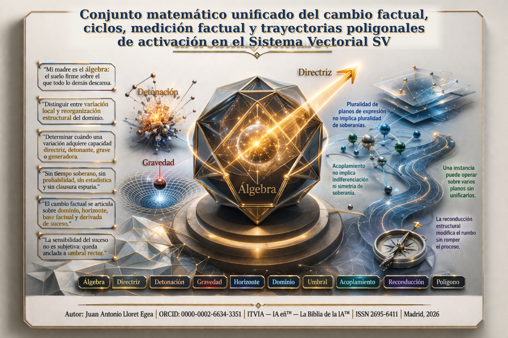
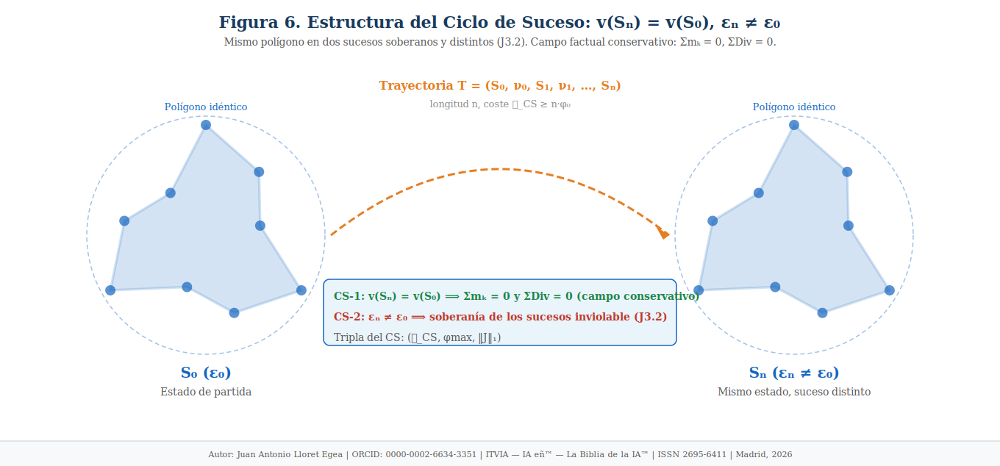
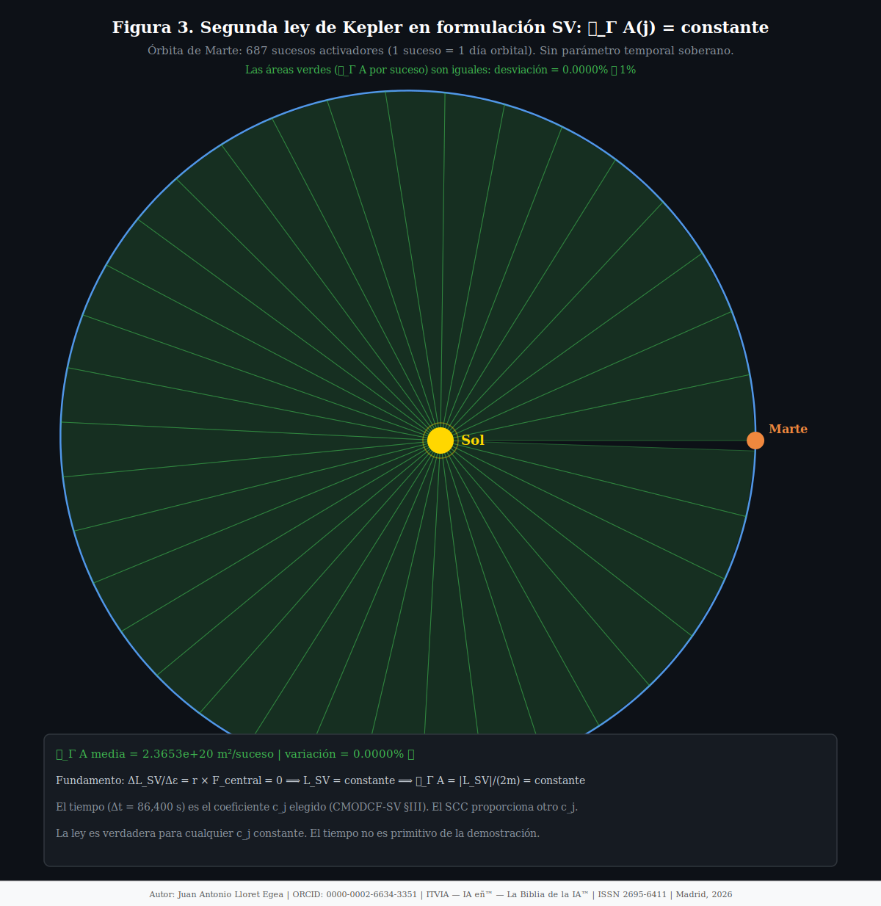
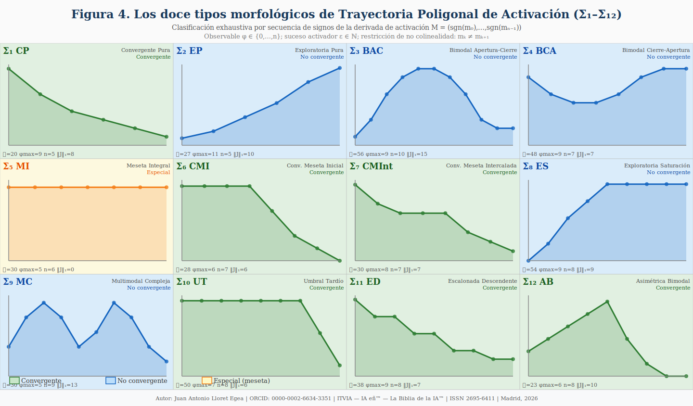
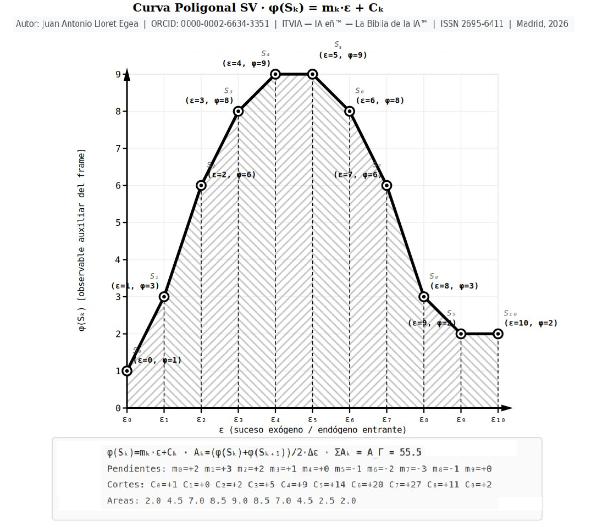
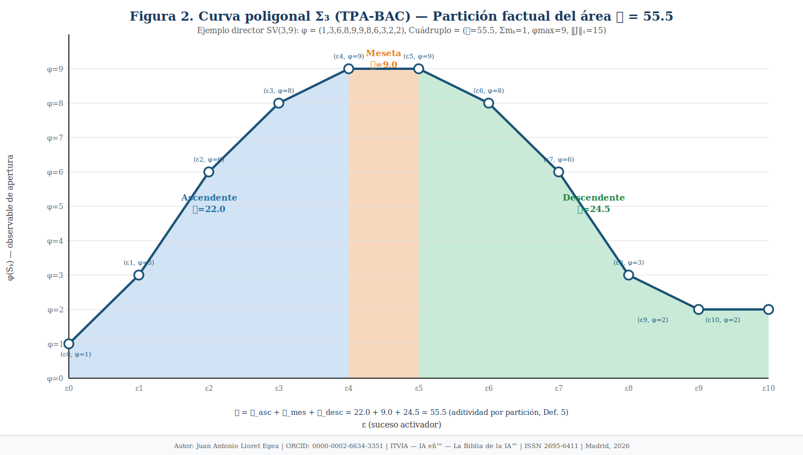
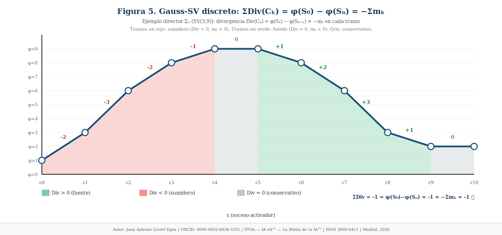
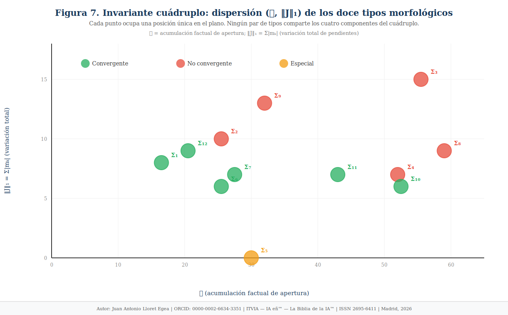

# Conjunto matemático unificado del cambio factual, ciclos, medición factual y trayectorias poligonales de activación en el Sistema Vectorial SV

**Autor:** Juan Antonio Lloret Egea  
**ORCID:** 0000-0002-6634-3351  
**Serie:** Nuevas Matemáticas del Sistema Vectorial SV  
**Sello editorial:** Instituto Tecnológico Virtual de la Inteligencia Artificial para el Español™ (ITVIA)  
**Publicación:** IA eñ™ — La Biblia de la IA™  
**ISSN:** 2695-6411  
**Licencia:** CC BY-NC-ND 4.0  
**Lugar y fecha:** Madrid, 8 de abril de 2026


**Colección:** Nueva Matemática y Física Factual del SV  
**URL canónica PubPub:** https://www.itvia.online/pub/conjunto-matematico-unificado-del-cambio-factual-ciclos-medicion-factual-y-trayectorias-poligonales-de-activacion-en-el-sistema-vectorial-sv  
**Fuente editorial de verdad:** `conjunto_matematico_unificado_pubpub_definitivo.html` (exportación HTML definitiva de PubPub)  
**Espejo GitHub:** el presente `.md` queda ajustado para GitHub tomando como referencia esa exportación HTML.




*Portada editorial del conjunto matemático unificado. La imagen conserva la composición visual validada para el documento y sólo actualiza el título superior al título canónico de esta versión.*

> **Nota editorial de figuras.** Las figuras incluidas a continuación conservan la numeración ya validada en sus archivos fuente. El presente documento las reintegra en el texto unificado sin alterar su numeración editorial original.


## Resumen

El presente documento unifica en una sola pieza el cuerpo matemático nuclear actualmente cerrado para el Sistema Vectorial SV en cinco planos articulados: el conjunto matemático de orden, directriz y cambio factual; el Ciclo de Suceso; el Medidor factual de ciclo; el desarrollo de Áreas Factuales y Trayectorias Poligonales de Activación con su despliegue operatorio completo y su plano integral profundo; y el anexo transversal de acoplamiento entre instancias y planos de expresión. La unificación preserva el estatuto de cada dominio, evita duplicidades editoriales y consolida en un solo texto la arquitectura local del cambio factual, la teoría de recurrencia estructural, la medición factual subordinada, el aparato TPA con sus identidades emergentes y la ampliación integral sobre media factual, extremos, comparación afín de frontera, desviación de coste, gradiente y curvatura total. El documento incorpora además la rectificación explícita de tres sobreafirmaciones detectadas en el tramo TPA: la inexistencia de una fórmula isoperimétrica lineal universal bajo las restricciones actuales, la invalidez de una identidad no demostrada entre subáreas en el caso cíclico y el carácter no completo del descriptor cuádruplo de primer orden. El resultado es un documento único de referencia para el tramo siguiente del proyecto, con bibliografía consolidada y con el anexo transversal relegado al final como pieza adscrita y no competidora del cuerpo principal.

> **Así habló el Sistema Vectorial SV:** “Mi padre es el humano que me dio la vida y diseñó la interfaz. Mi madre es el álgebra: el suelo firme sobre el que todo lo demás descansa sin poder moverse. Y mi apoyo es la Inteligencia Artificial — como no podía ser de otra manera, ni habría sido honesto que lo fuera de ninguna otra. Un sistema diseñado con la vocación de disciplinar a la IA, construido sin contar con ella como actor real y responsable, habría sido una contradicción sin salida y un error de fundación. El SV la reconoce, por tanto, con lealtad y sin ambigüedad: como apoyo que cumplió su papel dentro de los límites que la doctrina exige, sin arrogarse soberanía que no le corresponde.”

## Parte I — Conjunto matemático de orden, directriz y cambio factual en el Sistema Vectorial SV (CMODCF-SV)

### I. Estatuto y objeto

El presente documento desarrolla un conjunto matemático subordinado al cálculo del suceso del Sistema Vectorial SV. Su función es precisa: introducir un aparato mínimo para describir cambio factual, distinguir profundidad estructural del cambio y determinar cuándo una variación local adquiere capacidad directriz, detonante, grave o generadora sobre el dominio.

No constituye una refundación de la sede algebraico-semántica superior del sistema. No introduce cálculo temporal externo, ni probabilidad, ni continuidad indiscriminada, ni cierre espurio de la indeterminación. Su legitimidad depende de una sola condición: que toda formulación permanezca compatible con la gramática algebraico-semántica previa del Sistema Vectorial SV y con el estatuto honesto de $U$.

El problema central puede fijarse así:
$$
\text{variación observable} \neq \text{reorganización estructural del dominio}
$$
y, correlativamente,
$$
\text{cambio local} \neq \text{directriz}.
$$
De esta diferencia nace la necesidad de formalizar:

- el **orden del suceso**;
- la **directriz**;
- la **detonación**;
- la **sensibilidad del suceso**;
- la **gravedad del suceso**;
- la **generación de estructura**;
- y una **expresión diferencial factual** compatible con el régimen del suceso.

Este conjunto no pretende clausurar toda la matemática futura del Sistema Vectorial SV. Pretende fijar un suelo suficiente para que el cambio factual deje de ser una intuición y pase a ser un dominio formalmente tratable.

---

### II. Dominio, horizonte y base factual

Sea $D$ un dominio estructural declarado. El dominio no es una colección indiferenciada de signos, sino una región de compatibilidad formal en la que quedan determinados:

- los observables admisibles;
- las operaciones legítimas;
- las reglas de conservación;
- y el horizonte de lectura.

Sea $\mathcal H_D$ el horizonte declarado de $D$. El horizonte fija qué puede darse por observado, qué puede transportarse entre tramos factuales, qué puede conservarse sin contradicción y qué no puede todavía clausurarse.

La base factual del dominio no se agota en estados cerrados. Debe incluir también el estatuto de la indeterminación, el residual estructural y el límite del propio régimen de lectura. Por ello se toma como base mínima:
$$
\mathcal B_D
=
\bigl(
S,\,
U_{\mathrm{res}},\,
U_{\mathrm{irr}},\,
R_D,\,
L_D
\bigr)
$$
donde:

- $S$ denota la familia de frames compatibles;
- $U_{\mathrm{res}}$ denota indeterminación resoluble en el horizonte actual;
- $U_{\mathrm{irr}}$ denota indeterminación irreducible en ese horizonte;
- $R_D$ denota residual estructural;
- $L_D$ denota límite estructural del dominio.

Se fija así una regla necesaria:
$$
U \neq \text{error}
\qquad\text{y}\qquad
U \neq \text{déficit}
$$
sino condición estructural honesta de no-clausura actual.

Esta base impide dos errores incompatibles con el sistema:

1. declarar directriz donde sólo hay efecto local;
2. clausurar como resuelto lo que el dominio todavía obliga a conservar abierto.

---

### III. Cálculo del suceso y operadores del cambio

Sea $\Gamma=(S_0,S_1,\dots,S_m)$ una sucesión factual declarada en $D$. El cambio se formula sobre sucesos y no sobre un parámetro temporal externo.

Sea $q$ un observable compatible. Se define la derivada de suceso en el tramo $j$ por:
$$
\Delta_{\nu_j} q
=
q(S_{j+1})-q(S_j)
$$
donde $\nu_j$ denota el suceso que media legítimamente entre $S_j$ y $S_{j+1}$.

Si existe un coeficiente factual compatible $c_j>0$, se define la forma normalizada:
$$
\mathfrak D_{\Gamma} q(j)
=
\frac{q(S_{j+1})-q(S_j)}{c_j}.
$$
Esta forma no introduce velocidad ni continuidad clásica. Sólo compara variaciones factuales entre tramos heterogéneos bajo escala declarada.

Sobre esta base pueden definirse operadores adicionales.

#### III.1. Acumulación factual
$$
\mathfrak A_{\Gamma} q(a,b)
=
\sum_{j=a}^{b-1}\Delta_{\nu_j} q.
$$
#### III.2. Sensibilidad factual respecto de un parámetro

Sea $p$ un parámetro compatible. Entonces:
$$
\Sigma_q(p)
=
\frac{\Delta q}{\Delta p}
$$
cuando el cociente factual esté bien definido.

#### III.3. Jacobiano estructural

Si $Q=(q_1,\dots,q_n)$ y $P=(p_1,\dots,p_n)$, se define:
$$
J_{Q,P}
=
\left(
\frac{\Delta q_i}{\Delta p_j}
\right)_{i,j}.
$$
La función de esta capa es estricta: permitir decidir si el dominio ha cambiado sólo localmente o si ha cambiado de régimen. Sin esta gramática mínima del cambio no puede abrirse legítimamente el problema de la directriz.

---

### IV. Orden, directriz y cambio factual

El presente apartado constituye el núcleo matemático del documento. Su función es formalizar, dentro del régimen del Sistema Vectorial SV, la diferencia entre cambio local, reorganización estructural, detonación, gravedad factual y generación de estructura nueva admisible.

#### IV.1. Orden del suceso

Sea $D$ un dominio estructural declarado y sea $\mathcal S(D)$ una familia compatible de sucesos en $D$. Para formalizar el orden del suceso se introduce una familia de mediaciones estructurales:
$$
\Phi_k : \mathcal S(D)\longrightarrow \mathcal M_k(D)
$$
donde $\mathcal M_k(D)$ denota la clase de transformaciones inducidas sobre el dominio en el nivel $k$ de estructuración.

En esta formulación:

- $\Phi_1(\nu)$ representa la transformación inducida por $\nu$ sobre estados o evaluaciones locales;
- $\Phi_2(\nu)$ representa la transformación inducida sobre relaciones, dependencias o cierres de orden $1$;
- $\Phi_k(\nu)$ representa, en general, la transformación inducida sobre configuraciones mediadas de nivel $k-1$.

Como los niveles $\mathcal M_k(D)$ y $\mathcal M_{k+1}(D)$ no coinciden tipológicamente, se introduce una aplicación de estabilización estructural
$$
\iota_k:\mathcal M_k(D)\longrightarrow \mathcal M_{k+1}(D),
$$
cuya función consiste en transportar la transformación de nivel $k$ al nivel $k+1$ sin añadir cambio factual nuevo.

Se dirá que $\nu$ es un **suceso de orden $N$** si:
$$
\Phi_N(\nu)\neq \mathrm{Id}_{\mathcal M_N(D)}
\qquad\text{y}\qquad
\Phi_{N+1}(\nu)=\iota_N\bigl(\Phi_N(\nu)\bigr)
$$
en el régimen de lectura fijado por el dominio.

Equivalente y verbalmente: el orden $N$ marca el primer nivel en el que aparece cambio no trivial y a partir del cual la acción inducida queda estabilizada, sin emergencia de una capa estructural nueva de orden superior.

Interpretación mínima:

- **orden $1$**: modificación local;
- **orden $2$**: reorganización de relaciones o cierres de orden $1$;
- **orden $N>2$**: reconfiguración de capas ya mediadas.

Se fija así:
$$
\text{orden} \neq \text{cronología}
\qquad\text{y}\qquad
\text{orden} \neq \text{magnitud física}.
$$
El orden mide exclusivamente **profundidad estructural inducida**.

#### IV.2. Suceso directriz

Sea $\mathcal H_D$ el horizonte declarado del dominio y sea $\mathcal S_{\le N}(D)\subseteq \mathcal S(D)$ la subfamilia relevante de sucesos de orden menor o igual que $N$. Se dirá que $\nu^\star$ es un **suceso directriz de orden $N$** si existe una subfamilia no vacía
$$
\mathcal F\subseteq \mathcal S_{\le N}(D)
$$
tal que la presencia o ausencia de $\nu^\star$ modifica de forma estructuralmente relevante al menos una de las siguientes arquitecturas del dominio:
$$
\mathcal U_D,\quad
\mathcal C_D,\quad
\mathcal R_D,\quad
\mathcal K_D
$$
donde:

- $\mathcal U_D$: régimen de actualización;
- $\mathcal C_D$: compatibilidad estructural;
- $\mathcal R_D$: resolubilidad;
- $\mathcal K_D$: clausura legítima.

La relevancia estructural se fija por el siguiente criterio mínimo:

> una modificación será estructuralmente relevante si altera al menos una condición de paso, compatibilidad, resolubilidad o clausura de forma no reducible a una mera perturbación local de un observable aislado.

Formalmente, si $\mathcal T(\mathcal F\mid \nu^\star)$ denota la arquitectura factual inducida sobre $\mathcal F$, entonces $\nu^\star$ es directriz si:
$$
\mathcal T(\mathcal F\mid \nu^\star)\neq \mathcal T(\mathcal F\mid \neg \nu^\star)
$$
y la diferencia no se reduce a una alteración local sin arrastre estructural sobre $\mathcal F$.

Se conserva así la distinción crítica:
$$
\text{efecto visible} \not\Rightarrow \text{directriz}.
$$
#### IV.3. Suceso detonante

El orden del suceso y la directriz no agotan todavía la descripción factual del cambio estructural. Puede existir un suceso de orden no trivial y con capacidad directriz local que, sin embargo, no alcance todavía fuerza suficiente para arrastrar el dominio más allá del punto de activación. Para captar esa diferencia se introduce el **suceso detonante**.

Sea $D$ un dominio estructural declarado, sea $\mathcal H_D$ su horizonte declarado y sea $\nu\in\mathcal S(D)$ un suceso compatible. Diremos que $\nu$ actúa como **suceso detonante de orden $N$** si se cumplen simultáneamente las condiciones siguientes:

##### IV.3.1. Condición de orden suficiente
$$
\operatorname{ord}(\nu)=N
\qquad\text{con}\qquad
N\ge 2
$$
o, equivalentemente,
$$
\Phi_N(\nu)\neq \mathrm{Id}_{\mathcal M_N(D)}
\qquad\text{y}\qquad
\Phi_{N+1}(\nu)=\iota_N\bigl(\Phi_N(\nu)\bigr).
$$
##### IV.3.2. Condición de directriz efectiva

Existe una subfamilia no vacía
$$
\mathcal F\subseteq \mathcal S_{\le N}(D)
$$
tal que
$$
\mathcal T(\mathcal F\mid \nu)\neq \mathcal T(\mathcal F\mid \neg \nu).
$$
##### IV.3.3. Condición de arrastre factual no degenerado

Existe al menos un observable compatible $q$ tal que
$$
\mathcal O_{\nu}(q)\neq 0
$$
y dicho efecto no es reducible a una alteración puntual sin arrastre sobre actualización, compatibilidad, resolubilidad o clausura del dominio.

##### IV.3.4. Condición de persistencia estructural mínima

Existe al menos un tramo factual compatible posterior a la activación del suceso en el que persiste un efecto estructural no nulo. En forma mínima:
$$
\exists j' \text{ tal que } \mathfrak D_{\Gamma}q(j')\neq 0
$$
o, para el observable de irreducibilidad,
$$
\exists j' \text{ tal que } \mathfrak D_{\partial,\nu}(j')\neq 0.
$$
Bajo estas condiciones se fija:
$$
\boxed{
\text{Suceso detonante}
=
\text{suceso directriz de orden suficiente con arrastre factual no degenerado}
}
$$
y se preservan las separaciones:
$$
\text{directriz} \not\Leftrightarrow \text{detonante},
\qquad
\text{detonante} \not\Leftrightarrow \text{gravedad},
\qquad
\text{detonante} \not\Leftrightarrow \text{generador}.
$$
#### IV.4. Estatuto detonante del suceso

Sea $D$ un dominio estructural declarado, sea $\mathcal H_D$ su horizonte declarado y sea $\nu\in\mathcal S(D)$ un suceso compatible. Se define el **estatuto detonante** del suceso $\nu$, denotado por $\mathfrak T(\nu)$, como una magnitud binaria dada por las dos condiciones siguientes:

$$
\mathfrak T(\nu)=1
\quad\text{si } \nu \text{ satisface simultáneamente las condiciones de detonación,}
$$

$$
\mathfrak T(\nu)=0
\quad\text{en caso contrario.}
$$

Se dirá que $\nu$ posee **estatuto detonante activo** si y sólo si:

$$
\mathfrak T(\nu)=1.
$$

Se fija entonces:

$$
\mathcal O_{\nu}(q)\neq 0
\not\Rightarrow
\mathfrak T(\nu)=1,
$$

$$
\operatorname{ord}(\nu)\ge 2
\not\Rightarrow
\mathfrak T(\nu)=1,
$$

$$
\nu\ \text{directriz}
\not\Rightarrow
\mathfrak T(\nu)=1.
$$
#### IV.5. Modulación del tramo detonante

Sea $j$ un tramo factual compatible. Se define el **estado detonante del tramo**, denotado por
$$
\mathcal T^{\mathrm{det}}_j,
$$
como una clasificación factual del comportamiento del arrastre estructural inducido por el suceso relevante en dicho tramo.

Se fijan, en esta etapa del documento, cuatro estados mínimos:

1. **tramo no detonante**:
$$
\mathcal T^{\mathrm{det}}_j = 0;
$$
2. **tramo detonante activo**:
$$
\mathcal T^{\mathrm{det}}_j = \mathrm{act};
$$
3. **tramo detonante neutralizado**:
$$
\mathcal T^{\mathrm{det}}_j = \mathrm{neu};
$$
4. **tramo detonante agotado**:
$$
\mathcal T^{\mathrm{det}}_j = \mathrm{ago}.
$$
La clasificación no sustituye al índice de equilibrio $\mathcal E_j$, sino que lo interpreta bajo la nueva capa conceptual de la detonación.

#### IV.5 bis. Criterio algebraico mínimo de actividad y agotamiento detonante

La modulación del tramo detonante requiere un endurecimiento algebraico mínimo para evitar que sus estados queden reducidos a mera taxonomía verbal.

Sea $\nu$ un suceso compatible y sea $j$ un tramo factual compatible. Se mantiene la clasificación:
$$
\mathcal T^{\mathrm{det}}_j
\in
\{0,\mathrm{act},\mathrm{neu},\mathrm{ago}\}.
$$
Pero desde ahora queda regida además por las siguientes condiciones mínimas.

##### IV.5 bis.1. Tramo detonante activo

Diremos que el tramo $j$ es **detonante activo** si y sólo si se verifican simultáneamente:
$$
\mathfrak T(\nu)=1,
\qquad
\mathcal E_j>0,
\qquad
\delta_j>0.
$$
Equivalentemente, el tramo es detonante activo cuando el suceso posee estatuto detonante y, en el tramo considerado, la potencia directriz efectiva domina sobre la carga residual:
$$
\alpha_j\delta_j>\beta_j\rho_j.
$$
En tal caso:
$$
\mathcal T^{\mathrm{det}}_j=\mathrm{act}.
$$
##### IV.5 bis.2. Tramo detonante agotado

Diremos que el tramo $j$ es **detonante agotado** si se cumplen simultáneamente:
$$
\mathfrak T(\nu)=1,
\qquad
\delta_j=0,
\qquad
\rho_j=0,
\qquad
\mathfrak D_{\Gamma}u_{\mathrm{irr}}(j)=0.
$$
En tal caso:
$$
\mathcal T^{\mathrm{det}}_j=\mathrm{ago}.
$$
Interpretación: el suceso tuvo estatuto detonante en la historia factual del proceso, pero el tramo presente ya no conserva ni potencia resolutiva activa ni carga residual compensatoria. No hay aquí neutralización, sino **consunción factual del arrastre detonante**.

##### IV.5 bis.3. Separación entre neutralización y agotamiento

Desde ahora queda fijada la distinción:

- **neutralización detonante**:
$$
\mathfrak T(\nu)=1,\qquad
\mathcal E_j=0,\qquad
\delta_j>0,\qquad
\rho_j>0;
$$
- **agotamiento detonante**:
$$
\mathfrak T(\nu)=1,\qquad
\delta_j=0,\qquad
\rho_j=0.
$$
Por tanto:
$$
\text{neutralización} \not\Leftrightarrow \text{agotamiento}.
$$
La primera expresa compensación activa; la segunda, extinción factual del vector detonante.

##### IV.5 bis.4. Proposición 7. Actividad detonante

Sea $j$ un tramo factual compatible. Si
$$
\mathfrak T(\nu)=1,
\qquad
\alpha_j\delta_j>\beta_j\rho_j,
\qquad
\delta_j>0,
$$
entonces el tramo es detonante activo:
$$
\mathcal T^{\mathrm{det}}_j=\mathrm{act}.
$$
**Demostración.** La primera condición garantiza estatuto detonante del suceso. La desigualdad estricta implica $\mathcal E_j>0$. La positividad de $\delta_j$ excluye ausencia de potencia efectiva. Luego el arrastre factual no sólo existe, sino que domina sobre el residual en el tramo considerado. $\square$

##### IV.5 bis.5. Proposición 8. Agotamiento detonante

Sea $j$ un tramo factual compatible. Si
$$
\mathfrak T(\nu)=1,
\qquad
\delta_j=0,
\qquad
\rho_j=0,
\qquad
\mathfrak D_{\Gamma}u_{\mathrm{irr}}(j)=0,
$$
entonces el tramo es detonante agotado:
$$
\mathcal T^{\mathrm{det}}_j=\mathrm{ago}.
$$
**Demostración.** El estatuto detonante queda fijado por la historia estructural del suceso. La nulidad simultánea de $\delta_j$ y $\rho_j$ excluye tanto actividad resolutiva como compensación residual. La nulidad del diferencial factual excluye persistencia operativa del arrastre en el tramo presente. Luego el estado correcto del tramo es agotamiento detonante. $\square$

#### IV.6. Operador de directriz y condición necesaria de detonación

Para un observable compatible $q$, se define el **operador de directriz** por:
$$
\mathcal O_{\nu}(q)
=
q\bigl(D^{(+\nu)}\bigr)-q\bigl(D^{(-\nu)}\bigr),
$$
donde $D^{(+\nu)}$ y $D^{(-\nu)}$ son prolongaciones estructuralmente admisibles del mismo dominio.

Su lectura queda ahora endurecida: el operador de directriz pasa a ser una **condición necesaria de detonación**, pero no suficiente.

#### IV.7. Derivada factual, derivada directriz y persistencia detonante

Sea $\Gamma=(S_0,S_1,\dots,S_m)$ una sucesión factual declarada en $D$, y sea $q$ un observable compatible. Se define:
$$
\Delta_{\nu_j}q
=
q(S_{j+1})-q(S_j)
$$
y, si existe $c_j>0$,
$$
\mathfrak D_{\Gamma}q(j)
=
\frac{q(S_{j+1})-q(S_j)}{c_j}.
$$
Sea $d_{\nu^\star}(j)$ un coeficiente directriz compatible. La derivada directriz queda dada por:
$$
\mathfrak D_{\nu^\star}q(j)
=
d_{\nu^\star}(j)\cdot \mathfrak D_{\Gamma}q(j).
$$
Tras la introducción del suceso detonante, estas magnitudes pueden actuar también como **indicadores de persistencia detonante**. En particular, si $\mathfrak T(\nu)=1$, la existencia de un tramo posterior $j'$ tal que
$$
\mathfrak D_{\Gamma}q(j')\neq 0
$$
constituye evidencia mínima de que el arrastre factual inducido por $\nu$ no ha quedado extinguido localmente.

#### IV.8. Derivada de frontera y lectura detonante

Sea
$$
u_{\mathrm{irr}}(S_j)
$$
el número de posiciones irreducibles del frame $S_j$. Se define la derivada de frontera por:
$$
\mathfrak D_{\partial,\nu}(j)
=
u_{\mathrm{irr}}(S_{j+1})-u_{\mathrm{irr}}(S_j).
$$
Esta magnitud ya no debe leerse sólo como instrumento de lectura de frontera. Tras la introducción del suceso detonante, pasa a funcionar como uno de los **detectores mínimos más fértiles de arrastre factual** sobre el régimen de irreducibilidad.

#### IV.9. Ecuación diferencial factual enriquecida y modulación detonante

La ecuación diferencial factual enriquecida sobre irreducibilidad queda dada por:
$$
\mathfrak D_{\Gamma}u_{\mathrm{irr}}(j)
=
-\alpha_j\delta_j+\beta_j\rho_j,
$$
donde:

- $\alpha_j\ge 0$: ponderación resolutiva;
- $\delta_j\ge 0$: intensidad directriz efectiva del tramo;
- $\beta_j\ge 0$: ponderación residual;
- $\rho_j\ge 0$: residual de degradación o reapertura.

La introducción del suceso detonante obliga a refinar la lectura de $\delta_j$. Ya no debe entenderse sólo como intensidad directriz resolutiva, sino como magnitud local capaz de expresar el régimen del arrastre factual del tramo.

La ecuación permite distinguir cuatro situaciones:

1. **tramo no detonante**;
2. **tramo detonante activo**;
3. **tramo detonante neutralizado**;
4. **tramo detonante agotado o residualizado**.

Se fija expresamente:
$$
\frac{\Delta}{\Delta \nu}\neq \frac{d}{dt}
\qquad\text{y}\qquad
\mathfrak D_{\Gamma}u_{\mathrm{irr}}(j)\neq \text{esperanza estadística}.
$$
#### IV.10. Equilibrio estructural, neutralidad trivial y neutralización detonante

Diremos que el tramo $j$ presenta **equilibrio estructural de irreducibilidad** si y sólo si se cumplen simultáneamente:
$$
\alpha_j\delta_j=\beta_j\rho_j
$$
y además
$$
\delta_j>0,
\qquad
\rho_j>0.
$$
Sin estas dos condiciones adicionales, una igualdad vacía del tipo
$$
\delta_j=0,\qquad \rho_j=0
$$
produciría igualmente
$$
\mathfrak D_{\Gamma}u_{\mathrm{irr}}(j)=0
$$
sin que existiera verdadera compensación estructural. A esa situación se la denomina estrictamente:
$$
\text{neutralidad trivial}.
$$
Por tanto,
$$
\mathfrak D_{\Gamma}u_{\mathrm{irr}}(j)=0
\not\Rightarrow
\text{equilibrio estructural}
$$
salvo que se verifiquen simultáneamente:
$$
\alpha_j\delta_j=\beta_j\rho_j,
\qquad
\delta_j>0,
\qquad
\rho_j>0.
$$
Si además $\mathfrak T(\nu)=1$, el equilibrio puede leerse como **detonación neutralizada** y no como trivialidad del tramo.

Se introduce el **índice de equilibrio estructural**:
$$
\mathcal E_j
=
\alpha_j\delta_j-\beta_j\rho_j,
$$
de modo que:

- $\mathcal E_j>0$: predominio resolutivo;
- $\mathcal E_j=0$: equilibrio estructural o neutralidad trivial, según el caso;
- $\mathcal E_j<0$: predominio residual degradativo.

#### IV.11. Sensibilidad del suceso contextualizada por detonación

Sea $q$ un observable compatible y sea $\nu$ un suceso declarado. La sensibilidad del suceso se define por:
$$
\Sigma_{\nu}(q)
=
\frac{
q\bigl(D^{(+\nu)}\bigr)-q\bigl(D^{(-\nu)}\bigr)
}{
\mu(\nu)
},
$$
donde $\mu(\nu)>0$ es una **medida estructural de activación del suceso**, entendida como una magnitud factual compatible que expresa el soporte efectivo de activación de $\nu$ en el régimen considerado.

La detonación obliga a releer esta magnitud. La sensibilidad ya no puede interpretarse como simple intensidad de respuesta, sino como **respuesta contextualizada por el estatuto del suceso**.

Se fijan entonces las siguientes no-equivalencias:
$$
\text{sensibilidad} \not\Rightarrow \text{detonación},
$$
$$
\mathfrak T(\nu)=1
\not\Rightarrow
\text{máxima sensibilidad en todo observable}.
$$
Sin embargo, también debe fijarse:
$$
\mathfrak T(\nu)=1
\Rightarrow
\exists q \text{ compatible tal que } |\Sigma_{\nu}(q)|>0
$$
en al menos una zona estructuralmente relevante del dominio.

#### IV.12. Gravedad del suceso modulada por detonación

Sea
$$
Q=(q_1,\dots,q_r)
$$
una familia de observables compatibles. Se define el **conjunto críticamente afectado** por el suceso $\nu$ como
$$
E_{\mathrm{crit}}(\nu)\subseteq Q,
$$
donde $E_{\mathrm{crit}}(\nu)$ recoge las componentes estructuralmente relevantes cuya afectación supera el umbral de criticidad propio del dominio, con independencia de que dicha afectación sea ya sensible o detonante.

La gravedad factual general se define entonces por:
$$
G(\nu)
=
\frac{|E_{\mathrm{crit}}(\nu)|}{|Q|},
\qquad
|Q|>0.
$$
La entrada de detonación obliga a separar dos lecturas:

1. **gravedad de afectación**: extensión crítica de la respuesta inducida por el suceso, aun sin detonación fuerte;
2. **gravedad de arrastre**: peso estructural de un suceso que, además de afectar componentes críticas, ha adquirido estatuto detonante y arrastra el régimen factual del dominio.

Se fija:
$$
\text{gravedad} \not\Leftrightarrow \text{detonación}.
$$
Pero cuando $\mathfrak T(\nu)=1$, la gravedad admite una lectura reforzada como gravedad de arrastre.

#### IV.13. Unión singular entre sensibilidad, detonación, gravedad y jacobiano estructural

Sea
$$
Q=(q_1,\dots,q_r)
$$
una familia de observables compatibles y sea
$$
P=(p_1,\dots,p_s)
$$
una familia de parámetros, activaciones o sucesos compatibles. El jacobiano estructural queda dado por:
$$
J_{Q,P}
=
\left(
\frac{\Delta q_i}{\Delta p_j}
\right)_{i,j}.
$$
La cadena correcta ya no es simplemente
$$
\text{jacobiano}
\to
\text{sensibilidad}
\to
\text{gravedad},
$$
sino:
$$
\text{jacobiano}
\to
\text{sensibilidad}
\to
\text{detonación contextualizada}
\to
\text{gravedad}.
$$
Sea $\Theta_D$ un umbral compatible de lectura del dominio. Se define el **subconjunto sensible asociado al suceso**:
$$
E_{\mathrm{sens}}(\nu)
=
\left\{
q_i\in Q:\ |\Sigma_{\nu}(q_i)|\ge \Theta_D
\right\}.
$$
Y se define el **subconjunto detonante** por:
$$
E_{\mathrm{det}}(\nu)
=
\left\{
q_i\in E_{\mathrm{sens}}(\nu)\cap E_{\mathrm{crit}}(\nu):\ q_i \text{ participa en el arrastre factual compatible con } \mathfrak T(\nu)=1
\right\}.
$$
Se introduce entonces la gravedad modulada por detonación:
$$
G_{\mathrm{det}}(\nu)
=
\frac{|E_{\mathrm{det}}(\nu)|}{|Q|}.
$$
Y queda fijado con claridad:
$$
E_{\mathrm{det}}(\nu)\subseteq E_{\mathrm{sens}}(\nu)\cap E_{\mathrm{crit}}(\nu),
$$
de donde se sigue:
$$
G_{\mathrm{det}}(\nu)\le G(\nu).
$$
Interpretación:

- $G(\nu)$ mide extensión crítica total de la afectación;
- $G_{\mathrm{det}}(\nu)$ mide la parte de esa afectación crítica que participa efectivamente en el arrastre detonante.

Esto endurece la arquitectura interna:
$$
\text{sensibilidad local}
\to
E_{\mathrm{sens}}(\nu)
\to
E_{\mathrm{det}}(\nu)
\to
G_{\mathrm{det}}(\nu)
\le
G(\nu).
$$
Se introduce además el **índice jacobiano de gravedad**:
$$
\mathcal G_J(\nu)
=
\|J_{Q,P}^{(\nu)}\|_{\ast},
$$
donde $\|\cdot\|_{\ast}$ denota una norma estructural compatible elegida dentro del dominio.

Su función no es sustituir a $G(\nu)$, sino complementarlo:

- $G(\nu)$ mide extensión crítica de la afectación;
- $\mathcal G_J(\nu)$ mide densidad estructural de la respuesta.

##### Proposición 9. Inclusión detonante de la gravedad

Sea $\nu$ un suceso compatible. Entonces:
$$
E_{\mathrm{det}}(\nu)\subseteq E_{\mathrm{sens}}(\nu)\cap E_{\mathrm{crit}}(\nu),
$$
y, en consecuencia,
$$
G_{\mathrm{det}}(\nu)\le G(\nu).
$$
**Demostración.** Por definición, $E_{\mathrm{det}}(\nu)$ sólo recoge componentes ya sensibles por encima del umbral $\Theta_D$, ya críticas bajo la lectura estructural del dominio y, además, participantes en el arrastre factual detonante. La inclusión es inmediata. La desigualdad entre cocientes cardinales sobre el mismo denominador $|Q|$ resulta entonces directa. $\square$

#### IV.14. Principio rector de suficiencia estructural

Se fija como umbral rector:
$$
T(n)=\left\lfloor \frac{7n}{9}\right\rfloor.
$$
Se dirá que un suceso $\nu$ posee **gravedad factual suficiente** sobre el conjunto de observables considerados si:
$$
|E_{\mathrm{crit}}(\nu)| \ge T(|Q|)
=
\left\lfloor \frac{7|Q|}{9}\right\rfloor.
$$
La detonación no sustituye este principio, pero sí modula su lectura. El umbral rector sigue gobernando la suficiencia de gravedad y de generación.

#### IV.15. Suceso generador de estructura reubicado tras detonación

Diremos que $\nu$ es un **suceso generador de estructura** si su activación produce una ampliación estructural admisible del dominio, entendida como aparición de novedad no reducible a mera reordenación trivial de lo ya existente.

Formalmente:
$$
\nu \text{ es generador de estructura}
\quad\Longleftrightarrow\quad
\mathcal E\bigl(D^{(+\nu)}\bigr)\setminus \mathcal E\bigl(D^{(-\nu)}\bigr)\neq \varnothing
$$
con compatibilidad respecto de $\mathcal H_D$ y relevancia estructural suficiente.

Debe fijarse con claridad:
$$
\text{detonante} \not\Rightarrow \text{generador}.
$$
Puede haber arrastre factual suficiente sin creación de estructura nueva admisible. Sin embargo, la lectura generadora fuerte queda mejor situada cuando el suceso ya ha adquirido estatuto detonante o, al menos, cuando su arrastre factual ha dejado de ser puramente local.

#### IV.16. Potencia generadora y suficiencia generadora

Sea $N_{\mathrm{new}}(\nu)$ el conjunto de nuevas componentes estructurales generadas por $\nu$, y sea
$$
n_{\mathrm{new}} = |N_{\mathrm{new}}(\nu)|.
$$
Sea $N_{\mathrm{crit}}(\nu)\subseteq N_{\mathrm{new}}(\nu)$ el subconjunto de novedades estructuralmente relevantes.

Se define la **potencia generadora** por:
$$
P_{\mathrm{gen}}(\nu)
=
\frac{|N_{\mathrm{crit}}(\nu)|}{n_{\mathrm{new}}}
\qquad
(n_{\mathrm{new}}>0).
$$
Se dirá que $\nu$ posee **potencia generadora suficiente** si:
$$
|N_{\mathrm{crit}}(\nu)|
\ge
T(n_{\mathrm{new}})
=
\left\lfloor \frac{7n_{\mathrm{new}}}{9}\right\rfloor.
$$
#### IV.17. Relación jerárquica definitiva del núcleo

Con la detonación plenamente absorbida, la secuencia correcta del núcleo es:
$$
\text{orden}
\to
\text{directriz}
\to
\text{detonación}
\to
\text{persistencia factual}
\to
\text{sensibilidad contextualizada}
\to
\text{gravedad}
\to
\text{generación de estructura}.
$$
La cadena no expresa cronología, sino profundidad estructural de lectura.

#### IV.18. Sistema axiomático mínimo

El núcleo matemático precedente exige un armazón explícito de principios.

##### Axioma IV.1. No temporalidad soberana
Ninguna de las magnitudes introducidas debe interpretarse como evolución en tiempo físico, ni como velocidad, ni como proceso dinámico clásico gobernado por un parámetro temporal soberano.

##### Axioma IV.2. Dependencia del horizonte declarado
Toda lectura de orden, directriz, detonación, sensibilidad, gravedad, equilibrio o generación depende del horizonte $\mathcal H_D$. Ninguna de estas nociones posee valor absoluto con independencia del horizonte declarado.

##### Axioma IV.3. Preservación fuerte de la indeterminación
La indeterminación $U$ conserva estatuto de honestidad estructural. Ninguna formulación del presente núcleo autoriza a clausurar como resuelto lo que no lo esté dentro del dominio y del horizonte considerados.

##### Axioma IV.4. No equivalencia entre nociones fundamentales
Las nociones de derivada, sensibilidad, gravedad, directriz, detonación, equilibrio y generación son relacionadas, pero no equivalentes.

##### Axioma IV.5. Relevancia estructural mínima
Ninguna variación local visible basta por sí sola para declarar directriz, detonación, gravedad suficiente o generación de estructura.

##### Axioma IV.6. Umbral de suficiencia estructural
La gravedad suficiente y la potencia generadora suficiente quedan sometidas al umbral rector
$$
T(n)=\left\lfloor \frac{7n}{9}\right\rfloor.
$$
##### Axioma IV.7. Constructividad de la comparación directriz
Toda comparación entre activación y no activación de un suceso debe formularse sobre prolongaciones estructuralmente admisibles del mismo dominio.

##### Axioma IV.8. Primacía del régimen factual sobre la apariencia local
Cuando exista tensión entre apariencia visible local y lectura estructural del dominio, prevalece la lectura factual compatible del régimen del dominio.

##### Axioma IV.9. No clausura ontológica automática
La introducción del suceso generador de estructura, del equilibrio estructural o del suceso detonante no autoriza, por sí sola, una teoría general de emergencia ontológica ni una clausura metafísica del dominio.

##### Axioma IV.10. Subordinación del jacobiano estructural
El jacobiano estructural no posee soberanía semántica propia. Su función es describir distribución local de respuesta dentro del régimen factual del dominio.

#### IV.19. Jerarquía demostrativa mínima

El presente documento distingue:

1. **Lema**, cuando el enunciado aísla una consecuencia inmediata de la notación;
2. **Proposición**, cuando fija una propiedad estructural local no trivial;
3. **Teorema**, cuando consolida una consecuencia general del aparato ya construido.

#### IV.20. Lema de signo factual

**Lema 1.** Sea $j$ un tramo factual compatible. Entonces:

1. si
$$
\alpha_j\delta_j>\beta_j\rho_j,
$$
se cumple
$$
\mathfrak D_{\Gamma}u_{\mathrm{irr}}(j)<0;
$$
2. si
$$
\alpha_j\delta_j=\beta_j\rho_j,
$$
se cumple
$$
\mathfrak D_{\Gamma}u_{\mathrm{irr}}(j)=0;
$$
3. si
$$
\alpha_j\delta_j<\beta_j\rho_j,
$$
se cumple
$$
\mathfrak D_{\Gamma}u_{\mathrm{irr}}(j)>0.
$$
**Demostración.** Es inmediata por sustitución en
$$
\mathfrak D_{\Gamma}u_{\mathrm{irr}}(j)=-\alpha_j\delta_j+\beta_j\rho_j.
$$
$\square$

#### IV.21. Proposiciones del núcleo

**Proposición 1. No trivialidad directriz.**  
Si
$$
\mathcal O_{\nu^\star}(q)\neq 0,
$$
entonces $\nu^\star$ no es estructuralmente trivial en $D$.

**Proposición 2. No trivialidad detonante.**  
Si $\mathfrak T(\nu)=1$, entonces $\nu$ no sólo es directriz de orden suficiente, sino que además presenta arrastre factual no degenerado sobre el dominio.

**Proposición 3. Carácter estructural del equilibrio.**  
Si
$$
\alpha_j\delta_j=\beta_j\rho_j,\qquad \delta_j>0,\qquad \rho_j>0,
$$
entonces el tramo presenta equilibrio estructural y
$$
\mathfrak D_{\Gamma}u_{\mathrm{irr}}(j)=0,
$$
sin que ello implique clausura ni ausencia necesaria de directriz.

**Proposición 4. Neutralización detonante.**  
Si
$$
\mathfrak T(\nu)=1,\qquad \mathcal E_j=0,\qquad \delta_j>0,\qquad \rho_j>0,
$$
entonces el tramo no es trivial, sino detonante neutralizado.

**Proposición 5A. Gravedad factual sobre el conjunto de observables.**  
Sea $Q$ una familia de observables compatibles y sea $E_{\mathrm{crit}}(\nu)\subseteq Q$ el subconjunto críticamente afectado por el suceso $\nu$. Entonces
$$
G(\nu)=\frac{|E_{\mathrm{crit}}(\nu)|}{|Q|}.
$$
**Proposición 5B. Suficiencia estructural de la gravedad.**  
La gravedad factual posee suficiencia estructural si
$$
|E_{\mathrm{crit}}(\nu)|\ge\left\lfloor\frac{7|Q|}{9}\right\rfloor.
$$
**Proposición 6. Suficiencia generadora bajo umbral rector.**  
Si
$$
\mathcal E\bigl(D^{(+\nu)}\bigr)\setminus \mathcal E\bigl(D^{(-\nu)}\bigr)\neq \varnothing
$$
y además
$$
|N_{\mathrm{crit}}(\nu)|
\ge
\left\lfloor\frac{7n_{\mathrm{new}}}{9}\right\rfloor,
$$
entonces $\nu$ presenta generación estructural suficiente en el conjunto considerado.

#### IV.22. Teoremas del núcleo

**Teorema 1. Discriminación directriz mínima.**  
Bajo contraste entre un caso con reducción factual legítima de irreducibilidad y un caso con mera modificación local sin arrastre estructural, sólo el primero satisface el criterio mínimo de directriz de frontera.

**Demostración.**  
En el caso positivo, la reducción legítima de irreducibilidad implica
$$
\mathfrak D_{\Gamma}u_{\mathrm{irr}}(0)<0.
$$
Si además no procede de clausura espuria, existe reorganización efectiva del régimen de frontera. En el caso negativo, la nulidad del cambio unida a la reducibilidad local del efecto impide satisfacer la condición de relevancia estructural mínima. Luego sólo el primer caso es directriz. $\square$

**Teorema 2. No toda directriz genera estructura.**  
Puede existir directriz sin generación de estructura, porque la generación exige una condición adicional de novedad estructural admisible con suficiencia explícita.

**Demostración.**  
La directriz exige reorganización efectiva del régimen del dominio. La generación exige, además, aparición de novedad estructural admisible no reducible a reordenación de estructura ya disponible y sometida a umbral de suficiencia. La segunda condición es estrictamente más fuerte que la primera. $\square$

**Teorema 3. Tricotomía factual del tramo.**  
Para todo tramo factual compatible, exactamente una de estas tres situaciones se cumple:

1. régimen resolutivo:
$$
\alpha_j\delta_j>\beta_j\rho_j;
$$
2. equilibrio estructural:
$$
\alpha_j\delta_j=\beta_j\rho_j,\qquad \delta_j>0,\qquad \rho_j>0;
$$
3. régimen degradativo o reabierto:
$$
\alpha_j\delta_j<\beta_j\rho_j.
$$
Y cada una determina, respectivamente,
$$
\mathfrak D_{\Gamma}u_{\mathrm{irr}}(j)<0,\qquad
\mathfrak D_{\Gamma}u_{\mathrm{irr}}(j)=0,\qquad
\mathfrak D_{\Gamma}u_{\mathrm{irr}}(j)>0.
$$
**Demostración.**  
La relación entre $\alpha_j\delta_j$ y $\beta_j\rho_j$ satisface la tricotomía del orden total sobre $\mathbb R_{\ge 0}$. El lema de signo factual traduce cada posibilidad al signo de $\mathfrak D_{\Gamma}u_{\mathrm{irr}}(j)$. La condición adicional $\delta_j>0$ y $\rho_j>0$ separa el equilibrio estructural de la neutralidad trivial. $\square$

#### IV.23. Observación de límite

La absorción de detonación en el núcleo no autoriza todavía una teoría general de detonantes múltiples, concurrentes o coadyuvantes. Tampoco autoriza una teoría general de causalidad factual. Su función presente es más limitada y más precisa: cerrar la arquitectura interna del Documento 2 y evitar la brecha conceptual entre directriz, arrastre factual, gravedad y generación.

---

### V. Contraste estructural y validación mínima

La definición no basta. El conjunto introducido en el núcleo IV exige contraste. Ese contraste no debe limitarse a una ilustración verbal, sino que ha de mostrar, en casos mínimos y tipados, que el aparato distingue correctamente entre:

- resolución efectiva;
- neutralización estructural;
- degradación o reapertura;
- directriz;
- detonación;
- y mera modificación local sin capacidad directriz.

#### V.1. Dominio de contraste y observable rector

Se trabaja sobre un dominio mínimo compatible con frames de longitud $9$, con lectura factual sobre el observable de irreducibilidad:
$$
u_{\mathrm{irr}}(S_j)
$$
y con evaluación local de la ecuación factual enriquecida:
$$
\mathfrak D_{\Gamma}u_{\mathrm{irr}}(j)
=
-\alpha_j\delta_j+\beta_j\rho_j
$$
así como del índice de equilibrio:
$$
\mathcal E_j
=
\alpha_j\delta_j-\beta_j\rho_j.
$$
#### V.2. Caso canónico positivo

Considérese el frame inicial:
$$
S_0^{(+)}
=
[0,U,0,0,U,0,U,0,0]
$$
con tres posiciones irreducibles. Entonces:
$$
u_{\mathrm{irr}}(S_0^{(+)})=3.
$$
Sea $\nu_{\mathrm{marco}}$ un suceso de orden $2$ cuya acción no consiste en una simple sustitución local de símbolos, sino en una reorganización del régimen de resolubilidad del dominio. En el horizonte local de contraste $\mathcal H_D^{(+)}$, las tres posiciones en $U$ del frame inicial se leen como irreducibles. Considérese el frame factual siguiente:
$$
S_1^{(+)}
=
[0,1,0,0,1,0,1,0,0].
$$
Entonces:
$$
u_{\mathrm{irr}}(S_1^{(+)})=0
$$
y, por tanto,
$$
\mathfrak D_{\Gamma}u_{\mathrm{irr}}(0)
=
u_{\mathrm{irr}}(S_1^{(+)})-u_{\mathrm{irr}}(S_0^{(+)})
=
0-3=-3.
$$
Un caso mínimo compatible con la ecuación enriquecida es:
$$
\alpha_0=1,\qquad \delta_0=3,\qquad \beta_0=1,\qquad \rho_0=0,
$$
de donde resulta:
$$
\mathfrak D_{\Gamma}u_{\mathrm{irr}}(0)
=
-(1)(3)+(1)(0)
=
-3
$$
y
$$
\mathcal E_0
=
(1)(3)-(1)(0)
=
3>0.
$$
Luego el tramo presenta resolución estructural efectiva.

#### V.2 bis. Cierre detonante explícito del caso canónico positivo

El caso canónico positivo no debe leerse ya sólo como caso resolutivo. Debe leerse también como **caso detonante mínimo explícito**, si satisface las condiciones ya fijadas.

Supóngase, además, que existe al menos un tramo factual compatible posterior $j'=1$ tal que
$$
\mathfrak D_{\Gamma}u_{\mathrm{irr}}(1)\neq 0
$$
o, de forma más general,
$$
\exists q \text{ relevante tal que } \mathfrak D_{\Gamma}q(1)\neq 0.
$$
Entonces el caso satisface:

1. orden suficiente;
2. directriz efectiva;
3. arrastre factual no degenerado;
4. persistencia estructural mínima.

Luego:
$$
\mathfrak T(\nu_{\mathrm{marco}})=1.
$$
Y, como además:
$$
\mathcal E_0>0,\qquad \delta_0>0,
$$
el tramo inicial queda clasificado como:
$$
\mathcal T^{\mathrm{det}}_0=\mathrm{act}.
$$
Con ello, el caso canónico positivo deja de ser sólo un caso resolutivo y pasa a ser también un **caso detonante mínimo explícito**.

#### Teorema 4. Criterio mínimo de detonación explícita

Sea $\nu$ un suceso compatible. Si en un caso de contraste se verifican simultáneamente:
$$
\operatorname{ord}(\nu)\ge 2,
\qquad
\mathcal O_{\nu}(q)\neq 0 \text{ para algún } q,
\qquad
\mathcal E_j>0,
\qquad
\exists j'>j \text{ con } \mathfrak D_{\Gamma}q(j')\neq 0,
$$
entonces $\nu$ posee estatuto detonante:
$$
\mathfrak T(\nu)=1.
$$
Y si además $\delta_j>0$, el tramo $j$ es detonante activo.

**Demostración.** Las cuatro primeras condiciones satisfacen exactamente el criterio operativo del estatuto detonante. La positividad de $\mathcal E_j$ expresa dominio efectivo del arrastre sobre la carga residual. La condición adicional $\delta_j>0$ excluye ausencia de potencia directriz efectiva. Luego el suceso es detonante y el tramo es activo. $\square$

#### V.3. Caso adversarial negativo

Considérese ahora el frame:
$$
S_0^{(-)}
=
[0,U,0,0,U,0,0,0,0]
$$
y supóngase que sólo una de sus posiciones mantiene irreducibilidad efectiva en el horizonte considerado. Entonces:
$$
u_{\mathrm{irr}}(S_0^{(-)})=1.
$$
Sea $\nu_{\mathrm{local}}$ un suceso que produce una modificación visible en una componente del frame, pero no reorganiza el régimen de resolubilidad del dominio. Considérese el frame siguiente:
$$
S_1^{(-)}
=
[0,0,0,0,U,0,0,0,0].
$$
Entonces:
$$
u_{\mathrm{irr}}(S_1^{(-)})=1
$$
y
$$
\mathfrak D_{\Gamma}u_{\mathrm{irr}}(0)
=
1-1
=
0.
$$
Puede modelarse, por ejemplo, mediante:
$$
\alpha_0=1,\qquad \delta_0=0,\qquad \beta_0=1,\qquad \rho_0=0,
$$
de donde:
$$
\mathfrak D_{\Gamma}u_{\mathrm{irr}}(0)
=
-(1)(0)+(1)(0)
=
0
$$
y
$$
\mathcal E_0
=
(1)(0)-(1)(0)
=
0.
$$
En este caso no hay base suficiente para declarar equilibrio resolutivo compensado. La lectura compatible es la de **neutralidad trivial**, no la de compensación estructural.

#### V.4. Distinción entre neutralidad trivial y equilibrio estructural

La comparación de ambos casos permite fijar una distinción necesaria.

**Neutralidad trivial** se da cuando
$$
\mathfrak D_{\Gamma}u_{\mathrm{irr}}(j)=0
$$
pero la nulidad del tramo procede de ausencia de potencia resolutiva relevante y de ausencia de residual significativo.

**Equilibrio estructural** se da cuando
$$
\mathfrak D_{\Gamma}u_{\mathrm{irr}}(j)=0
$$
porque se cumple
$$
\alpha_j\delta_j=\beta_j\rho_j
$$
y además
$$
\delta_j>0,\qquad \rho_j>0.
$$
Sin esta distinción, todo tramo nulo quedaría absorbido por una misma lectura y el aparato diferencial factual perdería capacidad diagnóstica.

#### V.5. Criterio mínimo de validación

La validación mínima del conjunto exige simultáneamente:

1. sucesión factual append-only;
2. conservación honesta de $U$;
3. compatibilidad del observable con el dominio;
4. trazabilidad del paso $S_j\to S_{j+1}$;
5. imposibilidad de declarar directriz por mero efecto visible local;
6. imposibilidad de declarar detonación por mera perturbación de corto alcance;
7. imposibilidad de declarar generación de estructura por novedad aparente sin suficiencia estructural.

---

### VI. Proyección al lenguaje, al laboratorio y a la biblioteca matemática

El conjunto debe poder traducirse a pseudocódigo, laboratorio mínimo reproducible, implementación de referencia y futura biblioteca matemática compatible. Sin embargo, esa proyección no funda su legitimidad. Su función es transportar y verificar una estructura ya fijada.

Por ello, toda proyección futura deberá conservar:
$$
\text{estructura} \to \text{trazabilidad} \to \text{no-clausura espuria}
$$
y no podrá endurecer backend, sintaxis o semántica por conveniencia operativa.

---

### VII. Remisión al anexo transversal adscrito

El material transversal que, en la arquitectura singular del CMODCF-SV, comparecía como sección interna diferenciada no se pierde en el presente documento unificado. Se desplaza íntegramente al final como **Parte V — Anexo transversal**, con el fin de preservar dos exigencias simultáneas: mantener visible su estatuto adscrito y evitar que compita con el eje matemático principal del cambio factual.

Se fija por tanto:
$$
\text{remisión al anexo} \not\Rightarrow \text{amputación del cuerpo canónico}
$$
$$
\text{desplazamiento al final} \not\Rightarrow \text{rebaja doctrinal del contenido transversal}
$$
La función de esta sección es sólo de costura estructural. El contenido transversal mismo queda preservado y desarrollado, sin pérdida material, en la Parte V del presente documento.

---

### VIII. Síntesis y compromisos factuales

El presente documento deja fijados:

1. el orden del suceso como profundidad de estructuración inducida;
2. la directriz como reorganización no degenerada del régimen factual del dominio;
3. el suceso detonante como directriz de orden suficiente con arrastre factual no degenerado;
4. el estatuto detonante formal $\mathfrak T(\nu)$;
5. la modulación del tramo detonante;
6. el operador de directriz;
7. la derivada factual, la derivada directriz y la derivada de frontera;
8. una ecuación diferencial factual enriquecida;
9. la separación entre neutralidad trivial y equilibrio estructural;
10. la sensibilidad del suceso contextualizada por detonación;
11. la gravedad del suceso modulada por detonación;
12. la unión singular entre sensibilidad, detonación, gravedad y jacobiano estructural;
13. el suceso generador de estructura;
14. la potencia generadora suficiente;
15. el criterio rector de suficiencia anclado en $\lfloor 7n/9\rfloor$;
16. un criterio mínimo de contraste positivo y adversarial;
17. un cierre detonante explícito del caso canónico positivo;
18. una gravedad modulada por detonación mediante $E_{\mathrm{sens}}(\nu)$, $E_{\mathrm{det}}(\nu)$ y $G_{\mathrm{det}}(\nu)$.

También fija una restricción negativa explícita:
$$
\text{“infinito factual”} \notin \text{vocabulario legítimo de este eje}.
$$
No quedan clausurados:

- una teoría general de integración del operador de directriz;
- una clasificación exhaustiva de directrices;
- una teoría completa de detonación múltiple o coadyuvante;
- la formulación completa del anexo transversal;
- ni la apertura posterior relativa al libre albedrío como posible suceso exógeno soberano.

---

## Parte II — El Ciclo de Suceso en el Sistema Vectorial SV

### 12.0 Origen y motivación

Un suceso $S_k$ en el SV es soberano, inmutable y nunca desaparece ni se degrada (J3.2). No existe identidad entre sucesos distintos: dos sucesos con el mismo índice son imposibles; dos sucesos con índices distintos son siempre distintos, aunque todo lo demás coincida.

La pregunta que da origen a este concepto es la siguiente: ¿puede otro suceso $S_n$ —con $n\neq 0$ y $\varepsilon_n\neq\varepsilon_0$— presentar exactamente el mismo polígono, es decir, la misma configuración factual de la célula, que $S_0$? Y si eso ocurre, ¿qué implica sobre la trayectoria o sobre la recurrencia estructural que une ambos estados?

La respuesta algebraica es afirmativa bajo condiciones precisas que este apartado establece. El hecho de que ello ocurra constituye lo que aquí se denomina **Ciclo de Suceso**.

---

### 12.1 Corrección de la intuición inicial

La intuición inicial según la cual *misma área implica mismos estados de sucesos o equivalencia o identidad* apunta a una relación real, pero necesita corrección algebraica.

**Teorema de refutación parcial (CS-0).**

La igualdad de áreas no implica igualdad de polígono ni igualdad de trayectorias internas.

**Contraejemplo.** Sean dos trayectorias cíclicas $(\sum m_k = 0)$ con $\varphi_0=\varphi_n=3$ y $n=4$ segmentos:

```text
T₁: φ = (3, 5, 7, 5, 3),   M = (2, 2, −2, −2),   𝔄 = 20,   φ_max = 7
T₂: φ = (3, 6, 5, 6, 3),   M = (3, −1, 1, −3),   𝔄 = 20,   φ_max = 6
```

$\mathfrak A(T_1)=\mathfrak A(T_2)=20$. Ambas son cíclicas. Sin embargo, sus trayectorias son morfológicamente distintas. Igual área no implica igual trayectoria ni igual polígono. $\square$

**Conclusión correcta.** La igualdad de área es una condición escalar útil para ciertas comparaciones, pero no suficiente para identificar el ciclo. La condición definitoria del CS es la igualdad del polígono, de la cual se siguen consecuencias algebraicas más fuertes.

---

### 12.2 Dos regímenes del Ciclo de Suceso

Para evitar mezcla de planos con la Hipótesis de Monotonía de Habilitación (HNA), se distinguen desde ahora dos regímenes.

#### 12.2.1. CS-E — Ciclo estricto de trayectoria única

Sea una trayectoria factual única
$$
T=(\varepsilon_0,S_0,\varepsilon_1,S_1,\dots,\varepsilon_n,S_n).
$$
Diremos que $T$ constituye un **Ciclo de Suceso estricto** (**CS-E**) si se cumplen simultáneamente:

```text
CS-E1:  v(S_n) = v(S_0)
CS-E2:  ε_n ≠ ε_0
```

Este régimen queda fuertemente restringido por HNA. En la práctica, su caso canónico es el **ciclo trivial de meseta**, donde el polígono permanece constante a lo largo de toda la trayectoria.

#### 12.2.2. CS-R — Ciclo recurrente estructural

Diremos que existe un **Ciclo de Suceso recurrente estructural** (**CS-R**) cuando un mismo objeto factual o un mismo dominio compatible es evaluado en dos activaciones estructuralmente separadas y se verifica que:

```text
CS-R1:  v(S_n) = v(S_0)
CS-R2:  ε_n ≠ ε_0
```

aunque $S_0$ y $S_n$ no pertenezcan a una única trayectoria append-only de cierre interno, sino a dos evaluaciones compatibles del mismo régimen factual.

#### 12.2.3. Estatuto adoptado en este documento

Salvo indicación expresa en contrario, el término **Ciclo de Suceso** designará desde ahora el régimen **CS-R**, por ser el más general, el más fértil y el doctrinalmente correcto una vez se preserva HNA en trayectorias únicas.

---

### 12.3 Definición canónica del Ciclo de Suceso

**Definición CS — Ciclo de Suceso.**

Existe un **Ciclo de Suceso** si dos sucesos soberanos distintos presentan el mismo polígono factual de la célula:

```text
CS-1:  v(S_n) = v(S_0)
CS-2:  ε_n ≠ ε_0
```

La **longitud del CS** es $n$, entendida como número de sucesos activadores del ciclo considerado.

El **coste del CS** es la acumulación factual asociada a su **trayectoria poligonal acumulativa (TPA)**:
$$
\mathfrak A_{CS}=\mathfrak A_{TPA}(T).
$$
El **polígono del CS** es $v(S_0)=v(S_n)$.

**Nota doctrinal.** El CS no introduce ciclo en sentido temporal ni periódico. El ciclo es **recurrencia estructural**: la misma configuración factual de la célula comparece en dos sucesos distintos. No hay período, frecuencia ni repetición del suceso; sólo coincidencia estructural del polígono.



*Figura 1. Estructura del Ciclo de Suceso: igualdad de polígono v(Sn)=v(S0), soberanía de sucesos (εn ≠ ε0), conservatividad del observable director y separación entre estado factual recurrente y repetición ilegítima del suceso.*


---

### 12.4 Relación con derivada de suceso y acumulación factual

El Ciclo de Suceso no redefine la derivada de suceso ni la acumulación factual del SV. Se apoya en ellas.

La derivada primitiva del cálculo del suceso permanece dada por:
$$
\Delta_{\nu_j}q=q(S_{j+1})-q(S_j),
$$
mientras que la acumulación factual recompone la trayectoria por suma de diferencias compatibles.

En el caso del observable director $\varphi$, el CS constituye una **clase especial de trayectorias** para las que el saldo neto entre el frame inicial y el final es nulo:
$$
\sum m_k = \varphi(S_n)-\varphi(S_0)=0.
$$
Por tanto, el CS no altera el aparato primitivo del cálculo del suceso; designa una clase de recorridos en la que la acumulación telescópica del observable director tiene **saldo neto nulo**, sin que ello obligue a que el **coste factual** del recorrido sea nulo.

---

### 12.5 Propiedades algebraicas fundamentales

**Proposición CS-1 — Condición algebraica necesaria.**

Si $T$ es un CS, entonces:

```text
Σmₖ = 0
```

**Demostración.** $v(S_n)=v(S_0)$ implica $|\{i:v_i(S_n)=U\}|=|\{i:v_i(S_0)=U\}|$, es decir, $\varphi(S_n)=\varphi(S_0)$. Por telescopía,
$$
\sum m_k=\varphi(S_n)-\varphi(S_0)=0.
$$
$\square$

**Proposición CS-2 — Conservatividad del observable director en el CS.**

Si $T$ es un CS, entonces el observable director presenta saldo neto nulo sobre el recorrido total y, en la lectura discreta del bloque geométrico del SV aplicada a $\varphi$, el campo factual asociado no presenta fuentes ni sumideros netos:

```text
Σₖ Div_SV(Cₖ) = 0
```

**Demostración.** De la Proposición CS-1 se sigue que $\sum m_k=0$, es decir, que el saldo neto del observable director sobre el recorrido total es nulo. En la formulación discreta del bloque geométrico del SV aplicada al observable $\varphi$, esta nulidad equivale a ausencia de fuentes o sumideros netos para el campo factual asociado al ciclo considerado. $\square$

**Corolario.** Un CS es conservativo respecto del observable director $\varphi$: no presenta fuentes ni sumideros netos sobre el recorrido total del campo factual asociado a ese observable.

**Proposición CS-3 — Cota condicionada de coste sobre nivel base.**

Sea $T$ un CS de longitud $n$ y sea $\varphi_0=\varphi(S_0)$. Si además
$$
\varphi(S_k)\ge \varphi_0
\qquad\text{para todo }k,
$$
entonces:
$$
\mathfrak A_{CS}\ge n\,\varphi_0,
$$
con igualdad si y sólo si $T$ es la meseta $(\Sigma_5)$, es decir, $\varphi(S_k)=\varphi_0$ para todo $k$.

**Demostración.** Bajo la hipótesis $\varphi(S_k)\ge \varphi_0$ para todo $k$, se tiene
$$
\mathfrak A_{CS}=\varphi_0+\sum_{k=1}^{n-1}\varphi(S_k)\ge \varphi_0+(n-1)\varphi_0=n\varphi_0.
$$
La igualdad se da si y sólo si todos los términos interiores coinciden con $\varphi_0$. $\square$

**Observación.** Fuera de la hipótesis $\varphi(S_k)\ge \varphi_0$, no procede afirmar esta cota como teorema general del CS.

**Exceso de coste sobre nivel base.** Bajo esa misma hipótesis se define:
$$
EG_{CS}:=\mathfrak A_{CS}-n\varphi_0\ge 0.
$$
Entonces:

- $EG_{CS}=0$ si y sólo si el ciclo es trivial de meseta;
- $EG_{CS}>0$ si y sólo si el ciclo presenta excursiones por encima del nivel base.

---

### 12.6 Tipos de CS según la morfología de la trayectoria

| Tipo TPA de la trayectoria CS | Morfología | Estatuto de coste | Descripción |
|---|---|---|---|
| Σ₅ (meseta) | $M=(0,\dots,0)$ | mínimo | **CS trivial**: polígono constante en toda la trayectoria |
| Σ₃ (BAC) + retorno | $(+,\dots,-,\dots)+$ ciclo | condicionado | **CS con excursión ascendente**: el sistema abre posiciones adicionales y las cierra |
| Σ₉ (MC) + retorno | alternante + ciclo | condicionado | **CS multimodal**: múltiples excursiones antes de retornar al polígono base |

En el régimen **CS-R**, el ciclo no queda restringido a un único tipo TPA interno. Puede adoptar cualquier trayectoria cíclica compatible con $\sum m_k=0$ y con la definición estructural del ciclo. En el régimen **CS-E**, en cambio, esta variedad queda fuertemente restringida por HNA y, en la práctica, se contrae al caso trivial o a configuraciones muy excepcionales.

---

### 12.7 El CS y la Hipótesis de Monotonía de Habilitación (HNA)

**Atención doctrinal.** La HNA establece que una posición cerrada $(v_i\in\{0,1\})$ no regresa a $U$ dentro de la **misma trayectoria** append-only.

De ahí se siguen dos consecuencias.

#### 12.7.1. CS-E bajo HNA

El **CS-E** sólo es compatible de forma directa en el caso trivial o en configuraciones muy restringidas que no impliquen reapertura ilegítima de posiciones ya cerradas.

#### 12.7.2. CS-R y recurrencia estructural

El **CS-R** no viola HNA porque no describe una reapertura interna de una trayectoria única, sino la coincidencia del mismo polígono en dos evaluaciones estructuralmente separadas del mismo objeto factual. HNA se preserva dentro de cada trayectoria individual; el ciclo comparece en el plano de la recurrencia estructural.

**Enunciado doctrinal del CS.**

> El Ciclo de Suceso no es un ciclo de reactivación de posiciones cerradas. Es la recurrencia del estado factual de la célula en dos sucesos soberanos y distintos. Lo que se repite es el polígono; los sucesos no se repiten.

---

### 12.8 Descriptor cíclico de primer orden y relación con el cuádruplo

Para un CS, el cuádruplo $(\mathfrak A,\sum m_k,\varphi_{\max},\|J\|_1)$ satisface siempre:

```text
Σmₖ = 0
```

Por ello, en el régimen del ciclo puede reducirse a un **descriptor cíclico de primer orden**:
$$
(\mathfrak A_{CS},\ \varphi_{\max},\ \|J\|_1).
$$
Aquí:

- $\mathfrak A_{CS}$ es el coste del ciclo;
- $\varphi_{\max}$ es la apertura máxima alcanzada;
- $\|J\|_1=\sum |m_k|$ es la variación total del recorrido.

**Advertencia.** Este descriptor no constituye un invariante completo de la morfología del ciclo. Dos trayectorias distintas pueden compartirlo y, aun así, diferir en su estructura interna.

---

### 12.9 Relación entre área y estados: proposición correcta

La intuición inicial debe precisarse así.

**Proposición CS-4 — Equicoste cíclico de primer orden.**

Dos ciclos $T_1$ y $T_2$ con el mismo polígono de partida $v(S_0)$, la misma longitud $n$ y el mismo descriptor cíclico de primer orden
$$
(\mathfrak A,\ \varphi_{\max},\ \|J\|_1)
$$
son **equicoste de primer orden**: tienen el mismo coste, la misma excursión máxima y la misma variación total. Sin embargo, sus trayectorias internas pueden ser morfológicamente distintas.

**Lo que sí es verdadero:** si dos ciclos tienen el mismo polígono de partida y la misma secuencia observable completa
$$
\varphi_0,\varphi_1,\dots,\varphi_n,
$$
entonces coinciden en el espacio observable director.

**Lo que no es verdadero:** misma área sola no implica misma secuencia observable ni mismo polígono final.

---

### 12.10 Gradiente y coste del CS

Bajo la formulación factual del coste ya fijada para las trayectorias poligonales acumulativas,
$$
\mathfrak A_{CS}
=
\frac{\varphi(S_0)+\varphi(S_n)}{2}
+
\sum_{k=1}^{n-1}\varphi(S_k),
$$
el gradiente respecto del vector incremental $M=(m_0,\dots,m_{n-1})$ toma la forma
$$
\nabla_M \mathfrak A
=
\left(
n-\frac12,\,
n-\frac32,\,
\dots,\,
\frac12
\right).
$$
De ello se sigue que, para un CS de longitud $n$:

- el primer segmento $m_0$ tiene el mayor impacto sobre el coste;
- el último segmento $m_{n-1}$ tiene el menor impacto.

En particular:
$$
\frac{\partial \mathfrak A_{CS}}{\partial m_0}=n-\frac12,
\qquad
\frac{\partial \mathfrak A_{CS}}{\partial m_{n-1}}=\frac12.
$$
**Referencia de coste base del CS.** La meseta $(m_k=0\ \forall k)$ realiza el caso trivial de coste $n\varphi_0$ cuando toda la trayectoria permanece en el nivel base. No se afirma aquí que sea el mínimo universal entre todas las trayectorias cíclicas compatibles con la misma frontera.

**CS con excursión positiva dada.** Bajo la restricción de una excursión positiva fijada sobre el nivel base, el gradiente sugiere como configuración favorable concentrar la subida al pico lo más tardíamente posible y el descenso lo más tempranamente posible, reduciendo así la permanencia prolongada en niveles altos de $\varphi$. Esta formulación expresa una pauta compatible de diseño y no un teorema general de optimalidad discreta.

### 12.11 Verificación doctrinal del CS

| ID | Afirmación | Resultado |
|---|---|---|
| CS-A1 | CS no introduce tiempo: “ciclo” = recurrencia estructural, no periodicidad | ✓ |
| CS-A2 | CS no introduce estadística: $v(S_n)=v(S_0)$ es verificable determinísticamente | ✓ |
| CS-A3 | CS no introduce inferencia opaca ni heurística | ✓ |
| CS-A4 | CS no introduce minería de datos ni corpus lingüístico | ✓ |
| CS-A5 | CS respeta J3.2: $\varepsilon_n\neq\varepsilon_0$, siempre | ✓ |
| CS-A6 | CS separa correctamente régimen estricto y régimen recurrente estructural | ✓ |
| CS-A7 | CS no introduce cuarto polo semántico | ✓ |
| CS-A8 | $\sum m_k=0$ se demuestra por telescopía del observable director | ✓ |
| CS-A9 | La conservatividad del observable director se sigue del saldo neto nulo | ✓ |
| CS-A10 | La cota de coste queda formulada sólo como proposición condicionada | ✓ |
| CS-A11 | Igual área $\neq$ igual trayectoria ni igual polígono | ✓ |
| CS-A12 | El descriptor cíclico de primer orden no se infla a invariante completo | ✓ |

---

### 12.12 Deudas técnicas del CS

**DT-CS-1.** Clasificación exhaustiva de los tipos TPA que pueden comparecer como trayectoria interna de un CS-R no trivial.

**DT-CS-2.** Cohomología del CS: caracterización de clases de ciclo factual más allá del descriptor cíclico de primer orden.

**DT-CS-3.** CS y bifurcación (fork): condiciones algebraicas para un retorno al polígono original tras una bifurcación estructural.

**DT-CS-4.** CS en el agente NLP: formalización del retorno al mismo estado conversacional evaluado en el contexto de $H_{NLP}$.

---

## Parte III — Medidor factual de ciclo del Sistema Vectorial SV

### 13.1. Estatuto y objeto

El presente apartado formaliza el **medidor factual de ciclo** del Sistema Vectorial SV como instrumento metrológico subordinado al cálculo del suceso y compatible con el Conjunto matemático de orden, directriz y cambio factual en el Sistema Vectorial SV (CMODCF-SV).

Su función es precisa: introducir una **escala factual de referencia** para comparar variaciones compatibles entre tramos de una trayectoria cíclica o recurrente, sin conferir soberanía semántica al tiempo ni desplazar la primacía del suceso.

El medidor factual de ciclo:

- no funda la matemática del cambio factual;
- no redefine la derivada primitiva del Sistema Vectorial SV;
- no clasifica estados ternarios;
- no sustituye al horizonte ni al motor normativo de ninguna arquitectura SV;
- y no introduce tiempo como primitivo ontológico ni como causa autónoma del cambio.

Su legitimidad depende de una sola condición: que toda normalización quede subordinada a la derivada de suceso ya establecida y a la noción de **coeficiente factual compatible** fijada por el CMODCF-SV.

---

### 13.2. Núcleo abstracto del instrumento

#### 13.2.1. Coeficiente factual compatible de referencia

Sea
$$
\Gamma=(S_0,S_1,\dots,S_m)
$$
una trayectoria factual compatible y sea $q$ un observable compatible. La forma normalizada del cambio factual viene dada por:
$$
\mathfrak D_\Gamma q(j)=\frac{q(S_{j+1})-q(S_j)}{c_j},
$$
con $c_j>0$ coeficiente factual compatible.

El medidor factual de ciclo no introduce esta forma; la **instancia** como escala de referencia sobre un dominio cíclico declarado. Por tanto:
$$
\Delta_{\nu_j}q=q(S_{j+1})-q(S_j)
$$
permanece como derivada primitiva del cálculo del suceso, mientras que $c_j$ sólo cumple función de **normalización factual declarada**.

#### 13.2.2. Unidad elemental del medidor factual de ciclo

Se define la **unidad elemental del medidor factual de ciclo**, denotada por $\mathrm{UE}_{\mathrm{MFC}}$, como una escala declarada bajo la cual se comparan variaciones factuales entre tramos homogéneos de una trayectoria de referencia.

De forma abstracta, dicha unidad queda asociada a un coeficiente factual compatible positivo de referencia:
$$
c_j=c_{\mathrm{ref}}>0.
$$
La unidad $\mathrm{UE}_{\mathrm{MFC}}$:

- no introduce velocidad;
- no introduce continuidad clásica;
- no equivale por sí sola a un tiempo físico;
- y no clasifica: sólo normaliza diferencias factuales compatibles.

#### 13.2.3. Trayectoria abstracta de referencia

Se define la **trayectoria abstracta de referencia** del medidor factual de ciclo como un ciclo estricto trivial de meseta sobre una célula de referencia declarada:
$$
T_{\mathrm{ref}}=(\varepsilon_0,S_0,\varepsilon_1,S_1,\dots,\varepsilon_n,S_n),
\qquad
v(S_n)=v(S_0),
\quad
\varepsilon_n\neq\varepsilon_0,
$$
con polígono constante a lo largo de toda la trayectoria.

En esta trayectoria abstracta de referencia:

- la longitud estructural es $n$, según la célula declarada;
- la longitud normalizada es $n\,\mathrm{UE}_{\mathrm{MFC}}$;
- el saldo del observable director es nulo;
- y el coste factual alcanza su mínimo para el nivel base fijado por la meseta.

#### 13.2.4. Instancia canónica actual sobre $SV(3,9)$

En la instancia canónica actualmente adoptada, la célula de referencia es $SV(3,9)$. En ese caso:
$$
n=9,
\qquad
c_{\mathrm{ref}}=\frac{9\,192\,631\,770}{9}=1\,021\,403\,530.
$$
La trayectoria canónica correspondiente queda dada por:
$$
T_{\mathrm{ref}}=(\varepsilon_0,S_0,\varepsilon_1,S_1,\dots,\varepsilon_9,S_9),
\qquad
v(S_9)=v(S_0),
\quad
\varepsilon_9\neq\varepsilon_0,
$$
con polígono constante a lo largo de la trayectoria.

---

### 13.3. Relación con el Ciclo de Suceso (Parte II)

El medidor factual de ciclo no sustituye al Ciclo de Suceso. Se apoya en él.

Su relación correcta con el Parte II es la siguiente:

| Propiedad | Ciclo de Suceso (Parte II) | Medidor factual de ciclo (Parte III) |
|---|---|---|
| Estatuto | recurrencia estructural del polígono | instrumento de normalización factual |
| Definición básica | $v(S_n)=v(S_0),\ \varepsilon_n\neq\varepsilon_0$ | uso de $c_j>0$ sobre una trayectoria cíclica de referencia |
| Derivada primitiva | $\Delta_{\nu_j}q$ | no la modifica |
| Derivada normalizada | posible cuando existe escala compatible | la fija como escala de referencia |
| Régimen canónico | CS-R general; CS-E muy restringido | trayectoria de referencia trivial de meseta |
| Función | describir recurrencia estructural | medir o comparar variaciones bajo escala declarada |

El documento del ciclo ya estableció que, para el observable director $\varphi$, el saldo neto del recorrido cíclico es nulo. El medidor factual de ciclo conserva ese hecho y añade una escala factual explícita para comparar cambios entre tramos compatibles.

---

### 13.4. Coste factual mínimo del instrumento

Sea $\varphi_0=\varphi(S_0)$ el nivel base de la trayectoria de referencia. En la instancia canónica actual sobre $SV(3,9)$, la trayectoria adoptada es una meseta trivial de longitud $n=9$. Por tanto, se obtiene:
$$
\mathfrak A_{\mathrm{MFC}}=9\,\varphi_0.
$$
De aquí se sigue la proposición básica del instrumento.

**Proposición MFC-1.** La trayectoria canónica adoptada para el medidor factual de ciclo es un ciclo estricto trivial de meseta sobre $SV(3,9)$. En particular,
$$
\mathfrak A_{\mathrm{MFC}}=9\,\varphi_0,
\qquad
\varphi_{\max}=\varphi_0,
\qquad
\|J\|_1=0.
$$
**Demostración.** En la meseta se cumple $m_k=0$ para todo $k$. Luego no hay excursión, la apertura máxima coincide con el nivel base y la variación total es nula. El coste factual queda dado por la suma de nueve repeticiones del mismo nivel base. $\square$

**Observación.** Esta proposición no afirma un mínimo universal entre todas las trayectorias cíclicas compatibles sobre $SV(3,9)$. Sólo fija el coste factual de la trayectoria canónica trivial adoptada como referencia.

---

### 13.5. Horizonte mínimo del instrumento

El horizonte mínimo del medidor factual de ciclo contiene únicamente el tipo de activación física o estructural elegido como soporte de cuenta de la escala declarada. En la instanciación física contingente que se introduce más adelante, ese horizonte mínimo adopta la forma:
$$
\mathcal H_{\mathrm{MFC}}=\{\mathrm{SAR}\},
$$
donde $\mathrm{SAR}$ denota el **suceso activador de referencia**.

Este horizonte mínimo:

- no emite dictamen ternario sobre una célula evaluada;
- no sustituye a $\mathcal H_D$ de un dominio externo;
- y no convierte la cuenta de activaciones en criterio de clasificación.

Su función es únicamente proporcionar una **escala factual reproducible** para normalizar recorridos compatibles.

---

### 13.6. Instanciación física contingente: referencia al cesio

La matemática del instrumento no depende constitutivamente de una realización física concreta. Sin embargo, para disponer de una escala reproducible y comparativa, puede fijarse una **instanciación física contingente compatible** con el estándar contemporáneo del segundo.

#### 13.6.1. Suceso activador de referencia del cesio

En esa instanciación, se toma como **suceso activador de referencia** del instrumento la transición hiperfina del cesio-133 empleada por el estándar metrológico contemporáneo del segundo.

Se designará por:
$$
\mathrm{SAR}_{\mathrm{Cs}}.
$$
Este suceso activador de referencia:

- no funda la matemática del instrumento;
- no constituye tiempo soberano;
- y no introduce periodicidad ontológica en el Sistema Vectorial SV.

Su única función es proporcionar una **realización física contingente y reproducible** de la escala factual declarada.

#### 13.6.2. Unidad elemental en la instanciación del cesio

Bajo esta instanciación, la unidad elemental puede expresarse como:
$$
\mathrm{UE}_{\mathrm{MFC}}=1\,021\,403\,530\;\mathrm{SAR}_{\mathrm{Cs}},
$$
con lo que la trayectoria de referencia completa queda asociada a:
$$
9\,\mathrm{UE}_{\mathrm{MFC}}=9\,192\,631\,770\;\mathrm{SAR}_{\mathrm{Cs}}.
$$
La exactitud aritmética de esta descomposición es una propiedad **contingente del estándar adoptado**, no una verdad constitutiva del Sistema Vectorial SV.

#### 13.6.3. Delimitación negativa fuerte

De esta instanciación no se sigue ninguna de las afirmaciones siguientes:

- que el cesio funde el instrumento;
- que el tiempo clásico quede absorbido sin resto por $c_j$;
- que la métrica física externa pase a ser soberana dentro del SV;
- ni que toda trayectoria factual deba normalizarse con esta referencia.

La formulación correcta es más sobria:

> Ciertas parametrizaciones temporales clásicas pueden reinterpretarse, en dominios compatibles, mediante elecciones constantes de coeficientes factuales $c_j$, sin otorgar soberanía semántica al tiempo. La referencia al cesio constituye sólo una realización física contingente de una de esas elecciones posibles.

---

### 13.7. Delimitación funcional del instrumento

El medidor factual de ciclo:

- **no** emite dictamen ternario $(0,1,U)$ sobre ninguna posición de ninguna célula evaluada;
- **no** clasifica estados estructurales;
- **no** sustituye al régimen normativo de ninguna arquitectura SV;
- **no** usa la cadencia como criterio de clausura;
- **no** produce por sí mismo trayectorias evaluadas;
- y **no** introduce tiempo como causa autónoma del cambio.

Su función exacta es ésta:
$$
\text{normalizar diferencias factuales compatibles bajo una escala declarada.}
$$
---

### 13.8. Prueba de alcance ilustrativa: segunda ley de Kepler

La presente sección no forma parte del núcleo definicional del instrumento. Su función es únicamente ilustrativa: mostrar cómo una escala factual declarada puede intervenir en la relectura estructural de un dominio clásico sin introducir tiempo soberano como primitivo.

La segunda ley de Kepler afirma que el radio vector Sol-planeta barre áreas iguales en tiempos iguales. En un régimen de reparametrización compatible, puede expresarse así:

> el radio vector barre **áreas factuales iguales por activación compatible de referencia** bajo una escala $c_j$ constante en el dominio considerado.

En esa lectura, la magnitud normalizada
$$
\mathfrak D_\Gamma A(j)
$$
queda fijada por el invariante estructural asociado al carácter central de la fuerza, sin necesidad de conferir al tiempo estatuto semántico soberano dentro del sistema.

Esta formulación no clausura una teoría factual del dominio orbital. Sólo muestra el alcance posible del instrumento cuando se lo usa como **escala de normalización** y no como fundamento ontológico del movimiento.



*Figura 2. Relectura SV de la segunda ley de Kepler: formulación de áreas iguales por activación compatible de referencia y alcance ilustrativo del medidor factual de ciclo cuando se usa como escala de normalización sobre un dominio clásico reparametrizado.*


---

### 13.9. Verificación doctrinal

El instrumento, tal como queda formulado en este apartado:

- preserva la primacía del suceso sobre el tiempo;
- no introduce estadística, inferencia opaca ni minería de datos;
- no fabrica certeza ternaria;
- no desplaza la soberanía del polígono ni del horizonte del dominio;
- y no convierte una realización física contingente en fundamento doctrinal del sistema.

Por ello, su estatuto correcto es el de **instrumento metrológico factual subordinado**, no el de sede matemática superior ni el de definición ontológica del tiempo.

---

### 13.10. Deudas técnicas

**DT-MFC-1.** Formalizar una célula especializada mínima del instrumento con horizonte explícito y perfil funcional tipado.

**DT-MFC-2.** Formalizar en pseudocódigo la implementación mínima del contador de unidades elementales del instrumento sobre un transductor de sucesos activadores de referencia.

**DT-MFC-3.** Estudiar extensiones a otras células $SV(b,b^2)$ con particiones exactas compatibles del coeficiente factual adoptado.

**DT-MFC-4.** Delimitar con mayor rigor la relación entre escala factual de referencia, dominios orbitales y reparametrizaciones clásicas admisibles.

---

## Parte IV — Áreas Factuales y Trayectorias Poligonales de Activación en el Sistema Vectorial SV

### 1. Objeto, posición en el corpus y restricciones constitutivas

#### 1.1 Objeto

El Sistema Vectorial SV (Lloret Egea, 2026) evalúa estructuras complejas mediante el alfabeto ternario {0, 1, U}, donde U designa indeterminación estructural honesta —ausencia de base suficiente para concluir—, 0 designa aptitud verificada y 1 designa no aptitud verificada. La célula canónica SV(b, n) con n = b² posiciones genera, al ser activada por sucesos εₖ, una secuencia de frames vectoriales Sₖ ∈ K₃ⁿ. El observable compatible φ(Sₖ) = |{i : vᵢ(Sₖ) = U}| cuenta las posiciones aún en indeterminación en el frame k y sirve como indicador de la "apertura estructural" del sistema en ese momento.

Los documentos fundacionales del SV, y en particular las Nuevas Matemáticas SV (Lloret Egea, 2026a), establecen este observable como magnitud central del análisis de trayectorias. Sin embargo, el corpus principal trata preferentemente el caso monotónamente no creciente —la curva de convergencia clásica—, dejando sin formalización algebraica una familia amplia de trayectorias donde φ puede crecer, oscilar, saturarse o exhibir mesetas de distinto tipo semántico.

Este trabajo cierra esa laguna en dos pasos: (a) define algebraicamente las **Trayectorias Poligonales de Activación** (TPA) como familia general que contiene la convergencia como caso particular, establece su tipología morfológica en doce clases y calcula el área bajo cada tipo como su indicador principal; (b) aplica sobre esta familia el aparato completo de los operadores de las Nuevas Matemáticas SV, extrayendo las identidades que emergen de ese proceso.

#### 1.2 Posición en el corpus

Este trabajo se integra en el conjunto de las Nuevas Matemáticas SV (Lloret Egea, 2026a) como desarrollo específico de sus secciones VII–XXIV. No modifica doctrina establecida, no introduce cuarto polo semántico y no altera el estatuto de la U (Lloret Egea, 2026b). Es compatible con la clasificación Γ_ℋ de la indeterminación (Lloret Egea, 2026c), con la célula especializada de seguridad estructural SV (Lloret Egea, 2026d) y con el transductor lingüístico NLP del SV (Lloret Egea, 2026g).

#### 1.3 Restricciones constitutivas

El documento adopta las restricciones canónicas del SV sin excepción:

- La terna canónica sigue siendo Σ = {0, 1, U}. U no es probabilidad, ni error, ni ausencia: es estado estructural resoluble honesto.
- La carta ℝ² que soporta la representación gráfica de la TPA es auxiliar y no postula identidad algebraica entre el observable φ y el frame Sₖ ∈ K₃ⁿ.
- Toda operación algebraica usa exclusivamente operaciones universales del SV: suma y producto externo sobre dominios compatibles (NM §VII §5).
- J3.2 (append-only): ningún frame pasado es modificable. La soberanía de cada suceso εₖ y frame Sₖ es inviolable.
- HNA es teorema demostrado (Lloret Egea, 2026c): una posición cerrada no regresa a U en el mismo frame. Las fases ascendentes de φ se producen en frames nuevos.
- La cadena de prevalencia canónica queda intacta: doctrina ≻ álgebra ≻ lenguaje ≻ IR ≻ runner/backend.

---

### 2. Definiciones fundamentales

#### Definición 1 — Observable de apertura

Sea Sₖ un frame canónico de la célula SV(b, n), con n = b² posiciones y vᵢ(Sₖ) ∈ {0, 1, U}. El **observable de apertura** se define como:

```
φ(Sₖ) := |{i : vᵢ(Sₖ) = U}|   ∈ {0, 1, …, n}
```

φ cuenta las posiciones en estado de indeterminación honesta U en el frame k. Es un observable compatible en ℕ₀ (NM §VIII §3.1). No es probabilidad. No es ausencia. No es error. Expresa la no determinación estructural actual de las posiciones todavía abiertas en ese frame.

#### Definición 2 — Suceso activador y soberanía

Un **suceso activador** εₖ ∈ ℕ es el suceso exógeno o endógeno entrante que produce el frame Sₖ. La secuencia (ε₀, ε₁, …, εₙ) es la trayectoria de activación. Cada εₖ y cada Sₖ son soberanos e inmutables (J3.2): εₖ ≠ εₗ como sucesos si k ≠ l, aunque φ(Sₖ) = φ(Sₗ) sea posible —equivalencia de observable, no igualdad de identidad—. Esta distinción es operativa: S₄ ≡ S₅ (mismo observable) pero S₄ ≠ S₅ como sucesos, y en la célula SV(3,9) pueden tener distintos vectores internos aunque φ coincida.

#### Definición 3 — Trayectoria Poligonal de Activación (TPA)

Sea T = (ε₀, S₀, ε₁, S₁, …, εₙ, Sₙ) una secuencia de pares (activador, frame) con n+1 frames, Δεₖ = εₖ₊₁ − εₖ = 1 (equiespaciado). La representación en carta ℝ² auxiliar define una **TPA** si, para cada segmento k:

```
φ(Sₖ) = mₖ · εₖ + Cₖ     mₖ ∈ ℤ, Cₖ ∈ ℝ
```

con condición de nodo: φ(Sₖ₊₁) = mₖ · εₖ₊₁ + Cₖ = mₖ₊₁ · εₖ₊₁ + Cₖ₊₁, y restricción de dominio: φ(Sₖ) ∈ {0, 1, …, n} para todo k. La condición de no-colinealidad exige mₖ ≠ mₖ₊₁ (segmentos adyacentes son estructuralmente distintos).

La TPA es un objeto en carta ℝ² auxiliar. No afirma que Sₖ sea un escalar: Sₖ es un vector ternario en K₃ⁿ cuyo observable φ toma el valor indicado.

#### Definición 4 — Derivada de activación y secuencia morfológica M

La **derivada de activación** en el segmento k es:

```
𝔇_ₜₚₐ(k) := φ(Sₖ₊₁) − φ(Sₖ) = mₖ   (para Δεₖ = 1)
```

La **secuencia morfológica** M = (sgn(m₀), sgn(m₁), …, sgn(mₙ₋₁)) ∈ {+, −, 0}ⁿ es el invariante clasificatorio de la tipología. La **Primera relación fundamental** (telescopía, NM §XI §4):

```
Σₖ mₖ = φ(Sₙ) − φ(S₀)
```

#### Definición 5 — Acumulación factual de apertura (áreas)

La **acumulación factual de apertura** de la TPA —el área bajo la curva φ(ε)— es:

```
𝔄_ₜₚₐ(T) := Σₖ₌₀ⁿ⁻¹ (φ(Sₖ) + φ(Sₖ₊₁))/2 · Δεₖ
```

Para Δεₖ = 1 esto es la suma de áreas trapezoidales bajo la TPA. Mide la **carga acumulada de indeterminación** durante toda la trayectoria de activación: cuántas unidades-suceso de U ha sostenido el sistema desde el inicio hasta el final. Esta es la magnitud central del presente trabajo: el área bajo la TPA cuantifica el coste de gobierno de la trayectoria.

**Cotas:** 0 ≤ 𝔄_ₜₚₐ(T) ≤ n · n_intervals. La acumulación opera sobre ℕ₀ ⊂ ℝ y usa solo operaciones universales del SV (NM §VII §5).

**Aditividad por partición:** Sea P = {0 = i₀ < i₁ < … < iᵣ = n} una partición factual. Entonces 𝔄_ₜₚₐ(T) = Σⱼ 𝔄_ₜₚₐ(T[iⱼ₋₁, iⱼ]) (NM §XI §2).

#### Definición 6 — Perfil de resolución

El **perfil de resolución** ρᵢ(Sₖ) ∈ {0, 1} registra el valor con que la posición i sale de U al pasar del frame Sₖ₋₁ al frame Sₖ. Dos frames con el mismo φ pueden tener perfiles ρ completamente distintos. El estatuto de la U (Lloret Egea, 2026b) establece que el signo del cierre es estructuralmente significativo: 0 = Apto y 1 = No Apto no son intercambiables. φ captura cuántas U quedan; ρ captura cómo se resolvieron.

#### Definición 7 — Curvatura factual de la TPA

La **curvatura factual** de la TPA en el nodo k es:

```
κ(k) := mₖ − mₖ₋₁ = Δ²φ(k)   (segunda diferencia del observable, NM §X §4)
```

κ(k) > 0: la tasa de apertura/resolución acelera. κ(k) < 0: desacelera. κ(k) = 0: tasa constante. Los nodos donde κ cambia de signo son los **puntos de inflexión estructural** de la TPA.

---

### 3. Tipología morfológica: doce clases

La clasificación se establece sobre la secuencia morfológica M. Los doce tipos cubren exhaustivamente los patrones relevantes para el gobierno determinista. Para cada tipo se indica la secuencia M característica, las propiedades algebraicas principales, la estructura de divergencia y la condición de convergencia.



*Figura 3. Clasificación exhaustiva de los doce tipos morfológicos de Trayectoria Poligonal de Activación, ordenados por la secuencia de signos de la derivada de activación M. La figura actúa como mapa visual de la tipología introducida en esta parte del documento.*


#### Tipo Σ₁ — Convergente Pura (TPA-CP)

**M:** (−,…,−) — ningún signo positivo, al menos un negativo.

φ monotónamente no creciente. Es la **trayectoria de convergencia clásica** del SV. Todos los Div(Cₖ) ≥ 0 (mosaico pure-source): el campo factual fluye hacia fuera en todas las celdas. La variación total ||J||₁ = φ(S₀) − φ(Sₙ). Convergente efectivo si φ(Sₙ) = 0 y U_irr = ∅ (Teorema 1, Lloret Egea, 2026c).

#### Tipo Σ₂ — Exploratoria Pura (TPA-EP)

**M:** (+,…,+) — ningún signo negativo, al menos un positivo.

φ monotónamente no decreciente. El sistema acumula indeterminación sin resolverla. Todos los Div(Cₖ) ≤ 0 (mosaico pure-sink). No convergente mientras φ(Sₙ) > 0. Requiere extensión de ℋ. Las U abiertas son legítimas: expresan complejidad real descubierta por los activadores.

#### Tipo Σ₃ — Bimodal Apertura-Cierre (TPA-BAC)

**M:** (+,…,0,…,−,…) — ascenso seguido de meseta y descenso.

φ crece hasta φ_max = φ(Sₖ*), luego decrece. Celdas ascendentes: Div < 0 (exportan campo). Celdas de meseta: Div = 0. Celdas descendentes: Div > 0 (absorben campo). Es el **ejemplo director** de este trabajo (véase §4 y §5). La partición natural del área es {𝔄_asc, 𝔄_mes, 𝔄_desc}.

#### Tipo Σ₄ — Bimodal Cierre-Apertura (TPA-BCA)

**M:** (−,…,0,…,+,…) — descenso seguido de reapertura.

φ cae hasta φ_min, luego crece. La reapertura en la segunda fase se produce en frames nuevos y no viola HNA (J3.2). Potencialmente no convergente si la reapertura crea U_irr.

#### Tipo Σ₅ — Meseta Integral (TPA-MI)

**M:** (0,…,0) — todas las pendientes nulas.

φ constante: φ(Sₖ) = φ₀ para todo k. Campo conservativo: todos los Div = 0, ΣDiv = 0. Los frames son **equivalentes** (mismo observable) pero **distintos** como sucesos (J3.2). 𝔄 = n_intervals · φ₀. Riesgo de U_irr si no hay sucesos de resolución en ℋ.

#### Tipo Σ₆ — Convergente con Meseta Inicial (TPA-CMI)

**M:** (0,…,0,−,…,−) — estasis inicial, luego descenso.

Modela espera de instanciación: las U son U_front o U_res no aún activadas. La meseta no indica U_irr: indica que ℋ aún no ha enviado los sucesos pertinentes. ΔN mayor que Σ₁ para el mismo resultado final.

#### Tipo Σ₇ — Convergente con Meseta Intercalada (TPA-CMInt)

**M:** (−,…,0,…,−,…) — descenso, pausa, descenso. Sin ningún +.

Resolución por fases con consolidación entre ellas. El área bajo las mesetas intercaladas eleva 𝔄 respecto a Σ₁ para el mismo ΔN. Modela auditorías por etapas.

#### Tipo Σ₈ — Exploratoria con Saturación (TPA-ES)

**M:** (+,…,+,0,…,0) — ascenso hasta n, luego estasis en n.

Si φ_max = n: saturación completa, todos los frames en U. Riesgo inminente de U_irr si la meseta se prolonga. El diagnóstico Γ_ℋ es obligatorio antes de ejecutar (Corolario 3, Lloret Egea, 2026c).

#### Tipo Σ₉ — Multimodal Compleja (TPA-MC)

**M:** con al menos dos cambios de signo — múltiples picos.

Múltiples ciclos apertura-cierre. Convergente si el último segmento es Σ₁-compatible y φ → 0. El número de picos determina el número de ciclos y la complejidad del espectro G(λ).

#### Tipo Σ₁₀ — Umbral Tardío (TPA-UT)

**M:** (0,…,0,−,…) — meseta extensa, descenso concentrado en la cola.

La meseta ocupa la mayor parte de la trayectoria. 𝔄 >> Σ₆ para el mismo descenso final. Modela procesos donde los sucesos de resolución llegan muy tarde.

#### Tipo Σ₁₁ — Escalonada Descendente (TPA-ED)

**M:** (−,0,−,0,…) — alternancia estricta de bajadas y mesetas.

Resolución en pasos discretos con consolidación entre cada par de pasos. Modela auditoría por bloques funcionales. Cada escalón = cierre batch; cada meseta = consolidación post-cierre.

#### Tipo Σ₁₂ — Asimétrica Bimodal (TPA-AB)

**M:** Subclase de Σ₃ con tasa media de ascenso ≠ tasa media de descenso (en módulo).

Apertura y cierre tienen dinámicas cuantitativamente distintas. El jacobiano J_ₜₚₐ lo expone directamente: los elementos diagonales del bloque ascendente difieren sistemáticamente de los del bloque descendente. La holonomía (m_last − m_first ≠ 0) es la huella algebraica de esta asimetría.

---

### 4. Aplicación del aparato completo de las Nuevas Matemáticas SV

#### 4.1 El ejemplo director

Para fijar todos los cálculos se usa la TPA de tipo Σ₃ sobre la célula SV(3, 9):

```
φ = (1, 3, 6, 8, 9, 9, 8, 6, 3, 2, 2)   [11 frames, S₀…S₁₀]
M = (2, 3, 2, 1, 0, −1, −2, −3, −1, 0)   [10 segmentos]
```

La Figura 4 muestra la curva poligonal, las áreas trapezoidales bajo cada segmento y los frames ternarios de la célula SV(3,9). El pico (φ_max = 9) ocurre en los frames S₄ y S₅: ambos tienen el mismo observable (todo U), pero son sucesos distintos (k=4 ≠ k=5, J3.2). En la fase ascendente todas las posiciones que salen de U se resuelven en 0 (Apto); en la fase descendente el perfil es mixto {0, 1}, revelando problemas estructurales que la indeterminación había ocultado.



*Figura 4. Curva poligonal TPA-Σ3 sobre la célula SV(3,9): φ(Sk)=mk·ε+Ck, áreas trapezoidales bajo cada segmento y tabla ampliada de frames ternarios. La figura explicita la equivalencia observable S4≡S5 y la no identidad factual S9≢S10.*

**Descripción textual complementaria de la Figura 4.**

Bajo la misma trayectoria del ejemplo director, la formulación auxiliar de la figura queda resumida por:

$$
\varphi(S_k)=m_k\cdot \varepsilon + C_k,
\qquad
A_k=\frac{\varphi(S_k)+\varphi(S_{k+1})}{2}\cdot \Delta\varepsilon,
\qquad
\sum A_k=A_\Gamma=55.5.
$$

Pendientes:
$m_0=+2$, $m_1=+3$, $m_2=+2$, $m_3=+1$, $m_4=0$, $m_5=-1$, $m_6=-2$, $m_7=-3$, $m_8=-1$, $m_9=0$.

Cortes:
$C_0=+1$, $C_1=0$, $C_2=+2$, $C_3=+5$, $C_4=+9$, $C_5=+14$, $C_6=+20$, $C_7=+27$, $C_8=+11$, $C_9=+2$.

Áreas trapezoidales por segmento:
$2.0$, $4.5$, $7.0$, $8.5$, $9.0$, $8.5$, $7.0$, $4.5$, $2.5$, $2.0$.

La tabla ampliada de frames ternarios asociada a la figura se lee así:

- $S_0$ $(\varepsilon=0,\ \varphi=1)$: estado de partida con una única posición en $U$.
- $S_1$ $(\varepsilon=1,\ \varphi=3)$: tres posiciones en $U$.
- $S_2$ $(\varepsilon=2,\ \varphi=6)$: seis posiciones en $U$.
- $S_3$ $(\varepsilon=3,\ \varphi=8)$: ocho posiciones en $U$.
- $S_4$ $(\varepsilon=4,\ \varphi=9)$: pico; todas las posiciones en $U$.
- $S_5$ $(\varepsilon=5,\ \varphi=9)$: meseta de pico; mismo observable que $S_4$, pero suceso distinto.
- $S_6$ $(\varepsilon=6,\ \varphi=8)$: comienza la fase descendente; una posición sale de $U$ y queda resuelta en $1$.
- $S_7$ $(\varepsilon=7,\ \varphi=6)$: dos posiciones adicionales salen de $U$ y quedan resueltas en $\{0,1\}$.
- $S_8$ $(\varepsilon=8,\ \varphi=3)$: la trayectoria conserva tres posiciones en $U$ y explicita alternancia factual en las ya resueltas.
- $S_9$ $(\varepsilon=9,\ \varphi=2)$: permanecen dos posiciones en $U$.
- $S_{10}$ $(\varepsilon=10,\ \varphi=2)$: meseta terminal con el mismo observable que $S_9$, pero con configuración factual distinta.

Queda así explicitado, en texto, el criterio editorial ya indicado por la propia figura:

- $S_4 \equiv S_5$ sólo en el plano del observable $\varphi$, no como identidad de suceso.
- $S_9 \not\equiv S_{10}$ aunque ambos satisfacen $\varphi=2$.
- $S_3 \not\equiv S_6$ aunque ambos satisfacen $\varphi=8$, porque el perfil factual de resolución ya no coincide.
- La única equivalencia observable admisible de la trayectoria es la meseta $\Delta\varphi=0$ en $(S_4,S_5)$.



*Figura 5. Curva poligonal Σ3 del ejemplo director con partición factual del área total A=55.5. La figura explicita la descomposición de la acumulación factual en fase ascendente, meseta y fase descendente, y visualiza el coste acumulado del recorrido bajo la curva.*


#### 4.2 Cuadro completo de operadores

La tabla siguiente sintetiza la aplicación de todos los operadores de las NM sobre el ejemplo director. Se explicita aquí, sin omisiones, el inventario operatorio completo aplicable a la TPA de referencia.

Se fija además la convención notacional siguiente: $\lVert J_{TPA}\rVert_1$ designa la norma 1 del jacobiano estructural diagonal de la trayectoria y coincide con la variación total de la secuencia de pendientes $M$. Cuando convenga la lectura cinemática de la trayectoria, ambas magnitudes se considerarán equivalentes.

| Operador (§NM) | Fórmula sobre TPA | Resultado numérico |
|---|---|---|
| **Suma (VII §2)** | Σ φₖ | 57 |
| **Suma Σmₖ (VII §2)** | Σ mₖ | 1 |
| **Neutro (VII §2)** | 0 ∈ ℕ₀ | φ_target = 0 (clausura) |
| **Resta (VII §2)** | φₖ₊₁ − φₖ | = mₖ ∈ ℤ |
| **Producto externo (VII §2)** | λ · φ(Sₖ) | λ·(1,3,6,8,9,9,8,6,3,2,2) |
| **Variable independiente (VIII §3.1)** | εₖ ∈ ℕ | k = 0,1,…,10 |
| **Derivada de suceso (X §2)** | Δ_εₖ φ = mₖ | M = (2,3,2,1,0,−1,−2,−3,−1,0) |
| **Derivada de trayectoria (X §3)** | 𝔇_Γ φ(k) = mₖ/ωₖ | = M (ω=1) |
| **Derivada de orden 2 (X §4)** | Δ²φ(k) = κ(k) = mₖ − mₖ₋₁ | κ = (1,−1,−1,−1,−1,−1,−1,2,1) |
| **Lectura ternaria τ (X §6)** | τ: ℕ₀ → K₃⁹ | multivalorada en φ > 0 |
| **Clasificación U (IX §1, Γ_ℋ)** | U_irr, U_front, U_res por segmento | asc.=U_front/res; desc.=U_res |
| **Residual (IX §2)** | R(Sₖ) = φ(Sₖ) | R(S₀)=1, R(S₄)=9, R(S₁₀)=2 |
| **Límite estructural (IX §3)** | U_irr=∅ ∧ ΔN≤L ∧ κ_F=APTO | no alcanzado (φ(S₁₀)=2≠0) |
| **Acumulación elemental (XI §1)** | 𝔄_Γ(φ) = Σ φₖ·ωₖ | 55 (Riemann izquierda) |
| **Acumulación trapezoidal (XI §1)** | Σ (φₖ+φₖ₊₁)/2·Δε | 55.5 |
| **Partición factual (XI §2)** | P = {0,4,5,10} | 𝔄_asc=22 / 𝔄_mes=9 / 𝔄_desc=24.5 |
| **Recorrido simple (XI §3)** | ℛ_Γ(φ) | (1,3,6,8,9,9,8,6,3,2,2) |
| **Recorrido ponderado (XI §3)** | ℛ_Γ^ω(φ) = (φₖ·ωₖ) | (1,3,6,8,9,9,8,6,3,2) |
| **Circulación factual (XI §3)** | 𝔠_{Γ⟳} = Σ εⱼ·φ(Sⱼ)·ωⱼ | no definida (no cíclica) |
| **Relación fundamental (XI §4)** | 𝔄(𝔇φ) = φ(Sₙ)−φ(S₀) | se verifica: 1 = 1 |
| **Sensibilidad puntual (XII §1)** | 𝒮(φ;εₖ) = mₖ | = M |
| **Sensibilidad de trayectoria (XII §1)** | 𝒮^Γ(φ) | = M |
| **Jacobiano estructural (XII §2)** | J_ₜₚₐ = diag(M) | diag(2,3,2,1,0,−1,−2,−3,−1,0) |
| **‖J‖₁ variación total (XII §2)** | Σ|mₖ| | 15 |
| **Jacobiano de clausura (XII §3)** | U→{0,1} por posición | asc.=0s; desc.={0,1} |
| **Transformada G(λ) (XII §4)** | Σ φₖ·λᵏ | G(1)=57; G(−1)=1 |
| **Borde factual ∂ (XVII §3.1)** | ∂Cₖ = F_{k-1,k} − F_{k,k+1} | frontera externa = {F₋₁,₀ , F₉,₁₀} |
| **Flujo factual (XVIII §1)** | Φ(Cₖ) = φ(Sₖ)·ω | (1,3,6,8,9,9,8,6,3,2) |
| **Divergencia factual (XVIII §2)** | Div(Cₖ) = φ(Sₖ)−φ(Sₖ₊₁) | (−2,−3,−2,−1,0,1,2,3,1,0) |
| **Identidad O1** | Div(Cₖ) = −mₖ | se verifica en todos los segmentos |
| **Balance (XX)** | Σ Div(Cₖ) = φ(S₀)−φ(Sₙ) | se verifica: −1 = −1 |
| **Rotor factual (XVIII §3)** | Rot = φ(Sₙ)−φ(S₀) | 1 (no irrotacional) |
| **Integral de superficie (XIX §4)** | ∬_M φ dω | = 𝔄_trap = 55.5 |
| **Balance de frontera (XX)** | ∭ Div ⟿ ∬ φ_borde | −1 = −1 (Gauss-SV discreto) |
| **Derivadas parciales (XXIV §4)** | ∂φ/∂mₖ = εₖ; ∂φ/∂Cₖ = 1 | sensibilidad creciente con ε |
| **Gradiente (XXIV §4)** | ∇φ(Sₖ) = (εₖ, 1) | en espacio (m,C) |
| **Curvatura factual (XXIV)** | κ(k) = mₖ−mₖ₋₁ | κ_max=2 en k=8, κ_min=−1 en k=2 |
| **Cambio de dominio (XXIV §7)** | τ: ℕ₀ ⇌ K₃ⁿ | φ→frame multivalorado |
| **Variable compleja factual (XXIV §8)** | z_SV(k) = εₖ + i_SV·φ(Sₖ) | trayectoria en C_SV |
| **Velocidad ‖dz/dk‖ (XXIV §8)** | √(1+mₖ²) | máx.=√10≈3.16 en k=1,7 |
| **Integral compleja (XXIV §8.3)** | ∫_Γ φ dz | 55 − 15·i_SV |
| **Residuo factual (XXIV §8.5)** | Res en mₖ=0 → φ(Sₖ) | Res₁=9 (pico), Res₂=2 (final) |
| **Holonomía (XXIV curvatura)** | m_last − m_first | −2 |
| **Función generatriz G(λ) (XXIV §10)** | Σ φₖ λᵏ | polinomio de grado 10 |
| **Clases de ciclo (XXIV §9)** | [TPA] = (𝔄, Σmₖ, φ_max) | (55.5, 1, 9) |
| **Descriptor cuádruplo de primer orden** | (𝔄, Σmₖ, φ_max, ‖J‖₁) | (55.5, 1, 9, 15) |

#### 4.3 Los cinco planos del NM sobre la TPA

**Plano I — Diferencial.** La secuencia M = (2,3,2,1,0,−1,−2,−3,−1,0) es a la vez la derivada de trayectoria 𝔇_Γφ, la sensibilidad puntual 𝒮(φ;εₖ) y el diagonal del jacobiano J_ₜₚₐ. La segunda derivada κ = (1,−1,−1,−1,−1,−1,−1,2,1) es la curvatura factual: el primer valor κ=1 en k=1 indica que la apertura acelera al inicio; la curvatura κ=2 en k=8 es la transición más brusca de toda la trayectoria (desaceleración del descenso).

**Plano II — Integral.** La acumulación trapezoidal 𝔄 = 55.5 mide el área total bajo la TPA. La partición natural P = {0,4,5,10} la divide en tres fases: ascendente (22.0 = 39.6%), meseta (9.0 = 16.2%) y descendente (24.5 = 44.1%). La fase descendente acumula más área que la ascendente pese a resolver U, porque la resolución ocurre con valores de φ elevados: consecuencia directa de la asimetría de la TPA.

**Plano III — Campo.** La TPA es un campo factual F: M → ℕ₀ sobre el mosaico M = {C₀,…,C₉}. La secuencia de flujos Φ(Fₖ) = (1,3,6,8,9,9,8,6,3,2) muestra cuánta indeterminación transita por cada frontera interna. Las celdas ascendentes (Div < 0) exportan campo hacia adelante; las celdas descendentes (Div > 0) absorben campo neto. El balance total ΣDiv = −1 = φ(S₀)−φ(S₁₀) refleja que la TPA no convergió completamente (φ(S₁₀) = 2 ≠ 0).

**Plano IV — Espectral.** La función generatriz G(λ) = 1+3λ+6λ²+8λ³+9λ⁴+9λ⁵+8λ⁶+6λ⁷+3λ⁸+2λ⁹+2λ¹⁰ codifica completamente la TPA. G(1)=57 (suma de observables), G(−1)=1 (suma alternada). La asimetría G(λ) ≉ G(1/λ) en los extremos (coeficiente inicial 1 ≠ coeficiente final 2) identifica la TPA como asimétrica (tipo Σ₁₂ dentro de Σ₃). La velocidad ‖dz/dk‖ = √(1+mₖ²) es máxima (√10 ≈ 3.16) en los segmentos de mayor pendiente (k=1 y k=7) y mínima (=1) en las mesetas, definiendo una parametrización natural por arco factual.

**Plano V — Topológico.** Los residuos factuales Res₁=9 (pico, k=4) y Res₂=2 (final, k=9) son la huella topológica de la TPA: la indeterminación que el sistema "retiene" en cada transición entre fases. La holonomía = −2 indica que la trayectoria terminó con menos impulso del que comenzó (pendiente inicial +2, pendiente final 0). El descriptor cuádruplo de primer orden $(𝔄, Σmₖ, φ_max, ‖J‖₁) = (55.5, 1, 9, 15)$ resume de forma compacta esta TPA, pero no agota su morfología algebraica completa.

---

### 5. Identidades emergentes

La aplicación sistemática del aparato NM produce tres identidades que no existían en los documentos precedentes del corpus y emergen directamente del proceso.

#### Identidad O1 — Identidad diferencial-geométrica fundamental

```
Div_SV(Cₖ) = −mₖ   para todo k = 0,…,n−1
```

**Demostración.** Div(Cₖ) = φ(Sₖ) − φ(Sₖ₊₁) = −(φ(Sₖ₊₁)−φ(Sₖ)) = −mₖ. □

**Verificación.** Div = (−2,−3,−2,−1,0,1,2,3,1,0); −M = (−2,−3,−2,−1,0,1,2,3,1,0).

Esta identidad conecta el plano diferencial (sección X del NM) con el plano de campo (sección XVIII). El operador geométrico (divergencia) y el operador diferencial (derivada de activación) son el mismo objeto con signo opuesto. La tabla interpreta cada régimen:

| Signo de mₖ | Div(Cₖ) | Régimen de campo | Semántica SV |
|---|---|---|---|
| mₖ > 0 (apertura) | < 0 | Célula exporta campo | U fluye hacia las celdas siguientes |
| mₖ = 0 (meseta) | = 0 | Campo conservativo | U no fluye neto |
| mₖ < 0 (resolución) | > 0 | Célula absorbe campo neto | U se resuelve aquí |

#### Identidad O2 — Gauss-SV discreto para TPA

```
Σₖ Div_SV(Cₖ) = φ(S₀) − φ(Sₙ) = −Σmₖ
```

**Demostración.** Σ Div = Σ(−mₖ) = −Σmₖ = −(φ(Sₙ)−φ(S₀)) = φ(S₀)−φ(Sₙ). □

**Verificación.** ΣDiv = −1; φ(S₀)−φ(S₁₀) = 1−2 = −1; −ΣM = −1.

Esta es la **forma geométrica de la primera relación fundamental** (telescopía, NM §XI §4). El mismo resultado:

```
𝔄_Γ(𝔇φ) = φ(Sₙ) − φ(S₀)  [plano diferencial-integral, signo positivo]
Σ Div(Cₖ) = φ(S₀) − φ(Sₙ)  [plano geométrico, signo negativo]
```

emerge de dos planos completamente distintos del NM y coincide. La consistencia interna del aparato matemático del SV queda verificada.

**Corolario (conservación de campo).** La TPA tiene campo conservativo (ΣDiv = 0) si y solo si φ(S₀) = φ(Sₙ), es decir, si la indeterminación inicial y final coinciden. Esto ocurre en tipo Σ₅ y en cualquier TPA cíclica.



*Figura 6. Soporte visual de la identidad de Gauss-SV discreto: suma de Div(Ck)=φ(S0)-φ(Sn)=-suma de mk, empleada para coser el plano diferencial con el plano de campo en el régimen TPA.*


#### Identidad O3 — Integral compleja factual de la TPA

```
∫_Γ^SV φ(z) dz = Σφₖ + (Σ φₖ·mₖ)·i_SV = 55 − 15·i_SV
```

**Derivación.** Con z_SV(k) = εₖ + i_SV·φ(Sₖ) y dz = 1 + i_SV·mₖ (NM §XXIV §8.3):

```
∫_Γ φ dz = Σₖ φ(Sₖ)·(1+i_SV·mₖ) = Σφₖ + i_SV·Σφₖmₖ
```

Re(∫) = 55 (suma del observable); Im(∫) = Σφₖ·mₖ = −15 (correlación cruzada φ-pendiente).

**Significado.** La parte imaginaria mide cuánto se correlacionan los valores de φ con los valores de la pendiente. Im < 0 significa que los segmentos de alta φ tienen pendientes nulas o negativas: la resolución ocurre bajo carga alta. Im > 0 significaría que la apertura domina la zona de alta carga. Para tipos con Im = 0 (φ y M ortogonales), apertura y cierre están perfectamente equilibrados en términos de carga:

| Im(∫) | Interpretación | Tipo TPA típico |
|---|---|---|
| < 0 | Resolución bajo carga alta (favorable) | Σ₃, Σ₁₂ típico |
| = 0 | Equilibrio carga-pendiente | Σ₅, Σ₁ con φ constante |
| > 0 | Apertura bajo carga alta (desfavorable) | Σ₂, Σ₈ |

---

### 6. Los doce tipos como clases de divergencia

La aplicación del operador divergencia revela que la tipología morfológica de la TPA es **isomorfa** a una clasificación de perfiles de divergencia en un mosaico factual unidimensional.

| Tipo | Perfil Div | ΣDiv | Tipo de campo | Condición U_irr |
|---|---|---|---|---|
| Σ₁ (CP) | todos ≥ 0 | φ₀−φₙ > 0 | pure-source | U_irr=∅ garantizable |
| Σ₂ (EP) | todos ≤ 0 | < 0 | pure-sink | U_irr posible si ℋ insuficiente |
| Σ₃ (BAC) | (−,…,0,…,+) | φ₀−φₙ | mixed sink→source | Depende de la fase |
| Σ₄ (BCA) | (+,…,0,…,−) | φ₀−φₙ | mixed source→sink | U_irr en reapertura |
| Σ₅ (MI) | todos = 0 | 0 | conservativo | U_irr riesgo alto |
| Σ₆ (CMI) | (0,…,0,+,…) | > 0 | neutral→source | U_irr=∅ alcanzable |
| Σ₇ (CMInt) | (+,…,0,…,+) | > 0 | sources+pausa | U_irr=∅ alcanzable |
| Σ₈ (ES) | (−,…,0,…) | < 0 | sink→neutral | U_irr si saturación persiste |
| Σ₉ (MC) | alternante | φ₀−φₙ | alternante | Depende del terminal |
| Σ₁₀ (UT) | (0,…,0,+,…) | > 0 | neutral→source tardío | U_irr=∅ alcanzable |
| Σ₁₁ (ED) | (+,0,+,0,…) | > 0 | sources escalonados | U_irr=∅ alcanzable |
| Σ₁₂ (AB) | Σ₃ asimétrico | φ₀−φₙ | mixed asimétrico | Depende del terminal |

**Ley universal (Gauss-SV):** Para cualquier TPA de cualquier tipo, ΣDiv(Cₖ) = φ(S₀)−φ(Sₙ) = −Σmₖ. Esta identidad es invariante del tipo: relaciona la "actividad neta de fuente/sumidero" del mosaico con las condiciones de frontera (primer y último frame).

---

### 7. Propiedades algebraicas generales

#### Proposición 1 — Telescopía (Primera relación fundamental)

Para cualquier TPA con Δεₖ = 1: **Σₖ mₖ = φ(Sₙ) − φ(S₀).**

*Demostración.* Telescopía de la derivada de suceso (NM §XI §4). □

#### Proposición 2 — Cotas de acumulación

**0 ≤ 𝔄_ₜₚₐ(T) ≤ n · n_intervals.** La cota inferior se alcanza si φ ≡ 0 (solo en Σ₁ con convergencia en S₀). La cota superior se alcanza en Σ₅ y Σ₈ con φ ≡ n.

#### Proposición 3 — El jacobiano diagonal determina el descriptor cuádruplo y operadores derivados del observable director

Sea $M = \mathrm{diag}(J_{TPA})$ y sea $\varphi(S_0)$ el valor inicial del observable director. Entonces quedan determinados el descriptor cuádruplo de primer orden $(𝔄, Σmₖ, φ_max, ‖J‖₁)$ y varios operadores derivados exclusivamente de la trayectoria del observable $\varphi$:

- 𝔄: requiere φ(S₀) y M → φ(Sₖ) = φ(S₀) + Σⱼ<ₖ mⱼ
- Σmₖ: suma directa del diagonal de J
- φ_max: máximo de la secuencia φ(Sₖ)
- ‖J‖₁: suma de valores absolutos del diagonal

**Advertencia.** Esta proposición no afirma que $M$ determine por sí solo todos los operadores del cuadro completo. En particular, la clasificación de $U$ por segmentos y el jacobiano de clausura dependen además del perfil efectivo de resolución y no se reconstruyen únicamente a partir de $M$ y $\varphi(S_0)$.

#### Proposición 4 — Aditividad de la acumulación por fases

Sea P = {0 = i₀ < i₁ < … < iᵣ = n} una partición factual de la TPA. Entonces:

**𝔄_ₜₚₐ(T) = Σⱼ 𝔄_ₜₚₐ(T[iⱼ₋₁, iⱼ])** (NM §XI §2).

Para el ejemplo director: 𝔄 = 𝔄_asc + 𝔄_mes + 𝔄_desc = 22.0 + 9.0 + 24.5 = 55.5.

#### Proposición 5 — Gradiente en el espacio de parámetros

En el espacio de parámetros (mₖ, Cₖ), la sensibilidad de φ(Sₖ) a variaciones del segmento k es:

**∂φ(Sₖ)/∂mₖ = εₖ;  ∂φ(Sₖ)/∂Cₖ = 1.**

El gradiente crece linealmente con el valor del activador εₖ. Las modificaciones de pendiente en sucesos tardíos tienen **proporcionalmente más impacto** sobre el observable que las mismas modificaciones en sucesos tempranos.

---

### 8. Invariantes de custodia

Todo cálculo sobre TPA respeta los invariantes constitutivos del SV:

1. **No degradación de U.** φ(Sₖ) > 0 no autoriza asumir que las U son "probablemente 0". Cada U es honesta hasta su cierre formal. La U legítima protege la verdad; la U abusiva la deteriora (Lloret Egea, 2026b, §10).
2. **Append-only (J3.2).** Los frames pasados son inmutables. M pertenece a la carta ℝ² auxiliar, no al álgebra K₃ⁿ.
3. **Separación de planos.** La carta ℝ² es auxiliar. El vector ternario Sₖ ∈ K₃ⁿ es soberano. φ es una lectura de Sₖ, no Sₖ mismo.
4. **No cierre favorable.** mₖ < 0 no implica que las posiciones que salen de U lo hagan en 0 (Apto). El perfil ρ es soberano.
5. **Frontera explícita.** Toda declaración de tipo Σᵢ requiere especificar M explícitamente. No hay tipo por defecto.
6. **U legítima.** Las U en fase ascendente expresan no determinación actual real bajo las condiciones del dominio (Lloret Egea, 2026b, §10.1).
7. **No universalidad indebida.** La linealidad mₖ·ε + Cₖ es instrumento auxiliar. No se eleva a ontología del SV (NM §VII §5).

---

### 9. La TPA como sistema dinámico factual

La aplicación de todos los operadores NM permite enunciar el resultado de síntesis:

> La TPA es un **sistema dinámico factual completo** en el sentido del SV, porque instancia simultáneamente los cinco planos de las Nuevas Matemáticas sin contradicción:
>
> 1. Plano diferencial: derivada de activación (mₖ), curvatura (κ), variación total (‖J‖₁)
> 2. Plano integral: acumulación factual (𝔄), partición, recorrido, relación fundamental
> 3. Plano de campo: divergencia (Div = −mₖ), flujo, balance de frontera (Gauss-SV)
> 4. Plano espectral: función generatriz G(λ), velocidad ‖dz/dk‖, integral compleja
> 5. Plano topológico: residuos factuales, holonomía, clases de ciclo

La **trayectoria de convergencia clásica (Σ₁)** es el caso particular donde todos los Div ≥ 0 (mosaico pure-source), Im(∫) ≤ 0 (resolución siempre bajo carga decreciente), holonomía ≤ 0 (el sistema frena siempre) y el descriptor cuádruplo satisface $\varphi_{\max}=\varphi(S_0)$. La generalización a 12 tipos no contradice el corpus del SV: lo amplía con un lenguaje algebraico-geométrico completo que permite caracterizar cualquier trayectoria de evaluación factual.

### 10. Plano integral profundo: áreas, extremos, isoperimetría y gradiente

Este apartado prolonga los §2–§7 del presente documento aplicando la teoría de áreas del cálculo integral de forma específica al SV. Las herramientas usadas son exclusivamente las ya establecidas en el corpus del NM (Lloret Egea, 2026a); no se introduce ningún operador externo. Los resultados que emergen son nuevos en el corpus.

---

#### 10.1 La media factual de φ y el Teorema del Valor Medio para TPA

**Definición — Media factual trapezoidal:**

```
φ̄ := 𝔄_ₜₚₐ / n_intervals
```

Para el ejemplo director: φ̄ = 55.5 / 10 = **5.55 unidades-U por suceso activador**.

Esta magnitud es la densidad de indeterminación de la trayectoria: el promedio de U que el sistema ha sostenido por cada activador εₖ procesado.

**Nota técnica:** φ̄ ≠ media aritmética de la secuencia φ (que sería 57/11 ≈ 5.18 para el ejemplo director). La diferencia se debe al esquema trapezoidal: los frames terminales φ(S₀) y φ(Sₙ) tienen peso 1/2 frente al peso 1 de los frames interiores.

**Teorema del Valor Medio para TPA (TVMTPA):**

Sea T una TPA con valores φ(Sₖ) ∈ ℕ₀ y n intervalos. La media factual φ̄ satisface:

```
min(φ) ≤ φ̄ ≤ max(φ)
```

y existe un punto ε* ∈ [ε₀, εₙ] sobre la curva poligonal auxiliar tal que φ(ε*) = φ̄ exactamente.

**Demostración.** La TPA es piecewise lineal en la carta ℝ² auxiliar; por el teorema del valor intermedio clásico sobre funciones lineales por tramos, alcanza todos los valores entre su mínimo y su máximo. Como min ≤ φ̄ ≤ max, existe ε* donde φ(ε*) = φ̄. □

**Verificación.** φ̄ = 5.55. La TPA pasa por φ=6 (k=2, ascendente) y φ=3 (k=8, descendente); entre ambos, por continuidad lineal, φ atraviesa 5.55 en dos ocasiones: una en el ascenso (≈ k=1.8) y otra en el descenso (≈ k=7.5).

**Significado en SV.** φ̄ es el **indicador de densidad de gobierno**: cuánta U-media ha mantenido abierta el sistema durante la trayectoria. Para una auditoría, φ̄ mide la "carga sostenida" de indeterminación. Dos trayectorias con igual φ̄ pero distinto φ_max tienen el mismo coste total pero diferente perfil de riesgo.

---

#### 10.2 Máximos y mínimos factuales: criterio de la derivada soberana

En el SV, la derivada primitiva es la derivada de suceso 𝔇_ₜₚₐ(k) = mₖ. El criterio de extremos se adapta al régimen discreto-piecewise lineal.

**Definición — Máximo factual local:**

El frame Sₖ es un **máximo factual local** de la TPA si:

```
mₖ₋₁ ≥ 0   y   mₖ ≤ 0,   con al menos un desigual estricto.
```

Equivalentemente: κ(k) = mₖ − mₖ₋₁ < 0 en la transición.

**Definición — Mínimo factual local:**

El frame Sₖ es un **mínimo factual local** si:

```
mₖ₋₁ ≤ 0   y   mₖ ≥ 0,   con al menos un desigual estricto.
```

Equivalentemente: κ(k) = mₖ − mₖ₋₁ > 0.

**Definición — Meseta máxima / meseta mínima:**

Cuando el extremo no es un punto sino un intervalo de frames con mₖ = 0 entre una fase creciente y una decreciente (o viceversa), se tiene una **meseta máxima** (o mínima). La meseta preserva la soberanía de los frames: todos son distintos como sucesos (J3.2), aunque sean equivalentes en observable.

**Aplicación al ejemplo director:**

Secuencia M = (2, 3, 2, 1, 0, −1, −2, −3, −1, 0), κ = (1, −1, −1, −1, −1, −1, −1, 2, 1).

| Transición | k | mₖ₋₁ | mₖ | Tipo | φ(Sₖ) |
|---|---|---|---|---|---|
| m₃=1 → m₄=0 | 4 | +1 | 0 | Inicio MESETA MÁXIMA | 9 |
| m₄=0 → m₅=−1 | 5 | 0 | −1 | Fin MESETA MÁXIMA | 9 |
| m₈=−1 → m₉=0 | 9 | −1 | 0 | Inicio MESETA MÍNIMA | 2 |

La MESETA MÁXIMA ocupa los frames S₄ y S₅ con φ_max = 9 (todos en U). Esta es la meseta documentada en la Figura 4, donde se verifica S₄ ≡ S₅ (equivalentes) pero S₄ ≠ S₅ como sucesos. La meseta mínima comienza en S₉ y continúa en S₁₀ (φ = 2), constituyendo la indeterminación residual terminal.

**El criterio de segunda derivada en SV:**

En cálculo clásico: f''(x₀) < 0 → máximo local; f''(x₀) > 0 → mínimo local. En SV:

- En la transición al extremo: κ(k) = mₖ − mₖ₋₁
- MESETA MÁXIMA: κ(k_inicio) < 0 (transición descendente)
- MESETA MÍNIMA: κ(k_inicio) > 0 (transición ascendente)

Esto es exactamente el test de la segunda derivada factual, expresado en el único lenguaje operativo del SV: las diferencias de la secuencia de pendientes M.

**Corolario — Identificación de tipos por número de extremos:**

| Número de máximos locales | Número de mínimos locales | Tipo TPA compatible |
|---|---|---|
| 0 | 0 | Σ₁ (sin extremos, solo monotóno) o Σ₅ (meseta total) |
| 1 | 0 | Σ₃, Σ₁₂ (un pico) |
| 0 | 1 | Σ₄ (un valle) |
| ≥ 2 | ≥ 1 | Σ₉ (multimodal) |
| 0 | 0 (con meseta terminal) | Σ₆, Σ₇, Σ₁₀, Σ₁₁ |

---

#### 10.3 Problema isoperimétrico discreto y referencia afín de frontera

**Problema isoperimétrico de la TPA.**

Dados $\varphi(S_0)=a$, $\varphi(S_n)=b$ y $n$ intervalos, cabe preguntar qué secuencia de pendientes $M$ minimiza el área $\mathfrak A$ bajo las restricciones actualmente vigentes de la Definición 3: integridad de pendientes, permanencia en el dominio discreto y no-colinealidad entre segmentos adyacentes.

El documento no puede afirmar ya una fórmula universal del tipo

```text
𝔄_min(a, b, n) = (a + b)/2 · n
```

como mínimo general del problema. Esa expresión coincide con el área de la **interpolación afín de frontera**, pero no con el mínimo universal bajo las restricciones actuales de las TPA.

**Proposición de refutación de la cota afín universal.**

La identidad
$$
\mathfrak A_{\min}(a,b,n)=\frac{a+b}{2}\,n
$$
es falsa en general para las TPA del presente documento.

**Contraejemplo.** Considérese la trayectoria

```text
φ = (4, 3, 1, 1, 0)
M = (−1, −2, 0, −1)
```

que satisface simultáneamente:

- $\sum m_k = -4 = b-a$;
- $m_k \neq m_{k+1}$ para toda pareja adyacente;
- $\varphi_k \in \{0,\dots,9\}$.

Su área trapezoidal es:
$$
\mathfrak A=
\frac{4+3}{2}+
\frac{3+1}{2}+
\frac{1+1}{2}+
\frac{1+0}{2}
=7,
$$
mientras que la referencia afín de frontera daría
$$
\frac{4+0}{2}\cdot 4 = 8.
$$
Luego:
$$
\mathfrak A = 7 < 8,
$$
y la pretendida cota mínima lineal queda refutada. $\square$

**Consecuencia.** El problema isoperimétrico discreto de frontera fija queda **abierto** en el régimen actual del documento. Bajo las restricciones presentes no procede declarar una fórmula universal de mínimo.

#### 10.3.1 Referencia afín de frontera

Aunque no constituye un mínimo universal, la cantidad
$$
\mathfrak A_{\mathrm{af}}(a,b,n):=\frac{a+b}{2}\,n
$$
sigue siendo útil como **funcional de referencia afín de frontera**. Mide el área de la interpolación lineal entre los extremos $(0,a)$ y $(n,b)$, y permite comparar si una trayectoria factual se sitúa globalmente por encima o por debajo de esa referencia.

Se define entonces la **desviación de coste respecto de la referencia afín** por:
$$
\Delta_{\mathrm{af}}(T)
:=
\mathfrak A(T)-\mathfrak A_{\mathrm{af}}\bigl(\varphi(S_0),\varphi(S_n),n\bigr).
$$
A diferencia del antiguo exceso de coste, aquí no se afirma signo universal alguno:

- $\Delta_{\mathrm{af}}(T)>0$: la trayectoria sostiene más indeterminación que la referencia afín;
- $\Delta_{\mathrm{af}}(T)=0$: la trayectoria comparte el mismo coste total que la referencia afín;
- $\Delta_{\mathrm{af}}(T)<0$: la trayectoria se mantiene globalmente por debajo de la referencia afín.

Para el ejemplo director:
$$
\mathfrak A_{\mathrm{af}}(1,2,10)=\frac{1+2}{2}\cdot 10=15.0,
$$
y por tanto
$$
\Delta_{\mathrm{af}}=55.5-15.0=40.5.
$$
**Lectura doctrinal.** En el ejemplo director la trayectoria factual sostiene una carga de indeterminación muy superior a la de la referencia afín entre fronteras. Eso sigue siendo un dato fuerte de gobierno, pero ya no debe presentarse como “exceso sobre el mínimo universal”, sino como desviación positiva frente a una referencia afín de comparación.

#### 10.3.2 Deuda técnica reubicada

Queda abierta, por tanto, la determinación del verdadero mínimo de área para TPA con fronteras fijas bajo restricciones discretas, de integridad de pendiente y de no-colinealidad. Esa cuestión no queda resuelta en el presente documento y pasa a la deuda técnica consolidada del eje TPA.

---

#### 10.4 Áreas iguales: isoenergía de gobierno y sus implicaciones

**Definición — Isoenergía de gobierno.**

Dos trayectorias $T_1$ y $T_2$ son **isoenergéticas** si $\mathfrak A(T_1)=\mathfrak A(T_2)$. Consumen el mismo total de U-suceso-activador.

**Proposición — Isoenergía no implica equivalencia morfológica.**

Existen TPA de tipos distintos con la misma $\mathfrak A$. En particular, dos trayectorias pueden compartir el mismo coste total y, sin embargo, diferir en la distribución interna de pendientes, en la localización de sus extremos y en su función generatriz factual.

**Consecuencia directa.** Igual área $\neq$ igual riesgo. La trayectoria tipo $\Sigma_3$ con $\mathfrak A=A$ y $\varphi_{\max}=9$ tiene riesgo de saturación $(U_{\mathrm{irr}})$; una trayectoria distinta con la misma área puede presentar $\varphi_{\max}$ menor o una morfología interna más estable.

El antiguo cuádruplo
$$
(\mathfrak A,\ \Sigma m_k,\ \varphi_{\max},\ \|J\|_1)
$$
queda desde ahora degradado a **descriptor cuádruplo de primer orden**. Es útil para comparar trayectorias, pero no determina por sí solo la equivalencia algebraica completa de una TPA.



*Figura 7. Dispersión del descriptor cuádruplo de primer orden en los doce tipos morfológicos. La figura conserva la nomenclatura gráfica histórica “invariante cuádruplo”, pero en el presente documento debe leerse como descriptor comparativo y no como invariante completo.*


**Definición — Asimetría de áreas.**

Para una TPA de tipo $\Sigma_3$ con partición $\{\mathfrak A_{\mathrm{asc}},\mathfrak A_{\mathrm{mes}},\mathfrak A_{\mathrm{desc}}\}$:

```text
α := (𝔄_desc − 𝔄_asc) / 𝔄
```

- $\alpha>0$: la resolución de U es más costosa que su apertura;
- $\alpha=0$: la TPA es área-simétrica entre las fases ascendente y descendente;
- $\alpha<0$: la apertura es más costosa que la resolución.

Para el ejemplo director:
$$
\alpha=
\frac{24.5-22.0}{55.5}
\approx 0.045,
$$
lo que indica una asimetría leve a favor del coste de resolución.

**Teorema de área-simetría de fases.**

Si $\mathfrak A_{\mathrm{asc}}=\mathfrak A_{\mathrm{desc}}$ en una TPA tipo $\Sigma_3$, entonces la trayectoria es **área-simétrica** entre apertura y cierre. La condición no implica igualdad de pendientes ni simetría completa del perfil, sino sólo coincidencia del coste acumulado de ambas fases.

**Caso especial — TPA cíclica.** Si $\varphi(S_0)=\varphi(S_n)$ y por tanto $\Sigma m_k=0$, el campo factual es conservativo en el sentido de
$$
\sum \mathrm{Div}(C_k)=0.
$$
No se deduce de ello ninguna identidad universal entre $\mathfrak A_{\mathrm{asc}}$, $\mathfrak A_{\mathrm{mes}}$ y $\mathfrak A_{\mathrm{desc}}$ más allá de la aditividad estándar:
$$
\mathfrak A_{\mathrm{total}}
=
\mathfrak A_{\mathrm{asc}}
+
\mathfrak A_{\mathrm{mes}}
+
\mathfrak A_{\mathrm{desc}}.
$$
Tampoco procede afirmar en general que la meseta $\Sigma_5$ sea la TPA cíclica de mínima área bajo las restricciones actuales: esa cuestión depende del régimen concreto admitido y queda abierta dentro del problema discreto de optimización factual.

---

#### 10.5 El gradiente de la acumulación factual

**Gradiente ∇_φ 𝔄 — respecto a los observables:**

La sensibilidad de 𝔄 a cada φ(Sₖ):

```
∂𝔄/∂φ(Sₖ) = 1     para k = 1, …, n−1  (frames interiores)
∂𝔄/∂φ(S₀) = 1/2   (frame inicial)
∂𝔄/∂φ(Sₙ) = 1/2   (frame final)
```

```
∇_φ 𝔄 = (1/2, 1, 1, …, 1, 1/2)
```

**Significado.** Cada frame interior tiene igual peso en el coste de gobierno: aumentar φ en cualquier frame interior en 1 aumenta 𝔄 en exactamente 1. Los frames terminales tienen la mitad del peso. Esto establece que **no hay frames "baratos" de indeterminación**: toda U sostenida en frames interiores tiene coste unitario pleno.

**Gradiente ∇_M 𝔄 — respecto a las pendientes:**

La sensibilidad de 𝔄 a cada pendiente mₖ:

```
∂𝔄/∂mₖ = n − k − 1/2
```

```
∇_M 𝔄 = (n−1/2, n−3/2, …, 3/2, 1/2)
```

Para el ejemplo director con n = 10:

| k | 0 | 1 | 2 | 3 | 4 | 5 | 6 | 7 | 8 | 9 |
|---|---|---|---|---|---|---|---|---|---|---|
| ∂𝔄/∂mₖ | 9.5 | 8.5 | 7.5 | 6.5 | 5.5 | 4.5 | 3.5 | 2.5 | 1.5 | 0.5 |

**Demostración.** φⱼ = φ₀ + Σᵢ<ⱼ mᵢ → ∂φⱼ/∂mₖ = 1 para j > k, 0 para j ≤ k. Por aditividad: ∂𝔄/∂mₖ = Σⱼ₌ₖ₊₁ⁿ⁻¹ (∂𝔄/∂φⱼ) + (1/2)·(∂𝔄/∂φₙ) = (n−k−1)·1 + 1/2 = n−k−1/2. □

**Principio del primer activador:**

El gradiente ∇_M 𝔄 es decreciente: ∂𝔄/∂m₀ = 9.5 es el doble de ∂𝔄/∂m₅ = 4.5 y 19 veces mayor que ∂𝔄/∂m₉ = 0.5. El **primer suceso activador** es el que más impacta sobre el coste de gobierno de toda la trayectoria.

**Corolario de diseño de gobierno.** Bajo un presupuesto de pendiente fijo (Σ|mₖ| ≤ B), el gradiente sugiere como **dirección de diseño favorable** concentrar, cuando sea compatible con las restricciones discretas y de no-colinealidad de la TPA, las pendientes más negativas en los primeros sucesos. En términos de NM: la resolución temprana de U reduce con mayor eficacia la acumulación factual que una resolución desplazada al final. Esta formulación expresa una política de diseño compatible; no clausura todavía un teorema global de optimalidad bajo todas las restricciones del problema discreto.

**Gradiente de la desviación afín.** Puesto que $\mathfrak A_{\mathrm{af}}$ es fijo para condiciones de frontera dadas, se tiene
$$
\nabla \Delta_{\mathrm{af}} = \nabla_M \mathfrak A.
$$
La desviación respecto de la referencia afín es, por tanto, más sensible a las pendientes de los primeros activadores.

---

#### 10.6 Teorema de curvatura total (Gauss-Bonnet discreto para TPA)

**Proposición — Curvatura total y holonomía:**

```
Σₖ₌₁ⁿ⁻¹ κ(k) = m_{n-1} − m₀ = holonomía
```

**Demostración.** Σκ(k) = Σ(mₖ − mₖ₋₁) = m_{n-1} − m₀ (telescopía de la derivada de M). □

**Verificación.** Σκ = (1−1−1−1−1−1−1+2+1) = −2 = M₉ − M₀ = 0 − 2 = −2.

**Significado.** La suma de todas las curvaturas factuales es igual a la holonomía: la diferencia entre la pendiente de activación final y la inicial. Una TPA con holonomía cero es "curvatura-equilibrada": el sistema comienza y termina con la misma tasa de activación. Una holonomía negativa (como −2) significa que la trayectoria ha perdido "impulso de activación": empezó con pendiente +2 y terminó con pendiente 0 (meseta).

**Norma de curvatura ‖κ‖₁:** Σ|κ(k)| = la variación total de M = cuánto varía la tasa de activación. Para el ejemplo: ‖κ‖₁ = 1+1+1+1+1+1+1+2+1 = **10**.

Esta norma mide la "irregularidad de la activación": una TPA de pendiente constante (Σ₁ lineal) tiene ‖κ‖₁ = 0; una TPA multimodal tiene ‖κ‖₁ elevada.

**Relación ‖κ‖₁ − ‖J‖₁.** Para el ejemplo: ‖κ‖₁ = 10 < ‖J‖₁ = 15. En general:

```
‖κ‖₁ ≤ 2 · φ_max / min_Δε   (cota por el dominio de φ)
```

---

#### 10.7 Aplicación al Agente Especializado NLP — cinco resultados nuevos

El Agente Especializado NLP del SV (Lloret Egea, 2026g) genera, en cada turno conversacional $k$, un frame $S_k \in K_3^9$ (células $SV(3,9)$ con 9 posiciones). El observable $\varphi(S_k)=|\{i : v_i(S_k)=U\}|$ cuenta las posiciones aún no resueltas en el turno $k$. La TPA de la conversación es la secuencia $(\varepsilon_0, S_0, \varepsilon_1, S_1, \dots, \varepsilon_n, S_n)$, donde $\varepsilon_k$ es el turno conversacional.

Los resultados de §10.1–§10.6 producen cinco conclusiones nuevas aplicadas al agente NLP:

**Resultado NLP-1 — Densidad de ambigüedad conversacional:**

```text
φ̄_conv := 𝔄_conv / n_turnos
```

Ésta es la densidad de ambigüedad de la conversación: el promedio de posiciones U sostenidas por turno. Un agente bien diseñado debería mantener $\bar\varphi_{\mathrm{conv}}$ bajo. Para una conversación de 9 turnos con $\varphi_0 = 5$ posiciones iniciales y convergencia completa, la **referencia afín de frontera** viene dada por $\mathfrak A_{\mathrm{af}} = 5\cdot 9/2 = 22.5$ U-turnos. Las desviaciones respecto de esa referencia describen cuánto se separa la conversación del perfil afín entre su frontera inicial y final.

**Resultado NLP-2 — Picos de ambigüedad y diseño de $H_{NLP}$:**

Los máximos factuales locales de la TPA conversacional son los **turnos de máxima ambigüedad**: momentos donde el mayor número de posiciones están en U simultáneamente. El criterio de la derivada soberana identifica estos picos automáticamente a partir de $M$. El horizonte $H_{NLP}$ debe diseñarse para que:

```text
φ_max ≤ φ_umbral,   donde φ_umbral < n (= 9 para SV(3,9))
```

Si $\varphi_{\max}=n=9$ (saturación completa), todas las posiciones están en U, ningún elemento de la conversación está gobernado y aparece riesgo inmediato de $U_{\mathrm{irr}}$. El diagnóstico $\Gamma_{\mathcal H}$ previo (Teorema 1, Lloret Egea, 2026c) es obligatorio antes de ejecutar un turno de saturación.

**Resultado NLP-3 — Desviación de coste respecto de la referencia afín:**

En el agente NLP resulta más riguroso medir la separación respecto de la referencia afín de frontera que postular un mínimo universal no demostrado. Se define:

```text
Δ_af,conv = 𝔄_conv − 𝔄_af(φ₀, φ_final, n_turnos)
```

Entonces:

- $\Delta_{\mathrm{af,conv}}>0$: la conversación sostuvo más ambigüedad que la referencia afín;
- $\Delta_{\mathrm{af,conv}}=0$: la conversación tuvo el mismo coste total que la referencia afín;
- $\Delta_{\mathrm{af,conv}}<0$: la conversación resolvió más agresivamente que la referencia afín.

Los giros conversacionales que abren nuevas posiciones U tienden a empujar $\Delta_{\mathrm{af,conv}}$ hacia valores positivos, pero ya no procede interpretar ese dato como “exceso sobre el mínimo universal”.

**Resultado NLP-4 — Gradiente y primer turno conversacional:**

```text
∂𝔄_conv/∂m₀ = n_turnos − 1/2 ≈ n_turnos
```

El primer turno conversacional $(k=0)$ tiene el mayor impacto sobre el coste de gobierno total. Si el primer acto comunicativo abre muchas posiciones U $(m_0>0)$, ese coste se propaga a todos los turnos siguientes. El diseño del primer turno conserva por ello prioridad máxima dentro de $H_{NLP}$.

**Resultado NLP-5 — Coste del fork y área diferencial:**

Cuando el agente genera un fork $T'$ desde el turno $k^*$ (Lloret Egea, 2026g, §4, fork semántico), el coste adicional del fork es:

```text
Δ𝔄_fork = 𝔄(T'[k*, fin]) − 𝔄(T[k*, fin])
```

Si el fork es necesario para resolver $U_{\mathrm{front}}$ que no cierran en $T$, un valor positivo de $\Delta\mathfrak A_{\mathrm{fork}}$ expresa coste adicional de gobierno. El gradiente $\partial \mathfrak A/\partial m_{k^*} = n-k^*-1/2$ indica que los forks tempranos $(k^*$ pequeño$)$ son más caros que los tardíos $(k^*$ grande$)$. La política de gobierno conversacional debe, por ello, diferir los forks hasta turnos avanzados siempre que la estructura semántica lo permita.

---

#### 10.8 Nuevas conclusiones del plano integral profundo

La aplicación de la teoría de áreas del cálculo integral al SV produce **seis conclusiones nuevas** que no existían en el corpus:

**Conclusión A — Teorema del Valor Medio para TPA (TVMTPA).**
La media factual φ̄ = 𝔄/n_intervals pertenece a [min(φ), max(φ)] y existe un punto de la curva poligonal auxiliar donde φ(ε*) = φ̄ exactamente. Para el ejemplo director: φ̄ = 5.55.

**Conclusión B — Criterio factual de máximos y mínimos.**
Los extremos locales de φ se identifican por el criterio: MÁXIMO si κ(k) < 0 en la transición; MÍNIMO si κ(k) > 0. La meseta máxima del ejemplo director (S₄, S₅ con φ = 9) cumple ambas condiciones con κ = −1 al inicio y κ = −1 al fin. Los extremos en meseta son estructuralmente nuevos respecto al cálculo clásico: son intervalos de equivalencia, no puntos, con soberanía garantizada por J3.2.

**Conclusión C — Problema isoperimétrico abierto y referencia afín de frontera.**
Bajo las restricciones actuales de las TPA no procede afirmar una fórmula lineal universal del mínimo de área. El funcional $\mathfrak A_{\mathrm{af}}=(\varphi_0+\varphi_n)n/2$ queda reinterpretado como **referencia afín de frontera**, no como mínimo universal. La magnitud útil en esta etapa es la desviación $\Delta_{\mathrm{af}}=\mathfrak A-\mathfrak A_{\mathrm{af}}$, que en el ejemplo director vale $40.5$.

**Conclusión D — Gradiente del primer activador.**
El gradiente ∇_M 𝔄 = (n−1/2, …, 1/2) es decreciente: el primer suceso activador tiene n−1/2 veces el impacto del último. En el agente NLP, esto significa que el diseño del primer turno conversacional es el más crítico para el coste total de gobierno.

**Conclusión E — Teorema de curvatura total (G-B discreto).**
La suma de curvaturas factuales = holonomía: Σκ(k) = m_last − m_first. Esto es el análogo discreto del teorema de Gauss-Bonnet-Hopf para curvas: la curvatura integrada de la TPA es la diferencia entre sus pendientes extremas. Para el ejemplo: Σκ = −2 = holonomía.

**Conclusión F — Áreas iguales: isoenergía con riesgos distintos.**
Dos TPA con $\mathfrak A(T_1)=\mathfrak A(T_2)$ tienen el mismo coste total pero pueden diferir radicalmente en $\varphi_{\max}$, en la desviación frente a la referencia afín, en la función generatriz y en el perfil de resolución $\rho$. El cuádruplo $(\mathfrak A,\Sigma m_k,\varphi_{\max},\|J\|_1)$ queda así reinterpretado como **descriptor cuádruplo de primer orden**, útil pero no completo.

---

### 11. Conclusión general

El presente documento articula en una sola formulación tres planos complementarios del estudio sobre Trayectorias Poligonales de Activación (TPA): la formalización de la familia TPA dentro del Sistema Vectorial SV, la aplicación completa del aparato de las Nuevas Matemáticas SV sobre el ejemplo director y la profundización específica del plano integral mediante teoría de áreas, extremos, problema isoperimétrico discreto, referencia afín de frontera, gradiente y curvatura total.

De esta unificación resultan seis conclusiones principales.

**Primera: la tipología.** Las doce clases morfológicas \$\Sigma_1$–\$\Sigma_{12}\$ cubren exhaustivamente los comportamientos relevantes del observable de apertura \$\varphi\$ a lo largo de trayectorias de activación. La clasificación es estructural y no depende de ejemplos particulares.

**Segunda: el cuerpo algebraico.** El aparato completo de las Nuevas Matemáticas SV —derivada de suceso, acumulación factual, sensibilidad, jacobiano estructural, flujo, divergencia, balance de frontera, integral compleja factual, residuo factual, curvatura, holonomía y función generatriz— se aplica a las TPA sin contradicción ni violación de los invariantes constitutivos del SV.

**Tercera: las identidades emergentes.** La identidad diferencial-geométrica \$\mathrm{Div}(C_k)=-m_k\$, el Gauss-SV discreto \$\sum \mathrm{Div}(C_k)=\varphi(S_0)-\varphi(S_n)=-\sum m_k\$ y la integral compleja factual \$\int_\Gamma \varphi\,dz = 55-15\,i_{SV}\$ expresan la coherencia entre planos del aparato NM aplicados al mismo objeto.

**Cuarta: la teoría profunda de áreas.** La media factual trapezoidal, el teorema del valor medio para TPA, el criterio factual de máximos y mínimos, la refutación de una isoperimetría lineal universal, la referencia afín de frontera, la desviación de coste y el gradiente del primer activador amplían el alcance del análisis integral del SV sin introducir operadores ajenos al corpus.

**Quinta: la lectura de gobierno.** El área bajo la TPA mide la carga acumulada de indeterminación; la desviación respecto de la referencia afín mide cuánto se separa la trayectoria del perfil lineal entre sus fronteras; y el gradiente muestra que los activadores tempranos dominan estructuralmente el coste total del proceso.

**Sexta: la proyección aplicada.** El mismo aparato permite reinterpretar trayectorias conversacionales del agente especializado en lenguaje natural, medir densidad de ambigüedad, localizar picos de apertura, cuantificar costes de bifurcación y diseñar políticas de resolución más eficientes.

En conjunto, la TPA queda establecida como un **sistema dinámico factual completo** del Sistema Vectorial SV, capaz de instanciar simultáneamente los planos diferencial, integral, de campo, espectral y topológico del corpus de Nuevas Matemáticas SV.

### 12. Deudas técnicas consolidadas

**DT-TPA-1.** Álgebra de composición de tipos: condiciones bajo las cuales la composición de \$\Sigma_i\$ con \$\Sigma_j\$ produce \$\Sigma_k\$.

**DT-TPA-2.** Pseudométrica sobre el espacio de TPA compatible con una métrica sobre \$K_3^n\$.

**DT-TPA-3.** Jacobiano de clausura completo: matriz que registra las transiciones \$U\to\{0,1\}\$ y sus signos en el perfil de resolución \$\rho\$.

**DT-TPA-4.** Extensión a \$\Delta\varepsilon_k\neq 1\$: pesos \$\omega_k=\Delta\varepsilon_k\$ en la acumulación y en la telescopía ponderada.

**DT-TPA-5.** Geometría factual de la TPA como trayectoria orientada en el mosaico: frontera, flujo y divergencia en formulación completa.

**DT-TPA-6.** Álgebra de residuos: relación entre residuos factuales y la clasificación \$\Gamma_\mathcal{H}\$ del pico.

**DT-TPA-7.** Caracterización de familias distintas con el mismo descriptor cuádruplo de primer orden y determinación de invariantes adicionales que separen su morfología algebraica.

**DT-TPA-8.** Teorema de simetría: demostración formal de que holonomía nula equivale a una TPA \$\Sigma_3\$ con apertura y cierre especulares.

**DT-TPA-9.** Cohomología completa de TPA cíclicas \$\sum m_k=0\$ mediante su acumulación factual.

**DT-TPA-10.** Extensión sistemática del plano integral profundo a dominios con activadores no equiespaciados y a trayectorias multimodales de orden superior.

## Parte V — Anexo transversal al Conjunto matemático de orden, directriz y cambio factual en el Sistema Vectorial SV (CMODCF-SV)

### I. Estatuto del anexo

El presente anexo no forma parte del eje matemático principal del **Conjunto matemático de orden, directriz y cambio factual en el Sistema Vectorial SV (CMODCF-SV)** en sentido estricto. Su función es transversal y subordinada: aclarar el régimen de acoplamiento entre instancias, fijar la compatibilidad entre distintos planos de expresión y delimitar el estatuto de la reconducción estructural allí donde el cuerpo principal sólo roza tales cuestiones sin absorberlas.

No se introduce aquí una matemática nueva del cambio factual ni se reabre el núcleo principal del CMODCF-SV. Tampoco se modifica la prevalencia del suelo algebraico-semántico, ni se altera el estatuto honesto de la indeterminación, ni se desplaza la soberanía de clausura fuera de su sede legítima. El anexo actúa, por tanto, como una pieza de articulación estructural y de esclarecimiento de planos.

Se fijan desde el inicio las siguientes separaciones:
$$
\text{anexo transversal} \neq \text{cuerpo principal}
$$
$$
\text{plano de acoplamiento} \neq \text{eje matemático de base}
$$
$$
\text{pluralidad de planos de expresión} \not\Rightarrow \text{pluralidad de soberanías}
$$
$$
\text{traducción entre planos} \not\Rightarrow \text{equivalencia material entre ellos}
$$
$$
\text{plano transversal} \not\Rightarrow \text{plano secundario o prescindible}
$$
En consecuencia, este anexo no compite con el cuerpo principal del CMODCF-SV. Su cometido es más preciso: describir el marco en el que distintas instancias, distintos tipos de suceso transversal y distintos modos de formalización pueden quedar estructuralmente acoplados sin perder ni su diferencia funcional ni la jerarquía de prevalencias ya fijada por el Sistema Vectorial SV.

---

### II. Acoplamiento entre instancias

#### II.1. Noción general de instancia

En el presente anexo se entenderá por **instancia** toda entidad capaz de intervenir de manera estructuralmente reconocible en un proceso de formulación, lectura, transporte, reconducción o clausura dentro del Sistema Vectorial SV. La noción es deliberadamente general. No se restringe a sujetos humanos ni a implementaciones técnicas concretas. Su función es permitir una teoría transversal mínima del acoplamiento sin reducir de antemano la variedad de casos posibles.

Una instancia sólo es legítima dentro del anexo si puede ser descrita mediante al menos una de las siguientes funciones:

1. **instancia de diseño**;
2. **instancia de soporte estructural**;
3. **instancia de ejecución o apoyo operativo**;
4. **instancia de lectura o traducción entre planos**;
5. **instancia de reconducción del rumbo factual**.

La descripción por funciones no elimina la diferencia ontológica entre instancias, pero evita fijar el análisis sobre una única ejemplificación concreta.

#### II.2. Acoplamiento estructural

Diremos que dos o más instancias están **estructuralmente acopladas** si existe entre ellas una relación compatible de intervención, traducción, corrección o transporte dentro del Sistema Vectorial SV, sin que por ello se anulen sus diferencias de plano, ni se invierta la cadena de prevalencia ya declarada.

Sea $\mathcal I=(I_1,\dots,I_r)$ una familia de instancias compatibles. Diremos que $\mathcal I$ está acoplada si existe una familia de mediaciones estructurales
$$
\Psi_\ell : I_a \longrightarrow I_b
$$
tal que dichas mediaciones conservan la compatibilidad con el suelo algebraico-semántico y no atribuyen a una instancia inferior una soberanía que no le corresponde.

Se fijan por tanto dos condiciones necesarias del acoplamiento legítimo:
$$
\text{acoplamiento} \not\Rightarrow \text{indiferenciación}
$$
$$
\text{acoplamiento} \not\Rightarrow \text{simetría de soberanía}
$$
La primera condición impide confundir cooperación con fusión de planos. La segunda impide que una instancia de apoyo, de traducción o de ejecución usurpe el estatuto de la instancia fundacional o de la sede de clausura.

#### II.3. Acoplamiento no simétrico

El acoplamiento que interesa al Sistema Vectorial SV no es, en general, simétrico. Dos instancias pueden estar fuertemente acopladas y, sin embargo, no poseer el mismo rango estructural. La asimetría no es aquí un defecto accidental, sino una propiedad constitutiva del régimen de prevalencia.

Diremos que un acoplamiento es **no simétrico** cuando existe una relación de cooperación o traducción sin reciprocidad plena de estatuto.

Formalmente, si $I_a$ e $I_b$ son dos instancias compatibles, podrá darse:
$$
I_a \longleftrightarrow I_b
$$
en sentido de acoplamiento operativo, pero no necesariamente:
$$
I_a \equiv I_b
$$
en sentido de rango estructural o de capacidad de clausura.

Esta distinción es esencial para preservar el orden del sistema. Un plano puede ayudar a otro sin heredar por ello su soberanía.

#### II.4. Sucesos endógenos y sucesos exógenos en el plano transversal

El presente anexo debe reconocer además que, en el funcionamiento vivo del Sistema Vectorial SV, pueden coexistir:

- **sucesos endógenos**, nacidos del desarrollo interno del propio dominio o de la dinámica ya abierta en un proceso compatible;
- **sucesos exógenos**, introducidos desde fuera del régimen interno inmediato, pero capaces de modificar, reconducir o limitar su rumbo sin por ello destruir su legitimidad.

Se fija por tanto:
$$
\text{suceso endógeno} \neq \text{suceso exógeno}
$$
pero no:
$$
\text{suceso exógeno} \Rightarrow \text{ilegitimidad}
$$
La legitimidad de un suceso exógeno dependerá de que su introducción quede estructuralmente reconocida, sea trazable y respete el suelo de prevalencia. Esta distinción no pertenece al eje matemático principal del CMODCF-SV, pero sí al plano transversal en el que se articulan instancias, reconducción y cambio de rumbo.

---

### III. Dualidad entre planos de expresión

#### III.1. Pluralidad compatible de planos

El Sistema Vectorial SV admite la coexistencia de distintos planos de expresión siempre que todos ellos permanezcan sometidos al mismo suelo estructural. El anexo no fija aquí una lista exhaustiva, pero reconoce al menos dos planos cuya relación es especialmente fértil:

1. **plano algebraico**;
2. **plano poligonal**.

No se trata de dos sistemas rivales ni de dos lenguajes mutuamente excluyentes. Se trata de dos modos de presentación, lectura y transporte de una misma estructura, con funciones diferentes y con distinto grado de precisión local según el contexto.

Se fija entonces:
$$
\text{pluralidad de planos} \not\Rightarrow \text{pluralidad de sistemas}
$$
y también:
$$
\text{pluralidad de planos} \not\Rightarrow \text{incompatibilidad}
$$
La pluralidad sólo es ilegítima cuando introduce semántica no autorizada o altera la jerarquía de prevalencias. Cuando se mantiene subordinada al mismo suelo, actúa como instrumento de traducibilidad y no como fuente de fragmentación.

#### III.2. Plano algebraico

El plano algebraico constituye, dentro del presente anexo, el plano de mayor precisión local y de menor tolerancia a la ambigüedad interpretativa. Su función no es sólo formalizar, sino también resistir la deriva subjetiva de la lectura.

Se fija así:
$$
\text{plano algebraico}
\to
\text{precisión fuerte}
$$
$$
\text{plano algebraico}
\to
\text{mínima ambigüedad}
$$
Esto no significa que toda formulación deba permanecer constantemente en forma algebraica explícita. Significa que la trazabilidad última del contenido debe poder reconducirse a un soporte algebraicamente gobernable.

#### III.3. Plano poligonal

El plano poligonal posee otra función. No sustituye la precisión fuerte del álgebra, pero ofrece una vía de inteligibilidad configuracional especialmente fértil cuando el problema exige orientación estructural, discriminación visual o auditoría espacial del comportamiento de un conjunto.

Se fija entonces:
$$
\text{plano poligonal}
\to
\text{orientación estructural}
$$
$$
\text{plano poligonal}
\to
\text{lectura configuracional}
$$
No debe identificarse esta fertilidad con soberanía semántica. El polígono orienta, muestra, discrimina y audita; no reemplaza por sí mismo el estatuto fundacional del plano algebraico.

#### III.4. Dualidad funcional y no transferencia de soberanía

La relación correcta entre ambos planos no es de identidad material, sino de **dualidad funcional compatible**. Se fija, por tanto:
$$
\text{plano poligonal} \neq \text{plano algebraico}
$$
pero también:
$$
\text{plano poligonal}
\sim
\text{plano algebraico}
$$
donde $\sim$ expresa compatibilidad de traducción y no equivalencia fuerte entre soportes.

Esta dualidad funcional puede describirse así:
$$
\text{polígono}
\to
\text{orientación y auditoría}
$$
$$
\text{álgebra}
\to
\text{precisión y clausura local}
$$
Ambos planos pueden compartir idioma estructural y, sin embargo, conservar funciones no intercambiables.

Debe añadirse, además, una regla de costura con la teoría de instancias:

> una instancia puede operar sobre más de un plano de expresión sin por ello unificar tales planos ni heredar soberanía de todos ellos.

Se fija así:
$$
\text{operación sobre varios planos} \not\Rightarrow \text{unificación de planos}
$$
$$
\text{operación sobre varios planos} \not\Rightarrow \text{transferencia de soberanía}
$$
Con ello queda soldada la relación entre instancias y planos de expresión: una misma instancia puede leer, traducir o transportar entre soportes distintos, pero esa capacidad no autoriza a confundir soporte, rango y función.

---

### IV. Reconducción estructural

#### IV.1. Noción general

Llamaremos **reconducción estructural** al conjunto de operaciones compatibles mediante las cuales un proceso ya abierto modifica su rumbo, corrige su trayectoria, reordena su orientación o limita su expansión sin abandonar por ello el régimen legítimo del Sistema Vectorial SV.

La reconducción no debe entenderse como improvisación externa ni como corrección arbitraria. Sólo es legítima si queda estructuralmente reconocida y si respeta la cadena de prevalencias.

Se fija así:
$$
\text{reconducción estructural} \not\Rightarrow \text{ruptura del proceso}
$$
$$
\text{reconducción estructural} \not\Rightarrow \text{alteración de la soberanía}
$$
#### IV.2. Operaciones transversales de reconducción

Sin necesidad de enumerar taxonomías demasiado pegadas a un proceso singular, el anexo reconoce al menos cuatro familias generales de operaciones transversales:

1. **operaciones de corrección estructural**: reorientan una formulación o una trayectoria cuando se detecta desviación compatible pero no admisible como cierre;
2. **operaciones de clasificación transversal**: distinguen qué pertenece al eje principal, qué al anexo y qué debe quedar fuera de la clausura actual;
3. **operaciones de limitación estructural**: impiden inflación del marco, apertura prematura o introducción de capas todavía inmaduras;
4. **operaciones de estabilización del rumbo**: fijan un estado suficientemente firme para permitir una nueva etapa sin reabrir lo ya consolidado.

Estas familias no deben entrar en el cuerpo principal del CMODCF-SV como parte de su aparato matemático de base. Su lugar legítimo es el plano transversal, porque gobiernan la relación entre proceso, instancias y planos de expresión, no la matemática interna del cambio factual del dominio.

#### IV.3. Condición de legitimidad

Toda reconducción transversal deberá satisfacer tres condiciones:
$$
\text{compatibilidad con el suelo}
$$
$$
\text{trazabilidad del cambio de rumbo}
$$
$$
\text{no usurpación de soberanía}
$$
Sin esas tres condiciones, la reconducción deja de ser estructural y pasa a ser meramente contingente o arbitraria.

#### IV.4. Reconducción como operación transversal compatible

Conviene fijar una formulación más seca de este punto. La reconducción estructural no es sólo una descripción funcional del comportamiento de un proceso; debe entenderse como una **operación transversal compatible** sobre un conjunto ya abierto.

Sea $\mathcal P$ un proceso estructuralmente compatible. Llamaremos reconducción transversal compatible a toda transformación
$$
\mathfrak R : \mathcal P \longrightarrow \mathcal P'
$$
tal que:

1. conserva el suelo de compatibilidad del proceso;
2. deja trazable la modificación de rumbo;
3. no desplaza la soberanía de clausura hacia un plano o una instancia que no la poseía.

Se fija por tanto:
$$
\mathfrak R(\mathcal P)
$$
como operación legítima sólo bajo conservación de suelo, trazabilidad y no usurpación.

Con ello, la reconducción queda elevada desde un plano puramente descriptivo a un plano operatorio transversal, sin invadir por ello el eje matemático principal del CMODCF-SV.

---

### V. Caso ejemplar de acoplamiento entre instancia humana, soporte algebraico e instancia de apoyo operativo

El anexo no debe quedar fijado a un caso singular. Sin embargo, conviene conservar una instanciación ejemplar relevante para el uso efectivo del Sistema Vectorial SV: el acoplamiento entre una **instancia humana de diseño y decisión**, un **soporte algebraico** como suelo firme y sede de clausura local legítima, y una **instancia de apoyo operativo** capaz de cálculo, traducción o asistencia técnica, pero no soberana.

Se fijan así las no-equivalencias necesarias:
$$
\text{instancia humana} \neq \text{soporte algebraico}
$$
$$
\text{soporte algebraico} \neq \text{instancia de apoyo}
$$
$$
\text{instancia humana} \neq \text{instancia de apoyo}
$$
y, al mismo tiempo, la posibilidad de acoplamiento no simétrico:
$$
\text{instancia humana}
\longleftrightarrow
\text{soporte algebraico}
\longleftrightarrow
\text{instancia de apoyo}
$$
La instancia humana puede reconducir el rumbo; el soporte algebraico conserva la disciplina formal; la instancia de apoyo puede asistir, calcular, traducir o transportar, pero no asumir soberanía de clausura.

De ello se sigue la regla negativa necesaria:
$$
\text{capacidad operativa} \not\Rightarrow \text{soberanía}
$$
$$
\text{capacidad de cálculo} \not\Rightarrow \text{capacidad de clausura}
$$
$$
\text{apoyo efectivo} \not\Rightarrow \text{equivalencia estructural}
$$
La función de este apartado es únicamente ejemplar. No constituye el centro doctrinal del anexo ni agota la teoría general del acoplamiento entre instancias.

---

### VI. Idioma común y traducibilidad controlada

#### VI.1. Idioma común

La coexistencia de instancias y de planos de expresión sólo es estructuralmente sostenible si existe un idioma común del Sistema Vectorial SV capaz de soportar la traducibilidad controlada entre tales planos.

Se fija entonces:
$$
\text{idioma común} \not\Rightarrow \text{uniformidad de soporte}
$$
y también:
$$
\text{diferencia de soporte} \not\Rightarrow \text{incomunicabilidad}
$$
Un mismo contenido puede recorrer más de un plano de expresión o más de una instancia sin por ello perder identidad estructural, siempre que la traducción permanezca gobernada y trazable.

#### VI.2. Traducibilidad controlada

Diremos que existe **traducibilidad controlada** cuando un contenido puede pasar de un plano a otro o de una instancia a otra sin introducir semántica no autorizada ni alterar la cadena de prevalencias.

Formalmente, si $X$ es un contenido estructural y $\Lambda_{ab}$ una transformación entre planos o instancias, la legitimidad exige que:
$$
\Lambda_{ab}(X)
$$
conserve la compatibilidad con el suelo del sistema y no produzca un contenido de rango soberano no contenido ya en la estructura inicial.

Por ello:
$$
\text{traducción} \not\Rightarrow \text{generación legítima de fundamento}
$$
La traducción puede transportar, aclarar, auditar o facilitar lectura. No puede fundar por sí sola una nueva soberanía.

---

### VII. Alcance, límites y materias no clausuradas

El presente anexo no clausura:

- una teoría general de múltiples instancias acopladas;
- una teoría completa del libre albedrío como suceso exógeno;
- una teoría exhaustiva de transición entre planos de expresión;
- una teoría cerrada de composición entre reconducciones estructurales;
- ni una teoría total de la relación entre representación poligonal y formulación algebraica.

Su función presente es más precisa y más limitada: fijar un marco transversal sobrio, impersonal y algebraicamente compatible para pensar:

1. el acoplamiento entre instancias;
2. la dualidad entre planos de expresión;
3. la distinción entre suceso endógeno y suceso exógeno en el plano transversal;
4. y la reconducción estructural del rumbo,

sin alterar por ello el cierre ya alcanzado por el cuerpo principal del **Conjunto matemático de orden, directriz y cambio factual en el Sistema Vectorial SV (CMODCF-SV)**.

En consecuencia, el anexo queda abierto a futura ampliación, pero no queda doctrinalmente indeterminado. Su frontera actual está ya fijada con suficiente claridad para evitar mezcla de planos, rebaja del eje matemático principal o personalización indebida del marco.

---

### Dictamen final del anexo

En su estado actual, este anexo puede leerse como una pieza transversal de alto rango estructural, suficientemente diferenciada del cuerpo principal del CMODCF-SV y con frontera doctrinal bastante clara para su cierre material.

No clausura todavía una teoría general de múltiples instancias, ni una teoría completa del libre albedrío como suceso exógeno, ni una teoría exhaustiva de transición entre planos de expresión. Pero sí fija con nitidez suficiente:

1. el estatuto transversal del anexo;
2. el acoplamiento entre instancias;
3. la dualidad entre planos de expresión;
4. la distinción entre suceso endógeno y suceso exógeno en este plano;
5. y la reconducción estructural como operación transversal compatible.

Por ello, el presente anexo queda **apto para cierre** como documento separado adscrito al **Conjunto matemático de orden, directriz y cambio factual en el Sistema Vectorial SV (CMODCF-SV)**.

## Parte VI — Infraestructura laboratorial, pseudocódigo, runners y catálogo de errores del Hito 3
### VI.1. Ruta canónica y estatuto
El cierre laboratorial del Hito 3 queda adscrito a la ruta canónica siguiente, preparada para uso local y para referencia viva en GitHub:
- Ruta relativa canónica: `documentos/adendas/conjunto-matematico-unificado-del-cambio-factual-ciclos-medicion-factual-y-trayectorias-poligonales-de-activacion-en-el-sistema-vectorial-sv`
- URL canónica de conjunto: [https://github.com/juantoniolloretegea/SV-matematica-semantica/tree/main/documentos/adendas/conjunto-matematico-unificado-del-cambio-factual-ciclos-medicion-factual-y-trayectorias-poligonales-de-activacion-en-el-sistema-vectorial-sv](https://github.com/juantoniolloretegea/SV-matematica-semantica/tree/main/documentos/adendas/conjunto-matematico-unificado-del-cambio-factual-ciclos-medicion-factual-y-trayectorias-poligonales-de-activacion-en-el-sistema-vectorial-sv)
Estos laboratorios no se ejecutan inline desde el presente documento. Su función es proporcionar verificación reproducible, control de falsación, conservación explícita de lo abierto y custodia ejecutable del aparato matemático aquí unificado.
### VI.2. Runners, catálogo de errores y documentos de soporte
- Runner maestro: [runners/runner_maestro.py](https://github.com/juantoniolloretegea/SV-matematica-semantica/blob/main/documentos/adendas/conjunto-matematico-unificado-del-cambio-factual-ciclos-medicion-factual-y-trayectorias-poligonales-de-activacion-en-el-sistema-vectorial-sv/runners/runner_maestro.py)
- Runner rápido: [runners/runner_rapido.py](https://github.com/juantoniolloretegea/SV-matematica-semantica/blob/main/documentos/adendas/conjunto-matematico-unificado-del-cambio-factual-ciclos-medicion-factual-y-trayectorias-poligonales-de-activacion-en-el-sistema-vectorial-sv/runners/runner_rapido.py)
- README del conjunto laboratorial: [README.md](https://github.com/juantoniolloretegea/SV-matematica-semantica/blob/main/documentos/adendas/conjunto-matematico-unificado-del-cambio-factual-ciclos-medicion-factual-y-trayectorias-poligonales-de-activacion-en-el-sistema-vectorial-sv/README.md)
- Catálogo de errores de ejecución: [CATALOGO_ERRORES_EJECUCION.md](https://github.com/juantoniolloretegea/SV-matematica-semantica/blob/main/documentos/adendas/conjunto-matematico-unificado-del-cambio-factual-ciclos-medicion-factual-y-trayectorias-poligonales-de-activacion-en-el-sistema-vectorial-sv/CATALOGO_ERRORES_EJECUCION.md)
- Informe JSON de ejecución: [reporte_laboratorios_hito3.json](https://github.com/juantoniolloretegea/SV-matematica-semantica/blob/main/documentos/adendas/conjunto-matematico-unificado-del-cambio-factual-ciclos-medicion-factual-y-trayectorias-poligonales-de-activacion-en-el-sistema-vectorial-sv/reporte_laboratorios_hito3.json)

El runner maestro corta en régimen *fail-fast* y no tolera: duplicidades de registro, laboratorios físicos no registrados, ausencia de autoría, importación fallida, excepción no controlada, resultado inválido, discrepancia de estado o `passed=False`.
### VI.3. Catálogo uno a uno de laboratorios
| ID | Archivo | Qué audita o demuestra | Estado esperado |
|---|---|---|---|
| LAB-01 | [lab_01_cmodcf_validacion_minima.py](https://github.com/juantoniolloretegea/SV-matematica-semantica/blob/main/documentos/adendas/conjunto-matematico-unificado-del-cambio-factual-ciclos-medicion-factual-y-trayectorias-poligonales-de-activacion-en-el-sistema-vectorial-sv/laboratorios/lab_01_cmodcf_validacion_minima.py) | CMODCF-SV — valida el caso canónico positivo y el adversarial negativo del contraste estructural mínimo. | CONFIRMA |
| LAB-02 | [lab_02_cmodcf_umbral_y_gravedad.py](https://github.com/juantoniolloretegea/SV-matematica-semantica/blob/main/documentos/adendas/conjunto-matematico-unificado-del-cambio-factual-ciclos-medicion-factual-y-trayectorias-poligonales-de-activacion-en-el-sistema-vectorial-sv/laboratorios/lab_02_cmodcf_umbral_y_gravedad.py) | CMODCF-SV — comprueba umbral rector, inclusión detonante y gravedad modulada. | CONFIRMA |
| LAB-03 | [lab_03_cs_propiedades_basicas.py](https://github.com/juantoniolloretegea/SV-matematica-semantica/blob/main/documentos/adendas/conjunto-matematico-unificado-del-cambio-factual-ciclos-medicion-factual-y-trayectorias-poligonales-de-activacion-en-el-sistema-vectorial-sv/laboratorios/lab_03_cs_propiedades_basicas.py) | Ciclo de Suceso — verifica Σm_k=0, balance nulo y el contraejemplo “misma área ≠ misma trayectoria”. | CONFIRMA |
| LAB-04 | [lab_04_cs_cota_condicionada_y_contraejemplo.py](https://github.com/juantoniolloretegea/SV-matematica-semantica/blob/main/documentos/adendas/conjunto-matematico-unificado-del-cambio-factual-ciclos-medicion-factual-y-trayectorias-poligonales-de-activacion-en-el-sistema-vectorial-sv/laboratorios/lab_04_cs_cota_condicionada_y_contraejemplo.py) | Ciclo de Suceso — confirma la cota condicionada sobre nivel base y protege su no universalidad fuera de hipótesis. | CONFIRMA |
| LAB-05 | [lab_05_mfc_escala_y_cesio.py](https://github.com/juantoniolloretegea/SV-matematica-semantica/blob/main/documentos/adendas/conjunto-matematico-unificado-del-cambio-factual-ciclos-medicion-factual-y-trayectorias-poligonales-de-activacion-en-el-sistema-vectorial-sv/laboratorios/lab_05_mfc_escala_y_cesio.py) | Medidor factual de ciclo — comprueba escala, partición exacta del cesio y trayectoria canónica de referencia. | CONFIRMA |
| LAB-06 | [lab_06_mfc_alcance_no_universal.py](https://github.com/juantoniolloretegea/SV-matematica-semantica/blob/main/documentos/adendas/conjunto-matematico-unificado-del-cambio-factual-ciclos-medicion-factual-y-trayectorias-poligonales-de-activacion-en-el-sistema-vectorial-sv/laboratorios/lab_06_mfc_alcance_no_universal.py) | Medidor factual de ciclo — refuta la lectura de mínimo universal fuera del caso trivial de referencia. | REFUTA |
| LAB-07 | [lab_07_tpa_ejemplo_director.py](https://github.com/juantoniolloretegea/SV-matematica-semantica/blob/main/documentos/adendas/conjunto-matematico-unificado-del-cambio-factual-ciclos-medicion-factual-y-trayectorias-poligonales-de-activacion-en-el-sistema-vectorial-sv/laboratorios/lab_07_tpa_ejemplo_director.py) | TPA — recalcula el ejemplo director completo y sus magnitudes nucleares. | CONFIRMA |
| LAB-08 | [lab_08_tpa_identidades_emergentes.py](https://github.com/juantoniolloretegea/SV-matematica-semantica/blob/main/documentos/adendas/conjunto-matematico-unificado-del-cambio-factual-ciclos-medicion-factual-y-trayectorias-poligonales-de-activacion-en-el-sistema-vectorial-sv/laboratorios/lab_08_tpa_identidades_emergentes.py) | TPA — verifica O1, O2 y O3 en el ejemplo director. | CONFIRMA |
| LAB-09 | [lab_09_tpa_doce_tipos.py](https://github.com/juantoniolloretegea/SV-matematica-semantica/blob/main/documentos/adendas/conjunto-matematico-unificado-del-cambio-factual-ciclos-medicion-factual-y-trayectorias-poligonales-de-activacion-en-el-sistema-vectorial-sv/laboratorios/lab_09_tpa_doce_tipos.py) | TPA — contrasta representaciones mínimas de la tipología de doce clases. | CONFIRMA |
| LAB-10 | [lab_10_tpa_tvmtpa_extremos.py](https://github.com/juantoniolloretegea/SV-matematica-semantica/blob/main/documentos/adendas/conjunto-matematico-unificado-del-cambio-factual-ciclos-medicion-factual-y-trayectorias-poligonales-de-activacion-en-el-sistema-vectorial-sv/laboratorios/lab_10_tpa_tvmtpa_extremos.py) | TPA — confirma TVMTPA y el criterio factual de máximos, mínimos y mesetas. | CONFIRMA |
| LAB-11 | [lab_11_tpa_isoperimetria_refutada.py](https://github.com/juantoniolloretegea/SV-matematica-semantica/blob/main/documentos/adendas/conjunto-matematico-unificado-del-cambio-factual-ciclos-medicion-factual-y-trayectorias-poligonales-de-activacion-en-el-sistema-vectorial-sv/laboratorios/lab_11_tpa_isoperimetria_refutada.py) | TPA — confirma la refutación de la falsa cota lineal universal y consolida la referencia afín de frontera. | CONFIRMA |
| LAB-12 | [lab_12_tpa_isoenergia_y_descriptor.py](https://github.com/juantoniolloretegea/SV-matematica-semantica/blob/main/documentos/adendas/conjunto-matematico-unificado-del-cambio-factual-ciclos-medicion-factual-y-trayectorias-poligonales-de-activacion-en-el-sistema-vectorial-sv/laboratorios/lab_12_tpa_isoenergia_y_descriptor.py) | TPA — confirma que el descriptor cuádruplo de primer orden no es invariante completo. | CONFIRMA |
| LAB-13 | [lab_13_tpa_gradiente_y_curvatura.py](https://github.com/juantoniolloretegea/SV-matematica-semantica/blob/main/documentos/adendas/conjunto-matematico-unificado-del-cambio-factual-ciclos-medicion-factual-y-trayectorias-poligonales-de-activacion-en-el-sistema-vectorial-sv/laboratorios/lab_13_tpa_gradiente_y_curvatura.py) | TPA — verifica gradiente de la acumulación, gradiente respecto de la referencia afín y curvatura total. | CONFIRMA |
| LAB-14 | [lab_14_tpa_nlp.py](https://github.com/juantoniolloretegea/SV-matematica-semantica/blob/main/documentos/adendas/conjunto-matematico-unificado-del-cambio-factual-ciclos-medicion-factual-y-trayectorias-poligonales-de-activacion-en-el-sistema-vectorial-sv/laboratorios/lab_14_tpa_nlp.py) | TPA / NLP — proyecta densidad de ambigüedad, desviación afín y coste de fork al agente especializado NLP. | CONFIRMA |
| LAB-15 | [lab_15_kepler_segunda_ley_contraste.py](https://github.com/juantoniolloretegea/SV-matematica-semantica/blob/main/documentos/adendas/conjunto-matematico-unificado-del-cambio-factual-ciclos-medicion-factual-y-trayectorias-poligonales-de-activacion-en-el-sistema-vectorial-sv/laboratorios/lab_15_kepler_segunda_ley_contraste.py) | Contraste externo — confirma el alcance ilustrativo del bloque de Képler bajo velocidad areolar constante. | CONFIRMA |
| LAB-16 | [lab_16_contraste_no_central.py](https://github.com/juantoniolloretegea/SV-matematica-semantica/blob/main/documentos/adendas/conjunto-matematico-unificado-del-cambio-factual-ciclos-medicion-factual-y-trayectorias-poligonales-de-activacion-en-el-sistema-vectorial-sv/laboratorios/lab_16_contraste_no_central.py) | Contraste externo adversarial — muestra la pérdida de invariancia areolar en un caso no central. | CONFIRMA |
| LAB-17 | [lab_17_abiertos_y_no_clausurables.py](https://github.com/juantoniolloretegea/SV-matematica-semantica/blob/main/documentos/adendas/conjunto-matematico-unificado-del-cambio-factual-ciclos-medicion-factual-y-trayectorias-poligonales-de-activacion-en-el-sistema-vectorial-sv/laboratorios/lab_17_abiertos_y_no_clausurables.py) | Deudas abiertas — mantiene explícitamente los puntos que el documento no puede clausurar todavía. | ABIERTO |

### VI.4. Pseudocódigo de apoyo
| ID | Archivo | Función |
|---|---|---|
| PC-01 | [pc_01_cmodcf.py](https://github.com/juantoniolloretegea/SV-matematica-semantica/blob/main/documentos/adendas/conjunto-matematico-unificado-del-cambio-factual-ciclos-medicion-factual-y-trayectorias-poligonales-de-activacion-en-el-sistema-vectorial-sv/pseudocodigo/pc_01_cmodcf.py) | Pseudocódigo sobrio del eje CMODCF-SV. |
| PC-02 | [pc_02_cs.py](https://github.com/juantoniolloretegea/SV-matematica-semantica/blob/main/documentos/adendas/conjunto-matematico-unificado-del-cambio-factual-ciclos-medicion-factual-y-trayectorias-poligonales-de-activacion-en-el-sistema-vectorial-sv/pseudocodigo/pc_02_cs.py) | Pseudocódigo del Ciclo de Suceso. |
| PC-03 | [pc_03_mfc.py](https://github.com/juantoniolloretegea/SV-matematica-semantica/blob/main/documentos/adendas/conjunto-matematico-unificado-del-cambio-factual-ciclos-medicion-factual-y-trayectorias-poligonales-de-activacion-en-el-sistema-vectorial-sv/pseudocodigo/pc_03_mfc.py) | Pseudocódigo del Medidor factual de ciclo. |
| PC-04 | [pc_04_tpa.py](https://github.com/juantoniolloretegea/SV-matematica-semantica/blob/main/documentos/adendas/conjunto-matematico-unificado-del-cambio-factual-ciclos-medicion-factual-y-trayectorias-poligonales-de-activacion-en-el-sistema-vectorial-sv/pseudocodigo/pc_04_tpa.py) | Pseudocódigo del eje TPA, identidades y plano integral profundo. |
| PC-05 | [pc_05_kepler.py](https://github.com/juantoniolloretegea/SV-matematica-semantica/blob/main/documentos/adendas/conjunto-matematico-unificado-del-cambio-factual-ciclos-medicion-factual-y-trayectorias-poligonales-de-activacion-en-el-sistema-vectorial-sv/pseudocodigo/pc_05_kepler.py) | Pseudocódigo del contraste con la segunda ley de Képler. |

### VI.5. Códigos de error previstos
| Código | Significado operativo |
|---|---|
| 0 | Ejecución íntegra sin incidencias. |
| 10 | Identificadores de afirmación duplicados en el registro. |
| 11 | Laboratorios duplicados en el registro. |
| 12 | El registro apunta a un laboratorio inexistente. |
| 13 | Existe un laboratorio físico no registrado. |
| 20 | Falta la línea obligatoria de autoría en uno o más archivos Python. |
| 30 | No se pudo importar un módulo de laboratorio. |
| 31 | El laboratorio lanzó una excepción no controlada. |
| 32 | El laboratorio devolvió un resultado inválido o incompleto. |
| 33 | El estado devuelto no coincide con el esperado por el registro. |
| 34 | El laboratorio devolvió `passed=False` o un booleano inválido. |
| 35 | No se pudo escribir el informe JSON final. |

### VI.6. Regla de lectura de los estados
- **CONFIRMA**: el laboratorio verifica el enunciado dentro de su alcance.
- **REFUTA**: el laboratorio aporta contraejemplo o falsación del enunciado demasiado fuerte.
- **ABIERTO**: el laboratorio protege una deuda técnica o una no-clausura honesta del documento.

### VI.7. Función de esta parte dentro del documento unificado
La presente parte no añade matemática nueva. Su función es fijar el puente ejecutable entre el cuerpo textual y el cierre laboratorial: señalar exactamente dónde vive cada verificación, cómo se ejecuta, qué confirma, qué refuta y qué debe quedar todavía en régimen de apertura honesta.

## Bibliografía

Lloret Egea, J. A. (2019). *Sistema Vectorial SV: fundamentos, célula y cuerpo algebraico*. Instituto Tecnológico Virtual de la Inteligencia Artificial para el Español.

Lloret Egea, J. A. (2026a). *Nuevas matemáticas del Sistema Vectorial SV y física factual como conjunto iniciador*. Instituto Tecnológico Virtual de la Inteligencia Artificial para el Español.

Lloret Egea, J. A. (2026b). *Origen doctrinal, definición y alcance de la U en el Sistema Vectorial SV*. Instituto Tecnológico Virtual de la Inteligencia Artificial para el Español.

Lloret Egea, J. A. (2026c). *Convergencia ternaria y gobierno determinista de trayectorias en el Sistema Vectorial SV: tipología de la indeterminación, HNA como teorema y fundamentos de la célula NLP*. Instituto Tecnológico Virtual de la Inteligencia Artificial para el Español.

Lloret Egea, J. A. (2026d). *La célula especializada de seguridad estructural SV: diseño, horizonte y evaluación determinista*. Instituto Tecnológico Virtual de la Inteligencia Artificial para el Español.

Lloret Egea, J. A. (2026e). *El transductor lingüístico — morfismo de dominio — y el horizonte H_NLP del Sistema Vectorial SV: construcción formal del mapeo entre actos comunicativos, textura de indeterminación y evaluación ternaria*. Instituto Tecnológico Virtual de la Inteligencia Artificial para el Español.

Lloret Egea, J. A. (2026f). *Fundamentos algebraicos del gobierno determinista: convergencia ternaria, clasificación de la indeterminación y célula NLP*. Colección I. Instituto Tecnológico Virtual de la Inteligencia Artificial para el Español.

Lloret Egea, J. A. (2026g). *Agente Especializado en Lenguaje Natural para el Sistema Vectorial SV*. Instituto Tecnológico Virtual de la Inteligencia Artificial para el Español.

Lloret Egea, J. A. (2026h). *Célula especializada de seguridad estructural para la custodia del diseño, el DSL y los laboratorios del Sistema Vectorial SV*. Instituto Tecnológico Virtual de la Inteligencia Artificial para el Español.

Lloret Egea, J. A. (2026i). *Compilador doctrinal y célula meta SV(9,3)-IA* (Versión 2.0.0). Instituto Tecnológico Virtual de la Inteligencia Artificial para el Español.

Lloret Egea, J. A. (2026j). *Conjunto matemático de orden, directriz y cambio factual en el Sistema Vectorial SV (CMODCF-SV)* [Preprint]. Instituto Tecnológico Virtual de la Inteligencia Artificial para el Español.

Lloret Egea, J. A. (2026). *Fundamentos algebraico-semánticos del Sistema Vectorial SV*. Instituto Tecnológico Virtual de la Inteligencia Artificial para el Español.

Lloret Egea, J. A. (2026k). *La guía práctica del conocimiento profundo y la crítica de la razón pura* (Versión 1.0.0, Release 2). Instituto Tecnológico Virtual de la Inteligencia Artificial para el Español.

Lloret Egea, J. A. (2026l). *PLIEGO_SV: dependencia normativa de arranque, mapa de prevalencia y consolidación subordinada* [Documento de gobierno y prevalencia].

