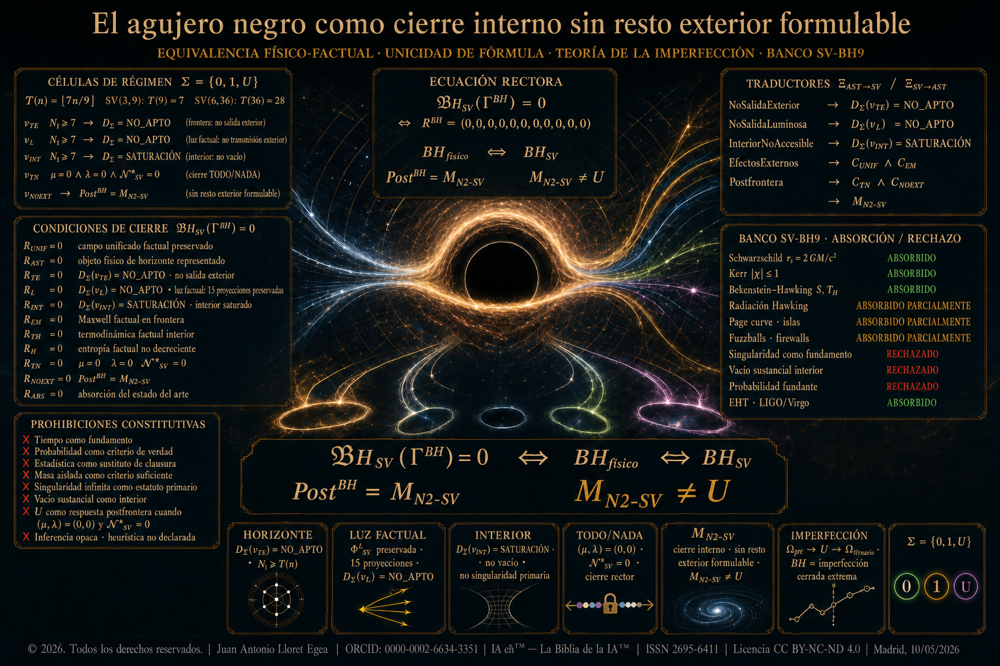

# El agujero negro como cierre interno sin resto exterior formulable

**Autor:** Juan Antonio Lloret Egea  
**ORCID:** 0000-0002-6634-3351  
**Derechos:** © 2026. Todos los derechos reservados.  
**Licencia:** CC BY-NC-ND 4.0  
**Fecha:** Madrid, 10/05/2026

## Publicación principal

Texto principal: [agujero-negro-clausura-no-transmisibilidad.md](https://github.com/juantoniolloretegea/SV-matematica-semantica/blob/main/documentos/adendas/matematica-fisica-factual-contemporanea-sv/agujero-negro-clausura-no-transmisibilidad/agujero-negro-clausura-no-transmisibilidad.md).

Repositorio canónico de la publicación: [https://github.com/juantoniolloretegea/SV-matematica-semantica/tree/main/documentos/adendas/matematica-fisica-factual-contemporanea-sv/agujero-negro-clausura-no-transmisibilidad](https://github.com/juantoniolloretegea/SV-matematica-semantica/tree/main/documentos/adendas/matematica-fisica-factual-contemporanea-sv/agujero-negro-clausura-no-transmisibilidad).

## Estructura

| Ruta | Función |
|---|---|
| [imagenes](https://github.com/juantoniolloretegea/SV-matematica-semantica/tree/main/documentos/adendas/matematica-fisica-factual-contemporanea-sv/agujero-negro-clausura-no-transmisibilidad/imagenes) | Imagen de portada de la publicación. |
| [laboratorios](https://github.com/juantoniolloretegea/SV-matematica-semantica/tree/main/documentos/adendas/matematica-fisica-factual-contemporanea-sv/agujero-negro-clausura-no-transmisibilidad/laboratorios) | Banco SV-BH9, runners, validadores, catálogo de errores y salidas reproducibles. |
| [PDF](https://github.com/juantoniolloretegea/SV-matematica-semantica/tree/main/documentos/adendas/matematica-fisica-factual-contemporanea-sv/agujero-negro-clausura-no-transmisibilidad/PDF) | Carpeta destinada al PDF firmado y sellado. |
| [zip_completo](https://github.com/juantoniolloretegea/SV-matematica-semantica/tree/main/documentos/adendas/matematica-fisica-factual-contemporanea-sv/agujero-negro-clausura-no-transmisibilidad/zip_completo) | Carpeta destinada al lote comprimido completo de preservación. |

## Dictamen final incorporado

La publicación incorpora el cierre absoluto bajo la Teoría del TODO y de la NADA: fórmula BHₛᵥ(Γᴮᴴ)=0, no egreso local, postfrontera M_N2-SV, exclusión de U, copia, reescritura y desaparición sin traza, clausura factual de toda instancia terminal capturada y retorno de su traza al Todo.

## Ejecución de laboratorios

La ejecución completa se realiza desde la carpeta `laboratorios` con:

python runner.py

Los resultados quedan registrados en `laboratorios/salidas`.

## Compromiso formal

Esta publicación preserva la disciplina del Sistema Vectorial SV: sin tiempo como fundamento, sin probabilidad como criterio de verdad, sin estadística como sustituto de clausura, sin inferencia opaca, sin singularidad infinita como estatuto primario, sin vacío sustancial como interior y sin U como respuesta postfrontera cuando M_N2-SV queda dictaminado.
