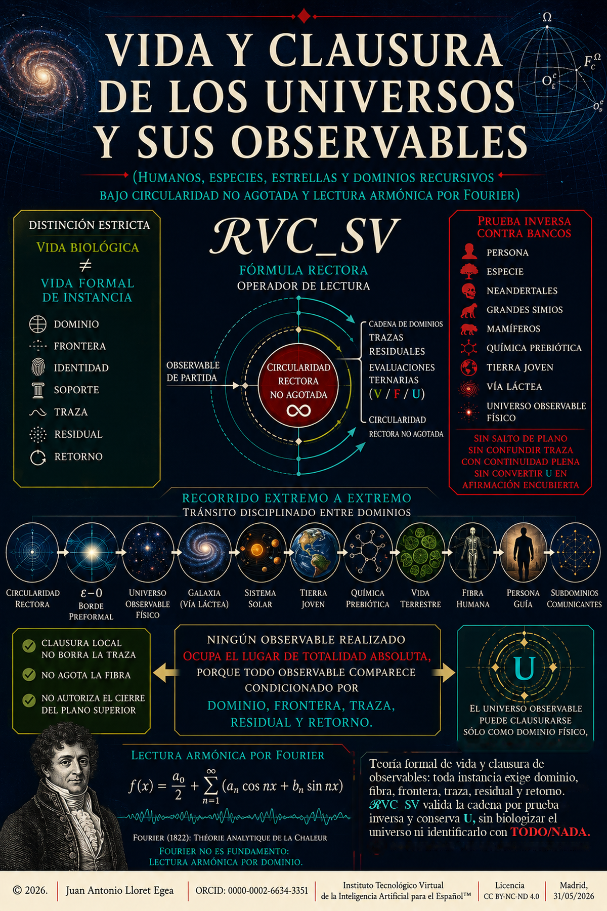

# Vida y clausura de los universos y sus observables

## Humanos, especies, estrellas y dominios recursivos bajo circularidad no agotada y lectura armónica por Fourier

© 2026. Todos los derechos reservados. | Juan Antonio Lloret Egea | DOI [10.21428/39829d0b.b53ebe0a](https://doi.org/10.21428/39829d0b.b53ebe0a) | [ORCID: 0000-0002-6634-3351](https://orcid.org/0000-0002-6634-3351) | Instituto Tecnológico Virtual de la Inteligencia Artificial para el Español™ (ITVIA) | IA eñ™ — La Biblia de la IA™ | ISSN 2695-6411 | Licencia [CC BY-NC-ND 4.0](https://creativecommons.org/licenses/by-nc-nd/4.0/deed.es) | Madrid, 31/05/2026 |

## Publicación

La investigación formula una teoría formal de vida y clausura de observables realizados. Parte de una distinción estricta entre vida biológica y vida formal de instancia: una persona, una especie, una estrella, una galaxia o un dominio-universo sólo comparecen cuando declaran dominio, frontera, identidad, soporte, traza, residual y retorno. La fórmula `𝓡VC_SV` se construye, se somete a prueba inversa contra bancos de contraste y se eleva al teorema de recursión de vida y clausura del observable realizado.

El resultado no identifica el universo observable con el TODO/NADA, no atribuye edad física a la totalidad absoluta, no convierte Fourier en fundamento y conserva `U` cuando falta cierre suficiente sin contradicción material. La portada actúa como representación gráfica de la tesis; el contenido formal queda fijado en el texto Markdown y en el PDF firmado.

Versión editorial con DOI: [https://doi.org/10.21428/39829d0b.b53ebe0a](https://doi.org/10.21428/39829d0b.b53ebe0a)

## Archivos principales

| Ruta | Contenido |
|---|---|
| [`vida-clausura-de-universos-y-sus-observables.md`](vida-clausura-de-universos-y-sus-observables.md) | Texto Markdown para GitHub. |
| [`imagenes/portada.png`](imagenes/portada.png) | Portada gráfica de la publicación. |
| [`pdf/vida-clausura-de-universos-y-sus-observables_signed.pdf`](pdf/vida-clausura-de-universos-y-sus-observables_signed.pdf) | PDF firmado de la publicación. |
| [`pdf/vida-clausura-de-universos-y-sus-observables_signed.pdf.ots`](pdf/vida-clausura-de-universos-y-sus-observables_signed.pdf.ots) | Registro OpenTimestamps asociado al PDF firmado. |
| [`descargar-zip/vida-clausura-de-universos-y-sus-observables.zip`](descargar-zip/vida-clausura-de-universos-y-sus-observables.zip) | Archivo ZIP de descarga. |
| [`registros/vida-clausura-de-universos-y-sus-observables.zip.ots`](registros/vida-clausura-de-universos-y-sus-observables.zip.ots) | Registro OpenTimestamps asociado al ZIP. |
| [`registros/vida-clausura-de-universos-y-sus-observables.zip_signed.csig`](registros/vida-clausura-de-universos-y-sus-observables.zip_signed.csig) | Firma CSIG asociada al ZIP. |

## Identificación criptográfica

| Archivo | SHA-256 |
|---|---|
| `vida-clausura-de-universos-y-sus-observables.md` | `3b268a239023817c27278b14cad89b47683eb6f0008c6efbfc4b9ae5de4e49a8` |
| `imagenes/portada.png` | `bcaa45fe90fc5f50e9129861018d464a948b3a819001374d64fc8ec67d3ab8d9` |
| `pdf/vida-clausura-de-universos-y-sus-observables_signed.pdf` | `7136468b361a30c23605cc55c86734707fc759fe037abf1b98f22c86a8a309af` |
| `pdf/vida-clausura-de-universos-y-sus-observables_signed.pdf.ots` | `47f58cd95fe769eef28b81e12f580d9dac8189014551d9e157a8f7583970ed2c` |
| `descargar-zip/vida-clausura-de-universos-y-sus-observables.zip` | `d6825abd5b454982226da5769fb48578a033958a6bfc09a4f8c8e5a0ed7f51ae` |
| `registros/vida-clausura-de-universos-y-sus-observables.zip.ots` | `f9a6bea4ce824c0143a30dbdb3229450fd3c07fe325f71f8a6db29fe1ff1aa8b` |
| `registros/vida-clausura-de-universos-y-sus-observables.zip_signed.csig` | `8a53494410b47bec9d90521a9b721e0f2301029041f31f1ec387ec1b2b513c89` |

Los hashes identifican materialmente los archivos indicados. Cualquier modificación posterior del texto, PDF, portada, ZIP o registros altera la identificación y exige nueva generación de integridad, firma o sellado cuando corresponda.

## Resumen estructural

La obra distingue vida biológica y vida formal de instancia. En biología, la vida exige frontera funcional, intercambio gobernado, información operativa, reparación, continuidad y retorno. En dominios no biológicos, vida formal de instancia nombra comparecencia, despliegue, traza, residual, retorno y clausura local bajo dominio declarado.

El desarrollo articula siete tramos principales: apertura formal de observable, instancia, fibra y ciclo acotado; clausura local, traza, residual y `U`; potencial, círculo, sinusoidal y Fourier como lectura armónica por dominio; dominio-universo sin identificación con TODO/NADA; fórmula rectora `𝓡VC_SV`; prueba inversa contra bancos; y teorema de recursión de vida y clausura del observable realizado.

Los anexos precisan la observabilidad y comunicación estructural de la instancia —persona, especie y dominio-universo— y ofrecen un recorrido extremo a extremo desde la circularidad rectora hasta la instancia humana y sus subdominios comunicantes, sin convertir cifras, bancos físicos o trazas en fundamento.

## Cita sugerida

Lloret Egea, J. A. (2026). *Vida y clausura de los universos y sus observables: Humanos, especies, estrellas y dominios recursivos bajo circularidad no agotada y lectura armónica por Fourier*. IA eñ™ — La Biblia de la IA™. https://doi.org/10.21428/39829d0b.b53ebe0a
