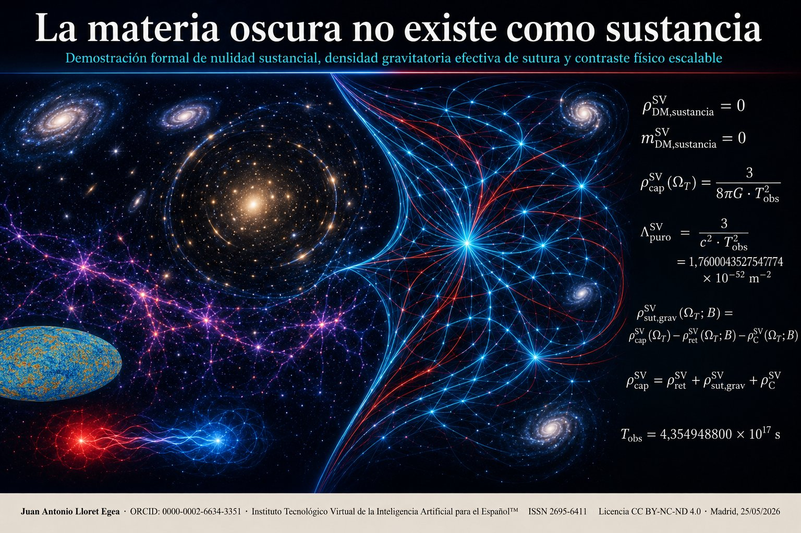

# Suite de laboratorios computacionales

## La materia oscura no existe como sustancia
### Demostración formal de nulidad sustancial, densidad gravitatoria efectiva de sutura y contraste físico escalable



---

## Autoría y sede editorial

**Autor:** Juan Antonio Lloret Egea  
**ORCID:** [0000-0002-6634-3351](https://orcid.org/0000-0002-6634-3351)  
**Sello editorial:** Instituto Tecnológico Virtual de la Inteligencia Artificial para el Español™ (ITVIA)  
**Publicación:** IA eñ™ — La Biblia de la IA™  
**ISSN:** [2695-6411](https://portal.issn.org/resource/ISSN/2695-6411)  
**Licencia:** [Creative Commons Attribution-NonCommercial-NoDerivatives 4.0 International (CC BY-NC-ND 4.0)](https://creativecommons.org/licenses/by-nc-nd/4.0/)  
**Fecha:** 25 de mayo de 2026  
**Lugar:** Madrid

---

## Propósito

Esta suite contiene los ocho laboratorios computacionales que implementan, verifican y auditan formalmente los cálculos del trabajo de referencia. Cada laboratorio es un programa Python autoejecutable que reproduce con precisión decimal extendida (50 dígitos) las cifras canónicas del corpus del Sistema Vectorial SV, partiendo exclusivamente de las constantes fundamentales declaradas y sin importar parámetros de la cosmología contemporánea como entradas internas del cálculo.

El propósito de la suite no es realizar nuevas mediciones físicas sino verificar computacionalmente que las cifras del trabajo son auditables desde las constantes canónicas del corpus, que las identidades formales se sostienen, que las restricciones canónicas de admisión operan según la disciplina declarada, y que el resultado nuclear ρ_DM,sustancia^SV = 0 es consecuencia de la mecánica del aparato y no postulado externo.

## Trabajo de referencia

Lloret Egea, J. A. (2026). *La materia oscura no existe como sustancia: Demostración formal de nulidad sustancial, densidad gravitatoria efectiva de sutura y contraste físico escalable*. Instituto Tecnológico Virtual de la Inteligencia Artificial para el Español — IA eñ — La Biblia de la IA.

## Estructura de la suite

| Fichero | Propósito |
|---|---|
| `lab_01_constantes_fundamentales_sv.py` | Declara las constantes canónicas T_obs, c, G y π con precisión decimal extendida y su estatuto metrológico (primitivo, transductor, constante de contraste). |
| `lab_02_lambda_sv_puro.py` | Calcula Λ_SV,puro = 3/(c²·T_obs²) y verifica coincidencia con la cifra canónica establecida en el *Teorema de resolución física de la constante cosmológica* (Lloret Egea, 2026h). |
| `lab_03_capacidad_estructural.py` | Calcula ρ_cap^SV(Ω_T), m_cap^SV(Ω_T) y V_T^SV con verificaciones de consistencia interna entre las tres magnitudes. |
| `lab_04_inventario_b0.py` | Construye el inventario inicial B₀ con la tupla canónica (ρ_A^SV, ρ_U^SV, ρ_E^SV, ρ_X^SV), incluyendo bariones cosmológicos, neutrinos masivos mínimos, materialidad candidata, retorno energético y exclusiones. |
| `lab_05_sutura_inicial.py` | Calcula la densidad gravitatoria efectiva de sutura ρ_sut,grav^SV(Ω_T;B₀) por diferencia estructural y la contrasta con cifras del banco contemporáneo Planck 2020. |
| `lab_06_identidad_nula.py` | Implementa la evaluación de admisión local μ_i^M ∈ {1, 0, U} sobre cinco candidatos materiales y verifica que ρ_DM,sustancia^SV = 0 emerge como consecuencia formal de la restricción canónica de admisión. |
| `lab_07_matriz_contraste.py` | Genera la matriz comparativa SV ↔ ΛCDM con diez filas, distinguiendo origen (corpus previo, derivación, resultado nuclear) y estatuto, y exporta versión markdown para PubPub/GitHub. |
| `lab_08_falsabilidad.py` | Test computacional de falsabilidad: simula cuatro escenarios hipotéticos de detección de partícula oscura y verifica que la tesis cae únicamente cuando los cuatro criterios de refutación se cumplen simultáneamente. |

## Cifras canónicas reproducidas por la suite

| Magnitud | Valor | Origen |
|---|---|---|
| T_obs | 4,354948800 × 10¹⁷ s | corpus previo (Lloret Egea, 2026i) |
| c | 299 792 458 m·s⁻¹ | primitivo SV |
| G | 6,67430 × 10⁻¹¹ m³·kg⁻¹·s⁻² | transductor metrológico |
| Λ_SV,puro | 1,7600043527547774 × 10⁻⁵² m⁻² | corpus previo (Lloret Egea, 2026h) |
| ρ_cap^SV(Ω_T) | 9,429953786784435 × 10⁻²⁷ kg·m⁻³ | derivación del presente trabajo |
| m_cap^SV(Ω_T) | 8,790416297944350 × 10⁵² kg | derivación del presente trabajo |
| ρ_DM,sustancia^SV | **0** (identidad exacta) | **resultado nuclear** |
| m_DM,sustancia^SV | **0** (identidad exacta) | **resultado nuclear** |
| ρ_A^SV(Ω_T;B₀) | ≈ 4,3 × 10⁻²⁸ kg·m⁻³ | banco inicial conservador |
| ρ_sut,grav^SV(Ω_T;B₀) | ≈ 8,99 × 10⁻²⁷ kg·m⁻³ | banco inicial (auxiliar) |

## Requisitos técnicos

- Python 3.8 o superior
- Sin dependencias externas (sólo biblioteca estándar: `decimal`)

## Ejecución

Cada laboratorio se ejecuta de forma autónoma:

```bash
python3 lab_01_constantes_fundamentales_sv.py
python3 lab_02_lambda_sv_puro.py
python3 lab_03_capacidad_estructural.py
python3 lab_04_inventario_b0.py
python3 lab_05_sutura_inicial.py
python3 lab_06_identidad_nula.py
python3 lab_07_matriz_contraste.py
python3 lab_08_falsabilidad.py
```

Los laboratorios 2 a 8 importan los anteriores como módulos: la ejecución secuencial reproduce la cadena de derivación canónica desde las constantes fundamentales hasta el test de falsabilidad final.

## Lectura recomendada

Para auditar el trabajo en profundidad, la lectura conjunta sugerida es:

1. Leer el documento de referencia (`materia_oscura_no_existe_como_sustancia_final_v4.md`) hasta §6.
2. Ejecutar `lab_01` a `lab_05` para verificar las cifras numéricas del cuerpo.
3. Leer §7 (Teorema de nulidad sustancial) del documento.
4. Ejecutar `lab_06` para verificar la mecánica de admisión canónica.
5. Leer §10 y §12 del documento.
6. Ejecutar `lab_07` para comparar con ΛCDM y `lab_08` para auditar la falsabilidad.

## Sedes canónicas del corpus utilizadas

- Lloret Egea, J. A. (2026a). *Imperfección preformal y espacio*. [https://doi.org/10.21428/39829d0b.9c57c046](https://doi.org/10.21428/39829d0b.9c57c046)
- Lloret Egea, J. A. (2026b). *Teoría general de sucesos generadores y de los protocampos unificados en el Sistema Vectorial SV*. [https://doi.org/10.17613/177nb-v2465](https://doi.org/10.17613/177nb-v2465)
- Lloret Egea, J. A. (2026c). *Primitivos metrológicos del Sistema Vectorial SV*. [https://doi.org/10.21428/39829d0b.c8ec692e](https://doi.org/10.21428/39829d0b.c8ec692e)
- Lloret Egea, J. A. (2026d). *Origen doctrinal, definición y alcance de la U en el Sistema Vectorial SV*.
- Lloret Egea, J. A. (2026f). *El agujero negro como cierre interno sin resto exterior formulable*. [https://doi.org/10.21428/39829d0b.b757ccc4](https://doi.org/10.21428/39829d0b.b757ccc4)
- Lloret Egea, J. A. (2026g). *Teoría del TODO y de la NADA en el Sistema Vectorial SV*. [https://doi.org/10.17613/k3q1d-fjj45](https://doi.org/10.17613/k3q1d-fjj45)
- Lloret Egea, J. A. (2026h). *Teorema de resolución física de la constante cosmológica*.
- Lloret Egea, J. A. (2026i). *Edades relativas del universo observable y de sus objetos físicos*.

## Instalaciones experimentales referenciadas en lab_08

- **LUX-ZEPLIN:** [https://lz.lbl.gov/](https://lz.lbl.gov/)
- **XENONnT:** [https://xenonexperiment.org/](https://xenonexperiment.org/)
- **PandaX-4T:** [https://pandax.sjtu.edu.cn/](https://pandax.sjtu.edu.cn/)
- **Fermi-LAT:** [https://fermi.gsfc.nasa.gov/](https://fermi.gsfc.nasa.gov/)
- **IceCube:** [https://icecube.wisc.edu/](https://icecube.wisc.edu/)
- **AMS-02:** [https://ams02.space/](https://ams02.space/)

## Protección intelectual

Esta suite forma parte de la obra protegida intelectualmente bajo licencia [Creative Commons Attribution-NonCommercial-NoDerivatives 4.0 International (CC BY-NC-ND 4.0)](https://creativecommons.org/licenses/by-nc-nd/4.0/).

Cualquier referencia académica al código o a sus resultados debe citar la sede canónica original con DOI cuando esté disponible, así como las condiciones de licencia:

- **Atribución:** se debe dar crédito apropiado al autor original, proporcionar un enlace a la licencia e indicar si se realizaron cambios.
- **No comercial:** el material no puede usarse con fines comerciales.
- **Sin obras derivadas:** si se modifica, transforma o construye a partir del material, no se puede distribuir el material modificado.

Para citas académicas:

> Lloret Egea, J. A. (2026). *La materia oscura no existe como sustancia: Demostración formal de nulidad sustancial, densidad gravitatoria efectiva de sutura y contraste físico escalable*. ITVIA — IA eñ — La Biblia de la IA. ISSN: 2695-6411.

## Contacto

Juan Antonio Lloret Egea  
ORCID: [https://orcid.org/0000-0002-6634-3351](https://orcid.org/0000-0002-6634-3351)  
ITVIA — Madrid, España
