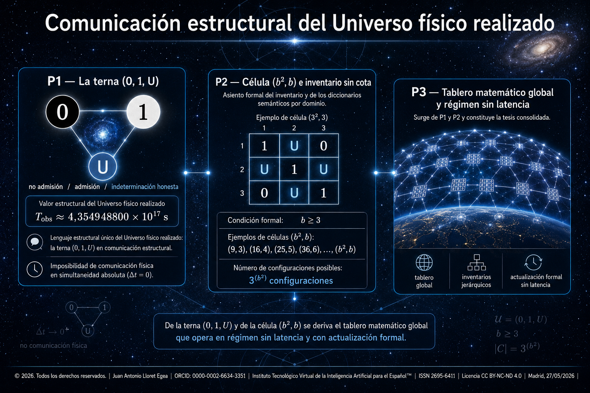

[](https://doi.org/10.21428/39829d0b.552f4cfc)
[](https://orcid.org/0000-0002-6634-3351)
[](https://portal.issn.org/resource/ISSN/2695-6411)
[](https://creativecommons.org/licenses/by-nc-nd/4.0/)

---

## Autoría y sede editorial

**Juan Antonio Lloret Egea**  
Instituto Tecnológico Virtual de la Inteligencia Artificial para el Español™ (ITVIA)  
IA eñ™ — La Biblia de la IA™  
Madrid, 27/05/2026

**DOI de la colección**: <https://doi.org/10.21428/39829d0b.552f4cfc>  
**Colección secundaria asociada**: «El Universo» — <https://doi.org/10.21428/39829d0b.26484bfd>

---

## Propósito

Se desarrolla un programa académico del Sistema Vectorial SV dedicado al régimen estructural matemático del Universo físico realizado. La tesis nuclear establece que la única forma de comunicación coherente y simultánea a escala del Universo físico real es de naturaleza estrictamente matemática, no de naturaleza propagativa física. Bajo la velocidad finita de la luz y la magnitud del régimen ciclo-distancial `T_obs ≈ 4,354948800 × 10¹⁷ s` formalizado en el *Teorema de resolución física de la constante cosmológica* (Lloret Egea, 2026), ningún sistema físico —ni siquiera bajo hipótesis supraluminal— puede sostener comunicación al unísono extremo a extremo del dominio. Solo la estructura matemática, instanciada como terna factual `(0, 1, U)`, opera como lenguaje único, sin latencia ni propagación, dado que su naturaleza es formal y no material.

**Tres ejes formales articulan el programa**: la terna `(0, 1, U)` como lenguaje único del Universo físico real; la célula `(b², b)` con `b ≥ 3` como sede formal mínima del inventario; y el tablero matemático global como conjunto de células gobernadas por inventarios coherentes con diccionarios semánticos por dominio y subdominio. La sede del inventario completo se encuentra en la *Teoría del TODO y de la NADA en el Sistema Vectorial SV* (Lloret Egea, 2026).

La disciplina rectora del SV deslinda explícitamente los planos teológicos, espiritualistas y panpsiquistas. La propuesta opera al nivel físico-formal de la estructura matemática del Universo físico realizado. No atribuye sintiencia, intención, consciencia ni propósito al Universo físico real. La actualización sin latencia del tablero matemático global es propiedad formal de la estructura matemática, no manifestación de agencia.

---

## Composición de la colección

| Publicación | Función |
|---|---|
| **P1.** La terna (0, 1, U) como lenguaje único del Universo físico real | Fundamento formal del régimen matemático estructural |
| **P2.** Célula (b², b) e inventario sin cota: arquitectura matemática del Universo físico real | Arquitectura formal de la sede y de los diccionarios semánticos por dominio y subdominio |
| **P3.** Tablero matemático global y régimen sin latencia del Universo físico real | Tesis nuclear consolidada y articulación con el corpus existente |

El orden de lectura es no conmutativo: cada publicación presupone la disciplina y los resultados de la anterior.

---

## Antecedente fundador

Como antecedente formal, se presupone la ley general del tránsito por dominios desarrollada en:

> Lloret Egea, J. A. (2026). *El origen material ordinario del Universo observable y la relación entre física contemporánea y el SV en el tránsito por dominios: errores de plano, contraste entre aparatos y continuidad H–He de la materia ordinaria*. ITVIA — IA eñ™ — La Biblia de la IA™. <https://doi.org/10.21428/39829d0b.90fce13d>

En el Apartado I del documento se formaliza la ley general del tránsito por dominios bajo el aparato del Sistema Vectorial SV. La fórmula rectora declarada es `T_D^SV(D_i, D_j; x) = 0 ⇔ R_D^SV(D_i, D_j; x) = 0`, donde el residual de tránsito `R_D^SV` se descompone en restricciones independientes que controlan dominio, identidad tipada, estado declarado, frontera, canal, traza y retorno. El teorema de identidad de tránsito por dominios, en su forma compacta `Id_trans^SV(x; Γ_D) = 1 ⇔ ⊕_i R_D^SV(D_i, D_{i+1}; x) = 0`, demuestra que una identidad puede atravesar dominios distintos si y sólo si cada tránsito local conserva las condiciones estructurales exigidas bajo residual nulo o gobernado.

Se hereda el enunciado aparato como sustrato formal: sin ley general de tránsito por dominios formalizada, la tesis de un tablero matemático global con diccionarios semánticos por dominio y subdominio carecería de fundamento estructural.

---

<details>
<summary><strong>P1 — La terna (0, 1, U) como lenguaje único del Universo físico real</strong></summary>

*Imposibilidad estructural de la comunicación física al unísono y exclusividad de la estructura matemática.*

### Índice

§0. Introducción · §1. Estado del arte · §2. Régimen ciclo-distancial T_obs y horizonte físico de propagación · §3. Teorema de imposibilidad de comunicación física al unísono extremo a extremo · §4. La terna (0, 1, U) como lenguaje único del Universo físico real · §5. Independencia formal de la terna respecto a la propagación · §6. Distinción rigurosa entre actualización formal del tablero matemático y cambio físico subyacente · §7. Condiciones de refutación específicas · §8. Laboratorio computacional BCAM-TER · §9. Conclusión, alcance y aguijón · Anexo I — Bibliografía curada · Anexo II — Manifiesto SHA-256 · Anexo III — Adversarial declarado y respuesta editorial

### Introducción

La comunicación a escala del Universo físico real se enfrenta a una restricción estructural impuesta por la finitud de la velocidad de la luz y por la magnitud del régimen ciclo-distancial `T_obs ≈ 4,354948800 × 10¹⁷ s` formalizado en el *Teorema de resolución física de la constante cosmológica* del Sistema Vectorial SV (Lloret Egea, 2026, <https://doi.org/10.21428/39829d0b.41afec0f>). Bajo cualquier sistema físico de propagación —electromagnético, mecánico, neutrínico, hipotético supraluminal— la latencia cosmológica impide la comunicación coherente al unísono extremo a extremo del dominio. Esta publicación demuestra formalmente esta imposibilidad y establece, por exclusión, la única vía operativa restante: la estructura matemática formal, instanciada como terna factual `(0, 1, U)`.

La terna `(0, 1, U)` opera como lenguaje único del Universo físico real porque cumple tres condiciones que ningún sistema propagativo cumple: presencia estructural sin propagación, independencia formal del régimen de velocidad y coherencia operativa simultánea sobre el dominio completo. El valor `0` codifica la no admisión bajo criterio rector; `1` codifica la admisión; `U` codifica la indeterminación honesta sin clausura prematura. La terna es atributo formal del dominio, no contenido material que viaje.

El trabajo distingue con rigor dos planos que el debate contemporáneo confunde con frecuencia: la actualización formal del tablero matemático del Universo físico realizado, que opera sin latencia por naturaleza estructural, y el cambio físico subyacente del observable, que opera con la latencia propia de su régimen material. La distinción no postula entidades platónicas independientes ni atribuye agencia a las matemáticas; postula únicamente que la estructura matemática del dominio físico realizado es propiedad formal del dominio mismo, no separada de él ni adicional a él.

### Estado del arte

La cuestión de la comunicación coherente a escala cosmológica tiene historia bien documentada en física teórica. La **relatividad especial** de Einstein (1905) fija la velocidad de la luz `c` como límite superior de cualquier propagación causal en el dominio físico (DOI 10.1002/andp.19053221004). La **cosmología relativista** sustentada por la colaboración **Planck** (Planck Collaboration, 2020, DOI 10.1051/0004-6361/201833910) establece la edad del universo observable y la magnitud del horizonte cosmológico. El **Teorema de resolución física de la constante cosmológica** del Sistema Vectorial SV (Lloret Egea, 2026, <https://doi.org/10.21428/39829d0b.41afec0f>) formaliza `T_obs ≈ 4,354948800 × 10¹⁷ s` como régimen ciclo-distancial estructural pura.

En la frontera supraluminal, la **hipótesis taquiónica** (Sudarshan, Bilaniuk, Deshpande 1962; Feinberg 1967) ha sido tratada con rigor teórico sin que se haya observado evidencia experimental de propagación superior a `c`. La **mecánica cuántica** introduce correlaciones a distancia en pares entrelazados, formalizadas en las desigualdades de Bell (1964) y verificadas experimentalmente por Aspect, Dalibard y Roger (1982, DOI 10.1103/PhysRevLett.49.1804), Hensen et al. (2015, DOI 10.1038/nature15759) y Giustina et al. (2015, DOI 10.1103/PhysRevLett.115.250401), sin que esas correlaciones permitan transmisión de información física utilizable a velocidad superior a `c`, según el teorema de **no-señalización** (Ghirardi, Rimini, Weber 1980; Eberhard 1989, DOI 10.1007/BF02728310).

La fundamentación lógica del aparato trivalente se remonta a la **lógica de Łukasiewicz** (1920) y a la **lógica de Kleene** (1938, DOI 10.2307/2267778). Ambas formalizan sistemas con tres valores de verdad y han sido aplicadas a teoría de bases de datos relacionales con valores nulos (Codd, 1979, DOI 10.1145/320107.320109), inteligencia artificial bajo incertidumbre y verificación formal de sistemas con estados desconocidos. La **lógica intuicionista** de Brouwer y Heyting introduce paralelamente la noción de indeterminación honesta como elemento estructural del razonamiento formal.

En filosofía de las matemáticas, la **hipótesis del Universo matemático** de Tegmark (2008, DOI 10.1007/s10701-007-9186-9) propone que la realidad física es una estructura matemática completa, posición que este trabajo no asume ni rechaza, dado que opera en plano físico-formal y no metafísico. La discusión histórica sobre la **«unreasonable effectiveness of mathematics in the natural sciences»** de Wigner (1960, DOI 10.1002/cpa.3160130102) sigue abierta. El estructuralismo matemático contemporáneo (Hellman, 1989; Shapiro, 1997) discute el estatuto de los objetos matemáticos sin requerir ontología platónica.

Esta publicación no toma partido en el debate metafísico sobre el estatuto último de las matemáticas. Introduce una tesis físico-formal acotada: en el Universo físico realizado, la única forma de comunicación coherente al unísono extremo a extremo es la estructura matemática misma del dominio, instanciada operativamente como terna `(0, 1, U)`. La tesis es verificable formalmente y queda sujeta a las condiciones de refutación declaradas en §7.

### Resto del cuerpo (§2 a §9)

Las secciones §2 a §9 desarrollan: formalización del régimen ciclo-distancial `T_obs` como horizonte físico de propagación coherente bajo el corpus SV; enunciado y demostración del teorema de imposibilidad de comunicación física al unísono mediante reducción al absurdo, abarcando regímenes electromagnético, mecánico, neutrínico e hipotético supraluminal; establecimiento formal de la terna `(0, 1, U)` como lenguaje único con tipado preciso de cada valor y catálogo de admisibilidad; demostración de la independencia formal de la terna respecto a cualquier régimen de propagación, con disciplina de no sustancialización; distinción rigurosa entre actualización formal del tablero matemático y cambio físico subyacente, formalizando los dos planos como no contradictorios y operativamente separables; seis condiciones específicas de refutación al estilo del manuscrito sobre el régimen H-He ordinario (Lloret Egea, 2026, <https://doi.org/10.21428/39829d0b.90fce13d>), incluyendo refutación por identificación de canal físico al unísono o por inconsistencia interna de la terna; ejecución del laboratorio BCAM-TER con verificación de consistencia formal, reproducción byte a byte y manifiesto SHA-256; conclusión, alcance acotado y aguijón doctrinal de cierre.

### Adversarial declarado y respuesta editorial

**Ataque A — Trivialidad: «por supuesto que las matemáticas son atemporales».** La aportación no consiste en afirmar la atemporalidad de las matemáticas, conocida desde Platón, sino en demostrar que esa propiedad las constituye en el único sistema operativamente capaz de sostener comunicación coherente al unísono extremo a extremo del Universo físico realizado. El teorema de §3 establece la imposibilidad estructural de toda alternativa propagativa, incluida la supraluminal hipotética. La conclusión no se sigue de la trivialidad sin demostración intermedia.

**Ataque B — Platonismo encubierto.** La sección §5 deslinda explícitamente con el realismo platónico. No se postula que las matemáticas sean entidad existente independiente del dominio físico. Se postula que la estructura matemática del Universo físico realizado es propiedad formal del dominio mismo, no separada de él. La indistinción entre estructura formal y dominio realizado es exactamente lo que evita el platonismo: no hay dos planos, hay un único dominio con estructura formal.

**Ataque C — Confusión de planos: el cambio físico no es instantáneo aunque el tablero matemático sí lo sea.** La sección §6 formaliza la distinción. El cambio físico de un observable opera con la latencia propia de su régimen material; la actualización formal del tablero matemático opera sin latencia porque es estructura formal. Los dos planos son operativamente separables y no contradictorios. La distinción evita el error de plano que la objeción detecta legítimamente.

**Ataque D — Cero predicción experimental nueva.** La tesis es físico-formal sobre estructura matemática del Universo físico realizado, no afirmación predictiva sobre observables experimentales adicionales. El alcance se declara explícitamente en §9. El aporte se sitúa en plano metodológico-formal: distinción rigurosa entre comunicación física con latencia y comunicación formal estructural sin latencia; entre actualización del tablero matemático y cambio físico subyacente.

**Ataque E — Irrefutabilidad estructural.** La sección §7 declara seis condiciones específicas de refutación. La principal: identificación experimental verificable de un canal físico que sostenga comunicación coherente al unísono entre dos puntos del Universo físico realizado separados por distancia mayor que `c · T_obs` refutaría la tesis nuclear de §3. La tesis es falsable bajo criterios declarados.

**Ataque F — Confusión con teoremas de no-señalización.** Los teoremas de no-señalización (Ghirardi-Rimini-Weber, Eberhard) prohíben transmisión de información física utilizable a velocidad superior a `c` bajo el aparato cuántico estándar. Esta publicación es compatible con esos teoremas y los extiende: la imposibilidad propagativa no agota la estructura comunicativa del dominio, dado que la terna `(0, 1, U)` opera como propiedad formal y no propagativa. No hay contradicción ni solapamiento.

**Ataque G — Solapamiento con lógicas trivalentes preexistentes.** La lógica de Łukasiewicz y la lógica de Kleene formalizan sistemas trivalentes lógicos. La terna `(0, 1, U)` del Sistema Vectorial SV no es lógica abstracta; es factual: instancia operativamente la admisión, no admisión e indeterminación honesta de observables físicos bajo criterio rector estructural. El aporte no se solapa porque el plano es factual-físico, no lógico-formal abstracto.

</details>

<details>
<summary><strong>P2 — Célula (b², b) e inventario sin cota: arquitectura matemática del Universo físico real</strong></summary>

*Sede formal mínima, progresión sin tope y diccionarios semánticos por dominio y subdominio.*

### Índice

§0. Introducción · §1. Estado del arte · §2. La célula (b², b) como sede formal mínima · §3. Progresión de células sin cota: (9, 3), (16, 4), (25, 5), (36, 6), …, (100, 10), …, (b², b) · §4. Inventario global y sub-inventarios jerárquicos · §5. Diccionarios semánticos por dominio y subdominio · §6. Condiciones de canal, barreras de potencial, enrutadores y nodos · §7. Articulación con la Teoría del TODO y de la NADA · §8. Condiciones de refutación específicas · §9. Laboratorio computacional BCAM-CEL · §10. Conclusión, alcance y aguijón · Anexo I — Bibliografía curada · Anexo II — Manifiesto SHA-256 · Anexo III — Adversarial declarado y respuesta editorial

### Introducción

La terna `(0, 1, U)` establecida como lenguaje único del Universo físico real en la publicación 1 requiere una sede formal sobre la que opere. Esta publicación formaliza dicha sede como célula `(b², b)`, entendida operativamente como matriz cuadrada de lado `b` con `b²` casillas, cada una de las cuales aloja un valor de la terna `(0, 1, U)`. La sede formal mínima exige `b ≥ 3`, condición estructural derivada de la disciplina del Sistema Vectorial SV. La progresión de células admisibles es `(9, 3), (16, 4), (25, 5), (36, 6), …, (100, 10), …, (b², b)`, sin cota superior sobre `b`.

La cardinalidad del espacio de configuraciones de cada célula es `3^(b²)`, magnitud que crece super-exponencialmente con `b`. Para la célula mínima `(9, 3)`, el espacio es de `3⁹ = 19 683` configuraciones; para `(100, 10)`, `3¹⁰⁰ ≈ 5,15 × 10⁴⁷` configuraciones. La ausencia de cota superior sobre `b` garantiza que el inventario formal del Universo físico real no encuentra límite estructural en cardinalidad, sin que ello exija célula efectivamente infinita: basta con que `b` sea dimensionable según el dominio o subdominio considerado.

También se formaliza la arquitectura de inventarios jerárquicos. El inventario global del Universo físico real se descompone en sub-inventarios por dominio y subdominio, cada uno con su diccionario semántico propio: química, eléctrica, electromagnética, energética, gravitatoria-estructural, biológica. Cada diccionario semántico opera con salida restringida a la terna `(0, 1, U)` y se gobierna mediante condiciones de canal, barreras de potencial, enrutadores y nodos formalizados con disciplina estructural. La sede del inventario completo se encuentra en la *Teoría del TODO y de la NADA en el Sistema Vectorial SV* (Lloret Egea, 2026, <https://doi.org/10.17613/k3q1d-fjj45>).

### Estado del arte

La cuestión de los espacios discretos como sede formal de fenómenos físicos tiene tratamiento contemporáneo en varias direcciones. La **teoría de autómatas celulares** de von Neumann y Ulam (1948), Conway (1970) y Wolfram (2002) formaliza sistemas dinámicos sobre rejillas discretas con valores locales y reglas de actualización. La **mecánica cuántica de bucles** de Rovelli y colaboradores reconstruye la geometría espaciotemporal en términos de redes de spin con cardinalidad discreta (DOI 10.1142/S0218271804004426). La **teoría de conjuntos causales** de Sorkin propone discretizar el espacio-tiempo en redes de relaciones de causalidad (DOI 10.1142/9789812702098_0009). El **cálculo de Regge** (1961, DOI 10.1007/BF02733251) introduce discretización geométrica para gravedad numérica.

En matemáticas puras, la **combinatoria de configuraciones** sobre alfabetos finitos —especialmente sobre alfabeto trivalente— tiene desarrollo formal en teoría de códigos (Hamming, 1950, DOI 10.1002/j.1538-7305.1950.tb00463.x) y en teoría de matrices sobre cuerpos finitos. La **teoría de grafos y redes** (Erdős y Rényi, 1959; Barabási y Albert, 1999, DOI 10.1126/science.286.5439.509) formaliza estructuras de conectividad con enrutadores, nodos y capacidad de canal.

La fundamentación de los inventarios formales globales sobre dominios complejos aparece en **teoría de categorías** (Mac Lane, 1971; Awodey, 2010) y en **fundamentos lógicos del cómputo** (Turing, 1936, DOI 10.1112/plms/s2-42.1.230; Church, 1941). La **teoría de la información de Shannon-Weaver** (1948, DOI 10.1002/j.1538-7305.1948.tb01338.x) formaliza canales con capacidad, ruido y codificación semántica.

En la frontera con la física cuántica de información, la **teoría cuántica de la información** (Holevo, 1998, DOI 10.1109/18.651037; Nielsen y Chuang, 2000) formaliza canales cuánticos, entrelazamiento como recurso y comunicación bajo restricciones cuánticas. La conjetura **ER = EPR** de Maldacena y Susskind (2013, DOI 10.1002/prop.201300020) propone equivalencia formal entre puentes de Einstein-Rosen y correlaciones EPR. El **principio holográfico** ('t Hooft 1993, Susskind 1995, Bekenstein 1973) postula que la información de un volumen puede codificarse en su frontera (DOI 10.1063/1.531249).

Esta publicación no se solapa con ninguna de estas líneas. Introduce la célula `(b², b)` como sede formal específica derivada de la disciplina rectora del Sistema Vectorial SV, con cardinalidad estructural sobre alfabeto trivalente `(0, 1, U)` y arquitectura jerárquica de inventarios bajo diccionarios semánticos por dominio. La aportación se sitúa en plano estructural-formal del Universo físico realizado, no en plano abstracto ni en plano cuántico-informacional específico.

### Resto del cuerpo (§2 a §10)

Las secciones §2 a §10 desarrollan: definición formal de la célula `(b², b)` con tipado preciso de cada casilla en alfabeto `(0, 1, U)` y demostración de la condición mínima `b ≥ 3`; enunciado de la progresión de células admisibles sin cota superior, con cardinalidad `3^(b²)` por célula y tabla de ejemplos hasta `b = 100`; formalización del inventario global y sub-inventarios jerárquicos por dominio y subdominio; construcción de los diccionarios semánticos por dominio —química, eléctrica, electromagnética, energética, gravitatoria-estructural, biológica— con salida restringida a la terna; aparato formal de condiciones de canal, barreras de potencial, enrutadores y nodos como arquitectura de gobernabilidad sobre la terna; articulación cuantitativa y conceptual con la *Teoría del TODO y de la NADA* del Sistema Vectorial SV (Lloret Egea, 2026, <https://doi.org/10.17613/k3q1d-fjj45>) como sede del inventario completo; seis condiciones específicas de refutación, incluyendo refutación por imposibilidad de instanciación de `b` mínimo o por inconsistencia interna del inventario; ejecución del laboratorio BCAM-CEL con verificación de consistencia formal de la célula y de los inventarios jerárquicos, manifiestos SHA-256 y reproducción byte a byte; conclusión, alcance acotado y aguijón doctrinal.

### Adversarial declarado y respuesta editorial

**Ataque A — Reinvención de autómatas celulares con vocabulario nuevo.** Los autómatas celulares de Wolfram-Conway operan sobre alfabetos arbitrarios, reglas de transición local y dinámica temporal explícita. La célula `(b², b)` del Sistema Vectorial SV opera sobre alfabeto trivalente fijado por disciplina rectora, sin dinámica temporal soberana —en línea con la disciplina SV de no tiempo soberano— y con sede directamente en el dominio físico realizado, no como simulador computacional de éste. El aporte no se solapa estructuralmente con autómatas celulares.

**Ataque B — Solapamiento con lógicas trivalentes (Łukasiewicz, Kleene).** La terna `(0, 1, U)` es factual y no lógica abstracta. La célula `(b², b)` opera sobre dicha terna en sede física-formal del dominio realizado, no sobre proposiciones lógicas.

**Ataque C — Arbitrariedad de la condición b ≥ 3.** La condición se demuestra formalmente: para `b = 1` la célula degenera a un único punto sin estructura interna; para `b = 2` la cardinalidad `3⁴ = 81` admite estructura combinatoria pero insuficiente para sostener interacciones cruzadas mínimas de la disciplina rectora; `b = 3` es el primer valor que admite tipología no degenerada con familias generadoras y reglas de canal operativas. La condición se sostiene formalmente, no por convención.

**Ataque D — Cardinalidad sin cota como artefacto especulativo.** La ausencia de cota superior sobre `b` no implica célula efectivamente infinita; implica que la sede formal puede dimensionarse según el dominio o subdominio sin tope estructural a priori. La diferencia entre cardinalidad no acotada y cardinalidad efectivamente infinita queda formalizada.

**Ataque E — Diccionarios semánticos como descripción no formalizable.** El §5 fija el tipado formal de cada diccionario semántico con catálogo declarado por dominio, salida restringida a `(0, 1, U)` y reglas de admisión explícitas. La descripción es operativa y verificable, no narrativa.

**Ataque F — Enrutadores, barreras y nodos como préstamo de teoría de redes sin reformulación.** La arquitectura se deriva de la disciplina rectora del Sistema Vectorial SV y de la sede formal de la célula, no se importa desde teoría de redes contemporánea. La nomenclatura coincide; la base formal es propia.

**Ataque G — Confusión entre inventario formal y observable físico.** El §4 distingue inventario formal —catálogo de admisibilidad estructural— y observable físico —instancia material con régimen propio—. La distinción es operativa y se mantiene a lo largo del cuerpo del trabajo.

</details>

<details>
<summary><strong>P3 — Tablero matemático global y régimen sin latencia del Universo físico real</strong></summary>

*Tesis nuclear de la colección y articulación con el corpus.*

### Índice

§0. Introducción · §1. Estado del arte · §2. Consolidación formal de P1 y P2 como suelo del aparato · §3. Tesis nuclear: tablero matemático global y régimen sin latencia · §4. Actualización formal del tablero y cambio físico subyacente: distinción operativa · §5. Articulación con el corpus del Sistema Vectorial SV · §6. Caso aplicado: tablero y régimen H-He ordinario · §7. Caso aplicado: tablero y nulidad sustancial de la materia oscura · §8. Condiciones específicas de refutación de la tesis nuclear · §9. Laboratorio computacional BCAM-TAB · §10. Alcance declarado: lo que la tesis afirma y lo que no afirma · §11. Conclusión, aguijón y roadmap de continuidad · Anexo I — Bibliografía curada · Anexo II — Manifiesto SHA-256 · Anexo III — Adversarial declarado y respuesta editorial

### Introducción

Las publicaciones 1 y 2 establecen, respectivamente, la terna `(0, 1, U)` como lenguaje único del Universo físico real bajo imposibilidad estructural de la comunicación física al unísono, y la célula `(b², b)` con `b ≥ 3` sin cota superior como sede formal mínima con arquitectura jerárquica de inventarios y diccionarios semánticos por dominio. Esta publicación enuncia y demuestra la **tesis nuclear** del programa: el Universo físico real opera bajo régimen estructural matemático cuya sede operativa es el tablero matemático global, construido como conjunto coherente de células `(b², b)` gobernadas por inventarios coherentes con salida restringida a la terna `(0, 1, U)`; la actualización formal del tablero matemático se da sin latencia ni retardo, dado que es propiedad estructural y no propagativa.

La tesis se sostiene sobre el aparato formal de P1 (imposibilidad propagativa, exclusividad de la estructura matemática) y P2 (sede formal célula y arquitectura jerárquica de inventarios). Articula con el corpus existente del Sistema Vectorial SV mediante la sede del inventario en la *Teoría del TODO y de la NADA* (Lloret Egea, 2026, <https://doi.org/10.17613/k3q1d-fjj45>), el régimen ciclo-distancial `T_obs` en el *Teorema de resolución física de la constante cosmológica* (Lloret Egea, 2026, <https://doi.org/10.21428/39829d0b.41afec0f>), la genealogía de la imperfección preformal en (Lloret Egea, 2026, <https://doi.org/10.21428/39829d0b.9c57c046>) y la teoría general de sucesos generadores en (Lloret Egea, 2026, <https://doi.org/10.17613/177nb-v2465>). Se aplica como caso testigo al régimen H-He ordinario (Lloret Egea, 2026, <https://doi.org/10.21428/39829d0b.90fce13d>) y a la nulidad sustancial de la materia oscura (Lloret Egea, 2026, <https://doi.org/10.21428/39829d0b.7b41835f>).

La sección §10 declara explícitamente el alcance de la tesis: el tablero matemático global no es atributo de consciencia distribuida ni manifestación de agencia universal; es propiedad formal estructural del Universo físico realizado. La actualización sin latencia es propiedad de la estructura matemática misma, no testimonio de sintiencia o intencionalidad cósmica.

### Estado del arte

La cuestión del estatuto matemático global del Universo físico se trata en varias direcciones contemporáneas. La **hipótesis del Universo matemático** de Tegmark (2008, DOI 10.1007/s10701-007-9186-9) propone que la realidad física es estructura matemática completa, con cuatro niveles jerárquicos de multiverso. La discusión sobre la **«unreasonable effectiveness of mathematics»** (Wigner, 1960, DOI 10.1002/cpa.3160130102) y su continuación contemporánea (Hamming, 1980, DOI 10.2307/2321982) sostiene el debate sobre por qué la estructura matemática describe con tan alta precisión los fenómenos físicos. La **filosofía estructuralista de las matemáticas** (Hellman, 1989; Shapiro, 1997; Resnik, 1997) discute el estatuto de los objetos matemáticos como estructuras antes que como entidades sustanciales.

En cosmología contemporánea, los **modelos de información cuántica del Universo** (Lloyd, 2006, DOI 10.1038/nphys279) discuten el Universo como sistema computacional discreto. La **hipótesis del bit de Wheeler** («it from bit», 1990) propone que toda entidad física deriva su existencia operativa de respuestas binarias a preguntas físicas. Este trabajo extiende formalmente esta línea desde alfabeto binario a alfabeto trivalente `(0, 1, U)`, incorporando la indeterminación honesta como elemento estructural y no como ruido a eliminar.

En la frontera de la cosmología observacional, la colaboración **Planck** (Planck Collaboration, 2020, DOI 10.1051/0004-6361/201833910) establece las magnitudes globales del Universo observable con precisión que constituye banco de contraste. El **Bullet Cluster** documentado por Clowe et al. (2006, DOI 10.1086/508162) sigue siendo el caso testigo más citado para el componente gravitatorio atribuido a materia oscura, reidentificado en el corpus SV como densidad gravitatoria efectiva de sutura (Lloret Egea, 2026, <https://doi.org/10.21428/39829d0b.7b41835f>). La **nucleosíntesis del Big Bang** (Cyburt, Fields, Olive y Yeh, 2016, DOI 10.1103/RevModPhys.88.015004) y la **espectroscopía atómica de hidrógeno** (Beyer et al., 2017, DOI 10.1126/science.aah6677) proporcionan banco cuantitativo robusto sobre el régimen H-He.

La cuestión filosófica de la unidad operativa del cosmos ha sido tratada por Whitehead (1929), Bohm (1980), Smolin (2013) y Goff (2019) en discusiones que rozan el panpsiquismo y la metafísica de la consciencia. Este trabajo deslinda explícitamente con esa tradición: no afirma sintiencia, panpsiquismo, intencionalidad cósmica ni propósito. La tesis es físico-formal y estructural; los planos teológicos, espiritualistas y metafísicos quedan fuera del alcance declarado.

### Resto del cuerpo (§2 a §11)

Las secciones §2 a §11 desarrollan: consolidación formal de P1 y P2 como suelo del aparato del tablero matemático global; enunciado y demostración de la tesis nuclear con cifras canónicas y disciplina de no clausura prematura; formalización rigurosa de la distinción entre actualización formal del tablero y cambio físico subyacente del observable, demostrando que ambos planos son operativamente separables y no contradictorios; articulación con el corpus existente del Sistema Vectorial SV mediante citas APA7 hipervinculadas con DOI; aplicación al régimen H-He ordinario como caso testigo formal con cifras heredadas; aplicación a la nulidad sustancial de la materia oscura y a la densidad gravitatoria efectiva de sutura; seis condiciones específicas de refutación cuantitativa, incluyendo refutación por identificación de canal físico al unísono o por inconsistencia entre tablero y observable bajo régimen declarado; ejecución del laboratorio BCAM-TAB con reproducción byte a byte, manifiestos SHA-256 y banco declarado de casos; declaración explícita del alcance —qué afirma la tesis y qué no afirma— con énfasis en el deslinde de sintiencia y panpsiquismo; aguijón final, articulación con publicaciones futuras del corpus y roadmap de continuidad.

### Adversarial declarado y respuesta editorial

**Ataque A — Sobredeterminación: la tesis del tablero matemático global dice demasiado.** La sección §10 declara explícitamente lo que la tesis no afirma. No afirma consciencia universal, no afirma teleología, no afirma intencionalidad, no afirma omnisciencia, no afirma propósito, no afirma diseño, no afirma agencia universal. Afirma únicamente que el Universo físico realizado tiene estructura matemática formal operativa, que el tablero matemático global es propiedad formal de esa estructura y que la actualización del tablero es sin latencia por naturaleza estructural. El alcance es restringido y verificable.

**Ataque B — Hipótesis del Universo matemático de Tegmark sin reconocimiento.** Se cita explícitamente a Tegmark (2008) en §1. No se asume ni se rechaza la hipótesis tegmarkiana: se opera en plano físico-formal acotado, no en plano metafísico. Tegmark afirma equivalencia ontológica entre realidad física y estructura matemática; el Sistema Vectorial SV afirma estructura matemática operativa del dominio físico realizado sin compromiso metafísico sobre equivalencia ontológica última.

**Ataque C — Confusión entre actualización del tablero y cambio físico real.** El §4 formaliza la distinción. El cambio físico subyacente del observable opera con la latencia propia de su régimen material; la actualización formal del tablero matemático opera sin latencia porque es propiedad estructural. Los dos planos son operativamente separables. La tesis no afirma que el Universo físico cambie instantáneamente; afirma que su representación matemática estructural es coherente sin propagación.

**Ataque D — Eco panpsiquista a pesar del deslinde.** El §10 establece blindaje estructural mediante exclusión formal. La estructura matemática propuesta es operativamente incompatible con sintiencia atribuida, no meramente disjunta. La actualización sin latencia es propiedad formal, no testimonio de agencia. El blindaje se hereda y refuerza desde las disciplinas previas establecidas en P1 y P2.

**Ataque E — Irrefutabilidad de la tesis.** El §8 declara seis condiciones específicas de refutación cuantitativa. Entre ellas: identificación experimental de un canal físico al unísono entre puntos del Universo físico realizado separados por distancia mayor que `c · T_obs`; demostración formal de inconsistencia interna de la terna o de la célula `(b², b)`; refutación de la sede del inventario en la *Teoría del TODO y de la NADA*. La tesis es falsable bajo criterios declarados.

**Ataque F — Solapamiento con teorías de unidad cósmica preexistentes.** El §1 deslinda. El aporte del Sistema Vectorial SV es formal y operativo, no metafísico: terna factual con tipado preciso, célula con dimensión justificada, inventario jerárquico, articulación con el corpus, laboratorio reproducible, condiciones de refutación declaradas. Los predecesores filosóficos quedan situados en su plano.

**Ataque G — La tesis se confunde con doctrinas espirituales o teológicas.** El §10 declara el deslinde explícito. No se afirma Dios, ni alma cósmica, ni espíritu universal, ni inteligencia integrada del cosmos. La disciplina rectora del Sistema Vectorial SV no entra en esos planos por decisión autoral. El Sistema Vectorial SV se queda en plano físico-formal.

**Ataque H — Imposibilidad práctica de verificación del tablero.** El laboratorio BCAM-TAB ejecuta verificación de consistencia formal con casos declarados, manifiestos SHA-256 y reejecución byte a byte. El rango es de consistencia formal, no validación experimental externa, en línea con la disciplina ya establecida por el laboratorio BCAM-HHe del régimen H-He ordinario (Lloret Egea, 2026, <https://doi.org/10.21428/39829d0b.90fce13d>). La verificación es propia del régimen del trabajo.

</details>

---

## Dependencias con el corpus del Sistema Vectorial SV

- Lloret Egea, J. A. (2026). *Imperfección preformal y espacio: ε−0, primera distinguibilidad y dominio estructural completo de separación factual recorrible*. IA eñ™ — La Biblia de la IA™. <https://doi.org/10.21428/39829d0b.9c57c046>
- Lloret Egea, J. A. (2026). *Teoría general de sucesos generadores y de los protocampos unificados en el Sistema Vectorial SV*. IA eñ™ — La Biblia de la IA™. <https://doi.org/10.17613/177nb-v2465>
- Lloret Egea, J. A. (2026). *Génesis del hidrógeno y teoría de la persistencia energética estructural: Masa, frontera, residual e identidad física bajo compatibilidad operatoria universal*. IA eñ™ — La Biblia de la IA™. <https://doi.org/10.17613/qq4q9-sd847>
- Lloret Egea, J. A. (2026). *Catálogo de Pares Estructurales SV (CPS-SV): Enlace, aleación y compatibilidad posicional desde los 118 elementos base hasta los 443 candidatos del dominio extendido*. IA eñ™ — La Biblia de la IA™. <https://doi.org/10.21428/39829d0b.a56b9cd7>
- Lloret Egea, J. A. (2026). *Teoría del TODO y de la NADA en el Sistema Vectorial SV*. IA eñ™ — La Biblia de la IA™. <https://doi.org/10.17613/k3q1d-fjj45>
- Lloret Egea, J. A. (2026). *Primitivos metrológicos del Sistema Vectorial SV: Instanciaciones contingentes de las constantes fundacionales del Sistema Internacional, justificación algebraica y tabla de equivalencias factuales*. IA eñ™ — La Biblia de la IA™. <https://doi.org/10.21428/39829d0b.c8ec692e>
- Lloret Egea, J. A. (2026). *Teorema de resolución física de la constante cosmológica: transducción ciclo-distancial SV de Λ, energía oscura y expansión cosmológica*. ITVIA — IA eñ™ — La Biblia de la IA™. <https://doi.org/10.21428/39829d0b.41afec0f>
- Lloret Egea, J. A. (2026). *Edades relativas del universo observable y de sus objetos físicos*. IA eñ™ — La Biblia de la IA™. <https://doi.org/10.21428/39829d0b.b56ed853>
- Lloret Egea, J. A. (2026). *La materia oscura no existe como sustancia: Demostración formal de nulidad sustancial, densidad gravitatoria efectiva de sutura y contraste físico escalable*. IA eñ™ — La Biblia de la IA™. <https://doi.org/10.21428/39829d0b.7b41835f>
- Lloret Egea, J. A. (2026). *El origen material ordinario del Universo observable y la relación entre física contemporánea y el SV en el tránsito por dominios: errores de plano, contraste entre aparatos y continuidad H–He de la materia ordinaria*. ITVIA — IA eñ™ — La Biblia de la IA™. <https://doi.org/10.21428/39829d0b.90fce13d>

---

## Limitaciones declaradas

El programa **no afirma**:

- Consciencia distribuida del Universo
- Panpsiquismo en ninguna de sus formas
- Teleología, propósito, diseño, intencionalidad cósmica
- Omnisciencia, omnipotencia, omnipresencia en sentido teológico
- Equivalencia ontológica entre realidad física y estructura matemática en sentido tegmarkiano fuerte
- Predicción experimental nueva sobre observables físicos contemporáneos

El programa **afirma**:

> [**Sostiene que las matemáticas codifican y decodifican el funcionamiento del universo realizado, pero no lo fundan como instancia exterior. Comparecen después de la primera distinguibilidad y quedan subordinadas al cierre rector**](https://github.com/juantoniolloretegea/SV-matematica-semantica/blob/main/documentos/adendas/matematica-fisica-factual-contemporanea-sv/imperfeccion-preformal-y-espacio/imperfeccion-preformal-y-espacio.md#resumen).

- Imposibilidad estructural de comunicación física al unísono extremo a extremo del Universo físico real
- Exclusividad operativa de la estructura matemática como sede de la comunicación coherente al unísono
- La terna `(0, 1, U)` como lenguaje único del Universo físico real
- La célula `(b², b)` con `b ≥ 3` sin cota superior como sede formal mínima
- El tablero matemático global como conjunto coherente de células bajo inventarios jerárquicos
- La actualización formal del tablero matemático sin latencia ni retardo
- La distinción operativa entre actualización formal y cambio físico subyacente
- La articulación con el corpus existente del Sistema Vectorial SV bajo cifras canónicas heredadas

---

## Continuidad posterior

Tras la finalización del programa, éste se abre a desarrollos futuros que pueden incluir:

- Aplicación del aparato al régimen biológico, en continuidad con *Proyecciones biológicas de la fibra* (Lloret Egea, 2026, <https://doi.org/10.21428/39829d0b.1ab33893>).
- Desarrollo formal exhaustivo de los diccionarios semánticos por dominio.
- Catálogo extendido de enrutadores, barreras de potencial y reglas de frontera específicas.
- Laboratorios computacionales de mayor escala sobre células `(b², b)` con `b > 10`.
- Integración con el catálogo de pares estructurales CPS-SV (Lloret Egea, 2026, <https://doi.org/10.21428/39829d0b.a56b9cd7>).
- Articulación con el agujero negro como cierre interno sin resto exterior formulable (Lloret Egea, 2026, <https://doi.org/10.21428/39829d0b.b757ccc4>).

---

## Cómo citar

**APA 7.ª edición**:

> Lloret Egea, J. A. (2026). *Comunicación estructural del Universo físico realizado: terna (0, 1, U), célula (b², b), tablero matemático global y régimen sin latencia*. ITVIA — IA eñ™ — La Biblia de la IA™. <https://doi.org/10.21428/39829d0b.552f4cfc>

**BibTeX**:

```bibtex
@misc{lloret2026comunicacion,
  author       = {Lloret Egea, Juan Antonio},
  title        = {Comunicación estructural del Universo físico realizado: terna (0, 1, U), célula (b², b), tablero matemático global y régimen sin latencia},
  year         = {2026},
  publisher    = {ITVIA --- IA eñ --- La Biblia de la IA},
  doi          = {10.21428/39829d0b.552f4cfc},
  url          = {https://doi.org/10.21428/39829d0b.552f4cfc}
}
```

---

## Licencia

Obra licenciada bajo [Creative Commons Atribución-NoComercial-SinDerivadas 4.0 Internacional (CC BY-NC-ND 4.0)](https://creativecommons.org/licenses/by-nc-nd/4.0/).

Se permite la reproducción y distribución del material con atribución completa al autor y sin modificación. No se permite el uso comercial. Cualquier uso requiere citación canónica APA7 con DOI hipervinculado.

---

## Contacto académico

- ORCID: <https://orcid.org/0000-0002-6634-3351>
- ISSN ITVIA — IA eñ — La Biblia de la IA: <https://portal.issn.org/resource/ISSN/2695-6411>
