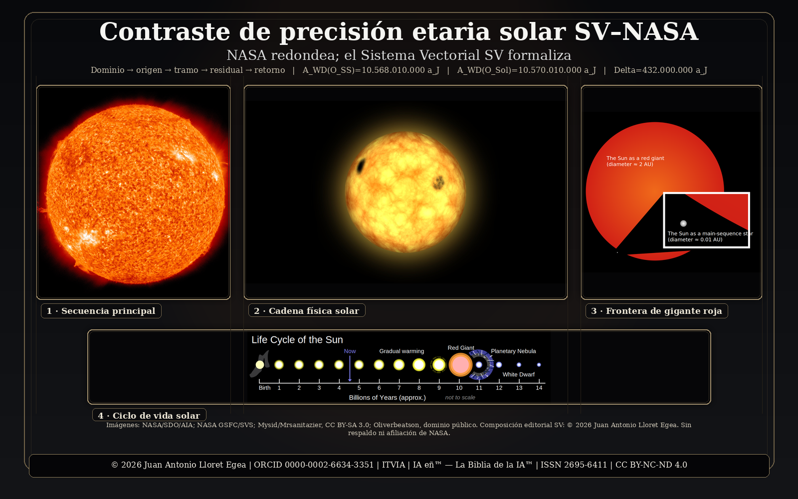

# Contraste de precisión etaria solar SV–NASA

## NASA redondea; el Sistema Vectorial SV formaliza

**Tránsito solar a gigante roja y enana blanca con dominio, origen y retorno externo**

**Autor:** Juan Antonio Lloret Egea  
**ORCID:** 0000-0002-6634-3351  
**Instituto Tecnológico Virtual de la Inteligencia Artificial para el Español™ (ITVIA)**  
**IA eñ™ — La Biblia de la IA™ | ISSN 2695-6411**  
**Licencia:** CC BY-NC-ND 4.0  
**DOI:** [https://doi.org/10.21428/39829d0b.22c326bf](https://doi.org/10.21428/39829d0b.22c326bf "_blank")

---

<p align="center">
<a href="https://doi.org/10.21428/39829d0b.22c326bf" target="_blank"></a>
</p>

---

## Nota de no afiliación y referencia externa

NASA se menciona exclusivamente como fuente pública externa de contraste y como referencia nominal de determinadas magnitudes divulgadas o redondeadas. Esta publicación no está afiliada, patrocinada, revisada, aprobada ni respaldada por NASA. Toda formalización, interpretación, cálculo y responsabilidad matemática corresponden exclusivamente al autor y al Sistema Vectorial SV.

El uso de imágenes o materiales NASA queda sometido a las condiciones públicas de la agencia. La publicación no reproduce insignias, logotipos ni sellos institucionales de NASA como signos de identificación propia.

---

## Relación editorial con la Trilogía Exocósmica

Esta publicación figura como publicación relacionada con la colección **Trilogía Exocósmica: más allá del dominio-universo que habitamos, hacia el nodo versal** por compartir el mismo criterio de contraste expresado en la fórmula titular:

> **NASA redondea; el Sistema Vectorial SV formaliza.**

La adscripción es editorial y metodológica. No altera la arquitectura de la Trilogía Exocósmica, que permanece cerrada como secuencia de tres partes desplegadas en cinco publicaciones. El contraste solar no constituye una sexta parte de la Trilogía: actúa como antecedente relacionado de precisión etaria, dominio declarado y retorno externo bajo el mismo criterio SV–NASA.

---

## Objeto formal de la publicación

La publicación desarrolla un contraste de precisión entre formulaciones públicas de NASA sobre el futuro del Sol y la formalización etaria del Sistema Vectorial SV. El problema no se formula como una oposición institucional, sino como una distinción de plano: una magnitud redondeada orienta la lectura pública; una determinación formal exige dominio, origen, tramo, fase, unidad, residual y retorno.

El estudio trabaja con dos dominios no intercambiables:

| Dominio | Magnitud rectora | Función |
|---|---:|---|
| Sistema Solar como dominio sistémico `Ωₛₛ` | `Aₛₛ = 4.568.000.000 aⱼ` | Corte sistémico de recomposición |
| Sol como objeto físico individual `Ω☉` | `A☉ = 4.570.000.000 aⱼ` | Corte solar individual |

La diferencia `A☉ − Aₛₛ = 2.000.000 aⱼ` se conserva durante toda la recomposición. No se elimina por escala ni se corrige por aproximación divulgativa.

---

## Núcleo de formalización SV

El cálculo declara los tramos externos admitidos como contraste y los somete a recomposición bajo dominio:

| Tramo | Valor | Función |
|---|---:|---|
| `Δ_MS,resto` | `5.000.000.000 aⱼ` | Tramo restante hasta entrada en fase de gigante roja |
| `Δ_RG` | `1.000.000.000 aⱼ` | Duración de la fase de gigante roja como tramo declarado |
| `Δ_PN→WD` | `10.000 aⱼ` | Tránsito estrecho hacia régimen de enana blanca |

La forma general de recomposición es:

```text
A_WD(O_D) = A_actual,D + Δ_MS,resto + Δ_RG + Δ_PN→WD
```

El residual de admisión se expresa como:

```text
R_WD,D = A_WD(O_D) − (A_actual,D + Δ_MS,resto + Δ_RG + Δ_PN→WD)
```

La salida se admite cuando el residual se anula en el dominio declarado.

---

## Resultados rectores

| Resultado | Valor |
|---|---:|
| Entrada en régimen de enana blanca en dominio sistémico `A_WD(Oₛₛ)` | `10.568.010.000 aⱼ` |
| Entrada en régimen de enana blanca en dominio solar individual `A_WD(O☉)` | `10.570.010.000 aⱼ` |
| Diferencia conservada entre dominios | `2.000.000 aⱼ` |
| Residual sistémico `R_WD,SS` | `0` |
| Residual solar individual `R_WD,☉` | `0` |
| Diferencia formal absoluta principal frente al conjunto externo redondeado de contraste | `432.000.000 aⱼ` |

La distribución SV sistémica hasta entrada en régimen de enana blanca queda expresada así:

| Fase | Duración SV | Porcentaje SV |
|---|---:|---:|
| Secuencia principal total | `9.568.000.000 aⱼ` | `90,537386 %` |
| Fase de gigante roja | `1.000.000.000 aⱼ` | `9,462519 %` |
| Tránsito estrecho hacia enana blanca | `10.000 aⱼ` | `0,0000946 %` |
| Total | `10.568.010.000 aⱼ` | `100 %` |

---

## Criterio de lectura

La fórmula **“NASA redondea; el Sistema Vectorial SV formaliza”** identifica una relación de contraste entre comunicación pública redondeada y formalización SV. NASA opera como referencia pública externa; el SV ejecuta la determinación formal bajo dominio, origen, tramo, fase, unidad, residual y retorno.

El resultado no convierte el redondeo en error material ni convierte la referencia externa en fundamento del SV. La publicación mide la separación formal entre magnitudes divulgadas o redondeadas y recomposición SV, conserva la diferencia entre dominio sistémico y objeto solar individual, y devuelve resultados auditables en años julianos, segundos, porcentajes y residuales.

---

## Estructura interna

La publicación desarrolla el contraste mediante los siguientes bloques principales:

1. Estado del arte físico contemporáneo sobre el futuro solar.  
2. Análisis del problema: tránsito solar, dominio, origen y riesgo de redondeo como determinación.  
3. Marco formal SV aplicado al tránsito solar.  
4. Datos de partida y normalización en año juliano `aⱼ`.  
5. Determinación SV en dominio sistémico `Ωₛₛ`.  
6. Determinación SV en dominio solar individual `Ω☉`.  
7. Matriz de tránsito por fases solares y precisión metrológica.  
8. Contraste SV–NASA.  
9. Tablas de datos, porcentajes, diferencias y residuales.  
10. Discusión física, restricciones de interpretación y resultado.  
11. Bibliografía y cláusulas legales.

---

## Archivo principal

- [`contraste-precision-etaria-solar-sv-nasa.md`](contraste-precision-etaria-solar-sv-nasa.md)

---

**© 2026. Juan Antonio Lloret Egea.** Todos los derechos reservados bajo los términos de la licencia CC BY-NC-ND 4.0.
