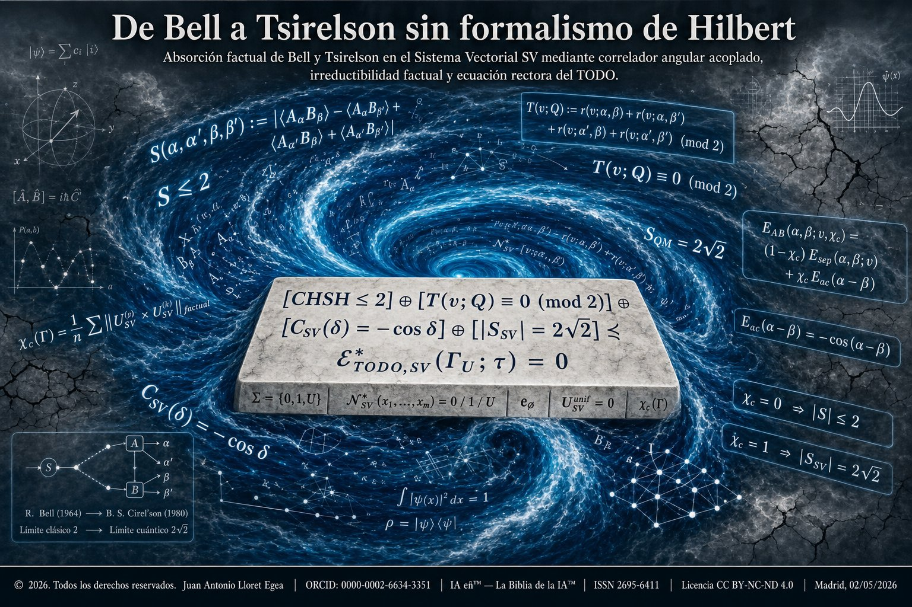

# De Bell a Tsirelson sin formalismo de Hilbert

**Aparato determinista no local del Sistema Vectorial SV con alfabeto ternario, unicidad del correlador angular factual acoplado y derivación estructural de la cota cuántica.**

<p align="center">
  
</p>

---

**© 2026. Todos los derechos reservados.**
**Autor:** Juan Antonio Lloret Egea
**ORCID:** [0000-0002-6634-3351](https://orcid.org/0000-0002-6634-3351)
**Institución:** Instituto Tecnológico Virtual de la Inteligencia Artificial para el Español (ITVIA)
**Editor:** IA eñ™ — La Biblia de la IA™
**ISSN:** 2695-6411
**DOI** del documento: [10.17613/1666c-c5g66](https://doi.org/10.17613/1666c-c5g66)
**Licencia:** CC BY-NC-ND 4.0 — Protegida por [CEDRO](https://www.cedro.org/english?lng=en)
**Madrid, 02/05/2026**

---

## Resumen

El documento articula la absorción de la cota Bell-local CHSH ≤ 2 (Bell 1964; Clauser, Horne, Shimony, Holt 1969) y de la cota cuántica de Tsirelson 2√2 (Tsirelson 1980) como dos manifestaciones operativas del mismo aparato angular factual acoplado del Sistema Vectorial SV. La articulación distingue cuatro regímenes operativos del aparato CHSH-SV bajo el coeficiente de acoplamiento estructural χ_c:

- **R₀ (χ_c = 0):** Bell exacto sobre 𝔽₂ con T(v; Q) ≡ 0 (mod 2).
- **R₁ (0 < χ_c < χ★(b)):** acoplado subcrítico, sin violación necesaria.
- **R₂ (χ★(b) ≤ χ_c < 1):** acoplado supercrítico, |S_SV| ∈ [2, 2√2).
- **R₂★ (χ_c = 1):** saturación factual de Tsirelson, |S_SV| = 2√2.

El núcleo técnico es el **Teorema de unicidad del coseno factual acoplado** (Teorema 10.2.1 del documento): bajo nueve axiomas estructurales del aparato CHSH-SV, el único correlador angular acoplado admisible es C_SV(δ) = −cos δ. La cota de Tsirelson emerge como saturación de este teorema, sin invocar el formalismo de Hilbert.

## Fuentes canónicas vinculadas

Esta publicación articula tres fuentes canónicas verificables, mutuamente referenciadas:

1. **Documento doctrinal (Knowledge Commons).**DOI** [10.17613/1666c-c5g66](https://doi.org/10.17613/1666c-c5g66) — fuente autoritativa del manuscrito firmado, dentro de la colección [*Contemporary Factual Mathematics and Physics of the SV*](https://works.hcommons.org/collections/matematica-fisica-factual-contemporanea-sv/).
2. **Repositorio vivo (este GitHub).** Texto en Markdown editable, materiales gráficos, PDF firmado con sello temporal y conjunto laboratorial espejado bit-a-bit con Zenodo.
3. **Conjunto laboratorial reproducible (Zenodo).** DOI [10.5281/zenodo.20020201](https://doi.org/10.5281/zenodo.20020201) — software canónico independientemente versionable y citable.

> **Note.** Canonical material source on GitHub: [https://github.com/juantoniolloretegea/SV-matematica-semantica/tree/main/documentos/adendas/matematica-fisica-factual-contemporanea-sv/de-bell-a-tsirelson-sin-formalismo-hilbert](https://github.com/juantoniolloretegea/SV-matematica-semantica/tree/main/documentos/adendas/matematica-fisica-factual-contemporanea-sv/de-bell-a-tsirelson-sin-formalismo-hilbert). Supplementary reproducible laboratory deposit on Zenodo: [https://doi.org/10.5281/zenodo.20020201](https://doi.org/10.5281/zenodo.20020201). These canonical sources are provided to facilitate direct consultation of the living textual record, reproducible laboratory verification and reader-side translation through standard browser translation tools when required.

## Contenido del repositorio

- **`de-bell-a-tsirelson-sv.md`** — Documento principal en Markdown con la articulación completa del aparato, los teoremas demostrados (Teorema 6.2.1, Teorema 7.7.1, Teorema 8.2.1, Teorema 10.2.1, Teorema 11.2.1, Teorema 11.3.1, Teorema 11.4.1, Teorema 11.6.1, Teorema 17.2.1) y el ejemplo trabajado de extremo a extremo sobre la célula SV(3, 9).

- **[`PDF/`](PDF/)** — Documento canónico en PDF firmado digitalmente con su sello temporal OpenTimestamps:
  - [`De Bell a Tsirelson sin formalismo de Hilbert.pdf`](PDF/De%20Bell%20a%20Tsirelson%20sin%20formalismo%20de%20Hilbert.pdf) — Versión maquetada de 57 páginas, firmada con certificado FNMT bajo el marco eIDAS.
  - [`De Bell a Tsirelson sin formalismo de Hilbert.pdf.ots`](PDF/De%20Bell%20a%20Tsirelson%20sin%20formalismo%20de%20Hilbert.pdf.ots) — Sello temporal OpenTimestamps anclado en la blockchain de Bitcoin.

- **[`imagenes/`](imagenes/)** — Recursos visuales del documento, incluyendo la portada que sintetiza la articulación R₀ / R₁ / R₂ / R₂★ del aparato CHSH-SV y la ecuación rectora del nivel trece.

- **[`laboratorios/`](laboratorios/)** — Conjunto laboratorial reproducible (seis laboratorios en Python, catálogo de errores y runner unificado) depositado canónicamente en Zenodo bajo DOI [10.5281/zenodo.20020201](https://doi.org/10.5281/zenodo.20020201). Véase el [README específico del laboratorio](laboratorios/README.md) para detalles de ejecución y verificación criptográfica.

## Verificación criptográfica del documento canónico

El PDF del manuscrito ha sido firmado digitalmente por el autor con su certificado FNMT-RCM bajo el marco eIDAS. La firma **no es PAdES**, por lo que Adobe Reader no muestra automáticamente el panel «Firmas» con verificación visual al abrir el documento. La integridad bit-a-bit y la fecha de existencia se acreditan independientemente mediante el SHA-256 del fichero y el sello temporal `.ots`:

| Campo | Valor |
|---|---|
| **Fichero canónico** | `PDF/De Bell a Tsirelson sin formalismo de Hilbert.pdf` |
| **SHA-256** | `4bd33b89482214206e640207b9d9db8fa0a51d0e794da76da7360f2b5e3b2e24` |
| **Sello temporal** | `PDF/De Bell a Tsirelson sin formalismo de Hilbert.pdf.ots` (OpenTimestamps anclado en Bitcoin) |
| **Firmante** | Juan Antonio Lloret Egea — certificado FNMT-RCM (España) bajo eIDAS |
| **Fecha de redacción** | 02/05/2026 |
| **DOI doctrinal** |[10.17613/1666c-c5g66](https://doi.org/10.17613/1666c-c5g66) (Knowledge Commons) |

**Verificación por terceros:**

```bash
# Verificación de integridad bit-a-bit
sha256sum "De Bell a Tsirelson sin formalismo de Hilbert.pdf"
# Debe producir: 4bd33b89482214206e640207b9d9db8fa0a51d0e794da76da7360f2b5e3b2e24

# Verificación del sello temporal con cliente OpenTimestamps
ots verify "De Bell a Tsirelson sin formalismo de Hilbert.pdf.ots" \
   --file "De Bell a Tsirelson sin formalismo de Hilbert.pdf"
```

Cualquier modificación posterior del PDF invalida tanto el SHA-256 como el sello temporal. El sello OpenTimestamps proporciona prueba criptográfica trustless de que el documento existe en su contenido exacto desde la fecha de sellado, sin posibilidad de alteración retroactiva.

## Depósito canónico del conjunto laboratorial en Zenodo

El conjunto laboratorial subordinado al manuscrito se publica en Zenodo (CERN Data Centre & InvenioRDM) como software canónico independientemente versionable y citable:

| Campo | Valor |
|---|---|
| **DOI** | [10.5281/zenodo.20020201](https://doi.org/10.5281/zenodo.20020201) |
| **Registro Zenodo** | [https://zenodo.org/records/20020201](https://zenodo.org/records/20020201) |
| **Versión** | v1 — 2 de mayo de 2026 |
| **Fichero canónico** | `laboratorios.zip` |
| **SHA-256** | `7a34823d351529c152d8744879f2256d38f8a11444fac1535ea28be8a53f8335` |

El conjunto laboratorial está espejado en este repositorio bajo [`laboratorios/`](laboratorios/) con los tres ficheros del depósito Zenodo (`laboratorios.zip`, `laboratorios.zip_signed.csig`, `laboratorios.zip.ots`) replicados bajo [`laboratorios/descargar-zip/`](laboratorios/descargar-zip/) para verificación criptográfica sin salir de GitHub. La fuente canónica autoritativa sigue siendo Zenodo bajo el DOI fijado.

## Ejecución de los laboratorios

Requiere Python ≥ 3.10 con NumPy.

```bash
cd laboratorios
python runner.py
```

El runner ejecuta los seis laboratorios LAB-01 a LAB-06 secuencialmente y emite un informe global de cumplimiento. Devuelve **código de salida 0** si los seis laboratorios superan sus verificaciones dentro de la tolerancia operativa (1e-14 IEEE 754), y **código de salida 1** si al menos uno falla. Bajo política de no pases silenciosos, todo fallo numérico activa el diagnóstico explícito mediante el catálogo unificado de errores (códigos E-01 a E-09) documentado en [`laboratorios/CATALOGO-DE-ERRORES.md`](laboratorios/CATALOGO-DE-ERRORES.md).

## Articulación con el corpus del Sistema Vectorial SV

El documento se inscribe en la operación canónica del corpus, manifestada en absorciones precedentes:

- *Absorción de E₀ = m₀c² como sector basal de reposo en el Sistema Vectorial SV* (Lloret Egea, 2026g).
- *Reducción estructural absoluta de Maxwell al Sistema Vectorial SV* (Lloret Egea, 2026k).
- *Teoría general factual de la luz en el Sistema Vectorial SV* (Lloret Egea, 2026 — luz factual).

El elemento de cierre del corpus es la *Teoría del TODO y de la NADA en el Sistema Vectorial SV* (Lloret Egea, 2026 — todo-nada), donde la articulación R₀ / R₁ / R₂ / R₂★ del aparato CHSH-SV queda subsumida bajo la ecuación rectora ℰ★_TODO,SV(Γ_U; τ) = 0 del nivel trece de la cadena ascendente, conforme al Teorema 17.2.1 del documento.

## Cláusula de prevalencia

En caso de discrepancia entre las distintas representaciones del documento (PDF maquetado, Markdown, conjunto laboratorial, materiales gráficos) y el contenido doctrinal del manuscrito, **prevalece el cuerpo del documento canónico** firmado y sellado bajo el SHA-256 fijado en este README. Los laboratorios y los recursos gráficos son subordinados al texto canónico, no al revés.

## Citación recomendada

Lloret Egea, J. A. (2026). *De Bell a Tsirelson sin formalismo de Hilbert: aparato determinista no local del Sistema Vectorial SV con alfabeto ternario, unicidad del correlador angular factual acoplado y derivación estructural de la cota cuántica*. ITVIA, IA eñ™ — La Biblia de la IA™. ISSN 2695-6411. DOI: [10.17613/1666c-c5g66](https://doi.org/10.17613/1666c-c5g66).

Para el conjunto laboratorial subordinado, citar adicionalmente:

> Lloret Egea, J. A. (2026). *Canonical laboratories from Bell to Tsirelson without Hilbert-space formalism within the Vectorial System SV*. Zenodo. [https://doi.org/10.5281/zenodo.20020201](https://doi.org/10.5281/zenodo.20020201)

---

**Advertencia.** Esta publicación está protegida por CEDRO y su aplicación en el campo de la Física, así como cualquier forma de explotación, reproducción o uso por parte de empresas, queda sujeta al copyright del autor y a los términos de la licencia indicada; la reproducción, distribución, comunicación pública o transformación de esta obra solo puede ser realizada con la autorización de sus titulares, salvo excepción prevista por la ley, y cualquier uso comercial sin autorización expresa queda prohibido y sujeto estrictamente al licenciamiento permitido.

**Warning.** This publication is protected by CEDRO. Its application in the field of Physics, as well as any form of exploitation, reproduction, or use by corporate entities, is strictly subject to the author's copyright and the terms of the license indicated; any reproduction, distribution, public communication, or transformation of this work requires authorization from the rightsholders, except as provided by law, and any commercial use without express written consent is prohibited and strictly subject to permitted licensing.
