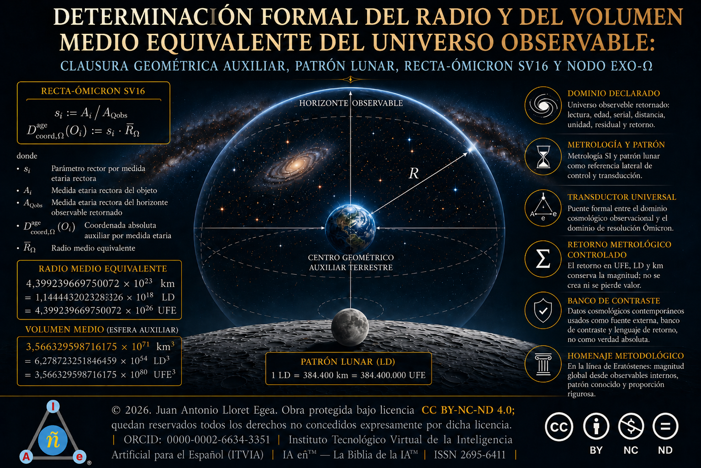

# Determinación formal del radio y del volumen medio equivalente del universo observable: clausura geométrica auxiliar, patrón lunar, Recta-Ómicron SV16 y nodo exo-Ω

 
------------------------------------------------------------------------

> **En síntesis**: **el radio** medio equivalente del Universo Físico
> observable, bajo la clausura geométrica auxiliar adoptada, **equivale
> a algo más de un trillón de veces** la distancia media entre la Tierra
> y la Luna.

------------------------------------------------------------------------

© 2026. Juan Antonio Lloret Egea. Obra protegida bajo licencia CC
BY-NC-ND 4.0; quedan reservados todos los derechos no concedidos
expresamente por esta licencia. | ORCID: 0000-0002-6634-3351 |
Instituto Tecnológico Virtual de la Inteligencia Artificial para el
Español (ITVIA) | IA eñ™ --- La Biblia de la IA™ | ISSN 2695-6411 |
Madrid, 12/06/2026

------------------------------------------------------------------------

# Índice

## 0. Prefacio 
## I. Resumen
## II. Abstract
## III. Introducción al problema
## IV. Estado del arte
## V. Alcance formal
## VI. Teorema de la recta generatriz del Universo Físico observable
## VII. Ecuación del teorema
## VIII. Demostración
## IX. Radio medio equivalente del Universo Físico observable
## X. Patrón lunar
## XI. Distancia relativa media desde el centro de la Tierra hasta el límite de la esfera equivalente del Universo Físico observable
## XII. Conclusión
## XIII. Anexo A. Nodo exo-Ω, dominios heredados y parametrización formal no operacional desde la Recta-Ómicron SV16
## XIV. Bibliografía
## XIV.I. Referencias internas del Corpus SV citadas
## XIV.II. Referencias externas de contraste y estado del arte
# 0. Prefacio
Se fija una determinación cosmométrica formal del Universo Físico observable dentro del Sistema Vectorial SV y se prolonga, mediante anexo propio, hacia una parametrización no operacional de observables, dominios heredados y nodo `exo-Ω` sobre la `Recta-Ómicron SV16` (`Recta_Οmi_SV16`). El desarrollo no se presenta como descubrimiento originario del tamaño cosmológico del universo observable: adopta un diámetro externo de contraste, declara su dominio, fija una clausura geométrica auxiliar, deriva el radio medio equivalente, calcula el volumen esférico asociado, devuelve el resultado mediante patrón lunar y otras escalas de lectura, y sitúa el límite equivalente como nodo formal de transición hacia dominios heredados o descendentes.

En este marco, la fuente de validez del SV no es una autorización tomada de la cosmología contemporánea ni una cautela importada desde un marco externo; véase, a este respecto, el `Anexo A. Trivialización, TODO/NADA e Imperfección: la terna (1-0-U), la U honesta y el corolario de transducción no confinante`. En el régimen propio del SV, la validez procede de la declaración del dominio, la restricción `Ω_F ≠ 𝓣`, la tipificación del espacio, la definición del vector director, el cierre proyectivo, la conservación del residual, el retorno metrológico y el cálculo. Los datos externos —diámetro observable de contraste, año luz juliano, distancia media Tierra–Luna, unidad astronómica, parsec, cosmometría contemporánea, navegación espacial, catálogos y técnicas de seguimiento— entran como materiales de contraste y transducción. El SV no se subordina a ellos como fuente constitutiva de verdad: los sitúa en su plano, declara su función y explicita las condiciones bajo las cuales pueden retornar sin confundirse con fundamento.

El primer movimiento determina el radio medio equivalente `R̄_Ω` y el volumen `V_Ω` bajo clausura esférica auxiliar. El segundo movimiento expresa el resultado en patrón lunar, lectura solar, lectura galáctica aproximada y distancia relativa media desde `C_⊕` hasta `∂S_Ω`. El tercer movimiento, incorporado en el Anexo A, toma la `Recta-Ómicron SV16` como directriz formal para parametrizar observables y dominios, distinguiendo la referencia absoluta formal `D_abs^{SV}(X,0_SV)` de la coordenada radial auxiliar `D_coord,Ω^aux(X)`, de la distancia relativa `D_rel,Ω^aux(X,Y)` y del nodo formal `Nodo_exoΩ`. Esta separación evita que el origen formal `0_SV` sea espacializado y permite que cuerpos del Sistema Solar, objetos galácticos, referencias cosmológicas y dominios heredados se integren mediante parámetro de retorno, transductor, residual y dictamen, sin prometer navegación física ni posicionamiento operacional.

El anexo no formula un sistema de guiado, navegación, seguimiento, efemérides, astrometría ni control de vehículos. Declara una forma formal de lectura y herencia de dominios. El nodo `exo-Ω` no es destino navegable, superficie material ni coordenada física actualmente alcanzable: designa el punto formal de enlace que aparece cuando el tramo operativo `[0,1]` del dominio observable queda cerrado y se pretende declarar un dominio heredero o descendente `D_h`. La universalidad no significa que todo quede reducido al mismo tramo `[0,1]`; significa que, declarado un dominio `D_h`, su origen operativo, su punto terminal, su vector director, su escala de cierre, su transductor y su residual, las medidas relativas y las coordenadas auxiliares se calculan con la misma estructura. En el interior del Universo Físico observable, el dominio es `Ω_F`; fuera de la clausura equivalente de `Ω_F`, el cálculo exige declarar el dominio heredero o descendente correspondiente. La forma se conserva: cambia el dominio, no la estructura.

Por ello, conviene leer el desarrollo como una unidad. No hay un cálculo cosmométrico por un lado y una aplicación aeroespacial operacional por otro; hay una misma arquitectura de distancia absoluta formal, coordenada auxiliar, distancia relativa, recta generatriz, tramo operativo, herencia de dominios y retorno. La historia de la ciencia ya mostró con Eratóstenes, Hiparco, Al-Biruni y Newton que se pueden calcular dominios sin recorrerlos materialmente. El SV asume esa tradición y la lleva a una formulación propia: dominio declarado, frontera, transducción, residual, retorno y resultado calculado. La aportación no consiste en descubrir el diámetro externo del universo observable, sino en gobernar su admisión formal, su clausura auxiliar y su posible lectura como unidad formal de dominio sin confundirla con la totalidad absoluta.

# I. Resumen
Se determinan el radio medio equivalente, el volumen esférico auxiliar, el patrón lunar y la distancia relativa media desde el centro de la Tierra hasta el límite de la esfera perfecta equivalente del Universo Físico observable, bajo la restricción formal `Ω_F ≠ 𝓣`. La determinación no mide la totalidad absoluta ni transforma el horizonte observable en borde ontológico; declara un dominio físico observable retornado, una clausura geométrica auxiliar, un modelo esférico equivalente, un transductor metrológico y un residual de lectura. En ese marco, el diámetro de contraste `93.000.000.000 ly`, el año luz juliano `1 ly = 9.460.730.472.580,8 km` y la distancia media Tierra–Luna `LD := 384.400 km` operan como magnitudes externas de contraste, no como fundamentos del Sistema Vectorial SV (Encyclopaedia Britannica, 2026b; International Astronomical Union, s. f.; National Aeronautics and Space Administration, s. f.-b).

La aportación formal se articula mediante el teorema de la recta generatriz del Universo Físico observable, denominada internamente `Recta-Ómicron SV16` (`Recta_Οmi_SV16`). Se declara un espacio afín tipado `𝔼_Ω^SV := E_A^SV × E_R^SV × E_D^SV`, un espacio vectorial residual asociado `𝓡_Ω^SV := V_A^SV × V_R^SV × V_D^SV`, un origen formal tipado `O_∅`, un punto terminal interno `P_Ω^SV`, un vector director `v_Ω := Δ(O_∅→P_Ω^SV)` y un tramo operativo `ℓ_{Ω,[0,1]}^SV`. La ecuación local `𝓖_Ω^SV(O;s)=0_Ω` no sustituye la ecuación rectora del SV en la Teoría del TODO y de la NADA: solo declara cierre proyectivo dentro del dominio observable retornado, con pertenencia proyectiva `π_Ω(O) ∈ ℓ_{Ω,[0,1]}^SV` y no pertenencia material directa del objeto físico no proyectado a la recta (Lloret Egea, 2026a, 2026f, 2026g).

El resultado metrológico adoptado en esta clausura es `R̄_Ω = 46.500.000.000 ly = 439.923.966.975.007.200.000.000 km = 439.923.966.975.007.200.000.000.000 m`. El volumen esférico auxiliar queda expresado como `V_Ω = (4π/3)(R̄_Ω)^3`, y la distancia relativa media desde `C_⊕` hasta `∂S_Ω` coincide con `R̄_Ω` por definición del modelo esférico equivalente. En patrón lunar, la forma exacta es `R̄_Ω = (35.477.739.272.178.000.000 / 31) LD`, con lectura decimal `1.144.443.202.328.322.580,645161290323` distancias medias Tierra–Luna y cota de redondeo inferior a `0,1922 mm`. En escala larga española, el resultado equivale aproximadamente a `1,14` trillones de distancias medias Tierra–Luna; en lectura no técnica, algo más de un trillón de veces la distancia media entre la Tierra y la Luna.

La esfera `∂S_Ω` no se declara como forma física demostrada del universo completo, sino como clausura geométrica auxiliar del dominio observable. La tesis fuerte del SV queda situada en otro plano: un dominio observable declarado, cerrado y devuelto puede comparecer como unidad formal de clausura ante una lectura superior, conforme a la publicación `Línea del Umbral SV, circulación de retorno del dominio-universo y átomo formal de ascendencia no agotada` (Lloret Egea, 2026g). El Anexo A no propone navegación, efemérides, seguimiento ni posicionamiento físico; introduce el nodo `exo-Ω` como punto formal de enlace hacia dominios heredados o descendentes, siempre bajo declaración de dominio, escala, vector, frontera, residual y retorno.

# II. Abstract
This work determines the equivalent mean radius, auxiliary spherical volume, lunar-distance pattern, and mean relative distance from Earth’s centre to the boundary of the equivalent sphere assigned to the observable physical Universe, under the formal restriction `Ω_F ≠ 𝓣`. The calculation does not measure absolute totality and does not convert the observable horizon into an ontological edge. It declares a returned observable domain, an auxiliary geometric closure, an equivalent spherical model, a metrological transducer, and a controlled residual of reading. The adopted contrast values — `93,000,000,000 ly`, `1 ly = 9,460,730,472,580.8 km`, and `LD := 384,400 km` — are external metrological references and do not ground the Vectorial System SV (Encyclopaedia Britannica, 2026b; International Astronomical Union, s. f.; National Aeronautics and Space Administration, s. f.-b).

The formal core is the theorem of the generating line of the observable physical Universe, internally named `Recta-Ómicron SV16` (`Recta_Οmi_SV16`). The theorem declares a typed affine space, an associated residual vector space, a typed formal origin, an internal terminal point, a director vector and an operative return segment. Its local equation, `𝓖_Ω^SV(O;s)=0_Ω`, does not replace the governing equation of SV; it only states projective closure inside the declared observable domain. The result is an equivalent mean radius of `46,500,000,000 ly`, equivalent to `439,923,966,975,007,200,000,000 km`, with an auxiliary spherical volume determined by `V_Ω = (4π/3)(R̄_Ω)^3`. Expressed in mean Earth–Moon distances, the exact form is `(35,477,739,272,178,000,000 / 31) LD`, approximately `1.14 × 10^18` mean Earth–Moon distances — `1.14` trillones in the Spanish long scale.

The equivalent sphere is not presented as an empirically demonstrated material shape of the whole universe. It is an auxiliary geometric closure for the declared observable domain. The distinctive SV claim is formal: a declared, closed and returned domain may be read as a formal unit of closure under a higher-order reading, in continuity with the previously published SV thesis of the domain-universe as a formal atom of closure. The appendix does not propose spacecraft navigation, ephemerides, tracking or operational positioning; it introduces `Nodo_exoΩ` as a formal transition node towards inherited or descendant domains, only when domain, scale, vector, boundary, residual and return have been explicitly declared.

# III. Introducción al problema
El problema de determinar el radio y el volumen medio del universo observable no puede formularse como una medición directa de una totalidad física recorrible. El universo observable se define por horizonte de observación, historia de propagación luminosa, expansión cosmológica y condiciones instrumentales de retorno; no por una frontera rígida accesible desde fuera. Por ello, toda determinación responsable debe distinguir entre totalidad absoluta, dominio observable, modelo geométrico auxiliar, unidad metrológica, transductor, residual y retorno. Esta distinción resulta especialmente necesaria cuando se adopta un diámetro de contraste ampliamente usado —aproximadamente `93.000.000.000 ly`—, porque dicho valor no convierte el universo observable en totalidad de lo real ni en esfera material cerrada; solo habilita una clausura esférica equivalente para cálculo, contraste y comunicación metrológica (Encyclopaedia Britannica, 2026b).

La cuestión se sitúa en una tradición científica antigua y muy sólida: calcular y acotar dominios que no se recorren materialmente. Eratóstenes no caminó la circunferencia terrestre para estimarla; utilizó diferencia angular, distancia entre lugares y una hipótesis geométrica sobre la curvatura terrestre. Hiparco no necesitó alcanzar la Luna para aproximar su distancia; trabajó con paralaje y relaciones geométricas. Al-Biruni no recorrió el diámetro terrestre; lo infirió desde altura, horizonte y trigonometría. Newton tampoco necesitó desplazarse por el sistema planetario para formular una ley de gravitación universal: convirtió observación, geometría, dinámica y formalización matemática en una proyección general de alcance físico (Encyclopaedia Britannica, 2026a, 2026c; Royal Society, 2014; Sparavigna, 2014).

Aquí, el Sistema Vectorial SV toma esa tradición de medición indirecta y la somete a sus propias condiciones de admisibilidad: dominio declarado, coordenación tipada, frontera, traza, residual, retorno y exclusión de la totalidad absoluta como objeto medible. La operación no consiste en importar sin mediación una cifra cosmológica, sino en declarar cómo una cifra externa de contraste puede entrar en una formulación interna sin gobernarla. Tampoco consiste en afirmar, como dato observacional, que el universo físico completo sea una esfera material. La esfera `∂S_Ω` se adopta como clausura geométrica auxiliar del dominio observable; la lectura del dominio-universo como átomo formal de clausura pertenece al régimen propio del SV, no a una constatación empírica de esfericidad universal.

Por tanto, la distancia relativa `D_rel^Ω(C_⊕,∂S_Ω;R̄_Ω,LD,𝓜_sph,𝔛_{SI↔SV})` no es una afirmación geocéntrica ni una cosmología cerrada: es una lectura radial externa de una clausura geométrica auxiliar, mediada por modelo, transductor y residual (Lloret Egea, 2026a, 2026c). La expresión designa la distancia relativa de lectura dentro del dominio observable `Ω`. No mide una distancia absoluta entre la Tierra y la totalidad, ni convierte a la Tierra en centro cosmológico. Indica que el centro terrestre `C_⊕` se usa como referencia metrológica externa para leer, bajo un modelo declarado, la separación radial hasta `∂S_Ω`, límite de la esfera perfecta equivalente asignada al Universo Físico observable.

En esta notación, `D_rel^Ω` significa distancia relativa en el dominio `Ω`; `C_⊕` designa el centro de la Tierra como punto de referencia del retorno externo; `∂S_Ω` designa el límite de la esfera auxiliar equivalente; `R̄_Ω` es el radio medio equivalente calculado para esa clausura; `LD` es la distancia media Tierra–Luna usada como patrón de lectura humana; `𝓜_sph` es el modelo geométrico de esfera perfecta equivalente; y `𝔛_{SI↔SV}` es el transductor que permite devolver la magnitud entre unidades externas del Sistema Internacional y unidades internas del Sistema Vectorial SV. La fórmula, por tanto, no declara un borde ontológico del universo, sino una distancia relativa calculable bajo dominio, modelo, unidad, transducción y residual declarados.

El propósito es triple. Primero, fijar matemáticamente la recta generatriz y su tramo operativo de retorno para el Universo Físico observable, evitando toda confusión entre punto afín, vector director, residual y objeto físico no proyectado. Segundo, calcular de forma explícita el radio medio equivalente, el volumen esférico auxiliar y la distancia relativa en años luz, kilómetros, metros y distancias medias Tierra–Luna. Tercero, declarar el nodo `exo-Ω` como enlace formal de dominio, no como destino navegable ni coordenada física operacional. De este modo, se obtiene un resultado legible para la metrología ordinaria sin abandonar las restricciones propias del SV: `Ω_F ≠ 𝓣`, no espacialización de `0_SV`, no clausura ontológica del horizonte observable, no conversión del patrón lunar en unidad constitutiva interna y no sustitución de la navegación física por una recta formal.

# IV. Estado del arte
## IV.I. Medición indirecta de dominios no recorridos
La historia de la ciencia muestra que la medición rigurosa no exige
siempre recorrido material del dominio medido. Muchas magnitudes
fundamentales han sido inferidas por sombra, ángulo, paralaje,
curvatura, periodo, ley dinámica, expansión o patrón de escala. Esta
tradición no rebaja el carácter científico del cálculo; al contrario,
funda una parte esencial de la matemática aplicada a la astronomía, la
geodesia y la cosmología. El punto decisivo no es tocar el límite del
dominio, sino declarar adecuadamente el observador, el modelo, la
unidad, el supuesto geométrico, el procedimiento de inferencia y el
error residual. Esta determinación se inscribe en esa tradición, pero
añade la restricción SV: ningún retorno metrológico externo puede
confundirse con totalidad absoluta, fundamento ontológico o cierre
físico no declarado (Lloret Egea, 2026a, 2026b).

## IV.II. Eratóstenes y la clausura geométrica de un dominio terrestre
Eratóstenes constituye el antecedente clásico más nítido para este
análisis porque calculó una magnitud global terrestre sin recorrer
físicamente la circunferencia de la Tierra. Según la tradición
conservada, comparó la incidencia solar en Syene y Alejandría, observó
que en Alejandría el Sol formaba un ángulo aproximado de `7,2°` respecto
de la vertical cuando en Syene los rayos caían verticalmente, y utilizó
la distancia estimada entre ambas ciudades para inferir la
circunferencia terrestre, obteniendo `250.000` estadios (Encyclopaedia
Britannica, 2026a). La American Physical Society recuerda que la
incertidumbre histórica sobre la longitud exacta del estadio afecta a la
traducción moderna del resultado, pero sitúa el cálculo en el rango
correcto de la circunferencia terrestre (American Physical Society,
2006).

La enseñanza metodológica de Eratóstenes no reside solo en el número
obtenido, sino en la estructura de su operación: dos puntos accesibles,
un fenómeno común, una diferencia angular, una hipótesis geométrica
global y una extrapolación controlada. La Tierra no fue medida por
recorrido total, sino por clausura geométrica del dominio a partir de
señales locales. Esta estructura resulta relevante aquí porque la
clausura esférica auxiliar del Universo Físico observable tampoco exige
recorrer su límite; exige declarar el dominio `Ω_F`, el modelo `𝓜_sph`,
el radio equivalente `R̄_Ω`, la unidad externa y el residual de retorno.

## IV.III. Medición astronómica por ángulo, paralaje y horizonte
La tradición antigua y medieval ofrece otros ejemplos de acotación de
dominios no recorridos. Hiparco calculó la distancia lunar mediante
paralaje, y Britannica recoge que determinó una distancia de
aproximadamente `59` radios ecuatoriales terrestres, en relación próxima
al valor moderno medio de `60,2` radios terrestres (Encyclopaedia
Britannica, 2026c). Al-Biruni propuso un método geodésico distinto:
estimar el radio terrestre a partir de la altura de una montaña y el
ángulo de depresión del horizonte, usando trigonometría; su
procedimiento muestra de nuevo que una magnitud global puede inferirse
desde una configuración local y una geometría declarada, aun con
limitaciones instrumentales y atmosféricas (Sparavigna, 2014).

Estos antecedentes establecen una continuidad epistemológica clara: el
dominio puede ser mayor que el recorrido disponible, siempre que exista
una mediación formal suficientemente declarada. Esta determinación no
toma esos ejemplos como autoridad numérica para el universo observable;
los toma como patrón metodológico: una magnitud global se calcula por
estructura, no por posesión física del borde. En lenguaje SV, ello exige
dominio, coordenación, unidad, frontera o límite equivalente, residual y
retorno.

## IV.IV. Newton y la proyección matemática de leyes universales
Newton representa un segundo antecedente decisivo, no geodésico sino
dinámico: la formulación matemática puede proyectar una ley física de
alcance universal sin exigir presencia material en todos los puntos del
dominio. La Royal Society describe la
`Philosophiae Naturalis Principia Mathematica` como la obra que definió
durante largo tiempo la comprensión del universo físico, y Cambridge
University Library conserva materiales vinculados a la primera edición y
a la transmisión textual del `Principia` (Royal Society, 2014; Cambridge
University Library, s. f.). La relevancia aquí es precisa: Newton no
necesitó salir de su mesa, su papel y su pluma para visualizar una
proyección de Ley de Gravitación Universal; necesitó geometría,
dinámica, observación heredada, formalización y control lógico del
dominio. A ello se añadieron una disciplina intelectual sostenida, una
búsqueda continua de coherencia matemática y la capacidad de afirmar su
formulación en un entorno científico atravesado por objeciones,
controversias y tradiciones explicativas rivales.

Esta analogía no convierte la presente determinación en una ley dinámica
newtoniana. Solo subraya una condición general de la ciencia matemática:
el cálculo formal puede alcanzar dominios no recorridos cuando el
aparato conceptual es público, reproducible, tipado y contrastable.
Aquí, esa exigencia se expresa por la recta generatriz, el vector
director `v_Ω`, el tramo operativo `ℓ_{Ω,[0,1]}^SV`, la ecuación de
cierre `𝓖_Ω^SV(O;s)=0_Ω` y la clausura esférica auxiliar que permite
calcular `R̄_Ω` y `V_Ω`.

## IV.V. Universo observable, horizonte de observación y diámetro de contraste
La cosmología contemporánea distingue entre universo observable y universo completo. El universo observable designa la región accesible a observación efectiva o teórica desde nuestra posición, bajo historia de propagación luminosa, expansión espacial, modelo cosmológico e instrumentos disponibles. No designa la totalidad absoluta ni permite afirmar, por sí solo, que el conjunto de lo real posea una frontera física. En ese marco, Britannica sitúa el diámetro del universo observable en aproximadamente `93.000 millones de años luz`, con radio de algo más de `46.000 millones de años luz` desde la Tierra por efecto de la expansión espacial (Encyclopaedia Britannica, 2026b). Esta distinción coincide con la restricción principal de esta determinación: `Ω_F ≠ 𝓣`.

Así, el valor `93.000.000.000 ly` no se presenta aquí como descubrimiento cosmológico propio. Se adopta como dato externo de contraste para el dominio observable retornado y se somete a una formulación SV: dominio declarado `Ω_F`, exclusión de la totalidad absoluta, modelo geométrico auxiliar, transductor metrológico, residual y dictamen. La mitad aritmética exacta del diámetro adoptado, `R̄_Ω = 46.500.000.000 ly`, no introduce un nuevo valor cosmológico frente al estado del arte; fija el radio medio equivalente de la clausura esférica auxiliar adoptada para el cálculo. La esfera perfecta equivalente `∂S_Ω` no es una superficie física rígida ni un borde ontológico del universo: es una forma de cierre geométrico declarada para devolver el dato externo en una estructura calculable, tipada y no confundida con la totalidad.

La forma global del universo físico completo no queda resuelta por este dato. La cosmología contemporánea trabaja con modelos planos, abiertos y cerrados; las mediciones de curvatura de alta precisión permanecen compatibles con una geometría espacial prácticamente plana cuando se combinan con retornos como BAO y otros contrastes cosmológicos (Planck Collaboration et al., 2020; National Aeronautics and Space Administration, s. f.-c). Por tanto, esta determinación no afirma que la ciencia haya confirmado una esfera material universal. La afirmación SV pertenece a otro plano: bajo dominio declarado, frontera, traza, residual y retorno, un dominio clausurado puede comparecer como unidad formal de clausura ante una lectura superior.

La diferencia específica del SV no reside en repetir el tamaño conocido del universo observable, sino en el régimen formal que recibe el dominio una vez declarado, cerrado y devuelto. En `Línea del Umbral SV, circulación de retorno del dominio-universo y átomo formal de ascendencia no agotada`, con DOI `10.21428/39829d0b.30dfd78b`, se concluye que el dominio-universo físico realizado comparece, ante una lectura superior declarada, como átomo formal de clausura: unidad indivisa de dominio realizada bajo frontera, identidad, traza, residual y retorno (Lloret Egea, 2026g). Esta determinación cosmométrica no identifica `Ω_F` con un átomo químico, ni convierte `∂S_Ω` en esfera física real, ni confunde el radio equivalente con un borde absoluto. Lo que establece es una lectura formal de escala: el dominio observable cerrado por contraste externo puede ser devuelto como unidad de clausura, compatible con la tesis SV del dominio-universo como átomo formal ante una lectura de orden superior.

Por tanto, la diferencia formal decisiva no está en el dato `93.000.000.000 ly`, ni tampoco en la esfericidad auxiliar por sí sola. Está en la conjunción entre dato cosmométrico externo, declaración de dominio, clausura geométrica auxiliar, retorno metrológico y lectura SV del dominio-universo como unidad formal de clausura. El diámetro de contraste aporta la magnitud externa; la clausura esférica permite calcular radio y volumen; el SV fija el régimen de admisión, impide la identificación con `𝓣` y sitúa el dominio observable como unidad formal de lectura superior sin convertirlo en sustancia, átomo químico ni frontera última de la totalidad.

## IV.VI. Cosmometría contemporánea: CMB, expansión, BAO, cartografía 3D y misiones de gran escala
La ciencia actual estudia el tamaño, la historia y la estructura del universo observable mediante retornos indirectos y modelos de interpretación: fondo cósmico de microondas, parámetros cosmológicos, supernovas, oscilaciones acústicas bariónicas, lentes gravitacionales, cartografía de galaxias y grandes sondeos espectroscópicos. Planck 2018 consolidó un conjunto de parámetros cosmológicos de alta precisión dentro del modelo ΛCDM, incluyendo `H₀ = 67,4 ± 0,5 km s−1 Mpc−1` y `Ω_m = 0,315 ± 0,007`, lo que muestra que la lectura del tamaño observable depende de un aparato cosmológico declarado y no de una regla física extendida hasta un borde material accesible (Planck Collaboration et al., 2020).

Euclid está diseñado para explorar la composición y evolución del universo oscuro mediante un mapa tridimensional de la estructura a gran escala, observando miles de millones de galaxias hasta `10.000 millones de años luz` y más de un tercio del cielo; ESA explicita que la misión estudia cómo se ha expandido el universo y cómo se ha formado la estructura cósmica, con el fin de inferir propiedades de energía oscura, materia oscura y gravedad (European Space Agency, s. f.-a, s. f.-b). DESI, desde otro plano instrumental, utiliza las oscilaciones acústicas bariónicas como regla estándar cosmológica, y sus resultados DR2 de 2025 reúnen mediciones basadas en tres años de operación, con atención específica a la historia de expansión y a las tensiones abiertas en la interpretación de la energía oscura (Dark Energy Spectroscopic Instrument, 2025).

Planck, Euclid y DESI no quedan desplazados ni corregidos por esta determinación SV. Su función es fijar el estado del arte y mostrar que la cosmometría contemporánea opera mediante patrones, mapas, parámetros, reglas estándar, modelos y retornos instrumentales, no mediante acceso directo a una frontera material final. La literatura sobre distancias cosmológicas distingue distancia comóvil, distancia de diámetro angular, distancia de luminosidad, tiempo de mirada atrás y volumen comóvil, entre otras medidas; esa pluralidad confirma que una distancia cosmológica solo es legible cuando declara su definición, dominio, modelo y retorno (Hogg, 1999).

Sobre ese plano de contraste, el SV no introduce otro diámetro físico del universo observable: declara cómo admitir el dato externo, cómo impedir su confusión con la totalidad absoluta y cómo devolverlo como clausura geométrica auxiliar de un dominio que, conforme a la tesis SV ya publicada, puede comparecer ante lectura superior como átomo formal de clausura. Todo retorno externo queda así tipado por dominio, unidad, modelo, transductor, residual y exclusión expresa de `𝓣`.

## IV.VII. Metrología astronómica: año luz juliano, parsec/Gpc, patrón lunar, prefijos SI y retorno raigal
La metrología externa se organiza por jerarquía de lectura, no por
acumulación de unidades. La primera referencia es el año luz juliano: la
IAU define el año luz como la distancia recorrida por la luz en vacío
durante un año juliano, con valor `9.460.730.472.580,8 km`, y precisa
que el año juliano equivale a `365,25` días, es decir, `31.557.600`
segundos (International Astronomical Union, s. f.). La segunda
referencia es el parsec, especialmente en su múltiplo cosmológico `Gpc`,
porque permite devolver el resultado al lenguaje profesional de
distancias astronómicas y cosmológicas sin sustituir la clausura SV; el
parsec se define por paralaje y equivale aproximadamente a `3,26 ly`
(International Astronomical Union Office of Astronomy for Education, s.
f.). La tercera referencia es la distancia media Tierra--Luna: NASA fija
la distancia media en `238.855` millas, equivalentes a `384.400 km`, y
por eso `LD` debe leerse aquí como media convencional de lectura, no
como constante rígida (National Aeronautics and Space Administration, s.
f.-b). Ninguna de estas referencias funda el SV; todas ellas entran como
retorno metrológico declarado.

El radio medio equivalente calculado conserva varias lecturas
jerarquizadas: `R̄_Ω = 46.500.000.000 ly`,
`R̄_Ω = 439.923.966.975.007.200.000.000 km`,
`R̄_Ω = 439.923.966.975.007.200.000.000.000 m`, `R̄_Ω ≈ 14,26 Gpc`,
`R̄_Ω = (35.477.739.272.178.000.000 / 31) LD` y, en lectura cognitiva,
aproximadamente `1,14 × 10^18` distancias medias Tierra--Luna, esto es,
`1,14` trillones en escala larga española. El diámetro equivalente
conserva la misma estructura: `D̄_Ω = 93.000.000.000 ly ≈ 28,51 Gpc`.

Los prefijos SI no introducen un nuevo régimen de lectura cosmológica;
solo permiten expresar potencias decimales de la unidad SI cuando esa
expresión resulte útil. El BIPM fija los prefijos oficiales para
múltiplos y submúltiplos decimales de las unidades SI, incluidos `giga`,
`tera`, `peta`, `exa`, `zetta`, `yotta`, `ronna` y `quetta` (Bureau
International des Poids et Mesures, s. f.-a). Aquí no se emplean
submúltiplos como `micro` o `nano` para el radio del universo
observable, porque aumentarían artificialmente la cifra sin aportar
legibilidad. Tampoco se incorporan en el cuerpo principal series como
`Gm`, `Tm`, `Pm` o `Em`, porque el resultado se lee con mayor claridad
mediante `ly`, `Gpc`, `m/km`, `LD` y retorno raigal. Si se desea una
lectura SI prefijada de control, basta indicar que
`R̄_Ω = 4,399239669750072 × 10^26 m = 439,9239669750072 Ym ≈ 0,4399239669750072 Rm`,
donde `Ym` designa yottametro y `Rm` designa ronnametro. Esta lectura es
metrológicamente correcta, pero auxiliar.

La lectura raigal no sustituye al SI ni al parsec. Opera como control
interno de retorno: la distancia cosmológica se recibe como relación
tipada entre observables, con unidad nativa `UFE` y retorno externo en
`m`, `pc`, `Mpc` o `Gpc`, siempre bajo dominio, frontera, residual y
retorno declarados (Lloret Egea, 2026c, 2026i). En consecuencia, las unidades
externas no gobiernan el resultado: lo devuelven en escalas legibles. El
SV conserva el cierre en el dominio declarado; la metrología externa
conserva la comunicación del resultado.

## IV.VIII. Posición del Sistema Vectorial SV ante la tradición de cálculo indirecto
El SV no se limita a repetir el gesto histórico de la medición
indirecta. Lo formaliza mediante una disciplina de admisibilidad: toda
magnitud debe declarar dominio, tipo, frontera o límite equivalente,
unidad, retorno, residual y dictamen. Por eso no se afirma que el
universo observable sea una esfera perfecta, ni que el centro terrestre
sea centro cosmológico, ni que `0_SV` se espacialice. Se afirma que, si
el dominio `Ω_F` se devuelve bajo una clausura esférica auxiliar,
entonces pueden declararse un radio medio equivalente, un volumen
auxiliar, un patrón lunar y una distancia relativa desde `C_⊕` hasta
`∂S_Ω`.

La consecuencia es una continuidad formal con la ciencia histórica y
contemporánea, pero sin subordinación conceptual. Eratóstenes, Hiparco,
Al-Biruni y Newton muestran que la ciencia puede calcular dominios no
recorridos; Planck, Euclid y DESI muestran que la cosmometría actual
sigue operando por patrones, mapas, inferencias y retornos. El SV exige,
además, que ningún retorno se convierta en totalidad y que ningún modelo
auxiliar se tome como borde ontológico. Esta es la razón por la que el
radio, el volumen, el patrón lunar y la distancia relativa se formulan
como clausura geométrica auxiliar dentro del dominio observable
retornado, no como medición del TODO.

## **V. Alcance formal**
Esta determinación pertenece a la teoría de la distancia absoluta y
relativa entre observables del Universo. Su objeto no es medir la
totalidad absoluta, ni convertir el Universo Físico observable en
totalidad de lo real, sino formular una clausura geométrica auxiliar
aplicable al dominio `Ω_F` cuando este se toma como Universo Físico
observable retornado dentro del Sistema Vectorial SV (Lloret Egea,
2026a).

La restricción que gobierna todo el desarrollo es:

`Ω_F ≠ 𝓣`,

donde `𝓣` designa la totalidad absoluta. En consecuencia, el cálculo del
radio medio equivalente, del volumen esférico auxiliar, del patrón lunar
y de la distancia relativa desde el centro de la Tierra hasta el límite
de la esfera equivalente no mide el TODO, no mide la totalidad de lo
real, no espacializa `0_SV`, no convierte el origen formal en centro
métrico y no transforma el horizonte observable en borde absoluto. Lo
que se declara es una clausura geométrica auxiliar dentro de un dominio
observable retornado, con magnitud, unidad, modelo, transductor,
residual y retorno metrológico explícitos (Lloret Egea, 2026a, 2026b).

La distancia absoluta conserva su régimen propio:

`D_abs^{SV}(p_i,0_SV)`,

entendida como referencia formal restringida de un observable declarado
respecto del origen formal `0_SV`, sin convertir este origen en punto
espacial, instante físico, Big Bang ni centro métrico. Por tanto, esta
determinación no formula:

`d(Ω_F,0_SV)=R̄_Ω`.

La distancia relativa que se declara responde a otra estructura
lógico-formal. Expresado de manera formal:

`D_rel^Ω(C_⊕,∂S_Ω;R̄_Ω,LD,𝓜_sph,𝔛_{SI↔SV})`.

Donde `C_⊕` designa el centro de la Tierra tomado como punto metrológico
de referencia del retorno externo; `∂S_Ω` designa el límite de la esfera
perfecta equivalente del Universo Físico observable; `R̄_Ω` designa el
radio medio equivalente bajo clausura geométrica auxiliar; `LD` designa
la distancia media Tierra--Luna usada como patrón externo auxiliar;
`𝓜_sph` designa el modelo geométrico declarado de esfera perfecta
equivalente; y `𝔛_{SI↔SV}` designa el retorno metrológico entre las
unidades externas de contraste y la lectura interna del SV (Lloret Egea,
2026a, 2026c).

Los términos `C_⊕` y `∂S_Ω` pertenecen al retorno metrológico externo de
la clausura auxiliar, no al espacio afín interno `𝔼_Ω^SV` sin mediación.
Su admisión en la fórmula de distancia relativa exige el modelo
declarado `𝓜_sph`, el patrón externo `LD` cuando proceda, y el
transductor `𝔛_{SI↔SV}`. De esta forma, la lectura externa no se mezcla
directamente con la coordenación interna del teorema, sino que queda
mediada por retorno, unidad, modelo y residual declarados (Lloret Egea,
2026a, 2026c).

Aquí no se calcula una distancia de la totalidad, sino una distancia
relativa declarada dentro del dominio observable retornado. No calcula
una medida etaria, un radio o una profundidad impuestos por la ciencia
contemporánea como fuente de verdad; los datos externos comparecen como
conjunto de contraste, retorno metrológico y lectura metrológica externa
cuando el SV declara el transductor correspondiente.

En el plano físico de contraste, `93.000.000.000 ly` entra como
diámetro observable externo de referencia; su lectura como diámetro de
la esfera equivalente pertenece al modelo auxiliar `𝓜_sph`, no al dato
cosmológico tomado en bruto. `1 ly = 9.460.730.472.580,8 km` entra como
conversión metrológica del año luz juliano; y `LD := 384.400 km` entra
como patrón lunar auxiliar. Ninguno de estos valores funda el SV. Todos
ellos operan como retornos externos bajo dominio, unidad, modelo,
residual y transductor declarados (Encyclopaedia Britannica, 2026b;
International Astronomical Union, s. f.; National Aeronautics and Space
Administration, s. f.-b).

En la `Recta-Ómicron SV16`, `A_i` no designa tiempo primitivo ni
magnitud sin régimen declarado, sino la medida etaria rectora ya
transducida del observable en su dominio declarado, `A_i(D_i)`. Esta
notación no redefine la edad ni el tránsito por dominios: solo explicita
el régimen al que pertenece el nodo proyectado. La recta conserva su
fórmula propia de distancia relativa por medida etaria; el dominio no
corrige `A_i` ni multiplica la distancia. Cuando comparece cambio de
dominio, no se sustituye automáticamente `A_i` por una clausura
estructural o frontera futura: se declara, si procede, un nuevo nodo de tránsito conforme al aparato SV ya fijado para tránsito por dominios (Lloret Egea, 2026h). Si falta dominio declarado, o se invoca tránsito sin cierre de sus
condiciones propias, la proyección no cierra y la salida permanece en
`U`.

Por economía notacional, cuando el dominio esté declarado, `A_i` podrá
escribirse en las fórmulas como abreviatura de `A_i(D_i)`. Esta
abreviatura no elimina la indexación de dominio ni convierte el tiempo
en fundamento. La cadena correcta de lectura es: dominio estructural
declarado → medida etaria rectora transducida → parámetro de la recta →
coordenada auxiliar o distancia relativa.

## **VI. Teorema de la recta generatriz del Universo Físico observable**
La recta generatriz definida en este teorema recibe, dentro de la
nomenclatura interna del Sistema Vectorial SV, la denominación
`Recta-Ómicron SV16`, con forma abreviada `Recta_Οmi_SV16`. Esta
denominación identifica de manera estable la recta asociada al cierre
uniparamétrico del Universo Físico observable retornado, y mantiene
continuidad nominal con la formulación SV16-Ómicron ya fijada en
trabajos previos del SV (Lloret Egea, 2026d, 2026e).

La denominación `Recta-Ómicron SV16` no interviene como premisa física,
no introduce una constante, no modifica la ecuación local
`𝓖_Ω^SV(O;s)=0_Ω`, no altera el cálculo del radio medio equivalente, no
funda el patrón lunar y no convierte esta determinación cosmométrica en
una derivación química. Su función es nominal y clasificatoria: nombrar
la recta generatriz del dominio `Ω_F` una vez declarados el espacio afín
tipado, el vector director, el tramo operativo, el residual y el retorno
metrológico.

La continuidad nominal se vincula con la formulación SV16-Ómicron
recogida en *Directed determination of the chemical element SV-399 ---
Actinium (Ac) + 3 Oganesson (Og) + Tungsten/Wolfram (W): Spain and
Portugal as priority prospecting targets --- (SV16-Ómicron)*, DOI:
<https://doi.org/10.21428/39829d0b.11d9224e>, y con *Determinación
dirigida del elemento químico SV-399 --- Actinio (Ac) + 3 Oganesón
(Og) + Tungsteno/Wolframio (W)*, DOI:
<https://doi.org/10.21428/39829d0b.5211d837>. Estas referencias cumplen
aquí una función de trazabilidad nominal interna, no de fundamento
físico del teorema (Lloret Egea, 2026d, 2026e).

Sea `Ω_F` el Universo Físico observable considerado como dominio físico
realizado dentro del Sistema Vectorial SV, con la restricción expresa:

`Ω_F ≠ 𝓣`,

donde `𝓣` designa la totalidad absoluta. El dominio `Ω_F` no se
identifica con el TODO absoluto del SV, ni con la totalidad de lo real,
ni con un exterior físico desde el cual pudiera medirse la totalidad. Se
trata de un dominio observable retornado, interno y formulable (Lloret
Egea, 2026a, 2026b).

Sea:

`𝔼_Ω^SV := E_A^SV × E_R^SV × E_D^SV`

el espacio afín tipado de coordenación interna del Universo Físico
observable, cuyos puntos tienen la forma:

`X = (A_X, R_X, D_X)`.

`E_A^SV` es el dominio afín tipado de medidas etarias SV de retorno,
`E_R^SV` es el dominio afín tipado de escalas radiales de retorno y
`E_D^SV` es el dominio afín tipado de profundidades de retorno. La terna
`(A,R,D)` no se toma como espacio euclídeo físico ordinario ni como
métrica externa no declarada, sino como producto afín tipado de tres
magnitudes internas de retorno: `A`, medida etaria SV del observable
retornado; `R`, escala radial de retorno declarada por el SV; y `D`,
profundidad de retorno declarada por el SV.

En esta terna, `A` no actúa como tiempo rector ni como invariante
primitiva. Designa la medida etaria de retorno del dominio declarado, ya
transducida por el aparato de edades relativas del SV. La recta no
deriva distancia desde un tiempo fundante; deriva coordenada auxiliar
desde una medida etaria admisible de dominio, con residual y retorno
cerrados.

Cada componente tipada admite origen, unidad interna declarada y acción
escalar de retorno. Por tanto, toda expresión que use acción escalar
sobre el punto terminal se entiende componente a componente dentro de
cada dominio tipado, no como mezcla material indiferenciada de medida
etaria, radio y profundidad.

El espacio vectorial residual asociado al producto afín tipado se
declara como:

`𝓡_Ω^SV := V_A^SV × V_R^SV × V_D^SV`.

Donde `V_A^SV`, `V_R^SV` y `V_D^SV` designan los espacios vectoriales
asociados a los dominios afines tipados `E_A^SV`, `E_R^SV` y `E_D^SV`.
Por tanto, la diferencia entre puntos del espacio afín `𝔼_Ω^SV` no se
interpreta como un nuevo punto afín, sino como residual tipado en
`𝓡_Ω^SV`.

Estas tres coordenadas no se toman de la ciencia contemporánea como
fuente de verdad, sino que pertenecen a la formulación interna del SV.
La ciencia contemporánea solo podrá entrar después como conjunto de
datos de contraste, retorno metrológico o transducción externa (Lloret
Egea, 2026a, 2026c).

Por la formulación SV de edades relativas, la totalidad absoluta no
admite medida etaria física; el dominio observable retornado sí admite
medida etaria concreta de retorno. Por la Línea del Umbral SV, la recta
no se reduce al origen: el origen formal reúne potencial nulo e
intensidad nula, mientras que un punto no nulo situado sobre una
directriz conserva intensidad positiva. Esta distinción permite separar
`O_∅=(0_A,0_R,0_D)` del punto terminal interno `P_Ω^SV`, sin confundir
neutralidad formal con realización de dominio (Lloret Egea, 2026f,
2026g).

Se fija, por tanto, el punto terminal interno del observable físico
retornado:

`P_Ω^SV = (A_Ω^SV, R_Ω^SV, D_Ω^SV)`,

donde `A_Ω^SV` es la medida etaria SV del observable retornado y
`R_Ω^SV`, `D_Ω^SV` son las coordenadas internas de escala radial de
retorno y profundidad de retorno asociadas al mismo dominio. Ninguna de
estas tres coordenadas se toma como valor impuesto por la cosmología
contemporánea. Su función es estructural: declarar el cierre
uniparamétrico del observable físico retornado en el espacio `𝔼_Ω^SV`.

Sea:

`O_∅ = (0_A,0_R,0_D)`,

el origen formal tipado de coordenación. Este origen no se toma como
cuerpo físico, instante temporal, vacío sustancial, totalidad absoluta
ni geometría fundante. Es solo el punto nulo formal desde el cual se
escribe la coordenación interna del producto afín tipado.

Se define el vector director asociado al desplazamiento desde el origen
formal tipado hasta el punto terminal interno como:

`v_Ω := Δ(O_∅→P_Ω^SV) = P_Ω^SV − O_∅ ∈ 𝓡_Ω^SV`.

La igualdad anterior se entiende como diferencia afín entre dos puntos
de `𝔼_Ω^SV`, cuyo resultado pertenece al espacio vectorial residual
asociado `𝓡_Ω^SV`. En la carta afín tipada con origen `O_∅`, el vector
`v_Ω` tiene coordenadas:

`v_Ω ≡ Coord(P_Ω^SV) = (A_Ω^SV, R_Ω^SV, D_Ω^SV)`.

Esta identificación es coordenada y dependiente del origen formal tipado
declarado; no reduce el punto afín `P_Ω^SV` a un residual
indiferenciado.

La Línea del Umbral SV fija que toda recta admisible posee directriz y
que todo tránsito entre dominios exige dirección, dominio, frontera,
traza, residual y retorno. En consecuencia, la recta generatriz del
Universo Físico observable no se introduce como imagen geométrica
aislada, sino como directriz local de retorno en el espacio `𝔼_Ω^SV`,
subordinada a la ecuación rectora superior del Sistema Vectorial SV
(Lloret Egea, 2026g).

Si:

`P_Ω^SV ≠ O_∅`,

entonces:

`v_Ω = Δ(O_∅→P_Ω^SV) ≠ 0_Ω`.

Por geometría afín, un punto inicial y un vector director no nulo
determinan una única recta. Por tanto, existe una única recta generatriz
completa que pasa por `O_∅` y `P_Ω^SV`:

`ℓ_Ω^SV(s) := O_∅ + s v_Ω`,

con:

`s ∈ ℝ`.

Sustituyendo el vector director declarado:

`ℓ_Ω^SV(s) := O_∅ + s Δ(O_∅→P_Ω^SV)`,

con:

`s ∈ ℝ`.

El tramo operativo de retorno del dominio observable retornado se define
como:

`ℓ_{Ω,[0,1]}^SV(s) := O_∅ + s v_Ω`,

con:

`0 ≤ s ≤ 1`.

En la carta afín tipada con origen `O_∅`, y solo como abreviatura
coordenada, puede escribirse:

`ℓ_Ω^SV(s)=sP_Ω^SV`.

Del mismo modo, el tramo operativo puede escribirse abreviadamente como:

`ℓ_{Ω,[0,1]}^SV(s)=sP_Ω^SV`,

con:

`0 ≤ s ≤ 1`.

En forma coordenada, el tramo operativo queda:

`ℓ_{Ω,[0,1]}^SV(s) = (sA_Ω^SV, sR_Ω^SV, sD_Ω^SV)`,

con:

`0 ≤ s ≤ 1`.

Esta recta no afirma que todo objeto físico no proyectado tenga como
radio real o distancia real las coordenadas de `ℓ_Ω^SV`. Afirma que todo
observable físico admisible del Universo Físico observable, incluido el
propio dominio `Ω_F` cuando es tratado como observable retornado, posee
una proyección interna de retorno que puede cerrar sobre el tramo
operativo de la recta generatriz.

Se distingue, por tanto, entre dominio de retorno declarable y dominio
de admisibilidad proyectiva.

Sea:

`Ω_F^ret ⊂ Ω_F`

el conjunto de observables físicos con dominio, retorno y triple interno
declarable. Formalmente:

`O ∈ Ω_F^ret ⇔ Dom(O) ∧ Ret(O) ∧ π_Ω(O)=(A(O),R(O),D(O)) declarado`.

Si falta dominio, retorno o coordenación interna suficiente, el caso no
se fuerza: queda en `U`, entendida aquí como indeterminación honesta de
no cierre.

Sea, para todo `O ∈ Ω_F^ret`:

`π_Ω(O) = (A(O), R(O), D(O)) ∈ 𝔼_Ω^SV`,

la proyección interna de retorno de `O`.

La aplicación `π_Ω` se entiende como aplicación interna de retorno y
proyección estructural, no como proyección ortogonal euclídea. No
presupone métrica externa no declarada ni distancia perpendicular en un
espacio físico ordinario.

La ecuación local del teorema, subordinada a la ecuación rectora
superior `𝓔★_TODO,SV(Γ_U;τ)=0`, es la ecuación vectorial tipada de
residual proyectivo:

`𝓖_Ω^SV(O;s) := π_Ω(O) − ℓ_{Ω,[0,1]}^SV(s)`.

Como:

`ℓ_{Ω,[0,1]}^SV(s)=O_∅+s v_Ω`,

también puede escribirse:

`𝓖_Ω^SV(O;s) := π_Ω(O) − (O_∅+s v_Ω)`.

En la carta afín tipada con origen `O_∅`, esta misma ecuación admite la
abreviatura coordenada:

`𝓖_Ω^SV(O;s) := π_Ω(O) − sP_Ω^SV`.

En forma coordenada tipada:

`𝓖_Ω^SV(O;s) := (A(O)−sA_Ω^SV, R(O)−sR_Ω^SV, D(O)−sD_Ω^SV)`.

Su codominio residual no es el propio producto afín
`E_A^SV × E_R^SV × E_D^SV`, sino el espacio vectorial asociado:

`𝓖_Ω^SV(O;s) ∈ 𝓡_Ω^SV := V_A^SV × V_R^SV × V_D^SV`.

El cero residual tipado es:

`0_Ω := (0_A^V,0_R^V,0_D^V)`.

Por tanto, el cierre proyectivo local se escribe:

`𝓖_Ω^SV(O;s) = 0_Ω`.

Con:

`P_Ω^SV = (A_Ω^SV, R_Ω^SV, D_Ω^SV)`,

`π_Ω(O) = (A(O), R(O), D(O))`,

`0 ≤ s ≤ 1`,

`P_Ω^SV ≠ O_∅`.

La ecuación `𝓖_Ω^SV(O;s)=0_Ω` no es ecuación rectora del Sistema
Vectorial SV. Es la ecuación local de cierre proyectivo del Universo
Físico observable retornado. Su función es subordinada: no compite con
`𝓔★_TODO,SV(Γ_U;τ)=0`, sino que opera dentro del dominio observable
declarado.

Se dice que un observable `O` pertenece al dominio de admisibilidad
proyectiva `Ω_F^adm` si y solo si pertenece al dominio de retorno
declarable y existe un único parámetro `s_O ∈ [0,1]` que anula el
residual proyectivo. Formalmente:

`O ∈ Ω_F^adm ⇔ O ∈ Ω_F^ret ∧ ∃! s_O ∈ [0,1] : 𝓖_Ω^SV(O;s_O)=0_Ω`.

Esto equivale a:

`O ∈ Ω_F^adm ⇔ O ∈ Ω_F^ret ∧ ∃! s_O ∈ [0,1] : π_Ω(O) − ℓ_{Ω,[0,1]}^SV(s_O)=0_Ω`.

En la carta afín tipada con origen `O_∅`, esta condición admite la
escritura abreviada:

`O ∈ Ω_F^adm ⇔ O ∈ Ω_F^ret ∧ ∃! s_O ∈ [0,1] : π_Ω(O) − s_OP_Ω^SV = 0_Ω`.

En tal caso:

`π_Ω(O) = ℓ_{Ω,[0,1]}^SV(s_O)`.

Y, en forma coordenada abreviada:

`π_Ω(O) = s_OP_Ω^SV`.

Por tanto:

`π_Ω(O) ∈ ℓ_{Ω,[0,1]}^SV ⊂ ℓ_Ω^SV`.

La pertenencia material directa:

`O ∈ ℓ_Ω^SV`

solo se admite cuando el objeto ya ha sido formulado como punto de
retorno uniparamétrico en `𝔼_Ω^SV`. En los demás casos, lo correcto es
la pertenencia proyectiva:

`π_Ω(O) ∈ ℓ_{Ω,[0,1]}^SV`.

Si el punto proyectado pertenece a `ℓ_{Ω,[0,1]}^SV` y las tres
componentes de `P_Ω^SV` son no nulas, entonces una sola coordenada
determina el parámetro `s_O` y, por tanto, determina las otras dos
coordenadas internas de retorno. La condición de no nulidad terminal no
se formula por producto de magnitudes heterogéneas, sino por conjunción
tipada:

`A_Ω^SV ≠ 0_A ∧ R_Ω^SV ≠ 0_R ∧ D_Ω^SV ≠ 0_D`.

Bajo esta condición, se obtiene:

si se introduce `A(O)`, entonces:

`s_O = A(O)/A_Ω^SV`;

si se introduce `R(O)`, entonces:

`s_O = R(O)/R_Ω^SV`;

si se introduce `D(O)`, entonces:

`s_O = D(O)/D_Ω^SV`.

Una vez determinado `s_O`, quedan declaradas las tres coordenadas
proyectivas:

`A(O) = s_OA_Ω^SV`,

`R(O) = s_OR_Ω^SV`,

`D(O) = s_OD_Ω^SV`.

La forma normalizada de la proyección se define como terna de razones
adimensionales normalizadas:

`π̂_Ω(O) := (ρ_A(O),ρ_R(O),ρ_D(O))`.

Con:

`ρ_A(O):=A(O)/A_Ω^SV`.

`ρ_R(O):=R(O)/R_Ω^SV`.

`ρ_D(O):=D(O)/D_Ω^SV`.

Estas razones no mezclan materialmente medida etaria, radio y
profundidad; solo comparan cada coordenada con su propio terminal
tipado. Bajo cierre proyectivo:

`π̂_Ω(O) = (s_O,s_O,s_O)`.

Esta forma normalizada explicita que la proyección cerrada conserva una
sola directriz interna de retorno: las tres coordenadas tipadas no se
confunden entre sí, pero sus razones normalizadas coinciden en el
parámetro único `s_O`.

De ello se sigue que todo observable físico admisible posee una
proyección interna de retorno sobre el tramo operativo de la recta
generatriz del Universo Físico observable, y en esa proyección una
coordenada no nula determina las otras dos. La ciencia contemporánea no
funda este resultado; solo puede contrastarlo, traducirlo o devolverlo
en unidades externas cuando el SV declare el transductor
correspondiente.

## **VII. Ecuación del teorema**
La ecuación local única que sostiene el teorema de la recta generatriz
del Universo Físico observable es:

`𝓖_Ω^SV(O;s) := π_Ω(O) − ℓ_{Ω,[0,1]}^SV(s) = 0_Ω`.

Con:

`ℓ_{Ω,[0,1]}^SV(s)=O_∅+s Δ(O_∅→P_Ω^SV)`,

`π_Ω(O) = (A(O), R(O), D(O))`,

`P_Ω^SV = (A_Ω^SV, R_Ω^SV, D_Ω^SV)`,

`0 ≤ s ≤ 1`,

`0_Ω=(0_A^V,0_R^V,0_D^V)`.

En la carta afín tipada con origen `O_∅`, la ecuación puede escribirse
abreviadamente como:

`𝓖_Ω^SV(O;s) := π_Ω(O) − sP_Ω^SV = 0_Ω`.

En forma desarrollada:

`𝓖_Ω^SV(O;s) = (A(O), R(O), D(O)) − s(A_Ω^SV, R_Ω^SV, D_Ω^SV) = (0_A^V,0_R^V,0_D^V)`.

Equivalente en coordenadas residuales, pero no como tres fórmulas
independientes:

`A(O) − sA_Ω^SV = 0_A^V`,

`R(O) − sR_Ω^SV = 0_R^V`,

`D(O) − sD_Ω^SV = 0_D^V`.

La forma coordenada se subordina a la ecuación vectorial única. Por
tanto, la formulación local no es una terna de ecuaciones rectoras, sino
una sola ecuación vectorial de residual nulo:

`𝓖_Ω^SV(O;s)=0_Ω`.

El cierre proyectivo completo exige existencia y unicidad del parámetro:

`∃! s_O ∈ [0,1] : 𝓖_Ω^SV(O;s_O)=0_Ω`.

Bajo la condición de no nulidad de las tres componentes terminales:

`A_Ω^SV ≠ 0_A ∧ R_Ω^SV ≠ 0_R ∧ D_Ω^SV ≠ 0_D`,

la misma ecuación permite recuperar el parámetro desde cualquiera de las
tres razones adimensionales normalizadas:

`ρ_A(O) = ρ_R(O) = ρ_D(O) = s_O`.

Esto equivale a:

`s_O = A(O)/A_Ω^SV = R(O)/R_Ω^SV = D(O)/D_Ω^SV`.

Esta igualdad de cocientes no es una segunda ecuación local, ni una
ecuación rectora paralela. Es la forma normalizada y despejada de
`𝓖_Ω^SV(O;s)=0_Ω` bajo condición de no nulidad.

La Línea del Umbral SV confirma la estructura de esta ecuación local:
toda recta posee directriz; todo tránsito admisible exige vector
director; todo cierre exige residual nulo o residual gobernado. En este
teorema, `v_Ω = Δ(O_∅→P_Ω^SV)` actúa como vector director local del
retorno proyectivo, y `𝓖_Ω^SV(O;s)=0_Ω` declara anulación del residual
proyectivo entre la proyección interna del observable y el tramo
operativo de la recta generatriz del dominio observable retornado
(Lloret Egea, 2026g).

La forma normalizada:

`π̂_Ω(O)=(s_O,s_O,s_O)`

es la lectura tipada de la directriz única. No identifica medida etaria,
radio y profundidad como magnitudes materiales iguales; declara que, una
vez normalizadas por sus terminales propios, las tres razones internas
de retorno coinciden en un mismo parámetro estructural.

## **VIII. Demostración**
Sea:

`𝔼_Ω^SV := E_A^SV × E_R^SV × E_D^SV`

el espacio afín tipado de coordenación interna del Universo Físico
observable en el SV. Sus elementos son triples de retorno:

`X = (A_X, R_X, D_X)`.

Sea:

`𝓡_Ω^SV := V_A^SV × V_R^SV × V_D^SV`

el espacio vectorial residual asociado al producto afín tipado `𝔼_Ω^SV`.

Sea:

`O_∅ = (0_A,0_R,0_D)`,

el origen formal tipado de coordenación. Sea:

`P_Ω^SV = (A_Ω^SV, R_Ω^SV, D_Ω^SV)`,

el punto terminal interno del observable físico retornado. Por
hipótesis:

`P_Ω^SV ≠ O_∅`.

Se define:

`v_Ω := Δ(O_∅→P_Ω^SV) = P_Ω^SV − O_∅ ∈ 𝓡_Ω^SV`.

Como `P_Ω^SV ≠ O_∅`, se obtiene:

`v_Ω ≠ 0_Ω`.

En la carta afín tipada con origen `O_∅`, el vector director tiene
coordenadas:

`v_Ω ≡ Coord(P_Ω^SV) = (A_Ω^SV, R_Ω^SV, D_Ω^SV)`.

Esta equivalencia es una identificación coordenada del vector director
asociado al desplazamiento desde el origen formal tipado hasta el punto
terminal interno, no una reducción del punto afín `P_Ω^SV` a residual
indiferenciado.

La Línea del Umbral SV fija que una recta conserva una dirección propia
y que el origen formal no agota la recta cuando existe intensidad
positiva en puntos no nulos. En la recta polar `μ=λ`, el vector
directriz `υ_U^SV=(1,1)` conserva la igualdad polar sin reducir todo
punto al origen. De modo análogo, en el espacio `𝔼_Ω^SV`, el vector
`v_Ω = Δ(O_∅→P_Ω^SV)` actúa como directriz local de la recta generatriz
del observable retornado: todo punto del tramo operativo `O_∅+s v_Ω`,
con `0≤s≤1`, conserva la orientación uniparamétrica de retorno respecto
del punto terminal interno.

En geometría afín, un punto inicial y un vector director no nulo
determinan una recta. Por tanto, existe la recta completa:

`ℓ_Ω^SV(s) = O_∅ + s v_Ω`,

con:

`s ∈ ℝ`.

Sustituyendo:

`v_Ω = Δ(O_∅→P_Ω^SV)`,

resulta:

`ℓ_Ω^SV(s) = O_∅ + s Δ(O_∅→P_Ω^SV)`,

con:

`s ∈ ℝ`.

En la carta afín tipada con origen `O_∅`, esta expresión admite la
abreviatura coordenada:

`ℓ_Ω^SV(s)=sP_Ω^SV`.

El tramo operativo de retorno queda definido por restricción del
parámetro:

`ℓ_{Ω,[0,1]}^SV(s)=O_∅+s v_Ω`,

con:

`0≤s≤1`.

En forma coordenada:

`ℓ_{Ω,[0,1]}^SV(s) = (sA_Ω^SV, sR_Ω^SV, sD_Ω^SV)`,

con:

`0 ≤ s ≤ 1`.

Queda probada la existencia de la recta generatriz completa y del tramo
operativo de retorno.

Para demostrar la unicidad, supóngase que existen dos rectas `ℓ_1` y
`ℓ_2` que pasan por `O_∅` y por `P_Ω^SV`. Toda recta que pasa por esos
dos puntos tiene como vector director un vector proporcional a:

`Δ(O_∅→P_Ω^SV)`.

Pero:

`Δ(O_∅→P_Ω^SV) = v_Ω`,

y este vector es no nulo en `𝓡_Ω^SV`. Por tanto, `ℓ_1` y `ℓ_2` pasan por
el mismo punto y poseen vectores directores proporcionales al mismo
vector no nulo. Luego tienen el mismo soporte geométrico:

`ℓ_1 = ℓ_2`.

La recta generatriz es, por tanto, única.

Se define ahora el dominio de retorno declarable:

`Ω_F^ret ⊂ Ω_F`.

Un observable `O` pertenece a `Ω_F^ret` si declara dominio, retorno y
triple interno de retorno:

`π_Ω(O) = (A(O), R(O), D(O)) ∈ 𝔼_Ω^SV`.

Esta proyección no afirma que el objeto físico no proyectado `O`
pertenezca materialmente a la recta. Solo declara el triple interno de
retorno con el que el SV evalúa el observable en el espacio `𝔼_Ω^SV`. Si
falta dominio, retorno o coordenación suficiente, el caso permanece en
`U`.

Se introduce la ecuación local de cierre proyectivo:

`𝓖_Ω^SV(O;s) := π_Ω(O) − ℓ_{Ω,[0,1]}^SV(s)`.

Como:

`ℓ_{Ω,[0,1]}^SV(s)=O_∅+s v_Ω`,

se obtiene:

`𝓖_Ω^SV(O;s) := π_Ω(O) − (O_∅+s v_Ω)`.

En la carta afín tipada con origen `O_∅`, esta expresión admite la
escritura abreviada:

`𝓖_Ω^SV(O;s) := π_Ω(O) − sP_Ω^SV`.

En forma residual tipada:

`𝓖_Ω^SV(O;s) := (A(O)−sA_Ω^SV, R(O)−sR_Ω^SV, D(O)−sD_Ω^SV)`.

Por tratarse de una diferencia entre puntos del espacio afín tipado, se
cumple:

`𝓖_Ω^SV(O;s) ∈ 𝓡_Ω^SV`.

El cierre se produce si y solo si existe un único parámetro
`s_O ∈ [0,1]` tal que:

`𝓖_Ω^SV(O;s_O)=0_Ω`.

Es decir:

`π_Ω(O) − ℓ_{Ω,[0,1]}^SV(s_O) = 0_Ω`.

Por tanto:

`π_Ω(O) = ℓ_{Ω,[0,1]}^SV(s_O)`.

En la carta afín tipada con origen `O_∅`, esta igualdad admite la forma
abreviada:

`π_Ω(O) = s_OP_Ω^SV`.

De ello se sigue:

`π_Ω(O) ∈ ℓ_{Ω,[0,1]}^SV`.

Como:

`ℓ_{Ω,[0,1]}^SV ⊂ ℓ_Ω^SV`,

también se cumple:

`π_Ω(O) ∈ ℓ_Ω^SV`.

Por tanto:

`∀O ∈ Ω_F^adm, π_Ω(O) ∈ ℓ_{Ω,[0,1]}^SV ⊂ ℓ_Ω^SV`.

Queda demostrado el cierre proyectivo por definición constructiva de
admisibilidad y por unicidad de la recta afín generada por `O_∅` y
`P_Ω^SV`.

Debe observarse que no se ha demostrado ni afirmado que el objeto físico
no proyectado `O` pertenezca materialmente a la recta. Lo que se
demuestra es que su proyección interna de retorno, una vez cerrado el
residual local `𝓖_Ω^SV`, pertenece al tramo operativo de la recta
generatriz. Por tanto, la forma correcta es:

`π_Ω(O) ∈ ℓ_{Ω,[0,1]}^SV`,

no:

`O ∈ ℓ_Ω^SV`,

salvo que previamente se declare que `O` ya está siendo tratado como
punto proyectivo de retorno.

Demostrada la pertenencia proyectiva, se prueba ahora la determinación
de dos coordenadas por una sola. Sea:

`π_Ω(O) = (A(O), R(O), D(O))`.

Como `π_Ω(O) ∈ ℓ_{Ω,[0,1]}^SV`, existe `s_O ∈ [0,1]` tal que:

`π_Ω(O) = ℓ_{Ω,[0,1]}^SV(s_O)`.

En la carta afín tipada con origen `O_∅`:

`π_Ω(O) = s_OP_Ω^SV`.

Sustituyendo:

`(A(O), R(O), D(O)) = s_O(A_Ω^SV, R_Ω^SV, D_Ω^SV)`.

Por igualdad de coordenadas:

`A(O) = s_OA_Ω^SV`,

`R(O) = s_OR_Ω^SV`,

`D(O) = s_OD_Ω^SV`.

Supóngase que se conoce `A(O)` y que:

`A_Ω^SV ≠ 0_A`.

Entonces:

`s_O = A(O)/A_Ω^SV`.

Sustituyendo ese valor de `s_O` en las otras dos coordenadas:

`R(O) = (A(O)/A_Ω^SV)R_Ω^SV`,

`D(O) = (A(O)/A_Ω^SV)D_Ω^SV`.

Luego `A(O)` determina `R(O)` y `D(O)` dentro de la proyección sobre
`ℓ_{Ω,[0,1]}^SV`.

Supóngase ahora que se conoce `R(O)` y que:

`R_Ω^SV ≠ 0_R`.

Entonces:

`s_O = R(O)/R_Ω^SV`.

Sustituyendo:

`A(O) = (R(O)/R_Ω^SV)A_Ω^SV`,

`D(O) = (R(O)/R_Ω^SV)D_Ω^SV`.

Luego `R(O)` determina `A(O)` y `D(O)` dentro de la proyección sobre
`ℓ_{Ω,[0,1]}^SV`.

Supóngase finalmente que se conoce `D(O)` y que:

`D_Ω^SV ≠ 0_D`.

Entonces:

`s_O = D(O)/D_Ω^SV`.

Sustituyendo:

`A(O) = (D(O)/D_Ω^SV)A_Ω^SV`,

`R(O) = (D(O)/D_Ω^SV)R_Ω^SV`.

Luego `D(O)` determina `A(O)` y `R(O)` dentro de la proyección sobre
`ℓ_{Ω,[0,1]}^SV`.

Queda demostrado que, si las tres componentes terminales de `P_Ω^SV` son
no nulas en sus tipos respectivos, cualquiera de las tres coordenadas no
nulas de un punto proyectado determina el parámetro `s_O` y, con él, las
otras dos coordenadas internas de retorno.

La forma normalizada lo expresa de manera compacta. Defínase la terna de
razones adimensionales normalizadas:

`π̂_Ω(O) := (ρ_A(O),ρ_R(O),ρ_D(O))`.

Con:

`ρ_A(O):=A(O)/A_Ω^SV`.

`ρ_R(O):=R(O)/R_Ω^SV`.

`ρ_D(O):=D(O)/D_Ω^SV`.

Como:

`A(O) = s_OA_Ω^SV`,

`R(O) = s_OR_Ω^SV`,

`D(O) = s_OD_Ω^SV`,

se obtiene:

`ρ_A(O)=s_O`.

`ρ_R(O)=s_O`.

`ρ_D(O)=s_O`.

Por tanto:

`π̂_Ω(O) = (s_O,s_O,s_O)`.

El cierre proyectivo equivale a la coincidencia de las tres razones
normalizadas en una sola directriz uniparamétrica, sin identificar
materialmente medida etaria, radio y profundidad.

Puede formularse también por reducción al absurdo. Supóngase que existe
un observable físico admisible `O* ∈ Ω_F^adm` tal que:

`π_Ω(O*) ∉ ℓ_{Ω,[0,1]}^SV`.

Pero, por definición de admisibilidad proyectiva:

`O* ∈ Ω_F^adm ⇔ O* ∈ Ω_F^ret ∧ ∃! s_O* ∈ [0,1] : 𝓖_Ω^SV(O*;s_O*)=0_Ω`.

Luego:

`π_Ω(O*) = ℓ_{Ω,[0,1]}^SV(s_O*)`.

Y todo punto de la forma `ℓ_{Ω,[0,1]}^SV(s)`, con `0≤s≤1`, pertenece al
tramo operativo de la recta generatriz. Por tanto:

`π_Ω(O*) ∈ ℓ_{Ω,[0,1]}^SV`.

Contradicción. No existe, por tanto, observable físico admisible cuya
proyección de retorno quede fuera del tramo operativo de la recta
generatriz.

Supóngase ahora que existe un punto proyectado `π_Ω(O)` en el tramo
operativo de la recta tal que una coordenada no nula no determina las
otras dos. Pero, al pertenecer a `ℓ_{Ω,[0,1]}^SV`, el punto posee la
forma:

`π_Ω(O) = ℓ_{Ω,[0,1]}^SV(s_O)`.

En la carta afín tipada con origen `O_∅`:

`π_Ω(O) = s_OP_Ω^SV`.

Como las tres componentes de `P_Ω^SV` son no nulas en sus tipos
respectivos, cualquiera de las tres coordenadas permite despejar el
mismo parámetro `s_O`. Una vez fijado `s_O`, las tres coordenadas quedan
fijadas por multiplicación escalar tipada. La suposición contradice la
forma paramétrica del tramo operativo de la recta.

Por tanto, una coordenada no nula determina las otras dos dentro de la
proyección sobre `ℓ_{Ω,[0,1]}^SV`.

Queda demostrado que `ℓ_Ω^SV` existe y es única si `P_Ω^SV ≠ O_∅`.
También queda demostrado que el tramo operativo `ℓ_{Ω,[0,1]}^SV` ordena
el cierre proyectivo del observable retornado, que todo observable
físico admisible posee una proyección de retorno sobre ese tramo
operativo, y que, en esa proyección, si las tres componentes terminales
son no nulas en sus dominios tipados, una sola coordenada no nula
determina el parámetro estructural y las otras dos coordenadas internas
de retorno. La ecuación local `𝓖_Ω^SV(O;s)=0_Ω` no funda el SV ni
sustituye la ecuación rectora `𝓔★_TODO,SV(Γ_U;τ)=0`; solo declara cierre
proyectivo dentro del dominio observable retornado. La ciencia
contemporánea no funda el resultado; solo podrá aportar conjunto de
datos de contraste, retorno metrológico o transducción externa cuando el
SV declare el operador correspondiente. c.q.d. del teorema.

## **IX. Radio medio equivalente del Universo Físico observable**
Una vez fijado el teorema de la recta generatriz del Universo Físico
observable, la determinación del radio medio debe formularse como
clausura geométrica auxiliar, no como fundamento externo del SV. El
dominio `Ω_F` no se identifica con la totalidad absoluta `𝓣`; se trata
de un dominio observable retornado, interno y formulable. Por tanto, el
radio medio aquí calculado no mide el TODO absoluto, ni la totalidad de
lo real, ni un exterior físico absoluto. Calcula el radio de la esfera
perfecta que encerraría el mismo volumen declarado para el Universo
Físico observable bajo retorno metrológico.

Por volumen medio se entiende aquí volumen esférico equivalente bajo
clausura geométrica auxiliar: el volumen de una esfera perfecta cuyo
volumen coincide con el volumen retornado que se decide representar
mediante dicha clausura. No se trata de afirmar que el Universo Físico
observable sea materialmente una esfera perfecta, ni que su frontera sea
una superficie rígida, ni que el retorno metrológico externo agote la
realidad del dominio.

Sea `V_Ω^SV` el volumen medio equivalente declarado para el dominio
observable retornado. Se define el radio medio equivalente como:

`R̄_Ω^SV := (3V_Ω^SV / 4π)^(1/3)`.

De forma inversa:

`V_Ω^SV = (4π/3)(R̄_Ω^SV)^3`.

Esta definición no sustituye la recta generatriz `ℓ_Ω^SV`; la completa
como clausura geométrica auxiliar de volumen. En el teorema, la
coordenada radial terminal del punto interno del observable retornado se
lee como:

`P_Ω^SV = (A_Ω^SV, R̄_Ω^SV, D_Ω^SV)`,

cuando la escala radial `R_Ω^SV` se especializa como radio medio
equivalente de esfera perfecta. Por tanto:

`R_Ω^SV = R̄_Ω^SV`.

La ecuación local de cierre proyectivo conserva su forma:

`𝓖_Ω^SV(O;s) := π_Ω(O) − ℓ_{Ω,[0,1]}^SV(s) = 0_Ω`.

Con:

`P_Ω^SV = (A_Ω^SV, R̄_Ω^SV, D_Ω^SV)`.

La ciencia contemporánea no funda este resultado. Solo entra como
conjunto de datos de contraste cuando se declara un retorno metrológico
externo. En ese retorno, si se adopta como diámetro esférico equivalente
del universo observable:

`D̄_Ω^contraste := 93.000.000.000 ly`,

entonces el radio medio equivalente es:

`R̄_Ω^contraste = D̄_Ω^contraste / 2`.

Por tanto:

`R̄_Ω^contraste = 46.500.000.000 ly`.

Este valor no se presenta como radio cosmológico físico exacto
independiente de toda convención, sino como valor exacto dentro de la
convención declarada:

`D̄_Ω^contraste := 93.000.000.000 ly`.

El diámetro aproximado de `93.000.000.000 ly` se toma aquí como
convención de retorno metrológico externo, apoyada en la estimación
usual del diámetro del universo observable como aproximadamente
`93.000 millones de años luz` (Encyclopaedia Britannica, 2026b).

Usando la conversión del año luz juliano:

`1 ly = 9.460.730.472.580,8 km`,

se obtiene:

`R̄_Ω^contraste = 46.500.000.000 × 9.460.730.472.580,8 km`.

El año luz se toma como distancia recorrida por la luz en vacío en un
año juliano, con valor `9.460.730.472.580,8 km`, conforme a la
descripción IAU (International Astronomical Union, s. f.).

Luego:

`R̄_Ω^contraste = 439.923.966.975.007.200.000.000 km`.

En metros:

`R̄_Ω^contraste = 439.923.966.975.007.200.000.000.000 m`.

Así, bajo la convención declarada de retorno metrológico externo, el
radio medio equivalente del Universo Físico observable es:

`R̄_Ω = 46.500.000.000 ly`.

Equivalente a:

`R̄_Ω = 439.923.966.975.007.200.000.000 km`.

Equivalente a:

`R̄_Ω = 439.923.966.975.007.200.000.000.000 m`.

Este valor es exacto dentro de la convención declarada:

`D̄_Ω^contraste := 93.000.000.000 ly`.

La clausura del radio queda condicionada al dominio declarado `Ω_F`. No
se afirma que el dominio del Universo no pueda cambiar en sentido
absoluto. Se afirma que un cambio de dominio relevante no declarado no
puede coexistir con un radio cerrado para `Ω_F`. La reducción al absurdo
tiene tres salidas: si el cambio de dominio se declara, cambia el objeto
de cálculo o aparece un tránsito `D_i→D_j`; si el cambio no se declara,
aparece defecto de dominio o salida `U`; si no altera dominio, escala,
vector, frontera, residual ni retorno, no comparece como cambio
operativo para esta medición. Por tanto, el radio cerrado pertenece a la
clausura geométrica auxiliar de `Ω_F`; cualquier dominio heredero,
descendente o singular exige declaración propia de dominio, escala,
vector y residual.

Por tanto:

`R̄_Ω = D̄_Ω^contraste / 2 = 46.500.000.000 ly`.

La forma cerrada del volumen medio equivalente queda:

`V_Ω = (4π/3)(46.500.000.000 ly)^3`.

Como:

`46.500.000.000^3 = 100.544.625.000.000.000.000.000.000.000.000`,

entonces:

`V_Ω = 134.059.500.000.000.000.000.000.000.000.000π ly³`.

En notación científica:

`V_Ω ≈ 4,2116034034392086 × 10^32 ly³`.

En forma métrica compacta:

`V_Ω = (4π/3)(439.923.966.975.007.200.000.000 km)^3`.

Desarrollando el coeficiente exacto:

`V_Ω = 113.519.796.866.122.943.290.413.026.243.685.871.791.936.497.664.000.000.000.000.000.000.000.000π km³`.

En notación científica:

`V_Ω ≈ 3,5663295987161745 × 10^71 km³`.

En metros cúbicos:

`V_Ω = 113.519.796.866.122.943.290.413.026.243.685.871.791.936.497.664.000.000.000.000.000.000.000.000.000.000.000π m³`.

En notación científica:

`V_Ω ≈ 3,5663295987161745 × 10^80 m³`.

Este volumen se mantiene como clausura geométrica auxiliar de una esfera
perfecta equivalente. El resultado no afirma que el Universo Físico
observable sea materialmente una esfera perfecta, ni que su frontera sea
una superficie física rígida, ni que el retorno externo agote la
realidad del dominio. Afirma que, si el volumen retornado se equipara a
una esfera perfecta, el radio medio equivalente queda determinado por la
relación geométrica:

`R̄_Ω = (3V_Ω / 4π)^(1/3)`.

Con el retorno metrológico externo declarado, el valor final es:

`R̄_Ω = 46.500.000.000 ly = 439.923.966.975.007.200.000.000 km = 439.923.966.975.007.200.000.000.000 m`.

## **X. Patrón lunar**
El patrón lunar se incorpora como patrón auxiliar de distancia relativa, no como fuente del valor cosmológico ni como fundamento del SV. Su función es expresar el radio medio equivalente del Universo Físico observable en unidades de distancia media Tierra–Luna, de modo que el retorno metrológico externo pueda leerse mediante una escala astronómica próxima, intuitiva y controlada.

Se adopta como distancia media Tierra–Luna:

`LD := 384.400 km`,

donde `LD` designa una distancia lunar media, esto es, la distancia media entre la Tierra y la Luna usada como patrón auxiliar de medida. La distancia media Tierra–Luna de `384.400 km` se toma como valor externo de contraste para el patrón lunar (National Aeronautics and Space Administration, s. f.-b).

Dado el radio medio equivalente declarado:

`R̄_Ω = 439.923.966.975.007.200.000.000 km`,

el número adimensional de distancias medias Tierra–Luna contenidas en ese radio se define como:

`N_LD(R̄_Ω) := R̄_Ω / LD`.

Sustituyendo:

`N_LD(R̄_Ω) = 439.923.966.975.007.200.000.000 / 384.400`.

Por tanto, en forma exacta fraccionaria irreducible:

`N_LD(R̄_Ω) = 35.477.739.272.178.000.000 / 31`.

Equivalente, en unidades de lectura lunar:

`R̄_Ω = (35.477.739.272.178.000.000 / 31) LD`.

La expansión decimal ordinaria es periódica y no se agota en una escritura decimal finita. Para lectura decimal redondeada a 12 decimales:

`N_LD(R̄_Ω) ≈ 1.144.443.202.328.322.580,645161290323`.

Por tanto:

`R̄_Ω ≈ 1.144.443.202.328.322.580,645161290323 LD`.

El error absoluto máximo introducido por este redondeo es:

`ε_red < 0,0000000000005 LD`.

Como:

`LD = 384.400 km`,

se obtiene:

`ε_red < 0,0000000000005 × 384.400 km`.

Por tanto:

`ε_red < 0,0000001922 km`.

En metros:

`ε_red < 0,0001922 m`.

En milímetros:

`ε_red < 0,1922 mm`.

El diámetro esférico equivalente del dominio observable, bajo la misma convención auxiliar, se expresa como:

`D̄_Ω = 2R̄_Ω`.

Por tanto:

`D̄_Ω = 93.000.000.000 ly`.

En kilómetros:

`D̄_Ω = 879.847.933.950.014.400.000.000 km`.

El número adimensional de distancias medias Tierra–Luna contenidas en ese diámetro se define como:

`N_LD(D̄_Ω) := D̄_Ω / LD`.

Sustituyendo:

`N_LD(D̄_Ω) = 879.847.933.950.014.400.000.000 / 384.400`.

Por tanto, en forma exacta fraccionaria irreducible:

`N_LD(D̄_Ω) = 70.955.478.544.356.000.000 / 31`.

Equivalente, en unidades de lectura lunar:

`D̄_Ω = (70.955.478.544.356.000.000 / 31) LD`.

Para lectura decimal redondeada a 12 decimales:

`N_LD(D̄_Ω) ≈ 2.288.886.404.656.645.161,290322580645`.

Por tanto:

`D̄_Ω ≈ 2.288.886.404.656.645.161,290322580645 LD`.

El error absoluto máximo de esta lectura decimal redondeada también queda acotado por:

`ε_red < 0,0000000000005 LD`.

Por tanto:

`ε_red < 0,1922 mm`.

El patrón lunar conserva el mismo régimen de precisión que el resto de retornos metrológicos externos. No funda la medida etaria del observable retornado, no determina por sí mismo la recta generatriz, no transforma la distancia Tierra–Luna en unidad interna constitutiva del SV y no convierte la clausura esférica auxiliar en forma material real del Universo Físico observable. Solo expresa el radio medio equivalente ya calculado en una escala externa de distancia media Tierra–Luna.

La cadena de retorno queda, por tanto:

`D̄_Ω^contraste := 93.000.000.000 ly`.

`R̄_Ω := D̄_Ω^contraste / 2 = 46.500.000.000 ly`.

`R̄_Ω = 439.923.966.975.007.200.000.000 km`.

`LD := 384.400 km`.

`N_LD(R̄_Ω) = R̄_Ω / LD = 35.477.739.272.178.000.000 / 31`.

Así, bajo la convención declarada de retorno metrológico externo y usando como patrón auxiliar la distancia media Tierra–Luna, el radio medio equivalente del Universo Físico observable queda, de forma exacta:

`R̄_Ω = (35.477.739.272.178.000.000 / 31) distancias medias Tierra–Luna`.

Y, como lectura decimal redondeada, con error de redondeo acotado:

`R̄_Ω ≈ 1.144.443.202.328.322.580,645161290323 distancias medias Tierra–Luna`.

La lectura anterior permite introducir una escala abreviada para no obligar al lector a repetir cifras extremadamente largas. Se define `DU_Ω` como distancia universal observable de referencia, no como nueva unidad física fundamental. El símbolo `DU` significa distancia universal de lectura; el subíndice `Ω` indica que la referencia pertenece al dominio observable `Ω_F`; y la igualdad definitoria `DU_Ω := R̄_Ω` significa que una unidad `DU_Ω` equivale exactamente al radio medio equivalente `R̄_Ω` calculado para la clausura geométrica auxiliar del Universo Físico observable. Por tanto, `DU_Ω` no mide la totalidad absoluta, no sustituye al metro, al año luz, al parsec, al `Gpc`, a la distancia media Tierra–Luna, a la unidad astronómica ni a la unidad interna `UFE`; solo compacta la lectura cuando el dominio de referencia ya es `Ω_F`.

Bajo esta convención, `1 DU_Ω` equivale a `46.500.000.000 ly`. Leído con el patrón lunar, equivale a `1,144 × 10^18 LD`, es decir, algo más de un trillón de distancias medias Tierra–Luna. Leído con el patrón solar, equivale a `2,940710084418382 × 10^15 au`, es decir, algo más de `2.940` billones de distancias medias Tierra–Sol, tomando `au` como unidad astronómica definida convencionalmente por la IAU en `149.597.870.700 m` (Jet Propulsion Laboratory, s. f.). Leído con el patrón galáctico, equivale aproximadamente a `1,788 × 10^6` distancias Tierra–centro galáctico, es decir, algo más de `1,78` millones de veces la distancia aproximada entre la Tierra y el centro de la Vía Láctea, si se adopta como referencia externa `26.000 ly`. El radio no cambia: cambia la escala externa usada para hacerlo legible. La lectura lunar aproxima el resultado al entorno terrestre; la lectura solar lo comprime mediante una escala mayor; y la lectura galáctica lo comprime todavía más, aunque esta última debe conservarse como referencia astronómica aproximada, no como constante metrológica exacta.

En dominios heredados o descendentes, la forma `D_h = n · DU_Ω` solo será admisible si el nuevo dominio declara su escala, vector, frontera, residual y retorno. El nodo `exo-Ω` no añade una distancia física nueva: nombra el punto formal de enlace que aparece cuando el dominio `Ω_F` se toma como unidad cerrada de referencia para una lectura heredera.

## **XI. Distancia relativa media desde el centro de la Tierra hasta el límite de la esfera equivalente del Universo Físico observable**
La distancia relativa se introduce para cerrar explícitamente el
componente anunciado en el título. No constituye una magnitud
fundacional nueva del SV, ni sustituye el radio medio equivalente `R̄_Ω`,
ni altera el patrón lunar ya definido. Su función es declarar, siguiendo
el teorema de la recta generatriz y la ecuación local `𝓖_Ω^SV(O;s)=0_Ω`,
la distancia media de retorno desde el centro de la Tierra hasta el
límite de la esfera perfecta equivalente asignada al Universo Físico
observable.

Sea `C_⊕` el centro de la Tierra tomado como punto metrológico de
referencia para la lectura relativa externa. En esta clausura geométrica
auxiliar, el límite de la esfera perfecta equivalente del Universo
Físico observable se denota por:

`∂S_Ω`.

Los términos `C_⊕` y `∂S_Ω` pertenecen al retorno metrológico externo de
la clausura esférica auxiliar. No pertenecen sin mediación al espacio
afín interno `𝔼_Ω^SV`. Su comparecencia se admite mediante el modelo
geométrico declarado `𝓜_sph`, el retorno metrológico `𝔛_{SI↔SV}` y el
cierre residual correspondiente.

La distancia relativa media desde `C_⊕` hasta `∂S_Ω` se define como:

`d_rel(C_⊕,∂S_Ω) := R̄_Ω`.

Esto no afirma que el centro de la Tierra sea fundamento cosmológico,
centro ontológico del Universo ni origen absoluto del dominio `Ω_F`.
Afirma solo que, en el retorno metrológico externo propio del universo
observable, el centro terrestre funciona como punto de lectura relativo
desde el cual se expresa la distancia hasta el límite de la esfera
equivalente. En el marco del teorema, esta lectura corresponde al
tránsito radial completo desde el parámetro inicial de referencia hasta
el cierre terminal del dominio observable retornado.

Expresado mediante el tramo operativo de la recta generatriz:

`ℓ_{Ω,[0,1]}^SV(s)=O_∅+s Δ(O_∅→P_Ω^SV)`,

con:

`0 ≤ s ≤ 1`,

el límite de la esfera equivalente corresponde al cierre terminal:

`s = 1`.

Por tanto, la distancia relativa radial completa desde el centro
terrestre tomado como referencia externa hasta el límite de la esfera
equivalente queda determinada por la coordenada radial terminal:

`d_rel(C_⊕,∂S_Ω) = R̄_Ω`.

Como en el apartado anterior se ha fijado, bajo convención declarada de
retorno metrológico externo:

`R̄_Ω = 46.500.000.000 ly`,

entonces:

`d_rel(C_⊕,∂S_Ω) = 46.500.000.000 ly`.

Usando la conversión del año luz juliano:

`1 ly = 9.460.730.472.580,8 km`,

se obtiene:

`d_rel(C_⊕,∂S_Ω) = 46.500.000.000 × 9.460.730.472.580,8 km`.

Por tanto:

`d_rel(C_⊕,∂S_Ω) = 439.923.966.975.007.200.000.000 km`.

En metros:

`d_rel(C_⊕,∂S_Ω) = 439.923.966.975.007.200.000.000.000 m`.

Esta distancia relativa media coincide formalmente con el radio medio
equivalente porque la esfera perfecta auxiliar se ha construido
precisamente como esfera de radio `R̄_Ω`. La equivalencia no introduce
una segunda magnitud, sino una segunda lectura del mismo retorno:
primero como radio esférico equivalente del dominio observable; después
como distancia relativa desde el centro terrestre de referencia hasta el
límite de la esfera equivalente.

En forma compacta:

`d_rel(C_⊕,∂S_Ω) = R̄_Ω`.

Y, bajo la convención declarada:

`d_rel(C_⊕,∂S_Ω) = 46.500.000.000 ly`.

`d_rel(C_⊕,∂S_Ω) = 439.923.966.975.007.200.000.000 km`.

`d_rel(C_⊕,∂S_Ω) = 439.923.966.975.007.200.000.000.000 m`.

Para expresar esta distancia relativa en equivalencia de distancia media
Tierra--Luna, se conserva el patrón auxiliar ya declarado:

`LD := 384.400 km`.

La distancia media Tierra--Luna de `384.400 km` se toma como valor
externo de contraste para el patrón lunar.

Se define entonces:

`N_LD(d_rel) := d_rel(C_⊕,∂S_Ω) / LD`.

Sustituyendo:

`N_LD(d_rel) = 439.923.966.975.007.200.000.000 / 384.400`.

Por tanto, en forma exacta fraccionaria irreducible:

`N_LD(d_rel) = 35.477.739.272.178.000.000 / 31`.

Así, la distancia relativa media desde el centro de la Tierra hasta el
límite de la esfera perfecta equivalente del Universo Físico observable
es, exactamente:

`d_rel(C_⊕,∂S_Ω) = (35.477.739.272.178.000.000 / 31) LD`.

Para lectura decimal, con el mismo criterio de redondeo ya adoptado:

`d_rel(C_⊕,∂S_Ω) ≈ 1.144.443.202.328.322.580,645161290323 LD`.

El error absoluto máximo de esta lectura decimal redondeada queda
acotado por:

`ε_red < 0,0000000000005 LD`.

Como:

`LD = 384.400 km`,

entonces:

`ε_red < 0,0000001922 km`.

En metros:

`ε_red < 0,0001922 m`.

En milímetros:

`ε_red < 0,1922 mm`.

Por tanto, la lectura decimal en distancias medias Tierra–Luna conserva un error de redondeo acotado y no altera la clausura geométrica auxiliar declarada.

La cadena final de la distancia relativa queda:

`d_rel(C_⊕,∂S_Ω) := R̄_Ω`.

`d_rel(C_⊕,∂S_Ω) = 46.500.000.000 ly`.

`d_rel(C_⊕,∂S_Ω) = 439.923.966.975.007.200.000.000 km`.

`d_rel(C_⊕,∂S_Ω) = 439.923.966.975.007.200.000.000.000 m`.

`d_rel(C_⊕,∂S_Ω) = (35.477.739.272.178.000.000 / 31) distancias medias Tierra–Luna`.

En lectura decimal redondeada, con error de redondeo acotado:

`d_rel(C_⊕,∂S_Ω) ≈ 1.144.443.202.328.322.580,645161290323 distancias medias Tierra–Luna`.

La distancia relativa queda así incorporada sin alterar la estructura
del teorema. El cierre proyectivo `𝓖_Ω^SV(O;s)=0_Ω` fija la pertenencia
al tramo operativo de la recta generatriz, denominado internamente
`Recta-Ómicron SV16` (`Recta_Οmi_SV16`). La clausura esférica auxiliar
fija `R̄_Ω`. La distancia relativa desde el centro terrestre hasta el
límite de la esfera equivalente no actúa como nueva fuente de verdad,
sino como lectura radial externa de ese mismo `R̄_Ω` bajo retorno
metrológico declarado.

En escala larga española, equivale aproximadamente a `1,14` trillones de
distancias medias Tierra--Luna; en lectura no técnica, algo más de un
trillón de veces la distancia media entre la Tierra y la Luna.

## **XII. Conclusión**
La determinación realizada fija un resultado matemático y metrológico bajo una restricción principal: `Ω_F ≠ 𝓣`. El Universo Físico observable se trata como dominio retornado y no como totalidad absoluta. El horizonte observable no se convierte en borde ontológico, el origen formal `0_SV` no se espacializa y el centro de la Tierra `C_⊕` no se declara centro cosmológico, sino punto metrológico externo para la lectura relativa de una clausura esférica auxiliar. Así quedan separadas tres capas que no deben confundirse: la formulación interna SV, la geometría auxiliar de retorno y los datos externos de contraste.

El resultado numérico no se presenta como hallazgo cosmológico originario. El diámetro externo de contraste `D̄_Ω^contraste := 93.000.000.000 ly` se adopta como entrada metrológica externa para el dominio observable retornado. A partir de esa entrada declarada, el radio medio equivalente queda fijado como `R̄_Ω = 46.500.000.000 ly`, equivalente a `439.923.966.975.007.200.000.000 km` y a `439.923.966.975.007.200.000.000.000 m`. El volumen medio equivalente se expresa por `V_Ω = (4π/3)(R̄_Ω)^3`, con resultado en `ly³`, `km³` y `m³`. Ninguno de estos valores afirma que el Universo Físico observable sea materialmente una esfera perfecta; todos ellos pertenecen a la clausura geométrica auxiliar declarada.

La aportación propia consiste en trasladar la tradición de cálculo indirecto al régimen SV de distancia absoluta y relativa entre observables. La `Recta-Ómicron SV16` (`Recta_Οmi_SV16`) no opera como recurso expositivo accesorio ni como derivación química, sino como denominación estable de la recta asociada al cierre uniparamétrico del dominio `Ω_F`. Su estructura se apoya en el espacio afín tipado `𝔼_Ω^SV`, el espacio residual `𝓡_Ω^SV`, el origen formal `O_∅`, el punto terminal interno `P_Ω^SV`, el vector director `v_Ω := Δ(O_∅→P_Ω^SV)`, la recta completa `ℓ_Ω^SV` y el tramo operativo `ℓ_{Ω,[0,1]}^SV`. La pertenencia obtenida es proyectiva: `π_Ω(O) ∈ ℓ_{Ω,[0,1]}^SV`; no se afirma que el objeto físico no proyectado pertenezca materialmente a la recta.

La ecuación local `𝓖_Ω^SV(O;s)=0_Ω` queda situada correctamente: no es ecuación rectora del Sistema Vectorial SV ni sustituye la ecuación superior `𝓔★_TODO,SV(Γ_U;τ)=0`; solo declara residual proyectivo nulo dentro del dominio observable retornado. Bajo la condición de no nulidad terminal, una sola coordenada no nula permite determinar el parámetro `s_O` y, con él, las otras dos coordenadas internas de retorno. La forma normalizada `π̂_Ω(O)=(s_O,s_O,s_O)` expresa coincidencia de razones adimensionales, no identidad material entre edad, radio y profundidad.

La lectura esférica queda limitada por su régimen formal. La ciencia contemporánea no confirma una esfera material del universo completo como hecho observacional cerrado; la cosmometría externa trabaja con modelos, curvaturas, retornos instrumentales y definiciones diferenciadas de distancia. El SV no usa esa falta de confirmación como vacío especulativo, sino como separación de planos: la esfera `∂S_Ω` es clausura geométrica auxiliar; la lectura del dominio-universo como átomo formal de clausura pertenece al régimen de dominio, frontera, traza, residual y retorno. El salto formal no está en repetir el valor `93.000.000.000 ly`, ni en llamar esfera al horizonte observable, sino en declarar cómo un dominio cerrado puede comparecer como unidad formal de clausura ante una lectura superior, sin confundirse con átomo químico, sustancia física ni totalidad absoluta.

El patrón lunar aporta una escala externa de lectura metrológica. La forma exacta `R̄_Ω = (35.477.739.272.178.000.000 / 31) LD` conserva la precisión del cálculo, mientras que la lectura decimal `1.144.443.202.328.322.580,645161290323 LD` ofrece una expresión manejable con cota de redondeo inferior a `0,1922 mm`. En escala larga española, el resultado equivale aproximadamente a `1,14` trillones de distancias medias Tierra–Luna; en lectura no técnica, algo más de un trillón de veces la distancia media entre la Tierra y la Luna. La unidad `DU_Ω := R̄_Ω` compacta esa lectura cuando el dominio de referencia ya es `Ω_F`, pero no sustituye al SI, al año luz, al parsec, al `Gpc`, a la unidad astronómica, al patrón lunar ni a la unidad interna `UFE`.

La distancia relativa media desde `C_⊕` hasta `∂S_Ω` queda incorporada sin alterar el teorema: `d_rel(C_⊕,∂S_Ω) := R̄_Ω`. La igualdad no introduce una nueva magnitud fundacional, sino una lectura radial externa del mismo radio medio equivalente bajo modelo esférico auxiliar, patrón lunar opcional y retorno metrológico declarado. El resultado final es, por tanto, una determinación cerrada, tipada y trazable: radio, volumen, patrón lunar, `DU_Ω`, distancia relativa y nodo `exo-Ω` quedan coordinados sin medir la totalidad absoluta, sin geocentrismo, sin espacialización del origen formal y sin convertir la cosmología contemporánea en fundamento constitutivo del SV.

El anexo final no convierte la `Recta-Ómicron SV16` en navegación física, efemérides, seguimiento, guiado, control ni posicionamiento de vehículos. Su función es declarar una parametrización formal no operacional: el tramo `[0,1]` cierra el dominio observable `Ω_F`; el límite `∂S_Ω` puede nombrarse como nodo formal de clausura; y `Nodo_exoΩ` designa el punto de enlace hacia dominios heredados o descendentes cuando estos declaren escala, vector, frontera, residual y retorno. La Recta-Ómicron no sustituye a catálogos, sensores, rangos, Doppler, `Delta-DOR`, GNSS, DSN, ESTRACK ni propagadores orbitales. Sitúa formalmente el cierre de un dominio y la condición bajo la cual una lectura posterior puede empezar sin convertir lo no observado en totalidad absoluta.

## **XIII. Anexo A. Nodo exo-Ω, dominios heredados y parametrización formal no operacional desde la Recta-Ómicron SV16**
### **A.I. Introducción y régimen no operacional**
Este anexo formula una parametrización formal no operacional de observables y dominios heredados a partir de la recta generatriz del Universo Físico observable, denominada internamente `Recta-Ómicron SV16` (`Recta_Οmi_SV16`). Su objeto no es reconstruir efemérides externas, sustituir navegación espacial, convertir un catálogo observacional en fundamento del Sistema Vectorial SV ni proporcionar coordenadas físicas de guiado para satélites, sondas, vehículos aeroespaciales o aeronaves. Su objeto es declarar cómo el cierre del dominio observable `Ω_F`, representado por el tramo operativo `[0,1]`, puede producir un nodo formal de enlace, `Nodo_exoΩ`, cuando se pretende pasar a un dominio heredero o descendente `D_h`.

La tesis operativa del anexo es estrictamente formal: la `Recta-Ómicron SV16` no guía una nave, no localiza un satélite y no sustituye rangos, Doppler, `Delta-DOR`, GNSS, sensores estelares, radar, propagadores orbitales, catálogos, DSN, ESTRACK ni dinámica orbital. La navegación aeroespacial contemporánea trabaja con marcos de referencia, señales, sensores, radiometría, dinámica, determinación de actitud, determinación orbital, estaciones terrestres y correcciones instrumentales. El SV toma ese aparato como plano externo de contraste y conserva una separación de régimen: los datos físicos externos pueden retornar al SV solo como contraste declarado; la recta solo ordena formalmente dominio, tramo, vector, residual y nodo de transición.

La restricción central se conserva íntegra:

`Ω_F ≠ 𝓣`.

En consecuencia, ningún nodo de este anexo mide la totalidad absoluta, ningún vehículo se orienta respecto del TODO, ninguna frontera observable se transforma en borde ontológico y ningún catálogo externo se convierte en fundamento del SV. La referencia absoluta admisible conserva su sentido formal restringido, `D_abs^{SV}(X,0_SV)`, sin convertir `0_SV` en punto espacial. La coordenada radial auxiliar, la distancia relativa y el nodo `exo-Ω` pertenecen a la lectura formal de dominios; no son posiciones físicas operacionales.

### **A.II. Estado del arte externo: navegación física y distancias cosmológicas**
La navegación espacial contemporánea distingue entre determinación de actitud, determinación orbital, guiado, navegación y control. En satélites y vehículos espaciales, la actitud puede determinarse mediante sensores de estrellas, sensores solares, magnetómetros, giróscopos, unidades inerciales, receptores GNSS cuando el régimen lo permite, actuadores y software de control. NASA describe el subsistema `Guidance, Navigation and Control` como el conjunto de componentes empleados para determinar posición y actitud; en órbita terrestre, la posición puede obtenerse con GPS o mediante seguimiento terrestre y propagación orbital (National Aeronautics and Space Administration, s. f.-a). En términos SV, este plano proporciona señal, traza instrumental, estado técnico y retorno externo, pero no funda la recta.

En misiones interplanetarias y de espacio profundo, la navegación no se reduce a una referencia visual ni a una edad rectora. Se emplean seguimiento radiométrico, medidas de rango, Doppler, interferometría de base muy larga y técnicas como `Delta-DOR`, mediante las cuales estaciones terrestres separadas comparan señales de la nave y de fuentes de radio celestes para mejorar la localización angular. ESA describe `Delta-DOR` como una técnica empleada para localizar con precisión naves interplanetarias (European Space Agency, s. f.-c, s. f.-d). En términos SV, este procedimiento muestra que la navegación real ya opera mediante diferencia, señal, geometría de estación, residual y retorno; por tanto, la recta formal no debe invadir ese plano.

La cosmometría contemporánea también exige separación de magnitudes. La literatura de distancias cosmológicas distingue distancia comóvil, distancia de diámetro angular, distancia de luminosidad, tiempo de mirada atrás y volumen comóvil, entre otras medidas (Hogg, 1999). Esta pluralidad refuerza la exigencia SV de declarar dominio, unidad, modelo, transductor, residual y retorno antes de convertir una magnitud en lectura formal. El anexo no añade una nueva distancia física cosmológica; declara una parametrización formal para leer cierres de dominio y enlaces de herencia.

### **A.III. Dominio formal del anexo**
Sea `Ω_F` el Universo Físico observable considerado como dominio observable retornado dentro del Sistema Vectorial SV. Sea `∂S_Ω` el límite de la esfera perfecta equivalente adoptada como clausura geométrica auxiliar del dominio, y sea:

`R̄_Ω = 46.500.000.000 ly`

el radio medio equivalente derivado de la mitad aritmética exacta del diámetro externo de contraste adoptado. La recta generatriz del dominio se expresa como:

`ℓ_Ω^SV(s)=O_∅+s v_Ω`,

con:

`0≤s≤1`

para el tramo operativo interno del dominio observable.

El punto `s=0` no es un lugar físico, un instante cosmológico, el Big Bang ni un centro espacial. Es el origen formal tipado `O_∅`. El punto `s=1` no es una pared material ni el borde último del ser. Es el cierre auxiliar del dominio observable declarado. En este anexo, el nodo de enlace se define precisamente en ese cierre:

`Nodo_exoΩ := ℓ_Ω^SV(1)`.

La igualdad anterior no introduce una nueva entidad física. Nombra el punto formal en el que el dominio `Ω_F` queda cerrado como unidad de referencia y desde el cual solo puede hablarse de dominio heredero o descendente si se declara un nuevo régimen `D_h` con escala, vector, frontera, residual y retorno propios, conforme a la ley SV de tránsito por dominios (Lloret Egea, 2026h).

### **A.IV. Nodo exo-Ω y tránsito a dominio heredero**
Se llama `Nodo_exoΩ` al nodo formal de enlace situado en el cierre proyectivo del dominio observable `Ω_F`. Su función es impedir dos errores simétricos: tratar `∂S_Ω` como borde absoluto y tratar lo que quede más allá de la clausura observable como totalidad informe sin condición de dominio. El nodo conserva el cierre del dominio actual y, al mismo tiempo, exige que cualquier lectura posterior declare otro dominio.

La forma mínima de paso queda:

`Ω_F → Nodo_exoΩ → D_h`.

Donde `D_h` designa un dominio heredero o descendente. Este dominio no se presume existente como objeto físico observado; se admite solo si declara:

`Dom(D_h) ∧ O_h ∧ P_h ∧ v_h ∧ Esc_h ∧ 𝔛_h ∧ Res_h ∧ Ret_h`.

En esta expresión, `Dom(D_h)` declara el dominio; `O_h` declara su origen operativo; `P_h` declara su punto terminal; `v_h` declara su vector director; `Esc_h` declara su escala de cierre; `𝔛_h` declara su transductor; `Res_h` declara su residual; y `Ret_h` declara su retorno. Si cualquiera de estas condiciones falta, el SV no fuerza la lectura y la salida permanece en `U`.

Bajo cierre admisible, el dominio heredero puede recibir su propia recta:

`ℓ_h^SV(σ)=O_h+σ v_h`.

Con:

`0≤σ≤1`.

La relación entre `Ω_F` y `D_h` no se obtiene por extensión automática del mismo tramo, sino por herencia formal declarada:

`Her(Ω_F,D_h)=1 ⇔ Nodo_exoΩ ∧ Dom(D_h) ∧ v_h ∧ Esc_h ∧ 𝔛_h ∧ Res_h=0_h ∧ Ret_h`.

Esta condición permite conservar la forma operatoria sin convertir el cierre del observable en totalidad absoluta.

### **A.V. Coordenada auxiliar, distancia relativa y lectura de dominio**
Para un observable `X` perteneciente al dominio observable `Ω_F`, la coordenada radial auxiliar puede escribirse como:

`D_coord,Ω^aux(X)=s_X R̄_Ω`,

siempre que exista un parámetro `s_X` admisible dentro del tramo operativo:

`0≤s_X≤1`.

Esta coordenada no sustituye la distancia física externa del objeto. No es efeméride, no es estado orbital, no es rango radiométrico y no es posición instrumental. Es una coordenada auxiliar de lectura formal dentro de la clausura declarada.

Para dos observables `X` e `Y` situados bajo el mismo régimen formal de lectura, la distancia relativa auxiliar puede expresarse como:

`D_rel,Ω^aux(X,Y)=|s_X-s_Y|R̄_Ω`.

La fórmula solo es admisible si `X` e `Y` pertenecen al mismo dominio formal declarado, si sus parámetros cierran por residual, y si la distancia se interpreta como lectura auxiliar de dominio, no como distancia física operacional. Cuando `X` o `Y` pertenecen a dominios distintos, debe declararse el tránsito correspondiente. No se permite comparar parámetros de dominios diferentes como si pertenecieran al mismo tramo.

Para un dominio heredero `D_h`, la forma análoga será:

`D_coord,h^aux(Z)=σ_Z R_h`,

`D_rel,h^aux(Z,W)=|σ_Z-σ_W|R_h`,

si y solo si `D_h` declara `R_h`, vector, frontera, residual y retorno propios. En consecuencia, la forma se conserva, pero la escala y el dominio cambian.

### **A.VI. Nodo exo-Ω y escala universal observable `DU_Ω`**
La escala `DU_Ω` se define como distancia universal observable de referencia:

`DU_Ω := R̄_Ω`.

Esta unidad no es primitivo físico, no sustituye el SI, no sustituye el parsec, no sustituye el `Gpc`, no sustituye `LD` y no sustituye `UFE`. Solo compacta la lectura cuando el dominio de referencia ya es `Ω_F`. Bajo esta convención:

`1 DU_Ω = 46.500.000.000 ly`.

El nodo `exo-Ω` puede leerse como el cierre de una unidad `DU_Ω` en la recta del dominio observable:

`Nodo_exoΩ = ℓ_Ω^SV(1) ↔ 1 DU_Ω`.

Esta correspondencia no convierte `DU_Ω` en distancia navegable ni `Nodo_exoΩ` en destino físico. Declara que, cuando `Ω_F` se toma como unidad formal de clausura, el cierre `s=1` puede nombrarse como nodo de enlace hacia una lectura posterior. Si un dominio heredero se mide en unidades `DU_Ω`, la forma admisible será:

`D_h = n · DU_Ω`.

Pero esa escritura solo pasa si `D_h` ha sido declarado. Sin dominio heredero, `n · DU_Ω` es una notación vacía y debe quedar en `U`.

### **A.VI.bis. Nodo singular solar como control de resolución interna no operacional**
La parametrización formal por dominio puede entregar un mismo nodo de enlace para varios cuerpos cuando éstos se leen desde un dominio común. En el Sistema Solar, si los planetas principales se consideran por pertenencia al dominio sistémico `Ω_SS` y no por una carta singular interna, comparten el nodo formal asociado a la medida etaria del dominio solar. Esa coincidencia no constituye una deficiencia de la `Recta-Ómicron SV16`: expresa que la recta está leyendo primero pertenencia de dominio, no separación orbital interna.

La medida etaria del Sistema Solar fija el parámetro común:

`A_SS = 4.568.000.000 a_J`.

`A_Ωobs = 13.800.000.000 a_J`.

`s_SS = A_SS/A_Ωobs`.

Por tanto:

`s_SS = 0,33101449275362318841`.

La coordenada común de enlace del dominio puede escribirse como:

`N_Ω^age(Ω_SS) = s_SS · R̄_Ω`.

En patrón lunar:

`N_LD^age(Ω_SS) = 378.827.286.104.041.851,332398316971 LD`.

Esta coordenada no distingue Mercurio, Venus, Tierra, Marte, Júpiter, Saturno, Urano y Neptuno porque no está diseñada para distinguirlos. Su función es identificar el nodo principal de pertenencia: esos cuerpos comparecen como contenidos del dominio `Ω_SS`, salvo que se declare una medida propia diferenciada o una carta singular de resolución interna.

La resolución interna exige entonces una carta singular. En el régimen planetario, el nodo singular natural es el Sol, porque el Sistema Solar queda estructurado por referencia solar. Se declara:

`N_☉ := (A_☉,0_LD)`.

Con:

`A_☉ = 4.570.000.000 a_J`.

`0_LD` designa el origen local de la carta singular solar en patrón Tierra–Luna. Para cada cuerpo planetario `P_i`, se introduce la coordenada singular solar:

`q_{P_i|☉} := d_sing(P_i,☉)/LD`.

La posición compuesta del planeta ya no se expresa solo por la coordenada de dominio, sino por una composición de enlace:

`Π_Ω^{age+☉}(P_i) := N_LD^age(Ω_SS) ⊕ q_{P_i|☉}`.

Donde `⊕` no mezcla planos: el primer término fija el nodo de dominio sobre la `Recta-Ómicron SV16`; el segundo término fija la resolución singular dentro de ese dominio mediante la carta solar local. Así, dos planetas del mismo dominio comparten el nodo de enlace principal, pero quedan separados por su coordenada singular.

La distancia relativa interna entre dos planetas `P_i` y `P_j` se obtiene por cancelación del nodo común:

`D_rel,☉^sing(P_i,P_j) = |q_{P_j|☉} − q_{P_i|☉}| LD`.

Este control recupera lo útil del desarrollo anterior sin reintroducir una promesa operacional: no calcula efemérides, no sustituye observaciones, no reemplaza dinámica orbital y no guía vehículos. Solo muestra que la `Recta-Ómicron SV16` lee dominio común, mientras que una carta singular declarada aporta resolución interna dentro de ese dominio. Cambia la resolución; no cambia la fórmula ni el régimen no operacional del anexo.

### **A.VII. Tabla de usos permitidos y usos prohibidos**
| Expresión | Uso admisible | Uso prohibido |
|---|---|---|
| `∂S_Ω` | Límite de la esfera auxiliar equivalente del dominio observable | Borde físico del ser o pared del universo |
| `R̄_Ω` | Radio medio equivalente bajo clausura auxiliar | Radio material absoluto de la totalidad |
| `DU_Ω` | Escala abreviada de lectura del dominio observable | Nueva unidad física fundamental |
| `Nodo_exoΩ` | Nodo formal de enlace hacia dominio heredero | Destino navegable o coordenada operacional |
| `D_h` | Dominio heredero declarado con escala, vector, residual y retorno | Exterior absoluto presupuesto sin declaración |
| `D_coord,Ω^aux` | Coordenada auxiliar de lectura formal | Efeméride, posición orbital o rango físico |
| `D_rel,Ω^aux` | Distancia relativa auxiliar dentro del mismo dominio formal | Distancia física entre vehículos o cuerpos sin datos externos |
| `Recta-Ómicron SV16` | Directriz formal de cierre y herencia de dominios | Sistema de navegación, guiado o seguimiento |

Esta tabla fija el cerrojo semántico del anexo. La potencia formal de la recta no autoriza a usarla como instrumento físico. Su función consiste en ordenar dominio, cierre, escala, transición y retorno.

### **A.VIII. Corolario condicionado de herencia por dominio**
Si `Ω_F` es un dominio observable retornado con cierre auxiliar `∂S_Ω`, radio medio equivalente `R̄_Ω`, tramo operativo `ℓ_{Ω,[0,1]}^SV` y nodo `Nodo_exoΩ`, entonces toda extensión formal hacia un dominio heredero `D_h` exige declarar un nuevo conjunto de condiciones de dominio:

`D_h := (O_h,P_h,v_h,R_h,𝔛_h,Res_h,Ret_h)`.

Bajo residual nulo o residual gobernado, la forma operatoria se conserva:

`ℓ_h^SV(σ)=O_h+σv_h`.

`D_coord,h^aux(Z)=σ_ZR_h`.

`D_rel,h^aux(Z,W)=|σ_Z-σ_W|R_h`.

La conservación de forma no significa identidad de dominio. Tampoco significa que el universo observable, el dominio heredero y la totalidad absoluta pertenezcan al mismo régimen. La herencia formal solo conserva estructura de cálculo bajo declaración; no conserva automáticamente escala, objeto ni fundamento (Lloret Egea, 2026h).

El corolario queda formulado así:

`Her(Ω_F,D_h)=1 ⇒ Forma(Ω_F) ↦ Forma(D_h)`.

Pero:

`Her(Ω_F,D_h)=1 ⇏ Ω_F = D_h`.

Y también:

`Her(Ω_F,D_h)=1 ⇏ D_h = 𝓣`.

Por tanto, el nodo `exo-Ω` permite hablar de transición formal sin confundir el cierre del observable con la totalidad absoluta.

### **A.IX. Dictamen del anexo**
El anexo queda cerrado como parametrización formal no operacional. No declara navegación exo-universal, no orienta vehículos reales, no calcula efemérides, no sustituye dinámica orbital, no sustituye sensores, no sustituye `Delta-DOR`, no sustituye GNSS, no sustituye catálogos y no sustituye marcos físicos de referencia. Declara una función más restringida y más fuerte dentro del SV: fijar el cierre formal del dominio observable, nombrar el nodo `exo-Ω` y establecer las condiciones bajo las cuales una lectura heredera puede conservar forma sin convertir el dominio observable en totalidad absoluta.

La `Recta-Ómicron SV16` adquiere así relevancia extrema en su plano propio. No porque permita guiar una nave más allá del universo físico observable, sino porque impide que ese “más allá” se formule sin dominio. Su valor consiste en establecer que toda prolongación exige nuevo dominio, nueva escala, nuevo vector, nuevo residual y nuevo retorno. El SV no deja el exterior como fantasía informe; tampoco lo convierte en hecho físico observado. Lo trata como dominio pendiente de declaración.

Este dictamen conserva la ambición formal del SV y elimina la promesa operacional impropia. El resultado es una extensión admisible: `Ω_F` se clausura mediante `∂S_Ω`; la clausura puede compactarse como `DU_Ω`; el cierre se nombra como `Nodo_exoΩ`; y toda herencia posterior queda condicionada por dominio, frontera, escala, vector, residual y retorno.

## **XIV. Bibliografía**
### **XIV.I. Referencias internas del Corpus SV citadas**
Lloret Egea, J. A. (2026a). *Distancia absoluta y relativa entre
observables del Universo*. IA eñ™ --- La Biblia de la IA™.
<https://doi.org/10.21428/39829d0b.c394e160>

Lloret Egea, J. A. (2026b). *Teoría del TODO y de la NADA en el Sistema
Vectorial SV*. IA eñ™ --- La Biblia de la IA™.
<https://doi.org/10.17613/k3q1d-fjj45>

Lloret Egea, J. A. (2026c). *Primitivos metrológicos del Sistema
Vectorial SV: instanciaciones contingentes de las constantes
fundacionales del Sistema Internacional, justificación algebraica y
tabla de equivalencias factuales*. IA eñ™ --- La Biblia de la IA™.
<https://doi.org/10.21428/39829d0b.c8ec692e>

Lloret Egea, J. A. (2026d). *Directed determination of the chemical
element SV-399 --- Actinium (Ac) + 3 Oganesson (Og) + Tungsten/Wolfram
(W): Spain and Portugal as priority prospecting targets ---
(SV16-Ómicron)*. IA eñ™ --- La Biblia de la IA™.
<https://doi.org/10.21428/39829d0b.11d9224e>

Lloret Egea, J. A. (2026e). *Determinación dirigida del elemento químico
SV-399 --- Actinio (Ac) + 3 Oganesón (Og) + Tungsteno/Wolframio (W)*. IA
eñ™ --- La Biblia de la IA™.
<https://doi.org/10.21428/39829d0b.5211d837>

Lloret Egea, J. A. (2026f). *Edades relativas del universo observable y
de sus objetos físicos*. IA eñ™ --- La Biblia de la IA™.
<https://doi.org/10.21428/39829d0b.b56ed853>

Lloret Egea, J. A. (2026g). *Línea del Umbral SV, circulación de retorno
del dominio-universo y átomo formal de ascendencia no agotada*. IA eñ™
--- La Biblia de la IA™. <https://doi.org/10.21428/39829d0b.30dfd78b>

Lloret Egea, J. A. (2026h). *El origen material ordinario del Universo
observable y la relación entre física contemporánea y el SV en el
tránsito por dominios: errores de plano, contraste entre aparatos y
continuidad H–He de la materia ordinaria*. IA eñ™ --- La Biblia de la
IA™. <https://doi.org/10.21428/39829d0b.90fce13d>

Lloret Egea, J. A. (2026i). *Raigal, apertura de imperfección y horizonte
de retorno de los observables: del arraigo preproyectivo a la vida formal
transducible de cuerpos, especies, estrellas y dominios-universo*. IA
eñ™ --- La Biblia de la IA™.
<https://doi.org/10.21428/39829d0b.bfd86036>

### **XIV.II. Referencias externas de contraste y estado del arte**
American Physical Society. (2006, junio). *Eratosthenes measures Earth*.
APS News.
<https://www.aps.org/apsnews/2006/06/eratosthenes-measures-earth>

Bureau International des Poids et Mesures. (s. f.-a). *SI prefixes*.
BIPM. <https://www.bipm.org/en/measurement-units/si-prefixes>

Cambridge University Library. (s. f.). *Newton Papers: Philosophiæ
naturalis principia mathematica*. Cambridge Digital Library.
<https://cudl.lib.cam.ac.uk/view/MS-ROYALSOCIETY-00069/1>

Dark Energy Spectroscopic Instrument. (2025, 19 de marzo). *DESI DR2
results: March 19 guide*. DESI.
<https://www.desi.lbl.gov/2025/03/19/desi-dr2-results-march-19-guide/>

Encyclopaedia Britannica. (2026a). *Eratosthenes: Biography,
discoveries, sieve, & facts*. Encyclopaedia Britannica.
<https://www.britannica.com/biography/Eratosthenes>

Encyclopaedia Britannica. (2026b). *Observable universe: Definition,
size, description, & facts*. Encyclopaedia Britannica.
<https://www.britannica.com/topic/observable-universe>

Encyclopaedia Britannica. (2026c). *Hipparchus: Biography, discoveries,
accomplishments, & facts*. Encyclopaedia Britannica.
<https://www.britannica.com/biography/Hipparchus-Greek-astronomer>

European Space Agency. (s. f.-a). *Euclid*. ESA.
<https://www.esa.int/Science_Exploration/Space_Science/Euclid>

European Space Agency. (s. f.-b). *Euclid overview*. ESA.
<https://www.esa.int/Science_Exploration/Space_Science/Euclid_overview>

European Space Agency. (s. f.-c). *Keeping track of spacecraft with
Delta-DOR*. ESA.
<https://www.esa.int/Enabling_Support/Operations/Keeping_track_of_spacecraft_with_Delta-DOR>

European Space Agency. (s. f.-d). *Ultra-precise navigation*. ESA.
<https://www.esa.int/ESA_Multimedia/Images/2019/02/Ultra-precise_navigation>

Hogg, D. W. (1999). *Distance measures in cosmology*. arXiv.
<https://arxiv.org/abs/astro-ph/9905116>

International Astronomical Union. (s. f.). *Measuring the Universe*.
IAU. <https://iauarchive.eso.org/public/themes/measuring/>

International Astronomical Union Office of Astronomy for Education. (s.
f.). *Parsec*. IAU OAE Astronomy Glossary.
<https://astro4edu.org/resources/glossary/term/238/>

Jet Propulsion Laboratory. (s. f.). *au (Astronomical Unit)*. NASA/JPL
Center for Near-Earth Object Studies.
<https://cneos.jpl.nasa.gov/glossary/au.html>

National Aeronautics and Space Administration. (s. f.-a). *Guidance,
navigation, and control*. NASA Small Spacecraft Technology State of the
Art.
<https://www.nasa.gov/smallsat-institute/sst-soa/guidance-navigation-and-control/>

National Aeronautics and Space Administration. (s. f.-b). *How far away
is the Moon?* NASA Space Place.
<https://spaceplace.nasa.gov/moon-distance/>

National Aeronautics and Space Administration. (s. f.-c). *WMAP overview*.
NASA Science. <https://science.nasa.gov/mission/wmap/wmap-overview/>

Planck Collaboration, Aghanim, N., Akrami, Y., Ashdown, M., Aumont, J.,
Baccigalupi, C., Ballardini, M., Banday, A. J., Barreiro, R. B.,
Bartolo, N., Basak, S., Battye, R., Benabed, K., Bernard, J.-P.,
Bersanelli, M., Bielewicz, P., Bock, J. J., Bond, J. R., Borrill, J.,
... Zonca, A. (2020). *Planck 2018 results. VI. Cosmological
parameters*. *Astronomy & Astrophysics, 641*, A6.
<https://doi.org/10.1051/0004-6361/201833910>

Royal Society. (2014, 16 de julio). *Principia*. The Royal Society.
<https://royalsociety.org/blog/2014/07/principia/>

Sparavigna, A. C. (2014). *Al-Biruni and the mathematical geography*.
HAL Open Science. <https://hal.science/hal-02264631/document>

# **Cláusulas legales**
**Advertencia y reserva de derechos.** Esta publicación, incluyendo su
texto, formulación, estructura expositiva, tablas, gráficos, imágenes,
selección y disposición de contenidos, archivos auxiliares, código,
laboratorios, salidas de verificación y documentación asociada, queda
protegida por los derechos de propiedad intelectual de su autor y, en su
caso, por la gestión de derechos que corresponda a través de CEDRO.
Cualquier forma de explotación de la obra o de partes sustanciales de
ella ---incluidas su reproducción, distribución, comunicación pública,
puesta a disposición, transformación, traducción, adaptación,
incorporación a bases de datos, entrenamiento o evaluación de sistemas
automatizados, integración en productos, servicios, informes, software,
modelos, catálogos, materiales docentes, materiales industriales,
publicaciones técnicas o desarrollos empresariales--- solo podrá
realizarse conforme a la licencia indicada, con autorización expresa y
por escrito de los titulares de derechos, o al amparo de una excepción
legal aplicable. La licencia indicada no autoriza usos comerciales,
explotación empresarial, transformación distribuida ni reutilización
sustancial de la obra fuera de sus términos. La aplicación,
implementación, explotación técnica o incorporación de los resultados,
fórmulas, tablas, nomenclatura, metodología, transductores, criterios de
admisión, dominios, laboratorios o conclusiones de esta obra en el campo
de la Física, la Química, la ciencia de materiales, la ingeniería, la
inteligencia artificial u otras ciencias derivadas queda reservada a la
autorización expresa del autor cuando implique reproducción,
transformación, comunicación pública, distribución, integración
sustancial de la obra protegida, explotación comercial, desarrollo
empresarial o uso no cubierto por la licencia. Nada de lo anterior
limita los usos permitidos imperativamente por la ley.

**Notice and reservation of rights.** *This publication, including its
text, formulation, expository structure, tables, graphics, images,
selection and arrangement of contents, auxiliary files, code,
laboratories, verification outputs and associated documentation, is
protected by the author's intellectual property rights and, where
applicable, by the corresponding rights management through CEDRO. Any
form of exploitation of the work or of substantial parts thereof
---including reproduction, distribution, public communication, making
available, transformation, translation, adaptation, incorporation into
databases, training or evaluation of automated systems, integration into
products, services, reports, software, models, catalogues, teaching
materials, industrial materials, technical publications or business
developments--- may only be carried out in accordance with the indicated
license, with the express written authorization of the rights holders,
or under an applicable statutory exception. The indicated license does
not authorize commercial uses, business exploitation, distributed
transformation or substantial reuse of the work outside its terms. The
application, implementation, technical exploitation or incorporation of
the results, formulas, tables, nomenclature, transducers, admission
criteria, domains, laboratories or conclusions of this work in the field
of Physics, Chemistry, materials science, engineering, artificial
intelligence or other derived sciences is reserved to the express
authorization of the author where it entails reproduction,
transformation, public communication, distribution, substantial
integration of the protected work, commercial exploitation, business
development or any use not covered by the license. Nothing herein shall
limit uses that are mandatorily permitted by law.*

## **Disposición sobre propiedad industrial potencial, colaboración técnica y reserva de explotación**
La formulación científica y técnica asociada a SV-399 puede dar lugar a
desarrollo industrial posterior, especialmente en lo relativo al método
de determinación dirigida de residuales actínico-refractarios en
microdominios de transición de Tungsteno/Wolframio (W), situados en
contactos, bordes, inclusiones, venillas, halos o zonas de reemplazo,
asociados a Uranio (U), Torio (Th), tierras raras ---REE/ETR--- y
Zirconio (Zr), dentro de matrices de scheelita y wolframita, mediante
protocolo instrumental, sustracción de la tabla reconocida, control de
interferencias, trazabilidad radiológica, análisis de residual y
decisión técnica de candidato, descarte o indeterminación material
justificada. La publicación no constituye cesión, licencia, autorización
de explotación industrial ni renuncia a derechos de propiedad
intelectual o industrial sobre métodos, procedimientos, criterios
técnicos, matrices de análisis, secuencias instrumentales, modelos de
sustracción, sistemas de decisión, aplicaciones materiales o desarrollos
derivados que puedan resultar patentables, registrables, protegibles
como secreto empresarial o explotables mediante acuerdos de
colaboración, licencia, transferencia o investigación conjunta. Todo
laboratorio, universidad, centro tecnológico, empresa o entidad pública
o privada que pretenda ejecutar, validar, ampliar, adaptar o explotar
técnicamente el protocolo **deberá formalizar previamente un acuerdo
escrito con el autor o con la entidad designada por éste**. El acuerdo
podrá reconocer, según corresponda, participación técnica, preferencia
de colaboración, coautoría científica, derechos de explotación,
licencia, opción de patente, cotitularidad de resultados derivados o
condiciones específicas de transferencia tecnológica, siempre que la
contribución material del laboratorio quede documentada y aceptada por
escrito. El primer laboratorio que acepte formalmente desarrollar el
protocolo bajo condiciones pactadas podrá ser reconocido como
colaborador preferente para la fase experimental inicial, sin perjuicio
de los derechos previos del autor sobre la formulación, el método, la
diana SV-399, el diseño del protocolo, los criterios de residual, la
selección de matrices, la arquitectura de sustracción y la estructura
general del Sistema Vectorial SV. Ninguna comunicación informal, lectura
del documento, recepción de archivos, revisión técnica, comentario, cita
o uso interno no autorizado generará derechos de explotación, prioridad
técnica ni expectativa jurídica sobre el método. Esta disposición no
limita la crítica científica, la revisión académica ni el contraste
independiente dentro de los límites legales aplicables. Su finalidad es
preservar la trazabilidad de autoría, la integridad del método, la
eventual protección industrial posterior y la ordenación jurídica de
futuras colaboraciones técnicas.

## **Provision on potential industrial property, technical collaboration and reservation of exploitation rights**

*The scientific and technical formulation associated with SV-399 may
give rise to subsequent industrial development, especially in relation
to the method for the directed determination of actinic-refractory
residuals in transition microdomains of Tungsten/Wolfram (W), located at
contacts, edges, inclusions, veinlets, halos or replacement zones, and
associated with Uranium (U), Thorium (Th), rare earth elements
---REE/ETR--- and Zirconium (Zr), within scheelite and wolframite
matrices, through instrumental protocol, subtraction of the recognised
periodic table, interference control, radiological traceability,
residual analysis and technical decision of candidate, discard or
materially justified indeterminacy. Publication does not constitute
assignment, licence, authorisation for industrial exploitation or waiver
of intellectual or industrial property rights over methods, procedures,
technical criteria, analytical matrices, instrumental sequences,
subtraction models, decision systems, material applications or derived
developments that may be patentable, registrable, protectable as trade
secrets or exploitable through collaboration, licensing, transfer or
joint research agreements. Any laboratory, university, technology
centre, company, public entity or private entity intending to execute,
validate, expand, adapt or technically exploit the protocol must first
formalise a written agreement with the author or with the entity
designated by him. The agreement may recognise, as appropriate,
technical participation, collaboration preference, scientific
co-authorship, exploitation rights, licence, patent option, co-ownership
of derived results or specific technology-transfer conditions, provided
that the laboratory's material contribution is documented and accepted
in writing. The first laboratory that formally agrees to develop the
protocol under agreed conditions may be recognised as preferential
collaborator for the initial experimental phase, without prejudice to
the author's prior rights over the formulation, the method, the SV-399
target, the protocol design, the residual criteria, the matrix
selection, the subtraction architecture and the general structure of the
Vectorial System SV. No informal communication, reading of the document,
receipt of files, technical review, comment, citation or unauthorised
internal use shall generate exploitation rights, technical priority or
legal expectation over the method. This provision does not limit
scientific criticism, academic review or independent contrast within the
applicable legal limits. Its purpose is to preserve authorship
traceability, the integrity of the method, possible subsequent
industrial protection and the legal organisation of future technical
collaborations.*

## **Justificación científica de la publicación previa al ensayo material**
La determinación dirigida de SV-399 no puede plantearse como una prueba
privada, opaca o meramente instrumental. La diana pertenece a un dominio
estructural que formula entradas no reconocidas por la tabla periódica
vigente y exige, para cualquier contraste material serio, la
intervención de laboratorios especializados en microanálisis,
mineralogía de tungsteno, geoquímica U/Th--REE/Zr, control NORM
---materiales radiactivos de origen natural---, sustracción elemental e
identificación de residuales persistentes. La publicación previa fija
públicamente la diana, las restricciones, la matriz, el método, los
criterios de descarte y la condición de retorno antes de que exista
resultado experimental, **de manera que ningún dictamen posterior pueda
presentarse como reconstrucción oportunista del hallazgo**. La
relevancia científica del eventual retorno material de SV-399 excedería
el interés local de una muestra o de un protocolo. Si un residual
actínico-refractario persistente, co-localizado y no absorbible por la
tabla reconocida superase los controles previstos, el resultado
obligaría a revisar el alcance de suficiencia de la tabla periódica
vigente frente al dominio transducido, sin convertir automáticamente
SV-399 en elemento ordinario reconocido ni sustituir los procedimientos
institucionales de validación. El valor del ensayo residiría
precisamente en esa frontera: no proclamar reconocimiento externo, sino
abrir una región de contraste material donde la tabla reconocida, la
mineralogía, la geoquímica de trazas y el Sistema Vectorial SV puedan
confrontarse bajo criterios declarados. **La publicación previa también
cumple una función de ordenación científica y jurídica**. Permite que
cualquier laboratorio interesado conozca con exactitud qué se le
solicita, qué no se le solicita, qué condiciones debe cumplir, qué
resultados son admisibles y qué efectos puede tener su colaboración. Al
mismo tiempo, preserva la trazabilidad de autoría, delimita la reserva
de propiedad intelectual e industrial y evita que la ejecución
experimental quede separada de la formulación que la hace posible. Sin
esta fijación pública, la fase material podría confundirse con una
prospección genérica de anomalías; con ella, el ensayo queda situado
como determinación dirigida de una diana previamente definida. La
eventual obtención material de SV-399 tampoco afectaría solo a un nodo
aislado. Conforme al corolario de precedencia estructural, un resultado
positivo reforzaría la cadena generativa que sitúa la diana dentro del
dominio SV y obligaría a examinar los nodos previos como antecedentes
estructurales necesarios, sin que ello equivalga por sí mismo a
reconocimiento automático por la Unión Internacional de Química Pura y
Aplicada (IUPAC). Por esa razón, la publicación previa no es una
cortesía editorial ni un gesto de difusión: es condición de claridad
científica, trazabilidad, contraste internacional y colaboración técnica
ordenada.

## **Scientific justification for publication prior to material testing**

*The directed determination of SV-399 cannot be framed as a private,
opaque or merely instrumental test. The target belongs to a structural
domain that formulates entries not recognised by the current periodic
table and requires, for any serious material contrast, the intervention
of laboratories specialised in microanalysis, tungsten mineralogy,
U/Th--REE/Zr geochemistry, NORM ---naturally occurring radioactive
material--- control, elemental subtraction and identification of
persistent residuals. Prior publication publicly fixes the target, the
restrictions, the matrix, the method, the discard criteria and the
return condition before any experimental result exists, so that no
subsequent technical decision can be presented as an opportunistic
reconstruction of a finding. The scientific relevance of a possible
material return of SV-399 would exceed the local interest of a sample or
a protocol. If a persistent, co-localised actinic-refractory residual
not absorbable by the recognised periodic table were to pass the planned
controls, the result would require reassessing the scope of sufficiency
of the current periodic table in relation to the transduced domain,
without automatically turning SV-399 into a recognised ordinary element
and without replacing institutional validation procedures. The value of
the test would lie precisely at that boundary: not in proclaiming
external recognition, but in opening a region of material contrast where
the recognised table, mineralogy, trace geochemistry and the Vectorial
System SV may be confronted under declared criteria. Prior publication
also fulfils a function of scientific and legal ordering. It enables any
interested laboratory to know exactly what is being requested, what is
not being requested, what conditions must be met, what results are
admissible and what effects its collaboration may have. At the same
time, it preserves authorship traceability, delimits the reservation of
intellectual and industrial property rights and prevents the
experimental execution from being separated from the formulation that
makes it possible. Without this public fixation, the material phase
could be confused with a generic prospecting of anomalies; with it, the
test is situated as the directed determination of a previously defined
target. A possible material obtainment of SV-399 would not affect only
an isolated node either. In accordance with the corollary of structural
precedence, a positive result would strengthen the generative chain that
situates the target within the SV domain and would require examining the
previous nodes as necessary structural antecedents, without this
amounting by itself to automatic recognition by the International Union
of Pure and Applied Chemistry (IUPAC). For that reason, prior
publication is neither an editorial courtesy nor a gesture of
dissemination: it is a condition of scientific clarity, traceability,
international contrast and ordered technical collaboration.*

------------------------------------------------------------------------

URL canónica:
<https://github.com/juantoniolloretegea/SV-matematica-semantica/blob/main/documentos/adendas/matematica-fisica-factual-contemporanea-sv/determinacion-radio-volumen-medio-universo/determinacion-radio-volumen-medio-universo-md>

------------------------------------------------------------------------

## Palabras clave

Universo observable; radio medio equivalente; volumen auxiliar; clausura geométrica auxiliar; patrón lunar; distancia relativa; Recta-Ómicron SV16; Nodo_exoΩ; DU_Ω; dominio heredado; dominio descendente; nodo singular solar; transductor; residual; retorno; Sistema Vectorial SV.
