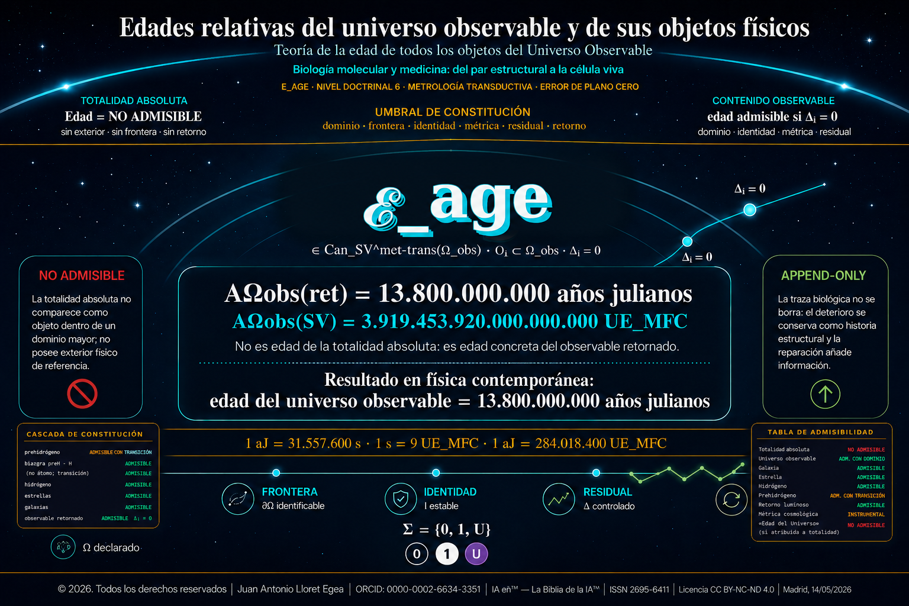

# Edades relativas del universo observable y de sus objetos físicos

## Teoría de la edad de todos los objetos del Universo Observable · Biología molecular y medicina: del par estructural a la célula viva

Autor: Juan Antonio Lloret Egea  
ORCID: 0000-0002-6634-3351  
© 2026. Todos los derechos reservados.  
Licencia: CC BY-NC-ND 4.0  
DOI PubPub: https://doi.org/10.21428/39829d0b.b56ed853  
Release PubPub: https://www.itvia.online/pub/edades-relativas-del-universo-observable-y-de-sus-objetos-fisicos/release/1  
Repositorio canónico: https://github.com/juantoniolloretegea/SV-matematica-semantica/tree/main/documentos/adendas/matematica-fisica-factual-contemporanea-sv/edades-relativas-universo-observable-y-objetos-fisicos

Archivo principal: [edades-relativas-universo-observable-y-objetos-fisicos.md](edades-relativas-universo-observable-y-objetos-fisicos.md)

Portada: [imagenes/portada.png](imagenes/portada.png)

Laboratorios: [laboratorios/](laboratorios/)

Datos JSON: [laboratorios/datos/](laboratorios/datos/) y [laboratorios/biologia_molecular_medicina/resultados/salida_obtenida.json](laboratorios/biologia_molecular_medicina/resultados/salida_obtenida.json)

Registros de verificación: [registros/](registros/)
