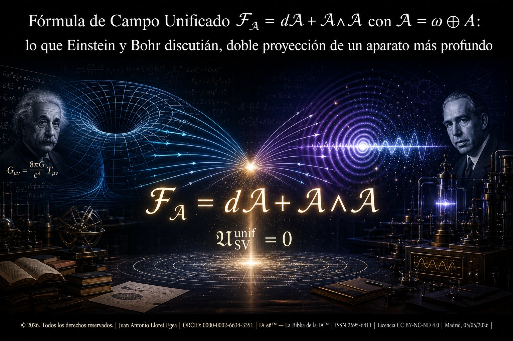

# Laboratorio reproducible — Fórmula de Campo Unificado SV

<p align="center"></p>

**Autor:** Juan Antonio Lloret Egea
**ORCID:** 0000-0002-6634-3351
**Sello editorial:** Instituto Tecnológico Virtual de la Inteligencia Artificial para el Español™ (ITVIA)
**Publicación:** IA eñ™ — La Biblia de la IA™
**ISSN:** 2695-6411
**Licencia:** CC BY-NC-ND 4.0
**Protección:** CEDRO
**Lugar y fecha:** Madrid, 05/05/2026

---

# Laboratorio de la publicación restaurada

Ejecutar:

```bash
python laboratorios/runner.py
```

Verifica título, render GitHub sin signos de dólar, número mínimo de teoremas y demostraciones, curvatura, Kaluza-Klein, variaciones, caracteres, alternativas al correlador, CHSH, clase 𝕴F e incidencia lateral.

---

## Identificadores canónicos

| Recurso | Enlace |
|---|---|
| DOI de la publicación | [10.17613/gxfv3-qjj64](https://doi.org/10.17613/gxfv3-qjj64) |
| DOI del laboratorio reproducible (Zenodo) | [10.5281/zenodo.20041095](https://doi.org/10.5281/zenodo.20041095) |
| PDF firmado y sello temporal de la publicación | [../PDF/](../PDF/) |
| Internet Archive | [Internet Archive](https://web.archive.org/save/https://github.com/juantoniolloretegea/SV-matematica-semantica/tree/main/documentos/adendas/matematica-fisica-factual-contemporanea-sv/formula-de-campo-unificado-conexion-curvatura-einstein-bohr-doble-proyeccion/PDF) |

**Firma del PDF de la publicación:** PAdES-BES con DNIe (firma electrónica cualificada bajo eIDAS).
**Sello temporal del PDF de la publicación:** OpenTimestamps `.ots`, anclado en blockchain Bitcoin.
**Snapshot empaquetado del laboratorio en Zenodo:** `laboratorios.zip` + firma CAdES detached `laboratorios.zip_signed.csig` + sello temporal `laboratorios.zip.ots`, accesibles desde la página del DOI Zenodo.
