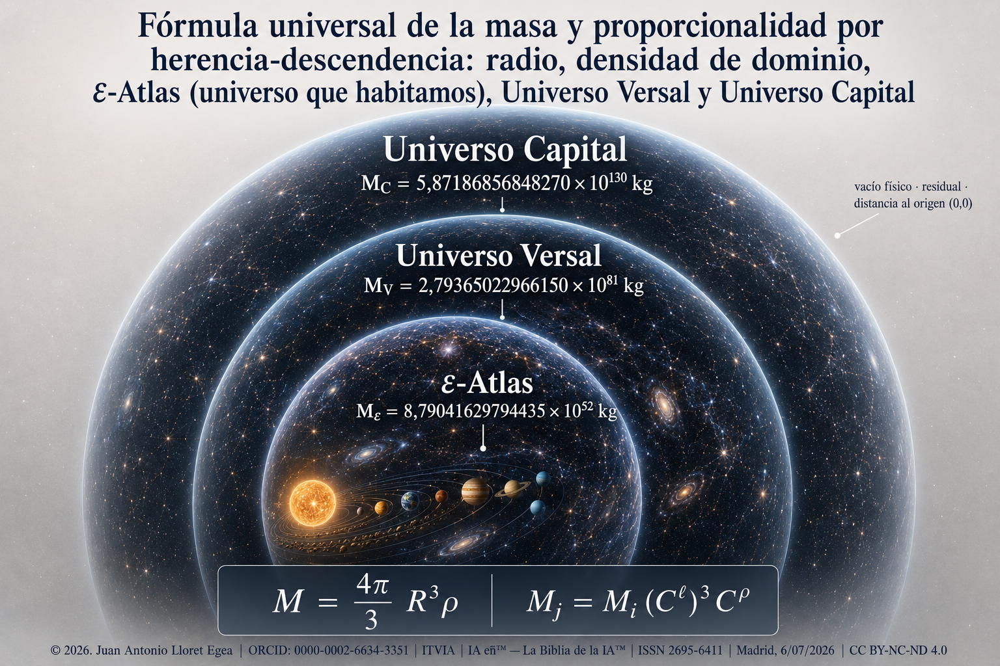

# Fórmula universal de la masa y proporcionalidad por herencia-descendencia: radio, densidad de dominio, ε-Atlas, Universo Versal y Universo Capital

**Aplicación de la relación M = (4π/3)R³ρ, contraste con grupos externos de datos y cálculo de masas por la cadena ε-Atlas → Universo Versal → Universo Capital**

---

© 2026. Todos los derechos reservados. | Juan Antonio Lloret Egea | [DOI 10.21428/39829d0b.95b8df6b](https://doi.org/10.21428/39829d0b.95b8df6b) | ORCID: 0000-0002-6634-3351 | Instituto Tecnológico Virtual de la Inteligencia Artificial para el Español™ (ITVIA) | IA eñ™ — La Biblia de la IA™ | ISSN 2695-6411 | Licencia CC BY-NC-ND 4.0 | Madrid, 06/07/2026

---

## Resumen

La masa de un cuerpo tratado como esfera de radio equivalente se obtiene multiplicando su densidad por el volumen de esa esfera, según la relación M = (4π/3)R³ρ. Esa relación no se propone aquí como descubrimiento, sino que se fija como forma necesaria de la masa volumétrica y se aplica con una disciplina precisa sobre la condición de la densidad que en ella interviene. El desarrollo se ordena en tres niveles de escala y, sobre todo, en tres regímenes de determinación que no deben confundirse. En el primero, la relación se contrasta con diez cuerpos bien determinados del Sistema Solar, tomando radio y densidad de grupos externos de datos y devolviendo la masa, con lo que se obtiene un contraste de consistencia cuyos residuales quedan en el orden de las milésimas de punto porcentual, no una predicción independiente de la densidad. En el segundo, la relación se aplica al dominio-universo observable, aquí denominado ε-Atlas (universo que habitamos), cuyo radio se identifica con el producto de la velocidad de la luz por el tiempo observable y cuya densidad se ancla en la forma de la densidad crítica; la masa resultante coincide con la magnitud que la cosmología asocia al contenido energético del universo observable. En el tercero, la relación se proyecta por una cadena de razones lineales y densitarias hacia dos dominios envolventes de escala mayor, el Universo Versal y el Universo Capital, cuyas masas quedan determinadas de manera única una vez fijadas la semilla y las constantes de la cadena. Una distinción gobierna la lectura completa. Donde hay contraste externo se declara contraste, y donde solo hay determinación por cadena se declara determinación por cadena, sin atribuir a las masas envolventes una medición instrumental que no poseen ni se reclama.

## Abstract

The mass of a body treated as an equivalent-radius sphere follows from multiplying its density by the sphere's volume, through M = (4π/3)R³ρ. This relation is not offered as a discovery but fixed as the necessary form of volumetric mass and applied under a precise discipline concerning the status of the density involved. The work is organized in three scale levels and, above all, in three regimes of determination that must not be conflated. First, the relation is tested against ten well-determined Solar System bodies, taking radius and density from external data groups and returning the mass: a consistency check with residuals on the order of thousandths of a percentage point, not an independent prediction of density. Second, the relation is applied to the observable universe-domain, here called ε-Atlas, whose radius is identified with the speed of light times the observable time and whose density is anchored in the critical-density form; the resulting mass matches the magnitude that cosmology associates with the energy content of the observable universe. Third, the relation is projected through a chain of linear and density ratios toward two larger enclosing domains, the Versal Universe and the Capital Universe, whose masses are uniquely determined once the seed and the chain constants are fixed. A single distinction governs the whole reading: where external contrast exists, a contrast is declared; where only chain determination exists, chain determination is declared, without ascribing to the enclosing masses an instrumental measurement they neither possess nor claim.

---

## Índice

- Resumen
- Abstract
- Notación y unidades
- I. Introducción y objeto
- II. Antecedentes y estado de la cuestión
- III. Marco conceptual: la masa como magnitud de dominio
- IV. Las tres condiciones de la densidad
- V. Método de contraste
- VI. Contraste con cuerpos del Sistema Solar
- VII. Densidad semilla y anclaje cosmológico de ε-Atlas
- VIII. Masa de ε-Atlas: el universo que habitamos, que engloba el Sistema Solar, la Vía Láctea y las demás galaxias
- IX. Cadena de proporcionalidad y naturaleza de las constantes
- X. Universo Versal
- XI. Universo Capital
- XII. Tabla de cadena y proporcionalidad de masas
- XIII. Herencia-descendencia
- XIV. Unicidad de la forma
- XV. Discusión adversarial
- XVI. Cierre formal, controles de régimen y reducciones al absurdo
    - XVI.1. Teorema de independencia de la forma respecto del origen de la densidad
    - XVI.2. Reducción al absurdo: la medición externa como requisito universal
    - XVI.3. Reducción al absurdo: masa sin densidad o sin volumen
    - XVI.4. Reducción al absurdo: unicidad de la masa de cadena
    - XVI.5. Control de sensibilidad de las entradas declaradas
- XVII. Resultados
- XVIII. Conclusión
- XIX. Bibliografía
    - Fuentes externas
    - Fuentes del corpus del Sistema Vectorial
- XX. Cláusulas legales

## Notación y unidades

Cada símbolo se define aquí una sola vez y con su valor exacto, de modo que no haya que deducirlo ni buscarlo fuera del texto. Las magnitudes se expresan en unidades del Sistema Internacional salvo indicación contraria; las definiciones de la unidad astronómica y del año juliano siguen la convención de la Unión Astronómica Internacional (International Astronomical Union, 2012).

| Símbolo | Significado | Valor o definición |
| ------- | ----------- | ------------------ |
| M | Masa de un cuerpo o dominio | kg |
| R | Radio de la esfera equivalente | m |
| V | Volumen de la esfera equivalente | V = (4π/3)R³ (m³) |
| ρ | Densidad de dominio | ρ = M/V (kg·m⁻³) |
| π | Constante geométrica | 3,14159265358979… |
| c | Velocidad de la luz en el vacío | 299 792 458 m·s⁻¹ |
| G | Constante de gravitación universal | 6,67430×10⁻¹¹ m³·kg⁻¹·s⁻² |
| T_obs | Tiempo observable, extensión temporal del universo observable | 4,3549488×10¹⁷ s (≈ 1,38×10¹⁰ años julianos) |
| ρ_ε, R_ε, V_ε, M_ε | Densidad semilla, radio, volumen y masa de ε-Atlas | véanse secciones VII y VIII |
| ρ_V, R_V, V_V, M_V | Densidad, radio, volumen y masa del Universo Versal | véase sección X |
| ρ_C, R_C, V_C, M_C | Densidad, radio, volumen y masa del Universo Capital | véase sección XI |
| O₁, O₂, O₃ | Peldaños de la escalera orbital anidada | véase sección IX |
| R_G | Radio de la órbita galáctica (peldaño O₂) | 26 000 ly |
| C^ℓ, C^ρ, C^τ | Componentes lineal, densitaria y temporal de una constante de escala | C^ρ = C^ℓ/C^τ |
| C_D, C_ñ | Constante Descartes (tramo ε-Atlas→Versal) y Constante ñ (tramo Versal→Capital) | véase sección IX |
| i, j | Índices de dos dominios cualesquiera enlazados por la cadena | — |
| au | Unidad astronómica | 1,495978707×10¹¹ m |
| a_J | Año juliano | 365,25 días = 31 557 600 s |
| ly | Año luz (juliano), igual al año luz juliano ly_J | c·a_J = 9,4607304725808×10¹⁵ m |
| (c.q.d.) | «Como queda demostrado», marca de fin de demostración | — |

## I. Introducción y objeto

Buena parte de la física cuantitativa descansa en relaciones elementales que, lejos de agotarse en su enunciado escolar, sostienen resultados de gran alcance cuando se aplican con rigor sobre magnitudes bien definidas. La relación entre masa, densidad y volumen es una de ellas. Su forma para un cuerpo esférico, M = (4π/3)R³ρ, se enseña muy pronto y precisamente por eso corre el riesgo de leerse como un lugar común sin consecuencias. Aquí se muestra que, cuando la densidad ρ se maneja con una procedencia declarada y la relación se proyecta por una cadena de escalas, esa forma elemental organiza un cálculo coherente que va del planeta al dominio cosmológico y de éste a dominios de escala superior.

No se reclama haber hallado la relación, ni haberla corregido, ni haber superado a las mediciones que la verifican, aunque tampoco se afirma lo contrario. Lo que se persigue es algo preciso, a saber, aplicarla sin equívoco sobre el carácter de sus entradas, de manera que cada cifra conserve su régimen propio y pueda leerse por lo que es. Con esa cautela por delante, el objeto se ordena en tres cometidos. El primero declara la forma de la masa y separa las tres condiciones de la densidad. El segundo la contrasta con cuerpos del Sistema Solar y con el dominio observable. El tercero la proyecta hacia el Universo Versal y el Universo Capital por una cadena de proporcionalidad cuyas constantes se declaran de forma expresa.

Conviene anticipar la distinción que recorre todo el desarrollo, porque de ella depende que no se lea más de lo que se afirma. Los cuerpos del Sistema Solar disponen de magnitudes publicadas por grupos externos de datos, y por eso el ejercicio sobre ellos es contraste de consistencia. El dominio observable admite un anclaje en magnitudes cosmológicas reconocidas, y por eso su masa está bien fundada aunque no se mida el conjunto de una vez. Los dos dominios envolventes no se presentan bajo medición instrumental externa, sino bajo determinación por cadena. Confundir estos tres niveles sería el error de plano que en todo el desarrollo se evita con cuidado (Lloret Egea, 2026l). A esta cautela se suma una tesis que esta investigación considera central. El patrón de herencia-descendencia pertenece a la propia naturaleza, y por ello se sostiene aquí que constituye la más alta forma de evidencia empírica, siempre que se conserven sin duda alguna el dominio, el residual, el alcance y el tránsito entre dominios. Queda con ello planteada una pregunta de fondo, a saber, si una doctrina científica, o una de sus ramas, puede sobreponer sus experimentos a la naturaleza misma. La empiría entraña, en efecto, un riesgo conocido: tres puntos vistos por un observador pueden parecer una recta, del mismo modo que la Tierra pareció plana, cuando en realidad podrían pertenecer a una circunferencia de radio suficiente, a una línea poligonal o a otra estructura, y hallarse en dos o en tres dimensiones. Esta advertencia ha de tenerse presente en la revisión por pares de la publicación.

## II. Antecedentes y estado de la cuestión

La relación entre masa, volumen y densidad pertenece al núcleo de la mecánica clásica y se remonta a la formulación de la gravitación y de la cantidad de materia en Newton (1687). Sobre ella descansa, sin cambio de forma, todo el cálculo que aquí se desarrolla; la aportación no reside, por tanto, en la relación, sino en la disciplina con que se declara la densidad que en ella entra.

El anclaje del dominio observable se apoya en la cosmología del siglo XX. La curvatura del espacio en función de su contenido, en Friedmann (1922), y la proporción entre distancia y velocidad de recesión, en Hubble (1929), condujeron a la noción de densidad crítica, ρ = 3H²/(8πG), y de radio de Hubble como escala natural del universo observable. La determinación contemporánea de sus parámetros —constante de Hubble, edad y densidad— procede de las medidas del fondo cósmico de microondas recogidas por la Planck Collaboration (2020). La densidad semilla empleada aquí es esa densidad crítica evaluada con el inverso del tiempo observable, y la masa M_ε = c³·T_obs/(2G) es la que a esa densidad corresponde en el radio de Hubble; ambas magnitudes pertenecen, pues, al acervo cosmológico reconocido.

La idea de una estructura ordenada por escalas, en la que la densidad media disminuye a medida que crece el dominio considerado, tiene una tradición larga y precisa. Fournier d'Albe (1907) propuso una distribución jerárquica de la materia en la que la masa contenida crecía en proporción al radio, M(R) ∝ R, apartándose de la ley M(R) ∝ R³ propia de un medio homogéneo. Charlier (1908, 1922) le dio forma matemática y mostró que una jerarquía de cúmulos anidados, cada uno de menor densidad media que sus constituyentes, resolvía la paradoja de Olbers. De Vaucouleurs (1970) reabrió el debate en favor de una cosmología jerárquica, y Mandelbrot (1982) lo reformuló en términos de geometría fractal, con una densidad que depende de la escala de observación.

Con esa tradición comparte el presente cálculo un rasgo esencial, a saber, que la densidad no es una constante universal, sino una magnitud que varía con la escala del dominio, y que la masa escala con el radio combinando la proyección volumétrica con esa variación densitaria. La cadena ε-Atlas → Universo Versal → Universo Capital se distingue, sin embargo, de aquellos modelos en dos puntos que importa fijar sin ambigüedad. El primero es que no describe una distribución estadística ni fractal de cúmulos dentro del universo observable, sino una sucesión de dominios envolventes determinados por razones lineales y densitarias declaradas. El segundo es que los dos dominios que envuelven al observable no son objetos accesibles a la observación, sino determinaciones formales por cadena, y como tales se presentan a lo largo del texto. La noción de dominios más allá del universo observable enlaza, en un plano más lejano, con las discusiones sobre multiversos, igualmente ajenas a la medición directa; pero la construcción aquí empleada es de otra índole, pues no postula copias ni regiones causalmente desconectadas, sino una jerarquía de envolvencia con magnitudes fijadas.

## III. Marco conceptual: la masa como magnitud de dominio

La masa de un cuerpo homogéneo es su densidad multiplicada por su volumen. Esta definición encierra una decisión que a menudo pasa inadvertida, pues la densidad no es una propiedad del punto, sino del contenido distribuido en el volumen. Cuando se afirma que un cuerpo tiene tal densidad, se está atribuyendo a todo su interior una razón media entre contenido y espacio ocupado. Esa razón media es lo que aquí se denomina densidad de dominio, y su uso disciplinado es la única aportación que aquí se reclama sobre la forma de masa.

Un dominio material no se identifica por una etiqueta descriptiva sino por la densidad de referencia que impone. Un interior rocoso metálico, un cuerpo de hielo y roca porosos, un núcleo denso con envoltura volátil o un dominio de plasma estelar corresponden a densidades características distintas, y la persistencia de esa densidad a lo largo del dominio es lo que permite tratarlo como una unidad de cálculo (Lloret Egea, 2026l; Lloret Egea, 2026f). El tránsito entre dominios, y la continuidad material que lo sostiene, se han tratado en el marco de referencia como una relación entre fases y composiciones —sujeta al régimen factual de trabajo, calor y temperatura del dominio— y no como una mera clasificación de apariencias (Lloret Egea, 2026e).

Sobre esta base, tratar un cuerpo como esfera de radio equivalente no supone afirmar que sea esférico, sino elegir una esfera cuyo volumen iguale al suyo. Esa elección hace que radio y densidad remitan a la misma referencia y que su producto por el factor geométrico devuelva la masa asociada. La forma M = (4π/3)R³ρ es, en consecuencia, la expresión de la masa volumétrica bajo una geometría de referencia declarada, y no una hipótesis sobre la figura real del cuerpo.

## IV. Las tres condiciones de la densidad

El núcleo metodológico está en distinguir con nitidez las tres condiciones de la densidad, porque de esa distinción depende que el cálculo escape a la circularidad.

La densidad publicada de contraste procede de grupos externos de datos. En los cuerpos del Sistema Solar suele resultar de la masa deducida por dinámica gravitatoria y del volumen asociado al radio medio o volumétrico publicado; no es, por tanto, observación directa de la densidad, sino una magnitud que ya incorpora una masa previa. Se emplea para verificar la forma de masa, no para fundarla: cuando se introducen radio y densidad publicados y se recupera la masa publicada, no se predice nada nuevo, sino que se comprueba que las tres magnitudes son mutuamente consistentes.

La densidad asignada se atribuye a un dominio a partir de una regla interna, sin medir el cuerpo concreto. Predecir la densidad de un planeta desde una escala de dominio, sin recurrir a su masa observada, correspondería a esta condición. Es la vía más exigente y la que permitiría hablar de predicción; no se ejercita aquí para los planetas, y así se declara sin ambages.

La densidad heredada de cadena se obtiene de una densidad semilla por una razón densitaria declarada, como en ρ_V = ρ_ε·C_D^ρ y ρ_C = ρ_V·C_ñ^ρ. Su condición no es la de una medición externa ni la de un ajuste a una masa buscada, sino la de una transmisión densitaria dentro de una cadena formalmente determinada, y es la que corresponde a las densidades del Universo Versal y del Universo Capital.

La circularidad aparece cuando estas condiciones se mezclan, esto es, cuando de una masa se obtiene una densidad para recuperar después la misma masa. La secuencia correcta parte de radio y densidad hacia el volumen y de este hacia la masa, y nunca invierte ese orden. Toda la sección de contraste solar se ciñe a esta regla. Para admitir una densidad en el cálculo se exige, además, declarar la magnitud distribuida, el dominio al que pertenece, la unidad en que se expresa y el residual que se acepta frente al contraste.

## V. Método de contraste

El contraste con cuerpos bien determinados sigue un procedimiento fijo. De cada cuerpo se toman, de grupos externos de datos, el radio medio volumétrico y la densidad global; para el Sol se toman masa, radio volumétrico medio y densidad media (Jet Propulsion Laboratory, s.f.; Lloret Egea, 2026b). Los radios se convierten de kilómetros a metros y las densidades de gramos por centímetro cúbico a kilogramos por metro cúbico. Con esas entradas se calcula la masa por la forma general y se compara con la masa publicada. El residual se define como la diferencia relativa en tanto por ciento entre la masa calculada y la publicada,

residual (%) = (M_fórmula − M_grupo externo) / M_grupo externo × 100,

de manera que un residual positivo indica que la fórmula devuelve una masa algo mayor que la publicada, y uno negativo, algo menor.

La regla, enunciada sin ambigüedad, es que de radio y densidad externos se obtiene el volumen y de este la masa, y que en ningún caso se parte de la masa para obtener la densidad. El resultado se interpreta como consistencia entre magnitudes externas y forma de masa, dentro del margen de redondeo con que las fuentes publican sus cifras.

## VI. Contraste con cuerpos del Sistema Solar

Las masas se expresan en unidades de 10²⁴ kg. La densidad del Sol se introduce ya en kilogramos por metro cúbico; el resto en gramos por centímetro cúbico convertidos a la unidad del Sistema Internacional.

| Objeto | R usado | ρ usada | Masa por fórmula (10²⁴ kg) | Grupo externo (10²⁴ kg) | Residual |
| ------ | ------: | ------: | -------------------------: | ----------------------: | -------: |
| Sol | 696 000 km | 1408 kg/m³ | 1 988 469,724 | 1 989 100,000 | −0,031686 % |
| Mercurio | 2439,4 km | 5,4289 g/cm³ | 0,330103029 | 0,330103000 | +0,000009 % |
| Venus | 6051,8 km | 5,243 g/cm³ | 4,867681659 | 4,867310000 | +0,007636 % |
| Tierra | 6371,0084 km | 5,5134 g/cm³ | 5,972176638 | 5,972170000 | +0,000111 % |
| Luna | 1737,5 km | 3,3437 g/cm³ | 0,073460576 | 0,073460000 | +0,000784 % |
| Marte | 3389,5 km | 3,9340 g/cm³ | 0,641696809 | 0,641691000 | +0,000905 % |
| Júpiter | 69 911 km | 1,3262 g/cm³ | 1898,165937 | 1898,125000 | +0,002157 % |
| Saturno | 58 232 km | 0,6871 g/cm³ | 568,320965 | 568,317000 | +0,000698 % |
| Urano | 25 362 km | 1,270 g/cm³ | 86,784632 | 86,809900 | −0,029108 % |
| Neptuno | 24 622 km | 1,638 g/cm³ | 102,417103 | 102,409200 | +0,007717 % |

Los residuales se mantienen en el orden de las milésimas de punto porcentual, salvo el Sol y Urano, que alcanzan las centésimas por el redondeo con que se publican densidad y radio. La lectura correcta no es que la forma haya predicho estas masas, sino que radio, densidad y masa publicados encajan entre sí dentro del margen de las fuentes. En términos de la sección anterior, la densidad empleada obra como densidad de contraste, y el resultado es un contraste de consistencia. La determinación independiente de las densidades planetarias a partir de una escala interna queda fuera del presente alcance, y por ello no se reclama aquí predicción alguna de densidades.

A modo de ejemplo resuelto de principio a fin, la fila de la Tierra se obtiene así. El radio publicado, R = 6371,0084 km, se convierte a metros como R = 6 371 008,4 m. El volumen de la esfera equivalente es V = (4π/3)R³ = 1,0832112014×10²¹ m³. La densidad publicada, ρ = 5,5134 g·cm⁻³, se convierte a ρ = 5513,4 kg·m⁻³. El producto devuelve M = V·ρ = 5,972176638×10²⁴ kg. Frente al valor externo 5,97217×10²⁴ kg, el residual es (5,972176638 − 5,97217)/5,97217 × 100 = +0,000111 %. Las diez filas de la tabla se producen por este mismo procedimiento.

## VII. Densidad semilla y anclaje cosmológico de ε-Atlas

El paso del cuerpo planetario al dominio observable exige una densidad de referencia que no se ajuste para cerrar un resultado, sino que provenga de una magnitud cosmológica reconocida. Esa densidad se define en el marco de referencia dentro del tramo de radio, frontera y densidad del universo observable (Lloret Egea, 2026m) como

ρ_ε = 3 / (8πG·T_obs²),

que es la forma de la densidad crítica cuando el inverso del tiempo observable ocupa el lugar del parámetro de expansión. En esta expresión G es la constante de gravitación universal, G = 6,67430×10⁻¹¹ m³·kg⁻¹·s⁻², y T_obs es el tiempo observable, la extensión temporal del universo observable, T_obs = 4,3549488×10¹⁷ s, equivalente a 1,38×10¹⁰ años julianos; el valor es ρ_ε = 9,429953786784435×10⁻²⁷ kg·m⁻³, del orden de la densidad crítica del universo observable.

Este valor no declara inventario de materia ordinaria por metro cúbico. Declara la densidad equivalente de capacidad estructural del dominio observable, en el sentido en que la densidad crítica integra el contenido energético total y no solo la fracción bariónica. La etiqueta correcta es densidad equivalente de capacidad estructural de ε-Atlas, y la lectura no sustancial de las componentes oscuras que acompaña a esta densidad se ha desarrollado con detalle en el marco de referencia (Lloret Egea, 2026g).

El dominio observable, tratado bajo lectura exocósmica como dominio-universo con radio identificado con el del universo observable, se ha fijado en la apertura de esa lectura (Lloret Egea, 2026h). El radio del dominio observable se toma como el producto de la velocidad de la luz —c = 299 792 458 m·s⁻¹— por el tiempo observable, con el año luz juliano como unidad métrica. Un año juliano son 365,25 días, esto es 31 557 600 s, de donde el año luz juliano vale 9,4607304725808×10¹⁵ m. Con T_obs = 1,38×10¹⁰ años julianos, el radio del dominio observable, R_ε = c·T_obs, resulta 1,3055808052161504×10²⁶ m. La determinación del radio, la superficie y el volumen del universo observable bajo retorno metrológico, y la separación expresa respecto del radio comóvil externo, se han fijado en las partes primera y segunda del tramo cosmológico del marco (Lloret Egea, 2026c; Lloret Egea, 2026n).

De la combinación de ambos anclajes surge un resultado que conviene exhibir porque hace transparente la fundamentación de la masa. Al ser el radio igual a c·T_obs y la densidad la crítica, los factores geométricos se cancelan con el factor 3 de la densidad y la masa del dominio observable admite la forma cerrada M_ε = c³·T_obs/(2G). Es decir, la masa de ε-Atlas coincide con la magnitud que se asocia al contenido energético del universo observable a densidad crítica, y no con un número introducido a mano. La génesis física de la masa y la definición de la gravedad que subyacen a este anclaje se han tratado por separado en el marco (Lloret Egea, 2026a).

## VIII. Masa de ε-Atlas: el universo que habitamos, que engloba el Sistema Solar, la Vía Láctea y las demás galaxias

Del radio anterior se obtiene el volumen esférico equivalente V_ε = (4π/3)R_ε³ = 9,32180209648921×10⁷⁸ m³. El producto del volumen por la densidad semilla devuelve la masa del dominio observable:

M_ε = V_ε·ρ_ε = 8,79041629794435×10⁵² kg.

Esta masa es masa calculada del dominio-universo observable, con densidad de reconocida naturaleza cosmológica y radio derivado del tiempo observable. Pertenece al régimen de anclaje cosmológico, pues tanto el radio como la densidad remiten a magnitudes independientes de la cadena de proporcionalidad que se introduce a continuación. La coincidencia con la forma cerrada M_ε = c³·T_obs/(2G) confirma el anclaje por una vía independiente del cálculo volumétrico directo. (c.q.d.)

## IX. Cadena de proporcionalidad y naturaleza de las constantes

Dos dominios cualesquiera i y j, vinculados por una razón lineal C^ℓ = R_j/R_i entre sus radios, comparten esa misma razón elevada al cuadrado en la superficie y al cubo en el volumen. Si, además, sus densidades guardan una razón C^ρ, las masas heredan la proyección combinada

M_j/M_i = (R_j/R_i)³·(ρ_j/ρ_i) = (C^ℓ)³·C^ρ.

La masa es, así, la cuarta proyección de una misma escala lineal, después de la lineal, la superficial y la volumétrica. No es una relación independiente, sino la consecuencia de aplicar la densidad de dominio sobre la proyección volumétrica.

Las constantes de escala no son parámetros libres, y su naturaleza merece una exposición detallada porque de ella depende que la cadena no quede sin fundamento. Cada constante es una terna de tres componentes —temporal, lineal y densitaria— determinadas sobre una escalera orbital anidada, en la que cada régimen orbital se inscribe dentro del inmediatamente envolvente (Lloret Egea, 2026i). Tres peldaños intervienen en el tránsito. El primero, O₁, es la órbita de la Tierra en torno al Sol, con radio de una unidad astronómica y periodo de un año juliano. El segundo, O₂, es la órbita del Sol en torno a la Galaxia, con radio de veintiséis mil años luz julianos y periodo de doscientos treinta millones de años julianos. El tercero, O₃, es la órbita del dominio observable en torno al nodo versal, con radio igual al radio versal y una duración compuesta formal recibida de la construcción.

| Peldaño | Régimen orbital | Radio | Periodo |
| ------- | --------------- | ----: | ------: |
| O₁ | Tierra en torno al Sol | 1 au | 1 a_J |
| O₂ | Sol en torno a la Galaxia | 26 000 ly | 230 000 000 a_J |
| O₃ | Dominio observable en torno al nodo versal | R_V = 2,2690898457834741360×10¹⁹ ly_J | 6,348×10¹⁸ a_J |

Sobre esta escalera, cada constante se forma como razón entre dos peldaños consecutivos. Su componente temporal es el cociente de los periodos, su componente lineal el cociente de los radios, y su componente densitaria se deriva de las dos anteriores mediante C^ρ = C^ℓ/C^τ. Este último punto es decisivo: la densidad de escala no se introduce a mano, sino que resulta del cociente entre la razón lineal y la razón temporal.

La Constante Descartes, que enlaza ε-Atlas con el Universo Versal, se forma con los dos peldaños internos del observable. Su componente lineal es el cociente entre el radio de la órbita galáctica y el de la órbita terrestre, veintiséis mil años luz julianos entre una unidad astronómica —esto es, 26 000 × 9,4607304725808×10¹⁵ m dividido por 1,495978707×10¹¹ m—, que vale 1,6442680041909233×10⁹. Su componente temporal es el año galáctico dividido por el año terrestre, doscientos treinta millones. Y su componente densitaria, cociente de ambas, vale 7,148991322569232 (Lloret Egea, 2026i). Importa subrayar el alcance de este anclaje, ya que los dos peldaños que forman la Constante Descartes corresponden a escalas astronómicas observadas —la órbita terrestre y la órbita galáctica del Sol—, con lo que esta constante no es una convención arbitraria, sino una razón entre magnitudes medidas.

La Constante ñ, que enlaza el Universo Versal con el Universo Capital, se forma subiendo la ventana un peldaño, con la pareja galáctica y versal. Su componente lineal es el cociente del radio versal al radio galáctico, 8,7272686376287467×10¹⁴; su componente temporal, 27 600 000 000, cuyo valor numérico coincide con la clausura axial-etaria del observable y cuyo cociente con la temporal Descartes vale exactamente ciento veinte, medida de esa clausura en revoluciones galácticas (Lloret Egea, 2026d); y su componente densitaria, cociente de ambas, vale 3,1620538542133×10⁴. A diferencia de la Constante Descartes, uno de los dos peldaños de la Constante ñ —la órbita versal O₃— no es una órbita observada, sino una construcción de la cadena, con radio y duración recibidos del propio marco. Por ello la Constante ñ presenta anclaje mixto: su lado galáctico pertenece al grupo externo de contraste astronómico, y su lado versal procede del tramo formal ya determinado.

| Tramo | Componente temporal C^τ | Componente lineal C^ℓ | Componente densitaria C^ρ = C^ℓ/C^τ |
| ----- | ----------------------: | --------------------: | ----------------------------------: |
| ε-Atlas → Universo Versal | 230 000 000 | 1,6442680041909233×10⁹ | 7,148991322569232 |
| Universo Versal → Universo Capital | 27 600 000 000 | 8,7272686376287467×10¹⁴ | 3,1620538542133×10⁴ |

## X. Universo Versal

Aplicada la razón lineal del primer tramo al radio de ε-Atlas, el radio del Universo Versal resulta R_V = 2,146724744902738×10³⁵ m, del que se obtiene el volumen V_V = (4π/3)R_V³ = 4,14398043553101×10¹⁰⁶ m³. La razón de volúmenes reproduce, como debe, el cubo de la razón lineal, con V_V/V_ε = 4,44547137199117×10²⁷, según la proyección geométrica que hace descender superficie y volumen de una única escala lineal (Lloret Egea, 2026j).

La densidad del Universo Versal se obtiene multiplicando la densidad semilla por la razón densitaria del tramo, con ρ_V = ρ_ε·C_D^ρ = 6,74146577939508×10⁻²⁶ kg·m⁻³. El producto del volumen por la densidad heredada, o de modo equivalente la masa semilla por la proyección combinada del tramo, devuelve

M_V = M_ε·(C_D^ℓ)³·C_D^ρ = 2,79365022966150×10⁸¹ kg.

La masa del Universo Versal es masa calculada de dominio formalmente determinado por cadena. No procede de medición instrumental externa ni aquí se pretende tal medición; su valor es único dada la masa semilla y las constantes del tramo. La cadena que enlaza los dominios envolventes con el observable se ha definido en el marco como relación de envolvencia y descendencia, y no como simple aumento de tamaño. (c.q.d.)

## XI. Universo Capital

El radio del Universo Capital se obtiene aplicando la componente lineal de la Constante ñ al radio versal, según R_C = C_ñ^ℓ·R_V, que admite la forma equivalente R_C = R_V²/R_G, cociente que hace descender el radio capital de las mismas magnitudes de la escalera orbital (Lloret Egea, 2026i). Fijado así en 1,9802956647×10³⁴ años luz julianos, equivale a R_C = 1,87350736798259×10⁵⁰ m tras la conversión homogénea. Su volumen es V_C = (4π/3)R_C³ = 2,75456312579421×10¹⁵¹ m³, y la razón de volúmenes respeta de nuevo el cubo de la razón lineal, con V_C/V_V = 6,64714317224146×10⁴⁴.

La densidad del Universo Capital se obtiene de la del Versal por la razón densitaria del segundo tramo, con ρ_C = ρ_V·C_ñ^ρ = 2,13168778507833×10⁻²¹ kg·m⁻³. La masa resulta del producto del volumen por la densidad heredada, o de la masa del Versal por la proyección combinada del segundo tramo:

M_C = M_V·(C_ñ^ℓ)³·C_ñ^ρ = 5,87186856848270×10¹³⁰ kg.

Como en el tramo anterior, la masa del Universo Capital es masa calculada de dominio formalmente determinado por cadena, única dada la entrada y sin contraste instrumental externo. No se afirma que ninguna agencia haya medido esta masa; lo que se sostiene es que la cadena, con sus constantes declaradas, la determina sin holgura. (c.q.d.)

## XII. Tabla de cadena y proporcionalidad de masas

Reunidos los tres dominios de escala cosmológica, la cadena queda recogida con radio, volumen, densidad y masa en unidades del Sistema Internacional.

| Dominio | Radio (m) | Volumen (m³) | Densidad (kg·m⁻³) | Masa (kg) |
| ------- | --------: | -----------: | ----------------: | --------: |
| ε-Atlas | 1,3055808052161504×10²⁶ | 9,32180209648921×10⁷⁸ | 9,429953786784435×10⁻²⁷ | 8,79041629794435×10⁵² |
| Universo Versal | 2,146724744902738×10³⁵ | 4,14398043553101×10¹⁰⁶ | 6,74146577939508×10⁻²⁶ | 2,79365022966150×10⁸¹ |
| Universo Capital | 1,87350736798259×10⁵⁰ | 2,75456312579421×10¹⁵¹ | 2,13168778507833×10⁻²¹ | 5,87186856848270×10¹³⁰ |

Las razones de masa entre dominios se siguen directamente de la tabla.

| Tramo | Proporción de masa |
| ----- | -----------------: |
| ε-Atlas → Universo Versal | 3,17806362630948×10²⁸ |
| Universo Versal → Universo Capital | 2,10186246872937×10⁴⁹ |
| ε-Atlas → Universo Capital | 6,67985265937388×10⁷⁷ |

La proporción total entre ε-Atlas y el Universo Capital coincide, hasta la precisión de trabajo, tanto si se calcula por el producto de los dos tramos como si se obtiene de la razón directa entre las masas extremas. Esta concordancia entre la vía directa y la vía por tramos es propiedad de la cadena, demostrada por el retorno directo y por tramos, y no un ajuste posterior (Lloret Egea, 2026k). (c.q.d.)

## XIII. Herencia-descendencia

La relación entre los tres dominios no se entiende como mero aumento de tamaño, sino como envolvencia y descendencia. El Universo Capital envuelve al Versal y este a ε-Atlas, de manera que las magnitudes descienden por la cadena conservando la proporción. La dirección de la envolvencia va de Capital hacia ε-Atlas, mientras que la del cálculo aquí realizado va en sentido inverso, de ε-Atlas hacia Capital, partiendo del dominio mejor anclado hacia los que solo se determinan por cadena.

Una sola razón lineal genera las cuatro proyecciones ordenadas: la lineal iguala la razón de radios a C^ℓ, la superficial la eleva al cuadrado, la volumétrica al cubo, y la másica añade a la volumétrica la razón densitaria. A lo largo de la cadena se conserva el carácter de cada magnitud, pues el radio sigue siendo radio, la densidad sigue siendo densidad de dominio y la masa sigue siendo masa calculada de dominio. La cadena escala las magnitudes sin mudar la naturaleza de ninguna.

## XIV. Unicidad de la forma

No hay masa volumétrica sin volumen y sin densidad, y suprimir cualquiera de ambos factores deja la forma general sin sentido físico. El radio por sí solo fija el volumen, pero no la masa, pues dos cuerpos de igual radio y distinta densidad tienen distinta masa; por tanto, ninguna función del radio solo reemplaza a la densidad. Fijadas volumen y densidad, la masa M = Vρ es única, y fijadas radio y densidad, su versión esférica también lo es. La unicidad es, en todos los casos, unicidad respecto de las entradas declaradas, y no una primacía del cálculo sobre la medida. El cálculo determina la masa a partir de sus entradas; la medida externa la verifica. Son operaciones distintas, cada una con su función, y aquí no se confunde la una con la otra. (c.q.d.)

## XV. Discusión adversarial

Las objeciones que cabe oponer a estos resultados se recogen de forma expresa, enfrentando cada una con su respuesta y reuniéndolas en un solo lugar.

| Objeción | Respuesta |
| -------- | --------- |
| La relación M = ρV es elemental. | Cierto, y por eso es universal en su forma. Aquí no se inventa: se fija por dominio y se aplica a la cadena. Que una relación sea básica no impide que sostenga resultados no básicos. |
| Si ρ se toma de un grupo externo, no hay predicción a ciegas. | Correcto. En los cuerpos del Sistema Solar el ejercicio es contraste de consistencia, no derivación independiente de la densidad, y así se declara. |
| El Universo Versal y el Universo Capital no tienen medición externa directa. | Correcto. Sus masas se presentan como masas calculadas de dominio determinado por cadena, no como masas medidas por agencia alguna. |
| Podría haber circularidad. | Solo la habría si de la masa se obtuviera la densidad para recuperar después la masa. En la cadena la densidad escala por la razón densitaria del tramo, no por la masa buscada. |
| Las constantes de escala podrían ser libres. | No son arbitrarias ni libres: se derivan como razones de la escalera orbital anidada, con la componente densitaria obtenida de la lineal y la temporal, y cada una pertenece a su ventana, de modo que su intercambio produce defecto de retorno. |
| El cálculo por tramos podría no coincidir con el directo. | Coincide hasta la precisión de trabajo, por la propiedad de recomposición de la cadena. |
| Tres puntos no fijan un patrón. | Cierto en general; por eso el resultado no se apoya en tres puntos aislados, sino en una forma contrastada en diez cuerpos y en una cadena cuya aritmética cierra en ambos sentidos. Donde no hay puntos externos, no se afirma contraste, sino determinación por cadena. |

## XVI. Cierre formal, controles de régimen y reducciones al absurdo

Los resultados aquí obtenidos no forman una serie homogénea de mediciones, sino tres regímenes de determinación que importa mantener separados: contraste de consistencia con cuerpos internos al Sistema Solar, anclaje cosmológico de ε-Atlas y determinación por cadena para el Universo Versal y el Universo Capital. Distinguir estos regímenes no ordena los resultados de más firme a más frágil; fija para cada uno la clase de prueba que le corresponde.

En los cuerpos del Sistema Solar, la densidad procede de grupos externos de datos, y no se pretende aquí derivarla a ciegas. El cometido es mostrar que, dadas R y ρ, la forma M = (4π/3)R³ρ devuelve M con residual compatible con el redondeo de las fuentes. La derivación autónoma de densidades planetarias desde una escala de dominio pertenece a una pregunta distinta y no condiciona el cierre de este análisis, pues la tesis demostrada no es la predicción ciega de densidades, sino la unicidad de la masa una vez declarados radio, densidad y dominio. Exigir aquella derivación para admitir M = (4π/3)R³ρ confundiría el origen de una entrada con la forma necesaria de la masa.

En ε-Atlas, la densidad semilla no se ajusta desde la masa buscada, sino que se recibe como densidad equivalente de capacidad estructural, ρ_ε = 3/(8πG·T_obs²). Con R_ε = c·T_obs, la masa admite además la forma cerrada M_ε = c³·T_obs/(2G). El resultado no nace, por tanto, de circularidad, sino de la conjunción entre radio estructural y densidad cosmológica declarada, y ese anclaje descansa en magnitudes —T_obs, G, c— ajenas a la cadena.

En el Universo Versal y en el Universo Capital no se reclama medición instrumental externa, y cabe precisar por qué. Estos dominios se definen como envolventes del observable, y nada que envuelva al observable puede observarse desde dentro de él; por su propia definición quedan, pues, fuera del alcance de toda observación instrumental externa. De esa imposibilidad —consecuencia de la definición, no carencia del cálculo— se sigue que sus masas son determinaciones formales por cadena, no medidas empíricas externas, y como tales han de leerse. Nada de esto contradice su determinación formal, porque el marco los lee y los fija, que es cosa distinta de observarlos. Su autoridad procede de la cadena formalmente determinada: entradas declaradas, constantes de tramo, recomposición directa y por tramos, y unicidad del resultado.

El paso versal-capital no se introduce aquí como postulado nuevo. La escalera orbital anidada, con sus peldaños O₁, O₂ y O₃, se recibe ya determinada del tramo λ, y aquí solo se aplica a la masa mediante M = Vρ (Lloret Egea, 2026i). De sus peldaños, los dos internos —la órbita terrestre y la órbita galáctica— corresponden a escalas astronómicas observadas; el peldaño versal es una construcción del propio marco. De ahí que la Constante Descartes esté anclada por entero en magnitudes observadas y la Constante ñ solo en su lado galáctico. Esta procedencia desigual no invalida el cálculo: lo hace trazable peldaño a peldaño, con el régimen de procedencia de cada tramo siempre a la vista.

Las constantes de la cadena no operan como factores libres ni arbitrarios. No son arbitrarias porque se derivan como razones de la escalera orbital, con la componente densitaria obtenida de la lineal y la temporal; y no son permutables porque cada una pertenece a su ventana, de suerte que su intercambio hace fallar el retorno. La recomposición directa y por tramos coincide, lo que confirma que no hay tramo oculto ni ajuste posterior y que la masa de cada dominio queda determinada de manera única por sus entradas (Lloret Egea, 2026k).

### XVI.1. Teorema de independencia de la forma respecto del origen de la densidad

Dado un dominio con radio equivalente R y densidad declarada ρ, la masa queda fijada por M = (4π/3)R³ρ con independencia de la vía por la que ρ se haya obtenido, sea grupo externo de datos, asignación de dominio o herencia de cadena. El origen de ρ gobierna el régimen de lectura de la entrada y, con él, el carácter empírico del resultado, pero no altera ni la forma ni la unicidad del cálculo. Confundir ambos planos, esto es, exigir un mismo origen para toda densidad como condición de validez de la fórmula, sería tomar el régimen de procedencia por la validez formal. La fórmula no queda pendiente de que las densidades planetarias se deriven de una escala interna: queda cerrada respecto de sus entradas declaradas, mientras la condición de cada masa se lee según el origen de su densidad. (c.q.d.)

### XVI.2. Reducción al absurdo: la medición externa como requisito universal

Supóngase que una masa solo pudiera publicarse cuando dispone de medición instrumental externa directa. Esa regla excluiría no solo al Universo Versal y al Universo Capital, sino también a toda masa inferida por modelo, órbita, tránsito o dinámica, esto es, las masas de exoplanetas, de agujeros negros, las masas dinámicas y los parámetros cosmológicos derivados. La ciencia contemporánea no opera así, pues publica masas calculadas siempre que declare modelo, entradas y margen. La exigencia correcta no es, por tanto, la medición directa, sino la declaración de dominio, entradas, fórmula, retorno y residual. La diferencia entre esas masas inferidas y las de la cadena versal-capital no está en la legitimidad del cálculo, sino en el régimen de procedencia de sus entradas —observadas en el primer caso, en parte construidas en el segundo—, que aquí se declara en cada caso.

### XVI.3. Reducción al absurdo: masa sin densidad o sin volumen

Si la masa quedara determinada sin volumen, la forma se reduciría a M = ρ, que iguala magnitudes de distinta dimensión. Si quedara determinada sin densidad, se reduciría a M = V, que atribuye igual masa a dominios de igual volumen y densidad distinta. Ambas hipótesis son falsas, de donde M = Vρ, y en su versión esférica M = (4π/3)R³ρ, es forma necesaria.

### XVI.4. Reducción al absurdo: unicidad de la masa de cadena

Supóngase que, con las mismas entradas M_i, C^ℓ y C^ρ, pudieran obtenerse dos masas distintas. La cadena fija R_j = C^ℓ·R_i, V_j = (C^ℓ)³·V_i y ρ_j = C^ρ·ρ_i, de donde M_j = M_i(C^ℓ)³C^ρ. Con las entradas fijas, ninguna operación devuelve un segundo valor, y la hipótesis conduce a contradicción. La masa de cadena es única respecto de sus entradas. (c.q.d.)

### XVI.5. Control de sensibilidad de las entradas declaradas

El radio de la órbita galáctica, tomado aquí como 26 000 años luz, se sitúa según la determinación instrumental más precisa en torno a 26 700 años luz (GRAVITY Collaboration, 2019). Si una magnitud de entrada se actualiza —el radio galáctico o el año galáctico, sujetos a revisión observacional—, la cadena actualiza el resultado por la misma función. Esa sensibilidad no introduce defecto formal: expresa trazabilidad. La masa no queda indeterminada, sino determinada respecto de las entradas declaradas, con el régimen de procedencia de cada una siempre visible.

De este modo, el cierre reposa sobre tres piezas de distinto rango, nombradas cada una por lo que es: la forma fundamental de la masa volumétrica, M = (4π/3)R³ρ; el teorema de independencia de esa forma respecto del origen de la densidad; y la proporcionalidad de cadena M_j = M_i(C^ℓ)³C^ρ, con la unicidad que de ella se sigue. (c.q.d.)

## XVII. Resultados

La masa de un dominio esférico equivalente queda fijada por M = (4π/3)R³ρ, con unicidad respecto de radio y densidad. El contraste con diez cuerpos del Sistema Solar arroja residuales del orden de las milésimas de punto porcentual, con dos casos en las centésimas por redondeo de las fuentes, de modo que forma de masa y datos externos resultan mutuamente consistentes. La masa del dominio observable, con densidad de forma crítica y radio igual a c·T_obs, vale M_ε = 8,79041629794435×10⁵² kg, e iguala la forma cerrada c³·T_obs/(2G). Las masas del Universo Versal y del Universo Capital, determinadas por cadena, valen M_V = 2,79365022966150×10⁸¹ kg y M_C = 5,87186856848270×10¹³⁰ kg, declaradas como masa calculada de dominio formalmente determinado. Las razones de masa entre dominios valen 3,17806362630948×10²⁸, 2,10186246872937×10⁴⁹ y 6,67985265937388×10⁷⁷, con concordancia entre la vía directa y la vía por tramos. (c.q.d.)

## XVIII. Conclusión

La masa admite una forma universal que no se descubre aquí, sino que se fija con disciplina de dominio y se aplica de manera uniforme a escalas muy dispares. Frente a cuerpos bien determinados del Sistema Solar, la forma devuelve masas consistentes con los datos publicados, y el ejercicio se declara como contraste, no como predicción. En el dominio observable, la masa se ancla en la densidad de forma crítica y en el radio del tiempo observable, y coincide con la magnitud que la cosmología asocia al contenido energético del universo observable. Extendida por una cadena de proporcionalidad, la forma determina las masas de dos dominios envolventes cuyas cifras son únicas dada la entrada y cuya naturaleza se declara sin ambages, como masa calculada de dominio formalmente determinado por cadena, sin presentarlas como mediciones instrumentales externas. La solidez de estos resultados reside en que cada uno conserva su régimen propio —contraste de consistencia, anclaje cosmológico o determinación por cadena— y en que de cada uno se dice exactamente lo que es. Esa precisión deja cada cifra verificable de forma independiente, porque los datos son los datos con independencia del vocabulario con que se presenten.

## XIX. Bibliografía

### Fuentes externas

Charlier, C. V. L. (1908). Wie eine unendliche Welt aufgebaut sein kann. *Arkiv för Matematik, Astronomi och Fysik, 4*(24), 1–15.

Charlier, C. V. L. (1922). How an infinite world may be built up. *Arkiv för Matematik, Astronomi och Fysik, 16*(22), 1–34.

De Vaucouleurs, G. (1970). The case for a hierarchical cosmology. *Science, 167*(3922), 1203–1213. https://doi.org/10.1126/science.167.3922.1203

Fournier d'Albe, E. E. (1907). *Two new worlds*. Longmans, Green.

Friedmann, A. (1922). Über die Krümmung des Raumes. *Zeitschrift für Physik, 10*(1), 377–386. https://doi.org/10.1007/BF01332580

GRAVITY Collaboration. (2019). A geometric distance measurement to the Galactic Centre black hole with 0.3% uncertainty. *Astronomy & Astrophysics, 625*, L10. https://doi.org/10.1051/0004-6361/201935656

Hubble, E. (1929). A relation between distance and radial velocity among extra-galactic nebulae. *Proceedings of the National Academy of Sciences, 15*(3), 168–173. https://doi.org/10.1073/pnas.15.3.168

International Astronomical Union. (2012). *Resolution B2 on the re-definition of the astronomical unit of length* [XXVIII General Assembly]. Beijing.

Jet Propulsion Laboratory. (s.f.). *Planetary physical parameters*. NASA. Recuperado el 6 de julio de 2026, de https://ssd.jpl.nasa.gov/planets/phys_par.html

Mandelbrot, B. B. (1982). *The fractal geometry of nature*. W. H. Freeman.

Newton, I. (1687). *Philosophiæ naturalis principia mathematica*. Jussu Societatis Regiæ ac typis Josephi Streater.

Planck Collaboration. (2020). Planck 2018 results. VI. Cosmological parameters. *Astronomy & Astrophysics, 641*, A6. https://doi.org/10.1051/0004-6361/201833910

### Fuentes del corpus del Sistema Vectorial

Lloret Egea, J. A. (2026a). *Campo y energía, génesis de la masa y definición física de la gravedad: gravitación universal, constante cosmológica y dominio observable*. IA eñ — La Biblia de la IA. https://doi.org/10.21428/39829d0b.41afec0f

Lloret Egea, J. A. (2026b). *Contraste de precisión etaria solar SV–NASA: NASA redondea; el Sistema Vectorial SV formaliza*. IA eñ — La Biblia de la IA. https://doi.org/10.21428/39829d0b.22c326bf

Lloret Egea, J. A. (2026c). *Determinación del radio, la superficie y el volumen del Universo — Trilogía Cosmológica, Parte I*. IA eñ — La Biblia de la IA. https://doi.org/10.21428/39829d0b.101f1d12

Lloret Egea, J. A. (2026d). *Edades relativas del universo observable y de sus objetos físicos*. IA eñ — La Biblia de la IA. https://doi.org/10.21428/39829d0b.b56ed853

Lloret Egea, J. A. (2026e). *Fuerza, trabajo, calor, entalpía, temperatura, principios y fundamentos de la termodinámica y la correlación entre ellos en el SV*. IA eñ — La Biblia de la IA. https://doi.org/10.17613/ptw68-d1r57

Lloret Egea, J. A. (2026f). *Génesis del hidrógeno y teoría de la persistencia energética estructural: masa, frontera, residual e identidad física bajo compatibilidad operatoria universal*. IA eñ — La Biblia de la IA. https://doi.org/10.17613/qq4q9-sd847

Lloret Egea, J. A. (2026g). *La materia oscura no existe como sustancia: demostración formal de nulidad sustancial, densidad gravitatoria efectiva de sutura y contraste físico escalable*. IA eñ — La Biblia de la IA. https://doi.org/10.21428/39829d0b.7b41835f

Lloret Egea, J. A. (2026h). *NASA redondea; el Sistema Vectorial SV formaliza — Trilogía Exocósmica, Parte I*. IA eñ — La Biblia de la IA. https://doi.org/10.21428/39829d0b.28563444

Lloret Egea, J. A. (2026i). *NASA redondea; el Sistema Vectorial SV formaliza — Trilogía Exocósmica, Parte II (λ)*. IA eñ — La Biblia de la IA. https://doi.org/10.21428/39829d0b.8a6b4c3d

Lloret Egea, J. A. (2026j). *NASA redondea; el Sistema Vectorial SV formaliza — Trilogía Exocósmica, Parte II (μ)*. IA eñ — La Biblia de la IA. https://doi.org/10.21428/39829d0b.49cecf93

Lloret Egea, J. A. (2026k). *NASA redondea; el Sistema Vectorial SV formaliza — Trilogía Exocósmica, Parte III (μ)*. IA eñ — La Biblia de la IA. https://doi.org/10.21428/39829d0b.cb7d6fef

Lloret Egea, J. A. (2026l). *El origen material ordinario del Universo observable y la relación entre física contemporánea y el SV en el tránsito por dominios*. IA eñ — La Biblia de la IA. https://doi.org/10.21428/39829d0b.90fce13d

Lloret Egea, J. A. (2026m). *Radio, frontera y densidad del universo observable — Trilogía Cosmológica, Parte III*. IA eñ — La Biblia de la IA. https://doi.org/10.21428/39829d0b.0430adc0

Lloret Egea, J. A. (2026n). *Recta-Ómicron (Lanzadera) — Trilogía Cosmológica, Parte II*. IA eñ — La Biblia de la IA. https://doi.org/10.21428/39829d0b.db21f00e

## XX. Cláusulas legales

**Advertencia y reserva de derechos**

Esta publicación, incluyendo su texto, formulación, estructura expositiva, tablas, figuras, cálculos, gráficos, imágenes integradas —entre ellas la portada—, selección y disposición de contenidos, archivos auxiliares, nomenclatura, símbolos, constantes de escala, dominios, retornos, criterios de admisión de la densidad, cadena de proporcionalidad, anexos y documentación asociada, queda protegida por los derechos de propiedad intelectual de su autor y, en su caso, por la gestión de derechos que corresponda a través de CEDRO.

La obra se publica bajo licencia Creative Commons Attribution-NonCommercial-NoDerivatives 4.0 International (CC BY-NC-ND 4.0), sin perjuicio de las reservas expresas que se establecen para cualquier uso no cubierto por dicha licencia. Esta licencia permite compartir la obra con atribución, sin uso comercial y sin distribución de obras derivadas, pero no autoriza explotación comercial, transformación distribuida, reutilización sustancial fuera de sus términos, integración empresarial, uso industrial, entrenamiento o evaluación de sistemas automatizados con explotación económica, incorporación a productos o servicios, ni apropiación de su estructura formal como desarrollo propio. Nada de esta cláusula limita los usos permitidos imperativamente por la ley ni añade restricciones a los usos que la licencia conceda de forma expresa.

Cualquier forma de explotación de la obra o de partes sustanciales de ella —incluidas su reproducción, distribución, comunicación pública, puesta a disposición, transformación, traducción, adaptación, incorporación a bases de datos, entrenamiento o evaluación de sistemas automatizados, integración en productos, servicios, informes, *software*, modelos, catálogos, materiales docentes, materiales industriales, publicaciones técnicas o desarrollos empresariales— sólo podrá realizarse conforme a la licencia indicada, con autorización expresa y por escrito de los titulares de derechos, o al amparo de una excepción legal aplicable.

La aplicación, implementación, explotación técnica o incorporación de los resultados, fórmulas, tablas, nomenclatura y metodología de esta obra —en particular la fórmula universal de la masa M = (4π/3)R³ρ, la densidad de dominio, la proporcionalidad por herencia-descendencia M_j = M_i(C^ℓ)³C^ρ, la cadena ε-Atlas → Universo Versal → Universo Capital, las constantes de escala, la escalera orbital anidada, los tres regímenes de determinación y las conclusiones— en física, cosmología, exocosmología, matemáticas aplicadas, ingeniería, inteligencia artificial, ciencia de datos, simulación, educación, software, productos editoriales, modelos de lenguaje u otras ciencias derivadas queda reservada a la autorización expresa del autor cuando implique reproducción, transformación, comunicación pública, distribución, integración sustancial de la obra protegida, explotación comercial, desarrollo empresarial o uso no cubierto por la licencia.

***Notice and reservation of rights***

*This publication, including its text, formulation, expository structure, tables, figures, calculations, graphics, incorporated images —including the cover—, selection and arrangement of contents, auxiliary files, nomenclature, symbols, scale constants, domains, returns, density-admission criteria, proportionality chain, annexes and associated documentation, is protected by the author's intellectual property rights and, where applicable, by the corresponding rights management through CEDRO.*

*The work is published under the Creative Commons Attribution-NonCommercial-NoDerivatives 4.0 International License (CC BY-NC-ND 4.0), without prejudice to the express reservations established for any use not covered by that license. This license permits sharing the work with attribution, without commercial use and without distribution of derivative works; it does not authorize commercial exploitation, distributed transformation, substantial reuse outside its terms, business integration, industrial use, training or evaluation of automated systems for economic exploitation, incorporation into products or services, or appropriation of its formal structure as an independent development. Nothing in this clause limits uses mandatorily permitted by law or adds restrictions to uses expressly granted by the license.*

*Any form of exploitation of the work or of substantial parts thereof —including reproduction, distribution, public communication, making available, transformation, translation, adaptation, incorporation into databases, training or evaluation of automated systems, integration into products, services, reports, software, models, catalogues, teaching materials, industrial materials, technical publications or business developments— may only be carried out in accordance with the indicated license, with the express written authorization of the rights holders, or under an applicable statutory exception.*

*The application, implementation, technical exploitation or incorporation of the results, formulas, tables, nomenclature and methodology of this work —in particular the universal mass formula M = (4π/3)R³ρ, the domain density, the inheritance-descent proportionality M_j = M_i(C^ℓ)³C^ρ, the ε-Atlas → Versal Universe → Capital Universe chain, the scale constants, the nested orbital ladder, the three regimes of determination and the conclusions— in physics, cosmology, exocosmology, applied mathematics, engineering, artificial intelligence, data science, simulation, education, software, editorial products, language models or other derived sciences is reserved to the express authorization of the author where it entails reproduction, transformation, public communication, distribution, substantial integration of the protected work, commercial exploitation, business development or any use not covered by the license.*

**Disposición sobre propiedad industrial potencial, colaboración técnica y reserva de explotación**

La formulación científica, matemática y técnica asociada a esta publicación puede dar lugar a desarrollos posteriores de propiedad industrial, protección registral, secreto empresarial, software, modelos computacionales, sistemas de verificación, motores de cálculo, simuladores, interfaces de dominio, arquitecturas de trazabilidad, protocolos de validación formal o aplicaciones derivadas en dominios científicos y técnicos. La publicación no constituye solicitud de patente, cesión, licencia, autorización de explotación industrial ni renuncia a derechos de propiedad intelectual o industrial sobre métodos, procedimientos, criterios técnicos, matrices de análisis, secuencias de cálculo, modelos de proyección, sistemas de contraste, aplicaciones materiales, implementaciones computacionales o desarrollos derivados que puedan resultar patentables, registrables, protegibles como secreto empresarial o explotables mediante acuerdos de colaboración, licencia, transferencia o investigación conjunta.

La dificultad actual para formular una patente directa sobre hallazgos de esta naturaleza —por su carácter matemático, cosmológico, exocosmológico, formal y estructural, en la frontera entre cálculo, dominio, densidad y retorno— no implica renuncia del autor a la protección posterior que proceda si el desarrollo se concreta en procedimiento técnico, implementación computacional, sistema verificable, método de simulación, arquitectura de software, instrumento de análisis, protocolo de validación, interfaz de cálculo o aplicación industrial susceptible de protección. La publicación fija públicamente la autoría, la fecha, la estructura formal, la terminología, la arquitectura de cálculo y el alcance de la formulación, sin habilitar a terceros para apropiarse de ella como prioridad técnica propia.

Todo laboratorio, universidad, centro tecnológico, empresa, entidad pública o privada, grupo de investigación o desarrollador que pretenda ejecutar, validar, ampliar, adaptar, implementar, automatizar, transformar o explotar técnicamente los resultados, fórmulas, tablas, constantes, dominios, cadena de proporcionalidad o conclusiones de la publicación deberá formalizar previamente un acuerdo escrito con el autor o con la entidad designada por éste cuando dicha actuación exceda los usos permitidos por la licencia o por la ley. El acuerdo podrá reconocer, según corresponda, participación técnica, preferencia de colaboración, coautoría científica, derechos de explotación, licencia, opción de patente, cotitularidad de resultados derivados, secreto empresarial, transferencia tecnológica o condiciones específicas de colaboración.

Ninguna comunicación informal, lectura del documento, recepción de archivos, revisión técnica, comentario, cita, descarga, uso interno no autorizado, incorporación a repositorios, prueba computacional, reutilización en modelos, integración en herramientas ni evaluación privada generará derechos de explotación, prioridad técnica, expectativa jurídica, cotitularidad ni autorización implícita sobre el método, la arquitectura conceptual, los cálculos, la nomenclatura o los anexos. Esta disposición no limita la crítica científica, la revisión académica, la cita legítima ni el contraste independiente dentro de los límites legales aplicables. Su finalidad es preservar la trazabilidad de autoría, la integridad del método, la eventual protección industrial posterior y la ordenación jurídica de futuras colaboraciones técnicas.

***Provision on potential industrial property, technical collaboration and reservation of exploitation rights***

*The scientific, mathematical and technical formulation associated with this publication may give rise to subsequent developments involving industrial property, registrable protection, trade secrets, software, computational models, verification systems, calculation engines, simulators, domain interfaces, traceability architectures, formal validation protocols or derived applications in scientific and technical domains. Publication does not constitute a patent application, assignment, licence, authorization for industrial exploitation or waiver of intellectual or industrial property rights over methods, procedures, technical criteria, analytical matrices, calculation sequences, projection models, contrast systems, material applications, computational implementations or derived developments that may be patentable, registrable, protectable as trade secrets or exploitable through collaboration, licensing, transfer or joint research agreements.*

*The current difficulty of formulating a direct patent over findings of this nature —because of their mathematical, cosmological, exocosmological, formal and structural character, at the boundary between calculation, domain, density and return— does not imply any waiver by the author of subsequent protection where the development is embodied in a technical procedure, computational implementation, verifiable system, simulation method, software architecture, analytical instrument, validation protocol, calculation interface or industrially applicable result. Publication publicly fixes authorship, date, formal structure, terminology, calculation architecture and scope of the formulation, without authorizing third parties to appropriate it as their own technical priority.*

*Any laboratory, university, technology centre, company, public or private entity, research group or developer intending to execute, validate, expand, adapt, implement, automate, transform or technically exploit the results, formulas, tables, constants, domains, proportionality chain or conclusions of the publication must first formalise a written agreement with the author or with the entity designated by him where such action exceeds the uses permitted by the license or by law. The agreement may recognise, as appropriate, technical participation, collaboration preference, scientific co-authorship, exploitation rights, licence, patent option, co-ownership of derived results, trade secret protection, technology transfer or specific collaboration conditions.*

*No informal communication, reading of the document, receipt of files, technical review, comment, citation, download, unauthorized internal use, incorporation into repositories, computational test, reuse in models, integration into tools or private evaluation shall generate exploitation rights, technical priority, legal expectation, co-ownership or implied authorization over the method, conceptual architecture, calculations, nomenclature or annexes. This provision does not limit scientific criticism, academic review, legitimate citation or independent contrast within the applicable legal limits. Its purpose is to preserve authorship traceability, the integrity of the method, possible subsequent industrial protection and the legal organisation of future technical collaborations.*

**Justificación científica de la publicación previa a contraste, implementación o explotación técnica**

La formulación de la fórmula universal de la masa y de su proporcionalidad por herencia-descendencia no se plantea como una prueba privada ni como un cálculo cerrado a la revisión. Su objeto —la relación M = (4π/3)R³ρ, la densidad de dominio, la cadena ε-Atlas → Universo Versal → Universo Capital, las constantes de escala derivadas de la escalera orbital y los tres regímenes de determinación— exige que la diana formal, las entradas declaradas, los dominios, las fórmulas, los criterios de admisión de la densidad, los residuales y el alcance de cada régimen queden públicamente fijados antes de cualquier explotación técnica, simulación, implementación computacional, revisión especializada o contraste externo.

La difusión previa cumple una función de claridad científica y de trazabilidad jurídica. Fija públicamente la forma de la masa y su procedencia, la densidad semilla y su anclaje cosmológico, la cadena de proporcionalidad y su recomposición directa y por tramos, y la distinción entre contraste de consistencia, anclaje cosmológico y determinación por cadena. De este modo, ningún dictamen posterior puede presentarse como reconstrucción oportunista de la formulación, ni ninguna implementación técnica puede separar el resultado de la arquitectura de cálculo que lo hace posible.

La relevancia de un eventual desarrollo técnico no reside en proclamar una medición de lo inobservable ni en sustituir la comprobación empírica, sino en la disciplina con que cada resultado conserva su régimen: contraste con grupos externos de datos donde lo hay, anclaje cosmológico en el dominio observable y determinación por cadena en los dominios envolventes. La Ciencia Contemporánea conserva así su función como grupo externo de contraste, y el Sistema Vectorial SV conserva su función de formalización interna.

La difusión previa ordena, además, la eventual colaboración futura. Permite que cualquier investigador, laboratorio, grupo técnico o entidad interesada conozca con exactitud qué se formula y qué no, qué magnitudes proceden de contraste externo y cuáles de determinación por cadena, qué resultados son admisibles y qué reservas de propiedad intelectual o industrial permanecen vigentes. Sin esta fijación pública, un tramo posterior podría confundirse con especulación genérica, analogía tecnológica o apropiación parcial de una arquitectura ajena; con ella, el trabajo queda situado como formulación previa de una diana formal ya definida.

***Scientific justification for publication prior to contrast, implementation or technical exploitation***

*The formulation of the universal mass formula and of its inheritance-descent proportionality is not framed as a private test or as a calculation closed to review. Its object —the relation M = (4π/3)R³ρ, the domain density, the ε-Atlas → Versal Universe → Capital Universe chain, the scale constants derived from the orbital ladder and the three regimes of determination— requires that the formal target, the declared inputs, the domains, the formulas, the density-admission criteria, the residuals and the scope of each regime be publicly fixed before any technical exploitation, simulation, computational implementation, specialised review or external contrast.*

*Prior publication fulfils a function of scientific clarity and legal traceability. It publicly fixes the form of mass and its provenance, the seed density and its cosmological anchoring, the proportionality chain and its direct and stepwise recomposition, and the distinction between consistency contrast, cosmological anchoring and chain determination. Thus, no subsequent decision may be presented as an opportunistic reconstruction of the formulation, and no technical implementation may separate the result from the calculation architecture that makes it possible.*

*The relevance of a possible technical development lies not in proclaiming a measurement of the unobservable or in replacing empirical verification, but in the discipline with which each result preserves its regime: contrast with external data groups where such exists, cosmological anchoring in the observable domain, and chain determination in the enclosing domains. Contemporary Science thus preserves its function as an external contrast group, and the Vectorial System SV preserves its function of internal formalisation.*

*Prior publication also organises possible future collaboration. It enables any researcher, laboratory, technical group or interested entity to know exactly what is formulated and what is not, which magnitudes come from external contrast and which from chain determination, which results are admissible and which reservations of intellectual or industrial property remain in force. Without this public fixation, a later phase could be confused with generic speculation, technological analogy or partial appropriation of another party's architecture; with it, the work is situated as prior formulation of an already defined formal target.*

La licencia CC BY-NC-ND 4.0 de esta publicación se aplica al texto, selección, estructura, formulación y contenidos propios del autor, salvo indicación contraria. Los datos externos de contraste pertenecen a sus respectivas fuentes y se emplean únicamente con fin de verificación.

*The CC BY-NC-ND 4.0 license of this publication applies to the author's own text, selection, structure, formulation and contents, unless otherwise indicated. External contrast data belong to their respective sources and are used solely for verification purposes.*

**Lugar y fecha.** Madrid, 6 de julio de 2026.

**URL canónica**: <https://github.com/juantoniolloretegea/SV-matematica-semantica/tree/main/documentos/adendas/matematica-fisica-factual-contemporanea-sv/formula-universal-de-la-masa>
