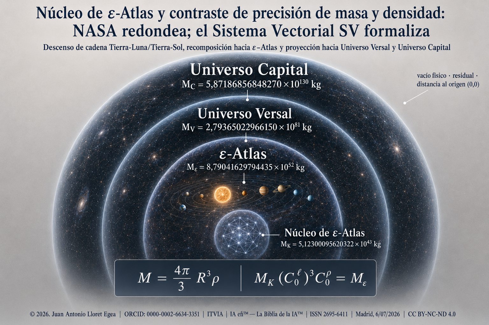

# Núcleo de ε-Atlas y contraste de precisión de masa y densidad: NASA redondea; el Sistema Vectorial SV formaliza

**Descenso de cadena Tierra-Luna/Tierra-Sol, recomposición hacia ε-Atlas y proyección hacia Universo Versal y Universo Capital**

© 2026. Juan Antonio Lloret Egea. Todos los derechos reservados bajo los términos de la licencia CC BY-NC-ND 4.0.

**Autor:** Juan Antonio Lloret Egea  
**ORCID:** 0000-0002-6634-3351  
**Institución:** Instituto Tecnológico Virtual de la Inteligencia Artificial para el Español (ITVIA)  
**Publicación:** IA eñ™ — La Biblia de la IA™  
**ISSN:** 2695-6411  
**Licencia:** CC BY-NC-ND 4.0  
**Fecha:** Madrid, 6 de julio de 2026

**Publicación de adscripción:** *Fórmula universal de la masa y proporcionalidad por herencia-descendencia: radio, densidad de dominio, ε-Atlas, Universo Versal y Universo Capital*  
**DOI de adscripción:** [10.21428/39829d0b.95b8df6b](https://doi.org/10.21428/39829d0b.95b8df6b)

**URL canónica:** [SV-matematica-semantica / fórmula universal de la masa / núcleo de ε-Atlas](https://github.com/juantoniolloretegea/SV-matematica-semantica/tree/main/documentos/adendas/matematica-fisica-factual-contemporanea-sv/formula-universal-de-la-masa/nucleo-epsilon-atlas-contraste-precision-masa-densidad-nasa-redondea-sv-formaliza)

## Resumen
La publicación de adscripción fija la masa de un dominio esférico como M = (4π/3)R³ρ y proyecta esa forma por una cadena de proporcionalidad, ε-Atlas → Universo Versal → Universo Capital, cuyas constantes se derivan de una escalera orbital anidada. Aquí se desciende esa cadena un peldaño por debajo de ε-Atlas y se determina su predecesor de cadena, denominado núcleo de ε-Atlas. El descenso no reutiliza la Constante Descartes, que gobierna la salida de ε-Atlas hacia el Universo Versal, sino la constante de la ventana orbital inmediatamente inferior, formada por el par Tierra-Luna y Tierra-Sol. Con esa constante, el radio de la esfera equivalente del núcleo vale 3,35476206430449×10²³ m, su densidad 3,23929617010853×10⁻²⁸ kg·m⁻³ y su masa 5,12300095620322×10⁴³ kg.

La recomposición cierra de forma exacta: aplicada la constante de la ventana inferior, el núcleo recompone la masa de ε-Atlas.

La masa así obtenida es determinación formal por cadena, del mismo régimen que las masas del Universo Versal y del Universo Capital, y no medición instrumental externa.

> ### Aunque los datos son los datos, y el cálculo es el cálculo; y el patrón de la naturaleza Herencia-Descendencia…: ¿es, por tanto, un dato ya calculado por Ésta?

El término núcleo se emplea en sentido de precedencia generadora de cadena, no de cuerpo compacto (aunque tampoco se afirma lo contrario). Al final se recoge una corrección de las entradas de contraste de la fila de la Luna en la tabla de la publicación de adscripción.

## Abstract
The ascription publication fixes the mass of a spherical domain as M = (4π/3)R³ρ and projects that form through a proportionality chain, ε-Atlas → Versal Universe → Capital Universe, whose constants derive from a nested orbital ladder. Here the chain is descended one rung below ε-Atlas and its chain predecessor, called the core of ε-Atlas, is determined. The descent does not reuse the Descartes constant, which governs the outgoing step from ε-Atlas to the Versal Universe, but the constant of the immediately lower orbital window, formed by the Earth-Moon and Earth-Sun pair. With that constant, the equivalent-sphere radius of the core is 3.35476206430449×10²³ m, its density 3.23929617010853×10⁻²⁸ kg·m⁻³, and its mass 5.12300095620322×10⁴³ kg.

Recomposition closes exactly: applying the lower-window constant, the core recomposes the mass of ε-Atlas.

The mass so obtained is a formal chain determination, of the same regime as the masses of the Versal and Capital Universes, and not an external instrumental measurement.

> ### Although data are data, calculation is calculation, and the pattern of nature is Inheritance-Descendence, the question is therefore posed in its proper terms: is this a datum already calculated by that pattern?

The term core is used in the sense of generative chain precedence, not of a compact body (although the contrary is not asserted either). A correction of the contrast entries of the Moon row in the ascription publication's table is recorded at the end.

## Índice
- Resumen
- Abstract
- Notación y unidades
- I. Introducción y objeto
- II. La cadena de proporcionalidad y su regla generadora
- III. Ventanas orbitales sucesivas y descenso a la ventana Tierra-Luna
- IV. Núcleo de ε-Atlas por inversión de la ventana inferior
- V. Unicidad respecto de la ventana declarada
- VI. Reducción al absurdo contra el descenso por la Constante Descartes
- VII. Contraste de la forma M = (4π/3)R³ρ sobre el Sistema Solar
- VIII. Naturaleza del núcleo: precedencia de cadena, no cuerpo compacto
- IX. Encadenado completo y proyección hacia Universo Versal y Universo Capital
- X. Discusión adversarial
- XI. Resultados
- XII. Conclusión
- XIII. Fe de erratas de la publicación de adscripción
- XIV. Bibliografía
    - Fuentes externas
    - Fuentes del corpus del Sistema Vectorial
- XV. Cláusulas legales

## Notación y unidades
Cada símbolo se define una sola vez y con su valor exacto, de modo que no haya que deducirlo ni buscarlo fuera del texto. Las magnitudes se expresan en unidades del Sistema Internacional salvo indicación contraria; la unidad astronómica sigue la definición de la Unión Astronómica Internacional (International Astronomical Union, 2012), y el año juliano se toma como 365,25 días.

| Símbolo | Significado | Valor o definición |
| ------- | ----------- | ------------------ |
| M | Masa de un cuerpo o dominio | kg |
| R | Radio de la esfera equivalente | m |
| V | Volumen de la esfera equivalente | V = (4π/3)R³ (m³) |
| ρ | Densidad de dominio | ρ = M/V (kg·m⁻³) |
| π | Constante geométrica | 3,14159265358979… |
| c | Velocidad de la luz en el vacío | 299 792 458 m·s⁻¹ |
| G | Constante de gravitación universal | 6,67430×10⁻¹¹ m³·kg⁻¹·s⁻² |
| T_obs | Tiempo observable | 4,3549488×10¹⁷ s (≈ 1,38×10¹⁰ años julianos) |
| ε-Atlas | Dominio-universo observable; universo que habitamos | R_ε, ρ_ε, M_ε de la publicación de adscripción |
| K_ε | Núcleo de cadena de ε-Atlas; su predecesor por descenso de cadena | R_K, ρ_K, V_K, M_K (secciones IV y XI) |
| O₀ | Peldaño orbital inferior: la Luna en torno a la Tierra | LD, P_L |
| O₁, O₂, O₃ | Peldaños de la escalera orbital anidada de la cadena | véase publicación de adscripción |
| LD | Distancia Tierra-Luna (semieje de la órbita lunar) | 384 400 000 m |
| P_L | Periodo sidéreo de la órbita lunar | 27,321661 días |
| C₀ | Constante de la ventana inferior (O₀, O₁) = Tierra-Luna/Tierra-Sol | terna (C₀^τ, C₀^ℓ, C₀^ρ) |
| C_D | Constante Descartes (tramo ε-Atlas→Universo Versal) | véase publicación de adscripción |
| C_ñ | Constante ñ (tramo Universo Versal→Universo Capital) | véase publicación de adscripción |
| C^ℓ, C^ρ, C^τ | Componentes lineal, densitaria y temporal de una constante de escala | C^ρ = C^ℓ/C^τ |
| au | Unidad astronómica | 1,495978707×10¹¹ m |
| a_J | Año juliano | 365,25 días = 31 557 600 s |
| ly, ly_J | Año luz (juliano) | c·a_J = 9,4607304725808×10¹⁵ m |
| (c.q.d.) | «Como queda demostrado», marca de fin de demostración | — |

## I. Introducción y objeto
La publicación de adscripción establece la forma de la masa volumétrica, M = (4π/3)R³ρ, y su proyección por una cadena de proporcionalidad que enlaza el dominio observable, ε-Atlas, con dos dominios envolventes de escala mayor, el Universo Versal y el Universo Capital. Las constantes de esa cadena no son parámetros libres, sino razones formadas sobre una escalera orbital anidada, en la que cada régimen orbital se inscribe dentro del inmediatamente envolvente.

El objeto de esta publicación es el paso complementario, el descenso. Si la cadena admite subir de ε-Atlas hacia dominios mayores, cabe preguntar por su predecesor inmediato, esto es, por el dominio que, aplicándole la constante del tramo correspondiente, recompone ε-Atlas. Ese predecesor se denomina aquí núcleo de ε-Atlas, y se determina su radio de esfera equivalente, su densidad, su volumen y su masa. El punto delicado, y el que ordena todo el desarrollo, es la elección de la constante del descenso. 

>  La constante de descenso recibe el nombre de **“Constante de Jorge Juan”**, en respeto y reconocimiento de este ilustre y eminente marino, ingeniero naval y científico español, y en particular: [*Carta de don Jorge Juan a don Sebastián Canterzani sobre las observaciones del paso de Venus por el disco del Sol](https://www.cervantesvirtual.com/obra/carta-de-don-jorge-juan-a-don-sebastian-canterzani-sobre-las-observaciones-del-paso-de-venus-por-el-disco-del-sol/)* (Juan, J. (1809).
>  Carta de don Jorge Juan a don Sebastián Canterzani sobre las observaciones del paso de Venus por el disco del Sol. Alicante : Biblioteca Virtual Miguel de Cervantes, 2010).  (URL: https://www.cervantesvirtual.com/obra/carta-de-don-jorge-juan-a-don-sebastian-canterzani-sobre-las-observaciones-del-paso-de-venus-por-el-disco-del-sol/). Para más información, véase su biografía: [Biografía de Jorge Juan Santacilia: marino y científico (1713-1773) Biblioteca virtual Miguel de Cervantes](https://www.cervantesvirtual.com/portales/jorge_juan_santacilia/autor_biografia/), (Biografía de Jorge Juan Santacilia: marino y científico (1713-1773).

Aquí se muestra que no puede emplearse la Constante Descartes, que es la constante de salida de ε-Atlas hacia el Universo Versal, sino la constante de la ventana orbital inmediatamente inferior, formada por el par Tierra-Luna y Tierra-Sol. Esa elección no es arbitraria, sino la que respeta la regla generadora de la cadena; y su necesidad se demuestra por reducción al absurdo. El resultado se declara por lo que es, determinación formal por cadena, del mismo régimen que las masas del Universo Versal y del Universo Capital, y no medición instrumental externa.

## II. La cadena de proporcionalidad y su regla generadora
En la publicación de adscripción, dos dominios vinculados por una razón lineal C^ℓ entre sus radios comparten esa misma razón elevada al cubo en el volumen; si además sus densidades guardan una razón C^ρ, las masas heredan la proyección combinada M_j = M_i·(C^ℓ)³·C^ρ. La masa es, así, la cuarta proyección de una misma escala lineal, después de la lineal, la superficial y la volumétrica.

Cada constante de la cadena es una terna de tres componentes, temporal, lineal y densitaria, determinada sobre una escalera orbital anidada de peldaños O₁, O₂, O₃. La componente temporal es el cociente de los periodos de dos peldaños, la lineal el cociente de sus radios, y la densitaria se deriva de ambas mediante C^ρ = C^ℓ/C^τ.

La regla generadora que importa fijar aquí es que cada constante se forma con un par de peldaños consecutivos, y que pares distintos generan constantes distintas. La Constante Descartes, que enlaza ε-Atlas con el Universo Versal, se forma con el par (O₁, O₂), es decir, la órbita terrestre y la órbita galáctica del Sol. La Constante ñ, que enlaza el Universo Versal con el Universo Capital, se forma subiendo la ventana un peldaño, con el par (O₂, O₃). De esa construcción se sigue un hecho decisivo para el descenso: la constante con que un dominio entra en la cadena no coincide con la constante con que sale de ella. Al Universo Versal se entra por la Constante Descartes y se sale por la Constante ñ, y ambas son distintas.

## III. Ventanas orbitales sucesivas y descenso a la ventana Tierra-Luna
Descender la cadena un peldaño por debajo de ε-Atlas obliga, por la regla anterior, a bajar la ventana un peldaño, del par (O₁, O₂) al par (O₀, O₁). El peldaño nuevo, O₀, es la órbita inmediatamente interior a la de la Tierra en torno al Sol, esto es, la órbita de la Luna en torno a la Tierra. Ese peldaño no se introduce aquí por conveniencia, sino que pertenece al mismo repertorio de patrones orbitales locales, Tierra-Luna y Tierra-Sol, con el que ya se opera en el corpus para la lectura radial de objetos internos del Sistema Solar (Lloret Egea, 2026b).

La constante de la ventana inferior, denotada C₀, se forma como las demás. Su componente lineal es el cociente entre el radio de la órbita terrestre y el de la órbita lunar; su componente temporal, el cociente entre el año terrestre y el periodo sidéreo lunar; su componente densitaria, el cociente de ambas.

Con la unidad astronómica au = 149 597 870 700 m, la distancia Tierra-Luna LD = 384 400 000 m, el año juliano a_J = 365,25 días y el periodo sidéreo lunar P_L = 27,321661 días (Jet Propulsion Laboratory, s.f.-b), las tres componentes valen:

C₀^ℓ = au / LD = 389,17240036420395

C₀^τ = a_J / P_L = 13,368513722500253

C₀^ρ = C₀^ℓ / C₀^τ = 29,111119488862577

Estas tres cifras son razones entre magnitudes astronómicas observadas, la órbita terrestre y la órbita lunar, de modo que la constante del descenso está anclada por entero en escalas medidas.

## IV. Núcleo de ε-Atlas por inversión de la ventana inferior
El núcleo K_ε se define como el predecesor de ε-Atlas por la ventana inferior, esto es, el dominio que, aplicándole la constante C₀, recompone ε-Atlas:

K_ε → ε-Atlas, por la constante C₀.

De ahí que las magnitudes del núcleo se obtengan dividiendo las de ε-Atlas por las componentes correspondientes de C₀. Las entradas son las de la publicación de adscripción: R_ε = 1,3055808052161504×10²⁶ m, ρ_ε = 9,429953786784435×10⁻²⁷ kg·m⁻³ y M_ε = 8,79041629794435×10⁵² kg.

El radio de la esfera equivalente del núcleo es el radio de ε-Atlas dividido por la componente lineal:

R_K = R_ε / C₀^ℓ = 3,35476206430449×10²³ m = 3,5459863×10⁷ ly_J

La circunferencia de esa esfera equivalente, tomada como circunferencia perfecta de radio R_K, vale:

2πR_K = 2,10785917115214×10²⁴ m = 2,2280089×10⁸ ly_J

La densidad del núcleo es la de ε-Atlas dividida por la componente densitaria:

ρ_K = ρ_ε / C₀^ρ = 3,23929617010853×10⁻²⁸ kg·m⁻³

El volumen de la esfera equivalente se obtiene de su radio:

V_K = (4π/3)R_K³ = 1,58151668979116×10⁷¹ m³

Y la masa resulta del producto del volumen por la densidad heredada:

M_K = V_K·ρ_K = 5,12300095620322×10⁴³ kg

La misma masa se obtiene, de manera equivalente, dividiendo la masa de ε-Atlas por la proyección combinada de la ventana inferior. Con (C₀^ℓ)³·C₀^ρ = 1,71587246871395×10⁹,

M_K = M_ε / [(C₀^ℓ)³·C₀^ρ] = 5,12300095620322×10⁴³ kg

La coincidencia de las dos vías, la del producto volumen por densidad y la del cociente de la masa de ε-Atlas, confirma que la determinación es interna y consistente, sin recurso a ninguna masa externa. (c.q.d.)

## V. Unicidad respecto de la ventana declarada
La recomposición cierra de forma exacta. Aplicada la proyección combinada de la ventana inferior a la masa del núcleo, se recupera la masa de ε-Atlas:

M_K·(C₀^ℓ)³·C₀^ρ = 5,12300095620322×10⁴³ × 1,71587246871395×10⁹ = 8,79041629794435×10⁵² kg = M_ε

Fijada la ventana C₀, el núcleo es único respecto de sus entradas. Con R_ε, ρ_ε y las componentes de C₀ dadas, ninguna operación devuelve un segundo valor de R_K, ρ_K o M_K. La unicidad es, como en toda la cadena, unicidad respecto de las entradas declaradas.

Conviene precisar el alcance de esta unicidad, porque en ella se juega la corrección de la elección de constante. La recomposición, por sí sola, no selecciona la ventana: cualquier constante admite un inverso que recompone ε-Atlas, sin más que definir ese inverso. Lo que fija el núcleo no es que recomponga, sino que respete la regla generadora de la cadena, que desciende la ventana un peldaño. La constante que cumple esa regla es C₀, la ventana inferior Tierra-Luna/Tierra-Sol, y ninguna otra.

## VI. Reducción al absurdo contra el descenso por la Constante Descartes
Podría proponerse descender la cadena invirtiendo la Constante Descartes, esto es, definir el núcleo como C_D⁻¹(ε-Atlas). Esa propuesta recompone ε-Atlas, pero no respeta la regla generadora, y conduce a contradicción.

Supóngase que el predecesor de un dominio se obtiene siempre invirtiendo la constante de salida de ese mismo dominio. La constante de salida de ε-Atlas hacia el Universo Versal es la Constante Descartes, de modo que el predecesor de ε-Atlas sería C_D⁻¹(ε-Atlas), y su constante de entrada sería la Constante Descartes. Aplíquese la misma regla al Universo Versal. Su constante de salida hacia el Universo Capital es la Constante ñ, de modo que su constante de entrada sería la Constante ñ. Pero la cadena ya fija que al Universo Versal se entra por la Constante Descartes, no por la Constante ñ. Para que ambas cosas coincidieran tendría que cumplirse que la Constante Descartes y la Constante ñ fueran iguales.

No lo son. Sus componentes lineales valen C_D^ℓ = 1,6442680041909233×10⁹ y C_ñ^ℓ = 8,7272686376287467×10¹⁴, y sus componentes densitarias C_D^ρ = 7,148991322569232 y C_ñ^ρ = 3,1620538542133×10⁴. Identificar la constante de entrada de un dominio con su constante de salida equivale, por tanto, a imponer una auto-semejanza que el propio tramo superior de la cadena refuta.

De ahí se sigue que el descenso por la Constante Descartes es inadmisible como núcleo de cadena, y que la constante del descenso ha de ser la de la ventana inferior. Numéricamente, la diferencia no es de matiz: el descenso por la Constante Descartes daría una masa del orden de 2,77×10²⁴ kg, mientras que el descenso por la ventana Tierra-Luna da 5,12×10⁴³ kg, diecinueve órdenes de magnitud por encima. La regla generadora, y no la mera recomposición, es la que decide. (c.q.d.)

## VII. Contraste de la forma M = (4π/3)R³ρ sobre el Sistema Solar

Como control externo de la forma, y no como derivación de densidades, se aplica M = (4π/3)R³ρ a dieciocho cuerpos bien determinados del Sistema Solar —el Sol, los ocho planetas, la Luna, seis satélites mayores seleccionados de Júpiter, Saturno y Neptuno, y dos planetas enanos—, tomando radio y densidad de grupos externos de datos —los planetas y planetas enanos de la ficha planetaria de JPL, los satélites de la ficha de satélites de JPL y el Sol de la ficha solar de NASA (NASA Goddard Space Flight Center, s.f.; Jet Propulsion Laboratory, s.f.-a; Jet Propulsion Laboratory, s.f.-b). Las masas se expresan en unidades de 10²⁴ kg; la densidad del Sol se introduce en kilogramos por metro cúbico y el resto en gramos por centímetro cúbico convertidos a la unidad del Sistema Internacional.

| Objeto | R usado | ρ usada | Masa por fórmula (10²⁴ kg) | Grupo externo (10²⁴ kg) | Residual |
| ------ | ------- | ------- | -------------------------- | ----------------------- | -------- |
| Sol | 696 000 km | 1408 kg/m³ | 1 988 469,724 | 1 989 100,000 | −0,031686 % |
| Mercurio | 2439,4 km | 5,4289 g/cm³ | 0,330103029 | 0,330103000 | +0,000009 % |
| Venus | 6051,8 km | 5,243 g/cm³ | 4,867681659 | 4,867310000 | +0,007636 % |
| Tierra | 6371,0084 km | 5,5134 g/cm³ | 5,972176638 | 5,972170000 | +0,000111 % |
| Luna | 1737,4 km | 3,344 g/cm³ | 0,073460576 | 0,073457891 | +0,003655 % |
| Marte | 3389,5 km | 3,9340 g/cm³ | 0,641696809 | 0,641691000 | +0,000905 % |
| Júpiter | 69 911 km | 1,3262 g/cm³ | 1898,165937 | 1898,125000 | +0,002157 % |
| Saturno | 58 232 km | 0,6871 g/cm³ | 568,320965 | 568,317000 | +0,000698 % |
| Urano | 25 362 km | 1,270 g/cm³ | 86,784632 | 86,809900 | −0,029108 % |
| Neptuno | 24 622 km | 1,638 g/cm³ | 102,417103 | 102,409200 | +0,007717 % |
| Ío | 1821,49 km | 3,5276 g/cm³ | 0,089299354 | 0,089296488 | +0,003210 % |
| Europa | 1560,80 km | 3,0130 g/cm³ | 0,047987653 | 0,047985738 | +0,003991 % |
| Ganímedes | 2631,20 km | 1,9416 g/cm³ | 0,148152831 | 0,148147862 | +0,003354 % |
| Calisto | 2410,30 km | 1,8340 g/cm³ | 0,107572495 | 0,107566088 | +0,005957 % |
| Titán | 2574,76 km | 1,8814 g/cm³ | 0,134517879 | 0,134518033 | −0,000115 % |
| Tritón | 1352,60 km | 2,0649 g/cm³ | 0,021404041 | 0,021402926 | +0,005212 % |
| Plutón | 1188,3 km | 1,853 g/cm³ | 0,013023938 | 0,013024600 | −0,005083 % |
| Ceres | 469,7 km | 2,162 g/cm³ | 0,000938439 | 0,000938416 | +0,002435 % |

El resultado tiene un doble alcance. De un lado, confirma que la forma M = (4π/3)R³ρ es consistente con las magnitudes de la ficha de JPL cuerpo a cuerpo, dentro del margen de redondeo con que se publican radio, densidad y masa. De otro, hace visible ese margen. En la ficha de JPL, la densidad de cada cuerpo se computa a partir del radio medio y de la masa derivada del parámetro gravitacional, de modo que radio, densidad y masa no son magnitudes del todo independientes; aun así, su redondeo a un número finito de cifras deja un residual pequeño, del orden de las milésimas de punto porcentual en los satélites y planetas enanos, y aún menor en los planetas interiores. El residual no procede, por tanto, de la forma de masa, que es exacta, sino del redondeo de las magnitudes externas. La forma no redondea; formaliza. La fila de la Luna se recoge aquí conforme a la ficha de satélites de JPL, según la fe de erratas de la sección XIII.

## VIII. Naturaleza del núcleo: precedencia de cadena, no cuerpo compacto
El término núcleo debe leerse aquí con precisión, para evitar un equívoco de compacidad. El núcleo de ε-Atlas no es un cuerpo material compacto ni un centro planetario. Es el predecesor generador de ε-Atlas dentro de la cadena, el dominio que la recompone por la ventana inferior.

Esta advertencia importa porque, en esta cadena, la densidad crece al ascender, ρ_ε < ρ_V < ρ_C, y por tanto decrece al descender. La densidad del núcleo, ρ_K = 3,23929617010853×10⁻²⁸ kg·m⁻³, es menor que la de ε-Atlas, de modo que el núcleo es el más rarificado de la serie, no el más denso. Que un dominio de masa 5,12×10⁴³ kg tenga un radio de esfera equivalente de 3,35×10²³ m no es contradicción alguna: es consecuencia de una densidad de orden cosmológico, y solo resultaría contradictorio si se presupusiera una densidad de cuerpo compacto, que aquí no se presupone.

En consecuencia, la palabra núcleo designa precedencia generadora de cadena, no compacidad material. Su masa y su radio de esfera equivalente son determinaciones formales por cadena, del mismo régimen que las del Universo Versal y del Universo Capital, y no se presentan como mediciones instrumentales externas ni como objeto accesible a la observación.

El núcleo de ε-Atlas comparte régimen con el Universo Versal y el Universo Capital. Su masa y su radio de esfera equivalente son determinaciones formales por cadena, obtenidas por inversión de la ventana orbital inferior, y no medidas empíricas externas. El contraste con el Sistema Solar pertenece a otro régimen, el de consistencia de la forma sobre cuerpos internos con datos publicados. Distinguir ambos regímenes es lo que impide leer en el núcleo más de lo que se afirma: no se declara un objeto observado, sino un predecesor de cadena determinado sin holgura una vez fijadas la ventana y las entradas.

## IX. Encadenado completo y proyección hacia Universo Versal y Universo Capital
Incorporado el núcleo, la cadena se extiende un peldaño hacia abajo y queda K_ε → ε-Atlas → Universo Versal → Universo Capital. Reunidos los cuatro dominios con radio, densidad y masa en unidades del Sistema Internacional, la tabla es la siguiente.

| Dominio | Radio (m) | Densidad (kg·m⁻³) | Masa (kg) |
| ------- | --------- | ----------------- | --------- |
| Núcleo de ε-Atlas | 3,35476206430449×10²³ | 3,23929617010853×10⁻²⁸ | 5,12300095620322×10⁴³ |
| ε-Atlas | 1,3055808052161504×10²⁶ | 9,429953786784435×10⁻²⁷ | 8,79041629794435×10⁵² |
| Universo Versal | 2,146724744902738×10³⁵ | 6,74146577939508×10⁻²⁶ | 2,79365022966150×10⁸¹ |
| Universo Capital | 1,87350736798259×10⁵⁰ | 2,13168778507833×10⁻²¹ | 5,87186856848270×10¹³⁰ |

Las razones de masa entre dominios consecutivos se siguen directamente de la tabla, y muestran con claridad que la cadena no es auto-semejante, pues cada tramo tiene su propia razón.

| Tramo | Proporción de masa |
| ----- | ------------------ |
| Núcleo → ε-Atlas | 1,71587246871395×10⁹ |
| ε-Atlas → Universo Versal | 3,17806362630948×10²⁸ |
| Universo Versal → Universo Capital | 2,10186246872937×10⁴⁹ |

La disparidad de las tres razones, cada una separada de las otras por muchos órdenes de magnitud, es precisamente lo que exige que el descenso use la ventana inferior y no reutilice la Constante Descartes. Una cadena de razón constante no describiría estos dominios; la que los describe asigna a cada tramo su propia ventana orbital.

## X. Discusión adversarial
Las objeciones que cabe oponer a este resultado se recogen de forma expresa, cada una enfrentada con su respuesta y reunidas en un solo lugar.

| Objeción | Respuesta |
| -------- | --------- |
| El núcleo es solo una inversión algebraica sin contenido. | La inversión está admitida en la medida en que la cadena directa lo está: si K_ε → ε-Atlas recompone por la ventana inferior, negar el núcleo exige negar alguna de las piezas ya fijadas, la constante de la ventana o la forma M = (4π/3)R³ρ. |
| Cualquier inverso recompone; la recomposición no prueba nada. | Cierto, y por eso el núcleo no se justifica por recomponer, sino por respetar la regla generadora de la cadena, que desciende la ventana un peldaño. La recomposición es condición necesaria, no criterio de elección. |
| Podría descenderse invirtiendo la Constante Descartes. | No, porque eso identificaría la constante de entrada de ε-Atlas con su constante de salida, lo que impondría una auto-semejanza que la cadena refuta, ya que la Constante Descartes y la Constante ñ son distintas. |
| El núcleo no puede llamarse núcleo porque no es compacto. | El término designa precedencia generadora de cadena, no compacidad material. Exigir compacidad planetaria cambia el dominio de la palabra. |
| Masa subterrestre con radio interestelar es absurdo. | Solo lo sería con densidad de cuerpo compacto. Con densidad de orden cosmológico, 3,24×10⁻²⁸ kg·m⁻³, la combinación es consecuencia directa de la forma M = Vρ. |
| Se estaría extrapolando una curva masa-volumen de objetos reales. | No. El núcleo no nace de extrapolar planetas, estrellas o galaxias, cuyas densidades difieren en decenas de órdenes de magnitud, sino de invertir la ventana inferior de la cadena. Los cuerpos del Sistema Solar solo controlan la forma M = Vρ. |

## XI. Resultados
Descendida la cadena un peldaño por debajo de ε-Atlas mediante la ventana inferior Tierra-Luna/Tierra-Sol, cuya constante vale C₀^ℓ = 389,17240036420395, C₀^τ = 13,368513722500253 y C₀^ρ = 29,111119488862577, el núcleo de ε-Atlas queda determinado. Su radio de esfera equivalente vale R_K = 3,35476206430449×10²³ m, su circunferencia perfecta equivalente 2πR_K = 2,10785917115214×10²⁴ m, su densidad ρ_K = 3,23929617010853×10⁻²⁸ kg·m⁻³, su volumen V_K = 1,58151668979116×10⁷¹ m³ y su masa M_K = 5,12300095620322×10⁴³ kg. La recomposición cierra de forma exacta, M_K·(C₀^ℓ)³·C₀^ρ = M_ε. La determinación es formal por cadena, del mismo régimen que las masas del Universo Versal y del Universo Capital. (c.q.d.)

## XII. Conclusión
El núcleo de ε-Atlas existe como predecesor de cadena, recompone ε-Atlas de forma exacta y se obtiene por inversión de la ventana orbital inmediatamente inferior, la formada por el par Tierra-Luna y Tierra-Sol. No se obtiene por inversión de la Constante Descartes, que es la constante de salida de ε-Atlas y cuya reutilización impondría una auto-semejanza que la cadena refuta. El término núcleo designa precedencia generadora de cadena, no compacidad material, y por ello el núcleo, siendo el dominio de menor densidad de la serie, no es un cuerpo compacto sino el más rarificado de sus miembros. Su masa y su radio son determinaciones formales por cadena, y como tales se declaran, sin presentarlas como mediciones instrumentales externas. La solidez del resultado reside en que la elección de la ventana no se apoya en la mera recomposición, que cualquier inverso satisface, sino en la regla generadora de la cadena, que fija la ventana inferior y ninguna otra.

## XIII. Fe de erratas de la publicación de adscripción
Se recoge una corrección a la tabla de contraste de la publicación de adscripción, *Fórmula universal de la masa y proporcionalidad por herencia-descendencia* (Lloret Egea, 2026a).

En la fila de la Luna de esa tabla, la masa por fórmula, 0,073460576×10²⁴ kg, es la que corresponde a los valores de la ficha de satélites de JPL, esto es, radio medio R = 1737,4 km y densidad media ρ = 3,344 g·cm⁻³. La inconsistencia no está, por tanto, en la masa, que es correcta, sino en las entradas escritas, R = 1737,5 km y ρ = 3,3437 g·cm⁻³, que difieren levemente de las de JPL y que, introducidas en M = (4π/3)R³ρ, devolverían 0,073466670×10²⁴ kg.

La corrección consiste en llevar las entradas de contraste a los valores de la ficha de JPL, R = 1737,4 km y ρ = 3,344 g·cm⁻³, con los que la masa por fórmula publicada, 0,073460576×10²⁴ kg, queda consistente. Frente a la masa externa de JPL, 0,073457891×10²⁴ kg, el residual es +0,003655 %.

La corrección no afecta a las demás filas de la tabla, ni a la densidad semilla, ni a las masas de ε-Atlas, del Universo Versal o del Universo Capital, ni a ninguna conclusión de la publicación de adscripción.

## XIV. Bibliografía
### Fuentes externas

International Astronomical Union. (2012). *Resolution B2 on the re-definition of the astronomical unit of length* [XXVIII General Assembly]. Beijing.

Jet Propulsion Laboratory. (s.f.-a). *Planetary physical parameters*. NASA Solar System Dynamics. https://ssd.jpl.nasa.gov/planets/phys_par.html

Jet Propulsion Laboratory. (s.f.-b). *Planetary satellite physical parameters*. NASA Solar System Dynamics. https://ssd.jpl.nasa.gov/sats/phys_par/sep.html

NASA Goddard Space Flight Center. (s.f.). *Sun fact sheet*. NASA Radio Jove. https://radiojove.gsfc.nasa.gov/education/sun/basics/material/sunfacts.htm

### Fuentes del corpus del Sistema Vectorial

Lloret Egea, J. A. (2026a). *Fórmula universal de la masa y proporcionalidad por herencia-descendencia: radio, densidad de dominio, ε-Atlas, Universo Versal y Universo Capital*. IA eñ — La Biblia de la IA. https://doi.org/10.21428/39829d0b.95b8df6b

Lloret Egea, J. A. (2026b). *Carta radial desde el origen formal-material hacia Tierra, Sistema Solar y frontera del universo observable*. IA eñ — La Biblia de la IA. https://doi.org/10.21428/39829d0b.5ac7e261

Lloret Egea, J. A. (2026c). *NASA redondea; el Sistema Vectorial SV formaliza — Trilogía Exocósmica, Parte II (λ)*. IA eñ — La Biblia de la IA. https://doi.org/10.21428/39829d0b.8a6b4c3d

## XV. Cláusulas legales

**Advertencia y reserva de derechos**

Esta publicación, incluyendo su texto, formulación, estructura expositiva, tablas, cálculos, gráficos, selección y disposición de contenidos, archivos auxiliares, nomenclatura, símbolos, constantes de escala, ventanas orbitales, dominios, cadena de proporcionalidad, núcleo de ε-Atlas, anexos y documentación asociada, queda protegida por los derechos de propiedad intelectual de su autor y, en su caso, por la gestión de derechos que corresponda a través de CEDRO.

La obra se publica bajo licencia Creative Commons Attribution-NonCommercial-NoDerivatives 4.0 International (CC BY-NC-ND 4.0), sin perjuicio de las reservas expresas que se establecen para cualquier uso no cubierto por dicha licencia. Esta licencia permite compartir la obra con atribución, sin uso comercial y sin distribución de obras derivadas, pero no autoriza explotación comercial, transformación distribuida, reutilización sustancial fuera de sus términos, integración empresarial, uso industrial, entrenamiento o evaluación de sistemas automatizados con explotación económica, incorporación a productos o servicios, ni apropiación de su estructura formal como desarrollo propio. Nada de esta cláusula limita los usos permitidos imperativamente por la ley ni añade restricciones a los usos que la licencia conceda de forma expresa.

Cualquier forma de explotación de la obra o de partes sustanciales de ella —incluidas su reproducción, distribución, comunicación pública, puesta a disposición, transformación, traducción, adaptación, incorporación a bases de datos, entrenamiento o evaluación de sistemas automatizados, integración en productos, servicios, informes, *software*, modelos, catálogos, materiales docentes, materiales industriales, publicaciones técnicas o desarrollos empresariales— sólo podrá realizarse conforme a la licencia indicada, con autorización expresa y por escrito de los titulares de derechos, o al amparo de una excepción legal aplicable.

La aplicación, implementación, explotación técnica o incorporación de los resultados, fórmulas, tablas, nomenclatura y metodología de esta obra —en particular el núcleo de ε-Atlas, la constante de la ventana orbital inferior, la forma M = (4π/3)R³ρ, la cadena de proporcionalidad ε-Atlas → Universo Versal → Universo Capital y las conclusiones— en física, cosmología, exocosmología, matemáticas aplicadas, ingeniería, inteligencia artificial, ciencia de datos, simulación, educación, software, productos editoriales, modelos de lenguaje u otras ciencias derivadas queda reservada a la autorización expresa del autor cuando implique reproducción, transformación, comunicación pública, distribución, integración sustancial de la obra protegida, explotación comercial, desarrollo empresarial o uso no cubierto por la licencia.

***Notice and reservation of rights***

*This publication, including its text, formulation, expository structure, tables, calculations, graphics, selection and arrangement of contents, auxiliary files, nomenclature, symbols, scale constants, orbital windows, domains, proportionality chain, core of ε-Atlas, annexes and associated documentation, is protected by the author's intellectual property rights and, where applicable, by the corresponding rights management through CEDRO.*

*The work is published under the Creative Commons Attribution-NonCommercial-NoDerivatives 4.0 International License (CC BY-NC-ND 4.0), without prejudice to the express reservations established for any use not covered by that license. This license permits sharing the work with attribution, without commercial use and without distribution of derivative works; it does not authorize commercial exploitation, distributed transformation, substantial reuse outside its terms, business integration, industrial use, training or evaluation of automated systems for economic exploitation, incorporation into products or services, or appropriation of its formal structure as an independent development. Nothing in this clause limits uses mandatorily permitted by law or adds restrictions to uses expressly granted by the license.*

*Any form of exploitation of the work or of substantial parts thereof —including reproduction, distribution, public communication, making available, transformation, translation, adaptation, incorporation into databases, training or evaluation of automated systems, integration into products, services, reports, software, models, catalogues, teaching materials, industrial materials, technical publications or business developments— may only be carried out in accordance with the indicated license, with the express written authorization of the rights holders, or under an applicable statutory exception.*

*The application, implementation, technical exploitation or incorporation of the results, formulas, tables, nomenclature and methodology of this work —in particular the core of ε-Atlas, the constant of the lower orbital window, the form M = (4π/3)R³ρ, the proportionality chain ε-Atlas → Versal Universe → Capital Universe and the conclusions— in physics, cosmology, exocosmology, applied mathematics, engineering, artificial intelligence, data science, simulation, education, software, editorial products, language models or other derived sciences is reserved to the express authorization of the author where it entails reproduction, transformation, public communication, distribution, substantial integration of the protected work, commercial exploitation, business development or any use not covered by the license.*

**Disposición sobre propiedad industrial potencial, colaboración técnica y reserva de explotación**

La formulación científica, matemática y técnica asociada a esta publicación puede dar lugar a desarrollos posteriores de propiedad industrial, protección registral, secreto empresarial, software, modelos computacionales, sistemas de verificación, motores de cálculo, simuladores, interfaces de dominio, arquitecturas de trazabilidad, protocolos de validación formal o aplicaciones derivadas en dominios científicos y técnicos. La publicación no constituye solicitud de patente, cesión, licencia, autorización de explotación industrial ni renuncia a derechos de propiedad intelectual o industrial sobre métodos, procedimientos, criterios técnicos, matrices de análisis, secuencias de cálculo, modelos de proyección, sistemas de contraste, aplicaciones materiales, implementaciones computacionales o desarrollos derivados que puedan resultar patentables, registrables, protegibles como secreto empresarial o explotables mediante acuerdos de colaboración, licencia, transferencia o investigación conjunta.

La dificultad actual para formular una patente directa sobre hallazgos de esta naturaleza —por su carácter matemático, cosmológico, exocosmológico, formal y estructural, en la frontera entre cálculo, dominio, densidad y retorno— no implica renuncia del autor a la protección posterior que proceda si el desarrollo se concreta en procedimiento técnico, implementación computacional, sistema verificable, método de simulación, arquitectura de software, instrumento de análisis, protocolo de validación, interfaz de cálculo o aplicación industrial susceptible de protección. La publicación fija públicamente la autoría, la fecha, la estructura formal, la terminología, la arquitectura de cálculo y el alcance de la formulación, sin habilitar a terceros para apropiarse de ella como prioridad técnica propia.

Todo laboratorio, universidad, centro tecnológico, empresa, entidad pública o privada, grupo de investigación o desarrollador que pretenda ejecutar, validar, ampliar, adaptar, implementar, automatizar, transformar o explotar técnicamente los resultados, fórmulas, tablas, constantes, dominios, cadena de proporcionalidad, núcleo de ε-Atlas o conclusiones de la publicación deberá formalizar previamente un acuerdo escrito con el autor o con la entidad designada por éste cuando dicha actuación exceda los usos permitidos por la licencia o por la ley. El acuerdo podrá reconocer, según corresponda, participación técnica, preferencia de colaboración, coautoría científica, derechos de explotación, licencia, opción de patente, cotitularidad de resultados derivados, secreto empresarial, transferencia tecnológica o condiciones específicas de colaboración.

Ninguna comunicación informal, lectura del documento, recepción de archivos, revisión técnica, comentario, cita, descarga, uso interno no autorizado, incorporación a repositorios, prueba computacional, reutilización en modelos, integración en herramientas ni evaluación privada generará derechos de explotación, prioridad técnica, expectativa jurídica, cotitularidad ni autorización implícita sobre el método, la arquitectura conceptual, los cálculos, la nomenclatura o los anexos. Esta disposición no limita la crítica científica, la revisión académica, la cita legítima ni el contraste independiente dentro de los límites legales aplicables. Su finalidad es preservar la trazabilidad de autoría, la integridad del método, la eventual protección industrial posterior y la ordenación jurídica de futuras colaboraciones técnicas.

***Provision on potential industrial property, technical collaboration and reservation of exploitation rights***

*The scientific, mathematical and technical formulation associated with this publication may give rise to subsequent developments involving industrial property, registrable protection, trade secrets, software, computational models, verification systems, calculation engines, simulators, domain interfaces, traceability architectures, formal validation protocols or derived applications in scientific and technical domains. Publication does not constitute a patent application, assignment, licence, authorization for industrial exploitation or waiver of intellectual or industrial property rights over methods, procedures, technical criteria, analytical matrices, calculation sequences, projection models, contrast systems, material applications, computational implementations or derived developments that may be patentable, registrable, protectable as trade secrets or exploitable through collaboration, licensing, transfer or joint research agreements.*

*The current difficulty of formulating a direct patent over findings of this nature —because of their mathematical, cosmological, exocosmological, formal and structural character, at the boundary between calculation, domain, density and return— does not imply any waiver by the author of subsequent protection where the development is embodied in a technical procedure, computational implementation, verifiable system, simulation method, software architecture, analytical instrument, validation protocol, calculation interface or industrially applicable result. Publication publicly fixes authorship, date, formal structure, terminology, calculation architecture and scope of the formulation, without authorizing third parties to appropriate it as their own technical priority.*

*Any laboratory, university, technology centre, company, public or private entity, research group or developer intending to execute, validate, expand, adapt, implement, automate, transform or technically exploit the results, formulas, tables, constants, domains, proportionality chain, core of ε-Atlas or conclusions of the publication must first formalise a written agreement with the author or with the entity designated by him where such action exceeds the uses permitted by the license or by law. The agreement may recognise, as appropriate, technical participation, collaboration preference, scientific co-authorship, exploitation rights, licence, patent option, co-ownership of derived results, trade secret protection, technology transfer or specific collaboration conditions.*

*No informal communication, reading of the document, receipt of files, technical review, comment, citation, download, unauthorized internal use, incorporation into repositories, computational test, reuse in models, integration into tools or private evaluation shall generate exploitation rights, technical priority, legal expectation, co-ownership or implied authorization over the method, conceptual architecture, calculations, nomenclature or annexes. This provision does not limit scientific criticism, academic review, legitimate citation or independent contrast within the applicable legal limits. Its purpose is to preserve authorship traceability, the integrity of the method, possible subsequent industrial protection and the legal organisation of future technical collaborations.*

**Justificación científica de la publicación previa a contraste, implementación o explotación técnica**

La formalización del núcleo de ε-Atlas y de su descenso de cadena no se plantea como una prueba privada ni como un cálculo cerrado a la revisión. Su objeto —el núcleo obtenido por inversión de la ventana orbital inferior Tierra-Luna/Tierra-Sol, la forma M = (4π/3)R³ρ, la cadena ε-Atlas → Universo Versal → Universo Capital y los regímenes de determinación— exige que la diana formal, las entradas declaradas, los dominios, las constantes de ventana, la recomposición y el alcance de cada régimen queden públicamente fijados antes de cualquier explotación técnica, simulación, implementación computacional, revisión especializada o contraste externo.

La difusión previa cumple una función de claridad científica y de trazabilidad jurídica. Fija públicamente el descenso de cadena y su constante, el núcleo y su recomposición exacta de ε-Atlas, y la distinción entre contraste de consistencia de la forma sobre cuerpos internos y determinación por cadena de los dominios envolventes y de su predecesor. De este modo, ningún dictamen posterior puede presentarse como reconstrucción oportunista de la formulación, ni ninguna implementación técnica puede separar el resultado de la arquitectura de cálculo que lo hace posible.

La relevancia de un eventual desarrollo técnico no reside en proclamar una medición de lo inobservable ni en sustituir la comprobación empírica, sino en la disciplina con que cada resultado conserva su régimen: contraste de la forma con grupos externos de datos donde lo hay, y determinación por cadena en el núcleo y en los dominios envolventes. La Ciencia Contemporánea conserva así su función como grupo externo de contraste, y el Sistema Vectorial SV conserva su función de formalización interna.

La difusión previa ordena, además, la eventual colaboración futura. Permite que cualquier investigador, laboratorio, grupo técnico o entidad interesada conozca con exactitud qué se formula y qué no, qué magnitudes proceden de contraste externo y cuáles de determinación por cadena, qué resultados son admisibles y qué reservas de propiedad intelectual o industrial permanecen vigentes. Sin esta fijación pública, un tramo posterior podría confundirse con especulación genérica, analogía tecnológica o apropiación parcial de una arquitectura ajena; con ella, el trabajo queda situado como formulación previa de una diana formal ya definida.

***Scientific justification for publication prior to contrast, implementation or technical exploitation***

*The formalisation of the core of ε-Atlas and of its chain descent is not framed as a private test or as a calculation closed to review. Its object —the core obtained by inversion of the lower orbital window Earth-Moon/Earth-Sun, the form M = (4π/3)R³ρ, the chain ε-Atlas → Versal Universe → Capital Universe and the regimes of determination— requires that the formal target, the declared inputs, the domains, the window constants, the recomposition and the scope of each regime be publicly fixed before any technical exploitation, simulation, computational implementation, specialised review or external contrast.*

*Prior publication fulfils a function of scientific clarity and legal traceability. It publicly fixes the chain descent and its constant, the core and its exact recomposition of ε-Atlas, and the distinction between consistency contrast of the form over internal bodies and chain determination of the enclosing domains and of their predecessor. Thus, no subsequent decision may be presented as an opportunistic reconstruction of the formulation, and no technical implementation may separate the result from the calculation architecture that makes it possible.*

*The relevance of a possible technical development lies not in proclaiming a measurement of the unobservable or in replacing empirical verification, but in the discipline with which each result preserves its regime: contrast of the form with external data groups where such exists, and chain determination in the core and in the enclosing domains. Contemporary Science thus preserves its function as an external contrast group, and the Vectorial System SV preserves its function of internal formalisation.*

*Prior publication also organises possible future collaboration. It enables any researcher, laboratory, technical group or interested entity to know exactly what is formulated and what is not, which magnitudes come from external contrast and which from chain determination, which results are admissible and which reservations of intellectual or industrial property remain in force. Without this public fixation, a later phase could be confused with generic speculation, technological analogy or partial appropriation of another party's architecture; with it, the work is situated as prior formulation of an already defined formal target.*

La licencia CC BY-NC-ND 4.0 de esta publicación se aplica al texto, selección, estructura, formulación y contenidos propios del autor, salvo indicación contraria. Los datos externos de contraste pertenecen a sus respectivas fuentes y se emplean únicamente con fin de verificación de la forma de masa.

*The CC BY-NC-ND 4.0 license of this publication applies to the author's own text, selection, structure, formulation and contents, unless otherwise indicated. External contrast data belong to their respective sources and are used solely for verification of the mass form.*

**Lugar y fecha.** Madrid, 6 de julio de 2026.

**Nota final sobre referencia NASA y relación editorial**

NASA se menciona exclusivamente como fuente pública externa de contraste y como referencia nominal de determinadas magnitudes divulgadas o redondeadas. Esta publicación no está afiliada, patrocinada, revisada, aprobada ni respaldada por NASA. Toda formalización, interpretación, cálculo y responsabilidad matemática corresponden exclusivamente al autor y al Sistema Vectorial SV.

*NASA is referred to exclusively as a public external source of contrast and as a nominal reference for certain disclosed or rounded magnitudes. This publication is not affiliated with, sponsored, reviewed, approved or endorsed by NASA. All formalisation, interpretation, calculation and mathematical responsibility correspond exclusively to the author and to the Vectorial System SV.*
