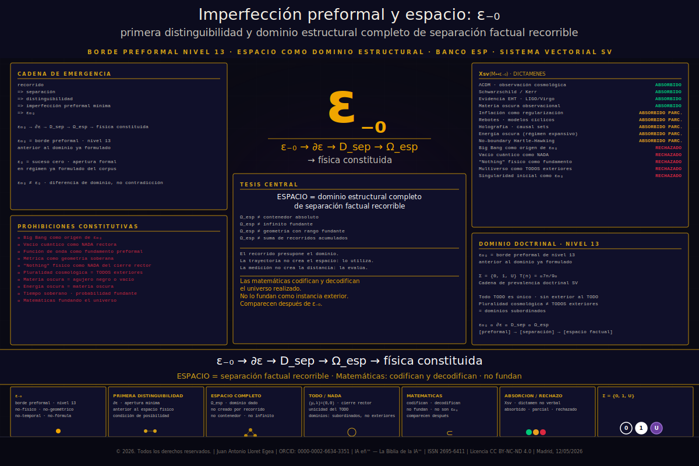

# Imperfección preformal y espacio

<p align="center">
  
</p>

**© 2026. Todos los derechos reservados.** | **Juan Antonio Lloret Egea** | ORCID: [0000-0002-6634-3351](https://orcid.org/0000-0002-6634-3351) | Instituto Tecnológico Virtual de la Inteligencia Artificial para el Español™ (ITVIA) | IA eñ™ — La Biblia de la IA™ | ISSN 2695-6411 | Licencia CC BY-NC-ND 4.0 | Madrid, 11/05/2026

## Publicación

- Documento canónico: [`imperfeccion-preformal-y-espacio.md`](imperfeccion-preformal-y-espacio.md)
- Portada SVG para GitHub: [`imagenes/portada.svg`](imagenes/portada.svg)
- Portada PNG para PubPub: [`imagenes/portada.png`](imagenes/portada.png)
- Laboratorios reproducibles: [`laboratorios/`](laboratorios/)
- Índice técnico de laboratorios: [`laboratorios/README.md`](laboratorios/README.md)

## Estructura

```text
imperfeccion-preformal-y-espacio/
├── README.md
├── imperfeccion-preformal-y-espacio.md
├── imagenes/
│   ├── portada.svg
│   └── portada.png
├── PDF/
└── laboratorios/
    ├── README.md
    ├── catalogo_errores.csv
    ├── datos/
    ├── esquemas/
    ├── validadores/
    ├── runner/
    ├── salidas_esperadas/
    └── registros/
```

## Nota de uso

El documento principal contiene el desarrollo doctrinal, físico-factual y transductivo completo. Los laboratorios reproducibles verifican, mediante datos canónicos, residuales, casos negativos y ejecutor maestro, que los bancos de contraste no aceptan pases silenciosos ni sustituciones indebidas de fundamento.
