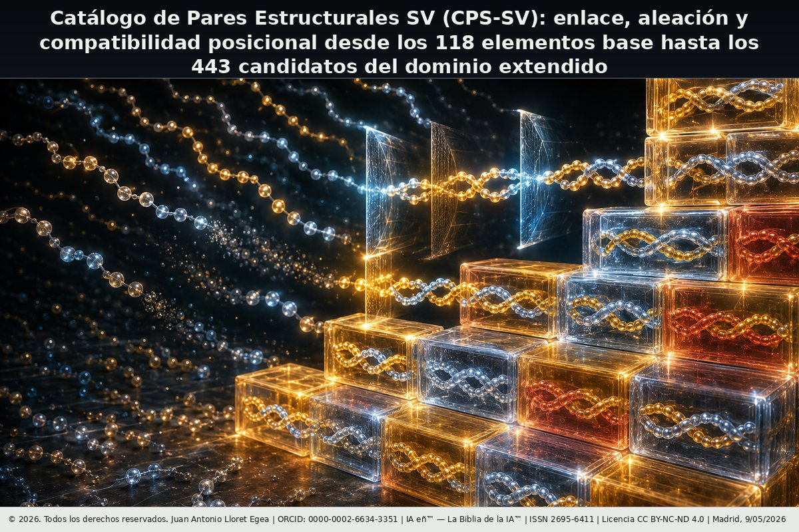

# Catálogo de Pares Estructurales SV (CPS-SV)

## Enlace, aleación y compatibilidad posicional desde los 118 elementos base hasta los 443 candidatos del dominio extendido



**Autor:** Juan Antonio Lloret Egea | ORCID: [0000-0002-6634-3351](https://orcid.org/0000-0002-6634-3351)  
**Institución:** Instituto Tecnológico Virtual de la Inteligencia Artificial para el Español™ (ITVIA)  
**Publicación:** IA eñ™ — La Biblia de la IA™ | **ISSN:** 2695-6411  
**Licencia:** CC BY-NC-ND 4.0 | **Fecha:** Madrid, 09/05/2026  
**DOI:** pendiente de asignación (HCOMMONS)

---

## Descripción

El CPS-SV establece los cinco criterios de admisibilidad de enlace estructural (B.1–B.5), el Teorema de predominancia de U (Teorema 1.6.1) y la función de dictamen D(A,B) sobre el dominio completo de 97.903 pares no ordenados del catálogo SV-443.

**Resultado canónico del laboratorio:**

| Dictamen | Pares | % |
|---|---|---|
| APTO-M (metálico estructural) | 9.515 | 9,7% |
| APTO-C (covalente estructural) | 37.580 | 38,4% |
| APTO-I (iónico estructural) | 5.075 | 5,2% |
| NO-APTO | 45.733 | 46,7% |
| **APTO total** | **52.170** | **53,3%** |

---

## Contenido del repositorio

```
catalogo-pares-estructurales/
├── catalogo-pares-estructurales.md    ← Publicación completa
├── README.md                          ← Este archivo
├── imagenes/
│   ├── Portada.png                    ← Portada de la publicación
│   ├── tabla_cero_sv.svg              ← Tabla Cero SV (vectorial)
│   ├── tabla_cero_sv.png              ← Tabla Cero SV (PNG 2×)
│   ├── tabla_global_sv.svg            ← Tabla Global SV (vectorial)
│   ├── tabla_global_sv.png            ← Tabla Global SV (PNG 2×)
│   └── registros-criptograficos/     ← Sellos OTS y firmas
├── PDF/                               ← PDF firmado (pendiente de depósito)
└── laboratorios/
    ├── runner.py                      ← Punto de entrada del laboratorio
    ├── src/
    │   └── sv_cps.py                  ← Módulo central CPS-SV
    ├── datos/
    │   ├── tabla_global_sv443.csv     ← Tabla Global (443 elementos)
    │   └── catalogo_pares_sv443.csv  ← CPS-SV completo (97.903 pares)
    └── resultados/
        └── verificacion_cps_sv.json  ← Verificación canónica
```

## Tablas estructurales SV

| Tabla | SVG | OTROS |
|---|---|---|
| Tabla Cero SV (118 elementos base) | [tabla_cero_sv.svg](imagenes/tabla_cero_sv.svg) | [tabla_cero_sv.png](imagenes/tabla_cero_sv.png) |
| Tabla Global SV (443 elementos) | [tabla_global_sv.svg](imagenes/tabla_global_sv.svg) | [tabla_global_sv_vectorial.pdf](https://github.com/juantoniolloretegea/SV-matematica-semantica/blob/main/documentos/adendas/matematica-fisica-factual-contemporanea-sv/quimica-factual-y-ciencia-de-materiales-sv/catalogo-pares-estructurales/imagenes/tabla_global_sv_vectorial.pdf) |

## Laboratorio reproducible

**Ejecución:**
```bash
cd laboratorios
PYTHONPATH=src python3 runner.py
```

**Depósito Zenodo:** Pendiente

## Publicación base

**Catálogo SV-443:** [DOI 10.17613/8ryyb-g9h48](https://doi.org/10.17613/8ryyb-g9h48)

---

## Identificación DOI

- DOI de la publicación: **pendiente de asignación (HCOMMONS)**
- DOI del laboratorio canónico: [10.5281/zenodo.20084771](https://doi.org/10.5281/zenodo.20084771)

## Registro criptográfico de referencia

| Fichero | Función | SHA-256 |
|---|---|---|
| `catalogo-pares-estructurales.pdf` | PDF firmado de la publicación | PENDIENTE-DE-FIRMA |
| `catalogo-pares-estructurales.pdf.ots` | Sello OpenTimestamps del PDF | PENDIENTE-DE-REGISTRO |
| `Commons-DOI.pdf` | Registro de DOI en Commons | PENDIENTE-DE-ASIGNACIÓN |
| `Zenodo.zip` | Conjunto de depósito del laboratorio | PENDIENTE-DE-DEPÓSITO |
| `laboratorios.zip` | ZIP canónico de laboratorios | PENDIENTE |
| `laboratorios.zip.ots` | Sello OpenTimestamps del ZIP | PENDIENTE |
| `Portada.png` | Imagen de portada | `73236be6022a25a9b1df2355446b62173bcfa1437085b6c44f24f0219cdbc471` |
| `tabla_cero_sv.svg` | Tabla Cero SV (vectorial) | `0d90292a45ce76b5633332cc4cf686c50a7f1185e1dbd52f156ef8bafab06c92` |
| `tabla_cero_sv.png` | Tabla Cero SV (PNG 2×) | `bc2da5b63e984cac6f3d0201f9e5324aa18d732825402c84c7c71c5ca21e9372` |
| `tabla_global_sv.svg` | Tabla Global SV (vectorial) | `27005bc5c627dc5e3a1442f44b0873432311d929f5cdba40926143737277c127` |
| `tabla_global_sv.png` | Tabla Global SV (PNG 2×) | `f2e8e2f21284e37c92fc9994747dc81adc8c89bfe5db709a2e58b72843741d41` |
| `runner.py` | Laboratorio — punto de entrada | `91db9575ef9de5e7e0ff29bfa16988b345f5c58c5de13e37bff952c828158f4e` |
| `sv_cps.py` | Laboratorio — módulo central | `25768d48be98b21c5220c65ff12e0393bcec189a9c579a31d5c9e3631f9b96b9` |
| `catalogo_pares_sv443.csv` | CPS-SV completo (97.903 pares) | `6e52e949ba8547b7b389ad3145e2e2c5d360c10be20d8991285c1faf95bb580d` |
| `tabla_global_sv443.csv` | Tabla Global (443 elementos) | `7957aadfd4a4e83fc079870ed49d3aae48cf5a65bed9e3747c088a19eb83aaa4` |

© 2026. Todos los derechos reservados. | Juan Antonio Lloret Egea | ORCID: 0000-0002-6634-3351 | ITVIA | IA eñ™ — La Biblia de la IA™ | ISSN 2695-6411 | CC BY-NC-ND 4.0 | Madrid, 09/05/2026
