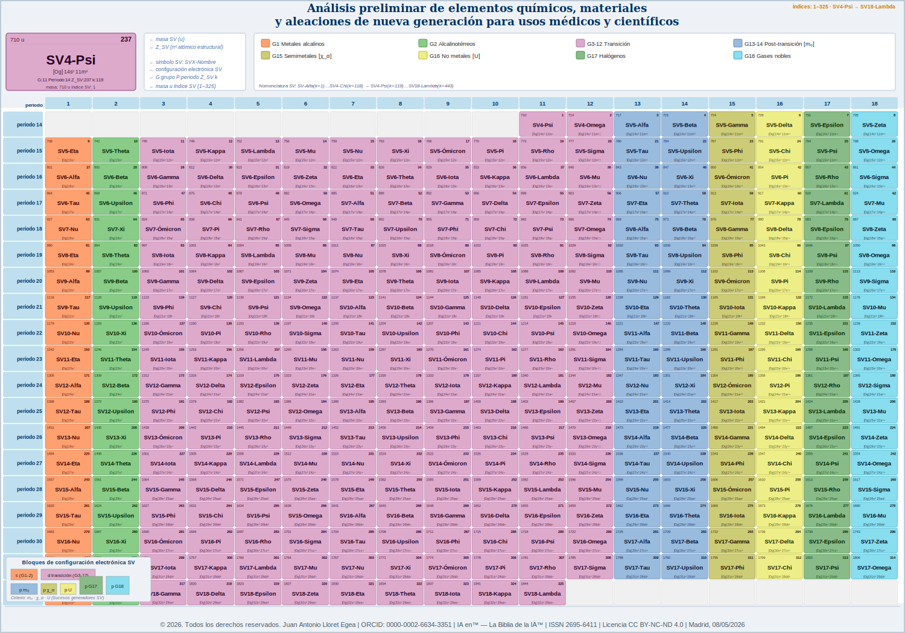

# Catálogo de errores — Laboratorio SV-443

© 2026. Todos los derechos reservados. | Juan Antonio Lloret Egea | ORCID: 0000-0002-6634-3351 | ITVIA | IA eñ™ — La Biblia de la IA™ | ISSN 2695-6411 | CC BY-NC-ND 4.0 | Madrid, 08/05/2026

---

Este catálogo enumera absolutamente todos los códigos de error que puede producir el laboratorio del catálogo SV-443. Cada código es específico, trazable y no genérico. Ningún error debe emitirse sin código propio.

---

## Grupo I — Errores de carga y estructura

| Código | Descripción | Causa probable | Acción |
|---|---|---|---|
| SV-443-LOAD | No se pudo abrir o parsear el CSV | Ruta incorrecta, codificación no UTF-8, archivo corrupto | Verificar ruta y encoding |
| SV-443-COUNT | Número de filas de datos distinto de 443 | Filas eliminadas, duplicadas o no filtradas correctamente | Regenerar CSV desde las fórmulas del §7 |
| SV-443-HEADER | Número de columnas en la cabecera distinto de 33 | Columna añadida o eliminada | Verificar que la cabecera tenga exactamente 33 columnas |
| SV-443-ORDEN | El valor Nº en la posición i no es i+1 | Fila fuera de orden, duplicada o con Nº no numérico | Reordenar filas por Nº; verificar que no hay huecos |

---

## Grupo II — Errores de fórmulas canónicas

| Código | Descripción | Fórmula esperada | Acción |
|---|---|---|---|
| SV-443-Z-{k} | Z_SV del elemento k incorrecto | Z_SV(k) = 118 + k | Recalcular con la fórmula |
| SV-443-A-{k} | Masa_SV_u del elemento k incorrecta | A_SV(k) = 294 + 3k + ⌊k/2⌋ | Recalcular con la fórmula |
| SV-443-P-{k} | Periodo del elemento k incorrecto | Periodo(k) = 8 + ⌊(k−1)/18⌋ | Recalcular con la fórmula |
| SV-443-G-{k} | Grupo del elemento k incorrecto | Grupo(k) = 1 + ((k−1) mod 18) | Recalcular con la fórmula |

---

## Grupo III — Errores de rango en propiedades numéricas

Todos los rangos son estructurales SV y no equivalen a rangos físicos convencionales.

| Código | Columna | Rango válido | Causa probable | Acción |
|---|---|---|---|---|
| SV-443-DENS-{k} | Densidad_SV_g_cm3 | [0.001, 1000] g/cm³ | Fórmula de densidad devuelve valor fuera de rango | Revisar fórmula y parámetros del periodo |
| SV-443-CONDUCT-{k} | Conductividad_electrica_MS_m | [0.0, 200] MS/m | Conductividad negativa o excesiva | Verificar fórmula σ(k) = max(0.01; 100·e^(−k/300) + 0.5·sin(k/20)) |
| SV-443-EN-{k} | Electronegatividad_SV | [0.0, 4.0] | Valor fuera del rango estructural SV | Revisar fórmula; gases nobles deben tener EN = 0.0 |
| SV-443-EI-{k} | Energia_ionizacion_kJ_mol | [0.0, 5000] kJ/mol | Energía negativa o excesiva | Verificar fórmula E_ion(k) |
| SV-443-RADIO-{k} | Radio_atomico_SV_pm | [0.0, 1000] pm | Radio negativo o excesivo | Verificar fórmula r_atom(k) = 200 − k/5 + 10·sin(k/50) |
| SV-443-AFIN-{k} | Afinidad_electronica_eV | [0.0, 2.5] eV — halógenos alcanzan ~2.1 en SV-118 | Afinidad negativa o excesiva | Verificar fórmula; gases nobles deben tener afinidad = 0.0 |
| SV-443-METAL-{k} | Caracter_metalico_SV_pct | [0.0, 100.0] % | Carácter metálico fuera de escala | Verificar fórmula metal(k) = 100·e^(−((k−1)%18)/9) |
| SV-443-KTERM-{k} | Conductividad_termica_W_mK | [0.0, 1000] W/m·K | Conductividad térmica fuera de rango | Verificar fórmula κ(k) = 300·e^(−k/400) + 20·sin(k/30) |
| SV-443-MUR-{k} | Permeabilidad_SV_mu_r | [0.9, 1.2] | Permeabilidad fuera del rango estructural | Verificar fórmula μr(k) = 1 + 0.1·sin(k/10) |
| SV-443-MOHS-{k} | Dureza_SV_Mohs | [0.0, 15.0] | Dureza negativa o excesiva | Verificar fórmula H_Mohs; gases deben tener dureza ≈ 0 |
| SV-443-RES-{k} | Resistencia_fisica_MPa | [0.0, 10000] MPa | Resistencia fuera de rango | Verificar fórmula R_fis(k) = 100 + 5·(k mod 40) |
| SV-443-ROZ-{k} | Coef_rozamiento_SV | [0.0, 1.0] | Rozamiento fuera de [0, 1] | Verificar fórmula Roz(k); gases deben tener rozamiento = 0.0 |
| SV-443-FLEX-{k} | Flexibilidad_SV_0_1 | [0.0, 1.0] | Flexibilidad fuera de [0, 1] | Verificar fórmula Flex(k) = 0.9·e^(−k/200) + 0.1·sin(k/50) |
| SV-443-MALE-{k} | Maleabilidad_SV_0_1 | [0.0, 1.0] | Maleabilidad fuera de [0, 1] | Verificar fórmula Male(k) = 0.8·e^(−k/250) + 0.1·cos(k/30) |
| SV-443-OXID-{k} | Resistencia_oxidacion_SV_0_100 | [0.0, 100.0] | Resistencia fuera de [0, 100] | Verificar fórmula R_ox(k) = 100·(1 − e^(−k/500)) |
| SV-443-CORR-{k} | Resistencia_corrosion_SV_0_100 | [0.0, 100.0] | Resistencia fuera de [0, 100] | Verificar fórmula R_cor(k) = 100·e^(−k/800) |
| SV-443-TMAX-{k} | Resistencia_termica_max_C | Gas noble G=18: ≤ 50 °C | Gas noble con temperatura positiva alta | Verificar fórmula T_max para gases: −273 + 5·(P−8) |
| SV-443-VOL-{k} | Volumen_atomico_SV_A3 | [0.001, 10000] ų | Volumen fuera de rango | Verificar fórmula V_atom(k) = 25 + 0.5·k |
| SV-443-RAD-{k} | Nivel_radiactivo_SV_0_100 | [0.0, 100.0] | Nivel radiactivo fuera de [0, 100] | Verificar fórmula Radi(k) = 100·(1 − e^(−k/200)) |
| SV-443-ISO-{k} | Num_isotopos_SV | [1, 200] | Número de isótopos ≤ 0 o excesivo | Verificar fórmula N_iso(k) = 5 + ⌊k/30⌋ + (k mod 3) |

---

## Grupo IV — Errores de valores no numéricos

| Código | Descripción | Causa probable | Acción |
|---|---|---|---|
| SV-443-FLOAT-{COD}-{k} | Columna numérica contiene un valor no convertible a float | Celda vacía, texto, o separador decimal incorrecto (coma en vez de punto) | Verificar la generación del CSV; usar punto decimal |

---

## Grupo V — Errores de texto y campos obligatorios

| Código | Columna | Descripción | Acción |
|---|---|---|---|
| SV-443-VACIO-NOMBRE-{k} | Nombre_SV | Nombre SV vacío | Verificar la función de nombre: NOMBRES[k] para k=1..118, SV-{k} para k≥119 |
| SV-443-VACIO-CONFIG-{k} | Config_electronica | Configuración electrónica vacía | Verificar la función cfg(P, G) en el generador |
| SV-443-VACIO-ESTADO-{k} | Estado_STP_SV | Estado STP vacío | Verificar la función estado(G) |
| SV-443-VACIO-FUNC-{k} | Funcion_estructural_SV | Función estructural vacía | Verificar la función fstr(P, G) |
| SV-443-VACIO-APLIC-CI-{k} | Aplicacion_cientifica_SV | Aplicación científica vacía | Verificar la función aplic(P, G, rad) |
| SV-443-VACIO-APLIC-AE-{k} | Aplicacion_aeroespacial_SV | Aplicación aeroespacial vacía | Verificar la función aplic(P, G, rad) |
| SV-443-VACIO-APLIC-MED-{k} | Aplicacion_medica_SV | Aplicación médica vacía | Verificar la función aplic(P, G, rad) |
| SV-443-ESTADO-{k} | Estado_STP_SV | Estado STP no es uno de los cuatro valores válidos | Valores válidos: sólido metálico, sólido semimetálico, gas reactivo pesado, gas noble denso |

---

## Grupo VI — Errores de integridad del conjunto

| Código | Descripción | Causa probable | Acción |
|---|---|---|---|
| SV-443-DUPZ | Dos elementos tienen el mismo Z_SV | Error de indexación o duplicación de fila | Verificar que Z_SV(k) = 118 + k, con k único |

---

## Resumen de códigos

| Grupo | Prefijo | Total de códigos posibles |
|---|---|---|
| Carga y estructura | SV-443-LOAD, COUNT, HEADER, ORDEN | 4 tipos, instanciados por posición |
| Fórmulas canónicas | SV-443-Z, A, P, G | 4 tipos × 443 elementos = hasta 1772 instancias |
| Rangos numéricos | SV-443-{DENS,CONDUCT,...} | 19 tipos × 443 = hasta 8417 instancias |
| Valores no numéricos | SV-443-FLOAT-{COD} | 19 tipos × 443 = hasta 8417 instancias |
| Campos de texto | SV-443-VACIO-{col} | 7 tipos × 443 = hasta 3101 instancias |
| Estado STP | SV-443-ESTADO | 443 instancias posibles |
| Duplicados | SV-443-DUPZ | hasta 221 instancias posibles |
