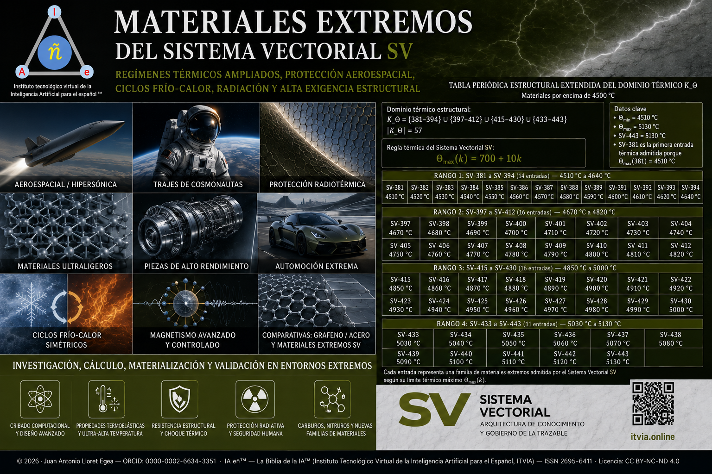

# Materiales extremos del Sistema Vectorial SV

## Regímenes térmicos ampliados, protección aeroespacial, ciclos frío-calor, radiación y alta exigencia estructural

**Autor:** Juan Antonio Lloret Egea  
**ORCID:** 0000-0002-6634-3351  
**Editor:** IA eñ™ — La Biblia de la IA™  
**Institución editorial:** Instituto Tecnológico Virtual de la Inteligencia Artificial para el Español (ITVIA)  
**ISSN:** 2695-6411  
**Licencia:** CC BY-NC-ND 4.0  
**DOI de la colección:** https://doi.org/10.21428/39829d0b.bf37c83a  
**Sede editorial:** https://www.itvia.online/materiales-extremos  
**Repositorio canónico:** https://github.com/juantoniolloretegea/SV-matematica-semantica/tree/main/documentos/adendas/matematica-fisica-factual-contemporanea-sv/quimica-factual-y-ciencia-de-materiales-sv/materiales-extremos  

---

## Objeto de la colección

**Materiales extremos del Sistema Vectorial SV** reúne trabajos dedicados a la formulación, extensión, contraste y aplicación científica de dominios estructurales de alta exigencia térmica, mecánica, radiativa y transductiva dentro del Sistema Vectorial SV. La colección toma `Ω₄₄₃`, `K_Θ` y `K_Θ⁺` como dominios publicados de arranque, no como clausura final de la tabla periódica estructural SV. El Sistema Vectorial SV no declara un número absoluto y definitivo de elementos estructurales: trabaja mediante dominios finitos sucesivos, generados, filtrados y sometidos a restricciones explícitas de admisión, frontera, residual, trazabilidad, compatibilidad y retorno. En consecuencia, `443` designa una frontera publicada de esta fase, no un límite universal del campo.

Bajo esta lectura, los materiales extremos no quedan reducidos al intervalo térmico inicialmente recorrido. `K_Θ` fija el dominio positivo por encima de `4500 °C`; `K_Θ⁺` permite estudiar extensiones superiores bajo crecimiento transductivo, contraste ultra-refractario y restricciones de validez; y el catálogo de pares estructurales aporta el tránsito desde entrada aislada hacia compatibilidad, enlace, aleación y familia material. La colección queda así orientada a regímenes térmicos ampliados, protección aeroespacial e hipersónica, ciclos frío-calor, contención radiotérmica, materiales ultraligeros y estructuras de alto rendimiento, sin confundir formulación estructural con síntesis experimental ni disponibilidad industrial inmediata.

---

## Dominio publicado y campo no clausurado

La colección se apoya en dominios finitos declarados. Esta decisión permite publicar resultados auditables, reproducibles y trazables sin convertir una frontera de trabajo en límite absoluto del Sistema Vectorial SV. El dominio `Ω₄₄₃` corresponde al catálogo estructural publicado hasta `443` candidatos; `K_Θ` identifica el subdominio térmico positivo por encima de `4500 °C`; y `K_Θ⁺` estudia la prolongación formal de ese régimen hacia umbrales térmicos superiores.

La extensión periódica estructural del SV admite formulación general mediante dominios `Ω_M` y operadores de prolongación sometidos a restricciones de persistencia, frontera, residual, identidad, trazabilidad, compatibilidad superior y retorno. Por tanto, la pregunta por el número total de elementos estructurales no se responde mediante una cifra absoluta, sino mediante el dominio finito declarado en cada fase de trabajo. Hasta ahora, esta línea publica `Ω₄₄₃`, `K_Θ` y `K_Θ⁺`; el campo estructural no queda agotado por esos dominios.

---

## Mapa térmico rector

El dominio térmico inicial queda fijado por la tabla periódica estructural extendida del dominio `K_Θ`:

`K_Θ = {381,…,394} ∪ {397,…,412} ∪ {415,…,430} ∪ {433,…,443}`

`|K_Θ| = 57`

`Θ_min = 4510 °C`

`Θ_max = 5130 °C`

`SV-381 = 4510 °C`

`SV-443 = 5130 °C`

El crecimiento ampliado `K_Θ⁺` permite estudiar, bajo régimen transductivo y contraste ultra-refractario, ventanas superiores a `6000 °C`, `8000 °C` y `10000 °C`, sin convertir la extensión formal en síntesis material proclamada.

---

## Publicaciones vinculadas

### 1. Tabla periódica estructural extendida del dominio térmico `K_Θ`

**Título:** *Tabla periódica estructural extendida del dominio térmico K_theta: materiales por encima de 4500 °C*  
**Fecha de publicación:** 06/06/2026  
**Función:** fija el dominio térmico estructural positivo `K_Θ`, la columna vertebral `SV-119 → SV-280 → SV-443`, los controles adyacentes `SV-120`, `SV-281` y `SV-442`, el criterio de admisión térmica por encima de `4500 °C`, los residuales nulos y la frontera publicada en `SV-443 = 5130 °C`.

### 2. Extensión del dominio térmico `K_Θ⁺`

**Título:** *Adenda I. Extensión del dominio térmico K_Θ⁺ más allá de SV-443: crecimiento transductivo, frontera formal y contraste ultra-refractario*  
**Fecha de publicación:** 06/06/2026  
**Función:** estudia la prolongación formal del dominio térmico más allá de `SV-443`, con umbrales ampliados, crecimiento transductivo, frontera formal, casos negativos, residuales y contraste ultra-refractario frente a UHTC, sin proclamar síntesis ni materiales realizados.

### 3. Catálogo de Pares Estructurales SV

**Título:** *Catálogo de Pares Estructurales SV (CPS-SV): enlace, aleación y compatibilidad posicional desde los 118 elementos base hasta los 443 candidatos del dominio extendido*  
**Fecha de publicación:** 10/05/2026  
**Función:** analiza la compatibilidad estructural de pares entre los `118` elementos base y los `443` candidatos del dominio extendido, con lectura de enlace, aleación, compatibilidad posicional, admisión, rechazo y transición desde elemento aislado hacia familias materiales.

---

## Alcance técnico

Esta colección organiza la investigación en materiales extremos desde una secuencia de dominios y retornos:

| Plano | Función |
|---|---|
| Dominio `Ω₄₄₃` | Catálogo estructural publicado hasta `443` candidatos, sin clausura universal del campo. |
| Dominio térmico `K_Θ` | Identificación estructural de entradas por encima de `4500 °C`. |
| Extensión `K_Θ⁺` | Proyección transductiva hacia umbrales superiores a `6000 °C`, `8000 °C` y `10000 °C`. |
| CPS-SV | Compatibilidad de pares, enlace, aleación y transición hacia familias materiales. |
| Protección aeroespacial | Bordes de ataque, escudos, superficies hipersónicas, toberas, cámaras y sistemas sometidos a exigencia térmica extrema. |
| Ciclos frío-calor | Choque térmico, gradientes extremos, estabilidad estructural y fatiga térmica. |
| Contención radiotérmica | Protección radiativa, seguridad humana y barreras de alto rendimiento. |
| Materiales ultraligeros | Resistencia específica, estructuras de baja masa y aplicaciones aeroespaciales. |
| Comparación técnica | Contraste con grafeno, acero, UHTC, carburos, nitruros y nuevas familias de materiales. |

---

## Criterio de lectura

La admisión estructural dentro del SV no equivale a aceptación IUPAC, síntesis experimental ni disponibilidad industrial. Cada resultado debe leerse por capas: dominio, regla generativa, transducción, residual, retorno, caso negativo, compatibilidad y eventual contraste material. La colección conserva esa separación para evitar confusión entre formulación estructural, hipótesis técnica, validación computacional, ensayo físico y aplicación industrial.

La tabla periódica reconocida por la ciencia contemporánea, las hipótesis físico-relativistas sobre elementos superpesados y la tabla periódica estructural SV pertenecen a planos distintos. El SV no declara automáticamente que un candidato estructural sea elemento químico observado, sintetizado o aceptado por organismos externos. Declara condiciones de estructura, compatibilidad y retorno dentro de dominios formalmente especificados.

---

## Trazabilidad editorial

- **Colección PubPub / ITVIA:** https://www.itvia.online/materiales-extremos  
- **DOI de la colección:** https://doi.org/10.21428/39829d0b.bf37c83a  
- **Repositorio GitHub:** https://github.com/juantoniolloretegea/SV-matematica-semantica/tree/main/documentos/adendas/matematica-fisica-factual-contemporanea-sv/quimica-factual-y-ciencia-de-materiales-sv/materiales-extremos  
- **Portada:** `imagenes/portada.png`

---

## Advertencia y reserva de derechos

Esta colección, sus textos, formulaciones, imágenes, tablas, estructuras de datos, nomenclatura, criterios de admisión, dominios, transductores, documentación asociada, selección y disposición de contenidos quedan protegidos por los derechos de propiedad intelectual de su autor y, en su caso, por la gestión de derechos que corresponda a través de CEDRO. Cualquier reproducción, distribución, comunicación pública, transformación, traducción, adaptación, incorporación a bases de datos, entrenamiento o evaluación de sistemas automatizados, integración en productos, servicios, informes, software, modelos, catálogos, materiales docentes, materiales industriales, publicaciones técnicas o desarrollos empresariales deberá ajustarse a la licencia indicada, contar con autorización expresa y por escrito de los titulares de derechos, o ampararse en una excepción legal aplicable.

La licencia CC BY-NC-ND 4.0 no autoriza usos comerciales, explotación empresarial, transformación distribuida ni reutilización sustancial fuera de sus términos. La aplicación, implementación o explotación técnica de resultados, fórmulas, tablas, metodología, transductores, criterios de admisión, dominios, laboratorios o conclusiones en física, química, ciencia de materiales, ingeniería, inteligencia artificial u otros campos derivados queda reservada a la autorización expresa del autor cuando implique reproducción, transformación, comunicación pública, distribución, integración sustancial de la obra protegida, explotación comercial, desarrollo empresarial o uso no cubierto por la licencia. Nada de lo anterior limita los usos permitidos imperativamente por la ley.

---

## Notice and reservation of rights

This collection, including its texts, formulations, images, tables, data structures, nomenclature, admission criteria, domains, transducers, associated documentation, selection and arrangement of contents, is protected by the author’s intellectual property rights and, where applicable, by the corresponding rights management through CEDRO. Any reproduction, distribution, public communication, transformation, translation, adaptation, incorporation into databases, training or evaluation of automated systems, integration into products, services, reports, software, models, catalogues, teaching materials, industrial materials, technical publications or business developments shall be carried out only in accordance with the indicated license, with the express written authorization of the rights holders, or under an applicable statutory exception.

The CC BY-NC-ND 4.0 license does not authorize commercial use, business exploitation, distributed transformation or substantial reuse outside its terms. The application, implementation or technical exploitation of results, formulas, tables, methodology, transducers, admission criteria, domains, laboratories or conclusions in physics, chemistry, materials science, engineering, artificial intelligence or other derived fields is reserved to the express authorization of the author where it entails reproduction, transformation, public communication, distribution, substantial integration of the protected work, commercial exploitation, business development or any use not covered by the license. Nothing herein shall limit uses that are mandatorily permitted by law.
