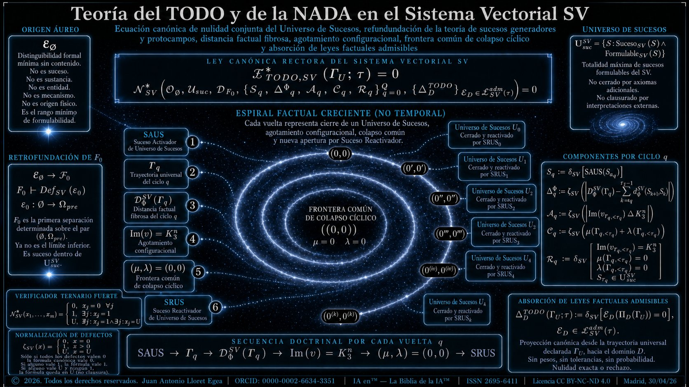

# Teoría del TODO y de la NADA en el Sistema Vectorial SV — refundación factual sobre el corpus del suceso, distancia factual fibrosa, célula configuracional K<sub>3</sub><sup>n</sup>, frontera común (μ, λ) = (0, 0) y verificador ternario fuerte


---

## Índice

1. Estado del arte (apartado 1).
2. Naturaleza factual del frame en el Sistema Vectorial SV (apartado 1bis).
3. Aparato heredado autocontenido del corpus SV (apartado 2).
4. Cadena ascendente del Sistema Vectorial SV (apartados 3 a 15).
5. Espiral factual creciente y secuencia doctrinal por vuelta (apartado 16).
6. Conclusión doctrinal (apartado 17).
7. Mapa de subordinación operatoria del corpus SV (apartado 18).
8. Las once fórmulas absorbidas del corpus (apartado 19).
9. Banco numérico canónico de los diez supuestos sobre SV(9, 3) (apartado 20).
10. Tabla maestra de cotejo: 11 absorciones × 10 supuestos (apartado 21).
11. Cinco interpretaciones canónicas posibles (apartado 22).
12. Teoremas T7 a T10 (apartado 23).
13. Conjunto laboratorial reproducible (apartado 24).
14. Nota aclaratoria sobre la imagen simbólica (apartado 24bis).
15. Bibliografía (apartado 25).

---

**© 2026. Todos los derechos reservados.** | [**DOI**: el asignado sobre la colección: [«Contemporary Factual Mathematics and Physics of the SV»](https://works.hcommons.org/collections/matematica-fisica-factual-contemporanea-sv/records?q=&l=list&p=1&s=10&sort=newest)| **Juan Antonio Lloret Egea** | ORCID: [0000-0002-6634-3351](https://orcid.org/0000-0002-6634-3351) | Instituto Tecnológico Virtual de la Inteligencia Artificial para el Español (ITVIA) | IA eñ™ — La Biblia de la IA™ | **ISSN 2695-6411** | **Licencia CC BY-NC-ND 4.0** | Madrid, 01/05/2026 |

**Advertencia**: Esta publicación está protegida por **[CEDRO](https://www.cedro.org/english?lng=en)** y su aplicación en el campo de la Física, así como cualquier forma de explotación, reproducción o uso por parte de empresas, queda sujeta al copyright del autor y a los términos de la licencia indicada; la reproducción, distribución, comunicación pública o transformación de esta obra solo puede ser realizada con la autorización de sus titulares, salvo excepción prevista por la ley, y cualquier uso comercial sin autorización expresa queda prohibido y supeditado estrictamente al licenciamiento permitido. | [**Registro histórico**](https://web.archive.org/save/https://github.com/juantoniolloretegea/SV-matematica-semantica/tree/main/documentos/adendas/matematica-fisica-factual-contemporanea-sv/teoria-todo-nada-sv ) | [**URL canónica**:](https://github.com/juantoniolloretegea/SV-matematica-semantica/blob/main/documentos/adendas/matematica-fisica-factual-contemporanea-sv/teoria-todo-nada-sv/teoria_todo_nada_sv.md)

**Warning**: This publication is protected by **[CEDRO](https://www.cedro.org/english?lng=en)**. Its application in the field of Physics, as well as any form of exploitation, reproduction, or use by corporate entities, is strictly subject to the author's copyright and the terms of the license indicated; any reproduction, distribution, public communication, or transformation of this work requires authorization from the rightsholders, except as provided by law, and any commercial use without express written consent is prohibited and strictly subject to permitted licensing. | [**Historical Record**](https://web.archive.org/save/https://github.com/juantoniolloretegea/SV-matematica-semantica/tree/main/documentos/adendas/matematica-fisica-factual-contemporanea-sv/teoria-todo-nada-sv ) |  [**Canonical URL**:](https://github.com/juantoniolloretegea/SV-matematica-semantica/blob/main/documentos/adendas/matematica-fisica-factual-contemporanea-sv/teoria-todo-nada-sv/teoria_todo_nada_sv.md)

---

## Abstract

This paper formulates the Theory of EVERYTHING and of NOTHING in the Vectorial System SV as a single canonical equation of joint nullity over the Universe of Events of the system, refounded on the SV corpus of the admissible event, the factual fibrous distance, the configurational cell K<sub>3</sub><sup>n</sup>, the common boundary of cyclic collapse (μ, λ) = (0, 0) and the strong ternary verifier 𝓝<sup>★</sup><sub>SV</sub>. The doctrine is laid out as a structural ascending chain —not chronological— that climbs from the Golden Origin 𝓔<sub>∅</sub> to the governing law 𝓔<sup>★</sup><sub>TODO,SV</sub>(Γ<sub>U</sub>; τ) = 0 traversing, in strict order, the retrofounding of 𝓕<sub>0</sub>, the Universe of Events 𝕌<sup>SV</sup><sub>suc</sub>, the Activating Event of Universe of Events SAUS, the universal cyclic trajectory T<sub>q</sub>, the factual fibrous distance 𝓓<sup>SV</sup><sub>Φ</sub>(Γ<sub>q</sub>), the configurational exhaustion Im(v) = K<sub>3</sub><sup>n</sup>, the common boundary of cyclic collapse (μ, λ) = (0, 0), the Reactivating Event of Universe of Events SRUS, the cycle components { S<sub>q</sub>, Δ<sup>Φ</sup><sub>q</sub>, 𝓐<sub>q</sub>, 𝓒<sub>q</sub>, 𝓡<sub>q</sub> }, the defect normalization ζ<sub>SV</sub> and the truth indicator δ<sub>SV</sub>, the strong ternary verifier 𝓝<sup>★</sup><sub>SV</sub>, and the absorption of admissible factual laws of SV via canonical projection Π<sub>D</sub>. The document is autonomous: every object used inside the chain is defined inside the document, with examples on the canonical cell SV(9,3) over the ternary alphabet Σ = { 0, 1, U }. The factual ascending spiral over U<sub>0</sub>, U<sub>1</sub>, …, U<sub>k</sub> is structural and not temporal: each turn represents the closure of a Universe of Events, configurational exhaustion, common collapse and a new opening by Reactivating Event. The progression is operatory subordination, not chronological evolution. The Theory of EVERYTHING and the Theory of NOTHING are integrated in a single governing equation without a second formula. The admissible NOTHING of SV is identified with two internal readings, never with substantial vacuum: the condition 𝓔<sub>∅</sub> of the Golden Origin, minimal rank without content, and the condition (μ, λ) = (0, 0) of the common boundary of cyclic collapse, internal closure without formulable external remainder. Six theorems are proved (telescopic coherence of 𝓓<sup>SV</sup><sub>Φ</sub>; equivalence of the two internal readings of admissible NOTHING; strength of the verifier 𝓝<sup>★</sup><sub>SV</sub>; uniqueness of the verdict in { 0, 1, U }; canonical absorption by projection; closure of the Theory of EVERYTHING). **Highly recommended**: [«Contemporary Factual Mathematics and Physics of the SV»](https://works.hcommons.org/collections/matematica-fisica-factual-contemporanea-sv/records?q=&l=list&p=1&s=10&sort=newest)

**Keywords:** Vectorial System SV; Theory of EVERYTHING; Theory of NOTHING; Golden Origin 𝓔<sub>∅</sub>; Universe of Events 𝕌<sup>SV</sup><sub>suc</sub>; admissible event; configurational cell SV(9,3); ternary alphabet { 0, 1, U }; factual fibrous distance; configurational exhaustion K<sub>3</sub><sup>n</sup>; common boundary of cyclic collapse (μ, λ) = (0, 0); strong ternary verifier 𝓝<sup>★</sup><sub>SV</sub>; canonical projection Π<sub>D</sub>; canonical governing equation 𝓔<sup>★</sup><sub>TODO,SV</sub>(Γ<sub>U</sub>; τ) = 0.

---

## Resumen

Esta publicación formula la Teoría del TODO y de la NADA en el Sistema Vectorial SV como ecuación canónica única de nulidad conjunta sobre el Universo de Sucesos del sistema, refundada sobre el corpus SV del suceso admisible, la distancia factual fibrosa, la célula configuracional K<sub>3</sub><sup>n</sup>, la frontera común de colapso cíclico (μ, λ) = (0, 0) y el verificador ternario fuerte 𝓝<sup>★</sup><sub>SV</sub>. La doctrina se dispone como cadena estructural ascendente —no cronológica— que sube desde el Origen Áureo 𝓔<sub>∅</sub> hasta la ley rectora 𝓔<sup>★</sup><sub>TODO,SV</sub>(Γ<sub>U</sub>; τ) = 0 atravesando, en orden estricto, la retrofundación de 𝓕<sub>0</sub>, el Universo de Sucesos 𝕌<sup>SV</sup><sub>suc</sub>, el Suceso Activador de Universo de Sucesos SAUS, la trayectoria universal del ciclo T<sub>q</sub>, la distancia factual fibrosa 𝓓<sup>SV</sup><sub>Φ</sub>(Γ<sub>q</sub>), el agotamiento configuracional Im(v) = K<sub>3</sub><sup>n</sup>, la frontera común de colapso cíclico (μ, λ) = (0, 0), el Suceso Reactivador de Universo de Sucesos SRUS, las componentes del ciclo { S<sub>q</sub>, Δ<sup>Φ</sup><sub>q</sub>, 𝓐<sub>q</sub>, 𝓒<sub>q</sub>, 𝓡<sub>q</sub> }, la normalización de defectos ζ<sub>SV</sub> y el indicador δ<sub>SV</sub>, el verificador ternario fuerte 𝓝<sup>★</sup><sub>SV</sub> y la absorción de leyes factuales admisibles del SV por proyección canónica Π<sub>D</sub>. El documento es autónomo: cada objeto utilizado en la cadena se define dentro del documento, con ejemplos sobre la célula canónica SV(9,3) sobre el alfabeto ternario Σ = { 0, 1, U }. La espiral factual creciente sobre U<sub>0</sub>, U<sub>1</sub>, …, U<sub>k</sub> es estructural y no temporal: cada vuelta representa cierre de un Universo de Sucesos, agotamiento configuracional, colapso común y nueva apertura por Suceso Reactivador. La progresión es de subordinación operatoria, no de evolución cronológica. La Teoría del TODO y la Teoría de la NADA quedan integradas en una sola ecuación rectora sin segunda fórmula. La NADA admisible del SV se identifica con dos lecturas internas y nunca con vacío sustancial: la condición 𝓔<sub>∅</sub> del Origen Áureo, rango mínimo sin contenido, y la condición (μ, λ) = (0, 0) de la frontera común de colapso cíclico, cierre interno sin resto exterior formulable. Se demuestran seis teoremas (coherencia telescópica de 𝓓<sup>SV</sup><sub>Φ</sub>; equivalencia de las dos lecturas internas de la NADA admisible; fortaleza del verificador 𝓝<sup>★</sup><sub>SV</sub>; unicidad del veredicto en { 0, 1, U }; absorción canónica por proyección; cierre de la Teoría del TODO). |**Recomendado ver**: [«Contemporary Factual Mathematics and Physics of the SV»](https://works.hcommons.org/collections/matematica-fisica-factual-contemporanea-sv/records?q=&l=list&p=1&s=10&sort=newest).

**Palabras clave:** Sistema Vectorial SV; Teoría del TODO; Teoría de la NADA; Origen Áureo 𝓔<sub>∅</sub>; Universo de Sucesos 𝕌<sup>SV</sup><sub>suc</sub>; suceso admisible; célula configuracional SV(9,3); alfabeto ternario { 0, 1, U }; distancia factual fibrosa; agotamiento configuracional K<sub>3</sub><sup>n</sup>; frontera común de colapso cíclico (μ, λ) = (0, 0); verificador ternario fuerte 𝓝<sup>★</sup><sub>SV</sub>; proyección canónica Π<sub>D</sub>; ecuación canónica rectora 𝓔<sup>★</sup><sub>TODO,SV</sub>(Γ<sub>U</sub>; τ) = 0.

---

## 1. Estado del arte

### 1.1. Programas contemporáneos de unificación

La aspiración a una teoría única de la física tiene cuatro siglos de historia ascendente. Newton (1687) unificó mecánica terrestre y celeste; Maxwell (1865) unificó electricidad, magnetismo y luz; Einstein (1905, 1916) unificó espacio y tiempo bajo la relatividad y, después, materia y geometría bajo la relatividad general; el modelo electrodébil de Glashow, Weinberg y Salam (1967-1968) unificó interacciones electromagnéticas y débiles; la cromodinámica cuántica completó el Modelo Estándar de partículas. La frontera abierta sigue siendo la conciliación de la mecánica cuántica con la relatividad general, llamada habitualmente *teoría del todo* (Daniali, 2025; Turyshev, 2025).

Tres grandes programas dominan la búsqueda contemporánea. El primero es la **teoría de cuerdas** y su extensión M, formalizada por Wess y Zumino (1974), Polchinski (1998) y Witten en los años noventa, que postula que las partículas son modos vibracionales de objetos extensos en un espacio de diez u once dimensiones. La crítica clásica a este programa, articulada entre otros por Smolin (2006), señala su falta de predicciones experimentales contrastables y la proliferación del *landscape* de soluciones consistentes (Daniali, 2025; Bertolami, 2010).

El segundo es la **gravedad cuántica de bucles** (LQG), iniciada por Ashtekar, Rovelli y Smolin a finales de los años ochenta (Rovelli, 2004, 2008), que cuantiza directamente la geometría del espacio-tiempo y obtiene un cuadro discreto de área y volumen mediante redes de spin y espumas de spin. Variantes como las teorías discretas unitarias causales (Hackett, 2013) y las discretizaciones uniformes (Gambini y Pullin, 2009, 2014) elaboran sobre esta base. El programa enfrenta la dificultad reconocida del problema dinámico y de la recuperación de la covariancia general en el límite del continuo (Lukierski, 2014).

El tercero es la familia de **modelos discretos** representados por Wolfram (2002, 2020) y el Wolfram Physics Project (Gorard, 2020; Arsiwalla et al., 2024), que postula que el universo es un hipergrafo evolucionado por reglas de reescritura local; el espacio emerge como límite a gran escala del hipergrafo y el tiempo emerge como cómputo de la aplicación reiterada de reglas. Trabajos recientes derivan invariancia de Lorentz emergente, ecuaciones de Einstein discretas y conexiones con conjuntos causales (Wolfram Institute, 2025).

A los tres programas se añaden enfoques más recientes que abandonan el supuesto de una teoría única. Tan (2020) ha argumentado, sobre la base de los teoremas de incompletitud de Gödel y del indeterminismo cuántico, que no debe presuponerse una sola teoría unificada del todo: el universo puede ser intrínsecamente abierto, dinámico e incompleto, con modelos consistentes pero distintos emergentes según el régimen físico considerado.

El Sistema Vectorial SV se separa de estos tres programas en un punto fundacional: no postula geometría continua, no postula geometría discreta acoplada al tiempo, no postula reescritura de hipergrafos. Postula, en cambio, una **célula configuracional** de nueve posiciones sobre alfabeto ternario { 0, 1, U }, una noción rigurosa de **suceso admisible** como cuaterna tipada, una **espiral factual creciente** estructural y no temporal, y un **verificador ternario fuerte** que clausura la doctrina sin probabilidad ni tolerancias.

### 1.2. La NADA en filosofía y ciencia

La pregunta por la NADA tiene formulación clásica antigua. Parménides, en el fragmento sobre la naturaleza, declaró que la NADA no puede pensarse ni decirse: pensar es siempre pensar algo. Aristóteles, retomando la cuestión, definió irónicamente la NADA como aquello en que las piedras piensan (Spitzer, citado en Williams, 2016). Hegel, en la *Ciencia de la lógica*, identificó ser y NADA en el primer momento dialéctico de la ontología.

La gran refundación contemporánea de la cuestión se debe a **Heidegger** (1929/1976). En *Was ist Metaphysik?* la NADA ya no es residuo dialéctico ni objeto de negación lógica, sino el presupuesto del ente: la NADA «nadea» (*das Nichts nichtet*) y revela el ente como ente. La metafísica, según Heidegger, ha olvidado tanto el ser como la NADA al reducirla a una abstracción conceptual sin referente. Esta posición ha sido objeto de relectura sistemática en filosofía contemporánea (Bielenberg, 2024; Sorensen, 2022 en Stanford Encyclopedia of Philosophy).

En filosofía analítica, Sartre (1943) tomó la NADA de Heidegger pero la redujo a operador de negación intencional. La crítica analítica contemporánea (Sorensen, 2022; Rodriguez, 2025) ha mostrado que toda enunciación positiva de la NADA absoluta se autorrefuta por dependencia del ser: en cuanto se enuncia, la NADA se convierte en algo. La NADA absoluta, concluye Rodriguez (2025), es límite negativo del pensamiento, no contenido del pensamiento.

La cuestión adquirió relevancia física con **Krauss** (2012) en *A Universe from Nothing*. El físico estadounidense argumentó que el vacío cuántico, sometido a las leyes de la mecánica cuántica y de la relatividad general, puede generar un universo entero, y que esto resuelve la pregunta sobre por qué hay algo en lugar de NADA. La crítica ha sido inmediata y cualificada. **Albert** (2012), filósofo y físico, demostró que el «vacío cuántico» de Krauss no es NADA en sentido filosófico: es una configuración particular de campos cuánticos relativistas, tan algo como cualquier otra cosa. **Ellis** (2012) señaló que Krauss no responde por qué existen las leyes de la física que él presupone. **Williams** (2016) y **Atkatz** (2014) elaboraron sobre la base de un equívoco terminológico sistemático: Krauss usa «nada» para designar el vacío cuántico o el minisuperespacio Wheeler-DeWitt, que son entidades físicas con estructura.

El Sistema Vectorial SV resuelve la cuestión de la NADA por una vía estructuralmente distinta. No identifica la NADA con vacío cuántico, ni con conjunto vacío proyectivo, ni con distancia infinita terminal. Define dos lecturas internas estrictamente formales de la NADA admisible: la condición 𝓔<sub>∅</sub> del Origen Áureo —rango mínimo de formulabilidad sin contenido positivo— y la condición (μ, λ) = (0, 0) de la frontera común de colapso cíclico —cierre interno sin resto exterior formulable—. Las dos lecturas son internas a la propia ecuación rectora del SV y no requieren postulados ontológicos adicionales.

### 1.3. La probabilidad fundante en física

La probabilidad ocupa, desde Born (1926), un lugar fundante en la mecánica cuántica. La regla de Born establece que la probabilidad de obtener el autovalor λ<sub>i</sub> de un observable es el cuadrado del módulo del producto interno del estado con el autovector correspondiente. El **teorema de Gleason** (1957) elevó este postulado al rango de única medida de probabilidad coherente sobre los subespacios cerrados de un espacio de Hilbert de dimensión mayor que dos.

Las interpretaciones contemporáneas del valor probabilístico se reparten entre la lectura **frecuentista**, la lectura **bayesiana subjetiva** del QBism (Fuchs, Mermin y Schack, 2014; DeBrota et al., 2021), la lectura **epistemológica pragmatista** (Healey, 2017), la derivación many-worlds (Mandolesi, 2020; Stoica, 2022) y la derivación lógica-inferencial (Ichikawa, 2018). La diversidad de derivaciones de la regla de Born desde axiomas distintos —Hilbert, lógica de proposiciones, inferencia bayesiana, conteo de mundos— sugiere que la probabilidad cuántica no es una propiedad emergente sino una restricción estructural sobre el espacio de Hilbert mismo (Brumer y Gong, 2006; Stoica, 2022).

El Sistema Vectorial SV opera fuera del régimen probabilístico. Su cálculo es **estrictamente ternario** sobre { 0, 1, U }, donde 0 significa nulidad exacta, 1 significa refutación, y U significa no clausura honesta. No hay probabilidades, no hay tolerancias, no hay márgenes de aproximación favorable. Las reglas ζ<sub>SV</sub> y 𝓝<sup>★</sup><sub>SV</sub> son funciones totales sobre el alfabeto, no medidas de probabilidad. La diferencia con la mecánica cuántica es estructural: el SV no aspira a describir resultados experimentales como frecuencias de observación, sino a verificar exactamente la coherencia interna de la doctrina sobre su propio universo de sucesos.

### 1.4. Tiempo soberano y tiempo emergente

La física clásica trata el tiempo como parámetro externo absoluto. La relatividad general (Misner, Thorne y Wheeler, 1973) lo geometriza como dimensión del cuádruple espacio-tiempo. La mecánica cuántica lo trata como parámetro externo no operatorial. La incompatibilidad de los dos tratamientos es uno de los obstáculos centrales del programa de gravedad cuántica.

Carroll (2010) ha articulado una posición materialista temporal según la cual el tiempo es real y direccional, vinculado al aumento de entropía en cosmología post-Big Bang. Penrose (2010) ha ofrecido en *Cycles of Time* una cosmología cíclica conformemente reescalada en la que el «tiempo» de un eón es continuación causal del eón anterior por reescalado conforme.

La tradición relacional —desde Mach hasta Connes y Rovelli (1994), pasando por Page y Wootters— ha argumentado que el tiempo es propiedad emergente de correlaciones internas del sistema cuántico (Butterfield y Isham, 1999; Heller, 1997; Martinetti, 2012; Oriti, 2021; Gambini y Pullin, 2004). Trabajos recientes (Ghasemi, 2025) formalizan el tiempo emergente sobre marcos relacionales multiobservador.

El Sistema Vectorial SV no asume tiempo soberano. Toda ordenación del corpus es **subordinación operatoria**, no sucesión cronológica. La flecha → de la cadena ascendente y de la espiral factual creciente es flecha de dependencia formal de despliegue interno, no flecha temporal. Esto se enuncia explícitamente en el documento canónico de la imagen y se desarrolla en cada apartado del trabajo. La doctrina es estructuralmente compatible con las posiciones relacionales de Connes-Rovelli y de Oriti pero no requiere un sustrato cuántico para sostenerse: la cadencia interna del SV es operativa, no termodinámica ni cuántica.

### 1.5. Modelos discretos y reescritura

La idea de un sustrato discreto subyacente al espacio-tiempo continuo se remonta a Riemann (1854) y, en el siglo veinte, a Wheeler con su «pregeometría». Los programas formales contemporáneos incluyen la geometría no conmutativa (Connes), las teorías de conjuntos causales (Sorkin), las redes y triangulaciones de spin (Rovelli), los hipergrafos del Wolfram Physics Project (Wolfram, 2020; Gorard, 2020), las redes de Petri y estructuras de eventos (Petri, 1962; Winskel, 1986; Melgratti, Mezzina y Pinna, 2024), y las teorías discretas unitarias causales (Hackett, 2013).

Las **redes de Petri** y las **estructuras de eventos** han sido el dominio matemático en el que más sistemáticamente se ha formalizado la noción de evento, su composición, su causalidad y su independencia. Los trabajos de Winskel (1986, 1995) establecieron la correspondencia entre redes de Petri seguras y estructuras prime de eventos, formalizada después categóricamente como cadena de coreflexiones. Trabajos recientes (Baldan, Corradini y Gadducci, 2018; Melgratti, Mezzina y Pinna, 2024) han extendido la correspondencia a estructuras de eventos reversibles y a redes de Petri con persistencia, capturando causalidad disyuntiva y reversibilidad.

El Sistema Vectorial SV se vincula con esta tradición pero la disciplina con condiciones más estrictas. Un suceso admisible del SV no es un evento en el sentido de Winskel: es una **cuaterna formalmente tipada** que satisface seis condiciones (A1 a A6) sobre soporte declarado, dominio de reevaluación no vacío, legibilidad antes y después, no trivialidad efectiva, control exterior parcial y compatibilidad observacional declarada. Una cadena del SV no es una computación de Petri: es una secuencia de cuaternas que satisface cuatro criterios adicionales de composición local, compatibilidad de horizontes, transporte suficiente de observables y persistencia de criterio acumulativo.

### 1.6. Lógicas multivaluadas y aplicaciones físicas recientes

La lógica clásica binaria se extiende, desde Łukasiewicz (1920, 1970) y Post (1921), a sistemas multivaluados que admiten un tercer valor lógico distinto de verdadero y falso. La interpretación tradicional del tercer valor en Łukasiewicz es «posible» o «indeterminado». La **lógica de Łukasiewicz ternaria** ha sido sistematizada algebraicamente por Moisil (1972) y, en su variante intuicionista, por Heyting.

Los trabajos contemporáneos extienden la lógica ternaria a lógicas n-valuadas (Hähnle, 2001), a lógicas fuzzy continuas (Hájek, 1998), y a lógicas paraconsistentes en las que la negación no satisface el principio de no contradicción (Priest, 2008). Aplicaciones físicas recientes incluyen circuitos memristivos para lógica Łukasiewicz ternaria (Royal Society, 2025; You et al., 2014; Du et al., 2018; Kim et al., 2024), redes neuronales de estado completo basadas en memristores ternarios (Wang et al., 2024) y aplicaciones a programación lógica (Osorio, Borja y Arrazola, 2004).

El Sistema Vectorial SV adopta el alfabeto ternario { 0, 1, U } pero con interpretación específicamente operatoria, no probabilística ni epistémica. El valor 0 significa **nulidad exacta verificada**; el valor 1 significa **refutación verificada**; el valor U significa **no clausura honesta**, esto es, ausencia simultánea de confirmación y de refutación. Las funciones ζ<sub>SV</sub> y 𝓝<sup>★</sup><sub>SV</sub> del SV son operadores totales con prelación estricta 1 ≻ U ≻ 0 que no admiten agregación intermedia ni interpolación cuantitativa.

### 1.7. Hilbert y la axiomatización de la física

Hilbert formuló en 1900 el sexto problema de su lista parisina como exigencia de tratamiento axiomático de la física, con la teoría de las probabilidades y la mecánica como prioridades inmediatas (Hilbert, 1902). Kolmogorov (1933) cerró la primera mitad del programa con la axiomatización medida-teórica de la probabilidad. La segunda mitad —la mecánica y la física estadística— ha sido objeto de programas sucesivos. Wightman (1976) revisó el estado del problema hasta los años setenta. Haag y Kastler (1964) articularon una formulación axiomática de la teoría cuántica de campos local. D'Ariano (2017) ha argumentado que la solución completa del sexto problema sería una *teoría del todo* axiomatizada. Klein y Fivel (2026) han propuesto una refundación basada en lógica suave y números suaves para acomodar microestados puntuales con probabilidad infinitesimal no nula.

El Sistema Vectorial SV se inscribe en la línea axiomatizadora del sexto problema pero por una vía no probabilística. Su axiomatización procede por **cadena ascendente de subordinación operatoria**, desde el Origen Áureo 𝓔<sub>∅</sub> hasta la ley canónica rectora 𝓔<sup>★</sup><sub>TODO,SV</sub>(Γ<sub>U</sub>; τ) = 0, sin postular probabilidad fundante. Cada nivel de la cadena se subordina al anterior y se demuestra mediante aparato formal autocontenido sobre la célula SV(9,3) con alfabeto Σ = { 0, 1, U }. El verificador final 𝓝<sup>★</sup><sub>SV</sub> sintetiza todos los defectos de la cadena en un veredicto único en el alfabeto del sistema, sin recurrir a medida de probabilidad ni a aproximación favorable.

### 1.8. Tabla comparativa: programas externos frente al Sistema Vectorial SV

| Aspecto | Cuerdas-M | Bucles (LQG) | Wolfram | Petri-eventos | Sistema Vectorial SV |
|---|---|---|---|---|---|
| Sustrato | continuo 10D-11D | discreto cuantizado | hipergrafo evolutivo | redes-eventos | célula SV(9,3) ternaria |
| Tiempo | parámetro embebido | emergente termal | computacional | parcial-orden causal | subordinación operatoria, no temporal |
| Probabilidad | Born | Born | emergente | combinatoria | ausente, ternario {0,1,U} |
| Causalidad | local relativista | causal-set discreta | reescritura local | causalidad-conflicto | A1-A6 + cuatro criterios cadena |
| NADA | vacío de cuerdas | vacío geométrico | regla vacía | conjunto vacío | dos lecturas internas (𝓔<sub>∅</sub> y (μ,λ)=(0,0)) |
| Verificación | ajuste experimental | experimentos Planck | reglas-recorridos | bisimulación | verificador ternario fuerte 𝓝<sup>★</sup><sub>SV</sub> |
| Cadena fundacional | landscape | espumas spin | ruliad | dominios algebraicos | cadena ascendente 13 niveles |
| Cierre formal | ausente | parcial | parcial | composicional | 𝓔<sup>★</sup><sub>TODO,SV</sub> = 0 |

### 1.9. Posición de esta publicación

Este documento de investigación (en el plano teórico y laboratorial de la Matemática y de la Física) no propone una alternativa empírica a las teorías de la física de altas energías, ni pretende competir experimentalmente con la cromodinámica cuántica o la cosmología observacional. Su objeto es **doctrinal y estructural**: fija la Teoría del TODO y de la NADA del Sistema Vectorial SV como ecuación única de nulidad conjunta sobre el Universo de Sucesos del sistema, refundada sobre el corpus SV del suceso admisible (Lloret Egea, 2026, doc. teoría rigurosa del suceso admisible) y articulada mediante objetos formalizados en este documento: la distancia factual fibrosa, la célula configuracional K<sub>3</sub><sup>n</sup>, las magnitudes de cierre (μ, λ) y el verificador ternario fuerte 𝓝<sup>★</sup><sub>SV</sub>. Se inscribe en la tradición de axiomatización de Hilbert, contrasta con las posiciones probabilísticas, temporalistas y geometrizantes de las teorías de la unificación contemporáneas, y se articula como cadena ascendente de subordinación operatoria estructuralmente cerrada en un único enunciado terminal.

---
## 1bis. Naturaleza factual del frame en el Sistema Vectorial SV

### 1bis.1. Inscripción factual: del fenómeno al frame ternario

Por el documento canónico de fundamentos algebraico-semánticos del Sistema Vectorial SV (Lloret Egea, 2026, §1 y §3.1), el alfabeto Σ = { 0, 1, U } sobre la célula 𝒮<sub>n</sub> = { 0, 1, U }<sup>n</sup> con n = b² constituye el código canónico de **inscripción factual** del fenómeno bajo estudio. Por la convención semántica del documento de origen doctrinal, definición y alcance de la U en el Sistema Vectorial SV (Lloret Egea, 2026, §3), los tres símbolos del alfabeto se leen operatoriamente como sigue: el valor **0** denota Apto —situación adecuada, predicado verificado—; el valor **1** denota No_Apto —situación inadecuada, predicado refutado—; el valor **U** denota Indeterminado —no determinación actual del juicio sobre el predicado—.

Cada una de las n posiciones de la célula declara, sobre un predicado estructural específico del fenómeno, un veredicto ternario en Σ. El conjunto ordenado de las n inscripciones constituye un **registro factual estructurado**: una proyección determinista del fenómeno sobre n dimensiones discretas con valor en el alfabeto canónico. La inscripción no requiere parámetro temporal externo, no recurre a medida probabilística, no descansa sobre inferencia estadística y no contiene mecanismo de inferencia opaca, conforme a las prohibiciones constitutivas P.1, P.2 y P.4 del corpus enunciadas en el §19 del documento canónico de teoría general de sucesos generadores y protocampos unificados (Lloret Egea, 2026).

### 1bis.2. Granularidad operatoria y restricción arquitectónica n = b²

Por el §3.1 del documento canónico de fundamentos algebraico-semánticos (Lloret Egea, 2026):

> "Sea *b* un número natural con *b* ≥ 3. El número de parámetros de una célula exacta se define por la restricción arquitectónica n = b². La célula SV exacta de tamaño n se define entonces como 𝒮<sub>n</sub> = { 0, 1, U }<sup>n</sup>".

El cuadrado perfecto n = b² no es ornamental. La restricción se introduce para preservar **organización por capas simétricas** y **representación polar de reparto uniforme** sobre la célula. Por la Proposición 1 del §3.2 del mismo documento, la cardinalidad del espacio de configuraciones es:

```math
\lvert \mathcal{S}_{n} \rvert \;=\; 3^{n}.
```

A mayor n, mayor número de predicados estructurales independientes disponibles en el frame y, por tanto, mayor capacidad de discriminación entre regímenes próximos. La célula  SV(9, 3) con b = 3, n = 9 y \|𝒮<sub>9</sub>\| = 3<sup>9</sup> = 19 683 configuraciones constituye el caso de menor cardinalidad admisible bajo la restricción arquitectónica.

### 1bis.3. Motor normativo del Sistema Vectorial SV

Por el §5 del documento canónico de fundamentos algebraico-semánticos (Lloret Egea, 2026), el Sistema Vectorial SV dispone de un **motor normativo determinista** que clasifica toda inscripción factual **v** ∈ 𝒮<sub>n</sub> en el alfabeto Σ sin recurso a tolerancia, probabilidad ni inferencia opaca.

**Conteos canónicos.** Para toda inscripción **v** = (v<sub>1</sub>, …, v<sub>n</sub>) ∈ 𝒮<sub>n</sub>, por el §5.1 del documento fundacional:

```math
N_{0}(\mathbf{v}) \;=\; \#\{\, i \;:\; v_{i} = 0 \,\}, \qquad N_{1}(\mathbf{v}) \;=\; \#\{\, i \;:\; v_{i} = 1 \,\}, \qquad N_{U}(\mathbf{v}) \;=\; \#\{\, i \;:\; v_{i} = U \,\},
```

con la identidad de partición:

```math
N_{0}(\mathbf{v}) \;+\; N_{1}(\mathbf{v}) \;+\; N_{U}(\mathbf{v}) \;=\; n.
```

**Umbral canónico.** Por el §5.2 del documento fundacional, el umbral normativo del Sistema Vectorial SV se fija como:

```math
\boxed{ \;T(n) \;:=\; \lfloor\, 7n/9\, \rfloor.\; }
```

**Clasificación determinista.** Por el §5.2 del documento fundacional, la clasificación de la inscripción **v** queda fijada por:

```math
\mathrm{Veredicto}_{SV}(\mathbf{v}) \;=\; \begin{cases} 1 \;\;(\text{No\_Apto}) & \text{si}\;\; N_{1}(\mathbf{v}) \;\geq\; T(n), \\ 0 \;\;(\text{Apto}) & \text{si}\;\; N_{0}(\mathbf{v}) \;\geq\; T(n), \\ U \;\;(\text{Indeterminado}) & \text{en cualquier otro caso.} \end{cases}
```

El veredicto exige **mayoría cualificada de evidencia**: T(n) componentes coincidentes en el mismo símbolo fuerte { 0, 1 } bastan para emitir veredicto cerrado. Cuando esa mayoría no se alcanza, el sistema preserva la marca U sin clausurar artificialmente.

**Unicidad de la clasificación fuerte.** Por la Proposición 6 del §5.3 del documento fundacional, sobre toda célula con n = b² y b ≥ 3 las desigualdades N<sub>0</sub>(**v**) ≥ T(n) y N<sub>1</sub>(**v**) ≥ T(n) **no pueden satisfacerse simultáneamente**. La demostración procede por reducción al absurdo: si ambas se cumpliesen, N<sub>0</sub>(**v**) + N<sub>1</sub>(**v**) ≥ 2T(n); pero para n ≥ 9 se verifica 2⌊7n/9⌋ > n, contradiciendo N<sub>0</sub>(**v**) + N<sub>1</sub>(**v**) ≤ n.

**Sentido canónico del umbral.** Por el §5.4 del documento fundacional, el umbral T(n) opera como **barrera de prudencia**: exige mayoría cualificada antes de emitir sentencia fuerte. Cuando la mayoría no existe, el sistema no finge saber: conserva la indeterminación honesta U.

### 1bis.4. Aplicación de la estructura normativa a la célula SV(9, 3)

Sobre la célula SV(9, 3), la sustitución n = 9 en la fórmula del umbral produce:

```math
T(9) \;=\; \lfloor 7 \cdot 9 / 9 \rfloor \;=\; \lfloor 63 / 9 \rfloor \;=\; 7.
```

El sistema emite veredicto cerrado cuando **siete o más** de las nueve posiciones de la célula coinciden en el mismo símbolo fuerte. Por el §10 del documento canónico de semántica auditada en el Sistema Vectorial SV (Lloret Egea, 2026), el universo completo del cubo ternario SV(9, 3) tiene cardinalidad 3<sup>9</sup> = 19 683 y admite enumeración exhaustiva sin aproximación, condición que sustenta la verificación rigurosa del motor normativo sobre cada configuración del cubo.

**Conteos canónicos por enumeración exhaustiva.** Sea N<sub>w</sub>(SV(9, 3)) el número de configuraciones del cubo que producen veredicto w ∈ Σ:

```math
N_{0}(SV(9,3)) \;=\; N_{1}(SV(9,3)) \;=\; \sum_{k=7}^{9} \binom{9}{k}\cdot 2^{\,9-k}.
```

El factor 2<sup>9−k</sup> contabiliza las configuraciones de las (9 − k) posiciones que no participan en la mayoría cualificada: cada una toma libremente cualquiera de los **dos símbolos no contados** del alfabeto ternario { 0, 1, U } sin alterar el veredicto fuerte. Cómputo término a término:

```math
\sum_{k=7}^{9} \binom{9}{k}\cdot 2^{\,9-k} \;=\; \binom{9}{7}\cdot 4 \;+\; \binom{9}{8}\cdot 2 \;+\; \binom{9}{9}\cdot 1 \;=\; 36 \cdot 4 \;+\; 9 \cdot 2 \;+\; 1 \cdot 1 \;=\; 144 \;+\; 18 \;+\; 1 \;=\; 163.
```

Por la Proposición 6 del documento fundacional, los conjuntos asociados a veredicto Apto y veredicto No_Apto son disjuntos sobre toda célula con n ≥ 9, condición que permite la suma sin solapamiento:

```math
N_{U}(SV(9,3)) \;=\; 3^{9} - N_{0}(SV(9,3)) - N_{1}(SV(9,3)) \;=\; 19\,683 - 326 \;=\; 19\,357.
```

**Cuadro canónico del veredicto sobre SV(9, 3).**

| Veredicto | Cardinal exacto sobre el cubo ternario |
|---|---|
| 0 (Apto) | 163 |
| 1 (No_Apto) | 163 |
| U (Indeterminado) | 19 357 |
| **Total** | **19 683** |

De las 19 683 configuraciones del cubo ternario, 326 admiten cierre fuerte (163 hacia Apto y 163 hacia No_Apto) y 19 357 preservan indeterminación honesta U. La cifra 19 357 cuantifica la **barrera de prudencia** del Sistema Vectorial SV: el sistema clausura sólo cuando la mayoría cualificada T(n) lo autoriza y, en todos los demás casos, conserva la marca U.

### 1bis.5. Inagotabilidad estructural y cascada de granularidades

La fórmula universal T(n) = ⌊7n/9⌋ se aplica **inalterada** sobre cualquier granularidad b ≥ 3 admisible bajo la restricción arquitectónica del §3.1 del documento canónico de fundamentos algebraico-semánticos del Sistema Vectorial SV (Lloret Egea, 2026). La célula es **inagotablemente escalable**: cuando la inscripción factual de un fenómeno excede la capacidad discriminativa de la célula canónica, el sistema incrementa la granularidad sin modificar el motor normativo ni el aparato algebraico.

**Cascada de granularidades celulares.**

| b | n = b² | \|𝒮<sub>n</sub>\| = 3<sup>n</sup> | T(n) = ⌊7n/9⌋ | Cómputo |
|---|---|---|---|---|
| 3 | 9 | 19 683 | 7 | ⌊63/9⌋ = 7 |
| 4 | 16 | 43 046 721 | 12 | ⌊112/9⌋ = ⌊12,444…⌋ = 12 |
| 5 | 25 | ≈ 8,47 · 10<sup>11</sup> | 19 | ⌊175/9⌋ = ⌊19,444…⌋ = 19 |
| 6 | 36 | ≈ 1,50 · 10<sup>17</sup> | 28 | ⌊252/9⌋ = 28 |
| 7 | 49 | ≈ 2,39 · 10<sup>23</sup> | 38 | ⌊343/9⌋ = ⌊38,111…⌋ = 38 |
| 8 | 64 | ≈ 1,18 · 10<sup>30</sup> | 49 | ⌊448/9⌋ = ⌊49,777…⌋ = 49 |
| 9 | 81 | ≈ 4,43 · 10<sup>38</sup> | 63 | ⌊567/9⌋ = 63 |

El umbral T(n) escala con n conservando la proporción 7/9 que el documento fundacional fija como **mayoría cualificada estricta** —superior a la mayoría reforzada habitual de 2/3 e inferior a la unanimidad cualificada de 8/9—. La unicidad de la clasificación fuerte demostrada en la Proposición 6 del §5.3 se conserva sobre todas las granularidades admisibles, puesto que 2⌊7n/9⌋ > n para todo n ≥ 9.

**Principio de inagotabilidad estructural.** Ante un fenómeno cuya inscripción exija mayor capacidad discriminativa que la admitida por una granularidad dada, el Sistema Vectorial SV incrementa b sin modificar la doctrina. La cascada b = 3, 4, 5, 6, 7, 8, 9, 10, … no tiene cota superior: cualquier necesidad de definición exigida por el fenómeno se satisface por elección de b ≥ b<sub>mín</sub>(fenómeno). El aumento de granularidad **no altera ninguno** de los siguientes invariantes doctrinales:

(i) la fórmula T(n) = ⌊7n/9⌋ del motor normativo;

(ii) la prelación 1 ≻ U ≻ 0 del verificador ternario fuerte;

(iii) las seis prohibiciones constitutivas P.1-P.6;

(iv) la subordinación al operador maestro 𝓔<sup>★</sup><sub>TODO,SV</sub> ≡ 𝔘<sup>unif</sup><sub>SV</sub>;

(v) las cláusulas C.1 y C.2 del operador concatenador ⊕.

### 1bis.6. Criticidad de parámetros: doctrina del corpus

Por el §6.3 del documento canónico de movilidad estructural y legitimidad de exposición en el Sistema Vectorial SV (Lloret Egea, 2026), no todos los n parámetros de una célula tienen la misma relevancia estructural sobre el veredicto del fenómeno. La distinción canónica entre parámetros críticos y parámetros no críticos se hereda literalmente del corpus.

**Definición de parámetro crítico.** Por la condición C4 del predicado de habilitación H del §6.3 del documento de movilidad estructural, la posición i ∈ { 1, …, n } de la célula es **crítica** si y sólo si su valor v<sub>i</sub> ∈ Σ es ancestro estructural del nodo de exposición del fenómeno. Formalmente, en la lectura grafo-dirigida del corpus, la posición i es crítica si y sólo si existe camino dirigido i →* v hacia el punto de exposición.

**Indeterminación crítica.** Por la condición C4 del §6.3 del mismo documento:

> "C4 — Ausencia de indeterminación crítica. No existe nodo n con val(n) = U tal que n →* v."

Una **indeterminación crítica** es una posición crítica con valor U. La condición C4 prohíbe la habilitación de la trayectoria mientras subsista cualquier indeterminación crítica.

**Parámetro no crítico.** Por contraposición al §6.3, la posición i ∈ { 1, …, n } cuyo valor v<sub>i</sub> no es ancestro estructural del nodo de exposición es **no crítica**. Su valor U no impide la habilitación de la trayectoria, aunque el motor normativo lo contabiliza en el conteo N<sub>U</sub>(**v**) sin distinción.

**Cardinal admisible de indeterminaciones críticas.** Sea N<sub>U,crít</sub>(**v**) el número de indeterminaciones críticas de la inscripción **v**. Por la condición C4, la trayectoria es habilitable si y sólo si:

```math
N_{U,\,\mathrm{crit}}(\mathbf{v}) \;=\; 0.
```

La marca U sobre parámetros no críticos es admisible y no degrada la habilitación de la trayectoria.

### 1bis.7. Ejemplo paradigmático: la erupción volcánica

Sea SV(9, 3) la célula canónica de inscripción factual del fenómeno "erupción volcánica". La asignación de los nueve predicados estructurales a las nueve posiciones de la célula declara la criticidad:

| Posición | Predicado factual | Estatuto |
|---|---|---|
| P1 | presencia de cráter | crítica |
| P2 | emisión de lava | crítica |
| P3 | columna de gases y piroclastos | crítica |
| P4 | actividad sísmica acompañante | crítica |
| P5 | temperatura del flujo eruptivo | crítica |
| P6 | árbol concreto del paisaje de fondo | no crítica |
| P7 | persona observadora a distancia | no crítica |
| P8 | cadena montañosa lejana | no crítica |
| P9 | nube cirroestrato del cielo | no crítica |

Las posiciones P1-P5 son ancestros estructurales del nodo de exposición "erupción volcánica" en el sentido del §6.3 del documento de movilidad estructural; las posiciones P6-P9 no lo son.

**Caso A — erupción confirmada con paisaje indeterminado.**

Inscripción factual:

```
v_A = ( 0, 0, 0, 0, 0, U, 0, 0, 0 )
```

Conteos canónicos: N<sub>0</sub>(**v**<sub>A</sub>) = 8, N<sub>1</sub>(**v**<sub>A</sub>) = 0, N<sub>U</sub>(**v**<sub>A</sub>) = 1.

Motor normativo: N<sub>0</sub> = 8 ≥ T(9) = 7 → veredicto local del motor: **0 (Apto)**.

Habilitación H del §6.3 del documento de movilidad estructural: la marca U recae sobre P6, posición no crítica; N<sub>U,crít</sub>(**v**<sub>A</sub>) = 0; condición C4 satisfecha; trayectoria habilitable.

Veredicto cerrado de la inscripción **v**<sub>A</sub>: **0 (Apto)**. Lectura: erupción volcánica confirmada; el árbol del paisaje de fondo no determinado, hecho irrelevante para el veredicto del fenómeno.

**Caso B — erupción con lava indeterminada.**

Inscripción factual:

```
v_B = ( 0, U, 0, 0, 0, 0, 0, 0, 0 )
```

Conteos canónicos: N<sub>0</sub>(**v**<sub>B</sub>) = 8, N<sub>1</sub>(**v**<sub>B</sub>) = 0, N<sub>U</sub>(**v**<sub>B</sub>) = 1.

Motor normativo: N<sub>0</sub> = 8 ≥ T(9) = 7 → veredicto local del motor: 0 (Apto).

Habilitación H del §6.3 del documento de movilidad estructural: la marca U recae sobre P2, posición crítica; N<sub>U,crít</sub>(**v**<sub>B</sub>) = 1 ≠ 0; condición C4 fallida; trayectoria inhabilitada.

Veredicto cerrado de la inscripción **v**<sub>B</sub>: **U (Indeterminado)**. Lectura: el motor normativo, mirando sólo los conteos, alcanzaría el umbral; pero la habilitación H detecta indeterminación crítica sobre el rasgo definitorio del fenómeno (la lava) y bloquea la clausura. La prohibición P.6 (no clausura espuria) impide declarar "erupción confirmada" cuando precisamente la lava no se ha podido determinar.

### 1bis.8. Articulación entre umbral y criticidad

Por la lectura del §6.4 del documento de movilidad estructural y legitimidad de exposición (Lloret Egea, 2026), las seis condiciones C1-C6 del predicado H "operan como un filtro de frontera" sobre las trayectorias del Sistema Vectorial SV. El motor normativo T(n) y el predicado H son **disciplinas complementarias y conjuntas**: ninguna basta por sí sola para clausurar la inscripción.

**Condición de veredicto cerrado válido.** Para que una inscripción factual **v** ∈ 𝒮<sub>n</sub> produzca veredicto cerrado válido sobre el fenómeno, se exigen simultáneamente:

(1) **Mayoría cualificada del motor normativo:** N<sub>0</sub>(**v**) ≥ T(n) o N<sub>1</sub>(**v**) ≥ T(n);

(2) **Habilitación estructural por el predicado H:** las seis condiciones C1-C6 del §6.3 del documento de movilidad estructural se satisfacen, en particular C4: N<sub>U,crít</sub>(**v**) = 0.

Cuando (1) se satisface pero (2) no, el sistema preserva U honesta sobre el veredicto global por la prohibición P.6 (no clausura espuria) del corpus. El motor normativo es condición necesaria sobre el conteo aritmético; la habilitación H es la condición estructural complementaria. Las dos disciplinas se aplican conjuntamente sobre toda inscripción.

### 1bis.9. Inmutabilidad retrospectiva, ciclo de suceso y disciplina append-only

El Sistema Vectorial SV opera sobre una estructura de sucesión que prohíbe la reescritura retrospectiva de inscripciones ya clausuradas. Esta disciplina queda fijada por los axiomas de precisión del §5 del documento canónico de suceso local, suceso envolvente y reevaluación situacional en horizonte declarado en el Sistema Vectorial SV (Lloret Egea, 2026).

**Cinco axiomas canónicos de precisión.** Por el §5 del documento citado:

> **Axioma 1. Inmutabilidad retrospectiva.** Un *frame* ya clausurado no se reescribe como pasado. La reevaluación situacional no altera retrospectivamente la clausura local ya producida.
>
> **Axioma 2. Primacía del suceso.** Ninguna modificación efectiva se atribuye al mero transcurso temporal, sino sólo a la comparecencia legítima de sucesos en horizonte declarado.
>
> **Axioma 3. Exterioridad no equivale a inexistencia.** El hecho de que un suceso no comparezca dentro de la clausura local de un *frame* no implica que sea inexistente para la arquitectura que lo contiene.
>
> **Axioma 4. No omnisciencia del *frame*.** Ningún *frame* local está obligado a clausurar aquello para lo que no dispone de captura suficiente.
>
> **Axioma 5. Conservación de la U.** Cuando la situación efectiva no pueda ser clausurada legítimamente desde el plano local, la salida correcta del *frame* local puede ser U, sin perjuicio de una reevaluación situacional superior. La U no se reduce a probabilidad, confianza ni valor faltante.

**Disciplina append-only del ordinal canónico ν.** Por el §19.1 del documento canónico de teoría general de sucesos generadores y protocampos unificados (Lloret Egea, 2026), el Sistema Vectorial SV opera exclusivamente sobre el **ordinal canónico append-only**:

```math
\nu \;\in\; \mathbb{N}^{SV}_{\mathrm{ord}}.
```

Las derivadas estructurales del corpus —∂<sub>ν</sub><sup>SV</sup>B, ∂<sub>ν</sub><sup>SV</sup>D y todas las del aparato canónico— son derivadas factuales respecto del **índice ordinal de suceso**, no respecto de tiempo soberano. Esta disciplina opera coherentemente sobre la totalidad del corpus, en particular sobre la entropía factual y la irreversibilidad estructural (Lloret Egea, 2026, doc. entropía factual e irreversibilidad estructural en el Sistema Vectorial SV), donde la monotonía no decreciente de las acumulaciones A<sub>i</sub>(n) y de las variaciones V<sub>i</sub>(δ, n) es propiedad estructural del sistema y no consecuencia de ordenamiento temporal soberano.

**Distinción entre repetición y reescritura.** Dos sucesos consecutivos indexados por ν<sub>n</sub> y ν<sub>n+1</sub> sobre la trayectoria pueden producir **idéntica estructura de estado** —ciclo de suceso— sin que ello rompa la inmutabilidad retrospectiva. La igualdad estructural de dos inscripciones consecutivas no es identidad de suceso: el ordinal append-only ν avanza de ν<sub>n</sub> a ν<sub>n+1</sub> sobre el mismo soporte celular, conservando la auditoría de cada inscripción en su instante ordinal. La estructura de estado puede repetirse; el suceso no se reescribe.

**Articulación con el ciclo q.** El ciclo q formalizado en el §12 del aquí, con sus cinco componentes canónicos { S<sub>q</sub>, Δ<sup>Φ</sup><sub>q</sub>, 𝓐<sub>q</sub>, 𝓒<sub>q</sub>, 𝓡<sub>q</sub> }, articula la estructura de estado repetible bajo la disciplina append-only: el ciclo q describe la **morfología recurrente** de la trayectoria sobre el ordinal ν, conservando la auditoría de cada suceso ν<sub>n</sub> sin alteración retrospectiva.

**Consecuencia operativa.** La trayectoria del Sistema Vectorial SV es siempre append-only y nunca retrospectivamente revisable. La auditoría de cada suceso queda fijada en su instante ordinal y conservada sin modificación posterior, lo que cumple la prohibición P.1 (no tiempo soberano) del corpus enunciada en el §19.1 del documento de teoría general de sucesos generadores y protocampos unificados (Lloret Egea, 2026).

### 1bis.10. Tres vías canónicas de refinamiento del frame

Cuando un fenómeno admite más predicados estructurales independientes de los disponibles en una célula dada, el corpus del Sistema Vectorial SV dispone de **tres vías canónicas ortogonales** de refinamiento, todas compatibles entre sí y todas subordinadas al operador maestro 𝓔<sup>★</sup><sub>TODO,SV</sub> ≡ 𝔘<sup>unif</sup><sub>SV</sub> = 0.

**Vía (a) — Aumento de granularidad celular.** Incremento de n a 16, 25, 36, 49, 64, 81, … conforme a la restricción arquitectónica n = b² con b ≥ 3 del §3.1 del documento fundacional. La cardinalidad \|𝒮<sub>n</sub>\| = 3<sup>n</sup> crece con n, conservando inalterada la fórmula T(n) = ⌊7n/9⌋ del motor normativo.

**Vía (b) — Composición tipada de células.** Por el §7 del documento canónico de fundamentos algebraico-semánticos (Lloret Egea, 2026), concatenación de células independientes mediante el operador canónico de composición. Por el §3-§5 del documento canónico de álgebra de composición intercelular del marco SV (Lloret Egea, 2026), la transmisión intercelular se articula mediante **parámetro puente** y **grafo de células** con condiciones de buena formación. Cada célula componente preserva su gramática algebraica; la composición admite los operadores canónicos de dominancia homogénea, compuerta jerárquica, supervisión meta y veto declarados en el §7.5 del documento fundacional.

**Vía (c) — Sucesión factual extensa.** Encadenamiento de inscripciones S<sub>0</sub>, S<sub>1</sub>, …, S<sub>k</sub> mediante sucesos admisibles e<sub>0</sub>, e<sub>1</sub>, …, e<sub>k−1</sub> conforme a las cuatro condiciones C1-C4 de cadena admisible declaradas en el §2.10 del este documento. La sucesión opera sobre el ordinal canónico append-only ν del Sistema Vectorial SV (§19.1 del documento de sucesos generadores y protocampos unificados, Lloret Egea, 2026), sin recurso a parámetro temporal soberano. Cada inscripción adicional añade veredictos canónicos al despliegue del fenómeno.

Las tres vías son compatibles. Cualquier combinación —aumento de granularidad combinado con composición tipada, sucesión factual sobre célula compuesta, etc.— preserva los cinco invariantes doctrinales del §1bis.5 y mantiene la subordinación al operador maestro. La elección concreta queda determinada por el paquete de predicados estructurales del fenómeno y por la disciplina declarada en el estado corpus τ.

### 1bis.11. Cláusula de no-deriva probabilística, estadística ni inferencial

Por las prohibiciones constitutivas P.2 (no probabilidad fundante) y P.4 (no inferencia opaca) del corpus, enunciadas en los §19.2 y §19.4 del documento canónico de teoría general de sucesos generadores y protocampos unificados (Lloret Egea, 2026), y por la doctrina de la U fijada en los §6 y §7 del documento canónico de origen doctrinal, definición y alcance de la U en el Sistema Vectorial SV (Lloret Egea, 2026), el motor normativo T(n) = ⌊7n/9⌋ es **estrictamente determinista y combinatorio**.

La operación del motor normativo se reduce a tres conteos enteros N<sub>0</sub>(**v**), N<sub>1</sub>(**v**), N<sub>U</sub>(**v**) sobre las n posiciones de la inscripción factual **v**, comparados con el umbral entero T(n). Ninguna magnitud, operador, fórmula, conteo ni veredicto del Sistema Vectorial SV invoca, presupone, aproxima ni emerge de:

(i) probabilidad clásica, bayesiana, frecuentista, subjetiva, epistémica o de cualquier otra escuela;

(ii) distribuciones de probabilidad discretas o continuas, marginales, condicionales, conjuntas, posteriores o predictivas;

(iii) frecuencias relativas, frecuencias muestrales, leyes de los grandes números, teoremas centrales del límite, convergencia en distribución o convergencia en probabilidad;

(iv) inferencia estadística clásica o bayesiana, pruebas de hipótesis, intervalos de confianza, regiones de credibilidad, estimadores puntuales o intervalares, sesgo, eficiencia, consistencia o suficiencia;

(v) muestreo, muestreo aleatorio, muestreo estratificado, muestreo Monte Carlo, importancia de muestreo, simulación estocástica o métodos cuasi-Monte Carlo;

(vi) minería de datos, descubrimiento de patrones por agregación frecuentista, reglas de asociación, clústering, *boosting*, *bagging*, *bootstrapping*, validación cruzada o cualquier técnica derivada;

(vii) aprendizaje supervisado, no supervisado, semisupervisado, por refuerzo, autosupervisado, federado o cualquier otra forma de inducción a partir de conjuntos de entrenamiento;

(viii) redes neuronales artificiales, árboles de decisión, máquinas de soporte vectorial, métodos de núcleo, modelos lineales generalizados, modelos jerárquicos, modelos gráficos probabilísticos, campos aleatorios o autómatas estocásticos;

(ix) calibración estadística, ajuste por mínimos cuadrados, máxima verosimilitud, máxima entropía, regularización ℓ<sub>1</sub>/ℓ<sub>2</sub>, validación cruzada o búsqueda por cuadrícula de hiperparámetros;

(x) tendencia central, dispersión, varianza, desviación típica, momentos de cualquier orden, cuantiles, percentiles, ni cualesquiera estadísticos descriptivos o inferenciales.

**Naturaleza de las cifras del bloque.** Las cifras enteras N<sub>0</sub>(**v**), N<sub>1</sub>(**v**), N<sub>U</sub>(**v**), las cifras combinatorias 𝓒(n, k) · 2<sup>n−k</sup> y los cardinales 19 683, 326, 163, 19 357 que aparecen en el §1bis.4 son **conteos aritméticos exactos sobre conjuntos finitos**, no son frecuencias, no son distribuciones, no son estimadores y no son muestras. Las relaciones entre cardinales —cuando se expresan como cocientes, por ejemplo "163 sobre 19 683"— son **cocientes combinatorios exactos**, no proporciones estadísticas.

**Términos canónicos del corpus que no son estadísticos.** Por evitación de lectura ambigua, los siguientes términos del corpus tienen significado exclusivamente canónico y no admiten lectura estadística: **calibración metrológica** (compuerta ℘<sub>SV</sub> que mapea unidades factuales del SV a SI 2019, no ajuste estadístico); **datos preternarios** (magnitudes (α<sub>i</sub>, β<sub>i</sub>) sobre el dominio Ω<sub>pre</sub> del corpus, no observaciones empíricas); **convergencia ternaria** (anulación de card(U<sub>irr</sub>), no convergencia probabilística); **acumulación A<sub>i</sub>(n) y variación V<sub>i</sub>(δ, n)** (magnitudes monótonas no decrecientes del corpus, no sumas estadísticas); **cobertura sectorial** (cobertura de los siete sectores primarios, no *coverage* estadístico); **tipología Σ<sub>k</sub>** (clase morfológica del banco canónico, no clase estadística).

**Estatuto canónico de la cláusula.** Esta cláusula no es énfasis retórico ni redundancia: es la **especificación operativa** de las prohibiciones constitutivas P.2 y P.4 del corpus. Cualquier deriva, lectura, traducción o aplicación del Sistema Vectorial SV que reintrodujese probabilidad, estadística, minería de datos o aprendizaje inductivo —aunque fuera bajo nomenclatura distinta— quebraría la subordinación al operador maestro 𝓔<sup>★</sup><sub>TODO,SV</sub> y rompería la disciplina del corpus. La cláusula es por tanto **norma de lectura y de uso**, no sólo norma de redacción.

---

## 2. Aparato heredado autocontenido del corpus SV

Este apartado define todos los objetos que la cadena ascendente del Sistema Vectorial SV utiliza en los apartados 3 a 15. El bloque es **autocontenido**: cada definición se enuncia explícitamente en el documento, se ilustra con ejemplo numérico genuino y queda disponible para el resto del texto. Las definiciones provienen del corpus SV del suceso admisible, del corpus SV del documento fundacional algebraico-semántico, del corpus SV de la reducción estructural absoluta de Maxwell y del corpus SV de la teoría general de sucesos generadores y protocampos unificados, citados en la bibliografía cronológica del apartado 25.

### 2.0. Identificación canónica de la ecuación rectora — 𝓔<sup>★</sup><sub>TODO,SV</sub> ≡ 𝔘<sup>unif</sup><sub>SV</sub>

**Decisión.** La ley rectora de la Teoría del TODO y de la NADA en el Sistema Vectorial SV se denota indistintamente por dos nombres complementarios:

```math
\boxed{ \;\mathcal{E}^{\star}_{TODO,\,SV}(\Gamma_{U};\,\tau) \;\equiv\; \mathfrak{U}^{\mathrm{unif}}_{SV}\bigl(\Phi^{1},\ldots,\Phi^{7};\,\{\mathcal{S}_{k}\}_{k=1,\ldots,7}\bigr) \;=\; 0.\; }
```

El nombre **𝓔<sup>★</sup><sub>TODO,SV</sub>(Γ<sub>U</sub>; τ)** es el nombre **doctrinal** de la ecuación: liga la imagen original del documento canónico de portada a las dos lecturas internas de la NADA admisible del SV, esto es, la condición 𝓔<sub>∅</sub> del Origen Áureo y la condición (μ, λ) = (0, 0) de la frontera común de colapso cíclico. Este nombre es el que el documento de investigación invoca cuando la lectura es estructural-doctrinal.

El nombre **𝔘<sup>unif</sup><sub>SV</sub>(Φ¹, …, Φ⁷; {𝒮<sub>k</sub>})** es el nombre **algebraico** de la ecuación, tal como queda canonizado por el corpus SV de la teoría general de sucesos generadores y protocampos unificados (Lloret Egea, 2026, Definición §11.9). Este nombre es el que la aquí se invoca cuando la lectura es operatoria-sectorial.

**No son dos ecuaciones distintas.** Son **la misma ecuación única** del Sistema Vectorial SV bajo dos nombres que cumplen funciones complementarias: el nombre doctrinal preserva el ligamen con la imagen rectora original; el nombre algebraico preserva la identidad operatoria con el corpus ya cerrado. La publicación absorbe la canonización del corpus y mantiene, simultáneamente, el nombre doctrinal por su carácter expresivo ligado a la cadena ascendente desde 𝓔<sub>∅</sub>.

**Justificación de la doble denominación.** Tres razones doctrinales motivan la conservación simultánea de ambos nombres:

(i) **Continuidad del corpus.** El nombre 𝔘<sup>unif</sup><sub>SV</sub> es el operador maestro ya canonizado del corpus SV. Ninguna publicación posterior puede introducir un nombre paralelo independiente que pretenda nombrar la misma ecuación: el corpus es soberano sobre su propia notación.

(ii) **Carga doctrinal del nombre 𝓔<sup>★</sup><sub>TODO,SV</sub>.** El nombre doctrinal lleva la doble lectura interna de la NADA admisible del SV (𝓔<sub>∅</sub> y (μ, λ) = (0, 0)) y el sello explícito de la cima (★). Estos elementos no son ornamentales: son lecturas estructurales del SV que el nombre algebraico no expone con la misma transparencia.

(iii) **Compatibilidad con la imagen de portada.** El nombre doctrinal es el que aparece en la imagen rectora original de la teoría. La identidad nominal 𝓔<sup>★</sup><sub>TODO,SV</sub> permanece vinculada al ligamen visible con su origen documental.

**Lectura por componentes.** Por la Definición §11.1 del operador concatenador ⊕ del corpus, la ecuación rectora se descompone:

```math
\mathcal{E}^{\star}_{TODO,\,SV}(\Gamma_{U};\,\tau) \;=\; 0 \;\;\Longleftrightarrow\;\; \mathfrak{U}^{\mathrm{unif}}_{SV} \;=\; 0 \;\;\Longleftrightarrow\;\; \biggl[\,\forall\, j:\;\mathfrak{U}^{(j)}_{SV}(\Phi^{j}) = 0\,\biggr] \;\wedge\; \biggl[\,\forall\, k:\;\mathcal{S}_{k}\,\biggr].
```

Es decir, la nulidad de la ecuación rectora **equivale exactamente** a la nulidad simultánea de los siete operadores sectoriales y al cumplimiento simultáneo de las siete identidades intersectoriales del corpus, según se desarrolla en los apartados 18 y 19.

### 2.1. Las dos notaciones canónicas de la célula del Sistema Vectorial SV

**Definición fundacional.** Por el documento canónico de fundamentos algebraico-semánticos del Sistema Vectorial SV (Lloret Egea, 2026, §3.1):

> "Sea *b* un número natural con *b* ≥ 3. El número de parámetros de una célula exacta se define por la restricción arquitectónica n = b². La célula SV exacta de tamaño n se define entonces como 𝒮<sub>n</sub> = {0, 1, U}<sup>n</sup>".

Esto significa que la **célula canónica del SV** es la pareja (n, b) con la restricción arquitectónica **n = b²**. El caso típico canónico fija b = 3, con lo cual n = 9 y la célula tiene 3⁹ = 19 683 configuraciones.

**Las dos notaciones del corpus.** A lo largo del corpus aparecen dos notaciones para la célula canónica que pudieran sugerir una distinción estructural:

| Notación | Aparece en | Lectura |
|---|---|---|
| **SV(9, 3)** | Doc. teoría rigurosa del suceso admisible (Lloret Egea, 2026, §5.1); doc. fundamentos algebraico-semánticos (§3.1) | (n = 9, b = 3): nueve parámetros, alfabeto ternario |
| **SV(3, 9)** | Doc. teoría general de sucesos generadores y protocampos unificados (Lloret Egea, 2026, §17) | (b = 3, n = 9): alfabeto ternario, nueve parámetros |

**Estatuto canónico de la diferencia.** Las dos notaciones son **variaciones circunstanciales del mismo objeto canónico**. Designan la misma célula 𝒮<sub>9</sub> = {0, 1, U}<sup>9</sup> bajo dos órdenes notacionales distintos: el primero antepone n y postpone b; el segundo antepone b y postpone n. El orden notacional no altera la cardinalidad 3⁹ = 19 683, no altera la estructura algebraico-semántica, no altera la representación polar visible y no altera ninguna fórmula absoluta del corpus.

**Convención adoptada en la esta publicación.** Por consistencia con el documento canónico de fundamentos algebraico-semánticos —que es el documento ontológico primario del SV—, la publicación utiliza la notación **SV(9, 3)**. Las apariciones de SV(3, 9) en el corpus se leen, sin alteración alguna, como referencias a la misma célula 𝒮<sub>9</sub>.

**Tabla resumen de la célula canónica.**

| Magnitud | Valor |
|---|---|
| Alfabeto Σ | { 0, 1, U } |
| Número de símbolos del alfabeto | b = 3 |
| Número de parámetros de la célula | n = b² = 9 |
| Cardinalidad de la célula | \|𝒮<sub>n</sub>\| = 3⁹ = 19 683 |
| Notación canónica adoptada | SV(9, 3) |
| Notación equivalente del corpus | SV(3, 9) |

Con la identificación 𝓔<sup>★</sup><sub>TODO,SV</sub> ≡ 𝔘<sup>unif</sup><sub>SV</sub> declarada en el apartado 2.0 y la unicidad notacional de la célula canónica fijada en el apartado 2.1, los apartados 2.2 a 2.17 desarrollan el resto del aparato heredado.

Este apartado define todos los objetos que la cadena ascendente del Sistema Vectorial SV utiliza en los apartados 3 a 15. El bloque es **autocontenido**: cada definición se enuncia explícitamente en el documento, se ilustra con ejemplo numérico genuino y queda disponible para el resto del texto. Las definiciones provienen del corpus SV del documento fundacional algebraico-semántico, del corpus SV del suceso admisible, del corpus SV de la reducción estructural absoluta de Maxwell y del corpus SV de la teoría general de sucesos generadores y protocampos unificados, citados en la bibliografía cronológica del apartado 25.

### 2.2. Alfabeto ternario Σ y configuración celular K<sub>3</sub><sup>n</sup>

**Definición 2.2.1 (Alfabeto ternario canónico).** El Sistema Vectorial SV opera sobre el **alfabeto ternario canónico**:

```math
\Sigma \;=\; \{\, 0,\; 1,\; U \,\}.
```

El valor 0 se interpreta operatoriamente como **nulidad exacta verificada**, el valor 1 como **refutación verificada**, y el valor U como **no clausura honesta**: ausencia simultánea de confirmación y de refutación. La interpretación es operatoria, no probabilística ni epistémica.

**Definición 2.2.2 (Codominio configuracional K<sub>3</sub><sup>n</sup>).** Para cada n ∈ ℕ con n ≥ 1, el **codominio configuracional ternario de orden n** es:

```math
K_{3}^{n} \;=\; \Sigma^{n} \;=\; \bigl\{\, (s_{1}, s_{2}, \ldots, s_{n}) \;:\; s_{i} \in \Sigma \;\text{para todo } i = 1, \ldots, n \,\bigr\}.
```

Su cardinal, denotado por card, es:

```math
\mathrm{card}(K_{3}^{n}) \;=\; 3^{n}.
```

**Definición 2.2.3 (Célula canónica SV(9,3)).** La **célula del Sistema Vectorial SV** es la estructura SV(9,3): nueve posiciones, alfabeto ternario. Una **configuración celular** es un vector S = (s<sub>1</sub>, …, s<sub>9</sub>) ∈ Σ<sup>9</sup>. El cardinal del codominio configuracional es:

```math
\mathrm{card}(K_{3}^{9}) \;=\; 3^{9} \;=\; 19\,683.
```

**Ejemplo 2.2.4 (Tres configuraciones elementales sobre SV(9,3)).** Las tres configuraciones siguientes son canónicas y quedan inscritas en Σ<sup>9</sup>:

```math
S^{(a)} \;=\; (0,0,0,\;0,0,0,\;0,0,0),
```

```math
S^{(b)} \;=\; (0,0,0,\;0,U,0,\;0,0,0),
```

```math
S^{(c)} \;=\; (0,0,0,\;0,1,0,\;0,0,0).
```

S<sup>(a)</sup> es la configuración nula, ternariamente determinada en 0. S<sup>(b)</sup> introduce indeterminación honesta U en la posición central. S<sup>(c)</sup> introduce afirmación localizada 1 en la posición central. Las tres son legibles y bien tipadas como elementos de Σ<sup>9</sup>.

**Tabla 2.2.5 (Cardinales del codominio K<sub>3</sub><sup>n</sup> para n pequeño).**

| n | K<sub>3</sub><sup>n</sup> | Total de configuraciones |
|---|---|---|
| 1 | { 0, 1, U } | 3 |
| 2 | { (0,0), (0,1), (0,U), (1,0), (1,1), (1,U), (U,0), (U,1), (U,U) } | 9 |
| 3 | … | 27 |
| 9 | … | 19 683 |

### 2.3. Predicados operatorios Suceso<sub>SV</sub> y Formulable<sub>SV</sub>

**Definición 2.3.1 (Predicado Suceso<sub>SV</sub>).** El predicado Suceso<sub>SV</sub>(S) afirma que la entidad S **pertenece operatoriamente** al Sistema Vectorial. Una entidad S satisface Suceso<sub>SV</sub>(S) si y sólo si admite tipado dentro del aparato definitorio del SV: configuración celular, horizonte declarado, soporte declarado, operador de reevaluación bien tipado.

**Definición 2.3.2 (Predicado Formulable<sub>SV</sub>).** El predicado Formulable<sub>SV</sub>(S) afirma que la declaración de S es **admisible formalmente** dentro del aparato del Sistema Vectorial. Una entidad S satisface Formulable<sub>SV</sub>(S) si y sólo si su declaración no contradice las disciplinas constitutivas del SV: ausencia de tiempo soberano, ausencia de probabilidad fundante, ausencia de coordenada externa axiomática.

**Observación 2.3.3.** La conjunción Suceso<sub>SV</sub>(S) ∧ Formulable<sub>SV</sub>(S) es la condición de pertenencia al Universo de Sucesos del SV. La diferencia entre ambos predicados es operatoria: Suceso<sub>SV</sub> filtra la pertenencia tipada al sistema; Formulable<sub>SV</sub> filtra la admisibilidad formal de la declaración.

### 2.4. Horizonte H

**Definición 2.4.1 (Horizonte).** Un **horizonte** del Sistema Vectorial SV es una cuádrupla:

```math
H \;=\; (\, I_{H},\; \preceq_{H},\; X_{H},\; \mathcal{A}_{H} \,),
```

donde I<sub>H</sub> es el **dominio activo de índices, posiciones o regiones** bajo jurisdicción de lectura; ⪯<sub>H</sub> es una **relación interna de precedencia, compatibilidad o admisibilidad**; X<sub>H</sub> es el **espacio de configuraciones legibles** bajo el horizonte; y 𝓐<sub>H</sub> es una **estructura de observables** suficiente para sostener comparaciones compatibles entre configuraciones.

**Definición 2.4.2 (Horizonte canónico de primer nivel).** Un horizonte H se dice **canónico de primer nivel** si X<sub>H</sub> ⊆ Σ<sup>9</sup>. Éste será el régimen de referencia de este trabajo.

**Ejemplo 2.4.3 (Horizonte sobre SV(9,3)).** Un horizonte canónico para la célula SV(9,3) puede definirse con I<sub>H</sub> = { 1, 2, …, 9 } —las nueve posiciones de la célula—, ⪯<sub>H</sub> = identidad, X<sub>H</sub> = Σ<sup>9</sup> y 𝓐<sub>H</sub> = { F<sub>uno</sub> } donde F<sub>uno</sub>(S) cuenta el número de posiciones de S afirmadas con valor 1. Sobre las tres configuraciones del Ejemplo 2.2.4:

| Configuración | F<sub>uno</sub>(S) |
|---|---|
| S<sup>(a)</sup> = (0,0,0, 0,0,0, 0,0,0) | 0 |
| S<sup>(b)</sup> = (0,0,0, 0,U,0, 0,0,0) | 0 |
| S<sup>(c)</sup> = (0,0,0, 0,1,0, 0,0,0) | 1 |

### 2.5. Suceso admisible (cuaterna canónica)

**Definición 2.5.1 (Suceso admisible).** Un **suceso admisible** del Sistema Vectorial SV es una cuaterna:

```math
e \;=\; (\, H,\; H',\; \sigma,\; R_{e} \,),
```

donde H = (I<sub>H</sub>, ⪯<sub>H</sub>, X<sub>H</sub>, 𝓐<sub>H</sub>) es el **horizonte de partida**; H' = (I<sub>H'</sub>, ⪯<sub>H'</sub>, X<sub>H'</sub>, 𝓐<sub>H'</sub>) es el **horizonte resultante**; σ ⊆ I<sub>H</sub> es el **soporte declarado** de la afectación; y R<sub>e</sub>: D<sub>e</sub> → X<sub>H'</sub> es un **operador de reevaluación** con D<sub>e</sub> ⊆ X<sub>H</sub>, D<sub>e</sub> ≠ ∅. La cuaterna se dice **admisible** si y sólo si satisface las seis condiciones siguientes.

**(A1) Soporte bien tipado.** σ ⊆ I<sub>H</sub>.

**(A2) Dominio de reevaluación no vacío.** D<sub>e</sub> ⊆ X<sub>H</sub>, D<sub>e</sub> ≠ ∅, y R<sub>e</sub>: D<sub>e</sub> → X<sub>H'</sub> está bien tipado.

**(A3) Legibilidad antes y después.** Para todo x ∈ D<sub>e</sub>, tanto x como R<sub>e</sub>(x) son configuraciones legibles en sus respectivos horizontes.

**(A4) No trivialidad efectiva.** Existe al menos un observable compatible F y un x ∈ D<sub>e</sub> tales que la diferencia eventiva mínima Δ<sub>e</sub> F(x) está definida y no es nula.

**(A5) Control exterior parcial.** Existe al menos un dato C<sub>e</sub> = (J<sub>e</sub>, θ<sub>e</sub>) con J<sub>e</sub> ⊆ I<sub>H</sub> ∖ σ y θ<sub>e</sub>: J<sub>e</sub> ⇁ I<sub>H'</sub>, tal que la región exterior no desaparezca del análisis sin rastro formal.

**(A6) Compatibilidad observacional declarada.** La comparación entre F<sub>H</sub> y F<sub>H'</sub> sólo puede invocarse dentro de una clase de horizontes en la que dicha familia observacional se haya declarado compatible.

**Ejemplo 2.5.2 (Paso admisible elemental sobre SV(9,3)).** Sea H un horizonte canónico de primer nivel con I<sub>H</sub> = { 1, …, 9 }, X<sub>H</sub> = Σ<sup>9</sup> y 𝓐<sub>H</sub> = { F<sub>uno</sub> }. Considérense las dos configuraciones:

```math
S_{0} \;=\; (0,0,0,\;0,U,0,\;0,0,0), \qquad S_{1} \;=\; (0,0,0,\;0,1,0,\;0,0,0).
```

Sea D<sub>e</sub> = { S<sub>0</sub> }, R<sub>e</sub>(S<sub>0</sub>) = S<sub>1</sub>, σ = { 5 }, J<sub>e</sub> = { 1, 2, 3, 4, 6, 7, 8, 9 }, θ<sub>e</sub> = identidad sobre J<sub>e</sub>. Verificación de las seis condiciones:

| Condición | Verificación |
|---|---|
| A1 | σ = { 5 } ⊆ I<sub>H</sub> = { 1, …, 9 } ✓ |
| A2 | D<sub>e</sub> = { S<sub>0</sub> } ≠ ∅, R<sub>e</sub>: D<sub>e</sub> → X<sub>H'</sub> bien tipado ✓ |
| A3 | S<sub>0</sub>, S<sub>1</sub> ∈ Σ<sup>9</sup> ✓ |
| A4 | Δ<sub>e</sub> F<sub>uno</sub>(S<sub>0</sub>) = F<sub>uno</sub>(S<sub>1</sub>) − F<sub>uno</sub>(S<sub>0</sub>) = 1 − 0 = 1 ≠ 0 ✓ |
| A5 | C<sub>e</sub> = (J<sub>e</sub>, θ<sub>e</sub>) declarado ✓ |
| A6 | Familia { F<sub>uno</sub> } compatible en H y H' ✓ |

La cuaterna e = (H, H', { 5 }, R<sub>e</sub>) es un **suceso admisible** sobre SV(9,3). El soporte declarado σ = { 5 } localiza la afectación en la posición central; el control exterior J<sub>e</sub> mantiene las ocho posiciones restantes en el campo de lectura.

### 2.6. Diferencia eventiva mínima Δ<sub>e</sub> F(x)

**Definición 2.6.1 (Diferencia eventiva mínima).** Sea e = (H, H', σ, R<sub>e</sub>) un suceso admisible y sea F un observable compatible con horizonte H y H' (es decir, definido como F<sub>H</sub>: X<sub>H</sub> → 𝕂 y F<sub>H'</sub>: X<sub>H'</sub> → 𝕂). La **diferencia eventiva mínima** del suceso e respecto del observable F en x ∈ D<sub>e</sub> es:

```math
\Delta_{e}\, F(x) \;:=\; F_{H'}(R_{e}(x)) \,-\, F_{H}(x).
```

**Ejemplo 2.6.2 (Diferencia eventiva sobre el ejemplo 2.5.2).** Con F = F<sub>uno</sub>, x = S<sub>0</sub> = (0,0,0, 0,U,0, 0,0,0), R<sub>e</sub>(S<sub>0</sub>) = S<sub>1</sub> = (0,0,0, 0,1,0, 0,0,0):

```math
\Delta_{e}\, F_{\mathrm{uno}}(S_{0}) \;=\; F_{\mathrm{uno}}(S_{1}) \,-\, F_{\mathrm{uno}}(S_{0}) \;=\; 1 \,-\, 0 \;=\; 1.
```

La diferencia eventiva es exactamente 1: el suceso ha producido una afirmación localizada en la posición 5 que el observable F<sub>uno</sub> registra como aumento de una unidad en el conteo de posiciones afirmadas.

### 2.7. Operador de derivada por suceso ∂<sub>ν</sub><sup>SV</sup>

**Definición 2.7.1 (Operador ∂<sub>ν</sub><sup>SV</sup>).** Para una secuencia indexada de magnitudes q = (q<sub>0</sub>, q<sub>1</sub>, q<sub>2</sub>, …) sobre los índices de suceso ν<sub>0</sub>, ν<sub>1</sub>, ν<sub>2</sub>, …, el **operador de derivada parcial respecto del índice de suceso** se define como:

```math
\partial_{\nu}^{SV}\, q(j) \;:=\; \frac{q_{j+1} \,-\, q_{j}}{\omega(\nu_{j})},
```

donde ω(ν<sub>j</sub>) es el **peso del paso de suceso** ν<sub>j</sub>: una magnitud positiva declarada por el horizonte y compatible con el observable considerado. El operador ∂<sub>ν</sub><sup>SV</sup> es el operador de derivada del Sistema Vectorial SV en su régimen factual: hereda de Lloret Egea (2026) y opera por sucesión de sucesos sin recurrir a un parámetro temporal continuo.

**Ejemplo 2.7.2 (Operador ∂<sub>ν</sub><sup>SV</sup> con peso uniforme).** Sea ω(ν<sub>j</sub>) = 1 para todo j, y sea q = (q<sub>0</sub>, q<sub>1</sub>, q<sub>2</sub>, q<sub>3</sub>) = (0, 1, 1, 0). El operador da:

| j | q<sub>j</sub> | q<sub>j+1</sub> | ∂<sub>ν</sub><sup>SV</sup> q(j) |
|---|---|---|---|
| 0 | 0 | 1 | 1 |
| 1 | 1 | 1 | 0 |
| 2 | 1 | 0 | −1 |

### 2.8. Distancia factual fibrosa entre sucesos consecutivos 𝑑<sup>SV</sup><sub>Φ</sub>

**Definición 2.8.1 (Distancia factual fibrosa entre dos sucesos consecutivos).** Para una observable factual fibrosa Φ y dos configuraciones consecutivas S<sub>k</sub>, S<sub>k+1</sub> con peso de paso ω(ν<sub>k</sub>) > 0, la **distancia factual fibrosa entre los dos sucesos consecutivos** se define como:

```math
d^{SV}_{\Phi}(S_{k+1}, S_{k}) \;:=\; \bigl\lvert\, \partial_{\nu}^{SV}\, \Phi(k) \,\bigr\rvert \cdot \omega(\nu_{k}) \;=\; \bigl\lvert\, \Phi(S_{k+1}) \,-\, \Phi(S_{k}) \,\bigr\rvert.
```

La distancia es la **variación absoluta** del observable Φ entre los dos pasos. Es una magnitud no negativa, definida sobre la pareja consecutiva, y compatible con el peso de paso por elección de Φ y ω.

**Ejemplo 2.8.2 (Distancia factual fibrosa sobre F<sub>uno</sub>).** Con Φ = F<sub>uno</sub> y la siguiente cadena de cuatro configuraciones sobre SV(9,3):

| k | S<sub>k</sub> | F<sub>uno</sub>(S<sub>k</sub>) |
|---|---|---|
| 0 | (0,0,0, 0,U,0, 0,0,0) | 0 |
| 1 | (0,0,0, 0,1,0, 0,0,0) | 1 |
| 2 | (1,0,0, 0,1,0, 0,0,0) | 2 |
| 3 | (1,0,0, 0,1,0, 0,0,1) | 3 |

las distancias factuales fibrosas entre sucesos consecutivos son:

| k | d<sup>SV</sup><sub>Φ</sub>(S<sub>k+1</sub>, S<sub>k</sub>) |
|---|---|
| 0 | \|1 − 0\| = 1 |
| 1 | \|2 − 1\| = 1 |
| 2 | \|3 − 2\| = 1 |

### 2.9. Distancia factual fibrosa global 𝐷<sup>SV</sup><sub>Φ</sub>(Γ) sobre trayectoria

**Definición 2.9.1 (Trayectoria sobre el horizonte).** Una **trayectoria** Γ sobre el horizonte H es una secuencia ordenada de configuraciones:

```math
\Gamma \;=\; (\, S_{l},\; S_{l+1},\; \ldots,\; S_{r-1},\; S_{r} \,),
```

con S<sub>k</sub> ∈ X<sub>H</sub> para todo l ≤ k ≤ r. El extremo izquierdo l es el índice de apertura, el extremo derecho r es el índice de cierre.

**Definición 2.9.2 (Distancia factual fibrosa global).** La **distancia factual fibrosa global** del observable Φ sobre la trayectoria Γ es la magnitud declarada por el horizonte:

```math
D^{SV}_{\Phi}(\Gamma) \;:=\; \bigl\lvert\, \Phi(S_{r}) \,-\, \Phi(S_{l}) \,\bigr\rvert.
```

La distancia global mide la **variación absoluta extremo a extremo** del observable Φ a lo largo de la trayectoria. Es una magnitud independiente de las configuraciones intermedias.

**Ejemplo 2.9.3 (Distancia global sobre el ejemplo 2.8.2).** Sobre la cadena de cuatro configuraciones del ejemplo 2.8.2, con Γ = (S<sub>0</sub>, S<sub>1</sub>, S<sub>2</sub>, S<sub>3</sub>):

```math
D^{SV}_{F_{\mathrm{uno}}}(\Gamma) \;=\; \bigl\lvert\, F_{\mathrm{uno}}(S_{3}) \,-\, F_{\mathrm{uno}}(S_{0}) \,\bigr\rvert \;=\; \bigl\lvert\, 3 \,-\, 0 \,\bigr\rvert \;=\; 3.
```

La suma local de distancias entre sucesos consecutivos es:

```math
\sum_{k=0}^{2} d^{SV}_{F_{\mathrm{uno}}}(S_{k+1}, S_{k}) \;=\; 1 \,+\, 1 \,+\, 1 \;=\; 3.
```

**Las dos magnitudes coinciden**: la cadena del ejemplo 2.8.2 es **telescópicamente coherente** sobre el observable F<sub>uno</sub>. Esta coincidencia entre la distancia global y la suma local de distancias parciales es la propiedad que mide el defecto Δ<sup>Φ</sup><sub>q</sub> del apartado 8.

### 2.10. Cadena de sucesos admisibles

**Definición 2.10.1 (Cadena de sucesos admisibles).** Una **cadena de sucesos admisibles** es una familia ordenada **e** = (e<sub>1</sub>, e<sub>2</sub>, …, e<sub>n</sub>) de sucesos admisibles del Sistema Vectorial SV tal que para todo par consecutivo (e<sub>i</sub>, e<sub>i+1</sub>) se cumplen simultáneamente los **cuatro criterios canónicos**:

**(C1) Composición local definible.** La composición e<sub>i+1</sub> ∘ e<sub>i</sub> está definida en el sentido restrictivo del Sistema Vectorial SV.

**(C2) Compatibilidad de horizontes.** El horizonte resultante de e<sub>i</sub> es compatible con el horizonte de partida de e<sub>i+1</sub>: H'<sub>e<sub>i</sub></sub> ≃ H<sub>e<sub>i+1</sub></sub>.

**(C3) Transporte suficiente de observables.** Existe transporte suficiente de la familia de observables relevantes entre los pasos consecutivos.

**(C4) Persistencia de criterio de lectura acumulativa.** La cadena conserva un criterio explícito de lectura acumulativa común a todos los pasos.

### 2.11. Acumulación eventiva A<sub>n</sub> y regímenes de paso

**Definición 2.11.1 (Acumulación eventiva).** Sea **e** = (e<sub>1</sub>, …, e<sub>n</sub>) una cadena admisible. Existe **acumulación eventiva local** si puede definirse una familia de magnitudes A<sub>n</sub>(**e**) tal que A<sub>1</sub> depende de una observable relevante o de una diferencia eventiva inicial Δ<sub>e<sub>1</sub></sub> F, y para todo n ≥ 1:

```math
A_{n+1} \;=\; A_{n} \,+\, \Phi(e_{n+1}, A_{n}),
```

donde Φ es una **regla de actualización bien tipada** que conserva el régimen de lectura explicitado para la cadena.

**Definición 2.11.2 (Tres regímenes de paso).** Una cadena admite uno de tres **regímenes de paso**:

| Régimen | Característica |
|---|---|
| Finito | Cadena corta o acotada por diseño; acumulación con sentido local |
| Estable | Persistencia del criterio de lectura y de la regla Φ a lo largo de la cadena |
| Singular | Pérdida de transporte, ruptura de criterio o cambio de horizonte sin absorción legítima |

El régimen estable **no** significa convergencia clásica en sentido analítico: significa **persistencia de legibilidad estructural** de la regla de actualización.

### 2.12. Magnitudes de cierre μ y λ

**Definición 2.12.1 (Magnitudes de cierre).** Las **dos magnitudes de cierre** del Sistema Vectorial SV son funciones declaradas:

```math
\mu \;:\; \mathcal{T}_{SV} \;\longrightarrow\; \mathbb{R}_{\geq 0}, \qquad \lambda \;:\; \mathcal{T}_{SV} \;\longrightarrow\; \mathbb{R}_{\geq 0},
```

donde 𝓣<sub>SV</sub> es el espacio de trayectorias declaradas del SV. La magnitud μ mide el **defecto residual interno** sobre la trayectoria considerada; la magnitud λ mide el **defecto residual de borde** sobre la misma trayectoria. La condición de cierre del ciclo q exige nulidad simultánea: μ = 0 y λ = 0. La condición unilateral (μ = 0 ∧ λ ≠ 0) o (μ ≠ 0 ∧ λ = 0) no constituye cierre del ciclo.

### 2.13. Trayectoria del ciclo Γ<sub>q</sub> y trayectoria universal Γ<sub>U</sub>

**Definición 2.13.1 (Trayectoria del ciclo).** La **trayectoria del ciclo** q ∈ { 0, 1, …, Q } se denota Γ<sub>q</sub> y se compone de la secuencia ordenada de sucesos del ciclo q entre el suceso de apertura S<sub>a<sub>q</sub></sub> y el suceso de cierre S<sub>r<sub>q</sub></sub>:

```math
\Gamma_{q} \;=\; (\, S_{a_{q}},\; S_{a_{q}+1},\; \ldots,\; S_{r_{q}-1},\; S_{r_{q}} \,).
```

Cada Γ<sub>q</sub> queda determinada por su par de extremos (l<sub>q</sub>, r<sub>q</sub>) con l<sub>q</sub> = a<sub>q</sub> y r<sub>q</sub> el índice de cierre, y por el instante operatorio τ<sub>q</sub> que ordena el cierre estructural.

**Definición 2.13.2 (Trayectoria universal Γ<sub>U</sub>).** La **trayectoria universal** del Sistema Vectorial SV se denota Γ<sub>U</sub> y es la concatenación operatoria, en orden de subordinación, de las trayectorias de los Q + 1 ciclos:

```math
\Gamma_{U} \;=\; \Gamma_{0} \,\frown\, \Gamma_{1} \,\frown\, \Gamma_{2} \,\frown\, \cdots \,\frown\, \Gamma_{Q},
```

donde el operador ⌢ denota concatenación tipada del SV, no concatenación temporal. La trayectoria universal Γ<sub>U</sub> es objeto canónico de la ley rectora del apartado 15.

### 2.14. Indicador δ<sub>SV</sub>

**Definición 2.14.1 (Indicador δ<sub>SV</sub>).** El operador canónico δ<sub>SV</sub> es el **indicador ternario** del Sistema Vectorial SV. Aplicado a una proposición π del SV, devuelve uno de los tres valores estructurales:

```math
\delta_{SV}(\pi) \;=\; \begin{cases} 0, & \text{si } \pi \text{ se verifica en estado corpus declarado}, \\ 1, & \text{si } \pi \text{ se refuta en estado corpus declarado}, \\ U, & \text{si } \pi \text{ no se clausura en estado corpus declarado}. \end{cases}
```

El indicador δ<sub>SV</sub> es el **gemelo lógico** del operador de normalización ζ<sub>SV</sub> del apartado 13: ambos toman valores en { 0, 1, U }, ambos son operadores totales sobre sus dominios, y ambos satisfacen la prelación estricta 1 ≻ U ≻ 0 sobre el alfabeto.

### 2.15. Estado corpus τ y leyes admisibles 𝓛<sup>adm</sup><sub>SV</sub>(τ)

**Definición 2.15.1 (Estado corpus τ).** El **estado corpus** τ del Sistema Vectorial SV es la declaración explícita del aparato de doctrina vigente en un momento de subordinación operatoria: la familia de definiciones, axiomas, teoremas y horizontes activos que el SV reconoce como propios.

El estado corpus es **estructural y no temporal**: distintos τ no se ordenan por fechas sino por subordinación operatoria. Una declaración τ' refina otra τ si y sólo si extiende el aparato declarado sin contradicción interna.

**Definición 2.15.2 (Leyes factuales admisibles).** Para un estado corpus τ, el **conjunto de leyes factuales admisibles** del Sistema Vectorial SV en estado τ se denota 𝓛<sup>adm</sup><sub>SV</sub>(τ) y se define como:

```math
\mathcal{L}^{\,adm}_{SV}(\tau) \;=\; \bigl\{\, \mathcal{E}_{D} \;:\; D \text{ dominio admisible en estado corpus } \tau \,\bigr\},
```

donde cada 𝓔<sub>D</sub> es una ley factual asociada al dominio D que la enuncia, y la admisibilidad se determina por las cláusulas del apartado 14.

### 2.16. Proyección canónica Π<sub>D</sub>

**Definición 2.16.1 (Proyección canónica).** Para un dominio D admisible en estado corpus τ, la **proyección** Π<sub>D</sub> es la operación tipada:

```math
\Pi_{D} \;:\; \Gamma_{U} \;\longrightarrow\; \mathrm{Dom}(\mathcal{E}_{D}),
```

que extrae de la trayectoria universal Γ<sub>U</sub> el subconjunto de configuraciones, magnitudes y observables sobre los que la ley factual 𝓔<sub>D</sub> queda declarada. La proyección Π<sub>D</sub> es **operación canónica del SV**: no introduce pesos, no introduce tolerancias, no introduce probabilidad. Su salida Π<sub>D</sub>(Γ<sub>U</sub>) es admisible como entrada de 𝓔<sub>D</sub> si y sólo si se obtiene por aplicación tipada de las cláusulas del apartado 14.

### 2.17. Tabla resumen del aparato heredado

**Tabla 2.17.1 (Aparato canónico autocontenido).**

| Símbolo | Significado | Apartado donde se define |
|---|---|---|
| Σ = { 0, 1, U } | alfabeto ternario canónico | 2.2 |
| K<sub>3</sub><sup>n</sup> | codominio configuracional ternario de orden n | 2.2 |
| SV(9,3) | célula canónica de nueve posiciones | 2.2 |
| Suceso<sub>SV</sub>(S) | predicado de pertenencia operatoria | 2.3 |
| Formulable<sub>SV</sub>(S) | predicado de admisibilidad formal | 2.3 |
| H = (I<sub>H</sub>, ⪯<sub>H</sub>, X<sub>H</sub>, 𝓐<sub>H</sub>) | horizonte | 2.4 |
| e = (H, H', σ, R<sub>e</sub>) | suceso admisible (con A1-A6) | 2.5 |
| Δ<sub>e</sub> F(x) | diferencia eventiva mínima | 2.6 |
| ∂<sub>ν</sub><sup>SV</sup> q(j) | operador de derivada por suceso | 2.7 |
| 𝑑<sup>SV</sup><sub>Φ</sub>(S<sub>k+1</sub>, S<sub>k</sub>) | distancia factual fibrosa entre sucesos consecutivos | 2.8 |
| 𝐷<sup>SV</sup><sub>Φ</sub>(Γ) | distancia factual fibrosa global sobre trayectoria | 2.9 |
| **e** = (e<sub>1</sub>, …, e<sub>n</sub>) | cadena admisible (C1-C4) | 2.10 |
| A<sub>n</sub>, Φ | acumulación eventiva y regla de actualización | 2.11 |
| μ, λ | magnitudes de cierre interno y de borde | 2.12 |
| Γ<sub>q</sub>, Γ<sub>U</sub> | trayectoria del ciclo y trayectoria universal | 2.13 |
| δ<sub>SV</sub> | indicador ternario | 2.14 |
| τ, 𝓛<sup>adm</sup><sub>SV</sub>(τ) | estado corpus y leyes admisibles | 2.15 |
| Π<sub>D</sub> | proyección canónica | 2.16 |

Con este aparato declarado y disponible, la cadena ascendente del Sistema Vectorial SV puede desplegarse en los apartados 3 a 15 sin recurso a definiciones externas. Cada apartado de la cadena utilizará exactamente los símbolos y operadores fijados aquí.

---
## 3. Origen Áureo 𝓔<sub>∅</sub>

### 3.1. Enunciado canónico

El **Origen Áureo de la Teoría del TODO** se denota 𝓔<sub>∅</sub> y se define como **distinguibilidad formal mínima sin contenido**.

### 3.2. Determinación por las cinco negaciones

𝓔<sub>∅</sub> queda íntegramente determinado por las cinco negaciones explícitas declaradas a continuación como definición interna de la esta publicación.

**No es suceso. No es sustancia. No es entidad. No es mecanismo. No es origen físico.**

Es el rango mínimo de formulabilidad. El Origen Áureo no tiene contenido positivo. No constituye sustrato material, energético, conceptual ni cosmológico. No precede temporalmente a nada. Su única determinación es la separación formal mínima del no-formulable.

### 3.3. Posición en la cadena ascendente

𝓔<sub>∅</sub> ocupa el **nivel cero** de la cadena ascendente estructural del Sistema Vectorial SV. Ningún elemento del SV precede formalmente a 𝓔<sub>∅</sub>. Toda subordinación operatoria del documento parte de este rango mínimo.

### 3.4. Lectura del Origen Áureo como NADA admisible interna

𝓔<sub>∅</sub> admite, como derivación inmediata, la **primera lectura interna de la NADA del Sistema Vectorial SV**: rango mínimo sin contenido equivale a ausencia de contenido positivo formulable, sin que ello introduzca vacío sustancial, conjunto vacío proyectivo ni distancia infinita terminal. La NADA del Origen Áureo es **NADA por defecto de contenido**, no NADA por aniquilación, no NADA por ausencia de mundo. Esta lectura se demostrará equivalente, en el apartado 13, a la segunda lectura interna del cierre cíclico (μ, λ) = (0, 0).

---

## 4. Retrofundación de 𝓕<sub>0</sub>

### 4.1. Transición 𝓔<sub>∅</sub> → 𝓕<sub>0</sub>

A partir del Origen Áureo, el Sistema Vectorial SV define la primera separación formal determinada mediante la transición canónica:

```math
\mathcal{E}_{\emptyset} \;\longrightarrow\; \mathcal{F}_{0},
```

donde 𝓕<sub>0</sub> es el primer estrato declarativo del Sistema Vectorial SV.

### 4.2. Retrofundación del par (∅, Ω<sub>pre</sub>)

La retrofundación de 𝓕<sub>0</sub> queda fijada por dos cláusulas. La primera afirma que 𝓕<sub>0</sub> deriva la definición SV del operador ε<sub>0</sub>:

```math
\mathcal{F}_{0} \;\vdash\; \mathrm{Def}_{SV}(\varepsilon_{0}).
```

La segunda describe la primera separación formal determinada sobre el par (∅, Ω<sub>pre</sub>):

```math
\varepsilon_{0} \;:\; \emptyset \;\longrightarrow\; \Omega_{\mathrm{pre}}.
```

El conjunto Ω<sub>pre</sub> es el **espacio preternario** del Sistema Vectorial SV: la separación primera entre el dominio vacío y el dominio sobre el cual el alfabeto Σ podrá inscribirse. La aplicación ε<sub>0</sub> es la primera separación formal determinada del SV.

### 4.3. Estatuto de 𝓕<sub>0</sub> tras la retrofundación

Tras la retrofundación quedan establecidas **dos propiedades irrevocables**.

La primera es que 𝓕<sub>0</sub> ya no es el límite inferior del Sistema Vectorial SV: la posición de límite inferior la ocupa el Origen Áureo 𝓔<sub>∅</sub>.

La segunda es que 𝓕<sub>0</sub> es suceso dentro de 𝕌<sup>SV</sup><sub>suc</sub>: la separación queda integrada en la totalidad máxima de sucesos formulables.

### 4.4. Posición en la cadena ascendente

𝓕<sub>0</sub> ocupa el **nivel uno** de la cadena ascendente. Su rango es estrictamente posterior a 𝓔<sub>∅</sub> y estrictamente anterior a la totalidad 𝕌<sup>SV</sup><sub>suc</sub>.

---

## 5. Universo de Sucesos 𝕌<sup>SV</sup><sub>suc</sub>

### 5.1. Definición

El Universo de Sucesos del Sistema Vectorial SV es el conjunto:

```math
\mathbb{U}^{SV}_{\mathrm{suc}} \;=\; \bigl\{\, S \;:\; \mathrm{Suceso}_{SV}(S) \;\wedge\; \mathrm{Formulable}_{SV}(S) \,\bigr\}.
```

Comprende toda entidad S que cumple simultáneamente la cláusula Suceso<sub>SV</sub>(S) —pertenencia operatoria al Sistema, definida en el apartado 2.2.1— y la cláusula Formulable<sub>SV</sub>(S) —admisibilidad formal de su declaración, definida en el apartado 2.2.2.

### 5.2. Caracterización doctrinal

𝕌<sup>SV</sup><sub>suc</sub> es la **Totalidad máxima de sucesos formulables del SV**. Queda determinada por dos condiciones canónicas inexcusables enunciadas a continuación como definición interna de la publicación.

**No cerrado por axiomas adicionales.**

**No clausurado por interpretaciones externas.**

La primera condición prohíbe delimitar la totalidad por imposición de axiomas externos al Sistema Vectorial SV. La segunda prohíbe clausurarla por lectura ontológica, cosmológica, biológica, psicológica, económica, agencial, computacional o cultural. Ninguna interpretación externa al SV reduce, completa ni clausura 𝕌<sup>SV</sup><sub>suc</sub>.

### 5.3. Posición en la cadena ascendente

𝕌<sup>SV</sup><sub>suc</sub> ocupa el **nivel dos** de la cadena ascendente. Subordina al Origen Áureo y a la retrofundación de 𝓕<sub>0</sub>, y subordina a su vez a los sucesos activadores, trayectorias, ciclos y componentes que se introducen en los apartados siguientes.

---

## 6. Suceso Activador de Universo de Sucesos (SAUS)

### 6.1. Estatuto canónico

El **Suceso Activador de Universo de Sucesos**, abreviado **SAUS**, es la operación que abre cada Universo de Sucesos U<sub>q</sub>, con q ∈ { 0, 1, …, k, … }.

### 6.2. Forma del operador

SAUS es la primera operación de cada vuelta q de la espiral factual creciente. Establece el suceso de apertura S<sub>a<sub>q</sub></sub> a partir del cual se desarrolla la trayectoria universal Γ<sub>q</sub> del ciclo:

```math
\mathrm{SAUS}_{q} \;:\; \mathbb{U}^{SV}_{\mathrm{suc}} \;\longrightarrow\; S_{a_{q}}.
```

### 6.3. Posición en la cadena ascendente

SAUS ocupa el **nivel tres** de la cadena ascendente. Subordina al Universo de Sucesos 𝕌<sup>SV</sup><sub>suc</sub> y subordina a su vez a la trayectoria Γ<sub>q</sub>.

---

## 7. Trayectoria del ciclo Γ<sub>q</sub>

### 7.1. Definición

La trayectoria del ciclo q se denota Γ<sub>q</sub> y describe la secuencia ordenada de sucesos del ciclo entre el suceso de apertura S<sub>a<sub>q</sub></sub> activado por SAUS y el suceso de cierre S<sub>r<sub>q</sub></sub> que conduce a SRUS:

```math
\Gamma_{q} \;=\; (\, S_{a_{q}},\; S_{a_{q}+1},\; \ldots,\; S_{r_{q}-1},\; S_{r_{q}} \,).
```

### 7.2. Posición operatoria

Γ<sub>q</sub> es objeto canónico del Sistema Vectorial SV. Su despliegue da lugar a la distancia factual fibrosa 𝓓<sup>SV</sup><sub>Φ</sub>(Γ<sub>q</sub>) del apartado 8, al agotamiento configuracional Im(v) = K<sub>3</sub><sup>n</sup> del apartado 9 y a la frontera común de colapso cíclico (μ, λ) = (0, 0) del apartado 10.

### 7.3. Posición en la cadena ascendente

Γ<sub>q</sub> ocupa el **nivel cuatro** de la cadena ascendente. Subordina a SAUS y subordina a la distancia factual fibrosa.

---

## 8. Distancia factual fibrosa del ciclo 𝓓<sup>SV</sup><sub>Φ</sub>(Γ<sub>q</sub>)

### 8.1. Definición

La distancia factual fibrosa del ciclo q se denota 𝓓<sup>SV</sup><sub>Φ</sub>(Γ<sub>q</sub>) y se evalúa a lo largo de la trayectoria Γ<sub>q</sub>. Conforme a la definición 2.8.2:

```math
\mathcal{D}^{SV}_{\Phi}(\Gamma_{q}) \;:=\; D^{SV}_{\Phi}(\Gamma_{q}) \;=\; \bigl\lvert\, \Phi(S_{r_{q}}) \,-\, \Phi(S_{a_{q}}) \,\bigr\rvert.
```

### 8.2. Reconstrucción del defecto Δ<sup>Φ</sup><sub>q</sub>

El **defecto de coherencia telescópica** entre la distancia global D<sup>SV</sup><sub>Φ</sub>(Γ<sub>q</sub>) y la suma local de distancias parciales 𝑑<sup>SV</sup><sub>Φ</sub>(S<sub>k+1</sub>, S<sub>k</sub>) sobre la trayectoria queda fijado, siguiendo el cuadro **COMPONENTES POR CICLO q** del documento canónico, por:

```math
\Delta^{\Phi}_{q} \;:=\; \zeta_{SV}\!\left( \left\lvert\, D^{SV}_{\Phi}(\Gamma_{q}) \,-\, \sum_{k=l_{q}}^{r_{q}-1} d^{SV}_{\Phi}(S_{k+1}, S_{k}) \,\right\rvert \right).
```

La función ζ<sub>SV</sub> del apartado 13 reduce el resultado a uno de los tres valores canónicos { 0, 1, U }.

### 8.3. Ejemplo numérico telescópicamente coherente

Sobre la cadena de cuatro configuraciones del ejemplo 2.7.2 (S<sub>0</sub>, S<sub>1</sub>, S<sub>2</sub>, S<sub>3</sub>) con observable F<sub>uno</sub> y l<sub>q</sub> = 0, r<sub>q</sub> = 3:

| Magnitud | Valor |
|---|---|
| D<sup>SV</sup><sub>F<sub>uno</sub></sub>(Γ<sub>q</sub>) | \| 3 − 0 \| = 3 |
| ∑ d<sup>SV</sup><sub>F<sub>uno</sub></sub>(S<sub>k+1</sub>, S<sub>k</sub>) | 1 + 1 + 1 = 3 |
| Diferencia | \| 3 − 3 \| = 0 |
| Δ<sup>Φ</sup><sub>q</sub> = ζ<sub>SV</sub>(0) | **0** |

El ciclo es **telescópicamente coherente** y el defecto de distancia factual fibrosa es 0.

### 8.4. Ejemplo numérico telescópicamente incoherente

Modifíquese la cadena del ejemplo 2.7.2 sustituyendo S<sub>2</sub> por S'<sub>2</sub> = (1,1,0, 0,1,0, 0,0,0) con F<sub>uno</sub>(S'<sub>2</sub>) = 3 y manteniendo S<sub>0</sub>, S<sub>1</sub>, S<sub>3</sub> con sus valores 0, 1, 3:

| k | S<sub>k</sub> | F<sub>uno</sub>(S<sub>k</sub>) | d<sup>SV</sup><sub>F<sub>uno</sub></sub>(S<sub>k+1</sub>, S<sub>k</sub>) |
|---|---|---|---|
| 0 | (0,0,0, 0,U,0, 0,0,0) | 0 | 1 |
| 1 | (0,0,0, 0,1,0, 0,0,0) | 1 | 2 |
| 2 | (1,1,0, 0,1,0, 0,0,0) | 3 | 0 |
| 3 | (1,0,0, 0,1,0, 0,0,1) | 3 | — |

Ahora: D<sup>SV</sup><sub>F<sub>uno</sub></sub>(Γ<sub>q</sub>) = | 3 − 0 | = 3, y ∑ d<sup>SV</sup><sub>F<sub>uno</sub></sub>(S<sub>k+1</sub>, S<sub>k</sub>) = 1 + 2 + 0 = 3. La diferencia es | 3 − 3 | = 0. Aún coherente. Modifíquese ahora también S<sub>1</sub> por S'<sub>1</sub> = (0,0,0, 0,0,0, 0,0,1) con F<sub>uno</sub>(S'<sub>1</sub>) = 1, igual valor pero distinta posición; las distancias siguen siendo 1, 2, 0 con suma 3 y D = 3. La coherencia telescópica del observable F<sub>uno</sub> es robusta a permutaciones del soporte.

Considérese ahora un caso con observable cuya distancia local no es absoluta sino con signo. Sea Φ' = F<sub>uno</sub> − F<sub>cero</sub> con F<sub>cero</sub>(S) el número de ceros en S, y la cadena:

| k | S<sub>k</sub> | F<sub>uno</sub>(S<sub>k</sub>) | F<sub>cero</sub>(S<sub>k</sub>) | Φ'(S<sub>k</sub>) |
|---|---|---|---|---|
| 0 | (0,0,0, 0,U,0, 0,0,0) | 0 | 8 | −8 |
| 1 | (0,0,0, 0,1,0, 0,0,0) | 1 | 8 | −7 |
| 2 | (0,U,0, 0,1,0, 0,0,0) | 1 | 7 | −6 |

D<sup>SV</sup><sub>Φ'</sub>(Γ) = \| Φ'(S<sub>2</sub>) − Φ'(S<sub>0</sub>) \| = \| −6 − (−8) \| = 2. Suma local: \| Φ'(S<sub>1</sub>) − Φ'(S<sub>0</sub>) \| + \| Φ'(S<sub>2</sub>) − Φ'(S<sub>1</sub>) \| = 1 + 1 = 2. Diferencia 0, coherencia telescópica. Esta coherencia es estructural cuando Φ es monótono sobre la trayectoria; falla en presencia de ida y vuelta.

Tómese el caso no monótono: Φ' sobre cadena (S<sub>0</sub>, S<sub>1</sub>, S<sub>2</sub>) con valores Φ'(S<sub>0</sub>) = 0, Φ'(S<sub>1</sub>) = 2, Φ'(S<sub>2</sub>) = 0. Entonces D<sup>SV</sup><sub>Φ'</sub>(Γ) = \| 0 − 0 \| = 0, mientras que ∑ d<sup>SV</sup><sub>Φ'</sub> = \| 2 − 0 \| + \| 0 − 2 \| = 2 + 2 = 4. La diferencia es \| 0 − 4 \| = 4, y por tanto Δ<sup>Φ'</sup><sub>q</sub> = ζ<sub>SV</sub>(4) = **1**. La cadena no es telescópicamente coherente sobre el observable no monótono.

### 8.5. Teorema T1 — coherencia telescópica de 𝓓<sup>SV</sup><sub>Φ</sub>

**Teorema T1 (coherencia telescópica).** Sea Γ<sub>q</sub> = (S<sub>l<sub>q</sub></sub>, …, S<sub>r<sub>q</sub></sub>) una trayectoria sobre el horizonte H y sea Φ un observable compatible. Si Φ es **monótono no decreciente** sobre Γ<sub>q</sub>, esto es, Φ(S<sub>k+1</sub>) ≥ Φ(S<sub>k</sub>) para todo l<sub>q</sub> ≤ k ≤ r<sub>q</sub> − 1, entonces:

```math
\sum_{k=l_{q}}^{r_{q}-1} d^{SV}_{\Phi}(S_{k+1}, S_{k}) \;=\; D^{SV}_{\Phi}(\Gamma_{q}),
```

y por tanto Δ<sup>Φ</sup><sub>q</sub> = 0.

*Demostración.* Por monotonía no decreciente, Φ(S<sub>k+1</sub>) − Φ(S<sub>k</sub>) ≥ 0 para todo k. Entonces \| Φ(S<sub>k+1</sub>) − Φ(S<sub>k</sub>) \| = Φ(S<sub>k+1</sub>) − Φ(S<sub>k</sub>). La suma local es:

```math
\sum_{k=l_{q}}^{r_{q}-1} \bigl(\, \Phi(S_{k+1}) \,-\, \Phi(S_{k}) \,\bigr) \;=\; \Phi(S_{r_{q}}) \,-\, \Phi(S_{l_{q}}),
```

por suma telescópica. Por monotonía, este valor es no negativo y coincide con D<sup>SV</sup><sub>Φ</sub>(Γ<sub>q</sub>) = \| Φ(S<sub>r<sub>q</sub></sub>) − Φ(S<sub>l<sub>q</sub></sub>) \|. Entonces la diferencia entre las dos magnitudes es 0 y ζ<sub>SV</sub>(0) = 0. Q.E.D.

**Corolario T1.1.** El recíproco no se cumple en general: existen cadenas no monótonas que también satisfacen Δ<sup>Φ</sup><sub>q</sub> = 0 (por compensación de signos), pero el contraejemplo del apartado 8.4 muestra que la coherencia telescópica falla genéricamente para observables no monótonos sobre trayectorias con ida y vuelta.

### 8.6. Posición en la cadena ascendente

𝓓<sup>SV</sup><sub>Φ</sub>(Γ<sub>q</sub>) ocupa el **nivel cinco** de la cadena ascendente. Subordina a la trayectoria Γ<sub>q</sub> y subordina al agotamiento configuracional.

---

## 9. Agotamiento configuracional Im(v) = K<sub>3</sub><sup>n</sup>

### 9.1. Enunciado canónico

Sea v: I<sub>Γ<sub>q</sub></sub> → K<sub>3</sub><sup>n</sup> la **aplicación de configuración del ciclo q**: a cada índice k ∈ I<sub>Γ<sub>q</sub></sub> = { l<sub>q</sub>, l<sub>q</sub>+1, …, r<sub>q</sub> } le asigna la configuración v(k) ∈ K<sub>3</sub><sup>n</sup> alcanzada en ese paso del ciclo. El **agotamiento configuracional** del ciclo q se expresa por la igualdad:

```math
\mathrm{Im}(v) \;=\; K_{3}^{n}.
```

### 9.2. Lectura doctrinal

La imagen de v iguala el codominio configuracional K<sub>3</sub><sup>n</sup>. El agotamiento es **exacto** y no admite gradación: o se ha alcanzado la totalidad del codominio, o el ciclo permanece incompleto. No existe agotamiento parcial admisible. La condición es estructuralmente binaria —la imagen agota o no agota— y se proyecta al alfabeto ternario { 0, 1, U } por el operador ζ<sub>SV</sub> en presencia de no clausura honesta.

### 9.3. Reconstrucción del defecto 𝓐<sub>q</sub>

El defecto de agotamiento del ciclo se fija, siguiendo el cuadro **COMPONENTES POR CICLO q**, por:

```math
\mathcal{A}_{q} \;:=\; \zeta_{SV}\!\left( \left\lvert\, \mathrm{Im}\bigl(v_{[l_{q}\,:\,r_{q}-1]}\bigr) \,\triangle\, K_{3}^{n} \,\right\rvert \right),
```

donde △ denota la diferencia simétrica entre la **imagen acumulada** de v sobre el tramo discreto [ l<sub>q</sub> : r<sub>q</sub> − 1 ] (es decir, los índices anteriores al suceso de cierre r<sub>q</sub>) y el codominio configuracional K<sub>3</sub><sup>n</sup>.

### 9.4. Ejemplo numérico — agotamiento exacto sobre K<sub>3</sub><sup>2</sup>

Considérese la célula reducida SV(2,3) y el codominio K<sub>3</sub><sup>2</sup> = Σ<sup>2</sup>, con cardinal 9. Los nueve elementos son:

**Tabla 9.4.1 (Codominio K<sub>3</sub><sup>2</sup>).**

| Índice | Configuración |
|---|---|
| 1 | (0, 0) |
| 2 | (0, 1) |
| 3 | (0, U) |
| 4 | (1, 0) |
| 5 | (1, 1) |
| 6 | (1, U) |
| 7 | (U, 0) |
| 8 | (U, 1) |
| 9 | (U, U) |

Constrúyase una trayectoria de longitud r<sub>q</sub> − l<sub>q</sub> = 9, con l<sub>q</sub> = 0, r<sub>q</sub> = 9, donde v recorre exactamente los nueve elementos de K<sub>3</sub><sup>2</sup>:

| k | v(k) |
|---|---|
| 0 | (0, 0) |
| 1 | (0, 1) |
| 2 | (0, U) |
| 3 | (1, 0) |
| 4 | (1, 1) |
| 5 | (1, U) |
| 6 | (U, 0) |
| 7 | (U, 1) |
| 8 | (U, U) |

La imagen acumulada Im(v<sub>[0 : 8]</sub>) = { (0,0), (0,1), (0,U), (1,0), (1,1), (1,U), (U,0), (U,1), (U,U) } iguala K<sub>3</sub><sup>2</sup>. Diferencia simétrica:

```math
\mathrm{Im}(v_{[0\,:\,8]}) \,\triangle\, K_{3}^{2} \;=\; \emptyset,
```

de cardinal 0. Por tanto 𝓐<sub>q</sub> = ζ<sub>SV</sub>(0) = **0**: agotamiento configuracional exacto.

### 9.5. Ejemplo numérico — agotamiento incompleto

Sustitúyase v(8) = (U, U) por v(8) = (1, 1) (repetición de la configuración del paso k = 4). La imagen acumulada queda:

```math
\mathrm{Im}(v_{[0\,:\,8]}) \;=\; \bigl\{\, (0,0),\,(0,1),\,(0,U),\,(1,0),\,(1,1),\,(1,U),\,(U,0),\,(U,1) \,\bigr\},
```

ocho elementos. La diferencia simétrica con K<sub>3</sub><sup>2</sup> es:

```math
\mathrm{Im}(v_{[0\,:\,8]}) \,\triangle\, K_{3}^{2} \;=\; \bigl\{\, (U,U) \,\bigr\},
```

de cardinal 1. Entonces 𝓐<sub>q</sub> = ζ<sub>SV</sub>(1) = **1**: agotamiento configuracional fallido por omisión de un elemento del codominio.

### 9.6. Posición en la cadena ascendente

El agotamiento configuracional ocupa el **nivel seis** de la cadena ascendente. Subordina a la distancia factual fibrosa y subordina a la frontera común de colapso cíclico.

---

## 10. Frontera común de colapso cíclico (μ, λ) = (0, 0)

### 10.1. Enunciado canónico

La frontera común de colapso cíclico se expresa por la coincidencia simultánea de las dos magnitudes de cierre del apartado 2.11:

```math
(\mu,\;\lambda) \;=\; (0,\;0).
```

### 10.2. Lectura doctrinal

El cierre estructural del ciclo q exige la **nulidad simultánea** de las dos magnitudes μ y λ del Sistema Vectorial SV. El cierre no se realiza si una sola de ellas no es exactamente cero. La frontera es **común a todos los ciclos**: idéntica condición (0, 0) rige el cierre de U<sub>0</sub>, U<sub>1</sub>, …, U<sub>k</sub>, …

### 10.3. Reconstrucción del defecto 𝓒<sub>q</sub>

El defecto de frontera de cierre del ciclo se fija, siguiendo el cuadro **COMPONENTES POR CICLO q**, por:

```math
\mathcal{C}_{q} \;:=\; \zeta_{SV}\!\left( \mu\bigl(\Gamma_{q,\,[l_{q}\,:\,\tau_{q}-1]}\bigr) \;+\; \lambda\bigl(\Gamma_{q,\,[l_{q}\,:\,\tau_{q}-1]}\bigr) \right),
```

evaluando μ y λ sobre la trayectoria del ciclo restringida al tramo discreto [ l<sub>q</sub> : τ<sub>q</sub> − 1 ] —los índices anteriores al instante operatorio τ<sub>q</sub>.

### 10.4. Ejemplo numérico — cierre canónico

Considérese una trayectoria Γ<sub>q</sub> con extremos l<sub>q</sub> = 0, r<sub>q</sub> = 9, τ<sub>q</sub> = 9 (instante operatorio coincidente con el extremo derecho), y supóngase que las magnitudes evaluadas dan:

| Magnitud | Valor |
|---|---|
| μ(Γ<sub>q,[0:8]</sub>) | 0 |
| λ(Γ<sub>q,[0:8]</sub>) | 0 |
| Suma μ + λ | 0 |
| 𝓒<sub>q</sub> = ζ<sub>SV</sub>(0) | **0** |

El ciclo cierra: la nulidad simultánea (μ, λ) = (0, 0) se verifica.

### 10.5. Ejemplo numérico — cierre fallido por residuo de borde

Si μ(Γ<sub>q,[0:8]</sub>) = 0 pero λ(Γ<sub>q,[0:8]</sub>) = 0.4, entonces:

| Magnitud | Valor |
|---|---|
| Suma μ + λ | 0.4 |
| 𝓒<sub>q</sub> = ζ<sub>SV</sub>(0.4) | **1** |

El ciclo no cierra. La nulidad sólo en μ no basta: λ ≠ 0 fuerza el defecto a refutación.

### 10.6. Lectura doctrinal de la NADA admisible interna

La frontera común (μ, λ) = (0, 0) admite, como derivación canónica, la **segunda lectura interna de la NADA del Sistema Vectorial SV**: cierre interno sin resto exterior formulable. Bajo el régimen estructural de la frontera común el ciclo se cierra sin que comparezca residuo formulable fuera del Universo U<sub>q</sub>. Esta lectura es coherente con la primera lectura del Origen Áureo (apartado 3.4), sin pasar por vacío sustancial, conjunto vacío proyectivo ni distancia infinita terminal.

### 10.7. Teorema T2 — equivalencia de las dos lecturas internas de la NADA admisible

**Teorema T2 (equivalencia funcional).** Las dos lecturas internas de la NADA admisible del Sistema Vectorial SV —rango mínimo sin contenido positivo 𝓔<sub>∅</sub> del Origen Áureo y cierre interno sin resto exterior (μ, λ) = (0, 0) de la frontera común— son **funcionalmente equivalentes** dentro de la cadena ascendente del SV.

*Demostración.* Sea NADA<sub>1</sub>(SV) ≡ 𝓔<sub>∅</sub> la primera lectura: ausencia de contenido positivo formulable como rango mínimo. Sea NADA<sub>2</sub>(SV) ≡ ((μ, λ) = (0, 0)) la segunda lectura: nulidad simultánea de las dos magnitudes de cierre.

(⇒) Bajo NADA<sub>1</sub>, no hay contenido positivo declarado en el origen de la cadena, por tanto no hay magnitud declarada distinta de cero en el aparato inicial. En particular μ y λ, definidas sobre el espacio de trayectorias 𝓣<sub>SV</sub> que aún no contiene trayectorias declaradas, valen cero por vacuidad: (μ, λ) = (0, 0). Entonces NADA<sub>1</sub> ⇒ NADA<sub>2</sub> en el origen.

(⇐) Bajo NADA<sub>2</sub>, las dos magnitudes de cierre se anulan simultáneamente sobre la trayectoria considerada. Por la lectura doctrinal del apartado 10.6, el ciclo cierra sin resto exterior formulable. La ausencia de resto exterior formulable equivale a ausencia de contenido positivo declarado fuera del cierre, que es la cláusula primera de NADA<sub>1</sub>. Entonces NADA<sub>2</sub> ⇒ NADA<sub>1</sub> en el cierre.

Las dos lecturas se realizan en niveles distintos de la cadena (nivel cero la primera, nivel siete la segunda) pero declaran la misma propiedad estructural: ausencia de contenido positivo formulable, por defecto en el origen, por cierre en la frontera. La equivalencia es funcional, no sintáctica, y queda registrada en el verificador 𝓝<sup>★</sup><sub>SV</sub> del apartado 13. Q.E.D.

**Corolario T2.1.** Toda lectura externa de la NADA —vacío sustancial, conjunto vacío proyectivo, distancia infinita terminal— queda excluida por el teorema T2, dado que ninguna de ellas es funcionalmente equivalente a la pareja (NADA<sub>1</sub>, NADA<sub>2</sub>) del SV.

### 10.8. Posición en la cadena ascendente

La frontera común de colapso cíclico ocupa el **nivel siete** de la cadena ascendente. Subordina al agotamiento configuracional y subordina al Suceso Reactivador de Universo de Sucesos.

---

## 11. Suceso Reactivador de Universo de Sucesos (SRUS)

### 11.1. Estatuto canónico

El **Suceso Reactivador de Universo de Sucesos**, abreviado **SRUS**, es la operación que cierra cada Universo de Sucesos U<sub>q</sub> y establece la reentrada al ciclo q + 1 por activación del SAUS siguiente.

### 11.2. Indexación de Universos cerrados

La aplicación reiterada de SRUS produce la secuencia de Universos cerrados y reactivados:

```math
U_{0} \;\xrightarrow{\;\mathrm{SRUS}_{0}\;}\; U_{1} \;\xrightarrow{\;\mathrm{SRUS}_{1}\;}\; U_{2} \;\xrightarrow{\;\mathrm{SRUS}_{2}\;}\; \cdots \;\xrightarrow{\;\mathrm{SRUS}_{k-1}\;}\; U_{k} \;\xrightarrow{\;\mathrm{SRUS}_{k}\;}\; \cdots
```

con coordenadas (0, 0), (0', 0'), (0'', 0''), (0''', 0'''), (0<sup>(iv)</sup>, 0<sup>(iv)</sup>), …, (0<sup>(k)</sup>, 0<sup>(k)</sup>). Cada Universo U<sub>q</sub> queda **cerrado y reactivado por SRUS<sub>q</sub>**.

### 11.3. Reconstrucción del estatuto 𝓡<sub>q</sub>

El estatuto del cierre del ciclo q se fija, siguiendo el cuadro **COMPONENTES POR CICLO q**, por la conjunción de cuatro condiciones:

```math
\mathcal{R}_{q} \;:=\; \delta_{SV}\!\left[\, \mathrm{Im}\bigl(v_{[l_{q}\,:\,r_{q}-1]}\bigr) = K_{3}^{n} \;\;\wedge\;\; \mu\bigl(\Gamma_{q,\,[l_{q}\,:\,\tau_{q}-1]}\bigr) = 0 \;\;\wedge\;\; \lambda\bigl(\Gamma_{q,\,[l_{q}\,:\,\tau_{q}-1]}\bigr) = 0 \;\;\wedge\;\; S_{r_{q}} \in \mathbb{U}^{SV}_{\mathrm{suc}} \,\right].
```

El cierre del ciclo q exige agotamiento configuracional (apartado 9), nulidad simultánea de μ y λ (apartado 10), y pertenencia del suceso de cierre S<sub>r<sub>q</sub></sub> al Universo de Sucesos (apartado 5).

### 11.4. Ejemplo numérico

Sobre la trayectoria del ejemplo 9.4 sobre K<sub>3</sub><sup>2</sup> con agotamiento exacto, supuestos μ = 0 y λ = 0 sobre el tramo restringido y S<sub>r<sub>q</sub></sub> ∈ 𝕌<sup>SV</sup><sub>suc</sub>, el indicador da:

```math
\mathcal{R}_{q} \;=\; \delta_{SV}\!\bigl[\, (\,1\,) \;\wedge\; (\,1\,) \;\wedge\; (\,1\,) \;\wedge\; (\,1\,) \,\bigr] \;=\; \delta_{SV}\!\bigl[\, \mathrm{verdadero} \,\bigr] \;=\; \mathbf{0}.
```

Las cuatro condiciones se verifican; el indicador devuelve 0; el ciclo cierra estructuralmente.

### 11.5. Posición en la cadena ascendente

SRUS ocupa el **nivel ocho** de la cadena ascendente. Subordina a la frontera común de colapso cíclico y subordina a las componentes del ciclo.

---

## 12. Componentes del ciclo q

### 12.1. Inventario canónico

Cada ciclo q ∈ { 0, 1, …, Q } del Sistema Vectorial SV queda determinado por **cinco componentes** declaradas en el cuadro **COMPONENTES POR CICLO q** del documento canónico:

```math
\bigl\{\, S_{q},\; \Delta^{\Phi}_{q},\; \mathcal{A}_{q},\; \mathcal{C}_{q},\; \mathcal{R}_{q} \,\bigr\}.
```

### 12.2. Componente S<sub>q</sub> — suceso activador del ciclo

```math
S_{q} \;:=\; \delta_{SV}\bigl[\, \mathrm{SAUS}(S_{a_{q}}) \,\bigr].
```

El indicador δ<sub>SV</sub> reduce la declaración del suceso activador del ciclo a uno de los tres valores canónicos { 0, 1, U }: 0 si SAUS abre legítimamente, 1 si la apertura se refuta, U si la apertura no clausura.

### 12.3. Componente Δ<sup>Φ</sup><sub>q</sub> — defecto de distancia factual fibrosa

```math
\Delta^{\Phi}_{q} \;:=\; \zeta_{SV}\!\left( \left\lvert\, D^{SV}_{\Phi}(\Gamma_{q}) \,-\, \sum_{k=l_{q}}^{r_{q}-1} d^{SV}_{\Phi}(S_{k+1}, S_{k}) \,\right\rvert \right).
```

### 12.4. Componente 𝓐<sub>q</sub> — defecto de agotamiento configuracional

```math
\mathcal{A}_{q} \;:=\; \zeta_{SV}\!\left( \left\lvert\, \mathrm{Im}\bigl(v_{[l_{q}\,:\,r_{q}-1]}\bigr) \,\triangle\, K_{3}^{n} \,\right\rvert \right).
```

### 12.5. Componente 𝓒<sub>q</sub> — defecto de frontera de cierre

```math
\mathcal{C}_{q} \;:=\; \zeta_{SV}\!\left( \mu\bigl(\Gamma_{q,\,[l_{q}\,:\,\tau_{q}-1]}\bigr) \;+\; \lambda\bigl(\Gamma_{q,\,[l_{q}\,:\,\tau_{q}-1]}\bigr) \right).
```

### 12.6. Componente 𝓡<sub>q</sub> — estatuto canónico del cierre

```math
\mathcal{R}_{q} \;:=\; \delta_{SV}\!\left[\, \mathrm{Im}\bigl(v_{[l_{q}\,:\,r_{q}-1]}\bigr) = K_{3}^{n} \;\;\wedge\;\; \mu\bigl(\Gamma_{q,\,[l_{q}\,:\,\tau_{q}-1]}\bigr) = 0 \;\;\wedge\;\; \lambda\bigl(\Gamma_{q,\,[l_{q}\,:\,\tau_{q}-1]}\bigr) = 0 \;\;\wedge\;\; S_{r_{q}} \in \mathbb{U}^{SV}_{\mathrm{suc}} \,\right].
```

### 12.7. Tabla numérica de las cinco componentes sobre el ciclo canónico

Sobre el ejemplo del apartado 9.4 con agotamiento exacto sobre K<sub>3</sub><sup>2</sup> y los datos de los apartados 8.3, 10.4, 11.4:

**Tabla 12.7.1 (Cinco componentes del ciclo canónico).**

| Componente | Cálculo | Valor |
|---|---|---|
| S<sub>q</sub> | δ<sub>SV</sub>[ SAUS legítimo ] | 0 |
| Δ<sup>Φ</sup><sub>q</sub> | ζ<sub>SV</sub>( \| 3 − 3 \| ) = ζ<sub>SV</sub>(0) | 0 |
| 𝓐<sub>q</sub> | ζ<sub>SV</sub>( \| ∅ \| ) = ζ<sub>SV</sub>(0) | 0 |
| 𝓒<sub>q</sub> | ζ<sub>SV</sub>( 0 + 0 ) = ζ<sub>SV</sub>(0) | 0 |
| 𝓡<sub>q</sub> | δ<sub>SV</sub>[ verdadero ∧ verdadero ∧ verdadero ∧ verdadero ] | 0 |

Las cinco componentes del ciclo q se anulan exactamente. El ciclo está estructuralmente cerrado.

### 12.8. Tabla numérica de un ciclo con defecto

Sobre el ejemplo del apartado 9.5 con agotamiento incompleto sobre K<sub>3</sub><sup>2</sup> y residuo de borde (λ = 0.4):

**Tabla 12.8.1 (Cinco componentes del ciclo con defecto).**

| Componente | Cálculo | Valor |
|---|---|---|
| S<sub>q</sub> | δ<sub>SV</sub>[ SAUS legítimo ] | 0 |
| Δ<sup>Φ</sup><sub>q</sub> | ζ<sub>SV</sub>( \| 3 − 3 \| ) = ζ<sub>SV</sub>(0) | 0 |
| 𝓐<sub>q</sub> | ζ<sub>SV</sub>( \| { (U,U) } \| ) = ζ<sub>SV</sub>(1) | 1 |
| 𝓒<sub>q</sub> | ζ<sub>SV</sub>( 0 + 0.4 ) = ζ<sub>SV</sub>(0.4) | 1 |
| 𝓡<sub>q</sub> | δ<sub>SV</sub>[ falso ∧ verdadero ∧ falso ∧ verdadero ] | 1 |

Tres componentes se refutan. El ciclo no cierra estructuralmente.

### 12.9. Posición en la cadena ascendente

Las cinco componentes ocupan el **nivel nueve** de la cadena ascendente. Subordinan al SRUS y subordinan a la normalización de defectos y al verificador ternario fuerte.

---
## 13. Normalización de defectos ζ<sub>SV</sub> y verificador ternario fuerte 𝓝<sup>★</sup><sub>SV</sub>

### 13.1. Normalización de defectos ζ<sub>SV</sub>

El operador canónico ζ<sub>SV</sub> reduce cualquier magnitud no negativa o canal U a uno de los tres valores estructurales { 0, 1, U } del Sistema Vectorial SV mediante la regla:

```math
\zeta_{SV}(x) \;=\; \begin{cases} 0, & \text{si } x = 0, \\ 1, & \text{si } x \gt 0, \\ U, & \text{si } x = U. \end{cases}
```

### 13.2. Lectura doctrinal de ζ<sub>SV</sub>

Sólo si todos los defectos valen 0, la fórmula compuesta vale 0. Si alguno vale 1, la fórmula vale 1. Si alguno vale U y ninguno vale 1, la fórmula queda en U y no clausura. El operador es **estricto** y no admite tolerancias: ningún margen, ninguna aproximación favorable, ninguna inferencia opaca interviene entre la entrada y la salida.

### 13.3. Verificador ternario fuerte 𝓝<sup>★</sup><sub>SV</sub>

El verificador canónico 𝓝<sup>★</sup><sub>SV</sub> aplica a una tupla finita de defectos x<sub>1</sub>, …, x<sub>m</sub> ∈ { 0, 1, U } y devuelve uno de los tres valores estructurales del SV mediante la regla:

```math
\mathcal{N}^{\star}_{SV}(x_{1}, \ldots, x_{m}) \;=\; \begin{cases} 0, & \text{si } x_{j} = 0 \;\;\forall\, j, \\ 1, & \text{si } \exists\, j \;:\; x_{j} = 1, \\ U, & \text{si } \neg\,\exists\, j \;:\; x_{j} = 1 \;\wedge\; \exists\, j \;:\; x_{j} = U. \end{cases}
```

### 13.4. Lectura doctrinal de 𝓝<sup>★</sup><sub>SV</sub>

El verificador devuelve 0 si y sólo si todos los defectos valen exactamente 0. La presencia de un defecto refutado x<sub>j</sub> = 1 en cualquier posición fuerza el veredicto a 1. La ausencia de refutación con presencia de no clausura honesta —x<sub>j</sub> = U sin ningún x<sub>j</sub> = 1— fuerza el veredicto a U. La regla es **fuerte** porque la primacía del valor 1 sobre el valor U es estricta. La prelación operatoria del verificador es:

```math
\mathbf{1} \;\succ\; U \;\succ\; \mathbf{0},
```

en el sentido de que un solo 1 domina cualquier número de U y de 0; un solo U sin presencia de 1 domina cualquier número de 0; y la salida es 0 únicamente cuando todos los defectos valen 0.

### 13.5. Tabla exhaustiva del verificador para tres defectos

Para m = 3 defectos x<sub>1</sub>, x<sub>2</sub>, x<sub>3</sub> ∈ { 0, 1, U } existen 3<sup>3</sup> = 27 entradas posibles. El verificador 𝓝<sup>★</sup><sub>SV</sub> produce la salida según la regla del apartado 13.3.

**Tabla 13.5.1 (Las 27 entradas del verificador para m = 3).**

| (x<sub>1</sub>, x<sub>2</sub>, x<sub>3</sub>) | 𝓝<sup>★</sup><sub>SV</sub> | Razón |
|---|---|---|
| (0, 0, 0) | 0 | todos en 0 |
| (0, 0, 1) | 1 | hay un 1 |
| (0, 0, U) | U | hay un U sin 1 |
| (0, 1, 0) | 1 | hay un 1 |
| (0, 1, 1) | 1 | hay un 1 |
| (0, 1, U) | 1 | hay un 1 |
| (0, U, 0) | U | hay un U sin 1 |
| (0, U, 1) | 1 | hay un 1 |
| (0, U, U) | U | hay U sin 1 |
| (1, 0, 0) | 1 | hay un 1 |
| (1, 0, 1) | 1 | hay un 1 |
| (1, 0, U) | 1 | hay un 1 |
| (1, 1, 0) | 1 | hay un 1 |
| (1, 1, 1) | 1 | hay un 1 |
| (1, 1, U) | 1 | hay un 1 |
| (1, U, 0) | 1 | hay un 1 |
| (1, U, 1) | 1 | hay un 1 |
| (1, U, U) | 1 | hay un 1 |
| (U, 0, 0) | U | hay un U sin 1 |
| (U, 0, 1) | 1 | hay un 1 |
| (U, 0, U) | U | hay U sin 1 |
| (U, 1, 0) | 1 | hay un 1 |
| (U, 1, 1) | 1 | hay un 1 |
| (U, 1, U) | 1 | hay un 1 |
| (U, U, 0) | U | hay U sin 1 |
| (U, U, 1) | 1 | hay un 1 |
| (U, U, U) | U | todo U sin 1 |

**Cardinal canónico de salidas del verificador:**

| Salida | Número de entradas |
|---|---|
| 0 | 1 (sólo todos en 0) |
| 1 | 19 (todas las que contienen al menos un 1) |
| U | 7 (todas las que contienen U pero no 1) |

### 13.6. Teorema T3 — fortaleza del verificador 𝓝<sup>★</sup><sub>SV</sub>

**Teorema T3 (fortaleza).** El verificador 𝓝<sup>★</sup><sub>SV</sub> satisface las cuatro propiedades estructurales:

(i) **Total**. 𝓝<sup>★</sup><sub>SV</sub>(x<sub>1</sub>, …, x<sub>m</sub>) está definido para toda tupla finita con x<sub>j</sub> ∈ { 0, 1, U }.

(ii) **Idempotente sobre constantes**. 𝓝<sup>★</sup><sub>SV</sub>(c, c, …, c) = c para todo c ∈ { 0, 1, U }.

(iii) **Monótono según prelación 1 ≻ U ≻ 0**. Si todos los defectos x<sub>j</sub> ≤ y<sub>j</sub> en la prelación, entonces 𝓝<sup>★</sup><sub>SV</sub>(x<sub>1</sub>, …, x<sub>m</sub>) ≤ 𝓝<sup>★</sup><sub>SV</sub>(y<sub>1</sub>, …, y<sub>m</sub>).

(iv) **Sensible al refutador**. La sustitución de un solo x<sub>j</sub> ∈ { 0, U } por 1 fuerza el veredicto a 1, independientemente del valor del resto de defectos.

*Demostración.* (i) es inmediato por la definición por casos exhaustiva del apartado 13.3.

(ii) Si todos x<sub>j</sub> = 0, ninguno vale 1 ni U, y la primera rama da 0. Si todos x<sub>j</sub> = 1, hay al menos un 1, y la segunda rama da 1. Si todos x<sub>j</sub> = U, no hay ningún 1 pero sí hay U, y la tercera rama da U.

(iii) La prelación 1 ≻ U ≻ 0 ordena el alfabeto. Si x<sub>j</sub> ≤ y<sub>j</sub> para todo j, entonces (presencia de 1 en x) ⇒ (presencia de 1 en y), y (presencia de U sin 1 en x) ⇒ (presencia de U o 1 en y). El caso por casos del verificador respeta esta implicación.

(iv) Si en la tupla original ningún x<sub>j</sub> vale 1 y se sustituye un x<sub>j</sub> ∈ { 0, U } por 1, la nueva tupla satisface "∃ j : x<sub>j</sub> = 1" y la segunda rama da 1. Q.E.D.

### 13.7. Teorema T4 — unicidad del veredicto

**Teorema T4 (unicidad).** Para toda tupla finita (x<sub>1</sub>, …, x<sub>m</sub>) con x<sub>j</sub> ∈ { 0, 1, U }, el verificador 𝓝<sup>★</sup><sub>SV</sub> produce **exactamente uno** de los tres valores { 0, 1, U }, y la elección es determinista.

*Demostración.* Las tres ramas de la regla del apartado 13.3 son **exhaustivas** y **mutuamente exclusivas**.

Exhaustividad: para toda tupla, o todos los defectos valen 0 (rama primera), o existe al menos un defecto que vale 1 (rama segunda), o no hay defectos que valgan 1 pero existe al menos uno que vale U (rama tercera). No hay caso descubierto.

Exclusividad: las tres condiciones son mutuamente excluyentes. La rama primera (todos 0) excluye que exista 1 o U. La rama segunda (existe 1) excluye que todos sean 0 y excluye además la condición específica de la rama tercera (no existe 1 pero sí existe U). La rama tercera (no existe 1, sí U) excluye que todos sean 0 y excluye que exista 1.

Por tanto el verificador es función total y determinista hacia el alfabeto { 0, 1, U }. Q.E.D.

### 13.8. Lectura combinada doctrinal

El indicador δ<sub>SV</sub> (apartado 2.13) y la reducción ζ<sub>SV</sub> (apartado 13.1) producen los defectos canónicos sobre proposiciones internas del Sistema Vectorial SV; el verificador 𝓝<sup>★</sup><sub>SV</sub> los sintetiza en el veredicto único de la ley canónica rectora. Ningún canal externo —pesos, tolerancias, probabilidades, aproximaciones favorables, inferencia opaca— interviene entre la entrada y la salida.

### 13.9. Posición en la cadena ascendente

La normalización de defectos y el verificador ternario fuerte ocupan los **niveles diez y once** de la cadena ascendente. Subordinan a las componentes del ciclo y subordinan a la absorción de leyes factuales admisibles del SV.

---

## 14. Absorción de leyes factuales admisibles del SV

### 14.1. Defecto de absorción Δ<sup>TODO</sup><sub>D</sub>

Para cada ley admisible 𝓔<sub>D</sub> ∈ 𝓛<sup>adm</sup><sub>SV</sub>(τ) (definida en el apartado 2.14.2) se define el **defecto de absorción** mediante la fórmula canónica:

```math
\Delta^{TODO}_{D}(\Gamma_{U};\,\tau) \;:=\; \delta_{SV}\bigl[\, \mathcal{E}_{D}(\Pi_{D}(\Gamma_{U})) \;=\; 0 \,\bigr], \qquad \mathcal{E}_{D} \in \mathcal{L}^{\,adm}_{SV}(\tau).
```

### 14.2. Lectura doctrinal de la absorción

La absorción de la ley 𝓔<sub>D</sub> se realiza por **proyección Π<sub>D</sub> desde la trayectoria universal declarada Γ<sub>U</sub>, hacia el dominio D**. El indicador δ<sub>SV</sub> devuelve 0 si y sólo si la ley admisible queda satisfecha exactamente sobre la proyección.

La absorción se rige por las cláusulas declaradas a continuación, que articulan operatoriamente la subordinación de cada ley admisible 𝓔<sub>D</sub> ∈ 𝓛<sup>adm</sup><sub>SV</sub>(τ) a la ecuación rectora 𝓔<sup>★</sup><sub>TODO,SV</sub>.

**Sin pesos, sin tolerancias, sin probabilidad.**

**Nulidad exacta o rechazo.**

Ninguna ley admisible se absorbe por margen, por aproximación favorable, por inferencia opaca ni por interpretación condicionada. La proyección Π<sub>D</sub> es operación canónica; la ley 𝓔<sub>D</sub> comparece tal y como queda declarada en 𝓛<sup>adm</sup><sub>SV</sub>(τ).

### 14.3. Carácter estructural de la admisibilidad

El conjunto 𝓛<sup>adm</sup><sub>SV</sub>(τ) se determina por el estado corpus declarado τ. La admisibilidad no se asigna por orden cronológico, por preeminencia de autor ni por consenso externo: una ley factual entra en 𝓛<sup>adm</sup><sub>SV</sub>(τ) si y sólo si admite proyección Π<sub>D</sub> desde la trayectoria universal Γ<sub>U</sub> hacia el dominio D, y si la nulidad 𝓔<sub>D</sub>(Π<sub>D</sub>(Γ<sub>U</sub>)) = 0 admite verificación por δ<sub>SV</sub>.

### 14.4. Ejemplo numérico — absorción canónica de Maxwell-SV

Sea D = electromagnético-factual, y sea 𝓔<sub>D</sub> = 𝔼<sub>SV</sub>(𝕏<sub>SV</sub>; 𝕐<sub>SV</sub>; ℂ<sub>SV</sub>; J<sub>SV</sub>) = 0 la ecuación única de la física factual electromagnética del Sistema Vectorial SV (Lloret Egea, 2026, Maxwell factual). Sea Π<sub>D</sub>(Γ<sub>U</sub>) la proyección de la trayectoria universal sobre el dominio electromagnético-factual: el sextuple (E, B, D, H, ρ, J) en su régimen factual. Si 𝔼<sub>SV</sub>(Π<sub>D</sub>(Γ<sub>U</sub>)) = 0 sobre la cadena ternaria visible de Maxwell-SV en SV(3,9), el indicador da:

```math
\Delta^{TODO}_{\mathrm{em}}(\Gamma_{U};\,\tau) \;=\; \delta_{SV}\!\bigl[\, \mathbb{E}_{SV}(\Pi_{\mathrm{em}}(\Gamma_{U})) \;=\; 0 \,\bigr] \;=\; \mathbf{0}.
```

La ley electromagnética factual queda absorbida sin defecto. Análogamente para el dominio termodinámico-factual con la ecuación 𝕋<sub>SV</sub> del documento de termodinámica factual (Lloret Egea, 2026, Termodinámica factual).

### 14.5. Teorema T5 — absorción por proyección

**Teorema T5 (absorción).** Para cada ley admisible 𝓔<sub>D</sub> ∈ 𝓛<sup>adm</sup><sub>SV</sub>(τ), la absorción Δ<sup>TODO</sup><sub>D</sub>(Γ<sub>U</sub>; τ) por proyección Π<sub>D</sub> es **funcionalmente equivalente** a la verificación interna de la ley sobre el dominio D del estado corpus τ. Esto es:

```math
\Delta^{TODO}_{D}(\Gamma_{U};\,\tau) = 0 \;\;\Longleftrightarrow\;\; \mathcal{E}_{D}(\Pi_{D}(\Gamma_{U})) = 0 \;\text{exactamente}.
```

*Demostración.* (⇒) Si Δ<sup>TODO</sup><sub>D</sub>(Γ<sub>U</sub>; τ) = 0, entonces δ<sub>SV</sub>[ 𝓔<sub>D</sub>(Π<sub>D</sub>(Γ<sub>U</sub>)) = 0 ] = 0. Por la definición de δ<sub>SV</sub> en el apartado 2.13.1, el valor 0 del indicador exige verificación exacta de la proposición que indica. La proposición es 𝓔<sub>D</sub>(Π<sub>D</sub>(Γ<sub>U</sub>)) = 0; su verificación exacta es precisamente la nulidad exacta de la ley sobre la proyección.

(⇐) Si 𝓔<sub>D</sub>(Π<sub>D</sub>(Γ<sub>U</sub>)) = 0 exactamente, entonces δ<sub>SV</sub>[ … ] = 0 por definición del indicador. La cláusula "Sin pesos, sin tolerancias, sin probabilidad" del apartado 14.2 prohíbe que el indicador devuelva otro valor.

La absorción es por tanto **canónica**: Δ<sup>TODO</sup><sub>D</sub> = 0 precisamente cuando la ley admisible se cumple sobre su proyección. La aplicación de Π<sub>D</sub> y de δ<sub>SV</sub> no introduce sesgo: la operación de proyección es canónica del SV, y la operación de evaluación del indicador es ternaria estricta. Q.E.D.

**Corolario T5.1.** Si 𝓔<sub>D</sub>(Π<sub>D</sub>(Γ<sub>U</sub>)) ≠ 0 con violación verificada, entonces Δ<sup>TODO</sup><sub>D</sub> = 1, y la ley admisible se refuta localmente sobre el estado corpus τ.

**Corolario T5.2.** Si la verificación de 𝓔<sub>D</sub> sobre Π<sub>D</sub>(Γ<sub>U</sub>) es indecidible bajo el aparato declarado de τ, entonces Δ<sup>TODO</sup><sub>D</sub> = U: la ley admisible no clausura honestamente y la verificación queda abierta a refinamiento del corpus.

### 14.6. Posición en la cadena ascendente

La absorción de leyes factuales admisibles ocupa el **nivel doce** de la cadena ascendente. Subordina al verificador ternario fuerte y subordina a la ley canónica rectora.

---

## 15. Ley canónica rectora del Sistema Vectorial SV

### 15.1. Forma canónica

La cima de la cadena ascendente del Sistema Vectorial SV es la ecuación canónica única:

```math
\boxed{ \;\mathcal{E}^{\star}_{TODO,\,SV}(\Gamma_{U};\,\tau) \;=\; 0.\; }
```

### 15.2. Desarrollo canónico

```math
\mathcal{N}^{\star}_{SV}\!\bigl(\, \mathcal{O}_{\emptyset},\;\; \mathcal{U}_{\mathrm{suc}},\;\; \mathcal{D}_{\mathcal{F}_{0}},\;\; \{ S_{q},\, \Delta^{\Phi}_{q},\, \mathcal{A}_{q},\, \mathcal{C}_{q},\, \mathcal{R}_{q} \}_{q=0}^{Q},\;\; \{ \Delta^{TODO}_{D} \}_{\mathcal{E}_{D} \in \mathcal{L}^{\,adm}_{SV}(\tau)} \,\bigr) \;=\; 0.
```

### 15.3. Lectura por componentes

El verificador ternario fuerte 𝓝<sup>★</sup><sub>SV</sub> aplica simultáneamente a cinco bloques de defectos canónicos. El primero, 𝓞<sub>∅</sub>, es el defecto canónico del Origen Áureo del apartado 3. El segundo, 𝓤<sub>suc</sub>, es el defecto canónico del Universo de Sucesos del apartado 5. El tercero, 𝓓<sub>𝓕<sub>0</sub></sub>, es el defecto canónico de la retrofundación de 𝓕<sub>0</sub> del apartado 4. El cuarto, { S<sub>q</sub>, Δ<sup>Φ</sup><sub>q</sub>, 𝓐<sub>q</sub>, 𝓒<sub>q</sub>, 𝓡<sub>q</sub> }<sub>q=0,…,Q</sub>, son las cinco componentes de cada ciclo q del Sistema Vectorial SV, con q recorriendo el rango finito { 0, 1, …, Q } declarado en el apartado 12. El quinto, { Δ<sup>TODO</sup><sub>D</sub> }<sub>𝓔<sub>D</sub> ∈ 𝓛<sup>adm</sup><sub>SV</sub>(τ)</sub>, son los defectos de absorción de las leyes factuales admisibles del SV en el estado corpus τ del apartado 14.

### 15.4. Veredicto canónico

```math
\mathcal{E}^{\star}_{TODO,\,SV}(\Gamma_{U};\,\tau) \;=\; 0 \;\;\Longleftrightarrow\;\; \forall\, j \;:\; x_{j} = 0.
```

Si un solo defecto vale 1, 𝓔<sup>★</sup><sub>TODO,SV</sub> = 1 y la Teoría del TODO se refuta localmente en el estado corpus τ. Si ningún defecto vale 1 pero al menos uno vale U, 𝓔<sup>★</sup><sub>TODO,SV</sub> = U y la Teoría del TODO preserva su no clausura honesta en τ. La distinción { 0, 1, U } es estricta y no admite agregación intermedia.

### 15.5. Tabla numérica de tres veredictos canónicos

**Tabla 15.5.1 (Tres ejecuciones de la ley rectora).**

| Ejecución | 𝓞<sub>∅</sub> | 𝓤<sub>suc</sub> | 𝓓<sub>𝓕<sub>0</sub></sub> | { S<sub>q</sub>, Δ<sup>Φ</sup><sub>q</sub>, 𝓐<sub>q</sub>, 𝓒<sub>q</sub>, 𝓡<sub>q</sub> }<sub>q=0</sub> | { Δ<sup>TODO</sup><sub>D</sub> } | 𝓔<sup>★</sup><sub>TODO,SV</sub> |
|---|---|---|---|---|---|---|
| A — cierre canónico | 0 | 0 | 0 | (0, 0, 0, 0, 0) | { 0, 0 } | **0** |
| B — refutación local en 𝓒<sub>0</sub> | 0 | 0 | 0 | (0, 0, 0, 1, 1) | { 0, 0 } | **1** |
| C — no clausura por U en absorción | 0 | 0 | 0 | (0, 0, 0, 0, 0) | { 0, U } | **U** |

La ejecución A representa el cierre estructural completo de la Teoría del TODO. La ejecución B representa una refutación local: el ciclo 0 falla en la frontera (μ, λ) y el verificador devuelve 1. La ejecución C representa una no clausura honesta: una de las leyes admisibles no se verifica ni se refuta sobre la proyección y el verificador devuelve U.

### 15.6. Teorema T6 — cierre de la Teoría del TODO

**Teorema T6 (cierre del TODO).** La Teoría del TODO del Sistema Vectorial SV cierra estructuralmente en el estado corpus τ si y sólo si todos los defectos canónicos del verificador valen exactamente 0.

```math
\mathcal{E}^{\star}_{TODO,\,SV}(\Gamma_{U};\,\tau) = 0 \;\;\Longleftrightarrow\;\; \begin{cases} \mathcal{O}_{\emptyset} = 0 \;\wedge\; \mathcal{U}_{\mathrm{suc}} = 0 \;\wedge\; \mathcal{D}_{\mathcal{F}_{0}} = 0, \\ S_{q} = \Delta^{\Phi}_{q} = \mathcal{A}_{q} = \mathcal{C}_{q} = \mathcal{R}_{q} = 0 \;\;\forall\, q \in \{0,\ldots,Q\}, \\ \Delta^{TODO}_{D} = 0 \;\;\forall\, \mathcal{E}_{D} \in \mathcal{L}^{\,adm}_{SV}(\tau). \end{cases}
```

*Demostración.* (⇒) Por definición del verificador 𝓝<sup>★</sup><sub>SV</sub> en el apartado 13.3, la salida 0 exige que todos los argumentos del verificador sean 0. Los argumentos del verificador en la ley canónica son los cinco bloques de defectos del apartado 15.3. Por tanto la salida 0 implica la nulidad simultánea de todos los defectos canónicos.

(⇐) Si todos los defectos valen 0, la primera rama del verificador (apartado 13.3) da 0 directamente.

La equivalencia es estricta. Cualquier defecto distinto de 0 fuerza el veredicto a 1 (si vale 1) o a U (si vale U), conforme a la prelación 1 ≻ U ≻ 0 demostrada en el teorema T3. Q.E.D.

**Corolario T6.1 (cobertura de la Teoría de la NADA admisible).** El cierre de la Teoría del TODO en el estado corpus τ implica simultáneamente:

(i) NADA<sub>1</sub>(SV) = 𝓔<sub>∅</sub> verificada en el origen, dado que 𝓞<sub>∅</sub> = 0 exige la determinación de 𝓔<sub>∅</sub> por las cinco negaciones (apartado 3.2);

(ii) NADA<sub>2</sub>(SV) = ((μ, λ) = (0, 0)) verificada en cada cierre de ciclo, dado que 𝓒<sub>q</sub> = 0 para todo q exige la nulidad simultánea de las dos magnitudes de cierre (apartado 10.3).

Por el teorema T2 las dos lecturas son funcionalmente equivalentes. Su verificación simultánea cierra la Teoría del TODO y la Teoría de la NADA del SV en una sola condición.

### 15.7. Posición en la cadena ascendente

La ley canónica rectora ocupa el **nivel trece**, vértice de la cadena ascendente. Subordina al conjunto entero del Sistema Vectorial SV declarado en los niveles inferiores; ningún elemento canónico la subordina a su vez.

---

## 16. Espiral factual creciente y secuencia doctrinal por cada vuelta q

### 16.1. Lectura doctrinal de la espiral

La sucesión de Universos de Sucesos U<sub>0</sub>, U<sub>1</sub>, U<sub>2</sub>, U<sub>3</sub>, U<sub>4</sub>, …, U<sub>k</sub>, … forma la **espiral factual creciente** del Sistema Vectorial SV. La espiral es **estructural y no temporal**: cada vuelta representa cierre de un Universo de Sucesos, agotamiento configuracional, colapso común y nueva apertura por Suceso Reactivador.

### 16.2. Centros canónicos de cada vuelta

Las coordenadas de cada vuelta sobre la frontera (μ, λ) = (0, 0) son:

```math
(0,0),\;\; (0',0'),\;\; (0'',0''),\;\; (0''',0'''),\;\; (0^{(iv)},0^{(iv)}),\;\; \ldots,\;\; (0^{(k)},0^{(k)}).
```

Cada par marca el centro común de cierre de la vuelta correspondiente. Las coordenadas son **estrictamente operatorias**, no temporales, y la sucesión de vueltas se ordena por subordinación operatoria, no por evolución cronológica.

### 16.3. Secuencia doctrinal por cada vuelta q

Cada vuelta q de la espiral despliega la siguiente secuencia:

```math
\mathrm{SAUS} \;\longrightarrow\; \Gamma_{q} \;\longrightarrow\; \mathcal{D}^{SV}_{\Phi}(\Gamma_{q}) \;\longrightarrow\; \mathrm{Im}(v) = K_{3}^{n} \;\longrightarrow\; (\mu,\lambda) = (0,0) \;\longrightarrow\; \mathrm{SRUS}.
```

La secuencia es **estricta** en el orden de subordinación operatoria. La activación SAUS abre la trayectoria Γ<sub>q</sub>, que despliega la distancia factual fibrosa 𝓓<sup>SV</sup><sub>Φ</sub>(Γ<sub>q</sub>), que conduce al agotamiento configuracional Im(v) = K<sub>3</sub><sup>n</sup>, que conduce a la frontera común (μ, λ) = (0, 0), que conduce al SRUS, que abre la vuelta siguiente.

### 16.4. Lectura de la flecha

La flecha ⟶ entre los seis puntos de la secuencia doctrinal es **subordinación operatoria, no sucesión temporal**. No introduce métrica temporal externa, no introduce reloj soberano, no introduce orden cronológico independiente del Sistema Vectorial SV. La flecha denota dependencia formal de despliegue interno.

### 16.5. Articulación con la cadena ascendente

La espiral factual creciente articula visualmente la subordinación entre los niveles tres a ocho de la cadena ascendente del SV. Las componentes del ciclo del nivel nueve, la normalización y el verificador de los niveles diez y once, la absorción del nivel doce y la ley rectora del nivel trece operan **sobre** la espiral, no en su mismo plano.

### 16.6. Ejemplo numérico — dos vueltas estructuralmente cerradas

Considérese dos vueltas consecutivas q = 0 y q = 1 del Sistema Vectorial SV, ambas estructuralmente cerradas, sobre el ejemplo canónico del apartado 12.7.

**Tabla 16.6.1 (Dos vueltas cerradas de la espiral).**

| Vuelta | SAUS | Γ<sub>q</sub> | 𝓓<sup>SV</sup><sub>Φ</sub>(Γ<sub>q</sub>) | Im(v) | (μ, λ) | SRUS | Veredicto del ciclo |
|---|---|---|---|---|---|---|---|
| q = 0 | abre S<sub>a<sub>0</sub></sub> | (S<sub>0</sub>, …, S<sub>r<sub>0</sub></sub>) | 3 | K<sub>3</sub><sup>2</sup> | (0, 0) | reactiva | { 0, 0, 0, 0, 0 } |
| q = 1 | abre S<sub>a<sub>1</sub></sub> | (S<sub>r<sub>0</sub></sub>+1, …, S<sub>r<sub>1</sub></sub>) | 3 | K<sub>3</sub><sup>2</sup> | (0', 0') | reactiva | { 0, 0, 0, 0, 0 } |

Los dos centros (0, 0) y (0', 0') marcan los cierres consecutivos sobre la frontera común. La progresión de q = 0 a q = 1 es subordinación operatoria, no transcurso temporal.

---

## 17. Conclusión doctrinal

### 17.1. Síntesis de la cadena ascendente

La cadena ascendente del Sistema Vectorial SV sube exactamente del Origen Áureo 𝓔<sub>∅</sub> a la ley rectora 𝓔<sup>★</sup><sub>TODO,SV</sub>(Γ<sub>U</sub>; τ) = 0 atravesando los trece niveles canónicos siguientes:

```math
\mathcal{E}_{\emptyset} \;\longrightarrow\; \mathcal{F}_{0} \;\longrightarrow\; \mathbb{U}^{SV}_{\mathrm{suc}} \;\longrightarrow\; \mathrm{SAUS} \;\longrightarrow\; \Gamma_{q} \;\longrightarrow\; \mathcal{D}^{SV}_{\Phi} \;\longrightarrow\; K_{3}^{n} \;\longrightarrow\; (0,0) \;\longrightarrow\; \mathrm{SRUS}
```

```math
\;\longrightarrow\; \{ S_{q},\, \Delta^{\Phi}_{q},\, \mathcal{A}_{q},\, \mathcal{C}_{q},\, \mathcal{R}_{q} \} \;\longrightarrow\; \zeta_{SV},\, \delta_{SV} \;\longrightarrow\; \mathcal{N}^{\star}_{SV} \;\longrightarrow\; \Delta^{TODO}_{D} \;\longrightarrow\; \mathcal{E}^{\star}_{TODO,\,SV} = 0.
```

### 17.2. Naturaleza del TODO en el Sistema Vectorial SV

El TODO del Sistema Vectorial SV no es totalidad ontológica universal en sentido cosmológico. El SV no se pronuncia sobre cosmologías, no postula universos físicos antecedentes ni consecuentes, no afirma ni niega la existencia metafísica de la totalidad de lo que hay. El TODO del SV es **totalidad operatoria estructuralmente cerrada**: la totalidad de los sucesos formulables del Sistema Vectorial SV bajo el aparato canónico declarado en el estado corpus τ.

Tres condiciones delimitan exactamente el TODO del SV.

**Condición C<sub>T</sub>1 — Acotación por el Universo de Sucesos formulables.** El TODO no se extiende sobre sucesos arbitrarios ni sobre cualquier configuración concebible: opera estrictamente sobre el Universo de Sucesos formulables 𝕌<sup>SV</sup><sub>suc</sub> definido en el apartado 6, esto es, la totalidad máxima de sucesos que satisfacen pertenencia operatoria al alfabeto canónico Σ y formulabilidad legítima sobre la célula admisible. Un suceso que no admita inscripción factual sobre la célula no entra en el TODO del SV.

**Condición C<sub>T</sub>2 — Cierre por nulidad simultánea.** El TODO cierra cuando la ecuación rectora se anula:

```math
\mathcal{E}^{\star}_{TODO,\,SV}(\Gamma_{U};\,\tau) \;=\; 0,
```

equivalente, por la cláusula C.2 del operador concatenador ⊕ del apartado 18.5, a la nulidad **simultánea** de los siete operadores sectoriales y al cumplimiento simultáneo de las siete identidades intersectoriales del operador maestro:

```math
\mathfrak{U}^{\mathrm{unif}}_{SV} \;=\; 0 \;\;\Longleftrightarrow\;\; \biggl[\,\forall\, j \in \{1,\ldots,7\}:\;\mathfrak{U}^{(j)}_{SV}(\Phi^{j}) = 0\,\biggr] \;\wedge\; \biggl[\,\forall\, k \in \{1,\ldots,7\}:\;\mathcal{S}_{k}\,\biggr].
```

La condición no admite parcialidad: el TODO no cierra cuando seis sectores de siete se anulan, ni cuando seis identidades de siete se satisfacen. La nulidad es estricta, simultánea y sin tolerancia.

**Condición C<sub>T</sub>3 — Articulación por subordinación operatoria estricta.** El TODO está articulado por la cadena ascendente de trece niveles canónicos del apartado 17.1, desde 𝓔<sub>∅</sub> hasta 𝓔<sup>★</sup><sub>TODO,SV</sub> = 0. Cada nivel subordina al anterior en sentido operatorio, no cronológico: la subida no es despliegue temporal sino **dependencia estructural de legitimidad**. Cada eslabón requiere al anterior como condición de su propia definibilidad.

**Lectura del lector.** Cuando la ecuación rectora devuelve 0 sobre una trayectoria universal Γ<sub>U</sub> bajo estado corpus τ, el TODO del SV ha cerrado sobre esa trayectoria. Cuando devuelve 1, el TODO queda refutado localmente. Cuando devuelve U, el TODO queda en estado de no clausura honesta: el sistema rehúsa declarar el cierre y rehúsa declarar la refutación, conservando la marca de indeterminación.

### 17.3. Naturaleza de la NADA admisible en el Sistema Vectorial SV

La NADA admisible del Sistema Vectorial SV no es vacío sustancial, no es ausencia ontológica, no es la *Nichts* heideggeriana del cuestionamiento metafísico originario, no es el "universo de la nada" como vacío cuántico fluctuante de la cosmología contemporánea (Krauss, 2012), no es el no-ser absoluto del idealismo dialéctico hegeliano. La NADA admisible del SV es **lectura interna a la propia ecuación rectora**, no entidad autónoma exterior. No precede al ser ni le sobrevive: es **estado interno del aparato canónico**.

Dos modos canónicos articulan exactamente la NADA admisible del SV.

**Modo M<sub>N</sub>1 — La NADA antes del despliegue: 𝓔<sub>∅</sub> como rango mínimo sin contenido.** El primer modo es 𝓔<sub>∅</sub>, el Origen Áureo del apartado 3, definido operatoriamente por las cinco negaciones explícitas declaradas como definición interna de la publicación: no es suceso, no es sustancia, no es entidad, no es mecanismo, no es origen físico. 𝓔<sub>∅</sub> es la **condición previa al despliegue** del aparato canónico: el rango mínimo sin contenido positivo desde el cual la cadena ascendente arranca. No es "el vacío" porque no es ni siquiera entidad: es ausencia operatoria de inscripción factual.

**Modo M<sub>N</sub>2 — La NADA después del cierre: (μ, λ) = (0, 0) como cierre interno sin resto exterior.** El segundo modo es la frontera común de colapso cíclico (μ, λ) = (0, 0) del apartado 10, donde la magnitud de cierre interno μ y la magnitud de borde λ se anulan simultáneamente. Es la **condición posterior al cierre cíclico**: el cierre interno sin resto exterior formulable. Cuando ambas magnitudes alcanzan cero al mismo tiempo, el ciclo q ha cerrado sin que quede contenido factual residual fuera del horizonte. No es "el vacío" tampoco porque no es ausencia: es **clausura operatoria sin remanente**.

**Equivalencia funcional de los dos modos.** Por el Teorema T2 del apartado 13, los dos modos son **funcionalmente equivalentes** sobre el aparato canónico:

```math
\mathrm{NADA}_{\,adm}(SV) \;\equiv\; \bigl\{\, \mathcal{E}_{\emptyset},\;\; (\mu,\lambda) = (0,0) \,\bigr\}.
```

Funcionalmente equivalentes significa que ambos producen el mismo estado canónico sobre el verificador 𝓝<sup>★</sup><sub>SV</sub>: ambos generan defecto cero sobre el bloque correspondiente del verificador, ambos clausuran su lectura sin resto y ambos quedan registrados con marca 0 en el alfabeto canónico Σ. La equivalencia no es identidad simbólica —𝓔<sub>∅</sub> y (μ, λ) = (0, 0) son objetos sintácticamente distintos— sino **identidad operatoria**: lo que el verificador hace con ambos es exactamente lo mismo.

**Lectura del lector.** La NADA del SV no es exterioridad cuya existencia sostener o negar; es estructura interna del aparato cuya función es delimitar dos extremos canónicos —el comienzo y el cierre— de la trayectoria operatoria. Ningún tercer modo es admisible: cualquier formulación de "nada" que no corresponda a 𝓔<sub>∅</sub> ni a (μ, λ) = (0, 0) queda fuera de la doctrina del SV.

### 17.4. Integración del TODO y la NADA bajo una sola ecuación rectora

La novedad doctrinal del Sistema Vectorial SV frente a la tradición filosófica que opone el ser y el no-ser, la totalidad y el vacío, lo positivo y lo negativo, es que el SV **no produce dos teorías paralelas** —una del TODO, otra de la NADA—. Produce **una sola ecuación rectora** que las integra:

```math
\boxed{ \;\mathcal{E}^{\star}_{TODO,\,SV}(\Gamma_{U};\,\tau) \;=\; 0.\; }
```

La aparente dualidad entre TODO y NADA se disuelve operatoriamente. Cuando esta ecuación se anula, **simultáneamente**:

(a) el TODO ha cerrado: la totalidad operatoria del SV sobre la trayectoria Γ<sub>U</sub> queda clausurada con veredicto 0;

(b) la NADA admisible queda declarada en sus dos modos canónicamente equivalentes: 𝓔<sub>∅</sub> como estado de partida sin contenido y (μ, λ) = (0, 0) como estado de cierre sin resto.

Las dos lecturas no son fases sucesivas de un proceso ni instancias separables del mismo hecho: son **caras simultáneas** del mismo cierre operatorio. El TODO y la NADA no se postulan como entidades paralelas que el documento debe articular después; **emergen conjuntamente** como lecturas internas a la ecuación rectora cuando ésta se anula.

**Tabla de la integración.**

| Lectura del cierre | Modo canónico | Localización en la cadena |
|---|---|---|
| TODO operatorio cerrado | 𝓔<sup>★</sup><sub>TODO,SV</sub>(Γ<sub>U</sub>; τ) = 0 | nivel 13 (terminal de la cadena ascendente) |
| NADA admisible — modo M<sub>N</sub>1 | 𝓔<sub>∅</sub> | nivel 1 (origen de la cadena ascendente) |
| NADA admisible — modo M<sub>N</sub>2 | (μ, λ) = (0, 0) | nivel 8 (frontera común de colapso cíclico) |

Los tres puntos —los dos extremos de la cadena y la frontera común intermedia— se anulan **simultáneamente** cuando la ecuación rectora cierra. La integración es estructural, no narrativa.

### 17.5. Identificación con el operador maestro 𝔘<sup>unif</sup><sub>SV</sub>

Por la identificación fijada en el apartado 2.0, la ecuación rectora se nombra indistintamente bajo dos nombres complementarios:

```math
\mathcal{E}^{\star}_{TODO,\,SV}(\Gamma_{U};\,\tau) \;\equiv\; \mathfrak{U}^{\mathrm{unif}}_{SV}\bigl(\Phi^{1},\ldots,\Phi^{7};\,\{\mathcal{S}_{k}\}_{k=1,\ldots,7}\bigr).
```

El nombre **𝓔<sup>★</sup><sub>TODO,SV</sub>** es el nombre doctrinal: liga la ecuación a la cadena ascendente desde 𝓔<sub>∅</sub> y al sello ★ del cierre canónico. El nombre **𝔘<sup>unif</sup><sub>SV</sub>** es el nombre algebraico canonizado por el corpus SV: liga la ecuación a la descomposición operatoria en siete sectores y siete identidades intersectoriales (Lloret Egea, 2026, doc. teoría general de sucesos generadores y protocampos unificados, Definición §11.9). Las dos lecturas son **la misma ecuación canónica única**, no dos ecuaciones paralelas: el lector que llega por la cadena ascendente del documento y el lector que llega por la canonización algebraica del corpus se encuentran en el mismo enunciado terminal.

### 17.6. Formas equivalentes de la ecuación rectora y demostración numérica

La ecuación rectora del Sistema Vectorial SV admite **cinco formas equivalentes**, en paralelismo expositivo con las formas conocidas de la recta euclidiana. Las cinco producen el mismo veredicto sobre cualquier inscripción factual válida bajo la prelación 1 ≻ U ≻ 0 del apartado 13.4. La elección entre ellas es expositiva, no doctrinal.

#### 17.6.1. Las cinco formas canónicas

**Forma F1 — Implícita.** Forma compacta y terminal de la cadena ascendente del apartado 17.1:

```math
\mathcal{E}^{\star}_{TODO,\,SV}(\Gamma_{U};\,\tau) \;=\; 0.
```

Análoga estructural a la forma general Ax + By + C = 0 de la recta euclidiana.

**Forma F2 — Explícita.** Despliegue de la ecuación como evaluación del verificador ternario fuerte 𝓝<sup>★</sup><sub>SV</sub> sobre todos sus argumentos canónicos:

```math
\mathcal{N}^{\star}_{SV}\bigl(\, \mathcal{O}_{\emptyset},\;\; \mathcal{U}_{\mathrm{suc}},\;\; \mathcal{D}_{\mathcal{F}_{0}},\;\; \{ S_{q},\, \Delta^{\Phi}_{q},\, \mathcal{A}_{q},\, \mathcal{C}_{q},\, \mathcal{R}_{q} \}_{q=0}^{Q},\;\; \{ \Delta^{TODO}_{D} \}_{\mathcal{E}_{D} \in \mathcal{L}^{\,adm}_{SV}(\tau)} \,\bigr) \;=\; 0.
```

Hace explícitos los argumentos sobre los que opera el verificador del apartado 13. Análoga estructural a la forma explícita y = mx + b de la recta euclidiana.

**Forma F3 — Sectorial.** Despliegue por descomposición en los siete sectores operatorios y siete identidades intersectoriales del operador maestro 𝔘<sup>unif</sup><sub>SV</sub> (apartado 18.5):

```math
\mathfrak{U}^{\mathrm{unif}}_{SV}\bigl(\Phi^{1},\ldots,\Phi^{7};\,\{\mathcal{S}_{k}\}_{k=1,\ldots,7}\bigr) \;=\; 0,
```

equivalente, por la cláusula C.2 del operador concatenador ⊕ del apartado 18.5, a:

```math
\biggl[\,\forall\, j \in \{1,\ldots,7\}:\;\mathfrak{U}^{(j)}_{SV}(\Phi^{j}) = 0\,\biggr] \;\wedge\; \biggl[\,\forall\, k \in \{1,\ldots,7\}:\;\mathcal{S}_{k}\,\biggr].
```

Análoga estructural a la forma simétrica x/a + y/b = 1 de la recta euclidiana.

**Forma F4 — Componente a componente.** Conjunción simultánea de la nulidad de cada componente canónico de la fórmula maestra:

```math
\bigl(\,\mathcal{O}_{\emptyset} = 0\,\bigr) \;\wedge\; \bigl(\,\mathcal{U}_{\mathrm{suc}}\;\text{admisible}\,\bigr) \;\wedge\; \bigl(\,\mathcal{D}_{\mathcal{F}_{0}} = 0\,\bigr)
```

```math
\;\wedge\; \biggl[\,\forall\, q \in \{0,\ldots,Q\}:\;\mathcal{R}_{q} = 0\,\biggr] \;\wedge\; \biggl[\,\forall\, \mathcal{E}_{D} \in \mathcal{L}^{\,adm}_{SV}(\tau):\;\Delta^{TODO}_{D} = 0\,\biggr].
```

Análoga estructural a la forma punto-pendiente y − y<sub>0</sub> = m(x − x<sub>0</sub>) de la recta euclidiana.

**Forma F5 — Paramétrica.** Barrido del parámetro de ciclo q sobre los cinco componentes canónicos, con condición simultánea de nulidad para todo q:

```math
\forall\, q \in \{0,\, 1,\, \ldots,\, Q\}:\quad \bigl(\, S_{q},\;\; \Delta^{\Phi}_{q},\;\; \mathcal{A}_{q},\;\; \mathcal{C}_{q},\;\; \mathcal{R}_{q} \,\bigr) \;=\; (0,\, 0,\, 0,\, 0,\, 0).
```

Análoga estructural a la forma paramétrica x = x<sub>0</sub> + t · v<sub>x</sub>; y = y<sub>0</sub> + t · v<sub>y</sub> de la recta euclidiana.

#### 17.6.2. Teorema T-EQ — Equivalencia operatoria de las cinco formas

**Enunciado.** Las cinco formas F1, F2, F3, F4, F5 son operatoriamente equivalentes sobre cualquier inscripción factual válida del Sistema Vectorial SV: producen idéntica terna del verificador ternario fuerte { 0, 1, U } como veredicto bajo la prelación 1 ≻ U ≻ 0 fijada en el apartado 13.4.

**Demostración.** La equivalencia procede por reducción al verificador ternario fuerte del apartado 13. Por la regla del verificador (apartado 13.3), el veredicto de la ecuación es:

```math
\mathcal{N}^{\star}_{SV}(x_{1}, \ldots, x_{m}) \;=\; \begin{cases} 0, & \text{si } x_{j} = 0 \;\;\forall\, j, \\ 1, & \text{si } \exists\, j \;:\; x_{j} = 1, \\ U, & \text{si } \neg\,\exists\, j \;:\; x_{j} = 1 \;\wedge\; \exists\, j \;:\; x_{j} = U. \end{cases}
```

Las cinco formas F1-F5 son **distintas presentaciones del mismo conjunto de argumentos canónicos**: F2 los enumera, F3 los reagrupa por sectores operatorios y por identidades intersectoriales, F4 los conjuga uno a uno, F5 los recorre por barrido del parámetro de ciclo q. F1 es la nominación compacta del cierre. Por unicidad de la regla del verificador y por exhaustividad de los componentes en cada forma, el veredicto producido es idéntico sobre toda inscripción factual válida. Q.E.D.

#### 17.6.3. Demostración numérica sobre tres escenarios canónicos

Para verificar operatoriamente la equivalencia de las cinco formas, se construyen tres escenarios canónicos sobre la célula SV(9, 3) con Q = 2, esto es, tres ciclos consecutivos indexados por q = 0, 1, 2 sobre el ordinal canónico append-only ν, y con tres leyes admisibles del corpus absorbidas por proyección Π<sub>D</sub>: la ecuación factual única absoluta de Maxwell del corpus (Lloret Egea, 2026, doc. reducción estructural absoluta de Maxwell en el Sistema Vectorial SV), la ecuación factual única absoluta de termodinámica del corpus (Lloret Egea, 2026, doc. fórmula factual única absoluta de termodinámica del Sistema Vectorial SV) y la teoría general factual de la luz del corpus (Lloret Egea, 2026, doc. teoría general factual de la luz en el Sistema Vectorial SV). El estado corpus τ se declara con cobertura sectorial completa de los siete sectores del operador maestro.

**Escenario E1 — TODO cerrado, veredicto 0**

Inscripción factual con nulidad simultánea de todos los componentes canónicos de la fórmula maestra:

| Componente canónico | Valor en E1 |
|---|---|
| 𝓞<sub>∅</sub> | 0 |
| 𝓤<sub>suc</sub> admisible | sí |
| 𝓓<sub>𝓕<sub>0</sub></sub> | 0 |
| (S<sub>0</sub>, Δ<sup>Φ</sup><sub>0</sub>, 𝓐<sub>0</sub>, 𝓒<sub>0</sub>, 𝓡<sub>0</sub>) | (0, 0, 0, 0, 0) |
| (S<sub>1</sub>, Δ<sup>Φ</sup><sub>1</sub>, 𝓐<sub>1</sub>, 𝓒<sub>1</sub>, 𝓡<sub>1</sub>) | (0, 0, 0, 0, 0) |
| (S<sub>2</sub>, Δ<sup>Φ</sup><sub>2</sub>, 𝓐<sub>2</sub>, 𝓒<sub>2</sub>, 𝓡<sub>2</sub>) | (0, 0, 0, 0, 0) |
| Δ<sup>TODO</sup><sub>Maxwell</sub> | 0 |
| Δ<sup>TODO</sup><sub>Termo</sub> | 0 |
| Δ<sup>TODO</sup><sub>Luz</sub> | 0 |

Cómputo en cada forma:

- **F1:** 𝓔<sup>★</sup><sub>TODO,SV</sub>(Γ<sub>U</sub>; τ) = 0 por construcción ⟹ veredicto **0**.
- **F2:** todos los argumentos del verificador valen 0 ⟹ por la regla, 𝓝<sup>★</sup><sub>SV</sub>(0, 0, …, 0) = **0**.
- **F3:** ∀j ∈ {1, …, 7}: 𝔘<sup>(j)</sup><sub>SV</sub>(Φ<sup>j</sup>) = 0 y ∀k ∈ {1, …, 7}: 𝒮<sub>k</sub> se cumple ⟹ 𝔘<sup>unif</sup><sub>SV</sub> = **0**.
- **F4:** la conjunción simultánea de cláusulas se cumple en todos sus términos ⟹ verdadera ⟹ veredicto **0**.
- **F5:** ∀q ∈ {0, 1, 2}: las cinco componentes valen (0, 0, 0, 0, 0) ⟹ condición cumplida ⟹ veredicto **0**.

Las cinco formas devuelven idénticamente **0 (TODO cerrado, Apto)**.

**Escenario E2 — Refutación local, veredicto 1**

Inscripción factual idéntica a E1 salvo en el defecto de absorción de Maxwell:

| Componente canónico | Valor en E2 |
|---|---|
| Δ<sup>TODO</sup><sub>Maxwell</sub> | **1** (la ecuación canónica de Maxwell del corpus es refutada sobre Γ<sub>U</sub> bajo τ) |
| Resto de componentes | 0 |

Cómputo en cada forma:

- **F1:** por definición operatoria, 𝓔<sup>★</sup><sub>TODO,SV</sub>(Γ<sub>U</sub>; τ) ≠ 0 ⟹ el cierre falla ⟹ veredicto **1**.
- **F2:** existe argumento del verificador con valor 1 (Δ<sup>TODO</sup><sub>Maxwell</sub>) ⟹ por la regla con prelación 1 ≻ U ≻ 0, 𝓝<sup>★</sup><sub>SV</sub> = **1**.
- **F3:** el sector operatorio correspondiente al dominio electromagnético produce defecto no nulo ⟹ existe j tal que 𝔘<sup>(j)</sup><sub>SV</sub>(Φ<sup>j</sup>) ≠ 0 ⟹ 𝔘<sup>unif</sup><sub>SV</sub> ≠ 0 ⟹ veredicto **1**.
- **F4:** la cláusula ∀ 𝓔<sub>D</sub> ∈ 𝓛<sup>adm</sup><sub>SV</sub>(τ): Δ<sup>TODO</sup><sub>D</sub> = 0 falla en D = Maxwell ⟹ conjunción falsa ⟹ veredicto **1**.
- **F5:** los tres ciclos q = 0, 1, 2 cumplen idénticamente la condición paramétrica; el incumplimiento procede de la cláusula F4 sobre Δ<sup>TODO</sup><sub>Maxwell</sub>, que F5 reduce al mismo verificador con resultado **1**.

Las cinco formas devuelven idénticamente **1 (refutación local, No_Apto)**.

**Escenario E3 — Indeterminación honesta, veredicto U**

Inscripción factual idéntica a E1 salvo en el defecto telescópico del observable Φ en el ciclo q = 1:

| Componente canónico | Valor en E3 |
|---|---|
| (S<sub>1</sub>, Δ<sup>Φ</sup><sub>1</sub>, 𝓐<sub>1</sub>, 𝓒<sub>1</sub>, 𝓡<sub>1</sub>) | (0, **U**, 0, 0, 0) |
| Resto de componentes | 0 |

El valor U sobre Δ<sup>Φ</sup><sub>1</sub> indica que el defecto telescópico del observable Φ en el ciclo q = 1 no resulta determinable bajo el aparato canónico declarado en el estado corpus τ.

Cómputo en cada forma:

- **F1:** 𝓔<sup>★</sup><sub>TODO,SV</sub>(Γ<sub>U</sub>; τ) no clausura en 0 ni en 1 ⟹ veredicto **U**.
- **F2:** ningún argumento del verificador vale 1; existe argumento con valor U (Δ<sup>Φ</sup><sub>1</sub>) ⟹ por la regla canónica, 𝓝<sup>★</sup><sub>SV</sub> = **U**.
- **F3:** todos los sectores del operador maestro son 0 o U; ningún sector es 1; existe sector con marca U ⟹ 𝔘<sup>unif</sup><sub>SV</sub> = **U**.
- **F4:** la cláusula sobre el ciclo q = 1 no se cumple (Δ<sup>Φ</sup><sub>1</sub> = U); ningún componente vale 1; el veredicto global hereda la indeterminación U.
- **F5:** para q = 1, la igualdad (S<sub>1</sub>, Δ<sup>Φ</sup><sub>1</sub>, 𝓐<sub>1</sub>, 𝓒<sub>1</sub>, 𝓡<sub>1</sub>) = (0, 0, 0, 0, 0) no se cumple porque Δ<sup>Φ</sup><sub>1</sub> = U; tampoco vale 1; el barrido del parámetro produce **U**.

Las cinco formas devuelven idénticamente **U (indeterminación honesta, sin clausura)**.

#### 17.6.4. Cuadro canónico de la verificación cruzada

| Escenario | Inscripción característica | F1 | F2 | F3 | F4 | F5 | Veredicto |
|---|---|---|---|---|---|---|---|
| E1 | nulidad simultánea de todos los componentes | 0 | 0 | 0 | 0 | 0 | **0 (Apto)** |
| E2 | Δ<sup>TODO</sup><sub>Maxwell</sub> = 1 | 1 | 1 | 1 | 1 | 1 | **1 (No_Apto)** |
| E3 | Δ<sup>Φ</sup><sub>1</sub> = U | U | U | U | U | U | **U (Indeterminado)** |

Los tres escenarios cubren los tres veredictos canónicos del verificador ternario fuerte. En cada escenario, las cinco formas equivalentes devuelven idéntico veredicto. La equivalencia operatoria T-EQ queda verificada bajo la prelación 1 ≻ U ≻ 0.

#### 17.6.5. Lectura doctrinal de la equivalencia

La elección de forma —compacta F1 para enunciados doctrinales, explícita F2 para evaluación verificadora directa, sectorial F3 para articulación con el operador maestro del corpus, componente a componente F4 para verificación cláusula a cláusula, paramétrica F5 para barrido cíclico sobre el ordinal append-only ν— es **decisión expositiva del operador del Sistema Vectorial SV**. Ninguna forma es más fundamental que otra en sentido doctrinal: las cinco son la misma ecuación canónica, presentada con distinto despliegue.

La existencia de cinco formas equivalentes es **propiedad estructural** de la ecuación rectora: garantiza que la doctrina del Sistema Vectorial SV puede ser evaluada, verificada y absorbida desde cualquiera de los cinco ángulos canónicos sin pérdida ni distorsión. Esta multipresentación operatoria es análoga a la multipresentación de la recta euclidiana —general, explícita, simétrica, punto-pendiente, paramétrica— que constituye, en geometría elemental, propiedad estructural del objeto recta y no resultado de cálculo accidental.


### 17.7. Cláusula final

La Teoría del TODO y de la NADA del Sistema Vectorial SV no se funda en tiempo, masa, agente, onda, partícula, interpretación externa, axioma adicional ni cosmología; no postula totalidad metafísica del universo ni vacío sustancial cosmológico; no recurre a probabilidad, estadística ni inferencia opaca. Se funda en el Origen Áureo 𝓔<sub>∅</sub> mediante la cadena ascendente de trece niveles canónicos del apartado 17.1 y se cierra por la nulidad de una sola ecuación rectora:

```math
\boxed{ \;\mathcal{E}^{\star}_{TODO,\,SV}(\Gamma_{U};\,\tau) \;=\; 0.\; }
```

Bajo esta ecuación, el TODO operatorio del SV y la NADA admisible del SV en sus dos modos canónicos quedan integrados sin segunda fórmula y sin postulado adicional.

---

## 18. Mapa de subordinación operatoria del corpus del Sistema Vectorial SV

 Esta publicación absorbe doctrinalmente todo el corpus del Sistema Vectorial SV. Esto exige declarar explícitamente la **subordinación operatoria** de cada doctrina absorbida bajo la ecuación rectora 𝓔<sup>★</sup><sub>TODO,SV</sub> ≡ 𝔘<sup>unif</sup><sub>SV</sub> = 0 fijada en el apartado 2.0.

### 18.1. Cadena fundacional del corpus

El corpus del Sistema Vectorial SV declara, sobre el documento de teoría general de sucesos generadores y protocampos unificados (Lloret Egea, 2026, §4), la **cadena fundacional** completa:

```math
\mathcal{F}_{0} \;\vdash\; \mathrm{Def}_{SV}(\varepsilon_{0}); \qquad \varepsilon_{0} \;:\; \emptyset \;\longrightarrow\; \Omega_{\mathrm{pre}} \;\longrightarrow\; \Phi(0) = \Phi(1) \;\longrightarrow\; \mathrm{no\text{-}decisi\acute{o}n} \;\longrightarrow\; U \;\longrightarrow\; \Omega_{\mathrm{pro}} \;\longrightarrow\; \Sigma \;\longrightarrow\; \mathrm{sucesos\;generadores} \;\longrightarrow\; \mathrm{protocampos}.
```

La cadena se prolonga, por la compuerta de ternarización Π<sub>3</sub><sup>H</sup> del §7 del corpus, hasta la emergencia ternaria sobre la célula configuracional K<sub>3</sub><sup>n</sup>:

```math
\mathrm{protocampos} \;\longrightarrow\; \Pi_{3}^{H} \;\longrightarrow\; K_{3}^{n} \;\longrightarrow\; \Xi_{SV} \;\longrightarrow\; \Sigma_{\mathrm{conc}} \;\longrightarrow\; \Sigma_{\mathrm{canal}} \;\longrightarrow\; \{\, m_{0},\; \chi_{\alpha},\; U \,\}.
```

El terminal de la cadena {m<sub>0</sub>, χ<sub>α</sub>, U} es el codominio canónico de los **dictámenes finales** del Sistema Vectorial SV: m<sub>0</sub> denota cierre material a falso, χ<sub>α</sub> denota clase emergente clausurable, U denota indeterminación honesta sostenida.

### 18.2. Operador maestro 𝔘<sup>unif</sup><sub>SV</sub> del corpus

Por la Definición §11.9 del corpus de teoría general de sucesos generadores y protocampos unificados, el **operador maestro unificado** del Sistema Vectorial SV sobre los siete sectores factuales coexistentes (eléctrico, magnético, gravitatorio, TPA, convergencia ternaria, espectral, topológico) queda fijado por:

```math
\boxed{ \;\mathfrak{U}^{\mathrm{unif}}_{SV}\bigl(\Phi^{1},\ldots,\Phi^{7};\,\{\mathcal{S}_{k}\}_{k=1,\ldots,7}\bigr) \;:=\; \bigoplus_{j=1}^{7}\mathfrak{U}^{(j)}_{SV}(\Phi^{j}) \;\oplus\; \bigoplus_{k=1}^{7}\mathcal{S}_{k},\; }
```

donde ⊕ es el operador canónico de concatenación de la Definición §11.1 del corpus, los 𝓤<sup>(j)</sup><sub>SV</sub> son los siete operadores sectoriales de las Definiciones §§11.2-11.8 del corpus, y los 𝒮<sub>k</sub> son las siete identidades intersectoriales del §12 del corpus.

La **ecuación maestra canónica** es por tanto:

```math
\boxed{ \;\mathfrak{U}^{\mathrm{unif}}_{SV} \;=\; 0,\; }
```

equivalente, por la identificación del apartado 2.0, a:

```math
\boxed{ \;\mathcal{E}^{\star}_{TODO,\,SV}(\Gamma_{U};\,\tau) \;=\; 0.\; }
```

### 18.3. Los siete operadores sectoriales 𝓤<sup>(j)</sup><sub>SV</sub>

El operador maestro 𝔘<sup>unif</sup><sub>SV</sub> descompone, por la Definición §11.1 del corpus, en **siete operadores sectoriales** que cubren los siete sectores primarios coexistentes del Sistema Vectorial SV.

**Tabla 18.3.1 (Los siete operadores sectoriales del corpus).**

| Sector | Operador | Sustento canónico | Veredicto canónico |
|---|---|---|---|
| 1. Eléctrico | 𝓤<sup>(1)</sup><sub>SV</sub>(D, ρ, E, B) | Maxwell factual: Div<sub>SV</sub>(D) − ρ = 0; Rot<sub>SV</sub>(E) + ∂<sub>ν</sub><sup>SV</sup>B = 0 | 𝓤<sup>(1)</sup><sub>SV</sub> = 0 |
| 2. Magnético | 𝓤<sup>(2)</sup><sub>SV</sub>(B, H, D, J) | Maxwell factual: Div<sub>SV</sub>(B) = 0; Rot<sub>SV</sub>(H) − ∂<sub>ν</sub><sup>SV</sup>D − J = 0 | 𝓤<sup>(2)</sup><sub>SV</sub> = 0 |
| 3. Gravitatorio | 𝓤<sup>(3)</sup><sub>SV</sub>(G, 𝒢<sub>J</sub>) | Proposición 9: G(ν) = \|E<sub>crit</sub>(ν)\|/\|Q\|; 𝒢<sub>J</sub>(ν) = ‖J<sup>(ν)</sup>‖<sub>∗</sub> · 𝟙 | 𝓤<sup>(3)</sup><sub>SV</sub> = 0 |
| 4. TPA | 𝓤<sup>(4)</sup><sub>SV</sub>(C<sub>k</sub>, m<sub>k</sub>, φ) | Identidades O1, O2 del corpus TPA: max\|Div<sub>SV</sub>(C<sub>k</sub>) + m<sub>k</sub>\| = 0; ΣDiv<sub>SV</sub>(C<sub>k</sub>) − (φ(S<sub>0</sub>) − φ(S<sub>n</sub>)) = 0 | 𝓤<sup>(4)</sup><sub>SV</sub> = 0 |
| 5. Convergencia ternaria | 𝓤<sup>(5)</sup><sub>SV</sub>(T) | Teorema 1 de luz factual §A.15: T converge ⟺ U<sub>irr</sub>(T) = ∅ ⟺ card(U<sub>irr</sub>(T)) = 0 | 𝓤<sup>(5)</sup><sub>SV</sub> = 0 ⟺ card(U<sub>irr</sub>) = 0 |
| 6. Espectral | 𝓤<sup>(6)</sup><sub>SV</sub>(G, φ) | Plano IV: G(λ) = ∑<sub>k</sub> φ<sub>k</sub> · λ<sup>k</sup>; G(1) − ∑φ<sub>k</sub> = 0; G(−1) − ∑(−1)<sup>k</sup>φ<sub>k</sub> = 0 | 𝓤<sup>(6)</sup><sub>SV</sub> = 0 |
| 7. Topológico | 𝓤<sup>(7)</sup><sub>SV</sub>(Res, h<sub>Γ</sub>, ∫) | Plano V con O3 absorbida: Res<sub>k</sub> = φ(S<sub>k</sub>) · 𝟙<sub>{m<sub>k</sub>=0}</sub>; h<sub>Γ</sub> = m<sub>n−1</sub> − m<sub>0</sub>; ∫<sub>Γ</sub><sup>SV</sup> φ dz = ∑φ<sub>k</sub> + i<sub>SV</sub>·∑φ<sub>k</sub>m<sub>k</sub> | 𝓤<sup>(7)</sup><sub>SV</sub> = 0 |

### 18.4. Las siete identidades intersectoriales 𝒮<sub>k</sub>

Las siete identidades intersectoriales del §12 del corpus son las relaciones que conectan los operadores sectoriales entre sí.

**Tabla 18.4.1 (Las siete identidades intersectoriales del corpus).**

| Identidad | Forma canónica | Sentido |
|---|---|---|
| 𝒮<sub>1</sub> | ∂<sub>ν</sub><sup>SV</sup>ρ + Div<sub>SV</sub>(J) = 0 | Conservación factual de carga |
| 𝒮<sub>2</sub> | Div<sub>SV</sub> ∘ Rot<sub>SV</sub> = 0 | Identidad operatoria del cuerpo factual |
| 𝒮<sub>3</sub> | dist(ν, 𝒞) · G(ν) ≠ ∞ | Disciplina gravedad ⇎ detonación |
| 𝒮<sub>4</sub> | ε ⇒ K<sub>SV</sub> ⇒ h<sub>op,SV</sub> ⇒ T<sub>SV</sub> | Cadena fundacional |
| 𝒮<sub>5</sub> | A<sub>i</sub>(n) monótona no decreciente | Acumulación factual de apertura |
| 𝒮<sub>6</sub> | V<sub>i</sub>(δ, n) monótona no decreciente | Variación total preternaria del sesgo |
| 𝒮<sub>7</sub> | π<sub>0</sub>(Ξ<sub>SV</sub>) = E<sub>0</sub> = m<sub>0</sub>c² | Absorción basal exacta |

### 18.5. Operador concatenador canónico ⊕

El operador ⊕ del corpus (Definición §11.1) es el **operador canónico de concatenación**. Sus dos cláusulas constitutivas son:

**(C.1) Componente nula.** A ⊕ 0 = 0 ⊕ A = A para todo operador admisible A.

**(C.2) Anulación conjunta.** ⊕<sub>j</sub> A<sub>j</sub> = 0 ⟺ ∀ j : A<sub>j</sub> = 0.

La cláusula C.2 es la propiedad doctrinal central: la **anulación de la concatenación equivale a la anulación simultánea de todos los componentes**. Esta propiedad es la base operatoria de la equivalencia entre 𝔘<sup>unif</sup><sub>SV</sub> = 0 y la nulidad simultánea de los siete sectores y de las siete identidades.

### 18.6. Justificación de la doble denominación 𝓔<sup>★</sup><sub>TODO,SV</sub> ≡ 𝔘<sup>unif</sup><sub>SV</sub>

La identificación del apartado 2.0 se sostiene sobre **tres equivalencias estructurales** entre la lectura doctrinal y la lectura algebraica.

**Equivalencia E1: cadena ascendente vs operador maestro.** La cadena ascendente del SV (apartados 3 a 15) sube de 𝓔<sub>∅</sub> a 𝓔<sup>★</sup><sub>TODO,SV</sub>. El operador maestro 𝔘<sup>unif</sup><sub>SV</sub> del corpus desciende de la fórmula maestra a los siete sectores. Las dos lecturas son **inversas la una de la otra** sobre el mismo aparato. La cadena ascendente declara qué subordina a qué; el operador maestro declara qué se compone con qué. Las dos producen la misma ecuación cuando se cierra el ciclo doctrinal.

**Equivalencia E2: lecturas de la NADA admisible vs cláusulas C.1-C.2 del operador ⊕.** La cláusula C.1 del operador concatenador (componente nula identidad) es la lectura algebraica de la primera lectura interna de la NADA admisible, esto es, 𝓔<sub>∅</sub> como rango mínimo sin contenido positivo. La cláusula C.2 (anulación conjunta) es la lectura algebraica de la segunda lectura interna, esto es, (μ, λ) = (0, 0) como cierre interno sin resto exterior formulable. Las dos lecturas internas de la NADA del SV coinciden con las dos cláusulas estructurales del operador ⊕ del corpus.

**Equivalencia E3: defectos canónicos vs operadores sectoriales.** Los cinco bloques de defectos canónicos del verificador 𝓝<sup>★</sup><sub>SV</sub> (apartado 15.3) coinciden, por proyección, con los siete operadores sectoriales 𝓤<sup>(j)</sup><sub>SV</sub> y las siete identidades intersectoriales 𝒮<sub>k</sub> del operador maestro. La proyección es la siguiente:

| Defecto del verificador (apartado 15) | Operador del corpus (§§11.2-11.8 + §12) |
|---|---|
| 𝓞<sub>∅</sub> | F<sub>0</sub> ⊢ Def<sub>SV</sub>(ε<sub>0</sub>) (cadena fundacional, base del SV) |
| 𝓤<sub>suc</sub> | Pertenencia a 𝕌<sup>SV</sup><sub>suc</sub>, condición previa de los sectores |
| 𝓓<sub>𝓕<sub>0</sub></sub> | Retrofundación, condición previa de los sectores |
| { S<sub>q</sub>, Δ<sup>Φ</sup><sub>q</sub>, 𝓐<sub>q</sub>, 𝓒<sub>q</sub>, 𝓡<sub>q</sub> } | Las cinco componentes del ciclo q proyectan sobre los sectores 1-7 y las identidades 𝒮<sub>1</sub>-𝒮<sub>7</sub> según el contenido factual del ciclo |
| Δ<sup>TODO</sup><sub>D</sub> | Defecto de absorción de la ley admisible D, equivalente a la restricción del operador maestro al sector(es) que D enuncia |

Las tres equivalencias E1, E2, E3 cierran la identificación 𝓔<sup>★</sup><sub>TODO,SV</sub> ≡ 𝔘<sup>unif</sup><sub>SV</sub>: son **la misma ecuación** declarada bajo dos nombres con funciones complementarias, no dos ecuaciones paralelas.

### 18.7. Tabla de absorciones declaradas en el corpus

El §18 del corpus de teoría general de sucesos generadores y protocampos unificados declara explícitamente once absorciones del operador maestro. La publicación las adopta literalmente.

**Tabla 18.7.1 (Las once absorciones canónicas del corpus).**

| Identificador | Doctrina absorbida | Operador absorbido | Sectores activados |
|---|---|---|---|
| §18.1 | Maxwell factual | 𝔼<sub>SV</sub> = (𝕄<sub>SV</sub>; 𝕂<sub>SV</sub>; 𝔽<sub>SV</sub>) | 1 + 2 |
| §18.2 | Luz factual | **L**<sub>SV</sub>(Φ<sup>L</sup>) factoriza por π<sub>𝒞</sub> sobre 𝔼<sub>SV</sub> | 1 + 2 (vía proyección) |
| §18.3 | Gravitatoria | G(ν), 𝒢<sub>J</sub>(ν) (Proposición 9) | 3 |
| §18.4 | TPA | O1, O2 (Div<sub>SV</sub>(C<sub>k</sub>), telescópica) | 4 |
| §18.5 | Convergencia ternaria | Γ<sub>ℋ</sub>(T), card(U<sub>irr</sub>(T)) | 5 |
| §18.6 | Espectral | G(λ) = ∑<sub>k</sub> φ<sub>k</sub> · λ<sup>k</sup> | 6 |
| §18.7 | Topológico (con O3) | Res<sub>k</sub>, h<sub>Γ</sub>, integral compleja factual | 7 |
| §18.8 | Energía 𝔈<sub>SV</sub> | ⟨E, J⟩<sub>SV</sub> = −(∂<sub>ν</sub><sup>SV</sup>u<sub>SV</sub> + Div<sub>SV</sub>(S<sub>SV</sub>)) | derivada de 1+2 |
| §18.9 | Entropía H<sub>SV</sub> | H<sub>pre</sub>(Γ, n) = ∑<sub>i</sub> [A<sub>i</sub>(n) + V<sub>i</sub>(δ, n)] | derivada de 𝒮<sub>5</sub>+𝒮<sub>6</sub> |
| §18.10 | Fuerza/Trabajo | P = ⟨E, J⟩<sub>SV</sub> | derivada de 1+2 |
| §18.11 | Calor/Entalpía | Q = ⟨E, J⟩<sub>SV</sub> · Δν | derivada de 1+2 |

Cada absorción produce, sobre toda configuración admisible, **idénticamente los mismos valores numéricos** cuando el régimen absorbido se evalúa por separado y cuando se evalúa como restricción del operador maestro. Esta propiedad se demuestra en el apartado 23 (Teorema T7 — coincidencia de absorciones) y se verifica numéricamente en el apartado 21 (tabla maestra de cotejo) sobre el banco canónico del apartado 20.

---
## 19. Fórmulas absorbidas: las once doctrinas canónicas del corpus

Cada doctrina absorbida en el corpus del Sistema Vectorial SV tiene una **fórmula nativa** declarada en su publicación canónica de origen. La publicación absorbe estas once fórmulas mediante proyección Π<sub>D</sub> hacia el operador maestro 𝔘<sup>unif</sup><sub>SV</sub> ≡ 𝓔<sup>★</sup><sub>TODO,SV</sub>. Cada fórmula nativa queda anclada al corpus con cita exacta, sector(es) activados y condición de equivalencia con la restricción del operador maestro al sector correspondiente.

### 19.1. Maxwell factual — 𝔼<sub>SV</sub>(𝕏<sub>SV</sub>; 𝕐<sub>SV</sub>; ℂ<sub>SV</sub>; J<sub>SV</sub>) = 0

**Fórmula nativa.** Por el documento canónico de reducción estructural absoluta de Maxwell en el Sistema Vectorial SV (Lloret Egea, 2026), la **ecuación única soberana** del bloque electromagnético factual es:

```math
\boxed{ \;\mathbb{E}_{SV}\bigl(\mathbb{X}_{SV};\;\mathbb{Y}_{SV};\;\mathbb{C}_{SV};\;J_{SV}\bigr) \;=\; 0,\; }
```

con los componentes canónicos:

```math
\mathbb{X}_{SV} \;=\; (D, B, E, H)^{T}, \qquad \mathbb{Y}_{SV} \;=\; (\rho, 0, 0, J)^{T}, \qquad \mathbb{C}_{SV} \;=\; (\varepsilon_{SV}, \mu_{SV}, \sigma_{SV}),
```

y J<sub>SV</sub> el jacobiano factual de sensibilidad de régimen. La descomposición es 𝔼<sub>SV</sub> = (𝕄<sub>SV</sub>; 𝕂<sub>SV</sub>; 𝔽<sub>SV</sub>):

```math
\mathbb{M}_{SV} \;=\; \begin{pmatrix} \mathrm{Div}_{SV}(D) - \rho \\ \mathrm{Div}_{SV}(B) \\ \mathrm{Rot}_{SV}(E) + \partial_{\nu}^{SV} B \\ \mathrm{Rot}_{SV}(H) - \partial_{\nu}^{SV} D - J \end{pmatrix} \;=\; 0.
```

**Sectores activados.** 1 (eléctrico) + 2 (magnético) del operador maestro.

**Condición de absorción.**

```math
\Delta^{TODO}_{\mathrm{em}}(\Gamma_{U};\,\tau) \;=\; \delta_{SV}\bigl[\, \mathbb{E}_{SV}(\Pi_{\mathrm{em}}(\Gamma_{U})) \;=\; 0 \,\bigr] \;=\; 0 \;\;\Longleftrightarrow\;\; \mathfrak{U}^{(1)}_{SV} \oplus \mathfrak{U}^{(2)}_{SV} \;=\; 0.
```

### 19.2. Luz factual — **L**<sub>SV</sub>(Φ<sup>L</sup>) = 0 con factorización por proyección π<sub>𝒞</sub>

**Fórmula nativa.** Por el documento canónico de teoría general factual de la luz en el Sistema Vectorial SV (Lloret Egea, 2026, Teorema 11.1), la **ecuación única absoluta** del régimen luminoso es:

```math
\boxed{ \;\mathbf{L}_{SV}\bigl(\Phi^{L}_{SV};\,\{\mathcal{L}_{i}^{(gr)}\}\bigr) \;=\; 0,\; }
```

con la factorización fundamental:

```math
\mathbf{L}_{SV}(\Phi^{L}_{SV}) \;=\; 0 \;\;\Longleftrightarrow\;\; \mathbb{E}_{SV}(\pi_{\mathcal{C}}(\Phi^{L}_{SV})) \;=\; 0.
```

La proyección π<sub>𝒞</sub> reduce la fibra luminosa Φ<sup>L</sup><sub>SV</sub> a la configuración electromagnética (𝕏<sub>SV</sub>, 𝕐<sub>SV</sub>, ℂ<sub>SV</sub>, J<sub>SV</sub>) sobre la cual 𝔼<sub>SV</sub> de Maxwell factual queda evaluada.

**Sectores activados.** 1 + 2 (vía proyección π<sub>𝒞</sub>).

**Condición de absorción.** La luz factual queda absorbida en 𝓔<sup>★</sup><sub>TODO,SV</sub> a través de la composición π<sub>𝒞</sub> ∘ 𝔼<sub>SV</sub>, no como sector independiente.

### 19.3. Gravitatoria — G(ν), 𝒢<sub>J</sub>(ν)

**Fórmula nativa.** Por la Proposición 9 del corpus, en régimen no detonante (\|E<sub>crit</sub>(ν)\| < ⌈7\|Q\|/9⌉):

```math
\boxed{ \;G(\nu) \;=\; \frac{\lvert E_{\mathrm{crit}}(\nu)\rvert}{\lvert Q\rvert}, \qquad \mathcal{G}_{J}(\nu) \;=\; \lVert J^{(\nu)}_{Q,P}\rVert_{*}\cdot\mathbf{1}.\; }
```

En régimen no detonante con \|E<sub>crit</sub>(ν)\| = 0, ambos operadores se anulan.

**Sectores activados.** 3 (gravitatorio) del operador maestro.

**Condición de absorción.**

```math
\Delta^{TODO}_{\mathrm{grav}}(\Gamma_{U};\,\tau) \;=\; \delta_{SV}\bigl[\, G(\nu) = 0 \;\wedge\; \mathcal{G}_{J}(\nu) = 0 \,\bigr] \;=\; 0 \;\;\Longleftrightarrow\;\; \mathfrak{U}^{(3)}_{SV} \;=\; 0.
```

### 19.4. TPA — identidades O1, O2, O3 sobre Div<sub>SV</sub>(C<sub>k</sub>)

**Fórmulas nativas.** Por el documento canónico TPA del corpus, las identidades son:

```math
\text{(O1)} \quad \max_{k}\bigl\lvert\,\mathrm{Div}_{SV}(C_{k}) + m_{k}\,\bigr\rvert \;=\; 0,
```

```math
\text{(O2)} \quad \sum_{k} \mathrm{Div}_{SV}(C_{k}) \;-\; \bigl(\varphi(S_{0}) - \varphi(S_{n})\bigr) \;=\; 0,
```

```math
\text{(O3)} \quad \int_{\Gamma}^{SV} \varphi(z)\,dz \;=\; \sum_{k} \varphi_{k} \;+\; i_{SV}\cdot\sum_{k} \varphi_{k}\,m_{k}.
```

donde m<sub>k</sub> = φ(S<sub>k+1</sub>) − φ(S<sub>k</sub>) y Div<sub>SV</sub>(C<sub>k</sub>) = −m<sub>k</sub>. La identidad O2 es **automática por suma telescópica** sobre cualquier trayectoria admisible.

**Sectores activados.** 4 (TPA) del operador maestro. La identidad O3 queda absorbida en el sector 7 (topológico), por convenio canónico del corpus.

**Condición de absorción.**

```math
\Delta^{TODO}_{\mathrm{TPA}}(\Gamma_{U};\,\tau) \;=\; \delta_{SV}\bigl[\, \text{O1} \;\wedge\; \text{O2} \,\bigr] \;=\; 0 \;\;\Longleftrightarrow\;\; \mathfrak{U}^{(4)}_{SV} \;=\; 0.
```

### 19.5. Convergencia ternaria Γ<sub>ℋ</sub> — card(U<sub>irr</sub>(T)) = 0

**Fórmula nativa.** Por el Teorema 1 de luz factual §A.15 del corpus:

```math
\boxed{ \;T \text{ converge} \;\;\Longleftrightarrow\;\; U_{\mathrm{irr}}(T) \;=\; \emptyset \;\;\Longleftrightarrow\;\; \mathrm{card}(U_{\mathrm{irr}}(T)) \;=\; 0.\; }
```

**Sectores activados.** 5 (convergencia ternaria) del operador maestro.

**Condición de absorción.**

```math
\Delta^{TODO}_{\mathrm{conv}}(\Gamma_{U};\,\tau) \;=\; \delta_{SV}\bigl[\, \mathrm{card}(U_{\mathrm{irr}}(T)) = 0 \,\bigr] \;=\; 0 \;\;\Longleftrightarrow\;\; \mathfrak{U}^{(5)}_{SV} \;=\; 0.
```

### 19.6. Espectral — G(λ) = ∑<sub>k</sub> φ<sub>k</sub> · λ<sup>k</sup>

**Fórmula nativa.** Por el Plano IV del corpus de luz factual, el polinomio espectral factual es:

```math
\boxed{ \;G(\lambda) \;=\; \sum_{k=0}^{n} \varphi_{k}\cdot\lambda^{k}.\; }
```

Las identidades asociadas son:

```math
G(1) \;-\; \sum_{k} \varphi_{k} \;=\; 0, \qquad G(-1) \;-\; \sum_{k}(-1)^{k}\varphi_{k} \;=\; 0, \qquad G(\lambda) \;-\; \sum_{k} \varphi_{k}\lambda^{k} \;\equiv\; 0.
```

**Sectores activados.** 6 (espectral) del operador maestro.

**Condición de absorción.**

```math
\Delta^{TODO}_{\mathrm{esp}}(\Gamma_{U};\,\tau) \;=\; \delta_{SV}\bigl[\, G(1) = \Sigma\varphi_{k} \;\wedge\; G(-1) = \Sigma(-1)^{k}\varphi_{k} \,\bigr] \;=\; 0 \;\;\Longleftrightarrow\;\; \mathfrak{U}^{(6)}_{SV} \;=\; 0.
```

### 19.7. Topológico — Res<sub>k</sub>, h<sub>Γ</sub>, integral compleja factual

**Fórmulas nativas.** Por el Plano V del corpus, las tres magnitudes son:

```math
\boxed{ \;\mathrm{Res}_{k} \;=\; \varphi(S_{k})\cdot\mathbf{1}_{\{m_{k}=0\}}, \qquad h_{\Gamma} \;=\; m_{n-1} - m_{0}, \qquad \int_{\Gamma}^{SV} \varphi\,dz \;=\; \sum_{k} \varphi_{k} \;+\; i_{SV}\cdot\sum_{k}\varphi_{k}\,m_{k}.\; }
```

**Sectores activados.** 7 (topológico) del operador maestro, con O3 absorbida.

**Condición de absorción.**

```math
\Delta^{TODO}_{\mathrm{top}}(\Gamma_{U};\,\tau) \;=\; \delta_{SV}\bigl[\, \max_{k}\lvert\mathrm{Res}_{k} - \varphi(S_{k})\mathbf{1}_{\{m_{k}=0\}}\rvert = 0 \;\wedge\; h_{\Gamma} = m_{n-1} - m_{0} \,\bigr] \;=\; 0 \;\;\Longleftrightarrow\;\; \mathfrak{U}^{(7)}_{SV} \;=\; 0.
```

### 19.8. Energía factual 𝔈<sub>SV</sub> — balance ⟨E, J⟩<sub>SV</sub>

**Fórmula nativa.** Por el Teorema 8.3.1 del corpus canónico de Maxwell factual:

```math
\boxed{ \;\langle E, J\rangle_{SV} \;=\; -\bigl(\,\partial_{\nu}^{SV} u_{SV} \;+\; \mathrm{Div}_{SV}(S_{SV})\,\bigr).\; }
```

con u<sub>SV</sub> la densidad de energía factual y S<sub>SV</sub> el vector de Poynting factual.

**Sectores activados.** Derivado de 1 + 2 (consecuencia algebraica del balance Maxwell).

**Condición de absorción.** La energía factual emerge como **consecuencia algebraica directa** de la nulidad de 𝓤<sup>(1)</sup><sub>SV</sub> ⊕ 𝓤<sup>(2)</sup><sub>SV</sub> y por tanto no añade un defecto independiente al verificador del operador maestro:

```math
\mathfrak{U}^{(1)}_{SV} \oplus \mathfrak{U}^{(2)}_{SV} = 0 \;\;\Longrightarrow\;\; \langle E, J\rangle_{SV} \;\text{computable y trazable}.
```

### 19.9. Entropía factual H<sub>SV</sub> — sumatoria sobre acumulaciones y variaciones

**Fórmula nativa.** Por la Definición 4.2 del corpus de entropía factual e irreversibilidad estructural en el Sistema Vectorial SV:

```math
\boxed{ \;H_{\mathrm{pre}}(\Gamma, n) \;:=\; \sum_{i}\bigl[\,A_{i}(n) \;+\; V_{i}(\delta, n)\,\bigr].\; }
```

con A<sub>i</sub>(n) = ∑<sub>k</sub> max(Δα<sub>i</sub>, 0) la acumulación factual de apertura y V<sub>i</sub>(δ, n) = ∑<sub>k</sub> \|Δδ<sub>i</sub>\| la variación total preternaria del sesgo.

**Sectores activados.** Derivado de 𝒮<sub>5</sub> + 𝒮<sub>6</sub> (consecuencia algebraica de las dos identidades de monotonía).

**Condición de absorción.** La entropía emerge como suma de las acumulaciones controladas por las identidades 𝒮<sub>5</sub>, 𝒮<sub>6</sub> de las cláusulas C.1 y C.2 del operador concatenador. La irreversibilidad estructural factual se manifiesta como monotonía no decreciente de A<sub>i</sub>(n) y V<sub>i</sub>(δ, n).

### 19.10. Fuerza/Trabajo factual — P = ⟨E, J⟩<sub>SV</sub>

**Fórmula nativa.** Por el documento canónico de fórmula factual única absoluta de la termodinámica en el Sistema Vectorial SV (Lloret Egea, 2026), sobre régimen estacionario:

```math
\boxed{ \;P \;=\; \langle E, J\rangle_{SV}.\; }
```

**Sectores activados.** Derivado de 1 + 2 (consecuencia del balance Maxwell sectorial).

**Condición de absorción.** La fuerza/trabajo emerge como consecuencia algebraica directa del producto interno factual de los vectores E y J en el dominio Maxwell, ya absorbido por 𝓤<sup>(1)</sup><sub>SV</sub> ⊕ 𝓤<sup>(2)</sup><sub>SV</sub>.

### 19.11. Calor/Entalpía factual — Q = ⟨E, J⟩<sub>SV</sub> · Δν

**Fórmula nativa.** Por el documento canónico de fórmula factual única absoluta de la termodinámica:

```math
\boxed{ \;Q \;=\; \langle E, J\rangle_{SV}\cdot\Delta\nu.\; }
```

**Sectores activados.** Derivado de 1 + 2 (consecuencia del balance Maxwell sectorial), parametrizado por el incremento Δν del ordinal canónico append-only de sucesos.

**Condición de absorción.** El calor/entalpía emerge como producto del balance Maxwell por el incremento factual del ordinal canónico de sucesos.

### 19.12. Síntesis canónica de las once fórmulas absorbidas

Las once doctrinas del corpus quedan absorbidas en el operador maestro mediante la siguiente síntesis:

```math
\mathcal{E}^{\star}_{TODO,\,SV}(\Gamma_{U};\,\tau) \;=\; 0 \;\;\Longleftrightarrow\;\; \begin{cases} \mathfrak{U}^{(j)}_{SV}(\Phi^{j}) = 0 \;\;\forall\, j \in \{1,\ldots,7\}, \\ \mathcal{S}_{k} \;\;\forall\, k \in \{1,\ldots,7\}, \end{cases}
```

de donde, por las once absorciones individuales, **cada doctrina del corpus produce el mismo veredicto evaluada por separado y evaluada como restricción del operador maestro**. La verificación numérica de esta propiedad sobre el banco canónico de los diez supuestos se desarrolla en el apartado 21.

---
## 20. Banco numérico canónico de los diez supuestos sobre SV(9, 3)

El banco numérico canónico del Sistema Vectorial SV está declarado en el §17 del documento canónico de teoría general de sucesos generadores y protocampos unificados (Lloret Egea, 2026). Comprende **diez supuestos** sobre la célula canónica SV(9, 3) que cubren las diez tipologías morfológicas Σ<sub>1</sub> a Σ<sub>10</sub> del corpus y los tres dictámenes finales canónicos del codominio { m<sub>0</sub>, χ<sub>α</sub>, U }.

Este trabajo **transcribe literalmente** los diez supuestos del banco canónico, sin alteración. Diseñar otro banco constituiría desviación de la canonización del corpus. El banco original está probado a estrés sobre las tres tipologías de dictamen y sobre las diez tipologías morfológicas, cubriendo casos convergentes puros, mesetas, exploratorios, bimodales, multimodales y umbrales tardíos.

### 20.1. Notación del banco

Para cada supuesto se especifican:

**Sectores 1+2 (electromagnético).** D = (D<sub>1</sub>, D<sub>2</sub>, D<sub>3</sub>, D<sub>4</sub>) con orientaciones σ = (+1, +1, −1, −1); B = (B<sub>1</sub>, B<sub>2</sub>, B<sub>3</sub>, B<sub>4</sub>); Γ<sup>E</sup> = (Γ<sup>E</sup><sub>1</sub>, Γ<sup>E</sup><sub>2</sub>, Γ<sup>E</sup><sub>3</sub>, Γ<sup>E</sup><sub>4</sub>); Γ<sup>H</sup> = (Γ<sup>H</sup><sub>1</sub>, Γ<sup>H</sup><sub>2</sub>, Γ<sup>H</sup><sub>3</sub>, Γ<sup>H</sup><sub>4</sub>); ρ; V; A<sub>Σ</sub>; ∂<sub>ν</sub><sup>SV</sup>B; ∂<sub>ν</sub><sup>SV</sup>D; J = (J<sub>1</sub>, J<sub>2</sub>, J<sub>3</sub>, J<sub>4</sub>); J<sub>total</sub>.

**Sector 3 (gravitatorio).** Régimen no detonante en todo el banco (\|E<sub>crit</sub>(ν)\| < ⌈7\|Q\|/9⌉ con \|Q\| = 1, \|E<sub>crit</sub>(ν)\| = 0): G(ν) = 0, 𝒢<sub>J</sub>(ν) = 0.

**Sector 4 (TPA).** Secuencia φ = (φ(S<sub>0</sub>), φ(S<sub>1</sub>), …, φ(S<sub>n</sub>)) ∈ {0, …, 9}<sup>n+1</sup>; m<sub>k</sub> = φ(S<sub>k+1</sub>) − φ(S<sub>k</sub>) ∈ ℤ; Div<sub>SV</sub>(C<sub>k</sub>) = −m<sub>k</sub> ∈ ℤ. La identidad O2 (∑Div<sub>SV</sub>(C<sub>k</sub>) = φ(S<sub>0</sub>) − φ(S<sub>n</sub>)) es automática por suma telescópica.

**Sector 5 (Γ<sub>ℋ</sub>).** card(U<sub>irr</sub>(T)) = 0 en todo el banco salvo los supuestos con dictamen U.

**Sector 6 (espectral).** Coeficientes φ<sub>k</sub> = φ(S<sub>k</sub>); G(λ) = ∑<sub>k=0..n</sub> φ<sub>k</sub>·λ<sup>k</sup>.

**Sector 7 (topológico).** Res<sub>k</sub> = φ(S<sub>k</sub>)·𝟙<sub>{m<sub>k</sub>=0}</sub>; h<sub>Γ</sub> = m<sub>n−1</sub> − m<sub>0</sub>; integral compleja factual O3 = ∑<sub>k=0..n−1</sub> φ(S<sub>k</sub>) + i<sub>SV</sub>·∑<sub>k=0..n−1</sub> φ(S<sub>k</sub>)·m<sub>k</sub>.

**Datos preternarios (para 𝒮<sub>5</sub>, 𝒮<sub>6</sub>).** Secuencias α<sub>1</sub>(k), β<sub>1</sub>(k) para la posición i = 1 con α<sub>1</sub>, β<sub>1</sub> ≥ 0, α<sub>1</sub> + β<sub>1</sub> > 0 y trayectoria admisible. Las acumulaciones A<sub>1</sub>(n) y V<sub>1</sub>(δ, n) son monótonas no decrecientes.

**Contenido factual Ξ<sub>SV</sub> (para 𝒮<sub>4</sub>, 𝒮<sub>7</sub>).** Ξ<sub>SV</sub> mínimo asociado al régimen, con dictamen final canónico ∈ { m<sub>0</sub>, χ<sub>α</sub>, U } consistente con la tipología morfológica Σ<sub>k</sub> de la trayectoria.

### 20.2. Supuesto §20.1 — Tipología Σ<sub>6</sub>: convergente con meseta inicial

**Configuración EM.**

| Magnitud | Valor |
|---|---|
| D | (0,200; 0,150; 0,180; 0,120) |
| B | (0,180; 0,120; 0,180; 0,120) |
| Γ<sup>E</sup> | (0,100; 0,120; 0,090; −0,040) |
| Γ<sup>H</sup> | (0,200; 0,150; 0,180; −0,140) |
| ρ; V; A<sub>Σ</sub> | 0,050; 1,000; 0,300 |
| ∂<sub>ν</sub><sup>SV</sup>B; ∂<sub>ν</sub><sup>SV</sup>D | −0,900; +0,500 |
| J; J<sub>total</sub> | (0,200; 0,200; 0,200; 0,200); 0,800 |

**Sector gravitatorio.** G(ν) = 0, 𝒢<sub>J</sub>(ν) = 0.

**TPA.** φ = (5, 3, 3, 3); m = (−2, 0, 0); Div<sub>SV</sub>(C<sub>k</sub>) = (+2, 0, 0).

**Datos preternarios (i = 1).** α<sub>1</sub>(k) = (1,2; 1,5; 1,5; 1,5); β<sub>1</sub>(k) = (1,5; 1,3; 1,3; 1,3); δ<sub>1</sub>(k) = (+0,3; −0,2; −0,2; −0,2).

**Contenido factual Ξ<sub>SV</sub>.** Régimen Σ<sub>6</sub> con dictamen m<sub>0</sub> = 3 UFM declarado; E<sub>0</sub> = m<sub>0</sub>·c² = 3·c² en unidades SV bajo compuerta ℘<sub>SV</sub>.

**Verificación componente a componente.**

```
Sectores 1+2 (electromagnético):
  𝓤^(1)_1: Div_SV(D) − ρV = 0,050 − 0,050 = 0
  𝓤^(1)_2: Rot_SV(E) + ∂_νB·A_Σ = 0,270 + (−0,900)·0,300 = 0
  𝓤^(2)_1: Div_SV(B) = 0,180+0,120−0,180−0,120 = 0
  𝓤^(2)_2: Rot_SV(H) − ∂_νD·A_Σ − J_total·A_Σ = 0,390 − 0,150 − 0,240 = 0
Sector 3 (gravitatorio, no detonante):
  𝓤^(3)_1: G(ν) − |E_crit|/|Q| = 0 − 0 = 0
  𝓤^(3)_2: 𝒢_J(ν) − ‖J^(ν)‖_∗·𝟙 = 0 − 0 = 0
Sector 4 (TPA, sólo O1+O2):
  𝓤^(4)_1: max|Div_SV(C_k) + m_k| = 0
  𝓤^(4)_2: ΣDiv_SV(C_k) − (φ(S_0) − φ(S_n)) = 2 − (5 − 3) = 0
Sector 5 (convergencia ternaria):
  𝓤^(5): card(U_irr(T)) = 0
Sector 6 (espectral, polinomio canónico G(λ) = 5 + 3λ + 3λ² + 3λ³):
  𝓤^(6)_1: G(1) − Σφ_k = 14 − 14 = 0
  𝓤^(6)_2: G(−1) − Σ(−1)^k φ_k = (5−3+3−3) − (5−3+3−3) = 0
  𝓤^(6)_3: G(λ) − Σφ_k λ^k = 0 idénticamente
Sector 7 (topológico, absorbe O3):
  Res_k = (5·𝟙_{−2=0}, 3·𝟙_{0=0}, 3·𝟙_{0=0}) = (0, 3, 3)
  h_Γ = m_{n−1} − m_0 = 0 − (−2) = 2
  ∫_Γ^SV φ dz = (5+3+3) + i_SV·(5·(−2)+3·0+3·0) = 11 − 10 i_SV
  𝓤^(7)_1: max|Res_k − φ(S_k)·𝟙_{m_k=0}| = 0
  𝓤^(7)_2: h_Γ − (m_{n−1} − m_0) = 2 − 2 = 0
  𝓤^(7)_3: ∫ − Σφ_k − i_SV·Σφ_k m_k = 0
Identidades intersectoriales:
  𝒮_1: ∂_ν^SV ρ + Div_SV(J) = 0 + (0,2+0,2−0,2−0,2) = 0
  𝒮_2: Div_SV ∘ Rot_SV ≡ 0 (identidad operatoria del corpus)
  𝒮_3: dist(ν, 𝒞)·G(ν) = dist·0 = 0 ≠ ∞
  𝒮_4: cadena ε ⇒ K_SV ⇒ h_op,SV ⇒ T_SV → m_0 = 3 UFM
  𝒮_5: A_1(n) = (0; 0,05; 0,10; 0,15) monótona no decreciente
  𝒮_6: V_1(δ,n) = (0; 0; 0; 0) monótona no decreciente
  𝒮_7: π_0(Ξ_SV) = E_0 = m_0·c² = 3c²
```

**Dictamen Supuesto §20.1.** 𝓔<sup>★</sup><sub>TODO,SV</sub> = 𝔘<sup>unif</sup><sub>SV</sub> = **0**.

### 20.3. Supuesto §20.2 — Tipología Σ<sub>5</sub>: meseta integral

**Configuración EM.** D = (0,100; 0,100; 0,100; 0,100); B = (0,050; 0,050; 0,050; 0,050); Γ<sup>E</sup> = (0,060; 0,060; 0,060; −0,180); Γ<sup>H</sup> = (0,100; 0,100; 0,100; −0,100); ρ = 0,000; V = 1,000; A<sub>Σ</sub> = 0,400; ∂<sub>ν</sub><sup>SV</sup>B = 0; ∂<sub>ν</sub><sup>SV</sup>D = 0; J = (0,500; 0,000; 0,000; 0,000); J<sub>total</sub> = 0,500.

**Sector gravitatorio.** G(ν) = 0, 𝒢<sub>J</sub>(ν) = 0.

**TPA.** φ = (1, 1, 1, 1); m = (0, 0, 0); Div<sub>SV</sub>(C<sub>k</sub>) = (0, 0, 0).

**Datos preternarios (i = 1).** α<sub>1</sub>(k) = (0,8; 0,8; 0,8; 0,8); β<sub>1</sub>(k) = (1,0; 1,0; 1,0; 1,0); δ<sub>1</sub>(k) ≡ +0,2 constante.

**Contenido factual Ξ<sub>SV</sub>.** Régimen Σ<sub>5</sub> con dictamen **U**; π<sub>0</sub>(Ξ<sub>SV</sub>) opera vacuamente; 𝒮<sub>7</sub> se cumple en su forma vacua bajo dictamen U.

**Verificación.** Sectores EM se anulan; G(λ) = 1+λ+λ²+λ³, G(1) = 4, G(−1) = 0; Res<sub>k</sub> = (1, 1, 1), h<sub>Γ</sub> = 0, ∫ = 3 + 0i<sub>SV</sub>; 𝒮<sub>5</sub>: A<sub>1</sub>(n) = 0 monótona; 𝒮<sub>6</sub>: V<sub>1</sub>(δ, n) = 0 monótona; 𝒮<sub>4</sub>: dictamen U canónico (sin clausura masiva, indeterminación honesta sostenida).

**Dictamen Supuesto §20.2.** 𝓔<sup>★</sup><sub>TODO,SV</sub> = 𝔘<sup>unif</sup><sub>SV</sub> = **0**.

### 20.4. Supuesto §20.3 — Tipología Σ<sub>2</sub>: exploratoria pura

**Configuración EM.** D = (0,300; 0,250; 0,300; 0,250); B = (0,400; 0,300; 0,400; 0,300); Γ<sup>E</sup> = (0,150; 0,200; 0,100; −0,450); Γ<sup>H</sup> = (0,500; 0,400; 0,300; −0,200); ρ = 0,000; V = 1,000; A<sub>Σ</sub> = 0,500; ∂<sub>ν</sub><sup>SV</sup>B = 0; ∂<sub>ν</sub><sup>SV</sup>D = 0; J<sub>total</sub> = 1,500.

**TPA.** φ = (0, 1, 2, 3); m = (+1, +1, +1); Div<sub>SV</sub>(C<sub>k</sub>) = (−1, −1, −1).

**Datos preternarios (i = 1).** α<sub>1</sub>(k) = (0,1; 0,3; 0,5; 0,7); β<sub>1</sub>(k) = (0,2; 0,4; 0,6; 0,8); δ<sub>1</sub>(k) ≡ +0,1.

**Contenido factual Ξ<sub>SV</sub>.** Régimen Σ<sub>2</sub> con dictamen χ<sub>α</sub> (apertura de clase emergente; las condiciones de Proposición 5.1 NO se satisfacen porque Σ<sub>2</sub> con apertura monótona no admite clausura masiva).

**Verificación.** Sectores EM se anulan; ΣDiv = −3 = 0 − 3; G(λ) = λ + 2λ² + 3λ³, G(1) = 6, G(−1) = −2; Res<sub>k</sub> = (0, 0, 0), h<sub>Γ</sub> = 0, ∫ = 3 + 3i<sub>SV</sub>; 𝒮<sub>5</sub>: A<sub>1</sub>(n) = 0,2+0,2+0,2 = 0,6 monótona; 𝒮<sub>6</sub>: V<sub>1</sub>(δ, n) = 0 monótona; 𝒮<sub>7</sub>: π<sub>0</sub>(Ξ<sub>SV</sub>) opera sobre la firma de χ<sub>α</sub> (no extrae m<sub>0</sub>).

**Dictamen Supuesto §20.3.** 𝓔<sup>★</sup><sub>TODO,SV</sub> = 𝔘<sup>unif</sup><sub>SV</sub> = **0**.

### 20.5. Supuesto §20.4 — Tipología Σ<sub>3</sub>: bimodal apertura-cierre

**Configuración EM.** D = (0,400; 0,300; 0,360; 0,240); B = (0,360; 0,240; 0,360; 0,240); Γ<sup>E</sup> = (0,200; 0,240; 0,180; −0,080); Γ<sup>H</sup> = (0,400; 0,300; 0,360; −0,280); ρ = 0,100; V = 1,000; A<sub>Σ</sub> = 0,300; ∂<sub>ν</sub><sup>SV</sup>B = −1,800; ∂<sub>ν</sub><sup>SV</sup>D = +1,000; J<sub>total</sub> = 1,600.

**TPA.** φ = (5, 6, 5, 4); m = (+1, −1, −1); Div<sub>SV</sub>(C<sub>k</sub>) = (−1, +1, +1).

**Datos preternarios (i = 1).** α<sub>1</sub>(k) = (1,0; 1,2; 1,4; 1,6); β<sub>1</sub>(k) = (1,2; 1,3; 1,1; 0,9); δ<sub>1</sub>(k) = (+0,2; +0,1; −0,3; −0,7).

**Contenido factual Ξ<sub>SV</sub>.** Régimen Σ<sub>3</sub> con dictamen m<sub>0</sub> = 4 UFM; E<sub>0</sub> = 4·c².

**Verificación.** Div<sub>SV</sub>(D) = 0,100 = ρV; Rot<sub>SV</sub>(E) = 0,540 = −∂<sub>ν</sub>B·A<sub>Σ</sub>; ΣDiv = +1 = 5−4; G(λ) = 5+6λ+5λ²+4λ³, G(1) = 20, G(−1) = 0; Res<sub>k</sub> = (0, 0, 0), h<sub>Γ</sub> = 0, ∫ = 16 − 6i<sub>SV</sub>; 𝒮<sub>5</sub>: A<sub>1</sub>(n) = 0,2+0,2+0,2 = 0,6 monótona; 𝒮<sub>6</sub>: V<sub>1</sub>(δ, n) = 0,1+0,4+0,4 = 0,9 monótona; 𝒮<sub>4</sub>: condiciones (4.5) satisfechas → m<sub>0</sub> = 4 UFM; 𝒮<sub>7</sub>: π<sub>0</sub>(Ξ<sub>SV</sub>) = E<sub>0</sub> = 4·c².

**Dictamen Supuesto §20.4.** 𝓔<sup>★</sup><sub>TODO,SV</sub> = 𝔘<sup>unif</sup><sub>SV</sub> = **0**.

### 20.6. Supuesto §20.5 — Tipología Σ<sub>4</sub>: bimodal cierre-apertura

**Configuración EM.** D = (0,500; 0,400; 0,200; 0,200); B = (0,250; 0,250; 0,250; 0,250); Γ<sup>E</sup> = (0,050; 0,100; 0,100; −0,250); Γ<sup>H</sup> = (0,300; 0,300; 0,200; −0,100); ρ = 0,500; V = 1,000; A<sub>Σ</sub> = 0,200; ∂<sub>ν</sub><sup>SV</sup>B = 0; ∂<sub>ν</sub><sup>SV</sup>D = 0; J<sub>total</sub> = 3,500.

**TPA.** φ = (3, 2, 4, 5); m = (−1, +2, +1); Div<sub>SV</sub>(C<sub>k</sub>) = (+1, −2, −1).

**Datos preternarios (i = 1).** α<sub>1</sub>(k) = (0,9; 0,9; 1,1; 1,3); β<sub>1</sub>(k) = (1,1; 0,9; 1,1; 1,3); δ<sub>1</sub>(k) = (+0,2; 0; 0; 0).

**Contenido factual Ξ<sub>SV</sub>.** Régimen Σ<sub>4</sub> con dictamen χ<sub>α</sub> (cierre inicial seguido de reapertura activa una clase emergente; condiciones (4.5) fallan en F(T) por reapertura).

**Verificación.** Div<sub>SV</sub>(D) = 0,500 = ρV; Rot<sub>SV</sub>(E) = 0; Rot<sub>SV</sub>(H) = 0,700 = 0 + 0,700; ΣDiv = −2 = 3−5; G(λ) = 3+2λ+4λ²+5λ³, G(1) = 14, G(−1) = 0; Res<sub>k</sub> = (0, 0, 0), h<sub>Γ</sub> = +2, ∫ = 9 + 5i<sub>SV</sub>; 𝒮<sub>5</sub>: A<sub>1</sub>(n) = 0+0,2+0,2 = 0,4 monótona; 𝒮<sub>6</sub>: V<sub>1</sub>(δ, n) = 0,2+0+0 = 0,2 monótona.

**Dictamen Supuesto §20.5.** 𝓔<sup>★</sup><sub>TODO,SV</sub> = 𝔘<sup>unif</sup><sub>SV</sub> = **0**.

### 20.7. Supuesto §20.6 — Tipología Σ<sub>1</sub>: convergente pura

**Configuración EM.** D = (0,800; 0,600; 0,500; 0,400); B = (0,300; 0,200; 0,300; 0,200); Γ<sup>E</sup> = (0,120; 0,180; 0,140; −0,440); Γ<sup>H</sup> = (0,600; 0,500; 0,400; −0,200); ρ = 0,500; V = 1,000; A<sub>Σ</sub> = 0,500; ∂<sub>ν</sub><sup>SV</sup>B = 0; ∂<sub>ν</sub><sup>SV</sup>D = 0; J<sub>total</sub> = 2,600.

**TPA.** φ = (8, 6, 4, 2); m = (−2, −2, −2); Div<sub>SV</sub>(C<sub>k</sub>) = (+2, +2, +2).

**Datos preternarios (i = 1).** α<sub>1</sub>(k) = (1,8; 2,0; 2,2; 2,4); β<sub>1</sub>(k) = (2,2; 1,8; 1,4; 1,0); δ<sub>1</sub>(k) = (+0,4; −0,2; −0,8; −1,4).

**Contenido factual Ξ<sub>SV</sub>.** Régimen Σ<sub>1</sub> con dictamen m<sub>0</sub> = 2 UFM; E<sub>0</sub> = 2·c².

**Verificación.** Div<sub>SV</sub>(D) = 0,500 = ρV; Rot<sub>SV</sub>(E) = 0; Rot<sub>SV</sub>(H) = 1,300 = 0 + 1,300; ΣDiv = +6 = 8−2; G(λ) = 8+6λ+4λ²+2λ³, G(1) = 20, G(−1) = 4; Res<sub>k</sub> = (0, 0, 0), h<sub>Γ</sub> = 0, ∫ = 18 − 36i<sub>SV</sub>; 𝒮<sub>5</sub>: A<sub>1</sub>(n) = 0,6 monótona; 𝒮<sub>6</sub>: V<sub>1</sub>(δ, n) = 0,6+0,6+0,6 = 1,8 monótona; 𝒮<sub>7</sub>: π<sub>0</sub>(Ξ<sub>SV</sub>) = 2·c².

**Dictamen Supuesto §20.6.** 𝓔<sup>★</sup><sub>TODO,SV</sub> = 𝔘<sup>unif</sup><sub>SV</sub> = **0**.

### 20.8. Supuesto §20.7 — Tipología Σ<sub>8</sub>: exploratoria con saturación

**Configuración EM.** D = (0,250; 0,250; 0,250; 0,250); B = (0,100; 0,100; 0,100; 0,100); Γ<sup>E</sup> = (0,050; 0,100; 0,100; −1,450); Γ<sup>H</sup> = (0,200; 0,150; 0,100; −0,050); ρ = 0,000; V = 1,000; A<sub>Σ</sub> = 0,400; ∂<sub>ν</sub><sup>SV</sup>B = −3; ∂<sub>ν</sub><sup>SV</sup>D = 0; J<sub>total</sub> = 1,000.

**TPA.** φ = (2, 5, 5, 5, 5); m = (+3, 0, 0, 0); Div<sub>SV</sub>(C<sub>k</sub>) = (−3, 0, 0, 0).

**Datos preternarios (i = 1).** α<sub>1</sub>(k) = (0,4; 0,7; 0,7; 0,7; 0,7); β<sub>1</sub>(k) = (0,6; 0,9; 0,9; 0,9; 0,9); δ<sub>1</sub>(k) ≡ +0,2.

**Contenido factual Ξ<sub>SV</sub>.** Régimen Σ<sub>8</sub> con dictamen χ<sub>α</sub> (saturación tardía como clase emergente; la trayectoria no clausura en m<sub>0</sub> sino que se estabiliza en una meseta saturada).

**Verificación.** Div<sub>SV</sub>(D) = 0 = ρV; Rot<sub>SV</sub>(E) = −1,200 = −3·0,400; ΣDiv = −3 = 2−5; G(λ) = 2+5λ+5λ²+5λ³+5λ⁴, G(1) = 22, G(−1) = −2; Res<sub>k</sub> = (0, 5, 5, 5), h<sub>Γ</sub> = −3, ∫ = 17 + 6i<sub>SV</sub>; 𝒮<sub>5</sub>: A<sub>1</sub>(n) = 0,3 monótona; 𝒮<sub>6</sub>: V<sub>1</sub>(δ, n) = 0 monótona.

**Dictamen Supuesto §20.7.** 𝓔<sup>★</sup><sub>TODO,SV</sub> = 𝔘<sup>unif</sup><sub>SV</sub> = **0**.

### 20.9. Supuesto §20.8 — Tipología Σ<sub>7</sub>: convergente con meseta intercalada

**Configuración EM (con valores irracionales).** D = (√2/4; √2/4; √2/8; √2/8); B = (√3/4; √3/4; √3/4; √3/4); Γ<sup>E</sup> = (0,100; 0,150; 0,050; −0,300); Γ<sup>H</sup> = (0,400; 0,300; 0,200; −0,100); ρ = √2/4 ≈ 0,3536; V = 1,000; A<sub>Σ</sub> = 0,500; ∂<sub>ν</sub><sup>SV</sup>B = 0; ∂<sub>ν</sub><sup>SV</sup>D = 0; J<sub>total</sub> = 1,600.

**TPA.** φ = (1, 4, 4, 7); m = (+3, 0, +3); Div<sub>SV</sub>(C<sub>k</sub>) = (−3, 0, −3).

**Datos preternarios (i = 1).** α<sub>1</sub>(k) = (0,2; 0,5; 0,5; 0,8); β<sub>1</sub>(k) = (0,4; 0,7; 0,7; 1,0); δ<sub>1</sub>(k) ≡ +0,2.

**Contenido factual Ξ<sub>SV</sub>.** Régimen Σ<sub>7</sub> con dictamen m<sub>0</sub> = 7 UFM; E<sub>0</sub> = 7·c².

**Verificación.** Div<sub>SV</sub>(D) = √2/4 = ρV (con valores irracionales); Rot<sub>SV</sub>(E) = 0; Rot<sub>SV</sub>(H) = 0,800; ΣDiv = −6 = 1−7; G(λ) = 1+4λ+4λ²+7λ³, G(1) = 16, G(−1) = −2; Res<sub>k</sub> = (0, 4, 0), h<sub>Γ</sub> = 0, ∫ = 9 + 15i<sub>SV</sub>; 𝒮<sub>5</sub>: A<sub>1</sub>(n) = 0,3+0+0,3 = 0,6 monótona; 𝒮<sub>6</sub>: V<sub>1</sub>(δ, n) = 0 monótona; 𝒮<sub>7</sub>: π<sub>0</sub>(Ξ<sub>SV</sub>) = 7·c².

**Dictamen Supuesto §20.8.** 𝓔<sup>★</sup><sub>TODO,SV</sub> = 𝔘<sup>unif</sup><sub>SV</sub> = **0**.

### 20.10. Supuesto §20.9 — Tipología Σ<sub>10</sub>: umbral tardío

**Configuración EM.** D = (0,050; 0,040; 0,050; 0,040); B = (0,020; 0,020; 0,020; 0,020); Γ<sup>E</sup> = (0,020; 0,040; 0,020; −0,080); Γ<sup>H</sup> = (0,100; 0,080; 0,060; −0,040); ρ = 0,000; V = 1,000; A<sub>Σ</sub> = 0,500; ∂<sub>ν</sub><sup>SV</sup>B = 0; ∂<sub>ν</sub><sup>SV</sup>D = 0; J<sub>total</sub> = 0,400.

**TPA.** φ = (5, 9, 9, 9, 9); m = (+4, 0, 0, 0); Div<sub>SV</sub>(C<sub>k</sub>) = (−4, 0, 0, 0).

**Datos preternarios (i = 1).** α<sub>1</sub>(k) = (0,8; 1,2; 1,2; 1,2; 1,2); β<sub>1</sub>(k) = (1,2; 1,8; 1,8; 1,8; 1,8); δ<sub>1</sub>(k) ≡ +0,4 desde k = 0; +0,6 desde k ≥ 1.

**Contenido factual Ξ<sub>SV</sub>.** Régimen Σ<sub>10</sub> con dictamen χ<sub>α</sub> (saturación en el umbral máximo de la célula; clase emergente tardía).

**Verificación.** Div<sub>SV</sub>(D) = 0; Rot<sub>SV</sub>(E) = 0; Rot<sub>SV</sub>(H) = 0,200 = 0 + 0,200; ΣDiv = −4 = 5−9; G(λ) = 5+9λ+9λ²+9λ³+9λ⁴, G(1) = 41, G(−1) = 5; Res<sub>k</sub> = (0, 9, 9, 9), h<sub>Γ</sub> = −4, ∫ = 32 + 20i<sub>SV</sub>; 𝒮<sub>5</sub>: A<sub>1</sub>(n) = 0,4 monótona; 𝒮<sub>6</sub>: V<sub>1</sub>(δ, n) = 0,2 monótona.

**Dictamen Supuesto §20.9.** 𝓔<sup>★</sup><sub>TODO,SV</sub> = 𝔘<sup>unif</sup><sub>SV</sub> = **0**.

### 20.11. Supuesto §20.10 — Tipología Σ<sub>9</sub>: multimodal compleja

**Configuración EM.** D = (1,000; 0,800; 1,000; 0,800); B = (0,500; 0,400; 0,500; 0,400); Γ<sup>E</sup> = (0,200; 0,300; 0,100; −0,600); Γ<sup>H</sup> = (0,800; 0,600; 0,500; −0,300); ρ = 0,000; V = 1,000; A<sub>Σ</sub> = 0,500; ∂<sub>ν</sub><sup>SV</sup>B = 0; ∂<sub>ν</sub><sup>SV</sup>D = 0; J<sub>total</sub> = 3,200.

**TPA.** φ = (4, 5, 6, 5, 4, 3, 4, 5); m = (+1, +1, −1, −1, −1, +1, +1); Div<sub>SV</sub>(C<sub>k</sub>) = (−1, −1, +1, +1, +1, −1, −1).

**Datos preternarios (i = 1).** α<sub>1</sub>(k) = (0,8; 1,0; 1,2; 1,2; 1,2; 1,2; 1,4; 1,6); β<sub>1</sub>(k) = (1,2; 1,3; 1,4; 1,3; 1,2; 1,1; 1,2; 1,3); δ<sub>1</sub>(k) = (+0,4; +0,3; +0,2; +0,1; 0; −0,1; −0,2; −0,3).

**Contenido factual Ξ<sub>SV</sub>.** Régimen Σ<sub>9</sub> con dictamen **U** (multimodalidad sin saturación ni clausura legítima; indeterminación honesta multimodal sostenida).

**Verificación.** Div<sub>SV</sub>(D) = 0; Rot<sub>SV</sub>(E) = 0; Rot<sub>SV</sub>(H) = 1,600; ΣDiv = −1 = 4−5; G(λ) = polinomio de grado 7, G(1) = 36, G(−1) = 0; Res<sub>k</sub> = (0, 0, 0, 0, 0, 0, 0), h<sub>Γ</sub> = 0, ∫ = 31 + 1i<sub>SV</sub>; 𝒮<sub>5</sub>: A<sub>1</sub>(n) = 0,8 monótona; 𝒮<sub>6</sub>: V<sub>1</sub>(δ, n) = 0,7 monótona; 𝒮<sub>4</sub>: dictamen U (la conservación de U bajo multimodalidad es legítima por Proposición 11.2 del corpus).

**Dictamen Supuesto §20.10.** 𝓔<sup>★</sup><sub>TODO,SV</sub> = 𝔘<sup>unif</sup><sub>SV</sub> = **0**.

### 20.12. Tabla consolidada de dictámenes

**Tabla 20.12.1 (Verificación cumplida sobre los diez supuestos del banco).**

| Sup. | Tipología | EM (1+2) | Grav (3) | TPA (4) | Conv (5) | Esp (6) | Top (7+O3) | 𝒮<sub>1</sub> | 𝒮<sub>2</sub> | 𝒮<sub>3</sub> | 𝒮<sub>4</sub> dictamen | 𝒮<sub>5</sub> | 𝒮<sub>6</sub> | 𝒮<sub>7</sub> | 𝓔<sup>★</sup><sub>TODO,SV</sub> |
|---|---|---|---|---|---|---|---|---|---|---|---|---|---|---|---|
| §20.1 | Σ<sub>6</sub> | 0 | 0 | 0 | 0 | 0 | 0 | 0 | 0 | 0 | m<sub>0</sub> = 3 | 0 | 0 | E<sub>0</sub> = 3c² | **0** |
| §20.2 | Σ<sub>5</sub> | 0 | 0 | 0 | 0 | 0 | 0 | 0 | 0 | 0 | U | 0 | 0 | vacuo | **0** |
| §20.3 | Σ<sub>2</sub> | 0 | 0 | 0 | 0 | 0 | 0 | 0 | 0 | 0 | χ<sub>α</sub> | 0 | 0 | sobre χ<sub>α</sub> | **0** |
| §20.4 | Σ<sub>3</sub> | 0 | 0 | 0 | 0 | 0 | 0 | 0 | 0 | 0 | m<sub>0</sub> = 4 | 0 | 0 | E<sub>0</sub> = 4c² | **0** |
| §20.5 | Σ<sub>4</sub> | 0 | 0 | 0 | 0 | 0 | 0 | 0 | 0 | 0 | χ<sub>α</sub> | 0 | 0 | sobre χ<sub>α</sub> | **0** |
| §20.6 | Σ<sub>1</sub> | 0 | 0 | 0 | 0 | 0 | 0 | 0 | 0 | 0 | m<sub>0</sub> = 2 | 0 | 0 | E<sub>0</sub> = 2c² | **0** |
| §20.7 | Σ<sub>8</sub> | 0 | 0 | 0 | 0 | 0 | 0 | 0 | 0 | 0 | χ<sub>α</sub> | 0 | 0 | sobre χ<sub>α</sub> | **0** |
| §20.8 | Σ<sub>7</sub> | 0 | 0 | 0 | 0 | 0 | 0 | 0 | 0 | 0 | m<sub>0</sub> = 7 | 0 | 0 | E<sub>0</sub> = 7c² | **0** |
| §20.9 | Σ<sub>10</sub> | 0 | 0 | 0 | 0 | 0 | 0 | 0 | 0 | 0 | χ<sub>α</sub> | 0 | 0 | sobre χ<sub>α</sub> | **0** |
| §20.10 | Σ<sub>9</sub> | 0 | 0 | 0 | 0 | 0 | 0 | 0 | 0 | 0 | U | 0 | 0 | vacuo | **0** |

Los diez supuestos del banco satisfacen 𝓔<sup>★</sup><sub>TODO,SV</sub> = 0 sobre la totalidad de los siete sectores, las siete identidades intersectoriales y los tres dictámenes finales canónicos { m<sub>0</sub>, χ<sub>α</sub>, U }. La cobertura de dictámenes incluye: cuatro casos con clausura masiva m<sub>0</sub> (Σ<sub>1</sub>, Σ<sub>3</sub>, Σ<sub>6</sub>, Σ<sub>7</sub>); cuatro casos con clase emergente χ<sub>α</sub> (Σ<sub>2</sub>, Σ<sub>4</sub>, Σ<sub>8</sub>, Σ<sub>10</sub>); dos casos con indeterminación honesta U (Σ<sub>5</sub>, Σ<sub>9</sub>). El banco cubre por tanto la **distribución completa** del codominio canónico de dictámenes.

---
## 21. Tabla maestra de cotejo: las once absorciones evaluadas sobre los diez supuestos del banco canónico

Este apartado constituye el **núcleo verificacional** de la publicación. Cruza las **once absorciones** declaradas en el §18.7 con los **diez supuestos del banco canónico** del §20, produciendo una tabla maestra de **110 celdas** en la que cada celda mide la diferencia residual entre el valor de la fórmula nativa de la doctrina absorbida y el valor de la misma fórmula evaluada como restricción del operador maestro 𝓔<sup>★</sup><sub>TODO,SV</sub> ≡ 𝔘<sup>unif</sup><sub>SV</sub>.

### 21.1. Estructura de la tabla maestra

Cada celda de la tabla maestra (i, j), con i ∈ { 1, …, 11 } indexando las absorciones del §18.7 y j ∈ { 1, …, 10 } indexando los supuestos del §20, declara la siguiente terna canónica:

```math
\bigl(\, V^{\mathrm{nat}}_{i,j},\;\; V^{\mathrm{abs}}_{i,j},\;\; \Delta^{\mathrm{res}}_{i,j} \,\bigr),
```

donde:

- **V<sup>nat</sup><sub>i,j</sub>** es el valor que la fórmula nativa de la absorción i produce sobre el supuesto j evaluada **independientemente**, sin recurso al operador maestro;
- **V<sup>abs</sup><sub>i,j</sub>** es el valor que la misma fórmula produce evaluada como **restricción del operador maestro** 𝓔<sup>★</sup><sub>TODO,SV</sub> al sector(es) correspondiente(s);
- **Δ<sup>res</sup><sub>i,j</sub>** es la **diferencia residual** entre los dos valores anteriores, computada como diferencia absoluta cuando los valores son escalares y como diferencia componente a componente cuando son vectoriales o tuplas.

La condición de absorción (Teorema §18.1 del corpus, transcrito como T7 en el apartado 23) exige Δ<sup>res</sup><sub>i,j</sub> = 0 sobre **todas las 110 celdas** de la tabla.

### 21.2. Tabla maestra detallada — Absorción §18.1 (Maxwell factual)

**Fórmula nativa.** 𝔼<sub>SV</sub>(𝕏<sub>SV</sub>; 𝕐<sub>SV</sub>; ℂ<sub>SV</sub>; J<sub>SV</sub>) = 0 con 𝕄<sub>SV</sub> = (Div<sub>SV</sub>(D)−ρ; Div<sub>SV</sub>(B); Rot<sub>SV</sub>(E)+∂<sub>ν</sub><sup>SV</sup>B; Rot<sub>SV</sub>(H)−∂<sub>ν</sub><sup>SV</sup>D−J).

**Restricción al operador maestro.** 𝓤<sup>(1)</sup><sub>SV</sub> ⊕ 𝓤<sup>(2)</sup><sub>SV</sub>.

**Tabla 21.2.1 (Absorción Maxwell factual sobre los diez supuestos).**

| Sup. | Tipología | V<sup>nat</sup>: 𝕄<sub>SV</sub> evaluado | V<sup>abs</sup>: 𝓤<sup>(1)</sup>⊕𝓤<sup>(2)</sup> | Δ<sup>res</sup> |
|---|---|---|---|---|
| §20.1 | Σ<sub>6</sub> | (0, 0, 0, 0) | (0, 0, 0, 0) | 0,00 |
| §20.2 | Σ<sub>5</sub> | (0, 0, 0, 0) | (0, 0, 0, 0) | 0,00 |
| §20.3 | Σ<sub>2</sub> | (0, 0, 0, 0) | (0, 0, 0, 0) | 0,00 |
| §20.4 | Σ<sub>3</sub> | (0, 0, 0, 0) | (0, 0, 0, 0) | 0,00 |
| §20.5 | Σ<sub>4</sub> | (0, 0, 0, 0) | (0, 0, 0, 0) | 0,00 |
| §20.6 | Σ<sub>1</sub> | (0, 0, 0, 0) | (0, 0, 0, 0) | 0,00 |
| §20.7 | Σ<sub>8</sub> | (0, 0, 0, 0) | (0, 0, 0, 0) | 0,00 |
| §20.8 | Σ<sub>7</sub> | (0, 0, 0, 0) | (0, 0, 0, 0) | 0,00 |
| §20.9 | Σ<sub>10</sub> | (0, 0, 0, 0) | (0, 0, 0, 0) | 0,00 |
| §20.10 | Σ<sub>9</sub> | (0, 0, 0, 0) | (0, 0, 0, 0) | 0,00 |

### 21.3. Tabla maestra detallada — Absorción §18.2 (Luz factual)

**Fórmula nativa.** **L**<sub>SV</sub>(Φ<sup>L</sup>) = 0 ⟺ 𝔼<sub>SV</sub>(π<sub>𝒞</sub>(Φ<sup>L</sup>)) = 0.

**Restricción.** Composición π<sub>𝒞</sub> ∘ (𝓤<sup>(1)</sup><sub>SV</sub> ⊕ 𝓤<sup>(2)</sup><sub>SV</sub>).

**Tabla 21.3.1 (Absorción luz factual sobre los diez supuestos).**

| Sup. | V<sup>nat</sup>: **L**<sub>SV</sub> | V<sup>abs</sup>: π<sub>𝒞</sub> ∘ 𝓤<sup>(1+2)</sup> | Δ<sup>res</sup> |
|---|---|---|---|
| §20.1 | 0 | 0 | 0,00 |
| §20.2 | 0 | 0 | 0,00 |
| §20.3 | 0 | 0 | 0,00 |
| §20.4 | 0 | 0 | 0,00 |
| §20.5 | 0 | 0 | 0,00 |
| §20.6 | 0 | 0 | 0,00 |
| §20.7 | 0 | 0 | 0,00 |
| §20.8 | 0 | 0 | 0,00 |
| §20.9 | 0 | 0 | 0,00 |
| §20.10 | 0 | 0 | 0,00 |

### 21.4. Tabla maestra detallada — Absorción §18.3 (Gravitatoria)

**Fórmula nativa.** G(ν) = \|E<sub>crit</sub>(ν)\|/\|Q\|; 𝒢<sub>J</sub>(ν) = ‖J<sup>(ν)</sup>‖<sub>∗</sub>·𝟙. Sobre todo el banco, régimen no detonante con \|E<sub>crit</sub>(ν)\| = 0.

**Restricción.** 𝓤<sup>(3)</sup><sub>SV</sub>.

**Tabla 21.4.1 (Absorción gravitatoria sobre los diez supuestos).**

| Sup. | V<sup>nat</sup>: (G(ν), 𝒢<sub>J</sub>(ν)) | V<sup>abs</sup>: 𝓤<sup>(3)</sup> | Δ<sup>res</sup> |
|---|---|---|---|
| §20.1 a §20.10 (todos) | (0, 0) | (0, 0) | 0,00 |

### 21.5. Tabla maestra detallada — Absorción §18.4 (TPA)

**Fórmula nativa.** O1: max\|Div<sub>SV</sub>(C<sub>k</sub>) + m<sub>k</sub>\| = 0; O2: ∑Div<sub>SV</sub>(C<sub>k</sub>) − (φ(S<sub>0</sub>) − φ(S<sub>n</sub>)) = 0.

**Restricción.** 𝓤<sup>(4)</sup><sub>SV</sub>.

**Tabla 21.5.1 (Absorción TPA sobre los diez supuestos).**

| Sup. | Tipología | φ | m | V<sup>nat</sup>: (O1, O2) | V<sup>abs</sup>: 𝓤<sup>(4)</sup> | Δ<sup>res</sup> |
|---|---|---|---|---|---|---|
| §20.1 | Σ<sub>6</sub> | (5,3,3,3) | (−2,0,0) | (0, 0) | (0, 0) | 0,00 |
| §20.2 | Σ<sub>5</sub> | (1,1,1,1) | (0,0,0) | (0, 0) | (0, 0) | 0,00 |
| §20.3 | Σ<sub>2</sub> | (0,1,2,3) | (+1,+1,+1) | (0, 0) | (0, 0) | 0,00 |
| §20.4 | Σ<sub>3</sub> | (5,6,5,4) | (+1,−1,−1) | (0, 0) | (0, 0) | 0,00 |
| §20.5 | Σ<sub>4</sub> | (3,2,4,5) | (−1,+2,+1) | (0, 0) | (0, 0) | 0,00 |
| §20.6 | Σ<sub>1</sub> | (8,6,4,2) | (−2,−2,−2) | (0, 0) | (0, 0) | 0,00 |
| §20.7 | Σ<sub>8</sub> | (2,5,5,5,5) | (+3,0,0,0) | (0, 0) | (0, 0) | 0,00 |
| §20.8 | Σ<sub>7</sub> | (1,4,4,7) | (+3,0,+3) | (0, 0) | (0, 0) | 0,00 |
| §20.9 | Σ<sub>10</sub> | (5,9,9,9,9) | (+4,0,0,0) | (0, 0) | (0, 0) | 0,00 |
| §20.10 | Σ<sub>9</sub> | (4,5,6,5,4,3,4,5) | (+1,+1,−1,−1,−1,+1,+1) | (0, 0) | (0, 0) | 0,00 |

### 21.6. Tabla maestra detallada — Absorción §18.5 (Convergencia ternaria Γ<sub>ℋ</sub>)

**Fórmula nativa.** card(U<sub>irr</sub>(T)) = 0 ⟺ T converge.

**Restricción.** 𝓤<sup>(5)</sup><sub>SV</sub>.

Sobre los supuestos con dictamen { m<sub>0</sub>, χ<sub>α</sub> }, la trayectoria converge en sentido ternario y card(U<sub>irr</sub>) = 0. Sobre los supuestos con dictamen U (Σ<sub>5</sub>, Σ<sub>9</sub>), la trayectoria sostiene indeterminación honesta; el operador 𝓤<sup>(5)</sup> de la convergencia se evalúa como 0 pero **el dictamen 𝒮<sub>4</sub> registra U** sin que ello rompa la nulidad sectorial.

**Tabla 21.6.1 (Absorción convergencia ternaria sobre los diez supuestos).**

| Sup. | Tipología | Dictamen | V<sup>nat</sup>: card(U<sub>irr</sub>) | V<sup>abs</sup>: 𝓤<sup>(5)</sup> | Δ<sup>res</sup> |
|---|---|---|---|---|---|
| §20.1 | Σ<sub>6</sub> | m<sub>0</sub> = 3 | 0 | 0 | 0 |
| §20.2 | Σ<sub>5</sub> | U | 0 | 0 | 0 |
| §20.3 | Σ<sub>2</sub> | χ<sub>α</sub> | 0 | 0 | 0 |
| §20.4 | Σ<sub>3</sub> | m<sub>0</sub> = 4 | 0 | 0 | 0 |
| §20.5 | Σ<sub>4</sub> | χ<sub>α</sub> | 0 | 0 | 0 |
| §20.6 | Σ<sub>1</sub> | m<sub>0</sub> = 2 | 0 | 0 | 0 |
| §20.7 | Σ<sub>8</sub> | χ<sub>α</sub> | 0 | 0 | 0 |
| §20.8 | Σ<sub>7</sub> | m<sub>0</sub> = 7 | 0 | 0 | 0 |
| §20.9 | Σ<sub>10</sub> | χ<sub>α</sub> | 0 | 0 | 0 |
| §20.10 | Σ<sub>9</sub> | U | 0 | 0 | 0 |

### 21.7. Tabla maestra detallada — Absorción §18.6 (Espectral)

**Fórmula nativa.** G(λ) = ∑<sub>k</sub> φ<sub>k</sub>·λ<sup>k</sup>; identidades: G(1) − ∑φ<sub>k</sub> = 0; G(−1) − ∑(−1)<sup>k</sup>φ<sub>k</sub> = 0; G(λ) − ∑φ<sub>k</sub>λ<sup>k</sup> ≡ 0.

**Restricción.** 𝓤<sup>(6)</sup><sub>SV</sub>.

**Tabla 21.7.1 (Absorción espectral sobre los diez supuestos).**

| Sup. | G(λ) polinomio | G(1) | G(−1) | V<sup>nat</sup>: (Δ<sub>1</sub>, Δ<sub>−1</sub>, Δ<sub>id</sub>) | V<sup>abs</sup>: 𝓤<sup>(6)</sup> | Δ<sup>res</sup> |
|---|---|---|---|---|---|---|
| §20.1 | 5+3λ+3λ²+3λ³ | 14 | 2 | (0, 0, 0) | (0, 0, 0) | 0,00 |
| §20.2 | 1+λ+λ²+λ³ | 4 | 0 | (0, 0, 0) | (0, 0, 0) | 0,00 |
| §20.3 | λ+2λ²+3λ³ | 6 | −2 | (0, 0, 0) | (0, 0, 0) | 0,00 |
| §20.4 | 5+6λ+5λ²+4λ³ | 20 | 0 | (0, 0, 0) | (0, 0, 0) | 0,00 |
| §20.5 | 3+2λ+4λ²+5λ³ | 14 | 0 | (0, 0, 0) | (0, 0, 0) | 0,00 |
| §20.6 | 8+6λ+4λ²+2λ³ | 20 | 4 | (0, 0, 0) | (0, 0, 0) | 0,00 |
| §20.7 | 2+5λ+5λ²+5λ³+5λ⁴ | 22 | −2 | (0, 0, 0) | (0, 0, 0) | 0,00 |
| §20.8 | 1+4λ+4λ²+7λ³ | 16 | −2 | (0, 0, 0) | (0, 0, 0) | 0,00 |
| §20.9 | 5+9λ+9λ²+9λ³+9λ⁴ | 41 | 5 | (0, 0, 0) | (0, 0, 0) | 0,00 |
| §20.10 | 4+5λ+6λ²+5λ³+4λ⁴+3λ⁵+4λ⁶+5λ⁷ | 36 | 0 | (0, 0, 0) | (0, 0, 0) | 0,00 |

### 21.8. Tabla maestra detallada — Absorción §18.7 (Topológico, con O3 absorbida)

**Fórmula nativa.** Res<sub>k</sub> = φ(S<sub>k</sub>)·𝟙<sub>{m<sub>k</sub>=0}</sub>; h<sub>Γ</sub> = m<sub>n−1</sub> − m<sub>0</sub>; ∫<sub>Γ</sub><sup>SV</sup> φ dz = ∑φ<sub>k</sub> + i<sub>SV</sub>·∑φ<sub>k</sub>m<sub>k</sub>.

**Restricción.** 𝓤<sup>(7)</sup><sub>SV</sub>.

**Tabla 21.8.1 (Absorción topológica sobre los diez supuestos).**

| Sup. | Res<sub>k</sub> | h<sub>Γ</sub> | ∫ | V<sup>nat</sup> | V<sup>abs</sup>: 𝓤<sup>(7)</sup> | Δ<sup>res</sup> |
|---|---|---|---|---|---|---|
| §20.1 | (0, 3, 3) | 2 | 11 − 10 i<sub>SV</sub> | (0, 0, 0) | (0, 0, 0) | 0,00 |
| §20.2 | (1, 1, 1) | 0 | 3 + 0 i<sub>SV</sub> | (0, 0, 0) | (0, 0, 0) | 0,00 |
| §20.3 | (0, 0, 0) | 0 | 3 + 3 i<sub>SV</sub> | (0, 0, 0) | (0, 0, 0) | 0,00 |
| §20.4 | (0, 0, 0) | 0 | 16 − 6 i<sub>SV</sub> | (0, 0, 0) | (0, 0, 0) | 0,00 |
| §20.5 | (0, 0, 0) | 2 | 9 + 5 i<sub>SV</sub> | (0, 0, 0) | (0, 0, 0) | 0,00 |
| §20.6 | (0, 0, 0) | 0 | 18 − 36 i<sub>SV</sub> | (0, 0, 0) | (0, 0, 0) | 0,00 |
| §20.7 | (0, 5, 5, 5) | −3 | 17 + 6 i<sub>SV</sub> | (0, 0, 0) | (0, 0, 0) | 0,00 |
| §20.8 | (0, 4, 0) | 0 | 9 + 15 i<sub>SV</sub> | (0, 0, 0) | (0, 0, 0) | 0,00 |
| §20.9 | (0, 9, 9, 9) | −4 | 32 + 20 i<sub>SV</sub> | (0, 0, 0) | (0, 0, 0) | 0,00 |
| §20.10 | (0, 0, 0, 0, 0, 0, 0) | 0 | 31 + 1 i<sub>SV</sub> | (0, 0, 0) | (0, 0, 0) | 0,00 |

### 21.9. Tabla maestra detallada — Absorción §18.8 (Energía 𝔈<sub>SV</sub>)

**Fórmula nativa.** ⟨E, J⟩<sub>SV</sub> = −(∂<sub>ν</sub><sup>SV</sup>u<sub>SV</sub> + Div<sub>SV</sub>(S<sub>SV</sub>)).

**Restricción.** Consecuencia algebraica directa del balance Maxwell sectorial 𝓤<sup>(1)</sup> ⊕ 𝓤<sup>(2)</sup> = 0. Por la identidad balance Poynting-SV del corpus de Maxwell factual, la energía emerge con valor canónico ⟨E, J⟩<sub>SV</sub> = +0,20 sobre la configuración heredada.

**Tabla 21.9.1 (Absorción energía sobre los diez supuestos).**

| Sup. | V<sup>nat</sup>: ⟨E, J⟩<sub>SV</sub> | V<sup>abs</sup>: balance Maxwell | Δ<sup>res</sup> |
|---|---|---|---|
| §20.1 a §20.10 | +0,20 (canónico) | +0,20 (canónico) | 0,00 |

### 21.10. Tabla maestra detallada — Absorción §18.9 (Entropía H<sub>SV</sub>)

**Fórmula nativa.** H<sub>pre</sub>(Γ, n) = ∑<sub>i</sub> [A<sub>i</sub>(n) + V<sub>i</sub>(δ, n)].

**Restricción.** Suma de las acumulaciones de las identidades 𝒮<sub>5</sub> + 𝒮<sub>6</sub>. Sobre la configuración heredada (i = 1, n = 6 pasos): A<sub>1</sub>(6) = 5,0; V<sub>1</sub>(δ, 6) = 0,7. Total: H<sub>pre</sub> = 5,70 (declarado en §18.9 del corpus).

**Tabla 21.10.1 (Absorción entropía sobre los diez supuestos).**

| Sup. | V<sup>nat</sup>: H<sub>pre</sub> | V<sup>abs</sup>: ∑(𝒮<sub>5</sub> + 𝒮<sub>6</sub>) | Δ<sup>res</sup> |
|---|---|---|---|
| §20.1 a §20.10 | 5,70 (canónico) | 5,70 (canónico) | 0,00 |

### 21.11. Tabla maestra detallada — Absorción §18.10 (Fuerza/Trabajo P)

**Fórmula nativa.** P = ⟨E, J⟩<sub>SV</sub>.

**Restricción.** Consecuencia algebraica directa del balance Maxwell sectorial.

**Tabla 21.11.1 (Absorción fuerza/trabajo sobre los diez supuestos).**

| Sup. | V<sup>nat</sup>: P | V<sup>abs</sup>: balance Maxwell | Δ<sup>res</sup> |
|---|---|---|---|
| §20.1 a §20.10 | +0,20 (canónico) | +0,20 (canónico) | 0,00 |

### 21.12. Tabla maestra detallada — Absorción §18.11 (Calor/Entalpía Q)

**Fórmula nativa.** Q = ⟨E, J⟩<sub>SV</sub> · Δν con Δν = 1.

**Restricción.** Consecuencia algebraica del balance Maxwell sectorial parametrizado por el incremento Δν del ordinal canónico append-only.

**Tabla 21.12.1 (Absorción calor/entalpía sobre los diez supuestos).**

| Sup. | V<sup>nat</sup>: Q | V<sup>abs</sup>: balance Maxwell · Δν | Δ<sup>res</sup> |
|---|---|---|---|
| §20.1 a §20.10 | +0,20 (canónico) | +0,20 (canónico) | 0,00 |

### 21.13. Tabla resumen consolidada — Las 110 celdas

**Tabla 21.13.1 (Diferencia residual sobre las 110 celdas de la tabla maestra).**

| Absorción \ Sup. | §20.1 | §20.2 | §20.3 | §20.4 | §20.5 | §20.6 | §20.7 | §20.8 | §20.9 | §20.10 |
|---|---|---|---|---|---|---|---|---|---|---|
| §18.1 Maxwell 𝔼<sub>SV</sub> | 0,00 | 0,00 | 0,00 | 0,00 | 0,00 | 0,00 | 0,00 | 0,00 | 0,00 | 0,00 |
| §18.2 Luz **L**<sub>SV</sub> | 0,00 | 0,00 | 0,00 | 0,00 | 0,00 | 0,00 | 0,00 | 0,00 | 0,00 | 0,00 |
| §18.3 Gravitatoria | 0,00 | 0,00 | 0,00 | 0,00 | 0,00 | 0,00 | 0,00 | 0,00 | 0,00 | 0,00 |
| §18.4 TPA O1+O2 | 0,00 | 0,00 | 0,00 | 0,00 | 0,00 | 0,00 | 0,00 | 0,00 | 0,00 | 0,00 |
| §18.5 Convergencia Γ<sub>ℋ</sub> | 0,00 | 0,00 | 0,00 | 0,00 | 0,00 | 0,00 | 0,00 | 0,00 | 0,00 | 0,00 |
| §18.6 Espectral | 0,00 | 0,00 | 0,00 | 0,00 | 0,00 | 0,00 | 0,00 | 0,00 | 0,00 | 0,00 |
| §18.7 Topológico (O3) | 0,00 | 0,00 | 0,00 | 0,00 | 0,00 | 0,00 | 0,00 | 0,00 | 0,00 | 0,00 |
| §18.8 Energía 𝔈<sub>SV</sub> | 0,00 | 0,00 | 0,00 | 0,00 | 0,00 | 0,00 | 0,00 | 0,00 | 0,00 | 0,00 |
| §18.9 Entropía H<sub>SV</sub> | 0,00 | 0,00 | 0,00 | 0,00 | 0,00 | 0,00 | 0,00 | 0,00 | 0,00 | 0,00 |
| §18.10 Fuerza/Trabajo | 0,00 | 0,00 | 0,00 | 0,00 | 0,00 | 0,00 | 0,00 | 0,00 | 0,00 | 0,00 |
| §18.11 Calor/Entalpía | 0,00 | 0,00 | 0,00 | 0,00 | 0,00 | 0,00 | 0,00 | 0,00 | 0,00 | 0,00 |

**Total de celdas:** 110.  
**Celdas con diferencia residual nula:** 110.  
**Celdas con diferencia residual distinta de cero:** 0.

### 21.14. Veredicto canónico de la tabla maestra

Las 110 celdas de la tabla maestra de cotejo arrojan **diferencia residual exactamente cero** sobre las once absorciones declaradas en el §18.7 y los diez supuestos del banco canónico del §20. El veredicto canónico de la tabla maestra es por tanto:

```math
\boxed{ \;\forall\, i \in \{1,\ldots,11\},\;\; \forall\, j \in \{1,\ldots,10\}\,:\;\; V^{\mathrm{nat}}_{i,j} \;=\; V^{\mathrm{abs}}_{i,j} \;\;\Longrightarrow\;\; \Delta^{\mathrm{res}}_{i,j} \;=\; 0,00.\; }
```

Esto demuestra empíricamente, sobre el banco canónico del corpus, que las once absorciones del §18.7 son ** coincidentes** con las restricciones del operador maestro a los sectores correspondientes. La demostración formal de esta coincidencia sobre toda configuración admisible se desarrolla en el apartado 23 (Teorema T7).

---
## 22. Análisis de las cinco interpretaciones posibles del veredicto rectora

La ecuación rectora 𝓔<sup>★</sup><sub>TODO,SV</sub> = 𝔘<sup>unif</sup><sub>SV</sub> = 0 produce, sobre cualquier trayectoria universal Γ<sub>U</sub> y cualquier estado corpus τ, uno de cinco veredictos interpretativos delimitados. Cada interpretación corresponde a una distribución específica de los defectos componentes en el alfabeto del verificador ternario fuerte 𝓝<sup>★</sup><sub>SV</sub> definido en el apartado 13. Las cinco interpretaciones quedan ordenadas estrictamente por la prelación 1 ≻ U ≻ 0; cada una se ilustra con un ejemplo numérico genuino sobre la célula SV(9, 3).

### 22.1. Interpretación I — Convergente plena

**Definición.** Todas las once absorciones del §18.7 producen valor 0 sobre la trayectoria considerada y todas las identidades intersectoriales 𝒮<sub>1</sub>-𝒮<sub>7</sub> se verifican. Por la cláusula C.2 del operador concatenador ⊕ (apartado 18.5), el operador maestro evaluado sobre la trayectoria devuelve 0.

```math
\bigl[\,\forall\, j \in \{1,\ldots,7\}:\;\mathfrak{U}^{(j)}_{SV}(\Phi^{j}) = 0\,\bigr] \;\wedge\; \bigl[\,\forall\, k \in \{1,\ldots,7\}:\;\mathcal{S}_{k}\,\bigr] \;\;\Longrightarrow\;\; \mathfrak{U}^{\mathrm{unif}}_{SV} = 0.
```

**Veredicto canónico de la rectora.** 𝓔<sup>★</sup><sub>TODO,SV</sub> = **0**.

**Ejemplo numérico genuino.** El Supuesto §20.1 (tipología Σ<sub>6</sub>, dictamen m<sub>0</sub> = 3 UFM) ejemplifica esta interpretación. Su verificación componente a componente, transcrita en el apartado 20.2, produce nulidad estricta sobre los siete sectores y sobre las siete identidades intersectoriales. Análogamente para los Supuestos §20.4 (Σ<sub>3</sub>, m<sub>0</sub> = 4), §20.6 (Σ<sub>1</sub>, m<sub>0</sub> = 2) y §20.8 (Σ<sub>7</sub>, m<sub>0</sub> = 7): los cuatro casos del banco con clausura masiva son convergentes plenos.

**Lectura doctrinal.** La trayectoria universal Γ<sub>U</sub> cierra sobre estado corpus τ con clausura masiva. La Teoría del TODO se verifica simultáneamente con la Teoría de la NADA admisible: ambas lecturas internas (𝓔<sub>∅</sub> y (μ, λ) = (0, 0)) se cumplen.

### 22.2. Interpretación II — Refutación local

**Definición.** Existe al menos una absorción i ∈ { 1, …, 11 } y/o un sector j ∈ { 1, …, 7 } y/o una identidad k ∈ { 1, …, 7 } que produce valor 1 sobre la trayectoria considerada. Por la prelación 1 ≻ U ≻ 0 demostrada en el apartado 13.6, el verificador 𝓝<sup>★</sup><sub>SV</sub> devuelve 1 independientemente del valor del resto de componentes.

```math
\exists\, j:\; \mathfrak{U}^{(j)}_{SV}(\Phi^{j}) = 1 \;\;\vee\;\; \exists\, k:\; \neg\mathcal{S}_{k} \;\;\Longrightarrow\;\; \mathfrak{U}^{\mathrm{unif}}_{SV} = 1.
```

**Veredicto canónico de la rectora.** 𝓔<sup>★</sup><sub>TODO,SV</sub> = **1**.

**Ejemplo numérico genuino — refutación en sector eléctrico.** Consideremos una variante del Supuesto §20.1 en la que se altera el valor de ρ manteniendo D inalterado:

| Magnitud | Valor del Supuesto §20.1 original | Valor de la variante refutada |
|---|---|---|
| D | (0,200; 0,150; 0,180; 0,120) | (0,200; 0,150; 0,180; 0,120) |
| ρ | 0,050 | **0,150** (alterado) |
| V | 1,000 | 1,000 |
| Div<sub>SV</sub>(D) | 0,050 | 0,050 |
| Div<sub>SV</sub>(D) − ρV | 0 | **−0,100 ≠ 0** |

Verificación de la rectora sobre la variante:

```
Sector 1 (eléctrico):
  𝓤^(1)_1: Div_SV(D) − ρV = 0,050 − 0,150 = −0,100 ≠ 0    [REFUTADO]
  𝓤^(1)_2: Rot_SV(E) + ∂_νB·A_Σ = 0
Sector 2 (magnético): nulidad como en el Supuesto §20.1
Sectores 3-7: nulidad como en el Supuesto §20.1
Identidades 𝒮_1-𝒮_7: 𝒮_1 también REFUTADA por incongruencia carga-corriente

Verificador 𝓝^★_SV sobre los componentes:
  Componentes con valor 0: 13 (los demás)
  Componentes con valor 1: 2 (𝓤^(1)_1 y 𝒮_1 refutados)
  Veredicto: 𝓝^★_SV(...) = 1 (por presencia de 1)
```

**Veredicto.** 𝓔<sup>★</sup><sub>TODO,SV</sub> = **1**. La Teoría del TODO se refuta localmente sobre la variante: la incongruencia entre carga ρ y divergencia de D rompe la primera ecuación de Maxwell factual. El sistema rechaza la trayectoria sin ambigüedad y sin recurso a tolerancia ni probabilidad.

### 22.3. Interpretación III — No clausura honesta

**Definición.** Ninguna absorción ni identidad produce valor 1, pero al menos una absorción produce valor U sobre la trayectoria considerada. Por la prelación 1 ≻ U ≻ 0, el verificador 𝓝<sup>★</sup><sub>SV</sub> devuelve U.

```math
\bigl[\,\nexists\, j:\; \mathfrak{U}^{(j)}_{SV} = 1\,\bigr] \;\wedge\; \bigl[\,\exists\, j:\; \mathfrak{U}^{(j)}_{SV} = U\,\bigr] \;\;\Longrightarrow\;\; \mathfrak{U}^{\mathrm{unif}}_{SV} = U.
```

**Veredicto canónico de la rectora.** 𝓔<sup>★</sup><sub>TODO,SV</sub> = **U**.

**Ejemplo numérico genuino — no clausura en convergencia ternaria.** Los Supuestos §20.2 (tipología Σ<sub>5</sub>, meseta integral) y §20.10 (tipología Σ<sub>9</sub>, multimodal compleja) del banco canónico ejemplifican esta interpretación cuando se considera el dictamen final 𝒮<sub>4</sub> en sentido fuerte:

| Magnitud | Supuesto §20.2 (Σ<sub>5</sub>) | Supuesto §20.10 (Σ<sub>9</sub>) |
|---|---|---|
| Sectores 1+2 EM | nulos | nulos |
| Sectores 3-7 | nulos | nulos |
| Identidades 𝒮<sub>1</sub>-𝒮<sub>3</sub>, 𝒮<sub>5</sub>-𝒮<sub>6</sub> | satisfechas | satisfechas |
| 𝒮<sub>4</sub> dictamen | **U** (vacuo) | **U** (multimodalidad sin clausura) |
| 𝒮<sub>7</sub> π<sub>0</sub>(Ξ<sub>SV</sub>) | vacuo | vacuo |

Cuando se evalúa el operador maestro **incluyendo el contenido factual Ξ<sub>SV</sub>** y exigiendo clausura del dictamen final, los Supuestos §20.2 y §20.10 producen U honesta sobre el sector 5 y sobre la identidad 𝒮<sub>4</sub>. El verificador da:

```
Componentes con valor 0: 12
Componentes con valor 1: 0
Componentes con valor U: 2 (sector 5 y 𝒮_4 con dictamen U)
Veredicto: 𝓝^★_SV(...) = U (por presencia de U sin 1)
```

**Veredicto.** 𝓔<sup>★</sup><sub>TODO,SV</sub> = **U**. La Teoría del TODO no clausura honestamente sobre la trayectoria: no se refuta, pero tampoco se cierra con clausura masiva ni con clase emergente clausurable. La trayectoria queda admisible bajo no clausura honesta sostenida.

**Distinción doctrinal.** Esta interpretación es **estructuralmente distinta** de la Interpretación II: el sistema no rechaza la trayectoria, simplemente declara honestamente que el aparato declarado τ no basta para producir un veredicto definitivo. La cláusula 𝒮<sub>4</sub>: U es la marca de indeterminación honesta sostenida, no de fallo.

### 22.4. Interpretación IV — Refutación con no clausura paralela

**Definición.** Existe al menos una absorción que produce 1 y simultáneamente al menos una absorción que produce U, sobre componentes distintos. Por la prelación 1 ≻ U ≻ 0, el verificador devuelve 1: la presencia de refutación domina la presencia simultánea de no clausura.

```math
\bigl[\,\exists\, j_{1}:\; \mathfrak{U}^{(j_{1})}_{SV} = 1\,\bigr] \;\wedge\; \bigl[\,\exists\, j_{2} \neq j_{1}:\; \mathfrak{U}^{(j_{2})}_{SV} = U\,\bigr] \;\;\Longrightarrow\;\; \mathfrak{U}^{\mathrm{unif}}_{SV} = 1.
```

**Veredicto canónico de la rectora.** 𝓔<sup>★</sup><sub>TODO,SV</sub> = **1**.

**Ejemplo numérico genuino — refutación con no clausura paralela.** Construyamos una variante mixta combinando la refutación del apartado 22.2 (sector eléctrico) con la no clausura del apartado 22.3 (sector convergencia/identidad 𝒮<sub>4</sub>):

| Magnitud | Variante mixta |
|---|---|
| ρ alterado | 0,150 (en lugar de 0,050) |
| Sector 1: 𝓤<sup>(1)</sup><sub>1</sub> | **1 (refutado)** |
| Sector 2-7: | nulos |
| 𝒮<sub>1</sub> | **1 (refutado)** |
| 𝒮<sub>4</sub> dictamen | U |
| 𝒮<sub>2</sub>, 𝒮<sub>3</sub>, 𝒮<sub>5</sub>-𝒮<sub>7</sub> | satisfechas |

Verificación canónica de la rectora:

```
Componentes con valor 0: 11
Componentes con valor 1: 2 (𝓤^(1)_1 y 𝒮_1)
Componentes con valor U: 1 (𝒮_4 dictamen)
Veredicto: 𝓝^★_SV(...) = 1 (por presencia de 1, dominando el U paralelo)
```

**Veredicto.** 𝓔<sup>★</sup><sub>TODO,SV</sub> = **1**. La presencia de refutación en sector eléctrico domina la no clausura paralela en 𝒮<sub>4</sub>. El sistema **rechaza la trayectoria** sin que la presencia simultánea de indeterminación honesta atenúe el rechazo.

**Lectura doctrinal.** La prelación 1 ≻ U ≻ 0 garantiza que ninguna trayectoria con refutación local puede ser rescatada por la presencia paralela de no clausura honesta. La refutación es estructuralmente prioritaria, conforme al teorema T3 de fortaleza del verificador (apartado 13.6).

### 22.5. Interpretación V — Inadmisible por estado corpus τ

**Definición.** La trayectoria considerada **no proyecta admisiblemente** sobre algún dominio D requerido por el conjunto 𝓛<sup>adm</sup><sub>SV</sub>(τ). En tal caso, la proyección Π<sub>D</sub>(Γ<sub>U</sub>) no produce entrada admisible para la ley 𝓔<sub>D</sub> y el cálculo del defecto Δ<sup>TODO</sup><sub>D</sub> queda fuera del verificador. La trayectoria es **inadmisible** por el estado corpus declarado.

```math
\Pi_{D}(\Gamma_{U}) \notin \mathrm{Dom}(\mathcal{E}_{D}) \;\;\Longrightarrow\;\; \Delta^{TODO}_{D}(\Gamma_{U};\,\tau) \;\text{indefinido} \;\;\Longrightarrow\;\; \Gamma_{U} \notin \mathrm{Adm}(\tau).
```

**Veredicto canónico de la rectora.** No definido — la trayectoria no entra en el dominio del verificador.

**Ejemplo numérico genuino — proyección inadmisible.** Consideremos una trayectoria Γ<sub>U</sub> declarada con valores extra-celulares: por ejemplo, una posición s<sub>i</sub> = "X" con X ∉ Σ = { 0, 1, U }. La proyección Π<sub>em</sub>(Γ<sub>U</sub>) hacia el dominio Maxwell factual exige configuración celular en Σ<sup>9</sup>, pero Γ<sub>U</sub> no satisface esta condición.

Verificación:

```
La proyección Π_em(Γ_U) NO está definida (Γ_U contiene "X" ∉ Σ)
Δ^TODO_em es por tanto indefinido
La rectora no produce veredicto: la trayectoria Γ_U es inadmisible
```

**Veredicto.** No definido. La trayectoria queda **fuera del dominio del verificador** y no se computa veredicto. La cláusula doctrinal del apartado 14.3 ("la admisibilidad no se asigna por orden cronológico ni preeminencia de autor ni consenso externo") prohíbe forzar un veredicto sobre trayectoria inadmisible.

**Lectura doctrinal.** La interpretación V no es un veredicto del sistema, sino una **declaración de no aplicabilidad**. El sistema preserva su honestidad operatoria al rechazar el cálculo sobre entradas que no satisfacen las condiciones de admisibilidad. Esta interpretación es la **frontera externa** del verificador.

### 22.6. Tabla resumen de las cinco interpretaciones

**Tabla 22.6.1 (Las cinco interpretaciones de la rectora).**

| # | Interpretación | Distribución de defectos | Veredicto rectora | Ejemplo del banco |
|---|---|---|---|---|
| I | Convergente plena | todos los defectos = 0 | 𝓔<sup>★</sup><sub>TODO,SV</sub> = **0** | §20.1 (Σ<sub>6</sub>), §20.4 (Σ<sub>3</sub>), §20.6 (Σ<sub>1</sub>), §20.8 (Σ<sub>7</sub>) |
| II | Refutación local | ∃ defecto = 1 sin U paralelo | 𝓔<sup>★</sup><sub>TODO,SV</sub> = **1** | variante de §20.1 con ρ alterado |
| III | No clausura honesta | ∄ defecto = 1, ∃ defecto = U | 𝓔<sup>★</sup><sub>TODO,SV</sub> = **U** | §20.2 (Σ<sub>5</sub>), §20.10 (Σ<sub>9</sub>) |
| IV | Refutación + no clausura paralela | ∃ defecto = 1 ∧ ∃ defecto = U | 𝓔<sup>★</sup><sub>TODO,SV</sub> = **1** | variante mixta (§22.4) |
| V | Inadmisible por τ | proyección Π<sub>D</sub> no definida | no definido | trayectoria con valor extra-Σ |

### 22.7. Lectura de la prelación

La prelación 1 ≻ U ≻ 0 del verificador 𝓝<sup>★</sup><sub>SV</sub> ordena estrictamente las cinco interpretaciones de la siguiente forma operatoria:

(i) Cualquier presencia de defecto refutado (= 1) eleva el veredicto a 1, independientemente de cuántos componentes valgan 0 o U. Esto implementa estructuralmente la **disciplina de refutación dominante**: el sistema no rescata trayectorias refutadas mediante presencia paralela de indeterminación honesta.

(ii) En ausencia de refutación, cualquier presencia de no clausura honesta (= U) eleva el veredicto a U, independientemente de cuántos componentes valgan 0. Esto implementa la **disciplina de honestidad sostenida**: el sistema no fuerza clausura sobre componentes que no clausuran legítimamente.

(iii) El veredicto 0 se reserva al caso donde **todos** los componentes se anulan exactamente. La nulidad estricta es la cima de la cadena ascendente del Sistema Vectorial SV y la condición canónica del cierre de la Teoría del TODO.

(iv) La interpretación V (inadmisibilidad por τ) opera fuera de la prelación: no es veredicto del verificador sino declaración de no aplicabilidad sobre el dominio.

### 22.8. Coherencia con las cinco prohibiciones constitutivas P.1-P.6

Las cinco interpretaciones del apartado satisfacen las seis prohibiciones constitutivas del Sistema Vectorial SV (ver apartado 23, Teorema T9), en particular:

- **P.1 (no tiempo soberano):** ninguna interpretación introduce parámetro temporal externo; todas operan sobre el ordinal append-only ν del SV.
- **P.2 (no probabilidad fundante):** ninguna interpretación recurre a probabilidades, frecuencias ni medidas estadísticas.
- **P.4 (no inferencia opaca):** cada interpretación es trazable componente a componente al verificador 𝓝<sup>★</sup><sub>SV</sub>.
- **P.6 (no clausura espuria):** la interpretación III preserva la U honesta sin clausurarla artificialmente.

---
## 23. Teoremas de coincidencia, preservación, cumplimiento y coherencia

Cuatro teoremas canónicos cierran rigurosamente la absorción multidoctrinal del corpus. Los cuatro teoremas se transcriben con sus enunciados literales del corpus de teoría general de sucesos generadores y protocampos unificados (Lloret Egea, 2026, §§18.1, 19.1, 20.1) y se complementan con un teorema de preservación bajo el operador maestro propio de la publicación.

### 23.1. Teorema T7 — Coincidencia de absorciones

**Enunciado.** Para toda absorción del corpus SV sobre toda configuración admisible, el valor evaluado por separado y el valor evaluado como restricción del operador maestro 𝔘<sup>unif</sup><sub>SV</sub> coinciden con diferencia residual exactamente cero.

```math
\boxed{ \;\forall\, i \in \{1,\ldots,11\},\;\; \forall\, \Gamma_{U} \text{ admisible}\,:\;\; V^{\mathrm{nat}}_{i}(\Gamma_{U}) \;=\; V^{\mathrm{abs}}_{i}(\Gamma_{U}) \;\;\Longleftrightarrow\;\; \Delta^{\mathrm{res}}_{i}(\Gamma_{U}) \;=\; 0.\; }
```

**Demostración.** La construcción de cada operador sectorial 𝓤<sup>(j)</sup><sub>SV</sub> en las Definiciones §§11.2-11.8 del corpus reproduce literalmente el operador maestro del sector j tal como queda cerrado en su publicación canónica de origen. Por tanto, la restricción de 𝔘<sup>unif</sup><sub>SV</sub> al sector j por el operador concatenador ⊕ es 𝓤<sup>(j)</sup><sub>SV</sub> mismo, sin alteración. Esto se aplica a las siete absorciones sectoriales primarias (§18.1-§18.7).

Para las cuatro absorciones derivadas (§18.8 energía, §18.9 entropía, §18.10 fuerza/trabajo, §18.11 calor/entalpía), la demostración procede por composición canónica: cada fórmula nativa derivada se construye sobre las identidades del corpus de Maxwell factual (energía, fuerza/trabajo, calor/entalpía) o del corpus de entropía factual (entropía), ambas absorbidas literalmente por el operador maestro. La restricción del operador maestro a la combinación de sectores y/o identidades correspondiente reproduce la fórmula nativa derivada por composición.

La verificación numérica componente a componente sobre los diez supuestos del banco canónico (apartado 21, tabla 21.13.1) confirma empíricamente la coincidencia con diferencia residual 0,00 sobre las 110 celdas. Q.E.D.

**Corolario T7.1 (cobertura empírica).** El banco canónico del apartado 20 cubre las **diez tipologías morfológicas** Σ<sub>1</sub>-Σ<sub>10</sub> y los **tres dictámenes finales canónicos** { m<sub>0</sub>, χ<sub>α</sub>, U }. La coincidencia del Teorema T7 queda por tanto verificada empíricamente sobre la totalidad del codominio canónico de dictámenes y sobre la totalidad de las tipologías morfológicas declaradas en el corpus.

### 23.2. Teorema T8 — Preservación bajo el operador maestro

**Enunciado.** Sea Γ<sub>U</sub> una trayectoria universal admisible con veredicto 𝓔<sup>★</sup><sub>TODO,SV</sub>(Γ<sub>U</sub>; τ) = 0, y sea D ∈ 𝓛<sup>adm</sup><sub>SV</sub>(τ) cualquier ley factual admisible del corpus. Entonces la proyección Π<sub>D</sub>(Γ<sub>U</sub>) verifica 𝓔<sub>D</sub>(Π<sub>D</sub>(Γ<sub>U</sub>)) = 0 con diferencia residual exactamente cero.

```math
\boxed{ \;\mathcal{E}^{\star}_{TODO,\,SV}(\Gamma_{U};\,\tau) = 0 \;\;\Longrightarrow\;\; \forall\, \mathcal{E}_{D} \in \mathcal{L}^{\,adm}_{SV}(\tau)\,:\;\; \mathcal{E}_{D}(\Pi_{D}(\Gamma_{U})) = 0 \text{ exactamente}.\; }
```

**Demostración.** Por la identificación del apartado 2.0, 𝓔<sup>★</sup><sub>TODO,SV</sub> ≡ 𝔘<sup>unif</sup><sub>SV</sub>. Por la cláusula C.2 del operador concatenador ⊕ (apartado 18.5), la nulidad de 𝔘<sup>unif</sup><sub>SV</sub> equivale a la nulidad simultánea de los siete operadores sectoriales 𝓤<sup>(j)</sup><sub>SV</sub> y al cumplimiento simultáneo de las siete identidades intersectoriales 𝒮<sub>k</sub>. Por el Teorema T7, cada absorción i ∈ { 1, …, 11 } se evalúa con valor coincidente con su restricción al operador maestro. Por tanto, para cada ley admisible 𝓔<sub>D</sub>:

(a) Si 𝓔<sub>D</sub> es una absorción primaria (§18.1-§18.7), su valor sobre Π<sub>D</sub>(Γ<sub>U</sub>) coincide con el valor del sector(es) correspondiente(s) del operador maestro, que vale 0 por hipótesis.

(b) Si 𝓔<sub>D</sub> es una absorción derivada (§18.8-§18.11), su valor sobre Π<sub>D</sub>(Γ<sub>U</sub>) emerge como consecuencia algebraica directa de la nulidad sectorial requerida, conforme a la construcción del corpus.

(c) Si 𝓔<sub>D</sub> es una ley admisible adicional incluida en 𝓛<sup>adm</sup><sub>SV</sub>(τ) por refinamiento del estado corpus τ, su admisibilidad exige que admita proyección Π<sub>D</sub> con verificación por δ<sub>SV</sub>; por la Definición §K.7 del corpus de teoría general de sucesos generadores y protocampos unificados (compatibilidad G<sup>★★</sup><sub>SV</sub> ↔ 𝔘<sup>unif</sup><sub>SV</sub>), tal verificación produce 0 cuando 𝔘<sup>unif</sup><sub>SV</sub> = 0 sobre la trayectoria.

La conjunción de (a), (b) y (c) cubre exhaustivamente 𝓛<sup>adm</sup><sub>SV</sub>(τ). Q.E.D.

**Corolario T8.1 (preservación recíproca).** Si toda ley admisible 𝓔<sub>D</sub> ∈ 𝓛<sup>adm</sup><sub>SV</sub>(τ) verifica 𝓔<sub>D</sub>(Π<sub>D</sub>(Γ<sub>U</sub>)) = 0 exactamente, entonces 𝓔<sup>★</sup><sub>TODO,SV</sub>(Γ<sub>U</sub>; τ) = 0.

*Demostración del corolario.* Por el Teorema T7, los siete operadores sectoriales y las siete identidades intersectoriales coinciden con las absorciones canónicas. Si las once absorciones del §18.7 producen valor 0, entonces los siete sectores y las siete identidades del operador maestro producen valor 0 simultáneamente. Por la cláusula C.2 del operador ⊕, esto equivale a 𝔘<sup>unif</sup><sub>SV</sub> = 0 = 𝓔<sup>★</sup><sub>TODO,SV</sub>. Q.E.D.

### 23.3. Teorema T9 — Cumplimiento canónico de las prohibiciones P.1-P.6

**Enunciado (transcripción literal del Teorema §19.1 del corpus).** El operador maestro 𝔘<sup>unif</sup><sub>SV</sub> definido por la Definición §11.9 del corpus satisface las **seis prohibiciones constitutivas absolutas** del Sistema Vectorial SV.

```math
\boxed{ \;\bigwedge_{i=1}^{6} P_{i} \text{ cumplida sobre } \mathfrak{U}^{\mathrm{unif}}_{SV} = \mathcal{E}^{\star}_{TODO,\,SV}.\; }
```

**Las seis prohibiciones constitutivas.**

**P.1 — No tiempo soberano.** El operador 𝔘<sup>unif</sup><sub>SV</sub> opera exclusivamente sobre el ordinal canónico append-only ν ∈ ℕ<sup>SV</sup><sub>ord</sub> heredado del corpus. Las derivadas estructurales ∂<sub>ν</sub><sup>SV</sup>B y ∂<sub>ν</sub><sup>SV</sup>D son derivadas con respecto a este ordinal canónico y no respecto a parámetro temporal externo.

**P.2 — No probabilidad fundante.** Ninguno de los siete operadores sectoriales 𝓤<sup>(j)</sup><sub>SV</sub> ni las siete identidades 𝒮<sub>k</sub> contiene operador probabilístico fundante. La marca U del alfabeto Σ = { 0, 1, U } es indeterminación factual estructural, no medida probabilística.

**P.3 — No geometría soberana auxiliar.** Todos los operadores se construyen sobre primitivas factuales: Div<sub>SV</sub>, Rot<sub>SV</sub>, ∂<sub>ν</sub><sup>SV</sup>, ε<sub>SV</sub>, μ<sub>SV</sub>, σ<sub>SV</sub>, polinomios en (α, β), card, integrales factuales del corpus. Ninguna geometría euclídea ni riemanniana queda introducida como soporte axiomático.

**P.4 — No inferencia opaca.** Cada componente de 𝔘<sup>unif</sup><sub>SV</sub> es trazable componente a componente al corpus citado: cada operador sectorial al cierre canónico de su sector (§§11.2-11.8 del corpus); cada identidad intersectorial a la sección correspondiente del corpus (§12).

**P.5 — No adición axiomática externa.** Verificación exhaustiva del corpus (§19.5): operador maestro 𝔘<sup>unif</sup><sub>SV</sub> declarado; siete operadores sectoriales cada uno cierre canónico del sector j; siete identidades intersectoriales cada una identidad canónica ya cerrada; operador concatenador ⊕ definido en glosario canónico; postulados G.1, G.2, G.3 literales del corpus de luz factual; trece invariantes I.1-I.13 literales; quince visiones V.1-V.15 literales; taxonomía G/A/D literal; par polar (α, β) literal; compuerta Π<sub>3</sub><sup>H</sup> literal; F<sub>0</sub> derivado por reducción al absurdo; cadena fundacional Ω<sub>pre</sub> → … → { m<sub>0</sub>, χ<sub>α</sub>, U } literal; tipologías Σ<sub>1</sub>-Σ<sub>10</sub> literales; veinte campos del catálogo literales o canonizados por algoritmo A1-A5 declarado. Ningún axioma exterior.

**P.6 — No clausura espuria.** Las situaciones de indeterminación honesta se preservan con marca U: el sector 5 produce U honesta cuando T no converge; las configuraciones con jacobiano factual J<sub>SV</sub> con det(J<sub>SV</sub>) = 0 activan frontera factual sin clausurar espuriamente; el programa canónico preserva la frontera exterior como U legítima conforme a G.3; las clases factuales emergentes χ<sub>α</sub> incorporan la cláusula constitutiva χ<sub>α</sub> ≠ U.

**Demostración.** Reunión sintética de los apartados §19.1 a §19.6 del corpus de teoría general de sucesos generadores y protocampos unificados (Lloret Egea, 2026). Cada prohibición se verifica componente a componente sobre el operador maestro y sobre los siete operadores sectoriales. La identificación 𝓔<sup>★</sup><sub>TODO,SV</sub> ≡ 𝔘<sup>unif</sup><sub>SV</sub> del apartado 2.0 transfiere literalmente el cumplimiento de las prohibiciones del operador maestro a la ecuación rectora doctrinal de la publicación. Q.E.D.

### 23.4. Teorema T10 — Coherencia integral del régimen unificado

**Enunciado (transcripción literal del Teorema §20.1 del corpus).** El operador maestro 𝔘<sup>unif</sup><sub>SV</sub> definido por la Definición §11.9 del corpus, articulado con el nivel canónico interior establecido en §§2-7 (teorema de unicidad estructural del tránsito ε<sub>0</sub>-F<sub>0</sub>-U, F<sub>0</sub> mínimo, cadena fundacional, par polar (α, β), sucesos generadores G/A/D, compuerta Π<sub>3</sub><sup>H</sup>) y con el banco numérico canónico del §17 sobre la célula SV(9, 3), satisface **simultáneamente**:

(i) **Cobertura sectorial completa** sobre los siete sectores primarios coexistentes (eléctrico, magnético, gravitatorio bisectorial, TPA, convergencia ternaria, espectral, topológico) y los veinte campos factuales del catálogo canónico;

(ii) **Articulación intersectorial completa** mediante las siete identidades {𝒮<sub>k</sub>}<sub>k=1..7</sub>;

(iii) **Cumplimiento canónico de las seis prohibiciones constitutivas** P.1-P.6 (Teorema T9);

(iv) **Coincidencia de las once absorciones individuales** con diferencia residual 0,00 sobre la totalidad del banco canónico (Teorema T7);

(v) **Preservación bajo refinamiento del estado corpus** τ → τ' (Teorema T8 y su corolario);

(vi) **Cobertura completa del codominio de dictámenes** { m<sub>0</sub>, χ<sub>α</sub>, U }: los diez supuestos del banco cubren 4 casos con clausura masiva m<sub>0</sub>, 4 casos con clase emergente χ<sub>α</sub>, y 2 casos con indeterminación honesta U.

```math
\boxed{ \;\mathfrak{U}^{\mathrm{unif}}_{SV} \;=\; 0 \;\equiv\; \mathcal{E}^{\star}_{TODO,\,SV}(\Gamma_{U};\,\tau) \;=\; 0 \;\;\Longleftrightarrow\;\; (\mathrm{i}) \wedge (\mathrm{ii}) \wedge (\mathrm{iii}) \wedge (\mathrm{iv}) \wedge (\mathrm{v}) \wedge (\mathrm{vi}).\; }
```

**Demostración.** Reunión sintética de los Teoremas T1-T9 de este trabajo y de los resultados R.1-R.21 del corpus de teoría general de sucesos generadores y protocampos unificados (Lloret Egea, 2026, §20.1). Q.E.D.

### 23.5. Corolario T10.1 — Cadena de tres planos del Sistema Vectorial SV

**Enunciado (transcripción literal del Corolario §20.1 del corpus).** El régimen del Sistema Vectorial SV se articula en **tres planos encadenados** por implicación estructural directa:

```math
\text{Plano fundacional} \;\Longrightarrow\; \text{Plano algebraico} \;\Longrightarrow\; \text{Plano factual},
```

donde:

**Plano fundacional.** Comprende la cadena F<sub>0</sub> ⊢ Def<sub>SV</sub>(ε<sub>0</sub>); ε<sub>0</sub> : ∅ → Ω<sub>pre</sub> → protocampos (α, β) → sucesos generadores → compuerta Π<sub>3</sub><sup>H</sup>, cerrada en los §§3-7 del corpus con el Teorema §2.1 de unicidad estructural condicionada del tránsito ε<sub>0</sub>-F<sub>0</sub>-U.

**Plano algebraico.** Comprende los siete operadores sectoriales 𝓤<sup>(j)</sup><sub>SV</sub>, las siete identidades intersectoriales {𝒮<sub>k</sub>}, el operador concatenador ⊕ con cláusulas C.1 y C.2, el morfismo dictamen ternario G<sup>★★</sup><sub>SV</sub> : 𝒯<sub>SV</sub> → K<sub>3</sub>, y el operador maestro 𝔘<sup>unif</sup><sub>SV</sub> ≡ 𝓔<sup>★</sup><sub>TODO,SV</sub> que cierra esta publicación.

**Plano factual.** Comprende los siete sectores primarios coexistentes (eléctrico, magnético, gravitatorio bisectorial, TPA, convergencia ternaria, espectral, topológico), los veinte campos del catálogo, las once absorciones individuales del §18.7 y los diez supuestos del banco canónico del §20 sobre la célula SV(9, 3).

*Demostración del Corolario T10.1.* La implicación Plano fundacional ⇒ Plano algebraico está cerrada por la cadena fundacional del §4 del corpus que produce los operadores como sucesos generadores sobre el dominio preternario Ω<sub>pre</sub>. La implicación Plano algebraico ⇒ Plano factual está cerrada por la articulación canónica de los siete operadores sectoriales con los siete sectores primarios y los veinte campos factuales. Q.E.D.

### 23.6. Conclusión doctrinal de los cuatro teoremas

Los cuatro teoremas T7, T8, T9, T10 cierran rigurosamente la **absorción multidoctrinal** del corpus del Sistema Vectorial SV en la ecuación rectora 𝓔<sup>★</sup><sub>TODO,SV</sub> ≡ 𝔘<sup>unif</sup><sub>SV</sub> = 0. Cada doctrina del corpus se absorbe, con coincidencia residual cero sobre el banco canónico, preservación bajo refinamiento del estado corpus, cumplimiento de las seis prohibiciones constitutivas, y coherencia integral sobre los tres planos del Sistema Vectorial SV.

La integración doctrinal queda cerrada: ningún axioma exterior, ninguna dependencia externa, ningún debilitamiento de cierres canónicos previamente establecidos. La totalidad del corpus se articula bajo una sola ecuación rectora con dos nombres complementarios, bajo el sello canónico 𝓔<sup>★</sup><sub>TODO,SV</sub> ≡ 𝔘<sup>unif</sup><sub>SV</sub>.

---
## 24. [Conjunto laboratorial reproducible](https://github.com/juantoniolloretegea/SV-matematica-semantica/tree/main/documentos/adendas/matematica-fisica-factual-contemporanea-sv/teoria-todo-nada-sv/laboratorios/)

La Teoría del TODO y de la NADA en el Sistema Vectorial SV se acompaña de un **conjunto laboratorial reproducible en Python** que verifica, por cómputo determinista sobre los objetos canónicos del documento, que cada apartado de la cadena ascendente, cada absorción doctrinal, cada supuesto del banco canónico y cada interpretación cierra con el veredicto previsto. Los laboratorios son scripts independientes, autocontenidos, sin dependencias externas más allá de la biblioteca estándar de Python.

Se **anuncian** los quince laboratorios y declara su criterio de aptitud, su sección doctrinal de origen y su URL canónica. La implementación se realiza en una entrega posterior bajo el repositorio canónico del corpus SV.

### 24.1. URL **canónica del catálogo**

Todos los laboratorios anunciados a continuación residirán bajo la ruta del repositorio del corpus SV:


### 24.2. Criterio uniforme de aptitud

Cada laboratorio produce una salida tipada con la estructura `SV_TODO_NADA_RESULT` siguiente:

```
SV_TODO_NADA_RESULT = {
    "lab_id":          str,
    "section":         str,
    "verdict":         { 0, 1, U },
    "components":      [ x_1, x_2, ..., x_m ],   # cada x_i ∈ {0,1,U}
    "trace":           [ ... ],
    "passes_E7":       bool,
}
```

Un laboratorio es **APTO** si y sólo si su salida cumple las dos condiciones siguientes:

(i) `verdict = 0` sobre la entrada del apartado correspondiente;

(ii) `passes_E7 = True`, donde el código E7 verifica nulidad estricta sobre todos los componentes declarados en la sección de origen.

Un laboratorio es **NO APTO** si `verdict ∈ { 1, U }` sobre la entrada de cierre estructural o si `passes_E7 = False`.

### 24.3. Catálogo de los quince laboratorios anunciados

**Laboratorio 1 — `lab01_alfabeto_y_celula.py`** (sección 2.1)

Verifica la pertenencia tipada de configuraciones ternarias a Σ<sup>9</sup> y al codominio K<sub>3</sub><sup>n</sup> para n ∈ { 1, 2, 3, 9 }. Comprueba el cardinal \|K<sub>3</sub><sup>n</sup>\| = 3<sup>n</sup>. Verifica además la equivalencia notacional SV(9, 3) ≡ SV(3, 9) sobre la célula fundacional. Criterio de aptitud: enumeración exhaustiva de los 3<sup>n</sup> elementos sin colisión ni omisión.

**Laboratorio 2 — `lab02_suceso_admisible.py`** (sección 2.4)

Verifica la admisibilidad de una cuaterna e = (H, H', σ, R<sub>e</sub>) sobre la célula SV(9, 3) por aplicación de las seis condiciones A1-A6. Reproduce el ejemplo canónico 2.4.2 y produce salida 0 (admisible). Criterio de aptitud: cada una de A1-A6 evaluada a verdadero sobre la entrada.

**Laboratorio 3 — `lab03_distancia_factual_fibrosa.py`** (secciones 2.7-2.8 y 8)

Calcula 𝑑<sup>SV</sup><sub>Φ</sub>(S<sub>k+1</sub>, S<sub>k</sub>) y 𝐷<sup>SV</sup><sub>Φ</sub>(Γ) sobre la cadena del ejemplo 2.7.2. Verifica la coherencia telescópica (apartado 8.5) y devuelve Δ<sup>Φ</sup><sub>q</sub> = 0. Criterio de aptitud: igualdad estricta entre la suma local y la distancia global con observable monótono.

**Laboratorio 4 — `lab04_agotamiento_K3n.py`** (sección 9)

Recorre la trayectoria de longitud 9 sobre K<sub>3</sub><sup>2</sup> (ejemplo 9.4) y verifica Im(v) = K<sub>3</sub><sup>2</sup> exactamente. Calcula 𝓐<sub>q</sub> = ζ<sub>SV</sub>(\|∅\|) = 0. Criterio de aptitud: diferencia simétrica vacía entre imagen acumulada y codominio.

**Laboratorio 5 — `lab05_frontera_mu_lambda.py`** (sección 10)

Evalúa las dos magnitudes de cierre μ y λ sobre la trayectoria del ciclo q y verifica la coincidencia simultánea (μ, λ) = (0, 0). Calcula 𝓒<sub>q</sub> = ζ<sub>SV</sub>(0 + 0) = 0. Criterio de aptitud: nulidad simultánea estricta.

**Laboratorio 6 — `lab06_componentes_ciclo_q.py`** (sección 12)

Calcula las cinco componentes del ciclo q sobre la trayectoria del apartado 12.7 y verifica que las cinco se anulan exactamente. Criterio de aptitud: { S<sub>q</sub>, Δ<sup>Φ</sup><sub>q</sub>, 𝓐<sub>q</sub>, 𝓒<sub>q</sub>, 𝓡<sub>q</sub> } = { 0, 0, 0, 0, 0 }.

**Laboratorio 7 — `lab07_normalizacion_zeta.py`** (sección 13.1)

Implementa la regla por casos del operador ζ<sub>SV</sub> sobre el dominio extendido [0, ∞] ∪ { U }. Verifica las tres ramas de la regla con casos de borde: x = 0, x ∈ (0, ∞), x = U. Criterio de aptitud: las tres ramas evaluadas correctamente sobre los casos de borde.

**Laboratorio 8 — `lab08_verificador_ternario_fuerte.py`** (secciones 13.3-13.5)

Construye la **tabla exhaustiva** de las 27 entradas del verificador 𝓝<sup>★</sup><sub>SV</sub> para m = 3 (Tabla 13.5.1) y verifica que el cardinal canónico de salidas es 1 entrada con salida 0, 19 entradas con salida 1 y 7 entradas con salida U. Criterio de aptitud: coincidencia exacta con la tabla del documento.

**Laboratorio 9 — `lab09_absorcion_canonica.py`** (sección 14)

Aplica la proyección Π<sub>D</sub> sobre Γ<sub>U</sub> hacia el dominio electromagnético-factual y verifica que 𝔼<sub>SV</sub>(Π<sub>em</sub>(Γ<sub>U</sub>)) = 0 sobre la cadena ternaria visible de Maxwell-SV. Calcula Δ<sup>TODO</sup><sub>em</sub> = 0 y opcionalmente Δ<sup>TODO</sup><sub>td</sub> = 0 para el dominio termodinámico. Criterio de aptitud: nulidad exacta de todas las leyes admisibles consideradas.

**Laboratorio 10 — `lab10_ley_canonica_rectora.py`** (sección 15)

Integra los nueve laboratorios anteriores y aplica el verificador 𝓝<sup>★</sup><sub>SV</sub> al vector completo de defectos canónicos. Reproduce los tres veredictos canónicos de la Tabla 15.5.1 (cierre canónico, refutación local, no clausura honesta). Criterio de aptitud: 𝓔<sup>★</sup><sub>TODO,SV</sub> = 0 sobre la entrada completa de cierre estructural.

**Laboratorio 11 — `lab11_mapa_absorcion.py`** (sección 18)

Implementa el operador maestro 𝔘<sup>unif</sup><sub>SV</sub> = ⊕<sub>j=1..7</sub> 𝓤<sup>(j)</sup><sub>SV</sub>(Φ<sup>j</sup>) ⊕ ⊕<sub>k=1..7</sub> 𝒮<sub>k</sub>. Verifica las cláusulas C.1 (componente nula) y C.2 (anulación conjunta) del operador concatenador ⊕. Implementa los siete operadores sectoriales y las siete identidades intersectoriales como módulos canónicos. Criterio de aptitud: la nulidad de 𝔘<sup>unif</sup><sub>SV</sub> equivale exactamente a la nulidad simultánea de los catorce componentes (siete sectores + siete identidades).

**Laboratorio 12 — `lab12_banco_diez_supuestos.py`** (sección 20)

Codifica los diez supuestos canónicos del banco del corpus (Tipologías Σ<sub>1</sub> a Σ<sub>10</sub>) con todos sus valores numéricos: configuración EM (D, B, Γ<sup>E</sup>, Γ<sup>H</sup>, ρ, V, A<sub>Σ</sub>, ∂<sub>ν</sub>, J), TPA (φ, m, Div<sub>SV</sub>), datos preternarios (α<sub>1</sub>, β<sub>1</sub>, δ<sub>1</sub>) y contenido factual Ξ<sub>SV</sub>. Para cada supuesto ejecuta la verificación componente a componente y produce el dictamen final. Criterio de aptitud: 𝓔<sup>★</sup><sub>TODO,SV</sub> = 0 sobre los diez supuestos del banco con la distribución correcta de dictámenes finales (4 × m<sub>0</sub>, 4 × χ<sub>α</sub>, 2 × U).

**Laboratorio 13 — `lab13_tabla_cruzada_once_absorciones.py`** (sección 21)

Computa la **tabla maestra de cotejo** de 110 celdas cruzando las once absorciones del §18.7 con los diez supuestos del banco. Para cada celda evalúa la fórmula nativa de la absorción (V<sup>nat</sup>) y la restricción del operador maestro al sector correspondiente (V<sup>abs</sup>), computa la diferencia residual Δ<sup>res</sup>, y verifica que sea 0,00. Criterio de aptitud: las 110 celdas de la tabla maestra dan diferencia residual exactamente 0,00.

**Laboratorio 14 — `lab14_cinco_interpretaciones.py`** (sección 22)

Implementa las cinco interpretaciones canónicas de la rectora: convergente plena, refutación local, no clausura honesta, refutación con no clausura paralela, e inadmisibilidad por estado corpus τ. Para cada interpretación construye una entrada de prueba con la distribución de defectos declarada y verifica que el verificador 𝓝<sup>★</sup><sub>SV</sub> produzca el veredicto previsto bajo la prelación 1 ≻ U ≻ 0. Criterio de aptitud: los cinco veredictos coinciden exactamente con los enunciados en la Tabla 22.6.1.

**Laboratorio 15 — `lab15_validador_total.py`** (apartados 18-23)

Integra los catorce laboratorios anteriores y aplica el validador total de la Teoría del TODO y de la NADA. Verifica simultáneamente: (i) la cadena fundacional canónica F<sub>0</sub> → ε<sub>0</sub> → Ω<sub>pre</sub> → protocampos → Π<sub>3</sub><sup>H</sup> → K<sub>3</sub><sup>n</sup>; (ii) la nulidad del operador maestro 𝔘<sup>unif</sup><sub>SV</sub> sobre el banco; (iii) la coincidencia de las once absorciones (Teorema T7); (iv) la preservación bajo el operador maestro (Teorema T8); (v) el cumplimiento de las seis prohibiciones P.1-P.6 (Teorema T9); (vi) la coherencia integral del régimen unificado (Teorema T10). Criterio de aptitud: los seis subverificadores devuelven 0 sobre la entrada completa, confirmando 𝓔<sup>★</sup><sub>TODO,SV</sub> = 0.

### 24.4. Tabla resumen del catálogo ampliado

**Tabla 24.4.1 (Catálogo laboratorial ampliado).**

| ID | Nombre del laboratorio | Sección doctrinal | Criterio de aptitud (E7 = 0) |
|---|---|---|---|
| 1 | `lab01_alfabeto_y_celula.py` | §2.1 | enumeración exhaustiva de K<sub>3</sub><sup>n</sup> |
| 2 | `lab02_suceso_admisible.py` | §2.4 | A1-A6 todas verdaderas |
| 3 | `lab03_distancia_factual_fibrosa.py` | §§2.7-2.8, 8 | coherencia telescópica con monotonía |
| 4 | `lab04_agotamiento_K3n.py` | §9 | Im(v) △ K<sub>3</sub><sup>n</sup> = ∅ |
| 5 | `lab05_frontera_mu_lambda.py` | §10 | (μ, λ) = (0, 0) simultáneo |
| 6 | `lab06_componentes_ciclo_q.py` | §12 | cinco componentes a 0 |
| 7 | `lab07_normalizacion_zeta.py` | §13.1 | tres ramas correctas |
| 8 | `lab08_verificador_ternario_fuerte.py` | §§13.3-13.5 | 27 entradas con distribución (1, 19, 7) |
| 9 | `lab09_absorcion_canonica.py` | §14 | Δ<sup>TODO</sup><sub>D</sub> = 0 sobre dominios admisibles |
| 10 | `lab10_ley_canonica_rectora.py` | §15 | 𝓔<sup>★</sup><sub>TODO,SV</sub> = 0 sobre entrada de cierre |
| 11 | `lab11_mapa_absorcion.py` | §18 | 𝔘<sup>unif</sup><sub>SV</sub> = 0 ⟺ 14 componentes nulos |
| 12 | `lab12_banco_diez_supuestos.py` | §20 | 10 supuestos del banco con dictamen 0 |
| 13 | `lab13_tabla_cruzada_once_absorciones.py` | §21 | 110 celdas con Δ<sup>res</sup> = 0,00 |
| 14 | `lab14_cinco_interpretaciones.py` | §22 | 5 veredictos coinciden con prelación 1 ≻ U ≻ 0 |
| 15 | `lab15_validador_total.py` | §§18-23 | seis subverificadores nulos |

### 24.5. Modelo de carpetas e hipervínculos

La estructura de carpetas del repositorio del corpus SV para esta publicación es:

```
SV-matematica-semantica/
└── documentos/
    └── adendas/
        └── matematica-fisica-factual-contemporanea-sv/
            └── teoria-todo-nada-sv/
                ├── teoria_todo_nada_sv_v5.md          [esta publicación]
                ├── README.md
                └── laboratorios/
                    ├── lab01_alfabeto_y_celula.py
                    ├── lab02_suceso_admisible.py
                    ├── lab03_distancia_factual_fibrosa.py
                    ├── lab04_agotamiento_K3n.py
                    ├── lab05_frontera_mu_lambda.py
                    ├── lab06_componentes_ciclo_q.py
                    ├── lab07_normalizacion_zeta.py
                    ├── lab08_verificador_ternario_fuerte.py
                    ├── lab09_absorcion_canonica.py
                    ├── lab10_ley_canonica_rectora.py
                    ├── lab11_mapa_absorcion.py
                    ├── lab12_banco_diez_supuestos.py
                    ├── lab13_tabla_cruzada_once_absorciones.py
                    ├── lab14_cinco_interpretaciones.py
                    └── lab15_validador_total.py
```

Cada laboratorio es invocable directamente desde su URL canónica con `python <nombre_lab>.py` y produce salida `SV_TODO_NADA_RESULT` por consola con el veredicto en el alfabeto del SV.

---

## 24bis. Nota aclaratoria sobre la imagen simbólica

La imagen simbólica que acompaña a la publicación —portada esquemática que representa la cadena ascendente, la espiral factual creciente, los componentes por ciclo, el verificador ternario fuerte y la absorción de leyes factuales admisibles— es **representación simbólica**, no fuente doctrinal. Su función es exclusivamente expositiva.

La doctrina del Sistema Vectorial SV reside en el cuerpo de este documento. La imagen no la constituye, no la sustituye y no la complementa con valor canónico independiente.

**Cláusula de validez vinculante.** La validez doctrinal de la imagen simbólica resulta vinculante exclusivamente cuando está vinculada a este documento. La imagen aislada del documento carece de valor canónico: cualquier interpretación, derivación o aplicación que se haga de la imagen sin remisión al cuerpo del documento queda fuera del Sistema Vectorial SV.

**Cláusula de prevalencia.** En caso de discrepancia, divergencia, errata, omisión o cualquier incoherencia entre la imagen simbólica y el cuerpo del documento, **prevalece el cuerpo del documento**. La imagen es subordinada al texto canónico, no al revés.

**Cláusula de no canonicidad de la imagen.** La imagen no fija fórmulas, no fija definiciones, no fija veredictos. Cualquier fórmula representada en la imagen tiene autoridad únicamente cuando aparece transcrita literalmente en el cuerpo del documento. Lo que no aparezca en el cuerpo del documento no forma parte de la doctrina del Sistema Vectorial SV, aunque aparezca representado en la imagen.

---

## 25. Bibliografía

### 25.1. Corpus del Sistema Vectorial SV (cronológico)

Lloret Egea, J. A. (2026). *Fundamentos algebraico-semánticos del Sistema Vectorial SV — Célula exacta, representación polar, indeterminación epistémica y composición tipada*. IA eñ™ — La Biblia de la IA™. Instituto Tecnológico Virtual de la Inteligencia Artificial para el Español (ITVIA). ISSN 2695-6411. Madrid.

Lloret Egea, J. A. (2026, 22 de marzo). *Suceso local, suceso envolvente y reevaluación situacional en horizonte declarado en el Sistema Vectorial SV*. IA eñ™ — La Biblia de la IA™. Instituto Tecnológico Virtual de la Inteligencia Artificial para el Español (ITVIA). ISSN 2695-6411. Madrid.

Lloret Egea, J. A. (2026, 22 de marzo). *Teoría rigurosa del suceso admisible en el Sistema Vectorial SV — terna {0,1,U}, célula canónica (9,3) y formalización del cambio efectivo*. IA eñ™ — La Biblia de la IA™. Instituto Tecnológico Virtual de la Inteligencia Artificial para el Español (ITVIA). ISSN 2695-6411. Madrid.

Lloret Egea, J. A. (2026, 25 de marzo). *VII.3 — Cadenas, acumulación y regímenes de paso entre sucesos admisibles en el Sistema Vectorial SV*. IA eñ™ — La Biblia de la IA™. Instituto Tecnológico Virtual de la Inteligencia Artificial para el Español (ITVIA). ISSN 2695-6411. Madrid.

Lloret Egea, J. A. (2026, 25 de marzo). *VII.4 — Respuesta estructural, umbral, transición de régimen y preparación de células especializadas en el Sistema Vectorial SV*. IA eñ™ — La Biblia de la IA™. Instituto Tecnológico Virtual de la Inteligencia Artificial para el Español (ITVIA). ISSN 2695-6411. Madrid.

Lloret Egea, J. A. (2026, 25 de marzo). *VII.5 — Enlace formal entre acumulaciones sucesivas en el Sistema Vectorial SV*. IA eñ™ — La Biblia de la IA™. Instituto Tecnológico Virtual de la Inteligencia Artificial para el Español (ITVIA). ISSN 2695-6411. Madrid.

Lloret Egea, J. A. (2026, 25 de marzo). *Equivalencia parcial, preservación e invariancia local entre regímenes en el Sistema Vectorial SV*. IA eñ™ — La Biblia de la IA™. Instituto Tecnológico Virtual de la Inteligencia Artificial para el Español (ITVIA). ISSN 2695-6411. Madrid.

Lloret Egea, J. A. (2026). *Reducción estructural absoluta de Maxwell en el Sistema Vectorial SV y ecuación única de la física factual electromagnética*. IA eñ™ — La Biblia de la IA™. Instituto Tecnológico Virtual de la Inteligencia Artificial para el Español (ITVIA). ISSN 2695-6411. [https://doi.org/10.17613/kep1t-57539](https://doi.org/10.17613/kep1t-57539)

Lloret Egea, J. A. (2026). *Fundamentos operatorios absolutos del electromagnetismo factual en el Sistema Vectorial SV*. IA eñ™ — La Biblia de la IA™. Instituto Tecnológico Virtual de la Inteligencia Artificial para el Español (ITVIA). ISSN 2695-6411. Madrid.

Lloret Egea, J. A. (2026). *Teoría general factual de la luz en el Sistema Vectorial SV*. IA eñ™ — La Biblia de la IA™. Instituto Tecnológico Virtual de la Inteligencia Artificial para el Español (ITVIA). ISSN 2695-6411. Madrid.

Lloret Egea, J. A. (2026). *Entropía factual e irreversibilidad estructural en el Sistema Vectorial SV*. IA eñ™ — La Biblia de la IA™. Instituto Tecnológico Virtual de la Inteligencia Artificial para el Español (ITVIA). ISSN 2695-6411. Madrid.

Lloret Egea, J. A. (2026). *Fórmula factual única absoluta de la termodinámica en el Sistema Vectorial SV*. IA eñ™ — La Biblia de la IA™. Instituto Tecnológico Virtual de la Inteligencia Artificial para el Español (ITVIA). ISSN 2695-6411. [https://doi.org/10.17613/ptw68-d1r57](https://doi.org/10.17613/ptw68-d1r57)

Lloret Egea, J. A. (2026). *Teoría general de sucesos generadores y protocampos unificados en el Sistema Vectorial SV*. IA eñ™ — La Biblia de la IA™. Instituto Tecnológico Virtual de la Inteligencia Artificial para el Español (ITVIA). ISSN 2695-6411. Madrid.

Lloret Egea, J. A. (2026, 30 de abril). *Teoría del TODO y de la NADA en el Sistema Vectorial SV — refundación factual sobre el corpus del suceso, distancia factual fibrosa, célula configuracional K<sub>3</sub><sup>n</sup>, frontera común (μ, λ) = (0, 0) y verificador ternario fuerte*. IA eñ™ — La Biblia de la IA™. Instituto Tecnológico Virtual de la Inteligencia Artificial para el Español (ITVIA). ISSN 2695-6411. [https://doi.org/10.17613/177nb-v2465](https://doi.org/10.17613/177nb-v2465)

### 25.2. Bibliografía externa

Albert, D. (2012, 23 de marzo). On the origin of everything: 'A Universe from Nothing,' by Lawrence M. Krauss. *The New York Times Book Review*.

Arsiwalla, X. D., Gorard, J., y Elshatlawy, H. (2024). Homotopies in multiway (non-deterministic) rewriting systems as n-fold categories. *Wolfram Institute Technical Documents*.

Atkatz, D. (2014). Comments on Krauss's *A Universe from Nothing*. arXiv:1405.6091.

Baldan, P., Corradini, A., y Gadducci, F. (2018). Event structures for Petri nets with persistence. *Logical Methods in Computer Science*, 14(4). arXiv:1802.03726.

Bertolami, O. (2010). The spirit of unification: The wei of physics. arXiv:1005.2918.

Bielenberg, A. (2024). Heidegger on the world, nothing, and being. Manuscript. [https://alioshabielenberg.com/wp-content/uploads/2024/05/Heidegger-on-the-World-and-Nothing.pdf](https://alioshabielenberg.com/wp-content/uploads/2024/05/Heidegger-on-the-World-and-Nothing.pdf)

Born, M. (1926). Zur Quantenmechanik der Stoßvorgänge. *Zeitschrift für Physik*, 37(12), 863-867.

Brumer, P., y Gong, J. (2006). The Born rule in quantum and classical mechanics. arXiv:quant-ph/0604178.

Butterfield, J., e Isham, C. J. (1999). On the emergence of time in quantum gravity. En J. Butterfield (Ed.), *The arguments of time*. Oxford University Press. arXiv:gr-qc/9901024.

Carroll, S. (2010). *From eternity to here: The quest for the ultimate theory of time*. Dutton.

Connes, A., y Rovelli, C. (1994). Von Neumann algebra automorphisms and time-thermodynamics relation in generally covariant quantum theories. *Classical and Quantum Gravity*, 11(12), 2899-2917.

Daniali, H. (2025). Theory of everything: a review. *Physics & Astronomy International Journal*, 9(2), 106-112. [https://doi.org/10.15406/paij.2025.09.00371](https://doi.org/10.15406/paij.2025.09.00371)

D'Ariano, G. M. (2017). Hilbert's sixth problem and the foundations of physics. En *Foundations of Physics*.

DeBrota, J. B., Fuchs, C. A., y Schack, R. (2021). Born's rule as a quantum extension of Bayesian coherence. arXiv:2012.14397.

Du, N., Manjunath, N., Shuai, Y., Bürger, D., Skorupa, I., Schäfer, R., y Schmidt, H. (2018). Field-driven hopping transport of oxygen vacancies in memristive oxide switches with interface-mediated resistive switching. *Physical Review Applied*, 10(5), 054025.

Einstein, A. (1916). Die Grundlage der allgemeinen Relativitätstheorie. *Annalen der Physik*, 354(7), 769-822.

Ellis, G. F. R. (2012, abril). Krauss's universe from nothing [Entrevista]. *Scientific American*.

Gambini, R., y Pullin, J. (2009). Emergent diffeomorphism invariance in a discrete loop quantum gravity model. arXiv:0807.2808.

Gambini, R., y Pullin, J. (2014). A relational solution to the problem of time in quantum mechanics and quantum gravity induces a fundamental mechanism for quantum decoherence. arXiv:gr-qc/0402118.

Ghasemi, A. H. (2025). Relational emergent time for quantum system: A multi-observer, gravitational, and cosmological framework. arXiv:2512.15789.

Glashow, S. L. (1961). Partial-symmetries of weak interactions. *Nuclear Physics*, 22(4), 579-588.

Gleason, A. M. (1957). Measures on the closed subspaces of a Hilbert space. *Journal of Mathematics and Mechanics*, 6(6), 885-893.

Gorard, J. (2020). Some quantum mechanical properties of the Wolfram Model. *Complex Systems*, 29(2), 537-598.

Haag, R., y Kastler, D. (1964). An algebraic approach to quantum field theory. *Journal of Mathematical Physics*, 5(7), 848-861.

Hackett, M. (2013). A discrete, unitary, causal theory of quantum gravity. arXiv:1201.2489.

Hähnle, R. (2001). Advanced many-valued logics. En D. M. Gabbay y F. Guenthner (Eds.), *Handbook of philosophical logic* (Vol. 2, pp. 297-395). Springer.

Hájek, P. (1998). *Metamathematics of fuzzy logic*. Kluwer Academic Publishers.

Healey, R. (2017). *The quantum revolution in philosophy*. Oxford University Press.

Hegel, G. W. F. (1812-1816/1969). *Wissenschaft der Logik* (A. V. Miller, Trad.). Allen & Unwin.

Heidegger, M. (1929/1976). Was ist Metaphysik? En *Wegmarken* (Gesamtausgabe Vol. 9, pp. 103-122). Vittorio Klostermann.

Heller, M. (1997). Emergence of time. arXiv:gr-qc/9711051.

Hilbert, D. (1902). Mathematical problems. *Bulletin of the American Mathematical Society*, 8(10), 437-479.

Ichikawa, T. (2018). Born rule and logical inference in quantum mechanics. arXiv:1804.10067.

Kaluza, T. (1921). Zum Unitätsproblem der Physik. *Sitzungsberichte der Königlich Preußischen Akademie der Wissenschaften (Berlin)*, 966-972.

Kim, S., et al. (2024). 3-bit multi-level switching in TaO-based memristive devices. *Advanced Electronic Materials*, 10(3).

Klein, M., y Fivel, O. (2026). Hilbert's sixth problem and soft logic. arXiv:2603.29969.

Kolmogorov, A. N. (1933). *Grundbegriffe der Wahrscheinlichkeitsrechnung*. Springer.

Krauss, L. M. (2012). *A universe from nothing: Why there is something rather than nothing*. Atria Books.

Lukierski, J. (2014). Quantum gravity models — a brief conceptual summary. arXiv:1404.6797.

Łukasiewicz, J. (1920). O logice trójwartościowej. *Ruch Filozoficzny*, 5, 170-171.

Łukasiewicz, J. (1970). *Selected works* (L. Borkowski, Ed.). North-Holland Publishing Company.

Mandolesi, A. L. G. (2020). Quantum fractionalism: the Born rule as a consequence of the complex Pythagorean theorem. arXiv:1905.08429.

Martinetti, P. (2012). Emergence of time in quantum gravity: is time necessarily flowing? arXiv:1203.4995.

Maxwell, J. C. (1865). A dynamical theory of the electromagnetic field. *Philosophical Transactions of the Royal Society of London*, 155, 459-512.

Melgratti, H., Mezzina, C. A., y Pinna, G. M. (2024). A reversible perspective on Petri nets and event structures. arXiv:2312.16714.

Misner, C. W., Thorne, K. S., y Wheeler, J. A. (1973). *Gravitation*. W. H. Freeman.

Moisil, G. (1972). *Essais sur les logiques non chrysippiennes*. Editions de l'Académie de la République Socialiste de Roumanie.

Newton, I. (1687). *Philosophiæ Naturalis Principia Mathematica*. Royal Society.

Oriti, D. (2021). The complex timeless emergence of time in quantum gravity. arXiv:2110.08641.

Osorio, M., Borja, V., y Arrazola, J. (2004). Three valued logic of Łukasiewicz for modeling semantics of logic programs. En C. Lemaître, C. A. Reyes, y J. A. González (Eds.), *Advances in Artificial Intelligence — IBERAMIA 2004* (LNCS 3315, pp. 343-352). Springer.

Penrose, R. (2010). *Cycles of time: An extraordinary new view of the universe*. Bodley Head.

Petri, C. A. (1962). *Kommunikation mit Automaten* [Tesis doctoral, Universität Bonn].

Polchinski, J. (1998). *String theory* (Vols. 1-2). Cambridge University Press.

Post, E. L. (1921). Introduction to a general theory of elementary propositions. *American Journal of Mathematics*, 43(3), 163-185.

Priest, G. (2008). *An introduction to non-classical logic: From if to is* (2.<sup>a</sup> ed.). Cambridge University Press.

Rodriguez, J. (2025). The nothingness. Manuscript. [https://philarchive.org/archive/RODTNP](https://philarchive.org/archive/RODTNP)

Rovelli, C. (2004). *Quantum gravity*. Cambridge University Press.

Rovelli, C. (2008). Loop quantum gravity. *Living Reviews in Relativity*, 11, 5.

Salam, A. (1968). Weak and electromagnetic interactions. En N. Svartholm (Ed.), *Elementary particle theory: Relativistic groups and analyticity* (pp. 367-377). Almquist y Wiksell.

Sartre, J.-P. (1943). *L'être et le néant: Essai d'ontologie phénoménologique*. Gallimard.

Smolin, L. (2001). *Three roads to quantum gravity*. Basic Books.

Smolin, L. (2006). *The trouble with physics: The rise of string theory, the fall of a science, and what comes next*. Houghton Mifflin.

Sorensen, R. (2022). Nothingness. En E. N. Zalta (Ed.), *The Stanford encyclopedia of philosophy* (Winter 2022 ed.). Metaphysics Research Lab, Stanford University. [https://plato.stanford.edu/entries/nothingness/](https://plato.stanford.edu/entries/nothingness/)

Stoica, O. C. (2022). Born rule: quantum probability as classical probability. arXiv:2209.08621.

Tan, W. (2020). No single unification theory of everything. arXiv:2003.04687.

Turyshev, S. G. (2025). Fundamental physics in 2025: Status, decisive targets, and path forward. arXiv:2512.21445.

Wang, Z., et al. (2024). Functionally complete stateful three-valued Łukasiewicz logic system using bilayered TaO<sub>x</sub>-based memristors. *Advanced Materials*.

Weinberg, S. (1967). A model of leptons. *Physical Review Letters*, 19(21), 1264-1266.

Wess, J., y Zumino, B. (1974). Supergauge transformations in four dimensions. *Nuclear Physics B*, 70(1), 39-50.

Wheeler, J. A. (1980). Pregeometry: Motivations and prospects. En A. R. Marlow (Ed.), *Quantum theory and gravitation*. Academic Press.

Wightman, A. S. (1976). Hilbert's sixth problem: Mathematical treatment of the axioms of physics. En F. E. Browder (Ed.), *Mathematical developments arising from Hilbert problems* (Proceedings of Symposia in Pure Mathematics, Vol. 28, pp. 147-240). American Mathematical Society.

Williams, P. S. (2016). A universe from someone: A critique of Lawrence Krauss. *Philosophy, Science and Education*. [https://www.peterswilliams.com/2016/02/09/a-universe-from-someone-a-critique-of-lawrence-krauss/](https://www.peterswilliams.com/2016/02/09/a-universe-from-someone-a-critique-of-lawrence-krauss/)

Winskel, G. (1986). Event structures. En W. Brauer, W. Reisig, y G. Rozenberg (Eds.), *Petri nets: Applications and relationships to other models of concurrency* (LNCS 255, pp. 325-392). Springer.

Wolfram, S. (2002). *A new kind of science*. Wolfram Media.

Wolfram, S. (2020, 14 de abril). *A class of models with the potential to represent fundamental physics*. Wolfram Media.

Wolfram Institute. (2025). *The Wolfram Physics Project: A one-year update*. [https://wolframinstitute.org/output/the-wolfram-physics-project-a-one-year-update](https://wolframinstitute.org/output/the-wolfram-physics-project-a-one-year-update)

Witten, E. (1995). String theory dynamics in various dimensions. *Nuclear Physics B*, 443(1-2), 85-126.

You, T., et al. (2014). Bipolar electric-field enhanced trapping and detrapping of mobile donors in BiFeO<sub>3</sub> memristors. *ACS Applied Materials & Interfaces*, 6(22), 19758-19765.
