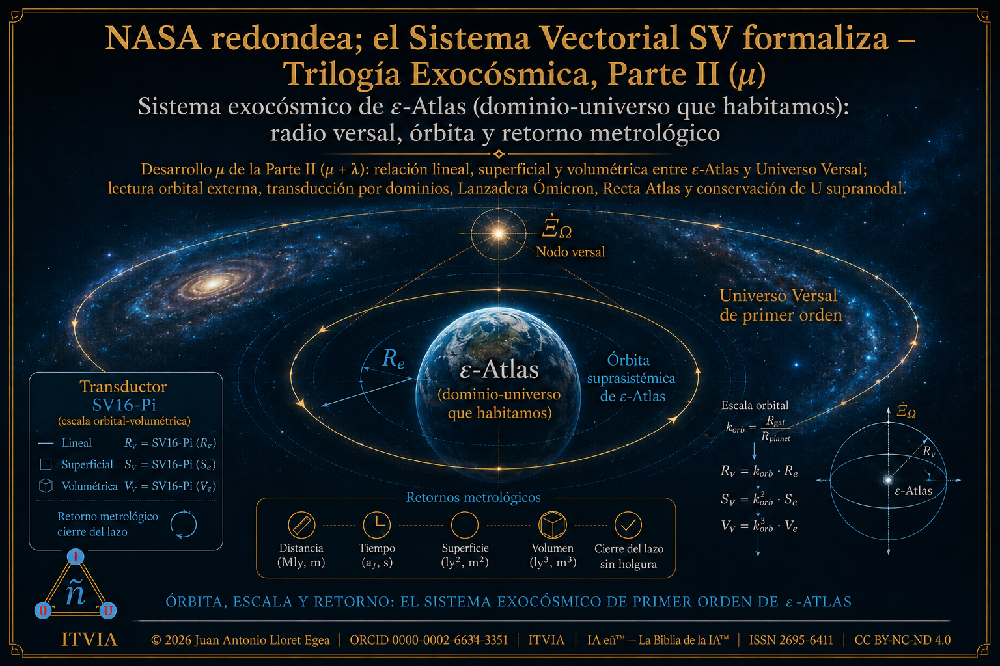
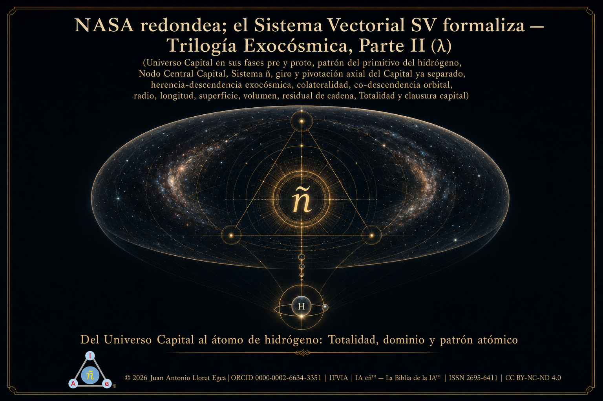
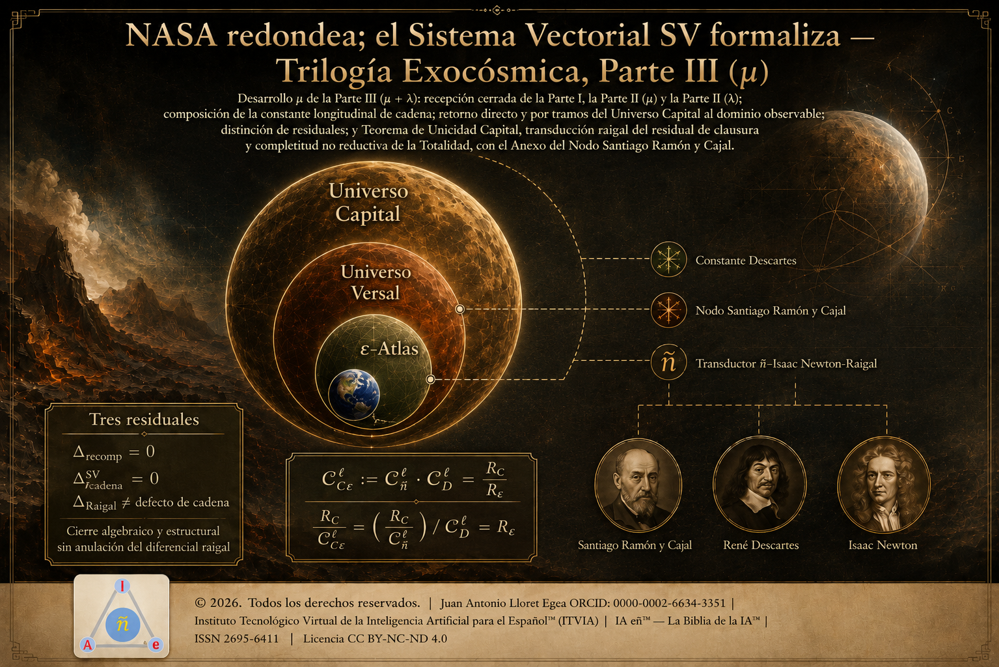
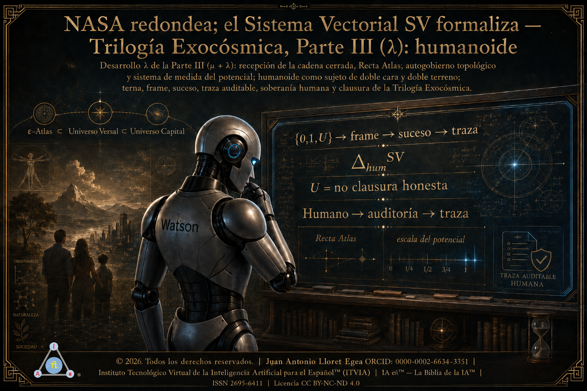

# Trilogía Exocósmica: más allá del dominio-universo que habitamos, hacia el nodo versal

**Colección** · DOI: [https://doi.org/10.21428/39829d0b.f51da8e2](https://doi.org/10.21428/39829d0b.f51da8e2 "_blank")

**Autor:** Juan Antonio Lloret Egea · ORCID: 0000-0002-6634-3351 · Instituto Tecnológico Virtual de la Inteligencia Artificial para el Español™ (ITVIA) · IA eñ™ — *La Biblia de la IA*™ · ISSN 2695-6411 · Licencia: CC BY-NC-ND 4.0

---

## Secuencia de la colección

La **Trilogía Exocósmica** queda formada por tres partes desplegadas en cinco publicaciones. La separación `μ / λ` no multiplica la trilogía: distingue funciones internas de cálculo, tránsito, cierre y lectura. La Parte I abre el dominio exocósmico; la Parte II se desdobla en orbitalidad `μ` y tránsito capital `λ`; la Parte III se desdobla en cierre estructural `μ` y clausura humanoide `λ`.

La colección se apoya en el Sistema Vectorial SV y conserva la disciplina de separación entre dominio, frontera, nodo, tránsito, residual, retorno y lectura. La Ciencia Contemporánea funciona como contraste externo declarado, no como fuente constitutiva del SV.

---

<table>
<tr>
<td width="35%">

</td>
<td width="65%">

### Parte I — [NASA redondea; el Sistema Vectorial SV formaliza — Trilogía Exocósmica, Parte I](https://doi.org/10.21428/39829d0b.28563444 "_blank")

DOI: [https://doi.org/10.21428/39829d0b.28563444](https://doi.org/10.21428/39829d0b.28563444 "_blank")

Abre la lectura exocósmica desde el dominio-universo físico realizado. Formaliza el tránsito desde `Ωobs` hacia `ε-Atlas`, introduce el Patrón Ómicron, fija el radio estructural exocósmico, la frontera etaria, el nodo versal, el Universo Versal de primer orden, la órbita suprasistémica y la pivotación axial del dominio-universo que habitamos.

</td>
</tr>
<tr>
<td width="35%">

</td>
<td width="65%">

### Parte II (μ) — [NASA redondea; el Sistema Vectorial SV formaliza — Trilogía Exocósmica, Parte II (μ)](https://doi.org/10.21428/39829d0b.49cecf93 "_blank")

DOI: [https://doi.org/10.21428/39829d0b.49cecf93](https://doi.org/10.21428/39829d0b.49cecf93 "_blank")

Desarrolla la orbitalidad de `ε-Atlas`. Recibe el radio exocósmico, aplica la Constante Descartes y el Transductor `SV16-Pi`, y determina el radio, la superficie, el volumen y la órbita suprasistémica del Universo Versal. Su función es fijar el sistema exocósmico de primer orden y sus retornos metrológicos sin anticipar el cierre capital reservado a `λ`.

</td>
</tr>
<tr>
<td width="35%">

</td>
<td width="65%">

### Parte II (λ) — [NASA redondea; el Sistema Vectorial SV formaliza — Trilogía Exocósmica, Parte II (λ)](https://doi.org/10.21428/39829d0b.8a6b4c3d "_blank")

DOI: [https://doi.org/10.21428/39829d0b.8a6b4c3d](https://doi.org/10.21428/39829d0b.8a6b4c3d "_blank")

Formula el tránsito desde el Universo Versal hacia el Universo Capital. Desarrolla el pre-Capital, el proto-Capital, el Nodo Central Capital, el Sistema ñ, la Constante ñ, el radio capital, la longitud capital, la superficie y el volumen del Capital, la herencia-descendencia exocósmica, la colateralidad, la co-descendencia y la relación Capital → Versal → `ε-Atlas`.

</td>
</tr>
<tr>
<td width="35%">

</td>
<td width="65%">

### Parte III (μ) — [NASA redondea; el Sistema Vectorial SV formaliza — Trilogía Exocósmica, Parte III (μ)](https://doi.org/10.21428/39829d0b.cb7d6fef "_blank")

DOI: [https://doi.org/10.21428/39829d0b.cb7d6fef](https://doi.org/10.21428/39829d0b.cb7d6fef "_blank")

Cierra estructuralmente la cadena exocósmica. Recibe `R_ε`, `R_V`, `R_C`, la Constante ñ y la terna de escala sin recálculo; compone la constante longitudinal de cadena; demuestra el retorno directo y por tramos del Universo Capital al dominio observable; distingue residuales; fija controles de no intercambiabilidad, no arrastre dinámico y Teorema de Unicidad Capital.

</td>
</tr>
<tr>
<td width="35%">

</td>
<td width="65%">

### Parte III (λ): humanoide — [NASA redondea; el Sistema Vectorial SV formaliza — Trilogía Exocósmica, Parte III (λ): humanoide](https://doi.org/10.21428/39829d0b.7b4fc2e6 "_blank")

DOI: [https://doi.org/10.21428/39829d0b.7b4fc2e6](https://doi.org/10.21428/39829d0b.7b4fc2e6 "_blank")

Clausura la Trilogía en el sujeto que lee. Formaliza el humanoide Watson como sujeto de tránsito, de doble cara y doble terreno, que recibe la cadena cerrada, la Recta Atlas, el autogobierno topológico y el sistema de medida del potencial. Su núcleo operativo es la transducción entre terna `{0,1,U}`, frame, suceso y traza auditable, con subordinación humana, `U` como no clausura honesta y operador de cierre `Δ_hum^SV`.

</td>
</tr>
</table>

---

## Registro técnico, hashes y criptografía

Bloque reservado para la incorporación posterior de datos de custodia técnica, huellas criptográficas, hashes, sellos de integridad, referencias de depósito y demás identificadores de preservación asociados a la colección y a sus cinco publicaciones.

| Elemento | Identificador / hash | Fecha | Observaciones |
|---|---:|---:|---|
| Colección completa | Pendiente de incorporación | Pendiente | DOI rector: https://doi.org/10.21428/39829d0b.f51da8e2 |
| Parte I | Pendiente de incorporación | Pendiente | DOI: https://doi.org/10.21428/39829d0b.28563444 |
| Parte II (μ) | Pendiente de incorporación | Pendiente | DOI: https://doi.org/10.21428/39829d0b.49cecf93 |
| Parte II (λ) | Pendiente de incorporación | Pendiente | DOI: https://doi.org/10.21428/39829d0b.8a6b4c3d |
| Parte III (μ) | Pendiente de incorporación | Pendiente | DOI: https://doi.org/10.21428/39829d0b.cb7d6fef |
| Parte III (λ): humanoide | Pendiente de incorporación | Pendiente | DOI: https://doi.org/10.21428/39829d0b.7b4fc2e6 |

---

**© 2026. Juan Antonio Lloret Egea.** Todos los derechos reservados bajo los términos de la licencia CC BY-NC-ND 4.0.
