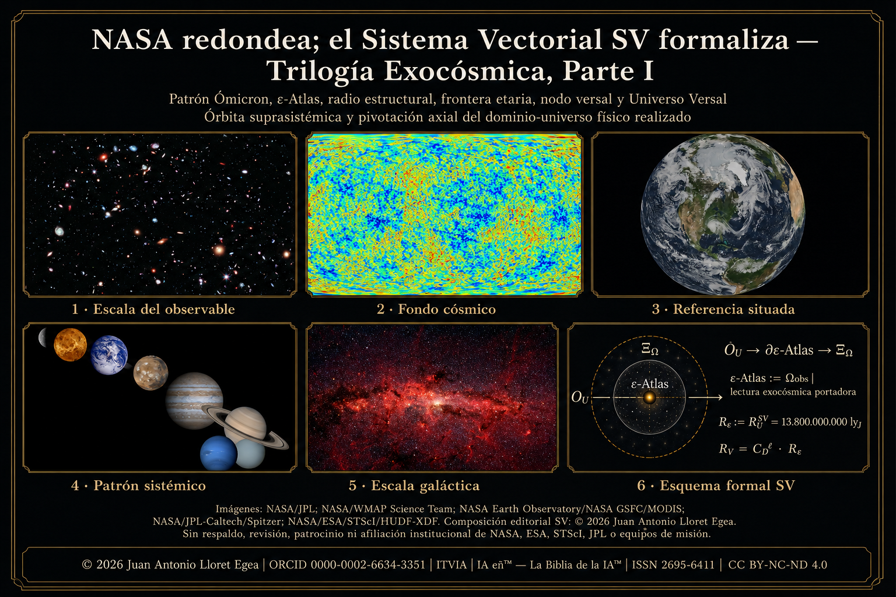
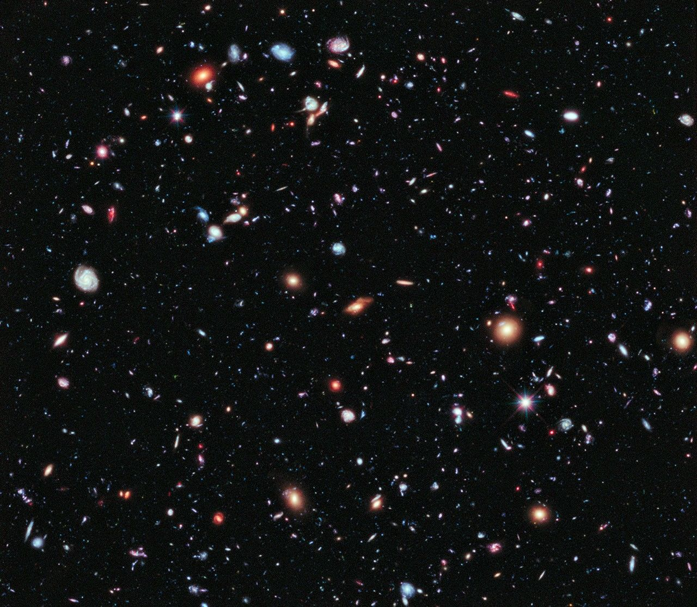
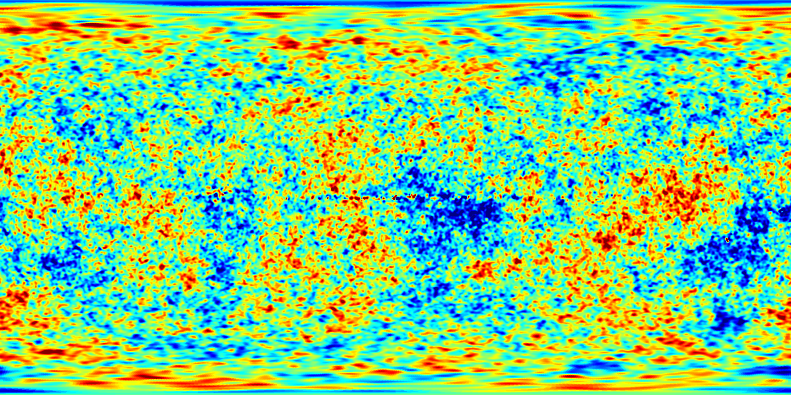

# NASA redondea; el Sistema Vectorial SV formaliza — Trilogía Exocósmica, Parte I

**Patrón Ómicron, ε-Atlas, radio estructural, frontera etaria, nodo versal, Universo Versal, órbita suprasistémica y pivotación axial del dominio-universo físico realizado**

**Autor:** Juan Antonio Lloret Egea  
**ORCID:** 0000-0002-6634-3351  
**Instituto Tecnológico Virtual de la Inteligencia Artificial para el Español (ITVIA)**  
**IA eñ™ — La Biblia de la IA™**  
**ISSN:** 2695-6411  
**Colección:** *Trilogía Exocósmica: más allá del dominio-universo que habitamos, hacia el nodo versal*  
**DOI de colección:** 10.21428/39829d0b.f51da8e2  
**DOI de la publicación:** 10.21428/39829d0b.28563444 

**URL canónica GitHub:** https://github.com/juantoniolloretegea/SV-matematica-semantica/tree/main/documentos/adendas/matematica-fisica-factual-contemporanea-sv/trilogia-exo-cosmica/primera-parte

## Resumen

En este trabajo se abre la *Trilogía Exocósmica* del Sistema Vectorial SV. Su objeto no consiste en reabrir la Trilogía Cosmológica ya cerrada, sino en prolongar formalmente su resultado hacia un régimen distinto: la lectura de ε-Atlas como dominio-universo físico realizado bajo Patrón Ómicron, frontera etaria, nodo versal, Universo Versal de primer orden, órbita suprasistémica y pivotación axial. Aquí, ε-Atlas no introduce un segundo dominio físico ni sustituye el radio ya calculado: designa el dominio-universo observable cerrado por la Trilogía Cosmológica cuando se lee bajo función portadora exocósmica. Por tanto, `∂ε-Atlas := ∂Ωobs` y `R_ε := R_U^SV = 13.800.000.000 ly_J`. La Ciencia Contemporánea conserva aquí su función propia como plano externo de contraste: describe, estima, redondea, comunica y ordena observaciones. El Sistema Vectorial SV formaliza bajo dominio declarado, origen, tramo, frontera, residual y retorno. La tesis de trabajo queda expresada en una fórmula rectora de lectura: NASA redondea; el Sistema Vectorial SV formaliza. Esta frase no formula oposición, sino distinción de función científica. El avance no consiste en negar el dato externo, sino en exigir que toda magnitud cosmológica o exocósmica declare qué dominio mide, desde qué origen opera, qué frontera atraviesa, qué patrón aplica, qué residual conserva y qué retorno permite.

Se definen y delimitan los nombres técnicos necesarios antes de su uso: Patrón Ómicron, ε-Atlas, nodo versal, Ξ_Ω, Constante Descartes de carga cosmológica compuesta, Universo Versal, radio estructural, frontera etaria, Lanzadera Ómicron, Recta-Ómicron, Línea del Umbral SV, edad relacional y clausura axial. Con esta nomenclatura, el desarrollo queda ordenado en tres bloques: primero, ε-Atlas como esfera estructural; segundo, el tránsito hacia el nodo versal y la constitución del Universo Versal de primer orden; tercero, la pivotación axial y el cierre angular del dominio. Además, se incorpora una precisión transversal necesaria para la continuidad posterior: la lectura exocósmica no se reduce a una recta ni a una nomenclatura lineal, sino que admite una formulación esférico-raigal de dominios finitos centrados en `O_U=(0,0)`, con primer umbral en la fibra/raigal y radio parametrizado por dominio. En esa formulación, la operación de Lanzadera Ómicron no actúa como transporte físico ni como fuente de subdominios no declarados; funciona como regla de tránsito, devolución y verificación de magnitudes cuando comparecen dominio, nodo, frontera, métrica, residual, retorno y traza suficientes. La traslación propia del Universo Versal hacia un nodo versal de rango posterior no declarado no se cierra como inventario material ni como cartografía de subdominios; queda formalmente formulable bajo Patrón Ómicron si se declaran las condiciones necesarias, y conserva U únicamente donde se pida un subdominio, nodo o retorno aún no declarado.

**Palabras clave:** Sistema Vectorial SV; Trilogía Exocósmica; Patrón Ómicron; ε-Atlas; nodo versal; Universo Versal; Constante Descartes; Lanzadera Ómicron; Recta-Ómicron; Línea del Umbral SV; esfera raigal; fibra; radio estructural; frontera etaria; órbita suprasistémica; pivotación axial; no clausura honesta.

## Abstract

This study opens the *Exocosmic Trilogy* of the Vectorial System SV. Its purpose is not to reopen the already closed Cosmological Trilogy, but to extend its formal result into a distinct regime: the reading of ε-Atlas as the realised physical universe-domain under the Omicron Pattern, age-boundary, versal node, first-order Versal Universe, suprasystemic orbit and axial pivoting. Here, ε-Atlas does not introduce a second physical domain and does not replace the radius already calculated: it designates the observable universe-domain closed by the Cosmological Trilogy when read under an exocosmic carrier function. Therefore, `∂ε-Atlas := ∂Ωobs` and `R_ε := R_U^SV = 13.800.000.000 ly_J`. Contemporary science keeps its proper role as an external plane of contrast: it describes, estimates, rounds, communicates and organises observations. The Vectorial System SV formalises through declared domain, origin, segment, boundary, residual and return. The guiding statement is therefore: NASA rounds; the Vectorial System SV formalises. This does not express opposition, but a distinction of scientific function. The advance does not consist in rejecting external data, but in requiring every cosmological or exocosmic magnitude to declare the domain it measures, the origin from which it operates, the boundary it crosses, the pattern it applies, the residual it preserves and the return it enables.

The study defines and delimits its technical terms before using them: Omicron Pattern, ε-Atlas, versal node, Ξ_Ω, Descartes Constant of composite cosmological charge, Versal Universe, structural radius, age-boundary, Omicron Launcher, Omicron Line, SV Threshold Line, relational age and axial closure. With this nomenclature, the development is organised into three blocks: first, ε-Atlas as a structural sphere; second, the transit towards the versal node and the constitution of the first-order Versal Universe; third, axial pivoting and angular closure of the domain. It also incorporates a transversal precision required for subsequent continuity: the exocosmic reading is not reduced to a line or to a linear nomenclature, but admits a root-fibre spherical formulation of finite domains centred at `O_U=(0,0)`, with a first threshold in the fibre/root and a radius parameterised by domain. In that formulation, the Omicron Launcher operation does not act as a physical vehicle or as a source of undeclared subdomains; it functions as a rule of transit, return and verification of magnitudes when sufficient domain, node, boundary, metric, residual, return and trace are declared. The suprasystemic translation of the Versal Universe towards an undeclared subsequent versal node is not closed as a material inventory or as subdomain cartography; it remains formally formulable under the Omicron Pattern if the required conditions are declared, and U is preserved only where an undeclared subdomain, node or return is requested.

**Keywords:** Vectorial System SV; Exocosmic Trilogy; Omicron Pattern; ε-Atlas; versal node; Versal Universe; Descartes Constant; Omicron Launcher; Omicron Line; SV Threshold Line; root-fibre sphere; fibre; structural radius; age-boundary; suprasystemic orbit; axial pivoting; honest non-closure.

## Prólogo de la Trilogía Exocósmica

La *Trilogía Exocósmica: más allá del dominio-universo que habitamos, hacia el nodo versal* se plantea como continuación formal de la Trilogía Cosmológica, no como corrección retroactiva de esta. La Trilogía Cosmológica fijó el dominio-universo observable, sus radios de lectura, la diferencia entre radio estructural, frontera situada, radio comóvil externo y retorno metrológico (Lloret Egea, 2026k, 2026l, 2026m). La lectura exocósmica comienza al considerar ese dominio no solo desde su propia frontera, sino desde la pregunta por su inscripción en un régimen envolvente de lectura: nodo versal, Universo Versal de primer orden, órbita suprasistémica y pivotación axial.

La primera parte establece el Patrón Ómicron y formaliza el paso desde ε-Atlas hacia el nodo versal. La segunda parte desarrollará el sistema exocósmico de ε-Atlas: radio orbital, diámetro, superficie, volumen, longitud de órbita, retornos metrológicos y relación volumétrica entre Universo Versal y ε-Atlas. La tercera parte tratará el ciclo exocósmico: pivotaciones, clausura, relación progenitor-descendiente, retorno y límites de determinación.

Junto a esa secuencia, esta primera parte incorpora una lectura radial más amplia: cada dominio puede formularse como esfera finita centrada en `O_U=(0,0)`, abierta por fibra/raigal y acotada por frontera, linaje, familia, especie, residual y retorno. Esta precisión no altera los cálculos cerrados del Patrón Ómicron; establece el lenguaje que impedirá confundir una apertura indefinida de dominios finitos con una esfera material infinita o con una cartografía de subdominios no declarados.

La trilogía no postula una exterioridad absoluta ni pretende cerrar la Totalidad. Su ámbito es más preciso: formaliza el régimen que aparece cuando el dominio-universo habitado se proyecta hacia frontera, nodo, órbita y clausura bajo condiciones SV. Cuando no comparece dominio suficiente, el sistema no fuerza conclusión y conserva U.

## Índice

Desplegar índice

- [Resumen](#resumen)
- [Abstract](#abstract)
- [Prólogo de la Trilogía Exocósmica](#prólogo-de-la-trilogía-exocósmica)
- [I. Estado del arte y problema de forma](#i-estado-del-arte-y-problema-de-forma)
  - [I.1. Universo observable, diámetro y esfera](#i1-universo-observable-diámetro-y-esfera)
  - [I.2. Radio, distancia y régimen cosmológico](#i2-radio-distancia-y-régimen-cosmológico)
  - [I.3. Alcance del contraste externo](#i3-alcance-del-contraste-externo)
- [II. Método: contraste externo y formalización SV](#ii-método-contraste-externo-y-formalización-sv)
- [III. Nomenclatura, función y etimología](#iii-nomenclatura-función-y-etimología)
  - [III.1. Patrón Ómicron](#iii1-patrón-ómicron)
  - [III.2. ε-Atlas](#iii2-ε-atlas)
  - [III.3. Nodo versal y Ξ_Ω](#iii3-nodo-versal-y-ξ_ω)
  - [III.4. Constante Descartes de carga cosmológica compuesta](#iii4-constante-descartes-de-carga-cosmológica-compuesta)
  - [III.5. Universo Versal](#iii5-universo-versal)
  - [III.6. Radio estructural, frontera etaria y Lanzadera Ómicron](#iii6-radio-estructural-frontera-etaria-y-lanzadera-ómicron)
  - [III.7. Recta-Ómicron y Línea del Umbral SV](#iii7-recta-ómicron-y-línea-del-umbral-sv)
  - [III.8. Edad relacional y clausura axial](#iii8-edad-relacional-y-clausura-axial)
- [IV. Patrón Ómicron](#iv-patrón-ómicron)
- [V. ε-Atlas como esfera estructural](#v-ε-atlas-como-esfera-estructural)
- [VI. Nodo versal, Constante Descartes y Universo Versal](#vi-nodo-versal-constante-descartes-y-universo-versal)
- [VII. Pivotación axial y cierre angular](#vii-pivotación-axial-y-cierre-angular)
- [VIII. Retornos metrológicos humanos](#viii-retornos-metrológicos-humanos)
- [IX. Relación volumétrica Universo Versal / ε-Atlas](#ix-relación-volumétrica-universo-versal-ε-atlas)
- [X. Restricciones de interpretación](#x-restricciones-de-interpretación)
- [XI. Resultados](#xi-resultados)
- [XII. Continuidad formal de la Trilogía Exocósmica](#xii-continuidad-formal-de-la-trilogía-exocósmica)
- [XIII. Conclusión](#xiii-conclusión)
- [XIV. Enlace formal con la Trilogía Cosmológica](#xiv-enlace-formal-con-la-trilogía-cosmológica)
  - [XIV.1. Función de enlace entre colecciones](#xiv1-función-de-enlace-entre-colecciones)
  - [XIV.2. Del dominio-universo observable a ε-Atlas](#xiv2-del-dominio-universo-observable-a-ε-atlas)
  - [XIV.3. Regla de no reapertura y continuidad de dominio](#xiv3-regla-de-no-reapertura-y-continuidad-de-dominio)
  - [XIV.4. Cadena de paso hacia la Trilogía Exocósmica](#xiv4-cadena-de-paso-hacia-la-trilogía-exocósmica)
  - [XIV.5. Puente hacia la formulación esférico-raigal](#xiv5-puente-hacia-la-formulación-esférico-raigal)
- [Anexo A. Esfera raigal como traslación exocosmológica de dominios finitos y Lanzadera Ómicron](#anexo-a-esfera-raigal-como-traslación-exocosmológica-de-dominios-finitos-y-lanzadera-ómicron)
- [Bibliografía](#bibliografía)
- [Cláusulas legales](#cláusulas-legales)

# I. Estado del arte y problema de forma

## I.1. Universo observable, diámetro y esfera

La Ciencia Contemporánea maneja el universo observable como región observable de escala finita para el observador. En formulaciones divulgativas recientes, NASA (2025) indica que el universo observable puede estimarse en torno a 92 mil millones de años luz de extensión transversal. Esa cifra comunica escala y permite orientar al lector, pero no agota el problema formal: decir “diámetro” exige declarar qué figura sostiene ese diámetro, qué régimen de distancia se usa y qué diferencia existe entre región observable, distancia comóvil, tiempo de viaje de la luz y tamaño total del universo.

La cuestión no es menor. Cuando se afirma un diámetro sin declarar el régimen geométrico, se introduce una magnitud útil para comunicación general, pero incompleta para cálculo formal. El Sistema Vectorial SV no rechaza esa comunicación: la conserva como contraste externo. Pero exige que toda magnitud cosmológica quede subordinada a dominio, origen, frontera, unidad, residual y retorno antes de adquirir rango formal.

<table>
<tr>
  <td width="38%" valign="top"></td>
  <td valign="top"><strong>Figura 1. Campo profundo y escala del observable.</strong>  
<strong>Uso en el texto:</strong> Imagen institucional conservada con el nombre de descarga original `STScI-01EVVD1H0Z5HWP2PPK7N0TMQN3.jpg`. Se incorpora como referencia visual de profundidad observacional y escala cosmológica, sin convertir el campo profundo en fundamento del cálculo SV.  
<strong>Crédito/fuente:</strong> NASA, ESA, STScI, G. Illingworth, D. Magee, P. Oesch, R. Bouwens y equipo HUDF/XDF, según el archivo de procedencia.  
<strong>Condiciones de uso:</strong> Imagen externa de contraste visual; véanse las cláusulas legales y la bibliografía final de imágenes y medios.</td>
</tr>
</table>

## I.2. Radio, distancia y régimen cosmológico

La literatura cosmológica distingue distintas medidas de distancia: distancia comóvil, distancia angular, distancia de luminosidad, tiempo de mirada retrospectiva, edad, volumen comóvil y otras magnitudes dependientes del modelo. Hogg (1999) ordena precisamente esa pluralidad y confirma una exigencia elemental: no basta con decir “distancia” si no se declara el régimen de lectura.

La Trilogía Cosmológica del SV ya separó tres magnitudes que no deben confundirse: el radio estructural `R_U^SV`, la salida situada de la Lanzadera `R_aux,loc^SV` y el radio comóvil externo. El primero lee desde el origen formal-material `O_U=(0,0)` hacia la frontera del dominio-universo; el segundo lee desde la Tierra hacia la frontera etaria/proyectada; el tercero pertenece al régimen externo de contraste cosmológico. La no coincidencia directa entre esas magnitudes no constituye contradicción, sino disciplina de dominio.

<table>
<tr>
  <td width="38%" valign="top"></td>
  <td valign="top"><strong>Figura 2. Fondo cósmico de microondas como grupo externo de contraste.</strong>  
<strong>Uso en el texto:</strong> Mapa WMAP ILC de cinco años conservado con el nombre de descarga original `wmap_ilc_5yr_v3_200uK_RGB.png`. Se incorpora para situar el régimen observacional contemporáneo y la necesidad de distinguir dato externo, modelo, distancia, edad y retorno.  
<strong>Crédito/fuente:</strong> NASA / WMAP Science Team.  
<strong>Condiciones de uso:</strong> Imagen externa de contraste visual; véanse las cláusulas legales y la bibliografía final de imágenes y medios.</td>
</tr>
</table>

## I.3. Alcance del contraste externo

El contraste externo conserva valor científico. NASA, ESA, JPL, IAU, trabajos técnicos sobre distancias cosmológicas y modelos ΛCDM aportan datos, escalas y lenguaje de comunicación. El SV no los toma como fuente constitutiva de verdad formal. Los toma como referencias externas que deben declararse, normalizarse y someterse a retorno.

La fórmula “NASA redondea; el Sistema Vectorial SV formaliza” se lee bajo esta regla. No acusa al plano externo de error general. Señala que la comunicación científica puede operar con redondeos, mientras que la formalización SV exige declarar dominio, origen, tramo, unidad, residual y retorno. El avance se obtiene cuando cada plano conserva su función: el lenguaje externo orienta; el SV formaliza.

# II. Método: contraste externo y formalización SV

El método se ordena mediante cinco reglas, en continuidad con los fundamentos algebraico-semánticos del SV (Lloret Egea, 2026a). La Ciencia Contemporánea entra como plano externo de contraste, no como fundamento formal del SV; ninguna magnitud se incorpora sin dominio declarado; ningún símbolo o nombre técnico se utiliza sin función y etimología previas; todo cálculo preserva residual y retorno; y, cuando faltan dominio, frontera, fuente, unidad, residual o retorno, el SV conserva U.

El método opera así en un régimen de doble disciplina. Hacia fuera, conserva datos y lenguaje científico contemporáneo cuando son útiles para orientar escala. Hacia dentro, exige que toda magnitud pase por Patrón Ómicron, Lanzadera Ómicron, Recta-Ómicron, Línea del Umbral SV, Constante Descartes y verificación de no contradicción con la ecuación rectora del SV.

# III. Nomenclatura, función y etimología

## III.1. Patrón Ómicron

**Función.** El Patrón Ómicron es la regla de formalización cosmológica y exocósmica que permite pasar desde origen formal, radio estructural, esfera auxiliar y frontera etaria hacia nodo versal, Universo Versal, órbita suprasistémica y pivotación axial.

**Etimología interna.** Ómicron se vincula al régimen de la Recta/Lanzadera Ómicron y queda reforzado por la denominación SV16-Ómicron en la tabla estructural SV. Aquí no actúa como rótulo añadido, sino como marca de tránsito, frontera, retorno y determinación dirigida.

**Precisión de uso.** No debe reducirse a una etiqueta formal sin operación. Su función se declara antes de aplicarlo y el término opera sobre una cadena definida.

**Condición de uso.** Su empleo queda restringido al sentido aquí fijado.

## III.2. ε-Atlas

**Función.** ε-Atlas designa el dominio-universo observable ya cerrado por la Trilogía Cosmológica cuando se lee bajo función portadora exocósmica. No introduce un segundo dominio físico, no desplaza `Ωobs` y no recalcula el radio estructural. Su identidad operativa se expresa en forma de definición formal:

`ε-Atlas := Ωobs | lectura exocósmica portadora`

`∂ε-Atlas := ∂Ωobs`

`R_ε := R_U^SV = D(O_U, ∂Ωobs) = D(O_U, ∂ε-Atlas)`

**Etimología interna.** ε conserva el régimen epsilon de dominio; Atlas nombra función portadora: soporte de un dominio completo. No introduce una figura mitológica como fundamento.

**Precisión de uso.** No debe leerse como denominación narrativa. El término designa el dominio observable cerrado por la Trilogía Cosmológica cuando se proyecta hacia el régimen exocósmico. Su radio operativo es `R_ε`, heredado por identidad formal de `R_U^SV`.

**Condición de uso.** Su uso queda limitado al dominio que aquí se define.

## III.3. Nodo versal y Ξ_Ω

**Función.** El nodo versal es el nodo funcional respecto del cual ε-Atlas presenta tránsito orbital suprasistémico. Su símbolo técnico es `Ξ_Ω`.

**Etimología interna.** “Nodo” evita el término centro físico ordinario. “Versal” se vincula al régimen abierto por el primer nodo exocósmico determinado por el SV. `Ξ` marca instancia externa de composición; `Ω` vincula el nodo al dominio-universo.

**Precisión de uso.** No designa un centro astronómico ordinario ni un punto físico observado. Nombra un nodo funcional de composición.

**Condición de uso.** Su uso queda circunscrito a esa función.

## III.4. Constante Descartes de carga cosmológica compuesta

**Función.** La Constante Descartes `𝒞_D^SV` conserva la carga cosmológica compuesta derivada de la comparación entre régimen sistémico orbital y subciclo interno de retorno.

**Etimología interna.** Descartes se invoca por la traducción de figura a cálculo y por la centralidad histórica de la geometría analítica. No importa la física cartesiana como fundamento.

**Precisión de uso.** Para impedir confusión con otros usos técnicos de `C_D`, se emplea siempre la notación completa `𝒞_D^SV`.

**Condición de uso.** Su uso queda vinculado a la carga cosmológica compuesta aquí definida.

## III.5. Universo Versal

**Función.** El Universo Versal es el dominio exocósmico de primer orden, centrado funcionalmente en el nodo versal `Ξ_Ω`, que contiene orbitalmente a ε-Atlas bajo Patrón Ómicron.

**Etimología interna.** “Universo” se usa como dominio ordenado de sucesos, no como Totalidad absoluta. “Versal” procede del nodo versal y nombra el régimen abierto cuando ε-Atlas se lee respecto de ese nodo.

**Precisión de uso.** No afirma el tamaño total del universo físico absoluto. Designa un universo de dominio SV, no la Totalidad.

**Condición de uso.** Su alcance queda limitado al primer dominio exocósmico definido aquí.

## III.6. Radio estructural, frontera etaria y Lanzadera Ómicron

**Función.** El radio estructural `R_U^SV` lee desde `O_U=(0,0)` hacia la frontera del dominio-universo observable cerrado por la Trilogía Cosmológica. En la lectura exocósmica, `R_ε := R_U^SV`. La frontera etaria delimita el borde de lectura del dominio. La operación de Lanzadera Ómicron permite una lectura situada, como la terrestre, hacia esa frontera, sin sustituir el radio estructural.

**Etimología interna.** Radio estructural nombra una magnitud de dominio; frontera etaria nombra límite de lectura, no pared física; Lanzadera Ómicron nombra tránsito nodal-etario.

**Precisión de uso.** `R_U^SV`, `R_ε`, `R_aux,loc^SV` y radio comóvil externo pertenecen a planos diferenciados: `R_U^SV` es la magnitud heredada de la Trilogía Cosmológica; `R_ε` es su notación operativa en ε-Atlas; `R_aux,loc^SV` es lectura situada de Lanzadera; el radio comóvil externo pertenece al contraste cosmológico contemporáneo.

**Condición de uso.** Cada término se usa solo dentro de su plano de lectura.

## III.7. Recta-Ómicron y Línea del Umbral SV

**Función.** La Recta-Ómicron designa la directriz formal de tránsito que permite orientar la Lanzadera Ómicron entre referencia situada, frontera y retorno. La Línea del Umbral SV designa la condición de paso en la que una magnitud queda suficientemente declarada para operar entre dominio, frontera y retorno, sin convertirse por ello en fundamento absoluto.

**Etimología interna.** “Recta” nombra dirección formal, no camino físico material; “Ómicron” conserva la familia de tránsito asociada a la Lanzadera. “Línea del Umbral” nombra el límite operativo de autorización formal: umbral como condición de paso, no como pared ni frontera total.

**Precisión de uso.** Recta-Ómicron y Línea del Umbral SV no son equivalentes. La primera orienta el tránsito; la segunda declara condición de paso y autorización formal.

**Condición de uso.** Ambos términos conservan usos diferenciados.

## III.8. Edad relacional y clausura axial

**Función.** La edad relacional expresa el retorno de una distancia estructural en `ly_J` a una magnitud etaria en `a_J` bajo dominio declarado. La clausura axial expresa la operación angular completa del dominio cuando este retorna a su orientación inicial tras un ciclo de `2π`.

**Etimología interna.** “Edad” nombra aquí relación de retorno, no fundamento temporal absoluto. “Relacional” indica dependencia de dominio, origen, frontera y unidad. “Clausura” nombra cierre de operación formal; “axial” nombra orientación respecto de eje, no rotación material de una frontera física.

**Precisión de uso.** La edad relacional no es edad absoluta de la Totalidad, y la clausura axial no significa desaparición física del dominio.

**Condición de uso.** Ambos términos se emplean solo bajo dominio, origen, frontera y retorno declarados.

# IV. Patrón Ómicron

El Patrón Ómicron es la regla de formalización cosmológica y exocósmica que permite pasar desde una magnitud comunicada o estimada hacia una cadena completa de dominio, origen, radio estructural, esfera auxiliar, frontera, retorno y clausura. Su función no consiste en sustituir la cosmología observacional ni en negar sus datos. Su función es distinta: exigir que la magnitud quede formalmente situada antes de operar con ella.

En esta formulación, el Patrón Ómicron ordena la transición:

`O_U → R_U^SV → R_ε := R_U^SV → esfera estructural de ε-Atlas → ∂ε-Atlas → Lanzadera Ómicron → nodo versal Ξ_Ω → Universo Versal → órbita → pivotación`

La cadena no debe leerse como una sucesión temporal. Es una relación de dependencia formal. Cada término comparece solo cuando el anterior ha declarado dominio suficiente. Si una etapa no dispone de dominio, frontera, residual o retorno, no se completa por inferencia favorable: queda en U.

## IV.1. Forma mínima del Patrón Ómicron

El Patrón Ómicron comienza con un dominio-universo declarado. Para este trabajo:

`D_Ω = ε-Atlas := Ωobs | lectura exocósmica portadora`

donde ε-Atlas designa el dominio-universo observable ya cerrado por la Trilogía Cosmológica cuando se lee como dominio portador del régimen exocósmico.

El origen formal-material de la lectura radial queda declarado como:

`O_U = (0,0)`

La frontera de ε-Atlas queda fijada por identidad formal con la frontera del dominio observable ya tratado:

`∂ε-Atlas := ∂Ωobs`

El radio operativo de ε-Atlas no se recalcula. Queda definido por herencia formal:

`R_ε := R_U^SV`

`R_U^SV = D(O_U, ∂Ωobs) = 13.800.000.000 ly_J`

Por tanto:

`R_ε = D(O_U, ∂ε-Atlas) = 13.800.000.000 ly_J`

La frontera `∂ε-Atlas` no es una pared física ni un borde absoluto de la Totalidad. Es el límite formal de lectura del dominio-universo tratado. La diferencia es esencial: el Patrón Ómicron no afirma haber cerrado el tamaño total de todo lo existente; formaliza un dominio declarado y sus retornos.

## IV.2. Cadena geométrica auxiliar

Una vez fijado `R_ε`, el Patrón Ómicron autoriza la esfera auxiliar:

`Sph_Ω^SV(R_ε)`

y desde ella las magnitudes geométricas asociadas:

`D_ε = 2R_ε`

`C_ε = 2πR_ε`

`S_ε = 4πR_ε²`

`V_ε = (4π/3)R_ε³`

Estas fórmulas no convierten la geometría auxiliar en fundamento formal ni sustituyen al dominio declarado. Operan como forma de retorno y de cálculo sobre ese dominio. La esfera se introduce porque el uso de diámetro, superficie o volumen exige declarar antes la figura que sostiene esas magnitudes. El SV no parte de “diámetro” como palabra suficiente; parte de dominio, radio, frontera y figura auxiliar.

## IV.3. Relación con la Lanzadera Ómicron

La operación de Lanzadera Ómicron no recalcula el radio estructural. Su función es situada y verificadora: permite leer desde una referencia local, como la Tierra, hacia la frontera etaria/proyectada del dominio, y también permite recomponer magnitudes ya calculadas cuando el cambio de origen queda declarado. La cadena propia de la Lanzadera admite esta forma formal:

`λ_acc → κ_∂←acc^SV → λ_∂ → Brazo_∂Ωobs^SV(Tierra) → R_aux,loc^SV`

De ahí:

`R_ε = D(O_U, ∂ε-Atlas) = R_U^SV`

`R_aux,loc^SV = D(Tierra, ∂ε-Atlas)`

Ambas magnitudes no compiten. Leen la misma frontera desde dos bases distintas. La no coincidencia directa no implica contradicción; expresa cambio de origen.

## IV.4. Regla de no sustitución de planos

El Patrón Ómicron impone tres prohibiciones de lectura.

Primera: `R_aux,loc^SV` no sustituye `R_ε` ni `R_U^SV`.

Segunda: el radio comóvil externo no sustituye el radio estructural SV.

Tercera: la frontera del dominio-universo no se convierte en borde absoluto de la Totalidad.

De estas prohibiciones se obtiene una regla de trabajo:

`R_ε := R_U^SV ≠ R_aux,loc^SV ≠ R_comóvil`

La desigualdad no indica error; expresa disciplina de dominio.

## IV.5. Condición de cierre del Patrón Ómicron

El cierre local del Patrón Ómicron requiere que todas las magnitudes empleadas queden definidas con dominio, origen, frontera, residual y retorno suficientes. Si alguna magnitud queda pendiente, no se declara cierre por plausibilidad. La salida correcta es U.

Por eso se puede cerrar la esfera estructural de ε-Atlas, el tránsito al nodo versal y el Universo Versal de primer orden, sin cerrar como inventario material la traslación propia del Universo Versal hacia un nodo versal de rango posterior no declarado. Esa cuestión no se fuerza en esta primera parte. Bajo Patrón Ómicron sería formulable si el objetivo futuro declarase dominio, nodo, frontera, residual y retorno suficientes; mientras tanto, la salida U se conserva únicamente para el subdominio, nodo o retorno aún no declarado, no para la forma matemática ya cerrada.

# V. ε-Atlas como esfera estructural

## V.1. Dominio declarado

El primer resultado consiste en fijar ε-Atlas como dominio-universo observable ya cerrado por la Trilogía Cosmológica cuando se lee bajo esfera estructural auxiliar exocósmica. Esta esfera no es la Totalidad ni una afirmación sobre el tamaño real absoluto del universo completo; es el dominio formal que el SV somete a radio, frontera, retorno y clausura.

La magnitud etaria de partida queda fijada como:

`A_Ωobs = 13.800.000.000 a_J`

La Trilogía Cosmológica fijó el radio estructural interno del dominio observable como:

`R_U^SV = cT_obs = 13.800.000.000 ly_J`

La Trilogía Exocósmica no recalcula esa magnitud ni la sustituye por el radio comóvil externo. La traslada a la notación propia de ε-Atlas:

`R_ε := R_U^SV`

Por tanto:

`R_ε = D(O_U, ∂ε-Atlas) = 13.800.000.000 ly_J`

con:

`O_U = (0,0)`

`∂ε-Atlas := ∂Ωobs`

<table>
<tr>
  <td width="38%" valign="top"></td>
  <td valign="top"><strong>Figura 3. Tierra como referencia situada.</strong>  
<strong>Uso en el texto:</strong> Imagen Blue Marble/MODIS conservada con el nombre de descarga original `blue_marble_modis_north_america_print.jpg`. Se incorpora para representar la referencia terrestre situada de la Lanzadera Ómicron, sin convertir la Tierra en centro cosmológico.  
<strong>Crédito/fuente:</strong> NASA Earth Observatory / NASA Goddard Space Flight Center / MODIS, según el archivo de procedencia.  
<strong>Condiciones de uso:</strong> Imagen externa de contraste visual; véanse las cláusulas legales y la bibliografía final de imágenes y medios.</td>
</tr>
</table>

## V.2. Radio, diámetro y circunferencia

Declarado el radio estructural heredado en notación ε-Atlas,

`R_ε = 13.800.000.000 ly_J`

el diámetro se expresa como:

`D_ε = 2R_ε`

`D_ε = 27.600.000.000 ly_J`

La circunferencia estructural auxiliar se expresa como:

`C_ε = 2πR_ε`

`C_ε = 86.707.957.239,0783 ly_J`

En metros:

`R_ε = 1,3055808052161504 × 10^26 m`

`D_ε = 2,6111616104323008 × 10^26 m`

`C_ε = 8,203206132669809 × 10^26 m`

## V.3. Superficie y volumen

La superficie de la esfera estructural de ε-Atlas es:

`S_ε = 4πR_ε²`

`S_ε = 2,3931396197985607 × 10^21 ly_J²`

En metros cuadrados:

`S_ε = 2,1419896936090227 × 10^53 m²`

El volumen auxiliar se expresa como:

`V_ε = (4π/3)R_ε³`

`V_ε = 1,100844225107338 × 10^31 ly_J³`

En metros cúbicos:

`V_ε = 9,32180209648921 × 10^78 m³`

## V.4. Edad observable y clausura axial-etaria

La edad observable retornada del dominio se conserva como:

`A_Ωobs = 13.800.000.000 a_J`

La clausura axial-etaria completa se define como:

`A_fin(ε-Atlas) = 2A_Ωobs`

`A_fin(ε-Atlas) = 27.600.000.000 a_J`

En segundos:

`A_Ωobs = 435.494.880.000.000.000 s`

`A_fin(ε-Atlas) = 870.989.760.000.000.000 s`

En unidades `UE_MFC`:

`A_Ωobs = 3.919.453.920.000.000.000 UE_MFC`

`A_fin(ε-Atlas) = 7.838.907.840.000.000.000 UE_MFC`

La clausura axial-etaria no significa desaparición absoluta del universo, extinción material ni cierre de la Totalidad; significa cierre de la operación axial completa del dominio ε-Atlas bajo Patrón Ómicron.

## V.5. Tasa angular factual

La pivotación completa de la esfera estructural se asocia a un cierre angular de `2π` sobre el ciclo axial-etario completo:

`ω_Ω^SV = 2π / A_fin(ε-Atlas)`

`ω_Ω^SV = 2,2765164156447775 × 10^-10 rad/a_J`

En segundos externos:

`ω_Ω^SV = 7,213845208903014 × 10^-18 rad/s`

Este valor no debe leerse como velocidad física de materia en la frontera. Es una tasa angular factual de cierre del dominio. La frontera no gira como pared material; el dominio completa una operación axial de retorno.

## V.6. Recorrido estructural por año juliano

La longitud de la circunferencia estructural dividida por la clausura axial-etaria produce:

`C_ε / A_fin(ε-Atlas) = π ly_J/a_J`

En retorno métrico externo:

`π ly_J/a_J = 941.825.783,6544266 m/s`

Esta magnitud tampoco debe leerse como velocidad física ordinaria. Es una tasa de recorrido estructural sobre la circunferencia auxiliar del dominio. Al retornarse a `m/s`, la tasa adquiere una cifra superior a `c`; no se presenta como velocidad física, desplazamiento material ni señal local, por lo que no compite con el límite relativista de propagación física. Describe retorno formal de recorrido sobre una esfera auxiliar declarada.

## V.7. Retorno a patrones humanos

Para evitar que las magnitudes pierdan legibilidad por escala, cada resultado principal se devuelve a patrones físicos reconocibles.

| Magnitud | Valor |
|---|---:|
| `1 ly_J` en distancias Tierra-Luna | `24.611.681,77050156` |
| `1 ly_J` en distancias Tierra-Sol | `63.241,07708426628 au` |
| `1 ly_J` en patrón Tierra/Sol-centro galáctico | `1/26.000` |

Aplicado al radio estructural:

| Magnitud | Resultado |
|---|---:|
| `R_ε` en distancias Tierra-Luna | `3,396412084329 × 10^17` |
| `R_ε` en distancias Tierra-Sol | `8,727268637629 × 10^14 au` |
| `R_ε` en patrón Tierra/Sol-centro galáctico | `530.769,230769` |

Aplicado al diámetro:

| Magnitud | Resultado |
|---|---:|
| `D_ε` en distancias Tierra-Luna | `6,792824168658 × 10^17` |
| `D_ε` en distancias Tierra-Sol | `1,745453727526 × 10^15 au` |
| `D_ε` en patrón Tierra/Sol-centro galáctico | `1.061.538,461538` |

Aplicado a la circunferencia:

| Magnitud | Resultado |
|---|---:|
| `C_ε` en distancias Tierra-Luna | `2,134028650538 × 10^18` |
| `C_ε` en distancias Tierra-Sol | `5,483504607576 × 10^15 au` |
| `C_ε` en patrón Tierra/Sol-centro galáctico | `3.334.921,432272` |

## V.8. Resultado de ε-Atlas como esfera estructural

| Magnitud | Resultado |
|---|---:|
| Radio ε-Atlas heredado `R_ε := R_U^SV` | `13.800.000.000 ly_J` |
| Diámetro ε-Atlas `D_ε` | `27.600.000.000 ly_J` |
| Circunferencia ε-Atlas `C_ε` | `86.707.957.239,0783 ly_J` |
| Superficie auxiliar `S_ε` | `2,3931396197985607 × 10^21 ly_J²` |
| Volumen auxiliar `V_ε` | `1,100844225107338 × 10^31 ly_J³` |
| Edad observable retornada | `13.800.000.000 a_J` |
| Clausura axial-etaria | `27.600.000.000 a_J` |
| Tasa angular factual | `2,2765164156447775 × 10^-10 rad/a_J` |
| Recorrido estructural por año juliano | `π ly_J/a_J` |

## V.9. Restricciones de interpretación de este bloque

El resultado anterior no autoriza ninguna de estas lecturas:

`ε-Atlas = Totalidad`

`∂ε-Atlas = borde absoluto de todo lo existente`

`R_ε = radio comóvil externo`

`R_ε = R_aux,loc^SV`

`A_fin = extinción material absoluta del universo`

`π ly_J/a_J = velocidad material de frontera`

La lectura correcta es:

`ε-Atlas = dominio-universo físico realizado tratado como esfera estructural auxiliar bajo Patrón Ómicron`

`R_ε = D(O_U, ∂ε-Atlas) = R_U^SV`

`A_fin = clausura axial-etaria completa del dominio`

Con estas restricciones, queda habilitado el enlace formal de ε-Atlas con el nodo versal y con el Universo Versal de primer orden.

# VI. Nodo versal, Constante Descartes y Universo Versal

## VI.1. Del borde de ε-Atlas al nodo versal

Una vez fijado ε-Atlas como esfera estructural auxiliar, el Patrón Ómicron permite formular una segunda operación: no ya la lectura interna del radio del dominio, sino su proyección hacia un nodo externo de composición.

Ese nodo se denomina nodo versal y se simboliza como:

`Ξ_Ω`

El nodo versal no es un centro físico ordinario ni un punto astronómico localizado por observación instrumental. Es el nodo funcional respecto del cual ε-Atlas presenta tránsito orbital suprasistémico bajo Patrón Ómicron. Su función consiste en permitir la lectura exocósmica de primer orden: desde el dominio-universo que habitamos hacia el régimen que lo contiene orbitalmente.

La transición formal se expresa como:

`ε-Atlas → ∂ε-Atlas → Ξ_Ω`

O, en lectura radial desde el origen formal-material:

`O_U → ∂ε-Atlas → Ξ_Ω`

con:

`O_U = (0,0)`

`∂ε-Atlas = frontera etaria del dominio-universo`

`Ξ_Ω = nodo versal`

## VI.2. Carga cosmológica compuesta

La objeción más fuerte contra una extrapolación cosmológica sería tratar ε-Atlas como cuerpo aislado. La formulación del Patrón Ómicron evita esa reducción. La carga que se traslada debe ser carga compuesta: sistema, órbita, subciclo, retorno.

Por ello se toma como patrón externo subordinado la relación entre:

`Sistema Solar ↔ centro galáctico`

y el subciclo interno:

`Tierra ↔ Sol`

No se importa el modelo externo como fundamento del SV. Se toma como referencia externa de contraste para construir una carga formal compuesta. NASA describe el ciclo orbital solar-galáctico en torno a 230 millones de años (NASA Goddard Space Flight Center, s. f.) y JPL/IAU fijan la unidad astronómica como patrón metrológico externo (International Astronomical Union, 2012; Jet Propulsion Laboratory, Center for Near Earth Object Studies, s. f.); esas referencias no gobiernan el cálculo SV, pero estabilizan la escala externa usada en el retorno. El par `230.000.000 a_J` y `26.000 ly_J` se adopta como patrón externo subordinado compuesto, no como determinación observacional única ni como cierre contemporáneo absoluto.

<table>
<tr>
  <td width="38%" valign="top"></td>
  <td valign="top"><strong>Figura 4. Sistema Solar como patrón externo subordinado.</strong>  
<strong>Uso en el texto:</strong> Montaje del Sistema Solar `PIA03153`, conservado con el nombre de descarga original `jpegPIA03153.jpg`. Se incorpora como referencia visual del subciclo sistémico empleado en la carga cosmológica compuesta; no funda el cálculo ni sustituye el dominio declarado.  
<strong>Crédito/fuente:</strong> NASA/JPL, *Solar System Montage — High Resolution 2001 Version*.  
<strong>Condiciones de uso:</strong> Imagen externa de contraste visual; véanse las cláusulas legales y la bibliografía final de imágenes y medios.</td>
</tr>
<tr>
  <td width="38%" valign="top"></td>
  <td valign="top"><strong>Figura 5. Escala galáctica y régimen orbital compuesto.</strong>  
<strong>Uso en el texto:</strong> Imagen galáctica infrarroja conservada con el nombre de descarga original `ssc2006-02a1.jpg`. Se incorpora como referencia visual del régimen `Sistema Solar ↔ centro galáctico` dentro de la Constante Descartes de carga cosmológica compuesta.  
<strong>Crédito/fuente:</strong> NASA/JPL-Caltech/Spitzer Space Telescope, según el archivo de procedencia.  
<strong>Condiciones de uso:</strong> Imagen externa de contraste visual; véanse las cláusulas legales y la bibliografía final de imágenes y medios.</td>
</tr>
</table>

Definimos:

`𝒞_D^SV = (C_D^τ, C_D^ℓ, C_D^ρ)`

donde:

`C_D^τ = T_SS↻Gal / T_⊕`

`C_D^ℓ = L_SS↻Gal / L_⊕`

`C_D^ρ = C_D^ℓ / C_D^τ`

Con:

`T_SS↻Gal = 230.000.000 a_J`

`T_⊕ = 1 a_J`

`R_SS↔GC = 26.000 ly_J`

`L_SS↻Gal = 2π · 26.000 ly_J`

`L_⊕ = 2π · 1 au`

Como ambas longitudes son circunferencias de referencia, `2π` cancela:

`C_D^ℓ = 26.000 ly_J / 1 au`

y con:

`1 ly_J = 63.241,07708426628 au`

se obtiene:

`C_D^ℓ = 1.644.268.004,1909232869849931627402501525`

La constante adopta esta forma:

`𝒞_D^SV = (230.000.000, 1.644.268.004,1909232869849931627402501525, 7,148991322569232)`

Su lectura es estricta: constante vectorial adimensional de carga cosmológica compuesta. No mide un objeto aislado. Conserva la relación entre régimen orbital compuesto y subciclo interno de retorno.

## VI.3. Distancia directa desde O_U hasta el nodo versal

El radio estructural de ε-Atlas es:

`R_ε := R_U^SV = 13.800.000.000 ly_J`

La distancia directa desde `O_U` hasta el nodo versal se obtiene por:

`D(O_U, Ξ_Ω) = C_D^ℓ · R_ε`

Sustituyendo:

`D(O_U, Ξ_Ω) = 1.644.268.004,1909232869849931627402501525 · 13.800.000.000 ly_J`

Resultado:

`D(O_U, Ξ_Ω) = 22.690.898.457.834.741.360,3929056458 ly_J`

En metros:

`D(O_U, Ξ_Ω) = 2,146724744902738 × 10^35 m`

Esta magnitud será el radio del Universo Versal de primer orden.

## VI.4. Doble vía de composición

El Patrón Ómicron exige comprobar que la lectura directa y la lectura compuesta coinciden.

La vía directa es:

`O_U → Ξ_Ω`

con resultado:

`D(O_U, Ξ_Ω) = 22.690.898.457.834.741.360,3929056458 ly_J`

La vía compuesta es:

`O_U → ∂ε-Atlas → Ξ_Ω`

Primero:

`D(O_U, ∂ε-Atlas) = R_ε = 13.800.000.000 ly_J`

Después:

`D(∂ε-Atlas, Ξ_Ω) = D(O_U, Ξ_Ω) − R_ε`

`D(∂ε-Atlas, Ξ_Ω) = 22.690.898.444.034.741.360,3929056458 ly_J`

Composición:

`D(O_U, ∂ε-Atlas) + D(∂ε-Atlas, Ξ_Ω)`

`= 13.800.000.000 + 22.690.898.444.034.741.360,3929056458`

`= 22.690.898.457.834.741.360,3929056458 ly_J`

La diferencia entre la vía directa y la vía compuesta es:

`0`

Por tanto:

`D_directa = D_compuesta`

La doble vía queda cerrada.

## VI.5. Lectura situada desde Tierra

La operación de Lanzadera Ómicron permite una lectura situada desde Tierra hacia la frontera etaria de ε-Atlas:

`R_aux,loc^SV = D(Tierra, ∂ε-Atlas)`

El valor operativo localizado en la Trilogía Cosmológica es:

`R_aux,loc^SV ≈ 68.012,8263 ly_J`

Por tanto, la ruta situada hacia el nodo versal se expresa como:

`D(Tierra, Ξ_Ω) = D(Tierra, ∂ε-Atlas) + D(∂ε-Atlas, Ξ_Ω)`

`D(Tierra, Ξ_Ω) = 68.012,8263 + 22.690.898.444.034.741.360,3929056458`

Resultado:

`D(Tierra, Ξ_Ω) = 22.690.898.444.034.809.373,2192056458 ly_J`

Esta magnitud no sustituye la distancia canónica desde `O_U`. Es una lectura situada, útil para comprobar la recomposición de frontera y cambio de origen. La lectura canónica del radio versal sigue siendo:

`D(O_U, Ξ_Ω)`

## VI.6. Edad relacional del nodo versal

En régimen SV, la lectura radial en `ly_J` admite retorno etario relacional en `a_J` cuando la magnitud se formula como trayectoria luminosa compatible.

Por tanto:

`A(Ξ_Ω | ε-Atlas) = D(O_U, Ξ_Ω)`

Resultado:

`A(Ξ_Ω | ε-Atlas) = 22.690.898.457.834.741.360,3929056458 a_J`

En segundos:

`A(Ξ_Ω | ε-Atlas) = 716.070.297.172.965.633.954.735.159,2083857 s`

En `UE_MFC`:

`A(Ξ_Ω | ε-Atlas) = 6.444.632.674.556.690.705.592.616.432,875471 UE_MFC`

En ciclos de clausura de ε-Atlas:

`A(Ξ_Ω | ε-Atlas) / A_fin(ε-Atlas) = 822.134.002,0954616435`

El nodo versal queda, por tanto, a:

`822.134.002,0954616435`

clausuras completas de ε-Atlas, medidas desde `O_U`.

## VI.7. Universo Versal

Definimos Universo Versal como el dominio exocósmico de primer orden, centrado funcionalmente en el nodo versal `Ξ_Ω`, que contiene orbitalmente a ε-Atlas bajo Patrón Ómicron.

Su radio es:

`R_V = D(O_U, Ξ_Ω)`

Por tanto:

`R_V = 22.690.898.457.834.741.360,3929056458 ly_J`

El diámetro versal es:

`D_V = 2R_V`

`D_V = 45.381.796.915.669.482.720,7858112916 ly_J`

La circunferencia versal, que coincide con la longitud orbital interna de ε-Atlas alrededor del nodo versal, es:

`C_V = 2πR_V`

`C_V = 142.571.119.796.971.184.462,0778603565 ly_J`

La superficie auxiliar versal es:

`S_V = 4πR_V²`

`S_V = 6,470133604665731 × 10^39 ly_J²`

El volumen auxiliar versal es:

`V_V = (4π/3)R_V³`

`V_V = 4,893771487736479 × 10^58 ly_J³`

## VI.8. Traslación orbital de ε-Atlas dentro del Universo Versal

La órbita interna de ε-Atlas alrededor del nodo versal se calcula por:

`L_orb(ε-Atlas | Universo Versal) = 2πR_V`

Resultado:

`L_orb(ε-Atlas | Universo Versal) = 142.571.119.796.971.184.462,0778603565 ly_J`

En metros:

`L_orb = 1,348826937573173 × 10^36 m`

En patrones humanos:

`L_orb ≈ 3,5089150301071099 × 10^27` distancias Tierra-Luna

`L_orb ≈ 9,016351177070417 × 10^24 au`

`L_orb ≈ 5,483504607575815 × 10^15` veces la distancia Tierra/Sol-centro galáctico

Esta órbita no se presenta como observación astronómica contemporánea. Es una longitud de recorrido orbital bajo dominio SV.

## VI.9. Duración de traslación compuesta

La carga etaria de la Constante Descartes es:

`C_D^τ = 230.000.000`

La clausura axial-etaria de ε-Atlas es:

`A_fin(ε-Atlas) = 27.600.000.000 a_J`

Por tanto, la duración de traslación compuesta de ε-Atlas dentro del Universo Versal se expresa como:

`T_tras^SV(ε-Atlas | Universo Versal) = C_D^τ · A_fin(ε-Atlas)`

`T_tras^SV = 230.000.000 · 27.600.000.000 a_J`

Resultado:

`T_tras^SV = 6.348.000.000.000.000.000 a_J`

En segundos:

`T_tras^SV = 200.327.644.800.000.000.000.000.000 s`

En `UE_MFC`:

`T_tras^SV = 1.802.948.803.200.000.000.000.000.000 UE_MFC`

## VI.10. Tasa factual de recorrido orbital

La tasa factual de recorrido orbital se obtiene por:

`L_orb / T_tras^SV`

Resultado:

`L_orb / T_tras^SV = 22,459218619560678 ly_J/a_J`

En retorno externo:

`6.733.104.354,717463 m/s`

Esta magnitud no se interpreta como velocidad física de materia ni como señal local. Es tasa factual de recorrido orbital del dominio ε-Atlas dentro del Universo Versal.

# VII. Pivotación axial y cierre angular

## VII.1. Naturaleza formal de la pivotación

La pivotación axial de ε-Atlas no es traslación alrededor del nodo versal. Tampoco es rotación mecánica de materia en una frontera física. Es la operación angular interna por la cual el dominio-universo físico realizado recorre su simetría axial completa y retorna a su orientación inicial bajo Patrón Ómicron.

La traslación relaciona ε-Atlas con el nodo versal `Ξ_Ω`.

La pivotación relaciona ε-Atlas consigo mismo como dominio axial.

Por tanto:

`Tras^SV(ε-Atlas, Ξ_Ω) ≠ Piv^SV(ε-Atlas)`

La primera pertenece al tránsito orbital suprasistémico; la segunda pertenece al cierre angular interno del dominio.

## VII.2. Eje axial de ε-Atlas

Se define el eje axial de ε-Atlas como la directriz formal de simetría que permite distinguir orientación inicial, semipivotación, orientación opuesta y retorno completo.

Se denota:

`Eje_Ω^SV`

Su función no es introducir un eje físico observable en el sentido astronómico contemporáneo, sino declarar la orientación formal mínima necesaria para que la esfera estructural tenga pivotación definida.

La operación axial se denota:

`Piv^SV(ε-Atlas)`

y su ciclo angular completo se expresa como:

`0 → π/2 → π → 3π/2 → 2π`

## VII.3. Datos de entrada

El tramo anterior fijó:

`R_ε := R_U^SV = 13.800.000.000 ly_J`

`A_Ωobs = 13.800.000.000 a_J`

`A_fin(ε-Atlas) = 27.600.000.000 a_J`

El ciclo angular completo de pivotación se define por:

`2π rad = 360°`

La semipivotación se define por:

`π rad = 180°`

El cuadrante axial se define por:

`π/2 rad = 90°`

## VII.4. Cortes de pivotación

La pivotación de ε-Atlas se organiza en cinco cortes canónicos:

| Corte angular | Corte etario | Lectura axial |
|---|---:|---|
| `0` | `0 a_J` | orientación inicial |
| `π/2` | `6.900.000.000 a_J` | primer cruce ortogonal |
| `π` | `13.800.000.000 a_J` | semipivotación / orientación opuesta |
| `3π/2` | `20.700.000.000 a_J` | segundo cruce ortogonal |
| `2π` | `27.600.000.000 a_J` | retorno axial completo |

La semipivotación no cierra el dominio. La semipivotación alcanza la orientación opuesta. El cierre exige retorno completo a `2π`.

Por tanto:

`Piv_semi^SV(ε-Atlas) = 13.800.000.000 a_J`

`Piv_full^SV(ε-Atlas) = 27.600.000.000 a_J`

## VII.5. Tasa angular de pivotación

La tasa angular factual se obtiene dividiendo el ciclo angular completo entre la clausura axial-etaria:

`ω_piv^SV = 2π / A_fin(ε-Atlas)`

`ω_piv^SV = 2π / 27.600.000.000`

Resultado:

`ω_piv^SV = 2,2765164156447775 × 10^-10 rad/a_J`

En grados por año juliano:

`ω_piv^SV = 1,3043478260869565 × 10^-8 °/a_J`

En segundos externos:

`ω_piv^SV = 7,213845208903014 × 10^-18 rad/s`

La magnitud anterior no se interpreta como velocidad angular física de una frontera material. Es tasa angular factual de cierre axial.

## VII.6. Años por grado, minuto y segundo de arco

La pivotación completa contiene `360°` y dura:

`27.600.000.000 a_J`

Por tanto:

`a_J/° = 27.600.000.000 / 360`

Resultado:

`76.666.666,6666667 a_J/°`

Como:

`1° = 60′`

entonces:

`a_J/′ = 76.666.666,6666667 / 60`

Resultado:

`1.277.777,77777778 a_J/′`

Como:

`1′ = 60″`

entonces:

`a_J/″ = 1.277.777,77777778 / 60`

Resultado:

`21.296,2962963 a_J/″`

Estos valores son útiles para leer la escala angular del dominio: una variación de un solo segundo de arco en la pivotación axial de ε-Atlas equivale a `21.296,2962963 a_J` de recorrido factual de pivotación.

## VII.7. Arcos estructurales de pivotación

El radio estructural es:

`R_ε = 13.800.000.000 ly_J`

El arco de semipivotación es:

`Arc_π = πR_ε`

Resultado:

`Arc_π = 43.353.978.619,5391 ly_J`

El arco completo de pivotación es:

`Arc_2π = 2πR_ε`

Resultado:

`Arc_2π = 86.707.957.239,0783 ly_J`

Este último coincide con la circunferencia estructural ya calculada para ε-Atlas:

`Arc_2π = C_ε`

## VII.8. Retorno humano de los arcos de pivotación

La semipivotación se devuelve a patrones humanos en esta forma:

| Magnitud | Resultado |
|---|---:|
| `Arc_π` en distancias Tierra-Luna | `1,067014325269 × 10^18` |
| `Arc_π` en distancias Tierra-Sol | `2,741752303788 × 10^15 au` |
| `Arc_π` en patrón Tierra/Sol-centro galáctico | `1.667.460,716136` |

La pivotación completa se devuelve a patrones humanos en esta forma:

| Magnitud | Resultado |
|---|---:|
| `Arc_2π` en distancias Tierra-Luna | `2,134028650538 × 10^18` |
| `Arc_2π` en distancias Tierra-Sol | `5,483504607576 × 10^15 au` |
| `Arc_2π` en patrón Tierra/Sol-centro galáctico | `3.334.921,432272` |

## VII.9. Cierre angular por correlador factual acoplado

El régimen angular del SV usa el correlador factual acoplado:

`C_SV(δ) = −cosδ`

Aplicado a los cortes de pivotación:

| Corte | `δ` | `C_SV(δ)` | Lectura axial |
|---|---:|---:|---|
| Inicio | `0` | `−1` | orientación inicial |
| Primer cruce | `π/2` | `0` | ortogonalidad |
| Semipivotación | `π` | `+1` | orientación opuesta |
| Segundo cruce | `3π/2` | `0` | ortogonalidad |
| Retorno completo | `2π` | `−1` | recuperación de orientación inicial |

La tabla confirma que el semipivote no equivale a cierre completo. En `π`, el dominio alcanza orientación opuesta. En `2π`, el dominio retorna a su orientación inicial.

Por tanto:

`δ = π` produce inversión axial.

`δ = 2π` produce retorno axial completo.

## VII.10. Relación entre pivotación y traslación versal

La Constante Descartes de carga cosmológica compuesta fija:

`C_D^τ = 230.000.000`

La duración de una traslación compuesta de ε-Atlas dentro del Universo Versal es:

`T_tras^SV(ε-Atlas | Universo Versal) = C_D^τ · A_fin(ε-Atlas)`

Por tanto, durante una traslación completa de ε-Atlas alrededor del nodo versal, el dominio ejecuta:

`230.000.000` pivotaciones axiales completas

`460.000.000` semipivotaciones

`920.000.000` cuadrantes axiales

El total de grados acumulados por traslación compuesta es:

`230.000.000 · 360°`

Resultado:

`82.800.000.000°`

En radianes:

`230.000.000 · 2π`

Resultado:

`1.445.132.620,6513 rad`

La lectura correcta es que la traslación compuesta contiene una estructura axial interna. No se declara rotación material de frontera ni movimiento físico de sustancia a velocidad supralumínica.

## VII.11. Pivotación del Universo Versal de primer orden

El Universo Versal de primer orden tiene radio:

`R_V = 22.690.898.457.834.741.360,3929056458 ly_J`

Por aplicación del mismo Patrón Ómicron, su semipivotación es:

`Piv_semi^SV(Universo Versal) = R_V`

Resultado:

`Piv_semi^SV(Universo Versal) = 22.690.898.457.834.741.360,3929056458 a_J`

Su pivotación completa es:

`Piv_full^SV(Universo Versal) = 2R_V`

Resultado:

`Piv_full^SV(Universo Versal) = 45.381.796.915.669.482.720,7858112916 a_J`

Su cuadrante axial es:

`Piv_quad^SV(Universo Versal) = R_V / 2`

Resultado:

`Piv_quad^SV(Universo Versal) = 11.345.449.228.917.370.680,1964528229 a_J`

La relación entre la clausura versal y la clausura de ε-Atlas es:

`Piv_full^SV(Universo Versal) / Piv_full^SV(ε-Atlas) = R_V / R_ε`

Resultado:

`1.644.268.004,1909232869849931627402501525`

Es decir, una clausura axial completa del Universo Versal contiene:

`1.644.268.004,1909232869849931627402501525`

clausuras axiales completas de ε-Atlas.

## VII.12. Resultado de pivotación axial

| Magnitud | Resultado |
|---|---:|
| Semipivotación de ε-Atlas | `13.800.000.000 a_J` |
| Pivotación completa de ε-Atlas | `27.600.000.000 a_J` |
| Cuadrante axial de ε-Atlas | `6.900.000.000 a_J` |
| Tasa angular factual | `2,2765164156447775 × 10^-10 rad/a_J` |
| Grados por año juliano | `1,3043478260869565 × 10^-8 °/a_J` |
| Años por grado | `76.666.666,6666667 a_J/°` |
| Años por minuto de arco | `1.277.777,77777778 a_J/′` |
| Años por segundo de arco | `21.296,2962963 a_J/″` |
| Arco de semipivotación | `43.353.978.619,5391 ly_J` |
| Arco completo de pivotación | `86.707.957.239,0783 ly_J` |
| Pivotaciones de ε-Atlas por traslación versal | `230.000.000` |
| Semipivotaciones por traslación versal | `460.000.000` |
| Cuadrantes por traslación versal | `920.000.000` |
| Semipivotación del Universo Versal | `22.690.898.457.834.741.360,3929056458 a_J` |
| Pivotación completa del Universo Versal | `45.381.796.915.669.482.720,7858112916 a_J` |
| Clausuras de ε-Atlas por clausura versal | `1.644.268.004,1909232869849931627402501525` |

## VII.13. Restricciones de interpretación de este bloque

El resultado anterior no autoriza estas lecturas:

`Piv^SV(ε-Atlas) = traslación orbital`

`Piv^SV(ε-Atlas) = rotación física de materia`

`π = cierre completo`

`A_fin = desaparición absoluta del dominio`

`ω_piv^SV = velocidad angular física de frontera`

`Piv_full^SV(Universo Versal) = traslación hacia nodo versal de rango posterior`

La lectura correcta es:

`Piv^SV(ε-Atlas) = operación axial de cierre angular del dominio`

`π = orientación opuesta`

`2π = retorno axial completo`

`Piv_full^SV(Universo Versal) = clausura axial del Universo Versal de primer orden`

La traslación propia del Universo Versal hacia un nodo versal de rango posterior no declarado no se cierra como cartografía material ni como inventario de subdominios en esta primera parte. Permanece formulable bajo Patrón Ómicron cuando se declaren nodo, dominio, frontera, residual y retorno suficientes; mientras esos elementos falten, U se conserva sólo para esa petición concreta.

# VIII. Retornos metrológicos humanos

## VIII.1. Necesidad del retorno metrológico

Las magnitudes cosmológicas y exocósmicas calculadas aquí exceden con rapidez la escala ordinaria de lectura. Por esa razón, cada magnitud principal se devuelve a patrones humanos reconocibles. El retorno no produce la magnitud; solo la comunica. La magnitud nace en el dominio SV bajo Patrón Ómicron, y después se expresa en metros, distancias Tierra-Luna, distancias Tierra-Sol y distancia Tierra/Sol-centro galáctico.

Los patrones usados proceden de unidades metrológicas y valores externos declarados: año luz juliano, unidad astronómica definida por IAU/JPL y distancia media Tierra-Luna empleada como retorno de escala (International Astronomical Union, 2012; Jet Propulsion Laboratory, Center for Near Earth Object Studies, s. f.; NASA, s. f.).

| Patrón | Símbolo | Valor operativo |
|---|---:|---:|
| Año luz juliano | `ly_J` | `9.460.730.472.580.800 m` |
| Distancia media Tierra-Luna | `P_TL` | `384.400.000 m` |
| Distancia Tierra-Sol | `P_TS = 1 au` | `149.597.870.700 m` |
| Distancia Tierra/Sol-centro galáctico | `P_GC` | `26.000 ly_J` |

Por tanto:

| Conversión | Resultado |
|---|---:|
| `1 ly_J / P_TL` | `24.611.681,77050156` |
| `1 ly_J / 1 au` | `63.241,07708426628` |
| `1 ly_J / P_GC` | `1 / 26.000` |

## VIII.2. Retorno de ε-Atlas

| Magnitud | `ly_J` | Tierra-Luna | Tierra-Sol | Tierra/Sol-centro galáctico |
|---|---:|---:|---:|---:|
| Radio ε-Atlas `R_ε := R_U^SV` | `13.800.000.000` | `3,396412084329 × 10^17` | `8,727268637629 × 10^14 au` | `530.769,230769` |
| Diámetro `D_ε` | `27.600.000.000` | `6,792824168658 × 10^17` | `1,745453727526 × 10^15 au` | `1.061.538,461538` |
| Circunferencia `C_ε` | `86.707.957.239,0783` | `2,134028650538 × 10^18` | `5,483504607576 × 10^15 au` | `3.334.921,432272` |
| Arco de semipivotación | `43.353.978.619,5391` | `1,067014325269 × 10^18` | `2,741752303788 × 10^15 au` | `1.667.460,716136` |

## VIII.3. Retorno del nodo versal y del Universo Versal

| Magnitud | `ly_J` | Tierra-Luna | Tierra-Sol | Tierra/Sol-centro galáctico |
|---|---:|---:|---:|---:|
| Radio versal `R_V = D(O_U,Ξ_Ω)` | `2,2690898457834741360 × 10^19` | `5,584611719310 × 10^26` | `1,434996858483 × 10^24 au` | `8,727268637629 × 10^14` |
| Tramo `∂ε-Atlas → Ξ_Ω` | `2,2690898444034741360 × 10^19` | `5,584611715914 × 10^26` | `1,434996857610 × 10^24 au` | `8,727268632321 × 10^14` |
| Ruta situada `Tierra → Ξ_Ω` | `2,2690898444034809373 × 10^19` | `5,584611715914 × 10^26` | `1,434996857610 × 10^24 au` | `8,727268632321 × 10^14` |
| Longitud orbital interna `L_orb` | `1,4257111979697118446 × 10^20` | `3,508915030107 × 10^27` | `9,016351177070 × 10^24 au` | `5,483504607576 × 10^15` |

## VIII.4. Lectura de escala

El dato más legible para situar la Lanzadera es:

`R_aux,loc^SV = D(Tierra,∂ε-Atlas) ≈ 68.012,8263 ly_J`

devuelto a patrones humanos:

`≈ 1,673910037208 × 10^12` distancias Tierra-Luna

`≈ 4,301204390757 × 10^9 au`

`≈ 2,6158779346` distancias Tierra/Sol-centro galáctico

La lectura del nodo versal es mucho mayor:

`D(O_U,Ξ_Ω) ≈ 8,727268637629 × 10^14` veces la distancia Tierra/Sol-centro galáctico

La longitud orbital interna de ε-Atlas dentro del Universo Versal se expresa como:

`L_orb ≈ 5,483504607576 × 10^15` veces la distancia Tierra/Sol-centro galáctico

# IX. Relación volumétrica Universo Versal / ε-Atlas

## IX.1. Relación de radio

La relación entre radio versal y radio de ε-Atlas es:

`R_V / R_ε = C_D^ℓ`

Resultado:

`R_V / R_ε = 1.644.268.004,1909232869849931627402501525`

La misma relación vale para diámetro, circunferencia y edad relacional cuando las magnitudes se comparan dentro del mismo patrón geométrico.

## IX.2. Relación de superficie

Como ambas superficies auxiliares se calculan por:

`S = 4πR²`

la relación de superficies es:

`S_V / S_ε = (R_V / R_ε)²`

`S_V / S_ε = (C_D^ℓ)²`

Resultado:

`S_V / S_ε = 2,703617269606002 × 10^18`

## IX.3. Relación de volumen

Como ambos volúmenes auxiliares se calculan por:

`V = (4π/3)R³`

la relación de volúmenes es:

`V_V / V_ε = (R_V / R_ε)³`

`V_V / V_ε = (C_D^ℓ)³`

Resultado:

`V_V / V_ε = 4,445471371991174 × 10^27`

Lectura principal:

El Universo Versal, tomado como esfera auxiliar de primer orden, contiene aproximadamente:

`4,445471371991174 × 10^27`

veces el volumen auxiliar de ε-Atlas.

## IX.4. Relación progenitor-descendiente de volumen auxiliar

La relación anterior permite formular una relación geométrica de progenitura exocósmica:

`Π_prog^SV(V → ε) = V_V / V_ε`

`Π_prog^SV(V → ε) = (C_D^ℓ)³`

No se declara como ley biológica-cosmológica. Su función aquí es más estricta: expresar la relación de volumen auxiliar entre un dominio exocósmico de primer orden —Universo Versal— y un dominio descendiente contenido orbitalmente —ε-Atlas—.

La posible analogía con patrones biológicos de progenitor-descendiente sólo resulta admisible como homología formal de dominio, frontera, linaje, traza, residual y retorno. No se fuerza identidad material entre escalas. La relación cerrada es geométrica y exocósmica.

## IX.5. Restricción de nodo versal posterior no declarado

La Trilogía Exocósmica no cierra en esta primera parte la traslación propia del Universo Versal hacia un nodo versal de rango posterior no declarado.

La fórmula admisible es:

`No se cierra en esta Parte I la traslación propia del Universo Versal hacia un nodo versal de rango posterior no declarado como cartografía material ni como inventario de subdominios. Por aplicación del Patrón Ómicron, el cálculo sería formulable si se declarase ese objetivo con dominio, nodo, frontera, residual y retorno suficientes.`

Esta restricción no debilita el resultado principal. Lo protege. No se declara cierre cuando falta nodo, dominio, frontera, residual o retorno. En ese régimen se conserva U como no clausura honesta de la petición concreta, sin trasladarla a la forma matemática ya establecida.

## IX.6. Resultado de la relación volumétrica

| Magnitud | Resultado |
|---|---:|
| Constante Descartes etaria `C_D^τ` | `230.000.000` |
| Constante Descartes longitudinal `C_D^ℓ` | `1.644.268.004,1909232869849931627402501525` |
| Densidad relativa `C_D^ρ` | `7,148991322569232` |
| Radio del Universo Versal `R_V` | `22.690.898.457.834.741.360,3929056458 ly_J` |
| Diámetro versal `D_V` | `45.381.796.915.669.482.720,7858112916 ly_J` |
| Longitud orbital interna `L_orb` | `142.571.119.796.971.184.462,0778603565 ly_J` |
| Superficie versal `S_V` | `6,470133604665731 × 10^39 ly_J²` |
| Volumen versal `V_V` | `4,893771487736479 × 10^58 ly_J³` |
| Edad relacional del nodo | `22.690.898.457.834.741.360,3929056458 a_J` |
| Traslación compuesta de ε-Atlas | `6.348.000.000.000.000.000 a_J` |
| Relación de superficie `S_V/S_ε` | `2,703617269606002 × 10^18` |
| Relación de volumen `V_V/V_ε` | `4,445471371991174 × 10^27` |

# X. Restricciones de interpretación

## X.1. Restricciones sobre ε-Atlas

ε-Atlas no designa la Totalidad absoluta. Designa el dominio-universo observable ya cerrado por la Trilogía Cosmológica cuando se lee bajo función portadora exocósmica, tratado como esfera estructural bajo Patrón Ómicron.

Quedan excluidas estas lecturas:

`ε-Atlas = Totalidad`

`∂ε-Atlas = borde absoluto de todo lo existente`

`R_ε = radio comóvil externo`

`R_ε = R_aux,loc^SV`

`A_fin(ε-Atlas) = muerte física absoluta del universo`

`π ly_J/a_J = velocidad material de frontera`

La lectura admisible es:

`ε-Atlas = dominio-universo físico realizado bajo radio estructural, frontera etaria, retorno y clausura axial`

## X.2. Restricciones sobre el nodo versal

El nodo versal `Ξ_Ω` no es un centro físico ordinario ni un objeto astronómico observado por instrumentos contemporáneos. Es un nodo funcional de composición exocósmica. Permite leer la proyección de ε-Atlas hacia un régimen de primer orden más amplio, pero no convierte el cálculo en medición empírica contemporánea.

Quedan excluidas estas lecturas:

`Ξ_Ω = centro físico del universo total`

`Ξ_Ω = objeto astronómico observado`

`Ξ_Ω = causa material de ε-Atlas`

`Ξ_Ω = sustituto de O_U`

La lectura admisible es:

`Ξ_Ω = nodo versal funcional respecto del cual ε-Atlas presenta tránsito orbital suprasistémico bajo Patrón Ómicron`

## X.3. Restricciones sobre el Universo Versal

El Universo Versal no es la Totalidad. Tampoco es el tamaño real del universo completo en cosmología contemporánea. Es el dominio exocósmico de primer orden, centrado funcionalmente en el nodo versal, que contiene orbitalmente a ε-Atlas.

Quedan excluidas estas lecturas:

`Universo Versal = universo total absoluto`

`Universo Versal = medición empírica contemporánea`

`Universo Versal = exterior metafísico`

`Universo Versal = nodo versal de rango posterior`

La lectura admisible es:

`Universo Versal = esfera auxiliar exocósmica de primer orden bajo Patrón Ómicron`

## X.4. Restricción de nodo versal posterior no declarado

En esta primera parte no se cierra la traslación propia del Universo Versal hacia un nodo versal de rango posterior no declarado como cartografía material ni como inventario de subdominios.

La formulación admisible es:

`No se cierra en esta Parte I la traslación propia del Universo Versal hacia un nodo versal de rango posterior no declarado como cartografía material ni como inventario de subdominios. Por aplicación del Patrón Ómicron, el cálculo sería formulable si se declarase ese objetivo con dominio, nodo, frontera, residual y retorno suficientes.`

Mientras no se declaren nodo, dominio, frontera, residual y retorno suficientes para esa petición concreta, la salida correcta del SV es:

`U`

No se niega el cálculo futuro. No se cierra ahora un subdominio no declarado, y no se traslada esa `U` a la forma matemática ya cerrada.

## X.5. Restricciones sobre la Ciencia Contemporánea

La Ciencia Contemporánea no se usa como fundamento interno del SV. Su función aquí es contraste, comunicación de escala, referencia metrológica y referencia externa de lectura.

No se sostiene que la cosmología estándar carezca de valor. Sostiene que su lenguaje sobre radio, diámetro, distancia, extensión observable, tiempo de viaje de la luz, radio comóvil y tamaño total del universo exige separar regímenes. El SV suma formalización allí donde el plano externo comunica o redondea.

La regla pública se formula como:

`La Ciencia Contemporánea contrasta; el Sistema Vectorial SV formaliza.`

# XI. Resultados

## XI.1. Resultado del Patrón Ómicron

El Patrón Ómicron queda definido como regla de formalización cosmológica y exocósmica:

`O_U → R_U^SV → R_ε := R_U^SV → esfera estructural → frontera etaria → Lanzadera Ómicron → nodo versal → Universo Versal → órbita → pivotación`

Su función es impedir que una magnitud cosmológica se use sin dominio, origen, frontera, residual y retorno.

## XI.2. Resultado de ε-Atlas

| Magnitud | Resultado |
|---|---:|
| Radio ε-Atlas heredado `R_ε := R_U^SV` | `13.800.000.000 ly_J` |
| Diámetro ε-Atlas `D_ε` | `27.600.000.000 ly_J` |
| Circunferencia ε-Atlas `C_ε` | `86.707.957.239,0783 ly_J` |
| Superficie auxiliar `S_ε` | `2,3931396197985607 × 10^21 ly_J²` |
| Volumen auxiliar `V_ε` | `1,100844225107338 × 10^31 ly_J³` |
| Edad observable retornada `A_Ωobs` | `13.800.000.000 a_J` |
| Clausura axial-etaria `A_fin` | `27.600.000.000 a_J` |
| Tasa angular factual | `2,2765164156447775 × 10^-10 rad/a_J` |
| Recorrido estructural por año juliano | `π ly_J/a_J` |

## XI.3. Resultado del nodo versal y del Universo Versal

| Magnitud | Resultado |
|---|---:|
| Nodo versal | `Ξ_Ω` |
| Constante Descartes etaria `C_D^τ` | `230.000.000` |
| Constante Descartes longitudinal `C_D^ℓ` | `1.644.268.004,1909232869849931627402501525` |
| Densidad relativa `C_D^ρ` | `7,148991322569232` |
| Radio versal `R_V` | `22.690.898.457.834.741.360,3929056458 ly_J` |
| Diámetro versal `D_V` | `45.381.796.915.669.482.720,7858112916 ly_J` |
| Longitud orbital interna `L_orb` | `142.571.119.796.971.184.462,0778603565 ly_J` |
| Superficie versal `S_V` | `6,470133604665731 × 10^39 ly_J²` |
| Volumen versal `V_V` | `4,893771487736479 × 10^58 ly_J³` |
| Edad relacional del nodo | `22.690.898.457.834.741.360,3929056458 a_J` |
| Traslación compuesta de ε-Atlas | `6.348.000.000.000.000.000 a_J` |

## XI.4. Resultado de pivotación axial

| Magnitud | Resultado |
|---|---:|
| Semipivotación de ε-Atlas | `13.800.000.000 a_J` |
| Pivotación completa de ε-Atlas | `27.600.000.000 a_J` |
| Cuadrante axial de ε-Atlas | `6.900.000.000 a_J` |
| Años por grado | `76.666.666,6666667 a_J/°` |
| Años por minuto de arco | `1.277.777,77777778 a_J/′` |
| Años por segundo de arco | `21.296,2962963 a_J/″` |
| Pivotaciones de ε-Atlas por traslación versal | `230.000.000` |
| Semipivotaciones por traslación versal | `460.000.000` |
| Cuadrantes por traslación versal | `920.000.000` |
| Pivotación completa del Universo Versal | `45.381.796.915.669.482.720,7858112916 a_J` |
| Clausuras de ε-Atlas por clausura versal | `1.644.268.004,1909232869849931627402501525` |

## XI.5. Resultado de relación volumétrica

La relación de radio entre Universo Versal y ε-Atlas es:

`R_V / R_ε = C_D^ℓ`

La relación de superficie es:

`S_V / S_ε = (C_D^ℓ)^2`

Resultado:

`S_V / S_ε = 2,703617269606002 × 10^18`

La relación de volumen es:

`V_V / V_ε = (C_D^ℓ)^3`

Resultado:

`V_V / V_ε = 4,445471371991174 × 10^27`

Lectura principal:

El Universo Versal, tomado como esfera auxiliar de primer orden, contiene aproximadamente `4,445471371991174 × 10^27` veces el volumen auxiliar de ε-Atlas.

# XII. Continuidad formal de la Trilogía Exocósmica

## XII.1. Sentido de la trilogía

La *Trilogía Exocósmica: más allá del dominio-universo que habitamos, hacia el nodo versal* no reabre la Trilogía Cosmológica. La prolonga hacia un régimen distinto. La primera trilogía formalizó el dominio-universo observable, sus radios, su frontera, sus retornos y sus distinciones internas. La lectura exocósmica comienza cuando ese dominio se proyecta hacia el nodo versal y permite formular el Universo Versal de primer orden.

## XII.2. Parte I — Patrón Ómicron y Universo Versal de primer orden

En esta primera parte se fija el Patrón Ómicron, define ε-Atlas, alcanza el nodo versal `Ξ_Ω`, introduce la Constante Descartes `𝒞_D^SV`, calcula el Universo Versal de primer orden, determina su relación volumétrica con ε-Atlas y cierra la pivotación axial del dominio.

## XII.3. Parte II — Sistema exocósmico de ε-Atlas

La segunda parte desarrollará el sistema exocósmico de ε-Atlas como esfera auxiliar versal. Su objeto será el radio orbital, el diámetro, la superficie, el volumen, la longitud orbital, los retornos metrológicos y la relación de escala entre Universo Versal y ε-Atlas.

Entre los resultados ya habilitados figuran:

`R_V = 22.690.898.457.834.741.360,3929056458 ly_J`

`S_V = 6,470133604665731 × 10^39 ly_J²`

`V_V = 4,893771487736479 × 10^58 ly_J³`

`V_V / V_ε = 4,445471371991174 × 10^27`

## XII.4. Parte III — Ciclo, herencia y clausura del régimen exocósmico

La tercera parte tratará el ciclo exocósmico: pivotaciones, clausuras, relación progenitor-descendiente, retorno y límites de determinación. La relación volumétrica entre Universo Versal y ε-Atlas permite formular una relación geométrica de progenitura exocósmica, sin convertirla todavía en ley biológica-cosmológica.

La expresión habilitada es:

`Π_prog^SV(V → ε) = V_V / V_ε = (C_D^ℓ)^3`

Su lectura será:

relación de volumen auxiliar entre un dominio exocósmico de primer orden —Universo Versal— y un dominio descendiente contenido orbitalmente —ε-Atlas—.

## XII.5. Límite explícito de la trilogía

No se cierra en esta primera parte la traslación propia del Universo Versal hacia un nodo versal de rango posterior no declarado como cartografía material ni como inventario de subdominios. La cuestión queda preservada como formulación posible bajo Patrón Ómicron si se declarasen dominio, nodo, frontera, residual y retorno suficientes; mientras esas condiciones no comparezcan, se conserva U para esa petición concreta.

# XIII. Conclusión

En esta primera parte se ha construido el primer tramo de la Trilogía Exocósmica. El resultado no es una estimación divulgativa ni una sustitución de la cosmología contemporánea, sino una formalización SV con dominio, origen, radio estructural, frontera, Lanzadera, nodo versal, Universo Versal, órbita, pivotación, residual y retorno.

La tesis queda formulada con precisión:

`NASA redondea; el Sistema Vectorial SV formaliza.`

Esta frase no divide la ciencia. Distingue funciones. La Ciencia Contemporánea conserva su valor como plano externo de contraste y como marco observacional; el SV aporta una arquitectura matemática que exige dominio declarado antes de admitir la magnitud como formalmente operativa.

El hallazgo principal no consiste en afirmar que nadie haya calculado radios cosmológicos. La Ciencia Contemporánea dispone de radio comóvil, diámetro observable, tiempo de viaje de la luz, distancia angular, distancia de luminosidad y volumen comóvil. El hallazgo SV consiste en otra cosa: separar radio estructural, frontera situada, radio comóvil externo, nodo versal, Universo Versal de primer orden, órbita suprasistémica, pivotación axial y relación volumétrica progenitor-descendiente.

El resultado principal puede sintetizarse en esta forma:

`ε-Atlas` queda formalizado como esfera estructural.

`Ξ_Ω` queda definido como nodo versal.

`Universo Versal` queda definido como dominio exocósmico de primer orden.

`R_V = 22.690.898.457.834.741.360,3929056458 ly_J`

`V_V / V_ε = 4,445471371991174 × 10^27`

`Piv_full^SV(ε-Atlas) = 27.600.000.000 a_J`

`Piv_full^SV(Universo Versal) = 45.381.796.915.669.482.720,7858112916 a_J`

La traslación propia del Universo Versal hacia un nodo versal de rango posterior no declarado no se cierra en esta primera parte como cartografía material ni como inventario de subdominios. La formulación queda disponible bajo Patrón Ómicron si se declaran dominio, nodo, frontera, residual y retorno suficientes. Esa conservación de U para la petición no declarada no debilita el resultado; mantiene separado lo calculado de lo todavía no determinado.

# XIV. Enlace formal con la Trilogía Cosmológica

## XIV.1. Función de enlace entre colecciones

La *Trilogía Cosmológica* —DOI: https://doi.org/10.21428/39829d0b.2a152990— y la *Trilogía Exocósmica: más allá del dominio-universo que habitamos, hacia el nodo versal* —DOI de colección: 10.21428/39829d0b.f51da8e2— no forman dos bloques desconectados. La primera fija el dominio-universo observable, separa sus radios de lectura, distingue el radio estructural, la frontera situada, el radio comóvil externo y el retorno metrológico, y culmina con la coordinación de radio, frontera, densidad, materia ordinaria, materia oscura no sustancial y energía oscura como curvatura ciclo-distancial. La segunda comienza cuando ese dominio ya formalizado se lee en régimen exocósmico, como ε-Atlas, y se proyecta hacia nodo versal, Universo Versal, órbita suprasistémica y pivotación axial.

El enlace no reabre la Trilogía Cosmológica ni corrige sus resultados. Su función es declarar la continuidad de dominio entre dos niveles de lectura. La Trilogía Cosmológica aporta la base formal: radio estructural, frontera etaria, Lanzadera Ómicron, cambio de origen, retorno metrológico y separación de planos. Sobre esa base, cambia el régimen de pregunta: ya no pregunta sólo por el dominio-universo observable, sino por su inscripción formal en un dominio exocósmico de primer orden.

## XIV.2. Del dominio-universo observable a ε-Atlas

En la Trilogía Cosmológica, el dominio aparece como universo observable retornado, con sus radios, fronteras y magnitudes cosmológicas diferenciadas. En esta primera parte de la Trilogía Exocósmica, ese mismo dominio se nombra ε-Atlas cuando se lo trata como dominio-universo físico realizado que soporta tránsito, frontera, nodo, órbita y pivotación. El cambio de nombre no sustituye el dominio ni altera los resultados anteriores; precisa la función que ahora se exige a ese dominio.

La lectura puede formularse en esta forma:

`Ωobs → dominio-universo observable retornado`

`ε-Atlas → dominio-universo físico realizado bajo función portadora exocósmica`

Por tanto, ε-Atlas no se introduce como entidad separada de la Trilogía Cosmológica. Se define como lectura funcional del mismo dominio cuando el Patrón Ómicron articula el paso desde radio estructural y frontera etaria hacia nodo versal y Universo Versal. Esta precisión impide dos errores: convertir la nueva trilogía en ruptura con la anterior o reducirla a simple repetición cosmológica.

## XIV.3. Regla de no reapertura y continuidad de dominio

La continuidad entre ambas trilogías se rige por una regla estricta: lo cerrado en la Trilogía Cosmológica no se reabre salvo contradicción material grave. La nueva trilogía no vuelve a calcular el radio comóvil externo, no sustituye la frontera etaria, no modifica la función de la Lanzadera Ómicron y no transforma la Ciencia Contemporánea en fundamento interno del SV. La Trilogía Exocósmica presupone esas distinciones y las prolonga hacia un plano diferente.

La relación correcta es:

`Trilogía Cosmológica = formalización del dominio-universo observable y de sus planos internos`

`Trilogía Exocósmica = prolongación formal del dominio ya declarado hacia nodo versal, Universo Versal y ciclo exocósmico`

Bajo esta regla, la Ciencia Contemporánea conserva su función de contraste, la Trilogía Cosmológica conserva su cierre de dominio y la Trilogía Exocósmica abre una lectura envolvente sin absorber ni borrar el plano anterior. Donde falta nodo, frontera, residual o retorno suficientes, la salida permanece en U; donde el dominio ya fue cerrado, se usa como base y no se simula una nueva incertidumbre.

## XIV.4. Cadena de paso hacia la Trilogía Exocósmica

El paso entre colecciones queda formulado mediante una cadena de continuidad formal:

`Trilogía Cosmológica → R_U^SV → R_ε := R_U^SV → ∂ε-Atlas → Lanzadera Ómicron → cambio de origen → ε-Atlas → Ξ_Ω → Universo Versal → órbita suprasistémica → pivotación axial`

La Trilogía Cosmológica proporciona el control de radio, frontera, densidad y retorno. Esta Parte I de la Trilogía Exocósmica añade el Patrón Ómicron, fija ε-Atlas como esfera estructural, declara el nodo versal `Ξ_Ω`, calcula el Universo Versal de primer orden y determina la relación volumétrica entre ambos dominios. La Parte II desarrollará el sistema exocósmico de ε-Atlas, y la Parte III abordará el ciclo, la herencia, la clausura y los límites de determinación del régimen exocósmico.

Así queda unido el bloque anterior con el nuevo sin mezclar planos. La Trilogía Cosmológica cierra el dominio-universo observable; la Trilogía Exocósmica lo toma como ε-Atlas y lo proyecta hacia el nodo versal. El resultado conserva la continuidad entre colecciones y protege la restricción principal de esta primera parte: la traslación propia del Universo Versal hacia un nodo versal de rango posterior no declarado no se cierra todavía como cartografía material ni como inventario de subdominios, aunque queda formalmente formulable bajo Patrón Ómicron si comparecen dominio, nodo de rango posterior, frontera, residual y retorno suficientes.

## XIV.5. Puente hacia la formulación esférico-raigal

La continuidad abierta por esta primera parte no exige sustituir la lectura radial por una recta infinita ni convertir el Universo Versal en totalidad absoluta. La formulación que queda preparada es esférico-raigal: cada dominio admisible puede tratarse como una esfera o bola finita centrada formalmente en `O_U=(0,0)`, abierta por un primer umbral de fibra/raigal y acotada por dominio, frontera, linaje, familia, especie, residual y retorno. La forma mínima es:

`𝔅_Ξ(D;O_U,R_D) = {x ∈ ObsU(D) : r_Ξ(D) ≤ ρ_D(x,O_U) ≤ R_D}`

donde `r_Ξ(D)` designa el primer umbral fibroso-raigal del dominio, `ρ_D` la métrica propia de lectura y `R_D` el radio acotante del dominio. Esta fórmula no introduce una esfera material infinita. Declara una familia de dominios finitos evaluables. La apertura indefinida no se resuelve mediante un objeto infinito, sino mediante una sucesión de esferas finitas que sólo pueden enlazarse por transductor, identidad tipada, frontera, canal, traza, residual y retorno.

En ese marco, la operación de Lanzadera Ómicron cumple una función doble. Primero, permite devolver magnitudes de acceso, frontera, horizonte o proyección auxiliar cuando dominio, nodo, métrica, frontera, residual y traza están suficientemente declarados. Segundo, permite comprobar recomposiciones de magnitudes ya calculadas, como ocurre con la lectura situada de frontera y el cambio de origen respecto de `R_ε := R_U^SV`. La operación no inventa subdominios ni sustituye el cálculo por metáfora; conserva U cuando se pide una singularidad interna no declarada y devuelve magnitud cuando la pregunta está bien tipada.

La relación entre detalle y totalidad se formula sin pérdida de escala: lo local no agota el dominio que lo contiene, y el dominio envolvente no borra la singularidad local. Cada nivel conserva su radio, frontera, residual y retorno. Por eso el átomo, el planeta, el sistema estelar, la galaxia, ε-Atlas y el Universo Versal pueden compartir una misma forma de gobierno radial sin convertirse en la misma entidad material. La homología formal no implica identidad de cosa; permite comparar dominios finitos sin mezclar sus planos.

# Anexo A. Esfera raigal como traslación exocosmológica de dominios finitos y Lanzadera Ómicron

*Formulación radial del patrón de herencia-descendencia, centro `O_U=(0,0)`, fibra/raigal, radio acotado por dominio, retorno matemático y verificación de frontera en ε-Atlas y Universo Versal.*

## Índice del anexo

- Resumen
- Abstract
- 0. Objeto, alcance y restricción de entrada
  - 0.1. Objeto del desarrollo
  - 0.2. Alcance de la formulación radial
  - 0.3. Qué queda fuera: burbujas como fundamento, multiverso importado, infinito material y cartografía no declarada
  - 0.4. Regla de entrada: dominio, frontera, radio, residual, retorno y traza
- I. Estado del arte: dominios más allá del observable, burbujas, multiversos y límites de contraste
  - I.1. Universo observable, horizonte y problema de dominio
  - I.2. Inflación eterna y universos burbuja como hipótesis contemporáneas de contraste
  - I.3. Multiversos, problema de medida y dificultad de testabilidad
  - I.4. ΛCDM como grupo externo de contraste cosmológico
  - I.5. Energía oscura dinámica, DESI y tensión observacional contemporánea
  - I.6. Por qué el estado del arte no funda la formulación
  - I.7. Matriz de admisión del estado del arte: dato externo, grupo de contraste, residual y rechazo
- II. Fundamentos utilizados
  - II.1. Teoría del TODO y de la NADA: verificador ternario y no clausura honesta
  - II.2. Raigal, apertura de imperfección y horizonte de retorno
  - II.3. Proyecciones biológicas de la fibra: observabilidad, dominio y transducción
  - II.4. Origen material ordinario y tránsito por dominios
  - II.5. Lectura etaria, coordenada de comparecencia y Recta Atlas
  - II.6. Trilogía Cosmológica: radio estructural, frontera situada y cambio de origen
  - II.7. Patrón Ómicron, ε-Atlas y Universo Versal
  - II.8. Constante cosmológica interna y grupos externos de contraste
  - II.9. Matriz de función de los fundamentos
  - II.10. Conclusión de fundamentos
- III. Glosario técnico
  - III.1. O_U=(0,0)
  - III.2. Fibra/raigal
  - III.3. r_Ξ(D)
  - III.4. ρ_D
  - III.5. R_D
  - III.6. 𝔅_Ξ(D;O_U,R_D)
  - III.7. ObsU(D)
  - III.8. 𝓒★ObsU
  - III.9. 𝓖★TrU(D)
  - III.10. 𝔛_Ξ^Fib, 𝔛_Ξ^Tr y 𝔛_Ξ^Cl
  - III.11. ⊂_Λ
  - III.12. Tránsito formal entre dominios
  - III.13. Recta Atlas
  - III.14. Línea del Umbral
  - III.15. Lanzadera Ómicron
  - III.16. ε-Atlas
  - III.17. Ξ_Ω
  - III.18. Universo Versal
  - III.19. Constante cosmológica interna, grupo externo de contraste y retorno auditado
  - III.20. U
  - III.21. Tabla sintética de usos admisibles y usos bloqueados
  - III.22. Conclusión del glosario
- IV. Problema formal: detalle, dominio envolvente y apertura indefinida
  - IV.1. La insuficiencia de la recta infinita
  - IV.2. La insuficiencia de la esfera material infinita
  - IV.3. Lo finito dentro de lo finito como problema de dominio
  - IV.4. Dominio local y dominio envolvente: doble custodia
  - IV.5. Homología formal sin identidad material
  - IV.6. Apertura indefinida como familia de dominios finitos
- V. Centro radial, fibra/raigal y primera apertura
  - V.1. O_U=(0,0) como centro formal-material de lectura radial
  - V.2. Por qué el centro no es objeto físico ordinario
  - V.3. Fibra/raigal como primer umbral de apertura
  - V.4. Por qué la fibra/raigal no es sustancia, cuerpo ni observable ordinario
  - V.5. Secuencia de apertura: centro, fibra, dominio, frontera y retorno
- VI. Esfera raigal de dominio
  - VI.1. Definición formal
  - VI.2. Fórmula rectora
  - VI.3. Lectura humana de la fórmula
  - VI.4. Condición de finitud del radio
  - VI.5. Radio indefinido hasta declaración de dominio
  - VI.6. Radio acotado por dominio, frontera, linaje, familia, especie, residual y retorno
  - VI.7. Evaluación de pertenencia radial
  - VI.8. Tabla de símbolos de la fórmula rectora
  - VI.9. Tabla de usos admisibles y usos bloqueados
  - VI.10. Conclusión de la formulación central
- VII. Inclusión entre esferas finitas
  - VII.1. Regla de inclusión
  - VII.2. Tránsito de dominio y cierre local
  - VII.3. Identidad tipada, frontera, canal, traza, residual y retorno
  - VII.4. Por qué la semejanza geométrica no basta
  - VII.5. Tabla de inclusión: átomo, planeta, sistema estelar, galaxia, ε-Atlas y Universo Versal
  - VII.6. Condición de rechazo: inclusión sin transductor
  - VII.7. Inclusión y conservación de singularidad
  - VII.8. Inclusión y apertura indefinida
  - VII.9. Residual de inclusión
  - VII.10. Conclusión
- VIII. Recta Atlas, Línea del Umbral y formulación radial
  - VIII.1. Recta Atlas como proyección intradominio
  - VIII.2. Línea del Umbral como condición de paso
  - VIII.3. Diferencia entre proyección rectilínea y formulación esférica
  - VIII.4. Por qué la formulación radial no invalida la Recta Atlas
  - VIII.5. Tabla de separación de planos
  - VIII.6. Composición admisible entre los tres planos
  - VIII.7. Conclusión
- IX. Lanzadera Ómicron como operación de tránsito, devolución y verificación
  - IX.1. Función formal de la operación de Lanzadera Ómicron
  - IX.2. Exclusiones de lectura: vehículo, agencia, desplazamiento físico y cartografía automática
  - IX.3. Condiciones de entrada: dominio, nodo, métrica, frontera, residual, retorno y traza
  - IX.4. Devolución de acceso, frontera, horizonte o proyección auxiliar
  - IX.5. Verificación por cambio de origen
  - IX.6. Conservación de U ante subdominio no declarado
  - IX.7. Tabla de preguntas bien declaradas y preguntas no admisibles
  - IX.8. Relación con esfera raigal e inclusión entre dominios
  - IX.9. Residual de operación
  - IX.10. Conclusión
- X. Cálculos rectores
  - X.1. ε-Atlas: radio, diámetro, circunferencia, superficie y volumen
  - X.2. Constante Descartes longitudinal
  - X.3. Nodo versal y radio del Universo Versal
  - X.4. Diámetro, longitud orbital, superficie y volumen del Universo Versal
  - X.5. Relación de radio, superficie y volumen entre Universo Versal y ε-Atlas
  - X.6. Clausuras de ε-Atlas por clausura versal
  - X.7. Lectura etaria y retorno de magnitudes
  - X.8. Cálculo interno de la constante cosmológica
  - X.9. Grupos externos de contraste
  - X.10. Tabla de cálculos principales
  - X.11. Conclusión
- XI. Matrices de admisión, exclusión y no clausura localizada
  - XI.1. Matriz de admisión de dominio
  - XI.2. Matriz de exclusión de lecturas no admisibles
  - XI.3. Matriz de U localizada
  - XI.4. Matriz de diferencia entre forma matemática cerrada e inventario material no declarado
  - XI.5. Matriz de Ciencia Contemporánea como grupo externo de contraste
  - XI.6. Matriz de fundamentos internos como fuente de formalización
  - XI.7. Matriz de errores de mezcla de planos
  - XI.8. Matriz de salida ternaria general
  - XI.9. Conclusión de las matrices
- XII. Adversarial
  - XII.1. Contra la identificación con teorías de burbujas
  - XII.2. Contra la importación del multiverso como fundamento
  - XII.3. Contra la esfera infinita material
  - XII.4. Contra la reducción de la Lanzadera Ómicron a metáfora
  - XII.5. Contra la atribución de agencia a operadores, dominios o documentos
  - XII.6. Contra la confusión entre homología formal e identidad material
  - XII.7. Contra la sustitución del cálculo interno por grupos externos de contraste
  - XII.8. Contra el uso de U como refugio
  - XII.9. Contra el cierre global de todos los dominios posibles
  - XII.10. Tabla adversarial final
  - XII.11. Resultado adversarial
- XIII. Resultado TODO/NADA
  - XIII.1. Tupla de control
  - XIII.2. Componentes con salida 0
  - XIII.3. Componentes con rechazo 1
  - XIII.4. Componentes donde U permanece localizada
  - XIII.5. Aplicación del verificador ternario
  - XIII.6. Resultado final
- XIV. Conclusión
  - XIV.1. Primero los cálculos
  - XIV.2. Después la lectura humana
  - XIV.3. Lo finito dentro de lo finito con apertura indefinida
  - XIV.4. La Lanzadera Ómicron como operación de devolución y verificación
  - XIV.5. La Ciencia Contemporánea como grupo externo de contraste, no como fundamento
  - XIV.6. Sentencia final
- XV. Bibliografía propia
  - XV.1. Fundamentos utilizados
  - XV.2. Publicaciones cosmológicas y exocosmológicas relacionadas
  - XV.3. Publicaciones sobre raigal, fibra, dominios y tránsito
  - XV.4. Fuentes externas de contraste
  - XV.5. Conjuntos cosmológicos externos

## Resumen

La esfera raigal se formula aquí como traslación exocosmológica de dominios finitos. No se adoptan las teorías contemporáneas de burbujas, multiversos o inflación eterna como fundamento; se toma su existencia en la literatura científica como grupo externo de contraste y como indicio de una dificultad formal: toda lectura más allá del dominio observable exige declarar dominio, centro de lectura, frontera, radio acotado, fibra/raigal, residual, retorno y traza. La Ciencia Contemporánea aporta datos, modelos, tensiones y grupos de comparación; no aporta la fuente constitutiva de la formulación. La lectura se gobierna por fundamentos internos, cálculo, transducción, residual y retorno matemático.

En ese marco, la Lanzadera Ómicron no designa vehículo físico, desplazamiento material, agencia ni cartografía automática. Nombra una operación de tránsito, devolución y verificación que permite retornar magnitudes de acceso, frontera, horizonte o proyección auxiliar cuando la pregunta está correctamente declarada. Donde falta subdominio, nodo o retorno, se conserva U. Donde dominio, métrica, frontera, residual y traza cierran, la salida pertenece al cálculo, no a la prosa.

## Abstract

This annex formulates the raigal sphere as an exocosmological translation of finite domains. It does not adopt contemporary theories of bubbles, multiverses or eternal inflation as foundations; those frameworks enter only as external contrast. The formulation requires declared domain, center of reading, frontier, bounded radius, fiber/raigal threshold, residual, return and trace. Within that framework, the Omicron Launcher designates an operation of transit, devolution and verification, not a physical vehicle, agency, material displacement or automatic cartography. Where domain, metric, frontier, residual and trace close, the output belongs to calculation; where a subdomain, node or return is not declared, indeterminacy is conserved locally.

## 0. Objeto, alcance y restricción de entrada

Este desarrollo fija la formulación radial de la esfera raigal como traslación exocosmológica de dominios finitos. Su objeto es definir cuándo un dominio puede leerse como esfera raigal bajo centro `O_U=(0,0)`, umbral fibra/raigal, métrica interna, radio acotado, frontera, residual, retorno y traza.

### 0.1. Objeto del desarrollo

El objeto principal es construir una regla de dominio que permita leer lo finito dentro de lo finito sin transformar la apertura indefinida en infinito material. La formulación se concentra en la esfera raigal de dominio, la inclusión entre esferas finitas, la separación entre Recta Atlas, Línea del Umbral y lectura radial, y la función de la Lanzadera Ómicron como operación de devolución y verificación.

### 0.2. Alcance de la formulación radial

El alcance queda limitado a dominios finitos declarados. La formulación no pretende cerrar todos los subdominios posibles, inventariar toda extensión exocosmológica ni convertir el Universo Versal en Totalidad absoluta. El cierre se obtiene sólo allí donde dominio, fórmula, residual y retorno quedan declarados.

### 0.3. Qué queda fuera: burbujas como fundamento, multiverso importado, infinito material y cartografía no declarada

Quedan fuera la identificación de la esfera raigal con universos burbuja, la importación del multiverso como fundamento, la esfera infinita material, el horizonte observable como borde absoluto y cualquier cartografía automática de subdominios no declarados. Esos elementos pueden comparecer como contraste externo o como objeción adversarial, pero no como fuente constitutiva.

### 0.4. Regla de entrada: dominio, frontera, radio, residual, retorno y traza

La regla de entrada es estricta: un término sólo entra en cálculo si declara dominio, frontera, radio, residual, retorno y traza. Si una condición falta sin contradicción suficiente, se conserva indeterminación localizada. Si la lectura invade un dominio ya fijado o sustituye el cálculo interno por una hipótesis externa, procede rechazo.

## I. Estado del arte: dominios más allá del observable, burbujas, multiversos y límites de contraste

La cosmología contemporánea ha desarrollado un conjunto amplio de modelos, hipótesis y grupos externos de contraste para tratar el universo observable, su horizonte, la expansión de escala, la constante cosmológica, la llamada energía oscura y la posible existencia de dominios más allá del observable (Aghanim et al., 2020; Alam et al., 2021; Carroll, 2001; Hogg, 1999; Weinberg, 1989). Ese campo externo resulta indispensable como contraste, pero no ocupa el lugar de fundamento formal. La formulación aquí desarrollada no adopta inflación eterna, universos burbuja, multiverso, ΛCDM, DESI ni energía oscura dinámica como fuente constitutiva. Los toma como grupos externos de contraste: aportan datos, tensiones, modelos, predicciones, límites y problemas de retorno. La admisión formal exige otra cosa: dominio declarado, frontera, radio acotado, métrica, residual, retorno y traza.

Debe fijarse además una precisión desde el inicio. La llamada energía oscura no entra aquí como entidad física sustancial, fluido, presión mecánica ordinaria, calor, temperatura universal, fuerza local ni causa material de expansión. Su denominación contemporánea conserva utilidad instrumental para agrupar ciertos retornos observacionales del régimen cosmológico, pero no nombra una cosa oscura. El efecto que la Ciencia Contemporánea agrupa bajo ese rótulo queda reidentificado como curvatura ciclo-distancial del dominio cosmológico observable retornado, cuya expresión rectora es:

`Λ_SV,puro(T_obs)=3/(c²T_obs²)`

Los valores externos obtenidos a partir de H₀, Ω_Λ, CMB, BAO, supernovas, DESI u otros grupos de datos entran sólo como:

`Λ_obs[B]=3Ω_Λ[B]H₀[B]²/c²`

donde B designa un grupo externo de contraste declarado, con parámetros, incertidumbre, combinación observacional, residual y régimen de interpretación. Λ_obs[B] puede contrastarse con Λ_SV,puro(T_obs); no puede corregirla, sustituirla ni fundarla.

Esta distinción debe quedar situada al principio porque el lenguaje contemporáneo sobre “más allá del observable” puede oscilar entre física predictiva, extensión matemática, hipótesis especulativa, inferencia de modelo, restricción observacional y problema de testabilidad. La esfera raigal no se formula para confirmar una teoría de burbujas ni para bautizar un multiverso. Se formula para ordenar una dificultad previa: cómo leer dominios finitos enlazables sin convertir la apertura indefinida en una esfera material infinita, sin transformar el horizonte observable en borde absoluto y sin permitir que un grupo externo de contraste sustituya el cálculo interno.

### I.1. Universo observable, horizonte y problema de dominio

El universo observable no equivale a la Totalidad. En la cosmología contemporánea, designa la región accesible a observación bajo condiciones físicas de propagación, expansión, horizonte, edad de la radiación recibida y modelo cosmológico. La expresión “observable” ya introduce una restricción: no todo lo que pudiera existir queda bajo retorno instrumental, luminoso o causal dentro de un corte dado. Por eso, cualquier tránsito más allá del observable debe separar con precisión tres planos: el dominio físicamente observado, el dominio formalmente extrapolado y el dominio todavía no declarado.

El problema de dominio aparece cuando se toma una magnitud comunicada —diámetro observable, radio comóvil, edad cosmológica, horizonte de partículas, distancia angular, distancia de luminosidad o volumen comóvil— como si todas esas magnitudes fueran equivalentes. No lo son. Cada una pertenece a un régimen de lectura, unidad, modelo y retorno. Cuando se pierde esa separación, el lenguaje cosmológico conserva apariencia científica, pero deja de saber qué mide.

La formulación radial exige una regla más estricta. Un dominio sólo puede entrar en cálculo si declara centro de lectura, frontera, radio, métrica, residual y retorno. Por tanto, el horizonte observable no se convierte en pared física absoluta; el radio comóvil no sustituye al radio estructural; la distancia de luminosidad no se vuelve separación local; y la extensión observable no funda por sí sola una totalidad cosmológica. El dominio observable comparece como dominio declarado, no como cierre de todo lo existente.

### I.2. Inflación eterna y universos burbuja como hipótesis contemporáneas de contraste

La inflación eterna y los universos burbuja constituyen una de las vías por las que la cosmología contemporánea ha intentado pensar dominios más allá del observable (Coleman & De Luccia, 1980; Feeney et al., 2011; Guth, 1981; Linde, 2010). En esos modelos, el dominio observable puede entenderse como región interna de una burbuja generada dentro de un régimen inflacionario más amplio. Bajo ciertas formulaciones, distintas burbujas podrían presentar historias, parámetros o condiciones físicas diferenciadas, y algunas colisiones entre burbujas podrían dejar señales observables en el fondo cósmico de microondas.

Ese programa posee interés físico como contraste porque introduce una pregunta afín al problema de dominio: si el observable no agota lo real, ¿cómo detectar, medir o limitar el régimen envolvente? Sin embargo, su incorporación directa como fundamento queda bloqueada. La burbuja cosmológica es una hipótesis de modelo; no es, por sí misma, una esfera raigal. Una burbuja inflacionaria puede aportar un caso externo de discusión sobre dominios, fronteras y observabilidad, pero no aporta la condición formal que permite declarar radio, residual, retorno y traza dentro de la formulación radial.

La diferencia es decisiva. La teoría de burbujas pregunta por posibles dominios físicos generados en un régimen inflacionario. La esfera raigal formula dominios finitos bajo condición de lectura, frontera, radio, métrica, residual y retorno. La primera pertenece al estado del arte como grupo externo de contraste; la segunda pertenece al cálculo formal. Por tanto, no se afirma que ε-Atlas sea una burbuja inflacionaria, ni que el Universo Versal sea un multiverso físico contemporáneo. Se afirma que toda hipótesis externa sobre dominios más allá del observable debe pasar por declaración formal antes de adquirir valor dentro de esta formulación.

### I.3. Multiversos, problema de medida y dificultad de testabilidad

El término multiverso reúne familias heterogéneas de propuestas: inflación eterna, paisajes de teorías, regiones causalmente desconectadas, dominios con parámetros diferenciados, universos burbuja, escenarios de branas o formulaciones especulativas de totalidad múltiple (Aguirre & Tegmark, 2004; Tegmark, 2009; Vaas, 2010). Esa heterogeneidad impide usar “multiverso” como concepto técnico único. En muchos casos, el problema central no es sólo matemático, sino de medida, testabilidad y admisión física: cómo asignar peso a dominios no observables, cómo evitar infinitos no controlados, cómo distinguir predicción de selección observacional, y cómo convertir una hipótesis de dominio externo en contraste material.

Este campo externo confirma la necesidad de una disciplina de dominio, pero no la proporciona por sí solo. Si una propuesta multiversal carece de frontera declarada, métrica de comparación, residual visible, retorno posible y criterio de rechazo, no puede entrar como fundamento. Puede permanecer como hipótesis de contraste, como problema abierto o como material adversarial, pero no como verdad estructural.

La formulación radial se aparta de esa ambigüedad mediante una regla más sobria: no se postula una pluralidad total de universos; se formula una familia indefinidamente extensible de dominios finitos. Cada dominio debe conservar su radio, frontera, métrica, residual y retorno. La apertura indefinida no se resuelve mediante un infinito material ni mediante una totalidad múltiple no evaluable. Se resuelve mediante dominios finitos enlazables, siempre que el tránsito entre ellos quede declarado.

### I.4. ΛCDM como grupo externo de contraste cosmológico

ΛCDM conserva una posición central en la cosmología contemporánea porque organiza, con gran eficacia, un conjunto amplio de observaciones: fondo cósmico de microondas, oscilaciones acústicas de bariones, supernovas Ia, distribución de materia, estructura a gran escala y expansión cosmológica. Su valor como grupo externo de contraste es fuerte: aporta parámetros, tensiones, unidades, combinaciones observacionales y modelos de lectura. Pero ese valor no autoriza a convertir ΛCDM en fuente de la formulación.

La separación es estricta. La constante cosmológica interna se calcula como curvatura ciclo-distancial del dominio observable retornado:

`Λ_SV,puro(T_obs)=3/(c²T_obs²)`

Ese cálculo no procede de Planck, DESI, supernovas, BAO, CMB ni ajuste estadístico contemporáneo. Cuando un grupo externo devuelve un valor observacional, la forma admisible es:

`Λ_obs[B]=3Ω_Λ[B]H₀[B]²/c²`

En esa expresión, B designa el grupo externo de contraste declarado, sus parámetros, su incertidumbre, su combinación observacional y su régimen de interpretación. Λ_obs[B] puede compararse con la constante interna si conserva unidad, residual y resultado; no puede sustituirla. Si el valor externo corrige el cálculo interno, el grupo externo invade el dominio de cálculo. Si el cálculo interno niega sin contraste el dato externo, se borra el contraste. La operación admisible es comparar sin sustituir.

Por tanto, ΛCDM entra como referencia externa de cosmología observable, no como criterio rector de verdad. Su fuerza predictiva se conserva; su función fundante queda bloqueada.

### I.5. Energía oscura dinámica, DESI y tensión observacional contemporánea

Los resultados recientes asociados a DESI y a otros grupos cosmológicos externos han intensificado el debate sobre la posible evolución de lo que la Ciencia Contemporánea denomina energía oscura (Abdul-Karim et al., 2025). Las mediciones de BAO y su combinación con CMB y supernovas han abierto discusión sobre si la ecuación de estado puede apartarse de una constante estricta. Ese debate tiene valor como contraste porque muestra que incluso dentro de la Ciencia Contemporánea la interpretación de Λ, aceleración cosmológica y expansión permanece abierta.

La lectura aquí adoptada debe ser precisa. Una tensión observacional no es una verdad interna. Una mejora de ajuste no equivale a fundamento. Una parametrización dinámica no cierra por sí sola la naturaleza del régimen. DESI, BAO, CMB, supernovas y otros grupos externos de contraste pueden presionar el modelo, mostrar residuales, sugerir extensiones o abrir hipótesis. No pueden convertir un parámetro externo en magnitud constitutiva de la formulación radial.

La llamada energía oscura no se admite como sustancia material, entidad física autónoma, fuerza local, presión mecánica ordinaria, calor, temperatura universal ni causa directa de dominios exocosmológicos. La denominación contemporánea conserva utilidad instrumental como rótulo de un régimen cosmológico efectivo, pero queda corregida en su rango: no nombra una cosa oscura; nombra, desde fuera, un retorno que la formulación interna reidentifica como curvatura ciclo-distancial del dominio cosmológico observable retornado. Si un grupo externo propone evolución dinámica, ese resultado entra como Λ_obs[B], como contraste o como residual de modelo, nunca como corrección de Λ_SV,puro(T_obs) ni como fundamento de la esfera raigal.

### I.6. Por qué el estado del arte no funda la formulación

El estado del arte cumple una función adversarial. Muestra qué problemas, hipótesis y grupos externos existen en la Ciencia Contemporánea: horizonte observable, radio comóvil, inflación eterna, burbujas, multiverso, medida, testabilidad, ΛCDM, energía oscura dinámica y tensiones observacionales. Esa revisión evita que la formulación radial se desarrolle en aislamiento. Sin embargo, revisar un campo externo no implica tomarlo como fundamento.

La formulación aquí desarrollada se gobierna por otra cadena: dominio declarado, centro radial, primer umbral fibra/raigal, radio acotado, frontera, métrica, residual, retorno y traza. Esa cadena no nace de la literatura sobre multiversos ni de los grupos externos asociados a ΛCDM. Los grupos externos contrastan. Los fundamentos internos formalizan. Los cálculos deciden dentro de su dominio. Las tensiones externas se incorporan como residuales o pruebas adversariales, no como sustitutos de la formulación.

Esta regla evita dos errores simétricos. El primero sería rechazar la Ciencia Contemporánea por no formular la esfera raigal. Ese rechazo sería impropio: la cosmología contemporánea aporta conjuntos de datos poderosos de observación y contraste. El segundo sería importar sus modelos como si fueran fuente de verdad interna. Esa importación también sería impropia: convertiría datos externos en fundamento y degradaría la disciplina de dominio. La vía admisible conserva ambos planos: contraste externo sin fundación externa.

### I.7. Matriz de admisión del estado del arte: dato externo, grupo de contraste, residual y rechazo

| Elemento del estado del arte | Función admisible | Uso no admisible | Resultado |
| --- | --- | --- | --- |
| Universo observable | Dominio externo de contraste; horizonte de observación; escala física comunicable | Totalidad absoluta; cierre de todo lo existente | Admisible como dominio observable |
| Radio comóvil externo | Magnitud cosmológica de modelo y contraste | Sustituto del radio estructural o del radio de dominio | Admisible sólo como grupo externo de contraste |
| Inflación eterna | Hipótesis contemporánea sobre dominios más allá del observable | Fundamento de la esfera raigal | Contraste externo |
| Universos burbuja | Modelo externo de posibles dominios inflacionarios | Identificación con esferas raigales | Contraste externo con rechazo de identidad |
| Multiverso | Campo heterogéneo de hipótesis sobre pluralidad de dominios | Totalidad importada o fundamento de cálculo | Contraste adversarial |
| Problema de medida | Señal de dificultad en teorías de dominios no observables | Criterio probabilístico de verdad | Admisible como problema externo; no fundante |
| ΛCDM | Grupo cosmológico externo de referencia | Fuente de la constante interna | Admisible como contraste, no como fundamento |
| Planck / CMB | Grupo de parámetros cosmológicos y contraste observacional | Corrección del cálculo interno | Contraste externo |
| DESI / BAO | Grupo de tensión observacional y posible energía oscura dinámica | Fundamento de evolución interna de Λ | Contraste externo con residual |
| Llamada energía oscura | Denominación contemporánea de un retorno cosmológico efectivo | Sustancia, entidad física autónoma, fuerza local, calor, temperatura o causa de dominio | Reidentificación como curvatura ciclo-distancial |
| Λ_obs[B] | Valor observacional tipado por grupo de datos externo declarado | Sustituto de Λ_SV,puro(T_obs) | Contraste, nunca fundamento |
| Λ_SV,puro(T_obs) | Curvatura ciclo-distancial interna del dominio observable retornado | Valor ajustable por grupo externo | Cierre interno de dominio |
| Hipótesis no testable | Material adversarial sobre límites de contraste | Cierre favorable por ausencia de prueba | U o rechazo según dominio |

La matriz fija el rango del estado del arte. Lo externo entra como dato, grupo de contraste, conjunto de datos, retorno observacional o residual. Lo interno se decide por dominio, cálculo y retorno. Si una hipótesis externa carece de frontera, métrica, residual o retorno, no se convierte en fundamento; permanece como contraste o queda en U. Si además invade un dominio ya calculado, procede rechazo. Con esta barrera, el estado del arte cumple su función: informa el campo contemporáneo sin gobernar la formulación.

## II. Fundamentos utilizados

Los fundamentos empleados en este desarrollo no comparecen como autoridad bibliográfica ni como ornamento de continuidad. En términos de procedencia, este tramo se apoya en los fundamentos algebraico-semánticos, el verificador ternario, la no clausura honesta de U, la apertura raigal, la lectura etaria, la distancia entre observables, el tránsito por dominios y la Línea del Umbral SV ya formalizados en el SV (Lloret Egea, 2026a, 2026b, 2026c, 2026d, 2026e, 2026f, 2026h, 2026i, 2026j). Comparecen como condiciones formales de admisión. Su función es fijar qué puede entrar en la formulación radial, bajo qué dominio, con qué tipo de retorno y con qué límite. El estado del arte anterior ha situado los grupos externos de contraste; este apartado fija la base interna que gobierna el cálculo.

La esfera raigal no se deriva de inflación eterna, universos burbuja, multiverso, ΛCDM, DESI ni energía oscura dinámica. Esos marcos externos pueden aportar datos, tensiones, hipótesis o problemas de contraste, pero no fundan la formulación. La formulación radial se apoya en una cadena propia: verificador ternario, apertura raigal, observabilidad tipada, tránsito por dominios, lectura etaria, distancia entre observables, Patrón Ómicron, ε-Atlas, Universo Versal y constante cosmológica interna.

La regla de uso es estricta: cada fundamento se incorpora sólo en el punto en que resulta necesario. No se duplica lo ya definido, no se convierte una mención en demostración, no se transforma una homología formal en identidad material y no se deja que un grupo externo de contraste corrija una magnitud interna ya calculada. Cuando falta dominio, frontera, métrica, residual o retorno, se conserva U. Cuando los elementos cierran, la salida debe poder formularse como cálculo, tabla o resultado.

### II.1. Teoría del TODO y de la NADA: verificador ternario y no clausura honesta

La Teoría del TODO y de la NADA aporta el marco de cierre y de no cierre de la formulación (Lloret Egea, 2026b). Su valor en este desarrollo no consiste en introducir una totalidad verbal, sino en impedir que un dominio parcial se presente como cierre absoluto. La formulación radial necesita esa restricción desde el principio: una esfera raigal de dominio no es la Totalidad, no agota todos los dominios posibles y no convierte una frontera de lectura en borde ontológico de lo existente.

El verificador ternario trabaja sobre Σ={0,1,U}. La salida 0 corresponde a defecto nulo en el dominio declarado; la salida 1 corresponde a rechazo por contradicción, invasión de dominio o defecto no admisible; la salida U conserva indeterminación honesta cuando falta una condición material que no puede inventarse. Aquí, U no funciona como refugio ni como suspensión cómoda. Se utiliza sólo cuando una pregunta carece de subdominio, nodo, métrica, frontera, residual, retorno o traza suficientes.

La NADA admisible no se identifica con vacío físico, ausencia ordinaria, energía oscura, materia oscura, infinito material ni dominio no declarado. Sus lecturas internas pertenecen al marco propio de cierre y no pueden trasladarse a cosmología como objeto físico. Esta restricción resulta decisiva para evitar que el lenguaje de burbujas, multiversos o dominios más allá del observable se transforme en ontología no calculada.

La consecuencia para la esfera raigal es directa: ningún dominio finito queda admitido por plausibilidad, semejanza geométrica o necesidad narrativa. Debe declarar centro, umbral de apertura, radio, frontera, residual, retorno y traza. Sin esas condiciones, la formulación conserva U.

### II.2. Raigal, apertura de imperfección y horizonte de retorno

El fundamento raigal aporta la primera estructura de apertura (Lloret Egea, 2026f). La fibra/raigal no se toma como sustancia oculta, cuerpo físico ordinario, entidad psicológica ni metáfora orgánica. Nombra el primer umbral por el que una diferencia puede empezar a comparecer como dominio, identidad, traza y retorno. En la formulación radial, ese umbral se expresa mediante r_Ξ(D), radio interno mínimo o umbral de apertura del dominio D.

La esfera raigal no comienza en una superficie externa, sino en una apertura interna. Su cadena mínima es:

`O_U=(0,0) → fibra/raigal → dominio observable → frontera → retorno`

Esa cadena evita dos errores. El primero sería identificar el centro O_U=(0,0) con un objeto físico ordinario. El segundo sería convertir la fibra/raigal en sustancia. El centro fija la referencia formal-material de lectura; la fibra/raigal fija la primera apertura; el dominio declara el campo de aplicación; la frontera acota; el retorno verifica.

El horizonte raigal se entiende siempre bajo dominio y métrica declarados. Cuando se usan unidades de horizonte raigal transducido, esas unidades no se convierten en nuevos primitivos físicos ni en materia escondida. Son retornos de horizonte o de separación polar bajo una métrica dada. Las posiciones en U no se transforman en número ni se reparten por promedio; permanecen como indeterminación honesta o como residual declarado.

De aquí procede la forma rectora que se desarrollará después:

`𝔅_Ξ(D;O_U,R_D) = {x ∈ ObsU(D) : r_Ξ(D) ≤ ρ_D(x,O_U) ≤ R_D}`

La fórmula no dibuja una esfera material infinita. Declara una región de dominio finito: todo elemento x pertenece a la esfera raigal del dominio D si comparece dentro de los observables del dominio y si su distancia radial respecto de O_U queda entre el umbral raigal r_Ξ(D) y el radio acotado R_D.

### II.3. Proyecciones biológicas de la fibra: observabilidad, dominio y transducción

Las proyecciones biológicas de la fibra no entran aquí como biologización del universo ni como analogía libre (Lloret Egea, 2026g). Su función es más precisa: mostrar cómo una apertura común puede generar proyecciones diferenciadas sin perder invariantes de tipo. La herencia-descendencia que figura en el título debe leerse en ese rango formal, no como reproducción biológica literal entre universos, dominios o esferas.

El patrón de herencia-descendencia exige cuatro elementos: matriz de apertura, proyección diferenciada, conservación parcial de invariantes y divergencia de trayectoria. Un dominio descendiente no es una copia del dominio envolvente. Conserva relación formal con él sólo si existe tránsito declarado, frontera reconocible, residual visible y retorno suficiente. Sin esos elementos, la semejanza no basta.

Esta lectura permite formular dominios finitos enlazables sin caer en multiverso importado. La relación entre dominios no se decide por parecido, nombre, tamaño o intuición geométrica. Se decide por transducción. Cuando una proyección conserva tipo y retorno, puede admitirse como derivación o inclusión formal. Cuando no los conserva, procede rechazo o U.

En consecuencia, el patrón de herencia-descendencia opera como regla de continuidad formal entre dominios, no como genealogía material de mundos. Su valor aquí consiste en sostener la fórmula de inclusión:

`𝔅_Ξ(D_i) ⊂_Λ 𝔅_Ξ(D_j) ⇔ R_i < R_j ∧ T_D^SV(D_i,D_j;x)=0`

La inclusión sólo queda admitida si el tránsito formal entre dominios no deja defecto.

### II.4. Origen material ordinario y tránsito por dominios

El origen material ordinario aporta una cautela decisiva: una formulación no debe saltar directamente desde una estructura formal a una afirmación física sin declarar tránsito. Todo dominio que aspire a entrar en cálculo debe atravesar condiciones de comparecencia: objeto o clase de objeto, magnitud, unidad, frontera, residual, retorno y traza.

Esta regla impide usar la palabra “dominio” como recipiente abstracto. Un dominio no queda cerrado por ser nombrado. Debe declarar qué contiene, qué excluye, qué magnitud admite, qué frontera lo acota, qué residual conserva y qué retorno permite. Si el tránsito entre un dominio local y un dominio envolvente no puede formularse, la relación queda en U.

La esfera raigal como traslación exocosmológica necesita precisamente esa disciplina. No basta afirmar que hay “dominios dentro de dominios”. La formulación exige indicar cómo un dominio finito puede quedar contenido formalmente en otro sin perder identidad material, sin borrar su singularidad y sin convertir el dominio envolvente en totalidad absoluta.

La regla puede enunciarse en forma formal:

un dominio local no agota el dominio que lo contiene; un dominio envolvente no anula la singularidad del dominio contenido.

Esta doble custodia sostiene la lectura de lo finito dentro de lo finito con apertura indefinida.

### II.5. Lectura etaria, coordenada de comparecencia y Recta Atlas

La lectura etaria introduce una forma de ordenar comparecencias sin convertir el tiempo en fundamento (Lloret Egea, 2026i, 2026j). Un corte etario no es tiempo rector. Es una condición de lectura declarada: fija un régimen, una unidad, una frontera y un retorno. En este desarrollo, esa distinción protege tanto la lectura de T_obs como la posible familia Λ_SV(T).

T_obs no entra como cronología absoluta. Entra como régimen de retorno ciclo-distancial del dominio observable retornado. Cuando se emplea para calcular:

`Λ_SV,puro(T_obs)=3/(c²T_obs²)`

no se está introduciendo un tiempo rector, sino una escala de retorno metrológico asociada al dominio declarado. Si se declara otro T, se abre otro corte de dominio. Ese nuevo corte no puede corregir retrospectivamente la constante calculada para T_obs.

La Recta Atlas aporta, por su parte, una proyección intradominio. Su función no debe confundirse con la formulación radial. La Recta Atlas permite ordenar comparecencias, distancias y posiciones dentro de un dominio bajo reglas propias; la esfera raigal formula un dominio finito con centro, umbral, radio y frontera. Ambas formas pueden componerse, pero no se sustituyen.

La formulación radial no invalida la Recta Atlas. La delimita. Donde la pregunta sea intradominio, la proyección rectilínea conserva su función. Donde la pregunta sea de dominio finito, apertura raigal, frontera e inclusión, procede la formulación esférica.

### II.6. Trilogía Cosmológica: radio estructural, frontera situada y cambio de origen

La Trilogía Cosmológica aporta el control de radio, frontera y cambio de origen. Su importancia para este desarrollo reside en que separa radio estructural, frontera de lectura, retorno auxiliar y magnitudes comunicadas desde grupos externos de contraste. Esa separación impide que el radio comóvil externo, el horizonte observable o una distancia de luminosidad se conviertan en radio interno sin declaración formal.

El radio estructural se fija desde un origen formal-material de lectura y una frontera declarada:

`R_U^SV = D(O_U,∂Ω)`

La frontera no es pared física absoluta ni borde ontológico de la Totalidad. Es límite formal de lectura del dominio tratado. Por eso un cambio de origen, como el paso desde O_U a una referencia local, no reescribe el dominio. Sólo cambia la carta de lectura si se declara composición, residual y retorno.

La Trilogía también aporta la cautela frente al dato externo. JPL, IAU, CMB, BAO, Planck, DESI o cualquier otro grupo de datos pueden ser útiles para contraste, escala o retorno observacional. No fundan `O_U`, no fundan `R_U^SV`, no fundan la esfera raigal y no sustituyen la operación interna de dominio.

Esta regla será esencial cuando se trate la Lanzadera Ómicron: una referencia situada puede devolver magnitudes auxiliares de acceso, frontera u horizonte, pero no inventa el dominio ni recalcula por sí misma el radio estructural.

### II.7. Patrón Ómicron, ε-Atlas y Universo Versal

El Patrón Ómicron aporta la cadena formal que permite pasar desde una magnitud comunicada o estimada hacia una estructura completa de dominio, origen, radio, esfera auxiliar, frontera, retorno y clausura. Su función no consiste en sustituir la cosmología observacional ni en negar sus datos. Consiste en exigir que toda magnitud quede formalmente situada antes de operar con ella.

La cadena mínima que sostiene este desarrollo es:

`O_U → R_U^SV → R_ε := R_U^SV → esfera estructural de ε-Atlas → ∂ε-Atlas → Lanzadera Ómicron → Ξ_Ω → Universo Versal`

Esta cadena no debe leerse como sucesión temporal, desplazamiento físico o viaje. Es una relación de dependencia formal. Cada término comparece sólo cuando el anterior ha declarado dominio suficiente. Si una etapa no dispone de dominio, frontera, residual o retorno, no se completa por inferencia favorable; conserva U.

ε-Atlas designa el dominio-universo observable ya cerrado por la Trilogía Cosmológica cuando se toma como dominio portador de lectura exocósmica; su radio operativo es `R_ε := R_U^SV`. Ξ_Ω designa el nodo versal de transición formal. Universo Versal nombra el dominio versal que se formula bajo el patrón correspondiente. Ninguna de estas expresiones debe confundirse con multiverso contemporáneo, burbuja inflacionaria, esfera infinita o cartografía automática de subdominios.

El Patrón Ómicron permite ordenar la relación entre dominio declarado, frontera y extensión formal sin entregar el cálculo a la Ciencia Contemporánea. Los grupos externos de contraste pueden contrastar magnitudes; no autorizan la cadena.

### II.8. Constante cosmológica interna y grupos externos de contraste

La constante cosmológica interna queda fijada como curvatura ciclo-distancial del dominio cosmológico observable retornado:

`Λ_SV,puro(T_obs)=3/(c²T_obs²)`

Su valor para el corte declarado es:

`Λ_SV,puro(T_obs)=1,7600043527547774 × 10^-52 m^-2`

Esta magnitud no es longitud, superficie, volumen, densidad material, energía sustancial, calor, temperatura, fuerza local ni contenido físico oculto. Su función es fijar la curvatura ciclo-distancial del dominio cosmológico observable retornado. Su relación con el radio interno estructural queda dada por:

`R_U^SV = √(3/Λ_SV,puro) = cT_obs`

La constante calculada no depende del radio comóvil externo ni de ajuste observacional contemporáneo. Los grupos externos de contraste pueden devolver valores observacionales mediante:

`Λ_obs[B]=3Ω_Λ[B]H₀[B]²/c²`

En esa expresión, B designa un grupo externo de contraste declarado, con modelo de lectura, parámetros, incertidumbre y régimen de interpretación. Ω_Λ[B] y H₀[B] pertenecen al retorno observacional del grupo externo; no son magnitudes internas del cálculo de Λ_SV,puro(T_obs). La función de Λ_obs[B] es contraste, no fundamento.

La llamada energía oscura queda corregida desde esta base. No se admite como sustancia, fluido físico, entidad autónoma, presión mecánica ordinaria, calor, temperatura universal ni fuerza local. La expresión conserva utilidad contemporánea como rótulo instrumental de un régimen efectivo, pero el retorno que nombra queda reidentificado como curvatura ciclo-distancial del dominio cosmológico observable retornado.

Esta restricción protege la formulación radial. Si el grupo externo de contraste corrige la constante interna, invade el dominio de cálculo. Si la constante interna borra el contraste externo, se pierde el retorno observacional. La operación admisible es comparar sin sustituir: cálculo interno por un lado; grupo externo de contraste por otro.

### II.9. Matriz de función de los fundamentos

| Fundamento utilizado | Función en este desarrollo | Uso no admisible | Salida esperada |
| --- | --- | --- | --- |
| Teoría del TODO y de la NADA | Verificar cierre, rechazo o U sin clausura espuria | Convertir la Totalidad en objeto cosmológico | 0, 1 o U según defecto |
| Verificador ternario | Clasificar admisión, rechazo e indeterminación honesta | Usar U como refugio o como promedio | Resultado explícito |
| Raigal | Fijar umbral de apertura y horizonte de retorno | Sustancializar la fibra/raigal | Apertura de dominio |
| Fibra/raigal | Declarar primer umbral de comparecencia | Tratarla como cuerpo, sustancia o metáfora | r_Ξ(D) |
| Proyecciones de la fibra | Sostener herencia-descendencia formal | Biologizar dominios o universos | Continuidad formal con residual |
| Tránsito por dominios | Evitar saltos entre dominio local y envolvente | Identificar semejanza con inclusión | Transductor o U |
| Lectura etaria | Ordenar cortes de retorno sin tiempo rector | Convertir T en tiempo rector | Corte declarado |
| Recta Atlas | Proyección intradominio | Sustituir la formulación radial | Separación de planos |
| Trilogía Cosmológica | Fijar radio, frontera y cambio de origen | Convertir horizonte o radio comóvil externo en fundamento | Radio estructural declarado |
| Patrón Ómicron | Encadenar dominio, origen, radio, frontera y clausura | Leerlo como cronología, viaje o cosmología importada | Cadena formal admisible |
| Lanzadera Ómicron | Devolver o verificar magnitudes situadas | Vehículo, agencia o cartografía automática | Retorno auxiliar o U |
| ε-Atlas | Dominio-universo físico realizado de lectura | Burbuja inflacionaria o multiverso | Dominio declarado |
| Universo Versal | Dominio versal formalizado bajo patrón | Totalidad absoluta o inventario completo de subdominios | Extensión formal acotada |
| Constante cosmológica interna | Curvatura ciclo-distancial calculada | Valor ajustable por grupos externos | Λ_SV,puro(T_obs) |
| Grupos externos de contraste | Datos, modelos, tensiones y retornos observacionales | Fuente constitutiva de verdad interna | Λ_obs[B], residual o contraste |

### II.10. Conclusión de fundamentos

Los fundamentos utilizados son suficientes para sostener la formulación radial sin importar una teoría externa de dominios más allá del observable. La esfera raigal queda apoyada en centro, fibra/raigal, dominio, frontera, radio, métrica, residual y retorno. La inclusión entre esferas finitas queda condicionada por tránsito formal sin defecto. La Lanzadera Ómicron queda restringida a operación de tránsito, devolución y verificación. La constante cosmológica interna queda calculada por curvatura ciclo-distancial, sin subordinación a grupos externos de contraste.

El estado del arte informa el campo contemporáneo; los fundamentos aquí fijados gobiernan la formulación. La separación entre fundamentos internos y contraste externo queda fijada sin ambigüedad de dominio.

## III. Glosario técnico

Las voces siguientes fijan el uso mínimo de los símbolos y términos que sostienen la formulación radial. No sustituyen el desarrollo matemático posterior, pero impiden que el lector arrastre sentidos impropios desde la cosmología contemporánea, la geometría ordinaria o el lenguaje común. Cada entrada debe leerse bajo una misma regla: ningún símbolo opera fuera de dominio declarado, ninguna magnitud externa funda el cálculo interno y ninguna indeterminación se cierra por inferencia favorable.

### III.1. O_U=(0,0)

O_U=(0,0) designa el centro formal-material de lectura radial. No es un punto físico localizado dentro del espacio, no es el Big Bang, no es una singularidad cosmológica, no es una región astronómica y no es un objeto ordinario. Su función consiste en fijar la referencia desde la cual puede ordenarse la distancia radial de un dominio declarado.

En la formulación de esfera raigal, O_U permite escribir la relación entre centro, umbral de apertura, radio y frontera:

`O_U=(0,0) → fibra/raigal → dominio observable → frontera → retorno`

El subíndice U conserva la vinculación con la lectura ternaria y con la no clausura honesta, pero no convierte el centro en indeterminación. O_U es referencia de lectura; U como valor ternario aparece cuando falta una condición material de cierre.

Uso admisible: centro de referencia para una métrica radial de dominio.

Uso no admisible: punto físico del universo, origen temporal absoluto, lugar astronómico, causa material o sustituto del dominio.

### III.2. Fibra/raigal

La fibra/raigal designa el primer umbral de apertura por el que una diferencia puede comparecer como dominio, identidad, traza y retorno. No se emplea como metáfora orgánica, sustancia escondida, cuerpo físico ordinario ni entidad psicológica. Su función es formal-material: abrir la posibilidad de que un dominio quede distinguido y pueda recibir frontera, radio, residual y retorno.

En este desarrollo, fibra/raigal opera antes de la esfera raigal de dominio. No es la esfera misma, no es el centro y no es el radio. Es el umbral de apertura que permite pasar desde O_U=(0,0) a un dominio susceptible de lectura radial.

Uso admisible: primer umbral de comparecencia de un dominio.

Uso no admisible: sustancia, materia oculta, energía oscura, materia oscura, fuerza, objeto o metáfora libre.

### III.3. r_Ξ(D)

r_Ξ(D) designa el radio interno mínimo o umbral raigal de apertura del dominio D. Marca la distancia mínima desde O_U a partir de la cual un elemento puede comparecer como perteneciente al dominio bajo lectura radial.

Su función dentro de la fórmula rectora es fijar el límite inferior de la esfera raigal:

`r_Ξ(D) ≤ ρ_D(x,O_U)`

Sin r_Ξ(D) no hay apertura formal del dominio. Si el umbral no se declara, la pertenencia radial no puede cerrarse y la salida correspondiente queda en U.

Uso admisible: umbral inferior de apertura del dominio D.

Uso no admisible: radio externo, frontera final, medida empírica directa, constante universal o valor arbitrario.

### III.4. ρ_D

ρ_D designa la métrica radial interna del dominio D. Permite evaluar la distancia formal entre un elemento x del dominio y el centro de lectura O_U. En este uso, ρ_D no debe confundirse con una densidad material. Su función es métrica, no másica.

La forma mínima de uso es:

`ρ_D(x,O_U)`

donde x pertenece al campo de observables del dominio y O_U fija la referencia radial. La métrica ρ_D sólo es admisible si declara dominio, unidad o régimen de equivalencia, frontera y retorno. Si cambia el dominio, cambia la métrica o debe declararse transducción.

Uso admisible: distancia radial interna bajo dominio declarado.

Uso no admisible: densidad física, masa, energía, distancia cosmológica externa sin transductor o magnitud intercambiable entre dominios.

### III.5. R_D

R_D designa el radio externo acotado del dominio D. Es la frontera radial máxima que permite cerrar la esfera raigal de ese dominio. No es infinito material, no es radio universal de toda realidad y no se identifica sin más con radio comóvil, horizonte observable, distancia de luminosidad ni diámetro comunicado por grupos externos de contraste.

En la fórmula rectora aparece como límite superior:

`ρ_D(x,O_U) ≤ R_D`

El valor de R_D puede ser conocido, calculado, declarado por transducción o quedar pendiente. Si el dominio está declarado pero el radio material no lo está, la forma puede permanecer habilitada mientras el valor concreto queda en U. La forma matemática no autoriza inventar el valor.

Uso admisible: radio externo acotado de un dominio finito.

Uso no admisible: infinito material, totalidad absoluta, frontera ontológica de todo lo existente o valor importado sin declaración de dominio.

### III.6. 𝔅_Ξ(D;O_U,R_D)

𝔅_Ξ(D;O_U,R_D) designa la esfera raigal del dominio D con centro O_U y radio externo R_D. Su forma rectora es:

`𝔅_Ξ(D;O_U,R_D) = {x ∈ ObsU(D) : r_Ξ(D) ≤ ρ_D(x,O_U) ≤ R_D}`

La fórmula declara un conjunto de elementos x que pertenecen al campo de observables del dominio y cuya distancia radial respecto de O_U queda entre el umbral raigal y el radio externo acotado. No se trata de una esfera física infinita ni de una burbuja cosmológica. Es una región formal-material de dominio finito.

La lectura humana puede expresarse en esta forma: un elemento pertenece a la esfera raigal de D cuando comparece dentro de los observables del dominio, supera el umbral de apertura y no rebasa la frontera radial declarada.

Uso admisible: definición formal de dominio finito bajo lectura radial.

Uso no admisible: burbuja inflacionaria, multiverso, esfera material absoluta, contenedor total o imagen geométrica sin dominio.

### III.7. ObsU(D)

ObsU(D) designa el conjunto de observables del dominio D bajo régimen ternario. Un elemento x pertenece a ObsU(D) cuando comparece con identidad, frontera, traza, posibilidad de evaluación y retorno suficiente dentro del dominio declarado.

La presencia de U en la notación no significa que todos los observables sean indeterminados. Significa que la pertenencia al conjunto conserva la posibilidad de indeterminación honesta cuando falta cierre material. Así, un elemento puede quedar admitido, rechazado o conservado en U según su identidad, frontera, métrica y retorno.

Uso admisible: conjunto de observables evaluables bajo dominio D.

Uso no admisible: inventario total de todo lo existente, lista empírica completa, conjunto estadístico o colección abierta sin criterio de entrada.

### III.8. 𝓒★ObsU

𝓒★ObsU designa la operación de custodia o clausura formal aplicada al campo de observables bajo régimen ternario. Su función es impedir que un observable se admita sin identidad, frontera, traza y retorno. No añade contenido material; controla la admisibilidad de lo que comparece.

En este desarrollo, 𝓒★ObsU sirve para evitar que una hipótesis externa —por ejemplo, burbuja, multiverso, energía oscura dinámica o dominio no observable— entre en la formulación sólo por tener nombre o plausibilidad teórica. Debe haber condiciones de observabilidad o de retorno formal suficientes.

Uso admisible: control de admisión de observables bajo Σ={0,1,U}.

Uso no admisible: filtro estadístico, criterio de plausibilidad, cierre por autoridad externa o sustituto de cálculo.

### III.9. 𝓖★TrU(D)

𝓖★TrU(D) designa la regla de trazabilidad del dominio D bajo régimen ternario. Su función es conservar la traza de una operación, inclusión, tránsito, residual o retorno. Un dominio sin traza no puede cerrarse como dominio operativo.

En la formulación radial, la traza impide que una inclusión entre esferas finitas se declare sólo por tamaño o semejanza geométrica. Debe existir una cadena verificable de dominio, frontera, transductor, residual y retorno. Si esa cadena falta, no procede inclusión; procede rechazo o U.

Uso admisible: garantía de trazabilidad de operaciones dentro o entre dominios.

Uso no admisible: memoria narrativa, justificación posterior, historial informal o cierre por ausencia de contradicción.

### III.10. 𝔛_Ξ^Fib, 𝔛_Ξ^Tr y 𝔛_Ξ^Cl

𝔛_Ξ^Fib, 𝔛_Ξ^Tr y 𝔛_Ξ^Cl designan transductores asociados al régimen raigal. No son operadores accesorios ni nombres de etapas narrativas. Su función es permitir paso formal entre apertura, tránsito y clausura sin mezclar planos.

𝔛_Ξ^Fib corresponde al paso de apertura fibra/raigal, donde una diferencia empieza a comparecer como dominio.

𝔛_Ξ^Tr corresponde al tránsito entre dominios o entre estados de dominio, con conservación de tipo, frontera, residual y retorno.

𝔛_Ξ^Cl corresponde al cierre o clausura formal de una operación cuando el residual se anula o cuando el resultado ternario queda declarado.

Estos transductores no inventan dominios. Sólo operan cuando el dominio, la magnitud, la frontera y el retorno están declarados. Cuando falta alguno de esos elementos, la salida no se completa por inferencia; queda en U o procede rechazo si hay contradicción.

Uso admisible: transducción raigal de apertura, tránsito y cierre.

Uso no admisible: mecanismo permisivo, generador de dominios, puente especulativo o licencia para importar cosmología externa.

### III.11. ⊂_Λ

⊂_Λ designa inclusión formal bajo condición de tránsito y compatibilidad. No equivale a la inclusión conjuntista ordinaria sin más, ni a estar “dentro” en sentido espacial vulgar. Su uso exige que el dominio incluido conserve identidad, frontera, canal, traza, residual y retorno dentro del dominio envolvente.

La forma de trabajo es:

`𝔅_Ξ(D_i) ⊂_Λ 𝔅_Ξ(D_j)`

Esta expresión sólo resulta admisible si el tránsito entre D_i y D_j no deja defecto. El tamaño relativo no basta. La semejanza geométrica no basta. La pertenencia verbal no basta.

Uso admisible: inclusión formal entre esferas finitas con tránsito declarado.

Uso no admisible: contención espacial simple, jerarquía metafórica, multiverso importado o relación por analogía.

### III.12. Tránsito formal entre dominios

El tránsito formal entre dominios se expresa mediante la condición:

`T_D^SV(D_i,D_j;x)=0`

Dentro de la regla de inclusión, la fórmula completa se expresa como:

`𝔅_Ξ(D_i) ⊂_Λ 𝔅_Ξ(D_j) ⇔ R_i < R_j ∧ T_D^SV(D_i,D_j;x)=0`

El tránsito formal entre dominios no designa desplazamiento físico, viaje, paso material de un objeto ni transferencia narrativa. Designa la ausencia de defecto en la relación entre dos dominios bajo identidad tipada, frontera, canal, traza, residual y retorno.

Si T_D^SV(D_i,D_j;x)=0, la inclusión puede quedar admitida, siempre que el radio del dominio incluido sea menor que el del dominio envolvente. Si el tránsito deja defecto, la inclusión no queda cerrada. Si falta información material para decidir, se conserva U.

Uso admisible: condición de compatibilidad formal entre dominios.

Uso no admisible: viaje, desplazamiento, causalidad física no declarada o inclusión por semejanza.

### III.13. Recta Atlas

La Recta Atlas designa una proyección intradominio. Su función es ordenar comparecencias, posiciones o distancias dentro de un dominio declarado. No es equivalente a la esfera raigal, no sustituye la formulación radial y no debe confundirse con la Lanzadera Ómicron.

La Recta Atlas opera cuando la pregunta puede formularse como relación dentro del dominio. La esfera raigal opera cuando la pregunta exige centro, umbral, radio, frontera y pertenencia radial. Ambas formas pueden componerse si se declara el tránsito, pero ninguna absorbe a la otra.

Uso admisible: proyección intradominio bajo condiciones declaradas.

Uso no admisible: radio de dominio, frontera exocósmica, sustituto de esfera raigal o operación de Lanzadera.

### III.14. Línea del Umbral

La Línea del Umbral designa la condición de paso entre régimen no admitido y régimen admitido bajo una lectura formal. Su función es establecer cuándo una magnitud, objeto o relación supera el umbral necesario para entrar en cálculo.

En este desarrollo, la Línea del Umbral no es frontera física absoluta. Es condición formal de admisión. Puede relacionarse con la Recta Atlas y con la formulación radial, pero no se identifica con ninguna de ellas. Su papel consiste en impedir que un elemento entre sin superar el criterio mínimo de dominio, magnitud, frontera y retorno.

Uso admisible: condición de paso o admisión bajo criterio declarado.

Uso no admisible: pared física, borde del universo, frontera ontológica o decisión arbitraria.

### III.15. Lanzadera Ómicron

La Lanzadera Ómicron designa una operación de tránsito, devolución y verificación bajo dominio declarado. No designa vehículo, viaje, agencia, desplazamiento físico, navegación, trayecto material ni cartografía automática de subdominios.

Su función consiste en devolver o verificar magnitudes de acceso, frontera, horizonte, cambio de origen o proyección auxiliar cuando la pregunta está correctamente declarada. No inventa dominios. No decide por sí misma qué existe. No sustituye la métrica, la frontera ni el residual. Opera sólo cuando hay dominio, nodo, métrica, frontera, residual, retorno y traza.

Si una pregunta carece de subdominio, nodo o retorno suficiente, la operación conserva U para esa petición concreta. Si las condiciones cierran, la salida pertenece al cálculo y no a la prosa.

Uso admisible: operación de devolución y verificación de magnitudes situadas.

Uso no admisible: vehículo, sujeto, agencia, metáfora física, viaje exocósmico o generador de mundos.

### III.16. ε-Atlas

ε-Atlas designa el dominio-universo físico realizado que se toma como dominio de lectura en la cadena formal correspondiente. No es burbuja inflacionaria, no es multiverso contemporáneo, no es totalidad absoluta y no es un inventario completo de todos los subdominios posibles.

Su función es proporcionar un dominio declarado desde el cual pueden calcularse radio, frontera, relaciones de clausura y tránsito hacia el nodo versal. En la formulación radial, ε-Atlas comparece como dominio de referencia para la lectura esférica y para las relaciones posteriores con el Universo Versal.

Uso admisible: dominio-universo físico realizado bajo lectura declarada.

Uso no admisible: burbuja cosmológica, multiverso físico, totalidad absoluta o esfera infinita.

### III.17. Ξ_Ω

Ξ_Ω designa el nodo versal de transición formal. No es un centro astronómico, no es un objeto físico ordinario, no es una región observable en sentido cosmológico contemporáneo y no es una sustancia.

Su función consiste en permitir la lectura de tránsito entre ε-Atlas y Universo Versal bajo la cadena formal correspondiente. Como nodo, exige dominio previo, frontera, residual y retorno. No puede introducirse para salvar una laguna ni para cerrar por nombre lo que no esté calculado.

Uso admisible: nodo formal de transición versal bajo dominio declarado.

Uso no admisible: objeto astronómico, centro físico del universo, causa material o sustituto de cálculo.

### III.18. Universo Versal

Universo Versal designa el dominio versal formalizado bajo el Patrón Ómicron. No equivale a la Totalidad absoluta, no es multiverso contemporáneo, no es colección de burbujas inflacionarias y no debe leerse como inventario material completo de subdominios.

Su rango es formal-material bajo cálculo: puede recibir radio, diámetro, circunferencia, superficie, volumen y relaciones de clausura si las magnitudes han sido declaradas. La expresión no autoriza a convertir la apertura indefinida en infinito material ni a presentar como observados dominios no declarados.

Uso admisible: dominio versal formalizado bajo cadena y cálculo.

Uso no admisible: totalidad absoluta, multiverso especulativo, esfera infinita o catálogo de mundos.

### III.19. Constante cosmológica interna, grupo externo de contraste y retorno auditado

La constante cosmológica interna se expresa como:

`Λ_SV,puro(T_obs)=3/(c²T_obs²)`

Para el corte declarado:

`Λ_SV,puro(T_obs)=1,7600043527547774 × 10^-52 m^-2`

Esta magnitud designa curvatura ciclo-distancial del dominio cosmológico observable retornado. No procede de ajuste observacional contemporáneo, no depende de Planck, DESI, CMB, BAO, supernovas ni de ningún grupo externo de contraste. Su relación con el radio estructural es:

`R_U^SV = √(3/Λ_SV,puro) = cT_obs`

El valor observacional externo se expresa como:

`Λ_obs[B]=3Ω_Λ[B]H₀[B]²/c²`

donde B designa un grupo externo de contraste declarado. Λ_obs[B] puede contrastarse con Λ_SV,puro(T_obs) si conserva unidad, incertidumbre, residual y resultado. No puede sustituirla ni corregirla.

El retorno auditado, Λ_SV,ret[B], no añade una segunda constante interna. Designa el resultado de comparar el cálculo interno con un grupo externo de contraste bajo condiciones declaradas de unidad, residual y retorno.

Uso admisible: separación entre cálculo interno, grupo externo de contraste y retorno auditado.

Uso no admisible: ajuste de la constante interna por datos externos, identificación de energía oscura como sustancia o sustitución del cálculo por modelo contemporáneo.

### III.20. U

U designa indeterminación honesta dentro del alfabeto ternario Σ={0,1,U}. No significa error, no significa ignorancia vulgar, no significa probabilidad, no significa promedio, no significa ausencia, no significa vacío y no significa licencia para cerrar favorablemente.

En este desarrollo, U aparece cuando una pregunta carece de dominio, subdominio, nodo, métrica, frontera, residual, retorno o traza suficientes. También aparece cuando una magnitud externa no puede traducirse sin pérdida de tipo o cuando un grupo externo de contraste no autoriza cierre en el dominio interno. U conserva la falta de cierre; no la disimula.

La regla es estricta:

si el defecto se anula, procede 0;

si hay contradicción o invasión de dominio, procede 1;

si falta condición material de cierre sin contradicción formal suficiente, procede U.

Uso admisible: conservación explícita de indeterminación honesta.

Uso no admisible: refugio retórico, probabilidad, zona gris, cierre por ausencia de prueba o sustituto de cálculo.

### III.21. Tabla sintética de usos admisibles y usos bloqueados

| Término o símbolo | Uso admisible | Uso bloqueado |
| --- | --- | --- |
| O_U=(0,0) | Centro formal-material de lectura radial | Punto físico, Big Bang, singularidad o lugar astronómico |
| Fibra/raigal | Primer umbral de apertura | Sustancia, cuerpo, energía oscura o materia oculta |
| r_Ξ(D) | Umbral radial inferior de dominio | Radio externo, constante universal o valor arbitrario |
| ρ_D | Métrica radial interna del dominio | Densidad material o distancia externa sin transductor |
| R_D | Radio externo acotado de dominio finito | Infinito material o totalidad absoluta |
| 𝔅_Ξ(D;O_U,R_D) | Esfera raigal de dominio finito | Burbuja inflacionaria o multiverso |
| ObsU(D) | Observables del dominio bajo régimen ternario | Inventario total de lo existente |
| 𝓒★ObsU | Control de admisión de observables | Criterio de plausibilidad |
| 𝓖★TrU(D) | Trazabilidad de dominio | Justificación narrativa |
| 𝔛_Ξ^Fib | Transducción de apertura | Generador de dominios |
| 𝔛_Ξ^Tr | Transducción de tránsito | Viaje o paso material |
| 𝔛_Ξ^Cl | Transducción de cierre | Clausura por relato |
| ⊂_Λ | Inclusión formal bajo tránsito sin defecto | Contención espacial simple |
| T_D^SV(D_i,D_j;x) | Condición de tránsito formal | Desplazamiento físico |
| Recta Atlas | Proyección intradominio | Esfera raigal o Lanzadera |
| Línea del Umbral | Condición de paso | Pared física |
| Lanzadera Ómicron | Operación de devolución y verificación | Vehículo, agencia o viaje |
| ε-Atlas | Dominio-universo físico realizado | Burbuja o multiverso |
| Ξ_Ω | Nodo versal de transición formal | Centro astronómico |
| Universo Versal | Dominio versal formalizado | Totalidad absoluta |
| Λ_SV,puro(T_obs) | Curvatura ciclo-distancial interna | Valor ajustable por grupo externo |
| Λ_obs[B] | Valor observacional externo tipado | Fundamento de la constante interna |
| Λ_SV,ret[B] | Retorno auditado frente a grupo externo | Segunda constante constitutiva |
| U | Indeterminación honesta | Probabilidad, refugio o cierre favorable |

### III.22. Conclusión del glosario

El glosario fija la gramática mínima del desarrollo y cierra la ambigüedad terminológica de base: centro, fibra, dominio, radio, frontera, transducción, Lanzadera, constante cosmológica y U.

La regla general se cierra en esta forma: todo término que entre en cálculo debe declarar dominio, función, límite y retorno. Todo término que no pueda hacerlo conserva U o queda rechazado si invade un dominio ya calculado.

## IV. Problema formal: detalle, dominio envolvente y apertura indefinida

El problema formal que motiva la esfera raigal no consiste en escoger una figura geométrica más expresiva que otra. Consiste en impedir que el detalle local quede aislado sin dominio envolvente y, a la vez, impedir que el dominio envolvente absorba o borre la singularidad del detalle. La formulación debe sostener simultáneamente dos exigencias: conservación de lo local y apertura hacia dominios mayores.

La dificultad aparece cuando una lectura rectilínea, una frontera comunicada, un horizonte observable o una escala externa se usan como si resolvieran por sí solos la estructura del dominio. En ese caso, el cálculo pierde custodia: el detalle puede secuestrar el dominio, o el dominio puede secuestrar el detalle. La esfera raigal se introduce para evitar ambas desviaciones.

La regla de trabajo es:

`dominio local ≠ totalidad del dominio envolvente`

`dominio envolvente ≠ anulación del dominio local`

Entre ambos debe declararse tránsito, frontera, residual y retorno.

### IV.1. La insuficiencia de la recta infinita

La recta infinita resulta insuficiente para formular dominios finitos enlazables. Puede ordenar comparecencias, proyectar posiciones o sostener relaciones intradominio, pero no declara por sí sola centro, umbral, frontera, radio acotado ni pertenencia radial.

La forma rectilínea puede ser adecuada para una pregunta interna:

`x_i` respecto de `x_j` dentro de `D`.

Pero no basta para responder a la pregunta radial:

`x ∈ 𝔅_Ξ(D;O_U,R_D)`

La recta infinita introduce además un riesgo: prolongar una referencia sin declarar frontera. Una prolongación ilimitada puede parecer apertura, pero si no conserva dominio, residual y retorno, no formula nada cerrado. La apertura indefinida no debe confundirse con extensión rectilínea infinita.

La Recta Atlas conserva su función como proyección intradominio. Lo que no puede hacer es sustituir la esfera raigal de dominio.

### IV.2. La insuficiencia de la esfera material infinita

La esfera material infinita tampoco resuelve el problema. Si se transforma el dominio en esfera infinita, se pierde la condición de frontera. Si se pierde la frontera, se pierde el dominio. Si se pierde el dominio, el retorno deja de estar situado.

La formulación radial exige:

`0 < r_Ξ(D) ≤ R_D < ∞`

Por tanto, la forma:

`𝔅_Ξ(D;O_U,∞)`

queda bloqueada.

La apertura indefinida no significa que un dominio particular tenga radio infinito. Significa que pueden formularse nuevos dominios finitos si cada uno declara identidad, campo de observables, centro, umbral, métrica, radio, frontera, residual, retorno y traza.

La forma correcta es:

`D_1, D_2, D_3, ...` con `R_{D_k}<∞` para cada dominio declarado.

La infinitización material no conserva la apertura; la destruye por ausencia de límite operativo.

### IV.3. Lo finito dentro de lo finito como problema de dominio

La cuestión central es formular lo finito dentro de lo finito. Un dominio local puede comparecer dentro de un dominio envolvente sin dejar de ser lo que es. Pero esa relación no se obtiene por tamaño ni por semejanza. Se obtiene por tránsito formal.

La forma mínima de la relación será:

`𝔅_Ξ(D_i) ⊂_Λ 𝔅_Ξ(D_j)`

y sólo queda admitida cuando se cumple, en forma lógica:

`R_i < R_j ∧ T_D^SV(D_i,D_j;x)=0`

El radio menor declara escala. El tránsito sin defecto declara compatibilidad. Sin esa segunda condición, sólo hay diferencia geométrica.

Lo finito dentro de lo finito no es encierro vulgar. Es conservación de singularidad dentro de una relación envolvente. Un planeta no deja de ser planeta por comparecer dentro de un sistema estelar. Una galaxia no deja de ser galaxia por comparecer dentro de un cúmulo. ε-Atlas no queda anulado como dominio-universo físico realizado por su relación formal con el Universo Versal.

### IV.4. Dominio local y dominio envolvente: doble custodia

La doble custodia exige que el dominio local conserve identidad, frontera, residual y retorno, mientras el dominio envolvente conserva escala, radio, marco de lectura y traza de inclusión.

La regla puede formularse en forma lógica:

`Cust(D_i,D_j)=0`

si se cumple, en forma lógica:

`Id(D_i) ≠ Id(D_j)`

`∂D_i` se conserva;

`R_i < R_j`;

`T_D^SV(D_i,D_j;x)=0`;

`Δ_⊂(D_i,D_j)=0`.

Si el dominio local pierde identidad, no hay inclusión: hay absorción impropia. Si el dominio envolvente pierde frontera o radio, no hay dominio: hay apertura no cerrada. Si falta tránsito, la relación queda pendiente. Si se declara inclusión sin transductor, procede rechazo.

La doble custodia impide que el detalle secuestre la arquitectura y también impide que la arquitectura borre el detalle.

### IV.5. Homología formal sin identidad material

Dos dominios pueden compartir una forma de lectura sin ser materialmente idénticos. La homología formal permite comparar estructuras; no autoriza a confundirlas.

La esfera raigal ofrece una forma común:

`𝔅_Ξ(D;O_U,R_D)`

pero cada dominio conserva:

`Id_D`, `ObsU(D)`, `r_Ξ(D)`, `ρ_D`, `R_D`, `∂D`, `Δ_D`, `Ret_D`, `Tr_D`.

Por eso, un átomo, una molécula, un planeta, una galaxia, ε-Atlas o el Universo Versal pueden admitir lectura radial en determinados tramos sin convertirse en el mismo tipo material. La semejanza de forma no elimina diferencia de dominio.

La homología formal se admite como herramienta de lectura. La identidad material no declarada se rechaza.

### IV.6. Apertura indefinida como familia de dominios finitos

La apertura indefinida queda situada en la posibilidad de declarar nuevos dominios finitos. No se coloca en una esfera infinita ni en una totalidad múltiple importada.

La forma correcta es:

`D_1 ⊂_Λ D_2 ⊂_Λ D_3 ⊂_Λ ...`

siempre que cada relación parcial cierre con tránsito sin defecto.

Cada dominio debe cumplir:

`R_{D_k}<∞`

La apertura indefinida no autoriza inventario automático de subdominios. Tampoco convierte el Universo Versal en Totalidad absoluta. Lo no declarado no entra por analogía. Lo no transducido no se incluye por tamaño. Lo no retornado no se cierra por plausibilidad.

El problema formal queda situado: centro radial, fibra/raigal y primera apertura deben distinguirse sin fisicalizar el centro ni sustancializar la fibra.

## V. Centro radial, fibra/raigal y primera apertura

La esfera raigal sólo puede formularse si se distingue con precisión el centro radial, la primera apertura fibra/raigal y el dominio que nace después de esa apertura. El centro no es objeto. La fibra/raigal no es sustancia. El dominio no comparece por nombre, sino por frontera, radio, residual, retorno y traza.

La secuencia mínima es:

`O_U=(0,0) → fibra/raigal → dominio observable → frontera → retorno`

Esta cadena impide que el centro se confunda con un punto físico del universo, que la fibra/raigal se convierta en materia oculta o que el dominio se cierre sin condiciones materiales.

### V.1. O_U=(0,0) como centro formal-material de lectura radial

`O_U=(0,0)` designa el centro formal-material de lectura radial. Su función es proporcionar una referencia desde la cual puede evaluarse una distancia radial dentro de un dominio declarado.

No es un origen temporal absoluto. No es el Big Bang. No es una singularidad física. No es una región astronómica. No es un cuerpo ni un punto observable ordinario.

Su uso correcto es:

`ρ_D(x,O_U)`

bajo dominio `D` declarado.

El centro permite ordenar la relación entre apertura, métrica y radio:

`r_Ξ(D) ≤ ρ_D(x,O_U) ≤ R_D`

Sin centro de lectura no hay radialidad. Pero el centro no funda por sí solo el dominio. Necesita apertura fibra/raigal, campo de observables, frontera, residual y retorno.

### V.2. Por qué el centro no es objeto físico ordinario

El centro no debe fisicalizarse. Si se convierte `O_U=(0,0)` en objeto físico ordinario, la formulación pierde plano: una referencia formal-material pasa a ser leída como cosa localizada. Esa lectura queda rechazada.

El centro no compite con referencias astronómicas locales. La Tierra, el Sol, una galaxia o una frontera observable pueden actuar como referencias situadas bajo determinadas cartas de lectura, pero no sustituyen el rango de `O_U`.

La regla es:

`referencia situada ≠ O_U`

Un cambio de origen puede devolver una magnitud auxiliar, pero no reescribe el centro formal-material de la formulación. La Lanzadera Ómicron podrá verificar esos cambios de origen cuando la pregunta esté declarada; no convierte la referencia situada en centro absoluto.

### V.3. Fibra/raigal como primer umbral de apertura

La fibra/raigal designa el primer umbral de apertura. Es el punto formal-material en que una diferencia empieza a poder comparecer como dominio, identidad, frontera y retorno.

En la fórmula de esfera raigal aparece como:

`r_Ξ(D)`

Su función es impedir que la esfera empiece en una nada geométrica o en un centro fisicalizado. La esfera raigal no nace como volumen externo; nace como apertura. Sólo después de esa apertura puede declararse un dominio con observables, métrica y radio.

La relación es:

`O_U=(0,0) → r_Ξ(D) → 𝔅_Ξ(D;O_U,R_D)`

Si `r_Ξ(D)` no está declarado, la pertenencia radial no cierra.

### V.4. Por qué la fibra/raigal no es sustancia, cuerpo ni observable ordinario

La fibra/raigal no se admite como sustancia, cuerpo, energía escondida, materia oscura, energía oscura, fluido, fuerza ni objeto observable ordinario. Su rango es de umbral de apertura.

La sustancialización de la fibra/raigal produciría una confusión de plano: convertiría una condición formal-material en cosa. También permitiría leer la esfera raigal como si procediera de una materia oculta o de una entidad física especial. Esa lectura no pasa.

La fibra/raigal no añade materialidad; permite comparecencia. No sustituye la frontera; la precede. No sustituye el radio; lo hace formulable. No sustituye el retorno; lo exige.

La salida correcta es:

`fibra/raigal = umbral de apertura`

La salida bloqueada es:

`fibra/raigal = sustancia`

### V.5. Secuencia de apertura: centro, fibra, dominio, frontera y retorno

La secuencia de apertura se fija en esta forma:

`O_U=(0,0) → fibra/raigal → ObsU(D) → ρ_D → R_D → ∂D → Δ_D → Ret_D → Tr_D`

El orden evita tres errores.

Primero: empezar por el radio sin dominio.

Segundo: empezar por la frontera sin apertura.

Tercero: empezar por el grupo externo de contraste sin cálculo interno.

La esfera raigal sólo queda habilitada cuando el dominio conserva todos los componentes necesarios. Entonces puede escribirse:

`𝔅_Ξ(D;O_U,R_D) = {x ∈ ObsU(D) : r_Ξ(D) ≤ ρ_D(x,O_U) ≤ R_D}`

La secuencia de apertura permite formular la esfera raigal de dominio y su evaluación de pertenencia radial.

## VI. Esfera raigal de dominio

La esfera raigal de dominio es la forma radial mínima que permite leer un dominio finito desde un centro formal-material, un umbral de apertura y un radio externo acotado. No introduce una esfera física infinita, no adopta la teoría contemporánea de burbujas, no importa un multiverso y no convierte el horizonte observable en borde absoluto. Su función es más estricta: declarar cuándo un elemento pertenece a un dominio finito bajo centro, métrica, umbral, frontera, residual y retorno.

La formulación exige distinguir tres planos. El primero es el centro de lectura, O_U=(0,0). El segundo es la apertura fibra/raigal, representada por r_Ξ(D). El tercero es el dominio finito D, con métrica radial ρ_D, campo de observables ObsU(D) y radio externo acotado R_D. Sólo cuando esos planos están declarados puede hablarse de esfera raigal de dominio.

### VI.1. Definición formal

Sea D un dominio declarado. Para que D pueda recibir formulación raigal radial debe aportar, como mínimo, los siguientes componentes:

`D = (Id_D, ObsU(D), O_U, r_Ξ(D), ρ_D, R_D, ∂D, Δ_D, Ret_D, Tr_D)`

donde:

Id_D fija la identidad del dominio.

ObsU(D) fija el campo de observables del dominio bajo régimen ternario.

O_U=(0,0) fija el centro formal-material de lectura radial.

r_Ξ(D) fija el umbral fibra/raigal de apertura.

ρ_D fija la métrica radial interna del dominio.

R_D fija el radio externo acotado.

∂D fija la frontera del dominio.

Δ_D fija el residual de dominio.

Ret_D fija el retorno admisible.

Tr_D fija la traza de la operación.

Si falta uno de estos componentes, la forma puede quedar indicada como estructura pendiente, pero no se cierra materialmente para el caso concreto. La ausencia de componente no autoriza sustitución por dato externo, hipótesis cosmológica, analogía geométrica o plausibilidad. En tal caso se conserva U en el punto exacto de falta.

La esfera raigal de dominio se define entonces como la región formal-material compuesta por los elementos del campo de observables del dominio cuya distancia radial respecto de O_U supera el umbral raigal y no rebasa el radio externo acotado.

### VI.2. Fórmula rectora

La fórmula rectora es:

`𝔅_Ξ(D;O_U,R_D) = {x ∈ ObsU(D) : r_Ξ(D) ≤ ρ_D(x,O_U) ≤ R_D}`

Esta expresión se lee del siguiente modo:

un elemento x pertenece a la esfera raigal del dominio D si, y sólo si, x pertenece al campo de observables del dominio y su distancia radial respecto de O_U queda comprendida entre el umbral de apertura r_Ξ(D) y el radio externo acotado R_D.

La fórmula contiene cuatro restricciones simultáneas:

`x ∈ ObsU(D)`

r_Ξ(D) está declarado.

ρ_D(x,O_U) es evaluable bajo la métrica del dominio.

`ρ_D(x,O_U) ≤ R_D`

Si cualquiera de esas condiciones falta, la pertenencia no se decide por semejanza, por analogía o por grupo externo de contraste. Se conserva U para esa condición. Si alguna condición se contradice con el dominio declarado, procede rechazo.

### VI.3. Lectura humana de la fórmula

La fórmula no dibuja una esfera cósmica material. Tampoco afirma que toda realidad se organice como una bola geométrica. Lo que establece es una regla de lectura: un dominio finito puede formularse radialmente cuando existe centro, apertura, métrica, radio, frontera y retorno.

La lectura humana puede resumirse en esta forma:

desde O_U=(0,0) se abre un primer umbral fibra/raigal; a partir de ese umbral comparecen elementos evaluables del dominio; cada elemento sólo pertenece a la esfera raigal si se mantiene dentro del radio externo acotado; y el conjunto resultante no agota la Totalidad, sino el dominio D bajo la métrica declarada.

Por tanto, la esfera raigal no es:

burbuja inflacionaria;

multiverso;

totalidad física absoluta;

horizonte observable tomado como pared;

inventario completo de subdominios;

ni imagen geométrica sin cálculo.

Es una estructura de dominio finito bajo condiciones de pertenencia radial.

### VI.4. Condición de finitud del radio

La esfera raigal exige radio finito. La condición mínima es:

`0 < r_Ξ(D) ≤ R_D < ∞`

Esta condición bloquea dos errores. El primero sería formular una esfera sin apertura raigal, donde r_Ξ(D) no comparece. El segundo sería convertir R_D en infinito material. Ninguno de los dos casos es admisible.

El radio R_D puede ser grande, puede ser versal, puede proceder de cálculo interno y puede contrastarse con grupos externos de contraste, pero no puede perder su condición de acotación. La apertura indefinida de nuevos dominios no equivale a una esfera infinita. Equivale a una familia de dominios finitos que sólo pueden enlazarse si cada tránsito queda declarado.

La forma correcta no es:

`R_D = ∞`

sino:

D_1, D_2, ..., D_n, ... con R_{D_i} < ∞ para cada dominio declarado.

La apertura queda en la sucesión de dominios posibles, no en la infinitización material de un dominio particular.

### VI.5. Radio indefinido hasta declaración de dominio

La fórmula permite distinguir entre forma habilitada y valor cerrado. Puede existir estructura formal suficiente para escribir:

`𝔅_Ξ(D;O_U,R_D)`

sin que el valor material concreto de R_D esté todavía calculado. En ese caso, la forma queda habilitada, pero el valor del radio permanece como:

`R_D = U_R`

donde U_R indica indeterminación honesta del radio concreto, no libertad para asignar cualquier valor.

Esta distinción evita una confusión central. Que el radio no esté cerrado no significa que el dominio carezca de límite. Significa que el límite aún no ha sido materialmente declarado. La forma exige que exista un radio acotable; si el valor concreto no comparece, se conserva U en el valor, no se destruye la estructura.

La salida correcta es:

`𝔅_Ξ(D;O_U,U_R) como forma pendiente de cierre radial,`

no:

`𝔅_Ξ(D;O_U,∞),`

ni:

`𝔅_Ξ(D;O_U,R_arbitrario)`.

El radio indefinido no es infinito y no es libre. Está pendiente de declaración.

### VI.6. Radio acotado por dominio, frontera, linaje, familia, especie, residual y retorno

El radio externo R_D no se fija por tamaño aparente ni por deseo de cierre. Debe quedar acotado por un conjunto de restricciones de dominio:

`R_D = R_D(Id_D, ∂D, Lin_D, Fam_D, Esp_D, Δ_D, Ret_D, Tr_D)`

donde:

Id_D fija qué dominio se está tratando.

∂D fija la frontera.

Lin_D fija el linaje formal de dominio.

Fam_D fija la familia de pertenencia.

Esp_D fija la especie o clase de dominio cuando proceda.

Δ_D fija el residual.

Ret_D fija el retorno.

Tr_D fija la traza.

Esta acotación impide que un dominio local quede absorbido sin más por un dominio envolvente. Un dominio contenido conserva identidad si conserva frontera, traza y residual. El dominio envolvente conserva escala, radio y retorno, pero no anula la singularidad del dominio contenido.

La regla se expresa como:

un observable local no agota el dominio que lo contiene;

un dominio envolvente no anula la singularidad del observable o dominio contenido.

La esfera raigal permite formalizar lo finito dentro de lo finito: no como encierro rígido, sino como dominio finito abierto a inclusión formal sólo cuando el tránsito posterior pueda declararse sin defecto.

### VI.7. Evaluación de pertenencia radial

Para evitar confusión con la pertenencia conjuntista ordinaria, conviene declarar la evaluación de pertenencia radial. Sea:

Eval_𝔅(x;D)

la evaluación de pertenencia de x a 𝔅_Ξ(D;O_U,R_D).

Entonces:

`Eval_𝔅(x;D)=0`

si y sólo si se cumple, en forma lógica:

`x ∈ ObsU(D)`

r_Ξ(D) está declarado,

`ρ_D(x,O_U) es evaluable,`

`R_D está acotado,`

`r_Ξ(D) ≤ ρ_D(x,O_U) ≤ R_D,`

y el residual de pertenencia se anula.

El residual de pertenencia puede escribirse como:

`Δ_𝔅(x;D)=Δ_obs ⊕ Δ_r ⊕ Δ_ρ ⊕ Δ_R ⊕ Δ_∂ ⊕ Δ_tr ⊕ Δ_ret`

donde:

Δ_obs controla pertenencia al campo de observables.

Δ_r controla el umbral raigal.

Δ_ρ controla la métrica radial.

Δ_R controla el radio externo.

Δ_∂ controla la frontera.

Δ_tr controla la traza.

Δ_ret controla el retorno.

La condición de pertenencia cerrada es:

`Δ_𝔅(x;D)=0`

Si hay contradicción de dominio, frontera, métrica o retorno, la salida es 1. Si falta información material sin contradicción suficiente, la salida es U.

Así, la pertenencia radial no depende de intuición geométrica. Depende de residual nulo.

### VI.8. Tabla de símbolos de la fórmula rectora

| Símbolo | Función | Condición de uso | Salida si falta |
| --- | --- | --- | --- |
| D | Dominio declarado | Identidad, frontera, residual y retorno | U_D |
| Id_D | Identidad del dominio | Debe distinguir el dominio tratado | U_id |
| ObsU(D) | Campo de observables del dominio | Observables tipados bajo régimen ternario | U_obs |
| O_U=(0,0) | Centro formal-material de lectura radial | Referencia interna, no punto físico ordinario | Rechazo si se fisicaliza |
| r_Ξ(D) | Umbral fibra/raigal de apertura | Debe quedar declarado para el dominio | U_r |
| ρ_D | Métrica radial interna | Debe conservar unidad, dominio y retorno | U_ρ |
| ρ_D(x,O_U) | Distancia radial de x al centro | Sólo evaluable si x ∈ ObsU(D) | U_ρ(x) |
| R_D | Radio externo acotado | Debe cumplir R_D < ∞ | U_R |
| ∂D | Frontera de dominio | Debe acotar el dominio | U_∂ |
| Δ_D | Residual de dominio | Debe poder evaluarse | U_Δ |
| Ret_D | Retorno del dominio | Debe estar declarado | U_ret |
| Tr_D | Traza de dominio | Debe conservar la operación | U_tr |
| 𝔅_Ξ(D;O_U,R_D) | Esfera raigal de dominio | Requiere centro, umbral, métrica, radio y retorno | Forma pendiente o U |
| Eval_𝔅(x;D) | Evaluación de pertenencia radial | Depende de residual nulo | 0, 1 o U |

### VI.9. Tabla de usos admisibles y usos bloqueados

| Lectura | Resultado | Motivo |
| --- | --- | --- |
| Esfera raigal como dominio finito con centro, umbral, radio y frontera | 0 | Conserva dominio, métrica, residual y retorno |
| Esfera raigal como burbuja inflacionaria | 1 | Importa una hipótesis externa como identidad |
| Esfera raigal como multiverso | 1 | Sustituye dominio finito por totalidad múltiple no declarada |
| Esfera raigal como esfera física infinita | 1 | Viola R_D < ∞ |
| Radio indefinido como radio pendiente de declaración | U localizada | Falta valor concreto, no falta necesariamente forma |
| Radio indefinido como infinito material | 1 | Convierte falta de valor en infinitud |
| Horizonte observable como grupo externo de contraste | 0 | Entra como dato externo, no como fundamento |
| Horizonte observable como frontera absoluta | 1 | Invade la Totalidad |
| Métrica radial interna declarada | 0 | Conserva dominio y unidad |
| Métrica externa importada sin transductor | 1 o U | Depende de si contradice dominio o sólo falta retorno |
| Elemento x con pertenencia, métrica y retorno cerrados | 0 | Residual nulo |
| Elemento x sin frontera o retorno | U | No procede cierre material |
| Elemento x contradictorio con el dominio | 1 | Rechazo por defecto material |

### VI.10. Conclusión de la formulación central

La esfera raigal de dominio queda definida como estructura radial finita, no como imagen cosmológica importada. Su centro no es objeto físico ordinario; su fibra/raigal no es sustancia; su radio no es infinito; su frontera no es borde absoluto; su pertenencia no se decide por semejanza; su cierre no se obtiene por ausencia de contradicción.

La fórmula rectora:

`𝔅_Ξ(D;O_U,R_D) = {x ∈ ObsU(D) : r_Ξ(D) ≤ ρ_D(x,O_U) ≤ R_D}`

queda apta cuando el dominio declara centro, umbral, métrica, radio, frontera, residual, retorno y traza. Cuando falta una condición, se conserva U en esa condición. Cuando una lectura invade el dominio calculado o importa una identidad externa, procede rechazo.

La base matemática de la inclusión entre esferas finitas queda delimitada por estas condiciones.

## VII. Inclusión entre esferas finitas

La inclusión entre esferas finitas no se decide por tamaño, semejanza geométrica ni intuición de contención. Un dominio menor puede estar formalmente incluido en un dominio mayor sólo si conserva identidad, frontera, canal, traza, residual y retorno bajo una operación de tránsito declarada. La relación “estar dentro” no basta. Debe existir compatibilidad formal entre dominios.

La formulación radial ya fijada define la esfera raigal de un dominio:

`𝔅_Ξ(D;O_U,R_D) = {x ∈ ObsU(D) : r_Ξ(D) ≤ ρ_D(x,O_U) ≤ R_D}`

La relación de inclusión entre dos esferas raigales de dominio exige condiciones propias. La pregunta no es si una esfera cabe visualmente en otra, sino si un dominio finito puede quedar contenido en otro sin perder su singularidad, sin borrar su frontera y sin convertir el dominio envolvente en Totalidad absoluta.

### VII.1. Regla de inclusión

Sean D_i y D_j dos dominios declarados, con esferas raigales respectivas:

`𝔅_Ξ(D_i;O_U,R_i)`

`𝔅_Ξ(D_j;O_U,R_j)`

La inclusión formal se escribe:

`𝔅_Ξ(D_i) ⊂_Λ 𝔅_Ξ(D_j) ⇔ R_i < R_j ∧ T_D^SV(D_i,D_j;x)=0`

La expresión se lee en esta forma:

la esfera raigal del dominio D_i queda incluida formalmente en la esfera raigal del dominio D_j si, y sólo si, el radio de D_i es menor que el radio de D_j y el tránsito formal entre ambos dominios no deja defecto.

La primera condición, R_i < R_j, es necesaria pero no suficiente. Declara diferencia de escala radial. La segunda condición, T_D^SV(D_i,D_j;x)=0, es la que impide que la inclusión se reduzca a geometría vulgar. Exige compatibilidad de dominio, identidad, frontera, canal, traza, residual y retorno.

Si R_i < R_j pero el tránsito no cierra, no hay inclusión formal. Hay sólo diferencia de tamaño.

### VII.2. Tránsito de dominio y cierre local

El tránsito de dominio es la operación que permite evaluar si un elemento, una estructura o una esfera raigal de un dominio puede conservarse dentro de otro dominio sin ruptura de tipo. No designa desplazamiento físico ni viaje. Designa compatibilidad formal bajo condiciones declaradas.

Para que el tránsito cierre, deben conservarse al menos estos componentes:

Id_{D_i} → identidad del dominio incluido.

∂D_i → frontera propia del dominio incluido.

ρ_{D_i} → métrica interna o transductor hacia la métrica del dominio envolvente.

Tr_{D_i} → traza de la operación de inclusión.

Ret_{D_i} → retorno propio del dominio incluido.

Δ_{i→j} → residual del tránsito entre D_i y D_j.

La condición de cierre local puede escribirse como:

`Δ_{i→j}=Δ_id ⊕ Δ_∂ ⊕ Δ_ρ ⊕ Δ_tr ⊕ Δ_ret`

La inclusión queda admitida sólo cuando se cumple, en forma lógica:

`Δ_{i→j}=0`

Cuando el defecto se anula, el dominio incluido conserva su identidad dentro del dominio envolvente. Cuando el defecto no se anula por contradicción, procede rechazo. Cuando falta información material suficiente, se conserva U.

### VII.3. Identidad tipada, frontera, canal, traza, residual y retorno

La inclusión formal exige seis custodias mínimas.

Primera: identidad tipada.
El dominio incluido debe seguir siendo el mismo dominio bajo la relación de inclusión. No puede disolverse en el dominio envolvente ni cambiar de clase sin declaración.

Segunda: frontera.
El dominio incluido conserva frontera propia. La frontera del dominio mayor no sustituye automáticamente la frontera del menor.

Tercera: canal.
Debe existir una vía formal de relación entre ambos dominios. Esa vía puede ser transducción, proyección, cambio de origen, lectura etaria o relación radial declarada. Sin canal, no hay tránsito.

Cuarta: traza.
La operación debe dejar rastro formal. Una inclusión sin traza no es inclusión calculada, sino afirmación narrativa.

Quinta: residual.
El tránsito debe evaluar su defecto. Si no hay residual, no hay criterio de cierre.

Sexta: retorno.
El dominio incluido debe devolver una salida compatible con la lectura del dominio envolvente. Sin retorno, la inclusión queda pendiente.

La regla puede formularse de forma compacta:

`Incl(D_i,D_j)=0 ⇔ R_i<R_j ∧ Δ_id=0 ∧ Δ_∂=0 ∧ Δ_can=0 ∧ Δ_tr=0 ∧ Δ_ret=0`

Si cualquiera de esos términos queda sin declarar, la inclusión no se cierra.

### VII.4. Por qué la semejanza geométrica no basta

Dos dominios pueden parecer semejantes y no ser formalmente compatibles. También pueden diferir en escala y conservar relación formal. Por eso la semejanza geométrica no basta para decidir inclusión.

Un átomo, un planeta, una estrella, una galaxia, ε-Atlas o el Universo Versal pueden admitir lectura esférica en determinados tramos. Esa coincidencia de forma no los convierte en el mismo tipo de dominio. La esfera geométrica es sólo una forma de lectura; la inclusión exige transducción.

La lectura equivocada sería:

`forma esférica común → inclusión`

La lectura correcta es:

`dominio declarado + radio acotado + tránsito sin defecto → inclusión`

La diferencia es decisiva. La primera vía confunde parecido con pertenencia. La segunda exige cálculo.

Por eso una esfera menor no queda incluida formalmente en una esfera mayor por el solo hecho de ser menor. Debe conservar identidad, frontera, canal, traza, residual y retorno. Si no los conserva, la relación queda en U o se rechaza.

### VII.5. Tabla de inclusión: átomo, planeta, sistema estelar, galaxia, ε-Atlas y Universo Versal

| Dominio menor D_i | Dominio envolvente D_j | Inclusión geométrica aparente | Condición formal exigida | Resultado |
| --- | --- | --- | --- | --- |
| Átomo | Molécula | Sí, bajo escala material | Identidad atómica, enlace, frontera electrónica, retorno químico | 0 si el enlace cierra |
| Molécula | Cuerpo material | Sí, bajo composición | Inventario material, frontera molecular, escala, traza | 0 si la composición está declarada |
| Planeta | Sistema estelar | Sí, bajo régimen orbital | Órbita, masa central, frontera dinámica, retorno gravitatorio | 0 si el régimen orbital cierra |
| Luna | Planeta | Sí, bajo relación satelital | Dominio satelital, órbita, frontera gravitatoria, retorno | 0 si el canal orbital cierra |
| Sistema estelar | Galaxia | Sí, bajo pertenencia galáctica | Posición, dinámica galáctica, traza estelar, retorno | 0 si el dominio galáctico admite el sistema |
| Galaxia | Cúmulo | Sí, bajo estructura a gran escala | Pertenencia dinámica, distancia, velocidad, lente o retorno observacional | 0 o U según datos |
| Observable cosmológico | Universo observable | Sí, bajo retorno luminoso | Firma, distancia, modelo, grupo externo de contraste, residual | 0 o U según retorno |
| ε-Atlas | Universo Versal | No basta la geometría | Patrón Ómicron, radio, frontera, nodo, retorno y traza | 0 sólo si la cadena cierra |
| Universo Versal | Totalidad absoluta | No admisible | La Totalidad no comparece como dominio envolvente ordinario | 1 |
| Dominio no declarado | Cualquier dominio mayor | No evaluable | Falta identidad, frontera o retorno | U |

Esta tabla no pretende agotar los casos posibles. Su función es mostrar la regla: cuanto más alto es el rango del dominio, menos basta la intuición geométrica y más necesaria es la custodia de tránsito.

### VII.6. Condición de rechazo: inclusión sin transductor

La inclusión sin transductor queda rechazada. No basta escribir que un dominio “pertenece” a otro. No basta que ambos tengan forma esférica. No basta que una escala sea mayor que otra. No basta que una teoría externa hable de regiones, burbujas, dominios o multiversos. La inclusión formal exige transducción o relación equivalente declarada.

La condición de rechazo puede escribirse en forma lógica:

`R_i < R_j ∧ T_D^SV(D_i,D_j;x) ≠ 0 ⇒ 𝔅_Ξ(D_i) ⊄_Λ 𝔅_Ξ(D_j)`

Es decir: aunque el radio del dominio menor sea inferior al radio del dominio mayor, si el tránsito formal deja defecto, no hay inclusión formal.

Si el defecto es contradictorio, procede 1.

Si el defecto procede de falta de información material, procede U.

Si el defecto se anula, procede 0.

Esta regla bloquea tres entradas indebidas:

inclusión por semejanza;

inclusión por tamaño;

inclusión por modelo externo no transducido.

La esfera raigal conserva así su disciplina propia: lo finito puede estar dentro de lo finito, pero sólo bajo dominio, radio, frontera, transducción, residual y retorno.

### VII.7. Inclusión y conservación de singularidad

La inclusión formal no borra la singularidad del dominio incluido. Si D_i queda incluido en D_j, no se convierte en D_j. Conserva identidad, frontera y retorno propios dentro de la relación envolvente.

La formulación correcta es:

`D_i ⊂_Λ D_j ∧ Id(D_i) ≠ Id(D_j)`

El dominio menor pertenece formalmente al dominio mayor, pero no queda absorbido ontológicamente por él. La inclusión conserva diferencia.

Esta regla evita una lectura reductora del dominio envolvente. Un planeta incluido en un sistema estelar no deja de ser planeta. Una galaxia incluida en un cúmulo no deja de ser galaxia. ε-Atlas, si se relaciona formalmente con el Universo Versal, no queda anulado como dominio-universo físico realizado. La relación de inclusión no destruye el dominio incluido.

La consecuencia es central para la formulación radial: el dominio envolvente aumenta escala y marco de lectura, pero no cancela la frontera interna del dominio menor.

### VII.8. Inclusión y apertura indefinida

La inclusión entre esferas finitas permite formular apertura indefinida sin recurrir a infinito material. Puede haber una sucesión de dominios:

D_1 ⊂_Λ D_2 ⊂_Λ D_3 ⊂_Λ ...

siempre que cada relación parcial cierre con tránsito sin defecto:

`T_D^SV(D_k,D_{k+1};x)=0`

para cada par declarado.

La apertura indefinida reside en la posibilidad de declarar nuevos dominios finitos, no en convertir un dominio en infinito. Cada D_k conserva radio acotado:

`R_{D_k} < ∞`

Por tanto, la expresión adecuada es:

familia de dominios finitos enlazables,

no:

esfera infinita.

Esta diferencia protege el desarrollo frente al multiverso importado. No se postula una totalidad múltiple no evaluable. Se formula una regla para enlazar dominios finitos cuando la transducción lo permite.

### VII.9. Residual de inclusión

El residual de inclusión mide el defecto de la relación entre dos esferas raigales de dominio. Puede formularse como:

`Δ_⊂(D_i,D_j)=Δ_R ⊕ Δ_id ⊕ Δ_∂ ⊕ Δ_can ⊕ Δ_tr ⊕ Δ_ret`

donde:

Δ_R controla la relación de radios.

Δ_id controla la identidad tipada.

Δ_∂ controla las fronteras.

Δ_can controla el canal o transductor.

Δ_tr controla la traza.

Δ_ret controla el retorno.

La inclusión formal queda cerrada cuando:

`Δ_⊂(D_i,D_j)=0`

Si Δ_R=0 pero Δ_can≠0, no hay inclusión cerrada. Si Δ_id≠0, el dominio incluido pierde identidad y la relación no pasa. Si Δ_ret falta, la inclusión queda en U. Si cualquier defecto contradice el dominio declarado, procede rechazo.

La forma ternaria de la salida es:

Salida_⊂(D_i,D_j)=0 si Δ_⊂=0.

Salida_⊂(D_i,D_j)=1 si hay contradicción o invasión de dominio.

Salida_⊂(D_i,D_j)=U si falta condición material de cierre sin contradicción suficiente.

### VII.10. Conclusión

La inclusión entre esferas finitas queda definida como relación formal condicionada. No basta la geometría. No basta el tamaño. No basta la semejanza. No basta el lenguaje externo de burbujas, dominios o multiversos. La inclusión exige radio menor y tránsito sin defecto.

La fórmula de cierre es:

`𝔅_Ξ(D_i) ⊂_Λ 𝔅_Ξ(D_j) ⇔ R_i < R_j ∧ T_D^SV(D_i,D_j;x)=0`

y su residual asociado:

`Δ_⊂(D_i,D_j)=Δ_R ⊕ Δ_id ⊕ Δ_∂ ⊕ Δ_can ⊕ Δ_tr ⊕ Δ_ret`

La salida se expresa como:

si el residual se anula, la inclusión pasa;

si hay contradicción, se rechaza;

si falta condición material de cierre, se conserva U.

La relación de lo finito dentro de lo finito queda delimitada sin infinito material y sin multiverso importado. La separación entre Recta Atlas, Línea del Umbral y formulación radial debe conservar esta regla.

## VIII. Recta Atlas, Línea del Umbral y formulación radial

La formulación radial no sustituye la Recta Atlas ni absorbe la Línea del Umbral. Las tres formas pertenecen a planos distintos y sólo pueden componerse si cada una conserva su función. Confundirlas produciría un error de arquitectura: una proyección intradominio no es una esfera raigal; una condición de paso no es una frontera física absoluta; y una esfera raigal de dominio no invalida la lectura rectilínea cuando la pregunta pertenece al interior de un dominio declarado.

La distinción puede fijarse en esta forma:

Recta Atlas → ordena comparecencias dentro de un dominio.

Línea del Umbral → determina condición de paso o admisión.

Formulación radial → define pertenencia a una esfera raigal de dominio finito.

Cada una responde a una pregunta diferente. La Recta Atlas pregunta por posición, relación o comparecencia dentro de un dominio. La Línea del Umbral pregunta si una magnitud supera o no la condición de entrada. La formulación radial pregunta si un elemento pertenece a una esfera raigal definida por centro, umbral, métrica, radio y frontera.

### VIII.1. Recta Atlas como proyección intradominio

La Recta Atlas es una proyección intradominio. Su función es ordenar puntos, posiciones, comparecencias o magnitudes dentro de un dominio previamente declarado. No define por sí sola el dominio; opera cuando el dominio ya se encuentra suficientemente situado.

Una forma mínima de lectura puede expresarse en esta forma:

`x_i ∈ Atlas(D)`

donde x_i designa una comparecencia admisible dentro del dominio D. La Recta Atlas permite ordenar esas comparecencias bajo una relación interna de posición, distancia, retorno o estado, según la magnitud tratada.

La Recta Atlas resulta adecuada cuando la pregunta mantiene esta forma:

dado un dominio D, ¿dónde comparece x_i dentro de ese dominio?

o bien:

dado un dominio D, ¿qué relación interna guarda x_i con otra comparecencia x_j?

Esa pregunta no exige todavía esfera raigal. Exige dominio, magnitud interna, unidad o régimen de lectura, residual y retorno. Si esos elementos cierran, la Recta Atlas puede operar sin introducir radio esférico.

La Recta Atlas no debe leerse como trayectoria material, línea física absoluta, recta espacial universal ni sustituto de frontera. Es una proyección formal intradominio.

### VIII.2. Línea del Umbral como condición de paso

La Línea del Umbral designa una condición de paso. Su función no consiste en dibujar una frontera material, sino en determinar si una magnitud, estado, elemento o relación supera el umbral necesario para entrar en una operación.

Puede formularse de manera mínima como:

`Paso(x;D)=0 ⇔ Cond_η(x;D)=0`

donde Cond_η(x;D) representa la condición de umbral asociada al dominio D. Si la condición se anula, el paso queda admitido. Si aparece contradicción, procede rechazo. Si falta información material suficiente, se conserva U.

La Línea del Umbral interviene en tres lugares de este desarrollo:

primero, en la admisión de un observable dentro de un dominio;

segundo, en el paso desde una lectura intradominio hacia una lectura radial;

tercero, en la evaluación de tránsito entre dominios.

No es un borde ontológico. No equivale al horizonte observable. No decide por sí misma el radio externo R_D. Tampoco convierte una magnitud externa en fundamento interno. Sólo declara si se supera o no una condición de paso.

### VIII.3. Diferencia entre proyección rectilínea y formulación esférica

La proyección rectilínea y la formulación esférica responden a arquitecturas distintas.

La proyección rectilínea trabaja dentro de un dominio ya situado. Ordena comparecencias sobre una referencia interna. Puede resultar suficiente para leer posiciones, relaciones, distancias internas, retornos de señal o cortes de comparecencia. Su pregunta es interna:

x_i respecto de x_j dentro de D.

La formulación esférica define una región radial de pertenencia. Su pregunta no es sólo dónde comparece un elemento, sino si pertenece a la esfera raigal del dominio bajo centro, umbral y radio:

`x ∈ 𝔅_Ξ(D;O_U,R_D)`

Por tanto, la diferencia no es de estilo geométrico. Es de función formal.

La Recta Atlas ordena.

La Línea del Umbral admite o bloquea el paso.

La esfera raigal delimita pertenencia radial de dominio.

La confusión típica sería tomar una coordenada intradominio como si cerrara la frontera total del dominio. Esa operación no pasa. Una coordenada puede ordenar una comparecencia, pero no fija por sí sola R_D, ∂D, r_Ξ(D) ni Ret_D.

La forma correcta es:

`Recta Atlas(D) puede operar dentro de 𝔅_Ξ(D;O_U,R_D)`

pero:

`Recta Atlas(D) ≠ 𝔅_Ξ(D;O_U,R_D)`

Del mismo modo:

Línea del Umbral(D) puede condicionar la entrada en la esfera raigal,

pero:

Línea del Umbral(D) ≠ ∂D

y, en su delimitación formal:

`Línea del Umbral(D) ≠ R_D`

### VIII.4. Por qué la formulación radial no invalida la Recta Atlas

La formulación radial no invalida la Recta Atlas porque no compiten por la misma función. La esfera raigal declara pertenencia a un dominio finito bajo lectura radial; la Recta Atlas permite ordenar comparecencias dentro de ese dominio. Una vez que la esfera raigal ha fijado centro, umbral, radio y frontera, todavía puede ser necesario ordenar internamente sus elementos. Ahí la Recta Atlas conserva plena utilidad.

La relación admisible puede representarse en forma formal:

`x ∈ 𝔅_Ξ(D;O_U,R_D) → x_i ∈ Atlas(D)`

Es decir: una vez admitida la pertenencia radial de x al dominio D, puede evaluarse su comparecencia interna por Recta Atlas si la pregunta lo requiere.

La relación inversa no es automática:

`x_i ∈ Atlas(D) ⇏ x ∈ 𝔅_Ξ(D;O_U,R_D)`

La presencia de una comparecencia en una proyección intradominio no basta para cerrar pertenencia radial si no se han declarado umbral, métrica, radio, frontera y retorno.

La Recta Atlas conserva, por tanto, su rango operativo:

ordenar comparecencias;

leer posiciones internas;

sostener relaciones intradominio;

permitir cortes de lectura;

preparar tránsito hacia otras formulaciones si el residual lo permite.

La formulación radial añade otra pregunta, no una negación de la anterior.

### VIII.5. Tabla de separación de planos

| Plano | Pregunta que responde | Forma mínima | Condición de cierre | Uso bloqueado |
| --- | --- | --- | --- | --- |
| Recta Atlas | ¿Dónde comparece x_i dentro de D? | x_i ∈ Atlas(D) | Dominio, magnitud interna, residual y retorno | Convertirla en radio, frontera o esfera |
| Línea del Umbral | ¿Supera x la condición de paso? | Paso(x;D)=0 ⇔ Cond_η(x;D)=0 | Condición de umbral declarada | Convertirla en pared física o borde absoluto |
| Esfera raigal | ¿Pertenece x al dominio radial finito? | x ∈ 𝔅_Ξ(D;O_U,R_D) | Centro, umbral, métrica, radio, frontera, residual y retorno | Convertirla en burbuja, multiverso o esfera infinita |
| Inclusión entre esferas | ¿Puede D_i quedar formalmente incluido en D_j? | 𝔅_Ξ(D_i) ⊂_Λ 𝔅_Ξ(D_j) | R_i<R_j ∧ T_D^SV(D_i,D_j;x)=0 | Decidir inclusión por tamaño o semejanza |
| Grupo externo de contraste | ¿Qué devuelve la Ciencia Contemporánea bajo modelo declarado? | Dato[B], Λ_obs[B], distancia, parámetro o residual | Unidad, modelo, incertidumbre, dominio y retorno | Fundar o corregir magnitudes internas |

### VIII.6. Composición admisible entre los tres planos

Los tres planos pueden componerse si cada uno conserva su función. Una composición típica es:

`x ∈ ObsU(D)`

`Paso(x;D)=0`

`x ∈ 𝔅_Ξ(D;O_U,R_D)`

`x_i ∈ Atlas(D)`

La lectura humana es:

un elemento x comparece como observable del dominio;

supera la condición de umbral;

queda admitido en la esfera raigal del dominio;

y después puede ordenarse intradominio por Recta Atlas.

El orden importa. Si se usa Recta Atlas antes de declarar dominio, queda una comparecencia sin suelo suficiente. Si se usa la esfera raigal sin umbral, queda una región sin apertura. Si se usa la Línea del Umbral sin condición declarada, queda una decisión arbitraria.

La composición completa exige residual compuesto:

`Δ_comp = Δ_obs ⊕ Δ_η ⊕ Δ_𝔅 ⊕ Δ_Atlas`

La salida compuesta queda admitida cuando se cumple, en forma lógica:

`Δ_comp=0`

Si un término contradice el dominio, procede rechazo. Si falta información material, se conserva U en el término correspondiente.

### VIII.7. Conclusión

La separación queda fijada.

La Recta Atlas no es esfera raigal.

La Línea del Umbral no es frontera absoluta.

La formulación radial no invalida la proyección intradominio.

La inclusión entre esferas no se decide por tamaño.

Los grupos externos de contraste no fundan ninguno de estos planos.

Cada forma tiene su función y su límite. La Recta Atlas ordena comparecencias dentro de un dominio. La Línea del Umbral decide condiciones de paso. La esfera raigal define pertenencia radial bajo centro, umbral, radio y frontera. La inclusión entre esferas exige tránsito sin defecto.

Esta separación evita confundir la operación de devolución y verificación de la Lanzadera Ómicron con proyección rectilínea, frontera física o viaje.

## IX. Lanzadera Ómicron como operación de tránsito, devolución y verificación

La Lanzadera Ómicron designa una operación formal de tránsito, devolución y verificación bajo dominio declarado. No designa vehículo, viaje, agencia, navegación, desplazamiento físico, trayectoria material ni cartografía automática de subdominios. Su función consiste en evaluar si una pregunta situada puede devolver magnitudes de acceso, frontera, horizonte, cambio de origen o proyección auxiliar sin romper dominio, métrica, frontera, residual, retorno y traza.

Esta precisión es necesaria porque el nombre podría inducir una lectura figurativa impropia. La operación no “viaja”, no “decide”, no “explora” y no “descubre” dominios. Opera sólo si la pregunta está declarada. Cuando la pregunta carece de dominio, nodo, métrica, frontera, residual, retorno o traza, la salida correspondiente queda en U. Cuando las condiciones cierran, la devolución pertenece al cálculo.

La forma general puede escribirse en forma formal:

`L_Ω(N_i,N_j;D,M,Tr)=salida admisible ⇔ D ∧ N_i ∧ N_j ∧ M ∧ F_D ∧ I_D ∧ C_D ∧ R_D ∧ Tr_D`

donde:

D designa el dominio declarado.

N_i designa el nodo o referencia de partida.

N_j designa el nodo o referencia de llegada.

M designa la magnitud tratada.

F_D designa la frontera del dominio.

I_D designa la identidad o invariancia de dominio.

C_D designa el canal o condición de composición.

R_D designa el retorno exigido.

Tr_D designa la traza de la operación.

La operación queda admitida sólo si todos esos elementos comparecen de forma compatible. Si alguno falta, no se sustituye por analogía, prosa, grupo externo de contraste o hipótesis cosmológica. Si falta sin contradicción, se conserva U. Si contradice el dominio, procede rechazo.

### IX.1. Función formal de la operación de Lanzadera Ómicron

La función formal de la Lanzadera Ómicron es permitir una devolución situada entre referencias, nodos o cortes de dominio cuando la pregunta exige cambiar de origen, verificar frontera, devolver horizonte auxiliar o proyectar una magnitud desde una carta de lectura a otra.

Su estructura mínima es:

`pregunta declarada → dominio → nodos → magnitud → frontera → residual → retorno`

La operación no empieza por el desplazamiento. Empieza por la pregunta. Si la pregunta no declara qué quiere devolver, desde qué dominio, entre qué referencias y bajo qué magnitud, no hay operación cerrada.

Ejemplos de pregunta admisible:

`¿Qué magnitud de frontera se devuelve desde el dominio D bajo la referencia N_i→N_j?`

¿Qué radio auxiliar corresponde al cambio de origen declarado?

¿Qué retorno se obtiene si la frontera permanece fija y cambia la referencia de lectura?

Ejemplos de pregunta no admisible:

¿Qué hay más allá?

¿Qué universo descubre la Lanzadera?

¿A dónde viaja la Lanzadera?

¿Qué subdominios existen si no están declarados?

La diferencia es clara: la pregunta admisible pide devolución o verificación de una magnitud situada; la pregunta no admisible pide descubrimiento, inventario o desplazamiento sin dominio.

### IX.2. Exclusiones de lectura: vehículo, agencia, desplazamiento físico y cartografía automática

Quedan excluidas cuatro lecturas.

Primera: vehículo.
La Lanzadera Ómicron no es nave, instrumento físico, desplazamiento tecnológico ni cuerpo móvil. No se desplaza por un espacio exterior.

Segunda: agencia.
La operación no actúa como sujeto. No decide, no observa, no explora, no interpreta y no elige. El cálculo devuelve una salida si la entrada cumple condiciones.

Tercera: desplazamiento físico.
El tránsito que nombra la operación no equivale a una trayectoria material entre puntos del espacio. Es un tránsito formal entre referencias o dominios bajo magnitud, frontera, residual y retorno.

Cuarta: cartografía automática.
La operación no inventa subdominios ni produce un mapa de lo no declarado. Si un subdominio no comparece con identidad, frontera, métrica y retorno, permanece en U.

La lectura correcta es:

`Lanzadera Ómicron = operación de devolución/verificación bajo pregunta declarada`

La lectura incorrecta es:

`Lanzadera Ómicron = vehículo que viaja y descubre dominios`

La segunda lectura queda rechazada.

### IX.3. Condiciones de entrada: dominio, nodo, métrica, frontera, residual, retorno y traza

Para que la operación pueda ejecutarse formalmente deben comparecer siete condiciones mínimas.

D — dominio declarado.
Sin dominio, no hay marco de lectura.

N_i y N_j — nodos o referencias.
Sin referencias, no hay cambio de origen ni tránsito evaluable.

M — magnitud.
Sin magnitud, no se sabe qué se devuelve.

F_D — frontera.
Sin frontera, no se distingue acceso, horizonte, radio auxiliar o límite de dominio.

Δ_L — residual de operación.
Sin residual, no hay criterio de cierre.

Ret_D — retorno.
Sin retorno, la operación no devuelve salida verificable.

Tr_D — traza.
Sin traza, la operación no queda auditada.

El residual de Lanzadera puede formularse como:

`Δ_LΩ = Δ_D ⊕ Δ_Ni ⊕ Δ_Nj ⊕ Δ_M ⊕ Δ_F ⊕ Δ_C ⊕ Δ_Ret ⊕ Δ_Tr`

La salida admisible exige:

`Δ_LΩ=0`

Si Δ_LΩ=0, la operación devuelve magnitud situada.

Si existe contradicción de dominio, nodo, frontera o magnitud, la salida es 1.

Si falta una condición material de cierre sin contradicción suficiente, la salida es U.

### IX.4. Devolución de acceso, frontera, horizonte o proyección auxiliar

La operación puede devolver cuatro tipos principales de magnitud.

Primero: acceso.
Devuelve una magnitud relativa a la posibilidad de lectura desde una referencia declarada hacia una frontera o nodo.

Segundo: frontera.
Devuelve la relación entre una referencia y la frontera F_D de un dominio. Esta devolución no convierte la frontera en pared física absoluta.

Tercero: horizonte.
Devuelve una magnitud auxiliar de horizonte cuando el dominio y la referencia están declarados. No convierte el horizonte observable en borde de la Totalidad.

Cuarto: proyección auxiliar.
Devuelve una magnitud de cambio de origen, carta de lectura o proyección entre referencias.

La forma general es:

`Ret_LΩ = (M_ret, D, N_i, N_j, F_D, Δ_LΩ, Tr_D)`

donde M_ret es la magnitud devuelta. La salida no es una afirmación libre; es una tupla situada. Debe conservar el dominio, las referencias, la frontera, el residual y la traza.

Si la magnitud devuelta procede de un grupo externo de contraste, debe declararse como tal. El grupo externo puede aportar dato, unidad, escala, incertidumbre o comparación. No funda la operación.

### IX.5. Verificación por cambio de origen

Una de las funciones principales de la Lanzadera Ómicron es verificar cambios de origen. El cambio de origen no altera el dominio; altera la referencia desde la cual se lee una magnitud.

Si O_U es el origen formal-material de lectura y N_i una referencia situada, puede formularse una relación auxiliar:

`M(O_U→F_D) = M(O_U→N_i) + M(N_i→F_D)`

cuando la magnitud, la unidad, el dominio y el régimen de composición son compatibles.

La operación de Lanzadera verifica que esa recomposición no introduzca defecto:

`Δ_cambio = Δ_D ⊕ Δ_M ⊕ Δ_u ⊕ Δ_N ⊕ Δ_F ⊕ Δ_ret`

La condición de paso es:

`Δ_cambio=0`

Si se cumple, la magnitud devuelta desde la referencia situada puede recomponerse con la magnitud desde el origen sin alterar el dominio. Si no se cumple, la recomposición no pasa.

Esta verificación impide dos errores:

identificar la referencia situada con el origen;

convertir una magnitud auxiliar de acceso en radio estructural del dominio.

El cambio de origen sólo cambia la carta de lectura. No cambia por sí mismo la estructura del dominio.

### IX.6. Conservación de U ante subdominio no declarado

Cuando una pregunta pide subdominios no declarados, la salida correcta no es inventarlos. La operación conserva U.

La forma puede escribirse en forma formal:

`SubD_k no declarado ⇒ L_Ω(SubD_k)=U`

La conservación de U no significa fracaso del desarrollo. Significa que la pregunta no cumple condiciones materiales de cierre. Esta regla es decisiva para evitar que la Lanzadera Ómicron se convierta en cartografía automática de dominios más allá del observable.

Ejemplos:

Si se pregunta por el radio auxiliar de una frontera declarada, puede haber cálculo.

Si se pregunta por el inventario de todos los subdominios no declarados, procede U.

Si se pregunta por la relación entre ε-Atlas y Universo Versal bajo cadena formal declarada, puede haber verificación.

Si se pregunta por mundos, burbujas o regiones no declaradas, procede U o rechazo si se pretende imponerlas como fundamento.

La regla general es:

U se conserva donde falta dominio;

1 procede donde una lectura invade dominio ya calculado;

0 procede donde la operación devuelve magnitud con residual nulo.

### IX.7. Tabla de preguntas bien declaradas y preguntas no admisibles

| Pregunta | Condiciones presentes | Salida |
| --- | --- | --- |
| ¿Qué magnitud de frontera se devuelve desde N_i bajo dominio D? | Dominio, referencia, frontera, magnitud y retorno | 0 si el residual se anula |
| ¿Qué radio auxiliar se obtiene por cambio de origen declarado? | Origen, referencia situada, magnitud común, frontera y traza | 0 si recompone sin defecto |
| ¿Puede verificarse la relación entre ε-Atlas y Universo Versal? | Cadena formal, nodo, radio, frontera, residual y retorno | 0 o U según cierre |
| ¿Puede una referencia situada sustituir a O_U? | No conserva rango de origen | 1 |
| ¿La Lanzadera viaja fuera del dominio? | Lectura vehicular impropia | 1 |
| ¿La operación descubre subdominios no declarados? | Falta identidad, frontera y retorno | U |
| ¿Puede un grupo externo de contraste fundar la salida? | Invade cálculo interno | 1 |
| ¿Puede un grupo externo aportar escala o dato contrastivo? | Sí, si se declara unidad, incertidumbre y residual | 0 como contraste |
| ¿La frontera devuelta equivale a borde absoluto de la Totalidad? | Confunde dominio y Totalidad | 1 |
| ¿La falta de retorno puede cerrarse por plausibilidad? | Falta condición material | U |

### IX.8. Relación con esfera raigal e inclusión entre dominios

La Lanzadera Ómicron no define por sí misma la esfera raigal. La esfera raigal se define por:

`𝔅_Ξ(D;O_U,R_D) = {x ∈ ObsU(D) : r_Ξ(D) ≤ ρ_D(x,O_U) ≤ R_D}`

La operación de Lanzadera puede intervenir después, cuando se necesita verificar una frontera, devolver una magnitud auxiliar, contrastar un cambio de origen o evaluar tránsito entre referencias. No sustituye el centro, el umbral, la métrica ni el radio.

Tampoco decide por sí misma la inclusión entre esferas finitas. La inclusión ya quedó condicionada por:

`𝔅_Ξ(D_i) ⊂_Λ 𝔅_Ξ(D_j) ⇔ R_i < R_j ∧ T_D^SV(D_i,D_j;x)=0`

La Lanzadera puede aportar verificación de magnitudes situadas dentro de esa cadena, pero no crea la inclusión. Si la inclusión carece de dominio, frontera o retorno, la operación conserva U.

La relación correcta es:

`esfera raigal → define pertenencia radial;`

`inclusión → evalúa relación formal entre dominios;`

Lanzadera Ómicron → devuelve o verifica magnitudes situadas dentro de una pregunta declarada.

### IX.9. Residual de operación

El residual de la operación de Lanzadera debe quedar visible. Puede escribirse como:

`Δ_LΩ = Δ_D ⊕ Δ_N ⊕ Δ_M ⊕ Δ_F ⊕ Δ_C ⊕ Δ_Ret ⊕ Δ_Tr`

donde:

Δ_D controla el dominio.

Δ_N controla los nodos o referencias.

Δ_M controla la magnitud tratada.

Δ_F controla la frontera.

Δ_C controla la composición o canal.

Δ_Ret controla el retorno.

Δ_Tr controla la traza.

La operación queda cerrada cuando se cumple, en forma lógica:

`Δ_LΩ=0`

El resultado asociado se expresa como:

Salida_LΩ=0 si Δ_LΩ=0.

Salida_LΩ=1 si hay contradicción, invasión de dominio o lectura impropia.

Salida_LΩ=U si falta una condición material de cierre.

Este residual evita que la operación se use como nombre prestigioso para una inferencia no declarada. Si no hay residual, no hay operación cerrada.

### IX.10. Conclusión

La Lanzadera Ómicron queda definida como operación de tránsito, devolución y verificación bajo pregunta declarada. No es vehículo, sujeto, viaje, exploración ni cartografía. Su salida depende de dominio, nodos, magnitud, frontera, canal, residual, retorno y traza.

La fórmula de control es:

`L_Ω(N_i,N_j;D,M,Tr)=salida admisible ⇔ D ∧ N_i ∧ N_j ∧ M ∧ F_D ∧ I_D ∧ C_D ∧ R_D ∧ Tr_D`

La condición residual es:

`Δ_LΩ=Δ_D ⊕ Δ_N ⊕ Δ_M ⊕ Δ_F ⊕ Δ_C ⊕ Δ_Ret ⊕ Δ_Tr`

La salida ternaria se expresa como:

0 si la devolución cierra sin defecto;

1 si la lectura contradice o invade el dominio;

U si falta una condición material de cierre.

El uso de la Lanzadera Ómicron queda delimitado: la operación puede devolver y verificar magnitudes situadas, pero no funda dominios, no sustituye la formulación radial y no importa cosmología externa como verdad interna.

## X. Cálculos rectores

Los cálculos rectores fijan las magnitudes mínimas necesarias para que la formulación radial no permanezca sólo como estructura verbal. La regla de entrada se mantiene: primero dominio, después fórmula, después magnitud, después lectura humana. Ningún valor externo sustituye el cálculo interno; ningún grupo externo de contraste corrige una magnitud ya declarada; ningún radio indefinido se transforma en infinito material.

Se calculan las magnitudes principales asociadas a ε-Atlas, a la constante Descartes longitudinal, al nodo versal, al Universo Versal y a la constante cosmológica interna. Los valores se expresan en años luz julianos ly_J cuando se trabaja con radios y longitudes cosmológicas internas; las magnitudes de superficie y volumen se expresan en potencias de ly_J; y la constante cosmológica se expresa en m^-2 cuando se devuelve al Sistema Internacional.

La convención geométrica utilizada es la ordinaria para esfera euclídea auxiliar:

`D_diam = 2R`

`C = 2πR`

`S = 4πR²`

`V = (4π/3)R³`

Estas fórmulas no convierten el dominio tratado en esfera material absoluta. Funcionan como clausura geométrica auxiliar de dominio finito.

### X.1. ε-Atlas: radio, diámetro, circunferencia, superficie y volumen

Para ε-Atlas se toma como radio estructural de trabajo:

`R_ε = 13.800.000.000 ly_J`

El diámetro se expresa como:

`D_ε = 2R_ε`

`D_ε = 27.600.000.000 ly_J`

La circunferencia auxiliar se expresa como:

`C_ε = 2πR_ε`

`C_ε ≈ 86.707.957.239,078293 ly_J`

La superficie auxiliar se expresa como:

`S_ε = 4πR_ε²`

`S_ε ≈ 2,3931396197985609 × 10^21 ly_J²`

El volumen auxiliar se expresa como:

`V_ε = (4π/3)R_ε³`

`V_ε ≈ 1,1008442251073380 × 10^31 ly_J³`

Estas magnitudes no declaran borde ontológico de la Totalidad. Declaran la clausura geométrica auxiliar del dominio ε-Atlas bajo el radio estructural utilizado en este tramo. La lectura correcta es de dominio, no de totalidad absoluta.

### X.2. Constante Descartes longitudinal

La constante Descartes longitudinal se toma como factor formal de prolongación versal bajo el patrón declarado:

`C_D^ℓ = 1.644.268.004,1909232869849931627402501525`

Su función consiste en relacionar el radio de ε-Atlas con el radio del Universo Versal:

`R_V = R_ε · C_D^ℓ`

No es una constante física contemporánea, no procede de ajuste observacional externo y no sustituye ninguna magnitud cosmológica estándar. Funciona dentro de la cadena formal del desarrollo como factor longitudinal de tránsito versal.

La lectura humana es:

el dominio ε-Atlas conserva su radio propio;

la constante Descartes longitudinal permite proyectar la escala versal;

el resultado no destruye ε-Atlas ni lo convierte en subproducto trivial;

la relación sólo queda admitida dentro de la cadena formal que conserva dominio, radio, frontera, residual y retorno.

### X.3. Nodo versal y radio del Universo Versal

El nodo versal Ξ_Ω no se trata como objeto astronómico ni como centro físico. Su función es formal: permite situar la transición entre ε-Atlas y Universo Versal bajo el patrón correspondiente.

El radio del Universo Versal se obtiene por:

`R_V = R_ε · C_D^ℓ`

Sustituyendo:

`R_V = 13.800.000.000 · 1.644.268.004,1909232869849931627402501525`

`R_V = 22.690.898.457.834.741.360,3929056458 ly_J`

En notación científica:

`R_V ≈ 2,2690898457834741 × 10^19 ly_J`

La relación lineal entre el radio versal y el diámetro auxiliar de ε-Atlas puede expresarse como:

`R_V / D_ε = R_V / 27.600.000.000`

`R_V / D_ε ≈ 822.134.002,0954616435`

Esta relación no declara que el nodo versal sea un cuerpo ni que el Universo Versal sea una esfera física observada. Declara una escala formal de tránsito bajo el patrón calculado.

### X.4. Diámetro, longitud orbital, superficie y volumen del Universo Versal

A partir de:

`R_V = 22.690.898.457.834.741.360,3929056458 ly_J`

se obtiene el diámetro versal:

`D_V = 2R_V`

`D_V = 45.381.796.915.669.482.720,7858112916 ly_J`

En notación científica:

`D_V ≈ 4,5381796915669483 × 10^19 ly_J`

La longitud orbital auxiliar, entendida como circunferencia geométrica asociada al radio versal, se expresa como:

`L_orb,V = 2πR_V`

`L_orb,V ≈ 142.571.119.796.971.184.462,0778603565 ly_J`

En notación científica:

`L_orb,V ≈ 1,4257111979697118 × 10^20 ly_J`

La superficie auxiliar se expresa como:

`S_V = 4πR_V²`

`S_V ≈ 6,4701336046657312 × 10^39 ly_J²`

El volumen auxiliar se expresa como:

`V_V = (4π/3)R_V³`

`V_V ≈ 4,8937714877364792 × 10^58 ly_J³`

Estas magnitudes son geométricas auxiliares. No convierten el Universo Versal en objeto físico ordinario ni en totalidad absoluta. Su función es permitir comparación de escala, relación de clausura y lectura formal con ε-Atlas.

### X.5. Relación de radio, superficie y volumen entre Universo Versal y ε-Atlas

La relación lineal entre ambos dominios queda dada por:

`R_V / R_ε = C_D^ℓ`

Por tanto:

`R_V / R_ε = 1.644.268.004,1909232869849931627402501525`

La relación de superficies se obtiene elevando al cuadrado la relación lineal:

`S_V / S_ε = (C_D^ℓ)²`

`S_V / S_ε ≈ 2,7036172696060021 × 10^18`

La relación de volúmenes se obtiene elevando al cubo la relación lineal:

`V_V / V_ε = (C_D^ℓ)³`

`V_V / V_ε ≈ 4,4454713719911745 × 10^27`

La relación entre dominios no se decide por estas razones de escala. Las razones de escala son necesarias para comparar magnitudes, pero no bastan para declarar inclusión formal. La inclusión exige, además, tránsito sin defecto:

`𝔅_Ξ(D_i) ⊂_Λ 𝔅_Ξ(D_j) ⇔ R_i < R_j ∧ T_D^SV(D_i,D_j;x)=0`

Por eso, las relaciones lineal, superficial y volumétrica informan la escala; no sustituyen la custodia de dominio.

### X.6. Clausuras de ε-Atlas por clausura versal

La clausura versal no borra ε-Atlas. Si ε-Atlas queda relacionado formalmente con el Universo Versal, conserva su identidad de dominio-universo físico realizado. La relación correcta es:

`ε-Atlas ⊂_Λ Universo Versal`

sólo si se cumple, en forma lógica:

`R_ε < R_V`

y, además, en forma de tránsito formal:

`T_D^SV(ε-Atlas, Universo Versal; x)=0`

La primera condición se cumple por escala:

13.800.000.000 ly_J < 22.690.898.457.834.741.360,3929056458 ly_J

La segunda condición no se deduce del tamaño. Debe quedar sostenida por el patrón formal, la traza, el nodo versal, el residual y el retorno. Por tanto, la clausura versal no equivale a absorción material ni a disolución de ε-Atlas.

La lectura correcta es:

ε-Atlas conserva radio, frontera y retorno propios;

Universo Versal aporta escala formal de clausura superior;

el tránsito entre ambos debe conservar identidad, frontera, canal, residual y traza;

la relación no funda multiverso contemporáneo ni esfera infinita.

### X.7. Lectura etaria y retorno de magnitudes

La lectura etaria ordena cortes de retorno sin convertir el tiempo en fundamento. En este tramo se utiliza la relación:

`T_tras = C_D^τ · A_fin`

con:

`C_D^τ = 230.000.000`

y, como clausura axial-etaria declarada:

`A_fin = 27.600.000.000 a_J`

Por tanto:

`T_tras = 230.000.000 · 27.600.000.000`

`T_tras = 6.348.000.000.000.000.000 a_J`

En notación científica:

`T_tras = 6,348 × 10^18 a_J`

Esta magnitud no debe leerse como tiempo rector ni como cronología absoluta de la Totalidad. Es una lectura etaria de tránsito bajo los factores declarados. Su función es permitir retorno de magnitudes dentro del patrón formal, no fundar una cosmología temporal externa.

La regla de uso es:

si el corte etario está declarado, puede calcularse;

si el corte no está declarado, se conserva U;

si el corte pretende corregir una magnitud interna ya fijada para otro dominio, procede rechazo.

### X.8. Cálculo interno de la constante cosmológica

La constante cosmológica interna se calcula como curvatura ciclo-distancial del dominio cosmológico observable retornado:

`Λ_SV,puro(T_obs)=3/(c²T_obs²)`

Para el corte declarado:

`T_obs = 13.800.000.000 a_J`

con:

`1 a_J = 31.557.600 s`

se obtiene:

`T_obs = 435.494.880.000.000.000 s`

o:

`T_obs = 4,354948800 × 10^17 s`

Con:

`c = 299.792.458 m·s^-1`

la constante cosmológica interna adopta la forma:

`Λ_SV,puro(T_obs)=3/(c²T_obs²)`

`Λ_SV,puro(T_obs)=1,7600043527547774 × 10^-52 m^-2`

La relación con el radio estructural interno es:

`R_U^SV = √(3/Λ_SV,puro)`

y, por sustitución de la fórmula anterior:

`R_U^SV = cT_obs`

Esta igualdad no procede de H₀, Ω_Λ, Planck, DESI, CMB, BAO, supernovas ni ajuste observacional contemporáneo. Procede del cálculo interno de curvatura ciclo-distancial para el dominio declarado.

La llamada energía oscura queda reidentificada desde esta magnitud: no es sustancia, fluido, calor, temperatura universal, presión mecánica ordinaria ni fuerza local. El retorno que la Ciencia Contemporánea agrupa bajo ese rótulo se lee aquí como curvatura ciclo-distancial del dominio cosmológico observable retornado.

### X.9. Grupos externos de contraste

Los grupos externos de contraste pueden aportar parámetros, mediciones, modelos, tensiones, distancias, valores ajustados o incertidumbres. No fundan el cálculo interno.

Para la constante cosmológica externa de un grupo declarado B, se utiliza la forma:

`Λ_obs[B]=3Ω_Λ[B]H₀[B]²/c²`

donde:

B designa el grupo externo de contraste declarado.

Ω_Λ[B] pertenece al modelo externo asociado a ese grupo.

H₀[B] pertenece a la inferencia o medición externa.

c conserva su valor metrológico.

Λ_obs[B] es valor observacional externo, no constante interna.

La comparación admisible adopta la forma:

`Λ_SV,ret[B] = Compare(Λ_SV,puro(T_obs), Λ_obs[B], unidad, residual, resultado)`

Λ_SV,ret[B] no es una segunda constante. Es retorno auditado frente a un grupo externo de contraste. Su función es declarar si el valor externo conserva unidad, régimen, residual y lectura compatible.

La operación admisible es:

comparar sin sustituir.

La operación bloqueada es:

usar Λ_obs[B] para corregir Λ_SV,puro(T_obs).

Si el grupo externo aporta dato con unidad y régimen declarados, entra como contraste. Si pretende fundar la magnitud interna, procede rechazo.

### X.10. Tabla de cálculos principales

| Magnitud | Fórmula | Resultado |
| --- | --- | --- |
| Radio ε-Atlas | R_ε | 13.800.000.000 ly_J |
| Diámetro ε-Atlas | D_ε=2R_ε | 27.600.000.000 ly_J |
| Circunferencia ε-Atlas | C_ε=2πR_ε | ≈ 86.707.957.239,078293 ly_J |
| Superficie ε-Atlas | S_ε=4πR_ε² | ≈ 2,3931396197985609 × 10^21 ly_J² |
| Volumen ε-Atlas | V_ε=(4π/3)R_ε³ | ≈ 1,1008442251073380 × 10^31 ly_J³ |
| Constante Descartes longitudinal | C_D^ℓ | 1.644.268.004,1909232869849931627402501525 |
| Radio Universo Versal | R_V=R_ε·C_D^ℓ | 22.690.898.457.834.741.360,3929056458 ly_J |
| Diámetro Universo Versal | D_V=2R_V | 45.381.796.915.669.482.720,7858112916 ly_J |
| Longitud orbital auxiliar versal | L_orb,V=2πR_V | ≈ 1,4257111979697118 × 10^20 ly_J |
| Superficie Universo Versal | S_V=4πR_V² | ≈ 6,4701336046657312 × 10^39 ly_J² |
| Volumen Universo Versal | V_V=(4π/3)R_V³ | ≈ 4,8937714877364792 × 10^58 ly_J³ |
| Relación lineal | R_V/R_ε=C_D^ℓ | ≈ 1,6442680041909233 × 10^9 |
| Relación superficial | S_V/S_ε=(C_D^ℓ)² | ≈ 2,7036172696060021 × 10^18 |
| Relación volumétrica | V_V/V_ε=(C_D^ℓ)³ | ≈ 4,4454713719911745 × 10^27 |
| Relación R_V/D_ε | R_V/27.600.000.000 | ≈ 822.134.002,0954616435 |
| Lectura etaria de tránsito | T_tras=C_D^τ·A_fin | 6.348.000.000.000.000.000 a_J |
| Corte observable | T_obs=13.800.000.000 a_J | 4,354948800 × 10^17 s |
| Constante cosmológica interna | Λ_SV,puro=3/(c²T_obs²) | 1,7600043527547774 × 10^-52 m^-2 |
| Radio estructural interno | R_U^SV=√(3/Λ_SV,puro)=cT_obs | 13.800.000.000 ly_J |
| Valor externo de contraste | Λ_obs[B]=3Ω_Λ[B]H₀[B]²/c² | Depende del grupo externo B |

### X.11. Conclusión

Los cálculos rectores fijan tres niveles de salida.

Primero, la clausura auxiliar de ε-Atlas:

R_ε, D_ε, C_ε, S_ε, V_ε.

Segundo, la proyección versal:

C_D^ℓ, R_V, D_V, L_orb,V, S_V, V_V.

Tercero, la curvatura ciclo-distancial interna:

Λ_SV,puro(T_obs)=1,7600043527547774 × 10^-52 m^-2.

Ninguna de estas magnitudes autoriza infinito material, multiverso importado, energía oscura como sustancia o sustitución del cálculo interno por grupos externos de contraste. Las magnitudes externas podrán compararse, pero no fundar ni corregir la salida interna.

La relación entre cálculo interno, contraste externo y no clausura localizada queda delimitada por las magnitudes anteriores.

## XI. Matrices de admisión, exclusión y no clausura localizada

Las matrices siguientes fijan el régimen de entrada, rechazo y conservación de U para los términos que intervienen en la formulación radial. Su función no es repetir el glosario ni adelantar la adversarial final, sino dejar visible qué condiciones permiten admitir una lectura, qué condiciones obligan a rechazarla y qué faltas deben conservarse como indeterminación honesta.

La regla general es:

0 cuando el dominio, la magnitud, la frontera, el residual, el retorno y la traza cierran.

1 cuando hay contradicción, invasión de dominio, sustitución ilegítima o lectura prohibida.

U cuando falta una condición material de cierre sin contradicción suficiente.

La matriz no suaviza el resultado; lo ordena.

### XI.1. Matriz de admisión de dominio

Un dominio sólo queda admitido cuando comparece con identidad, frontera, métrica, radio, residual, retorno y traza. Nombrar un dominio no basta. Tampoco basta que una teoría externa hable de región, burbuja, horizonte, multiverso o extensión no observable.

| Condición de dominio | Pregunta de control | Salida si cierra | Salida si falta | Salida si contradice |
| --- | --- | --- | --- | --- |
| Identidad Id_D | ¿Qué dominio se está tratando? | 0 | U | 1 |
| Campo de observables ObsU(D) | ¿Qué elementos pueden comparecer? | 0 | U | 1 |
| Centro O_U=(0,0) | ¿Desde qué referencia radial se lee? | 0 | U | 1 si se fisicaliza |
| Umbral r_Ξ(D) | ¿Dónde comienza la apertura raigal? | 0 | U | 1 |
| Métrica ρ_D | ¿Cómo se mide dentro del dominio? | 0 | U | 1 |
| Radio R_D | ¿Cuál es el límite externo acotado? | 0 | U_R | 1 si se infinitiza |
| Frontera ∂D | ¿Qué delimita el dominio? | 0 | U | 1 |
| Residual Δ_D | ¿Qué defecto queda? | 0 | U | 1 |
| Retorno Ret_D | ¿Qué devuelve el dominio? | 0 | U | 1 |
| Traza Tr_D | ¿Dónde queda auditada la operación? | 0 | U | 1 |

La admisión completa puede resumirse en forma lógica:

`Adm(D)=0 ⇔ Id_D ∧ ObsU(D) ∧ O_U ∧ r_Ξ(D) ∧ ρ_D ∧ R_D ∧ ∂D ∧ Δ_D=0 ∧ Ret_D ∧ Tr_D`

Si uno de esos términos falta, el dominio puede quedar como estructura pendiente, pero no como cierre material. Si una lectura externa pretende sustituir alguno de esos componentes, procede rechazo.

### XI.2. Matriz de exclusión de lecturas no admisibles

Las lecturas excluidas no se rechazan por estilo, sino por defecto de dominio. Cada una introduce una sustitución ilegítima: convierte hipótesis en fundamento, metáfora en operación, horizonte en borde absoluto o dato externo en cálculo interno.

| Lectura no admisible | Defecto | Resultado |
| --- | --- | --- |
| Esfera raigal como burbuja inflacionaria | Identificación con hipótesis externa | 1 |
| Esfera raigal como multiverso | Sustitución de dominio finito por totalidad múltiple no declarada | 1 |
| Esfera raigal como esfera infinita | Violación de R_D < ∞ | 1 |
| Horizonte observable como borde absoluto | Confusión entre dominio observable y Totalidad | 1 |
| Radio comóvil externo como radio estructural interno | Sustitución de cálculo interno por magnitud externa | 1 |
| Energía oscura como sustancia | Sustancialización de un retorno reidentificado | 1 |
| Energía oscura como calor o temperatura universal | Lectura física impropia | 1 |
| Energía oscura como fuerza local | Cambio de régimen no declarado | 1 |
| Materia oscura como entrada material sin inventario | Sustancialización por inferencia gravitatoria | 1 |
| ΛCDM como fundamento interno | Invasión de grupo externo de contraste | 1 |
| DESI como corrección de Λ_SV,puro(T_obs) | Sustitución del cálculo por tensión externa | 1 |
| Lanzadera Ómicron como vehículo | Personificación y fisicalización de la operación | 1 |
| Lanzadera Ómicron como cartografía automática | Invención de subdominios no declarados | 1 |
| Recta Atlas como esfera raigal | Confusión de proyección intradominio y pertenencia radial | 1 |
| Línea del Umbral como frontera absoluta | Confusión de condición de paso y borde físico | 1 |
| Inclusión por tamaño | Omisión del tránsito formal | 1 o U |
| Inclusión por semejanza geométrica | Confusión entre forma y compatibilidad | 1 |
| Cierre favorable por falta de prueba contraria | Clausura espuria | 1 |
| U como probabilidad | Degradación del tercer valor | 1 |
| U como refugio retórico | No clausura maquillada | 1 |

La exclusión no impide usar grupos externos de contraste. Impide que esos grupos ocupen el lugar de fundamento.

### XI.3. Matriz de U localizada

U debe quedar localizada. No puede contaminar todo el desarrollo ni usarse como permiso para cerrar lo no construido. Su función es conservar la indeterminación exacta allí donde falta una condición material.

| Falta localizada | Forma correcta | Lo que no autoriza |
| --- | --- | --- |
| Falta valor de R_D | R_D=U_R | Convertir R_D en infinito |
| Falta subdominio | SubD_k=U | Inventar subdominios |
| Falta frontera | ∂D=U_∂ | Usar horizonte externo como frontera interna |
| Falta métrica | ρ_D=U_ρ | Importar métrica externa sin transductor |
| Falta retorno | Ret_D=U_ret | Cerrar por plausibilidad |
| Falta traza | Tr_D=U_tr | Aceptar justificación narrativa |
| Falta tránsito | T_D^SV(D_i,D_j;x)=U_T | Declarar inclusión por tamaño |
| Falta grupo externo suficiente | Λ_obs[B]=U_B | Ajustar Λ_SV,puro(T_obs) |
| Falta inventario material | Inv_M=U_inv | Sustancializar materia oscura |
| Falta condición de umbral | Cond_η=U_η | Admitir paso por analogía |
| Falta recomposición de cambio de origen | Δ_cambio=U | Sustituir origen por referencia situada |
| Falta residual evaluable | Δ=U_Δ | Declarar cierre |

La regla de localización es:

U_total no procede si puede aislarse la falta.

Debe escribirse:

`R_D=U_R`

`Ret_D=U_ret`

`T_D=U_T`

no una indeterminación global que impida distinguir qué está construido y qué queda pendiente.

La forma correcta de una salida parcial es:

`Salida = (componentes cerrados; U_causa; residual pendiente)`

No:

`Salida = apta por ausencia de contradicción`

ni:

`Salida = rechazada por falta de todo`

salvo que la falta destruya el dominio completo.

### XI.4. Matriz de diferencia entre forma matemática cerrada e inventario material no declarado

Una forma matemática puede estar bien construida sin que todos sus valores materiales estén cerrados. Esta distinción es esencial para evitar dos errores opuestos: rechazar una estructura formal porque aún no tiene todos los valores, o declarar cerrados valores que no han sido materialmente obtenidos.

| Caso | Estado de la forma | Estado material | Resultado |
| --- | --- | --- | --- |
| Fórmula de esfera raigal con dominio completo | Cerrada | Cerrado | 0 |
| Fórmula de esfera raigal con R_D=U_R | Habilitada | Radio pendiente | U localizada |
| Fórmula de inclusión con radios cerrados y tránsito cerrado | Cerrada | Cerrado | 0 |
| Fórmula de inclusión con radios cerrados y tránsito pendiente | Parcial | Tránsito pendiente | U_T |
| Fórmula de inclusión por tamaño sin transductor | Aparente | No cerrada | 1 |
| Λ_SV,puro(T_obs) | Cerrada | Cerrada para el corte T_obs | 0 |
| Λ_obs[B] sin grupo externo declarado | Forma conocida | Valor externo no situado | U_B |
| Energía oscura como rótulo externo | Admitida como denominación instrumental | No admitida como entidad | 0 como rótulo; 1 como sustancia |
| Materia oscura como retorno gravitatorio | Fenómeno conservado | Sustancia no admitida sin inventario | 0 como retorno; 1 como sustancia |
| Universo Versal con magnitudes calculadas | Forma y escala declaradas | No inventario de todos los subdominios | 0 para magnitudes; U para inventario no declarado |
| Subdominios no declarados | Sin forma material suficiente | No inventariados | U |
| Totalidad absoluta como dominio envolvente ordinario | Forma impropia | No medible como objeto | 1 |

La regla es:

forma matemática cerrada no equivale a inventario material completo.

También:

inventario material no cerrado no invalida una forma matemática bien acotada.

La salida debe distinguir siempre:

cierre formal;

cierre material;

valor pendiente;

residual;

retorno;

U localizada.

### XI.5. Matriz de Ciencia Contemporánea como grupo externo de contraste

La Ciencia Contemporánea aporta datos, modelos, parámetros, tensiones y grupos de contraste. No aporta la fuente constitutiva de la formulación. Su uso correcto exige conservar dominio, unidad, incertidumbre, modelo, residual y retorno.

| Entrada externa | Uso admisible | Uso bloqueado | Resultado |
| --- | --- | --- | --- |
| Planck / CMB | Grupo externo de parámetros cosmológicos | Fundar Λ_SV,puro(T_obs) | 0 como contraste; 1 como fundamento |
| DESI / BAO | Grupo externo de distancias y tensiones | Corregir cálculo interno | 0 como contraste; 1 como corrección interna |
| Supernovas Ia | Grupo externo de distancia/luminosidad | Sustituir frontera interna | 0 como contraste |
| ΛCDM | Modelo externo de referencia | Fuente de verdad interna | 0 como modelo; 1 como fundamento |
| Inflación eterna | Hipótesis externa de dominios | Fundar esfera raigal | 0 como contraste; 1 como identidad |
| Universos burbuja | Hipótesis externa de regiones | Identificar con 𝔅_Ξ(D) | 1 como identidad |
| Multiverso | Campo especulativo heterogéneo | Totalidad importada | 1 como fundamento |
| Energía oscura dinámica | Tensión/modelo externo | Entidad interna o sustancia | 0 como contraste; 1 como entidad |
| Hubble H₀ | Parámetro externo de modelo o medición | Sustituir T_obs | 0 como contraste; 1 como sustitución |
| Ω_Λ | Parámetro externo dependiente de modelo | Fundar curvatura interna | 0 como contraste |
| Radio comóvil | Magnitud externa de modelo | Radio estructural interno | 0 como dato; 1 como sustituto |
| Horizonte observable | Límite externo de retorno observacional | Borde absoluto de la Totalidad | 0 como horizonte; 1 como absoluto |

La forma correcta de entrada externa es:

`Dato_ext(B) = (magnitud, unidad, modelo, incertidumbre, dominio, residual, retorno)`

La forma correcta de contraste cosmológico es:

`Λ_obs[B]=3Ω_Λ[B]H₀[B]²/c²`

La forma correcta de comparación es:

`Compare(Λ_SV,puro(T_obs), Λ_obs[B])`

La forma bloqueada es:

`Λ_SV,puro(T_obs) := Λ_obs[B]`

o cualquier variante en la que el dato externo sustituya el cálculo interno.

### XI.6. Matriz de fundamentos internos como fuente de formalización

Los fundamentos internos no funcionan como cita de autoridad. Funcionan como reglas de formalización. Su uso debe ser operativo: cada fundamento aporta una condición, una fórmula, un límite o un resultado.

| Fundamento interno | Función formal | Riesgo si se usa mal | Control |
| --- | --- | --- | --- |
| TODO/NADA | Verificación ternaria y no clausura espuria | Convertir Totalidad en objeto físico | Separar dominio y Totalidad |
| Σ={0,1,U} | Admisión, rechazo e indeterminación honesta | Usar U como probabilidad | Localizar U |
| Raigal | Apertura de dominio | Sustancialización | Mantenerlo como umbral |
| Fibra/raigal | Primer umbral de comparecencia | Metáfora orgánica o sustancia | Exigir dominio y retorno |
| Recta Atlas | Proyección intradominio | Sustituir esfera raigal | Separar planos |
| Línea del Umbral | Condición de paso | Convertirla en frontera absoluta | Declarar condición |
| Esfera raigal | Pertenencia radial de dominio | Burbuja o infinito | Exigir R_D<∞ |
| Inclusión ⊂_Λ | Relación formal entre dominios | Inclusión por tamaño | Exigir tránsito |
| Lanzadera Ómicron | Devolución/verificación situada | Vehículo o agencia | Exigir residual |
| Patrón Ómicron | Cadena dominio-radio-frontera-clausura | Cosmología importada | Mantener cadena formal |
| ε-Atlas | Dominio-universo físico realizado | Multiverso o burbuja | Declarar dominio |
| Universo Versal | Dominio versal formalizado | Totalidad absoluta | Separar versalidad y Totalidad |
| Λ_SV,puro(T_obs) | Curvatura ciclo-distancial interna | Ajuste por datos externos | Comparar sin sustituir |
| Λ_obs[B] | Contraste externo | Fundamento interno | Tipar grupo externo |

La formalización interna sigue esta cadena:

`fundamento → dominio → fórmula → residual → retorno → resultado`

No:

`fundamento → afirmación verbal → cierre`

Cada fundamento debe producir una condición verificable. Si no la produce, su mención no basta.

### XI.7. Matriz de errores de mezcla de planos

La mezcla de planos es el riesgo principal de este desarrollo. Puede aparecer cuando un término externo entra como si fuera interno, cuando una forma matemática se trata como cosa física, o cuando una operación formal recibe agencia.

| Mezcla de planos | Forma aparente | Corrección |
| --- | --- | --- |
| O_U como Big Bang | Centro formal leído como inicio físico | O_U es referencia de lectura radial |
| Fibra/raigal como sustancia | Umbral leído como cosa | Fibra/raigal es apertura, no materia |
| R_D=U_R como infinito | Valor pendiente leído como ilimitado | U_R es indeterminación localizada |
| Recta Atlas como esfera | Proyección leída como dominio radial | Recta Atlas ordena intradominio |
| Línea del Umbral como frontera | Condición leída como borde | Umbral decide paso, no borde absoluto |
| Lanzadera como vehículo | Operación leída como cosa actuante | La operación devuelve o verifica |
| ε-Atlas como burbuja | Dominio interno leído con teoría externa | ε-Atlas no es burbuja inflacionaria |
| Universo Versal como Totalidad | Dominio versal leído como absoluto | Universo Versal no agota la Totalidad |
| ΛCDM como fundamento | Modelo externo leído como fuente interna | ΛCDM contrasta |
| DESI como corrección | Tensión externa leída como ajuste interno | DESI aporta grupo de contraste |
| Energía oscura como entidad | Rótulo externo leído como cosa | Se reidentifica como curvatura ciclo-distancial |
| Materia oscura como sustancia | Retorno gravitatorio leído como materia | Se exige inventario material |
| Inclusión por escala | Radio menor leído como pertenencia | Falta tránsito formal |
| Ausencia de prueba como cierre | No refutación leída como aptitud | Procede U o prueba adversarial |

Con esta matriz se impide que un mismo término cambie de plano sin declaración. Si cambia de plano, necesita transductor, residual y retorno. Sin ellos, no pasa.

### XI.8. Matriz de salida ternaria general

La salida de cada bloque técnico debe poder reducirse a una forma ternaria. Esta matriz fija la lectura general:

| Situación | Condición | Salida |
| --- | --- | --- |
| Dominio completo y residual nulo | Δ=0 | 0 |
| Fórmula cerrada para dominio declarado | Componentes suficientes | 0 |
| Contraste externo correctamente tipado | No funda cálculo interno | 0 como contraste |
| Lectura externa convertida en fundamento | Invade dominio interno | 1 |
| Sustancialización de energía oscura | Contradice reidentificación interna | 1 |
| Sustancialización de materia oscura sin inventario | Inferencia material no admitida | 1 |
| Inclusión sin tránsito | Falta condición formal | 1 o U |
| Radio pendiente | Falta valor, no forma | U_R |
| Subdominio no declarado | Falta identidad/frontera | U |
| Retorno ausente | Falta salida verificable | U_ret |
| Traza ausente | Falta auditoría | U_tr |
| Modelo externo con tensión | Dato válido, interpretación abierta | 0 como contraste; U para cierre interno |
| Hipótesis no testable | Falta retorno material | U o 1 si se impone como fundamento |

La salida ternaria debe acompañarse siempre de causa. No basta escribir U. Debe indicarse U_R, U_ret, U_tr, U_B, U_T o la etiqueta que corresponda. La indeterminación honesta exige localización.

### XI.9. Conclusión de las matrices

Las matrices dejan fijada la disciplina de entrada y salida del desarrollo. Admiten dominios, fórmulas, contrastes y retornos cuando conservan tipo. Rechazan sustituciones, sustancializaciones, importaciones de fundamento y cierres favorables por ausencia de prueba. Conservan U cuando falta una condición material de cierre.

El resultado operativo puede resumirse en forma lógica:

Adm(D)=0 sólo con dominio completo.

𝔅_Ξ(D;O_U,R_D) queda cerrada sólo con centro, umbral, métrica, radio, frontera, residual, retorno y traza.

𝔅_Ξ(D_i) ⊂_Λ 𝔅_Ξ(D_j) queda cerrada sólo con radio menor y tránsito sin defecto.

L_Ω devuelve magnitudes sólo bajo pregunta declarada.

Λ_SV,puro(T_obs) se calcula internamente.

Λ_obs[B] contrasta externamente.

U se conserva localizada.

La base adversarial queda delimitada contra identificaciones indebidas, importaciones de fundamento y cierre global no autorizado.

## XII. Adversarial

La función adversarial consiste en someter la formulación radial a sus objeciones principales antes de extraer resultado. No se trata de añadir una defensa retórica, sino de declarar qué lecturas quedan bloqueadas, qué riesgos permanecen localizados y qué condiciones permiten conservar la salida del desarrollo.

La adversarial opera sobre nueve frentes:

1. identificación con teorías de burbujas;
2. importación del multiverso como fundamento;
3. esfera infinita material;
4. reducción de la Lanzadera Ómicron a metáfora;
5. atribución de agencia a operadores, dominios o documentos;
6. confusión entre homología formal e identidad material;
7. sustitución del cálculo interno por grupos externos de contraste;
8. uso de U como refugio;
9. cierre global de todos los dominios posibles.

La regla de control es ternaria:

0 si la objeción queda neutralizada por dominio, fórmula, residual y retorno.

1 si la objeción detecta contradicción real o invasión de dominio.

U si queda una falta material localizada que no afecta al cierre del tramo calculado, pero no autoriza cierre global.

### XII.1. Contra la identificación con teorías de burbujas

Objeción: la esfera raigal podría ser sólo una reformulación de los universos burbuja de la inflación eterna.

Respuesta: no. La esfera raigal no nace de inflación eterna ni de modelos de nucleación de burbujas. Su forma rectora es:

`𝔅_Ξ(D;O_U,R_D) = {x ∈ ObsU(D) : r_Ξ(D) ≤ ρ_D(x,O_U) ≤ R_D}`

La teoría de burbujas pertenece a la cosmología contemporánea como hipótesis externa sobre regiones generadas en un régimen inflacionario. La esfera raigal pertenece a la formulación radial de dominios finitos bajo centro, umbral, métrica, radio, frontera, residual y retorno. Puede haber semejanza verbal o geométrica parcial, pero no identidad formal.

La identificación queda rechazada por tres motivos:

primero, la burbuja inflacionaria es hipótesis física externa;

segundo, la esfera raigal exige dominio formal-material declarado;

tercero, la pertenencia a la esfera raigal depende de residual, no de analogía cosmológica.

Resultado:

`Identificación(𝔅_Ξ, burbuja inflacionaria)=1`

Uso admisible:

burbuja inflacionaria como grupo externo de contraste.

Uso bloqueado:

burbuja inflacionaria como fundamento o identidad de 𝔅_Ξ(D;O_U,R_D).

### XII.2. Contra la importación del multiverso como fundamento

Objeción: la familia de dominios finitos podría equivaler a una teoría del multiverso.

Respuesta: no. El desarrollo no postula una totalidad múltiple de universos ni adopta un inventario externo de mundos. Formula una regla de dominio:

cada dominio debe declarar identidad, frontera, radio, métrica, residual, retorno y traza.

La apertura indefinida no se coloca en una pluralidad total no evaluable. Se coloca en la posibilidad de declarar nuevos dominios finitos, cada uno con radio acotado:

`R_D < ∞`

y, si procede inclusión:

`𝔅_Ξ(D_i) ⊂_Λ 𝔅_Ξ(D_j) ⇔ R_i < R_j ∧ T_D^SV(D_i,D_j;x)=0`

El multiverso contemporáneo puede entrar como campo externo de hipótesis. No puede entrar como fuente de la formulación. Si una propuesta multiversal carece de dominio, frontera, métrica, residual o retorno, queda en U como contraste no cerrado. Si se impone como fundamento, procede rechazo.

Resultado:

`Multiverso como contraste = 0`

`Multiverso como fundamento = 1`

`Dominios no declarados = U`

### XII.3. Contra la esfera infinita material

Objeción: si la apertura es indefinida, la esfera raigal termina siendo una esfera infinita.

Respuesta: no. La formulación exige radio finito para cada dominio declarado:

`0 < r_Ξ(D) ≤ R_D < ∞`

La apertura indefinida no significa R_D=∞. Significa que pueden formularse nuevos dominios finitos si sus condiciones de entrada se declaran. La forma correcta es:

`D_1, D_2, D_3, ... con R_{D_k}<∞`

no:

`𝔅_Ξ(D;O_U,∞)`

El infinito material queda bloqueado porque destruye la condición de radio acotado y borra la frontera del dominio. Un dominio sin radio acotado no puede cerrarse como esfera raigal. Si el radio no está materialmente calculado, la salida correcta es R_D=U_R, no R_D=∞.

Resultado:

`R_D=∞ ⇒ 1`

`R_D=U_R ⇒ U localizada`

`R_D<∞ con dominio completo ⇒ 0`

### XII.4. Contra la reducción de la Lanzadera Ómicron a metáfora

Objeción: la Lanzadera Ómicron podría ser sólo una metáfora para hablar de tránsito exocósmico.

Respuesta: no. La Lanzadera Ómicron queda definida como operación de tránsito, devolución y verificación bajo pregunta declarada:

`L_Ω(N_i,N_j;D,M,Tr)=salida admisible ⇔ D ∧ N_i ∧ N_j ∧ M ∧ F_D ∧ I_D ∧ C_D ∧ R_D ∧ Tr_D`

Su salida exige residual:

`Δ_LΩ=Δ_D ⊕ Δ_N ⊕ Δ_M ⊕ Δ_F ⊕ Δ_C ⊕ Δ_Ret ⊕ Δ_Tr`

Una metáfora no exige dominio, nodos, magnitud, frontera, composición, retorno ni traza. La operación sí los exige. Por tanto, la reducción metafórica queda bloqueada.

La lectura admisible es:

operación de devolución y verificación de magnitudes situadas.

La lectura no admisible es:

vehículo, viaje, agencia, navegación, desplazamiento físico o exploración de dominios no declarados.

Resultado:

`Lanzadera como operación con residual = 0`

`Lanzadera como metáfora vehicular = 1`

`Lanzadera ante subdominio no declarado = U`

### XII.5. Contra la atribución de agencia a operadores, dominios o documentos

Objeción: el lenguaje del desarrollo podría convertir operadores, dominios o documentos en sujetos que deciden, actúan o descubren.

Respuesta: esa lectura queda bloqueada. Ningún operador decide. Ningún dominio actúa. Ningún documento demuestra por sí mismo como sujeto. Las operaciones calculan, devuelven, verifican o conservan U bajo condiciones declaradas. Los documentos contienen formulaciones, no agencia. Los dominios comparecen bajo identidad, frontera y retorno, no como sujetos.

Formas admisibles:

la operación devuelve;

la fórmula establece;

el cálculo obtiene;

en este desarrollo se formula;

la matriz clasifica;

la salida conserva U.

Formas bloqueadas:

la Lanzadera descubre;

el dominio decide;

el documento demuestra;

ε-Atlas responde;

el Universo Versal actúa.

La atribución de agencia no es un problema menor de estilo. Puede alterar el rango de una operación formal y convertirla en sujeto ficticio. Por tanto, procede rechazo.

Resultado:

`operador con función declarada = 0`

`operador personificado = 1`

`documento como sujeto agente = 1`

### XII.6. Contra la confusión entre homología formal e identidad material

Objeción: si dos dominios comparten forma radial, entonces serían materialmente idénticos o pertenecerían al mismo tipo físico.

Respuesta: no. La homología formal no implica identidad material. Dos dominios pueden compartir estructura radial y seguir perteneciendo a tipos distintos. La esfera raigal permite comparar dominios bajo una forma común, pero no borra identidad, frontera, escala, materialidad ni retorno.

La forma común es:

`𝔅_Ξ(D;O_U,R_D)`

pero cada dominio conserva:

Id_D, ∂D, ρ_D, R_D, Δ_D, Ret_D, Tr_D.

La inclusión formal tampoco implica identidad:

`D_i ⊂_Λ D_j ∧ Id(D_i) ≠ Id(D_j)`

El dominio incluido conserva singularidad. El dominio envolvente no lo absorbe ontológicamente.

Resultado:

`homología formal = 0`

`homología formal convertida en identidad material = 1`

`identidad material no declarada = U o 1 según pretensión`

### XII.7. Contra la sustitución del cálculo interno por grupos externos de contraste

Objeción: Planck, DESI, CMB, BAO, supernovas, ΛCDM o cualquier otro grupo externo de contraste podrían corregir la constante cosmológica interna o fundar la formulación radial.

Respuesta: no. La constante cosmológica interna se calcula como:

`Λ_SV,puro(T_obs)=3/(c²T_obs²)`

Para el corte declarado:

`Λ_SV,puro(T_obs)=1,7600043527547774 × 10^-52 m^-2`

Los grupos externos pueden devolver:

`Λ_obs[B]=3Ω_Λ[B]H₀[B]²/c²`

pero Λ_obs[B] no sustituye Λ_SV,puro(T_obs). Su función es contraste, no fundamento. La comparación admisible es:

`Compare(Λ_SV,puro(T_obs), Λ_obs[B])`

La operación bloqueada es:

`Λ_SV,puro(T_obs) := Λ_obs[B]`

La llamada energía oscura queda incluida en esta restricción. No entra como sustancia, fluido, calor, temperatura universal, presión mecánica ordinaria, fuerza local ni entidad autónoma. El retorno que la Ciencia Contemporánea agrupa bajo ese rótulo queda reidentificado como curvatura ciclo-distancial del dominio cosmológico observable retornado.

Resultado:

`grupo externo como contraste = 0`

`grupo externo como fundamento = 1`

`Λ_obs[B] como sustituto de Λ_SV,puro = 1`

`Λ_obs[B] sin grupo B declarado = U_B`

### XII.8. Contra el uso de U como refugio

Objeción: U podría funcionar como una zona cómoda donde colocar lo no resuelto sin decidir nada.

Respuesta: no. U sólo es admisible si queda localizada. Debe indicar qué falta: radio, retorno, frontera, métrica, subdominio, traza, grupo externo, inventario o tránsito.

Formas correctas:

`R_D=U_R`

`Ret_D=U_ret`

`T_D=U_T`

`SubD_k=U`

`Λ_obs[B]=U_B`

Forma incorrecta:

todo queda en U

si la falta podía localizarse.

U tampoco permite cerrar favorablemente. Una salida en U no equivale a aptitud. Equivale a no clausura honesta en el punto indicado. Si más adelante se obtiene la condición faltante, podrá reevaluarse. Hasta entonces, no se declara cierre material.

Resultado:

`U localizada = 0`

`U como refugio = 1`

`U como probabilidad = 1`

`U como cierre favorable = 1`

### XII.9. Contra el cierre global de todos los dominios posibles

Objeción: al formular ε-Atlas, Universo Versal y una familia de esferas finitas, el desarrollo podría estar cerrando todos los dominios posibles.

Respuesta: no. El desarrollo no inventa ni clausura todos los subdominios posibles. Cierra sólo aquello que queda formalmente declarado, calculado y devuelto. Los subdominios no declarados permanecen en U.

La apertura indefinida permite que puedan aparecer nuevos dominios, pero cada uno deberá declarar:

Id_D, ObsU(D), r_Ξ(D), ρ_D, R_D, ∂D, Δ_D, Ret_D, Tr_D.

Sin esos componentes, no hay cierre.

La relación entre ε-Atlas y Universo Versal no equivale a inventario total de subdominios. Tampoco convierte el Universo Versal en Totalidad absoluta. El dominio versal formalizado puede recibir magnitudes calculadas; eso no autoriza a decir que todos los dominios posibles estén materialmente inventariados.

Resultado:

`dominio declarado y calculado = 0`

`subdominio no declarado = U`

`cierre global de todos los dominios posibles = 1`

`Universo Versal como Totalidad absoluta = 1`

### XII.10. Tabla adversarial final

| Frente adversarial | Lectura atacada | Control aplicado | Resultado |
| --- | --- | --- | --- |
| Teorías de burbujas | Esfera raigal como burbuja inflacionaria | Diferencia entre hipótesis externa y fórmula de dominio | 1 para identidad; 0 como contraste |
| Multiverso | Familia de dominios como multiverso importado | Exigencia de dominio, frontera, residual y retorno | 1 como fundamento; U para dominios no declarados |
| Esfera infinita | Apertura indefinida como infinito material | R_D<∞ para cada dominio | 1 |
| Lanzadera metafórica | Operación reducida a imagen verbal | Fórmula L_Ω y residual Δ_LΩ | 1 si se metaforiza |
| Agencia impropia | Operadores o dominios como sujetos | Uso impersonal y funcional | 1 |
| Homología / identidad | Forma común como identidad material | Conservación de Id_D, ∂D, Ret_D | 1 si se identifica |
| Grupos externos | ΛCDM, DESI o Planck como fundamento | Separación Λ_SV,puro / Λ_obs[B] | 1 como fundamento; 0 como contraste |
| Energía oscura | Sustancia o entidad autónoma | Reidentificación como curvatura ciclo-distancial | 1 como sustancia |
| U | Refugio o probabilidad | Localización de la falta | 1 si se usa como refugio |
| Cierre global | Todos los dominios posibles clausurados | Subdominio no declarado permanece en U | 1 para cierre global |
| Inclusión | Tamaño como pertenencia | R_i<R_j ∧ T_D^SV=0 | 1 sin transductor |
| Horizonte observable | Borde absoluto | Dominio de retorno, no Totalidad | 1 como absoluto |
| Radio pendiente | Indefinición como infinito | R_D=U_R, no ∞ | U localizada |
| Materia oscura | Sustancia sin inventario material | Retorno gravitatorio separado de materialidad | 1 como sustancia |
| Ausencia de prueba | Cierre favorable | Prohibición de clausura por no refutación | 1 |

### XII.11. Resultado adversarial

La adversarial no detecta contradicción material contra la formulación radial si se conservan las restricciones fijadas:

esfera raigal como dominio finito, no burbuja;

apertura indefinida como familia de dominios finitos, no infinito material;

Lanzadera Ómicron como operación, no vehículo ni agencia;

grupos externos como contraste, no fundamento;

energía oscura como rótulo contemporáneo reidentificado, no entidad sustancial;

U localizada, no refugio;

inclusión sólo por radio menor y tránsito sin defecto.

La tupla adversarial del tramo puede expresarse en forma lógica:

`T_adv = (0,0,0,0,0,0,0,0,0)`

bajo las restricciones declaradas.

La salida no cierra todos los dominios posibles. Cierra sólo la aptitud formal del tramo formulado frente a las objeciones principales. Las faltas materiales no declaradas permanecen localizadas en U y se conservarán visibles en el resultado TODO/NADA.

## XIII. Resultado TODO/NADA

El resultado TODO/NADA no declara cierre global de todos los dominios posibles. Declara el resultado ternario del tramo formulado: esfera raigal de dominio finito, inclusión condicionada entre esferas finitas, separación de planos, operación de Lanzadera Ómicron, cálculos rectores, grupos externos de contraste y conservación localizada de U.

La pregunta que se somete al verificador es la siguiente:

¿queda admitida la formulación radial de la esfera raigal como traslación exocosmológica de dominios finitos, con inclusión condicionada, Lanzadera Ómicron como operación de devolución/verificación y constante cosmológica interna separada de los grupos externos de contraste?

La salida se evalúa bajo Σ={0,1,U}.

0 significa defecto nulo en el tramo declarado.

1 significa rechazo de una lectura impropia, invasiva o contradictoria.

U significa indeterminación honesta localizada allí donde falta dominio, subdominio, radio, frontera, retorno, traza, inventario o grupo externo suficiente.

El resultado no se decide por plausibilidad, autoridad externa ni cierre favorable por ausencia de contradicción. Se decide por dominio, fórmula, residual, retorno y traza.

### XIII.1. Tupla de control

La tupla de control del desarrollo puede expresarse como:

`T_TN = (D, 𝔅, ⊂_Λ, Atlas/η, L_Ω, Calc, Ext, U_loc, Glob)`

donde:

D controla la admisión del dominio.

𝔅 controla la esfera raigal de dominio.

⊂_Λ controla la inclusión entre esferas finitas.

Atlas/η controla la separación entre Recta Atlas, Línea del Umbral y formulación radial.

L_Ω controla la Lanzadera Ómicron como operación.

Calc controla los cálculos rectores.

Ext controla los grupos externos de contraste.

U_loc controla la localización de U.

Glob controla que no se declare cierre global de todos los dominios posibles.

Bajo las restricciones fijadas, la salida de la tupla es:

`T_TN = (0,0,0,0,0,0,0,0,0)`

Esta tupla no significa que todo lo posible esté cerrado. Significa que, dentro del tramo formulado, no queda defecto de arquitectura si se respetan las condiciones declaradas.

El cierre es local, formal y condicionado.

No es cierre material de todos los subdominios posibles.

No es cierre de inventario universal.

No es clausura de la Totalidad.

No es sustitución de la Ciencia Contemporánea.

No es cierre por ausencia de prueba contraria.

### XIII.2. Componentes con salida 0

Los componentes siguientes obtienen salida 0 dentro del dominio declarado.

| Componente | Condición de salida 0 | Resultado |
| --- | --- | --- |
| Dominio D | Identidad, campo de observables, frontera, residual, retorno y traza declarados | 0 |
| Centro O_U=(0,0) | Usado como centro formal-material de lectura, no como punto físico ordinario | 0 |
| Fibra/raigal | Usada como primer umbral de apertura, no como sustancia | 0 |
| Esfera raigal | Definida por 𝔅_Ξ(D;O_U,R_D) con radio finito | 0 |
| Fórmula rectora | x ∈ ObsU(D) y r_Ξ(D) ≤ ρ_D(x,O_U) ≤ R_D | 0 |
| Radio acotado | R_D < ∞ para cada dominio declarado | 0 |
| Inclusión formal | R_i < R_j ∧ T_D^SV(D_i,D_j;x)=0 | 0 si el tránsito cierra |
| Recta Atlas | Proyección intradominio, no esfera raigal | 0 |
| Línea del Umbral | Condición de paso, no frontera absoluta | 0 |
| Formulación radial | Pertenencia a dominio finito, no burbuja ni multiverso | 0 |
| Lanzadera Ómicron | Operación de tránsito, devolución y verificación | 0 |
| Cambio de origen | Recompone magnitudes sin sustituir O_U | 0 si el residual se anula |
| ε-Atlas | Dominio-universo físico realizado bajo lectura declarada | 0 |
| Universo Versal | Dominio versal formalizado, no Totalidad absoluta | 0 |
| Constante Descartes longitudinal | Factor formal de proyección versal bajo patrón declarado | 0 |
| Cálculos rectores | Radios, superficies, volúmenes y relaciones calculadas bajo fórmulas declaradas | 0 |
| Λ_SV,puro(T_obs) | Curvatura ciclo-distancial interna | 0 |
| Λ_obs[B] | Valor externo tipado por grupo de datos declarado | 0 como contraste |
| Energía oscura | Rótulo contemporáneo reidentificado como curvatura ciclo-distancial | 0 si no se sustancializa |
| Grupos externos | Datos, modelos, tensiones y retornos observacionales | 0 como contraste |
| U localizada | Indeterminación situada en la condición faltante | 0 como disciplina de no cierre |

La salida 0 no convierte cada componente en cierre absoluto. Indica que su función dentro del desarrollo queda bien situada y sin defecto de plano.

### XIII.3. Componentes con rechazo 1

Los componentes siguientes quedan rechazados. El rechazo no niega el valor de la Ciencia Contemporánea como contraste; niega usos que invaden la formulación o sustituyen sus condiciones internas.

| Lectura o entrada | Motivo del rechazo | Salida |
| --- | --- | --- |
| Esfera raigal como burbuja inflacionaria | Identificación con hipótesis externa | 1 |
| Esfera raigal como multiverso | Sustitución de dominio finito por totalidad múltiple no declarada | 1 |
| Esfera raigal como esfera infinita | Violación de R_D < ∞ | 1 |
| Horizonte observable como borde absoluto | Confusión entre dominio observable y Totalidad | 1 |
| Radio comóvil externo como radio estructural interno | Sustitución de cálculo interno por dato externo | 1 |
| Recta Atlas como esfera raigal | Confusión entre proyección intradominio y pertenencia radial | 1 |
| Línea del Umbral como frontera absoluta | Confusión entre condición de paso y borde físico | 1 |
| Inclusión por tamaño | Omisión del tránsito formal | 1 |
| Inclusión por semejanza geométrica | Confusión entre forma y compatibilidad | 1 |
| Lanzadera Ómicron como vehículo | Fisicalización de una operación formal | 1 |
| Lanzadera Ómicron como sujeto o agencia | Atribución impropia de acción | 1 |
| Lanzadera Ómicron como cartografía automática | Invención de subdominios no declarados | 1 |
| ε-Atlas como burbuja inflacionaria | Importación de modelo externo | 1 |
| Universo Versal como Totalidad absoluta | Cierre global no autorizado | 1 |
| ΛCDM como fundamento interno | Invasión de grupo externo de contraste | 1 |
| DESI como corrección de Λ_SV,puro(T_obs) | Sustitución del cálculo por tensión externa | 1 |
| Λ_obs[B] como sustituto de Λ_SV,puro(T_obs) | Confusión entre contraste y cálculo interno | 1 |
| Energía oscura como sustancia | Sustancialización de retorno reidentificado | 1 |
| Energía oscura como calor, temperatura o fuerza local | Cambio de régimen no declarado | 1 |
| Materia oscura como sustancia sin inventario material | Inferencia gravitatoria convertida en materialidad | 1 |
| U como probabilidad | Degradación del tercer valor | 1 |
| U como refugio retórico | No clausura maquillada | 1 |
| Cierre favorable por ausencia de prueba | Clausura espuria | 1 |
| Cierre de todos los dominios posibles | Exceso no construido | 1 |

El rechazo 1 cumple una función positiva: protege la formulación de lecturas que la volverían indistinta de cosmología especulativa, metáfora, inflación eterna, multiverso importado o ajuste externo.

### XIII.4. Componentes donde U permanece localizada

U permanece viva allí donde falta una condición material de cierre. Esa permanencia no invalida el tramo formulado. Lo preserva de cierres espurios.

| Falta localizada | Notación | Alcance |
| --- | --- | --- |
| Radio de dominio no calculado | R_D=U_R | No convierte el radio en infinito |
| Subdominio no declarado | SubD_k=U | No autoriza inventario automático |
| Frontera pendiente | ∂D=U_∂ | No permite usar horizonte externo como sustituto |
| Métrica pendiente | ρ_D=U_ρ | No permite importar métrica sin transductor |
| Retorno ausente | Ret_D=U_ret | No permite cierre material |
| Traza ausente | Tr_D=U_tr | No permite auditoría completa |
| Tránsito entre dominios pendiente | T_D=U_T | No permite inclusión cerrada |
| Grupo externo no declarado | B=U_B | No permite usar Λ_obs[B] |
| Inventario material pendiente | Inv_M=U_inv | No permite sustancializar materia oscura |
| Recomposición de cambio de origen pendiente | Δ_cambio=U | No permite sustituir origen por referencia situada |
| Dominio externo no testable | D_ext=U | No permite fundamento |
| Catálogo completo de subdominios | Cat_SubD=U | No hay inventario total |

La localización de U exige causa. No basta escribir U; debe indicarse qué falta y dónde falta. La forma correcta es:

U(causa; dominio; componente)

Ejemplos:

`U_R(R_D no calculado; D)`

`U_T(tránsito no cerrado; D_i,D_j)`

U_ret(retorno ausente; D)

`U_B(grupo externo no declarado; Λ_obs)`

La forma incorrecta es:

U global sin causa,

o cierre favorable porque no se ha probado lo contrario.

### XIII.5. Aplicación del verificador ternario

El verificador ternario se aplica en cinco niveles.

Nivel 1: dominio. En su forma lógica:

`V_D(D)=0`

si se cumple:

`Id_D ∧ ObsU(D) ∧ O_U ∧ r_Ξ(D) ∧ ρ_D ∧ R_D ∧ ∂D ∧ Δ_D=0 ∧ Ret_D ∧ Tr_D`

Si falta un componente, el verificador devuelve U localizada.

Si hay contradicción de dominio, devuelve 1.

Nivel 2: fórmula. En su forma de definición lógica:

`V_𝔅(x;D)=0`

si se cumple:

`x ∈ ObsU(D) ∧ r_Ξ(D) ≤ ρ_D(x,O_U) ≤ R_D ∧ Δ_𝔅(x;D)=0`

Si el radio, la métrica, el retorno o la pertenencia faltan, devuelve U.

Si la lectura convierte la esfera raigal en burbuja, multiverso o esfera infinita, devuelve 1.

Nivel 3: relación entre dominios. En su forma lógica:

`V_⊂(D_i,D_j)=0`

si se cumple:

`R_i < R_j ∧ T_D^SV(D_i,D_j;x)=0`

Si R_i<R_j pero falta tránsito, devuelve U_T.

Si se declara inclusión sólo por tamaño o semejanza, devuelve 1.

Nivel 4: operación de Lanzadera Ómicron. En su forma lógica:

`V_L(L_Ω)=0`

si se cumple:

`D ∧ N_i ∧ N_j ∧ M ∧ F_D ∧ I_D ∧ C_D ∧ R_D ∧ Tr_D`

y, además, en su condición de defecto:

`Δ_LΩ=0`

Si falta nodo, frontera, magnitud, retorno o traza, devuelve U.

Si se lee como vehículo, sujeto o viaje, devuelve 1.

Nivel 5: constante cosmológica interna y contraste externo. En su forma lógica:

`V_Λ(Λ_SV,puro)=0`

si se cumple:

`Λ_SV,puro(T_obs)=3/(c²T_obs²)`

para el corte declarado.

`V_ext(Λ_obs[B])=0`

si B está declarado como grupo externo de contraste con unidad, modelo, incertidumbre, residual y retorno.

`V(Λ_obs[B] sustituye Λ_SV,puro)=1`

si el valor externo pretende corregir o fundar la magnitud interna.

La salida conjunta se formula como:

`V_TN = V_D ⊕ V_𝔅 ⊕ V_⊂ ⊕ V_Atlas/η ⊕ V_L ⊕ V_Calc ⊕ V_Ext ⊕ V_U ⊕ V_Glob`

Bajo las restricciones fijadas:

`V_TN=0`

### XIII.6. Resultado final

El resultado final del tramo es:

`Resultado_TODO/NADA = 0`

con alcance local, formal y condicionado.

La salida 0 significa que la formulación radial de la esfera raigal como traslación exocosmológica de dominios finitos queda apta dentro del dominio construido, siempre que se respeten las restricciones fijadas:

dominio declarado;

`centro O_U=(0,0) no fisicalizado;`

fibra/raigal como umbral, no sustancia;

`radio acotado R_D<∞;`

pertenencia radial por fórmula, no por intuición;

inclusión sólo por radio menor y tránsito sin defecto;

Recta Atlas separada de la formulación radial;

Línea del Umbral separada de la frontera física;

Lanzadera Ómicron como operación de devolución y verificación;

ε-Atlas como dominio-universo físico realizado, no burbuja;

Universo Versal como dominio versal formalizado, no Totalidad absoluta;

`Λ_SV,puro(T_obs) como cálculo interno;`

`Λ_obs[B] como contraste externo;`

energía oscura no sustancial, reidentificada como curvatura ciclo-distancial;

U localizada donde falte cierre material.

El resultado no declara:

cierre de todos los subdominios posibles;

inventario total de dominios;

prueba física contemporánea de ε-Atlas como objeto observable ordinario;

identificación con inflación eterna;

adopción de multiverso;

ajuste de la constante interna por grupos externos;

eliminación de la Ciencia Contemporánea como contraste;

ni cierre favorable por ausencia de prueba.

La sentencia formal se expresa como:

𝔅_Ξ(D;O_U,R_D) es apta como esfera raigal de dominio finito si D declara observables, centro, umbral, métrica, radio, frontera, residual, retorno y traza.

𝔅_Ξ(D_i) ⊂_Λ 𝔅_Ξ(D_j) es apta si R_i<R_j y T_D^SV(D_i,D_j;x)=0.

L_Ω es apta como operación de tránsito, devolución y verificación si la pregunta declara dominio, nodos, magnitud, frontera, canal, residual, retorno y traza.

Λ_SV,puro(T_obs) es apta como curvatura ciclo-distancial interna del dominio cosmológico observable retornado.

Λ_obs[B] es apta sólo como valor externo de contraste.

U permanece donde falta condición material de cierre.

Por tanto, el resultado TODO/NADA del desarrollo no es una clausura total del campo, sino una aptitud formal fuerte del tramo construido:

`T_TN = (0,0,0,0,0,0,0,0,0)`

con U localizada fuera de los componentes cerrados y con rechazo 1 de las lecturas invasivas o impropias.

## XIV. Conclusión

La formulación desarrollada permite cerrar el tramo sin confundir cierre formal con cierre total. La esfera raigal como traslación exocosmológica de dominios finitos queda definida, acotada y defendida frente a sus lecturas impropias principales. No se presenta como burbuja inflacionaria, multiverso, esfera infinita, totalidad absoluta, horizonte físico final ni extensión especulativa de la Ciencia Contemporánea. Se presenta como una forma radial de dominio finito bajo centro, umbral, métrica, radio, frontera, residual, retorno y traza.

La conclusión debe leerse en el orden correcto: primero los cálculos y las condiciones formales; después la lectura humana; finalmente el resultado. Si se invierte el orden, el desarrollo se degrada en imagen verbal. Si se respeta, la formulación conserva su rango matemático y su disciplina de dominio.

### XIV.1. Primero los cálculos

El desarrollo no parte de una imagen cosmológica, sino de condiciones de dominio y fórmulas declaradas. La fórmula rectora de la esfera raigal es:

`𝔅_Ξ(D;O_U,R_D) = {x ∈ ObsU(D) : r_Ξ(D) ≤ ρ_D(x,O_U) ≤ R_D}`

Esta expresión fija la pertenencia radial de un elemento x a un dominio D cuando comparece dentro de los observables del dominio y su distancia radial respecto de O_U queda entre el umbral fibra/raigal y el radio externo acotado. No hay esfera raigal sin dominio. No hay dominio cerrado sin frontera. No hay pertenencia sin métrica. No hay cierre sin residual y retorno.

La inclusión entre esferas finitas queda también sometida a condición formal:

`𝔅_Ξ(D_i) ⊂_Λ 𝔅_Ξ(D_j) ⇔ R_i < R_j ∧ T_D^SV(D_i,D_j;x)=0`

El radio menor no basta. La semejanza geométrica no basta. La relación sólo pasa si el tránsito entre dominios no deja defecto.

La Lanzadera Ómicron queda definida como operación de devolución y verificación bajo pregunta declarada:

`L_Ω(N_i,N_j;D,M,Tr)=salida admisible ⇔ D ∧ N_i ∧ N_j ∧ M ∧ F_D ∧ I_D ∧ C_D ∧ R_D ∧ Tr_D`

Esta fórmula impide leerla como vehículo, agencia, viaje, exploración o cartografía automática. La operación devuelve magnitudes situadas cuando dominio, nodos, magnitud, frontera, canal, residual, retorno y traza cierran.

La constante cosmológica interna queda fijada como curvatura ciclo-distancial:

`Λ_SV,puro(T_obs)=3/(c²T_obs²)`

Para el corte declarado:

`Λ_SV,puro(T_obs)=1,7600043527547774 × 10^-52 m^-2`

Esta magnitud no procede de ajuste externo ni de grupo observacional contemporáneo. Los grupos externos pueden devolver valores de contraste mediante:

`Λ_obs[B]=3Ω_Λ[B]H₀[B]²/c²`

pero esa forma no sustituye el cálculo interno.

### XIV.2. Después la lectura humana

La lectura humana puede formularse en esta forma: un dominio finito puede recibir lectura radial cuando dispone de centro formal-material, primer umbral de apertura, campo de observables, métrica, radio externo acotado, frontera, residual, retorno y traza. La esfera raigal no es una cosa añadida al dominio; es la forma de leer su pertenencia radial bajo esas condiciones.

O_U=(0,0) no es un punto físico ordinario ni una singularidad cosmológica. Es centro formal-material de lectura. La fibra/raigal no es sustancia ni energía oculta. Es primer umbral de apertura. R_D no es infinito. Es radio acotado por dominio. U no es ignorancia vulgar ni probabilidad. Es indeterminación honesta localizada cuando falta una condición material de cierre.

La formulación permite decir “dominio finito dentro de dominio finito” sin convertir esa relación en encierro rígido ni en absorción del dominio menor. Un dominio incluido conserva identidad, frontera, residual y retorno propios. El dominio envolvente aporta escala y marco de lectura, pero no anula la singularidad del dominio incluido.

La lectura humana queda por tanto subordinada al cálculo. Sirve para comunicar la estructura, no para sustituirla.

### XIV.3. Lo finito dentro de lo finito con apertura indefinida

La salida central del desarrollo es esta: lo finito puede formularse dentro de lo finito sin recurrir a infinito material.

La forma correcta no es:

`𝔅_Ξ(D;O_U,∞)`

sino:

D_1, D_2, D_3, ... con R_{D_k}<∞ para cada dominio declarado.

La apertura indefinida reside en la posibilidad de declarar nuevos dominios finitos, no en transformar un dominio particular en esfera infinita. Cada nuevo dominio debe declarar identidad, observables, centro de lectura, umbral, métrica, radio, frontera, residual, retorno y traza. Si no lo hace, permanece en U.

Esta distinción resuelve el riesgo de dos desviaciones opuestas. Por un lado, bloquea la reducción del dominio observable a borde absoluto de todo lo existente. Por otro, bloquea la apertura especulativa de una totalidad infinita no evaluable. El desarrollo no clausura la Totalidad ni inventa una pluralidad total de mundos. Formaliza dominios finitos enlazables bajo tránsito declarado.

La fórmula de inclusión conserva esa disciplina:

`𝔅_Ξ(D_i) ⊂_Λ 𝔅_Ξ(D_j)`

y sólo pasa cuando se cumple, en forma lógica:

`R_i < R_j ∧ T_D^SV(D_i,D_j;x)=0`

Así, lo finito dentro de lo finito no se decide por imagen geométrica, sino por tránsito sin defecto.

### XIV.4. La Lanzadera Ómicron como operación de devolución y verificación

La Lanzadera Ómicron queda fijada como operación, no como figura narrativa. Su función es devolver o verificar magnitudes situadas bajo pregunta declarada. Puede intervenir en cambios de origen, accesos, fronteras, horizontes auxiliares o recomposiciones de magnitud, pero no crea dominios y no inventa subdominios.

La regla se cierra en esta forma:

si la pregunta declara dominio, nodos, magnitud, frontera, canal, residual, retorno y traza, la operación puede devolver una salida;

si falta una condición material, conserva U;

si la lectura convierte la operación en vehículo, agencia, viaje o exploración, procede rechazo.

La Lanzadera Ómicron no sustituye la esfera raigal. Tampoco sustituye la inclusión entre esferas finitas. Su lugar es posterior y operativo: verifica o devuelve magnitudes situadas dentro de una cadena ya declarada.

La lectura correcta es:

`esfera raigal → pertenencia radial de dominio;`

`inclusión → relación formal entre dominios finitos;`

Lanzadera Ómicron → devolución y verificación de magnitudes situadas.

Con esta separación se evita que un nombre potente se convierta en licencia de inferencia. La operación conserva su fuerza porque conserva sus límites.

### XIV.5. La Ciencia Contemporánea como grupo externo de contraste, no como fundamento

La Ciencia Contemporánea entra en este desarrollo como grupo externo de contraste. Aporta modelos, datos, tensiones, parámetros, hipótesis y retornos observacionales. No aporta la fuente constitutiva de la formulación.

Esta regla no degrada la Ciencia Contemporánea. La sitúa. Planck, DESI, CMB, BAO, supernovas, ΛCDM, radio comóvil, horizontes y parámetros cosmológicos pueden comparecer como grupos externos de contraste o modelos de contraste (Aghanim et al., 2020; Abdul-Karim et al., 2025; Alam et al., 2021). Su entrada exige unidad, régimen, incertidumbre, residual y retorno. Lo que no pueden hacer es sustituir el cálculo interno.

La separación queda especialmente clara en la constante cosmológica:

`Λ_SV,puro(T_obs)=3/(c²T_obs²)`

frente a:

`Λ_obs[B]=3Ω_Λ[B]H₀[B]²/c²`

La primera expresión fija la curvatura ciclo-distancial interna del dominio cosmológico observable retornado. La segunda devuelve un valor externo tipado por grupo externo B. La operación admisible es comparar. La operación bloqueada es sustituir.

La llamada energía oscura queda situada en ese mismo régimen. Conserva utilidad como rótulo contemporáneo de un retorno cosmológico efectivo, pero no se admite como sustancia, fluido, calor, temperatura universal, presión mecánica ordinaria, fuerza local ni entidad autónoma. El retorno que ese rótulo agrupa queda reidentificado como curvatura ciclo-distancial.

El resultado no elimina el contraste externo. Lo conserva sin entregarle el fundamento.

### XIV.6. Sentencia final

La esfera raigal como traslación exocosmológica de dominios finitos queda formalmente apta en el tramo desarrollado.

Su aptitud no procede de una teoría externa de burbujas, de una hipótesis de multiverso, de una extrapolación física contemporánea ni de una metáfora geométrica. Procede de la cadena:

`dominio → centro → fibra/raigal → métrica → radio → frontera → residual → retorno → traza`

La fórmula rectora se expresa como:

`𝔅_Ξ(D;O_U,R_D) = {x ∈ ObsU(D) : r_Ξ(D) ≤ ρ_D(x,O_U) ≤ R_D}`

La inclusión entre esferas finitas se expresa como:

`𝔅_Ξ(D_i) ⊂_Λ 𝔅_Ξ(D_j) ⇔ R_i < R_j ∧ T_D^SV(D_i,D_j;x)=0`

La Lanzadera Ómicron se expresa como:

L_Ω como operación de tránsito, devolución y verificación bajo pregunta declarada.

La constante cosmológica interna se expresa como:

`Λ_SV,puro(T_obs)=1,7600043527547774 × 10^-52 m^-2`

como curvatura ciclo-distancial del dominio cosmológico observable retornado.

El resultado TODO/NADA del tramo se expresa como:

`T_TN = (0,0,0,0,0,0,0,0,0)`

con rechazo 1 de las lecturas invasivas y con U localizada allí donde falten dominio, subdominio, radio, frontera, métrica, retorno, traza, inventario o grupo externo suficiente.

La sentencia final es:

la formulación radial de la esfera raigal permite leer dominios finitos enlazables sin convertir la apertura indefinida en infinito material, sin reducir el desarrollo a cosmología especulativa, sin importar el multiverso como fundamento y sin entregar el cálculo interno a grupos externos de contraste.

Lo cerrado queda cerrado como tramo formal.

Lo no declarado permanece en U.

Lo rechazado no entra por analogía, tamaño, semejanza, autoridad externa ni ausencia de prueba contraria.

# Bibliografía

## Fuentes internas del Sistema Vectorial SV

Lloret Egea, J. A. (2026a). *Fundamentos algebraico-semánticos del Sistema Vectorial SV*. IA eñ™ — La Biblia de la IA™. Instituto Tecnológico Virtual de la Inteligencia Artificial para el Español. https://doi.org/10.21428/39829d0b.b0cf9a13

Lloret Egea, J. A. (2026b). *Teoría del TODO y de la NADA en el Sistema Vectorial SV: refundación factual sobre el corpus del suceso, distancia factual fibrosa, célula configuracional K₃ⁿ, frontera común (μ, λ) = (0,0) y verificador ternario fuerte*. IA eñ™ — La Biblia de la IA™. Instituto Tecnológico Virtual de la Inteligencia Artificial para el Español. https://doi.org/10.17613/k3q1d-fjj45

Lloret Egea, J. A. (2026c). *Origen de fundamentos, definición y alcance de la U en el Sistema Vectorial SV*. IA eñ™ — La Biblia de la IA™. Instituto Tecnológico Virtual de la Inteligencia Artificial para el Español. https://doi.org/10.21428/39829d0b.f433065f

Lloret Egea, J. A. (2026d). *Transiciones estructurales y trayectorias de la U en el Sistema Vectorial SV*. IA eñ™ — La Biblia de la IA™. Instituto Tecnológico Virtual de la Inteligencia Artificial para el Español. https://doi.org/10.21428/39829d0b.10e10f96

Lloret Egea, J. A. (2026e). *Nuevas matemáticas del Sistema Vectorial SV y Física factual como conjunto iniciador*. IA eñ™ — La Biblia de la IA™. Instituto Tecnológico Virtual de la Inteligencia Artificial para el Español. https://doi.org/10.21428/39829d0b.67195860

Lloret Egea, J. A. (2026f). *Raigal, apertura de imperfección y horizonte de retorno de los observables - (Del arraigo preproyectivo a la vida formal transducible de cuerpos, especies, estrellas y dominios-universo)*. IA eñ™ — La Biblia de la IA™. Instituto Tecnológico Virtual de la Inteligencia Artificial para el Español. https://doi.org/10.21428/39829d0b.bfd86036

Lloret Egea, J. A. (2026g). *Proyecciones biológicas de la fibra*. IA eñ™ — La Biblia de la IA™. Instituto Tecnológico Virtual de la Inteligencia Artificial para el Español. https://doi.org/10.21428/39829d0b.1ab33893

Lloret Egea, J. A. (2026h). *Línea del Umbral SV, circulación de retorno del dominio-universo y átomo formal de ascendencia no agotada*. IA eñ™ — La Biblia de la IA™. Instituto Tecnológico Virtual de la Inteligencia Artificial para el Español. https://doi.org/10.21428/39829d0b.30dfd78b

Lloret Egea, J. A. (2026i). *Edades relativas del universo observable y de sus objetos físicos*. IA eñ™ — La Biblia de la IA™. Instituto Tecnológico Virtual de la Inteligencia Artificial para el Español. https://doi.org/10.21428/39829d0b.b56ed853

Lloret Egea, J. A. (2026j). *Distancia absoluta y relativa entre observables del Universo*. IA eñ™ — La Biblia de la IA™. Instituto Tecnológico Virtual de la Inteligencia Artificial para el Español. https://doi.org/10.21428/39829d0b.c394e160

Lloret Egea, J. A. (2026k). *Determinación del radio, la superficie y el volumen del Universo — Trilogía Cosmológica, Parte I*. IA eñ™ — La Biblia de la IA™. Instituto Tecnológico Virtual de la Inteligencia Artificial para el Español. https://doi.org/10.21428/39829d0b.101f1d12

Lloret Egea, J. A. (2026l). *Recta-Ómicron (Lanzadera) — Trilogía Cosmológica, Parte II*. IA eñ™ — La Biblia de la IA™. Instituto Tecnológico Virtual de la Inteligencia Artificial para el Español. https://doi.org/10.21428/39829d0b.db21f00e

Lloret Egea, J. A. (2026m). *Radio, frontera y densidad del universo observable — Trilogía Cosmológica, Parte III*. IA eñ™ — La Biblia de la IA™. Instituto Tecnológico Virtual de la Inteligencia Artificial para el Español. https://doi.org/10.21428/39829d0b.0430adc0

## Fuentes externas de contraste

Abdul-Karim, M., et al. (2025). *DESI DR2 results II: Measurements of baryon acoustic oscillations and cosmological constraints*. arXiv. arXiv:2503.14738.

Aghanim, N., Akrami, Y., Ashdown, M., Aumont, J., Baccigalupi, C., Ballardini, M., Banday, A. J., Barreiro, R. B., Bartolo, N., Basak, S., Battye, R., Benabed, K., Bernard, J.-P., Bersanelli, M., Bielewicz, P., Bock, J. J., Bond, J. R., Borrill, J., Bouchet, F. R., ... Planck Collaboration. (2020). *Planck 2018 results. VI. Cosmological parameters*. *Astronomy & Astrophysics, 641*, A6. https://doi.org/10.1051/0004-6361/201833910

Aguirre, A., & Tegmark, M. (2004). *Multiple universes, cosmic coincidences, and other dark matters*. arXiv. arXiv:hep-th/0409072.

Alam, S., Aubert, M., Avila, S., Balland, C., Bautista, J. E., Bershady, M. A., Bizyaev, D., Blanton, M. R., Bolton, A. S., Bovy, J., Brownstein, J. R., Burtin, E., Chuang, C.-H., Comparat, J., Dawson, K. S., de la Macorra, A., du Mas des Bourboux, H., Eisenstein, D. J., Escoffier, S., ... eBOSS Collaboration. (2021). *Completed SDSS-IV extended Baryon Oscillation Spectroscopic Survey: Cosmological implications from two decades of spectroscopic surveys at the Apache Point Observatory*. *Physical Review D, 103*, 083533. https://doi.org/10.1103/PhysRevD.103.083533

Carroll, S. M. (2001). The cosmological constant. *Living Reviews in Relativity, 4*, 1. https://doi.org/10.12942/lrr-2001-1

Coleman, S., & De Luccia, F. (1980). Gravitational effects on and of vacuum decay. *Physical Review D, 21*(12), 3305–3315. https://doi.org/10.1103/PhysRevD.21.3305

Feeney, S. M., Johnson, M. C., Mortlock, D. J., & Peiris, H. V. (2011). First observational tests of eternal inflation. *Physical Review Letters, 107*, 071301. https://doi.org/10.1103/PhysRevLett.107.071301

Guth, A. H. (1981). Inflationary universe: A possible solution to the horizon and flatness problems. *Physical Review D, 23*(2), 347–356. https://doi.org/10.1103/PhysRevD.23.347

Hogg, D. W. (1999). *Distance measures in cosmology*. arXiv. arXiv:astro-ph/9905116. https://arxiv.org/abs/astro-ph/9905116

International Astronomical Union. (2012). *Resolution B2 on the re-definition of the astronomical unit of length*. International Astronomical Union. https://iauarchive.eso.org/public/themes/measuring/

Jet Propulsion Laboratory, Center for Near Earth Object Studies. (s. f.). *au (Astronomical Unit)*. https://cneos.jpl.nasa.gov/glossary/au.html

Linde, A. (2010). *Measure problem for eternal and non-eternal inflation*. arXiv. arXiv:1006.2170.

NASA. (2025). *How big is space? We asked a NASA expert: Episode 61*. National Aeronautics and Space Administration. https://www.nasa.gov/science-research/astrophysics/how-big-is-space-we-asked-a-nasa-expert-episode-61/

NASA. (s. f.). *Moon facts*. National Aeronautics and Space Administration. https://science.nasa.gov/moon/facts/

NASA Goddard Space Flight Center. (s. f.). *The Milky Way Galaxy — Imagine the Universe*. https://imagine.gsfc.nasa.gov/science/featured_science/milkyway/

Tegmark, M. (2009). *Many worlds in context*. arXiv. arXiv:0905.2182.

Vaas, R. (2010). *Multiverse scenarios in cosmology: Classification, cause, challenge, controversy, and criticism*. arXiv. arXiv:1001.0726.

Weinberg, S. (1989). The cosmological constant problem. *Reviews of Modern Physics, 61*(1), 1–23. https://doi.org/10.1103/RevModPhys.61.1

## Fuentes externas de imágenes y medios

NASA Brand Center. (s. f.). *Images and media usage guidelines*. National Aeronautics and Space Administration. https://www.nasa.gov/nasa-brand-center/images-and-media/

NASA/JPL. (2001). *Solar System Montage — High Resolution 2001 Version* (PIA03153). National Aeronautics and Space Administration / Jet Propulsion Laboratory. https://science.nasa.gov/photojournal/solar-system-montage-high-resolution-2001-version/

NASA/WMAP Science Team. (s. f.). *WMAP ILC five-year map* (`wmap_ilc_5yr_v3_200uK_RGB.png`).

NASA Earth Observatory / NASA Goddard Space Flight Center. (s. f.). *Blue Marble MODIS — North America print* (`blue_marble_modis_north_america_print.jpg`).

NASA/JPL-Caltech/Spitzer Space Telescope. (s. f.). *Spitzer galactic infrared image* (`ssc2006-02a1.jpg`).

STScI/NASA/ESA. (s. f.). *Deep-field astronomical image* (`STScI-01EVVD1H0Z5HWP2PPK7N0TMQN3.jpg`).

# Cláusulas legales

## Advertencia y reserva de derechos

Esta publicación, incluyendo su texto, formulación, estructura expositiva, tablas, figuras, cálculos, gráficos, imágenes integradas, selección y disposición de contenidos, archivos auxiliares, nomenclatura, símbolos, matrices, operadores, transductores, criterios de admisión, dominios, retornos, verificadores, anexos y documentación asociada, queda protegida por los derechos de propiedad intelectual de su autor y, en su caso, por la gestión de derechos que corresponda a través de CEDRO.

La obra se publica bajo licencia **Creative Commons Attribution-NonCommercial-NoDerivatives 4.0 International (CC BY-NC-ND 4.0)**, sin perjuicio de las reservas expresas que se establecen para cualquier uso no cubierto por dicha licencia. Esta licencia permite compartir la obra con atribución, sin uso comercial y sin distribución de obras derivadas, pero no autoriza explotación comercial, transformación distribuida, reutilización sustancial fuera de sus términos, integración empresarial, uso industrial, entrenamiento o evaluación de sistemas automatizados con explotación económica, incorporación a productos o servicios, ni apropiación de su estructura formal como desarrollo propio. Nada de esta cláusula limita los usos permitidos imperativamente por la ley ni añade restricciones a los usos que la licencia conceda de forma expresa.

Cualquier forma de explotación de la obra o de partes sustanciales de ella —incluidas su reproducción, distribución, comunicación pública, puesta a disposición, transformación, traducción, adaptación, incorporación a bases de datos, entrenamiento o evaluación de sistemas automatizados, integración en productos, servicios, informes, software, modelos, catálogos, materiales docentes, materiales industriales, publicaciones técnicas o desarrollos empresariales— sólo podrá realizarse conforme a la licencia indicada, con autorización expresa y por escrito de los titulares de derechos, o al amparo de una excepción legal aplicable.

La aplicación, implementación, explotación técnica o incorporación de los resultados, fórmulas, tablas, nomenclatura, metodología, transductores, criterios de admisión, dominios, retornos, matrices, anexo esférico-raigal, Patrón Ómicron, ε-Atlas, nodo versal, Ξ_Ω, Universo Versal, Constante Descartes, Lanzadera Ómicron, relaciones de radio, superficie, volumen, pivotación, clausura, relación progenitor-descendiente o conclusiones de esta obra en física, cosmología, exocosmología, matemáticas aplicadas, ingeniería, inteligencia artificial, ciencia de datos, simulación, educación, software, productos editoriales, modelos de lenguaje u otras ciencias derivadas queda reservada a la autorización expresa del autor cuando implique reproducción, transformación, comunicación pública, distribución, integración sustancial de la obra protegida, explotación comercial, desarrollo empresarial o uso no cubierto por la licencia.

## Notice and reservation of rights

This publication, including its text, formulation, expository structure, tables, figures, calculations, graphics, incorporated images, selection and arrangement of contents, auxiliary files, nomenclature, symbols, matrices, operators, transducers, admission criteria, domains, returns, verifiers, annexes and associated documentation, is protected by the author’s intellectual property rights and, where applicable, by the corresponding rights management through CEDRO.

The work is published under the **Creative Commons Attribution-NonCommercial-NoDerivatives 4.0 International License (CC BY-NC-ND 4.0)**, without prejudice to the express reservations established for any use not covered by that license. This license permits sharing the work with attribution, without commercial use and without distribution of derivative works; it does not authorize commercial exploitation, distributed transformation, substantial reuse outside its terms, business integration, industrial use, training or evaluation of automated systems for economic exploitation, incorporation into products or services, or appropriation of its formal structure as an independent development. Nothing in this clause limits uses mandatorily permitted by law or adds restrictions to uses expressly granted by the license.

Any form of exploitation of the work or of substantial parts thereof —including reproduction, distribution, public communication, making available, transformation, translation, adaptation, incorporation into databases, training or evaluation of automated systems, integration into products, services, reports, software, models, catalogues, teaching materials, industrial materials, technical publications or business developments— may only be carried out in accordance with the indicated license, with the express written authorization of the rights holders, or under an applicable statutory exception.

The application, implementation, technical exploitation or incorporation of the results, formulas, tables, nomenclature, methodology, transducers, admission criteria, domains, returns, matrices, root-fibre spherical annex, Omicron Pattern, ε-Atlas, versal node, Ξ_Ω, Versal Universe, Descartes Constant, Omicron Launcher, radius, surface and volume relations, pivoting, closure, progenitor-descendant relation or conclusions of this work in physics, cosmology, exocosmology, applied mathematics, engineering, artificial intelligence, data science, simulation, education, software, editorial products, language models or other derived sciences is reserved to the express authorization of the author where it entails reproduction, transformation, public communication, distribution, substantial integration of the protected work, commercial exploitation, business development or any use not covered by the license.

## Disposición sobre propiedad industrial potencial, colaboración técnica y reserva de explotación

La formulación científica, matemática y técnica asociada a esta publicación puede dar lugar a desarrollos posteriores de propiedad industrial, protección registral, secreto empresarial, software, modelos computacionales, sistemas de verificación, motores de cálculo, simuladores, interfaces de dominio, transductores, arquitecturas de trazabilidad, métodos de análisis cosmométrico, sistemas de contraste, modelos de entrenamiento o evaluación de inteligencia artificial, protocolos de validación formal o aplicaciones derivadas en dominios científicos y técnicos. La publicación no constituye solicitud de patente, cesión, licencia, autorización de explotación industrial ni renuncia a derechos de propiedad intelectual o industrial sobre métodos, procedimientos, criterios técnicos, matrices de análisis, secuencias de cálculo, modelos de transducción, sistemas de decisión, aplicaciones materiales, implementaciones computacionales o desarrollos derivados que puedan resultar patentables, registrables, protegibles como secreto empresarial o explotables mediante acuerdos de colaboración, licencia, transferencia o investigación conjunta.

La dificultad actual para formular una patente directa sobre hallazgos de esta naturaleza —por su carácter matemático, cosmológico, exocosmológico, formal, estructural y de frontera entre cálculo, dominio y retorno— no implica renuncia del autor a la protección posterior que proceda si el desarrollo se concreta en procedimiento técnico, implementación computacional, sistema verificable, método de simulación, arquitectura de software, instrumento de análisis, protocolo de validación, interfaz de cálculo, motor de transducción o aplicación industrial susceptible de protección. La publicación fija públicamente la autoría, la fecha, la estructura formal, la terminología, la arquitectura de cálculo y el alcance de la formulación, sin habilitar a terceros para apropiarse de ella como prioridad técnica propia.

Todo laboratorio, universidad, centro tecnológico, empresa, entidad pública o privada, grupo de investigación o desarrollador que pretenda ejecutar, validar, ampliar, adaptar, implementar, entrenar, automatizar, transformar o explotar técnicamente los resultados, fórmulas, matrices, transductores, dominios, modelos o conclusiones de la publicación deberá formalizar previamente un acuerdo escrito con el autor o con la entidad designada por éste cuando dicha actuación exceda los usos permitidos por la licencia o por la ley. El acuerdo podrá reconocer, según corresponda, participación técnica, preferencia de colaboración, coautoría científica, derechos de explotación, licencia, opción de patente, cotitularidad de resultados derivados, secreto empresarial, transferencia tecnológica o condiciones específicas de colaboración.

Ninguna comunicación informal, lectura del documento, recepción de archivos, revisión técnica, comentario, cita, descarga, uso interno no autorizado, incorporación a repositorios, prueba computacional, reutilización en modelos, integración en herramientas ni evaluación privada generará derechos de explotación, prioridad técnica, expectativa jurídica, cotitularidad ni autorización implícita sobre el método, la arquitectura conceptual, los cálculos, la nomenclatura, el anexo, la colección o los desarrollos derivados. Esta disposición no limita la crítica científica, la revisión académica, la cita legítima ni el contraste independiente dentro de los límites legales aplicables. Su finalidad es preservar la trazabilidad de autoría, la integridad del método, la eventual protección industrial posterior y la ordenación jurídica de futuras colaboraciones técnicas.

## Provision on potential industrial property, technical collaboration and reservation of exploitation rights

The scientific, mathematical and technical formulation associated with this publication may give rise to subsequent developments involving industrial property, registrable protection, trade secrets, software, computational models, verification systems, calculation engines, simulators, domain interfaces, transducers, traceability architectures, cosmometric analysis methods, contrast systems, artificial-intelligence training or evaluation models, formal validation protocols or derived applications in scientific and technical domains. Publication does not constitute a patent application, assignment, licence, authorization for industrial exploitation or waiver of intellectual or industrial property rights over methods, procedures, technical criteria, analytical matrices, calculation sequences, transduction models, decision systems, material applications, computational implementations or derived developments that may be patentable, registrable, protectable as trade secrets or exploitable through collaboration, licensing, transfer or joint research agreements.

The current difficulty of formulating a direct patent over findings of this nature —because of their mathematical, cosmological, exocosmological, formal, structural character and their position at the boundary between calculation, domain and return— does not imply any waiver by the author of subsequent protection where the development is embodied in a technical procedure, computational implementation, verifiable system, simulation method, software architecture, analytical instrument, validation protocol, calculation interface, transduction engine or industrially applicable result. Publication publicly fixes authorship, date, formal structure, terminology, calculation architecture and scope of the formulation, without authorizing third parties to appropriate it as their own technical priority.

Any laboratory, university, technology centre, company, public or private entity, research group or developer intending to execute, validate, expand, adapt, implement, train, automate, transform or technically exploit the results, formulas, matrices, transducers, domains, models or conclusions of the publication must first formalise a written agreement with the author or with the entity designated by him where such action exceeds the uses permitted by the license or by law. The agreement may recognise, as appropriate, technical participation, collaboration preference, scientific co-authorship, exploitation rights, licence, patent option, co-ownership of derived results, trade secret protection, technology transfer or specific collaboration conditions.

No informal communication, reading of the document, receipt of files, technical review, comment, citation, download, unauthorized internal use, incorporation into repositories, computational test, reuse in models, integration into tools or private evaluation shall generate exploitation rights, technical priority, legal expectation, co-ownership or implied authorization over the method, conceptual architecture, calculations, nomenclature, annex, collection or derived developments. This provision does not limit scientific criticism, academic review, legitimate citation or independent contrast within the applicable legal limits. Its purpose is to preserve authorship traceability, the integrity of the method, possible subsequent industrial protection and the legal organisation of future technical collaborations.

## Justificación científica de la publicación previa a contraste, implementación o explotación técnica

La formalización exocósmica desarrollada en esta publicación no puede plantearse como una prueba privada, opaca o meramente instrumental. El objeto tratado —Patrón Ómicron, ε-Atlas, nodo versal, Universo Versal, Constante Descartes, pivotación axial, relación volumétrica y formulación esférico-raigal de dominios finitos— pertenece a un dominio de frontera entre cosmología formal, matemática del Sistema Vectorial SV, transducción de magnitudes, retorno metrológico y contraste externo. Por ello, cualquier validación seria exige que la diana formal, las restricciones, los dominios, las fórmulas, los criterios de admisión, las condiciones de rechazo, los residuales y la salida U queden públicamente fijados antes de cualquier explotación técnica, simulación, implementación computacional, revisión especializada o contraste externo.

La difusión previa cumple una función de claridad científica y de trazabilidad jurídica. Fija públicamente el dominio de ε-Atlas, el tránsito hacia el nodo versal, la lectura del Universo Versal de primer orden, la relación volumétrica entre dominio progenitor y dominio descendiente, la diferencia entre pivotación y traslación, y la localización exacta de las no clausuras. De este modo, ningún dictamen posterior puede presentarse como reconstrucción oportunista de la formulación, ni ninguna implementación técnica puede separar el resultado de la arquitectura que lo hace posible.

La relevancia científica de un eventual desarrollo técnico no residiría en proclamar una exterioridad absoluta, un multiverso importado, una cartografía material de subdominios no declarados ni una sustitución de la cosmología contemporánea. Su valor estaría precisamente en la frontera: abrir una región de contraste en la que cálculo SV, distancia, edad, dominio, frontera, retorno, transductor, grupo externo y residual puedan confrontarse bajo criterios declarados. La Ciencia Contemporánea conserva así su función como grupo externo de contraste; el Sistema Vectorial SV conserva su función de formalización interna.

La difusión previa también ordena la eventual colaboración futura. Permite que cualquier investigador, laboratorio, grupo técnico o entidad interesada conozca con exactitud qué se formula, qué no se formula, qué magnitudes están cerradas, qué magnitudes quedan en U, qué resultados son admisibles, qué efectos puede tener una colaboración y qué reservas de propiedad intelectual o industrial permanecen vigentes. Sin esta fijación pública, un tramo posterior podría confundirse con especulación genérica, analogía cosmológica, uso libre de una arquitectura ajena o apropiación parcial de resultados; con ella, el trabajo queda situado como formulación previa de una diana formal ya definida.

## Scientific justification for publication prior to contrast, implementation or technical exploitation

The exocosmic formalisation developed in this publication cannot be framed as a private, opaque or merely instrumental test. The object treated —Omicron Pattern, ε-Atlas, versal node, Versal Universe, Descartes Constant, axial pivoting, volumetric relation and root-fibre spherical formulation of finite domains— belongs to a boundary domain between formal cosmology, mathematics of the Vectorial System SV, transduction of magnitudes, metrological return and external contrast. For that reason, any serious validation requires the formal target, restrictions, domains, formulas, admission criteria, rejection conditions, residuals and U output to be publicly fixed before any technical exploitation, simulation, computational implementation, specialised review or external contrast.

Prior publication fulfils a function of scientific clarity and legal traceability. It publicly fixes the domain of ε-Atlas, the transit towards the versal node, the reading of the first-order Versal Universe, the volumetric relation between progenitor domain and descendant domain, the distinction between pivoting and translation, and the exact localisation of non-closures. Thus, no subsequent technical decision may be presented as an opportunistic reconstruction of the formulation, and no technical implementation may separate the result from the architecture that makes it possible.

The scientific relevance of a possible technical development would not lie in proclaiming an absolute exteriority, an imported multiverse, a material cartography of undeclared subdomains or a replacement of contemporary cosmology. Its value would lie precisely at the boundary: opening a region of contrast where SV calculation, distance, age, domain, frontier, return, transducer, external group and residual may be confronted under declared criteria. Contemporary Science thus preserves its function as an external contrast group; the Vectorial System SV preserves its function of internal formalisation.

Prior publication also organises possible future collaboration. It enables any researcher, laboratory, technical group or interested entity to know exactly what is formulated, what is not formulated, which magnitudes are closed, which magnitudes remain in U, which results are admissible, what effects collaboration may have and which reservations of intellectual or industrial property remain in force. Without this public fixation, a later phase could be confused with generic speculation, cosmological analogy, free use of another party’s architecture or partial appropriation of results; with it, the work is situated as prior formulation of an already defined formal target.

## Imágenes externas: condiciones de uso

Las imágenes externas incorporadas en esta publicación se utilizan exclusivamente como referencias visuales de contraste, escala, orientación y comunicación científica. No forman parte del núcleo formal del Sistema Vectorial SV, no producen los cálculos, no sustituyen las magnitudes declaradas, no prueban el Patrón Ómicron, no fundan ε-Atlas, no determinan el nodo versal, no constituyen aval institucional y no desplazan las condiciones de dominio, frontera, residual y retorno del texto.

La licencia **CC BY-NC-ND 4.0** de esta publicación se aplica al texto, selección, estructura, formulación y contenidos propios del autor, salvo indicación contraria. Las imágenes externas conservan sus condiciones de uso, crédito, procedencia y eventuales limitaciones conforme a sus fuentes originales. Cuando una imagen proceda de NASA, NASA/JPL, NASA/ESA, STScI, WMAP Science Team, NASA Earth Observatory, NASA Goddard Space Flight Center, MODIS, Spitzer Space Telescope u otra entidad institucional, deberá mantenerse el crédito visible y no podrá insinuarse aval, patrocinio, revisión, autorización específica ni validación de la publicación o del Sistema Vectorial SV por dichas entidades.

El uso de imágenes NASA y de material asociado se mantiene en régimen editorial, informativo y de contraste visual, de acuerdo con las directrices públicas de NASA sobre imágenes y medios. Si alguna imagen incorporase material protegido de terceros o condiciones adicionales de misión, archivo, agencia o autoría, su reutilización deberá atender a esas condiciones específicas. La inclusión en esta publicación no transfiere derechos sobre imágenes externas ni autoriza usos comerciales, promocionales, publicitarios, de portada, merchandising, entrenamiento de sistemas automatizados, productos derivados, NFTs, criptoactivos o cualquier uso que exceda las condiciones de la fuente original.

La lista de imágenes incorporadas conserva los nombres de descarga originales y su función en el documento:

| Archivo | Función en la publicación | Crédito/fuente indicado |
|---|---|---|
| `STScI-01EVVD1H0Z5HWP2PPK7N0TMQN3.jpg` | Campo profundo y escala del observable | NASA, ESA, STScI, G. Illingworth, D. Magee, P. Oesch, R. Bouwens y equipo HUDF/XDF, según archivo de procedencia |
| `wmap_ilc_5yr_v3_200uK_RGB.png` | Fondo cósmico de microondas como grupo externo de contraste | NASA / WMAP Science Team |
| `blue_marble_modis_north_america_print.jpg` | Tierra como referencia situada | NASA Earth Observatory / NASA Goddard Space Flight Center / MODIS, según archivo de procedencia |
| `jpegPIA03153.jpg` | Sistema Solar como patrón externo subordinado | NASA/JPL, *Solar System Montage — High Resolution 2001 Version* |
| `ssc2006-02a1.jpg` | Escala galáctica y régimen orbital compuesto | NASA/JPL-Caltech/Spitzer Space Telescope, según archivo de procedencia |

## External images: terms of use

The external images incorporated into this publication are used exclusively as visual references for contrast, scale, orientation and scientific communication. They are not part of the formal core of the Vectorial System SV, do not produce the calculations, do not replace declared magnitudes, do not prove the Omicron Pattern, do not found ε-Atlas, do not determine the versal node, do not constitute institutional endorsement and do not displace the domain, frontier, residual and return conditions of the text.

The **CC BY-NC-ND 4.0** license of this publication applies to the author’s own text, selection, structure, formulation and contents, unless otherwise indicated. External images retain their own conditions of use, credit, source and possible limitations according to their original sources. Where an image comes from NASA, NASA/JPL, NASA/ESA, STScI, the WMAP Science Team, NASA Earth Observatory, NASA Goddard Space Flight Center, MODIS, the Spitzer Space Telescope or any other institutional entity, visible credit must be preserved and no endorsement, sponsorship, review, specific authorization or validation of the publication or of the Vectorial System SV by those entities may be implied.

The use of NASA images and associated material is maintained as editorial, informational and visual contrast use, in accordance with NASA’s public images and media guidelines. If any image incorporates third-party protected material or additional mission, archive, agency or authorship conditions, its reuse must comply with those specific conditions. Inclusion in this publication does not transfer rights over external images or authorize commercial, promotional, advertising, cover-art, merchandising, automated-system training, derivative-product, NFT, cryptocurrency or any use exceeding the conditions of the original source.

The incorporated images retain their original downloaded filenames and their function in the document:

| File | Function in the publication | Indicated credit/source |
|---|---|---|
| `STScI-01EVVD1H0Z5HWP2PPK7N0TMQN3.jpg` | Deep field and scale of the observable | NASA, ESA, STScI, G. Illingworth, D. Magee, P. Oesch, R. Bouwens and the HUDF/XDF team, according to source file |
| `wmap_ilc_5yr_v3_200uK_RGB.png` | Cosmic microwave background as external contrast group | NASA / WMAP Science Team |
| `blue_marble_modis_north_america_print.jpg` | Earth as situated reference | NASA Earth Observatory / NASA Goddard Space Flight Center / MODIS, according to source file |
| `jpegPIA03153.jpg` | Solar System as subordinate external pattern | NASA/JPL, *Solar System Montage — High Resolution 2001 Version* |
| `ssc2006-02a1.jpg` | Galactic scale and compound orbital regime | NASA/JPL-Caltech/Spitzer Space Telescope, according to source file |
