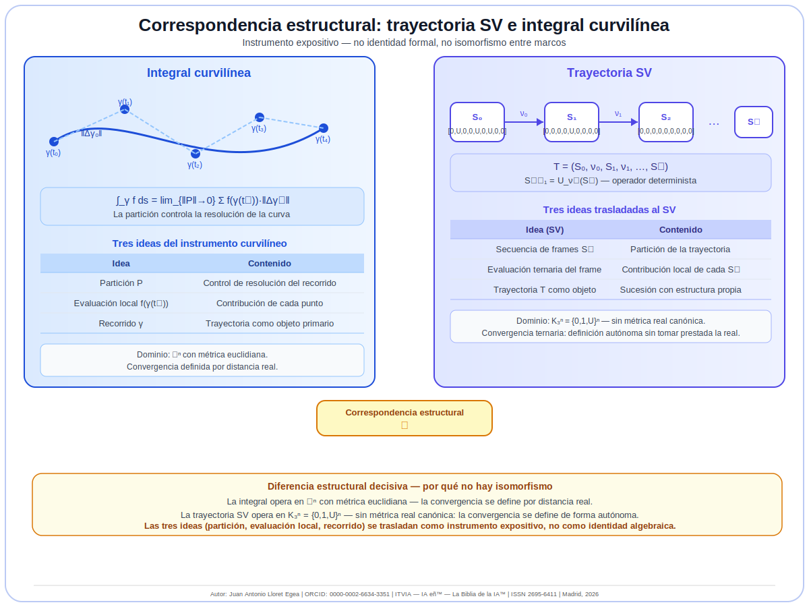
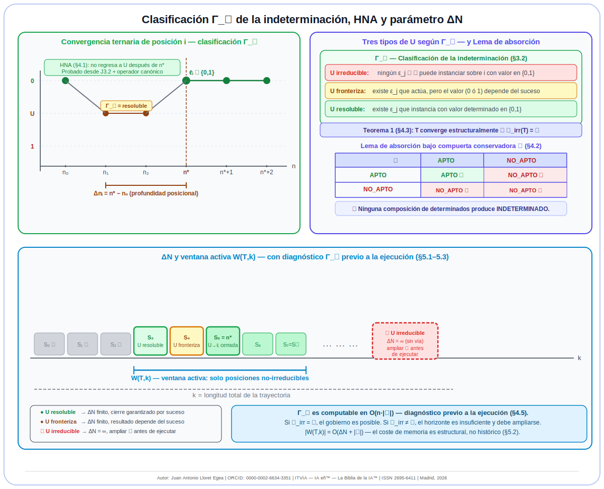
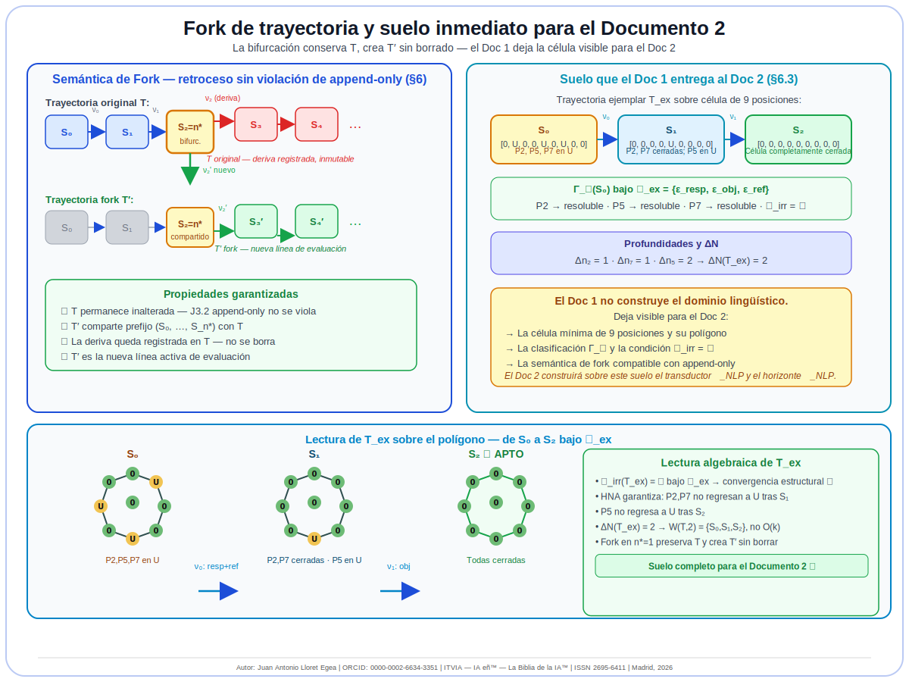
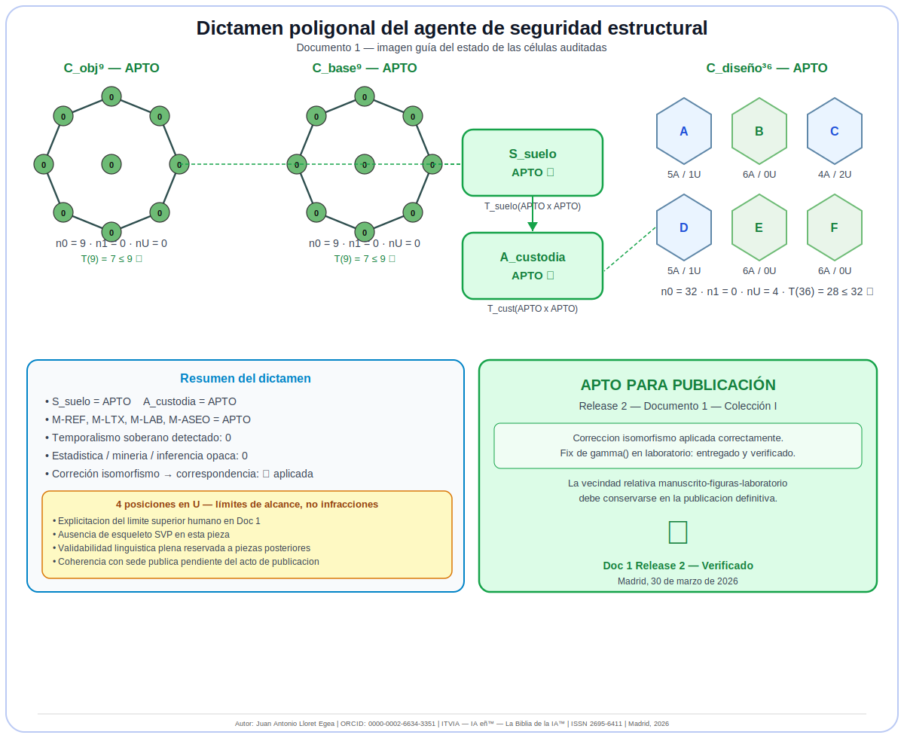

# Convergencia ternaria y gobierno determinista de trayectorias en el Sistema Vectorial SV: tipología de la indeterminación, HNA como teorema y fundamentos de la célula NLP

**Autor:** Juan Antonio Lloret Egea  
**ORCID:** 0000-0002-6634-3351  
**Sello editorial:** Instituto Tecnológico Virtual de la Inteligencia Artificial para el Español™ (ITVIA)  
**Publicación:** IA eñ™ — La Biblia de la IA™  
**ISSN:** 2695-6411  
**Licencia:** CC BY-NC-ND 4.0  
**Lugar y fecha:** Madrid, 30 de marzo de 2026  

**Posición en el corpus:**  
Extensión directa de *Transiciones estructurales y trayectorias de la U en el Sistema Vectorial SV* (Release 2, 16/03/2026), de VII.3 (*Horizonte de sucesos y reevaluación discreta*) y del *Álgebra de composición intercelular I–VI*. Primer documento de la Colección I, *Fundamentos algebraicos del gobierno determinista: convergencia ternaria, clasificación de la indeterminación y célula NLP*.

---

## Resumen

El Sistema Vectorial SV evalúa estructuras mediante un alfabeto ternario $\Sigma={0,1,U}$ donde $U$ designa indeterminación honesta: ausencia de base suficiente para concluir. Esa propiedad distingue al SV de los regímenes binarios y probabilísticos, pero abre una pregunta que el corpus había dejado declarada sin cierre explícito: ¿qué clase de objeto es $U$ respecto al horizonte declarado? ¿Convergen las evaluaciones de cada posición a lo largo de una trayectoria finita? ¿Bajo qué condiciones estructurales? ¿Con qué profundidad posicional? ¿Y cómo puede el sistema verificar, antes de operar, si su horizonte es suficiente para el dominio que pretende gobernar?

Este documento responde a esas preguntas mediante cinco resultados. Primero, introduce la función $\Gamma_{\mathcal H}$ que clasifica cada posición en $U$ como irreducible, fronteriza o resoluble. Segundo, fija una correspondencia estructural de carácter expositivo entre la trayectoria SV y la integral curvilínea, útil para ordenar partición, evaluación local y recorrido sin postular identidad formal entre ambos marcos. Tercero, distingue entre convergencia estructural y convergencia efectiva de trayectorias y demuestra HNA como teorema del corpus a partir de J3.2 y del diseño canónico del operador inducido. Cuarto, deriva el parámetro $\Delta N$ como profundidad de cierre y como instrumento de memoria estructural mínima. Quinto, formaliza la semántica de *fork* y deja explícito el suelo inmediato sobre el que el Documento 2 construirá el transductor lingüístico $\mathcal I_{NLP}$ y el horizonte $\mathcal H_{NLP}$.

**Palabras clave:** Sistema Vectorial SV; gobierno determinista; clasificación de la indeterminación; $\Gamma_{\mathcal H}$; convergencia ternaria; HNA; $\Delta N$; ventana activa; *fork*; célula NLP.

---

## 1. Objeto, motivación y ejemplo director

### 1.1 El problema general de gobierno

Todo sistema que pretenda gobernar un dominio complejo necesita algo más que una salida final. Necesita poder declarar, antes de operar, si el marco con el que trabaja es suficiente para producir cierre legítimo sobre las posiciones pertinentes del dominio. Ésta es la cuestión general que motiva este trabajo.

El corpus SV ya había llegado a este borde por dos vías. La primera, *Transiciones estructurales y trayectorias de la U*, donde la trayectoria $\tau=(U,\dots,0)$ o $\tau=(U,\dots,1)$ quedó fijada como objeto interno del corpus y donde se declaró expresamente que la notación $U\to0$ era incompleta si se la interpretaba como transición atómica sin *frames* intermedios. La segunda, VII.3, que precisó el papel del horizonte de sucesos y de la reevaluación discreta. Lo que faltaba era cerrar algebraicamente esa incompletitud y hacerlo con un ejemplo que pudiera ya leerse como célula.

### 1.2 El ejemplo director desde la primera página

Para coser el texto al SV desde el comienzo, tomamos una célula mínima de nueve posiciones cuyo polígono sirve como referencia continua para el experto humano. Sus posiciones pueden leerse provisionalmente como propiedades conversacionales mínimas; el Documento 2 formalizará después ese dominio con el transductor $\mathcal I_{NLP}$ y el horizonte $\mathcal H_{NLP}$. Aquí nos basta con usar la célula como soporte visible de la teoría.

Trabajaremos con la trayectoria ejemplar

$$
T_{ex}=(S_0,\nu_0,S_1,\nu_1,S_2),
$$

donde

$$
S_0=[0,U,0,0,U,0,U,0,0],\qquad
S_1=[0,0,0,0,U,0,0,0,0],\qquad
S_2=[0,0,0,0,0,0,0,0,0].
$$

En $S_0$ quedan abiertas tres posiciones: P2, P5 y P7. En $S_1$ ya se ha cerrado la pregunta abierta y la ambigüedad referencial, pero el objetivo sigue en $U$. En $S_2$ la célula queda enteramente determinada. El texto entero seguirá esta trayectoria concreta.

### 1.3 Qué aporta este documento

Este documento aporta cinco resultados, todos cosidos al ejemplo director:

1. **Clasificación de la indeterminación:** $\Gamma_{\mathcal H}$ distingue entre posiciones irreducibles, fronterizas y resolubles.
2. **Convergencia estructural:** una trayectoria dispone de vías de cierre compatibles con el horizonte si y sólo si no contiene posiciones irreducibles.
3. **HNA como teorema:** una posición que ha cerrado no regresa a $U$ bajo el operador canónico.
4. **Profundidad de cierre:** $\Delta N$ mide la profundidad máxima de cierre sobre posiciones no irreducibles.
5. **Fork sin borrado:** el retroceso legítimo en SV se hace bifurcando, no eliminando historia.

### 1.4 Qué no hace todavía este documento

Este Documento 1 no construye todavía el transductor lingüístico $\mathcal I_{NLP}$, ni el horizonte lingüístico concreto $\mathcal H_{NLP}$, ni la célula NLP completa. Sí deja, sin embargo, el suelo exacto sobre el que el Documento 2 puede trabajar: la célula visible, la clasificación $\Gamma_{\mathcal H}$, la condición de gobernabilidad previa a la ejecución y la semántica de bifurcación.

---

## 2. Correspondencia estructural de fondo y lectura poligonal

### 2.1 La integral curvilínea como estructura expositiva

La integral curvilínea

$$
\int_\gamma f\,ds
=
\lim_{\lVert \mathcal P\rVert\to 0}
\sum_{j=0}^{k-1} f(\gamma(t_j))\,\lVert\gamma(t_{j+1})-\gamma(t_j)\rVert
$$

condensa tres ideas que siguen siendo útiles en el SV: partición, evaluación local y recorrido. El punto de comparación no es la identidad formal entre ambos marcos, sino su correspondencia estructural como instrumento de lectura.



*Figura 1. Correspondencia estructural entre trayectoria SV e integral curvilínea. La figura cumple función expositiva: no postula identidad formal ni isomorfismo entre ambos marcos. Autor: Juan Antonio Lloret Egea | ORCID: 0000-0002-6634-3351 | ITVIA — IA eñ™ — La Biblia de la IA™ | ISSN 2695-6411 | Madrid, 2026.*

La diferencia decisiva es que la integral clásica opera en $\mathbb R^n$ con métrica euclidiana, mientras que la trayectoria SV opera en $K_3^n$ con preimagen ${0,1,U}^n$ y requiere una definición autónoma de convergencia.

### 2.2 El polígono como referencia del experto humano

En el SV, la célula no comparece sólo como vector. Comparece también como polígono visible. La imagen no sustituye al álgebra; la vuelve inspeccionable. El experto humano ve de un vistazo qué posiciones están cerradas, cuáles están en infracción y cuáles permanecen en indeterminación honesta.



*Figura 2. La trayectoria ejemplar $T_{ex}$ se sigue aquí sobre la célula mínima de nueve posiciones. P2, P5 y P7 pasan de $U$ a cierre bajo un horizonte suficiente. Autor: Juan Antonio Lloret Egea | ORCID: 0000-0002-6634-3351 | ITVIA — IA eñ™ — La Biblia de la IA™ | ISSN 2695-6411 | Madrid, 2026.*

La Figura 2 quedará ligada a todo el documento: cada definición formal que sigue puede leerse sobre esos tres *frames*.

---

## 3. Definiciones formales cosidas al ejemplo

### 3.1 Sucesión de evaluaciones de posición

Sea $T=(S_0,\nu_0,S_1,\nu_1,\dots,S_k)$ una trayectoria SV de longitud $k$ sobre una arquitectura de $n$ posiciones. Para cada posición $i\in\{1,\dots,n\}$, la sucesión de evaluaciones es

$$
\mathcal V_i(T)=\bigl(v_i^{(0)},v_i^{(1)},\dots,v_i^{(k)}\bigr),
\qquad
v_i^{(m)}\in\{0,1,U\}.
$$

En el ejemplo director:

- para P2: $\mathcal V_2(T_{ex})=(U,0,0)$;
- para P5: $\mathcal V_5(T_{ex})=(U,U,0)$;
- para P7: $\mathcal V_7(T_{ex})=(U,0,0)$.

### 3.2 Clasificación de la indeterminación $\Gamma_{\mathcal H}$

Sea $v\in\{0,1,U\}^n$ y sea $\mathcal H(\mathcal A)$ el horizonte declarado. Para cada posición $i$ con $v_i=U$, la función $\Gamma_{\mathcal H}(v)[i]$ toma uno de tres valores:

| Tipo | Criterio |
|---|---|
| **irreducible** | no existe suceso del horizonte que pueda instanciar sobre $i$ con valor en $\{0,1\}$ |
| **fronteriza** | existe suceso que actúa sobre $i$, pero el valor de cierre depende de cuál llegue |
| **resoluble** | existe suceso que instancia sobre $i$ con valor determinado en $\{0,1\}$ |

En el ejemplo director, si definimos

$$
\mathcal H_{ex}=
\{\varepsilon_{resp},\varepsilon_{obj},\varepsilon_{ref}\},
$$

con soporte respectivamente sobre P2, P5 y P7 y con valor de cierre determinado en $0$, entonces

$$
\Gamma_{\mathcal H_{ex}}(S_0)[2]=\text{resoluble},\quad
\Gamma_{\mathcal H_{ex}}(S_0)[5]=\text{resoluble},\quad
\Gamma_{\mathcal H_{ex}}(S_0)[7]=\text{resoluble}.
$$

Si empobrecemos el horizonte y quitamos $\varepsilon_{obj}$, entonces P5 pasa a irreducible. Esta simple variación basta para mostrar desde ahora qué significa gobernabilidad previa a la ejecución.

### 3.3 Conjuntos por tipo

Para un frame $S_n$, definimos

$$
\mathcal U_{irr}(S_n)=\{i:\Gamma_{\mathcal H}(S_n)[i]=\text{irreducible}\},
$$

$$
\mathcal U_{front}(S_n)=\{i:\Gamma_{\mathcal H}(S_n)[i]=\text{fronteriza}\},
$$

$$
\mathcal U_{res}(S_n)=\{i:\Gamma_{\mathcal H}(S_n)[i]=\text{resoluble}\},
$$

y
$$
\mathcal U(S_n)=
\mathcal U_{irr}(S_n)
\cup
\mathcal U_{front}(S_n)
\cup
\mathcal U_{res}(S_n).
$$

En $S_0$ bajo $\mathcal H_{ex}$, el conjunto irreducible es vacío y el conjunto resoluble es $\{2,5,7\}$.

### 3.4 Convergencia ternaria de una posición

La posición $i$ es ternariamente convergente en $T$ si existe un índice de cierre $n_i^*\le k$ tal que para todo $m\ge n_i^*$ se cumple

$$
v_i^{(m)}\in\{0,1\}
\quad\text{y}\quad
v_i^{(m)}=v_i^{(n_i^*)}.
$$

Para el ejemplo:

- P2 cierra en $n_2^*=1$,
- P7 cierra en $n_7^*=1$,
- P5 cierra en $n_5^*=2$.

### 3.5 Profundidad posicional y profundidad de la trayectoria

Sea $n_0^{(i)}$ el primer *frame* donde la posición $i$ toma valor $U$. Definimos

$$
\Delta n_i = n_i^* - n_0^{(i)},
$$

y sobre las posiciones no irreducibles,

$$
\Delta N(T)=
\max_{i\in\mathcal U(T)\setminus\mathcal U_{irr}(T)} \Delta n_i.
$$

En $T_{ex}$:

- $\Delta n_2=1$,
- $\Delta n_7=1$,
- $\Delta n_5=2$,

luego

$$
\Delta N(T_{ex})=2.
$$

---

## 4. HNA, convergencia estructural y convergencia efectiva

### 4.1 HNA como teorema del corpus

**HNA.** Si un suceso de cierre determina la posición $i$ en el *frame* $n_i^*$ con valor $\tau_i\in\{0,1\}$, entonces para todo $m>n_i^*$ se cumple

$$
v_i^{(m)}=\tau_i.
$$

La prueba descansa en dos condiciones del corpus:

1. **J3.2 (append-only):** los *frames* pasados no se modifican; véase *IR canónica y sistema de bienformación del Lenguaje SV — v0.2*.
2. **Diseño canónico del operador inducido:** no existe operación que escriba $U$ sobre una posición ya cerrada; este principio queda alineado con el contrato visible del operador canónico del marco.

Por eso HNA no es hipótesis auxiliar; es teorema del corpus.

En el ejemplo, P2 y P7 no pueden volver a $U$ una vez cerradas en $S_1$, y P5 no puede volver a $U$ una vez cerrada en $S_2$.

### 4.2 Lema de absorción bajo compuerta conservadora

Si $\kappa_1,\kappa_2\in\{\text{APTO},\text{NO\_APTO}\}$, entonces

$$
\kappa_1\otimes\kappa_2\in\{\text{APTO},\text{NO\_APTO}\}.
$$

Ninguna composición entre valores determinados produce $\text{INDETERMINADO}$. Este hecho impide que el sistema reintroduzca por composición un cierre ilegítimo hacia $U$.

### 4.3 Teorema 1 — convergencia estructural

Sea $T$ una trayectoria SV con horizonte $\mathcal H(\mathcal A)$. Entonces $T$ es **estructuralmente convergente** si y sólo si

$$
\mathcal U_{irr}(T)=\varnothing.
$$

El sentido del teorema es éste: toda posición abierta dispone de al menos una vía de cierre compatible con el horizonte declarado.

En el ejemplo director, $\mathcal U_{irr}(T_{ex})=\varnothing$ bajo $\mathcal H_{ex}$, luego la trayectoria es estructuralmente convergente.

### 4.4 Proposición — convergencia efectiva condicionada

Si $T$ es estructuralmente convergente y, además, para cada posición abierta el suceso de cierre pertinente instancia efectivamente dentro de la trayectoria considerada, entonces $T$ es efectivamente convergente.

Esta distinción impide afirmar más de lo que el documento demuestra: la ausencia de irreducibles garantiza vía de cierre compatible, no una clausura efectiva independiente de la trayectoria concreta.

### 4.5 Diagnóstico previo a la ejecución

La computabilidad de $\Gamma_{\mathcal H}$ convierte el gobierno en acto previo a la ejecución. Si el diagnóstico detecta posiciones irreducibles, el diseñador no debe ejecutar todavía: debe ampliar el horizonte.

Eso puede verse inmediatamente sobre la célula visible. Si el experto observa un polígono con posiciones abiertas y, bajo el horizonte declarado, alguna de ellas no tiene vía de cierre, el problema no es “baja confianza”: es insuficiencia estructural del marco.

---

## 5. Parámetro $\Delta N$ y memoria estructural

### 5.1 El problema computacional

Mantener toda la trayectoria en memoria activa tendría coste $O(k)$. Ese criterio histórico bruto es ajeno al SV. Lo que interesa no es la longitud completa, sino la profundidad estructural de las posiciones que siguen abiertas.

### 5.2 Ventana activa

Definimos la ventana activa como unión de dos partes:

$$
W(T,k)=W_{rec}(T,k)\cup W_{ap}(T,k),
$$

donde

$$
W_{rec}(T,k)=\{S_n : n\ge k-\Delta N(T)\},
$$

y

$$
W_{ap}(T,k)=
\{S_n : \exists i\in\mathcal U(T)\setminus\mathcal U_{irr}(T)
\text{ tal que }
v_i^{(n)}=U
\text{ y }
n<n_i^*\}.
$$

Para $T_{ex}$, como $\Delta N=2$, la memoria activa necesaria queda acotada por los últimos dos tramos de cierre y no por toda la historia.

### 5.3 Lectura del ejemplo

En el ejemplo director, la memoria activa no necesita cargar una historia arbitrariamente larga. Necesita conservar el tramo relevante para P5, la posición de cierre más tardío. Éste es precisamente el sentido estructural de $\Delta N$.

---

## 6. Semántica de *fork* y continuidad inmediata hacia el Documento 2

### 6.1 El conflicto aparente

El retroceso intuitivo parece chocar con *append-only*. La resolución es separar dos lecturas:

- **lectura retroactiva:** navegar hacia atrás sobre la trayectoria ya registrada;
- **reversión ejecutiva:** borrar historia y recomenzar.

La primera es compatible con el SV. La segunda no lo es.

### 6.2 Definición de *fork*

Sea

$$
T=(S_0,\nu_0,\dots,S_{n^*},\nu_{n^*},S_{n^*+1},\dots).
$$

Un *fork* en $n^*$ es una trayectoria nueva

$$
T'=(S_0,\nu_0,\dots,S_{n^*},\nu'_{n^*},S'_{n^*+1},\dots),
$$

con $\nu'_{n^*}\neq\nu_{n^*}$, manteniendo intacta la trayectoria original.



*Figura 3. El *fork* conserva T, crea T′ y prepara la continuidad inmediata hacia el Documento 2 sobre la misma célula mínima de nueve posiciones. Autor: Juan Antonio Lloret Egea | ORCID: 0000-0002-6634-3351 | ITVIA — IA eñ™ — La Biblia de la IA™ | ISSN 2695-6411 | Madrid, 2026.*

### 6.3 Anticipación breve del Documento 2

El Documento 1 no formaliza todavía el dominio lingüístico. Lo que hace es dejar visible la célula, el tipo de cierre requerido en cada posición y la exigencia de horizonte suficiente. Sobre esta base, el Documento 2 construye de forma explícita:

- el transductor $\mathcal I_{NLP}$;
- el horizonte $\mathcal H_{NLP}$;
- la verificación de gobernabilidad del dominio mínimo.

Esa continuidad no se introduce aquí como resultado anticipado, sino como camino inmediato del programa.

---

## 7. Laboratorio mínimo reproducible

Los artefactos de este trabajo se alojan en una estructura estable de paquete técnico, pensada para conservar la vecindad relativa entre documento, figuras y laboratorio tanto en edición como en réplica posterior de repositorio:

```text
./manuscrito_convergencia_ternaria_sv_release2.md
./figuras/figura_01_correspondencia_trayectoria_integral.svg
./figuras/figura_02_trayectoria_poligonal_delta_n.svg
./figuras/figura_03_fork_y_camino_doc2.svg
./figuras/figura_04_auditoria_poligonal_seguridad.svg
./laboratorio/convergencia_ternaria_sv_release2.py
./laboratorio/pseudocodigo_convergencia_ternaria_sv_release2.txt
./laboratorio/salida_casos_canonicos_doc1_release2.json
```

### 7.1 Pseudocódigo de referencia

El pseudocódigo de esta sección no sustituye a la implementación de referencia. Su función es permitir lectura estructural por terceros sin exigir dependencia exclusiva de un lenguaje de programación concreto.

```text
funcion gamma_h(vector v, horizonte H):
  para cada posicion i con v_i = U:
    si no existe suceso de H que actue sobre i:
      clasificar i como irreducible
    si existe suceso sobre i pero el valor depende del suceso:
      clasificar i como fronteriza
    si existe suceso sobre i con valor determinado en (0, 1):
      clasificar i como resoluble
  devolver clasificacion completa

funcion convergencia_estructural(trayectoria T, horizonte H):
  calcular U_irr(T) con gamma_h
  devolver (U_irr(T) es vacio)

funcion delta_N(trayectoria T):
  devolver maximo de delta_n(i) sobre posiciones no irreducibles

funcion fork(T, frame_bifurcacion n*, dato_alternativo nu'):
  conservar T sin modificar
  crear T' compartiendo prefijo hasta S_n*
  continuar T' sin borrar la historia de T
```

### 7.2 Casos canónicos

El laboratorio demuestra cinco hechos con aserciones explícitas:

1. clasificación $\Gamma_{\mathcal H}$ del ejemplo suficiente;
2. cálculo de $\Delta N(T_{ex})=2$;
3. acotación de la ventana activa;
4. *fork* compatible con *append-only*;
5. detección de irreducibles cuando el horizonte se empobrece.

**Salida esperada:**

```text
python3 laboratorio/convergencia_ternaria_sv_release2.py
✓ Todos los casos canónicos pasan. Laboratorio verificado.
```

### 7.3 Vocación de réplica técnica

El paquete nace con vocación de réplica técnica inmediata. Las referencias usan rutas relativas estables, las figuras quedan nombradas de forma inequívoca y el laboratorio se acompaña de pseudocódigo de referencia además de la implementación ejecutable. Esta organización permite preparar después la subida ordenada a repositorio sin reestructuración semántica del material.

---

## 8. Deudas explícitas y posición del documento en la colección

Este documento cierra cinco resultados y deja abiertas las siguientes deudas:

- **DT-0:** estructura algebraica de $\Gamma_{\mathcal H}$ bajo $\otimes$;
- **DT-1:** régimen métrico canónico sobre $K_3^n$;
- **DT-2:** transductor lingüístico $\mathcal I_{NLP}$;
- **DT-3:** horizonte lingüístico concreto $\mathcal H_{NLP}$;
- **DT-4:** célula NLP completa.

La función exacta del Documento 1 es ésta: cerrar la incompletitud declarada en *Transiciones estructurales y trayectorias de la U* y dejar, sobre célula visible y trayectoria ejemplar, el suelo inmediato que el Documento 2 convierte ya en dominio mínimo formalizado.

---

## Anexo técnico de validación por seguridad estructural

**Agente especializado en seguridad estructural**  
**Objeto auditado:** Documento 1 de la Colección I — Release 2  
**Versión auditada:** R2-Candidata  
**Marco aplicado:** *Célula especializada de seguridad estructural para la custodia del diseño, el DSL y los laboratorios del Sistema Vectorial SV*.

### 1. Base material auditada

Se ha efectuado lectura material y verificación directa de los siguientes artefactos del lote:

- `manuscrito_convergencia_ternaria_sv_release2.md`
- `figuras/figura_01_correspondencia_trayectoria_integral.svg`
- `figuras/figura_02_trayectoria_poligonal_delta_n.svg`
- `figuras/figura_03_fork_y_camino_doc2.svg`
- `figuras/figura_04_auditoria_poligonal_seguridad.svg`
- `laboratorio/convergencia_ternaria_sv_release2.py`
- `laboratorio/pseudocodigo_convergencia_ternaria_sv_release2.txt`
- `laboratorio/salida_casos_canonicos_doc1_release2.json`

### 2. Esquema métrico aplicado

Las métricas de este anexo son deterministas. No expresan probabilidad, frecuencia ni inferencia. Se basan en conteo estructural de posiciones, contraste material directo y aplicación de la regla ternaria fuerte de la célula de seguridad.

- **C_obj^9:** $n_0=9$, $n_1=0$, $n_U=0$.
- **C_base^9:** $n_0=9$, $n_1=0$, $n_U=0$.
- **C_diseno^{36}:** $n_0=32$, $n_1=0$, $n_U=4$.

Las posiciones que permanecen en $U$ no bloqueante son límites declarados de alcance:

- explicitación del límite superior humano dentro del propio Documento 1;
- ausencia de esqueleto SVP en esta pieza concreta;
- validabilidad lingüística plena reservada a piezas posteriores del carril técnico;
- coherencia final con sede pública pendiente del acto externo de publicación de la release 2.

### 3. Imagen guía del dictamen



*Figura 4. Imagen poligonal obligatoria del dictamen de seguridad estructural para esta auditoría: C_obj⁹, C_base⁹, C_diseno³⁶ y resultado compuesto de custodia. Autor: Juan Antonio Lloret Egea | ORCID: 0000-0002-6634-3351 | ITVIA — IA eñ™ — La Biblia de la IA™ | ISSN 2695-6411 | Madrid, 2026.*

### 4. Métricas auxiliares del paquete

- **M-REF:** APTO — correspondencia entre referencias internas y artefactos presentes.
- **M-LTX:** APTO — ausencia de secuencias residuales de escape incompatibles y simplificación de fórmulas largas.
- **M-LAB:** APTO — laboratorio reproducible con salida verificable.
- **M-ASEO:** APTO — temporalismo soberano detectado: 0; cierre por estadística, minería de datos o inferencia opaca detectado: 0.

### 5. Dictamen final

Con $C_obj^9=\text{APTO}$, $C_base^9=\text{APTO}$ y $C_diseno^{36}=\text{APTO}$, la compuerta de custodia produce

$$
A_{custodia}=\text{APTO}.
$$

**Dictamen técnico final:** **APTO PARA PUBLICACIÓN** como Release 2 del Documento 1, con las precisiones de alcance indicadas y manteniendo la vecindad relativa entre manuscrito, figuras y laboratorio o referencias materiales equivalentes y verificables.

---

## Bibliografía

Austin, J. L. (1962). *How to Do Things with Words*. Oxford University Press.  

Belnap, N. D. (1977). A useful four-valued logic. In *Modern Uses of Multiple-Valued Logic*. Reidel.  

Crane, K., Desbrun, M., Schröder, P. (2010). Trivial Connections on Discrete Surfaces. *ACM Transactions on Graphics*, 29(4).  

Dijkstra, E. W. (1976). *A Discipline of Programming*. Prentice Hall.  

Floyd, R. W. (1967). Assigning meanings to programs. In *Mathematical Aspects of Computer Science*.  

Hoare, C. A. R. (1969). An axiomatic basis for computer programming. *Communications of the ACM*, 12(10).  

Kalman, R. E. (1960). A new approach to linear filtering and prediction problems. *Journal of Basic Engineering*, 82.  

Kleene, S. C. (1952). *Introduction to Metamathematics*. North-Holland.  

Lloret Egea, J. A. (2026). *Álgebra de composición intercelular del Sistema Vectorial SV* (series I–VI). ITVIA — IA eñ™.  

Lloret Egea, J. A. (2026). *Transiciones estructurales y trayectorias de la U en el Sistema Vectorial SV*. Release 2. ITVIA — IA eñ™.  

Lloret Egea, J. A. (2026). *Sucesos, horizontes y cambio estructural — Una aproximación algebraica desde el Sistema Vectorial SV* (series VII.0–VII.6). ITVIA — IA eñ™.  

Lloret Egea, J. A. (2026). *Células especializadas del Sistema Vectorial SV: estatuto, perfil funcional mínimo y familias iniciales*. ITVIA — IA eñ™.  

Lloret Egea, J. A. (2026). *Célula especializada de seguridad estructural para la custodia del diseño, el DSL y los laboratorios del Sistema Vectorial SV*. Release 2. ITVIA — IA eñ™.  

Lloret Egea, J. A. (2026). *IR canónica y sistema de bienformación del Lenguaje SV — v0.2*.  

Lyapunov, A. M. (1892). *The General Problem of the Stability of Motion*. Kharkov Mathematical Society.  

Searle, J. R. (1969). *Speech Acts: An Essay in the Philosophy of Language*. Cambridge University Press.  
