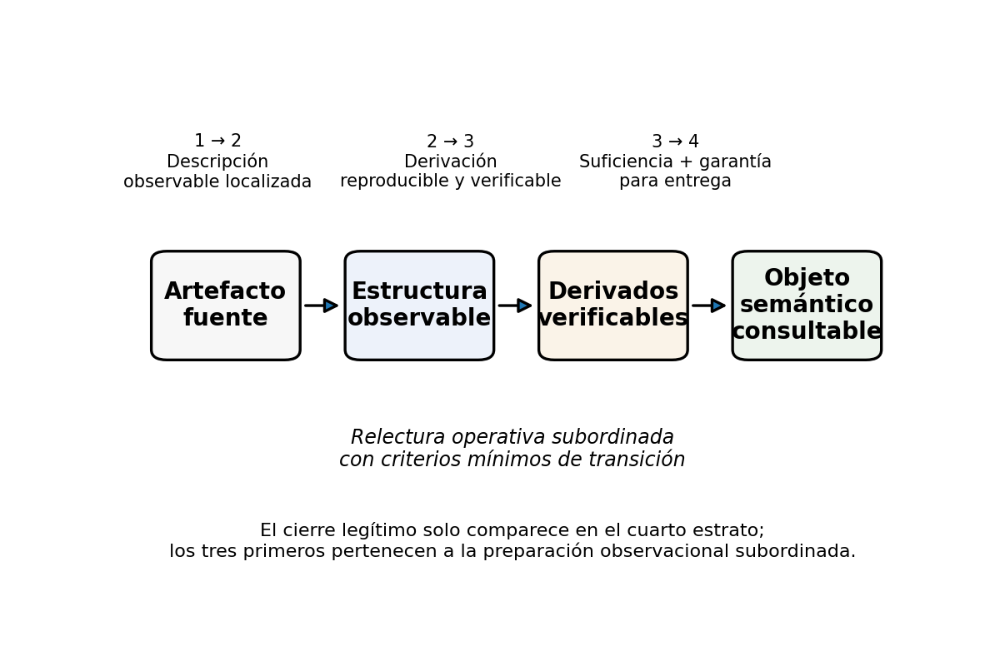
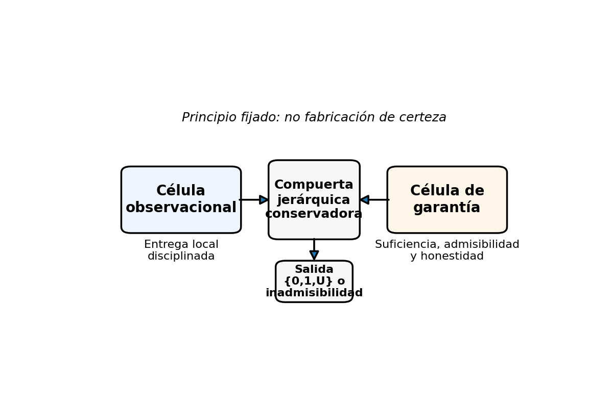
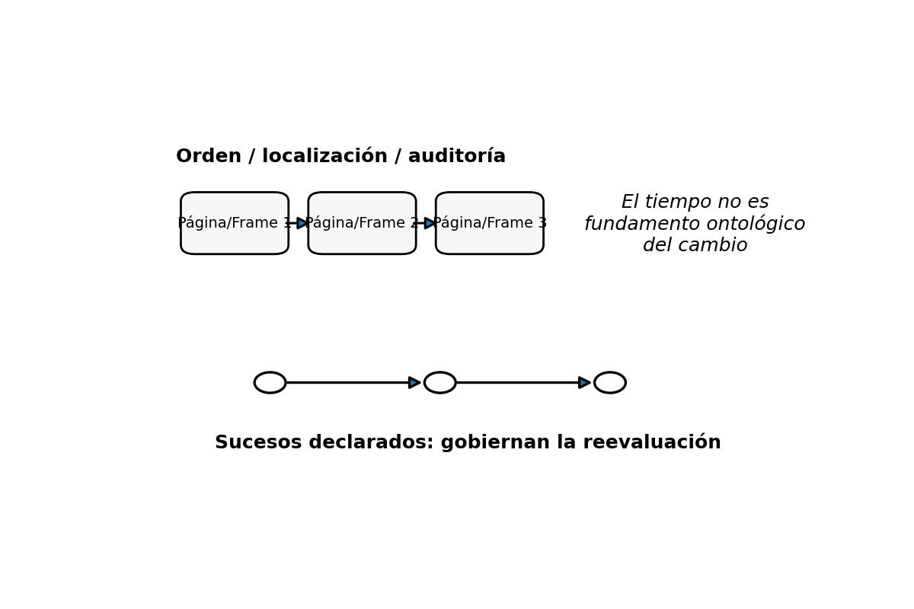
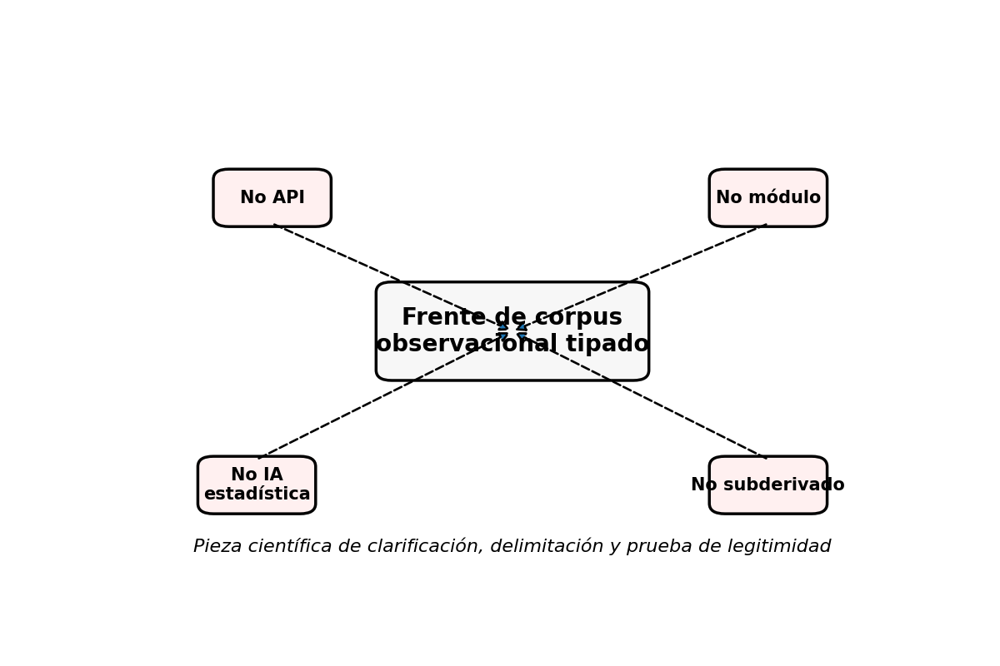
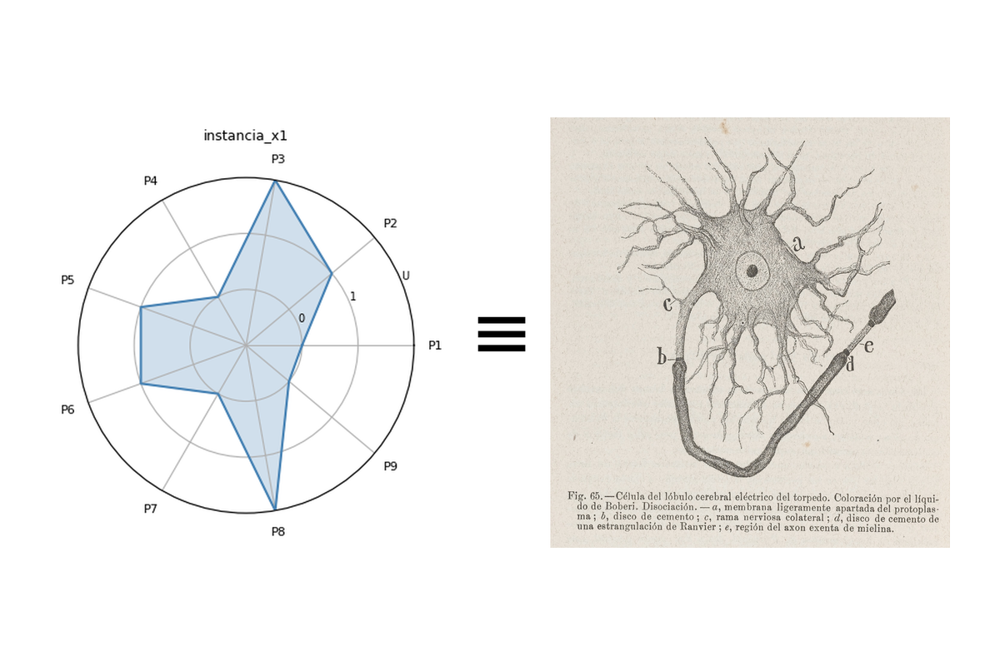
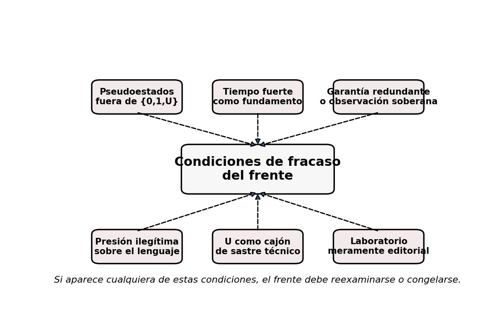

# Primera forma legítima del frente de corpus observacional tipado del Sistema Vectorial SV
## Par heterogéneo de observación y garantía por compuerta jerárquica conservadora

**Autor:** Juan Antonio Lloret Egea  
**ORCID:** 0000-0002-6634-3351  
**Institución:** Instituto Tecnológico Virtual de la Inteligencia Artificial para el Español™ (ITVIA)  
**Publicación:** IA en™ – La Biblia de la IA™  
**ISSN:** 2695-6411  
**Colección:** Programa de interfaces del Sistema Vectorial SV  
**Lugar y fecha:** Madrid, 20 de marzo de 2026  
**Estado del documento:** paquete final de revisión local (v0.7)  
**Unidad redactora:** W-Corpus1 SV  
**Régimen de fase:** pieza científica de clarificación, delimitación y prueba de legitimidad  
**Prohibiciones activas:** este carril no entra todavía como API, ni como módulo, ni como subderivado operativo del Sistema Vectorial SV.

---

## Resumen / Abstract

Este trabajo no funda una semántica nueva de artefactos. Su objeto es fijar una primera forma legítima, estrecha y subordinada, por la que un artefacto externo complejo pueda ser tratado en el Sistema Vectorial SV sin invadir su ontología primaria ni ejercer presión impropia sobre el Lenguaje SV. La propuesta reduce la complejidad inicial del frente a un único patrón inaugural: un par heterogéneo compuesto por una célula observacional y una célula de garantía, articuladas mediante compuerta jerárquica conservadora. La célula observacional produce una entrega local disciplinada, todavía subordinada a garantía. La célula de garantía no la suplanta ni la duplica, sino que avala o bloquea la honestidad de la entrega. La salida global solo comparece como objeto semántico consultable cuando observación y garantía lo permiten sin fabricar certeza; en caso contrario, la salida correcta es `{0,1,U}` o inadmisibilidad.

Este borrador se apoya mayoritariamente en el corpus público del propio SV: *Fundamentos algebraico-semánticos*, la serie *Álgebra de composición intercelular del marco SV*, *Semántica auditada*, *Formalización de una interfaz visual estructurada* y el *Pliego de condiciones del Sistema Vectorial SV*. Las referencias externas solo se admiten aquí como soporte de presentación, direccionamiento, estructura observable, procedencia y empaquetado, nunca como semántica sustitutiva, ni como maquinaria inferencial, estadística o probabilística.

---

## 1. Objeto y alcance

Este manuscrito no pretende explicar cómo el Sistema Vectorial SV trata cualquier artefacto externo en general, ni construir una teoría total del documento, de la imagen, del audio o del vídeo. Su alcance es más estrecho: determinar si existe una **primera forma legítima** por la que un artefacto externo complejo pueda empezar a ser preparado para una entrega semántica válida sin obligar al sistema a admitir ontologías rivales, sin introducir tiempo fuerte y sin degradar la `U`.

La pieza se mantiene expresamente por debajo del bloque algebraico-semántico ya fijado. No corrige la doctrina, no reabre la ontología primaria, no induce por vía operativa una reforma silenciosa del Lenguaje SV y no presenta sus propias relecturas como si fueran cierre doctrinal previo. Su estatuto correcto es el de **frente doctrinal-operativo de clarificación científica**, acompañado de artefactos explicativos y de un laboratorio mínimo demostrativo.

Este texto tampoco disimula la autoría unitaria del corpus SV. La asume como dato de procedencia y trazabilidad. La validez del manuscrito, sin embargo, no se hace descansar en la autoría, sino en la explicitud de sus definiciones, en la consistencia interna de sus argumentos y en su exposición a contraste adversarial.

## 2. Convenciones mínimas y axiomas locales del manuscrito

Para evitar que el lector externo dependa por completo del corpus previo, este manuscrito fija aquí una base mínima de lectura.

**Axioma 1 — Alfabeto de clausura.** En este manuscrito, `Σ = {0,1,U}` nombra el alfabeto exclusivo de clausura semántica del sistema. `1` expresa comparecencia afirmativa legítima; `0`, comparecencia negativa legítima; `U`, indeterminación estructural honesta. Ninguno de los tres valores equivale a probabilidad, puntuación de confianza ni grado continuo.

**Axioma 2 — Célula.** Una célula, en el sentido operativo de este manuscrito, es una unidad formal de evaluación y composición que recibe parámetros ya preparados por la cadena de entrada del sistema. Esta definición no pretende agotar toda la teoría celular del SV, sino fijar el estatuto mínimo que aquí necesitamos.

**Axioma 3 — Captura.** La captura es el paso por el que una magnitud o exposición del mundo llega a una forma utilizable por la cadena del sistema. No es todavía verdad, ni clausura, ni garantía.

**Axioma 4 — Admisibilidad.** La admisibilidad expresa si lo capturado dispone de condiciones mínimas para seguir en la cadena. En este manuscrito admite, como mínimo, los estados `ok`, `degradado`, `fallido` y `U`.

**Axioma 5 — Transducción.** La transducción es el paso por el que una observación admisible alcanza un valor en `Σ`. Su función aquí no es interpretar el mundo entero, sino hacer legible una unidad local en el régimen ternario del sistema.

**Axioma 6 — Objeto semántico consultable.** Es la comparecencia final, cuando proceda, de una entrega compatible con `{0,1,U}` o con inadmisibilidad. No coincide ni con el artefacto fuente, ni con su estructura observable, ni con sus derivados verificables.

**Axioma 7 — Suceso declarado.** En este manuscrito, un suceso declarado es una unidad de cambio semánticamente relevante cuya comparecencia no se infiere por continuidad temporal ni por probabilidad, sino que entra en la cadena del sistema mediante criterios explícitos de captura, admisibilidad y transducción. Un suceso declarado no es mera variación del soporte, no es correlación estadística y no es extrapolación temporal.

## 3. Delimitación negativa fuerte

Quedan fuera de fase:

- toda teoría general del documento;
- toda teoría general de imagen médica, audiovisual o seriada;
- toda promesa de comprensión automática del artefacto;
- todo diagnóstico clínico automatizado;
- toda interpretación jurídica sustantiva;
- toda clasificación opaca;
- toda minería de datos;
- toda inferencia estadística;
- todo aprendizaje no subordinado;
- todo uso de probabilidades, grados de confianza o pseudoestados como sustitutos de `{0,1,U}`;
- y toda semántica temporal fuerte.

También queda fuera de fase cualquier intento de convertir páginas, regiones, timestamps, secuencias, cortes o frames en fundamento ontológico autónomo del cambio del sistema.

## 4. Estudio del arte filtrado y subordinado

El fundamento y el techo del frente siguen siendo internos al propio SV. El estado del arte externo solo puede aportar infraestructura de **presentación**, **direccionamiento**, **estructura observable**, **procedencia** y **empaquetado**. No puede aportar clausura semántica sustitutiva ni régimen inferencial de cierre.

### 4.1. Infraestructuras externas aprovechables

- **IIIF Presentation API 3.0**: útil para artefacto compuesto y navegación observable.
- **W3C Web Annotation Data Model**: útil para regiones, segmentos y anotaciones localizadas.
- **W3C Media Fragments URI 1.0**: útil para direccionar fragmentos de recursos multimedia.
- **ALTO + METS / PAGE XML**: útiles para layout documental, OCR y derivados verificables.
- **PROV-O + FHIR Provenance**: útiles para cadena observacional, agentes y garantía.
- **DICOM + FHIR DocumentReference**: útiles para empaquetado, referencia y gestión de artefactos clínicos o multimodales.

### 4.2. Exclusión metodológica

El manuscrito excluye de su base positiva toda literatura modelocéntrica que cierre decisiones mediante inferencia estadística, clasificación opaca, puntuaciones de confianza, embeddings o recuperación probabilística. Esos materiales, si aparecieran, solo podrían figurar como contraste adversarial, nunca como fundamento del frente.

## 5. Estratificación mínima del frente y criterios de transición

La estratificación se entiende como **relectura operativa subordinada**:

1. **Artefacto fuente**  
   Objeto bruto externo todavía no integrado semánticamente en el sistema.
2. **Estructura observable**  
   Páginas, regiones, layout, series, canales, secuencias, metadatos, orden y localización.
3. **Derivados verificables**  
   OCR literal, segmentaciones, tablas extraídas, índices, normalizaciones y otros productos auditables.
4. **Objeto semántico consultable**  
   Solo aquí comparece, cuando proceda, una entrega semántica legítima compatible con `{0,1,U}` o inadmisibilidad.



**Figura 1.** Estratificación del frente con criterios mínimos de transición. Esta figura no pretende cerrar toda la teoría del paso entre niveles; fija únicamente un umbral de legibilidad externa para este manuscrito.

### 5.1. Criterios mínimos de transición

**Paso 1 → 2.** Un artefacto fuente pasa a estructura observable cuando admite descripción localizada, ordenada o segmentable sin adjudicar todavía clausura semántica.

**Paso 2 → 3.** Una estructura observable pasa a derivado verificable cuando puede producirse una derivación reproducible, trazable y controlable por terceros, como OCR literal, segmentación o índice explícito.

**Paso 3 → 4.** Un derivado verificable solo pasa a objeto semántico consultable cuando, además de existir como producto trazable, alcanza suficiente soporte observacional y suficiente garantía como para comparecer legítimamente en `{0,1,U}` o en inadmisibilidad.

**Condición de no-paso.** Si falta localización observable, reproducibilidad verificable o garantía suficiente, el proceso no avanza de estrato.

**Condición de suspensión.** Si el material existe pero no autoriza cierre favorable, la progresión puede detenerse en `U` sin fabricar certeza.

## 6. Tesis central y patrón inaugural

Un artefacto observacional externo puede empezar a tratarse legítimamente en el Sistema Vectorial SV si se descompone en unidades observacionales tipadas, cada una de las cuales pasa por **captura**, **admisibilidad** y **ternarización local**, y si su primera recomposición no se realiza por serie libre ni por agregación masiva, sino mediante un **par heterogéneo de observación y garantía** realizado por **compuerta jerárquica conservadora**, de modo que la entrega final —cuando proceda— comparezca como objeto semántico consultable compatible con `{0,1,U}` o con inadmisibilidad.

La célula observacional se dedica a la exposición local tipada del artefacto. Su producto no es verdad global del sistema, sino **entrega local disciplinada y todavía subordinada a garantía**. La célula de garantía no duplica la observación ni la sustituye; se limita a evaluar si esa entrega local alcanza suficiencia, admisibilidad y honestidad bastante para comparecer como salida global legítima.

En esta fase no se fija todavía la tabla completa de la compuerta. Sí se fija, en cambio, su **núcleo axiomático mínimo**.

### 6.1. Núcleo axiomático mínimo de la compuerta

1. **Principio de no clausura favorable sin observación suficiente.** Sin observación local disciplinada, no hay paso favorable.
2. **Principio de no clausura favorable sin garantía suficiente.** Sin aval honesto de la garantía, no hay paso favorable.
3. **Principio de preservación de `U`.** Toda indeterminación material relevante preserva `U`; no puede maquillarse como cierre prudencial.
4. **Principio de inadmisibilidad.** El fallo fuerte de captura o de admisibilidad produce inadmisibilidad.
5. **Principio de asimetría potencial.** Cuando la relación semántica previa sea asimétrica, la compuerta puede ser no conmutativa.
6. **Principio de no sustitución.** La célula observacional no sustituye a la de garantía, ni la de garantía a la observacional.



**Figura 2.** Patrón inaugural del frente: par heterogéneo de observación y garantía por compuerta jerárquica conservadora. La figura no pretende ser aún la tabla exhaustiva de la compuerta; su función es hacer visible la estructura mínima ya fijada.

## 7. Preservación de `{0,1,U}` y de la `U` honesta

La primera condición de legitimidad del frente es que no introduzca un alfabeto rival. Todo cierre legítimo sigue desembocando en `0`, `1`, `U` o inadmisibilidad. No todo rasgo del artefacto tiene que “volverse ternario”; lo que debe quedar compatible con la terna es la **entrega semántica legítima final**, no toda la morfología del soporte.

La segunda condición es que la `U` no se degrade. Bajo este frente, `U` no puede tratarse como dato faltante, duda técnica, incomodidad operativa, confianza residual o probabilidad pequeña. Si la cadena observacional no alcanza suficiencia real, la salida correcta será `U` o inadmisibilidad; nunca una clausura de conveniencia.

Esta disciplina se traduce en la compuerta del patrón inaugural: si la observación no alcanza cadena suficiente, o si la garantía no puede avalar honestamente la entrega, la salida global conserva `U` o inadmisibilidad.

## 8. Régimen del tiempo

Páginas, regiones, timestamps, secuencias, cortes, frames o series pueden comparecer como **orden**, **localización**, **estructura observable** o **metadato de auditoría**, pero **no** como fundamento ontológico autónomo del cambio del sistema. El cambio sigue rigiéndose por **sucesos declarados**.

Esto implica que una página posterior no vale más por ser posterior, ni un frame siguiente impone por sí mismo un cambio semántico. Lo único que puede gobernar legítimamente una reevaluación son los sucesos que, tras la cadena de captura, admisibilidad y transducción, pasan a ser legibles dentro del sistema.



**Figura 3.** Secuencia y frameado como orden/localización/auditoría, no como fundamento del cambio.

## 9. Artefactos científicos, imágenes vinculadas, diagramas y laboratorio mínimo

El manuscrito no puede descansar solo en argumentación doctrinal. Debe incluir artefactos científicos **demostrativos** y no **integrativos**.

### 9.1. Figuras del manuscrito

- **Figura 1**: estratificación del frente con criterios mínimos de transición.
- **Figura 2**: patrón inaugural de observación y garantía.
- **Figura 3**: régimen del tiempo y exclusión del tiempo fuerte.
- **Figura 4**: exclusiones del frente.
- **Figura 5**: imagen propia del corpus SV que conecta célula y representación visual.
- **Figura 6**: condiciones de fracaso del frente.



**Figura 4.** Este frente no es API, módulo, subderivado ni IA estadística; su función es clarificar, delimitar y poner a prueba la legitimidad del carril.



**Figura 5.** Imagen de autoría propia ya publicada en *Fundamentos algebraico-semánticos del Sistema Vectorial SV*. Representa una articulación visual polar del universo celular del sistema y se incorpora aquí con función ilustrativa y trazable: muestra que el corpus SV ya dispone de una cultura visual propia para expresar célula y composición. No demuestra por sí sola la tesis del manuscrito, ni sustituye los argumentos del texto. Su función es de continuidad visual, no de prueba autosuficiente.



**Figura 6.** Condiciones de fracaso del frente. Si cualquiera de estos supuestos se hace necesario para sostener el manuscrito, el frente debe reexaminarse o congelarse.

### 9.2. Laboratorio mínimo

El laboratorio acompaña al manuscrito como **laboratorio de legitimidad**, no como prototipo de integración. Se incluyen tres casos doctrinales mínimos, implementados en Python:

- **Caso A — Entrega favorable**: observación suficiente + garantía válida.
- **Caso B — Salida en `U`**: observación existente, pero sin base suficiente para cierre honesto.
- **Caso C — Inadmisibilidad**: fallo de captura o cadena observacional rota.

Archivos:

- `laboratorio/lab_minimo_sv.py`
- `laboratorio/salidas/resultados_laboratorio.csv`
- `laboratorio/salidas/reporte_laboratorio.md`


### 9.3. Núcleo mínimo del laboratorio (Python)

El manuscrito incluye un bloque breve de código para fijar, de forma demostrativa y no integrativa, el principio conservador del patrón inaugural:

```python
SIGMA = {"0", "1", "U"}

def compuerta_conservadora(observacion, garantia, admisibilidad):
    if admisibilidad in {"fallido", "U"}:
        return "inadmisibilidad"
    if observacion == "U" or garantia == "U":
        return "U"
    if garantia != "1":
        return "U"
    return observacion  # solo si la garantía avala honestamente la entrega

casos = [
    ("1", "1", "ok"),
    ("U", "1", "ok"),
    ("1", "1", "fallido"),
]

for c in casos:
    print(c, "->", compuerta_conservadora(*c))
```

El script completo del laboratorio se conserva fuera del cuerpo principal como material suplementario reproducible.

## 10. Condiciones de fracaso del frente

El presente frente debe considerarse fallido, o al menos doctrinalmente sospechoso, si llega a necesitar cualquiera de estas condiciones:

1. **Pseudoestados fuera de `{0,1,U}`** para sostener la clausura.
2. **Tiempo fuerte** como fundamento del cambio del sistema.
3. **Redundancia o usurpación** entre observación y garantía.
4. **Presión ilegítima sobre el Lenguaje SV**, exigiendo reforma semántica inmediata.
5. **Uso de `U` como cajón de sastre técnico** en lugar de indeterminación estructural honesta.
6. **Laboratorio meramente editorial**, incapaz de mostrar reglas explícitas de paso, suspensión o bloqueo.

Esta sección no debilita el manuscrito; lo expone a refutación. Su objetivo es dejar claro bajo qué condiciones el frente debe defenderse, reexaminarse o congelarse.

## 11. Nota de no integración

Este carril no entra todavía como API del Sistema Vectorial SV, ni como módulo paralelo, ni como subderivado operativo. La pieza comparece solo como frente científico de clarificación, delimitación y prueba de legitimidad.

La bibliografía externa y los estándares mencionados se usan únicamente como infraestructura subordinada de presentación, direccionamiento, layout, procedencia o empaquetado. No se integran como dependencia técnica del SV ni como autoridad semántica sustitutiva.

## 12. Nota prudente al Lenguaje SV

La única consecuencia admisible respecto del Lenguaje SV es, por ahora, una **vigilancia prudente de puertos**. No se propone aquí cambio alguno en semántica, IR, gramática, validator ni runner.

Si el patrón inaugural resistiera fases posteriores, podría llegar a ser pertinente observar si conviene declarar con más precisión ciertos modos de referencia a unidades observacionales locales o ciertos acoplamientos formales entre observación y garantía. Esta observación debe leerse solo como vigilancia prudente, nunca como presión inmediata sobre la arquitectura del lenguaje.

**Esta nota no autoriza, por sí sola, cambio alguno en semántica, IR, gramática, validator ni runner.**

## 13. Adversarial de este estado del manuscrito

La objeción más fuerte sería que el manuscrito, al introducir artefactos, laboratorio y bibliografía externa, se estuviera deslizando hacia una especificación técnica encubierta del frente. El manuscrito resiste esa objeción solo porque cada pieza incorporada mantiene una disciplina estricta:

- las figuras son explicativas, no integrativas;
- el laboratorio demuestra el principio conservador, no diseña una integración;
- la bibliografía externa entra como infraestructura subordinada;
- y la clausura semántica permanece interna al régimen `{0,1,U}`.

Otra objeción fuerte sería que el manuscrito siga dependiendo demasiado del corpus previo del SV. La respuesta de esta v0.5 es explícita: por eso se añaden convenciones mínimas, criterios de transición, núcleo axiomático de compuerta, definición local de suceso declarado y condiciones de fracaso. El manuscrito no pretende agotar la teoría completa del sistema, pero sí ofrece ahora un umbral de lectura autónoma significativamente mayor.

Si una versión posterior convirtiera las figuras en diseño de API, el laboratorio en prototipo operativo o la bibliografía externa en semántica prestada, este borrador dejaría de ser legítimo.

## 14. Bibliografía provisional (APA 7)

Lloret Egea, J. A. (2026, 9 de marzo). *Fundamentos algebraico-semánticos del Sistema Vectorial SV*. IA eñ ™. https://www.itvia.online/pub/fundamentos-algebraico-semanticos-del-sistema-vectorial-sv

Lloret Egea, J. A. (2026, 10 de marzo). *Álgebra de composición intercelular del marco SV*. IA eñ ™. https://www.itvia.online/pub/algebra-de-composicion-intercelular-del-marco-sv

Lloret Egea, J. A. (2026, 11 de marzo). *Álgebra de composición intercelular del marco SV—II. Gramática general de composición*. IA eñ ™. https://www.itvia.online/pub/algebra-de-composicion-intercelular-del-marco-sv--ii-gramatica-general-de-composicion

Lloret Egea, J. A. (2026, 11 de marzo). *Álgebra de composición intercelular del marco SV—III. Horizonte de sucesos y reevaluación discreta*. IA eñ ™. https://www.itvia.online/pub/algebra-de-composicion-intercelular-del-marco-sv--iii-horizonte-de-sucesos-y-reevaluacion-discreta

Lloret Egea, J. A. (2026, 11 de marzo). *Álgebra de composición intercelular del marco SV—IV. Transducción al alfabeto ternario e interfaz paramétrica del sistema*. IA eñ ™. https://www.itvia.online/pub/algebra-de-composicion-intercelular-del-marco-sv--iv-transduccion-al-alfabeto-ternario-e-interfaz-parametrica-del-sistema

Lloret Egea, J. A. (2026, 11 de marzo). *Álgebra de composición intercelular del marco SV—V. Invariantes, agentes especializados y operador de consulta del sistema*. IA eñ ™. https://www.itvia.online/pub/algebra-de-composicion-intercelular-del-marco-sv--v-invariantes-agentes-especializados-y-operador-de-consulta-del-sistema

Lloret Egea, J. A. (2026, 11 de marzo). *Álgebra de composición intercelular del marco SV—VI. Análisis discreto, representaciones y herramientas de secuencias del sistema*. IA eñ ™. https://www.itvia.online/pub/algebra-de-composicion-intercelular-del-marco-sv--vi-analisis-discreto-representaciones-y-herramientas-de-secuencias-del-sistema

Lloret Egea, J. A. (2026, 14 de marzo). *Origen doctrinal, definición y alcance de la U en el Sistema Vectorial SV*. IA eñ ™. https://www.itvia.online/pub/origen-doctrinal-definicion-y-alcance-de-la-u-en-el-sistema-vectorial-sv

Lloret Egea, J. A. (2026, 16 de marzo). *Transiciones estructurales y trayectorias de la U en el Sistema Vectorial SV*. IA eñ ™. https://www.itvia.online/pub/transiciones-estructurales-y-trayectorias-de-la-u-en-el-sistema-vectorial-sv

Lloret Egea, J. A. (2026, 17 de marzo). *Semántica auditada en el Sistema Vectorial SV: formalización estructural basada en sucesos, transducción ternaria y clausura trazable*. IA eñ ™. https://www.itvia.online/pub/semantica-auditada-en-el-sistema-vectorial-sv-formalizacion-estructural-basada-en-sucesos-transduccion-ternaria-y-clausura-trazable

Lloret Egea, J. A. (2026, 17 de marzo). *Formalización de una interfaz visual estructurada en el Sistema Vectorial SV*. IA eñ ™. https://www.itvia.online/pub/formalizacion-de-una-interfaz-visual-estructurada-en-el-sistema-vectorial-sv

Lloret Egea, J. A. (2026, 18 de marzo). *Pliego de condiciones del Sistema Vectorial SV*. IA eñ ™. https://www.itvia.online/pub/pliego-de-condiciones-del-sistema-vectorial-sv

IIIF Consortium. (2024). *Presentation API 3.0*. https://iiif.io/api/presentation/3.0/

Library of Congress. (s. f.). *ALTO: Technical metadata for optical character recognition*. https://www.loc.gov/standards/alto/description.html

National Electrical Manufacturers Association. (2026a). *DICOM PS3.1 2026a: Introduction and overview*. https://dicom.nema.org/medical/dicom/current/output/chtml/part01/chapter_1.html

OCR-D. (s. f.). *Documentation of the PAGE XML format*. https://ocr-d.de/en/gt-guidelines/trans/trPage.html

World Wide Web Consortium. (2012, 25 de septiembre). *Media fragments URI 1.0 (basic)*. https://www.w3.org/TR/media-frags/

World Wide Web Consortium. (2013, 30 de abril). *PROV-O: The PROV ontology*. https://www.w3.org/TR/prov-o/

World Wide Web Consortium. (2017, 23 de febrero). *Web Annotation Data Model*. https://www.w3.org/TR/annotation-model/

Health Level Seven International. (2019). *FHIR R4: DocumentReference*. https://hl7.org/fhir/R4/documentreference.html

Health Level Seven International. (2019). *FHIR R4: Provenance*. https://hl7.org/fhir/R4/provenance.html

## 15. Nota editorial para PubPub

Este manuscrito se ha preparado en Markdown con jerarquía explícita de encabezados (`#`, `##`, `###`) y con rutas relativas para figuras locales. Las imágenes y diagramas del paquete han sido normalizados a **1200 × 800 px** para favorecer respiración visual y reducir problemas de solapamiento al importarlos manualmente a PubPub. Las figuras deben cargarse como activos locales de la publicación y no mediante URLs absolutas.
