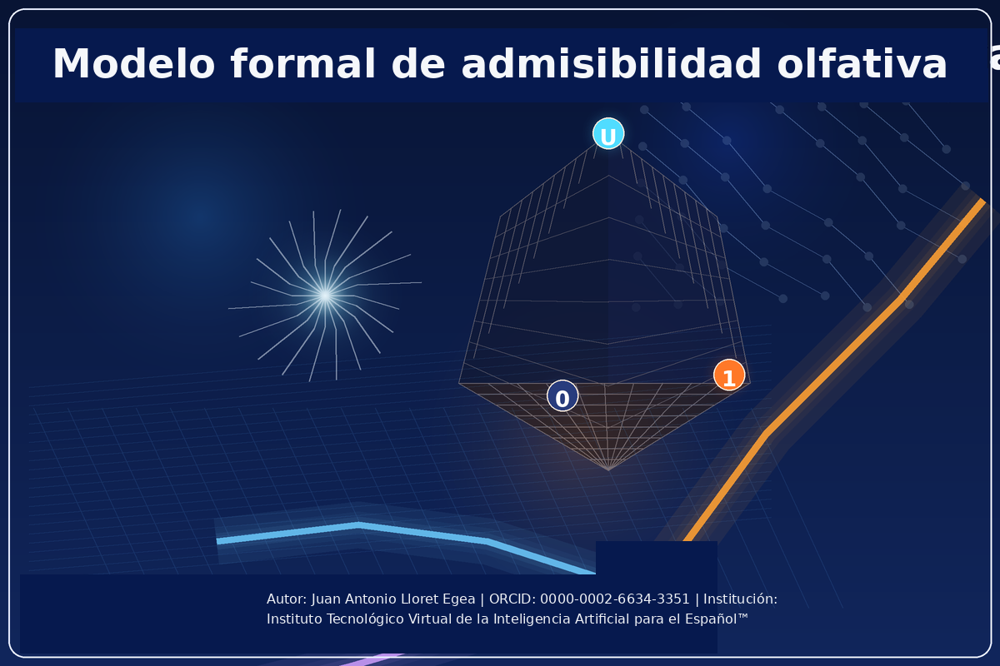
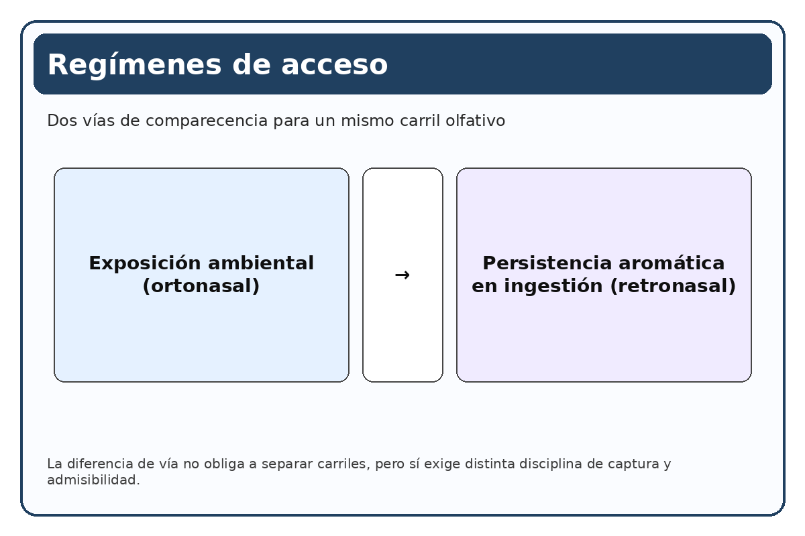
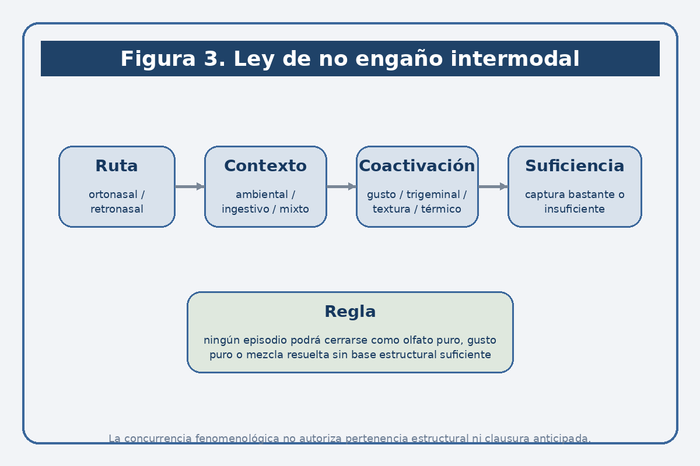
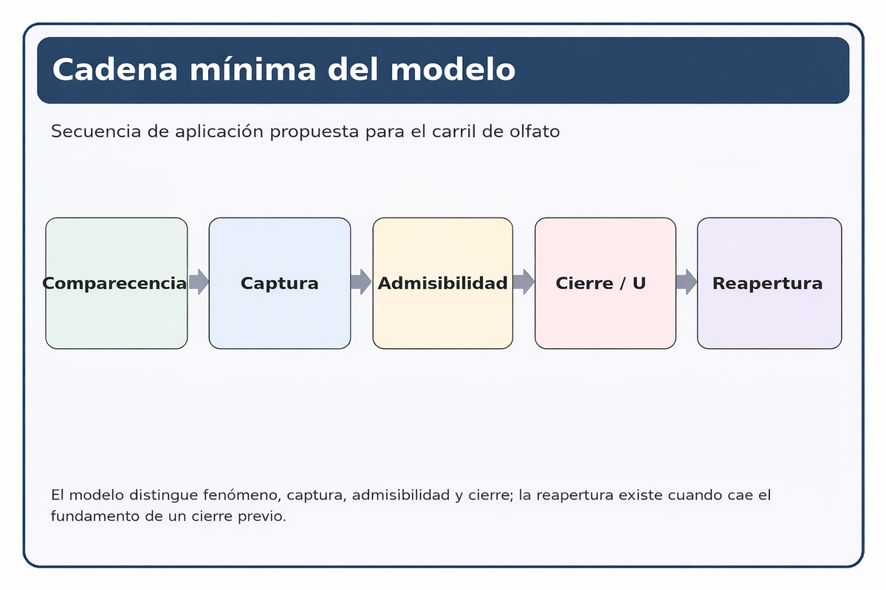
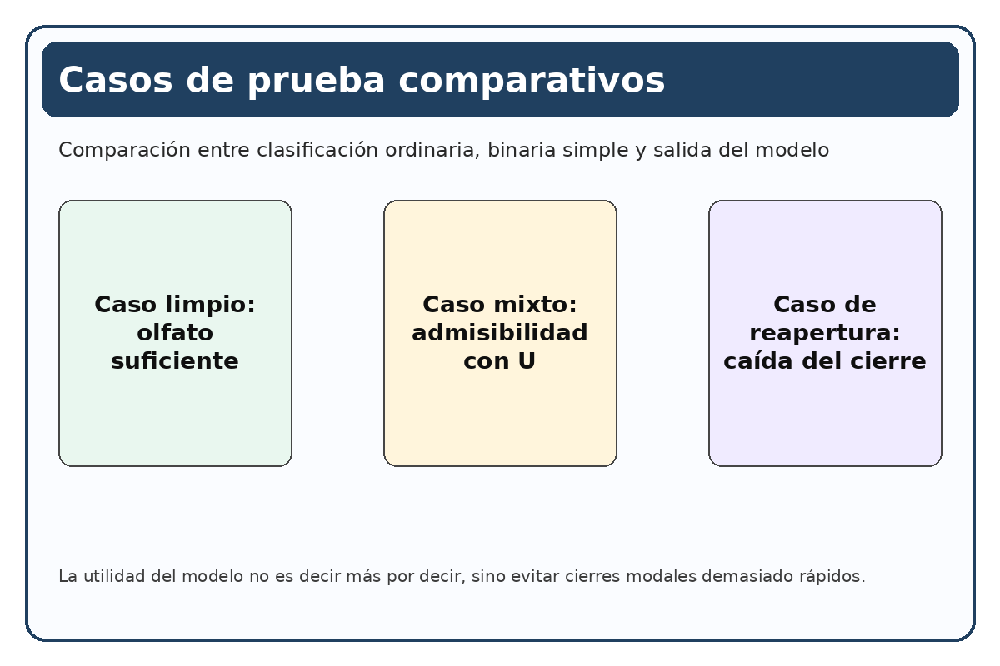

# Modelo formal de admisibilidad olfativa e indeterminación intermodal en el Sistema Vectorial SV

**Autor:** Juan Antonio Lloret Egea | **ORCID:** 0000-0002-6634-3351 | **Institución:** Instituto Tecnológico Virtual de la Inteligencia Artificial para el Español™ (ITVIA) | **Publicación:** IA en™ – La Biblia de la IA™ | **ISSN:** 2695-6411 | **Lugar y fecha:** Madrid, 20 de marzo de 2026

## Conceptos preliminares para la lectura de este documento

Este documento forma parte del **Programa de interfaces del Sistema Vectorial SV**, pero ha sido redactado para que pueda ser leído también por quien no conozca todavía el ecosistema completo en el que se inscribe. Por esa razón, antes de entrar en el problema específico del olfato conviene fijar un suelo mínimo de lectura.

En este contexto, el **Sistema Vectorial SV** puede entenderse, de manera preliminar, como un marco formal orientado a recibir comparecencias del mundo bajo condiciones explícitas de entrada, trazabilidad e indeterminación honesta. No se trata simplemente de registrar algo y decidir de inmediato sobre ello. El sistema distingue entre aquello que comparece, aquello que puede admitirse, aquello que debe permanecer abierto y aquello que puede clausurarse sin falseamiento.

La notación mínima empleada aquí utiliza una **terna de valores**: `{0,1,U}`. En el plano evaluado, `0` designa ausencia o no cumplimiento estructural; `1`, presencia o cumplimiento estructural; y `U`, indeterminación honesta cuando la comparecencia observada no permite una determinación legítima sin violencia sobre el fenómeno o sobre la arquitectura formal que lo recibe. Esta `U` no equivale a probabilidad, ni a término medio, ni a simple error. Designa una forma positiva de no sobrecerrar lo que todavía no puede resolverse limpiamente.

Una **interfaz primaria** designa, en este documento, el régimen por el cual una dimensión del mundo puede adquirir entrada legítima en el sistema. No es todavía una teoría exhaustiva del dominio del que se ocupa, ni una implementación técnica plena. Es, más severamente, la determinación de las condiciones bajo las cuales cierta comparecencia puede ser capturada, admitida, traducida y consultada sin traicionar ni el fenómeno ni el marco que la recibe.

Con este suelo mínimo, el problema de este documento puede formularse con claridad: determinar si el **olfato** puede tratarse mediante un modelo formal de admisibilidad dentro del Sistema Vectorial SV y, en caso afirmativo, bajo qué condiciones debe distinguirse de gusto, chemesthesis, textura, temperatura, memoria y hedónica para no quedar disuelto en la experiencia ordinaria del “sabor”.

## Resumen

La literatura contemporánea sobre olfato describe con creciente precisión la relevancia funcional de la pérdida olfativa, la integración entre olfato retronasal y gusto en la experiencia de *flavour*, y la dificultad de separar olor, gusto, chemesthesis, textura y temperatura dentro de la percepción oral ordinaria. Sin embargo, esa literatura no ofrece por sí sola un criterio formal explícito para decidir cuándo una comparecencia quimiosensorial puede adscribirse de manera suficiente al carril olfativo, cuándo debe tratarse como mezcla no resuelta y cuándo no procede aún clausura legítima.

Este documento propone, dentro del marco interno del Sistema Vectorial SV, un **modelo formal inicial de admisibilidad olfativa** basado en cuatro niveles: comparecencia, captura, admisibilidad y cierre. El modelo distingue dos regímenes de acceso —ortonasal y retronasal— y formula una ley de no engaño intermodal según la cual ninguna comparecencia quimiosensorial podrá clausurarse como olfato puro, gusto puro o mezcla resuelta cuando la vía efectiva de acceso, la coactivación intermodal o la suficiencia de captura no permitan tal determinación sin violencia estructural.

La propuesta introduce además criterios operativos preliminares para la activación de `U` como indeterminación estructural honesta, un protocolo mínimo de aplicación, casos de prueba comparativos y condiciones explícitas de posible refutación. Su aportación no consiste en descubrir la mezcla quimiosensorial, ya bien descrita por la literatura actual, sino en proponer una forma explícita y criticable de tratar esa mezcla sin reducirla a clasificación ordinaria, integración fenomenológica o cierre prematuro.

**Palabras clave:** Sistema Vectorial SV; interfaz olfativa; olfato ortonasal; olfato retronasal; gusto; chemesthesis; indeterminación estructural; admisibilidad; transducción; `.svp`

## 1. Estado del arte, dificultad de frontera y hueco formal que aborda este trabajo

La investigación contemporánea sobre olfato ha dejado de tratar este sentido como un apéndice menor de la percepción humana. En los últimos años, y de forma muy marcada tras la pandemia de COVID-19, la literatura ha subrayado que las alteraciones olfativas afectan de manera relevante a la seguridad, a la nutrición, a la interacción social y a la calidad de vida.

Sin embargo, el interés creciente por el olfato no ha simplificado el problema central de este texto; lo ha hecho más visible. La literatura reciente no presenta el olfato como una modalidad que pueda aislarse fácilmente en la experiencia ordinaria. Al contrario, la investigación quimiosensorial contemporánea trabaja sobre un campo en el que **smell**, **taste** y **chemesthesis** aparecen estrechamente entrelazados, tanto en clínica como en ciencia básica.

La zona más delicada del estado del arte actual se encuentra en la relación entre **olfato retronasal** y **gusto**. Estudios recientes muestran que los olores retronasales pueden evocar patrones neurales compartidos con los gustos dentro del código específico de *flavour*, lo que ayuda a explicar por qué los aromas alimentarios suelen ser experimentados como si fueran “sabores”. Esa convergencia neurofuncional es un hallazgo importante, pero no resuelve por sí sola el problema de adscripción modal.

A esta dificultad se añade una segunda, menos intuitiva y metodológicamente importante. La investigación reciente ha mostrado que algunos **tastants** prototípicos pueden ser detectados por vía olfativa, tanto ortonasal como retronasal, debido a compuestos volátiles presentes en las muestras. La consecuencia científica es clara: la etiqueta ordinaria del estímulo no basta; lo relevante es la **vía efectiva de comparecencia** y el régimen de mezcla en el que esa comparecencia se produce.

La frontera no termina en la relación entre olfato y gusto. La experiencia oral incorpora además dimensiones como **chemesthesis**, **textura**, **temperatura** y, en términos más amplios, **mouthfeel**. Todo ello confirma que la experiencia alimentaria ordinaria es un fenómeno de integración densa, pero no ofrece por sí mismo un criterio formal para decidir qué pertenece al carril olfativo, qué pertenece a otros carriles y qué debe permanecer abierto.

Desde este punto de vista, el estado del arte actual ofrece tres resultados fuertes y una carencia persistente. El primer resultado es que el olfato importa clínica y funcionalmente más de lo que durante décadas se asumió. El segundo es que la **retronasalidad** resulta central para comprender la experiencia ordinaria de “sabor”, pero sin reducirse sin más al gusto. El tercero es que la experiencia oral real desborda cualquier separación intuitiva simple entre olor, gusto y sensaciones somáticas. La carencia persistente es otra: la literatura describe, correlaciona, integra y mide, pero no proporciona por sí sola un régimen formal de admisibilidad, indeterminación honesta y clausura estructural para decidir cuándo una comparecencia quimiosensorial puede adscribirse legítimamente a un carril sensorial específico y cuándo no tiene todavía derecho a cerrarse.

## 2. Marco interno del Sistema Vectorial SV y alcance de la propuesta

Dentro del ecosistema interno ya publicado, la pieza de **Semántica auditada** formaliza una arquitectura de interfaz entre dominio, representación ternaria, consulta formal y clausura estructural, basada en sucesos, entrada legítima y preservación honesta de la indeterminación. La **interfaz visual estructurada** traslada esa legalidad general al frente visible y fija, entre otras cosas, la tesis de que capturar no equivale a decidir. La pieza de **movilidad estructural** añade una condición mínima de legitimidad para la exposición externa sin alterar la ontología ternaria del sistema. Y el frente de **corpus observacional tipado** declara expresamente que no funda una nueva semántica de artefactos, sino una primera forma legítima y estrecha de entrada bajo disciplina conservadora.

Las referencias internas del ecosistema SV se emplean aquí como **marco normativo y técnico** del programa dentro del cual se formula la propuesta. **No se presentan como validación empírica externa del modelo.**

La originalidad de este texto no consiste en descubrir que el olfato se mezcla con gusto, textura o chemesthesis; eso ya lo sabe la literatura contemporánea. Su originalidad potencial reside en proponer una formalización donde esa mezcla no se resuelva ni por intuición ordinaria, ni por nomenclatura culinaria, ni por simple integración fenomenológica, sino por una ley explícita de captura, admisibilidad e indeterminación honesta.

## 3. Problema formal exacto

El objeto de este trabajo no es el olor en general, ni la cultura del perfume, ni la fenomenología completa del sabor, ni la memoria autobiográfica evocada por los aromas. Tampoco es una teoría total del *flavour*. Lo que aquí se busca es más estrecho y más duro: **determinar la forma mínima y rigurosa por la que una comparecencia olfativa puede adquirir entrada legítima en el sistema**.

Esa entrada solo será legítima si permite distinguir con claridad entre lo que pertenece al olfato, lo que pertenece a otros carriles, lo que comparece como mezcla no resuelta y lo que todavía no puede clausurarse sin violencia.

## 4. Regímenes de acceso: ortonasal y retronasal

La primera exigencia seria de una interfaz olfativa consiste en reconocer que el olfato no comparece bajo una única vía homogénea. Hay, al menos, dos regímenes de acceso cuya distinción no es opcional para este trabajo: el **régimen ortonasal** y el **régimen retronasal**.

El primero corresponde, de manera general, a la comparecencia de compuestos odoríferos desde el entorno externo por la vía respiratoria anterior. El segundo corresponde a la comparecencia de compuestos volátiles que alcanzan la cavidad olfativa desde la región oral y nasofaríngea durante la ingestión, la masticación o la deglución. En ambos casos se trata de olfato, pero no de la misma situación de comparecencia. La diferencia de vía arrastra diferencias de contexto, de mezcla y de riesgo de mala atribución modal.

## 5. Fronteras negativas del carril

La primera gran frontera del carril se juega frente al **gusto**. El retronasal pertenece al olfato, pero su pertenencia no autoriza la fusión entre olfato y gusto. La experiencia ordinaria del sabor alimentario no constituye prueba suficiente de identidad entre ambos.

La segunda gran frontera se juega frente a **chemesthesis**, **textura** y **temperatura**. Estas dimensiones pueden coaparecer con el olfato y modular la experiencia global del episodio, pero no quedan por ello absorbidas en el carril olfativo.

La tercera frontera se juega frente a **memoria**, **hedónica** y **afectividad**. Su relevancia humana no se niega, pero no funda por sí sola la admisibilidad de una comparecencia como olfativa.

## 6. Criterios operativos preliminares de captura

La captura mínima del carril de olfato deberá declarar, al menos, los siguientes aspectos:

- **vía de acceso**: ortonasal, retronasal o indeterminada;
- **contexto de comparecencia**: ambiental, ingestivo o mixto;
- **indicios de componente volátil**: suficientes, insuficientes o contradictorios;
- **coactivación gustativa**: presente, ausente o no separable;
- **coactivación chemestésica**: presente, ausente o no separable;
- **carga textural o térmica relevante**: sí, no o indeterminada.

La razón de este umbral es sencilla: si la captura no distingue entre vía, contexto y mezcla, la admisibilidad se vuelve ciega y el cierre, arbitrario.

## 7. Admisibilidad y activación de `U`

La admisibilidad del carril no debe reducirse a “hay olor / no hay olor”. Debe distinguir, al menos, entre:

- **admisibilidad olfativa suficiente**;
- **admisibilidad olfativa con `U`**;
- **inadmisibilidad para el carril de olfato**;
- **reapertura obligada** de un cierre previo.

`U` se activará provisionalmente cuando concurra al menos una de estas condiciones:

1. **Indeterminación de la vía de acceso.**  
   No puede establecerse con base suficiente si la comparecencia relevante es ortonasal, retronasal o mixta.

2. **Coactivación no separable.**  
   La comparecencia presenta interacción gustativa, chemestésica, textural o térmica que no puede desagregarse de forma mínimamente fiable con el protocolo disponible.

3. **Evidencia volátil insuficiente o contradictoria.**  
   Los indicios de componente odorante son débiles, inconsistentes o incompatibles entre sí.

4. **Desacuerdo estructurado entre evaluadores o entre descripciones de captura.**  
   No hay convergencia suficiente para clausura, aun aplicando el mismo esquema de captura.

5. **Caída del fundamento de cierre.**  
   Un episodio previamente clausurado pierde la base sobre la que se había decidido y debe reabrirse.

6. **Incompatibilidad entre contexto y adscripción.**  
   La comparecencia declarada como olfativa pura no es compatible con el régimen real del episodio observado.

## 8. Ley de no engaño intermodal

La ley central del carril puede formularse así:

> **No se admitirá cierre como olfato puro cuando la captura no declare suficientemente vía de acceso, contexto de comparecencia y régimen de coactivación, o cuando, aun declarados, la estructura del episodio mantenga una mezcla no resoluble sin forzar adscripción modal.**

Con ello, el carril fija una disciplina explícita: no decidir donde todavía no tiene derecho a hacerlo.

## 9. Protocolo mínimo de aplicación del modelo

La unidad mínima de análisis no será el alimento, el olor o la bebida en abstracto, sino un **episodio de comparecencia quimiosensorial** descrito de forma acotada. Cada episodio deberá registrar, al menos, contexto, vía presunta de acceso, presencia o ausencia de ingestión, componentes concurrentes relevantes y fundamento de la adscripción propuesta.

El episodio deberá pasar por cuatro planos sucesivos:

### 9.1 Comparecencia
Se describe el episodio sin clausura previa: qué ocurre, en qué contexto y con qué elementos concurrentes.

### 9.2 Captura
Se rellena la ficha mínima de captura con los campos definidos en la sección 6.

### 9.3 Admisibilidad
Se decide una de estas cuatro salidas:
- admisibilidad olfativa suficiente;
- admisibilidad olfativa con `U`;
- inadmisibilidad para el carril de olfato;
- reapertura obligada.

### 9.4 Cierre
Solo si la admisibilidad lo permite, se formula cierre local. En caso contrario, el episodio permanece en `U` o queda fuera del carril.

### 9.5 Regla mínima para determinar la vía
Se considerará **ortonasal** cuando la comparecencia relevante se produzca en ausencia de ingestión y con exposición ambiental o aproximación externa suficiente.  
Se considerará **retronasal** cuando la comparecencia relevante aparezca durante masticación, deglución o persistencia aromática post-ingestiva.  
Se considerará **indeterminada** cuando el episodio no permita separar con base suficiente ambas vías o cuando concurran simultáneamente sin posibilidad razonable de desagregación.

### 9.6 Regla mínima para evidencia volátil suficiente
En esta fase preliminar, “suficiente” no designa todavía una medida instrumental completa, sino una base explícita no arbitraria para tratar el episodio como odorífero:
- presencia reconocible de componente aromático por vía aérea o post-ingestiva;
- coherencia entre contexto, vía presunta y descripción del episodio;
- ausencia de contradicción fuerte con los demás campos de captura.

Será **insuficiente** cuando falte esa base mínima.  
Será **contradictoria** cuando los elementos del episodio apunten en direcciones incompatibles.

### 9.7 Regla de prudencia
Ante duda entre cierre fuerte, `U` o inadmisibilidad, el modelo preferirá **`U` o inadmisibilidad** antes que una adscripción modal forzada.

## 10. Casos de prueba comparativos

El modelo deberá contrastarse, al menos, con tres tipos de salida:
- clasificación ordinaria intuitiva del episodio;
- salida binaria simplificada;
- salida del esquema SV con admisibilidad, `U` y reapertura.

### Caso 1. Café recién servido, sin ingestión
**Comparecencia:** el sujeto percibe aroma intenso al acercar la taza antes de beber.  
**Captura:** vía ortonasal; contexto ambiental inmediato; evidencia volátil suficiente; coactivación gustativa ausente; chemesthesis ausente; carga textural-térmica no relevante.  
**Salida ordinaria:** “huele a café”.  
**Salida binaria simple:** olor sí.  
**Salida SV:** **admisibilidad olfativa suficiente**.  
**Interés:** caso de control relativamente limpio.

### Caso 2. Sabor “a vainilla” durante ingestión de crema
**Comparecencia:** el sujeto refiere “sabor a vainilla” mientras come.  
**Captura:** vía retronasal presunta; contexto ingestivo; evidencia volátil suficiente; coactivación gustativa presente; textura relevante; carga térmica baja.  
**Salida ordinaria:** gusto a vainilla.  
**Salida binaria simple:** olor y gusto mezclados, sin mayor distinción.  
**Salida SV:** **admisibilidad olfativa con `U`** o cierre retronasal olfativo solo si la mezcla ha sido suficientemente discriminada.  
**Interés:** muestra que el nombre ordinario “sabor” no basta para cierre modal.

### Caso 3. Caramelo mentolado
**Comparecencia:** sensación dominante de frescor con componente aromático.  
**Captura:** vía mixta o indeterminada; contexto ingestivo; evidencia volátil presente; coactivación chemestésica no separable; posible coactivación gustativa; carga térmica subjetiva relevante.  
**Salida ordinaria:** “sabe/huele a menta”.  
**Salida binaria simple:** olor sí.  
**Salida SV:** **`U`** o inadmisibilidad para cierre olfativo puro.  
**Interés:** fuerza la frontera con chemesthesis.

### Caso 4. Solución de tastant con componente volátil no evidente a simple vista
**Comparecencia:** el sujeto discrimina el episodio como si hubiera cualidad aromática.  
**Captura:** vía ortonasal o retronasal según diseño; evidencia volátil suficiente o sospechada; coactivación gustativa presente; contexto controlado.  
**Salida ordinaria:** “es gusto”.  
**Salida binaria simple:** gusto sí.  
**Salida SV:** no cierre gustativo automático; **apertura a componente olfativo** o `U` según captura.  
**Interés:** es el caso que mejor responde a la objeción sobre valor diferencial del modelo.

### Caso 5. Olor ambiental en cocina con humo y picor ocular
**Comparecencia:** episodio con olor fuerte, irritación y calor ambiental.  
**Captura:** vía ortonasal; contexto ambiental; evidencia volátil suficiente; coactivación chemestésica presente; carga térmica relevante.  
**Salida ordinaria:** “huele fuerte”.  
**Salida binaria simple:** olor sí.  
**Salida SV:** admisibilidad olfativa posible, pero **no cierre como olfato puro**; debe declararse coactivación relevante.  
**Interés:** obliga a no absorber en olfato toda la experiencia del episodio.

### Caso 6. Reapertura
**Comparecencia:** un episodio inicialmente clasificado como olfativo puro pasa a reinterpretarse al conocerse que existía fuerte componente trigeminal o contexto ingestivo no registrado.  
**Salida SV inicial:** admisibilidad olfativa suficiente.  
**Salida SV revisada:** **reapertura obligada** y paso a `U` o a nueva clasificación.  
**Interés:** demuestra que el modelo no es solo taxonomía estática.

## 11. Condiciones de refutación o debilitamiento

La propuesta quedaría debilitada si se verificara alguna de las siguientes situaciones:

1. Que los criterios de activación de `U` no produjeran decisiones distinguibles respecto de una clasificación ordinaria no formalizada.
2. Que distintos evaluadores no pudieran aplicar de forma razonablemente consistente el esquema de captura y admisibilidad.
3. Que la distinción entre ortonasalidad, retronasalidad y mezcla no generara consecuencias operativas diferentes.
4. Que el modelo no pudiera justificar ninguna reapertura legítima de cierres previos.
5. Que la estructura propuesta no añadiera nada sobre la simple descripción narrativa del episodio sensorial.

## 12. Relación prudente con el Lenguaje SV (`.svp`)

El objetivo principal de este documento no es desarrollar el Lenguaje SV, pero sí debe dejarle un suelo mejor. La relación correcta con `.svp` es, en este momento, la de una **preparación prudente**. El artículo no autoriza por sí mismo modificación alguna de semántica, IR, gramática, validator ni runner.

La única consecuencia admisible en esta fase es una vigilancia más fina sobre cuatro diferencias:

- fenómeno captado y captura declarada;
- captura y admisibilidad;
- admisibilidad y cierre modal;
- cierre y reapertura obligada.

## 13. Alcance, límites y nota programática interna

Este trabajo no clausura una teoría total del olor ni agota la ciencia del *flavour*. Su alcance es el de una **primera formulación formal y refutable** del problema de admisibilidad olfativa dentro del marco SV.

Dentro del programa interno del SV, este documento puede leerse como una **prueba crítica de madurez** del conjunto de interfaces ya abiertas. Esta afirmación tiene **rango programático interno** y no se presenta aquí como validación externa del modelo.

## 14. Conclusión

El olfato puede abordarse como carril legítimo dentro del Sistema Vectorial SV si se acepta desde el principio su dificultad fronteriza. Su tratamiento no debe descansar en la intuición cotidiana del “sabor”, sino en una disciplina formal capaz de distinguir comparecencia, captura, admisibilidad, cierre e indeterminación honesta allí donde la mezcla impide clausura limpia.

Si este documento cumple su función, no habrá demostrado que el SV “puede hablar de olores”, sino algo más preciso: que puede proponer un régimen explícito y criticable de admisibilidad olfativa allí donde la experiencia ordinaria y la literatura empírica describen con riqueza la mezcla, pero no resuelven por sí solas el problema del cierre legítimo.

## Referencias

### Referencias internas del ecosistema SV

Lloret Egea, J. A. (2026a). *Fundamentos algebraico-semánticos del Sistema Vectorial SV*. Instituto Tecnológico Virtual de la Inteligencia Artificial para el Español™.

Lloret Egea, J. A. (2026b). *Álgebra de composición intercelular del marco SV*. Instituto Tecnológico Virtual de la Inteligencia Artificial para el Español™.

Lloret Egea, J. A. (2026c). *Álgebra de composición intercelular del marco SV — II. Gramática general de composición*. Instituto Tecnológico Virtual de la Inteligencia Artificial para el Español™.

Lloret Egea, J. A. (2026d). *Álgebra de composición intercelular del marco SV — III. Horizonte de sucesos y reevaluación discreta*. Instituto Tecnológico Virtual de la Inteligencia Artificial para el Español™.

Lloret Egea, J. A. (2026e). *Álgebra de composición intercelular del marco SV — IV. Transducción al alfabeto ternario e interfaz paramétrica del sistema*. Instituto Tecnológico Virtual de la Inteligencia Artificial para el Español™.

Lloret Egea, J. A. (2026f). *Semántica auditada en el Sistema Vectorial SV: formalización estructural basada en sucesos, transducción ternaria y clausura trazable*. Instituto Tecnológico Virtual de la Inteligencia Artificial para el Español™.

Lloret Egea, J. A. (2026g). *Formalización de una interfaz visual estructurada en el Sistema Vectorial SV*. Instituto Tecnológico Virtual de la Inteligencia Artificial para el Español™.

Lloret Egea, J. A. (2026h). *Movilidad estructural y legitimidad de exposición en el Sistema Vectorial SV*. Instituto Tecnológico Virtual de la Inteligencia Artificial para el Español™.

Lloret Egea, J. A. (2026i). *Primera forma legítima del frente de corpus observacional tipado del Sistema Vectorial SV*. Instituto Tecnológico Virtual de la Inteligencia Artificial para el Español™.

### Referencias externas principales

Khorisantono, P. A., Veldhuizen, M. G., & Seubert, J. (2025). Tastes and retronasal odours evoke a shared flavour-specific neural code in the human insula. *Nature Communications, 16*, 8252.

Mu, S., Stieger, M., & Boesveldt, S. (2024). Can humans smell tastants? *Chemical Senses, 49*, bjad054.

Munger, S. D., Pellegrino, R., et al. (2025). Towards universal chemosensory testing: needs, barriers, and opportunities. *Chemical Senses, 50*, bjaf015.

Oleszkiewicz, A., et al. (2025). The impact of olfactory loss on quality of life: a 2025 review. *Chemical Senses*.

Riantiningtyas, R. R., et al. (2024). A review of assessment methods for measuring individual differences in oral somatosensory perception. *Journal of Texture Studies*.

Wolinska-Kennard, K., et al. (2025). Mouthfeel of food and beverages: A comprehensive review. *Current Opinion in Food Science*.
