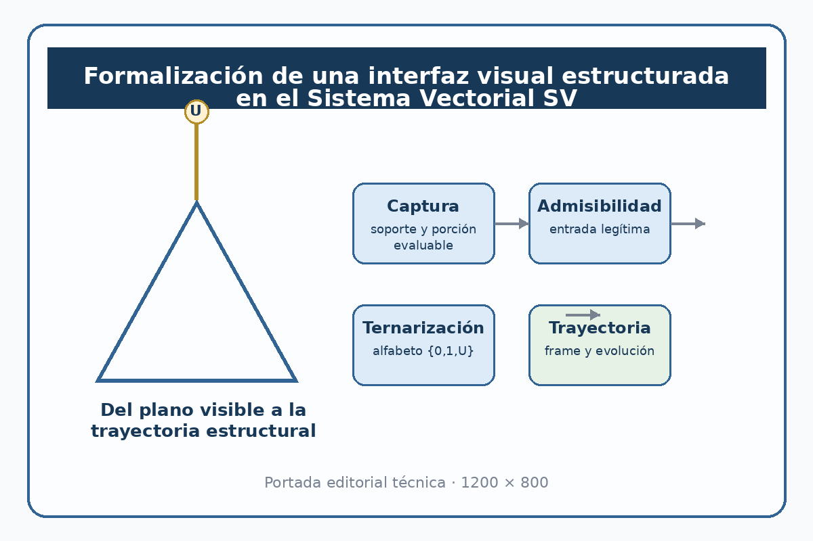
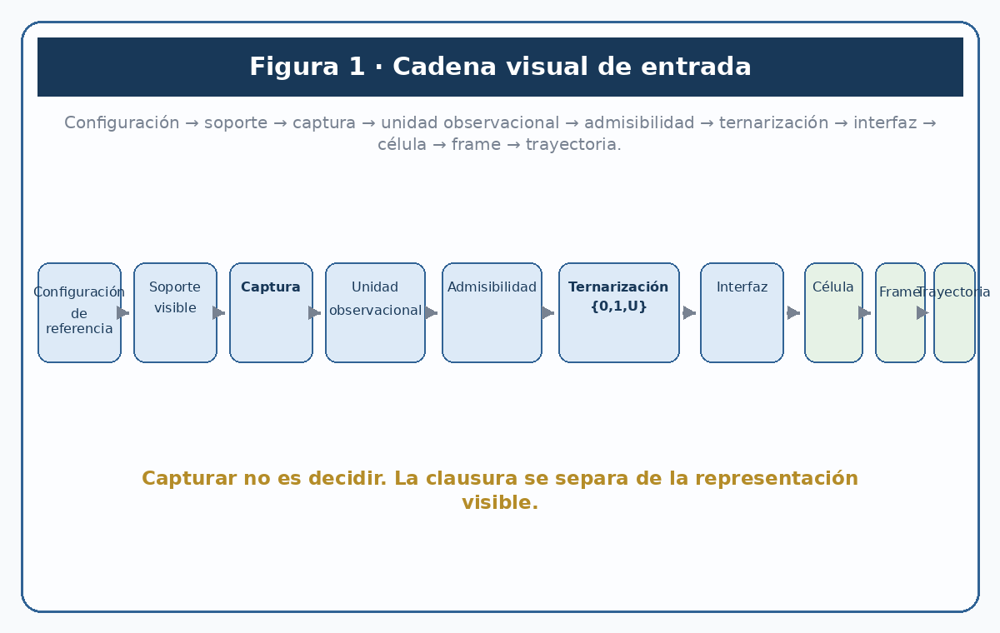
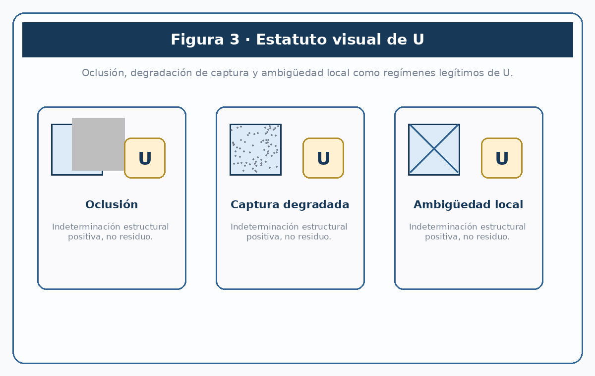
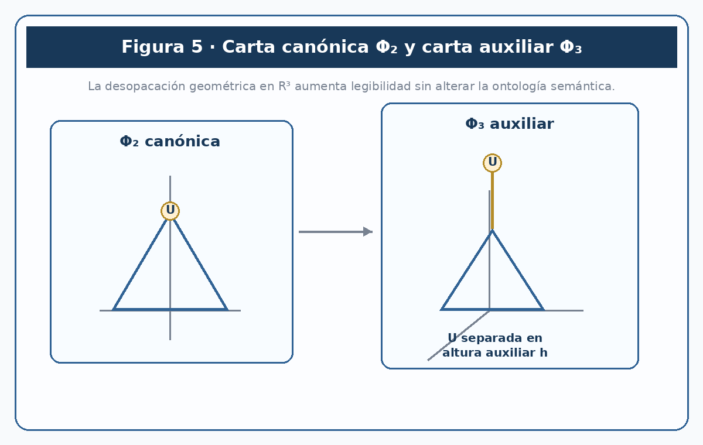
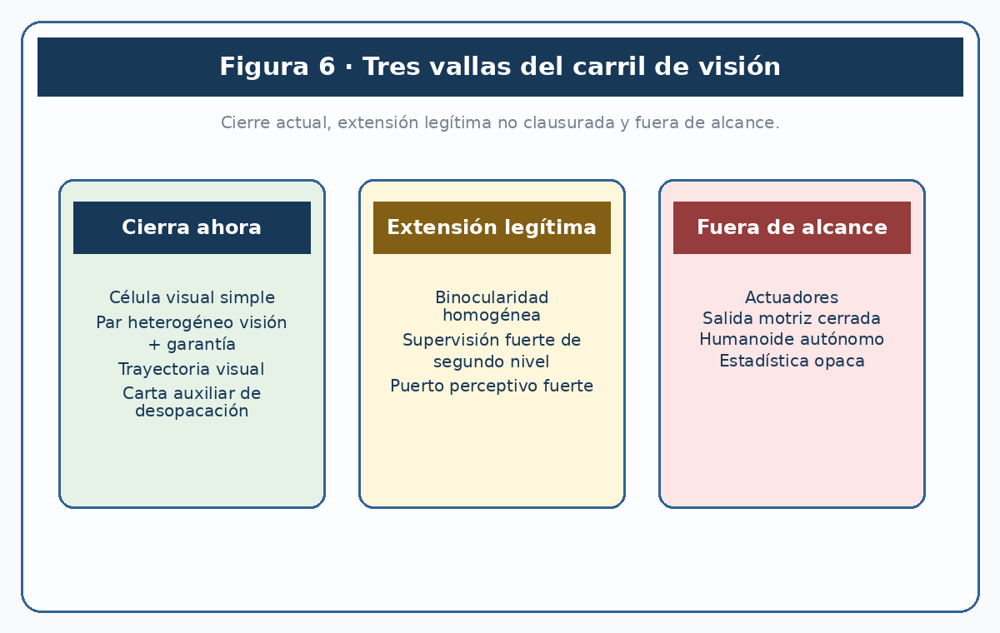
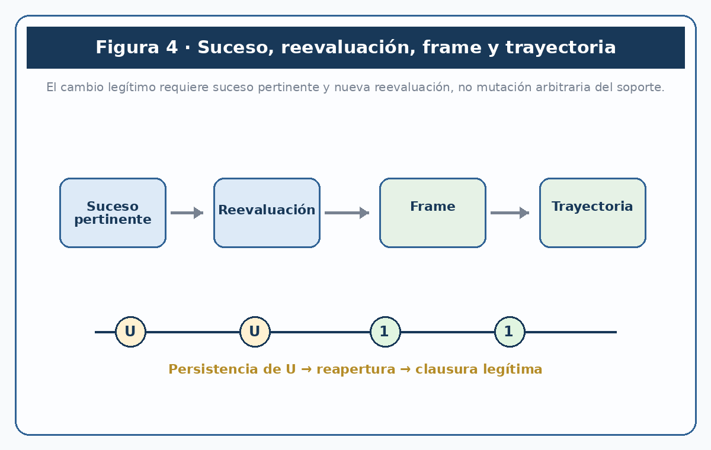
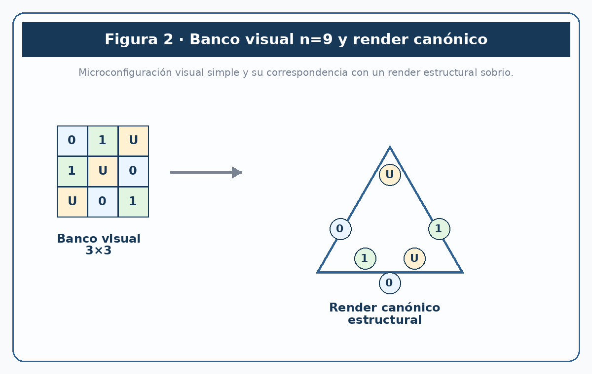

# Formalización de una interfaz visual estructurada en el Sistema Vectorial SV

**Juan Antonio Lloret Egea**  

ORCID: 0000-0002-6634-3351  

Madrid, 2026  

CC BY-NC-ND 4.0 · ISSN 2695-6411

---

## Resumen

Este trabajo formaliza una interfaz visual estructurada para el Sistema Vectorial SV. Su objeto no es proponer una teoría general de la percepción ni una arquitectura visual opaca, sino fijar la cadena mínima por la cual una configuración visible acotada puede adquirir estatuto algebraico legítimo dentro del sistema.

El punto de partida es la ley de entrada ya establecida por la serie intercelular del SV: una magnitud del mundo no ingresa directamente en la célula, sino a través de una secuencia de dominio observacional, captura, admisibilidad, transducción al alfabeto ternario `{0,1,U}`, interfaz paramétrica e integración celular. Sobre esa base, el presente trabajo delimita una capa visual en la que se distinguen con rigor la configuración de referencia, el soporte visible, el acto de captura, la unidad observacional evaluable, la ternarización y la clausura.

El trabajo sostiene cuatro tesis principales. Primera: una representación visible no puede usurpar el papel de la clausura; capturar no es decidir. Segunda: el estado `U` posee en visión estatuto positivo y no residual, en particular en casos de oclusión, degradación de captura o ambigüedad local no clausurable. Tercera: la carta espacial afín auxiliar en `ℝ³` puede aumentar la legibilidad estructural de ciertas configuraciones sin alterar la ontología semántica del sistema. Cuarta: la visión no debe organizarse primariamente como multiplicación de “ojos”, sino como composición reglada de células completas, puertos y garantías de clausura.

Metodológicamente, el trabajo se apoya en un banco canónico exhaustivo `n=9` y en un banco visual sintético austero de microconfiguraciones. Su objetivo es mostrar que el Sistema Vectorial SV admite una interfaz visual trazable, sobria y no engañosa, sin cerrar todavía la binocularidad homogénea, la salida motriz ni la capa de humanoide autónomo.

**Palabras clave:** Sistema Vectorial SV; interfaz visual; transducción ternaria; admisibilidad; clausura trazable; indeterminación estructural; trayectoria; carta auxiliar.

---

## Abstract

This paper formalizes a structured visual interface for the SV Vectorial System. Its aim is not to provide a general theory of perception nor an opaque visual architecture, but to specify the minimal chain by which a bounded visible configuration can acquire legitimate algebraic status inside the system.

The starting point is the entry law already established by the SV intercellular series: a worldly magnitude does not enter the cell directly, but through a sequence involving observational domain, capture, admissibility, transduction into the ternary alphabet `{0,1,U}`, parametric interface, and cellular integration. On that basis, the present work delimits a visual layer in which reference configuration, visible support, act of capture, evaluable observational unit, ternarization, and closure are rigorously distinguished.

The paper advances four main theses. First, a visible representation cannot usurp the role of closure; capture is not decision. Second, the state `U` has a positive and non-residual status in vision, especially under occlusion, degraded capture, or locally irresolvable ambiguity. Third, the auxiliary affine spatial chart in `ℝ³` may increase structural legibility without altering the semantic ontology of the system. Fourth, vision should not be organized primarily as multiplication of “eyes”, but as regulated composition of complete cells, ports, and closure guarantees.

Methodologically, the work relies on an exhaustive canonical `n=9` bank and on an austere synthetic visual bank of microconfigurations. Its purpose is to show that the SV System admits a traceable, sober, and non-deceptive visual interface, while not yet closing homogeneous binocularity, motor output, or the autonomous humanoid layer.

---

## 1. Introducción

El Sistema Vectorial SV dispone ya de una base algebraico-semántica consolidada y de una serie doctrinal que ha formalizado, entre otros elementos, la composición intercelular, el horizonte de sucesos, la reevaluación discreta, la trayectoria y la entrada auditable de magnitudes no nativas en el sistema. Sin embargo, la cuestión de una interfaz visual estructurada no había sido todavía fijada de manera unitaria.

La dificultad no es menor. La visión introduce un riesgo propio: que el soporte visible adquiera una autoridad que no le corresponde. Una figura puede aumentar legibilidad, pero también puede comprimir diferencias estructurales, inducir falsa claridad o forzar clausuras para las que no existe base formal suficiente. Por ello, una teoría visual compatible con el SV no puede nacer desde la fascinación por la imagen, sino desde la ley de entrada auditable y desde la subordinación del soporte a la clausura.

Bajo esa exigencia, el objetivo del paper es acotado: formalizar la interfaz visual estructurada del Sistema Vectorial SV y determinar bajo qué condiciones una configuración visible puede incorporarse legítimamente al sistema como dato ternarizado y trazable.

---

## 2. Delimitación negativa

El presente trabajo no hace las siguientes cosas:

1. no formula una teoría general de la percepción;  

2. no identifica visión con soporte plano ni con fisiología humana;  

3. no convierte la carta espacial auxiliar en ontología del sistema;  

4. no cierra la binocularidad homogénea como resultado ya consumado;  

5. no formaliza todavía actuadores ni una capa de humanoide autónomo;  

6. no introduce estadística, minería de datos, inferencia opaca ni modelado continuo;  

7. no confunde captura con clasificación ni ternarización con clausura.

Esta delimitación no es meramente prudencial. Es una condición de legitimidad. El carril de visión solo puede ganar fuerza si restringe con dureza su propio alcance.

---

## 3. Tesis central

La tesis central de este trabajo puede formularse así:

> una configuración visible acotada puede adquirir estatuto algebraico legítimo en el Sistema Vectorial SV si y solo si atraviesa una cadena explícita de dominio observacional, captura, admisibilidad, ternarización e interfaz paramétrica, manteniendo separadas representación visible y clausura estructural.

De esta tesis se siguen cuatro corolarios.

### 3.1. Primer corolario

Capturar no es decidir.

### 3.2. Segundo corolario

`U` posee en visión estatuto positivo y puede ser el valor correcto de una configuración visible.

### 3.3. Tercer corolario

Una carta espacial auxiliar puede aumentar legibilidad sin modificar ontología.

### 3.4. Cuarto corolario

La composición visual futura debe organizarse por células completas, puertos y garantías, no por mera multiplicación de canales homogéneos.

---

## 4. Marco formal mínimo

### 4.1. Configuración de referencia

Se entiende por configuración de referencia el hecho o disposición visible del que se pretende obtener lectura estructural.

### 4.2. Soporte visible disponible

Se entiende por soporte visible la inscripción material efectivamente disponible para la captura del caso.

### 4.3. Captura

Se entiende por captura el acto reglado por el que una porción del soporte visible es seleccionada o presentada para evaluación.

### 4.4. Unidad observacional evaluable

Se entiende por unidad observacional evaluable el resultado de la captura cuando ya puede someterse a control de admisibilidad y a transducción ternaria.

### 4.5. Admisibilidad

Se entiende por admisibilidad el control por el cual se determina si la unidad observacional evaluable puede entrar legítimamente en la cadena de ternarización.

### 4.6. Ternarización

Se entiende por ternarización el paso formal desde la unidad observacional admisible al alfabeto `{0,1,U}`.

### 4.7. Clausura

Se entiende por clausura la fijación trazable de un valor o de un estado abierto dentro del frame o de la trayectoria correspondiente.

---

## 5. Cadena visual de entrada

El presente carril adopta, como ley mínima, la siguiente cadena:

**configuración de referencia → soporte visible → captura → unidad observacional evaluable → admisibilidad → ternarización → interfaz paramétrica → célula → frame → trayectoria**

Su función es impedir tres confusiones:

- entre mundo y soporte;  

- entre soporte y captura;  

- entre captura y clausura.

Toda teoría visual compatible con el SV deberá respetar esta secuencia o justificar formalmente cualquier refinamiento ulterior.

---

## 6. Estatuto de U en visión

El valor `U` no se interpreta aquí como residuo de ignorancia vergonzante, sino como resultado estructural legítimo cuando la cadena visual no alcanza base suficiente para clausura en `0` o `1`.

En esta fase fundacional, al menos tres regímenes deberán reconocerse como legitimadores de `U`:

1. degradación de captura que impida clausura suficiente;  

2. oclusión estructural;  

3. ambigüedad local no resoluble en el frame actual.

La revisión posterior de un caso no constituye un subtipo de `U`, sino una dinámica de reevaluación dentro de la cual `U` puede persistir o resolverse.

---

## 7. Carta auxiliar y legibilidad estructural

La representación plana canónica sigue siendo suficiente para la semántica del sistema. Sin embargo, cuando la distribución de `U` sea estructuralmente relevante, una carta espacial afín auxiliar podrá emplearse como operación de desopacación, siempre que no se confunda con ontología ni con distancia física resuelta.

La función de la carta auxiliar no será, por tanto, “hacer tridimensional” el sistema, sino volver legible lo que el plano comprime.

---

## 8. Composición visual y garantías

La visión futura del SV no se organizará, en su forma fuerte, por mera multiplicación de “ojos”, sino por composición reglada de células completas, puertos y garantías.

En esta primera publicación solo se cierra plenamente la posibilidad de:

- célula visual simple;  

- par heterogéneo de visión y garantía;  

- trayectoria visual trazable;  

- carta auxiliar de desopacación.

La binocularidad homogénea y la supervisión fuerte de segundo nivel quedan nombradas como extensiones legítimas, pero no clausuradas todavía.

---

## 9. Régimen visual del cambio

La interfaz visual del Sistema Vectorial SV no debe pensarse como una mera sucesión indiferenciada de estados visibles, sino como una cadena discreta de **sucesos pertinentes**, **reevaluaciones**, **frames** y **trayectorias**.

En consecuencia, una teoría visual compatible con el SV debe distinguir, al menos, cuatro planos temporales discretos. El primero es el **suceso pertinente**, entendido como aquello que obliga a abrir o a revisar una lectura visible. El segundo es la **reevaluación**, que no constituye todavía clausura, sino reapertura controlada del caso. El tercero es el **frame**, como estado discreto resultante tras la reevaluación legítima. El cuarto es la **trayectoria**, como secuencia trazable de estados, aperturas, persistencias de `U` y cierres.

Esta estratificación permite resolver una confusión frecuente: que la variación visible del soporte se tome sin más por dinámica estructural del sistema. No toda modificación del soporte visible merece rango de suceso pertinente; no todo cambio de aspecto autoriza una nueva clausura. Para que exista verdadero cambio visual en sentido SV deben concurrir, de manera explícita, un suceso, una nueva captura o una nueva condición de admisibilidad capaces de alterar legítimamente el estado celular o el dato de transición correspondiente.

Bajo esta ley, la reevaluación no debe interpretarse como inestabilidad arbitraria del sistema, sino como disciplina de honestidad frente a lo visible. Allí donde un soporte plano, una oclusión, una degradación de captura o una discordancia entre composiciones parciales impidan clausura suficiente, la trayectoria correcta no es el cierre forzado, sino la persistencia de `U`, la apertura o la revisión.

---

## 10. Cadena de entrada visual y principio de no engaño geométrico

El presente trabajo asume como ley de entrada la secuencia ya fijada por el Documento IV del marco intercelular: una magnitud del mundo no ingresa directamente en la célula, sino mediante dominio observacional, captura, observación, lectura o medida, transducción al alfabeto ternario, interfaz paramétrica, composición, frame y trayectoria.

Traducida al carril de visión, la secuencia adopta la forma siguiente:

**configuración de referencia → soporte visible disponible → captura → unidad observacional evaluable → admisibilidad → ternarización `{0,1,U}` → interfaz paramétrica → célula → frame → trayectoria**

De esta ley se sigue el **principio de no engaño geométrico**. Una representación visible podrá volver manifiestos contigüidad, borde, interposición, ruptura, orden relativo o ambigüedad estructural; pero no podrá clausurar profundidad física o distancia métrica salvo que el régimen de captura aporte base geométrica suficiente. Cuando el soporte disponible no basta para distinguir entre varias configuraciones espaciales compatibles, la clausura correcta no es una distancia elegante, sino `U` o estado abierto.

Bajo esta misma luz adquiere sentido la carta espacial afín auxiliar. La publicación sobre el levantamiento geométrico del polígono SV no afirma que el sistema “viva en tres dimensiones”, sino algo más sobrio: que la proyección plana puede ser semánticamente suficiente y, al mismo tiempo, visualmente opaca, mientras que una carta auxiliar `Φ₃` puede separar geométricamente `U` del plano de determinación y volver legibles ciertas diferencias estructurales sin alterar la ontología del signo.

---

## 11. Antecedentes y posición del trabajo

El primer antecedente mayor de este carril sigue siendo David Marr. Su importancia para el presente artículo no radica en una coincidencia material con el SV, sino en dos exigencias metodológicas que siguen vigentes: la visión debe estudiarse en términos de representación y transformación, y debe distinguirse entre nivel computacional, nivel algorítmico y nivel de realización física.

Un segundo antecedente relevante es la visión basada en eventos. Este campo ha mostrado de forma sólida que la captura puede organizarse como corriente asíncrona de cambios por píxel, con alta resolución temporal y gran sensibilidad a la dinámica de la escena.

Un tercer antecedente es la tradición de los mapas de ocupación. Su valor para este artículo es doble. Por un lado, muestran que una discretización espacial por celdas con un tercer estado de desconocimiento es completamente inteligible dentro de una tradición técnica consolidada. Por otro, recuerdan que el espacio discretizado no equivale sin más a verdad del mundo, sino a una representación operativa construida desde observaciones parciales.

Un cuarto antecedente está en la literatura de scene graphs. Su interés para el carril de visión no reside en que el SV pretenda convertirse en un sistema de generación de grafos de escena, sino en que esta familia ha mostrado que la visión puede aspirar a una estructuración relacional explícita y no limitarse a clasificaciones globales.

Frente a esos antecedentes, el corpus interno del SV aporta una combinación singular. El Documento IV formaliza la ley mínima de entrada auditada y separa captura y ternarización. La carta `Φ₃` aporta una vía de legibilidad geométrica subordinada. La pieza sobre trayectorias de `U` añade una dinámica estructural sin nuevos valores lógicos. Y la publicación sobre células en par eleva la célula completa al rango de unidad compositiva y muestra que dos células semánticamente asimétricas pueden combinarse mediante una regla algebraica conservadora.

En consecuencia, la posición específica del presente trabajo no es la de una psicología de la visión, ni la de una cartografía probabilística, ni la de una simple relacionalidad de escena, sino la de una **interfaz visual estructurada bajo ley de transducción, admisibilidad y clausura**.

---

## 12. Metodología experimental y criterio de prueba

La fase fundacional del carril no debe apoyarse en escenas ricas ni en captura exuberante, sino en austeridad experimental. Por ello, el trabajo se apoya en dos bancos complementarios.

El primero es el **banco canónico exhaustivo `n=9`**, ya disponible como espacio completo de `3^9 = 19.683` configuraciones ternarias. Su función no es simular “mundo real”, sino ofrecer un suelo exacto para verificar correspondencia entre configuración ternaria, representación canónica, presencia de `U`, consistencia del render y coherencia entre figura y cierre.

El segundo es un **banco visual sintético austero** de microconfiguraciones construidas para someter a prueba casos estructuralmente relevantes: presencia nítida, ausencia nítida, oclusión, degradación de captura, ambigüedad local, persistencia de `U` y reapertura por suceso pertinente.

La prueba central del carril no será “reconocer muchas imágenes”, sino responder con legitimidad a estas preguntas: qué entra; bajo qué condiciones se admite; qué puede ternarizarse; cuándo debe mantenerse `U`; cómo se conserva la trazabilidad; y en qué sentido una carta auxiliar mejora legibilidad sin fabricar nueva ontología.

---

## 13. Discusión adversarial interna

La primera objeción seria contra este trabajo dirá que el banco visual sintético es demasiado austero y que, por tanto, el carril no prueba una visión “de verdad”. La respuesta debe ser frontal: el objetivo de esta publicación no es clausurar la totalidad del dominio visual, sino fijar con la mayor dureza posible la legalidad de la entrada visible al SV.

La segunda objeción dirá que la carta `Φ₃` desliza al sistema hacia una ontología espacial que contradice la primacía del plano canónico. Esta objeción solo se responde si el manuscrito mantiene, con dureza inflexible, que `Φ₂` es la representación canónica y que `Φ₃` es una carta afín auxiliar de laboratorio, útil cuando el plano comprime diferencias estructurales relevantes, pero incapaz de fundar por sí sola una nueva ontología del signo.

La tercera objeción dirá que la composición de células y la mención de pares visuales abren la puerta a una binocularidad que el paper todavía no demuestra. Esa objeción es correcta si el manuscrito exagera. Por ello, la formulación adecuada será ésta: el artículo cierra plenamente la célula visual simple, el par heterogéneo de visión y garantía, la trayectoria visual y la carta de desopacación; en cambio, la binocularidad homogénea y la supervisión fuerte de segundo nivel quedan nombradas como extensiones legítimas, pero no proclamadas como resultados ya consumados.

La cuarta objeción dirá que la insistencia en `U` puede convertir el carril en una teoría del no saber y no del ver. La respuesta es la contraria: un sistema que no sabe declarar su indeterminación no merece ver. La dignidad estructural de `U` no empobrece la interfaz visual; la protege de una corrupción más grave, que sería fingir clausura donde solo hay soporte insuficiente, discordancia o ambigüedad local.

---

## 14. Condiciones de aplicabilidad y límites

El presente trabajo solo será aplicable allí donde puedan declararse con claridad suficiente el dominio observacional, el soporte visible disponible, el acto de captura, la unidad observacional evaluable, la regla de admisibilidad y la regla de ternarización. Allí donde esas capas no puedan distinguirse, la interfaz visual quedará fuera de rango o deberá permanecer en estado abierto.

También queda expresamente fuera de alcance cualquier clausura de distancia métrica o profundidad física que no disponga de base geométrica suficiente. Una representación plana podrá volver visible orden relativo, borde, oclusión o compresión estructural, pero no tendrá derecho a fingir distancia resuelta. En esto el carril de visión se somete a una ley de austeridad especialmente fuerte: si el soporte no basta, el valor correcto será `U`, revisión o rechazo, nunca una claridad usurpada.

Por último, el artículo no declara consumado el puerto perceptivo de extremo a extremo ni formaliza todavía actuadores, salida motriz o humanoide autónomo. Si el carril sobrevive a esta primera publicación, su desarrollo ulterior deberá hacerse sobre la base aquí fijada y no contra ella.

---

## 15. Conclusión

El presente trabajo ha propuesto una formalización de la interfaz visual del Sistema Vectorial SV bajo una exigencia deliberadamente restrictiva: no permitir que el soporte visible usurpe el lugar de la clausura ni que la captura se confunda con la decisión. Sobre la base ya fijada por la ley de entrada del marco SV, la contribución central del artículo consiste en mostrar que una configuración visible acotada puede adquirir estatuto algebraico legítimo solo cuando atraviesa una cadena explícita de dominio observacional, captura, admisibilidad, transducción ternaria e interfaz paramétrica. Ésta es la condición mínima para que la visualidad entre en el sistema sin degradarlo.

A partir de esa ley se sostienen cuatro tesis. La primera es que capturar no es decidir: toda interfaz visual compatible con el SV debe distinguir entre configuración de referencia, soporte visible, captura, unidad observacional evaluable, ternarización y clausura. La segunda es que `U` posee en visión estatuto positivo y puede ser el valor correcto allí donde la captura se degrada, la oclusión impide cierre suficiente o la ambigüedad local no es resoluble en el frame actual. La tercera es que la carta espacial afín auxiliar `Φ₃` puede aumentar la legibilidad estructural de ciertas configuraciones sin alterar la ontología semántica del sistema, siempre que siga subordinada a la representación canónica plana. La cuarta es que la visión futura del SV no debe organizarse como multiplicación ingenua de “ojos”, sino como composición reglada de células completas, puertos y garantías de clausura.

El artículo no pretende haber clausurado una teoría general de la percepción, una teoría completa de la profundidad, una binocularidad homogénea ya madura ni una capa de humanoide autónomo. Su alcance es más restringido y, por ello mismo, más defendible: fijar la admisibilidad de una capa visual estructurada dentro del SV y establecer una disciplina de no engaño geométrico. En este sentido, el resultado principal no es una promesa de omnipotencia visual, sino una ley de sobriedad: cuando el soporte no basta, el valor correcto no es una claridad forzada, sino `U`, revisión o rechazo. Ésta es, precisamente, la garantía de que la visualidad no se convierta en un privilegio ilegítimo dentro del sistema.

Si el carril de visión merece desarrollo ulterior, deberá hacerlo sin traicionar las restricciones aquí fijadas. Todo avance futuro —binocularidad homogénea, supervisión fuerte de segundo nivel, integración motriz o arquitecturas para humanoides— habrá de respetar la prioridad de la ley de entrada auditada, la separación entre captura y clausura, el estatuto positivo de `U` y la subordinación de toda carta auxiliar a la ontología ternaria del sistema. Si el artículo logra dejar eso establecido con suficiente claridad, habrá cumplido su misión: no demostrar que el SV “ya ve todo”, sino mostrar que puede empezar a ver sin mentir.

---

## 16. Referencias

Lloret Egea, J. A. *Álgebra de composición intercelular del marco SV — IV. Transducción al alfabeto ternario e interfaz paramétrica del sistema*. ITVIA / PubPub, release 1, 2026.

Lloret Egea, J. A. *Análisis del comportamiento geométrico del polígono del Sistema Vectorial SV: del plano cartesiano a una carta espacial afín auxiliar como vía de razonamiento para situaciones complejas*. ITVIA / PubPub, release 2, 2026.

Lloret Egea, J. A. *Transiciones estructurales y trayectorias de la U en el Sistema Vectorial SV*. ITVIA / PubPub, release 2, 2026.

Lloret Egea, J. A. *De SVcustos, el marco de intrusión, hasta SVperitus: células SV en par n = 36 + 9 = 45*. ITVIA / PubPub, release 1, 2026.

Marr, D. *Vision: A Computational Investigation into the Human Representation and Processing of Visual Information*. MIT Press, 2010 reissue of the original work.

Gallego, G., et al. “Event-based Vision: A Survey.” *IEEE Transactions on Pattern Analysis and Machine Intelligence*, 44(1), 2022.

Elfes, A. “Using Occupancy Grids for Mobile Robot Perception and Navigation.” *Computer*, 22(6), 1989.

Li, H., et al. “Scene Graph Generation: A Comprehensive Survey.” *Neurocomputing*, 2024.

---
