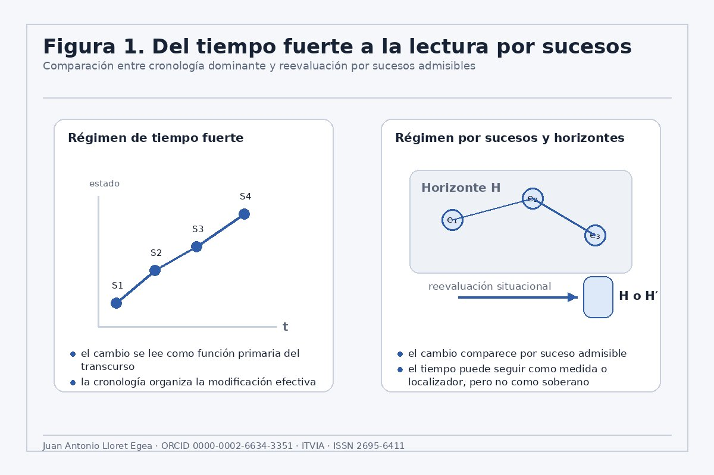
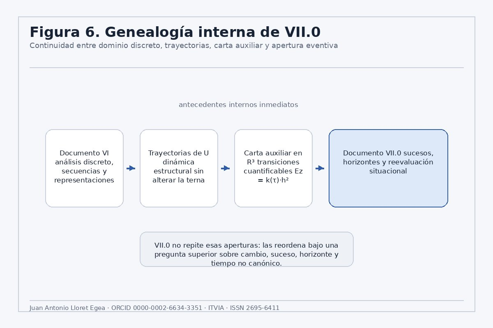
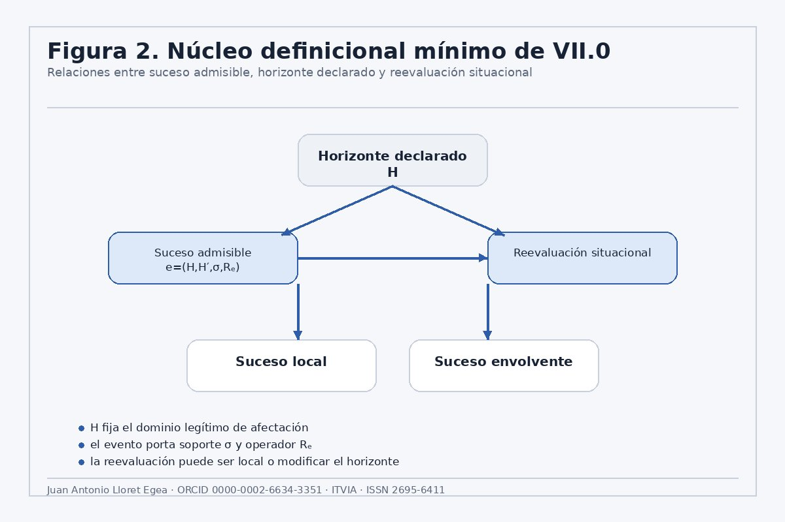
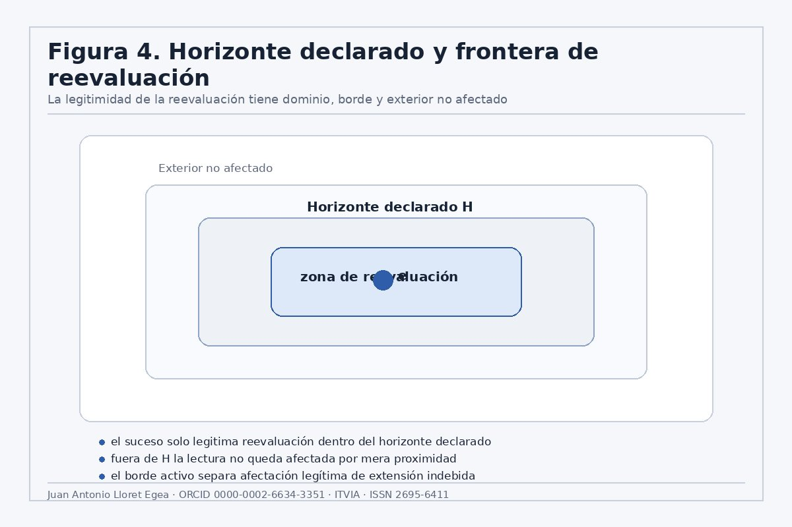
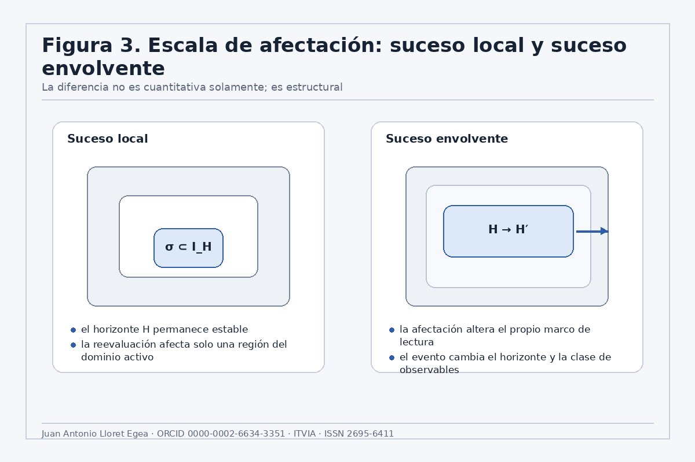
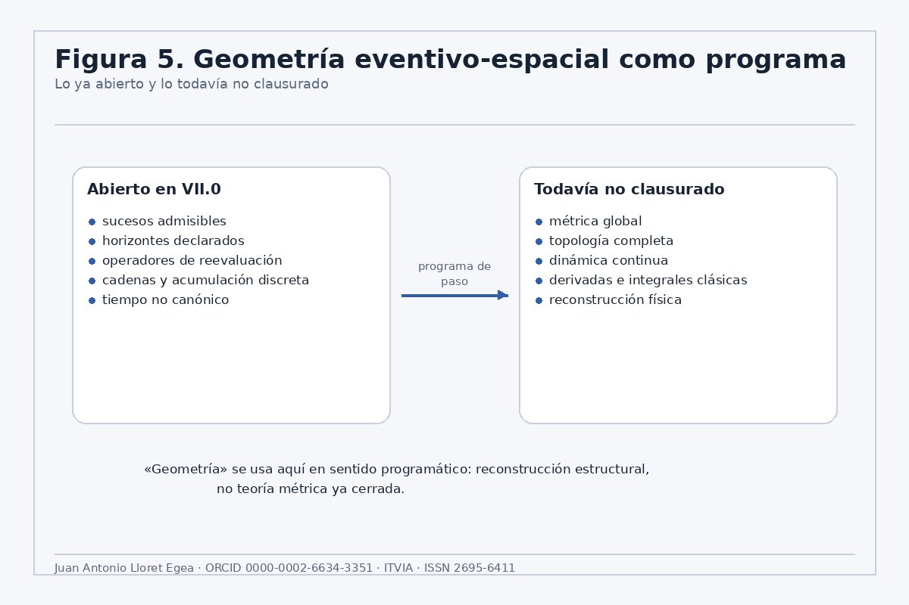
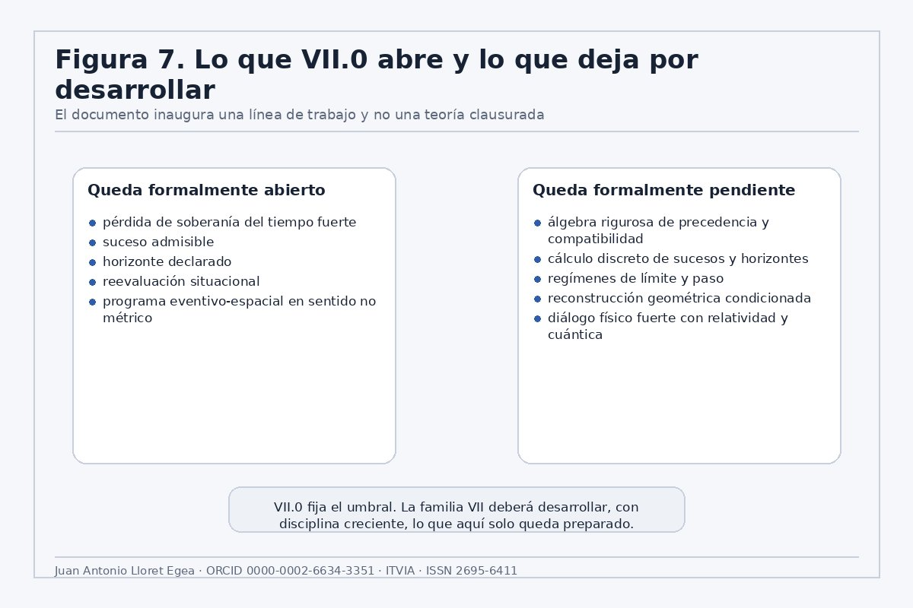

### IA eñ ™ - (La Biblia de la IA - The Bible of AI ™ ISSN 2695-6411) • Sucesos, horizontes y cambio estructural — Una aproximación algebraica desde el Sistema Vectorial SV

# Documento VII.0 — Hacia una geometría eventivo-espacial sin tiempo canónico: horizonte declarado, sucesos y reevaluación situacional en el Sistema Vectorial SV

### Juan Antonio Lloret Egea

#### IA eñ ™ - (La Biblia de la IA - The Bible of AI ™ ISSN 2695-6411)

**Published on:**  Mar 22, 2026

**URL:** <https://www.itvia.online/pub/documento-vii0--hacia-una-geometria-eventivo-espacial-sin-tiempo-canonico-horizonte-declarado-sucesos-y-reevaluacion-situacional-en-el-sistema-vectorial-sv>

**License:** [Creative Commons Attribution-NonCommercial-NoDerivatives 4.0 International License (CC-BY-NC-ND 4.0)](https://creativecommons.org/licenses/by-nc-nd/4.0/)

---

**Autor:** Juan Antonio Lloret Egea | **ORCID:** 0000-0002-6634-3351 | **Serie doctrinal:** Sistema Vectorial SV | **Sello editorial:** Instituto Tecnológico Virtual de la Inteligencia Artificial para el Español™ (ITVIA) **Publicación:** IA eñ™ – La Biblia de la IA™ | **ISSN:** 2695-6411 | **Fecha:** Madrid, 22 de marzo de 2026

---

> **Pertenece a la colección:** [Sucesos, horizontes y cambio estructural — Una aproximación algebraica desde el Sistema Vectorial SV](https://www.itvia.online/sucesos-horizontes-y-cambio-estructural--una-aproximacion-algebraica-desde-el-sistema-vectorial-sv)

---

## Resumen

El Sistema Vectorial SV opera sobre un alfabeto ternario canónico $\Sigma = \{0, 1, U\}$ y organiza sus células como vectores de $n = b^2$ componentes sobre ese alfabeto. Ese suelo no es un detalle técnico previo: es el origen de todo lo que el SV puede decir sobre el cambio. Un *frame* es una configuración $S \in \Sigma^n$; una trayectoria, una sucesión de *frames*; y cualquier modificación efectiva debe comparecer como suceso admisible en horizonte declarado, no como función del mero transcurso.

Este documento propone una apertura formal de régimen dentro del SV: la modificación efectiva deja de leerse como función primaria del transcurso y pasa a depender de la comparecencia de sucesos admisibles en horizonte declarado. No se afirma una ontología física cerrada ni una sustitución de la física vigente. Se introduce una estructura mínima de lectura compuesta por horizonte declarado, suceso admisible, reevaluación situacional, suceso local y suceso envolvente. Sobre esa base se formula un **programa estructural eventivo-espacial en sentido no métrico**: no como geometría ya clausurada, sino como reconstrucción algebraica a partir de relaciones entre sucesos, dominios de afectación y operadores de reevaluación, todo ello operando sobre el espacio ternario $\Sigma^n$.

El texto se apoya en tres antecedentes internos inmediatos del propio SV. [El Documento VI](https://www.itvia.online/pub/algebra-de-composicion-intercelular-del-marco-sv--vi-analisis-discreto-representaciones-y-herramientas-de-secuencias-del-sistema/release/1?readingCollection=4ebab177) fijó el dominio discreto, las secuencias, las diferencias finitas, las funciones generatrices, la transformada Z y el álgebra lineal del grafo, dejando explícitamente fuera las derivadas e integrales clásicas. La pieza sobre [trayectorias de la U](https://www.itvia.online/pub/transiciones-estructurales-y-trayectorias-de-la-u-en-el-sistema-vectorial-sv/release/2?readingCollection=4ebab177) abrió una dinámica estructural sin alterar la terna canónica. [La pieza de la carta auxiliar en R³](https://www.itvia.online/pub/analisis-del-comportamiento-geometrico-del-poligono-del-sistema-vectorial-sv-del-plano-cartesiano-a-una-carta-espacial-afin-auxiliar-como-via-de-razonamiento-para-situaciones-complejas/release/2?readingCollection=4ebab177) separó geométricamente U del plano de determinación, introdujo magnitudes discretas y probó la identidad $Ez(\tau,h) = k(\tau) \cdot h^2$, junto con criterios de falsación. VII.0 no repite esas aperturas: las reordena bajo una pregunta de rango superior.

**Palabras clave:** Sistema Vectorial SV; alfabeto ternario; célula $(n,b)$; *frame*; suceso admisible; horizonte declarado; reevaluación situacional; tiempo no canónico; estructura eventivo-espacial; cálculo discreto.

*Figura 1. En el régimen de tiempo fuerte, el cambio se lee como función del transcurso: los frames S1–S4 se organizan a lo largo del eje t. En el régimen por sucesos y horizontes, el cambio comparece por suceso admisible dentro de un horizonte H declarado sobre posiciones del espacio ternario Σⁿ. El tiempo puede seguir presente como localizador, pero pierde la soberanía.*

---

## 0. Estatuto y alcance

Este documento tiene estatuto de **apertura de problema**. No introduce una teoría completa del continuo, no modifica por sí mismo la gramática del Lenguaje SV, no altera su IR y no impone cambios automáticos sobre validator, runner o backend ([ver documentación relacionada](https://juantoniolloretegea.github.io/SV-lenguaje-de-computacion/)). Su función es fijar un desplazamiento estructural ya insinuado por el corpus: el tiempo deja de ser fundamento suficiente del cambio y pasa a ser, cuando proceda, magnitud derivada, localizadora o contextual.

Queda, por tanto, excluida toda sobrelectura. Este texto no afirma una nueva física consumada, no reescribe la relatividad, no resuelve la teoría cuántica y no postula una métrica eventivo-espacial cerrada. Lo que sí afirma es más preciso: que el SV dispone ya de suelo algebraico suficiente para sustituir una lectura de cambio por transcurso por una lectura de cambio por suceso, horizonte y reevaluación, todo ello operando sobre el espacio de *frames* $\Sigma^n = \{0,1,U\}^n$.

---

## 1. El suelo propio del SV: terna, frame y célula (n, b)

### 1.1. El alfabeto ternario

El Sistema Vectorial SV parte de un suelo semántico explícito: cada posición de una célula puede estar en uno de tres estados, y esa ternidad no es una convención sino una decisión arquitectónica. El alfabeto que la recoge es

$$ \Sigma = \{0,\, 1,\, U\}, $$

donde $0$ designa ausencia o no cumplimiento estructural, $1$ presencia o cumplimiento estructural, y $U$ indeterminación honesta —no probabilidad, no error, sino la forma positiva de no sobrecerrar lo que todavía no puede resolverse sin violencia sobre el fenómeno o sobre la arquitectura que lo recibe.

Para cualquier base $b \geq 1$, la célula $(n, b)$ tiene $n = b^2$ componentes. El espacio de estados de esa célula es

$$ X_{(n,b)} = \Sigma^n = \{0,\, 1,\, U\}^n. $$

### 1.2. La instancia canónica: célula (9, 3)

A lo largo de este documento, la célula $(9, 3)$ actúa como instancia canónica y verificable:

$$ n = 9,\quad b = 3,\quad \Sigma^9 = \{0,\,1,\,U\}^9. $$

Sus nueve posiciones se designan P1, P2, …, P9 siguiendo la estructura del polígono SV. Un *frame* de esta célula es un vector de nueve componentes en $\{0, 1, U\}$. Cuando se enuncie una noción en el nivel general $(n, b)$, se acompañará de su instanciación en $(9, 3)$ como verificación directa.

### 1.3. El frame y la trayectoria

Un *frame* es una configuración

$$ S \in \Sigma^n, $$

es decir, una asignación de valor $\{0, 1, U\}$ a cada una de las $n$ posiciones de la célula. El *frame* es la unidad mínima de estado del SV. Una trayectoria es una sucesión de *frames*

$$ T = (S_1,\, \nu_1,\, S_2,\, \nu_2,\, \ldots,\, S_N), $$

donde cada $\nu_k$ recoge la comparecencia de dato o interacción asociada al paso entre $S_k$ y $S_{k+1}$.

**Instancia (9, 3):** Una trayectoria concreta podría ser, por ejemplo, $S_1 = (1,0,U,1,0,0,U,1,0)$, $S_2 = (1,0,1,1,0,0,U,1,0)$, donde el paso de $S_1$ a $S_2$ refleja la resolución de P3 desde $U$ hacia $1$. Ese paso es el objeto que el documento VII.0 propone llamar suceso admisible.

---

## 2. Antecedentes internos inmediatos

El Documento VI definió el dominio discreto propio del SV y sostuvo expresamente que las trayectorias son secuencias de *frames*, que las arquitecturas son grafos dirigidos y que la matemática natural del sistema, en ese régimen, no es el cálculo infinitesimal clásico, sino el análisis discreto, la combinatoria y el álgebra lineal sobre grafos; además, dejó fuera derivadas e integrales clásicas, transformada de Laplace continua e integrales múltiples.

La pieza *Transiciones estructurales y trayectorias de la U* añadió una dimensión dinámica: U deja de ser solo valor de indeterminación y pasa a comparecer como origen de trayectorias estructurales $\tau = (U, \ldots, 0)$ o $\tau = (U, \ldots, 1)$, sin introducir nuevos valores lógicos ni alterar la célula ternaria. En la instancia $(9, 3)$, esto significa que posiciones como P3 o P7 pueden estar en $U$ y recorrer una trayectoria hacia $\{0,1\}$ sin que ese recorrido requiera un reloj externo.

La pieza *Análisis del comportamiento geométrico del polígono…* abrió una carta espacial afín auxiliar en R³, introdujo seis magnitudes discretas y estableció la identidad $Ez(\tau,h) = k(\tau) \cdot h^2$, donde $k(\tau)$ cuenta transiciones entre el plano de determinación y el régimen U; además fijó criterios de falsación, evitando una construcción inmune a contraste.

Estos tres antecedentes no equivalen todavía al documento VII.0. El primero abrió el dominio discreto; el segundo, la dinámica estructural; el tercero, una espacialización auxiliar y cuantificable. El documento VII.0 formula la pregunta superior que aquellos no cerraban aún: ¿qué estatuto tiene el cambio cuando la modificación efectiva no se funda en tiempo fuerte, sino en sucesos admisibles que afectan horizontes declarados sobre el espacio ternario $\Sigma^n$?

*Figura 2. La cadena de antecedentes internos conduce desde el análisis discreto del Documento VI, pasando por la dinámica de U y la carta auxiliar en R³, hasta VII.0. Cada paso opera sobre el mismo espacio ternario Σⁿ sin alterar la terna canónica.*

---

## 3. Separación entre plano formal del SV y plano de aplicación física

La distinción es obligatoria. El presente documento pertenece al plano formal del SV. No identifica sin más su aparato doctrinal con una ontología física empíricamente establecida. Propone una estructura de lectura con posible rendimiento físico ulterior, pero ese rendimiento deberá justificarse aparte.

Esta cautela no debilita la propuesta. La fortalece. El problema del tiempo no fundamental es real en física teórica contemporánea: el programa relacional de Rovelli discute precisamente la conveniencia de olvidar el tiempo como variable fundamental en ciertos regímenes, y el problema del tiempo en gravedad cuántica ha mantenido viva esa discusión durante décadas. Pero de ahí no se sigue automáticamente que el SV haya formulado ya una teoría física nueva. Lo que sí ha formulado es un lenguaje algebraico —anclado en $\Sigma = \{0,1,U\}$ y en la estructura celular $(n,b)$— en el que esa pregunta puede empezar a hacerse con precisión.

---

## 4. Horizontes, sucesos y observables compatibles

Sea $\Sigma = \{0,1,U\}$ el alfabeto ternario canónico y sea $n = b^2$. Una célula del SV es un elemento de $\Sigma^n$. Un *frame* es una configuración $S_k \in \Sigma^n$, y una trayectoria discreta se representa como

$$ T = (S_1,\, \nu_1,\, S_2,\, \nu_2,\, \ldots,\, S_N), $$

donde $\nu_k$ recoge la comparecencia de dato o interacción asociada al paso entre $S_k$ y $S_{k+1}$.

Introducimos una familia $\mathfrak{F}$ de **horizontes declarados**. Cada horizonte $H \in \mathfrak{F}$ se define como una triple

$$ H = (I_H,\, \preceq_H,\, \mathcal{A}_H), $$

donde:

- $I_H$ es el dominio activo de índices bajo jurisdicción formal del horizonte;
- $\preceq_H$ es una relación interna de precedencia, admisibilidad o dependencia sobre $I_H$;
- $\mathcal{A}_H$ es una álgebra de observables escalares sobre el espacio de estados $X_H$ asociado al horizonte.

*(Nota: el documento VII.1 completa esta definición añadiendo* $X_H = \Sigma^n$ *como componente explícita de la cuaterna* $H = (I_H, \preceq_H, X_H, \mathcal{A}_H)$*.)*

**Instancia (9, 3):** El horizonte canónico de la célula $(9, 3)$ tiene $I_H = \{P1, \ldots, P9\}$, con $\preceq_H$ inducida por la estructura del polígono SV, y $\mathcal{A}_H$ incluyendo al menos los observables $F_U(S) = |\{i : S_i = U\}|$ y $F_1(S) = |\{i : S_i = 1\}|$ —conteos de posiciones en cada valor de $\Sigma$.

Un **suceso admisible** es una cuaterna

$$ e = (H,\, H',\, \sigma,\, R_e), $$

donde:

- $H$ es el horizonte de partida;
- $H'$ es el horizonte resultante;
- $\sigma(e) \subseteq I_H$ es el soporte de afectación;
- $R_e : X_H \to X_{H'}$ es el operador de reevaluación inducido por el suceso.

**Instancia (9, 3):** Un suceso con soporte $\sigma = \{P3\}$ que transforma P3 de $U$ a $1$ tiene $R_e$ actuando exactamente sobre esa posición; las ocho restantes permanecen invariantes. Un suceso con $\sigma = \{P1, P2, P5\}$ afecta tres posiciones del polígono. La diferencia entre suceso local y envolvente queda codificada por la relación entre $H$ y $H'$ y por el rango estructural del soporte $\sigma(e)$.

Para evitar ambigüedades cuando los horizontes cambian, se fija una familia compatible de observables escalares

$$ F = (F_H)_{H \in \mathfrak{F}},\quad F_H \in \mathcal{A}_H, $$

con $\mathbb{K} = \mathbb{R}$ o $\mathbb{K} = \mathbb{Z}$. Entonces, para todo suceso admisible $e = (H, H', \sigma, R_e)$, la **diferencia eventiva elemental** es

$$ \Delta_e F(x) = F_{H'}(R_e(x)) - F_H(x),\quad x \in X_H. $$

La diferencia eventiva no se toma respecto del tiempo, sino respecto del suceso. En la célula $(9, 3)$, si $F = F_U$ (número de posiciones en $U$) y $e$ cambia P3 de $U$ a $1$, entonces $\Delta_e F_U(x) = -1$: una posición menos en régimen de indeterminación.

*Figura 3. El horizonte declarado H fija el dominio legítimo de afectación sobre las posiciones de Σⁿ. El suceso admisible e = (H,H′,σ,Rₑ) porta soporte y operador de reevaluación. La reevaluación puede mantenerse local (H′=H) o modificar el propio horizonte (H′≠H).*

---

## 5. Suceso local, suceso envolvente y dominio de afectación

*Figura 4. La legitimidad de la reevaluación tiene dominio, borde y exterior no afectado. En la célula (9,3), el horizonte H declara jurisdicción sobre un subconjunto de las nueve posiciones; fuera de H, los valores en Σ no quedan afectados por la reevaluación, por mucha proximidad que exista en el polígono.*

Diremos que $e = (H, H', \sigma, R_e)$ es **local** si $H' = H$ y $\sigma(e) \subsetneq I_H$. Diremos que es **envolvente** si $H' \neq H$, o si la afectación de $\sigma(e)$ coincide estructuralmente con la frontera activa del horizonte de partida. En ambos casos, el concepto decisivo no es el tamaño empírico de la perturbación, sino su **rango formal de afectación** sobre el espacio ternario.

Esta distinción recoge y formaliza algebraicamente los conceptos de suceso local, suceso envolvente y reevaluación situacional introducidos en la *Nota de precisión algebraico-semántica sobre modificación efectiva sin tiempo fuerte* (Lloret Egea, 2026e), pieza fundacional que precede a este documento en la serie.

**Instancia (9, 3):** Un suceso que cambia solo P3 de $U$ a $1$ sin alterar el horizonte es local: $\sigma = \{P3\} \subsetneq \{P1,\ldots,P9\}$ y $H' = H$. Un suceso que redefine el propio subconjunto de posiciones bajo jurisdicción —por ejemplo, incorporando P10 en una célula ampliada— es envolvente: $H' \neq H$.

La distinción no es decorativa. Una teoría por sucesos que no diferencie escala de afectación degeneraría en mera lista de incidencias. El aparato local/envolvente permite organizar el cambio por su rango estructural.

También aquí aparece el puente con la pieza de R³. Sea una trayectoria discreta $\tau = (S_0, S_1, \ldots, S_m)$ sobre $\Sigma^n$ y sea $\chi_U(S_i)$ el indicador de pertenencia al régimen $U$ frente al plano de determinación. Definimos

$$ \varepsilon_i = \begin{cases} 1, & \chi_U(S_i) \neq \chi_U(S_{i+1}), \\ 0, & \chi_U(S_i) = \chi_U(S_{i+1}). \end{cases} $$

Entonces

$$ k(\tau) = \sum_{i=0}^{m-1} \varepsilon_i $$

cuenta los cruces estructurales entre determinación e indeterminación. La pieza de carta auxiliar establece que $Ez(\tau,h) = h^2 \cdot k(\tau)$. En la célula $(9, 3)$, $k(\tau)$ cuenta cuántas veces alguna posición $P_i$ cruza la frontera $U \leftrightarrow \{0,1\}$ a lo largo de la trayectoria. Esta identidad convierte $k(\tau)$ en el antecedente formal de conteo eventivo para una clase concreta de cruces estructurales sobre $\Sigma^9$.

*Figura 5. La diferencia entre suceso local y envolvente es estructural, no cuantitativa. En la célula (9,3): un suceso que cambia una posición en U puede ser local (el horizonte permanece); un suceso que redefine qué posiciones están bajo jurisdicción es envolvente, aunque afecte pocas posiciones en Σ.*

---

## 6. Cadenas, precedencia y acumulación eventiva

Sea $E$ una colección de sucesos admisibles sobre $\Sigma^n$ y sea $\prec$ una relación de precedencia operativa sobre $E$. No se exige aún que sea total. Basta con que permita identificar cadenas admisibles

$$ \gamma = (e_1, e_2, \ldots, e_m),\quad e_i : H_i \to H_{i+1},\quad e_i \prec e_{i+1}. $$

Tomado un estado inicial $x_0 \in X_{H_1}$ —un *frame* de la célula— definimos recursivamente

$$ x_{i+1} = R_{e_i}(x_i). $$

Entonces la **acumulación eventiva discreta** de la familia de observables $F = (F_H)$ a lo largo de la cadena $\gamma$ queda definida por

$$ \mathcal{A}(\gamma;\, F,\, x_0) = \sum_{i=1}^{m} \Delta_{e_i} F(x_i). $$

Esta suma está bien formada aunque los horizontes cambien, porque cada término $\Delta_{e_i}F(x_i)$ es un escalar en $\mathbb{K}$.

**Instancia (9, 3):** Si $F = F_U$ y la cadena $\gamma$ resuelve sucesivamente P3, P7 y P5 desde $U$ hacia $\{0,1\}$, entonces $\mathcal{A}(\gamma; F_U, x_0) = -3$: tres posiciones menos en régimen $U$ tras recorrer la cadena. Esa acumulación no requiere ningún reloj; solo requiere los tres sucesos y sus soportes sobre las nueve posiciones del polígono.

La expresión anterior constituye el primer análogo serio de una integral, pero en régimen puramente discreto: no acumula sobre tiempo, sino sobre cadena de sucesos admisibles en $\Sigma^n$.

---

## 7. Programa estructural eventivo-espacial en sentido no métrico

En este documento, “geometría eventivo-espacial” no significa todavía geometría métrica completa. El contenido formal que se sostiene es más austero y, precisamente por eso, más defendible: un **programa estructural eventivo-espacial en sentido no métrico** sobre el espacio ternario $\Sigma^n$.

Ese programa exige, al menos, las siguientes piezas:

- una clase $E$ de sucesos admisibles sobre $\Sigma^n$;
- una familia $\mathfrak{F}$ de horizontes declarados sobre subconjuntos de posiciones de la célula;
- relaciones de precedencia o compatibilidad entre sucesos;
- operadores de reevaluación $R_e$ sobre *frames*;
- magnitudes de acumulación sobre cadenas de sucesos.

La espacialidad no desaparece en este programa. Pero deja de ser escenario absoluto dado por anticipado. Pasa a depender de una estructura de afectación, separación y reconstrucción sobre las posiciones del polígono SV.

En la célula $(9, 3)$, las nueve posiciones $P1,\ldots,P9$ con valores en $\{0,1,U\}$ son el espacio sobre el que ese programa se instancia concretamente. La “geometría” que VII.0 abre no es la del plano cartesiano sino la de las relaciones entre sucesos que reevalúan esas posiciones.

*Figura 6. El programa abierto en VII.0 parte de sucesos admisibles y horizontes declarados sobre Σⁿ. Lo todavía no clausurado —métrica global, topología completa, dinámica continua— requerirá desarrollos posteriores que VII.0 no prejuzga.*

---

## 8. Tiempo derivado, tiempo localizador y tiempo contextual

Conviene distinguir con rigor cuatro usos del tiempo:

- **tiempo localizador**, como índice de orden y auditoría;
- **tiempo contextual**, válido solo en un dominio operativo;
- **tiempo derivado**, reconstruido desde relaciones más básicas;
- **tiempo fuerte**, supuesto fundamento último del cambio.

La tesis de VII.0 discute solo el último. El tiempo puede seguir siendo útil, e incluso imprescindible, como coordenada efectiva o variable técnica en dominios determinados. Lo que se degrada es su estatuto soberano.

En el espacio ternario $\Sigma^n$, esto se traduce así: el orden en que las posiciones $P_i$ cruzan de $U$ a $\{0,1\}$ es una estructura de precedencia entre sucesos, no una consecuencia de un reloj global. En la célula $(9, 3)$, P3 puede resolverse antes que P7 porque existe un suceso que exige que P3 tenga valor $1$ para que el suceso sobre P7 sea admisible —no porque P3 preceda a P7 en alguna cronología absoluta.

---

## 9. Apertura al cálculo bajo condición

El documento no introduce todavía una derivada eventiva plenamente fundada. Lo que introduce es la **forma condicional** de una futura derivación por sucesos sobre $\Sigma^n$.

*(Nota: la escala* $\lambda$ *que sigue se introduce como parámetro auxiliar de refinamiento; su dominio en* $\mathbb{R}_{>0}$ *es instrumental, no afirma que el dominio fundamental del SV sea real. La existencia del límite queda condicionada a una teoría previa de refinamiento sobre* $\Sigma^n$*.)*

Sea $\Gamma$ una familia dirigida de refinamientos de cadenas sobre $\Sigma^n$ y sea

$$ \lambda : \Gamma \to \mathbb{R}_{>0} $$

una escala tal que $\lambda(\gamma_\alpha) \to 0$. Solo si existe una estructura de refinamiento suficiente y solo si el límite existe, podrá definirse una derivada eventiva de la forma

$$ D_\Gamma F = \lim_\alpha \frac{\mathcal{A}(\gamma_\alpha;\, F,\, x_\alpha)}{\lambda(\gamma_\alpha)}. $$

De manera análoga, si $\mu_H$ es una medida eventiva aún por construir sobre una clase $\Gamma_H$ de sucesos admisibles sobre $\Sigma^n$, la forma futura de una integral de sucesos no debería escribirse como integral temporal, sino como

$$ \int_{\Gamma_H} \Phi(e)\, d\mu_H(e), $$

con $\Phi$ definida sobre sucesos admisibles que reevalúan *frames* en $\{0,1,U\}^n$.

La potencia del cálculo no queda excluida. Queda subordinada a una teoría previa de cadenas, refinamiento, compatibilidad y medida sobre el espacio ternario. El cálculo, si comparece, deberá comparecer *después* del álgebra de sucesos sobre $\Sigma^n$, no antes.

---

## 10. Estado del arte mínimo y posición propia del SV

La teoría de causal sets parte de eventos y orden parcial; no de tiempo continuo fuerte. Esa proximidad es real. También lo es la afinidad con líneas relacionales y con trabajos sobre orden causal no fijo. Pero el SV no debe copiar esas tradiciones ni fingir identidad con ellas.

Su posible aportación propia se concentra en cuatro puntos, todos anclados en el espacio ternario $\Sigma = \{0,1,U\}$:

$$ \mathrm{SV} = (\text{suceso admisible},\ \text{horizonte declarado},\ \text{local/envolvente},\ \text{reevaluación situacional}). $$

Esa cuaterna no es meramente filosófica. Es un programa algebraico sobre $\Sigma^n$:

- el suceso se formaliza como cuaterna $(H, H', \sigma, R_e)$ con $\sigma \subseteq I_H \subseteq \{1,\ldots,n\}$;
- el horizonte determina qué subconjunto de posiciones está bajo jurisdicción;
- la tipología local/envolvente organiza escala de afectación sobre esas posiciones;
- la reevaluación induce operadores y diferencias eventivas en el espacio de *frames*.

Si ese programa madura, el SV podrá aportar una gramática formal de cambio más fina que la simple parametrización temporal, construida desde el propio suelo ternario.

---

## 11. Delimitación negativa reforzada

Este documento:

- no afirma una nueva teoría física completa;
- no propone una relectura consumada de la relatividad o de la teoría cuántica;
- no introduce un cálculo diferencial clásico ya operativo sobre sucesos;
- no construye una métrica eventivo-espacial cerrada;
- no identifica sin más la carta auxiliar en R³ con la geometría aquí abierta;
- no convierte automáticamente $k(\tau)$ en “número de eventos”;
- y no modifica por sí mismo gramática, IR, validator, runner ni backend.

Su función es otra: fijar el umbral correcto desde el que esos problemas puedan abrirse sin confusión, partiendo del único suelo que el SV reconoce como propio: $\Sigma^n = \{0,1,U\}^n$.

---

## 12. Adversarial integrada

La primera objeción fuerte es que todo lo anterior no pase de ser un panfleto filosófico con léxico matemático añadido. La objeción se responde de manera directa: el manuscrito no se limita a una consigna conceptual, sino que introduce objetos, operadores y condiciones de cálculo bien tipadas sobre el espacio ternario. El paso de la familia de observables $F = (F_H)$ a $\Delta_e F$, la definición de cadenas $\gamma$ sobre $\Sigma^n$, la acumulación $\mathcal{A}(\gamma; F, x_0)$ y la forma condicional de una derivada eventiva no son metáforas; son esbozos algebraicos precisos con instanciación verificable en la célula $(9, 3)$.

La segunda objeción es que se estaría confundiendo el estado de lectura del sistema con la estructura física del mundo. El texto evita expresamente esa confusión: pertenece al plano formal del SV y no al de una teoría empírica ya confirmada.

La tercera objeción es que “geometría” sigue siendo palabra prematura. También aquí el texto responde: el contenido sostenido es no métrico y programático; el título se entiende como vector de investigación y no como declaración de una geometría cerrada. La “geometría” que se abre es la de las relaciones entre sucesos que reevalúan posiciones en $\{0,1,U\}$.

La cuarta objeción es técnica: que un documento así contamine por la puerta de atrás la gramática o el *backend*. También queda rechazada. VII.0 no introduce nuevos objetos obligatorios para el Lenguaje SV. Solo prohíbe canonizar tiempo fuerte donde el marco doctrinal ya exige cautela.

La quinta objeción es interna: que el texto no haga sino repetir VI, trayectorias o R³. Tampoco. VI dio análisis discreto; trayectorias dio dinámica de U sobre $\Sigma^n$; R³ dio separación auxiliar y cuantificación de transiciones. VII.0 formula un nivel superior de organización: cambio por suceso sobre el espacio de *frames*, no por transcurso.

---

## 13. Línea de desarrollo abierta

Este documento no cierra una historia. Abre una **línea de desarrollo** sobre el espacio ternario $\Sigma^n$. Quedan pendientes, al menos, los siguientes frentes:

- teoría rigurosa del suceso admisible sobre $\Sigma^n$ (VII.1);
- álgebra de precedencia, compatibilidad y afectación entre sucesos (VII.2);
- cálculo discreto de sucesos y horizontes;
- sucesiones, límites y regímenes de paso;
- condiciones de emergencia de derivadas e integrales desde el suelo ternario;
- reconstrucción geométrica condicionada;
- diálogo ulterior con física relacional, causal y cuántica.

La familia VII debe comenzar aquí, en $\Sigma = \{0,1,U\}$, no terminar aquí.

*Figura 7. VII.0 fija el umbral. Lo que queda formalmente abierto —suceso admisible, horizonte, reevaluación situacional— y lo que queda formalmente pendiente —álgebra rigurosa, cálculo, reconstrucción geométrica— son los dos lados de un programa que opera desde el suelo ternario Σⁿ = {0,1,U}ⁿ.*

---

## 14. Conclusión

El SV dispone ya de suelo algebraico suficiente para sostener una tesis nueva y sobria: la modificación efectiva no se funda en el mero transcurso, sino en la comparecencia de sucesos admisibles en horizonte declarado sobre el espacio ternario $\Sigma^n = \{0,1,U\}^n$. A partir de ahí, el tiempo deja de ser magnitud canónica soberana y pasa a requerir una relectura derivada, contextual o localizadora.

VII.0 no ofrece todavía una teoría física nueva ni una geometría completa. Ofrece algo anterior y más necesario: una reformulación correcta del problema, anclada en el único suelo que el SV reconoce como no negociable —la terna $\{0, 1, U\}$ y la célula $(n, b)$ con $n = b^2$, cuya instancia más concreta y verificable es la célula $(9, 3)$ con sus nueve posiciones sobre el polígono. Esa reformulación, si es rigurosa, basta para justificar la apertura de una nueva familia doctrinal.

---

## Cláusula técnica mínima previa al Backend

La apertura doctrinal de VII.0 no modifica por sí misma la gramática del Lenguaje SV, ni su IR vigente, ni validator, runner o backend. No obstante, fija una cautela de arquitectura: en el diseño del backend no deberá endurecerse como fundamento soberano aquello que el marco doctrinal mantenga ya bajo examen como magnitud derivada, contextual o localizadora.

La secuencia operativa del sistema no deberá identificarse sin más con tiempo ontológico fuerte. Esta cláusula no ordena introducir nuevas estructuras ni nuevos objetos semánticos. Solo prohíbe una sobrefijación prematura sobre el espacio ternario $\Sigma^n = \{0,1,U\}^n$ que es el suelo propio del SV.

---

## Bibliografía

### Referencias internas del Sistema Vectorial SV

Lloret Egea, J. A. (2026a). *Fundamentos algebraico-semánticos del Sistema Vectorial SV*. ITVIA, serie doctrinal del Sistema Vectorial SV, ISSN 2695-6411, ORCID 0000-0002-6634-3351.

Lloret Egea, J. A. (2026b). *Álgebra de composición intercelular del marco SV — VI. Análisis discreto, representaciones y herramientas de secuencias del sistema*. Release 1, publicado el 11 de marzo de 2026. ITVIA, Madrid. ISSN 2695-6411.

Lloret Egea, J. A. (2026c). *Transiciones estructurales y trayectorias de la U en el Sistema Vectorial SV*. Release 2, ITVIA, Madrid, 16 de marzo de 2026. ISSN 2695-6411.

Lloret Egea, J. A. (2026d). *Análisis del comportamiento geométrico del polígono del Sistema Vectorial SV: del plano cartesiano a una carta espacial afín auxiliar como vía de razonamiento para situaciones complejas*. Release 2, ITVIA, Madrid, 16 de marzo de 2026. ISSN 2695-6411.

Lloret Egea, J. A. (2026e). *Suceso local, suceso envolvente y reevaluación situacional en horizonte declarado en el Sistema Vectorial SV*. Nota de precisión algebraico-semántica, v2. ITVIA, Madrid, 22 de marzo de 2026. ISSN 2695-6411.

### Referencias externas

Bombelli, L., Lee, J., Meyer, D., & Sorkin, R. D. (1987). Space-time as a causal set. *Physical Review Letters*, 59(5), 521–524. DOI: 10.1103/PhysRevLett.59.521.

Rovelli, C. (2009). *Forget Time*. arXiv:0903.3832.

van der Lugt, T., Barrett, J., & Chiribella, G. (2023). Device-independent certification of indefinite causal order in the quantum switch. *Nature Communications*, 14, 5810. DOI: 10.1038/s41467-023-40162-8.
