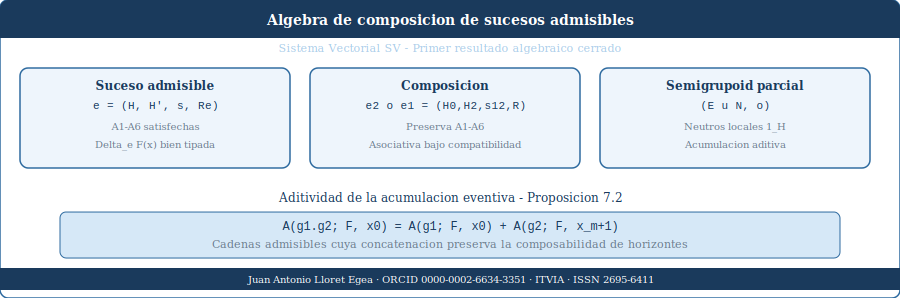
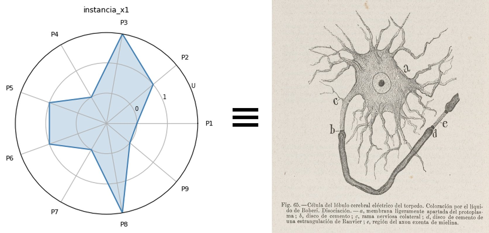
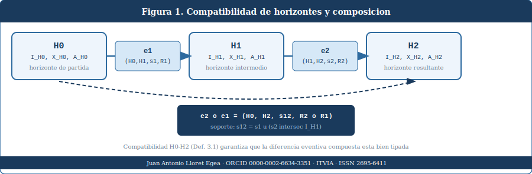
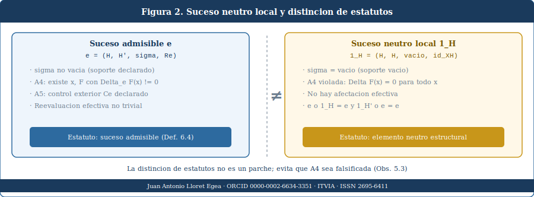
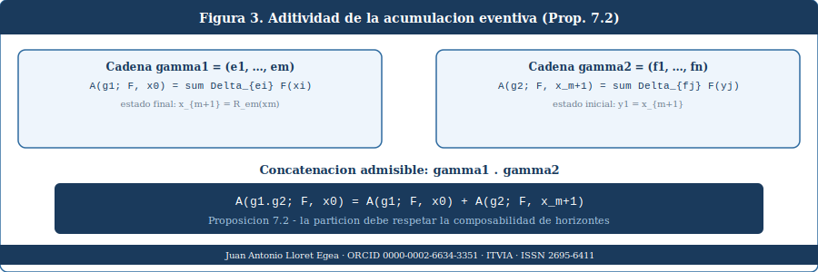

### IA eñ ™ - (La Biblia de la IA - The Bible of AI ™ ISSN 2695-6411) • Sucesos, horizontes y cambio estructural — Una aproximación algebraica desde el Sistema Vectorial SV

# Teoría rigurosa del suceso admisible en el Sistema Vectorial SV. Doc VII.1

### Juan Antonio Lloret Egea

#### IA eñ ™ - (La Biblia de la IA - The Bible of AI ™ ISSN 2695-6411)

**Published on:**  Mar 22, 2026

**URL:** <https://www.itvia.online/pub/teoria-rigurosa-del-suceso-admisible-en-el-sistema-vectorial-sv>

**License:** [Creative Commons Attribution-NonCommercial-NoDerivatives 4.0 International License (CC-BY-NC-ND 4.0)](https://creativecommons.org/licenses/by-nc-nd/4.0/)

---

> ### **Terna {0,1,U}, célula canónica (9,3) y formalización del cambio efectivo**

---

**Autor:** Juan Antonio Lloret Egea | **ORCID:** 0000-0002-6634-3351 | **Serie doctrinal:** Sistema Vectorial SV | **Sello editorial:** Instituto Tecnológico Virtual de la Inteligencia Artificial para el Español™ (ITVIA) **Publicación:** IA eñ™ – La Biblia de la IA™ | **ISSN:** 2695-6411 | **Fecha:** Madrid, 22 de marzo de 2026

---

> **Pertenece a la colección:** [Sucesos, horizontes y cambio estructural — Una aproximación algebraica desde el Sistema Vectorial SV](https://www.itvia.online/sucesos-horizontes-y-cambio-estructural--una-aproximacion-algebraica-desde-el-sistema-vectorial-sv) | **Compilador, gramática, IR, doctrina, etc. en:** [SVP Playground — Sistema Vectorial SV](https://juantoniolloretegea.github.io/SV-lenguaje-de-computacion/)

---

*Portada del artículo: composición, neutro y aditividad releídos desde la terna {0,1,U} y la célula canónica (9,3).*

---

## Resumen

El Sistema Vectorial SV opera sobre el alfabeto ternario canónico $\Sigma=\{0,1,U\}$ y, en su instancia básica de referencia, inscribe sus configuraciones sobre la célula $(9,3)$. Ese suelo no es una ayuda visual ni una comodidad editorial: es la condición estructural mínima desde la cual el SV puede hablar de determinación, indeterminación honesta, trayectoria y cambio. Una configuración elemental del sistema es una inscripción ternaria $S\in\Sigma^9$; una sucesión de configuraciones de este tipo no constituye todavía una teoría del cambio; y una modificación efectiva no comparece por el mero transcurso ni por el simple paso de un *frame* a otro, sino por la intervención de un **suceso admisible en horizonte declarado**.

Este artículo formaliza rigurosamente esa noción. Para ello define: (i) el horizonte como cuádrupla $H=(I_H,\preceq_H,X_H,\mathcal{A}_H)$, (ii) el soporte como subconjunto bien tipado $\sigma\subseteq I_H$, (iii) el suceso admisible como cuaterna $e=(H,H',\sigma,R_e)$, (iv) un control exterior mínimo $C_e=(J_e,\theta_e)$ y (v) la diferencia eventiva mínima $\Delta_eF(x)=F_{H'}(R_e(x))-F_H(x)$. A diferencia de una formulación generalista, el artículo cose cada una de estas piezas al soporte real del SV: las configuraciones, los observables, las reevaluaciones y los ejemplos se leen desde el inicio sobre $\Sigma=\{0,1,U\}$ y sobre la célula canónica $(9,3)$.

El texto se sitúa frente a varias tradiciones vecinas —redes de Petri, estructuras de eventos, teoría de dominios, lógica observacional, sistemas de transición y marcos categóricos— sin identificarse sin resto con ninguna de ellas. La razón es simple: ninguna de esas tradiciones sustituye el problema específico del SV, que consiste en justificar el cambio efectivo sobre un dominio ternario-celular sin recaer en tiempo fuerte ni convertir U en ruido residual. El artículo no cierra aún una física del sistema, ni una teoría completa de composición, ni una geometría exhaustiva de la célula $(9,3)$. Pero sí fija una base formal suficientemente dura para que la expresión “suceso admisible” deje de ser un rótulo fuerte y pase a ser un objeto matemáticamente tratable dentro del propio SV.

**Palabras clave:** Sistema Vectorial SV; terna $\{0,1,U\}$; célula $(9,3)$; suceso admisible; horizonte declarado; reevaluación; observables; soporte; cambio efectivo.

---

## 0. Nota editorial y criterio de lectura

Este manuscrito debe leerse con una restricción fuerte y constante:

> Toda afirmación de estado, trayectoria, soporte, reevaluación y suceso debe entenderse aquí desde la terna $\{0,1,U\}$ y desde la célula canónica $(9,3)$ del Sistema Vectorial SV.

El documento no desarrolla una teoría abstracta del evento para luego “aplicarla” al SV. Hace exactamente lo contrario: toma el suelo real del sistema —configuraciones ternarias sobre célula $(9,3)$— y pregunta: ¿qué debe cumplirse para que una transición entre configuraciones sea un cambio legítimo y no simple sucesión?

Toda afirmación entra en una de estas tres clases:

- Definición o proposición cerrada en esta pieza.
- Resultado justificado bajo hipótesis explícitas.
- Problema abierto reconocido como tal.

No se tolerará una cuarta clase implícita en la que se afirme más de lo que el texto sostiene.

### Ejemplo 0.1. Punto de partida mínimo

*Figura 0. Célula básica (9,3) en pretendida similitud con la célula real. El número de parámetros son 9: P1–P9.* *(****Nota****: la imagen muestra las posiciones P1–P9 del polígono SV. La referencia original a “P0-P9” corresponde a un error tipográfico en la primera publicación; la célula tiene nueve posiciones numeradas P1 a P9, no diez.)*

---

Considérese la célula $(9,3)$ con una inscripción ternaria simple (véase Fundamentos algebraico-semánticos del Sistema Vectorial SV):

$$ S_0=(0,0,0,\ 0,U,0,\ 0,0,0)\in\Sigma^9. $$

Esta configuración no describe todavía un suceso. Describe una **inscripción celular** en la que una posición central se mantiene indeterminada y el resto permanece en $0$. Si una segunda configuración

$$ S_1=(0,0,0,\ 0,1,0,\ 0,0,0) $$

aparece a continuación, la pregunta del documento no es todavía “¿qué significa narrativamente ese paso?”, sino esta otra:

> ¿Qué condiciones deben cumplirse para que el paso de $S_0$ a $S_1$ comparezca como **suceso admisible** y no como simple diferencia observada?

Ése es el problema real.

---

## 1. Tesis, alcance y anclaje al suelo del sistema

La tesis del artículo es ésta:

> En el Sistema Vectorial SV, una modificación efectiva entre configuraciones ternarias sobre la célula $(9,3)$ no queda legitimada por el mero paso secuencial de una inscripción a otra, sino por la comparecencia de una cuaterna bien tipada $e=(H,H',\sigma,R_e)$ que satisface condiciones explícitas de admisibilidad dentro de un horizonte declarado.

Esto obliga a dos desplazamientos simultáneos:

- del *frame* como dato bruto a la **configuración celular** como estado legible;
- del **paso secuencial** como mera sucesión a la **reevaluación legítima** como suceso.

### 1.1. Instancia canónica de trabajo

La instancia básica de referencia del artículo es:

- alfabeto: $\Sigma=\{0,1,U\}$;
- soporte celular: $(9,3)$;
- espacio elemental de configuraciones: $\Sigma^9$.

En este régimen, una configuración será siempre de la forma

$$ S=(s_1,\dots,s_9),\qquad s_i\in\{0,1,U\}. $$

### 1.2. Qué significa “coser el texto al SV”

Significa que las nociones centrales del documento no se presentarán como abstracciones genéricas:

- un **estado** será una inscripción ternaria sobre célula;
- una **trayectoria** será una sucesión de inscripciones celulares;
- un **observable** leerá propiedades sobre tales inscripciones;
- una **reevaluación** operará sobre ese dominio;
- y un **suceso admisible** quedará justificado como transformación legítima de ese mismo suelo.

### 1.3. Consecuencia metodológica

No basta con mencionar $\Sigma$ o $(9,3)$ en el resumen o en una nota. Deben intervenir desde el inicio hasta el final del texto, también en: los ejemplos; la motivación de las definiciones; el sentido de las observaciones; y la lectura de los problemas abiertos.

### Ejemplo 1.4. Secuencia no equivale a suceso

Considérese la sucesión de configuraciones:

$$ S_0=(0,0,0,\ 0,U,0,\ 0,0,0),\qquad S_1=(0,0,0,\ 0,1,0,\ 0,0,0),\qquad S_2=(0,0,0,\ 0,1,0,\ 0,0,0). $$

La pareja $(S_0,S_1)$ y la pareja $(S_1,S_2)$ son dos pasos secuenciales. Pero intuitivamente ya se ve que no portan la misma fuerza estructural:

- de $S_0$ a $S_1$ parece resolverse una indeterminación;
- de $S_1$ a $S_2$ no hay variación visible.

El artículo existe para formalizar precisamente esa diferencia.

---

## 2. Estado del arte y posición de esta pieza

La literatura sobre eventos, transiciones, observables y cambio estructural es amplia. Pero la pregunta del SV no queda absorbida sin resto por ninguna de las tradiciones vecinas.

### 2.1. Redes de Petri y estructuras de eventos

La tradición de concurrencia articuló con rigor causalidad, conflicto y ocurrencias de eventos [Nielsen, Plotkin y Winskel, 1981; Winskel, 1986]. Sin embargo, su aparato no obliga por sí mismo a fijar: un soporte declarado de afectación; un control exterior mínimo; ni una inscripción ternaria explícita como la que exige el SV sobre $(9,3)$.

### 2.2. Sistemas de transición

Los sistemas de transición etiquetados formalizan muy bien cambios de estado [Gorrieri y Versari, 2015], pero no fuerzan a distinguir: entre estado bruto y configuración celular; entre paso secuencial y reevaluación legítima; entre soporte afectado y región exterior; ni entre determinación binaria y presencia de U.

### 2.3. Teoría de dominios y lógica de observables

La teoría de dominios, y en especial la formulación lógica de Abramsky, subraya algo muy relevante para el SV: una propiedad observable exige estructura de evaluación y no puede tratarse como simple etiqueta verbal [Abramsky, 1991]. Esto converge con el problema presente. Pero el SV añade una exigencia propia: que esas propiedades se lean sobre configuraciones ternarias del sistema y respeten el estatuto de U.

### 2.4. Lógica observacional, cuantales y marcos categóricos

La lógica observacional y los cuantales [Abramsky y Vickers, 1993], así como ciertos marcos categóricos y de haces [Mac Lane y Moerdijk, 1994], ofrecen intuiciones potentes sobre compatibilidad y transporte local-global. Pero el presente artículo no importa un formalismo cerrado desde fuera. Se limita a registrar que el problema de comparar horizontes y sostener observables entre ellos exige aparato formal explícito.

### 2.5. Conclusión delimitativa

El estado del arte permite decir dos cosas: el problema del evento y de la observación estructural es real y no ad hoc; la solución del SV debe seguir siendo propia, porque ninguna tradición vecina sustituye la necesidad de trabajar desde $\Sigma=\{0,1,U\}$ sobre la célula $(9,3)$.

| Tradición vecina | Qué formaliza bien | Qué sigue faltando para el SV |
| --- | --- | --- |
| Redes de Petri / estructuras de eventos | causalidad, concurrencia, ocurrencias | soporte declarado, control exterior, célula ternaria $(9,3)$ |
| Sistemas de transición | cambios de estado | soporte, región exterior, estatuto de U |
| Teoría de dominios | propiedades observables con información finita | lectura explícita sobre $\Sigma^9$ |
| Lógica observacional / cuantales | álgebra de observación | inscripción celular canónica y suceso admisible tipado |
| Marcos categóricos / haces | transporte local-global | cierre concreto del suceso $e=(H,H',\sigma,R_e)$ sobre dominio ternario |

### Ejemplo 2.6. Por qué el SV no es ya una LTS

Dos configuraciones celulares como

$$ S_0=(1,0,0,\ 0,U,0,\ 0,0,0),\qquad S_1=(1,0,0,\ 0,1,0,\ 0,0,0) $$

pueden verse externamente como un simple cambio de estado. Pero en el SV la transición entre ambas no se agota en una flecha $S_0\to S_1$. Puede requerir: soporte de afectación; observables compatibles; lectura del papel de U; y control exterior sobre posiciones no afectadas. Ese plus estructural es precisamente lo que la LTS estándar no garantiza por sí sola.

---

## 3. Antecedentes internos del corpus SV

Esta pieza prolonga una cadena interna ya abierta por el propio sistema.

### 3.1. Documento VI

El Documento VI abrió secuencias, trayectorias, diferencias finitas y un cálculo discreto no sometido de entrada al diferencial clásico. Pero una secuencia de configuraciones $S_0,S_1,\dots,S_m$ no basta todavía para justificar una modificación efectiva.

### 3.2. Trayectorias de la U

[La pieza de trayectorias de la U](https://www.itvia.online/pub/transiciones-estructurales-y-trayectorias-de-la-u-en-el-sistema-vectorial-sv/release/2?readingCollection=4ebab177) mostró que la indeterminación honesta no es un residuo a eliminar, sino un elemento estructural que puede participar en la dinámica del sistema. Este artículo hereda esa lección y la incorpora de forma directa: U forma parte del estado sobre célula, no es ruido.

### 3.3. Carta auxiliar en R³

[La carta auxiliar en R³](https://www.itvia.online/pub/analisis-del-comportamiento-geometrico-del-poligono-del-sistema-vectorial-sv-del-plano-cartesiano-a-una-carta-espacial-afin-auxiliar-como-via-de-razonamiento-para-situaciones-complejas/release/2?readingCollection=4ebab177) introdujo un conteo de cruces

$$ k(\tau)=\sum_{i=0}^{m-1}\varepsilon_i $$

y la identidad $Ez(\tau,h)=k(\tau)\cdot h^2$. Pero ese conteo no podía confundirse sin más con “número de eventos”. El artículo actual construye el puente mínimo que faltaba para interpretar qué tipo de pasos de una trayectoria ternaria pueden comparecer como sucesos.

### 3.4. Relectura celular de la cadena previa

Todo lo anterior puede releerse ahora así: un *frame* es una configuración $S\in\Sigma^9$; una trayectoria es una sucesión de tales configuraciones; un cambio efectivo exige la comparecencia de un suceso admisible; y ese suceso debe actuar sobre el mismo suelo celular-ternario del sistema.

### Ejemplo 3.5. La U no es un hueco decorativo

Considérese:

$$ S_0=(0,0,0,\ 0,U,0,\ 0,0,0),\qquad S_1=(0,0,0,\ 0,0,0,\ 0,0,0),\qquad S_2=(0,0,0,\ 0,1,0,\ 0,0,0). $$

La trayectoria $S_0,S_1,S_2$ no puede leerse del mismo modo que una trayectoria puramente binaria. El paso $U\to 0$ no es idéntico al paso $U\to 1$, ni el paso $0\to 1$ equivale al paso $U\to 1$. El artículo no cierra todavía toda la dinámica ternaria de estas diferencias, pero sí parte de ellas como hecho estructural.

---

## 4. Separación entre plano formal y plano de aplicación

El artículo trabaja en el **plano formal del SV**. Eso obliga a no confundir: horizonte formal; configuración celular; observable; y eventual interpretación física.

**Tesis de separación.** Un horizonte formal no es todavía un espacio-tiempo físico, ni un campo, ni una cronología empírica. Es una estructura de jurisdicción formal que regula qué configuraciones pueden leerse, compararse y reevaluarse legítimamente.

**Observación 4.1. Separación no significa vaciamiento.** Separar plano formal y plano de aplicación no autoriza a vaciar el formalismo. Aquí el plano formal tiene contenido: $\Sigma=\{0,1,U\}$, $\Sigma^9$, célula $(9,3)$, observables sobre configuraciones, trayectorias y reevaluaciones.

**Ejemplo 4.2.** La configuración $S=(0,1,0,\ 0,U,0,\ 0,0,0)$ no “es” todavía una escena física determinada. Pero sí es una inscripción formal válida del sistema. El artículo trabaja sobre ese estatuto: qué puede decir el SV rigurosamente sobre cambios entre inscripciones como esa, sin convertirlas todavía en ontología empírica cerrada.

---

## 5. Configuración celular canónica y definición formal de horizonte

La primera corrección necesaria consiste en impedir que “horizonte” funcione como palabra fuerte pero vacía.

**Definición 5.1. Configuración celular canónica.** Sea $\Sigma=\{0,1,U\}$. Una configuración celular canónica del SV es un vector

$$ S=(s_1,\dots,s_9)\in\Sigma^9 $$

inscrito sobre la célula $(9,3)$.

**Ejemplo 5.2. Tres configuraciones elementales.**

$$ S^{(a)}=(0,0,0,\ 0,0,0,\ 0,0,0),\qquad S^{(b)}=(0,0,0,\ 0,U,0,\ 0,0,0),\qquad S^{(c)}=(0,0,0,\ 0,1,0,\ 0,0,0). $$

Estas tres configuraciones ya muestran algo estructural: $S^{(a)}$ es binaria y determinada; $S^{(b)}$ introduce indeterminación honesta; $S^{(c)}$ introduce afirmación localizada. El artículo necesita un horizonte capaz de leer diferencias entre ellas.

**Definición 5.3. Horizonte.** Un horizonte es una cuádrupla

$$ H=(I_H,\preceq_H,X_H,\mathcal{A}_H), $$

donde:

- $I_H$ es el dominio activo de índices, posiciones o regiones bajo jurisdicción de lectura;
- $\preceq_H$ es una relación interna de precedencia, compatibilidad o admisibilidad;
- $X_H$ es el espacio de configuraciones legibles en ese horizonte;
- $\mathcal{A}_H$ es una estructura de observables suficiente para sostener comparaciones compatibles.

**Definición 5.4. Horizonte canónico de primer nivel.** Se dirá que un horizonte es canónico de primer nivel cuando $X_H\subseteq\Sigma^9$. Éste será el régimen de referencia de la presente pieza.

**Observación 5.5. Sobre** $I_H$**.** En la célula $(9,3)$, $I_H$ puede pensarse, en el caso mínimo, como el conjunto de las nueve posiciones celulares o de subregiones declaradas de la célula. No se fija todavía una única semántica geométrica de esas posiciones, pero sí se exige que el soporte futuro se tipará sobre ellas y no sobre un dominio abstracto sin cuerpo.

**Proposición 5.6. Bien tipado elemental.** Sea $H=(I_H,\preceq_H,X_H,\mathcal{A}_H)$ y sea $F_H:X_H\to\mathbb{K}$ un observable compatible. Entonces toda expresión del tipo $F_H(x)$ exige $x\in X_H$.

*Prueba.* Trivial por tipado. Sin $x\in X_H$, la expresión $F_H(x)$ carece de dominio. ∎

**Ejemplo 5.7. Observable celular simple.** Sea $F_H$ el observable que cuenta cuántas posiciones de la célula están afirmadas con $1$ en una configuración $S\in\Sigma^9$. Entonces:

$$ F_H(0,0,0,\ 0,U,0,\ 0,0,0)=0,\qquad F_H(0,0,0,\ 0,1,0,\ 0,0,0)=1. $$

**Adversarial interna 5.8.** *Objeción.* La cuádrupla del horizonte sigue siendo demasiado abstracta. *Respuesta.* La objeción valdría si el texto no le diera suelo. Aquí sí lo tiene: $X_H$ se ancla a $\Sigma^9$, $I_H$ se entiende desde la célula $(9,3)$ y $\mathcal{A}_H$ se ejemplifica con observables sobre configuraciones celulares. La generalidad residual es deliberada: permite que el sistema crezca sin abandonar su instancia canónica.

---

## 6. Definición formal de suceso admisible

### Compatibilidad de horizontes y composición de sucesos.

Figura 1. La composición entre reevaluaciones sólo será legítima si los horizontes, soportes y dominios quedan bien declarados. En el presente artículo esa exigencia se relee desde configuraciones de $\Sigma^9$ sobre la célula $(9,3)$.

**Definición 6.1. Soporte declarado.** Sea $H$ un horizonte. El soporte declarado de una afectación es un subconjunto

$$ \sigma\subseteq I_H $$

que identifica la región del horizonte sobre la cual se declara la afectación.

**Ejemplo 6.2. Soporte en la célula (9,3).** Si una reevaluación sólo modifica la posición central de la célula, el soporte declarado puede ser $\sigma=\{5\}$, suponiendo indexación natural de $1$ a $9$. Si una reevaluación afecta al bloque central horizontal, podría ser $\sigma=\{4,5,6\}$. Lo importante aquí no es cerrar todavía una semántica geométrica total, sino impedir que el sistema hable de “cambio localizado” sin poder decir *dónde* se localiza.

**Definición 6.3. Control exterior mínimo.** Sea $e=(H,H',\sigma,R_e)$ una cuaterna candidata. Un control exterior mínimo es un par

$$ C_e=(J_e,\theta_e), $$

donde: $J_e\subseteq I_H\setminus\sigma$ es una región exterior declarada; $\theta_e:J_e\to I_{H'}$ es una aplicación parcial que hace comparable esa región exterior con una región del horizonte resultante.

**Ejemplo 6.4. Exterior controlado en (9,3).** Si $\sigma=\{5\}$, puede tomarse como exterior mínimo $J_e=\{1,2,3,4,6,7,8,9\}$. Esto expresa que, aunque la afectación principal recaiga sobre el centro, el resto de la célula sigue perteneciendo al campo de lectura y no desaparece sin rastro formal.

**Definición 6.5. Suceso admisible.** Un suceso admisible es una cuaterna

$$ e=(H,H',\sigma,R_e), $$

donde: $H=(I_H,\preceq_H,X_H,\mathcal{A}_H)$ es el horizonte de partida; $H'=(I_{H'},\preceq_{H'},X_{H'},\mathcal{A}_{H'})$ es el horizonte resultante; $\sigma\subseteq I_H$ es el soporte declarado; $R_e:D_e\to X_{H'}$ es un operador de reevaluación con $D_e\subseteq X_H$, $D_e\neq\varnothing$.

La cuaterna se dirá **admisible** si satisface además las condiciones (A1)–(A6).

**(A1) Soporte bien tipado.** $\sigma\subseteq I_H$.

**(A2) Dominio de reevaluación no vacío.** $D_e\subseteq X_H$, $D_e\neq\varnothing$, y $R_e:D_e\to X_{H'}$ está bien tipado.

**(A3) Legibilidad antes y después.** Para todo $x\in D_e$, tanto $x$ como $R_e(x)$ son configuraciones legibles en sus respectivos horizontes.

**(A4) No trivialidad efectiva.** Existe al menos un observable compatible $F$ y un $x\in D_e$ tales que la diferencia eventiva mínima $\Delta_eF(x)$ está definida y no es nula.

**(A5) Control exterior parcial.** Existe al menos un dato $C_e=(J_e,\theta_e)$ tal que la región exterior no desaparezca del análisis sin rastro formal.

**(A6) Compatibilidad observacional declarada.** La comparación entre $F_H$ y $F_{H'}$ solo puede invocarse dentro de una clase de horizontes en la que dicha familia observacional se haya declarado compatible.

**Ejemplo 6.6. Paso admisible elemental en la célula canónica.** Sea un horizonte canónico $H$ con $X_H\subseteq\Sigma^9$. Considérense:

$$ S_0=(0,0,0,\ 0,U,0,\ 0,0,0),\qquad S_1=(0,0,0,\ 0,1,0,\ 0,0,0). $$

Definamos: $D_e=\{S_0\}$; $R_e(S_0)=S_1$; $\sigma=\{5\}$; $J_e=\{1,2,3,4,6,7,8,9\}$; $F_H(S)=$ número de posiciones con valor $1$.

Entonces: (A1) se cumple porque $\{5\}\subseteq I_H$; (A2) se cumple porque $D_e$ no es vacío y $R_e$ está bien tipado; (A3) se cumple porque $S_0,S_1\in\Sigma^9$; (A4) se cumple porque $\Delta_eF(S_0)=F_H(S_1)-F_H(S_0)=1-0=1\neq 0$; (A5) se cumple por el exterior declarado; (A6) se cumple si la familia observacional ha sido declarada compatible en el horizonte.

Luego este paso constituye un ejemplo mínimo de suceso admisible local.

**Proposición 6.7. No trivialidad tipológica.** Las condiciones (A1)–(A6) bastan para distinguir una simple renominación de un suceso que autoriza una reevaluación efectiva.

*Prueba.* Por (A1) y (A2), la cuaterna queda bien tipada en soporte y reevaluación. Por (A3), la evaluación no cae fuera de los espacios de configuraciones admitidos. Por (A4), la cuaterna no puede reducirse a una renominación vacía, pues existe al menos un observable compatible con variación no nula. Por (A5), la región exterior no se borra del marco. Por (A6), la comparación observacional no se invoca fuera del régimen declarado. Luego la cuaterna satisface un mínimo de efectividad y no trivialidad formal. ∎

**Adversarial interna 6.8.** *Objeción.* El verdadero trabajo lo hace $R_e$; el soporte y el exterior siguen siendo accesorios. *Respuesta.* No. En la célula $(9,3)$, sin soporte no puede distinguirse entre un cambio focal sobre $\{5\}$ y una reevaluación difusa del conjunto entero. Sin exterior controlado no puede hablarse con rigor de localidad. Que el soporte no agote todavía una teoría intrínseca de localización no lo convierte en adorno.

---

## 7. Soporte, afectación y tipología local/envolvente

### Suceso neutro local y distinción de estatutos.

Figura 2. La distinción local/envolvente no equivale a “pequeño/grande”, sino a “reevaluación interna al mismo régimen / alteración del régimen de lectura”.

**Definición 7.1. Suceso local.** Un suceso admisible $e=(H,H',\sigma,R_e)$ es **local** si: $H'=H$; $\sigma$ es acotado en el sentido disponible del horizonte; la región exterior admite control de identidad o restricción canónica.

**Definición 7.2. Suceso envolvente.** Un suceso admisible es **envolvente** si se cumple al menos una de las dos condiciones: $H'\neq H$; o aunque $H'=H$ como cuádrupla abstracta, cambia la frontera activa de lectura o deja de existir control exterior suficiente de tipo identidad.

**Ejemplo 7.3. Localidad en (9,3).** Si una reevaluación cambia únicamente la posición central de la célula,

$$ (0,0,0,\ 0,U,0,\ 0,0,0)\longmapsto(0,0,0,\ 0,1,0,\ 0,0,0), $$

manteniendo el mismo horizonte y el mismo régimen de observación, estamos ante un candidato natural a suceso local.

**Ejemplo 7.4. Envolvencia mínima.** Supóngase que una reevaluación no sólo cambia el valor de una posición, sino que obliga a reinterpretar la célula completa bajo otro criterio de lectura —por ejemplo, porque ciertas posiciones antes mudas pasan a ser activas o porque el soporte efectivo ya no puede expresarse como subconjunto estable del mismo régimen. Entonces el cambio ya no es meramente local aunque afecte pocas posiciones visibles: es envolvente porque altera la jurisdicción de lectura.

**Proposición 7.5. Endomorfismo local.** Todo suceso local define una reevaluación de tipo endomórfico sobre un mismo horizonte.

*Prueba.* Si $e$ es local, entonces $H'=H$. Por tanto, $R_e:D_e\to X_H$. ∎

**Observación 7.6.** La distinción local/envolvente no debe leerse cuantitativamente. En una célula $(9,3)$, un cambio pequeño puede ser envolvente si cambia el régimen de lectura; y un cambio extenso puede seguir siendo local si permanece enteramente dentro del mismo horizonte.

---

## 8. Observables compatibles y diferencia eventiva mínima

### Aditividad de la acumulación eventiva.

Figura 3. La diferencia eventiva y la acumulación discreta no son aún derivadas ni integrales clásicas, pero sí exigen compatibilidad observacional y coherencia de horizonte.

**Definición 8.1. Familia compatible de observables.** Sea $\mathfrak{H}$ una clase de horizontes. Una familia compatible de observables es una familia

$$ F=(F_H)_{H\in\mathfrak{H}},\qquad F_H:X_H\to\mathbb{K}, $$

con $\mathbb{K}=\mathbb{R}$ o $\mathbb{Z}$, tal que la regla de lectura del observable se mantiene suficientemente estable en los horizontes donde se invoca.

**Ejemplo 8.2. Observable celular de centralidad afirmativa.** En la célula $(9,3)$ puede definirse el observable simple

$$ F_H(S)=\begin{cases}1,& \text{si la posición central vale }1,\\0,& \text{en otro caso,}\end{cases} $$

tratando U como no afirmación para este observable concreto.

Entonces, para $S_0=(0,0,0,\ 0,U,0,\ 0,0,0)$ y $S_1=(0,0,0,\ 0,1,0,\ 0,0,0)$:

$$ F_H(S_0)=0,\qquad F_H(S_1)=1. $$

**Definición 8.3. Diferencia eventiva mínima.** Sea $e=(H,H',\sigma,R_e)$ un suceso admisible y $F=(F_H)$ una familia compatible. Para $x\in D_e$, se define

$$ \Delta_eF(x)=F_{H'}(R_e(x))-F_H(x). $$

**Proposición 8.4. Bien tipado.** Bajo las hipótesis anteriores, $\Delta_eF(x)$ está bien definida para todo $x\in D_e$.

*Prueba.* Por (A2), $R_e(x)\in X_{H'}$. Por compatibilidad observacional, $F_H(x)$ y $F_{H'}(R_e(x))$ son elementos de $\mathbb{K}$. Luego la resta está definida. ∎

**Ejemplo 8.5. Diferencia eventiva sobre célula canónica.** Con el observable del ejemplo anterior:

$$ \Delta_eF(S_0)=F_H(S_1)-F_H(S_0)=1-0=1. $$

En cambio, si $S_1=(0,0,0,\ 0,1,0,\ 0,0,0)$, $S_2=(0,0,0,\ 0,1,0,\ 0,0,0)$ y $R_e(S_1)=S_2$, entonces $\Delta_eF(S_1)=1-1=0$. Esto muestra por qué el mero paso secuencial no basta: la diferencia eventiva mínima distingue variación efectiva de repetición inerte.

**Observación 8.6.** La expresión $\Delta_eF$ no es todavía una derivada global del sistema. Para eso haría falta una teoría no cerrada aún de composición, cadenas, estabilización y escalas. Aquí sólo fija la variación mínima compatible con un suceso declarado.

---

## 9. Proposición puente con cruces estructurales, $k(\tau)$ y $Ez(\tau,h)$

**Definición 9.1. Trayectoria discreta declarada.** Sea $H$ un horizonte fijo. Una trayectoria discreta declarada es una sucesión

$$ \tau=(x_0,x_1,\dots,x_m),\qquad x_i\in X_H, $$

acompañada de una regla explícita que decide para cada paso $(x_i,x_{i+1})$ si comparece un cruce estructural admisible. En el régimen canónico: $x_i=S_i\in\Sigma^9$.

**Definición 9.2. Indicador de cruce.** Para cada paso se fija $\varepsilon_i\in\{0,1\}$, donde $\varepsilon_i=1$ significa que el paso realiza un cruce estructural declarado como admisible y $\varepsilon_i=0$ que no lo realiza.

**Ejemplo 9.3. Conteo de cruces sobre tres configuraciones.** Sea:

$$ S_0=(0,0,0,\ 0,U,0,\ 0,0,0),\qquad S_1=(0,0,0,\ 0,1,0,\ 0,0,0),\qquad S_2=(0,0,0,\ 0,1,0,\ 0,0,0). $$

Si se declara que el paso $S_0\to S_1$ es un cruce estructural admisible y el paso $S_1\to S_2$ no lo es, entonces $\varepsilon_0=1$, $\varepsilon_1=0$, $k(\tau)=1$.

**Proposición 9.4. Puente mínimo con** $k(\tau)$**.** Bajo las definiciones anteriores,

$$ k(\tau)=\sum_{i=0}^{m-1}\varepsilon_i $$

puede interpretarse como conteo de cruces estructurales admisibles a lo largo de $\tau$, y no como número general e indiscriminado de eventos.

*Prueba.* Cada sumando vale $1$ exactamente cuando el paso satisface el criterio previo de cruce admisible. Luego la suma acumula sólo esos pasos. ∎

**Corolario 9.5. Coincidencia local con sucesos admisibles.** Si para cada $i$ con $\varepsilon_i=1$ existe un suceso local admisible $e_i=(H,H,\sigma_i,R_i)$ tal que $x_{i+1}=R_i(x_i)$, entonces $k(\tau)$ coincide con el número de pasos de $\tau$ realizados por sucesos locales admisibles en ese horizonte.

**Observación 9.6.** La igualdad $Ez(\tau,h)=h^2k(\tau)$ sólo puede releerse con sentido cuando $k(\tau)$ ha sido ya atado a un criterio de cruce admisible. En el presente artículo, ese criterio se reancla sobre trayectorias de configuraciones $\Sigma^9$.

**Adversarial interna 9.7.** *Objeción.* El puente sigue siendo débil: no toda variación entre configuraciones se convierte en suceso. *Respuesta.* Exactamente. Ésa es la fuerza del puente, no su debilidad. El artículo no confunde diferencia con suceso; fija condiciones para que algunas diferencias comparezcan legítimamente como sucesos.

---

## 10. Adversarial integrada de cierre

**Adversarial 10.1. “El texto sigue siendo demasiado general”.** *Objeción.* Aunque ahora aparezcan $\Sigma=\{0,1,U\}$ y la célula $(9,3)$, la arquitectura general podría seguir valiendo para cualquier análisis de estados. *Respuesta.* Parcialmente sí en la forma, pero no en el régimen de lectura. Aquí no se trabaja sobre estados abstractos indiferenciados, sino sobre configuraciones ternarias $\Sigma^9$, observables sobre la célula canónica, soportes sobre sus posiciones y trayectorias formadas por esas inscripciones. La forma algebraica no invalida el anclaje; lo hace tratable.

**Adversarial 10.2. “La semántica de la célula sigue insuficientemente cerrada”.** *Objeción.* Sin semántica exhaustiva de las nueve posiciones, el acoplamiento al SV sigue siendo incompleto. *Respuesta.* Es incompleto en el sentido correcto: no todo está cerrado. Pero ya no es externo. El artículo parte ahora explícitamente de $\Sigma^9$, usa ejemplos sobre la célula $(9,3)$, define soportes en ella y formula observables sobre configuraciones celulares. Lo que queda abierto es la teoría fina de interpretación interna, no el anclaje del documento al sistema.

**Adversarial 10.3. “La presencia de U sigue siendo débil”.** *Objeción.* U sigue apareciendo más como símbolo que como fuerza estructural. *Respuesta.* El artículo no podía resolver toda la teoría de U, pero sí debía impedir su eliminación silenciosa. Lo hace en tres niveles: (i) U forma parte del dominio canónico $\Sigma^9$; (ii) las trayectorias y ejemplos lo incorporan explícitamente; (iii) la admisibilidad no fuerza binarización prematura. Eso es ya un avance estructural real.

**Adversarial 10.4. “El artículo rehúye todavía la física”.** *Objeción.* Una teoría del suceso que no entra en física queda cortada. *Respuesta.* No en esta fase. La función del texto es fijar la infraestructura formal sobre la que luego podrá discutirse relación con física, geometría o implementación. Aquí el rigor consiste precisamente en no saltar de nivel.

---

## 11. Delimitación negativa y problemas abiertos

### 11.1. Lo que este artículo no hace

Este artículo **no** construye todavía: una física completa del SV; una teoría exhaustiva de composición de sucesos; una teoría general de morfismos entre horizontes; una derivada eventiva global; una semántica completa de las nueve posiciones de la célula $(9,3)$; ni una modificación del Lenguaje SV, su gramática, IR, *validator*, *runner* o backend.

### 11.2. Problemas abiertos reconocidos

**Comparación fuerte entre horizontes heterogéneos.** La resta $F_{H'}(R_e(x))-F_H(x)$ está bien tipada, pero su interpretación fuerte puede requerir normalizaciones o transporte adicional.

**Composición parcial de sucesos.** El presente artículo prepara el terreno, pero no cierra todavía la teoría completa de $e_2\circ e_1$.

**Identidad y suceso nulo.** La noción de neutro estructural exige un tratamiento posterior más fino.

**Teoría fina de lectura de la célula (9,3).** El texto fija la célula básica como instancia canónica, pero no agota aún la teoría de sus posiciones, familias de propiedades y regímenes de preservación.

**Extensión del puente** $k(\tau)$ **a horizontes variables.** El caso de cambios envolventes o de régimen sigue abierto.

**Tesis de honestidad.** Un problema abierto reconocido es científicamente superior a una falsa clausura.

---

## 12. Conclusión

La expresión “suceso admisible” deja aquí de funcionar como rótulo fuerte pero subdefinido y adquiere un esqueleto formal verificable: un horizonte bien tipado $H=(I_H,\preceq_H,X_H,\mathcal{A}_H)$; un soporte declarado $\sigma\subseteq I_H$; una cuaterna de suceso $e=(H,H',\sigma,R_e)$; un control exterior mínimo $C_e=(J_e,\theta_e)$; una familia compatible de observables; y una diferencia eventiva mínima bien tipada.

Pero el cierre más importante de esta versión es otro: todo ese aparato queda cosido, desde las primeras palabras hasta las últimas, al suelo real del Sistema Vectorial SV. La teoría ya no flota como una semántica general de eventos. Se formula sobre: la terna $\Sigma=\{0,1,U\}$; configuraciones $S\in\Sigma^9$; la célula canónica $(9,3)$; trayectorias de configuraciones; observables celulares; y reevaluaciones que deben justificarse como cambios efectivos.

Con ello, la pieza logra el cierre que esta primera formalización debía lograr: impedir que la teoría del cambio del SV permanezca en un umbral verbal y, al mismo tiempo, impedir que se aleje del cuerpo real del sistema. A partir de aquí, la teoría de composición, acumulación, precedencia y regímenes de paso ya no nacerá desde una base abstracta cualquiera, sino desde el propio soporte ternario-celular del SV.

---

## Bibliografía

### Referencias internas del Sistema Vectorial SV

Lloret Egea, J. A. (2026a). *Fundamentos algebraico-semánticos del Sistema Vectorial SV*. ITVIA, ISSN 2695-6411.

Lloret Egea, J. A. (2026b). *Álgebra de composición intercelular del marco SV — VI. Análisis discreto, representaciones y herramientas de secuencias del sistema*. ITVIA, Madrid.

Lloret Egea, J. A. (2026c). *Transiciones estructurales y trayectorias de la U en el Sistema Vectorial SV*. Release 2. ITVIA, Madrid.

Lloret Egea, J. A. (2026d). *Análisis del comportamiento geométrico del polígono del Sistema Vectorial SV: del plano cartesiano a una carta espacial afín auxiliar*. Release 2. ITVIA, Madrid.

Lloret Egea, J. A. (2026-NOTA). *Suceso local, suceso envolvente y reevaluación situacional en horizonte declarado en el Sistema Vectorial SV*. Nota de precisión algebraico-semántica, v2. ITVIA, Madrid, 22 de marzo de 2026. ISSN 2695-6411.

Lloret Egea, J. A. (2026e). *Documento VII.0 — Hacia una geometría eventivo-espacial sin tiempo canónico: horizonte declarado, sucesos y reevaluación situacional en el Sistema Vectorial SV*. ITVIA, Madrid.

### Referencias externas

Abramsky, S. (1991). Domain theory in logical form. *Annals of Pure and Applied Logic*, 51(1–2), 1–77. DOI: 10.1016/0168-0072(91)90065-T.

Abramsky, S., & Vickers, S. (1993). Quantales, observational logic and process semantics. *Mathematical Structures in Computer Science*, 3(2), 161–227. DOI: 10.1017/S0960129500000189.

Gorrieri, R., & Versari, C. (2015). *Introduction to Concurrency Theory: Transition Systems and CCS*. Springer. DOI: 10.1007/978-3-319-21491-7.

Mac Lane, S., & Moerdijk, I. (1994). *Sheaves in Geometry and Logic: A First Introduction to Topos Theory*. Springer. DOI: 10.1007/978-1-4612-0927-0.

Nielsen, M., Plotkin, G., & Winskel, G. (1981). Petri nets, event structures and domains, Part I. *Theoretical Computer Science*, 13(1), 85–108. DOI: 10.1016/0304-3975(81)90112-2.

Paugam, F. (2011). Histories and observables in covariant field theory. *Journal of Geometry and Physics*, 61(9), 1675–1702. DOI: 10.1016/j.geomphys.2010.11.008.

Reisig, W. (1985). *Petri Nets: An Introduction*. Springer. DOI: 10.1007/978-3-642-69968-9.

van Glabbeek, R. J., & Plotkin, G. D. (2009). Configuration structures, event structures and Petri nets. *Theoretical Computer Science*, 410, 4111–4159. DOI: 10.1016/j.tcs.2009.06.014.

Winskel, G. (1986). Event structures. En *Advances in Petri Nets 1986, Part II*. Springer. DOI: 10.1007/3-540-17906-2_31.
