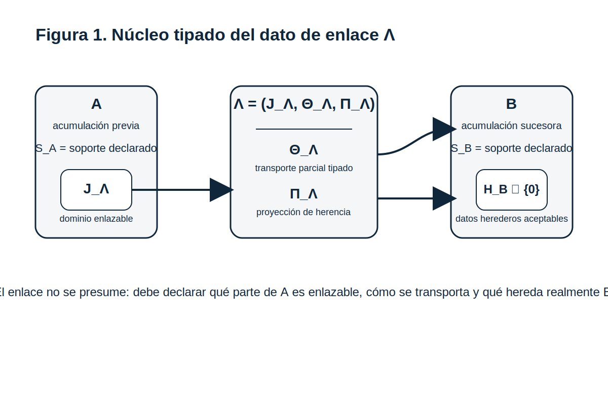
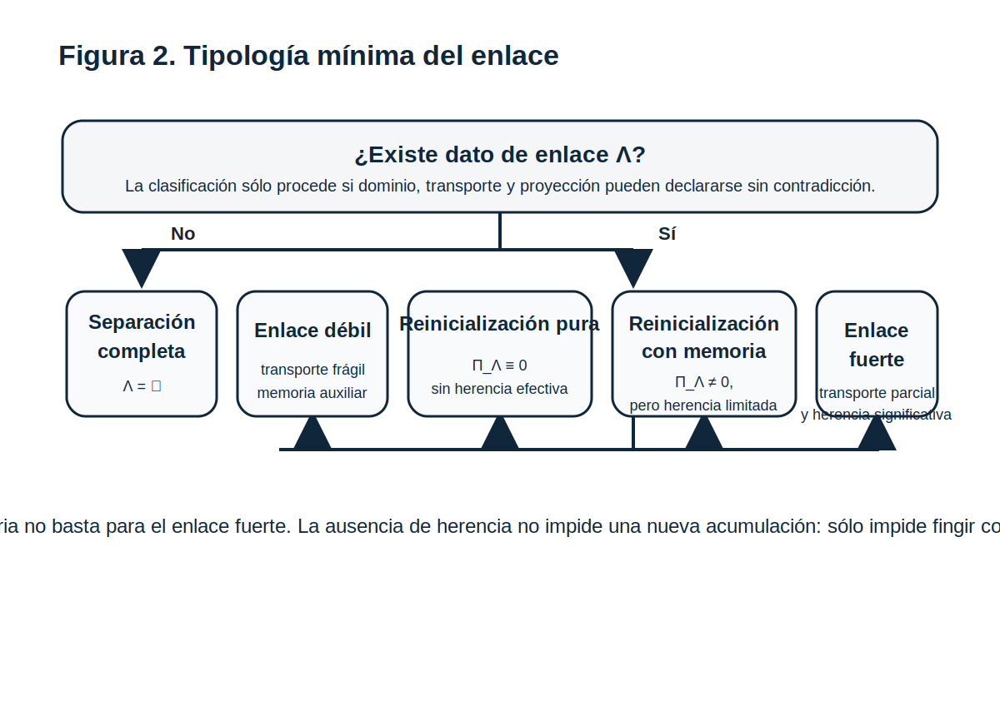
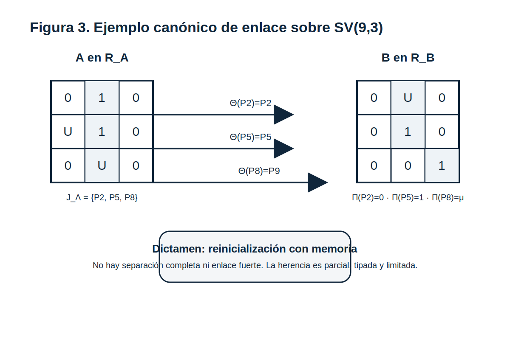

# VII.5 — Enlace formal entre acumulaciones sucesivas en el Sistema Vectorial SV
## con dato de enlace tipado $\Lambda$, ejemplo canónico en SV(9,3) y laboratorio acompañante

**Autor:** Juan Antonio Lloret Egea  
**ORCID:** 0000-0002-6634-3351  
**Serie doctrinal:** Sistema Vectorial SV  
**Sello editorial:** Instituto Tecnológico Virtual de la Inteligencia Artificial para el Español™ (ITVIA)  
**Publicación:** IA eñ™ – La Biblia de la IA™  
**ISSN:** 2695-6411  
**Madrid, 25 de marzo de 2026**

---

## Membresía editorial

Este documento pertenece a la familia doctrinal:

**Sucesos, horizontes y cambio estructural — Una aproximación algebraica desde el Sistema Vectorial SV**

y constituye el quinto documento del frente VII, continuación directa de:

- **VII.0** — que retiró al tiempo la soberanía modificativa;
- **VII.1** — que fijó el suceso admisible como objeto formal;
- **VII.2** — que abrió la gramática relacional mínima entre sucesos admisibles;
- **VII.3** — que introdujo cadenas, acumulación y regímenes de paso;
- **VII.4** — que fijó respuesta estructural, persistencia de transporte, umbral de ruptura y transición controlada de régimen.

Su función propia no es repetir VII.4 ni anticipar todavía el tratado de células especializadas. Su función es otra: **decidir bajo qué condiciones dos acumulaciones sucesivas pueden quedar formalmente enlazadas, cuándo sólo existe reinicialización, cuándo hay memoria resumida del régimen previo y cuándo comparece una herencia estructural fuerte sin recaer ni en continuidad presumida ni en ruptura total por defecto**.

El laboratorio Python que acompaña a este documento se entrega en este mismo paquete en `laboratorio_python_vii5/laboratorio_vii5.py`. Verifica ejemplos canónicos sobre la célula **SV(9,3)**, clasifica los cinco tipos mínimos de enlace y no tiene rango doctrinal soberano sobre el manuscrito ni sobre el Lenguaje SV.

---

## Resumen

VII.4 dejó abierto un problema estructural preciso: declarado un umbral y admitida una transición controlada de régimen, todavía faltaba decidir si la nueva acumulación nace formalmente separada de la previa o si existe entre ambas algún tipo de enlace legítimo. La mera sucesión no basta. Tampoco basta una intuición difusa de continuidad. VII.5 introduce por ello el **dato de enlace** $\Lambda$, entendido como una triple tipada $(J_\Lambda, \Theta_\Lambda, \Pi_\Lambda)$, donde $J_\Lambda$ delimita el dominio enlazable de la acumulación previa, $\Theta_\Lambda$ fija el transporte parcial y tipado hacia el régimen sucesor, y $\Pi_\Lambda$ decide la proyección efectiva de herencia aceptable por el nuevo régimen. Sobre esa base, el documento distingue separación completa, enlace débil, reinicialización pura, reinicialización con memoria y enlace fuerte. La pieza no establece todavía teoría general de equivalencia entre regímenes ni topología global del tránsito; fija, más sobriamente, el punto mínimo donde el Sistema Vectorial SV puede afirmar enlace sin mentir.

**Palabras clave:** Sistema Vectorial SV; enlace formal; acumulaciones sucesivas; dato de enlace; reinicialización con memoria; SV(9,3); herencia estructural.

---

## 0. Estatuto, necesidad y adversarial previa

### 0.1. Qué problema propio resuelve VII.5

VII.5 resuelve un hueco que VII.4 había dejado ya impuesto, pero todavía no cerrado: **el estatuto formal de la herencia entre acumulaciones sucesivas**.

Tras VII.4 ya era posible decir:

- que un régimen puede alcanzar un umbral de ruptura;
- que puede declararse una transición controlada;
- y que una nueva acumulación puede iniciarse en régimen sucesor.

Pero todavía faltaba decidir si entre la acumulación previa $A$ y la nueva acumulación $B$ existe:

- separación completa,
- mera comparación externa,
- reinicialización pura,
- reinicialización con memoria,
- o enlace formal fuerte.

Ése es el problema propio de VII.5. Si no se fija aquí, la familia VII queda expuesta a dos errores simétricos:

1. **continuidad presumida**, por simple proximidad entre regímenes;
2. **ruptura total por defecto**, incluso cuando sí comparece herencia parcial tipable.

### 0.2. Qué toma de VII.4 y qué no debe duplicar

VII.5 toma de VII.4 cuatro piezas ya abiertas:

- el hecho de respuesta estructural;
- la distinción entre persistencia, reevaluación y no herencia;
- el umbral de ruptura como hecho estructural localizado;
- y la transición controlada entre regímenes.

VII.5 no debe duplicar la teoría de la respuesta estructural ni reabrir el tratado del umbral. Su tarea es más delimitada: **formalizar la bisagra entre acumulaciones sucesivas una vez admitido el tránsito de régimen**.

### 0.3. Adversariales de legitimidad

La legitimidad de VII.5 depende de superar, al menos, estas adversariales:

**A1. Continuidad encubierta.** Llamar enlace a cualquier parecido narrativo entre la acumulación previa y la nueva.

**A2. Funcionalismo pobre.** Reducir $\Lambda$ a una simple aplicación o etiqueta verbal entre acumulaciones.

**A3. Herencia total por inercia.** Suponer que todo régimen sucesor debe heredar algo del previo.

**A4. Ruptura perezosa.** Declarar separación total allí donde sí existe una memoria estructural limitada y tipable.

**A5. Ornamentación algebraica.** Introducir $\Lambda$ como retórica sin dominio, transporte, ejemplo verificable ni laboratorio acompañante.

### 0.4. Dónde, cómo y cuándo puede un lector científico exigir prueba de no trivialidad

Un lector científico sólo puede conceder seriedad a VII.5 cuando comparecen, a la vez, tres planos:

1. **dónde**: en el propio manuscrito, mediante definición tipada del dato de enlace, condiciones de existencia y una tipología que excluya tanto la continuidad presumida como la ruptura vacía;
2. **cómo**: mediante ejemplo explícito sobre **SV(9,3)** y laboratorio reproducible que clasifique casos canónicos;
3. **cuándo**: en el momento mismo de lectura del paper y de ejecución del laboratorio, y más tarde, tras la eventual integración editorial, en contraste con la familia VII y con el carril del Lenguaje SV.

Si falta alguno de estos tres planos, el documento no queda automáticamente refutado, pero sí pierde fuerza de acreditación. Por eso VII.5 no debe quedarse en definición elegante: debe dejar ya condiciones mínimas verificables.

---

## 1. Objeto formal del problema

Sean:

- $A$ una acumulación legítima en régimen $R_A$, con soporte declarado $S_A$;
- $B$ una acumulación legítima en régimen $R_B$, con soporte declarado $S_B$;
- y supóngase que entre ambas ha comparecido un umbral y una transición ya declarados conforme a VII.4.

La pregunta de VII.5 no es si $A$ ocurre antes que $B$, ni si se parecen, ni si narrativamente pertenecen a un mismo proceso. La pregunta es ésta:

> ¿existe una estructura mínima y tipada que haga legítimo afirmar que entre $A$ y $B$ hay enlace formal?

La regla negativa es inmediata: no se presume enlace por mera sucesión, por continuidad temporal, por analogía verbal ni por estética geométrica. Si hay enlace, debe quedar declarado y tipado. Si no lo hay, el sistema debe poder afirmar separación sin violencia ni eufemismo.

---

## 2. Definición tipada del dato de enlace $\Lambda$

### 2.1. Definición mínima

Diremos que existe un **dato de enlace** entre $A$ y $B$, denotado por

$$
\Lambda_{A\to B},
$$

si se dispone de una triple tipada

$$
\Lambda = (J_\Lambda, \Theta_\Lambda, \Pi_\Lambda),
$$

tal que:

1. $J_\Lambda \subseteq S_A$ es el **dominio de enlace**, es decir, la parte explícitamente enlazable de la acumulación previa;
2. $\Theta_\Lambda : J_\Lambda \rightharpoonup S_B$ es un **transporte parcial tipado** hacia el soporte del régimen sucesor;
3. $\Pi_\Lambda : J_\Lambda \rightharpoonup \mathcal{H}_B \cup \{0\}$ es la **proyección de herencia**, donde $\mathcal{H}_B$ designa el conjunto de datos herederos aceptables por el régimen $R_B$, y el valor $0$ denota no herencia efectiva.

**Nota de anclaje sobre $\mathcal{H}_B$.** En VII.5, $\mathcal{H}_B$ no se redefine desde cero: debe leerse a la luz de VII.4 allí donde el régimen sucesor quedó delimitado mediante **respuesta estructural**, **zona no heredable** y **transición controlada de régimen**. En consecuencia, una proyección sólo es aceptable si no contradice ese cierre previo del horizonte sucesor.

La triple anterior debe leerse con sobriedad:

- $J_\Lambda$ impide heredar la totalidad de $A$ por inercia;
- $\Theta_\Lambda$ impide llamar enlace a una mera vecindad narrativa;
- $\Pi_\Lambda$ impide confundir comparación, memoria resumida y herencia efectiva.

*Figura 1. El dato de enlace $\Lambda$ no es una etiqueta verbal. Requiere dominio enlazable, transporte parcial tipado y proyección explícita de herencia entre acumulaciones sucesivas.*

### 2.2. Consecuencia inmediata

$\Lambda$ no es una función simple ni una equivalencia entre regímenes. Es un dato compuesto que puede:

- no existir;
- existir sólo de forma parcial;
- conservar memoria sin continuidad fuerte;
- o sostener una herencia estructural significativa.

### 2.2.bis. Convención mínima sobre no unicidad

Para un mismo par $(A,B)$ pueden comparecer varias triples $\Lambda$ formalmente admisibles. VII.5 no afirma aquí unicidad fuerte del dato de enlace. Para evitar inflación, adopta una convención de lectura mínima: **debe preferirse la triple más sobria que sostenga el dictamen sin exagerarlo**.

En consecuencia:

- no se debe elegir una $\Lambda$ más rica si una más pobre basta;
- no se debe forzar un dictamen más fuerte del que autoriza la evidencia tipada;
- y, en caso de competencia entre varias triples legítimas, prevalece la que conserve mejor la pérdida explícita declarada en VII.4.

### 2.3. Delimitación negativa inmediata

La existencia de $\Lambda$ **no** autoriza todavía a afirmar:

- continuidad global del sistema;
- equivalencia entre $R_A$ y $R_B$;
- topología general del tránsito;
- ni identidad fuerte entre las acumulaciones enlazadas.

Su función es más estrecha y más útil: fijar el punto mínimo donde el sistema puede decir con rigor si hay separación, memoria o herencia.

---

## 3. Componentes del enlace

### 3.1. Dominio de enlace $J_\Lambda$

El dominio de enlace selecciona qué parte de $A$ es realmente candidata a entrar en relación con $B$. Esto excluye dos excesos:

- la herencia total automática del régimen previo;
- y la vaguedad de un enlace sin soporte declarado.

En términos operativos, $J_\Lambda$ puede ser muy pequeño. La sobriedad del dominio no debilita el enlace; lo disciplina.

### 3.2. Transporte parcial tipado $\Theta_\Lambda$

El transporte $\Theta_\Lambda$ no exige continuidad plena ni correspondencia total. Exige algo más concreto: que las posiciones o magnitudes seleccionadas en $J_\Lambda$ puedan comparecer de forma legítima en $S_B$, sin contradicción con el nuevo régimen.

La parcialidad no es defecto. Es precisamente uno de los rasgos que hacen legítimo el enlace en un sistema que no presupone continuidad total.

### 3.3. Proyección de herencia $\Pi_\Lambda$

$\Pi_\Lambda$ decide qué parte del dominio enlazable llega realmente a participar en la definición, arranque o memoria estructural de $B$.

Su codominio es deliberadamente sobrio: $\mathcal{H}_B \cup \{0\}$. Esto permite distinguir al menos tres situaciones:

- **no herencia**: el valor proyectado es $0$;
- **memoria resumida**: la proyección es no nula, pero parcial y limitada;
- **herencia significativa**: la proyección es suficientemente rica y estable como para sostener un enlace fuerte.

---

## 4. Tipología mínima del enlace

A partir de la estructura anterior, VII.5 distingue cinco casos canónicos.

### 4.1. Separación completa

No existe dato de enlace:

$$
\Lambda = \varnothing.
$$

No hay dominio enlazable, no hay transporte y no hay herencia. Las dos acumulaciones quedan formalmente separadas.

### 4.2. Enlace débil

Se cumple que:

- $J_\Lambda \neq \varnothing$;
- $\Theta_\Lambda$ es **no vacío**, pero sólo comparece de forma parcial y frágil;
- $\Pi_\Lambda$ conserva una proyección escasa o puramente auxiliar.

Hay relación formal mínima, pero no continuidad estructural fuerte.

### 4.3. Reinicialización pura

Existe nueva acumulación en régimen sucesor, pero

$$
\Pi_\Lambda \equiv 0.
$$

Puede haber comparación externa o trazabilidad histórica, pero no herencia acumulativa efectiva.

### 4.4. Reinicialización con memoria

Existe dominio enlazable y la proyección ya no es nula, pero sigue siendo limitada:

$$
\Pi_\Lambda \not\equiv 0,
$$

sin que por ello pueda afirmarse todavía enlace fuerte. Se conserva memoria declarada del régimen previo sin convertirla en continuidad global.

### 4.5. Enlace fuerte

Existe un dominio suficientemente coherente, un transporte parcial estable —sin exigir cobertura total del dominio— y una proyección significativa aceptada por $R_B$. La herencia no es total ni metafísica, pero sí estructuralmente relevante.

*Figura 2. La tipología mínima de VII.5 distingue separación, enlace débil, reinicialización pura, reinicialización con memoria y enlace fuerte, evitando tanto la continuidad presumida como la ruptura vacía.*

---

## 5. Condiciones de existencia y no existencia

### 5.1. Condiciones mínimas de existencia

Para que $\Lambda$ sea legítimo deben cumplirse, al menos, estas condiciones:

1. **dominio coherente**: $J_\Lambda$ debe estar explícitamente declarado y no ser un residuo inferido por narración;
2. **transporte tipado**: $\Theta_\Lambda$ no puede enviar posiciones o magnitudes a destinos incompatibles con $R_B$;
3. **proyección aceptable**: $\Pi_\Lambda$ debe producir sólo datos aceptables por el régimen sucesor o el valor nulo $0$;
4. **no contradicción**: el enlace no puede deshacer por la puerta de atrás el umbral ya declarado en VII.4;
5. **pérdida explícita**: debe quedar declarado qué parte de $A$ no se hereda.

### 5.2. Criterios de no existencia

No procede hablar de enlace formal cuando ocurre cualquiera de estos casos:

- $J_\Lambda$ no está declarado;
- $\Theta_\Lambda$ es puramente verbal o contradictorio;
- $\Pi_\Lambda$ pretende heredar datos no aceptables por $R_B$;
- la nueva acumulación se ha definido, de hecho, como inicio autónomo sin memoria tipada;
- o la supuesta herencia depende sólo de parecido superficial entre acumulaciones.

---

## 6. Lemas y proposiciones mínimas

### Lema 1. Sin dominio declarado no hay enlace

Si $J_\Lambda$ no está explícitamente declarado, entonces no procede afirmar enlace formal entre $A$ y $B$.

**Razón.** Sin dominio no puede distinguirse qué se enlaza de qué no se enlaza.

### Lema 2. Proyección nula implica ausencia de continuidad acumulativa

Si

$$
\Pi_\Lambda \equiv 0,
$$

entonces no hay continuidad acumulativa efectiva entre $A$ y $B$.

**Razón.** Puede haber historia, comparación o memoria externa, pero la nueva acumulación no hereda formalmente dato alguno de la previa.

### Lema 3. Sin transporte tipado no hay enlace fuerte

Si $\Theta_\Lambda$ es vacío, ilegítimo o contradictorio con $R_B$, el enlace fuerte queda excluido.

### Proposición 1. El enlace fuerte exige más que memoria

La mera no nulidad de $\Pi_\Lambda$ no basta para afirmar enlace fuerte. Hace falta, además, coherencia del dominio y transporte tipado no trivial.

### Proposición 2. Reinicialización con memoria no equivale a continuidad global

La existencia de memoria proyectada no autoriza a hablar de identidad fuerte entre $A$ y $B$. Sólo autoriza a reconocer que una parte limitada de $A$ participa en el arranque o en la definición de $B$.

---

## 7. Ejemplo canónico sobre SV(9,3)

### 7.1. Declaración del caso

Considérese una célula **SV(9,3)** con soporte

$$
S_A = \{P_1,\dots,P_9\}
$$

y acumulación previa

$$
A = (0,1,0,\;U,1,0,\;0,U,0)
$$

bajo régimen $R_A$.

Tras un umbral ya declarado conforme a VII.4, se abre una nueva acumulación

$$
B = (0,U,0,\;0,1,0,\;0,0,1)
$$

bajo régimen $R_B$.

Declárese:

- dominio de enlace $J_\Lambda = \{P_2, P_5, P_8\}$;
- transporte parcial
  $\Theta_\Lambda(P_2)=P_2$,
  $\Theta_\Lambda(P_5)=P_5$,
  $\Theta_\Lambda(P_8)=P_9$;
- proyección de herencia
  $\Pi_\Lambda(P_2)=0$,
  $\Pi_\Lambda(P_5)=1$,
  $\Pi_\Lambda(P_8)=\mu$,
  donde $\mu$ representa memoria resumida aceptada por $R_B$.

**Nota mínima sobre $\mu$.** El símbolo $\mu$ se usa aquí sólo como valor auxiliar de memoria resumida. Es **exterior** al alfabeto canónico $\{0,1,U\}$, no tiene todavía rango doctrinal soberano y no puede arrastrarse a otro documento como si ya estuviera formalizado por sí mismo.

### 7.2. Dictamen del caso

En este ejemplo:

- no hay separación completa, porque $J_\Lambda$ no es vacío;
- no hay reinicialización pura, porque $\Pi_\Lambda$ no es nula;
- no hay enlace fuerte, porque la herencia sigue siendo limitada y el transporte no cubre una parte estructural suficientemente amplia;
- por tanto, el caso correcto es **reinicialización con memoria**.

El ejemplo muestra por qué VII.5 no puede reducirse a la oposición binaria entre continuidad o ruptura. La nueva acumulación no nace idéntica a la previa, pero tampoco nace totalmente ciega respecto de ella.

*Figura 3. Ejemplo en SV(9,3) de reinicialización con memoria: el dominio enlazable es restringido, el transporte es parcial y sólo una parte del régimen previo participa en la nueva acumulación.*

---

## 8. Adversarial integrada

### Objeción A

“VII.5 reintroduce continuidad clásica con otro nombre.”

**Respuesta.** No. El sistema admite expresamente separación completa y reinicialización pura. El enlace sólo existe cuando hay dato tipado explícito.

### Objeción B

“$\Lambda$ es sólo una función entre acumulaciones.”

**Respuesta.** No. El dato de enlace exige dominio declarado, transporte tipado y proyección explícita de herencia. Es más pobre que una equivalencia global y más rico que una simple correspondencia.

### Objeción C

“Si hay memoria, entonces ya hay enlace fuerte.”

**Respuesta.** Tampoco. La memoria resumida puede ser real y, sin embargo, insuficiente para afirmar herencia estructural fuerte. Precisamente por eso VII.5 distingue entre reinicialización con memoria y enlace fuerte.

### Objeción D

“Todo régimen sucesor debe heredar algo del régimen previo.”

**Respuesta.** Esto queda negado por construcción. La separación completa y la reinicialización pura forman parte del vocabulario legítimo del sistema.

---

## 9. Laboratorio acompañante y verificabilidad mínima

El laboratorio Python de este documento se entrega en:

`laboratorio_python_vii5/laboratorio_vii5.py`

Su función no es reemplazar el manuscrito, sino **acompañarlo, verificarlo e ilustrarlo**. En concreto, el laboratorio:

1. declara una célula canónica **SV(9,3)**;
2. implementa la clasificación mínima de los cinco tipos de enlace;
3. verifica con `assert` los casos canónicos;
4. reproduce el ejemplo de reinicialización con memoria expuesto en la sección 7.

En este laboratorio se adopta, además, una **convención operativa prudencial**: si apareciera una proyección auxiliar no nula sin transporte declarado, el caso no se elevaría a enlace fuerte ni a continuidad; quedaría rebajado al borde más pobre de la clasificación. Esa convención no tiene rango doctrinal soberano y sólo evita sobreclasificación indebida en la capa de código.

Por tanto, un lector no tiene por qué conceder fuerza al documento por mera presencia de símbolos. Puede exigir dos planos de contraste inmediatos:

- coherencia interna del manuscrito;
- y ejecución reproducible del laboratorio acompañante.

---

## 10. Delimitación negativa reforzada

VII.5 no establece todavía:

- equivalencia general entre regímenes;
- teoría completa del cambio de fase;
- continuidad global del sistema;
- topología del enlace;
- reconstrucción geométrica del tránsito;
- ni implementación computacional soberana del dato $\Lambda$ en el Lenguaje SV.

La pieza conserva una función restringida, pero no decorativa: fijar el punto mínimo donde el Sistema Vectorial SV puede afirmar enlace, memoria parcial o separación sin mentir.

---

## 11. Conclusión

VII.5 cierra la bisagra abierta por VII.4. Allí donde VII.4 había fijado umbral, transición controlada y reinicialización, VII.5 decide ahora cuándo esa reinicialización puede considerarse formalmente enlazada con la acumulación precedente y bajo qué estatuto exacto. La introducción del dato de enlace tipado

$$
\Lambda = (J_\Lambda, \Theta_\Lambda, \Pi_\Lambda)
$$

impide dos errores simétricos: suponer continuidad donde no la hay, o declarar ruptura total donde sí existe una herencia parcial y formalmente tipable. De este modo, el Sistema Vectorial SV gana un instrumento crítico para pensar cambios de régimen sin recaer ni en tiempo fuerte ni en metafísica de la identidad global.

---

## Referencias internas de la serie

- **VII.0** — *El tiempo no modifica por sí mismo: horizonte declarado, sucesos y reevaluación situacional en el Sistema Vectorial SV*.
- **VII.1** — *Teoría rigurosa del suceso admisible en el Sistema Vectorial SV*.
- **VII.2** — *Precedencia, compatibilidad y afectación entre sucesos admisibles en el Sistema Vectorial SV*.
- **VII.3** — *Cadenas, acumulación y regímenes de paso entre sucesos admisibles en el Sistema Vectorial SV*.
- **VII.4** — *Respuesta estructural, umbral, transición de régimen y preparación de células especializadas en el Sistema Vectorial SV*.

## Bibliografía externa de contraste

- Abramsky, S., & Jung, A. (1994). *Domain theory*. En S. Abramsky, D. M. Gabbay & T. S. E. Maibaum (Eds.), *Handbook of Logic in Computer Science* (Vol. 3). Oxford University Press.
- Nielsen, M., Plotkin, G., & Winskel, G. (1981). Petri nets, event structures and domains. *Theoretical Computer Science, 13*(1), 85–108.
- Winskel, G. (1987). Event structures. En G. Rozenberg (Ed.), *Advances in Petri Nets 1986* (Lecture Notes in Computer Science, Vol. 255). Springer.
