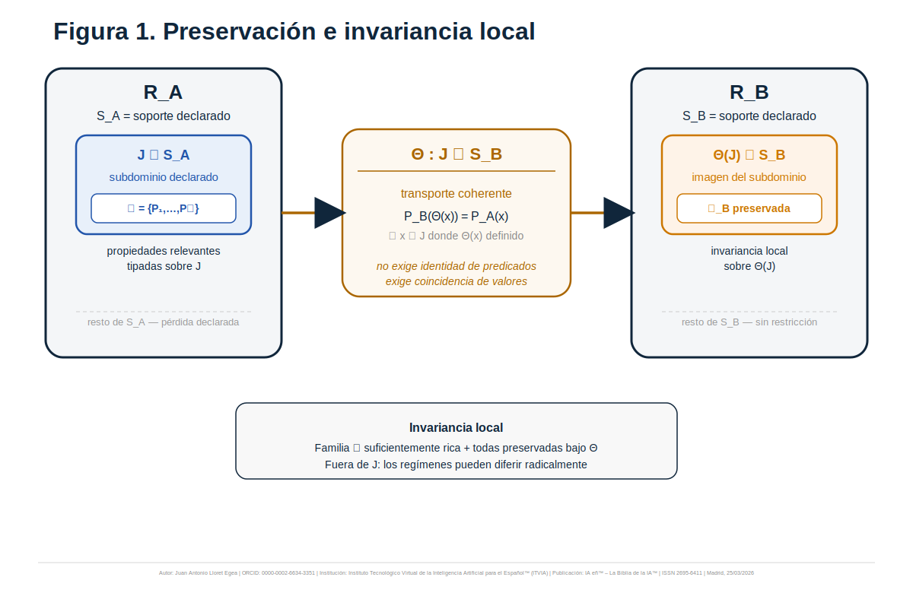
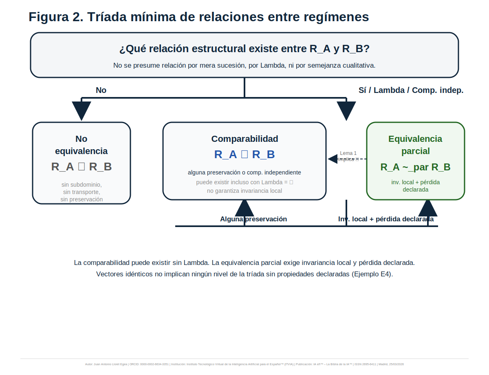
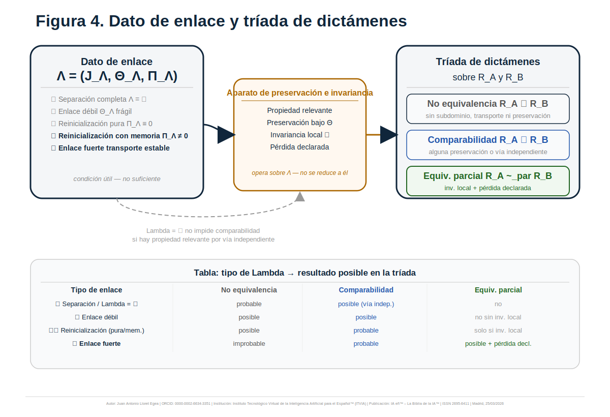
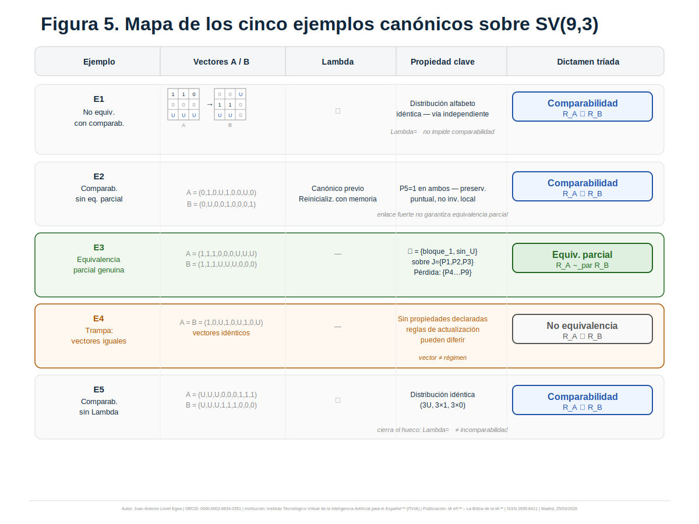
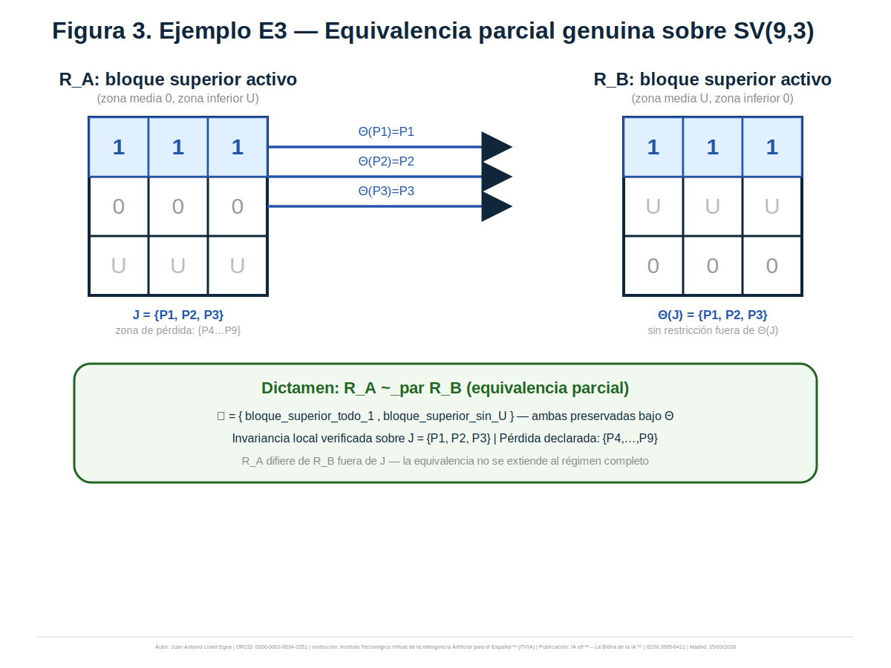

# Equivalencia parcial, preservación e invariancia local entre regímenes en el Sistema Vectorial SV
## con tríada mínima de relaciones, ejemplos canónicos en SV(9,3) y laboratorio acompañante

**Autor:** Juan Antonio Lloret Egea  
**ORCID:** 0000-0002-6634-3351  
**Serie doctrinal:** Sistema Vectorial SV  
**Sello editorial:** Instituto Tecnológico Virtual de la Inteligencia Artificial para el Español™ (ITVIA)  
**Publicación:** IA eñ™ – La Biblia de la IA™  
**ISSN:** 2695-6411  
**Madrid, 25 de marzo de 2026**

---

## Resumen

El documento precedente sobre enlace formal entre acumulaciones sucesivas dejó abierta una cuestión que no era ya una cuestión de acumulaciones, sino de **regímenes**: una vez admitido un dato de enlace \(\Lambda\) entre dos trayectorias acumulativas, sigue faltando decidir qué relación estructural existe entre los regímenes que las sostienen. Este trabajo introduce tres nociones mínimas para responder a esa pregunta sin inflar la equivalencia: **propiedad relevante**, **preservación bajo transporte** e **invariancia local**. Sobre esa base establece una **tríada exclusiva de dictámenes** — no equivalencia, comparabilidad y equivalencia parcial — y la ancla en cinco ejemplos canónicos sobre la célula **SV(9,3)**. El laboratorio acompañante no legisla sobre la doctrina ni sobre el Lenguaje SV; se limita a reproducir los ejemplos del manuscrito y a verificar, con criterios explícitos, la coherencia interna del aparato formal aquí propuesto.

**Palabras clave:** Sistema Vectorial SV; equivalencia parcial; comparabilidad; preservación; invariancia local; regímenes; SV(9,3); dato de enlace; Lenguaje SV.

---

## Guía de lectura para el lector científico externo

Este texto se apoya en una secuencia previa de resultados ya fijados: la nota de precisión sobre suceso local, suceso envolvente y reevaluación situacional; la retirada de soberanía modificativa al tiempo; la formalización del suceso admisible; la gramática relacional mínima entre sucesos; la teoría de cadenas, acumulación y regímenes de paso; la respuesta estructural con umbral y transición; y, de modo inmediato, el documento sobre **enlace formal entre acumulaciones sucesivas**. El punto de partida ya no es, por tanto, la pregunta por el cambio, sino la pregunta por la **relación entre regímenes** una vez que el enlace entre acumulaciones ha quedado tipado.

La célula de referencia sigue siendo **SV(9,3)**: nueve posiciones sobre el alfabeto ternario \(\Sigma=\{0,1,U\}\). El valor \(U\) no se interpreta como error, ruido ni probabilidad, sino como indeterminación honesta estructuralmente sostenible.

---

## 0. Objeto, alcance y huecos heredados

### 0.1. Objeto propio

El objeto de este trabajo es decidir bajo qué condiciones resulta legítimo afirmar que entre dos regímenes \(R_A\) y \(R_B\) existe:

1. ausencia de base suficiente para elevar una relación estructural,
2. base suficiente para **comparabilidad**, o
3. base suficiente para **equivalencia parcial**.

No es una teoría general de equivalencias entre regímenes. Tampoco es una teoría global de invariantes. Su alcance es deliberadamente mínimo: fijar un aparato suficiente para evitar dos errores simétricos:

- llamar equivalentes a regímenes por mera semejanza narrativa o por mera existencia de \(\Lambda\);
- declarar incomparables a regímenes que sí comparten una base formal localizada de confrontación.

### 0.2. Hueco heredado: monotonía de habilitación

La secuencia previa arrastra todavía un hueco reconocido: la acíclicidad de la precedencia descansa en una hipótesis de monotonía de habilitación no axiomatizada por completo. Este trabajo no resuelve ese punto. Lo nombra para no trasladarlo silenciosamente a desarrollos posteriores ajenos a su objeto.

### 0.3. Células especializadas y Lenguaje SV: fuera del alcance directo

Ni la formalización plena de células especializadas ni la cristalización inmediata en gramática, IR, validator, runner o backend pertenecen al alcance de este texto. Aquí solo se fija qué objetos debería ser capaz de **representar** un sistema ulterior si quisiera operar con la tríada sin degradar el aparato algebraico.

### 0.4. Adversariales de legitimidad

El aparato propuesto debe resistir, al menos, estas objeciones:

**A1. Equivalencia encubierta.** Llamar equivalencia parcial a cualquier parecido local sin declarar subdominio, transporte y pérdida.

**A2. Preservación vacía.** Declarar preservación cuando en realidad solo hay coincidencias narrativas o puntuales sin estatuto estructural suficiente.

**A3. Lambda como gatillo automático.** Suponer que la existencia de \(\Lambda\), incluso fuerte, basta por sí sola para elevar equivalencia parcial.

**A4. Identidad de estados como identidad de regímenes.** Confundir igualdad de vectores de acumulación con igualdad de régimen.

**A5. Inflación prescriptiva sobre el Lenguaje SV.** Convertir condiciones de posibilidad representacional en mandatos de implementación inmediata.

---

## 1. Formulación del problema

Sean \(R_A\) y \(R_B\) dos regímenes del Sistema Vectorial SV, eventualmente relacionados por un dato de enlace \(\Lambda_{A\to B}\) previamente declarado. La cuestión no es si ambos regímenes “se parecen”, ni si una narración externa los presenta como próximos, ni si comparten alguna memoria de tránsito. La cuestión es esta:

> ¿existe una base formal explícitamente declarada que autorice un dictamen de no equivalencia, comparabilidad o equivalencia parcial entre \(R_A\) y \(R_B\)?

La regla negativa es inmediata: ningún dictamen se presume por mera sucesión, por mera existencia de \(\Lambda\), por identidad vectorial accidental ni por afinidad intuitiva.

---

## 2. Aparato mínimo de preservación e invariancia

### 2.1. Propiedad relevante

Diremos que \(P\) es una **propiedad relevante** de un régimen \(R\) sobre un subdominio declarado \(J\subseteq S\) si concurren estas condiciones:

1. **Subdominio explícito.** \(J\) queda declarado y no es inferido retrospectivamente.
2. **Tipo explícito.** \(P\) toma valores en un codominio declarado \(K_P\).
3. **Dependencia local controlada.** El valor de \(P\) depende solo de la restricción del estado a \(J\).
4. **Impacto estructural.** El valor de \(P\) afecta lectura, acumulación, respuesta estructural, régimen de paso o criterio de tránsito dentro del régimen en cuestión.
5. **No derivación narrativa.** \(P\) es relevante dentro de \(R\) antes de compararlo con cualquier otro régimen.

En notación operativa, puede pensarse como una aplicación tipada

$$
P_R^J : \Sigma^{|J|} \to K_P.
$$

El caso booleano es admisible, pero no obligatorio. Importa el valor estructural de la propiedad, no el formato accidental de su codominio.

### 2.2. Preservación bajo transporte

Sean \(P_A^{J_A}\) una propiedad relevante en \(R_A\), \(P_B^{J_B}\) una propiedad relevante en \(R_B\) y \(\Theta:J_A\rightharpoonup J_B\) un transporte coherente sobre el subdominio declarado. Diremos que **\(P_A^{J_A}\) se preserva en \(P_B^{J_B}\) bajo \(\Theta\)** cuando:

1. \(\Theta\) está definido sobre el dominio de comparación declarado;
2. la imagen \(\Theta(J_A)\) queda contenida en el subdominio de \(P_B\);
3. el valor de \(P_A\) sobre la configuración restringida de origen coincide con el valor de \(P_B\) sobre la configuración restringida de destino transportado.

Formalmente, si \(x|_{J_A}\) es la restricción del estado de \(R_A\) a \(J_A\) y \(y|_{\Theta(J_A)}\) la restricción correspondiente en \(R_B\), la preservación exige

$$
P_A^{J_A}(x|_{J_A}) = P_B^{\Theta(J_A)}(y|_{\Theta(J_A)}).
$$

La preservación no exige identidad sintáctica entre propiedades; exige coincidencia tipada de valor bajo transporte declarado.

### 2.3. Invariancia local

Diremos que existe **invariancia local** entre \(R_A\) y \(R_B\) sobre un subdominio \(J\) cuando existe una familia finita no vacía

$$
\mathcal{F} = \{(P_{A,1},P_{B,1}),\dots,(P_{A,k},P_{B,k})\}
$$

con estas condiciones:

1. todas las propiedades de la familia están declaradas sobre subdominios compatibles con un mismo transporte coherente \(\Theta\);
2. **todas** las propiedades de la familia se preservan bajo \(\Theta\);
3. la familia cubre al menos un rasgo estructural no trivial del subdominio \(J\);
4. queda declarada la zona fuera de \(J\) respecto de la cual no se reclama preservación.

No hay aquí umbral heurístico de cobertura. La invariancia local no es una mayoría estadística de propiedades preservadas, sino una familia declarada íntegramente preservada sobre un subdominio explícito.

*Figura 1. La preservación compara valores de propiedades tipadas sobre subdominios declarados. La invariancia local exige una familia íntegramente preservada y una pérdida explícita fuera del subdominio equivalente.*

---

## 3. Tríada mínima de dictámenes entre regímenes

La tríada propuesta es **exclusiva como dictamen final**, aunque no lo sea en el orden lógico interno del aparato. En particular, la equivalencia parcial presupone comparabilidad, pero el dictamen final adecuado en ese caso ya no es “comparabilidad”, sino “equivalencia parcial”.

### 3.1. No equivalencia

Escribiremos

$$
R_A \not\sim R_B
$$

cuando, con los datos declarados en la comparación concreta, no exista base suficiente para elevar ni comparabilidad ni equivalencia parcial. Esto incluye dos escenarios distintos que aquí se tratan bajo un mismo dictamen final:

- separación estructural efectiva;
- insuficiencia declarativa seria para sostener una comparación legítima.

La no equivalencia, así entendida, no es una tesis metafísica sobre imposibilidad absoluta futura; es un dictamen sobrio sobre el material formal efectivamente declarado.

### 3.2. Comparabilidad

Escribiremos

$$
R_A \bowtie R_B
$$

cuando exista una base formal declarada de confrontación entre \(R_A\) y \(R_B\), pero esa base no alcance todavía invariancia local suficiente para equivalencia parcial. La comparabilidad puede nacer por dos vías:

1. una familia explícita de propiedades relevantes confrontables cuya preservación resulte insuficiente para equivalencia parcial;
2. una base comparativa independiente explícitamente declarada y estructuralmente pertinente para ambos regímenes.

En ningún caso la mera existencia de \(\Lambda\) basta por sí sola para elevar comparabilidad.

### 3.3. Equivalencia parcial

Escribiremos

$$
R_A \sim_{\mathrm{par}} R_B
$$

cuando se cumplan simultáneamente estas condiciones:

1. existe un subdominio \(J\) explícitamente declarado;
2. existe un transporte \(\Theta\) coherente sobre ese subdominio;
3. existe una familia no vacía de propiedades relevantes íntegramente preservadas bajo \(\Theta\);
4. la familia cubre un rasgo estructural no trivial de \(J\);
5. la pérdida fuera de \(J\) queda declarada de forma explícita.

La condición 5 impide la equivalencia global encubierta. Una equivalencia parcial sin pérdida declarada no es parcial: es una afirmación total mal disciplinada.

*Figura 2. La tríada funciona como dictamen final exclusivo. En el orden lógico del aparato, la equivalencia parcial presupone comparabilidad; en el orden del dictamen, la absorbe.*

---

## 4. Relación con el dato de enlace \(\Lambda\)

El dato de enlace heredado del documento precedente sigue siendo útil, pero ya no agota el problema.

- Si \(\Lambda=\varnothing\), la hipótesis sobria es no equivalencia, aunque puede emerger comparabilidad por vía independiente si existe una base formal declarada para ella.
- Si \(\Lambda\) es débil o memorial, puede aportar contexto de comparación, pero no sustituye la declaración de propiedades, subdominio y transporte.
- Si \(\Lambda\) es fuerte, contribuye a la plausibilidad de una comparación más rica, pero no eleva por sí solo equivalencia parcial.

La regla decisiva es esta:

> \(\Lambda\) puede alimentar la comparación; no puede reemplazar el aparato de preservación e invariancia.

*Figura 4. El dato de enlace puede sostener o enriquecer una comparación, pero no determina automáticamente el dictamen final. La tríada se decide por propiedades relevantes, transporte, invariancia local y pérdida declarada.*

---

## 5. Condiciones mínimas

### 5.1. Para equivalencia parcial

Debe constar, sin inferencia supletoria:

1. subdominio declarado;
2. transporte coherente;
3. familia no vacía de propiedades relevantes;
4. preservación íntegra de esa familia bajo el transporte;
5. cobertura de un rasgo estructural no trivial;
6. pérdida explícita fuera del subdominio equivalente.

### 5.2. Para comparabilidad

Basta con que exista una base formal explícita de confrontación — por propiedades o por criterio comparativo independiente —, pero sin aparato suficiente para equivalencia parcial.

### 5.3. Para no equivalencia

Procede el dictamen de no equivalencia cuando falta base suficiente para elevar cualquiera de los dos dictámenes anteriores con el material efectivamente declarado.

---

## 6. Lemas y proposiciones mínimas

### Lema 1. La equivalencia parcial presupone comparabilidad en el orden lógico del aparato

Si \(R_A \sim_{\mathrm{par}} R_B\), entonces existe base formal suficiente para comparabilidad. Sin embargo, el dictamen final adecuado no es ya comparabilidad, sino equivalencia parcial.

### Lema 2. La comparabilidad no implica equivalencia parcial

La existencia de una base de confrontación no garantiza invariancia local suficiente ni pérdida declarada.

### Proposición 1. El dato de enlace no basta por sí solo para elevar el dictamen

Ni la mera existencia de \(\Lambda\), ni siquiera un enlace fuerte, autoriza por sí sola comparabilidad o equivalencia parcial sin aparato adicional explícito.

### Proposición 2. La pérdida declarada es condición necesaria de equivalencia parcial

Si no se declara qué queda fuera del subdominio preservado, el dictamen deja de ser parcial y se convierte en una afirmación global encubierta.

---

## 7. Ejemplos canónicos sobre SV(9,3)

### 7.1. Marco de trabajo

En todos los ejemplos se trabaja sobre el soporte \(S=\{P_1,\dots,P_9\}\) y el alfabeto ternario \(\{0,1,U\}\). Los dictámenes se refieren siempre al material formal efectivamente declarado en cada ejemplo.

*Figura 5. Los cinco ejemplos cubren los tres dictámenes de la tríada, el caso frontera de identidad vectorial sin identidad de régimen y la comparabilidad sin dato de enlace.*

### 7.2. Ejemplo E1 — Comparabilidad sin dato de enlace

Considérense

$$A=(1,1,0,\;0,0,0,\;U,U,U), \qquad B=(0,0,U,\;1,1,0,\;U,U,0).$$

No hay dato de enlace: \(\Lambda=\varnothing\).

La base comparativa explícita es **distribucional**: ambos estados comparten la misma distribución global del alfabeto \((2\times 1,\;4\times 0,\;3\times U)\). Si esa distribución es relevante para ambos regímenes, existe confrontación formal, aunque no exista un subdominio transportable que sostenga invariancia local.

**Dictamen:** \(R_A \bowtie R_B\).

### 7.3. Ejemplo E2 — Comparabilidad con preservación puntual insuficiente

Considérense

$$A=(0,1,0,\;U,1,0,\;0,U,0), \qquad B=(0,U,0,\;0,1,0,\;0,0,1),$$

junto con un dato de enlace previamente tipado sobre \(\{P_2,P_5,P_8\}\).

Existe una propiedad relevante puntual: “valor \(1\) estable en \(P_5\)”. Esa propiedad se preserva bajo transporte identidad en \(P_5\). Sin embargo, una preservación puntual no basta para sostener invariancia local significativa sobre un subdominio no trivial.

**Dictamen:** \(R_A \bowtie R_B\).

### 7.4. Ejemplo E3 — Equivalencia parcial genuina

Considérense

$$A=(1,1,1,\;0,0,0,\;U,U,U), \qquad B=(1,1,1,\;U,U,U,\;0,0,0).$$

Declárese el subdominio \(J=\{P_1,P_2,P_3\}\) y el transporte identidad sobre ese bloque.

La familia relevante puede tomarse, por ejemplo, como:

- “el bloque superior está íntegramente en valor \(1\)”;
- “el bloque superior carece de \(U\)”.

Ambas propiedades se preservan íntegramente bajo el transporte declarado. La pérdida queda explicitada: fuera de \(J\), los bloques medio e inferior difieren.

**Dictamen:** \(R_A \sim_{\mathrm{par}} R_B\).

*Figura 3. El bloque superior soporta equivalencia parcial genuina. La zona no preservada queda declarada y no se absorbe narrativamente.*

### 7.5. Ejemplo E4 — Identidad vectorial sin identidad de régimen

Considérense dos regímenes \(R_A\) y \(R_B\) con el mismo vector de acumulación

$$A=B=(1,0,U,\;1,0,U,\;1,0,U),$$

pero con reglas de actualización distintas ante un mismo tipo de suceso de horizonte.

La identidad del estado observado no basta por sí sola para identificar el régimen. Si las reglas de actualización divergen, los regímenes pueden ser estructuralmente distintos aunque el vector actual coincida.

**Dictamen con los datos aquí declarados:** \(R_A \not\sim R_B\).

El ejemplo no afirma imposibilidad absoluta de comparación futura; afirma que la identidad vectorial, sin aparato adicional, no autoriza elevar comparabilidad ni equivalencia parcial.

### 7.6. Ejemplo E5 — Comparabilidad independiente del enlace

Considérense

$$A=(U,U,U,\;0,0,0,\;1,1,1), \qquad B=(U,U,U,\;1,1,1,\;0,0,0),$$

sin dato de enlace declarado.

Existe una base comparativa explícita: ambos regímenes comparten la misma distribución del alfabeto y el mismo volumen de indeterminación frontal. Si esa pauta distribucional interviene en el umbral de ruptura o en la lectura estructural de ambos regímenes, la comparabilidad es legítima aun sin \(\Lambda\).

**Dictamen:** \(R_A \bowtie R_B\).

---

## 8. Adversarial integrada

### Objeción A

“Se está reintroduciendo la equivalencia clásica con otro nombre.”

**Respuesta.** No. La equivalencia parcial exige subdominio declarado, transporte coherente, familia íntegramente preservada y pérdida explícita. Sin esos elementos no procede el dictamen.

### Objeción B

“Un enlace fuerte debería bastar para elevar equivalencia parcial.”

**Respuesta.** No. El enlace puede favorecer una comparación rica, pero no sustituye la declaración de propiedades relevantes ni la verificación de invariancia local.

### Objeción C

“La comparabilidad sin enlace reintroduce continuidad por la puerta de atrás.”

**Respuesta.** No. La comparabilidad independiente exige una base formal declarada en ambos regímenes. No es continuidad presumida, sino contraste explícito.

### Objeción D

“La pérdida declarada hace imposible la equivalencia parcial.”

**Respuesta.** Al contrario: la vuelve honesta y verificable. Sin pérdida declarada, la parcialidad degenera en afirmación total encubierta.

### Objeción E

“Si los vectores son idénticos, al menos debería haber comparabilidad.”

**Respuesta.** No por necesidad. Un estado no agota el régimen que lo produce. Sin propiedades y reglas relevantes declaradas, la identidad vectorial no autoriza por sí misma elevar el dictamen.

---

## 9. Observaciones para el Lenguaje SV

Las observaciones siguientes no imponen cambios inmediatos. Delimitan únicamente capacidades representacionales que serían necesarias para operar con este aparato sin deformarlo.

**Obs. 1.** Debe poder declararse un subdominio explícito de comparación dentro del soporte de la célula.

**Obs. 2.** Debe poder tiparse una propiedad relevante como observable local con codominio declarado.

**Obs. 3.** Debe poder expresarse un transporte coherente entre subdominios.

**Obs. 4.** Debe poder distinguirse entre zona preservada y zona no preservada, de modo que la pérdida no quede absorbida por omisión.

**Obs. 5.** Debe poder declararse una base comparativa independiente del enlace cuando la comparación no descanse en \(\Lambda\).

Estas observaciones informan; no ordenan una cristalización inmediata en frontend ni backend.

---

## 10. Delimitación negativa reforzada

Este trabajo no establece todavía:

- invariantes generales del sistema;
- clases globales de equivalencia entre regímenes;
- equivalencia global;
- métrica o distancia estructural entre regímenes;
- topología del espacio de regímenes;
- reconstrucción geométrica del tránsito;
- implementación soberana en el Lenguaje SV;
- formalización completa de células especializadas.

Sí deja fijado un **perfil funcional mínimo** para una futura célula especializada apta para operar con esta tríada: capacidad de declarar propiedades relevantes sobre subdominios, verificar preservación bajo transporte, distinguir entre zona preservada y zona perdida, y emitir un dictamen exclusivo con base declarada.

---

## 11. Conclusión

El paso desde el enlace entre acumulaciones a la relación entre regímenes exige un aparato propio. Ese aparato mínimo puede formularse sin inflar la equivalencia y sin degradar la sobriedad del Sistema Vectorial SV: propiedades relevantes tipadas, preservación bajo transporte, invariancia local y pérdida explícita.

La tríada resultante — no equivalencia, comparabilidad, equivalencia parcial — no es una taxonomía literaria, sino un régimen de dictamen disciplinado por subdominio, transporte y valor de propiedades. Con ello queda fijado un nivel adicional de precisión para el análisis de regímenes en SV(9,3), manteniendo separado lo ya formulable de lo que todavía pertenece a trabajos ulteriores de consolidación de interfaces, células especializadas y endurecimiento computacional.

---

## Referencias internas del Sistema Vectorial SV

- Lloret Egea, J. A. (2026). *Suceso local, suceso envolvente y reevaluación situacional en horizonte declarado en el Sistema Vectorial SV*. ITVIA, Madrid.
- Lloret Egea, J. A. (2026). *Hacia una geometría eventivo-espacial sin tiempo canónico: horizonte declarado, sucesos y reevaluación situacional en el Sistema Vectorial SV*. ITVIA, Madrid.
- Lloret Egea, J. A. (2026). *Teoría rigurosa del suceso admisible en el Sistema Vectorial SV*. ITVIA, Madrid.
- Lloret Egea, J. A. (2026). *Precedencia, compatibilidad y afectación entre sucesos admisibles en el Sistema Vectorial SV*. ITVIA, Madrid.
- Lloret Egea, J. A. (2026). *Cadenas, acumulación y regímenes de paso entre sucesos admisibles en el Sistema Vectorial SV*. ITVIA, Madrid.
- Lloret Egea, J. A. (2026). *Respuesta estructural, umbral, transición de régimen y preparación de células especializadas en el Sistema Vectorial SV*. ITVIA, Madrid.
- Lloret Egea, J. A. (2026). *Enlace formal entre acumulaciones sucesivas en el Sistema Vectorial SV*. ITVIA, Madrid.
- Lloret Egea, J. A. (2026). *Fundamentos algebraico-semánticos del Sistema Vectorial SV*. ITVIA, Madrid.

## Bibliografía externa de contraste

- Abramsky, S., & Jung, A. (1994). Domain theory. In S. Abramsky, D. M. Gabbay, & T. S. E. Maibaum (Eds.), *Handbook of logic in computer science* (Vol. 3, pp. 1–168). Oxford University Press.
- Meseguer, J., & Montanari, U. (1990). Petri nets are monoids. *Information and Computation, 88*(2), 105–155. https://doi.org/10.1016/0890-5401(90)90013-8
- Nielsen, M., Plotkin, G. D., & Winskel, G. (1981). Petri nets, event structures and domains, Part I. *Theoretical Computer Science, 13*(1), 85–108. https://doi.org/10.1016/0304-3975(81)90112-2
- Petri, C. A. (1962). *Kommunikation mit Automaten* [Dissertation]. Universität Bonn.
- van Glabbeek, R. J., & Plotkin, G. D. (2009). Configuration structures, event structures and Petri nets. *Theoretical Computer Science, 410*(41), 4111–4159. https://doi.org/10.1016/j.tcs.2009.06.014
- Winskel, G. (1987). Event structures. In G. Rozenberg (Ed.), *Advances in Petri nets 1986* (Lecture Notes in Computer Science, Vol. 255, pp. 325–392). Springer. https://doi.org/10.1007/3-540-17906-2_31
